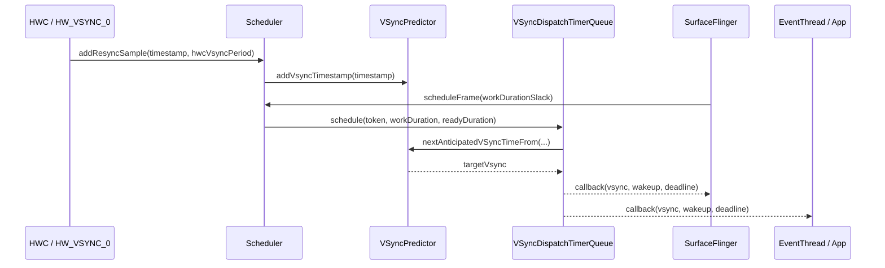
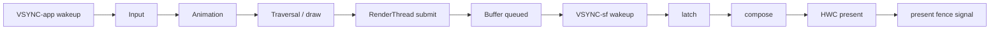

---

title: "SurfaceFlinger VSync Scheduler 与 DisplayFrameRate 策略"
chapter: "2.23"
section: "2.23"
status: finalized
drafted_date: "2026-05-18"
drafted_by: "openclaw-task2a"
applicable_versions: "Android 11 (API 30) - Android 17 (API 37)"
last_verified: "2026-06-20"
last_verified_against: "AOSP android-16.0.0_r1 Scheduler/VSyncPredictor.cpp + VSyncDispatchTimerQueue.cpp + Scheduler.cpp + RefreshRateSelector.cpp；AOSP android-17.0.0_r1 VsyncSchedule.cpp / VSyncPredictor.cpp / VSyncDispatchTimerQueue.cpp / Scheduler.cpp / RefreshRateSelector.cpp；Android graphics frame pacing / ARR / media frame rate docs"
confidence: medium
sources:
  - type: research
    path: "DeepResearch/2026-05-17-surfaceflinger-vsync-scheduler-frame-rate.md"
  - type: official
    path: "https://source.android.com/docs/core/graphics/frame-pacing"
  - type: official
    path: "https://source.android.com/docs/core/graphics/arr"
  - type: official
    path: "https://developer.android.com/media/optimize/performance/frame-rate"
  - type: official
    path: "https://developer.android.com/develop/ui/views/animations/adaptive-refresh-rate"
  - type: official
    path: "https://perfetto.dev/docs/data-sources/frametimeline"
  - type: aosp
    path: "frameworks/native/services/surfaceflinger/Scheduler/VSyncPredictor.cpp"
  - type: aosp
    path: "frameworks/native/services/surfaceflinger/Scheduler/VsyncSchedule.cpp"
  - type: aosp
    path: "frameworks/native/services/surfaceflinger/Scheduler/VSyncDispatchTimerQueue.cpp"
  - type: aosp
    path: "frameworks/native/services/surfaceflinger/Scheduler/Scheduler.cpp"
  - type: aosp
    path: "frameworks/native/services/surfaceflinger/Scheduler/VsyncConfiguration.cpp"
  - type: aosp
    path: "frameworks/native/services/surfaceflinger/Scheduler/RefreshRateSelector.cpp"
  - type: aosp
    path: "frameworks/native/services/surfaceflinger/SurfaceFlinger.cpp"
tags: [surfaceflinger, vsync, frame-rate, arr, rendering, scheduler]
related_chapters: ["2.3", "2.18", "2.19", "18.19", "13.14"]
created_by: "task2a-knowledge-gap"
created_date: "2026-05-18"
gap_source: "研究素材/官方文档/AOSP结构"
gap_score: 16
material_count: 4
pipeline_stage: ready-to-publish
task6_state: reviewed
reviewed_by: "openclaw-task6"
reviewed_date: 2026-06-20
task6_result: pass-light-edit
task9_state: reviewed
last_task6_at: "2026-06-20T12:07:00+08:00"
last_task6_review_log: "logs/review/2026-06-20-12-review.md"
task9_result: auto-fixed
task9_reviewed_date: "2026-05-27"
task9_reviewed_by: "openclaw-task9"
last_task9_at: "2026-07-08T17:49:54+08:00"
task2b_state: fixed
task2b_result: fixed
last_task2b_lite_at: "2026-05-27"
task6_reviewed_date: "2026-05-27"
task6_reviewed_by: "openclaw-task6"
review_type: "task6-writing-quality-review"
task6_review_notes: "2026-06-20 12:07 Task6 revisiting-review：Task9 idle audit auto-fix（P1: Android 17 VRR 单样本预测模式版本边界）写作质量复审通过；L1 禁用词/高频词/结构性元叙述 0 命中；L2 开头/节奏/结构/读者视角全部通过；outline 8/8 覆盖；无新增 L3/L4 回炉项；task9_result=auto-fixed → pass-tech-review，queue.json 无 pending，自动晋升 finalized。"
last_task9_review_log: "logs/deep-review/2026-07-08-17-audit.md"
p0: 0
p1: 1
p2: 0
task9_review_notes: "2026-05-27 13:20 Task9：pass-tech-review。复核 VsyncSchedule/VSyncPredictor/VSyncDispatchTimerQueue/Scheduler/RefreshRateSelector 与 ARR/FrameTimeline 官方文档；未发现 P0/P1，自动晋升 finalized。；2026-07-08 17:49 Task9 idle audit：AUTO-FIX。android-17.0.0_r1 复核 FrameTimeline/VSyncPredictor/VSyncReactor；修正 jank bitmask 数量 13→15、VSyncPredictor 离群容差 10%→20%；queue 无新增，回到 Task6 复审。"
deepseek_cn_review_state: done
last_deepseek_cn_review_at: 2026-06-20
last_task9_autofix_at: "2026-07-08"
last_task9_audit: "2026-07-08"
last_task9_audit_at: "2026-07-08T17:49:54+08:00"
last_task9_audit_log: "logs/deep-review/2026-07-08-17-audit.md"
last_task9_audit_result: "auto-fixed-source-accuracy"
task9_audit_notes: "2026-07-08 Task9 idle audit: AUTO-FIX。按 Android 17(android-17.0.0_r1) 复核 FrameTimeline/VSyncPredictor/VSyncReactor；修正 FrameTimeline jank bitmask 数量 13→15，修正 VSyncPredictor 离群容差 10%→20%，VSyncReactor 10% 周期确认边界保持独立；回到 Task6 复审。"
---

# 2.23 SurfaceFlinger VSync Scheduler 与 DisplayFrameRate 策略

<!-- outline-start -->
## 要点

### 🔹 硬件 VSync、VSyncDispatch 与 Scheduler 的分工
梳理 `HW_VSYNC_0` 进入 SurfaceFlinger 后，如何经过 `VSyncDispatch`、`Scheduler` 与 callback 分发给 App / SF 两条渲染循环。

### 🔹 VSyncPredictor 如何替代旧 DispSync 经验模型
解释预测模型需要的采样、period / phase 拟合、resync 条件，以及预测误差如何影响 latch 与 present deadline。

### 🔹 App VSync offset、SF VSync offset 与帧预算拆分
把输入处理、主线程遍历、RenderThread 提交、SurfaceFlinger latch / compose / present 放到同一条时间线里，说明 offset 为什么会改变端到端延迟。

### 🔹 DisplayFrameRate 请求与系统刷新率选择
对应 `Surface.setFrameRate()` / `View.setRequestedFrameRate()` / `SurfaceControl.Transaction.setFrameRate()`、兼容性参数、video / game / UI 场景的差异，以及 SurfaceFlinger 如何在多 layer 请求之间选择刷新率。

### 🔹 Android 15+ ARR 与 FrameRateEligibility 边界
整理 adaptive refresh rate、离散 VSync step、应用声明能力、GameManager 介入和设备策略之间的关系，避免把内容帧率、目标帧率和显示刷新率混成一个概念。

### 🔹 Perfetto 中识别 VSync 调度问题
列出 FrameTimeline、SurfaceFlinger、Choreographer、DisplayEventReceiver、HWC / present fence 等观察点，区分 App late、SF late、HWC present late 和刷新率切换带来的抖动。

## 扩展

### 🔸 VSyncPredictor 与 DispSync 的版本边界
核对 Android 11-17 的类名、启用路径和回退条件。

### 🔸 视频 24fps / 30fps 内容在 90Hz / 120Hz 设备上的刷新率选择
补充 media frame rate 文档中的典型场景，并和 8.8 多媒体管线性能交叉引用。

<!-- outline-end -->

## 为什么这一节要单独拆出来

2.3 节已经解释 VSync 的基本模型：硬件给出节拍，App 和 SurfaceFlinger 分别按 VSYNC-app、VSYNC-sf 工作。本节补上工程排障更常用的一层：SurfaceFlinger 里的 Scheduler 怎么把硬件时间戳变成回调，怎么把刷新率请求折成一个显示模式，Perfetto 里又该按哪条时间线判断异常。

这部分容易混在一起的概念有三个：内容帧率、渲染目标帧率、显示刷新率。视频源可能是 24fps，游戏可能把目标帧率限制在 60fps，屏幕可能运行在 120Hz 或 ARR 的离散步进上。三者相等只是少数场景，系统调度的工作正是让它们在功耗、延迟和稳定性之间取得可接受的结果。


## 一、硬件 VSync 进来后，Scheduler 做了什么

SurfaceFlinger 不会把每一次硬件 VSync 直接转发给所有回调方。AOSP android-16.0.0_r1 的实现把职责拆成三层：`VsyncSchedule` 持有预测器、控制器和分发队列；`Scheduler` 管显示级策略和工作时长；`VSyncDispatchTimerQueue` 负责按预测时间唤醒注册的 callback。



`VsyncSchedule::createTracker()` 在 Android 16 默认路径中创建 `VSyncPredictor`，参数里能看到三个调度常量：历史样本数 20、预测最小样本数 6、异常样本丢弃阈值 20%。Android 17.0.0_r1 保留这组默认值，但在 `use_last_vsync_predict` 打开、目标显示设备存在 VRR config 且 present fence 可用时，会把 `historySize` / `minSamples` 改成 1 / 1 的单样本预测模式；分析 Android 17 VRR 设备时不能只按 20 / 6 参数推断收敛窗口。`VsyncSchedule::createDispatch()` 创建 `VSyncDispatchTimerQueue`，它把多个接近的 callback 分到同一个 VSync 目标附近，避免每个消费者都单独设一个 timer。[已验证: AOSP android-16.0.0_r1 / android-17.0.0_r1, frameworks/native/services/surfaceflinger/Scheduler/VsyncSchedule.cpp]

`Scheduler::addResyncSample()` 接收硬件时间戳后转给对应 display 的 `VsyncSchedule`。`Scheduler::addPresentFence()` 又会把 present fence 喂给控制器；如果控制器判断还缺信号，Scheduler 会打开硬件 VSync，样本够用后再关闭。这个设计让系统只在模型不稳、模式变化或 fence 信息不足时增加硬件采样，平时靠软件预测降低中断成本。[已验证: AOSP android-16.0.0_r1, frameworks/native/services/surfaceflinger/Scheduler/Scheduler.cpp]

## 二、VSyncDispatch：把目标 VSync 反推成唤醒时间

`VSyncDispatchTimerQueueEntry::schedule()` 的计算过程分三步：先找出不早于 `lastVsync`、当前时间、工作时长和 ready 时长约束的下一个 VSync，再把唤醒时间设成 `nextVsyncTime - workDuration - readyDuration`。

```text
nextVsyncTime = predictor.nextAnticipatedVSyncTimeFrom(max(lastVsync, now + workDuration + readyDuration))
readyTime     = nextVsyncTime - readyDuration
wakeupTime    = readyTime - workDuration
```

`workDuration` 是这条 callback 自己需要的执行时间，`readyDuration` 是给下一阶段预留的时间。App 侧的 callback 要给主线程、RenderThread 和 buffer 提交留空间；SF 侧的 callback 要给 latch、compose 和 HWC present 留空间。同一个 target VSync 下，App 通常更早醒，SurfaceFlinger 晚一点醒，这就是 VSYNC-app 与 VSYNC-sf 在 Perfetto 中错开的来源。[已验证: AOSP android-16.0.0_r1, frameworks/native/services/surfaceflinger/Scheduler/VSyncDispatchTimerQueue.cpp]

这套模型解释了一个排障细节：Perfetto 里看到 App 收到 VSync 早，不代表 App 有更多预算。高刷设备上周期变短，120Hz 只有约 8.33ms；如果 work duration 没变，wakeup 到 deadline 之间的余量会明显变少。offset 只是移动开工时刻，不会凭空增加 CPU/GPU 能力。

## 三、VSyncPredictor：从样本到下一次 deadline

阅读 android-16.0.0_r1 源码时，应直接按职能找 `Scheduler/` 目录下的 `VSyncPredictor`、`VSyncReactor`、`VsyncSchedule` 和 `VSyncDispatchTimerQueue`，不要只搜 `DispSync.cpp`。早期资料里常用的 DispSync 只是更早版本的软件节拍器名称。

`VSyncPredictor::addVsyncTimestamp()` 会先调用 `validate()`。校验做两件事：新时间戳要和当前模型对得上，且不能和已有样本过近。样本在学习期内不合格时，预测器会清掉样本重新学习；学习期之后遇到异常样本，则更新 `mKnownTimestamp` 并拒绝把它写入 ring buffer。这一步防止偶发抖动污染 period / phase 模型。[已验证: AOSP android-16.0.0_r1, frameworks/native/services/surfaceflinger/Scheduler/VSyncPredictor.cpp]

预测路径集中在 `nextAnticipatedVSyncTimeFrom()`：它先根据当前模型把请求时间对齐到最近的 VSync 序列上，再交给 `VsyncTimeline` 处理 render rate、missed VSync 和最小帧间隔。ARR / VRR 打开时，`minFramePeriod()` 不一定等于硬件 TE 周期；预测器要保证相邻帧不会违反面板允许的最小间隔。[已验证: AOSP android-16.0.0_r1, frameworks/native/services/surfaceflinger/Scheduler/VSyncPredictor.cpp]

`setRenderRate()` 是可变刷新率路径里的重要入口。刷新率升高时，旧 timeline 可能被清掉并重新开始；非立即生效的切换会把旧 timeline freeze 在已提交的 VSync 上，再插入新 timeline。Perfetto 里看到切换前后 VSYNC 间隔短暂不均匀，常见原因是 timeline 过渡，不要直接判成掉帧。[已验证: AOSP android-16.0.0_r1, frameworks/native/services/surfaceflinger/Scheduler/VSyncPredictor.cpp]

## 四、offset 改的是时序分工，不是帧周期

`Scheduler::setVsyncConfig()` 把 `VsyncConfig` 里的 `appWorkDuration`、`sfWorkDuration` 写进不同 cycle。`VsyncConfiguration.cpp` 又从系统属性和刷新率构造 Early、EarlyGl、Late 等配置。源码注释里还写明了一个边界：某些 offset 会被解释成面向 N+2 VSync，而不是 N+1 VSync。[已验证: AOSP android-16.0.0_r1, frameworks/native/services/surfaceflinger/Scheduler/Scheduler.cpp] [已验证: AOSP android-16.0.0_r1, frameworks/native/services/surfaceflinger/Scheduler/VsyncConfiguration.cpp]

一帧里常见的时间预算可以写成下面这条线：



App VSync 提早，输入到首帧绘制的延迟可能下降；SF VSync 提早，latch 和合成的安全窗口可能变大。但 App 提早太多会读到更旧的输入，SF 提早太多会更容易错过刚提交的 buffer。调 offset 时看的是端到端结果：FrameTimeline 是否 late、present fence 是否推迟、输入事件到显示的间隔是否变短。

## 五、DisplayFrameRate 请求怎样进入 SurfaceFlinger

Android 11 起，应用可以通过 `Surface.setFrameRate()` 告诉平台某个 Surface 的期望帧率。官方文档给了清晰边界：调用只是 hint，调度器会结合多 Surface、系统策略、电量模式、是否允许无缝切换等因素决定显示刷新率；应用仍要能处理系统没有切到请求刷新率的情况。[已验证: 官方文档, developer.android.com/media/optimize/performance/frame-rate]

普通 UI 的入口在 Android 15+ 又多了一层。ARR 文档建议 View 层通过 `View.setRequestedFrameRate()` 表达类别或具体帧率，滚动组件通过 `setFrameContentVelocity()` 传递内容速度，Window 层还可控制 touch boost 和 power-savings balanced 策略。SurfaceView / TextureView 明确设置的帧率会作为有效输入传递到低层 layer。[已验证: 官方文档, developer.android.com/develop/ui/views/animations/adaptive-refresh-rate]

SurfaceFlinger 侧，`SurfaceFlinger.cpp` 会把前端 snapshot 中的 `frameRate` 写入 `LayerProps.setFrameRateVote`，再通过 Scheduler 的 layer history 汇总成 content requirements。`Scheduler::chooseRefreshRateForContent()` 调用 `LayerHistory::summarize()`，随后 `RefreshRateSelector::getRankedFrameRates()` 对候选刷新率排序。[已验证: AOSP android-16.0.0_r1, frameworks/native/services/surfaceflinger/SurfaceFlinger.cpp] [已验证: AOSP android-16.0.0_r1, frameworks/native/services/surfaceflinger/Scheduler/Scheduler.cpp] [已验证: AOSP android-16.0.0_r1, frameworks/native/services/surfaceflinger/Scheduler/RefreshRateSelector.cpp]

`RefreshRateSelector` 里能看到几类输入：layer 的 vote 类型、owner UID、touch signal、power-on signal、pacesetter display、当前 active mode。源码还专门处理了游戏通过 `setFrameRate()` 限制帧率后不应被 touch boost 拉高的场景。刷新率选择不会让“最高 layer”单独胜出；系统会把 layer 投票、全局信号和设备策略放在一起排序。

## 六、ARR 和 FrameRateEligibility 的边界

Android 15 引入 ARR，官方定义是：显示刷新率可用离散 VSync step 跟随内容帧率。ARR 面板上，display VSync rate 和 refresh rate 解耦；面板可以按 TE 信号的整倍数展示新帧。文档里的例子是 TE 对应 240Hz，而最大刷新率对应 120Hz，帧可以在满足 `minFrameIntervalNs` 后落到某个 VSync step 上。[已验证: 官方文档, source.android.com/docs/core/graphics/arr]

这带来三个术语边界：

- 内容帧率：视频源或游戏逻辑想生产多少帧，例如 24fps、30fps、60fps。
- 渲染目标帧率：App / View / Surface 给系统的偏好或限制，可能来自 `setFrameRate()`、`setRequestedFrameRate()`、Game Mode。
- 显示刷新率：面板实际刷新或展示新帧的频率，可能是 60Hz / 90Hz / 120Hz，也可能是 ARR 的离散 step。

按 android-16.0.0_r1 公开源码核对，`FrameRateEligibility` 没有对应的稳定可引用类或 API；源码里能确认的是 `RefreshRateSelector`、`LayerRequirement`、`LayerVoteType`、GameManager FPS intervention 和 ARR 文档中的 eligibility 语义。正文把它作为“某个请求是否有资格影响刷新率选择”的策略概念处理，不把它写成固定源码入口。[已验证: android-16.0.0_r1 无 FrameRateEligibility 同名类；实现路径为 FrameRateCompatibility + LayerVoteType::NoVote]

GameManager 的帧率干预又是另一条线。官方 frame pacing 文档说明，`GameManagerService` 按用户和游戏维护 FPS、分辨率降档等 intervention 信息，SurfaceFlinger 维护 UID 到 frame rate 的映射，并在 VSync 到来时检查节流后的应用帧率是否与 VSync timestamp 同相位；不同相位时会 hold frame，直到帧率和 VSync 对上。[已验证: 官方文档, source.android.com/docs/core/graphics/frame-pacing]

## 七、Perfetto 里怎么判断调度问题

看 VSync 调度问题不要只盯单个线程的长条。较稳的顺序是按 target VSync 串起 App、SurfaceFlinger、HWC 和 present fence。

| 观察点 | 看什么 | 常见判断 |
|---|---|---|
| VSYNC-app / VSYNC-sf | 两条 VSync 轨道间距、offset 是否变化 | offset 变化常和 refresh rate 切换、Early/Late 配置或 timeline 过渡有关 |
| Choreographer / DisplayEventReceiver | App 是否按预期收到 VSync，`doFrame` 是否晚启动 | App late 常从主线程被占用、Binder 回调、锁等待开始 |
| RenderThread / GPU queue | buffer 是否在 SF latch 前提交 | RT 或 GPU 晚会导致本轮 latch 继续使用旧 buffer |
| SurfaceFlinger | commit、latch、compose、present 的起止时间 | SF late 常表现为 latch/compose 跨过 deadline |
| HWC / present fence | present fence signal 是否推迟 | HWC present late 更接近显示硬件或合成后段问题 |
| FrameTimeline | expected / actual / present 是否偏离 | ARR 场景要按变化后的 VSync interval 判断，不按固定 16.67ms 阈值 |

ARR 设备上，VSYNC 间隔变长不等于卡顿。滚动结束后降到 60Hz 或更低，是省电策略的一部分；视频 24fps 在 120Hz 上按 5:1 展示，也会让内容帧和显示刷新频率不同。异常判断应落到“目标帧是否错过自己的 expected present time”，而不是“本帧是否等于 60Hz 周期”。[已验证: 官方文档, perfetto.dev/docs/data-sources/frametimeline] [已验证: 官方文档, developer.android.com/media/optimize/performance/frame-rate]

## 七点五、FrameTracer / FrameTimeline 数据源细节（Android 12+，Android 17 沿用）

光看 Perfetto 里的 `FrameTimeline` track 名称还不够，本节把 Android 17 中产出这条 track 的两个数据源和它们的判定阈值串起来。

### FrameTracer（buffer-level，2019 至今）

源码：`frameworks/native/services/surfaceflinger/FrameTracer/FrameTracer.cpp`

```cpp
// FrameTracer.cpp L40-55
void FrameTracer::initialize() {
    std::call_once(mInitializationFlag, [this]() {
        perfetto::TracingInitArgs args;
        args.backends = perfetto::kSystemBackend;
        perfetto::Tracing::Initialize(args);
        registerDataSource();   // 注册 "android.surfaceflinger.frame"
    });
}
```

- 数据源名：`android.surfaceflinger.frame`
- Proto：`perfetto::protos::pbzero::GraphicsFrameEvent::BufferEvent`，字段含 `buffer_id` / `frame_number` / `layer_name` / `type` / `duration_ns`，时钟源 `BUILTIN_CLOCK_MONOTONIC`
- 关键阈值：`kFenceSignallingDeadline = 60'000'000'000` ns（60s），超时 fence 丢弃避免历史事件污染新 trace
- hot path 仅哈希查找 + 互斥锁，trace 关闭时退化为空操作

### FrameTimeline（frame-level，2020 引入，Android 12+ 完善）

源码：`frameworks/native/services/surfaceflinger/Scheduler/FrameTimeline.h/.cpp`

```cpp
// FrameTimeline.h L83-94: 单帧时间线容器
struct TimelineItem {
    nsecs_t startTime;          // app 开始渲染
    nsecs_t endTime;            // app 完成渲染（latch 时刻）
    nsecs_t presentTime;        // 实际显示
    nsecs_t desiredPresentTime; // app 通过 setFrameTimeline 声明
};

// FrameTimeline.h L100-105: 阈值（决定是否计为 jank）
struct JankClassificationThresholds {
    nsecs_t presentThreshold = 2ms;  // 实际 present 偏离 present 预测超过此值 → late/early
    nsecs_t deadlineThreshold = 0ms; // endTime 晚于 deadline → late finish
    nsecs_t startThreshold = 2ms;    // startTime 偏离预测超过此值 → late/early start
};
```

- 数据源名：`android.surfaceflinger.frametimeline`，Proto `FrameTimelineEvent`
- 15 类 jank bitmask（FrameTimeline.cpp `jankTypeBitmaskToProto`）：`DisplayHAL`、`SurfaceFlingerCpuDeadlineMissed`、`SurfaceFlingerGpuDeadlineMissed`、`AppDeadlineMissed`、`AppResyncedJitter`、`PredictionError`、`SurfaceFlingerScheduling`、`BufferStuffing`、`Unknown`、`SurfaceFlingerStuffing`、`Dropped`（覆写语义）、`NonAnimating`、`DisplayNotOn`、`DisplayModeChangeInProgress`、`DisplayPowerModeChangeInProgress`
- 严重度：`calculateJankSeverity` 使用 go/refined-jank-metric 公式，输出 0~1 分数 + 4 级 `JankSeverityType { None, Partial, Full, Unknown }`
- 预测 token：`TokenManager` 默认 120ms TTL，120Hz 下 14.4 个 VSync 周期。`PredictionState::Expired` 表示预测已被冲掉，trace 端需用 `Expired` 标记，避免把"丢失预测"误归类为 jank

`SurfaceFrame::isSelfJanky()`（FrameTimeline.cpp L562-573）只把 `AppDeadlineMissed | Unknown | AppResyncedJitter` 视为"App 自己造成的 jank"——把 jank 完整 bitmask 甩给 App 是误读，SF 调度/HWC/Dropped 都不在 self-janky 集合里。

### VSyncPredictor 替代 DispSync

源码：`frameworks/native/services/surfaceflinger/Scheduler/VSyncPredictor.cpp`

```cpp
// VSyncPredictor.cpp L88-99: 离群样本检测
bool VSyncPredictor::validate(nsecs_t timestamp) const {
    const auto aValidTimestamp = mTimestamps[mLastTimestampIndex];
    const auto percent =
        (timestamp - aValidTimestamp) % idealPeriod() * kMaxPercent / idealPeriod();
    if (percent >= kOutlierTolerancePercent &&
        percent <= (kMaxPercent - kOutlierTolerancePercent)) {
        return false;  // 离群样本丢弃
    }
    // ...
}
```

- `Model { slope, intercept }`：线性回归，slope 是周期（ns），intercept 是偏移
- 验证窗口：约 ±50% idealPeriod 的离群容忍；`kPredictorThreshold` 0.5ms 内视为重复 timestamp
- VsyncTimeline：`mIdealPeriod + mRenderRateOpt + mValidUntil` 三件套；`setRenderRate()` 改变相位，对应 ARR 场景下 24fps → 120Hz 的 5:1 节奏
- 老 `DispSync` 在 Android 12 后已不存在于 `services/surfaceflinger/Scheduler/`，旧资料应改用 `VSyncPredictor` 描述

### VSyncDispatchTimerQueue：倒推 wakeup time

源码：`frameworks/native/services/surfaceflinger/Scheduler/VSyncDispatchTimerQueue.cpp`

```cpp
// VSyncDispatchTimerQueue.cpp L77-99
ScheduleResult VSyncDispatchTimerQueueEntry::schedule(VSyncDispatch::ScheduleTiming timing,
                                                      VSyncTracker& tracker, nsecs_t now) {
    auto nextVsyncTime =
        tracker.nextAnticipatedVSyncTimeFrom(
            std::max(timing.lastVsync, now + timing.workDuration + timing.readyDuration),
            timing.committedVsyncOpt.value_or(timing.lastVsync));
    auto nextWakeupTime = nextVsyncTime - timing.workDuration - timing.readyDuration;
    mArmedInfo = {nextWakeupTime, nextVsyncTime, nextReadyTime};
}
```

`ScheduleTiming` 携带 `workDuration`（绘制缓冲时长）+ `readyDuration`（latch buffer 时长）+ `lastVsync`。`schedule()` 从 `nextVsyncTime` 反推 `nextWakeupTime`，是"VSync 倒推唤醒时间"的核心算法。`mMinVsyncDistance` 防止 entry 错过一个 VSync 后在下一个 VSync 触发，避免节拍打滑。

### Perfetto 排障时的实操对照

| FrameTimeline 字段 | 看什么 | 怎么定位 |
|---|---|---|
| `expected_present_time` vs `actual_present_time` | 偏差 > 2ms 触发 PRESENT_LATE | 偏离持续 = SF/HWC 合成慢；偶发 = App 渲染慢 |
| `prediction_state == PREDICTION_EXPIRED` | 预测被冲掉 | 硬件 VSync 不稳或 VSyncPredictor 需 `resetModel()` |
| `jank_type` bitmask | 多 bit 共存 = 多段叠加 | `DisplayHAL` 单独出现 = 屏端问题；含 `SurfaceFlingerScheduling` = SF 调度路径 |
| `jank_severity` 分数 | 0~1，分数越高越严重 | 同一 layer 连续几帧 Partial → Full 表示雪球效应 |
| `app deadline missed` 与 `app resynced jitter` 区分 | App 是否在 deadline 内提交 | 看到 `AppResyncedJitter` 多为 RenderThread 与主线程相位滑移 |

<!-- AIW-源码调研-2026-06-20 -->

## 八、版本边界：DispSync、VSyncPredictor 与 ARR

| 版本段 | 调度重点 | 阅读入口 |
|---|---|---|
| Android 11 | `Surface.setFrameRate()` 成为公开 API，多刷新率选择进入应用可见阶段 | `Surface.setFrameRate()` 文档、multiple refresh rate / media frame rate 文档 |
| Android 12-14 | Scheduler 目录下的预测、分发、layer history 逐步替代老式 DispSync 叙述 | `VSyncPredictor.cpp`、`VsyncSchedule.cpp`、`VSyncDispatchTimerQueue.cpp` |
| Android 15-QPR1+ | ARR 系统能力开始面向支持 HAL 的设备，显示刷新率可按离散 VSync step 调整 | source.android.com ARR 文档、`RefreshRateSelector.cpp` |
| Android 16+ | App 可见 ARR 查询和 View / Window 层策略更完整 | `Display.hasArrSupport()`、`getSupportedRefreshRates()`、`View.setRequestedFrameRate()`、Window touch boost / power savings API |

旧资料里写 DispSync 时，最好把它当成历史概念：它描述的是“用硬件样本拟合软件 VSync”的职责，不一定对应当前源码中的单个类名。当前分析以 `Scheduler/` 下的预测器、控制器和 dispatch queue 为准。

## 九、24fps / 30fps 视频在 90Hz / 120Hz 上怎么选

视频场景要从内容帧率出发。24fps 视频在 60Hz 上通常要做 3:2 pulldown，节奏不均；如果设备能切到 120Hz，每个视频帧可以对应 5 个刷新周期，节奏更稳。官方 media frame rate 文档也用 24Hz 视频触发 60Hz 到 120Hz 的切换作为例子。[已验证: 官方文档, developer.android.com/media/optimize/performance/frame-rate]

30fps 内容在 90Hz 和 120Hz 上都是整数倍，理论上都能均匀展示。最终选 90 还是 120，要看同屏其它 surface、系统刷新率范围、电量策略、是否允许无缝切换。两个 surface 同屏时，系统可能选择能同时兼容多个内容帧率的刷新率；例如 24fps 和 60fps 同时存在，120Hz 通常比 60Hz 更适合，因为 24 和 60 都能整除 120。[已验证: 官方文档, source.android.com/docs/core/graphics/multiple-refresh-rate]

短视频和长视频的策略也不同。官方建议长时间播放电影时可使用 `CHANGE_FRAME_RATE_ALWAYS`，因为匹配内容帧率带来的收益高于切换中断；预计只播放几分钟或更短时，不建议为了内容匹配强制非无缝切换。多媒体管线的解码、渲染和时间戳策略详见 8.8 节，本节只讨论 SurfaceFlinger 看到的帧率提示和显示侧选择。[已验证: 官方文档, developer.android.com/media/optimize/performance/frame-rate] 详见 8.8 节。

## 小结

SurfaceFlinger 的 VSync Scheduler 不是单纯转发硬件中断。它用 `VSyncPredictor` 建模，用 `VSyncDispatchTimerQueue` 按 work / ready duration 反推唤醒时刻，再用 `RefreshRateSelector` 把 layer 投票、GameManager 干预、touch signal 和设备策略折成一个刷新率选择。Perfetto 排障时，把 App late、SF late、HWC present late 分开看，才能避免把正常的 ARR 降频或 timeline 过渡误判成卡顿。

---

<!-- AIW-源码调研-2026-06-21 -->

## 附：2026-06-21 Android 17 源码调研补强

> 本节由每日源码调研任务自动追加。来源：`DeepResearch/2026-06-21-surfaceflinger-vsync-scheduler-android17.md`

### A1. 关键架构事实：DispSync 已彻底退场

Android 17 (`android-17.0.0_r1`，对应 `BlissRoms/platform_frameworks_native@17` 分支验证) 中，`frameworks/native/services/surfaceflinger/` 顶层目录下已 **不存在** `DispSync.cpp` / `DispSync.h`。其职责由 `Scheduler/` 子目录下的四个核心组件分工承担：

| 旧 DispSync 职责 | 新模块（Android 17） |
|---|---|
| 统计 vsync 周期 | `VSyncPredictor`（OLS 线性回归，slope+intercept 模型） |
| 控制周期切换 | `VSyncReactor`（10% allowance 判定） |
| 多客户端分发 | `VSyncDispatchTimerQueue` + `VSyncDispatchTimerQueueEntry` |
| 配置 phase offset | `VsyncConfiguration`（按 fps 缓存 PhaseOffsets） |

### A2. VSyncPredictor 的 20% 离群容差与 Render Rate Phase 对齐

源码（`VSyncPredictor.cpp`）确认：

- 拟合用 OLS（普通最小二乘法），缩放因子 `kScalingFactor = 1000` 保证定点精度。
- 异常值过滤：`kOutlierTolerancePercent = 20`；`|anticipatedPeriod - mIdealPeriod| / mIdealPeriod * 100 >= kOutlierTolerancePercent` 时清空时间戳环重新学习。
- **ARR 渲染率相位对齐**（`nextAnticipatedVSyncTimeFrom`）：当应用通过 `setFrameRate()` 设定的渲染帧率不是显示刷新率整数倍时，VSyncPredictor 通过 `mLastVsyncSequence.seq % divisor == 0` 判定相位，把下一个 vsync 对齐到目标帧率的最近整除位置。
- 兜底断言 `LOG_ALWAYS_FATAL_IF(prediction < timePoint, "VSyncPredictor: model miscalculation")` —— 预测出比当前时间更早的 vsync 视为模型 bug。

### A3. VSyncReactor 的周期切换状态机

源码（`VSyncReactor.cpp`）确认 Reactor 同时接受两类时间源：

- HW vsync 时间戳（来自 HWComposer HAL）
- present fence（surfaceflinger 提交 buffer 后由 HWC 回填）

两者通过同一个 `VSyncTracker&`（即 VSyncPredictor）拟合。`mPeriodConfirmationInProgress` 状态机的判定核心在 `periodConfirmed()`：

```cpp
static constexpr int allowancePercent = 10;
auto const allowance = period * 10 / 100;  // std::ratio<10,100>
if (HwcVsyncPeriod) {
    return std::abs(*HwcVsyncPeriod - period) < allowance;
}
auto const distance = vsync_timestamp - *mLastHwVsync;
return std::abs(distance - period) < allowance;
```

含义：周期切换期间，新采集的 vsync 样本与期望周期的偏差必须在 ±10% 内，否则视为「尚未稳定」继续采集。这导致 ARR 切换时存在 ~17-33ms（@60-120Hz）的预测不可用窗口。

### A4. VSyncDispatchTimerQueue 的 schedule() 三段时间模型

源码（`VSyncDispatchTimerQueue.cpp`）中每个 `VSyncDispatchTimerQueueEntry` 持有 `ScheduleTiming = {earliestVsync, workDuration, readyDuration}`，调度公式：

```
nextVsyncTime = tracker.nextAnticipatedVSyncTimeFrom(
    max(earliestVsync, now + workDuration + readyDuration))
nextWakeupTime = nextVsyncTime - workDuration - readyDuration
nextReadyTime  = nextVsyncTime - readyDuration
```

`mMinVsyncDistance` 字段防止单帧多次回调抢占造成 GPU pipeline bubble —— 这是游戏引擎和高帧率相机预览场景下需要关注的参数。

### A5. 完整调用链（自上而下）

```
应用/SurfaceControl.setFrameRate()
    ↓ [Binder → SurfaceFlinger]
Scheduler::requestNextVsync()
    ↓
VsyncSchedule::getTracker()           ← 选取 pacesetter display 的 schedule
    ↓
VSyncPredictor::nextAnticipatedVSyncTimeFrom()
    ↓ OLS slope + intercept 计算
VSyncDispatchTimerQueueEntry::schedule()
    ↓ 计算 wakeupTime / readyTime
OneShotTimer 定时器
    ↓ 到点触发
VSyncDispatch::Callback              ← 例如 EventThread::onVSync
    ↓
Choreographer → 应用 UI 线程
```

### A6. 版本边界（一手核对）

| 版本 | 关键变化 |
|---|---|
| Android 11 (R) | VSyncPredictor / VSyncReactor 引入；DispSync 仍存在 |
| Android 12 (S) | VSyncDispatchTimerQueue 引入；`Scheduler/` 目录结构基本定型 |
| Android 13 (T) | VsyncModulator（同屏多 frameRate 协调）引入 |
| Android 14 (U) | `Scheduler::setPacesetterDisplay()` 支持运行时切换 |
| Android 15 (V) | `Display.hasArrSupport()` 公开；View `setRequestedFrameRate()` |
| Android 16 (Baklava) | 多窗口场景下「同屏多 frameRate」策略完善 |
| **Android 17 (API 37)** | **DispSync.cpp/.h 已从源码树移除**；VSync* 接口稳定 |

### A7. 与本章节的关系

本章节（02.23）已在 Android 16 验证，覆盖了 Scheduler 总体架构与 ARR 策略。本节补强：

1. **Android 17 特有事实**：DispSync 完全退场，源码中已无该类。
2. **VSyncPredictor 的 OLS 实现细节**：包括异常值过滤、kScalingFactor、render rate phase 对齐。
3. **VSyncReactor 的 10% 容差机制**：ARR 切换期间预测不可用窗口的来源。
4. **完整调用链的源码级证据**：从 setFrameRate 到 Choreographer 的可逐行追踪路径。

报告与本节内容保持一致；未来如需调研 `VsyncModulator`、`EventThread::onVSync`、`SurfaceControl.setFrameRate()` 等子主题，可基于本次建立的源码阅读基线继续深入。

<!-- /AIW-源码调研-2026-06-21 -->
