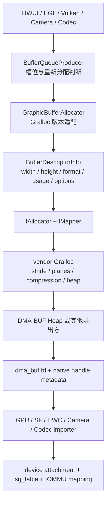

# 2.24 Android 17 图形内存分配边界：DMA-BUF、Gralloc 与 16KB Page

“16KB 设备上的图形缓冲区也按 16KB 对齐”只描述了部分事实。Android 图形内存从逻辑尺寸走到 GPU、显示控制器或相机 ISP，要经过多种相互独立的粒度：

- ELF `PT_LOAD` alignment；
- APK 中未压缩 `.so` 的 ZIP alignment；
- CPU kernel base page size；
- DMA-BUF Heap 对分配长度的页对齐；
- Gralloc 的 stride、plane、压缩块与 metadata 布局；
- IOMMU 域支持的映射页大小；
- GPU MMU、DPU、codec、camera 等硬件自身的布局约束。

其中前两项决定原生代码能否可靠装载，第三和第四项影响通用内存管理，后几项决定设备如何访问图形缓冲区。它们的数值可能恰好都是 16KB，但控制来源并不相同。

下文的用户空间实现按 Android 17 / API 37 的 `android-17.0.0_r1` 核对，内核实现以 `android17-6.18-2026-06_r6` 为边界。厂商 Gralloc、GPU、Composer HAL、Camera HAL 与显示驱动不在 AOSP 通用实现内，涉及具体布局和收益时必须补充设备证据。

## 一、图形缓冲区分配经过哪些层

BufferQueue 管理槽位、缓冲区引用、队列状态和围栏。它会判断某个槽位是否需要新的 `GraphicBuffer`，但不会自行决定安全内存堆、压缩格式或物理页布局。布局选择发生在分配器、映射器及其厂商实现中。

下面的图用于标出每一层能证明的范围：



箭头表示一种常见控制关系，不表示所有厂商 Gralloc 都直接调用 AOSP `libdmabufheap`。DMA-BUF 是共享对象框架，DMA-BUF Heap 是一种标准分配前端；GPU GEM、相机驱动或厂商私有导出方也可以生成 dma-buf。

### 1.1 BufferQueue 何时触发重新分配

Android 17 `BufferQueueProducer::dequeueBuffer()` 会检查 slot 中的 `GraphicBuffer`。对象为空，或宽高、format、layer count、usage 不再兼容时，会设置 `BUFFER_NEEDS_REALLOCATION` 并创建新 buffer。扩展分配 flag 生效时，additional options generation 变化也会触发 reallocation。

尺寸和用途保持兼容时，槽位可以继续持有同一个 `GraphicBuffer`。这种复用属于 BufferQueue 对象生命周期。厂商分配器是否在释放后缓存后备存储，属于另一层策略。

### 1.2 Android 17 的 Gralloc 接口边界

Android 17 框架仍保留 Gralloc 2/3/4/5 包装层，以适配多代厂商 HAL。当前稳定版 AIDL `IAllocator` 包含：

- `allocate2(BufferDescriptorInfo, count)`；
- `isSupported()`；
- `getIMapperLibrarySuffix()`；
- `isMultiViewSupported()` / `allocateMultiView()`。

旧的 `allocate(byte[] descriptor, count)` 仍在接口中。注释规定：Allocator V2 与 `AIMAPPER_VERSION_5` 配合时，由 `allocate2()` 取代；设备仍使用 Graphics Mapper 4 时，还要实现旧入口。因此，Android 17 并非只使用 `allocate2()`。

`BufferDescriptorInfo` 提供：

- `width`、`height`、`layerCount`；
- `format`、`usage`；
- `reservedSize`；
- `additionalOptions`。

`width` 是请求的像素列数，AIDL 注释明确允许行 padding。`additionalOptions` 用于影响分配方式的扩展项，官方示例是 surface compression level；allocator 必须拒绝无法识别的 option。AOSP 没有定义通用的 “16KB GraphicBuffer alignment” option。

### 1.3 AOSP 的 size 只是估算

Android 17 `GraphicBufferAllocator` 分配成功后，用 `stride × height × bytesPerPixel` 记录大小，并在转储中明确标记为 `estimate`。多平面 YUV、实现定义格式、压缩元数据、保留区域与私有布局都可能让该估算偏离实际分配量。

因此，下面几组数字不能互相替代：

| 数字 | 表示什么 |
|---|---|
| `width × height × bpp` | 紧密排布下的逻辑像素量 |
| `stride × height × bpp` | 部分简单格式的框架估算 |
| Mapper plane layout | vendor 暴露的行跨度、plane 与 subsampling metadata |
| dma-buf size | exporter 创建的共享对象大小 |
| 物理页总量 | 导出方为对象持有的后备页，可能还有实现开销 |
| 进程 PSS/RSS | 进程映射的统计视角，不能直接代表全局唯一物理占用 |

## 二、Android 17 的 `libdmabufheap` 已没有 ION fallback

Android 12 GKI 2.0 以 DMA-BUF Heaps 取代 ION 作为 GKI 分配框架。迁移阶段的官方文档和旧版 `libdmabufheap` 支持：先尝试 `/dev/dma_heap/<name>`，失败后按映射回退 ION。

这个历史行为不能继续套到 Android 17。`android-17.0.0_r1` 的 [`BufferAllocator.cpp`](https://android.googlesource.com/platform/system/memory/libdmabufheap/+/android-17.0.0_r1/BufferAllocator.cpp) 已明确标记：

- ION support removed；
- `Alloc()` 打开目标 DMA-BUF Heap，失败就返回错误；
- 带 `legacy_align` 的重载仅为二进制兼容保留，内部转到现代 `Alloc()`；
- `MapNameToIonHeap()` 不再建立映射；
- `CheckIonSupport()` 固定返回 false。

因此，`legacy_align` 不能作为 Android 17 DMA-BUF 分配的 16KB 对齐证据。

### 2.1 `AllocSystem()` 只选择通用内存堆

`AllocSystem(cpu_access_needed, len, flags)` 在不需要 CPU 访问时，会优先尝试 `system-uncached`；设备没有该内存堆时改用 `system`。需要 CPU 访问时直接使用 `system`。

这只是 `libdmabufheap` 的通用入口。Gralloc 仍可依据用途、protected content、格式和硬件要求选择其他厂商内存堆。`/dev/dma_heap/system` 存在，也不能证明所有 GraphicBuffer 都从它分配。

### 2.2 通用库没有缓冲区池

Android 17 的 `BufferAllocator::Alloc()` 负责打开并缓存内存堆文件描述符，再执行一次 `DMA_HEAP_IOCTL_ALLOC`；它不会缓存已经分配的 dma-buf 供下一次复用。常见的缓冲区池可能位于：

- BufferQueue slot；
- EGL/Vulkan swapchain；
- ImageReader、MediaCodec 或 Camera HAL；
- vendor allocator；
- 业务自己的 HardwareBuffer 池。

定位复用问题时，要先确定缓冲区池的所有者，不能用 `libdmabufheap` 的名字代替对象生命周期证据。

## 三、16KB 内核页怎样作用于 DMA-BUF Heap

在 `android17-6.18-2026-06_r6` 中，通用入口 [`dma_heap_buffer_alloc()`](https://android.googlesource.com/kernel/common/+/refs/tags/android17-6.18-2026-06_r6/drivers/dma-buf/dma-heap.c) 先校验 flags，再执行：

```text
len = __PAGE_ALIGN(len)
```

这段代码确保所有内存堆分配从页边界开始并在页边界结束。在 16KB 内核上，内核页大小是 16KB，请求长度会向上取整到 16KB 的整数倍。长度为 0 会返回 `-EINVAL`。

该结论只覆盖传给 DMA-BUF Heap 的 `len`。在到达这里之前，Gralloc 往往已经把逻辑像素需求转换成包含行跨度、plane、压缩元数据和实现对齐的分配长度。

### 3.1 系统内存堆不要求整块物理连续

通用 [`system_heap.c`](https://android.googlesource.com/kernel/common/+/refs/tags/android17-6.18-2026-06_r6/drivers/dma-buf/heaps/system_heap.c) 尝试用多种阶数的页面组成缓冲区，最终建立 `sg_table`。它可以包含多个分散聚合条目，不承诺整个缓冲区物理连续。

在 16KB kernel 上，最低 order 对应 16KB base page。实现仍可能优先申请更大的 compound page，再用较小页面补足。secure、camera、video 或连续内存 heap 可以采用不同策略，不能从 system heap 推导它们。

### 3.2 DMA-BUF 文件描述符共享对象，不复制像素

heap ioctl 返回的 fd 引用一个 `struct dma_buf`。`GraphicBuffer::flatten()` 把尺寸、stride、format、usage、generation number 等元数据写入扁平数据，并把 native handle 的 fd 放入单独 fd 数组。接收进程的 `unflatten()` 再调用 Mapper import。

Binder 会在接收进程安装指向同一内核文件对象的文件描述符；整数编号通常不同，后备存储不会因跨进程导入而自动复制。不同设备的导入方仍需建立附加关系和 DMA 映射，这些映射有独立的生命周期和成本。

## 四、16KB page 不决定 Gralloc layout

可以把影响图形 buffer 的粒度按责任层排列：

| 粒度 | 谁决定 | 16KB kernel 能否直接决定 |
|---|---|---|
| 逻辑宽高 | producer / API | 不能 |
| stride / plane offset | vendor Gralloc / format metadata | 不能 |
| 压缩 block 与 metadata | GPU/display format 与 vendor Gralloc | 不能 |
| DMA-BUF 分配尾部 | DMA-BUF Heap 通用入口及导出方 | 通用入口按内核页对齐 |
| backing page 组合 | heap exporter | 受 base page 影响，策略仍由 exporter 决定 |
| IOVA 映射页大小 | IOMMU domain / driver | 不等同于 CPU base page |
| GPU page table | vendor GPU MMU / driver | 设备相关 |
| HWC plane 能否读取 | display controller、format、modifier、带宽 | 设备相关 |

Android 17 内核的 IOMMU 核心从 `domain->pgsize_bitmap` 选择硬件支持且满足地址、长度对齐的映射页大小。16KB CPU 内核不会把所有 IOMMU 域强制成单一的 16KB 映射粒度。

### 4.1 一个数值示例

假设只为了说明数量级，有一块紧密排布的 1000 × 1000 RGBA8888：

```text
logical bytes = 1000 × 1000 × 4 = 4,000,000
4KB round-up  = 4,001,792
16KB round-up = 4,014,080
```

两种页大小在这个假设下相差 12,288 bytes。可实际 Gralloc 可能把 stride 补到 1024 pixels，此时未压缩像素区域已变成 4,096,000 bytes；它还可能使用 tile/compression、附加 metadata 或不同 plane。页尾差异只是总布局的一部分。

对多张小 buffer、小 mmap 或大量独立 metadata 区域，16KB 页尾浪费可能累积。对数 MiB 的主图形 buffer，stride、format、buffer count、压缩和复用策略常常更值得先查。

## 五、16KB 应用兼容与图形内存是两类问题

Android 15 起，AOSP 支持 16KB 页大小设备。应用只要直接使用 NDK 库，或通过 SDK 间接携带 `.so`，就要处理：

1. ELF `LOAD` segment 的 16KB alignment；
2. APK/AAB 内未压缩 `.so` 的 16KB ZIP alignment；
3. 代码里硬编码 `4096` / `PAGE_SIZE` 的逻辑；
4. `mmap()`、共享内存和其他要求页对齐的参数。

Google Play 自 2025 年 11 月 1 日起要求：提交到 Play、面向 Android 15（API 35）及以上设备的新应用和现有应用更新必须支持 16KB page size。该要求见 [Android Developers 官方说明](https://developer.android.com/guide/practices/page-sizes)。

这项要求不能证明应用的 GraphicBuffer 行跨度已经变成 16KB，也不能证明帧率会提高。它约束的是安装、链接、装载与运行时页大小假设的兼容性。

### 5.1 Android 17 的兼容模式边界

16KB 内核可以为部分按 4KB 对齐的应用启用页大小兼容模式。Android 17 还允许把兼容模式设为 `fatal`，让不兼容二进制立即终止，便于测试：

```bash
adb shell setprop bionic.linker.16kb.app_compat.enabled fatal
adb shell setprop pm.16kb.app_compat.disabled true
```

这组命令用于验证原生二进制兼容性，不是图形内存性能开关。执行前应使用测试设备，并在测试完成后恢复产品默认属性。

### 5.2 版本演进

| 版本 | 相关变化 | 阅读边界 |
|---|---|---|
| Android 12 | GKI 2.0 以 DMA-BUF Heaps 取代 ION 分配框架 | 迁移文档中的 ION 回退属于当时的兼容路径 |
| Android 15 | AOSP 支持构建 16KB page-size 系统与 16KB ELF alignment | 不代表所有 Android 15 设备都运行 16KB kernel |
| Android 16 | 平台构建可用 `PRODUCT_CHECK_PREBUILT_MAX_PAGE_SIZE` 检查预编译 ELF | 这是构建检查，不改变 GraphicBuffer 语义 |
| Android 17 | `libdmabufheap` 的 ION 实现已移除；16KB backcompat 可设为 fatal；allocator AIDL 含 multiview 接口 | vendor Gralloc 和设备硬件布局仍需实机核对 |

## 六、从 Surface 到内核的证据怎么收集

排查时应分三组取证：页大小/二进制、图形对象、内核共享对象。不能把三组数据混成一个图形内存数字。

### 6.1 确认页大小与 App 兼容

下面的命令分别检查运行时 page size、ELF segment 与 APK ZIP alignment：

```bash
adb shell getconf PAGE_SIZE
readelf -lW libexample.so
zipalign -c -P 16 -v 4 app.apk
```

`getconf` 返回 `16384` 才说明设备当前运行在 16KB 页大小环境。`readelf` 要检查 `LOAD` segment alignment；`zipalign` 检查包内未压缩原生库的存放边界。三项通过仍不能替代 16KB 实机功能测试。

### 6.2 确认缓冲区所有者与复用

建议记录：

- Surface / 图层名称与编号；
- producer、consumer 与所在进程；
- BufferQueue slot、frame number、dequeue/queue/acquire/release；
- width、height、stride、format、usage、buffer ID；
- 重新分配前后的尺寸或用途变化；
- acquire/release fence；
- BufferQueue 深度与在途缓冲区数量。

三类常见的所有权关系如下：

- EGL/Vulkan 交换链由应用渲染循环生产；
- Camera 多输出分别由 preview、analysis、record consumer 持有；
- 视频使用 SurfaceView 与 TextureView 时，会形成不同的图层和采样拓扑。

相同数量的缓冲区，在三种拓扑中会有不同的所有者、复用点和释放条件。

### 6.3 确认内存堆与 dma-buf

可用入口受构建类型、SELinux 和权限限制：

```bash
adb shell ls -l /dev/dma_heap
adb shell ls -l /proc/1234/fd
adb shell cat /sys/kernel/debug/dma_buf/bufinfo
adb shell ls /sys/kernel/dmabuf/buffers
```

把示例中的 `1234` 换成目标进程 PID。release/user 设备常会拒绝访问 debugfs 或其他进程的文件描述符。权限失败本身不表示 dma-buf 异常，也不应为了普通线上采样临时放宽 SELinux。

收集到 dma-buf 大小后，还要按 inode 或唯一对象去重。多个进程导入同一缓冲区会出现多个文件描述符和映射视角，不能把每个进程看到的大小直接相加成物理内存。

### 6.4 Perfetto 与 dumpsys 看什么

`dumpsys SurfaceFlinger`、Winscope 和 Perfetto 更适合回答生命周期与时序问题：

- resize、format/usage change 是否触发 reallocation；
- 缓冲区是否长期占满槽位；
- 数据生产方是否等待空闲槽位或释放围栏；
- 消费方是否持有图像或编解码缓冲区过久；
- SF 是否因获取围栏未就绪而沿用旧缓冲区；
- GPU/Camera/HWC 是否出现 IOMMU fault、reclaim、PSI memory 或带宽压力。

`GraphicBufferAllocator` 的 atrace 分配记录与转储估算可用于定位分配事件和请求者，不能单独证明厂商内存堆、压缩格式或实际物理页数。

## 七、常见错误结论

### 16KB 内核会让所有 GraphicBuffer 行跨度变成 16KB 倍数

行跨度由格式及分配器/硬件布局决定。内核负责对 DMA-BUF Heap 的最终分配长度做页边界处理。

### dma-buf 文件描述符跨 Binder 会复制整张图

Binder 传输句柄元数据和文件描述符引用。接收端需要导入，像素后备存储仍是同一个共享对象。

### 看到 `/dev/dma_heap/system` 就能确定 Gralloc 使用它

该节点只证明内存堆存在。目标缓冲区需要结合分配器或厂商跟踪、dma-buf 导出方和名称、用途及设备文档判断。

### Android 17 的 `libdmabufheap` 打不开内存堆会回退 ION

精确标签中的 ION 实现已移除，打开失败会直接返回错误。官方迁移文档描述的是历史兼容机制。

### 16KB 兼容通过，图形性能一定更好

ELF/APK 对齐通过只证明一部分可运行性。图形性能还受 buffer count、layout、GPU/DPU 访问、IOMMU、cache maintenance、composition 与内存带宽影响。

### 进程里有三份 10MiB 映射，就占了 30MiB 物理图形内存

同一个 dma-buf 可以被多个进程映射。应先按共享对象去重，再区分后备存储、页表、IOMMU 映射和逐进程统计。

## 八、源码阅读顺序

1. [`BufferQueueProducer.cpp`](https://android.googlesource.com/platform/frameworks/native/+/android-17.0.0_r1/libs/gui/BufferQueueProducer.cpp)：查看槽位复用与重新分配条件；
2. [`GraphicBufferAllocator.cpp`](https://android.googlesource.com/platform/frameworks/native/+/android-17.0.0_r1/libs/ui/GraphicBufferAllocator.cpp)：查看 Gralloc 适配与大小估算；
3. [`Gralloc5.cpp`](https://android.googlesource.com/platform/frameworks/native/+/android-17.0.0_r1/libs/ui/Gralloc5.cpp)：看 `AllocationRequest` 怎样进入 `BufferDescriptorInfo` 与 `allocate2()`；
4. [`IAllocator.aidl`](https://android.googlesource.com/platform/hardware/interfaces/+/android-17.0.0_r1/graphics/allocator/aidl/android/hardware/graphics/allocator/IAllocator.aidl)：查看 Allocator V2、Mapper 与多视图接口边界；
5. [`GraphicBuffer.cpp`](https://android.googlesource.com/platform/frameworks/native/+/android-17.0.0_r1/libs/ui/GraphicBuffer.cpp)：查看句柄传输、扁平化/还原与 Mapper 导入；
6. [`BufferAllocator.cpp`](https://android.googlesource.com/platform/system/memory/libdmabufheap/+/android-17.0.0_r1/BufferAllocator.cpp)：看 Android 17 DMA-BUF Heap 与 ION 边界；
7. [`dma-heap.c`](https://android.googlesource.com/kernel/common/+/refs/tags/android17-6.18-2026-06_r6/drivers/dma-buf/dma-heap.c)：查看分配长度的页对齐；
8. [`system_heap.c`](https://android.googlesource.com/kernel/common/+/refs/tags/android17-6.18-2026-06_r6/drivers/dma-buf/heaps/system_heap.c)：查看后备页与 sg 表；
9. [`iommu.c`](https://android.googlesource.com/kernel/common/+/refs/tags/android17-6.18-2026-06_r6/drivers/iommu/iommu.c)：查看 IOMMU 域独立的页大小位图。

## 小结

Android 17 图形内存分析要守住三层边界：

- App 16KB 兼容关注 ELF、APK 和代码中的页大小假设；
- Gralloc 关注 descriptor、stride、plane、压缩、usage 与 heap 选择；
- kernel 关注 DMA-BUF allocation、backing pages、attachment、sg table 和 IOMMU mapping。

16KB 内核会改变通用页粒度，并让 DMA-BUF Heap 的长度按对应页边界取整；它不会统一厂商图形布局。可靠结论应同时记录缓冲区所有者、format/usage、实际 dma-buf 对象、设备分配器和驱动版本，以及逐帧跟踪数据。
