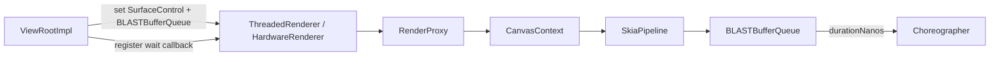
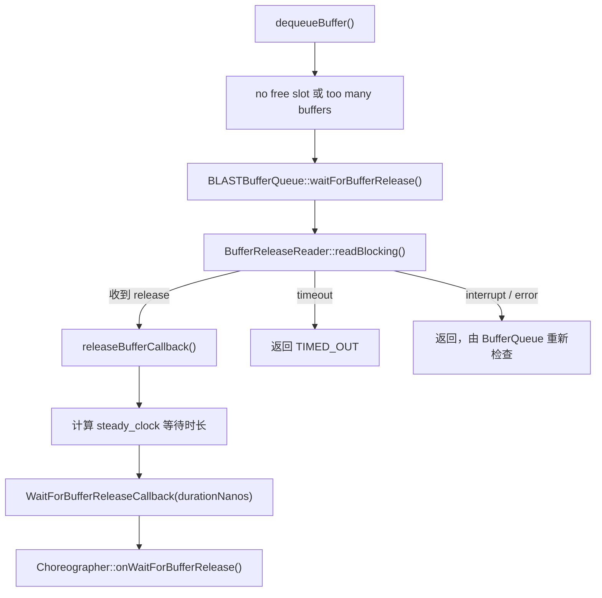

# 2.25 Choreographer Buffer Stuffing Recovery 与帧节拍修正

Buffer stuffing 描述的是 producer 已经占用或提交了过多 buffer，而 consumer 还没及时归还可写 buffer。下一次 `dequeueBuffer()` 找不到 free slot 时，producer 会等待 release。一次较长等待不仅拖慢当前提交，还可能让后续动画继续沿着已经落后的帧时间推进。

Android 16 在 `Choreographer` 中加入 Buffer Stuffing Recovery：收到“等待 buffer release”信号后，先主动放弃一次帧 callback，再在恢复期调整传给 FrameData/FrameCallback 的时间线。Android 17 保留这条主线，并加入受 flag 控制的多次恢复与累计延迟上限。

这套机制不增加 BufferQueue slot，不主动释放 buffer，也不修复 GPU、SurfaceFlinger 或 HWC。它处理的是等待发生后的 App 帧节拍。

## 一、适用范围

Android 17 中可以完整确认的注册路径属于标准 HWUI App Window：



`ViewRootImpl::updateRendererSurfaceControlAndBbq()` 把 `mChoreographer::onWaitForBufferRelease` 注册给 `ThreadedRenderer`。callback 经 JNI、`RenderProxy`、`CanvasContext` 和 `SkiaPipeline` 传到对应的 `BLASTBufferQueue`。

这项边界很重要：

- 标准硬件加速窗口有明确注册路径；
- 使用应用主 Choreographer 不代表任意 Surface 都接入这条 callback；
- 独立 SurfaceView、Camera/Codec producer、引擎自有 EGL/Vulkan swapchain 可能形成自己的 render loop 和 BufferQueue；
- 未接入 callback 的 producer 仍可能 queue-stuffing，只是不会依靠这套 Choreographer 状态机恢复。

诊断时应先确认画面由谁 acquire、render、present，再判断它是否受主线程 Choreographer 驱动。trace 中出现 `eglSwapBuffers()` 或 `dequeueBuffer()`，不能证明主 Choreographer 已收到 stuffing signal。

## 二、等待信号从哪里产生

### 2.1 BufferQueue 为什么会等待

`BufferQueueProducer::waitForFreeSlotThenRelock()` 统计 dequeued/acquired buffer，并寻找 free buffer 或 free slot。出现以下任一情况时，producer 可能需要等待：

- 没有 free buffer/slot；
- outstanding buffer 数量超过当前允许范围；
- consumer 暂时多 acquire 一块用于原子 acquire/release；
- release fence、SurfaceFlinger 或下游显示消费延迟，导致旧 buffer 还不能复用。

对于 cannot-block 或 async mode 的部分组合，调用会返回 `WOULD_BLOCK`；普通阻塞路径进入 `waitForBufferRelease()`。这说明“没有 free buffer”是触发条件，不能把每一次 dequeue 时长都归为 stuffing。

### 2.2 BLAST 通过释放通道等待

Android 17 的 BLAST producer 覆盖了 `BufferQueueProducer::waitForBufferRelease()`。运行关系如下：



BLAST 在解锁 BufferQueue mutex 后阻塞读取 `BufferReleaseChannel`。成功收到 release 消息时，它先执行 `releaseBufferCallback()`，再用 `steady_clock` 计算从进入等待到收到 release 的持续时间，最终调用已注册的 callback。

超时路径直接返回 `TIMED_OUT`，interrupt/error 路径让 BufferQueue 重新检查状态；这两条分支不会按成功 release 的路径报告 duration。因此，`onWaitForBufferRelease()` 不是所有 dequeue 失败的统一通知。

源码入口：

- [`BLASTBufferQueue.cpp`](https://android.googlesource.com/platform/frameworks/native/+/android-17.0.0_r1/libs/gui/BLASTBufferQueue.cpp)
- [`BufferQueueProducer.cpp`](https://android.googlesource.com/platform/frameworks/native/+/android-17.0.0_r1/libs/gui/BufferQueueProducer.cpp)

## 三、`onWaitForBufferRelease()` 只设置触发位

Android 17 `Choreographer.onWaitForBufferRelease(durationNanos)` 的判断很短：

```text
if durationNanos > mLastFrameIntervalNanos / 2:
    isStuffed = true
```

这段伪代码用于说明阈值，不表示它会读取 BufferQueue depth。`isStuffed` 是 `AtomicBoolean`，因为等待发生在 RenderThread/图形路径，后续恢复判断在 Choreographer 所在的 Looper 线程执行。

阈值跟最近一帧 interval 变化：

| 帧间隔 | 半帧阈值约为 |
|---:|---:|
| 16.67ms（60Hz/60fps 节拍） | 8.33ms |
| 11.11ms（90Hz/90fps 节拍） | 5.56ms |
| 8.33ms（120Hz/120fps 节拍） | 4.17ms |

表格只用于理解量级。实际判断使用 VSync event 更新的 `mLastFrameIntervalNanos`，而显示刷新率、App render rate 和 ARR 下的 frame interval 需要结合具体 trace。

该方法不会记录 layer、slot、buffer ID 或等待原因。它只告诉下一次 `doFrame()`：之前有一段足够长的 buffer release wait，需要评估节拍恢复。

## 四、Android 17 状态机有哪些字段

`BufferStuffingState` 包含：

| 字段 | Android 17 含义 |
|---|---|
| `isStuffed` | 是否收到新的较长等待信号 |
| `isRecovering` | 当前是否处于恢复期 |
| `numberWaitsForNextVsync` | 恢复期间主动或被动多等待了多少次 VSync |
| `accumulatedDelayNanos` | 本轮动画因 `DELAY_FRAME` 累积的延迟 |
| `MAX_BUFFER_STUFFING_DELAY_NS` | 100ms 累计延迟上限，只有 threshold flag 打开时参与限制 |

恢复动作有三种：

- `NONE`：本帧不做恢复动作；
- `DELAY_FRAME`：本轮 callbacks 不执行，安排下一次 VSync；
- `OFFSET`：把用于首次 `FrameData.update()` 的 frame time 减去一个 frame interval。

`numberWaitsForNextVsync` 统计的是帧调度等待，不是等待的 buffer 数；`accumulatedDelayNanos` 也不是 producer 在 `dequeueBuffer()` 中阻塞的总时长。

## 五、`DELAY_FRAME` 与 `OFFSET` 怎样工作

### 5.1 首次检测：主动空出一帧

下一次 `doFrame()` 调用 `updateBufferStuffingState()`。在基础分支中，如果尚未 recovering 且 `isStuffed` 为 true：

1. 原子清除 `isStuffed`；
2. 设置 `isRecovering=true`；
3. 开始名为 `Buffer stuffing recovery` 的 async trace；
4. 返回 `DELAY_FRAME`。

`doFrame()` 收到 `DELAY_FRAME` 后：

```text
numberWaitsForNextVsync += 1
accumulatedDelayNanos += frameIntervalNanos
scheduleVsyncLocked()
return
```

本轮 input、animation、traversal、commit callbacks 都不会运行。空出一个目标周期，为 consumer release 和队列深度下降留时间，但源码没有在这里直接读取“已经释放了几块 buffer”。

### 5.2 恢复期间：调整 callback 时间

处于 recovering 且尚未检测到 idle 时，状态机返回 `OFFSET`。`doFrame()` 先执行：

```text
offsetFrameTimeNanos = frameTimeNanos - frameIntervalNanos
FrameData.update(offsetFrameTimeNanos, vsyncEventData)
```

`FrameCallback` 与 `VsyncCallback` 从 `FrameData` 获得这一时间值及候选 timeline。原始 `intendedFrameTimeNanos` 仍保留给 `FrameInfo`/jank tracking；若主线程已经晚了至少一个 interval，后续 jitter resync 会重新选 timeline，并在 recovering 时再次减去一个 interval。

因此，“OFFSET 把系统 VSync 提前”是不成立的。硬件 VSync、Dispatch callback 和真实 present time 都没有被改写；变化位于 App 对本轮 frame time/timeline 的解释。

### 5.3 什么时候退出恢复

Android 17 使用：

```text
totalFrameDelays = numberWaitsForNextVsync + 1
vsyncsSinceLastCallback =
    (frameTimeNanos - mLastNoOffsetFrameTimeNanos) / mLastFrameIntervalNanos

if vsyncsSinceLastCallback > totalFrameDelays:
    reset recovery
```

`+1` 表示自然等待下一次 VSync 的预期间隔。若自上次未偏移 callback 以来的空闲间隔比预期等待更长，状态机会认为动画已经 idle，结束 async trace 并清空状态。

frame time 回退或 `FPSDivisor` 要求跳过当前帧时，`doFrame()` 还会安排下一次 VSync；recovering 期间，这些额外等待会增加 `numberWaitsForNextVsync`，避免退出条件把调度主动跳过误判成动画 idle。

## 六、Android 17 的两个 feature flag

Android 17 `view_flags.aconfig` 定义：

- `buffer_stuffing_multi_recovery`
- `buffer_stuffing_recovery_threshold`

它们都是 runtime/build 配置的一部分，不能只凭 API 37 推断设备取值。

### 6.1 Multi-recovery

flag 关闭时，一段 recovering 动画只在首次检测到 stuffing 时返回一次 `DELAY_FRAME`；直到 idle reset，新的 `isStuffed` 不会再次触发主动 delay。

flag 打开时，每次收到新的 stuffing 信号都可返回 `DELAY_FRAME`。若 recovery 已经开始，不会重复开启 async trace，但会继续累计等待次数与 delay。

这项能力表示“同一动画内可以多次恢复”，与 `FrameTimeline` 候选数量无关。

### 6.2 100ms 累计延迟上限

threshold flag 打开且 `accumulatedDelayNanos >= 100ms` 时，新的 stuffing 信号会记录 `buffer stuffed - max recovery delay reached`，但不再返回 `DELAY_FRAME`。状态机仍可继续处于 recovering，并按 idle 条件结束。

flag 关闭时，这个 100ms 值不会限制 `DELAY_FRAME`。因此，仅看到 `MAX_BUFFER_STUFFING_DELAY_NS` 常量，不能证明某台 Android 17 设备最多只延迟 100ms。

## 七、七个 FrameTimeline 候选不是七条恢复路径

Android 17 `DisplayEventReceiver.VsyncEventData.FRAME_TIMELINES_CAPACITY` 为 7。它是 frame timeline choices 的最大容量，每项带 `vsyncId`、expected presentation time 和 deadline；`preferredFrameTimelineIndex` 指向平台推荐项，实际有效数量由 `frameTimelinesLength` 给出。

`FrameData.update()` 把这些候选复制进 Choreographer 的 `FrameData`。线程已经迟到时，另一个 overload 会在已有候选中寻找 deadline 尚未过去的项目，必要时向 `DisplayEventReceiver` 查询最新数据。

这套候选机制早已服务于 callback 的 present/deadline 选择。Buffer Stuffing Recovery 只是把 offset frame time 送入同一个 `FrameData.update()`，并没有创建七个并行恢复状态机。源码没有提供恢复“精度提升比例”；此类结论需要独立 benchmark。

## 八、Choreographer recovery 与 FrameTimeline `BufferStuffing`

两者相关，但来源不同：

- Choreographer recovery：App 侧 BLAST 等待 release 超过半帧后产生；
- `JankType::BufferStuffing`：SurfaceFlinger `FrameTimeline.cpp` 根据 SurfaceFrame 的 predicted/actual finish、latch 与 present 关系分类。

Android 17 legacy 分类中，如果某帧 late present，同时它在上一轮 latch 前已经 ready，且预测 present 原本属于上一帧，就会加上 `BufferStuffing`。experimental 分类还会依据 present delay 调整 app deadline。

所以：

- 出现 recovery trace，不保证对应 SurfaceFrame 最终带 `BufferStuffing` bit；
- 出现 `BufferStuffing` bit，也不保证该 producer 接入主 Choreographer callback；
- `BufferStuffing` 在 jank severity 计算中属于 non-jank bit，可能作为时序上下文与其他 jank bit 同时出现。

分析时应按 VSync ID、buffer/frame number、layer 和时间窗关联，不能只按名称相同合并事件。

## 九、版本边界

| 版本 | 机制状态 | 需要注意的差异 |
|---|---|---|
| Android 15 / API 35 | `Choreographer.java` 中没有 `BufferStuffingState` / `onWaitForBufferRelease()` | 仍从 dequeue、fence、SF latch/present 分析 |
| Android 16 / API 36 | 引入 recovery；ViewRoot 直接给 BLAST 注册 callback；`doFrame()` 受 `bufferStuffingRecovery()` flag 控制 | 初次 delay 不计入 `numberWaitsForNextVsync`，所以 idle 公式用 `+2` 涵盖自然等待与首次主动 delay |
| Android 17 / API 37 | 保留 recovery，并把标准窗口 callback 经 ThreadedRenderer/RenderPipeline 交给 BLAST | 新增两个 flags、累计 delay/100ms 上限；idle 公式改为 `+1` |

Android 17 的基础 recovery 不再由 Android 16 的旧总开关包住：首次 `DELAY_FRAME` 会显式增加 `numberWaitsForNextVsync`，因此 idle 公式只需再加一次自然 VSync 等待。结构变化没有改变核心信号来源：producer 因无 free buffer 等 release，BLAST 报告等待时长，Choreographer 在半帧阈值后启动恢复。

## 十、Perfetto 实战诊断

### 10.1 确认目标 Surface

记录窗口、SurfaceControl/layer、BLASTBufferQueue、producer 线程和 consumer。若主体是 SurfaceView child、游戏引擎 surface 或 Camera/Codec output，先确认它是否和标准 App Window 共用 HWUI producer。

### 10.2 找到 release wait

在 producer/RenderThread 上检查：

- `dequeueBuffer()` 或 BLAST `waitForBufferRelease()`；
- release channel 等待；
- EGL/Vulkan acquire/present；
- release fence；
- BufferQueue depth 与 slot state。

`eglSwapBuffers()` 长可以包含 driver flush、frame pacing、free slot 和 fence 等待。只有它很长，不足以认定 stuffing。

### 10.3 对齐 recovery trace

开启 view/gfx/FrameTimeline 相关数据后，可寻找：

- `Buffer stuffing recovery` async track；
- `buffer stuffed`；
- `buffer stuffed - max recovery delay reached`；
- `Negative offset of ... ns added to animation`；
- `Choreographer#doFrame <vsyncId>`；
- `Choreographer#doFrame - resynced to ...`。

顺序上应先发生足够长的 buffer release wait，后续 Choreographer 才会 delay/offset。缺少 recovery trace 可能是 callback 未注册、flag/版本差异、trace category 不全，或等待没有超过半帧。

### 10.4 继续追 consumer 为什么晚 release

常见方向包括：

- producer 持续过快提交，in-flight frame 太多；
- GPU 完成晚，buffer 迟迟不能交给 consumer；
- SurfaceFlinger latch 或 CLIENT composition 变慢；
- HWC/display 侧释放延迟；
- 窗口 resize、mode switch 或 transaction 条件改变 buffer 生命周期；
- consumer 持有 Image/codec/camera buffer 过久。

recovery 只说明 App 已感知回压。根因仍要由 producer workload、acquire/release fence、SF layer trace、composition type 和 present 证据确定。

### 10.5 区分三个“晚”

| 现象 | 优先检查 |
|---|---|
| 主线程 traversal 晚，RenderThread 尚未 dequeue | measure/layout/draw、Compose、锁、GC、Binder |
| RenderThread 卡在 free buffer/release wait | queue depth、slot、release channel/fence、下游消费 |
| App 已 queue，SF/HWC present 晚 | acquire fence、latch、composition、HWC/display |

三者可以连续发生。例如，主线程先迟到，随后 GPU 和 queue 堆积，最终 SF 错过 present；不能用一个标签概括整段时间线。

## 十一、常见误判

### “Recovery 会清空 BufferQueue”

它只跳过一次或多次 App 帧调度，并调整 frame time。slot/release 仍由 BufferQueue、BLAST、SF 和下游消费者推进。

### 半帧阈值表示队列已经满了半帧

阈值比较的是一次 release wait duration 与最近 frame interval。状态机没有直接读取 queue depth。

### “Android 17 一定启用 multi-recovery 和 100ms 上限”

两个行为由独立 flag 控制。只有产品配置和 trace 能够证明实际采用的分支。

### 七个 FrameTimeline 候选项代表七套恢复策略

七是 VSync event 可携带的候选 timeline 容量，与 recovery state 数量无关。

### “看到 `BufferStuffing` jank bit 就一定有 Choreographer recovery”

SF 分类与 App recovery 有不同触发条件。独立 native producer 可能只有 SF 分类，没有主 Choreographer trace。

### 负 offset 会让这一帧更早上屏

offset 改变 App callback 使用的 frame data/timeline。真实唤醒、GPU 执行和 present 不会倒退。

## 十二、源码阅读顺序

1. [`ViewRootImpl.java`](https://android.googlesource.com/platform/frameworks/base/+/android-17.0.0_r1/core/java/android/view/ViewRootImpl.java)：确认标准窗口如何注册 callback；
2. [`HardwareRenderer.java`](https://android.googlesource.com/platform/frameworks/base/+/android-17.0.0_r1/graphics/java/android/graphics/HardwareRenderer.java) 与 HWUI RenderProxy/CanvasContext/SkiaPipeline：确认 callback 如何到达 BLAST；
3. [`BLASTBufferQueue.cpp`](https://android.googlesource.com/platform/frameworks/native/+/android-17.0.0_r1/libs/gui/BLASTBufferQueue.cpp)：确认 release channel wait、duration 与通知时机；
4. [`BufferQueueProducer.cpp`](https://android.googlesource.com/platform/frameworks/native/+/android-17.0.0_r1/libs/gui/BufferQueueProducer.cpp)：确认 free slot 与 too-many-buffers 条件；
5. [`Choreographer.java`](https://android.googlesource.com/platform/frameworks/base/+/android-17.0.0_r1/core/java/android/view/Choreographer.java)：确认状态机、flags、delay/offset 与 jitter resync；
6. [`DisplayEventReceiver.java`](https://android.googlesource.com/platform/frameworks/base/+/android-17.0.0_r1/core/java/android/view/DisplayEventReceiver.java)：确认七项只是 timeline capacity；
7. [`FrameTimeline.cpp`](https://android.googlesource.com/platform/frameworks/native/+/android-17.0.0_r1/services/surfaceflinger/Scheduler/FrameTimeline.cpp)：确认 SF `BufferStuffing` 分类边界。

## 小结

Android 17 Buffer Stuffing Recovery 的完整因果关系是：

```text
标准 HWUI producer 没有 free buffer
→ BLAST 等待 release channel
→ 成功 release 后报告 duration
→ Choreographer 比较半帧阈值
→ 下一次 doFrame 选择 DELAY_FRAME
→ recovery 期间使用 OFFSET
→ 检测到 idle 后 reset
```

multi-recovery 和 100ms limit 是 Android 17 的可配置增强；七项 FrameTimeline 是候选 present/deadline 数据，不是性能提升指标。排障时先证明目标 Surface 接入了 callback，再从 release wait 追到 producer、SF、HWC 与 fence，才能解释 buffer 为什么没有及时回到 producer。
