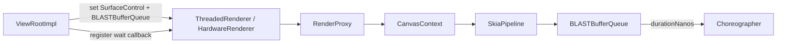
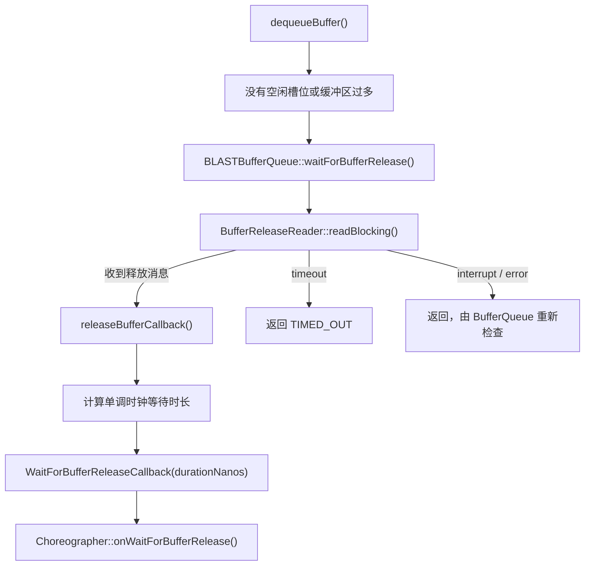

# 2.25 Choreographer Buffer Stuffing Recovery 与帧节拍修正

Buffer stuffing 描述数据生产方已经占用或提交过多缓冲区，而消费方尚未及时归还可写缓冲区的状态。下一次 `dequeueBuffer()` 找不到空闲槽位时，数据生产方会等待释放。一次较长的等待会拖慢当前提交，还可能让后续动画继续沿着已经落后的帧时间推进。

Android 16 在 `Choreographer` 中加入 Buffer Stuffing Recovery：收到等待缓冲区释放的信号后，先主动放弃一次帧回调，再在恢复期调整传给 FrameData/FrameCallback 的时间线。Android 17 保留这条主线，并加入受开关控制的多次恢复与累计延迟上限。

这套机制不增加 BufferQueue slot，不主动释放缓冲区，也不修复 GPU、SurfaceFlinger 或 HWC。它处理的是等待发生后的应用帧节拍。

## 一、适用范围

Android 17 中可以完整确认的注册路径属于标准 HWUI App Window：



`ViewRootImpl::updateRendererSurfaceControlAndBbq()` 把 `mChoreographer::onWaitForBufferRelease` 注册给 `ThreadedRenderer`。回调经 JNI、`RenderProxy`、`CanvasContext` 和 `SkiaPipeline` 传到对应的 `BLASTBufferQueue`。

这项边界很重要：

- 标准硬件加速窗口有明确注册路径；
- 使用应用主 Choreographer 不代表任意 Surface 都接入这条回调；
- 独立 SurfaceView、Camera/Codec producer、引擎自有 EGL/Vulkan swapchain 可能形成自己的 render loop 和 BufferQueue；
- 未接入回调的数据生产方仍可能出现队列堆积，但不会依靠这套 Choreographer 状态机恢复。

诊断时应先确认画面由谁获取、渲染和显示，再判断它是否受主线程 Choreographer 驱动。跟踪中出现 `eglSwapBuffers()` 或 `dequeueBuffer()`，不能证明主 Choreographer 已收到堆积信号。

## 二、等待信号从哪里产生

### 2.1 BufferQueue 为什么会等待

`BufferQueueProducer::waitForFreeSlotThenRelock()` 统计已出队和已获取的缓冲区，并寻找空闲缓冲区或槽位。出现以下任一情况时，数据生产方可能需要等待：

- 没有空闲缓冲区或槽位；
- 未完成缓冲区数量超过当前允许范围；
- 消费方临时多获取一块缓冲区，用于原子获取和释放；
- release fence、SurfaceFlinger 或下游显示消费延迟，导致旧 buffer 还不能复用。

对于不可阻塞或异步模式的部分组合，调用会返回 `WOULD_BLOCK`；普通阻塞路径进入 `waitForBufferRelease()`。没有空闲缓冲区是触发条件，不能把每次出队耗时都归为队列堆积。

### 2.2 BLAST 通过释放通道等待

Android 17 的 BLAST producer 覆盖了 `BufferQueueProducer::waitForBufferRelease()`。运行关系如下：



BLAST 在解锁 BufferQueue 互斥锁后阻塞读取 `BufferReleaseChannel`。成功收到释放消息时，它先执行 `releaseBufferCallback()`，再用单调时钟计算从进入等待到收到释放消息的持续时间，最终调用已注册的回调。

超时路径直接返回 `TIMED_OUT`，中断或错误路径让 BufferQueue 重新检查状态；这两条分支不会按成功释放的路径报告持续时间。因此，`onWaitForBufferRelease()` 不是所有出队失败的统一通知。

源码入口：

- [`BLASTBufferQueue.cpp`](https://android.googlesource.com/platform/frameworks/native/+/android-17.0.0_r1/libs/gui/BLASTBufferQueue.cpp)
- [`BufferQueueProducer.cpp`](https://android.googlesource.com/platform/frameworks/native/+/android-17.0.0_r1/libs/gui/BufferQueueProducer.cpp)

## 三、`onWaitForBufferRelease()` 只设置触发位

Android 17 `Choreographer.onWaitForBufferRelease(durationNanos)` 的判断很短：

```text
if durationNanos > mLastFrameIntervalNanos / 2:
    isStuffed = true
```

这段伪代码用于说明阈值，不表示它会读取 BufferQueue depth。`isStuffed` 是 `AtomicBoolean`，因为等待发生在 RenderThread 或图形路径，后续恢复判断在 Choreographer 所在的 Looper 线程执行。

阈值跟最近一帧 interval 变化：

| 帧间隔 | 半帧阈值约为 |
|---:|---:|
| 16.67ms（60Hz/60fps 节拍） | 8.33ms |
| 11.11ms（90Hz/90fps 节拍） | 5.56ms |
| 8.33ms（120Hz/120fps 节拍） | 4.17ms |

表格只用于理解量级。实际判断使用 VSync 事件更新的 `mLastFrameIntervalNanos`，显示刷新率、应用渲染帧率和 ARR 下的帧间隔需要结合具体跟踪数据。

该方法不会记录图层、slot、缓冲区编号或等待原因。它只通知下一次 `doFrame()`：此前发生了足够长的缓冲区释放等待，需要评估节拍恢复。

## 四、Android 17 状态机有哪些字段

`BufferStuffingState` 包含：

| 字段 | Android 17 含义 |
|---|---|
| `isStuffed` | 是否收到新的较长等待信号 |
| `isRecovering` | 当前是否处于恢复期 |
| `numberWaitsForNextVsync` | 恢复期间主动或被动多等待了多少次 VSync |
| `accumulatedDelayNanos` | 本轮动画因 `DELAY_FRAME` 累积的延迟 |
| `MAX_BUFFER_STUFFING_DELAY_NS` | 100ms 累计延迟上限，只有 threshold flag 打开时参与限制 |

恢复动作有三种：

- `NONE`：本帧不做恢复动作；
- `DELAY_FRAME`：本轮回调不执行，安排下一次 VSync；
- `OFFSET`：把用于首次 `FrameData.update()` 的帧时间减去一个帧间隔。

`numberWaitsForNextVsync` 统计帧调度等待次数，不是等待的缓冲区数量；`accumulatedDelayNanos` 也不是数据生产方在 `dequeueBuffer()` 中阻塞的总时长。

## 五、`DELAY_FRAME` 与 `OFFSET` 怎样工作

### 5.1 首次检测：主动空出一帧

下一次 `doFrame()` 调用 `updateBufferStuffingState()`。在基础分支中，如果尚未进入恢复期且 `isStuffed` 为 true：

1. 原子清除 `isStuffed`；
2. 设置 `isRecovering=true`；
3. 开始名为 `Buffer stuffing recovery` 的异步跟踪；
4. 返回 `DELAY_FRAME`。

`doFrame()` 收到 `DELAY_FRAME` 后：

```text
numberWaitsForNextVsync += 1
accumulatedDelayNanos += frameIntervalNanos
scheduleVsyncLocked()
return
```

本轮输入、animation、遍历和提交回调都不会运行。空出一个目标周期，为消费方释放缓冲区和队列深度下降留出时间，但源码不会在这里直接读取已释放缓冲区的数量。

### 5.2 恢复期间：调整回调时间

处于恢复期且尚未检测到空闲时，状态机返回 `OFFSET`。`doFrame()` 先执行：

```text
offsetFrameTimeNanos = frameTimeNanos - frameIntervalNanos
FrameData.update(offsetFrameTimeNanos, vsyncEventData)
```

`FrameCallback` 与 `VsyncCallback` 从 `FrameData` 获得这一时间值及候选时间线。原始 `intendedFrameTimeNanos` 仍保留给 `FrameInfo`/jank tracking；若主线程已经晚了至少一个间隔，后续抖动重同步会重新选择时间线，并在恢复期再次减去一个间隔。

因此，OFFSET 不会把系统 VSync 提前。硬件 VSync、Dispatch 回调和实际显示时间都没有被改写；变化发生在应用对本轮帧时间和时间线的解释上。

### 5.3 什么时候退出恢复

Android 17 使用：

```text
totalFrameDelays = numberWaitsForNextVsync + 1
vsyncsSinceLastCallback =
    (frameTimeNanos - mLastNoOffsetFrameTimeNanos) / mLastFrameIntervalNanos

if vsyncsSinceLastCallback > totalFrameDelays:
    reset recovery
```

`+1` 表示自然等待下一次 VSync 的预期间隔。若自上次未偏移回调以来的空闲间隔比预期等待更长，状态机会认为动画已经空闲，结束异步跟踪并清空状态。

帧时间回退或 `FPSDivisor` 要求跳过当前帧时，`doFrame()` 还会安排下一次 VSync；恢复期间，这些额外等待会增加 `numberWaitsForNextVsync`，避免退出条件把调度主动跳过误判成动画空闲。

## 六、Android 17 的两个功能开关

Android 17 `view_flags.aconfig` 定义：

- `buffer_stuffing_multi_recovery`
- `buffer_stuffing_recovery_threshold`

它们都是运行时或构建配置的一部分，不能只凭 API 37 推断设备取值。

### 6.1 Multi-recovery

开关关闭时，一段恢复期动画只在首次检测到堆积时返回一次 `DELAY_FRAME`；直到空闲重置，新的 `isStuffed` 不会再次触发主动延迟。

开关打开时，每次收到新的堆积信号都可返回 `DELAY_FRAME`。若恢复已经开始，不会重复开启异步跟踪，但会继续累计等待次数与延迟。

这项能力表示“同一动画内可以多次恢复”，与 `FrameTimeline` 候选数量无关。

### 6.2 100ms 累计延迟上限

阈值开关打开且 `accumulatedDelayNanos >= 100ms` 时，新的堆积信号会记录 `buffer stuffed - max recovery delay reached`，但不再返回 `DELAY_FRAME`。状态机仍可继续处于恢复期，并按空闲条件结束。

开关关闭时，这个 100ms 值不会限制 `DELAY_FRAME`。因此，仅看到 `MAX_BUFFER_STUFFING_DELAY_NS` 常量，不能证明某台 Android 17 设备最多只延迟 100ms。

## 七、七个 FrameTimeline 候选不是七条恢复路径

Android 17 `DisplayEventReceiver.VsyncEventData.FRAME_TIMELINES_CAPACITY` 为 7。它是帧时间线候选项的最大容量，每项带有 `vsyncId`、预期显示时间和截止时间；`preferredFrameTimelineIndex` 指向平台推荐项，实际有效数量由 `frameTimelinesLength` 给出。

`FrameData.update()` 把这些候选复制进 Choreographer 的 `FrameData`。线程已经迟到时，另一个重载会在已有候选中寻找截止时间尚未过去的项目，必要时向 `DisplayEventReceiver` 查询最新数据。

这套候选机制早已用于回调的显示时间和截止时间选择。Buffer Stuffing Recovery 只把偏移后的帧时间送入同一个 `FrameData.update()`，没有创建七个并行恢复状态机。源码没有提供恢复精度的提升比例，此类结论需要独立基准测试。

## 八、Choreographer 恢复与 FrameTimeline `BufferStuffing`

两者相关，但来源不同：

- Choreographer recovery：App 侧 BLAST 等待 release 超过半帧后产生；
- `JankType::BufferStuffing`：SurfaceFlinger `FrameTimeline.cpp` 根据 SurfaceFrame 的预测/实际完成、锁存与显示关系分类。

Android 17 旧版分类中，如果某帧延迟显示，同时它在上一轮锁存前已经就绪，且预测显示时间原本属于上一帧，就会加上 `BufferStuffing`。实验分类还会依据显示延迟调整应用截止时间。

所以：

- 出现 recovery trace，不保证对应 SurfaceFrame 最终带 `BufferStuffing` bit；
- 出现 `BufferStuffing` bit，也不保证该 producer 接入主 Choreographer callback；
- `BufferStuffing` 在卡顿严重度计算中属于非卡顿标志位，可能作为时序上下文与其他卡顿标志位同时出现。

分析时应按 VSync ID、buffer/frame number、layer 和时间窗关联，不能只按名称相同合并事件。

## 九、版本边界

| 版本 | 机制状态 | 需要注意的差异 |
|---|---|---|
| Android 15 / API 35 | `Choreographer.java` 中没有 `BufferStuffingState` / `onWaitForBufferRelease()` | 仍从出队、围栏、SF 锁存与显示分析 |
| Android 16 / API 36 | 引入恢复机制；ViewRoot 直接给 BLAST 注册回调；`doFrame()` 受 `bufferStuffingRecovery()` 开关控制 | 首次延迟不计入 `numberWaitsForNextVsync`，因此空闲公式用 `+2` 涵盖自然等待与首次主动延迟 |
| Android 17 / API 37 | 保留恢复机制，并把标准窗口回调经 ThreadedRenderer/RenderPipeline 交给 BLAST | 新增两个开关和累计延迟/100ms 上限；空闲公式改为 `+1` |

Android 17 的基础恢复机制不再受 Android 16 的旧总开关控制：首次 `DELAY_FRAME` 会显式增加 `numberWaitsForNextVsync`，因此空闲公式只需再加一次自然 VSync 等待。结构变化没有改变信号来源：数据生产方因没有空闲缓冲区而等待释放，BLAST 报告等待时长，Choreographer 在超过半帧阈值后启动恢复。

## 十、Perfetto 实战诊断

### 10.1 确认目标 Surface

记录窗口、SurfaceControl/layer、BLASTBufferQueue、producer 线程和 consumer。若主体是 SurfaceView child、游戏引擎 surface 或 Camera/Codec output，先确认它是否和标准 App Window 共用 HWUI producer。

### 10.2 找到释放等待

在数据生产线程或 RenderThread 上检查：

- `dequeueBuffer()` 或 BLAST `waitForBufferRelease()`；
- 释放通道等待；
- EGL/Vulkan acquire/present；
- 释放围栏；
- BufferQueue 深度与槽位状态。

`eglSwapBuffers()` 耗时可能包含驱动刷新、frame pacing、空闲槽位和围栏等待。单凭它耗时较长，不足以认定发生队列堆积。

### 10.3 对齐恢复跟踪

开启 view/gfx/FrameTimeline 相关数据后，可寻找：

- `Buffer stuffing recovery` async track；
- `buffer stuffed`；
- `buffer stuffed - max recovery delay reached`；
- `Negative offset of ... ns added to animation`；
- `Choreographer#doFrame <vsyncId>`；
- `Choreographer#doFrame - resynced to ...`。

时序上应先发生足够长的缓冲区释放等待，随后 Choreographer 才会延迟或偏移。缺少恢复跟踪可能源于回调未注册、开关或版本差异、跟踪类别不全，或等待没有超过半帧。

### 10.4 继续追查消费方为何延迟释放

常见方向包括：

- 数据生产方持续过快提交，在途帧过多；
- GPU 完成较晚，缓冲区迟迟不能交给消费方；
- SurfaceFlinger 锁存或 CLIENT 合成变慢；
- HWC 或显示侧释放延迟；
- 窗口缩放、模式切换或事务条件改变缓冲区生命周期；
- 消费方持有图像、编解码或相机缓冲区过久。

恢复机制只说明应用已经感知回压。根因仍要通过数据生产方工作负载、获取/释放围栏、SF 图层跟踪、合成类型和显示提交证据确定。

### 10.5 区分三个“晚”

| 现象 | 优先检查 |
|---|---|
| 主线程 traversal 晚，RenderThread 尚未 dequeue | measure/layout/draw、Compose、锁、GC、Binder |
| RenderThread 卡在 free buffer/release wait | queue depth、slot、release channel/fence、下游消费 |
| App 已 queue，SF/HWC present 晚 | acquire fence、latch、composition、HWC/display |

三者可以连续发生。例如，主线程先迟到，随后 GPU 和队列堆积，最终 SF 错过显示时点；不能用一个标签概括整段时间线。

## 十一、常见误判

### 恢复机制会清空 BufferQueue

它只跳过一次或多次应用帧调度，并调整帧时间。槽位和释放仍由 BufferQueue、BLAST、SF 和下游消费者推进。

### 半帧阈值表示队列已经满了半帧

阈值比较一次释放等待时长与最近的帧间隔。状态机没有直接读取队列深度。

### Android 17 一定启用多次恢复和 100ms 上限

两个行为由独立开关控制。只有产品配置和跟踪数据能够证明实际采用的分支。

### 七个 FrameTimeline 候选项代表七套恢复策略

七是 VSync 事件可携带的候选时间线容量，与恢复状态数量无关。

### “看到 `BufferStuffing` jank bit 就一定有 Choreographer recovery”

SF 分类与应用恢复有不同的触发条件。独立的原生数据生产方可能只有 SF 分类，没有主 Choreographer trace。

### 负偏移会让这一帧更早上屏

偏移改变应用回调使用的帧数据和时间线。实际唤醒、GPU 执行和显示提交不会倒退。

## 十二、源码阅读顺序

1. [`ViewRootImpl.java`](https://android.googlesource.com/platform/frameworks/base/+/android-17.0.0_r1/core/java/android/view/ViewRootImpl.java)：确认标准窗口如何注册回调；
2. [`HardwareRenderer.java`](https://android.googlesource.com/platform/frameworks/base/+/android-17.0.0_r1/graphics/java/android/graphics/HardwareRenderer.java) 与 HWUI RenderProxy/CanvasContext/SkiaPipeline：确认回调如何到达 BLAST；
3. [`BLASTBufferQueue.cpp`](https://android.googlesource.com/platform/frameworks/native/+/android-17.0.0_r1/libs/gui/BLASTBufferQueue.cpp)：确认释放通道等待、持续时间与通知时机；
4. [`BufferQueueProducer.cpp`](https://android.googlesource.com/platform/frameworks/native/+/android-17.0.0_r1/libs/gui/BufferQueueProducer.cpp)：确认空闲槽位与缓冲区过多的条件；
5. [`Choreographer.java`](https://android.googlesource.com/platform/frameworks/base/+/android-17.0.0_r1/core/java/android/view/Choreographer.java)：确认状态机、flags、delay/offset 与 jitter resync；
6. [`DisplayEventReceiver.java`](https://android.googlesource.com/platform/frameworks/base/+/android-17.0.0_r1/core/java/android/view/DisplayEventReceiver.java)：确认七项只是时间线容量；
7. [`FrameTimeline.cpp`](https://android.googlesource.com/platform/frameworks/native/+/android-17.0.0_r1/services/surfaceflinger/Scheduler/FrameTimeline.cpp)：确认 SF `BufferStuffing` 分类边界。

## 小结

Android 17 Buffer Stuffing Recovery 的完整因果关系是：

```text
标准 HWUI 数据生产方没有空闲缓冲区
→ BLAST 等待释放通道
→ 成功释放后报告持续时间
→ Choreographer 比较半帧阈值
→ 下一次 doFrame 选择 DELAY_FRAME
→ 恢复期间使用 OFFSET
→ 检测到空闲后重置
```

多次恢复和 100ms 上限是 Android 17 的可配置增强；七项 FrameTimeline 是候选显示时间与截止时间数据，不是性能提升指标。排障时应先证明目标 Surface 接入了回调，再从释放等待追到数据生产方、SF、HWC 与围栏，才能解释缓冲区为何没有及时回到生产方。
