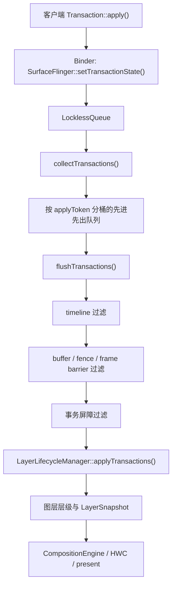

# 2.27 SurfaceFlinger Transaction Queue：无锁入口、分桶与就绪过滤

## 1. 先限定“无锁架构”的范围

`LocklessQueue` 的无锁性质只适用于事务入口，不能扩大到整个事务系统。

Android 17 中，`SurfaceFlinger::setTransactionState()` 会在 Binder 调用线程上完成权限清洗、图层句柄解析、缓冲区包装、工作负载提示收集等工作，然后把 `QueuedTransactionState` 交给 `TransactionHandler::queueTransaction()`。只有末尾的入口交接使用 `LocklessQueue<QueuedTransactionState>`。

进入主线程后仍能看到多种同步边界：

- 新建图层队列由 `mCreatedLayersLock` 保护，源码旁仍有改成无锁队列的待办注释；
- 停滞事务信息由 `mStalledMutex` 保护；
- display state、snapshot 构建过程中的共享状态、部分回调与统计逻辑仍在 `mStateLock` 下处理；
- Scheduler、CompositionEngine、HWC 和缓冲区生命周期各有自己的同步规则。

这里讨论 SurfaceFlinger 事务入口的无锁 MPSC 交接，以及交接后的分桶与就绪过滤。该设计没有消除 SurfaceFlinger 的所有锁。

## 2. Android 17 的主路径

下图按职责标出各组件。“提交”与“本轮显示”之间还要经过就绪判断、snapshot、合成和送显。



Android 17 的正常处理入口位于 `SurfaceFlinger::updateLayerSnapshots()`：

1. `collectTransactions()` 排空无锁入口队列；
2. 主线程在 `mCreatedLayersLock` 下接收本轮创建、销毁的图层；
3. `LayerLifecycleManager::addLayers()` 先登记新图层；
4. `flushTransactions()` 从按令牌分桶的先进先出队列中取出本轮就绪事务；
5. `LayerLifecycleManager::applyTransactions()` 更新 `RequestedLayerState`；
6. `LayerHierarchyBuilder` 和 `LayerSnapshotBuilder` 更新层级与合成快照；
7. 在 `mStateLock` 下处理显示事务、快照所需共享状态，以及 `applyTransactionsLocked()` 中的回调、统计、输入命令和遗留事务标记。

这里有两个需要同时记住的结论：

- 图层请求状态进入 FrontEnd 的关键调用是 `LayerLifecycleManager::applyTransactions()`；
- `applyTransactionState()` 在 Android 17 没有消失，它仍在主线程、`mStateLock` 保护下处理回调、统计、输入命令和事务标记等职责。

将整条链描述为“刷新后直接在 `mStateLock` 内逐图层修改”会漏掉 FrontEnd；Android 17 也仍会调用 `applyTransactionState()`。

## 3. LocklessQueue 如何工作

### 3.1 数据结构与入队线性化点

`LocklessQueue<T>` 维护两个原子指针：

- `mPush`：生产者头插链表；
- `mPop`：消费者反转后逐项读取的链表。

下面的伪代码保留算法骨架，用于说明 CAS 重试和批量接管：

```text
push(value):
  entry = new Entry(value)
  previousHead = mPush.load()
  do:
    entry.next = previousHead
  while !mPush.compare_exchange_weak(previousHead, entry)

pop():
  if mPop is not empty:
    remove and return its head

  grabbed = mPush.exchange(nullptr)
  if grabbed is empty:
    return empty

  reverse grabbed
  keep the remaining nodes in mPop
  return the first value
```

一次成功的 `compare_exchange_weak` 是该次入队的线性化点。多个生产者读到同一个旧头时，只会有一个先成功；其他线程拿到更新后的头并重试。源码没有显式传入 memory order，注释中的候选参数被注释掉，因此这些原子操作使用 C++ 默认的顺序一致性语义。

### 3.2 为什么要反转

生产者使用头插法，链表方向与 CAS 成功次序相反。单消费者通过 `mPush.exchange(nullptr)` 接管整批节点，再把链表反转，恢复这批事务的入队次序。接管之后才到达的节点留在新的 `mPush` 链表，等待下一次接管。

这不是“从无序队列整理出顺序”。队列仍有明确的原子入队次序；反转只是修正头插链表的方向。

### 3.3 无锁不等于无等待（wait-free），也不等于零系统调用

源码能支持的结论是：

- `push()` 不获取队列互斥锁；
- 竞争时 CAS 可以反复失败，因此该操作无法保证在固定步数内完成；
- 每次 `push()` 会 `new Entry`，每次 `pop()` 会 `delete`，分配器内部行为不属于这个数据结构的保证；
- 在高竞争下，CAS 重试会消耗 CPU 和缓存一致性带宽；
- 该实现要求单消费者，不能让多个线程并发 `pop()`。

因此，不能把 `queueTransaction()` 简写成“永不阻塞、只执行一次 CAS、绝不发生系统调用”。AOSP 只从入口队列的同步设计中移除了互斥锁。

## 4. 两层队列与 applyToken

`TransactionHandler` 有两层容器：

| 层次 | Android 17 类型 | 写入者 / 读取者 | 用途 |
|---|---|---|---|
| 入口 | `LocklessQueue<QueuedTransactionState>` | 多个 Binder 线程 / SF 主线程 | 低共享的 MPSC 交接 |
| pending | `unordered_map<sp<IBinder>, queue<...>>` | SF 主线程 | 按 apply token 保持 FIFO、执行就绪判断 |

`collectTransactions()` 从第一层取出事务，以 `applyToken` 为键放入第二层。

### 4.1 applyToken 约束什么

`SurfaceComposerClient::Transaction::setApplyToken()` 的 AOSP 注释给出了边界：

- 默认情况下，同一客户端的事务放在同一条队列；
- 显式设置令牌可把事务放入不同队列，避免多笔事务互相阻塞。

相同令牌下，`flushPendingTransactionQueues()` 只看队头。队头返回 `NotReady`、`NotReadyBarrier` 或 `NotReadyUnsignaled` 后，该桶停止继续弹出，后续事务不能越过它。

外层循环仍会检查其他令牌的桶。一个令牌因期望送显时间或栅栏等待时，不会让所有客户端都停住。Android 17 新增的事务屏障可以跨令牌建立显式依赖，因此不同令牌之间仍可能相互影响。

### 4.2 单向调用与队列就绪是两件事

客户端调用 `Transaction::apply(false, true)` 时，`oneWay=true` 会让 `ISurfaceComposer` Binder 调用带 `FLAG_ONEWAY`。它只改变客户端等待 Binder 返回的方式，不会：

- 绕过按令牌分桶的先进先出队列；
- 绕过时间线、缓冲区或屏障过滤；
- 保证事务在当前显示帧被采纳；
- 让获取栅栏自动变为已发出信号状态。

排查 BLAST 事务时，应分别观察 Binder 异步提交和 SF 主线程的就绪判断。

## 5. Android 17 的三个过滤器

`SurfaceFlinger::addTransactionReadyFilters()` 在 `android-17.0.0_r1` 固定注册以下三个回调，执行次序与注册次序一致：

1. `transactionReadyTimelineCheck()`；
2. `transactionReadyBufferCheck()`；
3. `TransactionHandler::isBarrierSignalledOrExpired()`。

`mTransactionReadyFilters` 的类型是 `ftl::SmallVector<TransactionFilter, 3>`。`SmallVector` 的模板参数表示三个元素可以放在对象内的内联存储中，不限制 `emplace_back()` 的总数量。AOSP 当前正好注册三个过滤器，但不能据此推导“最多三个”或“第三个留给厂商”。

### 5.1 timeline：判断这笔事务是否适合本轮

时间线过滤器综合检查：

- 非自动时间戳的 `desiredPresentTime`；
- Scheduler 给本轮计算的 `expectedPresentTime`；
- origin UID 对应的 VSync cadence；
- `FrameTimelineInfo.vsyncId` 是否说明这帧仍然过早。

如果期望送显时间晚于本轮的预计送显时间，且差值不超过一秒，事务会返回 `NotReady`。超过一秒的未来时间会被忽略，避免异常时间戳长期卡住队列。

带有效 VSync ID 的事务已按该 ID 的节奏被 Choreographer 节流，SF 不会再按来源 UID 的节奏重复节流。使用自动时间戳的事务还会通过 `frameIsEarly()` 判断是否过早。

### 5.2 buffer：frame barrier、backpressure 与 acquire fence

缓冲区过滤器会遍历事务中带缓冲区的图层状态，主要处理三类条件。

第一类是 BLAST buffer frame barrier。事务可以声明“同一图层的指定帧号进入本轮后，再应用当前缓冲区”。若目标屏障帧尚未到达，返回 `NotReadyBarrier`。这类屏障从事务 `postTime` 起等待超过 **4 秒** 后会被忽略。

第二类是缓冲区背压。同一轮已经选中该图层的一个缓冲区，图层开启背压，且当前事务使用自动时间戳时，后续缓冲区事务返回 `NotReady`，避免一轮提交多个缓冲区。

第三类是获取栅栏。栅栏尚未发出信号时通常返回 `NotReady`。只有同时满足 `shouldLatchUnsignaled()` 与 `RequestedLayerState::isSimpleBufferUpdate()` 的事务，才有机会返回 `NotReadyUnsignaled`。

Android 17 的 `AutoSingleLayer` 至少要求：

- 事务只有一个图层状态；
- 它是本轮候选中的第一笔事务；
- Scheduler 当前不处于提前 VSync 配置；
- 图层状态是简单缓冲区更新，不能夹带破坏快速路径的几何或同步语义。

`NotReadyUnsignaled` 也不会立即应用。`TransactionHandler` 先记住该令牌；只有本轮尚未选出正常的就绪事务，才会单独弹出这笔事务。后续 RenderEngine 或 HWC 读取缓冲区时仍须遵守栅栏。

### 5.3 transaction barrier：Android 17 的显式 token 依赖

Android 17 的第三个过滤器处理事务中的 `KIND_WAIT` 和 `KIND_SIGNAL` barrier token：

- 含 `KIND_SIGNAL` 的事务被弹出时，将令牌与本轮处理时间写入 `mSignalledTransactionBarriers`；
- 含 `KIND_WAIT` 的事务在令牌未出现时返回 `NotReadyBarrier`；
- 等待事务从 `postTime` 起超过默认 **5 秒** 后放行；
- 已发出信号的令牌记录超过默认 **5 秒** 后会被清理。

这套五秒生存期与缓冲区帧屏障的四秒超时属于两种机制，不能共用一个“barrier TTL”概念。

## 6. 为什么 flush 要重复扫描

待处理容器按应用令牌分桶，`unordered_map` 的遍历次序没有业务含义。某个等待屏障所在的桶可能先被检查，此时信号事务还未弹出；该信号又可能位于另一个令牌的桶。

`flushTransactions()` 会反复调用 `flushPendingTransactionQueues()`，直到 `NotReadyBarrier` 的数量在相邻两轮之间不再变化。这个循环用于继续解析跨令牌的屏障依赖链，不能概括为“扫描到没有新的就绪事务”。

每弹出一笔事务，处理状态会同步更新：

- `firstTransaction` 变为 false；
- 带缓冲区的图层与帧号记入 `bufferLayersReadyToPresent`；
- `KIND_SIGNAL` 令牌记入已发出信号的集合；
- 停滞事务记录被移除。

这些状态会影响后续事务的缓冲区屏障、backpressure、未发出信号状态和显式屏障判断。

## 7. 从客户端到 FrontEnd 的准确调用关系

### 7.1 普通 SurfaceControl transaction

客户端 `Transaction::apply()` 把事务状态发送给 `ISurfaceComposer::setTransactionState()`。SF Binder 入口完成清洗和解析后，构造 `QueuedTransactionState`，再执行：

```text
TransactionHandler::queueTransaction()
  LocklessQueue::push()
  mPendingTransactionCount.fetch_add(1)
  SFTRACE_INT("TransactionQueue", pendingCount)

SurfaceFlinger::setTransactionFlags(eTransactionFlushNeeded, ...)
  Scheduler::resync(...)
  scheduleCommit(...)
    Scheduler::scheduleFrame(...)
```

`ftl::FakeGuard(kMainThreadContext)` 服务于线程安全标注，不会在运行时获取 `mStateLock`。不过，`setTransactionState()` 在进入 `queueTransaction()` 前已经做了不少工作，不能把整个 Binder 入口的成本等同于一次 CAS。

### 7.2 `scheduleCommit()` 不承诺“立即”或“下一个硬件 VSync”

`scheduleCommit()` 调用 `Scheduler::scheduleFrame()`，由 Scheduler 根据当前帧目标、VSync 调制和既有调度状态安排唤醒。如果相同的事务标志已经置位，新事务通常不会重复安排一帧，但活动帧提示仍会重置空闲计时器。

Android 17 有一个单独的例外：事务包含帧率变化，且已安排的回调距当前超过 30 ms 时，SF 会调用 `scheduleImmediateFrame()`。这个分支不能推广为所有事务都会立即唤醒。

因此，从应用调用 `apply()` 到 SF 采纳事务的延迟，需要结合 Binder 调度、SF 已安排的帧、就绪状态和系统负载判断，不能套用固定的 0.5～2 ms 进程间通信耗时。

## 8. BLASTBufferQueue 与 TransactionHandler

`BLASTBufferQueue::initialize()` 的源码注释说明适配器位于客户端进程。它在客户端侧创建 BufferQueue producer/consumer，并由 `BLASTBufferItemConsumer` 接收新帧可用通知。

处理一块新缓冲区时，关键步骤是：

```text
BLASTBufferQueue::onFrameAvailable()
  acquireNextBufferLocked()
    从 BLAST 消费者取得 BufferItem
    Transaction::setBuffer(surfaceControl, buffer, acquireFence, frameNumber, producerId, ...)
    合并等待中的 SurfaceControl transaction
    setApplyToken(mApplyToken).apply(false, true)
```

这段路径带来三个诊断结论：

1. BLAST 在客户端侧把 `GraphicBuffer`、acquire fence、frame number 和 release callback 写入 transaction；
2. SF 的缓冲区就绪检查发生在事务进入 `TransactionHandler` 之后；
3. 释放回调把缓冲区复用时机等信息返回给客户端，它不是 SF 主动拉取下一块缓冲区的接口。

在完整显示链上，transaction ready、buffer latch、HWC/RenderEngine 读取和 display present 是不同边界。看到 `TransactionQueue` 下降，只能说明事务被 flush；它没有证明目标 buffer 已经显示。

## 9. 锁边界与性能判断

### 9.1 这项设计解决了什么

Android 13 的入口使用 `mQueueLock` 保护 `mTransactionQueue`，主线程把事务移入按令牌分桶的待处理队列时也要遵守相同锁约束。Android 14 把事务入口移入 `TransactionHandler` 的 MPSC `LocklessQueue` 后，多个 Binder 线程不再与 SF 主线程争夺入口队列的互斥锁。

在多窗口、转场或多个 SurfaceControl 生产者并发提交时，这个改变可以减少入口队列锁竞争，并让主线程一次接管一批节点。

### 9.2 这项设计没有解决什么

以下现象不能归因于 `LocklessQueue` 已经失效：

- desired present time 或 VSync id 让 transaction 尚未到期；
- 同一令牌的队头正在等待获取栅栏；
- 缓冲区帧屏障或事务屏障未满足；
- 新建图层队列、`mStateLock` 或其他组件发生锁等待；
- CompositionEngine、RenderEngine、HWC 或显示驱动后段变慢；
- 生产者没有及时提交缓冲区。

无锁入口优化的是一个局部交接点。端到端帧延迟还取决于生产者、readiness、FrontEnd、合成和送显。

### 9.3 为什么不能给固定收益

收益取决于 Binder 生产者数量、事务频率、CPU 拓扑、缓存竞争、SF 主线程负载和原有锁冲突程度。事务量较低时，两种入口的差异可能很小；压力升高后，CAS 重试本身也有成本。

没有同设备、同构建、同场景的 A/B 数据时，只能提出可验证假设，不能写“节省若干毫秒”或“完全消除上下文切换”。

## 10. Android 13 到 Android 17 的演进

| 版本 | 入口与待处理结构 | 就绪处理 | 相关变化 |
|---|---|---|---|
| Android 13 / API 33 | `mQueueLock` 保护 `mTransactionQueue` 与 per-token pending queues | timeline、buffer barrier、fence 等判断仍在 SF 内 | 旧互斥入口；已有 per-token 排队与 readiness，不能写成“无过滤” |
| Android 14 / API 34 | `TransactionHandler` + `LocklessQueue<TransactionState>` | timeline、buffer 两个过滤器 | 无锁 MPSC 入口已出现，文件位于 `services/surfaceflinger/LocklessQueue.h` |
| Android 15 / API 35 | 同上；`collectTransactions()` 从刷新流程中拆出 | FrontEnd 开关下选择新旧缓冲区检查 | 新图层创建与事务收集次序更清楚 |
| Android 16 / API 36 | `LocklessQueue<QueuedTransactionState>` | timeline、buffer 两个过滤器 | 队列元素切换为 FrontEnd 使用的 queued state |
| Android 17 / API 37 | `LocklessQueue` 头文件移到 `libs/gui/include/gui/` | timeline、buffer、transaction barrier 三个过滤器 | 新增显式 WAIT/SIGNAL barrier 与五秒 TTL |

`LocklessQueue` 在 Android 14 已进入这条路径。到 Android 17，AOSP 注册了第三个显式事务屏障过滤器，没有预留“自定义第三槽位”。

## 11. Perfetto：怎样验证是哪一段在等

### 11.1 采集

快速复现场景时，可以先采集调度、Binder、图形和窗口相关的 atrace 类别：

```bash
adb shell perfetto \
  -o /data/misc/perfetto-traces/sf-transaction.perfetto-trace \
  -t 15s \
  sched freq idle binder_driver gfx view wm
```

复现多窗口缩放、桌面窗口移动、SurfaceView/BLAST 高频更新或系统转场，再把跟踪文件拉到本地分析。需要长期、可重复测试时，应改用显式 Perfetto 配置，固定缓冲区大小、数据源和持续时间。

### 11.2 先看入口是否积压

`TransactionHandler::queueTransaction()` 每次入队后增加 `mPendingTransactionCount`，`flushTransactions()` 按本轮返回事务数减少它，两处都记录 `TransactionQueue` counter。

该计数器表示已进入 TransactionHandler、尚未被刷新流程返回的事务总数，覆盖无锁入口和按令牌分桶的待处理队列两层。它不是 `LocklessQueue` 链表节点数，也不是当前帧的缓冲区数量。

- 短暂尖峰后迅速归零：通常是正常批处理；
- 长时间上升：提交速率持续高于刷新速率，或队头条件长期不满足；
- 周期性高位：需要与 SF scheduled frame、timeline 和 fence 条件对齐。

### 11.3 再看刷新流程为什么没有弹出事务

Android 17 可关注这些 SF 跟踪名称：

- `TransactionHandler:flushTransactions`；
- `not current desiredPresentTime`、`frameIsEarly`、`!isVsyncValid`；
- `NotReadyBarrier`、`IgnoreBarrierDueToTimeout`；
- `hasPendingBuffer`；
- `fence unsignaled`；
- `Transaction id=... is waiting on barrier ...`。

同一令牌的队头条件决定该桶能否继续前进。一个等待中的事务可能让该令牌的后续事务全部留在队列，但其他令牌仍可正常前进。

### 11.4 一帧从提交到送显的完整证据

可按以下顺序检查完整链路：

1. 先确认 Producer 是否按时 `queueBuffer` 或提交 SurfaceControl transaction；
2. 检查 BLAST 是否取得 `BufferItem` 并调用 `Transaction::setBuffer()`；
3. 用 `TransactionQueue` 与就绪状态跟踪判断 SF 正在等待时间、屏障还是栅栏；
4. 用 `BufferTX - <layerName>` 和锁存事件确认新缓冲区是否被采纳；
5. 结合 FrameTimeline、HWC 与送显栅栏判断显示后段。

`TransactionQueue` 下降、transaction committed callback、缓冲区锁存和显示器送显分别对应四个阶段。只看其中一个，无法确定内容何时出现在屏幕上。

### 11.5 Perfetto 看不到什么

现有跟踪记录没有直接记录每次 `compare_exchange_weak` 的失败次数。Binder 线程没有互斥锁等待，也不能证明 CAS 没有重试。要量化原子竞争，可使用：

- 针对目标构建的源码计数或跟踪点；
- simpleperf/perf 的采样与硬件计数器；
- 同场景旧实现与新实现的 A/B 构建。

这类数据应与端到端 FrameTimeline、SF 主线程耗时一起分析，避免把局部 CPU 指标当成显示延迟。

## 12. 常见误读

| 误读 | Android 17 的准确边界 |
|---|---|
| SurfaceFlinger transaction handler 已完全无锁 | 仅 MPSC 入口 queue 无 mutex；created layers、stalled 信息和全局状态仍有锁 |
| push 永远只做一次 CAS | `compare_exchange_weak` 在竞争或弱失败时会循环 |
| 入队和出队保证不发生任何系统调用 | 节点使用 `new/delete`；数据结构只保证自身不调用队列互斥锁或 futex |
| `SmallVector<..., 3>` 表示最多三个过滤器 | `3` 是内联容量；Android 17 AOSP 当前注册三个 |
| 不同应用令牌对应不同进程 | 令牌由客户端排队策略决定；一个客户端也可以使用多个令牌 |
| 单向事务可以绕过就绪判断 | 单向调用只改变 Binder 调用方式 |
| BLAST 是 SF 拉取缓冲区的接口 | BLAST 适配器在客户端取得缓冲区，再通过事务发送给 SF |
| 屏障都是五秒生存期 | 缓冲区帧屏障超时为四秒；显式事务屏障的默认生存期为五秒 |
| `NotReadyUnsignaled` 表示可以忽略栅栏 | 只允许特定的简单单层事务提前进入后段，读取方仍遵守栅栏 |
| `scheduleCommit()` 总是立即处理 | 常规路径调用 `scheduleFrame()`；帧率变化有条件触发即时帧 |
| TransactionQueue 就是无锁链表深度 | 它统计尚未刷新的事务总数，包含入口和按令牌分桶的待处理队列 |

## 13. 源码阅读顺序

建议按以下顺序跟读 Android 17 源码：

1. [`LocklessQueue.h`](https://android.googlesource.com/platform/frameworks/native/+/refs/tags/android-17.0.0_r1/libs/gui/include/gui/LocklessQueue.h)：先确认 MPSC、CAS、exchange、反转和 `new/delete`；
2. [`TransactionHandler.h`](https://android.googlesource.com/platform/frameworks/native/+/refs/tags/android-17.0.0_r1/services/surfaceflinger/FrontEnd/TransactionHandler.h) 与 [`TransactionHandler.cpp`](https://android.googlesource.com/platform/frameworks/native/+/refs/tags/android-17.0.0_r1/services/surfaceflinger/FrontEnd/TransactionHandler.cpp)：看两层队列、readiness、重复扫描和 barrier TTL；
3. [`SurfaceFlinger.cpp`](https://android.googlesource.com/platform/frameworks/native/+/refs/tags/android-17.0.0_r1/services/surfaceflinger/SurfaceFlinger.cpp)：依次找 `setTransactionState()`、`addTransactionReadyFilters()`、`transactionReadyTimelineCheck()`、`transactionReadyBufferCheck()`、`updateLayerSnapshots()`；
4. [`SurfaceComposerClient.h`](https://android.googlesource.com/platform/frameworks/native/+/refs/tags/android-17.0.0_r1/libs/gui/include/gui/SurfaceComposerClient.h) 与 [`SurfaceComposerClient.cpp`](https://android.googlesource.com/platform/frameworks/native/+/refs/tags/android-17.0.0_r1/libs/gui/SurfaceComposerClient.cpp)：核对应用令牌和单向调用的客户端契约；
5. [`BLASTBufferQueue.cpp`](https://android.googlesource.com/platform/frameworks/native/+/refs/tags/android-17.0.0_r1/libs/gui/BLASTBufferQueue.cpp)：看 client-process adapter、`setBuffer()`、transaction merge、apply token 与 release callback。

版本演进可分别对照以下固定 tag：

- [`android-13.0.0_r1`](https://android.googlesource.com/platform/frameworks/native/+/refs/tags/android-13.0.0_r1/services/surfaceflinger/)；
- [`android-14.0.0_r1`](https://android.googlesource.com/platform/frameworks/native/+/refs/tags/android-14.0.0_r1/services/surfaceflinger/)；
- [`android-15.0.0_r1`](https://android.googlesource.com/platform/frameworks/native/+/refs/tags/android-15.0.0_r1/services/surfaceflinger/)；
- [`android-16.0.0_r1`](https://android.googlesource.com/platform/frameworks/native/+/refs/tags/android-16.0.0_r1/services/surfaceflinger/)；
- [`android-17.0.0_r1`](https://android.googlesource.com/platform/frameworks/native/+/refs/tags/android-17.0.0_r1/services/surfaceflinger/)。

## 小结

Android 17 的事务队列设计可以拆成三段：

- Binder 线程通过 `LocklessQueue` 完成 MPSC 入口交接；
- SF 主线程按应用令牌放入先进先出队列，保持同一令牌内的次序并隔离队头阻塞；
- 三个过滤器按时间线、缓冲区和显式事务屏障决定本轮可应用集合。

这套设计降低了入口队列互斥锁的共享压力，同时保留了事务顺序、buffer fence、屏障和显示时序约束。分析性能时，应先确定事务卡在入口、按令牌分桶的队头还是合成后段，再判断无锁队列是否相关。

> 版本范围：主线按 AOSP `android-17.0.0_r1` 核对；历史表保留 Android 13～16 的架构演进，结论最高到 Android 17 / API 37。
