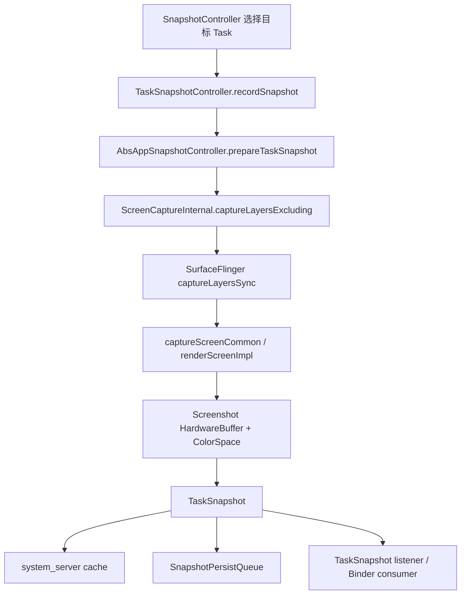
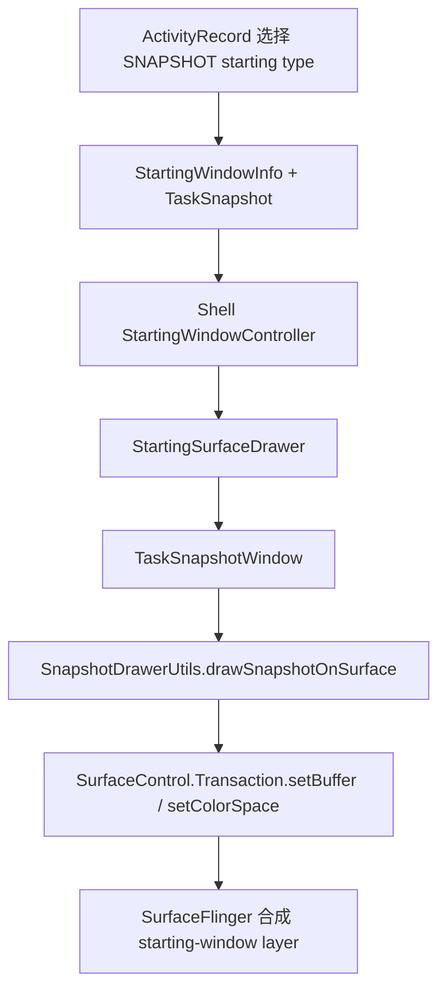

# 2.27 TaskSnapshot 捕获、Overview 缩略图与启动窗口

TaskSnapshot 从 Android 8.0 开始统一了两类历史能力：最近任务缩略图和 WindowManager 保存的 Surface。到了 Android 17，同一份 `TaskSnapshot` 仍可用于多个场景，但各场景的显示对象并不相同。

先区分四个容易混用的概念：

| 概念 | 内容来源 | 显示位置 | Android 17 的主要对象 |
|---|---|---|---|
| TaskSnapshot | WMS 请求捕获 Task surface 子树 | 缓存、磁盘或跨进程传递 | `android.window.TaskSnapshot` |
| Overview 静态缩略图 | TaskSnapshot 包装成 hardware `Bitmap` | Launcher/Quickstep 自己的窗口 | `ThumbnailData`、`TaskThumbnailView` |
| Overview live tile | 正在参与 Recents animation 的真实 Task surface | remote animation leash | `RemoteAnimationTarget`、leash |
| snapshot starting window | 旧 TaskSnapshot 作为启动占位 | 独立 starting-window surface | `TaskSnapshotWindow` |

这四者的 buffer、SurfaceControl、生命周期和性能瓶颈不同。看到 Overview 卡片时，不能直接推导屏幕上存在一个名为 TaskSnapshot 的独立 SurfaceFlinger layer。

以下分析以 Android 17 / API 37 / `android-17.0.0_r1` 为准，Launcher 侧同时参考 `packages/apps/Launcher3` 的同名 tag。Android 8～16 仅用于说明版本演进。

## 1. TaskSnapshot 保存了什么

### 1.1 HardwareBuffer 只是对象的一部分

Android 17 的 `TaskSnapshot` 包含：

- 捕获结果 `HardwareBuffer`；
- `ColorSpace`；
- top Activity component；
- orientation 与 display rotation；
- 原始 task size；
- content insets 与 letterbox insets；
- high/low resolution 标记；
- real snapshot 或 app-theme snapshot 标记；
- windowing mode、system-bar appearance、translucency；
- 是否包含 IME surface；
- density DPI；
- snapshot id 与 capture time。

这些元数据决定消费端如何旋转、裁剪、缩放和判断兼容性。只保存一张 PNG 或 JPEG，无法复现 Android 17 的 starting-window 与 Overview 行为。

`HardwareBuffer` 通过 Binder 传递的是底层 buffer 句柄和引用，不需要把整张像素图复制进 Parcel。接收方仍要管理引用、等待可用状态并参与后续 GPU/HWC 合成；跨进程零像素复制仍有处理成本。

### 1.2 TaskSnapshot 与 LayerSnapshot 名字相近，职责不同

Android 17 的 SurfaceFlinger FrontEnd 使用 `LayerSnapshot` 描述当前帧的 layer 可见性、几何、Z-order、buffer 与效果状态。WMS 的 `TaskSnapshot` 是对一个 Task surface 子树执行 screen capture 后生成的可复用图像。

两者关系如下：

```text
SF LayerSnapshot 集合
  → screen capture 合成
    → 新的 screenshot HardwareBuffer
      → WMS TaskSnapshot
```

因此，Perfetto 或源码里出现 `LayerSnapshotBuilder`，不代表系统正在生成最近任务缩略图。它也可能只是 SurfaceFlinger 为普通显示帧更新 FrontEnd 状态。

## 2. Android 17 的捕获时机

### 2.1 Shell transition 在 transaction ready 阶段记录

现代 transition 路径由 `SnapshotController.onTransactionReady()` 检查 `Transition.ChangeInfo`。对于满足条件且将不可见的 Task，系统会在 transition transaction 启动前调用：

```text
SnapshotController.onTransactionReady()
  → TaskSnapshotController.recordSnapshot(task, changeInfo)
    → AbsAppSnapshotController.recordSnapshotInner()
```

Android 17 会排除或特殊处理：

- home 与 PiP change；
- organizer 创建的 Task；
- transient hide；
- Task 仍为 `isVisibleRequested()`；
- 某些 display change 同时改变 bounds 的场景。

传入 `ChangeInfo` 是因为 Task configuration 可能已在 transition 准备阶段改变。捕获时仍要使用关闭前的 rotation 和 bounds，避免把旧画面配上新几何。

### 2.2 休眠前还有一条捕获路径

屏幕即将关闭或设备进入 sleep 时，`snapshotForSleeping(displayId)` 会遍历对应 Display 上的可见 leaf Task。正在被 Recents animation 控制的 Task 会跳过，因为 Recents 路径需要在更合适的时刻处理快照和 IME。

安全锁屏进入 sleep 时，默认 Display 的 home Task 也可能被捕获，用于解锁回到桌面的 starting window。

### 2.3 特权调用方可以主动请求

Android 17 的隐藏系统 API `TaskSnapshotManager.takeTaskSnapshot()` 允许具备系统权限的调用方对仍可见的 Task 请求新快照。`SnapshotManagerService` 会验证 Task 存在且可见，再决定是否更新系统缓存。

Launcher3 在缩略图缺失时会先读取已有 snapshot，仍为空时再请求 `takeTaskThumbnail()`。普通第三方应用没有这组 Task 管理与 framebuffer 读取权限。

### 2.4 没有通用的 freezer-before-snapshot 钩子

原文把 Cached App Freezer 描述成固定触发源，但 Android 17 的 `TaskSnapshotController` 没有“每次冻结前先截 Task”的通用入口。快照主要围绕 transition、sleep 和特权主动请求生成。

同理，源码没有向应用承诺：

```text
capture snapshot → onPause() → transition start
```

WMS visibility、ATMS lifecycle transaction、Shell transition 和应用主线程分别调度。应用不应依赖 snapshot 与 `onPause()` 的固定先后；系统只尽量在 Task 关闭前保留可用于过渡的视觉状态。

## 3. 捕获管线与安全边界

### 3.1 真实画面的调用链

Android 17 捕获真实 snapshot 的主线是：



`captureLayersExcluding()` 捕获的是 Task `SurfaceControl` 子树。Android 17 会按状态排除：

- 不应附着到 App 的 IME Surface；
- navigation bar surface；
- 正在退出且不属于基础应用的部分窗口；
- Task 明确登记在 `mExcludeLayersFromTaskSnapshot` 中的 layer。

捕获会生成新的截图 buffer，而非直接读取某个 App Window 的 `GraphicBuffer`。Task 中可能包含多个窗口、SurfaceView、壁纸或装饰 layer，SurfaceFlinger 要根据当前 layer 状态生成捕获结果。

### 3.2 同步捕获会进入 transition 关键路径

`ScreenCaptureInternal.captureLayers()` 在这条路径中调用 native synchronous capture，并等待 `ScreenshotHardwareBuffer` 结果。SurfaceFlinger 的 `captureLayersSync()` 最终经过 `captureScreenCommon()` 与 screenshot render。

高分辨率、复杂 layer 树、GPU 繁忙或 buffer 分配压力可能延长 WMS/transition 的准备时间。不能只看 App `doFrame()` 判断进入 Overview 的卡顿。

AOSP 没有给出“1080p 必须 5–15 ms”一类保证。截图策略、SoC、RenderEngine、layer 数量、像素格式和系统负载都会改变结果，应从目标设备 trace 取值。

### 3.3 REAL、APP_THEME 与 NONE

`AbsAppSnapshotController.getSnapshotMode()` 会选择：

- `SNAPSHOT_MODE_REAL`：捕获真实 Task 内容；
- `SNAPSHOT_MODE_APP_THEME`：根据 `TaskDescription` 和 window background 生成主题占位；
- `SNAPSHOT_MODE_NONE`：不生成 Task snapshot。

Recents activity 和 dream activity 不捕获 Task snapshot。TV、IoT 或设备 overlay `config_disableTaskSnapshots=true` 也可以关闭该能力。

以下情况会选择 app-theme snapshot：

- Activity 调用 `setRecentsScreenshotEnabled(false)`；
- Task 中窗口被 `FLAG_SECURE`、敏感内容策略或设备策略判为 secure。

主题占位由 system_server 使用 `RenderNode` 和 `ThreadedRenderer.createHardwareBitmap()` 绘制，包含背景色与 system-bar 装饰信息，不含应用的敏感像素。

### 3.4 两个隐私 API 的范围不同

`Activity.setRecentsScreenshotEnabled(false)` 从 API 33 开始公开，只禁止 Activity 的画面被用作 Overview 表示。系统仍可能在其他允许的场景截图。

`FLAG_SECURE` 的范围更广：它阻止窗口进入普通截图，并限制在非安全 Display 上显示。处理登录、支付或隐私数据时，应按威胁模型选择，不能把 Overview 开关当成 `FLAG_SECURE` 的替代品。

## 4. 内存缓存、磁盘文件与分辨率

### 4.1 system_server 缓存不是 LRU

Android 17 的 `SnapshotCache` 使用：

```text
ArrayMap<Integer, CacheEntry> mRunningCache
```

key 是 task id。它没有按访问顺序淘汰的 LRU 逻辑。常见清理时机包括：

- top Activity removed 或进程死亡；
- Task 从 Recents 删除；
- Task 重新变为可见并完成 transition；
- 系统显式清空 snapshot cache。

进程死亡时，system_server 的运行时 cache entry 会删除；已经持久化的磁盘文件可以继续用于后续 Overview 或启动恢复。Launcher 进程还维护独立的缩略图缓存。

Android 17 还包含 `onlyCacheLowResTaskSnapshot` feature flag 路径：高分辨率 snapshot 可在转换完成后由低分辨率版本替换，旧 high-res buffer 最多短暂保留 5 秒以服务并发请求。这属于 flag 控制的内存策略，不应写成所有 Android 17 设备都固定启用。

### 4.2 内存估算要带上 scale、format 与 stride

单个未压缩 buffer 的下限估算为：

```text
width × height × bytesPerPixel
```

例如 1080×2400 的 RGBA_8888 可见像素约 9.9 MiB。实际分配还受 row stride、gralloc 对齐和附加元数据影响；同时存在 high/low 版本、Binder 引用、Launcher hardware `Bitmap` 或 starting window 引用时，总占用会进一步变化。

默认情况下，real snapshot 使用 RGBA_8888。设备 overlay 开启 `config_use16BitTaskSnapshotPixelFormat` 后，满足 fills-parent 且不会因透明窗口与壁纸丢失 alpha 的 Task 可以使用 RGB_565。

因此，“low-RAM 设备一定缓存 3–5 张、一定使用 RGB_565”没有 Android 17 源码依据。厂商可通过以下 overlay 调整：

- `config_highResTaskSnapshotScale`；
- `config_lowResTaskSnapshotScale`；
- `config_use16BitTaskSnapshotPixelFormat`；
- `config_disableTaskSnapshots`。

AOSP 默认 high-res scale 为 1.0，low-res scale 为 0.5；将 low-res scale 设为 0 可以关闭 reduced snapshot。

### 4.3 持久化在线程队列完成

`SnapshotPersistQueue` 使用名为 `TaskSnapshotPersister` 的后台线程。一次 store 会：

1. 写入 snapshot 元数据的 proto 文件；
2. 把 HardwareBuffer 复制成 software `Bitmap`；
3. 写 high-res 图像；
4. 配置允许时生成并写 low-res 图像。

Android 17 的压缩质量常量为 95。文件位于用户 CE system 目录下：

```text
/data/system_ce/<userId>/snapshots/<randomized-directory>/
```

典型文件名为：

```text
<taskId>.proto
<taskId>.jpg
<taskId>_reduced.jpg
```

部分 feature-flag 路径会用 PNG 编码高分辨率内容，但仍沿用 `.jpg` 文件名。排查文件格式时应读取文件头，不能只看后缀。

队列会合并同一 task/user/provider 的重复写入，并限制待处理的 HardwareBuffer store 数量，避免后台持久化积压无限占用图形内存。

### 4.4 从磁盘恢复包含解码和重新上传

`AppSnapshotLoader` 先读取 proto 文件，再用 `BitmapFactory.decodeFile()` 解码图像，随后复制为 `Config.HARDWARE` bitmap 并取得 `HardwareBuffer`。

磁盘恢复与内存命中差别很大：

| 路径 | 主要工作 |
|---|---|
| system_server 内存命中 | 引用管理与 Binder 传递 |
| 磁盘 high/low-res 加载 | 文件 I/O、图像解码、hardware bitmap 分配 |
| Launcher 本地 cache 命中 | 直接复用 `ThumbnailData` |

没有 trace 时，不能把 Overview 空卡统一归因于 GPU；它可能卡在磁盘、Binder、Launcher executor 或主线程 bind。

## 5. Overview：静态缩略图与 live tile

### 5.1 静态缩略图由 Launcher 自己绘制

Launcher3 的主要读取路径是：

```text
TaskThumbnailCache
  → ActivityManagerWrapper.getTaskThumbnail()
    → TaskSnapshotManager.getTaskSnapshot()
      → SnapshotManagerService
        → system cache 或 disk
```

收到 `TaskSnapshot` 后，`ThumbnailData.fromSnapshot()` 调用 `wrapToBitmap()`，把 HardwareBuffer 包装为 hardware `Bitmap`，同时保存 rotation、Insets、scale、windowing mode 等信息。

Android 17 Launcher3 的 `TaskThumbnailView` 是 Launcher View hierarchy 中的 `FrameLayout`。静态 snapshot 最终设置到 `FixedSizeImageView`，由 Launcher 的 View/HWUI 管线绘制进 Launcher App Window buffer。

SurfaceFlinger 看到的主体通常是 Launcher 窗口 layer，而不是“每张最近任务卡片各有一个独立 BufferStateLayer”。HWC 仍会按整屏 layer 集合选择 DEVICE 或 CLIENT composition；hardware `Bitmap` 不保证卡片获得独立 overlay。

### 5.2 Launcher 还有自己的缓存和预加载

`TaskThumbnailCache` 的容量来自 Launcher 资源 `recentsThumbnailCacheSize`，与 system_server `SnapshotCache` 无关。它支持：

- low/high/any resolution 请求；
- 后台 executor 加载；
- cache size 变化后的裁剪；
- 进入 Overview 前预加载；
- `onTaskSnapshotChanged` 后更新已有 entry；
- `TRIM_MEMORY_RUNNING_CRITICAL` 时清空缩略图与图标 cache。

排查内存时至少要区分 system_server 的 TaskSnapshot buffer、Launcher 的 hardware `Bitmap` 引用和屏幕上 Launcher App Window buffer。

### 5.3 live tile 是真实 Task leash

Quickstep 的 `TaskUiStateMapper` 对当前 running Task 且允许实时显示的场景选择 `LiveTile`。Recents animation 把真实任务作为 `RemoteAnimationTarget` 交给 Launcher，Launcher 对 leash 应用 matrix、crop、alpha 等 transaction。

live tile 与静态缩略图的选择不能简化为：

```text
进程存活 → live tile
进程冻结或死亡 → snapshot
```

一个仍存活的后台 Task 可以显示静态 snapshot；live tile 通常对应当前正在参与 Recents animation 的 running task。是否显示 screenshot 还受手势状态、锁定状态、最小化状态和 Launcher 实现影响。

### 5.4 点击卡片有两类启动路径

点击当前 running live tile 时，Quickstep 可以沿 remote target leash 执行返回应用的动画。

点击静态卡片时，Launcher 发起 `startActivityFromRecents()`。随后 WMS 可能：

- 直接等待已有 App Window；
- 创建 snapshot starting window；
- 因 snapshot 不兼容而改用 splash；
- 在 Task/Activity 已满足显示条件时不创建 starting window。

因此，Android 17 不能统一描述为“Launcher 把静态 snapshot layer 渐变切换为 App 实时 Surface”。Launcher 静态缩略图、Shell remote leash 和 WMS starting window 是三套不同对象。

## 6. Snapshot starting window

### 6.1 WMS 先判断能否使用旧快照

`ActivityRecord.getStartingWindowType()` 会结合 task switch、进程与 Activity 状态、是否允许 snapshot 等条件选择 starting-window 类型。

使用 snapshot 前还要检查：

- top Activity component 是否兼容；
- snapshot rotation 是否等于目标 rotation；
- snapshot task aspect ratio 与当前 bounds 的差值是否在源码阈值内。

Android 17 对 aspect ratio 使用 0.01 的绝对差阈值。折叠、旋转或桌面窗口 resize 后旧 snapshot 不兼容时，系统通常回退到 splash 或不显示该 snapshot。

### 6.2 Shell 创建独立 starting surface

snapshot starting window 的主线是：



这里的 snapshot 是独立的 SurfaceControl buffer layer，与 Launcher 静态卡片的 ImageView 路径不同。App BLAST producer 提交。

### 6.3 尺寸不一致时会缩放

`SnapshotDrawerUtils` 比较 snapshot buffer 与目标 window bounds。尺寸相同且没有 letterbox offset 时，buffer 可直接设置到 root surface。

尺寸不一致时，系统会：

- 创建或使用匹配 buffer 的 BLAST surface；
- 按 letterbox insets 调整 position；
- 分别计算 X/Y scale 填充目标 frame；
- 设置 snapshot color space；
- 提交 buffer transaction。

这个路径能遮住部分 resize 间隙，但也可能让旧内容短暂缩放。它不能修复 App 新布局；App 仍要提交符合新 bounds 的首帧。

### 6.4 移除时机与 IME

App 内容 ready 后，TaskOrganizer 请求移除 starting window。普通 snapshot 可以立即或延迟移除；包含 IME 的 snapshot 还会等待新 IME draw 回调或超时。

Android 17 的 Shell 代码含 100 ms、600 ms、3000 ms 三种延迟上限，分别服务一般延迟、IME 和 fixed-rotation 情况。它们是特定 removal mode 的保护值，不是所有 App 冷启动固定等待时间。

## 7. 折叠屏、多窗口与多 Display

### 7.1 Overview 会按元数据调整缩略图

Launcher3 的 `PreviewPositionHelper` 使用：

- snapshot rotation；
- `ThumbnailData.scale`；
- letterbox insets；
- snapshot 与卡片的 aspect ratio；
- 当前设备 density；
- split bounds 与 stage position；
- RTL 与大屏布局状态。

它为 ImageView matrix，对静态缩略图执行旋转、裁剪和缩放。折叠后卡片显示正常，只能说明 Launcher 的缩略图适配成功，不能证明 WMS starting window 或 App 首帧也匹配。

### 7.2 starting window 的兼容检查更严格

折叠前后的 Task bounds 可能在 rotation 不变时改变宽高比。`ActivityRecord.isSnapshotOrientationCompatible()` 会比较 snapshot `taskSize` 与当前 Task bounds；差异超过阈值时不使用 snapshot starting window。

Android 17 不会在每次显示变化时重新捕获所有 Task；当前 `TaskSnapshotController` 没有通用的 `handleDisplayChange()` 或 `snapshotBeforeDisplayChange()` 路径。

### 7.3 一个 Task 归属一个 DisplayContent

AOSP WindowManager 中，一个 Task 在某一时刻归属于一个 DisplayContent。Task 可以在 Display 之间移动，桌面 Overview 也可以把多个 Task 组合展示，但不存在一个普通 Task 同时跨两个 DisplayContent 捕获主、副区域的通用模型。

捕获入口使用该 Task 自己的 `SurfaceControl` 与所在 Display 的状态。排查多 Display 问题时要记录：

- task id 与 display id；
- 捕获时的 task bounds、rotation、density、windowing mode；
- 查看 Overview 的 display；
- starting window 与 App Window 最终出现在哪个 Display。

## 8. 颜色、透明度与 HWC

### 8.1 ColorSpace 会随 TaskSnapshot 传递

SurfaceFlinger 捕获结果返回 `HardwareBuffer` 和 `ColorSpace`。TaskSnapshot 透传这两项：

- Launcher 把 buffer 包装为 hardware `Bitmap`；
- starting window 通过 `SurfaceControl.Transaction.setColorSpace()` 标记 surface。

不能假设 WCG Task 一定得到 `DISPLAY_P3`；最终 dataspace 由捕获内容、Display color mode、HDR/SDR 策略和 SurfaceFlinger screenshot 路径共同决定。

### 8.2 透明 snapshot 需要背景

real snapshot 的 pixel format 可为 RGBA_8888，`TaskSnapshot.isTranslucent()` 记录 Task 是否可能透出背景。Launcher3 会先绘制 TaskDescription background，再显示 thumbnail，避免透明或局部为空的 snapshot 露出错误内容。

snapshot starting window 同样从 `TaskDescription` 取背景色，并处理 system-bar 区域。只看 screenshot buffer，可能漏掉最终屏幕上的背景和装饰。

### 8.3 HardwareBuffer 不决定 composition type

TaskSnapshot 使用 gralloc buffer，可被 GPU 采样，也可在满足设备约束时参与 HWC DEVICE composition。最终选择取决于：

- layer transform、crop、alpha 与圆角；
- 目标 Display 与 dataspace；
- overlay 数量和格式支持；
- 其他可见 layer；
- protected/secure 内容；
- HWC validate 结果。

Overview 静态卡片通常已经画入 Launcher App Window；启动 snapshot 更可能表现为独立 layer。两者不能共用“HWC 直接合成 snapshot”这一结论。

## 9. 性能观测

### 9.1 先确定测量对象

建议分别定义：

| 问题 | 起点 | 终点 |
|---|---|---|
| 后台切换卡顿 | transition 收集/ready | snapshot capture 返回或 transition transaction 生效 |
| Overview 空卡 | Launcher 发起 thumbnail 请求 | `TaskThumbnailView` 所在 Launcher 帧 present |
| 点击最近任务闪烁 | 卡片点击/launch transition | App 新 buffer 在目标 Display present |
| starting window 停留过久 | `TaskSnapshot#addToDisplay` | snapshot starting surface remove + App frame present |
| 缩略图过旧 | snapshot capture time/id | 用户打开 Overview 的时间 |

捕获耗时、磁盘恢复耗时和显示耗时是三段数据，不能只报告一个“TaskSnapshot latency”。

### 9.2 Perfetto 关注的 Android 17 slice

建议采集调度、Binder、图形、View 与 WindowManager：

```bash
adb shell perfetto \
  -o /data/misc/perfetto-traces/task-snapshot.perfetto-trace \
  -t 15s \
  sched freq idle binder_driver gfx view wm
```

Android 17 中可搜索：

- `createSnapshot`；
- `captureLayers`、`captureScreenCommon`、`captureScreenshot`、`renderScreenImpl`；
- `StoreWriteQueueItem#<taskId>`；
- `getTaskSnapshot#<taskId>_res=...`；
- `getSnapshotFromDisk_Id=...`；
- `createLowResSnapshot`、`waitSnapshotUpdated_Id=...`；
- `TaskSnapshot#addToDisplay`、`TaskSnapshot#relayout`、`TaskSnapshot#relayoutAsync2`；
- Launcher thumbnail executor、View traversal、HWUI 与 FrameTimeline；
- Recents animation 的 remote target leash transaction；
- App 首帧 `BufferTX`、latch 与目标 Display present。

一个简单的 Trace Processor 查询可以先列出相关 slice：

```sql
SELECT
  name,
  ts / 1e6 AS ts_ms,
  dur / 1e6 AS dur_ms
FROM slice
WHERE name GLOB '*Snapshot*'
   OR name IN (
     'createSnapshot',
     'captureLayers',
     'captureScreenCommon',
     'captureScreenshot',
     'renderScreenImpl'
   )
ORDER BY ts;
```

这条查询只用于找候选区间。下一步还要按 process/thread、flow 和目标 task/display 对齐，避免把普通 screenshot 或 SurfaceFlinger `LayerSnapshot` 更新算进 TaskSnapshot。

### 9.3 dumpsys 与文件检查

以下命令用于建立静态快照：

```bash
adb shell dumpsys window | grep -A 40 -i SnapshotCache
adb shell dumpsys activity recents
adb shell dumpsys SurfaceFlinger --list | grep -i -E 'snapshot|starting|recents'
adb shell dumpsys meminfo <launcher-package>
```

注意：

- cached TaskSnapshot 没有显示到屏幕时，不一定出现在 SF layer list；
- `SurfaceFlinger --list` 看到的 snapshot layer 更可能是 starting window；
- system_server 与 Launcher 持有同一底层 buffer 的引用时，按进程简单相加可能重复计算共享 DMA-BUF；
- `/data/system_ce` 文件检查通常需要 root/userdebug 权限。

支持的调试构建还可以用 DMA-BUF 统计工具确认 exporter、inode、size，并结合 Java heap 判断 TaskSnapshot 图形内存。

## 10. 常见故障的定位顺序

### 10.1 进入 Overview 时掉帧

依次检查：

1. transition ready 前是否发生长 `createSnapshot`；
2. SF capture 是 layer 收集、buffer 分配还是 RenderEngine 慢；
3. Launcher 是否同步等待 disk snapshot；
4. low-res 是否先显示，high-res 更新是否造成额外 bind；
5. Launcher 主线程、RenderThread 和最终 DisplayFrame 是否按时。

### 10.2 卡片显示黑色或主题色

检查 `ThumbnailData.isRealSnapshot`、Activity 的 recents screenshot 开关、`FLAG_SECURE`、设备策略和 App lock 状态。主题色卡片可能是预期的 app-theme snapshot，并非 capture 失败。

### 10.3 卡片旧，但 App 已更新

记录 snapshot id/capture time，并确认 Task 最近一次何时转为不可见。后台仍存活不代表系统持续刷新静态缩略图；live tile 也只覆盖正在参与 Recents animation 的目标。

### 10.4 点击卡片后画面跳变

区分三张画面：

1. Launcher 静态 thumbnail；
2. WMS/Shell snapshot starting window；
3. App 新提交的窗口 buffer。

比较三者的 task bounds、rotation、density、contentInsets、letterboxInsets 和首帧内容。只有录像无法判断跳变发生在 Launcher launch animation、starting surface 还是 App 首帧。

### 10.5 折叠或旋转后快照拉伸

检查：

- Launcher 的 `PreviewPositionHelper` 几何变换；
- snapshot rotation 与 task size；
- 当前 Task bounds 与 display density；
- starting-window compatibility 是否回退；
- `SnapshotDrawerUtils` 是否进入 size-mismatch scale；
- App 新 bounds 的 buffer 何时 latch。

### 10.6 图形内存持续上涨

分别统计：

- system_server running snapshot cache；
- 功能 flag 控制的 5 秒 high-res defer cache；
- persist queue 尚未写完的 HardwareBuffer；
- Launcher thumbnail cache；
- 屏幕上的 starting window 与 Launcher/App Window buffer；
- 其他共享 DMA-BUF 引用。

磁盘中存在大量 `.jpg` 文件，不代表这些 snapshot 都驻留在图形内存中；system_server Java heap 平稳，也不能排除 gralloc/DMA-BUF 压力。

## 11. 版本演进

| 平台 | 相关变化 | 复核边界 |
|---|---|---|
| Android 8 / API 26 | 引入 TaskSnapshot 基础设施，统一 Recents thumbnail 与 saved surface | 起点是 Android 8，不是 Android 9 |
| Android 10 / API 29 | TaskSnapshot 与现代 SurfaceControl/capture 路径继续演进 | 旧资料中的 `GraphicBuffer`、类名与锁行为不能直接套到 Android 17 |
| Android 12 / API 31 | BLAST、Shell transition/starting-surface 架构成为现代分析基线 | WMS 管理对象、Shell leash 与 App buffer 要分开观察 |
| Android 13 / API 33 | `Activity.setRecentsScreenshotEnabled()` 公开 | 只控制 Overview 表示，范围小于 `FLAG_SECURE` |
| Android 17 / API 37 | 当前源码锚点：`TaskSnapshotManager`、分辨率/引用跟踪、现行 SnapshotPersistQueue、Shell starting window 与 Launcher3 thumbnail UI | feature flag 与资源 overlay 仍可改变 high/low cache、格式和预加载策略 |

## 12. 源码与官方文档入口

### Android 17 platform

- [`SnapshotController.java`](https://android.googlesource.com/platform/frameworks/base/+/refs/tags/android-17.0.0_r1/services/core/java/com/android/server/wm/SnapshotController.java)：transition 捕获、snapshot manager Binder 服务与 visible Task 清理；
- [`TaskSnapshotController.java`](https://android.googlesource.com/platform/frameworks/base/+/refs/tags/android-17.0.0_r1/services/core/java/com/android/server/wm/TaskSnapshotController.java)：Task 触发、high/low 策略、sleep 捕获和持久化入口；
- [`AbsAppSnapshotController.java`](https://android.googlesource.com/platform/frameworks/base/+/refs/tags/android-17.0.0_r1/services/core/java/com/android/server/wm/AbsAppSnapshotController.java)：REAL/APP_THEME/NONE、captureLayers、pixel format 与元数据；
- [`TaskSnapshot.java`](https://android.googlesource.com/platform/frameworks/base/+/refs/tags/android-17.0.0_r1/core/java/android/window/TaskSnapshot.java) 与 [`TaskSnapshotManager.java`](https://android.googlesource.com/platform/frameworks/base/+/refs/tags/android-17.0.0_r1/core/java/android/window/TaskSnapshotManager.java)：buffer、引用、resolution 与 Binder 客户端；
- [`SnapshotPersistQueue.java`](https://android.googlesource.com/platform/frameworks/base/+/refs/tags/android-17.0.0_r1/services/core/java/com/android/server/wm/SnapshotPersistQueue.java) 与 [`AppSnapshotLoader.java`](https://android.googlesource.com/platform/frameworks/base/+/refs/tags/android-17.0.0_r1/services/core/java/com/android/server/wm/AppSnapshotLoader.java)：后台写入、压缩与磁盘恢复；
- [`TaskSnapshotWindow.java`](https://android.googlesource.com/platform/frameworks/base/+/refs/tags/android-17.0.0_r1/libs/WindowManager/Shell/src/com/android/wm/shell/startingsurface/TaskSnapshotWindow.java) 与 [`SnapshotDrawerUtils.java`](https://android.googlesource.com/platform/frameworks/base/+/refs/tags/android-17.0.0_r1/core/java/android/window/SnapshotDrawerUtils.java)：starting surface、buffer transaction 与尺寸不匹配处理；
- [`SurfaceFlinger.cpp`](https://android.googlesource.com/platform/frameworks/native/+/refs/tags/android-17.0.0_r1/services/surfaceflinger/SurfaceFlinger.cpp)：`captureLayersSync()`、`captureScreenCommon()` 与 screenshot render。

### Android 17 Launcher3

- [`TaskThumbnailCache.kt`](https://android.googlesource.com/platform/packages/apps/Launcher3/+/refs/tags/android-17.0.0_r1/quickstep/src/com/android/quickstep/TaskThumbnailCache.kt)：Launcher high/low cache 与后台加载；
- [`TaskUiStateMapper.kt`](https://android.googlesource.com/platform/packages/apps/Launcher3/+/refs/tags/android-17.0.0_r1/quickstep/src/com/android/quickstep/recents/ui/mapper/TaskUiStateMapper.kt)：LiveTile、Snapshot、locked 与 background 状态；
- [`TaskThumbnailView.kt`](https://android.googlesource.com/platform/packages/apps/Launcher3/+/refs/tags/android-17.0.0_r1/quickstep/src/com/android/quickstep/task/thumbnail/TaskThumbnailView.kt)：静态 hardware Bitmap 的 View 绘制；
- [`PreviewPositionHelper.java`](https://android.googlesource.com/platform/frameworks/base/+/refs/tags/android-17.0.0_r1/packages/SystemUI/shared/src/com/android/systemui/shared/recents/utilities/PreviewPositionHelper.java)：rotation、density、letterbox、split 与 crop matrix。

### 官方说明

- [AOSP Task snapshots](https://source.android.com/docs/core/perf/task-snapshots)：Android 8.0 起源、Recents/starting window 共用 buffer 与 high/low 配置；
- [`Activity.setRecentsScreenshotEnabled()`](https://developer.android.com/reference/android/app/Activity#setRecentsScreenshotEnabled(boolean))：API 33 的 Overview 隐私开关；
- [`WindowManager.LayoutParams.FLAG_SECURE`](https://developer.android.com/reference/android/view/WindowManager.LayoutParams#FLAG_SECURE)：安全窗口的截图与 Display 约束。

## 小结

TaskSnapshot 是一次 Task surface 子树捕获及其元数据容器。Android 17 上，它至少有三种不同的显示方式：

1. Launcher 把 HardwareBuffer 包装成 hardware Bitmap，作为 Overview 静态卡片绘制；
2. Recents animation 把真实 Task surface 通过 remote leash 显示为 live tile；
3. WM Shell 把旧 TaskSnapshot 设置到独立 starting-window surface，等待 App 内容 ready。

检查这条管线时，应分别对齐捕获、缓存/磁盘、Binder、Launcher/Shell 几何、App 新 buffer 和目标 Display present。把它们合成一条“snapshot layer 直接交给 HWC”的模型，会漏掉最常见的卡顿、错帧和内存来源。

> 版本范围：平台与 Launcher 路径按 `android-17.0.0_r1` 核对；结论最高适用于 Android 17 / API 37。
