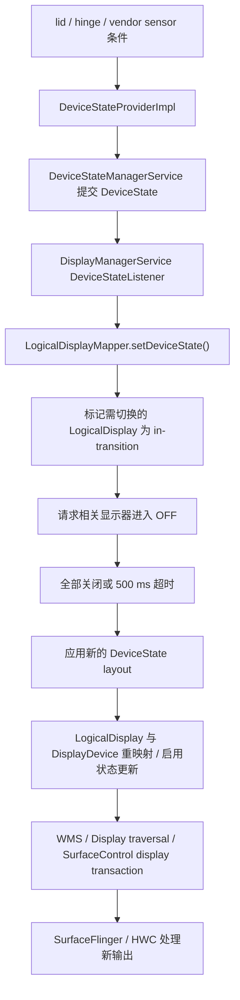

# 2.28 折叠屏显示切换、窗口连续性与渲染性能

折叠屏的性能问题常被简化为“大屏像素更多，所以 GPU 更慢”，但像素量只能解释部分现象。一次折叠或展开可能同时触发：

- 设备姿态条件变化；
- 内建物理显示器的开关或重映射；
- WMS 的 DisplayContent、Task、窗口与 Insets 更新；
- Shell/SystemUI 的可选 unfold transition；
- 应用窗口尺寸、资源配置与布局变化；
- SurfaceFlinger 为目标显示器重新构建可见图层集合；
- HWC 针对新显示器、显示模式和图层属性重新选择合成策略。

这些阶段属于不同进程和时间边界。排查时先判断问题落在哪一层，再讨论 GPU、Activity 重建或铰链传感器。

以下分析以 Android 17 / API 37 / `android-17.0.0_r1` 为准。Android 12～16 仅用于说明演进。

## 1. 先建立对象模型

### 1.1 Physical Display、DisplayDevice 与 LogicalDisplay

Android 显示框架区分物理设备和系统对外使用的逻辑显示器：

- **物理 Display**：面板与 HWC display，由物理地址标识；
- **`DisplayDevice`**：DisplayManager 对物理或虚拟显示设备的包装；
- **`LogicalDisplay`**：系统用于组织图层栈、DisplayInfo、显示组和窗口内容的逻辑对象；
- **SurfaceFlinger Display / CompositionEngine Output**：针对最终输出建立合成状态并执行 present。

折叠设备可能让一个稳定的逻辑显示器 ID 在不同设备状态下映射到不同内建面板。它也可能保留多个逻辑显示器，并在布局中改变启用状态。具体方式由设备厂商配置决定。

因此：

- “内屏/外屏切换”不一定表现为 `DisplayListener.onDisplayRemoved()` 再 `onDisplayAdded()`；
- logical display id 没变，也不能推导底层物理面板、分辨率、density 或 mode 没变；
- 看到两个内建面板，不代表两个面板始终能同时点亮。

### 1.2 DeviceStateToLayoutMap 决定什么

Android 17 的 `DeviceStateToLayoutMap` 从以下位置读取显示布局：

```text
/data/system/displayconfig/display_layout_configuration.xml
/vendor/etc/displayconfig/display_layout_configuration.xml
```

每个设备状态布局可以为显示器配置：

- 物理 `DisplayAddress`；
- logical display id；
- 是否 enabled；
- display group；
- 前后位置；
- lead display；
- brightness / refresh-rate / thermal / power throttling 策略 id。

刷新率和亮度策略可以随布局改变，但 AOSP 没有“展开态固定 120 Hz、折叠态固定低刷新率”的通用规则。具体显示模式还要经过 `DisplayModeDirector`、设备配置、内容投票、热限制和用户设置。

### 1.3 多内屏并发属于设备能力

`config_supportsConcurrentInternalDisplays` 表示设备是否支持同时点亮多个内建显示器。布局还要启用相应显示器，系统才会进入并发内屏状态。

即使两个显示器同时工作，也不能假设它们的硬件资源完全隔离。HWC 会分别验证和送显，但硬件叠加层、内存带宽、GPU、显示控制器和功耗预算可能受 SoC 与厂商实现共同约束。

## 2. Android 17 的设备状态主线

### 2.1 状态来源由设备配置决定

`DeviceStateProviderImpl` 从厂商或数据分区的 `device_state_configuration.xml` 读取状态及条件。条件可以引用：

- lid switch；
- 指定字符串类型与名称的传感器；
- 一个传感器的一个或多个数值范围。

Provider ID 从小到大检查条件，选择首个匹配状态。所需传感器会以 `SENSOR_DELAY_FASTEST` 注册，但事件频率仍受具体传感器能力与 HAL 行为限制。

这里没有强制规定“所有折叠设备只看 `TYPE_HINGE_ANGLE`”。厂商可以组合霍尔传感器、hinge angle、上盖开关或其他传感器条件。DeviceState ID 也是设备配置值，不应在跨设备脚本中写死 `STATE_OPEN=...`。

### 2.2 从 DeviceState 到显示 layout

Android 17 的关键路径可以概括为：



`DeviceStateManagerService` 提交状态时会写入：

- `DeviceStateChanged` trace instant；
- `debug.tracing.device_state` system property；
- `DEVICE_STATE_CHANGED` stats atom。

DisplayManager 收到回调后，先向 WMS 投递设备状态消息，再调用 `LogicalDisplayMapper.setDeviceState()`。源码注释说明，这个次序用于让 WMS 的设备状态更新与显示变化事件保持可控次序。

### 2.3 为什么切换过程中会看到黑场或过渡层

`LogicalDisplayMapper` 比较新旧布局。以下情况会把显示器标为过渡中：

- 启用状态变化；
- 同一个物理 DisplayDevice 将映射到新的逻辑显示器 ID；
- DisplayDevice 只出现在新旧布局的一侧；
- 显示器已处于过渡中。

系统先发送过渡阶段更新，让相关显示器关闭。所有过渡中的显示器确认关闭后，才会清除过渡标记、应用新布局并发出后续更新。源码给这段等待设置了 **500 ms** 的强制推进超时。

该机制通过显示器熄屏遮住窗口缩放过程中可能出现的错误尺寸。500 ms 是框架状态转换的兜底上限，不代表屏幕一定黑场 500 ms，也不代表折叠动画时长。

原始正文中“固定丢 1–3 帧”“第一帧高 30–50%”之类数值没有 AOSP 保证。设备的面板时序、power sequence、Shell transition、应用重绘和 HWC 能力都会改变观测结果。

### 2.4 layout 应用与 SurfaceFlinger 的边界

`applyLayoutLocked()` 会：

1. 按布局中的物理地址查找 `DisplayDevice`；
2. 查找或创建对应 `LogicalDisplay`；
3. 必要时交换 `LogicalDisplay` 背后的 `DisplayDevice`；
4. 更新 position、lead display、refresh-rate zone、thermal throttling 与 enabled 状态。

后续 DisplayManager 遍历使用 `SurfaceControl.Transaction` 更新显示图层栈、标志、投影、尺寸和 Surface。SurfaceFlinger 接收显示事务，并为新的显示器和输出状态构建合成输入。

SurfaceFlinger 不负责识别手机处于书本姿态还是桌面姿态。它处理的是 system_server 已转换好的显示器与图层状态。

## 3. WMS、Shell 与应用窗口

### 3.1 显示树和 Surface 树要分开看

WMS 侧按以下对象组织窗口：

```text
RootWindowContainer
  DisplayContent
    DisplayArea / TaskDisplayArea
      Task / TaskFragment
        ActivityRecord
          WindowToken / WindowState
```

这棵管理树不会与 SurfaceFlinger layer tree 一一对应。Shell transition 可以创建 leash，把 Task 或窗口 surface 临时 reparent 到 leash，再对 leash 设置 matrix、crop、corner radius 和 position。

折叠动画期间看到任务牵引层缩放，不能据此判断应用每次进度更新都重新提交了一块完整缓冲区。

### 3.2 Android 17 的可选 unfold 动画

平台资源 `config_unfoldTransitionEnabled` 与 `config_unfoldTransitionHingeAngle` 决定设备是否启用相应能力。启用角度进度时，SystemUI 的 `HingeSensorAngleProvider` 获取 `TYPE_HINGE_ANGLE`，并通过后台 Handler 以 `SENSOR_DELAY_FASTEST` 接收事件。

`PhysicsBasedUnfoldTransitionProgressProvider` 把铰链角度映射到 0～1 progress，并用弹簧动画平滑更新。WM Shell 的 `UnfoldTransitionHandler` 在进度回调中创建 `SurfaceControl.Transaction`，让任务动画器更新牵引层。

以 fullscreen task 为例，AOSP 的 animator 主要更新：

- `setWindowCrop()`；
- `setMatrix()`；
- `setCornerRadius()`；
- `show()`。

这些是图层几何事务。应用仍按自己的 Choreographer、View/HWUI 或其他生产者路径生产内容。

动画由资源和设备能力控制。未启用这组模块的设备、厂商自定义过渡、锁屏/AOD 和半开状态都可能走不同路径。

### 3.3 Configuration 与 WindowLayoutInfo 没有固定先后顺序

物理显示器切换、窗口边界更新和 WindowManager Extensions 姿态更新来自不同组件。应用不应依赖以下固定顺序：

```text
WindowLayoutInfo → Configuration → onConfigurationChanged
```

一次折叠或展开可能改变 `screenSize`、`smallestScreenSize`、`screenLayout`、`orientation`、`density` 或其他配置；具体集合取决于物理面板、windowing mode、旋转与厂商实现。

默认情况下，Activity 未声明自行处理的配置变化会触发重建。若使用 `android:configChanges`，应用必须重新读取受影响资源并更新界面，不能只记录回调后原样返回。

## 4. Jetpack WindowManager：面向应用的窗口姿态

### 4.1 WindowInfoTracker 的职责

Jetpack WindowManager 的 `WindowInfoTracker.windowLayoutInfo(activity)` 返回 `WindowLayoutInfo` 流。`displayFeatures` 中可能包含 `FoldingFeature`。

它描述当前应用窗口坐标系中的折叠或铰链特征：

- `bounds`：特征在应用窗口中的矩形；
- `state`：`FLAT` 或 `HALF_OPENED`；
- `orientation`：折叠或铰链轴线为 `HORIZONTAL` 或 `VERTICAL`；
- `occlusionType`：`NONE` 或 `FULL`；
- `isSeparating`：该特征是否把可用窗口视为两个逻辑区域。

`FoldingFeature` 没有 `CLOSED` 状态，也不提供精确铰链角度。应用切到外屏后，当前窗口可能不再包含折叠特征。

### 4.2 orientation 的含义容易读反

`FoldingFeature.Orientation.HORIZONTAL` 表示特征的宽大于高，铰链线沿水平方向；`VERTICAL` 表示铰链线沿垂直方向。

判断桌面姿态时通常检查：

```kotlin
foldingFeature.state == FoldingFeature.State.HALF_OPENED &&
    foldingFeature.orientation == FoldingFeature.Orientation.HORIZONTAL
```

判断书本姿态时把方向换成 `VERTICAL`。双屏设备即使报告 `FLAT`，铰链仍可能处于分隔状态。

### 4.3 遮挡与分隔回答不同问题

- `occlusionType == FULL`：特征边界内的内容不可见或不可触达；
- `occlusionType == NONE`：特征自身不遮挡内容；
- `isSeparating == true`：布局应把该特征视作两个逻辑区域的边界。

连续柔性屏在平放时可以没有遮挡也不分隔；半开时通常处于分隔状态。双面板铰链可以形成分隔，即使特征边界的某个维度为零。

布局代码应分别判断边界、遮挡和分隔状态，不能只用 `state == FLAT` 推导“整个窗口没有铰链约束”。

### 4.4 生命周期安全的收集方式

官方推荐在 `STARTED` 生命周期内收集，停止时自动取消：

```kotlin
lifecycleScope.launch(Dispatchers.Main) {
    lifecycle.repeatOnLifecycle(Lifecycle.State.STARTED) {
        WindowInfoTracker.getOrCreate(this@MainActivity)
            .windowLayoutInfo(this@MainActivity)
            .collect { layoutInfo ->
                val fold = layoutInfo.displayFeatures
                    .filterIsInstance<FoldingFeature>()
                    .firstOrNull()
                renderPosture(fold)
            }
    }
}
```

这段代码解决订阅生命周期问题，不限制重组或 View 布局成本。回调中应先把姿态归一化为小而稳定的界面状态，再让受影响的区域读取它。

## 5. 原始铰链角度传感器的使用边界

### 5.1 TYPE_HINGE_ANGLE 是变化时上报的传感器

`Sensor.TYPE_HINGE_ANGLE` 的类型值是 36，string type 为 `android.sensor.hinge_angle`。AOSP 传感器规范将它定义为：

- on-change reporting mode；
- 角度单位为度；
- 默认传感器是唤醒传感器。

它不是每台设备都必须提供的公共能力。应用需要检查 `getDefaultSensor(TYPE_HINGE_ANGLE)` 是否为 null。

变化时上报也意味着它不是固定 60 Hz 或 120 Hz 的周期源。`SENSOR_DELAY_FASTEST` 只是请求尽快交付，不会突破传感器的实际最小延迟、HAL 去抖或事件变化规律。

### 5.2 精确角度动画需要设备校准

Android 官方明确提醒：不同设备的上报范围和精度可能不同，基于精确角度的动画或业务逻辑需要针对设备调校。

面向普通应用：

- 姿态和布局优先使用 `FoldingFeature`；
- 只有需要连续角度体验时再订阅传感器；
- 在后台线程接收并保存最新值；
- 按界面帧节奏采样最新值，避免每个传感器事件都触发整个视图树的 `requestLayout()`；
- 页面停止或不需要动画时及时注销。

“角度回调到屏幕超过两帧即可感知”没有统一依据。应按目标刷新率、设备、动画速度和输入到显示的测量结果设门槛。

### 5.3 系统状态与应用传感器回调不在同一条时间线

DeviceStateProvider 可以用铰链传感器条件产生离散设备状态；SystemUI 也可能直接用铰链角度驱动展开进度；应用还可以注册自己的监听器。三者的线程、过滤、权限与消费时机不同。

Perfetto 中出现 `DeviceStateChanged`，只能证明 DeviceState 已提交。它不能替代原始霍尔或铰链采样时间。测量从传感器到屏幕的延迟，需要平台跟踪点、应用自定义跟踪或外部硬件时间基准。

## 6. 应用连续性与布局成本

### 6.1 Activity 重建与 ViewModel

默认配置处理会销毁并重建 Activity。Architecture Components 的 `ViewModel` 会跨配置变化保留；`SavedStateHandle`、`rememberSaveable` 等用于恢复可保存的界面状态，并应覆盖系统进程被回收的情况。

Activity 重建通常不会创建新的 ViewModel；`ViewModelStore` 会跨配置变化保留实例。

需要保留的状态通常包括：

- 导航位置；
- 列表滚动位置；
- 输入中的表单；
- 媒体播放位置；
- 当前选中的窗格或项目；
- 尚未提交的编辑内容。

这些状态应与窗口尺寸和姿态分离。折叠或展开改变布局时，不应顺带清空业务状态或跳到另一个导航目的地。

### 6.2 自行处理配置变化的代价

声明：

```xml
android:configChanges="orientation|screenSize|smallestScreenSize|screenLayout"
```

可以让 Activity 自行处理列出的变化。任何未声明变化仍可能触发重建。自行处理还要求：

- 重新读取尺寸与资源；
- 更新 View/Compose 的布局状态；
- 处理 display、density、Insets 与 camera preview 等派生状态；
- 验证资源限定符是否重新生效。

这是生命周期选择，不是通用性能开关。Activity 重建较慢时，应先检查视图加载、同步 I/O、重复初始化或状态恢复成本；不能仅靠增加 `configChanges` 掩盖问题。

### 6.3 Compose 的成本取决于依赖范围

Compose 中窗口尺寸或姿态状态改变后，读取该状态的可组合项会失效，随后可能发生重组、重新测量和重绘。成本取决于依赖范围与布局结构，没有“`BoxWithConstraints` 必然慢”或“Crossfade 在 RenderThread 上所以更快”的通用结论。

建议：

- 在靠近自适应布局决策的位置读取 `WindowSizeClass` / posture；
- 传递稳定、有明确语义的紧凑、中等、扩展等级或窗格策略；
- 避免把原始铰链角度放入页面根节点的高频状态；
- 用 Layout Inspector、Compose 跟踪与 Perfetto 查找具体失效范围；
- 对列表详情、辅助窗格等结构优先使用 Material 3 Adaptive 组件。

### 6.4 Android 17 大屏行为

Android 16 对目标 SDK 36 的应用引入大屏方向、宽高比与可缩放性限制忽略行为，并提供临时退出项。

Android 17 对目标 SDK 37 的应用移除该退出项。官方文档将适用范围写为最小宽度大于 600 dp 的显示器；在这类环境中，以下限制不能再作为布局前提：

- 固定方向的 `screenOrientation` 值；
- 对应的 `setRequestedOrientation()` 和 `getRequestedOrientation()`；
- `resizeableActivity="false"`；
- `minAspectRatio` / `maxAspectRatio`。

按 `android:appCategory` 分类的游戏、最小宽度小于 600 dp 的屏幕，以及用户在设备比例设置中选择应用默认行为的情况属于官方列出的例外。

这项变更增加了应用遇到旋转、resize、折叠和桌面窗口边界的机会，但没有改变 BLAST、SurfaceFlinger 或 HWC 的基本显示管线。

## 7. SurfaceFlinger、HWC 与像素成本

### 7.1 每个目标显示器都有自己的输出

SurfaceFlinger FrontEnd 接收应用、WMS 和 Shell 的图层事务。CompositionEngine 针对每个显示器或输出构建可见图层集合，HWC 再为该显示器执行验证和送显。

分析并发内外屏时，需要分别记录：

- display id 与物理地址；
- active mode、resolution、density 与 refresh rate；
- 目标输出的可见图层；
- DEVICE / CLIENT composition；
- 每个显示器的送显栅栏。

同一图层经镜像或投影出现在两个输出时，不能把两次送显合并成一条时间线。

### 7.2 分辨率更高只说明潜在工作量上升

展开后的应用窗口可能有更大像素面积，影响：

- HWUI/游戏/视频的渲染分辨率；
- RenderEngine 客户端目标面积；
- GPU texture、render target 与带宽；
- 缓冲区内存占用；
- HWC 缩放器和硬件叠加层约束。

最终成本还取决于 damage、遮挡、DEVICE composition、动态分辨率、buffer format、刷新率和内容复杂度。不同设备的内外屏尺寸差异很大，不能套用“内屏固定是外屏 2–3 倍像素”。

### 7.3 几何、缓冲区与送显是三类证据

折叠 transition 中常同时出现：

- Shell/WMS 对 task leash 的 matrix、crop、position；
- App 按新 bounds 提交的 BLAST buffer；
- SF/HWC 针对目标显示器的送显。

新几何信息可以暂时显示旧缓冲区，系统也可能用快照、启动窗口或背景层遮住重绘间隙。判断“第一帧已适配”时，应同时确认：

1. 应用收到新的窗口边界或配置；
2. 对应的应用窗口提交新尺寸缓冲区；
3. SF 锁存该缓冲区；
4. 目标显示器的送显到达预期边界。

## 8. 性能测量：先定义起点与终点

### 8.1 推荐的时间点

一次显示切换可以记录：

| 时间点 | 含义 | 可用证据 |
|---|---|---|
| T0 | 原始物理动作 | 外部夹具、平台传感器跟踪或应用自定义传感器跟踪 |
| T1 | DeviceState 已提交 | `DeviceStateChanged` trace instant |
| T2 | display transition / WMS switch 开始 | DisplayThread、WMS/Shell transition |
| T3 | 应用已收到新窗口信息 | Configuration / WindowLayoutInfo 自定义跟踪 |
| T4 | App 新 bounds 的 buffer 被 SF 采纳 | App frame、`BufferTX`、latch |
| T5 | 目标 Display 完成对应 present | DisplayFrame、HWC、present fence |

测量前应声明范围是 T1→T5、T3→T5 还是 T0→光学显示。这三种数值回答的问题不同。

### 8.2 Perfetto 采集

快速采集可以覆盖调度、图形、窗口、Binder 与功耗类别：

```bash
adb shell perfetto \
  -o /data/misc/perfetto-traces/fold-switch.perfetto-trace \
  -t 20s \
  sched freq idle binder_driver gfx view wm power
```

分析时重点找：

- system_server 的 `DeviceStateChanged`；
- `DisplayThread` 上的 DeviceState/DMS/WMS 工作；
- `LogicalDisplayMapper`、显示器电源状态与逻辑显示器事件；
- WM Shell transition、task leash transaction；
- `FoldUnfoldTransitionInProgress` 异步切片和计数器（设备启用对应模块时）；
- App `onConfigurationChanged`、Activity recreation、`Choreographer#doFrame`、measure/layout、Compose recomposition；
- App Window `BufferTX`、latch 与 FrameTimeline；
- SurfaceFlinger 每个目标显示器的合成与送显。

系统不保证默认跟踪中包含原始 `android.sensor.hinge_angle` 连续轨道。需要原始角度时，应显式加入可控的应用或平台插桩。

### 8.3 功能自动化与性能测试分开

截至 2026-07，Espresso Device API 1.0.1 可在兼容虚拟设备上执行：

```kotlin
onDevice().setClosedMode()
onDevice().setFlatMode()
```

它适合验证 compact/expanded UI、pane、导航和状态保存。`@RequiresDeviceMode` 可跳过不支持相应 mode 的设备。

模拟器适合功能回归，不适合产出代表用户设备的性能结论。官方 Macrobenchmark 文档也建议在物理设备上测量。性能测试可以使用 `FrameTimingMetric` 和系统跟踪，但必须提供稳定、可重复的折叠触发方式，例如人工节拍、机械夹具或受控系统测试接口。

### 8.4 device_state shell 命令的边界

Android 17 支持：

```bash
adb shell cmd device_state print-states
adb shell cmd device_state state <STATE_ID>
adb shell cmd device_state state reset
```

`state <STATE_ID>` 请求的是模拟设备状态，shell 帮助说明它不会改变设备的物理状态。它可以覆盖 DMS/WMS/SF 的状态切换测试，但会跳过真实的霍尔或铰链运动、面板机械过程以及部分上电时序。

STATE_ID 来自当前设备配置，应先用 `print-states` 查询，测试结束后执行重置。

### 8.5 dumpsys 快照

```bash
adb shell dumpsys devicestate
adb shell dumpsys display
adb shell dumpsys window displays
adb shell dumpsys SurfaceFlinger --display
```

这些快照分别回答：

- base/pending/committed DeviceState 与 override；
- DeviceState layout、LogicalDisplay、DisplayDevice、enabled/state/mode；
- WMS 的 DisplayContent、Task 和窗口边界；
- SF 侧显示令牌、图层栈与输出配置。

快照没有时间信息，不能代替 Perfetto。最好在切换前、异常时、稳定后各保存一份，并按显示器 ID、物理地址和图层栈对齐。

## 9. 常见故障模式

### 9.1 切换后旧布局闪现

检查顺序：

1. 新 Configuration / WindowLayoutInfo 的到达时间；
2. Activity 是否重建，旧窗口是否仍可见；
3. 新边界的首个缓冲区何时提交；
4. Shell 过渡是否在缩放旧缓冲区或快照；
5. SF 何时锁存新缓冲区。

### 9.2 折叠时状态丢失

先确认 Activity 重建和进程生命周期，再检查 ViewModel、SavedStateHandle、`rememberSaveable` 与业务持久化。不能把布局模式本身当成导航状态。

### 9.3 动画跟手性差

区分：

- 原始角度交付慢；
- SystemUI 进度线程或弹簧动画更新慢；
- Shell 事务提交慢；
- SF/HWC 送显晚；
- 应用用角度驱动大范围布局。

只看应用的 `onSensorChanged()` 间隔无法定位显示后段。

### 9.4 展开后 GPU/功耗上升

记录新旧显示器的：

- 渲染目标与应用缓冲区尺寸；
- 刷新率和显示模式；
- CLIENT/DEVICE composition；
- 可见图层集合与过渡牵引层；
- GPU frequency/busy、内存带宽和 thermal 状态。

面积、刷新率、合成策略和动画可能同时变化，应逐项对照。

### 9.5 双屏模式只有一侧更新

确认设备是否处于支持并发内建显示器的状态，两个逻辑显示器是否启用，目标内容采用扩展、镜像还是后屏或双屏会话。随后分别检查每个显示器的图层栈、输出和送显。

## 10. 版本演进

| 平台 | 相关变化 | 分析边界 |
|---|---|---|
| Android 11 / API 30 | `TYPE_HINGE_ANGLE` 进入平台 sensor API | sensor 可选、on-change；不等同于窗口 posture |
| Android 12 / API 31 | 这里使用的现代 BLAST/FrameTimeline 基线 | 可按 App buffer、SF layer、DisplayFrame 分阶段分析 |
| Android 12L / API 32 | 大屏系统体验与 Activity Embedding 进入主流支持范围 | 折叠设备展开后常进入多窗格或分屏，但要在运行时查询能力 |
| Android 13 / API 33 | 多窗口与大屏路径继续演进 | 不改变 DeviceState、LogicalDisplay、App Window、SF Output 的分层 |
| Android 14 / API 34 | 公开 `SurfaceSyncGroup`；部分设备提供后屏或双屏显示模式 | 同步接口与折叠姿态接口职责不同；特殊显示模式需查询设备能力 |
| Android 15 / API 35 | WindowManager Extensions 6 可查询支持的姿态 | 支持的姿态是能力信息，不提供连续铰链角度 |
| Android 16 / API 36 | target 36 大屏方向/比例/resizability 限制忽略，保留临时 opt-out | 应用要覆盖更多 resize、rotation 与展开态 |
| Android 17 / API 37 | 移除上述退出项；平台源码以此版本为准 | 最小宽度大于 600 dp 时不能依赖固定方向与不可缩放声明 |

## 11. 源码与官方文档入口

### Android 17 AOSP

- [`DeviceStateProviderImpl.java`](https://android.googlesource.com/platform/frameworks/base/+/refs/tags/android-17.0.0_r1/services/core/java/com/android/server/policy/DeviceStateProviderImpl.java)：厂商条件、上盖或传感器监听与状态选择；
- [`DeviceStateManagerService.java`](https://android.googlesource.com/platform/frameworks/base/+/refs/tags/android-17.0.0_r1/services/core/java/com/android/server/devicestate/DeviceStateManagerService.java)：pending/committed state、trace 与 callback；
- [`LogicalDisplayMapper.java`](https://android.googlesource.com/platform/frameworks/base/+/refs/tags/android-17.0.0_r1/services/core/java/com/android/server/display/LogicalDisplayMapper.java)：transition、OFF 等待、500 ms 超时、logical/physical remap；
- [`DeviceStateToLayoutMap.java`](https://android.googlesource.com/platform/frameworks/base/+/refs/tags/android-17.0.0_r1/services/core/java/com/android/server/display/DeviceStateToLayoutMap.java) 与 [`Layout.java`](https://android.googlesource.com/platform/frameworks/base/+/refs/tags/android-17.0.0_r1/services/core/java/com/android/server/display/layout/Layout.java)：每个状态的显示布局；
- [`DisplayManagerService.java`](https://android.googlesource.com/platform/frameworks/base/+/refs/tags/android-17.0.0_r1/services/core/java/com/android/server/display/DisplayManagerService.java)：DeviceState callback、logical display event、Display traversal；
- [`HingeSensorAngleProvider.kt`](https://android.googlesource.com/platform/frameworks/base/+/refs/tags/android-17.0.0_r1/packages/SystemUI/unfold/src/com/android/systemui/unfold/updates/hinge/HingeSensorAngleProvider.kt) 与 [`PhysicsBasedUnfoldTransitionProgressProvider.kt`](https://android.googlesource.com/platform/frameworks/base/+/refs/tags/android-17.0.0_r1/packages/SystemUI/unfold/src/com/android/systemui/unfold/progress/PhysicsBasedUnfoldTransitionProgressProvider.kt)：可选的角度到进度转换路径；
- [`UnfoldTransitionHandler.java`](https://android.googlesource.com/platform/frameworks/base/+/refs/tags/android-17.0.0_r1/libs/WindowManager/Shell/src/com/android/wm/shell/unfold/UnfoldTransitionHandler.java) 与 [`FullscreenUnfoldTaskAnimator.java`](https://android.googlesource.com/platform/frameworks/base/+/refs/tags/android-17.0.0_r1/libs/WindowManager/Shell/src/com/android/wm/shell/unfold/animation/FullscreenUnfoldTaskAnimator.java)：Shell 任务牵引层动画；
- [`SurfaceFlinger.cpp`](https://android.googlesource.com/platform/frameworks/native/+/refs/tags/android-17.0.0_r1/services/surfaceflinger/SurfaceFlinger.cpp) 与 [`CompositionEngine`](https://android.googlesource.com/platform/frameworks/native/+/refs/tags/android-17.0.0_r1/services/surfaceflinger/CompositionEngine/)：display transaction、snapshot 与 per-display output。

### 应用与测试文档

- [Make your app fold aware](https://developer.android.com/develop/adaptive-apps/guides/foldables/make-your-app-fold-aware)：`WindowInfoTracker`、`FoldingFeature` 与生命周期感知收集；
- [`FoldingFeature` API](https://developer.android.com/reference/androidx/window/layout/FoldingFeature)：state、orientation、occlusion、separating 的定义；
- [Android 17 大屏方向与缩放行为](https://developer.android.com/about/versions/17/changes/ff-restrictions-ignored)：target 37 规则与例外；
- [Configuration and continuity](https://developer.android.com/guide/topics/large-screens/configuration-and-continuity)：Activity 重建、自行处理配置与状态连续性；
- [Espresso Device API](https://developer.android.com/studio/test/espresso-api)：虚拟设备上的 closed/flat mode 功能测试；
- [AOSP hinge angle sensor](https://source.android.com/docs/core/interaction/sensors/sensor-types#hinge_angle)：on-change、wake-up 与单位。

## 小结

折叠屏显示切换应按五层理解：

1. 厂商条件产生离散 DeviceState；
2. DMS 选择布局，并在需要时先关闭过渡中的显示器；
3. WMS/Shell 更新显示器、窗口树和过渡牵引层；
4. 应用处理新的窗口边界、配置与 `FoldingFeature`；
5. SurfaceFlinger/HWC 为每个目标显示器合成并送显。

分析性能时，应使用明确的起止时间对齐这五层。缺少同一设备、状态和刷新率下的跟踪与显示证据时，不能为折叠切换套用固定帧数或毫秒结论。

> 版本范围：平台路径按 AOSP `android-17.0.0_r1` 核对；结论最高适用于 Android 17 / API 37。
