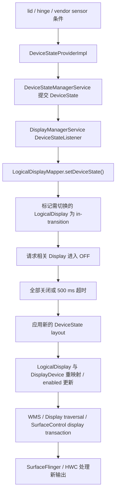

# 2.28 折叠屏显示切换、窗口连续性与渲染性能

折叠屏的性能问题常被简化为“大屏像素更多，所以 GPU 更慢”，但像素量只能解释部分现象。一次折叠或展开可能同时触发：

- 设备姿态条件变化；
- 内建物理 Display 的开关或重映射；
- WMS 的 DisplayContent、Task、Window 与 Insets 更新；
- Shell/SystemUI 的可选 unfold transition；
- 应用窗口尺寸、资源配置与布局变化；
- SurfaceFlinger 为目标 Display 重新构建可见 layer 集合；
- HWC 针对新 Display、mode 和 layer 属性重新选择合成策略。

这些阶段属于不同进程和时间边界。排查时先判断问题落在哪一层，再讨论 GPU、Activity 重建或铰链传感器。

以下分析以 Android 17 / API 37 / `android-17.0.0_r1` 为准。Android 12～16 仅用于说明演进。

## 1. 先建立对象模型

### 1.1 Physical Display、DisplayDevice 与 LogicalDisplay

Android 显示框架区分物理设备和系统对外使用的逻辑 Display：

- **物理 Display**：面板与 HWC display，由物理地址标识；
- **`DisplayDevice`**：DisplayManager 对物理或虚拟显示设备的包装；
- **`LogicalDisplay`**：系统用于组织 layer stack、DisplayInfo、display group 和窗口内容的逻辑对象；
- **SurfaceFlinger Display / CompositionEngine Output**：针对最终输出建立合成状态并执行 present。

折叠设备可能让一个稳定的逻辑显示器 ID 在不同设备状态下映射到不同内建面板。它也可能保留多个逻辑 Display，并在布局中改变启用状态。具体方式由设备厂商配置决定。

因此：

- “内屏/外屏切换”不一定表现为 `DisplayListener.onDisplayRemoved()` 再 `onDisplayAdded()`；
- logical display id 没变，也不能推导底层物理面板、分辨率、density 或 mode 没变；
- 看到两个内建面板，不代表两个面板始终能同时点亮。

### 1.2 DeviceStateToLayoutMap 决定什么

Android 17 的 `DeviceStateToLayoutMap` 从以下位置读取 display layout：

```text
/data/system/displayconfig/display_layout_configuration.xml
/vendor/etc/displayconfig/display_layout_configuration.xml
```

每个 device-state layout 可以为 Display 配置：

- 物理 `DisplayAddress`；
- logical display id；
- 是否 enabled；
- display group；
- 前后位置；
- lead display；
- brightness / refresh-rate / thermal / power throttling 策略 id。

刷新率和亮度策略可以随布局改变，但 AOSP 没有“展开态固定 120 Hz、折叠态固定低刷新率”的通用规则。具体 mode 还要经过 `DisplayModeDirector`、设备配置、内容投票、热限制和用户设置。

### 1.3 多内屏并发属于设备能力

`config_supportsConcurrentInternalDisplays` 表示设备是否支持同时点亮多个内建 Display。layout 还要把相应 Display 设为 enabled，系统才会进入并发内屏状态。

即使两个 Display 同时工作，也不能假设它们的硬件资源完全隔离。HWC 对每个 Display 进行 validate/present，但 overlay、内存带宽、GPU、显示控制器和功耗预算可能受 SoC 与 vendor 实现共同约束。

## 2. Android 17 的设备状态主线

### 2.1 状态来源由设备配置决定

`DeviceStateProviderImpl` 从 vendor 或 data 分区的 `device_state_configuration.xml` 读取状态及条件。条件可以引用：

- lid switch；
- 指定 string type 与 name 的 sensor；
- 一个 sensor 的一个或多个数值范围。

Provider ID 从小到大检查条件，选择首个匹配状态。所需传感器会以 `SENSOR_DELAY_FASTEST` 注册，但事件频率仍受具体 sensor 能力与 HAL 行为限制。

这里没有强制规定“所有折叠设备只看 `TYPE_HINGE_ANGLE`”。厂商可以组合 hall sensor、hinge angle、lid switch 或其他传感器条件。DeviceState id 也是设备配置值，不应在跨设备脚本中写死 `STATE_OPEN=...`。

### 2.2 从 DeviceState 到显示 layout

Android 17 的关键路径可以概括为：



`DeviceStateManagerService` 提交状态时会写入：

- `DeviceStateChanged` trace instant；
- `debug.tracing.device_state` system property；
- `DEVICE_STATE_CHANGED` stats atom。

DisplayManager 收到回调后，先向 WMS 投递 device state 消息，再调用 `LogicalDisplayMapper.setDeviceState()`。源码注释说明，这个次序用于让 WMS 的 device-state 更新与 display change 事件保持可控次序。

### 2.3 为什么切换过程中会看到黑场或过渡层

`LogicalDisplayMapper` 比较新旧布局。以下情况会把 Display 标为过渡中：

- enabled 状态变化；
- 同一个物理 DisplayDevice 将映射到新的 logical display id；
- DisplayDevice 只出现在新旧 layout 的一侧；
- Display 已处于 transition。

系统先发送过渡阶段更新，让相关 Display 关闭。所有过渡中的显示器确认关闭后，才会清除过渡标记、应用新布局并发出后续更新。源码给这段等待设置了 **500 ms** 的强制推进超时。

该机制通过显示器熄屏遮住 resize 过程中可能出现的错误尺寸。500 ms 是框架状态转换的兜底上限，不代表屏幕一定黑场 500 ms，也不代表折叠动画时长。

原始正文中“固定丢 1–3 帧”“第一帧高 30–50%”之类数值没有 AOSP 保证。设备的面板时序、power sequence、Shell transition、应用重绘和 HWC 能力都会改变观测结果。

### 2.4 layout 应用与 SurfaceFlinger 的边界

`applyLayoutLocked()` 会：

1. 按 layout 中的物理地址查找 `DisplayDevice`；
2. 查找或创建对应 `LogicalDisplay`；
3. 必要时交换 `LogicalDisplay` 背后的 `DisplayDevice`；
4. 更新 position、lead display、refresh-rate zone、thermal throttling 与 enabled 状态。

后续 DisplayManager traversal 使用 `SurfaceControl.Transaction` 更新 display layer stack、flags、projection、size 和 surface。SurfaceFlinger 接收 display transaction，并为新的 display/output 状态构建合成输入。

SurfaceFlinger 不负责识别手机处于书本姿态还是桌面姿态。它处理的是 system_server 已转换好的 Display 与图层状态。

## 3. WMS、Shell 与应用窗口

### 3.1 Display 树和 Surface 树要分开看

WMS 侧按以下对象组织窗口：

```text
RootWindowContainer
  DisplayContent
    DisplayArea / TaskDisplayArea
      Task / TaskFragment
        ActivityRecord
          WindowToken / WindowState
```

这棵管理树不会与 SurfaceFlinger layer tree 一一对应。Shell transition 可以创建 leash，把 Task 或窗口 surface 临时 reparent 到 leash，再对 leash 设置 matrix、crop、corner radius 和 position。

折叠动画期间看到 task leash 缩放，不能据此判断 App 每个 progress 都重新提交了一张完整 buffer。

### 3.2 Android 17 的可选 unfold 动画

平台资源 `config_unfoldTransitionEnabled` 与 `config_unfoldTransitionHingeAngle` 决定设备是否启用相应能力。启用角度进度时，SystemUI 的 `HingeSensorAngleProvider` 获取 `TYPE_HINGE_ANGLE`，并通过后台 Handler 以 `SENSOR_DELAY_FASTEST` 接收事件。

`PhysicsBasedUnfoldTransitionProgressProvider` 把 hinge angle 映射到 0–1 progress，并用 spring animation 平滑更新。WM Shell 的 `UnfoldTransitionHandler` 在进度回调中创建 `SurfaceControl.Transaction`，让 task animator 更新 leash。

以 fullscreen task 为例，AOSP 的 animator 主要更新：

- `setWindowCrop()`；
- `setMatrix()`；
- `setCornerRadius()`；
- `show()`。

这些是 layer 几何事务。App 仍按自己的 Choreographer、View/HWUI 或其他 Producer 路径生产内容。

动画由资源和设备能力控制。未启用这组模块的设备、厂商自定义 transition、锁屏/AOD 和半开状态都可能走不同路径。

### 3.3 Configuration 与 WindowLayoutInfo 没有固定先后顺序

物理 Display 切换、窗口 bounds 更新和 WindowManager Extensions posture 更新来自不同组件。应用不应依赖以下固定顺序：

```text
WindowLayoutInfo → Configuration → onConfigurationChanged
```

一次折叠或展开可能改变 `screenSize`、`smallestScreenSize`、`screenLayout`、`orientation`、`density` 或其他配置；具体集合取决于物理面板、windowing mode、rotation 与厂商实现。

默认情况下，Activity 未声明自行处理的 configuration change 会触发重建。若使用 `android:configChanges`，应用必须重新读取受影响资源并更新界面，不能只记录回调后原样返回。

## 4. Jetpack WindowManager：面向应用的窗口 posture

### 4.1 WindowInfoTracker 的职责

Jetpack WindowManager 的 `WindowInfoTracker.windowLayoutInfo(activity)` 返回 `WindowLayoutInfo` 流。`displayFeatures` 中可能包含 `FoldingFeature`。

它描述当前应用窗口坐标系中的 fold/hinge 特征：

- `bounds`：feature 在应用窗口中的矩形；
- `state`：`FLAT` 或 `HALF_OPENED`；
- `orientation`：fold/hinge 轴线为 `HORIZONTAL` 或 `VERTICAL`；
- `occlusionType`：`NONE` 或 `FULL`；
- `isSeparating`：该 feature 是否把可用窗口视为两个逻辑区域。

`FoldingFeature` 没有 `CLOSED` 状态，也不提供精确 hinge angle。应用切到外屏后，当前窗口可能不再包含 folding feature。

### 4.2 orientation 的含义容易读反

`FoldingFeature.Orientation.HORIZONTAL` 表示 feature 的宽大于高，铰链线沿水平方向；`VERTICAL` 表示铰链线沿垂直方向。

判断 tabletop posture 时通常检查：

```kotlin
foldingFeature.state == FoldingFeature.State.HALF_OPENED &&
    foldingFeature.orientation == FoldingFeature.Orientation.HORIZONTAL
```

判断 book posture 时把方向换成 `VERTICAL`。双屏设备即使报告 `FLAT`，hinge 仍可能保持 separating。

### 4.3 occlusion 与 separating 回答不同问题

- `occlusionType == FULL`：feature bounds 内的内容不可见或不可触达；
- `occlusionType == NONE`：feature 自身不遮挡内容；
- `isSeparating == true`：布局应把 feature 视作两个逻辑区域的边界。

连续柔性屏在平放时可以 `NONE` 且不 separating；半开时通常 separating。双面板 hinge 可以 separating，即使 feature bounds 的某个维度为零。

布局代码应分别判断边界、遮挡和分隔状态，不能只用 `state == FLAT` 推导“整个窗口没有铰链约束”。

### 4.4 生命周期安全的收集方式

官方推荐在 `STARTED` 生命周期内收集，停止时自动取消：

```kotlin
lifecycleScope.launch(Dispatchers.Main) {
    lifecycle.repeatOnLifecycle(Lifecycle.State.STARTED) {
        WindowInfoTracker.getOrCreate(this@MainActivity)
            .windowLayoutInfo(this@MainActivity)
            .collect { layoutInfo ->
                val fold = layoutInfo.displayFeatures
                    .filterIsInstance<FoldingFeature>()
                    .firstOrNull()
                renderPosture(fold)
            }
    }
}
```

这段代码解决订阅生命周期问题，不限制重组或 View 布局成本。回调中应先把姿态归一化为小而稳定的 UI state，再让受影响的区域读取它。

## 5. 原始 hinge angle sensor 的使用边界

### 5.1 TYPE_HINGE_ANGLE 是 on-change sensor

`Sensor.TYPE_HINGE_ANGLE` 的类型值是 36，string type 为 `android.sensor.hinge_angle`。AOSP 传感器规范将它定义为：

- on-change reporting mode；
- 角度单位为 degree；
- 默认传感器是唤醒传感器。

它不是每台设备都必须提供的公共能力。应用需要检查 `getDefaultSensor(TYPE_HINGE_ANGLE)` 是否为 null。

on-change 也意味着不能把它写成固定 60 Hz 或 120 Hz 的周期源。`SENSOR_DELAY_FASTEST` 只是请求尽快交付，不会突破 sensor 的实际 min delay、HAL 去抖或事件变化规律。

### 5.2 精确角度动画需要设备校准

Android 官方明确提醒：不同设备的上报范围和精度可能不同，基于精确角度的动画或业务逻辑需要针对设备调校。

面向普通应用：

- posture/layout 优先使用 `FoldingFeature`；
- 只有需要连续角度体验时再订阅 sensor；
- 在后台线程接收并保存最新值；
- 按 UI frame 节奏采样最新值，避免每个 sensor event 都触发全树 `requestLayout()`；
- 页面停止或不需要动画时及时注销。

“角度回调到屏幕超过两帧即可感知”没有统一依据。应按目标刷新率、设备、动画速度和输入到显示的测量结果设门槛。

### 5.3 系统状态与 App sensor 回调不是同一条时间线

DeviceStateProvider 可以用 hinge sensor 条件产生离散设备状态；SystemUI 又可能直接使用 hinge angle 驱动 unfold progress；App 还可以注册自己的 listener。三者的线程、过滤、权限与消费时机不同。

Perfetto 中出现 `DeviceStateChanged`，只能证明 DeviceState 已提交。它不能替代原始 hall/hinge 采样时间。要测 sensor-to-photon，需要平台 tracepoint、App 自定义 trace 或外部硬件时间基准。

## 6. 应用连续性与布局成本

### 6.1 Activity 重建与 ViewModel

默认 configuration handling 会销毁并重建 Activity。Architecture Components `ViewModel` 会跨 configuration change 保留；`SavedStateHandle`、`rememberSaveable` 等用于恢复可保存 UI 状态，并应覆盖系统进程被回收的情况。

Activity 重建通常不会创建新的 ViewModel；`ViewModelStore` 会跨配置变化保留实例。

需要保留的状态通常包括：

- 导航位置；
- 列表滚动位置；
- 输入中的表单；
- 媒体播放位置；
- 当前选中 pane 或 item；
- 尚未提交的编辑内容。

这些状态应与窗口尺寸和姿态分离。折叠或展开改变布局时，不应顺带清空业务状态或跳到另一个导航 destination。

### 6.2 自行处理 configChanges 的代价

声明：

```xml
android:configChanges="orientation|screenSize|smallestScreenSize|screenLayout"
```

可以让 Activity 自行处理列出的变化。任何未声明变化仍可能触发重建。自行处理还要求：

- 重新读取尺寸与资源；
- 更新 View/Compose 的 layout state；
- 处理 display、density、Insets 与 camera preview 等派生状态；
- 验证资源限定符是否重新生效。

这是生命周期选择，不是通用性能开关。Activity 重建较慢时，应先检查视图加载、同步 I/O、重复初始化或状态恢复成本；不能仅靠增加 `configChanges` 掩盖问题。

### 6.3 Compose 的成本取决于依赖范围

Compose 中 window size 或 posture state 改变后，读取该 state 的 composable 会失效，随后可能发生 recomposition、remeasure 和 redraw。成本取决于依赖范围与布局结构，没有“`BoxWithConstraints` 必然慢”或“Crossfade 在 RenderThread 上所以更快”的通用结论。

建议：

- 在靠近自适应布局决策的位置读取 `WindowSizeClass` / posture；
- 传递稳定、语义化的 compact/medium/expanded 或 pane strategy；
- 避免把原始 hinge angle 放进页面根节点的高频 state；
- 用 Layout Inspector、Compose 跟踪与 Perfetto 查找具体失效范围；
- 对 list-detail、supporting pane 等结构优先使用 Material 3 Adaptive 组件。

### 6.4 Android 17 大屏行为

Android 16 对目标 SDK 36 的应用引入大屏方向、宽高比与 resizability 限制忽略行为，并提供临时退出项。

Android 17 对 target 37 应用移除该 opt-out。官方文档将适用范围写为 smallest width 大于 600dp 的 Display；在这类环境中，以下限制不再能作为布局前提：

- 固定方向的 `screenOrientation` 值；
- 对应的 `setRequestedOrientation()` 和 `getRequestedOrientation()`；
- `resizeableActivity="false"`；
- `minAspectRatio` / `maxAspectRatio`。

按 `android:appCategory` 分类的 game、smallest width 小于 600 dp 的屏幕，以及用户在设备比例设置中选择应用默认行为的情况属于官方列出的例外。

这项变更增加了应用遇到旋转、resize、折叠和桌面窗口边界的机会，但没有改变 BLAST、SurfaceFlinger 或 HWC 的基本显示管线。

## 7. SurfaceFlinger、HWC 与像素成本

### 7.1 每个目标 Display 都有自己的 Output

SurfaceFlinger FrontEnd 接收 App、WMS 和 Shell 的 layer transaction。CompositionEngine 针对每个 Display/Output 构建可见 layer 集合，HWC 再为该 Display 执行 validate/present。

分析并发内外屏时，需要分别记录：

- display id 与物理地址；
- active mode、resolution、density 与 refresh rate；
- 目标 Output 的 visible layers；
- DEVICE / CLIENT composition；
- 每个 Display 的 present fence。

同一 layer 经 mirror 或 projection 出现在两个 Output 时，不能把两次送显合并成一条时间线。

### 7.2 分辨率更高只说明潜在工作量上升

展开后的 app window 可能有更大像素面积，影响：

- HWUI/游戏/视频的渲染分辨率；
- RenderEngine client target 面积；
- GPU texture、render target 与带宽；
- buffer 内存占用；
- HWC scaler 和 overlay 约束。

最终成本还取决于 damage、遮挡、DEVICE composition、动态分辨率、buffer format、刷新率和内容复杂度。不同设备的内外屏尺寸差异很大，不能套用“内屏固定是外屏 2–3 倍像素”。

### 7.3 几何、buffer 与 present 是三个证据

折叠 transition 中常同时出现：

- Shell/WMS 对 task leash 的 matrix、crop、position；
- App 按新 bounds 提交的 BLAST buffer；
- SF/HWC 针对目标 Display 的 present。

新 geometry 可以暂时显示旧 buffer，系统也可能用 snapshot、starting window 或背景层遮住重绘间隙。判断“第一帧已适配”时，应同时确认：

1. 应用收到新 window bounds/configuration；
2. 对应 App Window 提交新尺寸 buffer；
3. SF latch 了该 buffer；
4. 目标 Display 的 present 到达预期边界。

## 8. 性能测量：先定义起点与终点

### 8.1 推荐的时间点

一次 display switch 可以记录：

| 时间点 | 含义 | 可用证据 |
|---|---|---|
| T0 | 原始物理动作 | 外部夹具、平台 sensor trace 或 App 自定义 sensor trace |
| T1 | DeviceState 已提交 | `DeviceStateChanged` trace instant |
| T2 | display transition / WMS switch 开始 | DisplayThread、WMS/Shell transition |
| T3 | App 已收到新窗口信息 | configuration / WindowLayoutInfo 自定义 trace |
| T4 | App 新 bounds 的 buffer 被 SF 采纳 | App frame、`BufferTX`、latch |
| T5 | 目标 Display 完成对应 present | DisplayFrame、HWC、present fence |

测量前应声明范围是 T1→T5、T3→T5 还是 T0→光学显示。这三种数值回答的问题不同。

### 8.2 Perfetto 采集

快速采集可以覆盖调度、图形、窗口、Binder 与 power 类别：

```bash
adb shell perfetto \
  -o /data/misc/perfetto-traces/fold-switch.perfetto-trace \
  -t 20s \
  sched freq idle binder_driver gfx view wm power
```

分析时重点找：

- system_server 的 `DeviceStateChanged`；
- `DisplayThread` 上的 DeviceState/DMS/WMS 工作；
- `LogicalDisplayMapper`、display power state 与 logical display events；
- WM Shell transition、task leash transaction；
- `FoldUnfoldTransitionInProgress` 异步 slice/counter（设备启用对应模块时）；
- App `onConfigurationChanged`、Activity recreation、`Choreographer#doFrame`、measure/layout、Compose recomposition；
- App Window `BufferTX`、latch 与 FrameTimeline；
- SurfaceFlinger 每个目标 Display 的 composition 与 present。

系统不保证默认跟踪中包含原始 `android.sensor.hinge_angle` 连续轨道。需要原始角度时，应显式加入可控的 App/platform instrumentation。

### 8.3 功能自动化与性能测试分开

截至 2026-07，Espresso Device API 1.0.1 可在兼容虚拟设备上执行：

```kotlin
onDevice().setClosedMode()
onDevice().setFlatMode()
```

它适合验证 compact/expanded UI、pane、导航和状态保存。`@RequiresDeviceMode` 可跳过不支持相应 mode 的设备。

模拟器适合功能回归，不适合产出代表用户设备的性能结论。官方 Macrobenchmark 文档也建议在物理设备上测量。性能测试可以使用 `FrameTimingMetric` 和系统跟踪，但必须提供稳定、可重复的折叠触发方式，例如人工节拍、机械夹具或受控系统测试接口。

### 8.4 device_state shell 命令的边界

Android 17 支持：

```bash
adb shell cmd device_state print-states
adb shell cmd device_state state <STATE_ID>
adb shell cmd device_state state reset
```

`state <STATE_ID>` 请求的是 emulated device state，shell 帮助明确说明它不会改变设备的物理状态。它可以覆盖 DMS/WMS/SF 的状态切换测试，却跳过真实 hall/hinge 运动、面板机械过程以及部分 power timing。

STATE_ID 来自当前设备配置，应先用 `print-states` 查询，测试结束后执行重置。

### 8.5 dumpsys 快照

```bash
adb shell dumpsys devicestate
adb shell dumpsys display
adb shell dumpsys window displays
adb shell dumpsys SurfaceFlinger --display
```

这些快照分别回答：

- base/pending/committed DeviceState 与 override；
- DeviceState layout、LogicalDisplay、DisplayDevice、enabled/state/mode；
- WMS 的 DisplayContent、Task 和窗口边界；
- SF 侧 Display token、layer stack 与输出配置。

快照没有时间信息，不能代替 Perfetto。最好在切换前、异常时、稳定后各保存一份，并用 display id、physical address 和 layer stack 对齐。

## 9. 常见故障模式

### 9.1 切换后旧布局闪现

检查顺序：

1. 新 Configuration / WindowLayoutInfo 的到达时间；
2. Activity 是否重建，旧 window 是否仍可见；
3. 新 bounds 的首个 buffer 何时提交；
4. Shell transition 是否在缩放旧 buffer 或 snapshot；
5. SF 何时 latch 新 buffer。

### 9.2 折叠时状态丢失

先确认 Activity recreation 和进程生命周期，再检查 ViewModel、SavedStateHandle、`rememberSaveable` 与业务持久化。不能把 layout mode 本身当成导航状态。

### 9.3 动画跟手性差

区分：

- 原始 angle 交付慢；
- SystemUI progress thread 或 spring 更新慢；
- Shell transaction 提交慢；
- SF/HWC present 晚；
- App 自己用 angle 驱动大范围 layout。

只看 App `onSensorChanged()` 间隔无法定位显示后段。

### 9.4 展开后 GPU/功耗上升

记录新旧 Display 的：

- render target 与 app buffer 尺寸；
- refresh rate 和 display mode；
- CLIENT/DEVICE composition；
- visible layer set 与 transition leash；
- GPU frequency/busy、内存带宽和 thermal 状态。

面积、刷新率、合成策略和动画可能同时变化，应逐项对照。

### 9.5 双屏模式只有一侧更新

确认设备是否处于支持 concurrent internal displays 的 state，两个 logical Display 是否 enabled，目标内容是 extended、mirrored 还是 rear/dual-display session。随后分别检查每个 Display 的 layer stack、Output 和 present。

## 10. 版本演进

| 平台 | 相关变化 | 分析边界 |
|---|---|---|
| Android 11 / API 30 | `TYPE_HINGE_ANGLE` 进入平台 sensor API | sensor 可选、on-change；不等同于窗口 posture |
| Android 12 / API 31 | 这里使用的现代 BLAST/FrameTimeline 基线 | 可按 App buffer、SF layer、DisplayFrame 分阶段分析 |
| Android 12L / API 32 | 大屏系统体验与 Activity Embedding 进入主流支持范围 | foldable 展开态常进入多 pane / split，但要运行时查询能力 |
| Android 13 / API 33 | 多窗口与大屏路径继续演进 | 不改变 DeviceState、LogicalDisplay、App Window、SF Output 的分层 |
| Android 14 / API 34 | 公开 `SurfaceSyncGroup`；部分设备提供 rear/dual display mode | 同步 API 与 fold posture API职责不同；特殊 display mode 需查询设备能力 |
| Android 15 / API 35 | WindowManager Extensions 6 可查询 supported postures | supported posture 是能力信息，不给出连续 hinge angle |
| Android 16 / API 36 | target 36 大屏方向/比例/resizability 限制忽略，保留临时 opt-out | 应用要覆盖更多 resize、rotation 与展开态 |
| Android 17 / API 37 | 移除上述 opt-out；当前平台源码锚点 | smallest width 大于 600dp 时不能依赖固定方向与不可缩放声明 |

## 11. 源码与官方文档入口

### Android 17 AOSP

- [`DeviceStateProviderImpl.java`](https://android.googlesource.com/platform/frameworks/base/+/refs/tags/android-17.0.0_r1/services/core/java/com/android/server/policy/DeviceStateProviderImpl.java)：vendor 条件、lid/sensor 监听与 state 选择；
- [`DeviceStateManagerService.java`](https://android.googlesource.com/platform/frameworks/base/+/refs/tags/android-17.0.0_r1/services/core/java/com/android/server/devicestate/DeviceStateManagerService.java)：pending/committed state、trace 与 callback；
- [`LogicalDisplayMapper.java`](https://android.googlesource.com/platform/frameworks/base/+/refs/tags/android-17.0.0_r1/services/core/java/com/android/server/display/LogicalDisplayMapper.java)：transition、OFF 等待、500 ms 超时、logical/physical remap；
- [`DeviceStateToLayoutMap.java`](https://android.googlesource.com/platform/frameworks/base/+/refs/tags/android-17.0.0_r1/services/core/java/com/android/server/display/DeviceStateToLayoutMap.java) 与 [`Layout.java`](https://android.googlesource.com/platform/frameworks/base/+/refs/tags/android-17.0.0_r1/services/core/java/com/android/server/display/layout/Layout.java)：每个 state 的 display layout；
- [`DisplayManagerService.java`](https://android.googlesource.com/platform/frameworks/base/+/refs/tags/android-17.0.0_r1/services/core/java/com/android/server/display/DisplayManagerService.java)：DeviceState callback、logical display event、Display traversal；
- [`HingeSensorAngleProvider.kt`](https://android.googlesource.com/platform/frameworks/base/+/refs/tags/android-17.0.0_r1/packages/SystemUI/unfold/src/com/android/systemui/unfold/updates/hinge/HingeSensorAngleProvider.kt) 与 [`PhysicsBasedUnfoldTransitionProgressProvider.kt`](https://android.googlesource.com/platform/frameworks/base/+/refs/tags/android-17.0.0_r1/packages/SystemUI/unfold/src/com/android/systemui/unfold/progress/PhysicsBasedUnfoldTransitionProgressProvider.kt)：可选 angle-to-progress 路径；
- [`UnfoldTransitionHandler.java`](https://android.googlesource.com/platform/frameworks/base/+/refs/tags/android-17.0.0_r1/libs/WindowManager/Shell/src/com/android/wm/shell/unfold/UnfoldTransitionHandler.java) 与 [`FullscreenUnfoldTaskAnimator.java`](https://android.googlesource.com/platform/frameworks/base/+/refs/tags/android-17.0.0_r1/libs/WindowManager/Shell/src/com/android/wm/shell/unfold/animation/FullscreenUnfoldTaskAnimator.java)：Shell task leash 动画；
- [`SurfaceFlinger.cpp`](https://android.googlesource.com/platform/frameworks/native/+/refs/tags/android-17.0.0_r1/services/surfaceflinger/SurfaceFlinger.cpp) 与 [`CompositionEngine`](https://android.googlesource.com/platform/frameworks/native/+/refs/tags/android-17.0.0_r1/services/surfaceflinger/CompositionEngine/)：display transaction、snapshot 与 per-display output。

### 应用与测试文档

- [Make your app fold aware](https://developer.android.com/develop/adaptive-apps/guides/foldables/make-your-app-fold-aware)：`WindowInfoTracker`、`FoldingFeature` 与 lifecycle-aware 收集；
- [`FoldingFeature` API](https://developer.android.com/reference/androidx/window/layout/FoldingFeature)：state、orientation、occlusion、separating 的定义；
- [Android 17 大屏方向与缩放行为](https://developer.android.com/about/versions/17/changes/ff-restrictions-ignored)：target 37 规则与例外；
- [Configuration and continuity](https://developer.android.com/guide/topics/large-screens/configuration-and-continuity)：Activity 重建、自行处理配置与状态连续性；
- [Espresso Device API](https://developer.android.com/studio/test/espresso-api)：虚拟设备上的 closed/flat mode 功能测试；
- [AOSP hinge angle sensor](https://source.android.com/docs/core/interaction/sensors/sensor-types#hinge_angle)：on-change、wake-up 与单位。

## 小结

折叠屏显示切换应按五层理解：

1. vendor 条件产生离散 DeviceState；
2. DMS 选择 layout，并在需要时先关闭 transitioning Display；
3. WMS/Shell 更新 Display、窗口树和 transition leash；
4. App 处理新 window bounds、configuration 与 `FoldingFeature`；
5. SurfaceFlinger/HWC 为每个目标 Display 合成并 present。

分析性能时，应使用明确的起止时间对齐这五层。缺少同一设备、状态和刷新率下的跟踪与显示证据时，不能为折叠切换套用固定帧数或毫秒结论。

> 版本范围：平台路径按 AOSP `android-17.0.0_r1` 核对；结论最高适用于 Android 17 / API 37。
