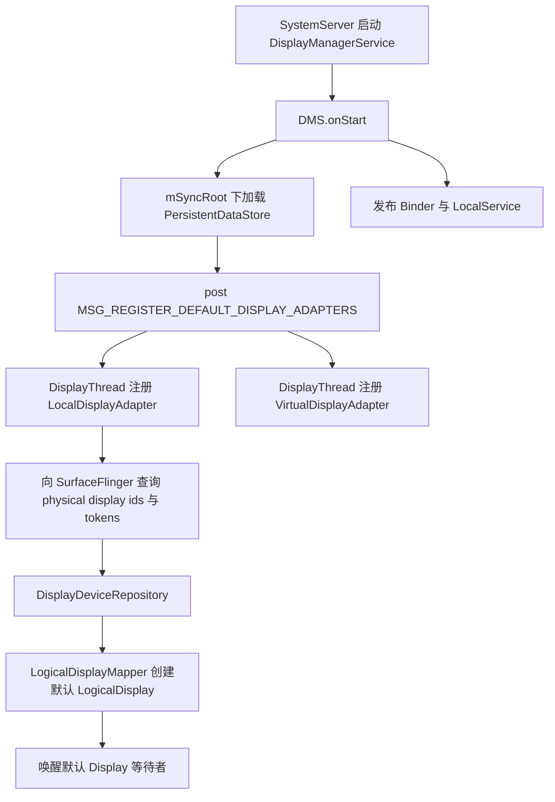
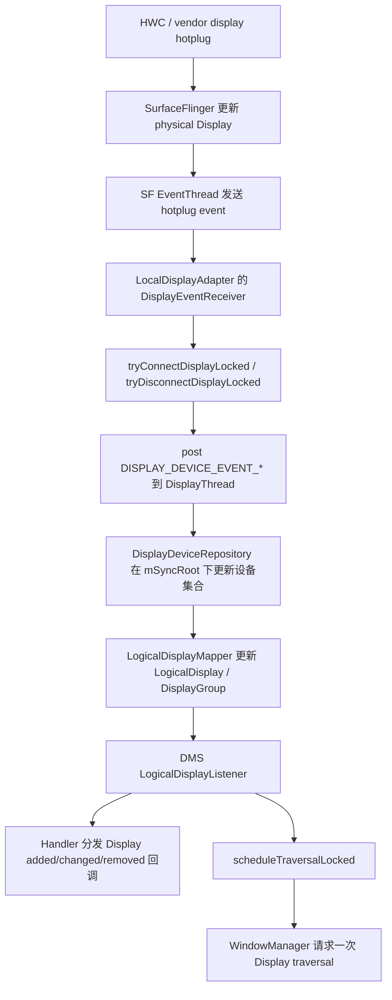
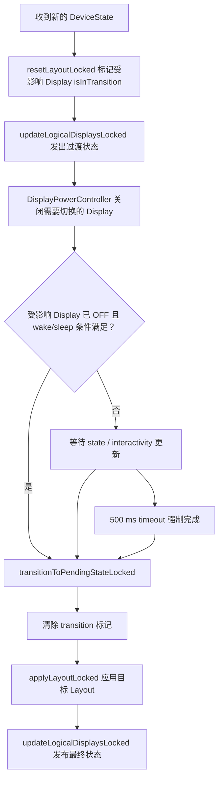

# 2.30 DisplayManagerService：Display 发现、拓扑、功耗与渲染交接

`DisplayManagerService`（DMS）管理 Display 的发现、身份、能力、逻辑映射、状态、功耗和对外事件。它会把 Display 配置交给 WindowManager、InputManager 和 SurfaceFlinger，但不负责应用逐帧绘制，也不直接决定某个 layer 使用 HWC DEVICE 还是 CLIENT composition。

分析 DMS 时，最容易出错的是把几套对象混成一棵树。Android 17 至少要区分：

| 对象 | 所属模块 | 主要职责 |
|---|---|---|
| physical display id / display token | SurfaceFlinger | 标识物理 Display，连接 HWC Display 与 SF Display |
| `DisplayDevice` | DMS / `DisplayAdapter` | 封装一个本地、无线、虚拟或 overlay Display 设备及其能力 |
| `LogicalDisplay` | DMS / `LogicalDisplayMapper` | 提供 framework 使用的 logical display id、配置、enabled 状态与 primary device |
| `DisplayGroup` | DMS | 按 group id 组织一组 LogicalDisplay；它不是屏幕相对位置图 |
| `DisplayTopology` | DMS / InputManager | 描述可扩展 Display 的相对位置，服务鼠标跨屏与拓扑持久化 |
| `DisplayContent` | WindowManager | 按 Display 管理窗口、Task、DisplayArea、焦点、Insets 与 policy |
| SF Display / CompositionEngine Output | SurfaceFlinger | 为目标 Display 构造可见 layer 集合，执行合成并取得 present fence |

这些对象通常有关联，但不是严格一一对应。例如镜像 layer 可以出现在多个 Output；虚拟 Display 有自己的 SF token，却未必承载可启动任意 Activity 的 WMS `DisplayContent`；`DisplayTopology` 也不会替代 `LogicalDisplayMapper` 的设备状态布局。

平台锚点固定为 Android 17 / API 37 / `android-17.0.0_r1`。涉及 kernel fence、调度或 display driver 时，公共语义以 `android17-6.18-2026-06_r6` 为锚点；物理 hotplug、plane allocation、bandwidth 和 panel timing 仍需核对设备 vendor HAL 与 driver。

## 1. 服务启动与默认 Display

### 1.1 `onStart()` 先加载持久化状态

Android 17 的 `DisplayManagerService.onStart()` 先在 `mSyncRoot` 下加载 `PersistentDataStore` 与 stable display 配置，再向 DMS Handler 投递 `MSG_REGISTER_DEFAULT_DISPLAY_ADAPTERS`。随后发布：

- `IDisplayManager` Binder service；
- `DisplayManagerInternal` local service。

默认适配器不会在 `system_server` 启动调用栈中直接注册。DMS Handler 处理消息后，在 `mSyncRoot` 下注册：

1. `LocalDisplayAdapter`；
2. `VirtualDisplayAdapter`。

`OverlayDisplayAdapter` 和 `WifiDisplayAdapter` 属于 additional adapters。它们在 `systemReady()` 之后异步注册，安全模式下会跳过；Wi-Fi Display 还受资源和调试属性控制。因此，Android 17 不会固定启用四种适配器。

启动主线如下：



图中的 physical display token 由 SurfaceFlinger 持有并返回给 framework。DMS 不会为本地物理屏重新创建 token。

### 1.2 等待 phase 与超时值

SystemService 启动会在 `PHASE_WAIT_FOR_DEFAULT_DISPLAY` 调用 DMS。Android 17 的等待条件是：

```text
default LogicalDisplay 已创建
AND
VirtualDisplayAdapter 已创建
```

等待发生在 `mSyncRoot.wait(delay)`，会释放 Java monitor，让 DisplayThread 能继续完成 adapter 事件处理。默认超时常量为 10000 ms，并乘以 `Build.HW_TIMEOUT_MULTIPLIER`；超时后抛出 `RuntimeException`，不是无限等待。

Android 17 在 `PHASE_WAIT_FOR_DEFAULT_DISPLAY` 等待，默认超时为 10 秒，而非 `PHASE_LOCKED_BOOT_COMPLETED` 或 5 秒。排查开机卡住时，应对齐：

- `MSG_REGISTER_DEFAULT_DISPLAY_ADAPTERS` 是否执行；
- `LocalDisplayAdapter.registerLocked()` 是否从 SF 得到 physical display id/token；
- `DISPLAY_DEVICE_EVENT_ADDED` 是否到达 repository；
- `LogicalDisplayMapper` 是否生成 `DEFAULT_DISPLAY`；
- `VirtualDisplayAdapter` 是否成功创建。

`PHASE_BOOT_COMPLETED` 的职责不同：DMS 通知 DisplayPowerController、DisplayModeDirector、LogicalDisplayMapper、外接屏策略等组件 boot completed，不负责首次默认屏发现。

## 2. 物理 Display 的发现、变更与移除

### 2.1 本地屏事件从 SurfaceFlinger 进入

`LocalDisplayAdapter.registerLocked()` 创建 `DisplayEventReceiver`，并先枚举 `DisplayControl.getPhysicalDisplayIds()`。对每个 id，它从 SurfaceFlinger 查询：

- physical display token；
- `StaticDisplayInfo`；
- `DynamicDisplayInfo`；
- `DesiredDisplayModeSpecs`。

如果此前没有相同 physical display id，adapter 创建 `LocalDisplayDevice` 并发送 `DISPLAY_DEVICE_EVENT_ADDED`；已有设备的能力或状态变化时发送 `CHANGED`；热插拔断开时发送 `REMOVED`。

完整事件流如下：



`DisplayAdapter.sendDisplayDeviceEventLocked()` 使用 handler post，把事件从 adapter 当前回调栈移到 DisplayThread。进入 `DisplayDeviceRepository` 后，设备集合、LogicalDisplay 映射和 DMS 内部 listener 仍在同一个 `mSyncRoot` 下更新。

### 2.2 ADDED、CHANGED、REMOVED 的工作不同

`DisplayDeviceRepository` 对三类事件的处理边界是：

- `ADDED`：验证设备未重复，加入 repository，再通知 `LogicalDisplayMapper`；
- `CHANGED`：比较新旧 `DisplayDeviceInfo`，计算 mode、state、rotation、color、timing 等 diff，应用 pending info 后通知 mapper；
- `REMOVED`：从 repository 删除设备，再通知 mapper。

LogicalDisplay 层还有 `CONNECTED`、`DISCONNECTED`、`ADDED`、`REMOVED`、`BASIC_CHANGED`、`STATE_CHANGED` 等更细的事件 mask。设备断开、LogicalDisplay disabled、framework 对外移除不会同时发生。DMS 按预处理和后处理顺序更新资源、DisplayPowerController、拓扑、缓存、外接屏 policy 与回调，不能只凭一条 `onDisplayRemoved()` 推断所有资源已经释放。

### 2.3 物理 hotplug 不等于“重建全局 layer 树”

物理 Display 接入后：

1. SurfaceFlinger 已拥有对应 physical display token；
2. DMS 建立 DisplayDevice/LogicalDisplay；
3. WMS 再建立或更新该 Display 的 `DisplayContent` 与 policy；
4. SF 为该 Display 准备 Output；
5. 窗口被放到该 Display 后，相关 SurfaceControl 才进入目标可见 layer 集合。

这是一组跨服务状态变化，不是删除后重建 SurfaceFlinger 的整棵全局 layer hierarchy。已有 layer 是否镜像、reparent 或只出现在原 Display，取决于 WMS/Shell transaction、Display projection 与 SF Output 选择。

## 3. `mSyncRoot` 单锁模型

### 3.1 为什么 DMS 使用一把锁

`mSyncRoot` 保护整个 DMS 共享模型，包括：

- DisplayAdapter 与 DisplayDevice repository；
- LogicalDisplay、DisplayGroup、DeviceState Layout；
- Display state、brightness 与 power controller 索引；
- callback registry；
- viewport 与 pending traversal；
- DisplayTopology 的当前副本与 id 映射。

一次 hotplug 需要原子地完成“设备集合 → LogicalDisplay → group/layout → power/controller → event”的关系更新。随意拆成多把锁，会引入设备已删除但 LogicalDisplay 仍可见、group 与 topology 不一致、以及与 WMS global lock 反向获取等问题。

DMS 源码明确提醒锁顺序：WMS 可能先持有 `WindowManagerService.mGlobalLock` 再进入 DMS，因此 DMS 持有 `mSyncRoot` 时不得进行可能回调 WMS 的同步调用。

### 3.2 Android 17 已把多类慢工作移出锁

单锁不表示所有工作都在锁内执行。Android 17 使用以下方式缩短危险区：

- adapter 事件通过 DisplayThread handler 投递；
- `scheduleTraversalLocked()` 只设置 `mPendingTraversal` 并 post，WMS out-call 稍后执行；
- Display 回调先在锁内复制 callback 列表，再在锁外 Binder 通知；
- topology 更新复制对象后交给 executor；
- `LocalDisplayDevice.requestDisplayStateLocked()` 只生成 `Runnable`，耗时的 `SurfaceControl.setDisplayPowerMode()` 在锁外执行；
- display mode specs 通过 `setDesiredDisplayModeSpecsAsync()` 在 handler 上调用 SF；
- topology reload 由 DMS 调度到后台线程执行。

topology 写入是一个需要单独注意的例外：Android 17 的 `DisplayTopologyCoordinator.setTopology()` 会在 `mSyncRoot` 内调用 XML store 的 `saveTopology()`。因此，频繁重排扩展屏时应测量 `setTopology` slice 与文件系统延迟，不能假设 topology 持久化已经移出锁。

存在全局锁不代表应立即改成细粒度锁。应先用跟踪记录确认：

1. 哪个 tid 等待 `mSyncRoot`；
2. 持锁线程当时执行哪个 `*Locked()` 方法；
3. 等待是否位于用户可见的 Display 切换路径；
4. 慢点是 Java 状态计算、Binder、文件 I/O，还是锁外 SF/HWC 操作。

### 3.3 DMS 不在普通逐帧热路径

稳定显示期间，App buffer latch 和 HWC validate/present 不经过 DMS 的 `mSyncRoot`。DMS 的主要观察窗口通常是：

- 开机默认屏发现；
- 外接屏插拔；
- 折叠/展开或 dock DeviceState 切换；
- Display mode、resolution、color mode 变化；
- 亮度与 power state 变化；
- VirtualDisplay 创建、resize、换 Surface 与销毁。

如果稳定动画每帧都卡，而 Display 配置没有变化，应先检查 App/SF/HWC/present，不应先归因于 DMS 单锁。

## 4. DisplayDevice 到 LogicalDisplay

### 4.1 `LogicalDisplayMapper` 负责映射

`DisplayDevice` 表示发现到的设备，`LogicalDisplay` 表示 framework 暴露和管理的逻辑屏。`LogicalDisplayMapper` 持有：

- `SparseArray<LogicalDisplay>`；
- `SparseArray<DisplayGroup>`；
- `DeviceStateToLayoutMap`；
- 当前与 pending `DeviceState`；
- 当前 `Layout`；
- virtual-device 与 virtual-display 关联；
- display id / group id 分配状态。

新设备到达时，mapper 先为允许成为默认屏的设备初始化 default layout，再创建 LogicalDisplay、应用当前 Layout，并计算需要发送的 logical display event mask。

### 4.2 Layout 使用物理地址，不只看运行时 id

DeviceState Layout 按 Display 的物理 address / unique identity 找设备，并规定：

- logical display id；
- 是否 enabled；
- display group name；
- position；
- lead display；
- brightness / refresh-rate / power throttling 配置 id。

logical display id 是运行时 framework 身份；稳定 physical id、EDID/port 与 unique id 用于识别设备。外接屏拔出再插入后，不应只按上一次 logical id 关联历史数据。

### 4.3 DisplayGroup 与 DisplayTopology 不能互换

| 模型 | 解决的问题 | 不负责什么 |
|---|---|---|
| DeviceState `Layout` | 某个设备状态启用哪些内屏、映射到哪个 LogicalDisplay、如何分组和跟随 | 不描述用户拖动排列后的跨屏坐标 |
| `DisplayGroup` | 用 group id 组织 LogicalDisplay 并发送 group event | 不表示左、右、上、下相对位置 |
| `DisplayTopology` | 用 dp 尺寸和相邻关系描述可达扩展屏，向 InputManager 提供 graph | 不创建/删除 Display，不改变分辨率和 density |

Android 官方 API 文档把 `DisplayTopology` 标为 version 36.1。Android 17 的 `DisplayTopologyCoordinator` 是当前 tag 下的 system_server 实现，但不能写成 API 37 才首次出现。

`DisplayTopologyCoordinator.setTopology()` 只允许重排同一批 Display。新 topology 不能增加/删除 display id，也不能改变某块屏的 logical width、height 或 density。Display add/remove 由生命周期事件驱动，topology coordinator 随后更新并持久化相对位置。

拓扑变化会复制 `DisplayTopology`，再通过 handler executor：

- 把 `DisplayTopologyGraph` 交给 InputManager；
- 向注册的 DisplayManager callback 分发 topology update；
- 在需要时触发 backup data changed。

这条路径服务输入跨屏和持久化，不参与 SurfaceFlinger 的逐帧 layer 合成。

## 5. 折叠与 DeviceState 布局切换

### 5.1 入口与启动期延后

DMS 通过 `DeviceStateManager` callback 接收新的 `DeviceState`，再调用 `LogicalDisplayMapper.setDeviceState()`。该方法先在锁外读取 `PowerManager.isInteractive()`，进入 `mSyncRoot` 后校正缓存的交互状态。

boot completed 以前，mapper 只保存 `mDeviceStateToBeAppliedAfterBoot`。原因是 boot animation 仍可能按旧尺寸运行，此时切换内部 Display Layout 会产生错误配置。

### 5.2 Android 17 是两阶段切换

对需要改变内屏启用状态或 logical id 的 DeviceState，mapper 使用以下顺序：



500 ms 消息是状态切换兜底，不是“显示关闭动画固定持续 500 ms”。满足条件时会提前完成；超时路径用于避免某个 power/interactivity 回调缺失后永久卡在 pending state。

### 5.3 wake/sleep 调用在 handler 上执行

目标 DeviceState 的属性或旧资源配置可能要求：

- unfold/lid open 时 `PowerManager.wakeUp()`；
- fold/lid close/dock 时 `PowerManager.goToSleep()`。

mapper 在 `mSyncRoot` 内作出判断，再把调用 post 到 handler，避免持锁进入 PowerManager。`shouldStayAwakeOnFold()`、用户折叠设置、emulated state、当前 interactive 状态都会影响结果，不能把“合盖必定 sleep”或“展开必定 wake”写成平台保证。

### 5.4 折叠渲染要继续跟到 WMS 与 SF

DMS 完成 Layout 只表示 LogicalDisplay 配置确定。用户看到新画面之前还可能发生：

- WMS `DisplayContent`、Task bounds、configuration 与 Insets 更新；
- Shell transition、snapshot/splash 与 surface geometry transaction；
- App relaunch/relayout 与新尺寸 buffer；
- SF Output 选择、HWC validate/present；
- panel 切换或 vendor display driver 延迟。

因此，折叠黑帧不能只用 `setDeviceState()` 到 `applyLayoutLocked()` 的时间解释。应把 DMS 过渡、WMS geometry、App buffer 和目标 Display present 放在同一条时间线上。

## 6. Display 事件与 VSync 是两条通道

### 6.1 DMS 分发管理事件

应用通过 `DisplayManager.DisplayListener` 接收 Display added/removed/changed 等事件。Android 17 的 DMS：

1. 在 `mSyncRoot` 内选出 callback；
2. 复制到临时列表；
3. 释放锁；
4. 异步 Binder 通知客户端。

这类事件用于刷新 Display 列表、能力、mode、state 或 topology。它们不是逐帧信号，也不保证收到 `onDisplayChanged()` 时对应新模式画面已经 present。

### 6.2 `DisplayEventReceiver` 的 VSync 来自 SurfaceFlinger

App/Choreographer 的 VSync 主线是：

```text
SurfaceFlinger Scheduler / EventThread
  → DisplayEventReceiver event connection
    → app process native DisplayEventReceiver
      → FrameDisplayEventReceiver
        → Choreographer.doFrame()
```

DMS 不在这条逐帧投递路径中。`LocalDisplayAdapter` 也使用 `DisplayEventReceiver`，但它主要订阅 physical hotplug、mode change、frame-rate override 等 Display 事件，再更新 DisplayDeviceInfo。

### 6.3 不要假设每块物理屏有独立硬件 VSync

Android 的 `DisplayEventReceiver.onVsync()` 参数包含 physical display id，SurfaceFlinger 也按 Display 保存 mode/timing 信息；这不等于每块屏都有一条可独立调度的 framework VSync 源。

AOSP multi-display 官方文档仍明确说明 per-display VSYNC 不受支持，Display 由 primary internal display 的 VSync 驱动。分析双屏或外接屏时，应区分：

- framework/SF 的调度基准；
- 每块屏的 active mode、render frame rate 与 presentation deadline；
- 每个 SF Output/HWC Display 的 validate/present；
- 每块屏对应的 present fence 与 driver 行为。

不同 Display 可以有不同 mode 和独立 present 结果，但不能据此推导两个 App 各自获得完全独立的硬件 VSync 时钟。

## 7. Display mode 与刷新率切换

### 7.1 DMS 负责策略输入，SF/HWC 执行

`DisplayModeDirector` 汇总应用 frame-rate vote、系统策略、功耗与设备约束，生成 `DesiredDisplayModeSpecs`。DMS traversal 把每个 LogicalDisplay 的 specs 交给 DisplayDevice；`LocalDisplayAdapter` 再异步调用：

```text
SurfaceControl.setDesiredDisplayModeSpecs(applyToken, specs[])
```

源码特意避免持有 `mSyncRoot` 调这个同步 SF 接口。批量 specs 和 apply token 也用于让多 Display mode 更新在 SurfaceFlinger 侧按一组请求处理。

### 7.2 mode change 不会固定重建 BufferQueue

只切换 refresh rate 时，已有 App Window BufferQueue、SurfaceControl 与 layer 可以继续使用。变化主要落在：

- VSync 预测与 app/SF work duration；
- `Display.Mode`、render frame rate、deadline；
- SF/HWC active mode；
- FrameTimeline 的 expected/actual present。

如果 mode 同时改变分辨率，WMS 会看到 DisplayInfo/configuration 变化，App 可能 relayout、重建尺寸相关 buffer 或重启 Activity。buffer 变化来自尺寸与应用响应，不应概括成“Display.Mode 切换必然重建全部 BufferQueue”。

### 7.3 mode 回调不是 present 证据

`DISPLAY_DEVICE_EVENT_CHANGED` 表示 framework 观察到 dynamic display info 变化。判断切换何时对用户生效，还要对齐：

- SF active mode / mode change timeline；
- HWC/driver config applied；
- 新 VSync period；
- 目标 Display 的 present fence；
- App 是否按新节奏生产 buffer。

只记录 `DisplayListener.onDisplayChanged()` 会把管理通知时间误当成显示时间。

## 8. DisplayPowerController 与物理 power mode

### 8.1 每个 LogicalDisplay 有一个 controller

DMS 用 `SparseArray<DisplayPowerController>` 按 logical display id 保存 controller。每个 controller 有自己的 request 状态与 `mLock`，但 Android 17 通过传入的 power handler Looper 创建 handler；多个 DPC 不代表每块屏各有一条独立 Java 线程。

controller 负责汇总：

- ON/OFF/DOZE 等目标 state；
- proximity 与 policy unblock；
- auto/manual brightness；
- HBM、thermal/power throttling；
- brightness ramp；
- lead/follower 亮度关系。

`requestPowerState()` 先更新 pending request，再用 Handler 合并 `MSG_UPDATE_POWER_STATE`。返回 `false` 表示仍有异步状态要收敛，调用方需要等待状态回调后重试。

### 8.2 从 DPC 到 SurfaceFlinger 的锁边界

power 主线可以拆成：

```text
DisplayPowerController#updatePowerState
  → DisplayBlanker.requestDisplayState(displayId, state, brightness)
    → DMS.requestDisplayStateInternal
      → mSyncRoot 下更新逻辑 state / brightness
      → DisplayDevice.requestDisplayStateLocked 返回 Runnable
    → mSyncRoot 外执行 Runnable
      → SurfaceControl.setDisplayPowerMode(displayToken, mode)
      → backlight / brightness 更新
```

`LocalDisplayAdapter` 注释指出，设置 display power mode 可能耗时数百毫秒，因此最慢的 SF/HAL 操作必须在 `mSyncRoot` 外执行。Perfetto 中：

- `requestDisplayStateInternal:<displayId>` 主要覆盖 DMS 状态更新；
- `setDisplayState(id=..., state=...)` 才覆盖物理 power mode 调用；
- `DisplayPowerController#updatePowerState` 覆盖 DPC 状态机。

这三段不能合并为一个 slice 解读。

### 8.3 多屏亮度可使用 lead/follower

Layout 可以为 LogicalDisplay 指定 lead display。DMS 在 Display 连接或配置变化时，调用 `updateDisplayPowerControllerLeaderLocked()`：

- 从旧 leader 移除 follower；
- 向新 leader 添加 follower；
- 控制器按新的 DisplayDeviceInfo 更新 brightness 配置。

follower 表示亮度策略关系，不表示两个 Display 共用同一个 buffer、VSync 或 present fence。

## 9. VirtualDisplay 生命周期

### 9.1 创建会在 SurfaceFlinger 建立 virtual display token

VirtualDisplay 的主要路径是：

```text
DisplayManager.createVirtualDisplay()
  → IDisplayManager Binder
    → VirtualDisplayAdapter.createVirtualDisplayLocked()
      → DisplayControl.createVirtualDisplay()
      → VirtualDisplayDevice
      → DisplayDeviceRepository ADDED
      → LogicalDisplayMapper
```

本地物理屏的 token 由 SF/HWC hotplug 路径预先建立；VirtualDisplayAdapter 则主动调用 `DisplayControl.createVirtualDisplay()` 创建 virtual display token。这两类生命周期不能混写。

### 9.2 caller 提供的 Surface 是输出目标

VirtualDisplayDevice 在 DMS traversal 中，通过 Display transaction 把 caller 提供的 `Surface` 设为 virtual Display 的输出 surface。SF 把该 Display 的合成结果写入这条 Surface/BufferQueue。

性能取决于：

- 输出尺寸、format 与 refresh rate；
- mirror 还是 own content；
- secure/trusted/protected 约束；
- SF RenderEngine 或 HWC virtual display 能力；
- 输出 consumer 的 dequeue/acquire 速度；
- 编码器、ImageReader 或远端传输的背压。

不能从 `VIRTUAL_DISPLAY_FLAG_AUTO_MIRROR` 推导“没有 GPU 合成”或“CPU/GPU 复制成本接近零”。镜像只描述内容来源，不指定设备的合成实现。

### 9.3 resize、换 Surface 与 release

- `resizeVirtualDisplayLocked()` 更新宽高与 density，发送 CHANGED 并请求 traversal；
- `setVirtualDisplaySurfaceLocked()` 标记 pending surface change，在 traversal transaction 中生效；
- callback Binder death 或主动 release 会停止设备、释放 Surface 引用、销毁 SF virtual display token，并发送 REMOVED。

换 Surface 或 resize 的 API 返回不代表新输出帧已经到达 consumer。需要继续观察 virtual Output composition、目标 BufferQueue 和 consumer 时间线。

## 10. DMS、WMS 与 SurfaceFlinger 的交接

### 10.1 DMS traversal 配置 Display，不绘制 App 内容

`scheduleTraversalLocked()` 使用单个 `mPendingTraversal` 合并请求。DMS Handler 调用 `WindowManagerInternal.requestTraversalFromDisplayManager()`，WMS 在自己的 surface placement/traversal 中回调 DMS 的 `performTraversalInternal()`。

DMS 随后对每个 LogicalDisplay：

1. 找 primary DisplayDevice；
2. 选择该 display 的 transaction；
3. 调 `LogicalDisplay.configureDisplayLocked()` 设置 projection、layer stack、position、size 等；
4. 让 DisplayDevice 把 Surface、mode specs 与其它 pending 配置写入 transaction；
5. 更新 Input viewport。

App buffer 仍由 App/codec/camera 等 Producer 提交；窗口 geometry 由 WMS/Shell 管理；SF 最终把 layer state 投影到各 Display Output。

### 10.2 三类状态要分开观测

| 状态 | 主要 owner | 典型证据 |
|---|---|---|
| Display 是否存在、enabled、mode、topology | DMS | `dumpsys display`、Display event、DMS power trace |
| Window/Task 在哪个 Display、bounds、focus、Insets | WMS/Shell | `dumpsys window displays`、WindowManager trace、Shell transition |
| layer 是否可见、composition type、present | SF/HWC | layer trace、DisplayFrame、HWC validate/present、present fence |

外接屏黑屏时，`dumpsys display` 中存在 LogicalDisplay 只能证明管理对象存在；WMS 可能没有可见窗口，SF Output 可能没有目标 layer，HWC/panel 也可能尚未 present。

### 10.3 多 Display 共享资源

SurfaceFlinger 按 Display 构造 Output 和 present 结果，但多块屏仍可能共享：

- SF main/composition 线程预算；
- RenderEngine 与 GPU queue；
- HWC plane、scaler 与带宽；
- 内存带宽与 thermal/power budget；
- vendor display HAL/driver serialization。

一块屏的 present 正常不能证明另一块屏正常。性能数据必须带 display id、physical id/token、mode、Output 与 present fence。

## 11. 性能测量

### 11.1 先定义端到端区间

| 场景 | 建议起点 | 建议终点 |
|---|---|---|
| 开机默认屏就绪 | 注册 default adapters | default LogicalDisplay + VirtualDisplayAdapter 条件满足 |
| 外接屏接入 | SF hotplug timestamp | 目标 Display 第一帧 present |
| 外接屏移除 | SF disconnect | WMS/SF 不再呈现该 Display 内容且资源释放 |
| 折叠/展开 | DeviceState callback | 新目标 Display 的 App frame present |
| refresh-rate 切换 | desired specs 改变 | 新 mode 下稳定 present |
| power ON/OFF | DPC power request | physical mode committed / panel 侧证据 |
| VirtualDisplay 首帧 | create/set Surface | consumer acquire 第一块有效 buffer |

DMS 内部事件完成与用户可见结果之间通常还隔着 WMS、App、SF、HWC 和 driver。端到端指标不能停在 DMS callback。

### 11.2 Perfetto 采集

下面的命令用于同时保留调度、Binder、图形、窗口与 power 事件：

```bash
adb shell perfetto \
  -o /data/misc/perfetto-traces/display-lifecycle.perfetto-trace \
  -t 20s \
  sched freq idle binder_driver gfx view wm power
```

在 Android 17 trace 中优先搜索：

- `DisplayDeviceRepository#onDisplayDeviceEvent (event=...)`，仅 debug logging 开启时存在；
- `handleDisplayDeviceChanged`，同样受 debug 条件影响；
- `sendDisplayEventsLocked#event=...`；
- `deliverDisplayEvent#events=...,displayId=...`；
- `setTopology`、`sendTopologyUpdateLocked`、`deliverTopologyUpdate`；
- `DisplayPowerController#updatePowerState`；
- `requestDisplayStateInternal:<displayId>`；
- `setDisplayState(id=..., state=...)`；
- `setDisplayBrightness(id=...)`；
- `DisplayPowerMode`、`ScreenState`、`ScreenBrightness` counter；
- WMS display traversal / surface placement；
- SF hotplug、mode change、composition 与目标 Display present。

`mSyncRoot` 没有固定的同名 trace slice。判断锁竞争需要结合 system_server 线程 running/runnable/blocked 状态、Java monitor contention、调用栈和相邻 DMS slice，不能用 `android.display` 线程 CPU 占用替代持锁时间。

### 11.3 dumpsys 与日志基线

下面这组命令先建立 Display、Window、SF 与 power 的静态映射：

```bash
adb shell dumpsys display
adb shell dumpsys window displays
adb shell dumpsys SurfaceFlinger --display-id
adb shell dumpsys SurfaceFlinger --list
adb shell dumpsys power
adb shell logcat -b system -s \
  DisplayManagerService \
  DisplayDeviceRepository \
  LogicalDisplayMapper \
  LocalDisplayAdapter
```

记录时至少保存：

- logical display id、unique id、address、group id；
- enabled/state/committedState；
- active/default/supported mode 与 render timing；
- primary DisplayDevice、physical display id/token；
- WMS `DisplayContent`、Task/Window 分布；
- SF Display/Output 与可见 layer；
- DisplayPowerController request、brightness、lead/follower；
- topology 与 InputManager graph。

单独保存 `dumpsys display` 无法复原屏幕上的窗口与最终 present。

## 12. 常见故障的排查顺序

### 12.1 开机报 “Timeout waiting for default display”

按顺序检查：

1. SurfaceFlinger 是否已注册服务并枚举 physical display；
2. HWC 是否上报 primary physical display；
3. `getPhysicalDisplayToken()` 是否返回 token；
4. LocalDisplayAdapter 是否发送 ADDED；
5. repository 是否接收事件；
6. default LogicalDisplay 是否被 Layout 接纳；
7. VirtualDisplayAdapter 是否创建。

超时日志中的 default display 与 `mVirtualDisplayAdapter` 值能直接区分两个等待条件。

### 12.2 外接屏已识别但没有画面

依次确认：

- LogicalDisplay 是否 enabled；
- external display policy 是否允许扩展或镜像；
- WMS 是否创建对应 `DisplayContent`；
- 目标屏是否有可见 Task/Window；
- DMS projection/layer stack 是否配置；
- SF 是否有对应 Display/Output；
- HWC validate/present 与 driver 是否成功；
- secure/protected 内容是否允许出现在该 Display。

“DisplayListener 收到 added”只能完成其中前半段。

### 12.3 折叠后黑帧或旧尺寸停留

对齐：

1. `setDeviceState()` 与 pending state；
2. `isInTransition` Display 是否按预期 OFF；
3. 是否走到 500 ms timeout；
4. target Layout 的物理 address、logical id 与 enabled 状态；
5. WMS configuration/bounds；
6. Shell transition/snapshot；
7. App 新尺寸 buffer；
8. 新 Display present。

若 DMS 在几毫秒内完成，而首帧晚数百毫秒，应继续检查 WMS/App/SF，避免在 SyncRoot 上反复调参。

### 12.4 refresh rate 已变但动画节奏异常

收到 DisplayInfo mode callback 后，确认：

- Choreographer 预测周期是否更新；
- App 是否仍按旧 frame-rate vote；
- SF active mode 与 FrameTimeline deadline；
- buffer 是否 late；
- 目标 Display present cadence；
- 外接屏是否受 primary VSync 驱动和 cadence 转换。

DMS mode 变化与 App 逐帧生产是两个阶段。

### 12.5 `setDisplayPowerMode` 很慢

先看 `setDisplayState(id=..., state=...)` slice 与同名日志耗时，再向下核对：

- SF Binder 排队；
- HWC power mode call；
- panel/driver suspend/resume；
- vendor backlight；
- display offload/sidekick；
- 上下电所需 fence 或 idle 等待。

这段慢工作已经在 `mSyncRoot` 外。优化 DMS 锁不能缩短 HAL/driver 自身的耗时。

### 12.6 VirtualDisplay 卡住

区分：

- virtual token/LogicalDisplay 未创建；
- output Surface 为 null；
- resize/surface transaction 未应用；
- SF 没有可见内容；
- consumer 不 dequeue，BufferQueue 形成背压；
- MediaProjection/secure policy 阻止内容；
- encoder/ImageReader 消费慢；
- virtual Output composition 或 GPU/HWC 资源不足。

先确认第一块有效 buffer 的 producer/consumer 关系，再讨论复制和合成成本。

## 13. 版本演进

| 平台 | 相关边界 | 复核要点 |
|---|---|---|
| Android 12 / API 31 | 现代 BLAST、DisplayArea、LogicalDisplay 与多 Display 基线已经存在 | 不要把 DMS 当作 Android 17 新服务 |
| Android 13 / API 33 | HWC HAL 转向 AIDL；DMS/SF 的 Display 职责分界保持 | HAL 接口变化不等于 LogicalDisplay 模型重写 |
| Android 16 / API 36 | `DisplayManager` 增加按 event mask 注册 listener 的公开能力与 `EVENT_TYPE_DISPLAY_*` 常量 | App callback 仍是管理事件，不是 present 信号 |
| version 36.1 | 官方 API 文档标注 `DisplayTopology` 与相关访问入口 | topology 表示可达扩展屏相对位置，不替代 Layout/DisplayGroup |
| Android 17 / API 37 | 当前固定实现：现行 DMS、TopologyCoordinator、content-mode/display policy、DeviceState 和 power 路径 | 以 `android-17.0.0_r1` 的 flag、资源 overlay 与设备能力判断实际行为 |

Android 17 允许部分外接屏在镜像与承载内容之间动态切换，相关 system decorations 与内容模式仍受 Display flags、policy 和设备配置约束。不能把某个 AOSP flag 路径写成所有 Android 17 设备默认启用。

## 14. Android 17 源码与官方文档入口

### DMS 与映射

- [`DisplayManagerService.java`](https://android.googlesource.com/platform/frameworks/base/+/refs/tags/android-17.0.0_r1/services/core/java/com/android/server/display/DisplayManagerService.java)：启动 phase、SyncRoot、adapter 注册、LogicalDisplay listener、traversal、回调与 power 接线；
- [`DisplayAdapter.java`](https://android.googlesource.com/platform/frameworks/base/+/refs/tags/android-17.0.0_r1/services/core/java/com/android/server/display/DisplayAdapter.java)：adapter 事件的 handler 投递；
- [`DisplayDeviceRepository.java`](https://android.googlesource.com/platform/frameworks/base/+/refs/tags/android-17.0.0_r1/services/core/java/com/android/server/display/DisplayDeviceRepository.java)：DisplayDevice 集合、diff 与 mapper listener；
- [`LogicalDisplayMapper.java`](https://android.googlesource.com/platform/frameworks/base/+/refs/tags/android-17.0.0_r1/services/core/java/com/android/server/display/LogicalDisplayMapper.java)：DeviceState Layout、LogicalDisplay、DisplayGroup 与 500 ms 切换兜底；
- [`DisplayTopologyCoordinator.java`](https://android.googlesource.com/platform/frameworks/base/+/refs/tags/android-17.0.0_r1/services/core/java/com/android/server/display/DisplayTopologyCoordinator.java)：相对位置、合法性检查、持久化与 InputManager graph。

### 本地、虚拟与功耗 Display

- [`LocalDisplayAdapter.java`](https://android.googlesource.com/platform/frameworks/base/+/refs/tags/android-17.0.0_r1/services/core/java/com/android/server/display/LocalDisplayAdapter.java)：physical id/token、hotplug、mode specs、power mode 与 brightness；
- [`VirtualDisplayAdapter.java`](https://android.googlesource.com/platform/frameworks/base/+/refs/tags/android-17.0.0_r1/services/core/java/com/android/server/display/VirtualDisplayAdapter.java)：virtual token、Surface、resize、Binder death 与 release；
- [`DisplayPowerController.java`](https://android.googlesource.com/platform/frameworks/base/+/refs/tags/android-17.0.0_r1/services/core/java/com/android/server/display/DisplayPowerController.java)：异步 power request、brightness、policy 与状态收敛。

### VSync、SurfaceFlinger 与文档

- [`DisplayEventReceiver.java`](https://android.googlesource.com/platform/frameworks/base/+/refs/tags/android-17.0.0_r1/core/java/android/view/DisplayEventReceiver.java) 与 [`EventThread.cpp`](https://android.googlesource.com/platform/frameworks/native/+/refs/tags/android-17.0.0_r1/services/surfaceflinger/Scheduler/EventThread.cpp)：hotplug/VSync event connection 与分发；
- [`SurfaceFlinger.cpp`](https://android.googlesource.com/platform/frameworks/native/+/refs/tags/android-17.0.0_r1/services/surfaceflinger/SurfaceFlinger.cpp)：physical/virtual Display、mode、Output 与 composition；
- [AOSP Multi-Display overview](https://source.android.com/docs/core/display/multi_display) 与 [Display support](https://source.android.com/docs/core/display/multi_display/displays)：LogicalDisplay、stable id、Display 支持和 per-display VSync 限制；
- [`DisplayTopology` API](https://developer.android.com/reference/android/hardware/display/DisplayTopology)：version 36.1 与相对位置语义。

## 小结

Android 17 的 Display 生命周期可分成四段：

1. SurfaceFlinger/HWC 发现物理 Display，或 framework 创建 VirtualDisplay token；
2. DisplayAdapter 与 repository 形成 DisplayDevice；
3. LogicalDisplayMapper 按 Layout 建立 LogicalDisplay、group 与 DeviceState 过渡；
4. DMS 把配置交给 WMS/InputManager/SF，最终由窗口 Producer、SurfaceFlinger、HWC 与显示设备完成画面 present。

`mSyncRoot` 保证 DMS 共享模型一致，Android 17 已把 Binder callback、WMS out-call、topology callback、mode specs 和耗时 power 操作放到锁外或异步执行。评估性能时，应测量具体持锁段和端到端 Display 结果，不能把单锁存在本身当作卡顿证据。

VSync 由 SurfaceFlinger EventThread 投递，DMS 负责 Display 管理事件；DeviceState Layout、DisplayGroup 与 DisplayTopology 也分别解决不同问题。把这些边界分开，才能准确定位开机默认屏等待、外接屏黑屏、折叠切换、mode 变化、VirtualDisplay 背压和 power mode 延迟。
