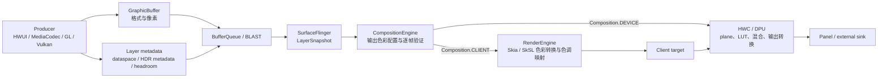

# 2.31 HDR 显示管线与色彩管理性能

HDR 问题经常被压缩成一句“换成 10 bit，再做色调映射”。这句话漏掉了五个相互独立的维度：

- **色域**：sRGB、Display P3、BT.2020 描述可表示颜色的范围；
- **传递函数**：sRGB、PQ（ST 2084）、HLG 描述编码值与光之间的关系；
- **量化与像素格式**：8 bit、10 bit、FP16 决定精度与存储方式；
- **亮度语义**：SDR 白点、内容峰值、显示峰值和 HDR/SDR 比值决定画面能使用多少高光余量；
- **合成位置**：Producer、RenderEngine、HWC/DPU 和面板各自只处理其中一部分。

性能分析必须先确认这五个维度，再讨论 GPU 时间、内存带宽和功耗。只看“屏幕支持 HDR”或“图层是 `BT2020_PQ`”，无法推出这一帧使用了硬件平面，也无法推出色调映射没有成本。

以下分析以 `android-17.0.0_r1` 为准。内核只负责 DMA-BUF 内存共享与 DMA 栅栏同步，不决定数据空间、色调映射曲线或 HWC 的硬件平面分配；涉及内核边界时，以 `android17-6.18-2026-06_r6` 为准。缓冲区与栅栏的细节分别见 2.15、2.16。

---

## 一、先把几个对象分清

### 1.1 `ColorSpace`、`Dataspace` 和像素格式不是一回事

| 对象 | 所在层次 | 解决的问题 | 不负责什么 |
|---|---|---|---|
| `android.graphics.ColorSpace` | 应用、Bitmap、Canvas | 描述原色、白点、传递函数和转换关系 | 不分配 Surface，也不选择 HWC plane |
| `ui::Dataspace` / HAL `Dataspace` | Buffer、Layer、SurfaceFlinger、Composer HAL | 告诉消费者如何解释像素：standard、transfer、range | 不改变 buffer 中的像素位宽 |
| `PixelFormat` / gralloc format | Buffer 分配 | 描述通道布局、位宽和数值类型 | 不足以表达完整色彩语义 |
| HDR metadata | Buffer/Layer 到 Composer | 提供 mastering luminance、CLL/FALL 或动态元数据 | 不保证 HWC 一定采用该元数据 |
| `ColorMode` + `RenderIntent` | 显示输出 | 描述 HWC 可提供的输出模式与呈现意图 | 不是应用逐图层选择的着色器 |
| HDR headroom | Window、SurfaceView、SurfaceControl、Display | 以 HDR 峰值与 SDR 白点之比表达期望/当前范围 | 不是绝对亮度承诺 |

一个 `RGBA_1010102` 缓冲区可以被错误标成 sRGB；一个标为 Display P3 的缓冲区也未必是 FP16。格式与数据空间必须同时正确，消费者才有机会还原作者想表达的颜色。

`Dataspace` 由三个字段组合：

```text
Dataspace = Standard | Transfer | Range
```

例如，Display P3 使用 P3 原色、sRGB 传递函数和全范围；`BT2020_PQ` 使用 BT.2020 原色、ST 2084 传递函数和相应范围。代码中不能用“P3 就是 HDR”或“10 位就是 HDR”代替这组语义。

### 1.2 元数据与像素沿两条通路移动

BufferQueue 传递缓冲区，同时携带数据空间等描述信息；`SurfaceControl.Transaction` 也能更新图层的数据空间和 HDR 相关状态。SurfaceFlinger 锁存新状态后，把每个图层的缓冲区、dataspace、变换、裁剪、亮度和 HDR 元数据交给 CompositionEngine。

下面的图只画出与色彩有关的主路径：



图中的 `DEVICE` 与 `CLIENT` 是 HWC 验证后的逐帧结果。即使上一帧视频图层走 `DEVICE`，下一帧增加模糊、复杂裁剪或更多图层后也可能改为 `CLIENT`。

### 1.3 未知数据空间不是安全的万能值

Android 17 的 `Layer::translateDataspace()` 会兼容一部分旧数据空间，并按兼容规则处理未知值。该行为服务于历史应用，不能作为生产端省略标记的理由。缺少或错误的数据空间可能造成：

- P3 内容按 sRGB 解释，颜色偏差；
- HDR 传递函数按 SDR 处理，高光被压坏；
- HWC 无法匹配硬件能力，改变合成策略；
- 截图、录屏和外接显示上的结果与内屏不同。

排查色偏时，第一项证据应是缓冲区或图层的实际数据空间，而非图片文件名或应用声明的 `colorMode`。

---

## 二、SurfaceFlinger 如何选择输出色彩配置

### 2.1 `DisplayColorProfile` 描述 HWC 报告的能力

Android 17 的 `DisplayColorProfile` 从 HWC 能力构造以下信息：

- wide color gamut 支持；
- HLG、HDR10、HDR10+、Dolby Vision 支持；
- 逐帧元数据能力；
- HWC 报告的 `ColorMode -> RenderIntent[]` 组合；
- desired minimum、maximum 和 maximum-average luminance。

`DisplayColorProfile::getBestColorMode()` 会把期望的数据空间和渲染意图映射到 HWC 支持的数据空间、色彩模式和渲染意图。找不到匹配时会退到 `ColorMode::NATIVE`、`Dataspace::UNKNOWN` 和比色意图。这里执行的是能力匹配，没有宣称所有图层都能用硬件完成转换。

### 2.2 输出数据空间由当前可见图层共同影响

`CompositionEngine::Output::getBestDataspace()` 遍历可见图层：

- 普通 SDR 默认以 sRGB 起步；
- Display P3 内容可以把 SDR 输出提升到 Display P3；
- scRGB、BT.2020 等内容可以选择 Display BT.2020；
- PQ/HLG 图层会记录 HDR 候选数据空间；
- 同时存在 PQ 与 HLG 时，Android 17 的实现通常选择 PQ；若 PQ 只有旧版支持，或被判定为需要 RenderEngine 合成，则可能退到 Display P3。

这一行为有 `OutputTest` 覆盖，不能照搬 `getBestDataspace()` 内“混合时使用 HLG”的旧注释。随后 `pickColorProfile()` 根据 HDR 支持、是否强制客户端合成、用户或系统色彩设置和 HWC 能力，得到显示的 `ColorMode`、输出数据空间与 `RenderIntent`。

因此，“某个图层是 HDR”和“显示器当前运行在 HDR 输出模式”是两个不同事实。屏幕能力、可见图层集合、强制 SDR 设置、镜像目标和 HWC 模式都会影响结果。

### 2.3 色彩差异会让 GPU 工作变贵，但不必然触发回退

Android 17 的 `Output::composeSurfaces()` 在准备客户端合成时，会把“存在图层的源数据空间与输出数据空间不同”标为预期的高成本渲染。源码注释说明这类转换或复杂着色器可能需要提高 GPU 频率，结束后再撤销提示。

这段逻辑说明色彩转换是 GPU 合成路径上的实际成本，但不能反向推导：

- 数据空间不同，不代表 HWC 一定拒绝 `DEVICE`；
- 数据空间相同，不代表一定没有 GPU 合成；
- `SurfaceView` 也不保证 overlay；
- `CLIENT` 不代表整屏所有图层都由 GPU 合成。HWC 仍可把客户端目标与其他 `DEVICE` 图层一起合成。

判断某台设备的结果，要查看该帧经过 HWC 验证后的合成类型。

---

## 三、HWC 路径与 RenderEngine 路径

### 3.1 HWC 获得的色彩信息

Composer3 AIDL 的 `LayerCommand` 包含：

- `buffer`；
- `dataspace`；
- `composition`；
- `colorTransform`；
- `brightness`；
- `perFrameMetadata`；
- `perFrameMetadataBlob`；
- 可选 LUT；
- 裁剪、变换、混合和透明度等几何状态。

静态 metadata 的 key 包括 mastering primaries、white point、maximum/minimum luminance、MaxCLL 和 MaxFALL；blob metadata 可以承载 HDR10+ 的 ST 2094-40 信息。HWC 在 `validateDisplay` 时检查整组 Layer，不能处理的组合可以要求改为 `Composition.CLIENT`。

硬件完成色调映射时，GPU 不执行对应的全屏着色器，但这条路径仍会占用 DPU plane、色彩处理单元、读带宽和面板功率。分析时必须把 GPU、DPU 和面板成本分开记录。

### 3.2 RenderEngine 的 Android 17 线性色彩处理

Android 17 源码中没有名为 `LinearTube` 的组件，实际类型是 `shaders::LinearEffect`。它把需要色彩处理的图层组织为以下五步：

1. EOTF：把输入编码转换为线性亮度；
2. 源 RGB 到 CIE XYZ；
3. OOTF：应用渲染意图，必要时执行色调映射；
4. XYZ 转换到目标 RGB；
5. OETF：编码为目标输出信号。

这段 SkSL 由 `libs/shaders/shaders.cpp` 生成，`RuntimeEffectManager::createLinearEffectShader()` 注入显示峰值、当前亮度、内容峰值和渲染意图等统一变量。Skia 用线性工作色彩空间包装着色器，以便正确连接输入和输出色彩空间。

`SkiaRenderEngine::needsToneMapping()` 主要比较源与目标的传递函数。PQ、HLG、sRGB 与线性空间之间需要不同处理；代码对不支持的传递函数按 sRGB 处理。需要色调映射、Layer color transform、线性域调暗或特定伽马修正时，`requiresLinearEffect` 才成立。

这解释了两个容易混淆的现象：

- “在线性域处理”是着色器的颜色计算方式，不等于系统会为每帧额外分配一个 FP16 中间缓冲区；
- 客户端目标的实际格式由 SurfaceFlinger/HWC 配置决定，不能根据 `LinearEffect` 这个名称推断内存一定翻倍。

### 3.3 Android 17 中可见的色调映射分支

| 分支 | 触发与数据 | 主要用途 | 性能边界 |
|---|---|---|---|
| HWC/DPU | HWC 接受 `DEVICE`，获得数据空间、亮度、元数据和 LUT | 屏幕显示，由设备实现处理 | 不占 RenderEngine 着色器时间，但消耗 DPU 和显示带宽 |
| `libtonemap` | RenderEngine 的 `LinearEffect` 默认策略 | GPU 客户端合成的全局色调映射 | OEM 可从 Android 13 定制；成本取决于 GPU、分辨率和图层集合 |
| Display LUT | Layer 状态携带 LUT，或 HWC 请求 LUT，RenderEngine/HWC 按能力应用 | 减少不同合成路径的 HDR 输出差异 | Android 16 引入，能力与 flag 需在设备上确认 |
| AGTM | buffer 有可解析的 SMPTE ST 2094-50 metadata，且没有更高优先级 LUT | 动态全局 tone mapping | Android 17 源码可见 `AGTM` trace；不应与 Pixel 的显示色彩模式混为一谈 |
| Local tone map | `TonemapStrategy::Local` 且满足 HDR 图像条件 | 主要用于截图等非高频渲染 | `DisplaySettings` 明确提示会使用较大的中间分配，不适合作为常规逐帧默认策略 |

RenderEngine 对这些分支有互斥处理：已经应用 LUT、AGTM 或局部色调映射后，会跳过标准 `libtonemap` 的重复映射。描述 Android 17 时，应使用这些源码名称，不使用无法对应到类型、接口或开关的称呼。

### 3.4 `libtonemap` 做了什么

Android 13 引入厂商可配置的 `libtonemap`，让 SurfaceFlinger 的 GPU 合成和厂商 HWC 使用一致的色调映射逻辑，减少旋转、SurfaceView/TextureView 切换等场景的画质差异。

`android-17.0.0_r1` 中 `getToneMapper()` 默认选择 `ToneMapper13`。RenderEngine 传入：

- display maximum luminance；
- current display luminance；
- content maximum luminance；
- 可选 `AHardwareBuffer` metadata；
- render intent。

着色器先把输入转换为线性亮度和 XYZ，再计算增益，最终归一化并编码到输出空间。这里没有适用于所有 SoC 的固定耗时。4K、120 Hz、保护内容、图层数量、缩放、模糊、GPU 型号和客户端目标格式都能改变结果。

---

## 四、SDR 与 HDR 混合时，系统在协调什么

### 4.1 SDR white point 与 HDR headroom

混合显示需要先约定 SDR 白色在当前面板上对应的亮度，再决定 HDR 高光还能向上延伸多少。Android 的公开 API 用下面的比值描述 headroom：

```text
HDR/SDR ratio = target HDR peak brightness / target SDR white point
```

`Display.getHdrSdrRatio()` 从 API 34 开始报告当前比值；环境光、热状态、面板限制和系统策略都可能使它变化。API 36 增加 `getHighestHdrSdrRatio()`，用于查询设备当前能报告的最高可能比值。

API 35 的 `Window.setDesiredHdrHeadroom()` 只在窗口使用 `COLOR_MODE_HDR` 时生效。`0` 表示交给系统自动选择，其他有效值表达期望范围。它有三条重要限制：

- 期望值不等于系统会提供的值；
- 窗口设置不作用于独立的 `SurfaceView` 或 `SurfaceControl`；
- SurfaceView、SurfaceControl 有各自的高光余量设置，不能只修改窗口后假设视频图层已同步。

应用若要随实际高光余量调整绘制，应查询 `Display.getHdrSdrRatio()` 并监听显示变化，不能把某个尼特值写死。

### 4.2 图层亮度与调暗阶段

Composer3 的 `LayerBrightness` 用于表达 HDR 内容旁边的 SDR 图层应如何调暗。`DisplayCommand.brightness` 的接口注释还要求：即使面板亮度切换需要多帧，SDR 图层调暗也要与显示变化协调，避免可见闪烁。

HWC 通过 `DimmingStage` 告诉框架在哪个阶段调暗：

- `LINEAR`：在线性光学空间处理；
- `GAMMA_OETF`：在 OETF 之后的 gamma 空间处理；
- `NONE`：当前场景没有相关要求。

RenderEngine 会把图层白点、显示亮度和调暗阶段放入 `DisplaySettings`。当需要在线性域调暗且比例不为 1 时，它也会启用 `LinearEffect`。

### 4.3 ColorMode 切换没有统一的黑帧或延迟保证

HWC 接口允许面板亮度或模式切换不是原子完成，但 AOSP 没有规定所有设备切换 HDR color mode 时都必须黑一帧，也没有给出统一延迟。实际体验取决于：

- 内屏还是 HDMI/DisplayPort；
- 面板是否需要切换高亮模式；
- HWC 是否能保持同一显示配置；
- HDR conversion mode；
- 厂商驱动与显示硬件。

遇到闪烁时，应同时采集 SurfaceFlinger trace、HWC/vendor trace、显示模式和亮度状态。只在 Perfetto 中看到 `setColorMode`，还不能证明黑帧来自该调用。

---

## 五、Wide Color Gamut：精度、格式与带宽

### 5.1 Android 8 开始的应用侧能力

Android 8.0（API 26）为兼容设备提供广色域色彩管理。应用可以：

- 在 Activity 上请求 `android:colorMode="wideColorGamut"`；
- 调用 `Window.setColorMode(COLOR_MODE_WIDE_COLOR_GAMUT)`；
- 加载带 ICC 配置文件的 PNG、JPEG 和 WebP；
- 用 `Bitmap.getColorSpace()` 检查解码结果；
- 通过 EGL 扩展或 `VK_EXT_swapchain_colorspace` 输出 P3/scRGB。

请求不等于获得。应用还要检查 `Window.isWideColorGamut()`、`Display.isWideColorGamut()` 和当前配置。`Window.setColorMode()` 也说明：窗口色彩模式不影响独立的 SurfaceView 或 SurfaceControl。

### 5.2 三种常见 RGB 格式

| 格式 | 存储 | 单像素名义大小 | 说明 |
|---|---:|---:|---|
| `RGBA_8888` | 8/8/8/8 UNORM | 32 bit / 4 byte | 常见 SDR UI 格式，也可承载带正确 dataspace 的有限 WCG 内容 |
| `RGBA_1010102` | 10/10/10/2 UNORM | 32 bit / 4 byte | 不是 40 bit，也没有“按 64 bit 对齐”的 API 保证 |
| `RGBA_F16` | 16-bit float × 4 | 64 bit / 8 byte | 精度和扩展范围较高，buffer 体积通常更大 |

`PixelFormat.getPixelFormatInfo()` 在 Android 17 中明确把 `RGBA_1010102` 归为 32 bit、4 byte，把 `RGBA_F16` 归为 64 bit、8 byte。

内存与带宽仍不能只按 `width × height × bytesPerPixel × fps` 得出。gralloc stride、tile、压缩 modifier、读写次数、缓存命中、局部更新和 DPU/GPU 路径都会改变物理流量。这个公式只能给未压缩单次扫描的下限量级，不能当成功耗实测。

### 5.3 WCG 不保证窗口一定使用 FP16

官方文档列出的 EGL 广色域缓冲区组合包括 8/8/8/8、10/10/10/2 和 FP16。具体选择由渲染后端、EGLConfig、设备能力和系统策略决定。因此：

- 不要写成“开启 WCG 就把 Surface 换成 FP16”；
- 不能用 Activity 的色彩模式推断某个 SurfaceView 的缓冲区格式；
- 不能把格式当作数据空间；
- 应从实际缓冲区、图层转储和 GPU 捕获取证。

### 5.4 Bitmap 转换的成本在哪里

带色彩配置文件的 Bitmap 被绘制到不同目标色彩空间时，Skia/HWUI 会执行色彩转换。转换可能包括 EOTF/OETF、3×3 变换、色域映射和精度转换，不能一律简化为一组 P3↔sRGB matrix。

影响成本的因素包括：

- 图片尺寸与屏幕覆盖面积；
- 每帧重复采样还是结果可缓存；
- 缩放、滤波和其他 RenderEffect 是否合并进同一着色器；
- 目标缓冲区格式；
- GPU 是否因整个窗口进入更重的合成配置。

脱离具体设备、分辨率、资源和渲染后端给出的开销比例，无法迁移到其他场景。更可靠的做法是在同一设备上准备 sRGB/P3 对照资源，固定分辨率、亮度和刷新率，再比较 GPU counters、RenderThread 与 SurfaceFlinger client composition。

### 5.5 未标记和误标记是不同故障

- **未标记**：系统按默认/兼容规则解释，结果取决于入口和版本；
- **误标为 sRGB**：P3 数值会按较小色域解释；
- **误标为 P3**：sRGB 数值会按较大色域解释；
- **仅修改元数据，不转换像素**：颜色语义改变，像素值不变，通常会产生色偏。

`Bitmap.setColorSpace()` 只允许为已有像素指定兼容的色彩空间语义，不会替应用完成任意像素重编码。需要转换内容时，使用 ColorSpace connector、Canvas/Skia 绘制到目标空间，或在离线资产阶段处理。

---

## 六、Ultra HDR 与增益图

### 6.1 它与 HDR 视频不是同一种载体

Android 14（API 34）开始支持 Ultra HDR 图片。图片包含：

- 一张可在 SDR 设备显示的基础图像；
- 一张增益图；
- 描述增益应用方式的参数。

在支持的 HDR 窗口和显示器上，渲染端根据当前 HDR/SDR 比值重建高光；在 SDR 路径上仍可显示基础图像。应用可用 `Bitmap.hasGainmap()` 检查增益图。

这与 PQ/HLG 视频帧不同。Ultra HDR 的基础图像可以保持 SDR 兼容，HDR 效果来自增益图；视频通常通过数据空间、10 位缓冲区与静态或动态 HDR 元数据表达。

### 6.2 Android 17 的 RenderEngine 支持

Android 17 的 RenderEngine 包含 `GainmapFactory`，也能在截图路径生成 SDR 版本与增益图。显示 Ultra HDR 时，目标高光余量会影响增益的应用程度。

官方建议在展示 Ultra HDR 时动态把 Window 切到 `COLOR_MODE_HDR`，离开该内容后恢复默认模式。对图片列表，不要因少量缩略图让整个页面长期处于 HDR：

- HDR 高光余量会改变 SDR 界面与高光的亮度关系；
- HDR 窗口可能选择更高精度的缓冲区；
- 更多内容进入色彩处理路径；
- 面板高亮区域和平均图像电平会影响功耗。

应用应先确认图片含有增益图，再按可见范围决定是否请求 HDR，不能只按文件扩展名切换。

---

## 七、HDR 视频：优先保留独立图层

### 7.1 `SurfaceView` 与 `TextureView` 的结构差异

`SurfaceView` 给视频提供独立 Surface。MediaCodec 输出的缓冲区可以作为独立图层交给 SurfaceFlinger，HWC 有机会把它分配到视频平面，并直接获得数据空间与 HDR 元数据。

`TextureView` 把视频采样进应用窗口。视频像素先经过应用/HWUI 的 GPU 渲染，再随窗口进入 SurfaceFlinger。官方 HDR 播放文档说明 TextureView 的 HDR 支持受限；播放 HDR 视频时优先使用 SurfaceView。

“优先 SurfaceView”仍不是 overlay 承诺。下面条件都可能让 HWC 改变决策：

- 视频平面数量或格式能力不足；
- 缩放、旋转、非整数 crop；
- 同屏 HDR/SDR 图层组合；
- 圆角、透明度、复杂遮挡；
- 保护内容约束；
- 外接显示的输出格式；
- 厂商对某种数据空间或元数据的支持。

每帧以 HWC validate 结果为准。

### 7.2 受保护内容与安全显示不能混用

HDR 只描述色彩和亮度。DRM 视频还可能要求受保护缓冲区和安全显示路径：

- 受保护缓冲区限制 GPU/CPU 对内容的访问；
- 安全图层或显示器约束截图、录屏和输出目标；
- RenderEngine 是否有受保护上下文，会影响客户端合成能否处理该图层。

当 HDR DRM 视频回退或黑屏时，要同时检查色彩能力与保护路径，不能把所有失败都归因于色调映射。

### 7.3 设备能力查询

Android 7.0（API 24）提供 `Display.getHdrCapabilities()` 和 HDR10、HLG、Dolby Vision 类型；HDR10+ 常量从 API 29 加入。`getDesiredMaxLuminance()`、`getDesiredMaxAverageLuminance()` 和 `getDesiredMinLuminance()` 也从 API 24 提供，并非 Android 13 新增。

API 34 起，`HdrCapabilities.getSupportedHdrTypes()` 已弃用，应用应查看当前 `Display.Mode.getSupportedHdrTypes()`。显示支持某种 HDR 类型仍不代表任意 codec、profile、level、分辨率和帧率都可播放，还要检查 MediaCodec 能力。

Android 13 起，对于声明支持 HDR 播放的设备，HLG10 是最低要求之一；HDR10 用于专业内容播放。厂商可以增加 HDR10+ 或 Dolby Vision。Android 17 新增公开的 `HDR_TYPE_HLG_PLUS`，使用前仍要查询当前显示模式，不能仅根据 API 37 假设设备支持。

---

## 八、应用 API 的正确用法

### 8.1 窗口级广色域

下面的例子只请求广色域，并在运行时检查结果：

```kotlin
window.colorMode = ActivityInfo.COLOR_MODE_WIDE_COLOR_GAMUT

val granted = window.isWideColorGamut
val displayCapable = display?.isWideColorGamut == true
```

`granted` 为 `false` 时，应用应按 sRGB 目标渲染。这个设置不覆盖 SurfaceView 与自建 SurfaceControl。

### 8.2 Ultra HDR / HDR UI

下面的逻辑按当前可见内容切换 HDR Window，并把高光余量当作期望值：

```kotlin
val showUltraHdr = bitmap.hasGainmap()

window.colorMode = if (showUltraHdr) {
    ActivityInfo.COLOR_MODE_HDR
} else {
    ActivityInfo.COLOR_MODE_DEFAULT
}

if (Build.VERSION.SDK_INT >= 35) {
    window.desiredHdrHeadroom = if (showUltraHdr) 0.0f else 1.0f
}
```

`0.0f` 让系统根据显示、环境和内容选择高光余量。若产品需要限制高光范围，可设置大于等于 1 的比值，并用 `Display.getHdrSdrRatio()` 观察实际值。

### 8.3 独立 SurfaceView

窗口高光余量不会传给 SurfaceView。API 35 及以上可对 SurfaceView 单独设置：

```kotlin
if (Build.VERSION.SDK_INT >= 35) {
    surfaceView.setDesiredHdrHeadroom(0.0f)
}
```

调用后仍要让视频解码器输出正确的色彩属性和 HDR 元数据。高光余量只补充亮度期望，不替代数据空间或编解码器元数据。

### 8.4 HDR conversion mode

API 34 的 `HdrConversionMode` 定义四种状态：

- `UNSUPPORTED`：设备不支持 HDR 输出转换；
- `PASSTHROUGH`：输出 HDR 类型随内容变化；
- `SYSTEM`：设备实现选择输出类型；
- `FORCE`：尽可能转换到指定 HDR 类型。

这是显示系统的输出策略，不是普通应用为单个 Bitmap 选择色调映射着色器的接口。外接电视、机顶盒和 HDMI 场景尤其要区分“内容是 HDR”和“链路被系统强制转换成某种 HDR 输出”。

---

## 九、Compose 中的色彩空间

Compose `Color` 从 1.0 起就能携带 `ColorSpace`，构造函数的 `colorSpace` 参数默认是 sRGB。`androidx.compose.ui.graphics.colorspace.ColorSpaces` 提供 Display P3、BT.2020、BT.2100 HLG 等空间，并能通过连接器转换。Compose 1.0 connector 1.6 才开始支持。

示例中先构造 P3 颜色，再显式转换到 sRGB：

```kotlin
val p3 = Color(
    red = 1.0f,
    green = 0.35f,
    blue = 0.1f,
    colorSpace = ColorSpaces.DisplayP3,
)

val srgb = p3.convert(ColorSpaces.Srgb)
```

颜色对象有色彩空间，不代表承载它的窗口已获得广色域或 HDR 输出。最终效果还取决于 Android Window color mode、Canvas/Skia 目标空间、设备显示能力和 SurfaceFlinger 输出配置。

颜色动画没有跨版本、跨 API 通用的额外开销比例。应确认插值在哪个空间执行、是否每帧分配连接器、参与动画的像素覆盖范围，再用基准测试判断是否值得缓存转换结果。

---

## 十、性能成本应该怎样拆

### 10.1 生产者侧

观察：

- HWUI/RenderThread 是否因 HDR 或广色域选择更重的着色器；
- 游戏渲染目标是否从 8 位改为 10 位或 FP16；
- 视频是否经 TextureView 多一次 GPU 采样；
- 图片是否每帧重复做大尺寸色彩转换；
- 增益图是否在滚动和缩放中反复计算。

指标：

- CPU frame time；
- GPU 持续时间与计数器；
- 缓冲区格式、行跨度和分辨率；
- 每帧分配与纹理上传。

### 10.2 SurfaceFlinger / RenderEngine 侧

观察：

- HWC 验证后的 `DEVICE` 或 `CLIENT`；
- 客户端目标的格式和数据空间；
- `hasClientComposition`；
- 图层源数据空间与显示输出数据空间；
- `AGTM`、LUT、RenderEngine draw；
- client composition cache hit/miss。

色彩场景变化后若 GPU 时间增加，先判断是否从 `DEVICE` 改为 `CLIENT`，再分析色调映射着色器。否则容易把图层数量、模糊或几何限制引起的回退错算成 HDR 算法成本。

### 10.3 HWC / DPU 与面板侧

观察：

- 硬件平面分配与失败原因；
- HDR 元数据和 LUT 是否被接受；
- DPU 带宽与时钟；
- 面板 brightness、HDR/SDR ratio、APL；
- thermal throttling；
- 外接接收端的 HDR 模式与链路格式。

GPU 时间较低并不说明整机成本低。高亮 HDR 内容的主要功耗可能来自 OLED 发光和显示电源；大面积高 APL 内容与少量高光的功耗也不同。

### 10.4 不要跨设备搬用固定功耗表

显示功耗取决于面板材料、尺寸、亮度曲线、APL、刷新率、温度、环境光策略和厂商校准。没有测试夹具、内容 hash、亮度计读数和电源测量方法的功耗值，无法用来指导另一台设备。

建议把报告写成可复现的测试变量表：

| 变量 | 固定或记录内容 |
|---|---|
| 设备状态 | 型号、build、温度、电量、充电状态 |
| 显示 | 分辨率、刷新率、亮度、自动亮度和 HDR/SDR 比值 |
| 内容 | 文件哈希、HDR 格式、MaxCLL/MaxFALL、APL 和帧率 |
| Layer | SurfaceView/TextureView、遮挡、缩放、composition type |
| 测量 | 外部电源/轨道、GPU counter、DPU counter、Perfetto |

缺少这些条件时，只能记录“本机现象”，不能给出 Android 平台结论。

---

## 十一、实机排查顺序

### 11.1 先保存完整 SurfaceFlinger 状态

完整转储比 `grep -A 5 Layer` 更可靠，因为一个图层的合成状态、输出状态和 HDR 信息可能分散在不同段落：

```bash
adb shell dumpsys SurfaceFlinger > /data/local/tmp/sf-hdr.txt
adb pull /data/local/tmp/sf-hdr.txt
```

在文件中搜索：

```text
composition type
composition
dataspace
color mode
render intent
desiredMaxLuminance
desiredMaxAverageLuminance
desiredMinLuminance
luts
```

同一测试至少保存 HDR 内容出现前、稳定显示时和消失后三份转储，才能看到输出模式与合成策略是否变化。

### 11.2 再录 Perfetto

建议包含：

- SurfaceFlinger；
- RenderThread/HWUI；
- GPU 渲染阶段与计数器；
- FrameTimeline；
- sched、freq、power；
- 设备可用的 HWC/vendor display data source。

Android 17 源码中可直接对应的跟踪名称包括：

- `hasClientComposition <display>`；
- `ClientCompositionCacheHit` / `ClientCompositionCacheMiss`；
- `AGTM`；
- `DrawImage`；
- RenderEngine draw 调用。

看到 `AGTM` 只能证明该 RenderEngine 分支执行过；看不到它也不能证明没有硬件色调映射，因为 HWC/DPU 路径不走这段着色器。

### 11.3 最终做 A/B

一次只改变一个变量：

1. 同一视频，SurfaceView 对 TextureView；
2. 同一图片，SDR base 对 Ultra HDR；
3. 同一窗口，默认色彩模式对比广色域或 HDR；
4. 同一帧，去掉 UI overlay；
5. 同一亮度，固定 60 Hz 与高刷新率；
6. 同一设备，内屏与外接显示。

如果 A/B 同时改变亮度、刷新率、内容和图层结构，结论无法定位到色彩管线。

---

## 十二、常见故障与证据

### 12.1 HDR 视频发灰

依次检查：

1. decoder 输出的 color standard、transfer、range；
2. 图层数据空间是否为预期的 PQ/HLG；
3. HDR 元数据是否随缓冲区到达；
4. 显示模式是否支持该 HDR 类型；
5. 系统是否 force SDR 或启用了输出转换；
6. HWC 与客户端合成的结果是否不同。

发灰常见于 PQ/HLG 被按 SDR 传递函数解释，或色调映射使用了错误的内容峰值。应先确认元数据链路，再调整曲线。

### 12.2 SDR UI 在 HDR 视频旁边忽明忽暗

检查：

- display HDR/SDR ratio 是否变化；
- SDR white point 和 LayerBrightness；
- dimming stage；
- HDR 图层进入或退出的时间点；
- 窗口与 SurfaceView 是否设置了互相冲突的期望高光余量。

这个问题涉及亮度协调，不能只看 UI 的 sRGB 颜色值。

### 12.3 一加控制层，GPU 时间突然升高

检查控制层是否带来：

- TextureView 合并；
- 背景模糊；
- 非整数 crop 或复杂变换；
- 硬件平面数量不足；
- HDR/SDR 混合能力不足；
- protected path 限制。

对比 HWC 验证前后的合成类型。若 HDR 视频仍是 `DEVICE`，GPU 增量可能只来自界面；若变为 `CLIENT`，再定位 RenderEngine 的色彩和几何着色器。

### 12.4 截图与屏幕观感不同

截图是独立的 RenderEngine 输出，不等于面板最终光学结果。Ultra HDR 截图还可能生成 SDR 版本与增益图；普通 SDR 截图需要对 tone map HDR Layer。Android 17 的局部色调映射器主要用于这类非高频输出，结果也不要求逐像素复刻厂商 DPU 的屏幕曲线。

---

## 十三、版本边界

| Android 版本 | 相关变化 |
|---|---|
| Android 7 / API 24 | 建立平台 HDR 播放基础；公开 `Display.getHdrCapabilities()`，HDR10、HLG、Dolby Vision 与期望亮度接口 |
| Android 8 / API 26 | 应用广色域色彩管理、Window WCG/HDR color mode、`ColorSpace` 与高精度 `Color` |
| Android 10 / API 29 | 公开 HDR10+ 显示能力常量 |
| Android 13 / API 33 | 引入厂商可配置的 `libtonemap`；HDR 播放设备的 HLG10 要求更明确 |
| Android 14 / API 34 | Ultra HDR/gain map；`Display.getHdrSdrRatio()`；`HdrConversionMode` |
| Android 15 / API 35 | Window、SurfaceView、SurfaceControl desired HDR headroom API |
| Android 16 / API 36 | Display LUT tone mapping 接口；`Display.getHighestHdrSdrRatio()` |
| Android 17 / API 37 | `HDR_TYPE_HLG_PLUS`；LUT、AGTM、`LinearEffect`、`libtonemap` 与局部色调映射路径 |

表中的“引入”表示平台或 API 边界，不代表所有设备默认开启或具备相应硬件能力。Android 17 仍允许厂商实现 HWC 色彩管线和色调映射；AOSP 能定义接口、回退和参考实现，无法替设备保证硬件平面数量、曲线、峰值亮度或功耗。

---

## 十四、源码阅读路线

建议按数据流阅读：

1. `frameworks/base/graphics/java/android/graphics/ColorSpace.java`：应用侧色彩空间模型；
2. `frameworks/base/core/java/android/view/Window.java`、`SurfaceView.java`、`Display.java`：color mode、headroom 与显示能力；
3. `frameworks/native/services/surfaceflinger/Layer.cpp`：图层数据空间与缓冲区元数据；
4. `CompositionEngine/src/Output.cpp`：输出 dataspace、color profile、client composition；
5. `CompositionEngine/src/DisplayColorProfile.cpp`：HWC 色彩模式与渲染意图匹配；
6. `libs/renderengine/skia/SkiaRenderEngine.cpp`：LUT、AGTM、局部色调映射与 `LinearEffect`；
7. `libs/shaders/shaders.cpp`：EOTF、XYZ、OOTF、OETF 的 SkSL 生成；
8. `libs/tonemap/`：Android 13 色调映射器与统一变量；
9. `hardware/interfaces/graphics/composer/aidl/`：Layer dataspace、brightness、metadata、LUT 与 display command。

对应的官方资料：

- [Android 广色域内容指南](https://developer.android.com/training/wide-color-gamut)
- [Ultra HDR 图片显示](https://developer.android.com/media/grow/ultra-hdr/display)
- [HDR 视频播放](https://developer.android.com/media/grow/hdr-playback)
- [AOSP 色彩管理](https://source.android.com/docs/core/display/color-mgmt)
- [AOSP HDR 播放](https://source.android.com/docs/core/display/hdr)
- [AOSP tone mapping 与 libtonemap/LUT](https://source.android.com/docs/core/display/tone-mapping)
- [Window desired HDR headroom](https://developer.android.com/reference/android/view/Window#setDesiredHdrHeadroom(float))
- [Display.HdrCapabilities](https://developer.android.com/reference/android/view/Display.HdrCapabilities)

---

## 小结

HDR 与广色域的性能问题可以归结为四个可验证的问题：

1. 生产者生成了什么格式的像素，附带了什么数据空间与元数据？
2. SurfaceFlinger 为当前可见图层选择了什么输出数据空间、色彩模式和渲染意图？
3. HWC 验证后，哪些图层是 `DEVICE`，哪些进入 `CLIENT`？
4. 最终成本落在生产者 GPU、RenderEngine、DPU、内存还是面板？

沿这四个问题取证，才能区分格式带宽、GPU tone mapping、硬件平面竞争与面板亮度功耗。脱离设备能力和逐帧合成结果的固定毫秒或固定百分比，都不适合作为 Android 17 的平台结论。
