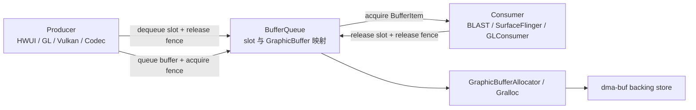

# 2.32 GraphicBuffer 内存池化与 BufferQueue 槽位复用机制

“GraphicBuffer 内存池”容易让人联想到一块由 framework 统一管理、释放后还能按尺寸重新取出的显存池。Android 17 的公开源码没有这样的通用实现。稳定渲染时看到的低分配率，主要来自 BufferQueue 保留 slot 与 `GraphicBuffer` 的绑定：Consumer 释放一帧后，已有 buffer 留在 slot 中，Producer 后续可以再次取到它。

分析这条路径时，要分开三个层次：

1. **BufferQueue 复用**：保存 `slot -> GraphicBuffer` 的映射，协调 Producer、Consumer 和 fence；
2. **Gralloc 分配**：根据尺寸、格式、usage 等描述创建可跨进程传递的 native buffer；
3. **驱动或厂商缓存**：是否缓存已释放分配、如何选择 heap、压缩或布局，属于 HAL 与驱动实现。

第一层可以从 AOSP 完整验证。第三层没有统一的 Android contract，不能仅凭 framework trace 推断厂商内部存在某种 free-list。

以下分析以 `android-17.0.0_r1` 为准。内核侧以 `android17-6.18-2026-06_r6` 为准：dma-buf 管共享内存对象与 fd 生命周期，dma-fence/sync_file 管访问时序；内核不知道 BufferQueue 的 slot 编号，也不负责 slot 选择。

---

## 一、先区分 slot、GraphicBuffer、handle 和底层分配

这四个对象位于不同层次：

| 对象 | 所在位置 | 主要内容 | 生命周期由谁约束 |
|---|---|---|---|
| slot | 单个 BufferQueue 内部 | 整数索引及状态、frame number、fence、`sp<GraphicBuffer>` | BufferQueueCore |
| `GraphicBuffer` | native 用户空间对象 | 宽高、格式、usage、stride、native handle 等 | `sp<>` 引用及 owner 语义 |
| buffer handle | 跨进程描述 | fd 与整数元数据 | Mapper import/free、进程 fd |
| 底层分配 | Gralloc/内核/驱动 | dma-buf backing store、布局、padding、压缩等 | allocator、驱动和所有导入者 |

slot 只是队列内的索引。相同的 slot 可以在旧 buffer 清除后绑定新 buffer；同一底层分配也可能以导入后的 handle 出现在多个进程。下面三句话因此不能互换：

- “slot 已经 FREE”表示队列状态允许它进入后续选择；
- “slot 中没有 `GraphicBuffer`”表示该队列不再保存这个对象；
- “底层物理内存已经回收”还取决于其他进程、缓存和驱动引用。

BufferQueue 传递 buffer handle 与元数据，不复制整块像素。配套的 acquire/release fence 决定不同硬件单元何时可以读写这块共享内存。Writer 的 rendering pipelines 系列在标准窗口、SurfaceView 和视频路径中反复使用这一边界；slot 复用必须放在 fence 时序中理解。



图中的 Gralloc 分支只在首次分配或不兼容重分配时发生。稳态循环通常沿 Producer、BufferQueue、Consumer 三者之间运行。

---

## 二、`GraphicBufferAllocator` 是分配适配器和登记表

### 2.1 单例不等于系统唯一分配入口

Android 17 的 `GraphicBufferAllocator` 使用 `ANDROID_SINGLETON_STATIC_INSTANCE`。构造函数读取 Mapper 版本，并创建对应的 Gralloc 2、3、4 或 5 allocator 适配器：

```cpp
switch (mMapper.getMapperVersion()) {
    case GraphicBufferMapper::GRALLOC_5:
        mAllocator = std::make_unique<const Gralloc5Allocator>(...);
        break;
    case GraphicBufferMapper::GRALLOC_4:
        mAllocator = std::make_unique<const Gralloc4Allocator>(...);
        break;
    // GRALLOC_3 / GRALLOC_2 compatibility paths
}
```

这段代码的用途是说明 libui 如何匹配 allocator 与 mapper。它不能证明所有 Android 17 设备都使用 Gralloc 5；源码仍保留多个兼容分支，设备选择取决于其图形 HAL 实现。它也不能证明进程中的每类 GPU 内存都经过这个类，例如 Vulkan 私有资源有各自的 API 与驱动路径。

### 2.2 `sAllocList` 不保存可再次分配的空闲块

`sAllocList` 的键是 `buffer_handle_t`，值记录宽高、stride、格式、usage、请求者与估算大小。分配成功且 handle 已 import 后加入表，`GraphicBufferAllocator::free()` 调用 Mapper 释放 handle 后移除条目。

它提供两类能力：

- 生成 `GraphicBufferAllocator buffers:` dump；
- 汇总当前登记条目的估算大小，并维护跟踪事件。

列表中没有“已释放、等待匹配”的条目，也没有按规格查找旧 handle 的接口，因此它不承担 framework 通用内存池的职责。

### 2.3 `getTotalSize()` 是估算值

Android 17 计算登记大小时，大致使用：

```cpp
bufSize = static_cast<size_t>(result.stride) * height * bytesPerPixel(format);
```

若 stride 无意义或计算可能溢出，代码会回退到输入宽度。转储中也写明：

```text
Total allocated by GraphicBufferAllocator (estimate)
```

这个估算对简单的单层线性 RGB buffer 较直观，对多平面 YUV、厂商压缩、对齐、额外 metadata、未知 bytes-per-pixel 或多 layer 分配可能不完整。它适合观察同一进程、同一类 buffer 的趋势，不能直接当作设备图形内存总量。

### 2.4 两条 trace 的含义

Android 17 中：

- `mem.gralloc.buffers` 是 counter，值为 `sAllocList.size()`，也就是登记 handle 数量；
- `mem.gralloc.allocations` 是 instant-event track，分配时记录请求者、宽高与 handle，释放时记录 handle。

`mem.gralloc.buffers` 不是字节数，`mem.gralloc.allocations` 也不是只增不减的累计计数器。短时间出现密集分配事件说明发生了 allocation churn；是否泄漏还要看释放事件、BufferQueue 状态、进程内引用和更底层的内存证据。

---

## 三、BufferQueue 保存哪些 slot

### 3.1 四个容器互斥

Android 17 的 `BufferQueueCore` 初始创建 64 个 `BufferSlot`，再用四个容器管理它们：

| 容器 | C++ 类型 | slot 状态 | 是否保存 `GraphicBuffer` |
|---|---|---|---|
| `mFreeSlots` | `std::set<int>` | FREE | 否 |
| `mFreeBuffers` | `std::list<int>` | FREE | 是 |
| `mUnusedSlots` | `std::list<int>` | FREE、当前不计入可用数量 | 否 |
| `mActiveBuffers` | `std::set<int>` | DEQUEUED、QUEUED、ACQUIRED 等非 FREE 状态 | 通常是；分配窗口内可暂时为空 |

`validateConsistencyLocked()` 会检查一个 slot 不能同时出现在多个容器，并检查容器、状态和 buffer 是否一致。`mFreeBuffers` 使用有顺序的 list，Producer `dequeue` 时取其 front；把四者都称为“set”会掩盖这个细节。

构造阶段先计算当前允许的 buffer 数量，把对应 slot 放进 `mFreeSlots`，其余 slot 放进 `mUnusedSlots`。这表示“64 个 slot 已有 64 块内存”是错误读法：刚创建的队列可以一个 `GraphicBuffer` 都没有。

### 3.2 可用数量由 Producer/Consumer 约束共同决定

Android 17 的核心计算是：

```text
maxBufferCount =
    maxAcquiredBufferCount
  + maxDequeuedBufferCount
  + (asyncMode || dequeueBufferCannotBlock ? 1 : 0)
```

结果还会被 `mMaxBufferCount` 截断。各项含义如下：

- `maxAcquiredBufferCount`：Consumer 最多持有多少块；
- `maxDequeuedBufferCount`：Producer 最多同时 dequeue 多少块；
- 额外一块：异步或 Producer 不能阻塞时，为队列推进预留空间。

所以不能用固定的“双缓冲、三缓冲、BLAST 四缓冲”表预测每个 Surface。共享 buffer 模式、Consumer 配置、交换链策略、是否允许阻塞以及 attach/detach 都会改变行为。实际数量应从目标 BufferQueue 的 dump 和调用配置确认。

### 3.3 64 是默认容量，存在显式扩展路径

`BufferQueueDefs::NUM_BUFFER_SLOTS` 在 Android 17 中为 64。普通模式的 slot 数组和多处 Consumer/Surface 缓存以此为默认容量，但 64 不是所有路径都无法越过的全局上限。

扩展必须经过明确协商：

1. Consumer 在 Producer 连接前调用 `allowUnlimitedSlots(true)`；
2. Producer 调用 `extendSlotCount(size)`；
3. `BufferQueueCore::extendSlotCountLocked()` 扩大 `mSlots`，把新增索引加入 `mUnusedSlots`，并更新 `mMaxBufferCount`。

AOSP 测试覆盖了扩展到 128、256 等数量。这个能力与“Gralloc 要支持更大的 slot 数组”无关：slot 数组属于 BufferQueue；每块 buffer 仍按需要单独分配。是否应该扩大数量，则是另一回事。更多 in-flight buffer 会提高内存占用，也可能增加队列延迟。

---

## 四、一次 `dequeueBuffer()` 如何决定复用或分配

### 4.1 先找可用 slot

`waitForFreeSlotThenRelock()` 会统计 active slot 中 DEQUEUED、ACQUIRED 的数量，并检查：

- 队列是否 abandoned；
- Producer 是否超过最大 dequeue 数；
- 队列中是否积压了过多 buffer；
- shared buffer 模式是否已有固定 slot；
- 当前是否允许新分配。

普通出队的选择顺序是：

1. 优先取 `mFreeBuffers.front()`，因为它已经带有 buffer；
2. 没有可复用 buffer 且 `mAllowAllocation` 为 true 时，再取 `mFreeSlots`；
3. 无 slot 时等待 Consumer acquire/release 或配置变化；
4. 非阻塞/异步条件下可能返回 `WOULD_BLOCK`，设置超时后也可能返回 `TIMED_OUT`。

“dequeue 慢”因此有多种原因：等 slot、等 Consumer、等 release fence、执行新分配、Binder 调度或线程本身未运行。仅看一个长 slice 无法断定是 Gralloc。

### 4.2 兼容性检查不要求用途完全相等

找到 slot 后，`GraphicBuffer::needsReallocation()` 检查：

```cpp
if (inWidth != width) return true;
if (inHeight != height) return true;
if (inFormat != format) return true;
if (inLayerCount != layerCount) return true;
if ((usage & inUsage) != inUsage) return true;
if ((usage & USAGE_PROTECTED) !=
        (inUsage & USAGE_PROTECTED)) return true;
```

宽、高、格式和层数必须相等。普通用途采用“已有用途覆盖请求用途”的关系：旧 buffer 多出的兼容用途位不会自动触发重分配。`USAGE_PROTECTED` 单独要求精确匹配，避免保护属性被当作普通超集处理。

在 `BQ_EXTENDEDALLOCATE` flag ID 与队列当前世代不一致时，也会要求重分配。

### 4.3 分配就在 `dequeueBuffer()` 内完成

需要新 buffer 时，`BufferQueueProducer::dequeueBuffer()` 会：

1. 把 slot 标为 DEQUEUED，清除旧 `GraphicBuffer` 映射；
2. 设置 `mIsAllocating`，并在返回标志中加入 `BUFFER_NEEDS_REALLOCATION`；
3. 释放 `BufferQueueCore::mMutex`；
4. 创建 `GraphicBuffer`，进入 `GraphicBufferAllocator` 和 Gralloc；
5. 重新取得锁，把新对象安装到该 slot；
6. 清除 `mIsAllocating` 并唤醒等待者。

分配时暂时放开核心锁，避免一次慢 allocator 调用把所有队列状态操作都压在同一把锁后面。代码仍使用 `mIsAllocating` 协调同一队列的相关分配。

### 4.4 `requestBuffer()` 完成 slot 映射握手

`dequeueBuffer()` 返回 slot 与标志后，`Surface` 检查：

```cpp
if ((result & BUFFER_NEEDS_REALLOCATION) || gbuf == nullptr) {
    result = mGraphicBufferProducer->requestBuffer(buf, &gbuf);
}
```

此时新 buffer 已在 BufferQueue Producer 端分配完成。`requestBuffer()` 验证该 slot 处于 DEQUEUED 状态，再把 slot 对应的 `sp<GraphicBuffer>` 返回给 `Surface`，用于更新 Producer 侧缓存。

因此调用顺序虽是 `dequeueBuffer()` 后接 `requestBuffer()`，分配动作却不在 `requestBuffer()` 中。排查性能时应看 `dequeueBuffer` 内的 reallocation instant event 与 allocator slice。

---

## 五、复用循环还受 fence 约束

一块 buffer 从 Producer 到 Consumer 再回来的主状态如下：


Consumer 的 `releaseBuffer()` 会保存 release fence，将 buffer 状态 release，并把非 shared slot 从 `mActiveBuffers` 移到 `mFreeBuffers` 尾部。这里的 FREE 表示 slot 可以再次被选中，不表示 GPU、DPU 或其他 Consumer 已经在调用返回前同步完成。

Producer 下次 dequeue 到这个 slot 时会同时取得 fence。它必须在覆盖 buffer 内容前遵守该 fence：

- CPU lock、EGL 或 Vulkan 交换链会在各自路径导入或等待；
- fence 已 signal 时等待可能很短；
- fence 未 signal 时，即使没有任何新分配，dequeue/acquire 相关路径仍可能延迟。

`mFreeBuffers` 中有 slot，不代表下一帧一定能立即开始写入；buffer 可复用和访问安全是两个条件。

队列可能丢弃旧帧。被丢弃的 `BufferItem` 对应 slot 也可从 active 转回 free buffer，但 frame number、stale slot 与 fence 仍要按源码规则处理，不能绕过同步。

---

## 六、清 slot、释放对象与回收底层内存

### 6.1 `clearBufferSlotLocked()` 只清队列持有的那份引用

Android 17 的该函数会清除：

- `mGraphicBuffer`；
- buffer state；
- request/acquire 标志；
- frame number；
- fence 与旧 EGL fence 信息；
- last queued slot 关联。

函数中没有直接调用 `GraphicBufferAllocator::free()`，但这不代表本次操作一定不会释放内存。`mGraphicBuffer.clear()` 会减少强引用；若它恰好是仅存的、拥有底层 handle 的 `GraphicBuffer`，对象析构会进入相应释放路径。

是否成为最终一份引用，需要检查：

- Producer `Surface` 的 slot 缓存；
- Consumer/BLAST/SurfaceFlinger 的 buffer 缓存；
- 排队中的 `BufferItem`；
- EGLImage、纹理或其他导入对象；
- 其他进程导入的 handle 与驱动引用。

### 6.2 `freeAllBuffersLocked()` 清映射并处理缓存失效

Producer disconnect、队列配置变化等路径可调用 `freeAllBuffersLocked()`。它清理 free/active slot 的 `GraphicBuffer`，把 slot 转为 `mFreeSlots`，并把尚在 FIFO 中的 item 标为 stale。源码还把这些 item 的 `mAcquireCalled` 设为 false，使 Consumer 后续重新取得 handle，而不继续使用已失效的 slot 缓存。

slot 编号本身没有跨 disconnect 的永久身份。重连后，即使数字相同，双方也要重新建立映射。

### 6.3 `GraphicBuffer` 的 owner 决定释放方式

`GraphicBuffer` 可能：

- 自己通过 allocator 创建数据，析构时走 `GraphicBufferAllocator::free()`；
- 只拥有导入后的 handle，析构时走 Mapper 的 `freeBuffer()`；
- 只包装外部 handle，不取得所有权。

不能把每个 `GraphicBuffer` 析构都描述成“从 `sAllocList` 删除一项”。只有由该 allocator 登记并按相应 owner 语义持有的 handle 才符合这条路径。

`GraphicBufferAllocator` 自身的析构函数在 Android 17 是空函数，不会遍历 `sAllocList` 做统一清理。进程退出时，fd、Binder 对象和驱动上下文会按各自生命周期释放；跨进程 Consumer 与驱动何时撤销最终引用，不能承诺固定为“下一个 frame cycle”。

### 6.4 SurfaceView 反复创建不等于已有通用泄漏结论

SurfaceView、TextureView、普通应用窗口使用的 Consumer 和合成路径不同。反复创建 Surface 后图形指标增长，可能来自：

- 旧 BufferQueue 或 BLAST transaction 尚未完成清理；
- 应用仍持有 `Surface`、`SurfaceTexture`、codec、EGLSurface 或 native window；
- GPU 导入缓存尚未释放；
- 新旧队列在异步销毁阶段短暂重叠；
- 厂商 allocator/driver 缓存或统计口径；
- 确有引用或驱动泄漏。

不能只凭 `clearBufferSlotLocked()` 没有直接调用 allocator free，就断言这是 AOSP 的“经典泄漏”。也不应把 `eglTerminate()` 当作销毁每个 SurfaceView 的固定处方：共享 EGLDisplay/Context 的应用可能仍需继续使用它们。正确动作是按所有权释放对应的 Surface、EGLSurface、纹理、codec 和 native 引用，再用时间线证据确认哪一层没有下降。

---

## 七、Gralloc 5 AIDL 与厂商实现边界

### 7.1 framework 每次请求一块

Gralloc 5 的 `IAllocator.allocate2()` 接口支持 `count` 参数。Android 17 的 `Gralloc5Allocator::allocate(const AllocationRequest&)` 构造 `BufferDescriptorInfo` 后调用：

```cpp
mAllocator->allocate2(*descriptorInfo, 1, &result);
```

这里的 `count` 固定为 1。不能因为 AIDL 支持批量语义，就宣称 BufferQueue 的普通 reallocation 会一次批量申请多块。`BufferQueueProducer::allocateBuffers()` 可以预分配多个可用 slot，但实现仍按 slot 逐块创建 `GraphicBuffer`，还会处理分配期间配置变化的竞态。

### 7.2 AIDL 描述不规定堆、压缩或缓存算法

`BufferDescriptorInfo` 包含：

- name；
- width、height、layerCount；
- pixel format；
- usage；
- `reservedSize`；
- `additionalOptions` 附加选项。

这些字段描述需求。allocator 选择 system heap、专用 heap、连续内存、压缩布局或其他厂商路径，属于设备实现。AOSP 的接口也没有要求“free 后必须加入池”或“下一次相同规格必须复用同一 dma-buf”。

若要证明厂商存在额外池化，至少需要其 HAL/驱动源码、厂商 tracepoint，或能够对应 allocate/free 与底层对象身份的设备证据。SoC 名称本身不能替代验证。

### 7.3 `reservedSize` 与 16 KB page size 不存在固定换算

`reservedSize` 是与 buffer 关联的 reserved region 字节数。Android 17 的 `Gralloc5Allocator::makeDescriptor()` 在普通 GraphicBuffer 路径中没有主动设置它，默认值为 0；additional options 另有独立数组。

Android 支持 16 KB page size，不代表每块 GraphicBuffer 都额外增加固定 16 KB，也不能从 `reservedSize` 推出 metadata region 按某个页面大小取整。实际分配还受 stride、plane layout、压缩、guard region、IOMMU 映射和厂商规则影响。

需要精确大小时，优先查询 Mapper 的 `StandardMetadataType::ALLOCATION_SIZE`，其定义目标是报告包含 metadata 与 padding 的总分配字节数；再与厂商/内核统计交叉检查。`GraphicBufferAllocator` 的 `stride × height × bpp` 仍应标为 estimate。

### 7.4 Android 17 的 additional options

`BQ_EXTENDEDALLOCATE` 保护 BufferQueue 的扩展分配选项路径。Producer 设置新 options 后，core 更新内容并递增 generation id；旧 slot 的 generation 不匹配时，下次 dequeue 会重新分配。Gralloc 5 将这些选项转为 `ExtendableType[]` 传给 `allocate2()`。

选项用于“不改变总体 usage、但会影响分配方式”的扩展信息，AIDL 文档给出的例子是 surface compression level。实现必须拒绝无法识别的选项。flag 在源码存在不代表任意量产设备都启用，也不能把 protected content 等已有明确 usage 语义的能力随意归入该数组。

---

## 八、BLAST、SurfaceView 与渲染后端不会改变核心规则

BLAST 改变了 buffer 与窗口 transaction 的组织方式，也改变了一些对象位于哪个进程。它没有取消 BufferQueue 的 slot、buffer cache 和 fence 语义。

- 标准应用窗口路径中，BLAST 可以在应用进程接收 BufferQueue 内容，并把 buffer 与窗口状态放进 transaction；
- SurfaceView 有独立 child layer 与自己的内容队列；
- TextureView 通常由 `SurfaceTexture`/GL Consumer 取得内容，再进入宿主窗口 buffer；
- MediaCodec、Camera 和 Vulkan swapchain 仍根据各自 Consumer/Producer 配置使用队列。

所以“BLAST 后 Consumer 全部移到应用进程”过于宽泛。分析某个 buffer 时，应先确定具体 BufferQueue 的 Producer、Consumer、所在进程和最终 Layer。

Skia Vulkan RenderEngine、应用 Vulkan、ANGLE 或 GPU 驱动可以维护各自的纹理、image、descriptor 或 device-memory 缓存。这些缓存与 BufferQueue slot 属于不同资源域。即使某后端复用了导入的 GPU 对象，也不能据此断言 slot 未发生重分配；反过来，slot 复用也不保证所有 GPU-side import 都没有成本。

---

## 九、怎样观察复用、重分配和内存

### 9.1 BufferQueue dump：先定位目标队列

`BufferQueueCore::dumpState()` 会输出：

- Consumer 名称、Producer/Consumer pid；
- `mMaxAcquiredBufferCount`、`mMaxDequeuedBufferCount`；
- async、cannot-block、默认尺寸/格式；
- FIFO 中的 frame；
- active、free-buffer、free-slot 的逐 slot 信息。

源码输出没有为四个容器都打印一个稳定的“数量字段”。不同服务如何嵌入这段 dump 也会变化。排查时先通过 consumer name、layer、pid 与尺寸找到目标队列，再读取其 slot 行，不要把别的 Surface 的 buffer 混进结论。

### 9.2 Perfetto：把三种等待拆开

建议同时打开 graphics、view、sched、freq、memory 等与场景相关的数据源，并围绕目标线程查看：

1. `dequeueBuffer` 前线程是否可运行；
2. 是否出现 `<consumer name> buffer reallocation: ...` instant event；
3. 是否进入 `GraphicBufferAllocator::allocate` 或 Gralloc Binder 调用；
4. 返回的 release fence 何时 signal；
5. Consumer 何时 acquire/release；
6. 是否因队列已满返回等待、`WOULD_BLOCK` 或超时。

只有第 2、3 项一起出现，才有直接证据把该次长耗时归到新分配。没有 reallocation 时，应优先检查 Consumer 与 fence。

### 9.3 `mem.gralloc.*`：看登记行为

常见组合判断如下：

| 观察 | 可以支持的结论 | 仍不能确认 |
|---|---|---|
| `mem.gralloc.buffers` 上升后稳定 | 当前进程登记 handle 数达到新平台 | 底层独占物理字节数 |
| allocation/free instant 频繁交替 | framework 层存在分配抖动 | 厂商是否复用了旧 backing store |
| BufferQueue 长期保留 free buffers | 队列在保存可复用 buffer | 这些 buffer 是否全部 resident |
| `dumpsys meminfo` Graphics/EGL/GL 上升 | 对应统计口径的进程趋势上升 | 单凭此项定位引用者或证明泄漏 |

`dumpsys meminfo` 的 Graphics、EGL mtrack、GL mtrack 受设备 mtrack 实现和归属口径影响。它适合做同设备、同场景的前后对比，不适合和 `sAllocList` 估算逐字节对账。

### 9.4 内核证据：确认对象和引用，不猜 slot

在 `android17-6.18-2026-06_r6` 中，DMA-BUF 与 dma-fence 位于内核共享内存和同步层。可用的 debugfs、proc fdinfo、tracepoint 与厂商节点会随内核配置变化。使用它们时关注：

- dma-buf inode/对象身份是否仍存在；
- 哪些进程仍持有 fd 或 import；
- fence 是否已 signal；
- exporter、size 与设备 attachment 是否可见。

内核数据不会指出某个对象“对应 BufferQueue slot 3”。要用 handle、pid、时间戳、Layer/queue 名称和尺寸，把用户空间事件与内核对象关联。更完整的 DMA-BUF 与 fence 说明见 2.15、2.16。

---

## 十、常见现象的排查顺序

### 10.1 首帧或尺寸切换卡顿

依次确认：

1. 是否出现 reallocation instant event；
2. 哪个属性变化：width、height、format、layerCount、usage 或 additional-options generation；
3. allocator 调用是否覆盖主要耗时；
4. 新尺寸是否由旋转、窗口 resize、分辨率策略或 codec format change 引起；
5. 后续稳定帧是否回到同一批 slot。

不要套用固定的“冷分配 10～50 ms”。分配耗时取决于设备、尺寸、格式、内存压力和 HAL/驱动，应以目标设备 trace 为准。

### 10.2 `dequeueBuffer()` 周期性阻塞

检查：

- Producer 是否已达到 `mMaxDequeuedBufferCount`；
- Consumer 是否长时间 ACQUIRED；
- 队列 FIFO 是否积压；
- release fence 是否晚；
- async/cannot-block 配置与 timeout；
- Producer 是否持续快于显示或 Consumer。

盲目增加 buffer 数量可能暂时减少阻塞，同时增加内存和端到端延迟。游戏、视频和普通 UI 对吞吐、延迟、丢帧的取舍不同，应分别评估。

### 10.3 Graphics 内存反复上涨

建议做分阶段快照：

1. 创建前；
2. 首次稳定显示后；
3. 停止 Producer 并释放应用对象后；
4. 等待异步 transaction、GPU 与 fence 完成后；
5. 重复多轮。

每个阶段同时记录目标 BufferQueue dump、进程 meminfo、gralloc trace 和对象生命周期。若 slot/buffer 数量已回落而 mtrack 不降，继续检查 GPU import 或厂商层；若目标队列仍存在，先查找仍持有 Surface/Consumer 的用户空间对象。

### 10.4 复用率低

常见诱因包括：

- Surface 尺寸在相邻帧间变化；
- format 或 protected usage 来回切换；
- Consumer usage 改变；
- additional options 频繁更新；
- 队列反复 disconnect/reconnect；
- 应用在多个 Surface 之间重建交换链。

优化目标应是减少不必要的规格变化和生命周期抖动。不能缓存已失去所有权的 raw handle，也不能绕过 fence 强行复用。

---

## 十一、版本与源码边界

相关行为断言以 Android 17 / API 37 / `android-17.0.0_r1` 为准。Android 8 到 Android 16 可沿用 Producer/Consumer、slot cache 与 fence 的基本模型，但具体 interface、flag、BLAST organization、allocator/mapper version 和 trace name 可能不同。

审阅旧版本问题时，应读取对应 release tag，避免把 Android 17 的以下细节倒推到更早版本：

- Gralloc 5 stable AIDL 适配；
- `allocate2(BufferDescriptorInfo, ...)`；
- `BQ_EXTENDEDALLOCATE` 与 additional-options generation；
- 当前 BLAST 与 Surface 的缓存实现；
- 当前 unlimited-slot 协商路径。

这里不为每个机制标注未经 git history 验证的首次引入版本。需要追溯版本时，应以对应 tag 的文件与提交历史为证据。

---

## 十二、结论

GraphicBuffer 的低分配率主要来自 BufferQueue 保留 `slot -> GraphicBuffer` 映射。Consumer release 后，slot 进入 `mFreeBuffers`，Producer 下次优先选择它；规格兼容时沿用原 buffer，不兼容时才在 `dequeueBuffer()` 中重新分配。

分析时记住四条边界：

1. slot FREE、对象析构、handle 释放和底层 backing store 回收是不同事件；
2. `requestBuffer()` 更新 Producer 的 slot 缓存，新分配已在 `dequeueBuffer()` 内完成；
3. buffer 可复用仍要遵守 release fence；
4. framework 能证明 slot 保留和 handle 登记，厂商内部池化需要额外证据。

把 BufferQueue dump、reallocation trace、fence、Gralloc 登记与进程/内核内存证据放在同一条时间线上，才能判断一次问题源于 slot 不足、Consumer 延迟、同步等待、规格抖动、引用未释放，还是 allocator/driver 行为。

---

## 交叉引用

- **2.10 GPU 渲染深入**：应用与 RenderEngine 的 GPU 资源边界
- **2.13 SurfaceFlinger 与合成流水线**：Layer、CompositionEngine 与 HWC
- **2.15 DMA-BUF、Gralloc 与跨进程图形内存共享**：handle、Mapper、dma-buf 和内存统计
- **2.16 Sync Fence**：acquire/release fence 与 sync_file
- **2.24 BufferQueue 与 BLASTBufferQueue**：完整 slot 状态机与 BLAST transaction

## 源码阅读入口

- `frameworks/native/libs/gui/BufferQueueCore.cpp`：slot 容器、数量计算、clear/free-all 和 dump
- `frameworks/native/libs/gui/BufferQueueProducer.cpp`：dequeue、reallocation、allocation、requestBuffer
- `frameworks/native/libs/gui/BufferQueueConsumer.cpp`：acquire、release 与 free-buffer 回流
- `frameworks/native/libs/gui/Surface.cpp`：Producer 侧 slot 缓存和 `BUFFER_NEEDS_REALLOCATION` 处理
- `frameworks/native/libs/ui/GraphicBuffer.cpp`：owner、析构与 `needsReallocation`
- `frameworks/native/libs/ui/GraphicBufferAllocator.cpp`：allocator 适配、登记表、dump 与 trace
- `frameworks/native/libs/ui/Gralloc5.cpp`：`allocate2(..., 1, ...)`、Mapper import 和 allocation-size metadata
- `hardware/interfaces/graphics/allocator/aidl/`：allocator contract 与 `BufferDescriptorInfo`
- `common/drivers/dma-buf/`：dma-buf、dma-fence、sync_file 内核语义
