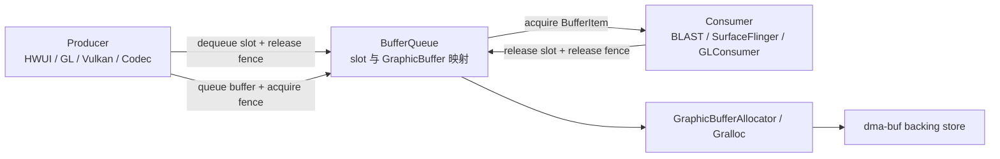

# 2.32 GraphicBuffer 内存池化与 BufferQueue 槽位复用机制

“GraphicBuffer 内存池”容易让人联想到由框架统一管理、释放后还能按尺寸重新取出的显存池。Android 17 的公开源码没有这种通用实现。稳定渲染时的低分配率主要来自 BufferQueue 保留槽位与 `GraphicBuffer` 的绑定：消费者释放一帧后，已有缓冲区留在槽位中，生产者后续可以再次取到它。

分析这条路径时，要分开三个层次：

1. **BufferQueue 复用**：保存 `slot -> GraphicBuffer` 的映射，协调 Producer、Consumer 和 fence；
2. **Gralloc 分配**：根据尺寸、格式、用途等描述创建可跨进程传递的原生缓冲区；
3. **驱动或厂商缓存**：是否缓存已释放分配、如何选择 heap、压缩或布局，属于 HAL 与驱动实现。

第一层可以从 AOSP 完整验证。第三层没有统一的 Android contract，不能仅凭框架跟踪推断厂商内部存在某种空闲链表。

以下分析以 `android-17.0.0_r1` 为准。内核侧以 `android17-6.18-2026-06_r6` 为准：DMA-BUF 管理共享内存对象与文件描述符生命周期，DMA fd sync_file 管理访问时序；内核不知道 BufferQueue 的槽位编号，也不负责选择槽位。

---

## 一、先区分槽位、GraphicBuffer、句柄和底层分配

这四个对象位于不同层次：

| 对象 | 所在位置 | 主要内容 | 生命周期由谁约束 |
|---|---|---|---|
| slot | 单个 BufferQueue 内部 | 整数索引及状态、frame number、fence、`sp<GraphicBuffer>` | BufferQueueCore |
| `GraphicBuffer` | native 用户空间对象 | 宽高、格式、usage、stride、native handle 等 | `sp<>` 引用及 owner 语义 |
| buffer handle | 跨进程描述 | fd 与整数元数据 | Mapper import/free、进程 fd |
| 底层分配 | Gralloc/内核/驱动 | dma-buf backing store、布局、padding、压缩等 | allocator、驱动和所有导入者 |

槽位只是队列内的索引。相同槽位可以在旧缓冲区清除后绑定新缓冲区；同一底层分配也可能以导入后的句柄出现在多个进程。因此，下面三句话不能互换：

- “槽位已经 FREE”表示队列状态允许它进入后续选择；
- “槽位中没有 `GraphicBuffer`”表示该队列不再保存这个对象；
- “底层物理内存已经回收”还取决于其他进程、缓存和驱动引用。

BufferQueue 传递缓冲区句柄与元数据，不复制整块像素。配套的获取和释放栅栏决定不同硬件单元何时可以读写这块共享内存。槽位复用必须结合栅栏时序理解。



图中的 Gralloc 分支只在首次分配或不兼容重分配时发生。稳态循环通常在生产者、BufferQueue 和消费者之间运行。

---

## 二、`GraphicBufferAllocator` 是分配适配器和登记表

### 2.1 单例不等于系统唯一分配入口

Android 17 的 `GraphicBufferAllocator` 使用 `ANDROID_SINGLETON_STATIC_INSTANCE`。构造函数读取 Mapper 版本，并创建对应的 Gralloc 2、3、4 或 5 allocator 适配器：

```cpp
switch (mMapper.getMapperVersion()) {
    case GraphicBufferMapper::GRALLOC_5:
        mAllocator = std::make_unique<const Gralloc5Allocator>(...);
        break;
    case GraphicBufferMapper::GRALLOC_4:
        mAllocator = std::make_unique<const Gralloc4Allocator>(...);
        break;
    // GRALLOC_3 / GRALLOC_2 compatibility paths
}
```

这段代码说明 libui 如何匹配分配器与映射器。它不能证明所有 Android 17 设备都使用 Gralloc 5；源码仍保留多个兼容分支，设备选择取决于图形 HAL 实现。进程中的每类 GPU 内存也不一定都经过这个类，例如 Vulkan 私有资源有各自的接口与驱动路径。

### 2.2 `sAllocList` 不保存可再次分配的空闲块

`sAllocList` 的键是 `buffer_handle_t`，值记录宽高、stride、格式、usage、请求者与估算大小。分配成功且 handle 已 import 后加入表，`GraphicBufferAllocator::free()` 调用 Mapper 释放 handle 后移除条目。

它提供两类能力：

- 生成 `GraphicBufferAllocator buffers:` dump；
- 汇总当前登记条目的估算大小，并维护跟踪事件。

列表中没有“已释放、等待匹配”的条目，也没有按规格查找旧句柄的接口，因此它不承担框架通用内存池的职责。

### 2.3 `getTotalSize()` 是估算值

Android 17 计算登记大小时，大致使用：

```cpp
bufSize = static_cast<size_t>(result.stride) * height * bytesPerPixel(format);
```

若行跨度无意义或计算可能溢出，代码会回退到输入宽度。转储中也写明：

```text
Total allocated by GraphicBufferAllocator (estimate)
```

这个估算对简单的单层线性 RGB 缓冲区较直观，对多平面 YUV、厂商压缩、对齐、额外元数据、未知单像素字节数或多层分配可能不完整。它适合观察同一进程、同一类缓冲区的趋势，不能直接作为设备图形内存总量。

### 2.4 两条跟踪轨道的含义

Android 17 中：

- `mem.gralloc.buffers` 是计数器，值为 `sAllocList.size()`，也就是登记的句柄数量；
- `mem.gralloc.allocations` 是瞬时事件轨道，分配时记录请求者、宽高与句柄，释放时记录句柄。

`mem.gralloc.buffers` 不是字节数，`mem.gralloc.allocations` 也不是只增不减的累计计数器。短时间出现密集分配事件说明发生了分配抖动；是否泄漏还要看释放事件、BufferQueue 状态、进程内引用和更底层的内存证据。

---

## 三、BufferQueue 保存哪些槽位

### 3.1 四个容器互斥

Android 17 的 `BufferQueueCore` 初始创建 64 个 `BufferSlot`，再用四个容器管理它们：

| 容器 | C++ 类型 | 槽位状态 | 是否保存 `GraphicBuffer` |
|---|---|---|---|
| `mFreeSlots` | `std::set<int>` | FREE | 否 |
| `mFreeBuffers` | `std::list<int>` | FREE | 是 |
| `mUnusedSlots` | `std::list<int>` | FREE、当前不计入可用数量 | 否 |
| `mActiveBuffers` | `std::set<int>` | DEQUEUED、QUEUED、ACQUIRED 等非 FREE 状态 | 通常是；分配窗口内可暂时为空 |

`validateConsistencyLocked()` 会检查一个槽位不能同时出现在多个容器，并检查容器、状态和缓冲区是否一致。`mFreeBuffers` 使用有顺序的链表，生产者出队时取其表头；把四者都称为“set”会掩盖这个细节。

构造阶段先计算当前允许的缓冲区数量，把对应槽位放入 `mFreeSlots`，其余槽位放入 `mUnusedSlots`。“64 个槽位”不代表已有 64 块内存：刚创建的队列可以没有任何 `GraphicBuffer`。

### 3.2 可用数量由生产者与消费者约束共同决定

Android 17 的核心计算是：

```text
maxBufferCount =
    maxAcquiredBufferCount
  + maxDequeuedBufferCount
  + (asyncMode || dequeueBufferCannotBlock ? 1 : 0)
```

结果还会被 `mMaxBufferCount` 截断。各项含义如下：

- `maxAcquiredBufferCount`：消费者最多持有多少块；
- `maxDequeuedBufferCount`：生产者最多同时出队多少块；
- 额外一块：异步或生产者不能阻塞时，为队列推进预留空间。

因此，不能用固定的“双缓冲、三缓冲、BLAST 四缓冲”表预测每个 Surface。共享缓冲区模式、消费者配置、交换链策略、是否允许阻塞以及挂接或分离都会改变行为。实际数量应从目标 BufferQueue 的转储和调用配置确认。

### 3.3 64 是默认容量，存在显式扩展路径

`BufferQueueDefs::NUM_BUFFER_SLOTS` 在 Android 17 中为 64。普通模式的槽位数组和多处消费者或 Surface 缓存以此为默认容量，但 64 不是所有路径都无法越过的全局上限。

扩展必须经过明确协商：

1. 消费者在生产者连接前调用 `allowUnlimitedSlots(true)`；
2. 生产者调用 `extendSlotCount(size)`；
3. `BufferQueueCore::extendSlotCountLocked()` 扩大 `mSlots`，把新增索引加入 `mUnusedSlots`，并更新 `mMaxBufferCount`。

AOSP 测试覆盖了扩展到 128、256 等数量。这个能力与“Gralloc 要支持更大的槽位数组”无关：槽位数组属于 BufferQueue；每块缓冲区仍按需要单独分配。是否应该扩大数量需要另行评估。更多在途缓冲区会提高内存占用，也可能增加队列延迟。

---

## 四、一次 `dequeueBuffer()` 如何决定复用或分配

### 4.1 先找可用槽位

`waitForFreeSlotThenRelock()` 会统计活动槽位中 DEQUEUED、ACQUIRED 的数量，并检查：

- 队列是否 abandoned；
- 生产者是否超过最大出队数量；
- 队列中是否积压了过多缓冲区；
- 共享缓冲区模式是否已有固定槽位；
- 当前是否允许新分配。

普通出队的选择顺序是：

1. 优先取 `mFreeBuffers.front()`，因为它已经带有缓冲区；
2. 没有可复用缓冲区且 `mAllowAllocation` 为 true 时，再取 `mFreeSlots`；
3. 无槽位时等待消费者获取或释放，或等待配置变化；
4. 非阻塞/异步条件下可能返回 `WOULD_BLOCK`，设置超时后也可能返回 `TIMED_OUT`。

“出队慢”有多种原因：等待槽位、消费者或释放栅栏，执行新分配，Binder 调度，或线程本身未运行。仅看一个长切片无法断定是 Gralloc。

### 4.2 兼容性检查不要求用途完全相等

找到槽位后，`GraphicBuffer::needsReallocation()` 检查：

```cpp
if (inWidth != width) return true;
if (inHeight != height) return true;
if (inFormat != format) return true;
if (inLayerCount != layerCount) return true;
if ((usage & inUsage) != inUsage) return true;
if ((usage & USAGE_PROTECTED) !=
        (inUsage & USAGE_PROTECTED)) return true;
```

宽、高、格式和层数必须相等。普通用途采用“已有用途覆盖请求用途”的关系：旧缓冲区多出的兼容用途位不会自动触发重分配。`USAGE_PROTECTED` 单独要求精确匹配，避免保护属性被当作普通超集处理。

在 `BQ_EXTENDEDALLOCATE` flag ID 与队列当前世代不一致时，也会要求重分配。

### 4.3 分配就在 `dequeueBuffer()` 内完成

需要新缓冲区时，`BufferQueueProducer::dequeueBuffer()` 会：

1. 把槽位标为 DEQUEUED，清除旧 `GraphicBuffer` 映射；
2. 设置 `mIsAllocating`，并在返回标志中加入 `BUFFER_NEEDS_REALLOCATION`；
3. 释放 `BufferQueueCore::mMutex`；
4. 创建 `GraphicBuffer`，进入 `GraphicBufferAllocator` 和 Gralloc；
5. 重新取得锁，把新对象安装到该槽位；
6. 清除 `mIsAllocating` 并唤醒等待者。

分配时暂时放开核心锁，避免一次慢分配器调用把所有队列状态操作都压在同一把锁后面。代码仍使用 `mIsAllocating` 协调同一队列的相关分配。

### 4.4 `requestBuffer()` 完成槽位映射握手

`dequeueBuffer()` 返回槽位与标志后，`Surface` 检查：

```cpp
if ((result & BUFFER_NEEDS_REALLOCATION) || gbuf == nullptr) {
    result = mGraphicBufferProducer->requestBuffer(buf, &gbuf);
}
```

此时新缓冲区已在 BufferQueue 生产者端分配完成。`requestBuffer()` 验证该槽位处于 DEQUEUED 状态，再把槽位对应的 `sp<GraphicBuffer>` 返回给 `Surface`，用于更新生产者侧缓存。

调用顺序虽是 `dequeueBuffer()` 后接 `requestBuffer()`，分配动作却不在 `requestBuffer()` 中。排查性能时应查看 `dequeueBuffer` 内的重分配瞬时事件与分配器切片。

---

## 五、复用循环还受栅栏约束

一块缓冲区从生产者到消费者再返回的主要状态如下：


消费者的 `releaseBuffer()` 会保存释放栅栏，将缓冲区状态释放，并把非共享槽位从 `mActiveBuffers` 移到 `mFreeBuffers` 尾部。这里的 FREE 表示槽位可以再次被选中，不表示 GPU、DPU 或其他消费者已在调用返回前同步完成。

生产者下次取到这个槽位时会同时取得栅栏。它必须在覆盖缓冲区内容前遵守该栅栏：

- CPU lock、EGL 或 Vulkan 交换链会在各自路径导入或等待；
- 栅栏已发出信号时，等待可能很短；
- 栅栏尚未发出信号时，即使没有新分配，出队和获取路径仍可能延迟。

`mFreeBuffers` 中有槽位，不代表下一帧一定能立即开始写入；缓冲区可复用和访问安全是两个条件。

队列可能丢弃旧帧。被丢弃的 `BufferItem` 对应槽位也可从活动状态转回空闲缓冲区，但帧号、过期槽位与栅栏仍要按源码规则处理，不能绕过同步。

---

## 六、清理槽位、释放对象与回收底层内存

### 6.1 `clearBufferSlotLocked()` 只清队列持有的那份引用

Android 17 的该函数会清除：

- `mGraphicBuffer`；
- buffer state；
- 请求与获取标志；
- frame number；
- fence 与旧 EGL fence 信息；
- 最近入队槽位关联。

函数中没有直接调用 `GraphicBufferAllocator::free()`，但这不代表本次操作一定不会释放内存。`mGraphicBuffer.clear()` 会减少强引用；若它恰好是仅存的、拥有底层句柄的 `GraphicBuffer`，对象析构会进入相应释放路径。

是否成为最终一份引用，需要检查：

- Producer `Surface` 的 slot 缓存；
- Consumer/BLAST/SurfaceFlinger 的 buffer 缓存；
- 排队中的 `BufferItem`；
- EGLImage、纹理或其他导入对象；
- 其他进程导入的句柄与驱动引用。

### 6.2 `freeAllBuffersLocked()` 清映射并处理缓存失效

生产者断开或队列配置变化等路径可调用 `freeAllBuffersLocked()`。它清理空闲或活动槽位的 `GraphicBuffer`，把槽位转为 `mFreeSlots`，并把仍在先进先出队列中的项目标为过期。源码还把这些项目的 `mAcquireCalled` 设为 false，使消费者后续重新取得句柄，而不继续使用已失效的槽位缓存。

槽位编号本身没有跨断开操作的永久身份。重连后，即使数字相同，双方也要重新建立映射。

### 6.3 `GraphicBuffer` 的所有者决定释放方式

`GraphicBuffer` 可能：

- 自己通过分配器创建数据，析构时走 `GraphicBufferAllocator::free()`；
- 只拥有导入后的句柄，析构时走 Mapper 的 `freeBuffer()`；
- 只包装外部句柄，不取得所有权。

不能把每个 `GraphicBuffer` 析构都描述为“从 `sAllocList` 删除一项”。只有由该分配器登记并按相应所有者语义持有的句柄才符合这条路径。

`GraphicBufferAllocator` 自身的析构函数在 Android 17 中为空，不会遍历 `sAllocList` 做统一清理。进程退出时，fd、Binder 对象和驱动上下文会按各自生命周期释放；跨进程消费者与驱动何时撤销最终引用，不能承诺固定为“下一个帧周期”。

### 6.4 SurfaceView 反复创建不等于已有通用泄漏结论

SurfaceView、TextureView、普通应用窗口使用的消费者和合成路径不同。反复创建 Surface 后图形指标增长，可能来自：

- 旧 BufferQueue 或 BLAST 事务尚未完成清理；
- 应用仍持有 `Surface`、`SurfaceTexture`、codec、EGLSurface 或 native window；
- GPU 导入缓存尚未释放；
- 新旧队列在异步销毁阶段短暂重叠；
- 厂商分配器或驱动缓存及统计口径；
- 确有引用或驱动泄漏。

不能只凭 `clearBufferSlotLocked()` 没有直接调用分配器释放，就断言这是 AOSP 的“经典泄漏”。也不应把 `eglTerminate()` 当作销毁每个 SurfaceView 的固定处方：共享 EGLDisplay 或上下文的应用可能仍需继续使用它们。应按所有权释放对应的 Surface、EGLSurface、纹理、编解码器和原生引用，再用时间线证据确认哪一层没有下降。

---

## 七、Gralloc 5 AIDL 与厂商实现边界

### 7.1 框架每次请求一块

Gralloc 5 的 `IAllocator.allocate2()` 接口支持 `count` 参数。Android 17 的 `Gralloc5Allocator::allocate(const AllocationRequest&)` 构造 `BufferDescriptorInfo` 后调用：

```cpp
mAllocator->allocate2(*descriptorInfo, 1, &result);
```

这里的 `count` 固定为 1。不能因为 AIDL 支持批量语义，就宣称 BufferQueue 的普通重分配会一次批量申请多块。`BufferQueueProducer::allocateBuffers()` 可以预分配多个可用槽位，但实现仍按槽位逐块创建 `GraphicBuffer`，还会处理分配期间配置变化的竞态。

### 7.2 AIDL 描述不规定堆、压缩或缓存算法

`BufferDescriptorInfo` 包含：

- name；
- width、height、layerCount；
- pixel format；
- usage；
- `reservedSize`；
- `additionalOptions` 附加选项。

这些字段描述需求。分配器选择系统堆、专用堆、连续内存、压缩布局或其他厂商路径，属于设备实现。AOSP 的接口也没有要求“释放后必须加入池”或“下一次相同规格必须复用同一 DMA-BUF”。

若要证明厂商存在额外池化，至少需要其 HAL 或驱动源码、厂商跟踪点，或能够对应分配、释放与底层对象身份的设备证据。SoC 名称本身不能替代验证。

### 7.3 `reservedSize` 与 16 KB 页大小不存在固定换算

`reservedSize` 是与缓冲区关联的保留区域字节数。Android 17 的 `Gralloc5Allocator::makeDescriptor()` 在普通 GraphicBuffer 路径中没有主动设置它，默认值为 0；附加选项另有独立数组。

Android 支持 16 KB page size，不代表每块 GraphicBuffer 都额外增加固定 16 KB，也不能从 `reservedSize` 推出 metadata region 按某个页面大小取整。实际分配还受 stride、plane layout、压缩、guard region、IOMMU 映射和厂商规则影响。

需要精确大小时，优先查询 Mapper 的 `StandardMetadataType::ALLOCATION_SIZE`，其目标是报告包含元数据与填充的总分配字节数；再与厂商或内核统计交叉检查。`GraphicBufferAllocator` 的 `stride × height × bpp` 仍应标为估算值。

### 7.4 Android 17 的附加选项

`BQ_EXTENDEDALLOCATE` 保护 BufferQueue 的扩展分配选项路径。Producer ID；旧槽位的世代不匹配时，下次出队会重新分配。Gralloc 5 将这些选项转为 `ExtendableType[]` 传给 `allocate2()`。

选项用于“不改变总体用途、但会影响分配方式”的扩展信息，AIDL 文档给出的例子是 surface compression level。实现必须拒绝无法识别的选项。源码中存在该开关，不代表任意量产设备都启用；受保护内容等已有明确用途语义的能力也不能随意归入该数组。

---

## 八、BLAST、SurfaceView 与渲染后端不会改变核心规则

BLAST 改变了缓冲区与窗口事务的组织方式，也改变了一些对象所在的进程。它没有取消 BufferQueue 的槽位、缓冲区缓存和栅栏语义。

- 标准应用窗口路径中，BLAST 可以在应用进程接收 BufferQueue 内容，并把缓冲区与窗口状态放入事务；
- SurfaceView 有独立子图层与自己的内容队列；
- TextureView 通常由 `SurfaceTexture` 或 GL 消费者取得内容，再进入宿主窗口缓冲区；
- MediaCodec、Camera 和 Vulkan 交换链仍根据各自消费者与生产者配置使用队列。

因此，“BLAST 后消费者全部移到应用进程”过于宽泛。分析某个缓冲区时，应先确定具体 BufferQueue 的生产者、Consumer、所在进程和最终图层。

Skia Vulkan RenderEngine、应用 Vulkan、ANGLE 或 GPU 驱动可以维护各自的纹理、image、descriptor 或 device-memory 缓存。这些缓存与 BufferQueue slot 属于不同资源域。即使某后端复用了导入的 GPU 对象，也不能据此断言 slot 未发生重分配；反过来，slot 复用也不保证所有 GPU-side import 都没有成本。

---

## 九、怎样观察复用、重分配和内存

### 9.1 BufferQueue dump：先定位目标队列

`BufferQueueCore::dumpState()` 会输出：

- Consumer 名称、Producer/Consumer pid；
- `mMaxAcquiredBufferCount`、`mMaxDequeuedBufferCount`；
- async、cannot-block、默认尺寸/格式；
- 先进先出队列中的帧；
- active、free-buffer、free-slot 的逐 slot 信息。

源码输出没有为四个容器都打印稳定的数量字段。不同服务嵌入这段转储的方式也会变化。排查时应先通过消费者名称、图层、进程 ID 与尺寸找到目标队列，再读取其槽位行，不能把其他 Surface 的缓冲区混入结论。

### 9.2 Perfetto：把三种等待拆开

建议同时打开 graphics、view、sched、freq、memory 等与场景相关的数据源，并围绕目标线程查看：

1. `dequeueBuffer` 前线程是否可运行；
2. 是否出现 `<consumer name> buffer reallocation: ...` instant event；
3. 是否进入 `GraphicBufferAllocator::allocate` 或 Gralloc Binder 调用；
4. 返回的释放栅栏何时发出信号；
5. 消费者何时获取或释放；
6. 是否因队列已满返回等待、`WOULD_BLOCK` 或超时。

只有第 2、3 项一起出现，才有直接证据把该次长耗时归到新分配。没有重分配时，应优先检查消费者与栅栏。

### 9.3 `mem.gralloc.*`：看登记行为

常见组合判断如下：

| 观察 | 可以支持的结论 | 仍不能确认 |
|---|---|---|
| `mem.gralloc.buffers` 上升后稳定 | 当前进程登记句柄数达到新平台 | 底层独占物理字节数 |
| 分配和释放瞬时事件频繁交替 | 框架层存在分配抖动 | 厂商是否复用了旧后备存储 |
| BufferQueue 长期保留空闲缓冲区 | 队列在保存可复用缓冲区 | 这些缓冲区是否全部驻留 |
| `dumpsys meminfo` Graphics/EGL/GL 上升 | 对应统计口径的进程趋势上升 | 单凭此项定位引用者或证明泄漏 |

`dumpsys meminfo` 的 Graphics、EGL mtrack、GL mtrack 受设备 mtrack 实现和归属口径影响。它适合做同设备、同场景的前后对比，不适合和 `sAllocList` 估算逐字节对账。

### 9.4 内核证据：确认对象和引用，不猜槽位

在 `android17-6.18-2026-06_r6` 中，DMA-BUF 与 DMA 栅栏位于内核共享内存和同步层。可用的 debugfs、proc fdinfo、跟踪点与厂商节点会随内核配置变化。使用它们时关注：

- dma-buf inode/对象身份是否仍存在；
- 哪些进程仍持有文件描述符或导入对象；
- 栅栏是否已发出信号；
- exporter、size 与设备 attachment 是否可见。

内核数据不会指出某个对象对应 BufferQueue slot 3”。要用句柄、进程 ID、时间戳、图层或队列名称和尺寸，把用户空间事件与内核对象关联。更完整的 DMA-BUF 与栅栏说明见 2.15、2.16。

---

## 十、常见现象的排查顺序

### 10.1 首帧或尺寸切换卡顿

依次确认：

1. 是否出现重分配瞬时事件；
2. 哪个属性变化：width、height、format、layerCount、usage 或 additional-options generation；
3. 分配器调用是否覆盖主要耗时；
4. 新尺寸是否由旋转、窗口缩放、分辨率策略或编解码器格式变化引起；
5. 后续稳定帧是否回到同一批槽位。

不能套用固定的“冷分配 10～50 ms”。分配耗时取决于设备、尺寸、格式、内存压力和 HAL 或驱动，应以目标设备跟踪记录为准。

### 10.2 `dequeueBuffer()` 周期性阻塞

检查：

- 生产者是否已达到 `mMaxDequeuedBufferCount`；
- 消费者是否长时间处于 ACQUIRED；
- 队列 FIFO 是否积压；
- 释放栅栏是否晚；
- 异步或不可阻塞配置与超时；
- 生产者是否持续快于显示或消费者。

盲目增加缓冲区数量可能暂时减少阻塞，同时增加内存和端到端延迟。游戏、视频和普通界面对吞吐、延迟、丢帧的取舍不同，应分别评估。

### 10.3 Graphics 内存反复上涨

建议做分阶段快照：

1. 创建前；
2. 首次稳定显示后；
3. 停止生产者并释放应用对象后；
4. 等待异步事务、GPU 与栅栏完成后；
5. 重复多轮。

每个阶段同时记录目标 BufferQueue dump、进程 meminfo、gralloc 跟踪和对象生命周期。若槽位或缓冲区数量已回落而 mtrack 不降，继续检查 GPU 导入或厂商层；若目标队列仍存在，先查找仍持有 Surface 或消费者的用户空间对象。

### 10.4 复用率低

常见诱因包括：

- Surface 尺寸在相邻帧间变化；
- 格式或受保护用途来回切换；
- 消费者用途改变；
- 附加选项频繁更新；
- 队列反复断开与重连；
- 应用在多个 Surface 之间重建交换链。

优化目标应是减少不必要的规格变化和生命周期抖动。不能缓存已失去所有权的原始句柄，也不能绕过栅栏强行复用。

---

## 十一、版本与源码边界

相关行为以 Android 17 / API 37 / `android-17.0.0_r1` 为准。Android 8 到 Android 16 可沿用生产者与消费者、槽位缓存及栅栏的基本模型，但具体接口、flag、BLAST 组织方式、分配器和映射器版本及跟踪名称可能不同。

审阅旧版本问题时，应读取对应发布标签，避免把 Android 17 的以下细节倒推到更早版本：

- Gralloc 5 stable AIDL 适配；
- `allocate2(BufferDescriptorInfo, ...)`；
- `BQ_EXTENDEDALLOCATE` 与附加选项世代；
- 当前 BLAST 与 Surface 的缓存实现；
- 当前无限槽位协商路径。

这里不为每个机制标注未经 Git 历史验证的首次引入版本。需要追溯版本时，应以对应标签的文件与提交历史为证据。

---

## 十二、结论

GraphicBuffer 的低分配率主要来自 BufferQueue 保留 `slot -> GraphicBuffer` 映射。消费者释放后，槽位进入 `mFreeBuffers`，生产者下次优先选择它；规格兼容时沿用原缓冲区，不兼容时才在 `dequeueBuffer()` 中重新分配。

分析时记住四条边界：

1. slot FREE、对象析构、handle 释放和底层 backing store 回收是不同事件；
2. `requestBuffer()` 更新生产者的槽位缓存，新分配已在 `dequeueBuffer()` 内完成；
3. 缓冲区可复用仍要遵守释放栅栏；
4. 框架能证明槽位保留和句柄登记，厂商内部池化需要额外证据。

把 BufferQueue dump、reallocation trace、fence、Gralloc 登记与进程/内核内存证据放在同一条时间线上，才能判断一次问题源于 slot 不足、Consumer 延迟、同步等待、规格抖动、引用未释放，还是 allocator/driver 行为。

---

## 交叉引用

- **2.10 GPU 渲染深入**：应用与 RenderEngine 的 GPU 资源边界
- **2.13 SurfaceFlinger 与合成流水线**：Layer、CompositionEngine 与 HWC
- **2.15 DMA-BUF、Gralloc 与跨进程图形内存共享**：handle、Mapper、dma-buf 和内存统计
- **2.16 Sync Fence**：获取与释放栅栏及 sync_file
- **2.24 BufferQueue 与 BLASTBufferQueue**：完整槽位状态机与 BLAST 事务

## 源码阅读入口

- `frameworks/native/libs/gui/BufferQueueCore.cpp`：槽位容器、数量计算、清理、全部释放和转储
- `frameworks/native/libs/gui/BufferQueueProducer.cpp`：dequeue、reallocation、allocation、requestBuffer
- `frameworks/native/libs/gui/BufferQueueConsumer.cpp`：acquire、release 与 free-buffer 回流
- `frameworks/native/libs/gui/Surface.cpp`：生产者侧槽位缓存和 `BUFFER_NEEDS_REALLOCATION` 处理
- `frameworks/native/libs/ui/GraphicBuffer.cpp`：owner、析构与 `needsReallocation`
- `frameworks/native/libs/ui/GraphicBufferAllocator.cpp`：分配器适配、登记表、转储与跟踪
- `frameworks/native/libs/ui/Gralloc5.cpp`：`allocate2(..., 1, ...)`、Mapper 导入和分配大小元数据
- `hardware/interfaces/graphics/allocator/aidl/`：分配器契约与 `BufferDescriptorInfo`
- `common/drivers/dma-buf/`：dma-buf、dma-fence、sync_file 内核语义
