# Input 分发、拦截与安全边界

一次点击“没有反应”，至少可能停在五个位置：内核尚未产生 evdev 事件、`InputReader` 没有及时读取、`InputDispatcher` 没有选出目标窗口、事件已经发出但应用尚未消费，或者应用收到事件后没有完成 View 或 IME 处理。evdev 是 Linux 内核向用户空间提供输入事件的设备接口。这些问题在 Perfetto 中都可能表现为输入延迟，但排查方法完全不同。

分析 Android 输入系统时，需要把同一个事件在不同时间域中的位置对应起来：

- `eventTime`：设备产生事件的时间；
- `readTime`：`EventHub` 从 evdev 读取事件的时间；
- `deliveryTime`：`InputDispatcher` 成功向目标连接发布事件的时间；
- `consumeTime`：应用侧从 `InputChannel` 读取消息的时间；
- `finishTime`：应用报告处理完成、`InputDispatcher` 收到 `FINISHED` 消息的时间。

以下分析以 Android 17（API 37）的 `android-17.0.0_r1` 标签为平台源码边界，内核 evdev 行为以 `android17-6.18-2026-06_r6` 为边界。Android 12 到 Android 16 的差异列在版本边界一节，不使用旧实现解释当前主路径。

---

输入事件从内核进入 InputReader，再由 InputDispatcher 选择窗口并等待消费确认。拦截、监控和注入能力位于这条路径的不同位置，权限和超时语义也不同。

## 事件入队、目标选择与反压

### 一、Android 17 的完整路径

主路径如下：

```mermaid
flowchart LR
    HW["输入设备与驱动"] --> EV["Linux input core / evdev<br/>/dev/input/eventX"]
    EV --> EH["EventHub<br/>epoll + read"]
    EH --> IR["InputReader<br/>InputMapper 生成 NotifyArgs"]
    IR --> LS["InputListener stages<br/>blocker / choreographer / processor / filter"]
    LS --> ID["InputDispatcher<br/>目标选择与连接队列"]
    ID -->|"AF_UNIX SOCK_SEQPACKET"| IC["App InputChannel"]
    IC --> NIR["NativeInputEventReceiver<br/>主线程 Looper"]
    NIR --> VRI["ViewRootImpl<br/>pending queue + InputStage"]
    VRI --> VIEW["Window / DecorView / View 树"]
    VRI -->|"FINISHED"| ID
```



这张图省略了焦点监视器、输入监视器、指针捕获、拖放、IME 异步回调和注入事件。它只用于建立主路径，不表示每个事件都经过相同的业务处理。例如，触摸和按键在 `InputDispatcher` 中使用不同的目标选择规则，批量 `MotionEvent` 到达应用后还可能等待下一次 `CALLBACK_INPUT` 回调。

#### 1.1 进程与线程边界

AOSP Android 17 的 `InputManager` 由 `InputManagerService` 的原生实现持有，默认位于 `system_server` 进程。主要线程包括：

- `InputReader`：读取、解析设备数据；
- `InputDispatcher`：目标选择、事件发布、完成反馈与 ANR 检查；
- `InputProcessor` 的 HAL 工作线程：异步调用动作分类 HAL；
- 应用主线程：通过自身的 Looper 接收窗口 `InputChannel`。

源码目录名 `services/inputflinger` 不代表系统中存在独立的 `inputflinger` 进程。Android 17 的 `Android.bp` 仍把它构建为 `libinputflinger` 共享库，源码中还保留着“移动到独立进程”的 TODO。

#### 1.2 输入线程的优先级由任务配置决定

Android 17 的 `InputThread` 没有在代码中写死 `nice=-8` 或 `nice=-20`。关键路径线程启动时会应用名为 `InputPolicy` 的任务配置（task profile）：

```cpp
SetTaskProfiles(/*tid=*/0, {"InputPolicy"});
```

具体调度组、利用率限制（uclamp）、CPU 集合（cpuset）或 nice 优先级由设备上的任务配置决定。排查设备差异时，应读取目标构建中的 task profile 和线程调度状态，不能根据 `ANDROID_PRIORITY_URGENT_DISPLAY` 的历史实现推导 Android 17 行为。

---

### 二、内核 evdev 与 EventHub

#### 2.1 硬件路径不能固定写成 I2C

触摸屏可能通过 I2C 或 SPI 连接，键盘和鼠标可能通过 USB、Bluetooth 或其他总线连接。驱动把设备事件提交给 Linux input core（输入核心），evdev 再通过 `/dev/input/eventX` 设备节点暴露给用户空间。

在 `android17-6.18-2026-06_r6` 的 `drivers/input/evdev.c` 中：

- `evdev_read()` 从每个客户端的环形缓冲区中取出 `input_event`；
- 无事件的阻塞 fd 会等待 `client->wait`；
- 非阻塞文件描述符返回 `-EAGAIN`；
- `evdev_poll()` 在队列非空时报告 `EPOLLIN`。

`getevent` 能看到数据，只能说明事件已经到达 evdev 用户空间接口。它不能说明从物理接触到驱动上报用了多久，也不能证明显示反馈已经按时完成。

#### 2.2 EventHub 使用 epoll，并记录两个时间点

Android 17 的 `EventHub`：

- 用 `epoll_create1()` 监听已经打开的输入设备文件描述符；
- 用 `inotify` 监听 `/dev/input` 与相关设备节点的增删；
- 收到 `EPOLLIN` 后批量 `read()` `struct input_event`；
- 生成 `RawEvent` 时保存设备事件时间 `when` 和用户空间读取时间 `readTime`；
- 没有事件时在 `epoll_wait()` 中休眠。

核心读取形态如下，代码用于说明两个时间戳的来源：

```cpp
RawEvent& ev = events.emplace_back(RawEvent{
        .when = processEventTimestamp(iev),
        .readTime = systemTime(SYSTEM_TIME_MONOTONIC),
        .deviceId = deviceId,
        .type = iev.type,
        .code = iev.code,
        .value = iev.value,
});
```

`readTime - when` 较大，说明延迟发生在设备产生事件之后、`EventHub` 读取事件之前，但只靠这个差值还无法区分驱动排队、线程唤醒、CPU 调度或时间戳异常。Android 17 会在差值超过内部阈值时打印慢读取警告（slow-read warning），此时可以结合调度跟踪继续定位。

#### 2.3 `epoll_wait` 持续很久通常表示线程空闲

`InputReader` 调用 `getEvents(timeoutMillis)`；没有数据时，`EventHub` 会阻塞等待。系统跟踪中很长的睡眠区间通常表示线程正在等待输入，不表示 `EventHub` 执行了很久。判断时要结合线程状态：

- Sleeping：正在等待文件描述符，通常属于正常空闲；
- Runnable 但迟迟没有运行：存在调度延迟；
- Running 且读取或处理持续很久：检查用户空间处理、日志或锁；
- 已有内核事件但读取很晚：结合 `eventTime`、`readTime` 和调度记录判断。

---

### 三、InputReader 与 Android 17 监听链

#### InputReader 把 RawEvent 转为 `NotifyArgs`

`InputReader::loopOnce()` 先在锁外等待 `EventHub`，再在锁内按设备处理 `RawEvent`。每个输入设备由一个或多个映射器（mapper）解释：

- 键盘：`KeyboardInputMapper`；
- 触摸屏：`MultiTouchInputMapper` 或 `TouchInputMapper`；
- 鼠标：相应的光标映射器；
- 游戏手柄、旋转编码器、传感器等设备各有相应的映射器。

映射器会维护设备状态，把 `EV_KEY`、`EV_ABS`、`EV_SYN` 等原始序列转换为 `NotifyKeyArgs`、`NotifyMotionArgs` 等结构。`InputReader` 将待通知参数移出内部列表后，在读取锁之外调用下一个监听器，避免下游回调形成锁依赖。

一个 `struct input_event` 不会直接对应一个 Java `MotionEvent`。一次多点触控报告由多条 evdev 记录组成，映射器要在同步边界组装触点、坐标、压力、工具类型、按下时间和动作类型。

#### 3.2 Android 17 的监听阶段不止 `InputProcessor`

`InputManager.cpp` 构造出的监听链包含：

```text
InputReader
  → UnwantedInteractionBlocker
  → PointerChoreographer
  → InputProcessor
  → InputDeviceMetricsCollector（flag/构建条件）
  → InputFilter
  → InteractionReporter（设备能力条件）
  → InputDispatcher
```

这个顺序按构造代码中的 listener 连接判断：`InputManager` 先创建 `InputDispatcher`，再逐层包上 `InteractionReporter`、`InputFilter`、指标收集器、`InputProcessor`、`PointerChoreographer` 和 `UnwantedInteractionBlocker`，最后把最外层 listener 交给 `InputReader`。阅读源码时要沿每个阶段构造函数收到的下游 listener 反向推导事件转发方向。

其中部分阶段可能只负责透传，也可能是可选组件，或受功能开关和服务能力控制：

- `UnwantedInteractionBlocker` 处理手掌误触、触控笔与手指触摸冲突等策略；
- `PointerChoreographer` 管理指针图标、控制器等视觉表现；
- `InputProcessor` 可以接入动作分类；
- `InputFilter` 可以把事件交给系统输入过滤能力；
- 指标收集器与交互报告器用于统计和交互状态感知。

排查时不能把所有触摸延迟都归因于 `InputProcessor`。应通过输入跟踪、线程状态、`dumpsys` 和功能开关，确认目标设备启用了哪些处理阶段。

#### 3.3 InputProcessor 的 HAL 调用在专用线程

启用 `MotionClassifier` 后，`notifyMotion()` 会把触摸事件放入容量有限的队列，并立即读取当前设备最近一次分类结果。HAL 的 `classify()` 在名为 `InputProcessor` 的专用线程中执行；更新后的结果会影响后续事件。队列满时，系统会记录 HAL 处理过慢并重置分类状态。

这套设计避免 `InputReader` 的通知线程同步等待每一次 HAL Binder 调用。某个事件携带的分类结果可能来自同一手势中更早的事件；迟到且已经跨越新一轮 `DOWN` 的结果会被丢弃。

---

### 四、InputDispatcher 如何选择目标

#### 4.1 窗口信息与焦点信息是两类输入

Android 17 的窗口输入拓扑由 `gui::WindowInfosUpdate` 提供。`InputDispatcher::onWindowInfosChanged()` 按显示器拆分扁平的窗口列表，更新显示器与窗口信息以及 VSYNC ID，再唤醒分发循环。

每个 `WindowInfo` 中与命中相关的状态包括：

- 窗口令牌与所属显示器；
- 窗口边界、坐标变换和可触摸区域；
- Z 序；
- 所有者进程 ID 与 UID；
- 焦点、可见性与输入配置；
- 分发超时时间；
- 可信覆盖层、监视窗口、丢弃输入等安全与行为属性。

焦点应用（focused application）由 WindowManager 设置，主要用于无焦点窗口 ANR 和调试。焦点窗口、焦点应用与最上层可见窗口是三个不同概念。

#### 4.2 按键按焦点分发，指针动作按触摸状态分发

Android 17 的 `dispatchKeyLocked()` 在系统策略处理后调用 `findFocusedWindowTargetLocked()`。按键没有屏幕坐标，目标通常由当前显示器的焦点窗口决定。

`dispatchMotionLocked()` 先检查 source 是否属于 `AINPUT_SOURCE_CLASS_POINTER`：

- 指针事件使用 `mTouchStates.findTouchedWindowTargets()`，根据窗口拓扑、触摸状态、坐标变换与手势连续性生成一个或多个目标；
- 非指针动作，例如部分轨迹球事件，按焦点窗口分发；
- 输入监视器、监视窗口、拖放、指针接管（pilfer）和触摸拆分可以增加或改变目标。

Android 17 当前调用的是 `TouchState` 与 `findTouchedWindowTargets()`，而非旧版的 `findTouchedWindowTargetsLocked()`。

#### 4.3 `DOWN` 决定手势起点，后续事件受触摸状态约束

初次 `DOWN` 会执行窗口命中测试。建立触摸状态后，`MOVE` 和 `UP` 通常延续已有目标，不会在每个采样点都按坐标重新选择最上层窗口。过程中仍可能发生：

- 父窗口或系统监视器接管指针；
- 窗口消失、变得不可触摸或连接断开；
- 触摸拆分把不同触点分给不同目标；
- 安全策略要求丢弃事件；
- 系统合成 CANCEL，结束原接收者的手势。

因此，“点到谁就永远给谁”只能作为粗略描述。分析时要跟踪触摸状态、触点 ID 与 `CANCEL` 事件。

#### 4.4 坐标转换属于分发语义

`InputDispatcher` 不只选择窗口，还会根据显示器和窗口的变换矩阵为目标转换坐标。在折叠屏、旋转、桌面模式、窗口缩放或镜像场景中，原始显示坐标与应用收到的窗口局部坐标可能不同。

遇到“事件送对窗口但坐标不对”时，应同时检查：

- `EventHub` 和 `InputReader` 的原始坐标与视口；
- `WindowInfosUpdate` 中的显示器和窗口变换；
- `InputTarget` 的坐标变换；
- 应用侧 `MotionEvent` 所使用的坐标空间。

#### 4.5 系统策略介入入队与分发两个阶段

可信按键进入 InputDispatcher 时可调用 `interceptKeyBeforeQueueing()`；准备发往焦点窗口前还可异步执行 `interceptKeyBeforeDispatching()`。后者的结果可以继续、跳过或延迟重试。

`PhoneWindowManager` 是这套策略的主要 Java 实现，但不同系统按键并不都在同一个 `switch` 或同一阶段处理。电源、音量、Home、组合键和设备形态都有各自的条件。排查应用收不到按键时，要沿具体 keycode 的入队与分发策略分支验证，不能笼统归结为“返回 -1 后被系统吃掉”。

#### 4.6 安全检查也会丢事件

Android 17 支持定向事件注入校验，并根据窗口 `InputConfig` 处理 `DROP_INPUT`、`DROP_INPUT_IF_OBSCURED` 等条件。窗口被遮挡、UID 与令牌不匹配、连接不存在或目标不允许注入，都可能让事件在进入应用前被拒绝。

这类问题通常伴随 `InputDispatcher` 警告或注入结果。它发生在系统分发阶段，与应用 View 返回 `false` 属于不同阶段。

---

### 五、InputChannel：Binder 传控制信息，套接字传高频事件

#### 5.1 创建路径

普通窗口建立输入通道时，Android 17 的主路径是：

```text
WindowState.openInputChannel()
  → InputManagerService.createInputChannel()
  → NativeInputManagerService.createInputChannel()
  → InputManager::createInputChannel()
  → InputDispatcher::createInputChannel()
  → InputChannel::openInputChannelPair()
```

`openInputChannelPair()` 创建：

```cpp
socketpair(AF_UNIX, SOCK_SEQPACKET, 0, sockets);
```

socketpair 的两端都设为非阻塞，并共享一个 Binder 令牌。服务端点被包装进 `InputDispatcher` 的 `Connection`，客户端点则作为可跨进程传递的 `InputChannel` 返回给窗口进程。

#### 5.2 “输入事件不走 Binder”需要加限定

窗口事件的有效载荷与完成消息通过 AF_UNIX `SOCK_SEQPACKET` 套接字传输。Binder 仍参与以下控制流程：

- 创建/移除通道的控制调用；
- 把客户端文件描述符与令牌交给目标进程；
- 窗口、焦点、系统策略和 ANR 回调；
- 连接身份与生命周期协调。

高频输入消息的数据面使用 socketpair，系统控制面仍大量使用 Binder。Binder 也支持异步调用，不能用“Binder 只有同步模型”解释架构选择。

#### 5.3 套接字中不只有按键和动作消息

`InputMessage` 可以承载：

- `KEY`、`MOTION`；
- FOCUS；
- POINTER_CAPTURE；
- DRAG；
- TOUCH_MODE；
- 应用返回的 `FINISHED`；
- 应用上报的 `TIMELINE`。

`SOCK_SEQPACKET` 会保留每条消息的边界；非阻塞发送在套接字缓冲区已满时返回 `WOULD_BLOCK`。若等待队列非空，`InputDispatcher` 会等待应用完成部分事件后继续；连接出错时，则终止当前分发周期并执行清理。

#### 5.4 每个 Connection 的三段队列

| 位置 | 系统跟踪计数器 | 含义 |
|---|---|---|
| 全局输入队列（inbound queue） | `iq` | 监听链已经送入，但尚未成为当前待处理事件 |
| 每个连接的输出队列（outbound queue） | `oq:<channel>` | 已选定目标，但尚未成功写入通道 |
| 每个连接的等待队列（wait queue） | `wq:<channel>` | 已发布给客户端，正在等待完成反馈 |

典型状态迁移是：

```text
inbound → pending → outbound → publish → wait → FINISHED → remove
```

`wq` 短暂大于 0 属于正常状态。只有事件年龄接近超时阈值、队列持续增长，或者连接被标记为无响应时，才构成指向 ANR 的证据。

---

### 六、App 侧从 fd 到 View 树

#### 6.1 `NativeInputEventReceiver` 注册在窗口线程的 Looper 上

`ViewRootImpl` 使用窗口的 `InputChannel` 和 `Looper.myLooper()` 创建 `WindowInputEventReceiver`。原生接收器会把通道文件描述符注册到该线程 `MessageQueue` 所使用的 Looper。

fd 可读时：

1. 调用 `NativeInputEventReceiver::handleEvent()`；
2. `consumeEvents()` 从 `InputConsumer` 读取消息；
3. 原生代码创建 Java `KeyEvent` 或 `MotionEvent`；
4. 回调 `WindowInputEventReceiver.onInputEvent()`；
5. `ViewRootImpl` 把事件加入自己的待处理队列。

这条路径通常在应用主线程执行。主线程被长任务占用时，文件描述符中可能已经有数据，但 Looper 没有机会调用接收器。

#### 6.2 MotionEvent 可能在帧边界批量消费

`WindowInputEventReceiver.onBatchedInputEventPending()` 默认调用 `scheduleConsumeBatchedInput()`，通过 `Choreographer` 的 `CALLBACK_INPUT` 在 VSYNC 附近消费一批事件。应用请求无缓冲输入（unbuffered input）时，可以改走立即消费路径。

这有两个重要含义：

- 通道已经收到消息，不代表 Java 会立刻逐条执行 `dispatchTouchEvent()`；
- 下一帧输入回调前的短暂等待，可能来自设计中的批处理，不应直接视为调度故障。

输入批处理、重采样、预测与绘制帧的关系，统一见 3.2。

#### 6.3 `ViewRootImpl` 的待处理队列

`enqueueInputEvent()` 按照接收顺序维护 `mPendingInputEventHead` 和 `mPendingInputEventTail`，并用 `aq:pending:<window>` 系统跟踪计数器记录数量。`doProcessInputEvents()` 逐项取出事件，再调用 `deliverInputEvent()`。

Android 17 会同时创建同步和异步系统跟踪区段：

- 同步执行片段 `deliverInputEvent src=...` 覆盖本次 Java 方法调用；
- 异步 `deliverInputEvent` 从开始投递一直持续到 `finishInputEvent()`，可以跨越异步 IME 处理阶段。

因此，同步 `deliverInputEvent` 执行片段很短，并不表示同一个事件的异步处理已经结束；只有执行到 `finishInputEvent()`，客户端才会尝试发送原生 `FINISHED` 消息。

#### 6.4 `InputStage` 处理链

Android 17 的窗口输入链是：

```text
NativePreImeInputStage
  → ViewPreImeInputStage
  → ImeInputStage
  → EarlyPostImeInputStage
  → NativePostImeInputStage
  → ViewPostImeInputStage
  → SyntheticInputStage
```

指针事件在满足条件时可以从 `mFirstPostImeInputStage` 开始，跳过 IME 前置阶段；按键则通常需要经过 IME 和 pre-IME 阶段。`AsyncInputStage` 可能暂存事件，等待原生队列或 IME 回调后再继续传递。

每个阶段的结果大致分为：

- 完成，并标记已处理或未处理；
- 转发到下一个阶段；
- 延后处理，等待异步恢复。

只有 `ViewRootImpl.finishInputEvent()` 调用接收器的 `finishInputEvent(event, handled)` 后，客户端才会尝试发回 `FINISHED`。

#### 6.5 进入 Window 与 View 树

触摸在 `ViewPostImeInputStage.processPointerEvent()` 中调用根 View 的 `dispatchPointerEvent()`。对普通 Activity 窗口，主要路径可以概括为：

```text
DecorView.dispatchTouchEvent()
  → Window.Callback.dispatchTouchEvent()
  → Activity.dispatchTouchEvent()
  → PhoneWindow.superDispatchTouchEvent()
  → DecorView.superDispatchTouchEvent()
  → ViewGroup.dispatchTouchEvent()
```

Activity 会先获得窗口级处理机会；事件未被消费时，再继续进入 `DecorView` 和 `ViewGroup`。

#### 6.6 ViewGroup 的目标并非永远不变

收到 `DOWN` 时，`ViewGroup` 会根据绘制顺序、坐标和可接收状态寻找子 View，并用 `TouchTarget` 记录目标。后续事件通常沿这条链发送，但也有例外：

- 父 `ViewGroup` 后续拦截时，原子 View 会收到 `ACTION_CANCEL`；
- `requestDisallowInterceptTouchEvent(true)` 影响父级拦截，但系统仍可在特定条件下取消；
- 动作事件拆分可以把不同触点 ID 分给不同子 View；
- 子 View 被移除、窗口失焦或系统取消手势时，会清理目标。

因此，分析手势问题时要同时查看 `DOWN` 的命中结果、后续拦截、`CANCEL` 和触点 ID，不能只看最终的 `onTouchEvent()` 返回值。

---

### 七、完成反馈与 ANR 的准确计时

#### 7.1 窗口无响应：从事件发布时刻计时

InputDispatcher 成功发布每个 `DispatchEntry` 前设置：

```cpp
dispatchEntry->deliveryTime = currentTime;
dispatchEntry->timeoutTime = currentTime + timeout.count();
```

事件随后进入连接的等待队列，并将 `(timeoutTime, connectionToken)` 插入 `AnrTracker` 的有序多重集合（multiset），以便按最早超时时间检查。收到序列号匹配的完成消息后，系统会：

- 从等待队列移除事件；
- 从 `AnrTracker` 删除相应的超时时间与连接令牌；
- 记录发布、消费与完成时间；
- 尝试发布输出队列中的下一项。

这类 ANR 计时不从硬件 `eventTime` 开始，也不包含事件进入全局输入队列之前的延迟。事件发布后，应用迟迟不消费、异步 IME 没有返回、View 处理阻塞或 `FINISHED` 回传受阻，都会占用这段超时时间。

#### 7.2 默认 5 秒是基值

Android 17 的 AIDL 常量是：

```text
UNMULTIPLIED_DEFAULT_DISPATCHING_TIMEOUT_MILLIS = 5000
```

`InputDispatcher` 还会乘以 `HwTimeoutMultiplier()`。普通窗口可以通过 `WindowInfo.dispatchingTimeout` 提供覆盖值，焦点应用也有自己的分发超时，输入监视器则使用 dispatcher 的监视器超时。

因此，“所有按键和触摸事件都固定等待 5 秒”并不准确。5 秒是尚未乘系数、也没有覆盖值时的默认基值；具体事件的 `timeoutTime` 以发布时读取的配置为准。之后即使窗口超时配置改变，也不会追溯修改已经发送的分发项。

#### 7.3 没有焦点窗口时的 ANR

第二类情况是：

1. 某个显示器上有焦点应用；
2. 没有焦点窗口；
3. 来了需要焦点目标的事件。

`InputDispatcher` 此时会保留待处理事件，并按照焦点应用的超时设置等待窗口出现。触摸其他应用可能改变焦点并取消等待。这不表示 `Activity.onResume` 变慢就必然触发 ANR；还必须同时满足上述焦点状态，并且到来的是需要焦点目标的事件。

#### 7.4 Android 17 的 ANR 预警边界

Android 17 的分发循环在功能开关 `enable_anr_warning_callback_input_dispatcher` 生效时调用 `processPreAnrsLocked()`。当前实现只委托 `processNoFocusedWindowPreAnrLocked()` 处理没有焦点窗口的预警：

- 预警点位于完整超时结束之前，提前量为 `max(timeout / 2, 默认预警窗口)`；
- 默认预警窗口尚未乘系数时的基值为 2000 ms；
- 预警只通知系统策略，不自行弹框，也不会把应用标记为无响应；
- 正式 ANR 仍要等超时到期，并且最终状态复查仍然失败后才会发生。

这项机制不能概括为所有等待队列 ANR 都有“双阶段预警”。另一个功能开关 `includeAnrInfo` 只影响 Java `TimeoutRecord` 是否补充事件 ID、时间与超时信息，属于不同边界。

#### 7.5 `wq` 非空不表示马上发生 ANR

每个正在处理的输入事件在完成前都可能位于等待队列。应同时查看：

- 最早分发项的 `deliveryTime` 与 `timeoutTime`；
- 连接是否仍被标记为可响应；
- 应用是否已经消费事件；
- async `deliverInputEvent` 是否结束；
- 主线程处于 Runnable、Running 还是 Sleeping 状态；
- IME、原生队列或套接字写入是否正在等待。

单独看到 `wq=1`，只能说明有一个已发布事件尚未完成。

#### 7.6 通道写满时的反压

`InputDispatcher::startDispatchCycleLocked()` 通过 `InputPublisher` 把目标连接的队首事件写入通道。写入返回 `WOULD_BLOCK` 时，要区分两种状态：

- `waitQueue` 已有未完成事件：保留 `outboundQueue` 队首，等待客户端继续消费并回传 `FINISHED`；
- `waitQueue` 为空却仍不可写：通道按理没有旧事件占用，当前实现会把它视为异常，终止该连接的分发周期并通知系统策略。

这个反压点由套接字的实际可写状态触发，不需要根据主线程状态猜测。判断堆积原因时要分开查看各段队列：

| 队列 | 事件所在阶段 | 堆积时优先检查 |
|---|---|---|
| `inboundQueue` 与 `mPendingEvent` | 尚未完成目标选择 | dispatcher 调度、系统策略、焦点与窗口状态 |
| `outboundQueue` | 已经为某个连接建立分发项，尚未写入通道 | 通道可写性、前序事件的完成反馈 |
| `waitQueue` | 已写入客户端，等待 `FINISHED` | 客户端读取、`InputStage`、主线程、IME 与完成确认回写 |

#### 7.7 无响应连接的隔离与恢复

`mAnrTracker` 中最早的截止时间到期后，`InputDispatcher` 会先把相应连接标为 `responsive=false`，清理该令牌在跟踪器中的唤醒点，再根据 `waitQueue` 队首生成无响应原因并合成取消事件。新的触摸目标选择会跳过这类连接，焦点输入监视器也不再接收新事件，但整个输入系统仍会继续工作。

客户端恢复并传回 `FINISHED` 后，dispatcher 会删除相应的 `waitQueue` 条目；只有剩余条目都未过期时，`processConnectionResponsiveLocked()` 才会通知系统策略该连接已经恢复。这只能证明完成反馈队列恢复正常，不能代替业务功能验证。

#### 7.8 新交互如何裁剪旧积压

等待旧应用的焦点窗口时，如果出现指向另一应用的新指针 `DOWN`，或者可响应的监视窗口能够接手，`InputDispatcher` 可以通过 `mNextUnblockedEvent` 标记新交互边界。该边界之前的部分按键和非指针动作会按 `BLOCKED` 原因清理，指针动作不会在这个分支中按 `BLOCKED` 丢弃。该机制用于避免用户转向新窗口时仍被旧积压长时间阻塞，并非通用的“只保留最新事件”策略。

---

### 八、过期事件与主动丢弃

过期事件（stale event）机制会阻止已经失去时效的新按键或新手势起点继续进入目标窗口。Android 17 默认策略使用以下判定式：

```text
currentTime - eventTime >= 10s × HwTimeoutMultiplier()
```

`HwTimeoutMultiplier()` 读取只读属性 `ro.hw_timeout_multiplier`，默认值为 1。这是系统保护阈值，不是交互体验目标；厂商分支也可以修改这项策略。

#### 8.1 过期判定与 ANR 检查不同阶段的对象

过期判定会在 `mPendingEvent` 的按键、动作或传感器分支中比较事件年龄。已经发出并进入 `waitQueue` 的事件不会再回到过期判定，而是由 `AnrTracker` 按照 `timeoutTime` 检查。因此：

- 只有事件过期：注入程序可能携带了过旧的 `eventTime`，或事件在输入队列、待处理状态中停留过久；
- 只有 ANR：事件已经投递，但应用没有按时返回完成确认；
- 解除分发冻结后出现成批过期事件：这些事件在冻结期间一起失去时效。

按键和动作事件使用单调时钟域。`SensorEntry` 的时间戳使用启动时钟（boottime），判定时也会读取当前 boottime。注入端或驱动端使用了错误的时钟基准，也会制造大量虚假的过期事件。

#### 8.2 不同事件的丢弃语义

| 事件 | Android 17 的处理 |
|---|---|
| 按键 | 标为 `DropReason::STALE`，不写入目标窗口；注入返回失败 |
| 新的指针动作 | 同一显示器和设备上没有进行中的触摸或悬停时，可以丢弃 |
| 进行中的指针手势 | 为维持 `DOWN—MOVE—UP/CANCEL` 状态一致，允许继续分发 |
| `SensorEntry` | 会记录过期与丢弃，但 Android 17 的 `dispatchSensorLocked()` 仍会调用系统策略回调 |
| `Focus`、`TouchModeChanged`、`DeviceReset` | 不进入过期判定分支 |

丢弃后，`dropInboundEventLocked()` 还会根据已经分发的状态合成取消事件：按键和非指针动作使用非指针取消，指针动作使用指针取消。因此，“原过期事件没有投递”与“应用之后收到 `CANCEL`”可以同时发生；`CANCEL` 用来清理旧状态，不是补发原事件。

#### 8.3 丢弃原因的优先级

Android 17 的原因集为 `POLICY`、`DISABLED`、`BLOCKED`、`STALE`、`NO_POINTER_CAPTURE`。主循环先判断 `POLICY` 和 `DISABLED`，只有仍为 `NOT_DROPPED` 时才检查事件是否过期；按键和非指针动作随后才可能命中 `BLOCKED`。旧版文章常见的 `APP_SWITCH` 不在 Android 17 枚举中，分析历史日志时必须对照相应的发布标签。

---

### 九、Perfetto：按时间域拆输入延迟

#### 9.1 Android 17 的输入事件数据源

Android 17 的 inputflinger 实现注册了：

```text
android.input.inputevent
```

这个 Perfetto 数据源支持原始事件、处理后的事件与窗口分发信息，并可以按照规则选择完整记录、脱敏记录或不记录。普通 atrace 配置不一定自动包含它；采集配置未启用时，不能因为系统跟踪中没有结构化输入事件，就断言系统没有分发事件。

坐标、设备标识等输入数据涉及隐私。生产环境采集时应使用受控规则和脱敏，不要默认抓取所有完整事件。

#### 9.2 五段延迟

| 区间 | 计算 | 主要检查对象 |
|---|---|---|
| 设备到读取 | `readTime - eventTime` | 驱动与 evdev 排队、唤醒、`InputReader` 调度 |
| 读取到发布 | `deliveryTime - readTime` | 映射器、监听链、dispatcher 目标选择与排队 |
| 发布到消费 | `consumeTime - deliveryTime` | 套接字、应用 Looper、线程调度 |
| 消费到完成 | `finishTime - consumeTime` | 批处理、`InputStage`、IME、窗口与 View 处理 |
| 输入到显示 | 输入事件到目标帧呈现 | `Choreographer`、渲染、SurfaceFlinger、HWC、刷新周期 |

`InputDispatcher` 的延迟聚合器本身就使用读取到发布、发布到消费、消费到完成等时间段。最后的输入到显示阶段还需要 FrameTimeline、应用帧、SurfaceFlinger 与呈现时间证据，不能从 `finishInputEvent()` 推断像素已经上屏。

#### 9.3 怎样解读计数器

| 现象 | 初步方向 | 还要验证 |
|---|---|---|
| `iq` 持续升高 | dispatcher 没有跟上监听链输入 | dispatcher 线程调度、系统策略、锁、目标计算 |
| `oq:<window>` 堆积 | 目标已确定，但通道未能持续发布 | 套接字是否已满、连接状态、等待队列 |
| `wq:<window>` 中事件年龄变大 | 已发布，但客户端尚未完成 | `consumeTime`、应用主线程、IME 与 View、`FINISHED` |
| `aq:pending:<window>` 升高 | Java `ViewRootImpl` 待处理队列堆积 | 主线程消息与批量事件消费 |
| 异步 `deliverInputEvent` 很长 | 应用输入处理链尚未完成 | 具体 `InputStage`、IME、View 回调 |

计数器名称中包含通道或窗口名，在系统跟踪中可能被截断；分析多窗口应用时，必须先核对令牌、进程 ID、标题和显示器，避免看错连接。

---

### 十、可重复的排查顺序

#### 10.1 没有收到事件

1. `getevent -lt`：确认目标 evdev 节点是否产生事件，并检查时间戳；
2. `dumpsys input`：确认设备是否启用、输入来源和视口是否正确；
3. 输入系统跟踪：确认 `RawEvent`、`NotifyMotionArgs` 或 `NotifyKeyArgs` 是否出现；
4. `InputDispatcher` 警告：确认是否因事件过期、系统策略、安全校验或没有目标而丢弃；
5. 窗口信息与焦点：确认显示器、窗口令牌、可触摸区域和连接。

`adb shell input tap`、`keyevent` 等命令从系统框架的注入路径进入，可以用来绕过真实硬件与 evdev。注入成功只能说明注入点之后的链路可以工作。

#### 10.2 事件到了错误窗口

检查同一时刻的：

- 焦点显示器、焦点应用与焦点窗口；
- `WindowInfosUpdate` 中的 Z 序、可触摸区域和坐标变换；
- `DOWN` 建立的触摸状态；
- 覆盖层、监视窗口、输入监视器和指针接管；
- 指针捕获；
- 窗口是否在转场期间仍使用旧的输入拓扑。

不要只看 WMS 的 `mCurrentFocus`；触摸目标不一定与键盘焦点相同。

#### 10.3 点击卡顿或滑动不跟手

先按五段延迟表找到最长区间，再进入对应线程：

- `readTime - eventTime` 较长：检查内核、线程唤醒和 `InputReader` 调度；
- `deliveryTime - readTime` 较长：检查监听链、dispatcher 和窗口拓扑；
- `consumeTime - deliveryTime` 较长：检查应用主线程是否获得运行机会，以及通道是否读取过晚；
- `finishTime - consumeTime` 较长：检查批处理、IME、View 回调或应用同步工作；
- 完成反馈很快但画面显示晚：继续检查 `Choreographer`、`RenderThread`、BufferQueue 与呈现时间。

按时间分段后，就不会因为看到 `deliverInputEvent` 而把所有延迟都归给 View。

#### 10.4 输入 ANR

保存 ANR 前后的：

- `dumpsys input`，重点查看焦点状态、待处理事件、连接、输出队列与等待队列；
- ANR 跟踪与主线程调用栈；
- 事件 ID 对应的发布、消费与完成时间；
- 窗口分发超时与 `HwTimeoutMultiplier()`；
- 系统策略、IME、Binder 和套接字状态；
- `Input Dispatcher State at time of last ANR`。

若属于没有焦点窗口的超时，继续检查窗口添加和焦点事务；若属于连接超时，则检查最早超时的等待项和目标线程。

#### 10.5 InputChannel 创建或断开失败

窗口创建失败且没有正常的 `oq` 或 `wq` 时，检查：

- `socketpair()` 的 `EMFILE`、`ENFILE`、`ENOMEM`；
- `WindowState` 是否取得令牌；
- 客户端文件描述符是否成功通过 Parcel 传到应用；
- 应用退出或窗口销毁后，`removeInputChannel()` 是否执行；
- 连接是否处于 `BROKEN` 或 `ZOMBIE` 状态；
- WMS 窗口移除与最新 `WindowInfosUpdate` 是否到达。

通道尚未建立时，不会出现该窗口正常的等待队列 ANR 证据。

---

### 十一、源码阅读入口

- `common/drivers/input/evdev.c`：evdev 客户端缓冲区、读取与轮询、用户空间 ABI
- `frameworks/native/services/inputflinger/reader/EventHub.cpp`：epoll、inotify、RawEvent 时间戳
- `frameworks/native/services/inputflinger/reader/InputReader.cpp`：读取循环、映射器输出与锁边界
- `frameworks/native/services/inputflinger/InputManager.cpp`：Android 17 监听阶段的构造顺序
- `frameworks/native/services/inputflinger/InputProcessor.cpp`：异步 MotionClassifier
- `frameworks/native/services/inputflinger/dispatcher/InputDispatcher.cpp`：目标选择、队列、发布、ANR、窗口信息更新
- `frameworks/native/services/inputflinger/dispatcher/AnrTracker.cpp`：按超时时间和令牌排序的超时索引
- `frameworks/native/services/inputflinger/trace/`：`android.input.inputevent` 数据源
- `frameworks/native/libs/input/InputTransport.cpp`：InputChannel 与消息协议
- `frameworks/base/core/jni/android_view_InputEventReceiver.cpp`：应用文件描述符、Looper 接收与完成反馈
- `frameworks/base/core/java/android/view/ViewRootImpl.java`：待处理队列、批处理、`InputStage` 与系统跟踪
- `frameworks/base/core/java/android/view/ViewGroup.java`：子 View 命中、拦截、事件拆分与 `CANCEL`

### 十二、交叉引用

- **3.2 触摸延迟、预测与低延迟渲染**：采样、重采样、预测与输入到显示时间
- **3.3 Predictive Back**：返回手势、窗口回调与动画
- **3.6 键盘、鼠标与指针输入**：外接设备、焦点与桌面模式
- **9.1 ANR**：AMS、WMS 侧 `TimeoutRecord`、系统跟踪与责任判断

### 十三、常见误区

#### 13.1 `MotionEvent` 与 Compose `PointerEvent`

`InputDispatcher` 发布原生按键或动作消息，应用框架构造 `android.view.MotionEvent`。Compose 在 Android 平台上从宿主 View 收到 `MotionEvent`，再转换为 Compose 指针数据，并进行多轮（pass）分发。

两者共享前半段系统链路，但应用内部的处理阶段不同。Compose 的消费标记、协程手势识别和命中路径可能产生额外耗时，因此二者在 Perfetto 中不会完全一致。

#### 13.2 返回键与预测性返回

物理 `KEYCODE_BACK` 可以按焦点窗口进行按键分发。预测性返回手势还涉及系统手势识别、`BackNavigationController`、窗口返回回调与动画协议，不能简化为普通 `KeyEvent` 一定进入 `Activity.dispatchKeyEvent()`。完整边界见 3.3。

#### 13.3 `finishInputEvent()` 与画面完成

`finishInputEvent()` 表示应用对该输入消息的处理阶段结束，并把是否已处理的状态返回给 `InputDispatcher`。它不保证：

- `doFrame()` 已执行；
- RenderThread 已提交；
- GPU 已完成；
- SurfaceFlinger 已经锁存图层；
- HWC 已经呈现画面；
- 面板已经扫描到对应像素。

输入到显示延迟必须继续跟踪关联帧。

#### 13.4 显示触点不能替代输入系统跟踪

系统触点可视化与应用窗口渲染使用不同的 `Surface` 和路径。它可以帮助判断系统是否感知到手势，但圆点移动不表示目标应用已经收到、消费事件或显示业务结果。

---

## 拦截、监控、注入与权限边界

分发主路径确定事件送往哪个窗口，拦截机制决定哪些组件可以提前观察、修改或阻断事件。安全判断必须与具体入口对应。

### 为什么要了解输入事件拦截与安全机制

第 3.1 节追踪了输入事件从硬件到 View 树的完整路径。正常分发之外，系统还允许特权组件在不同位置监控、过滤或注入事件。

如果 InputDispatcher 队列和应用主线程都没有明显阻塞，事件仍可能停留在 `system_server` 的过滤器 Handler 消息队列、无障碍按键待决队列或监视窗口（spy window）的手势接管阶段。忽略这些分支，容易把事件未到达应用误判成 View 分发问题。

平台源码以 AOSP `android-17.0.0_r1` 为基线；Android 10—16 只在确有版本差异时作为沿革参照。涉及 Linux input 子系统与 evdev 接口的边界以 `android17-6.18-2026-06_r6` 为内核基线，不从通用内核代码推断厂商触控驱动策略。

### InputFilter：系统级事件拦截

#### 什么是 InputFilter

`InputFilter` 是隐藏的系统级全局过滤机制。硬件按键、触摸或其他运动事件经过 WindowManagerPolicy 的早期策略回调后，如果过滤器已启用，`InputDispatcher` 会先把事件交给过滤器，而不直接放入目标窗口的分发队列。

它与 `ViewGroup.onInterceptTouchEvent()` 的作用域不同：前者位于系统分发链，最多只能安装一个，影响全局硬件输入；后者只决定本 View 树中的触摸归属。`InputFilter` 不接收 Instrumentation 等普通注入入口产生的事件，这可防止注入事件再次进入过滤器形成循环。

#### InputFilter 的注册流程

InputFilter 的入口不是公开的 `IWindowManager` Binder API。`WindowManagerInternal#setInputFilter()` 由 `WindowManagerService.LocalService` 实现，再把过滤器交给 InputManagerService（IMS，输入管理服务）。IMS 保存当前过滤器、创建 `InputFilterHost`、调用 `filter.install(mInputFilterHost)`，然后只把是否启用的布尔状态同步到原生层。

下面的源码摘录用于确认 Java 层保存过滤器对象并安装 `InputFilterHost`，原生层只接收启用状态。

```java
// WindowManagerService.LocalService
@Override
public void setInputFilter(IInputFilter filter) {
    mInputManager.setInputFilter(filter);
}

// frameworks/base/services/core/java/com/android/server/input/InputManagerService.java
public void setInputFilter(IInputFilter filter) {
    synchronized (mInputFilterLock) {
        ...
        if (filter != null) {
            mInputFilter = filter;
            mInputFilterHost = new InputFilterHost();
            filter.install(mInputFilterHost);
        }
        mNative.setInputFilterEnabled(filter != null);
    }
}
```

原生 `InputDispatcher` 不持有 Java `IInputFilter`。`mInputFilterEnabled` 为 `true` 时，它调用系统策略接口的 `filterInputEvent(...)`：

```cpp
// frameworks/native/services/inputflinger/dispatcher/InputDispatcher.cpp
if (shouldSendMotionToInputFilterLocked(args)) {
    policyFlags |= POLICY_FLAG_FILTERED;
    if (!mPolicy.filterInputEvent(event, policyFlags)) {
        return; // 原事件不进入普通 dispatch queue
    }
}
```

返回 `false` 的含义是“当前原事件不再继续入队”，不等于过滤器已经永久消费它。`InputManagerService.filterInputEvent()` 会把事件交给 `IInputFilter.filterInputEvent()`；`InputFilter` 再通过自己的 Handler 调用 `onInputEvent()`。默认实现调用 `sendInputEvent()`，由 `InputFilterHost` 加上 `FLAG_FILTERED` 并异步注回原生分发器。

完整链路如下：

`WindowManagerInternal.setInputFilter()` → `InputManagerService.setInputFilter()` → `filter.install(host)` → `mNative.setInputFilterEnabled(true)` → `InputDispatcher.filterInputEvent()` → `InputFilter` Handler → `InputFilterHost.sendInputEvent()` → `mNative.injectInputEvent(... FLAG_FILTERED)`

按键使用同一模型，只是原生判断入口换成 `shouldSendKeyToInputFilterLocked()`。启用或禁用过滤器时，`InputDispatcher#setInputFilterEnabled()` 会调用 `resetAndDropEverythingLocked()` 清理进行中的分发状态；系统选择丢弃当前事件流，是为了避免新旧过滤器状态拼成不一致的手势。

#### InputFilter 的事件处理模型

`InputFilter#onInputEvent()` 默认调用 `sendInputEvent(event, policyFlags)` 放行。自定义过滤器可以不发送原事件，也可以构造替代事件再发布。事件在回调返回后会被回收；需要跨回调保存时必须复制。

该机制会拦下原事件，再决定是否发出另一个事件，并不会原地修改共享状态。`InputFilter` 文档也强调事件一致性：如果过滤器重组一串 `MotionEvent`，必须保证 `ACTION_DOWN`、`ACTION_MOVE`、`ACTION_UP` 序列仍然合法，否则下游窗口会收到不成对的事件。

Android 默认的 `AccessibilityInputFilter` 运行在 `system_server`。接口本身是隐藏 API，而且全局过滤器由 WindowManagerService（WMS，窗口管理服务）和 IMS 管理；普通应用无法注册。若系统把自定义过滤器放在其他进程，`InputFilterHost.sendInputEvent()` 还会检查调用者是否持有 `INJECT_EVENTS`。

#### InputFilter 在 Perfetto 中的表现

两类耗时需要分开：

- 过滤器通用开销来自事件复制、Handler 排队、变换逻辑和带 `FLAG_FILTERED` 事件的重新注入。原生策略回调带有 `filterInputEvent` atrace 轨迹区段，但异步 Handler 与再次注入之间的耗时不能只靠这一段量完。
- 无障碍按键过滤还会进入 `KeyboardInterceptor` 和 `KeyEventDispatcher`，等待一个或多个服务异步返回 `setOnKeyEventResult()`。这个等待不会让 InputDispatcher 线程同步卡在远端 Binder 上。

Android 17 在过滤器启用时，不会为 InputReader 读入的原始事件记录 `InputDispatcher` 的单设备延迟指标。因此，缺少这项指标不能证明过滤器没有开销。

### InputMonitor：特权组件的旁路监控

#### 什么是 InputMonitor

`InputMonitor` 允许特权组件在不是普通触摸目标窗口时也能接收指针事件流。`InputManagerService.monitorGestureInput()` 会创建 `InputChannel`、手势监视器 Surface 和监视窗口（spy window）。监视窗口不参与普通前台目标窗口的命中选择，但可以作为额外目标收到事件。

调用方必须持有隐藏权限 `android.permission.MONITOR_INPUT`。`android-17.0.0_r1` 的平台清单将它声明为 `signature|recents`，不属于通用的 `privileged` 权限。普通应用和第三方无障碍服务拿不到这个入口。

#### 监视窗口与 `pilferPointers()`

手势监视器对应的窗口带有 `SPY` 输入配置，表示它可以旁路观察同一显示区域内的指针事件。Android 17 还强制所有监视窗口同时为可信叠加层，也就是只能由系统信任的组件创建这类叠加窗口。它有两种工作状态：

1. **监控阶段**：监视窗口与普通目标各自通过自身连接接收事件。它不替代命中的前台窗口，也不会因为“看见了事件”就消费目标流；监视器自身仍须及时读取并确认 `InputChannel` 中的事件。
2. **接管阶段**：调用 `pilferPointers()` 后，InputDispatcher 从其他允许被抢占的窗口移走当前指针，并向被取消的目标合成取消事件。典型结果是原目标窗口收到 `ACTION_CANCEL`，后续事件流由请求抢占的监视窗口持有；标记了 `DO_NOT_PILFER` 的窗口例外。

SystemUI 的边缘返回手势使用这套模式：先用手势监视器观察边缘触摸，确认系统返回手势后再抢占指针。“收到副本”与“主动接管”对目标应用的影响完全不同。

在 Perfetto 中，目标窗口的触摸轨迹区段会以 `ACTION_CANCEL` 中断，同时 SystemUI 进程开始处理手势。如果应用的触摸流意外中断，可以检查是否有系统监视窗口抢占了指针。

#### InputMonitor 与 InputFilter 的区别

| 能力 | InputFilter | InputMonitor（监视窗口） |
|------|-------------|--------------------------|
| 能否消费事件 | 是（`onInputEvent()` 不调用 `sendInputEvent()`） | 监控时只拿额外副本；接管需另调 `pilferPointers()` |
| 能否拿走指针事件流 | 否 | 是（`pilferPointers()`） |
| 能否发出替代事件 | 是（`sendInputEvent()`） | 否（只能读，不能注入） |
| 权限要求 | 隐藏系统入口，由 WMS/IMS 管理 | `MONITOR_INPUT`，`signature|recents` |
| 典型使用方 | `AccessibilityInputFilter`、厂商定制过滤器 | SystemUI `EdgeBackGestureHandler`（手势导航返回）、系统界面手势识别 |

三类输入旁路能力的边界：

1. **旁路监控副本**（InputMonitor 监视窗口）：只读，不改变事件流，用于系统手势检测和导航手势识别。
2. **拿走指针事件流**（`pilferPointers()`）：把当前指针事件流从目标窗口转移到监视窗口，用于系统导航手势接管。
3. **消费或重发事件**（InputFilter）：拦截原始事件，决定放行、消费或发出替代事件，用于全局输入策略和无障碍变换。

### 无障碍服务的事件拦截

#### AccessibilityService 与 Input 事件的关系

无障碍子系统和输入系统的主要交叉点是 `AccessibilityInputFilter`。系统按已启用功能组装变换链（transformation chain）：按键可进入 `KeyboardInterceptor`，触摸可进入 `TouchExplorer`、放大手势处理器或 `MotionEventInjector`。未被变换器消费的事件最终通过 `InputFilterHost` 重新注入 InputDispatcher。

按键过滤的前提不是在 `android:accessibilityEventTypes` 里写一个标志。实际约束分成两步：

1. 在服务配置元数据（metadata）中声明 `android:canRequestFilterKeyEvents="true"`，系统据此赋予 `AccessibilityServiceInfo.CAPABILITY_CAN_REQUEST_FILTER_KEY_EVENTS` 能力；
2. 服务运行时把 `AccessibilityServiceInfo.FLAG_REQUEST_FILTER_KEY_EVENTS` 放进 `AccessibilityServiceInfo.flags`。

Android 10 到 Android 17 都使用“配置能力加运行时标志”这套门禁。`onKeyEvent()` 收到的是副本，返回 `true` 表示消费，返回 `false` 表示继续向系统分发；修改这个副本不会修改下游收到的原事件。

触摸和其他运动事件来源有三种容易混淆的公开能力：

- API 34 起，服务可用 `AccessibilityServiceInfo.setMotionEventSources()` 选择通用运动事件来源（generic motion source），并在 `AccessibilityService.onMotionEvent()` 收到事件。被选中的来源不再发给系统其余部分；回调返回 `void`，不是“修改后放行”接口。若任一服务开启触摸探索（touch exploration），`onMotionEvent()` 不会接收触摸屏事件。
- `FLAG_SEND_MOTION_EVENTS` 是触摸探索的配套标志，用于把已识别、取消或透传手势的运动样本发送给服务。它与 API 34 的通用事件来源监听不是同一个开关。
- `TouchInteractionController` 用于观察和控制触摸屏交互；`dispatchGesture()` 则生成一段新的无障碍注入手势。

#### 事件拦截的回调路径

按键过滤可以拆成两个阶段看。

**阶段 1：输入子系统把按键送进无障碍过滤器。**

`InputReader → InputDispatcher → mPolicy.filterInputEvent(...) → AccessibilityInputFilter → KeyboardInterceptor`

这一步发生在 `system_server` 一侧，`InputDispatcher` 只负责把事件交给过滤器。

**阶段 2：无障碍服务异步给出“消费/放行”结果。**

`KeyboardInterceptor → AccessibilityManagerService.notifyKeyEvent() → KeyEventDispatcher.notifyKeyEventLocked() → AccessibilityService.onKeyEvent()`

`KeyEventDispatcher` 会为待判定的按键创建 `PendingKeyEvent`，并启动 500 ms 超时计时。服务稍后通过 `setOnKeyEventResult()` 回传结果：

- 至少一个服务返回“已处理”，且所有服务都已返回或超时后，事件在无障碍层结束；
- 所有服务都返回“未处理”，或未响应服务到达 500 ms 超时后，`KeyEventDispatcher` 把按键送回输入过滤器，再继续分发。

多个服务的等待并行记在同一个待决事件上，不能把 500 ms 乘以服务数量。分析按键延迟时，应看 `AccessibilityManagerService`、`KeyEventDispatcher` 和服务进程自己的处理时间。

#### 事件修改的安全限制

无障碍或系统过滤器的修改范围分为三类。

1. **原始硬件事件不能被服务直接原位改写。** 触摸从 `EventHub`、`InputReader` 进入系统后，普通服务拿不到内核事件缓冲。无障碍通常消费原事件，再通过 `MotionEventInjector` 或 `dispatchGesture()` 发出替代手势。
2. **按键判定是“消费还是放行”，不是修改原 `KeyEvent` 再放行。** `AccessibilityService.onKeyEvent()` 给出的只是一个布尔结果。若服务想产生另一组按键，仍然要走注入入口。
3. **`source` 不能拿来判断无障碍注入。** `MotionEvent.getSource()` 和 `KeyEvent.getSource()` 描述设备类别。原生层会把无障碍策略标志转换成 `FLAG_IS_ACCESSIBILITY_EVENT`，但 Android 17 中 `KeyEvent` 与 `MotionEvent` 的这个常量都是 `@TestApi @hide`。系统或测试代码可以使用，普通应用没有受支持的通用注入事件检测 API。`POLICY_FLAG_INJECTED`、`POLICY_FLAG_INJECTED_FROM_ACCESSIBILITY` 也只在系统内部流转。

### 系统级事件注入

#### 几种常见事件注入路径

这些入口都会生成注入事件，但调用身份、目标范围和进入过滤器的位置不同。`InputFilter.java` 明确说明：Instrumentation 等普通注入入口产生的事件不再交给全局 InputFilter。只有专用的无障碍过滤器测试入口，或 `dispatchGesture()` 在过滤器变换链内生成的事件，才会经过无障碍过滤器。

##### 1. Instrumentation.sendPointerSync()

`Instrumentation.sendPointerSync()` 在 `ACTION_DOWN` 前和 `ACTION_UP` 后同步窗口事务，然后调用 `InputManagerGlobal.injectInputEvent(..., Process.myUid())`。目标 UID 限制注入只能命中 Instrumentation 测试目标自身拥有的窗口；命中其他 UID 的窗口会失败。

下面的源码摘录用于确认该方法仍通过 `InputManagerGlobal` 注入，并把目标 UID 固定为当前进程 UID。

```java
// frameworks/base/core/java/android/app/Instrumentation.java
public void sendPointerSync(MotionEvent event) {
    ...
    syncInputTransactionsAndInjectEventIntoSelf(event);
}

private void syncInputTransactionsAndInjectEventIntoSelf(MotionEvent event) {
    ...
    InputManagerGlobal.getInstance().injectInputEvent(
            event, InputManager.INJECT_INPUT_EVENT_MODE_WAIT_FOR_FINISH, Process.myUid());
}
```

它没有直接写 `ViewRootImpl` 的 InputChannel，底层仍进入 `InputManagerService.injectInputEventToTarget()`。方法使用 `WAIT_FOR_FINISH`，只等待接收方完成事件处理并回传 `FINISHED`，不保证对应界面已经绘制或呈现。

##### 2. UiAutomation.injectInputEvent()

`UiAutomation.injectInputEvent()` 通过受信任的 `UiAutomationConnection` 调用标准 `InputManagerGlobal.injectInputEvent()`，可以跨应用窗口工作。它会按 `ACTION_DOWN`、`ACTION_UP` 边界同步窗口事务，并根据 `sync` 参数选择 `WAIT_FOR_FINISH` 或 `ASYNC`。作为标准注入事件，它不进入 InputFilter。

##### 3. UiAutomation.injectInputEventToInputFilter()

这是标为 `@TestApi` 且已弃用的过滤器测试入口。它通过 `UiAutomationConnection` 调到 `AccessibilityManagerService.injectInputEventToInputFilter()`，直接把事件交给无障碍输入过滤器，不代表普通测试或应用注入路径。

##### 4. adb shell input

Android 17 的 `cmds/input/input.sh` 只转调 `cmd input`；命令逻辑位于 `InputShellCommand`，最终调用 `InputManagerGlobal.injectInputEvent()`。它依赖 shell 身份拥有的注入权限，走标准注入事件路径，不进入 InputFilter。

##### 5. AccessibilityService.dispatchGesture()

`dispatchGesture()` 不使用普通应用的 `INJECT_EVENTS` 入口。服务连接先通过 `canPerformGestures()` 安全检查，再取得对应显示屏的 `MotionEventInjector`。注入器在无障碍变换链中生成 `MotionEvent`，加入内部标志 `FLAG_INJECTED_FROM_ACCESSIBILITY`；若服务声明自己是无障碍工具，还会加入 `FLAG_INJECTED_FROM_ACCESSIBILITY_TOOL`。到达原生分发器后，这些策略标志才会转换成 MotionEvent 内部标志。

下面的源码摘录显示了显示屏选择、安全身份和注入器调用之间的关系。

```java
// frameworks/base/services/accessibility/java/com/android/server/accessibility/AccessibilityServiceConnection.java
public void dispatchGesture(int sequence, ParceledListSlice gestureSteps, int displayId) {
    ...
    MotionEventInjector motionEventInjector =
            mSystemSupport.getMotionEventInjectorForDisplayLocked(displayId);
    ...
    motionEventInjector.injectEvents(
            gestureSteps.getList(), mClient, sequence, displayId,
            mAccessibilityServiceInfo.isAccessibilityTool());
}
```

`displayId` 决定事件注入哪块显示屏，`isAccessibilityTool()` 则决定是否附加“来自无障碍工具”的内部标志。几种入口的差异如下：

| 方式 | 进入方式 | 与 InputFilter 的关系 | 目标范围 | 普通应用可用的受支持标记 |
|------|----------|------------------|----------|------------------------|
| `Instrumentation.sendPointerSync()` | 标准注入，目标 UID = `Process.myUid()` | 绕过 | Instrumentation 测试目标的窗口 | 无 |
| `UiAutomation.injectInputEvent()` | 受信任的 UiAutomation 连接下的标准注入 | 绕过 | 可跨应用 | 无 |
| `UiAutomation.injectInputEventToInputFilter()` | 无障碍过滤器专用测试入口 | 直接进入 | 过滤器测试 | 无稳定的公开 API |
| `adb shell input` | `shell` → `InputShellCommand` → 标准注入 | 绕过 | `shell` 权限允许的目标 | 无 |
| `AccessibilityService.dispatchGesture()` | `MotionEventInjector` 在无障碍变换链内生成 | 在过滤器内产生，再以带 `FLAG_FILTERED` 的事件注入 | 指定显示屏上的命中窗口 | 无；系统和测试代码有隐藏的无障碍标志 |

`POLICY_FLAG_INJECTED` 是 InputDispatcher 内部的策略标志，`InputEvent` 基类也没有统一的 `getFlags()`。`MotionEvent.isFromSource()` 只能判断设备来源，不能区分注入事件和硬件事件。

#### 注入事件的权限控制

标准注入入口最终都会经过 `InputManagerService.injectInputEventToTarget()` 的权限检查。`android-17.0.0_r1` 调用 `checkCallingPermission(INJECT_EVENTS, ..., checkInstrumentationSource = true)`：先检查直接调用者，再按需检查 Instrumentation 来源 UID。两者都不满足时抛出 `SecurityException`。

`Instrumentation` 和 `UiAutomation` 的可用性来自测试框架建立的受控身份，并不表示普通应用获得全局注入权。`dispatchGesture()` 使用另一套门禁：服务配置元数据需要声明 `canPerformGestures`，连接还要通过无障碍安全策略校验。

### Input 事件的安全边界

#### 哪些环节可以被拦截或修改

输入事件从硬件到应用之间，可编程拦截点包括：

| 位置 | 能做什么 | 典型实现 |
|------|----------|----------|
| `InputReader` 与策略层 | 设备级重映射、丢弃、策略判断 | 系统策略、厂商输入定制 |
| `InputFilter` | 放行、消费、发出替代事件 | 自定义系统过滤器、`AccessibilityInputFilter` |
| `AccessibilityInputFilter` 内部变换器 | 按键判定、触摸探索、手势注入 | `KeyboardInterceptor`、`TouchExplorer`、`MotionEventInjector` |
| 应用自己的 `InputStage` 与 `ViewGroup` | 只影响本进程窗口 | `ViewRootImpl`、`onInterceptTouchEvent()` |

普通应用或普通服务无法访问以下位置：

1. **`EventHub → InputReader` 的原始设备事件。** 这是内核输入设备到系统服务的边界。
2. **`InputChannel` 的套接字传输。** 事件进入套接字之后，应用只能从自己那一端读取，不能修改 `system_server` 已经写出的数据包。
3. **`InputDispatcher` 内部策略标志。** 例如 `POLICY_FLAG_INJECTED` 只在分发器里流转，不是公开 API。

这些边界区分了全局过滤器与应用 View 层各自能做的操作。

#### 安全策略的版本演进

当前只保留能直接从 AOSP 和官方文档核对到的结论。

| 版本或来源 | 能直接核对到的结论 | 证据 |
|-----------|--------------------|------|
| android-10.0.0_r1 | `canRequestFilterKeyEvents` 配置元数据会转成 `CAPABILITY_CAN_REQUEST_FILTER_KEY_EVENTS`；运行时用 `FLAG_REQUEST_FILTER_KEY_EVENTS` 打开按键过滤 | `AccessibilityServiceInfo.java` |
| API 34 | 新增 `AccessibilityService.onMotionEvent()` 与 `setMotionEventSources()`；被选择的运动事件来源不再继续发给系统其他部分 | Android API 参考文档、`AccessibilityService.java` |
| android-17.0.0_r1 | 按键过滤仍使用配置能力加运行时标志；标准注入事件绕过 InputFilter | `AccessibilityServiceInfo.java`、`InputFilter.java` |
| android-17.0.0_r1 | 无障碍策略标志会转换成事件内部的无障碍标志，但对应 Java 常量是 `@TestApi @hide` | `InputDispatcher.cpp`、`KeyEvent.java`、`MotionEvent.java` |
| API 34—37 | `View.setAccessibilityDataSensitive(...)` 同时约束未标记为无障碍工具的服务对节点的交互、事件数据和注入触摸 | `View.java`、`AccessibilityInteractionController.java` |

#### Android 17 基线：从权限控制到查询通道隔离

`accessibilityDataSensitive` 是 API 34 引入的“无障碍数据敏感”属性。Android 17 中，设为 `ACCESSIBILITY_DATA_SENSITIVE_YES` 或被系统自动推断为敏感的 View 会受到多层保护：

- `AccessibilityInteractionController` 不会向未标记为无障碍工具的请求返回该 View 的节点；
- `AccessibilityEvent` 会携带数据敏感属性，由系统按接收服务身份过滤；
- `View#onFilterTouchEventForSecurity()` 会丢弃非无障碍工具服务注入到敏感 View 的触摸；
- 父 View 的敏感状态会传给后代，启用 `filterTouchesWhenObscured` 的 View 默认也会推断为敏感。

这组限制同时作用于无障碍查询通道和 View 触摸安全检查。它不关闭 InputDispatcher，也不表示系统已经停止所有 InputMonitor 副本。

### 事件拦截对性能的影响

#### InputFilter 的延迟开销

`InputFilter` 自身带来的延迟主要来自事件复制、Handler 排队、本地变换和带 `FLAG_FILTERED` 事件的重新注入。没有同设备性能跟踪或微基准数据时，不应给出固定毫秒数。

即使过滤器只原样放行，事件也要经过异步 Handler 和一次重新注入；复杂过滤器还会叠加对象分配、手势状态机或跨进程等待。量化时，应在同一设备、同一跟踪配置下比较过滤器关闭、只放行和实际变换三种状态。

#### 无障碍服务对事件分发路径的性能影响

无障碍的性能成本要按事件类型分开看。

**按键事件。** 开启 `FLAG_REQUEST_FILTER_KEY_EVENTS` 后，事件会先到 `KeyboardInterceptor`，再交给 `KeyEventDispatcher` 等待服务结果。等待窗口上限是 500 ms。这个等待发生在无障碍子系统维护的 `PendingKeyEvent` 队列里，不是 `InputDispatcher` 同步等待远端 Binder。

**触摸事件。** `TouchExplorer`、放大镜手势处理器、`MotionEventInjector` 可能把一段原始触摸重写成另一串 `MotionEvent`。这会增加事件数量，也会让时序更复杂。TalkBack 的“朗读后双击激活”就是这类变换的典型例子。

**服务进程自身的耗时。** `AccessibilityService.onKeyEvent()` 的 Binder 回调经服务执行器运行；如果执行线程被占用，结果返回就会变慢，待决按键在 `KeyEventDispatcher` 中停留更久。`onAccessibilityEvent()` 中的耗时任务也可能争用同一服务执行资源。

分析时，不能只看 Binder 轨迹区段，还要检查：

- `KeyboardInterceptor`、`KeyEventDispatcher` 是否积压待判定按键；
- 服务进程返回结果是否接近 500 ms 超时；
- `dispatchGesture()` 是否把一次用户动作扩展成更多注入的 `MotionEvent`。

#### 性能影响对比表

| 机制 | 额外工作发生位置 | 影响范围 | 当前能直接核对的结论 |
|------|------------------|----------|----------------------|
| 轻量 `InputFilter` | `system_server` 的过滤器回调 | 经过过滤器的按键和运动事件 | 会增加分发前处理时间，幅度取决于过滤器代码 |
| 无障碍按键过滤 | `KeyboardInterceptor`、`KeyEventDispatcher` 与服务进程 | 开启按键过滤的事件 | 单个待决事件的等待上限为 500 ms；无人处理时继续分发 |
| 无障碍手势注入 | `MotionEventInjector` | 目标窗口 | 会额外生成无障碍注入的 `MotionEvent` |
| 应用自己的 `onInterceptTouchEvent()` | 应用进程 | 仅本应用 | 不会回过头影响全局 `InputDispatcher` |

### 厂商定制的拦截增强方案

#### 游戏模式中的输入优先级

AOSP 标准游戏模式（GameMode）没有独立的 InputDispatcher 游戏优先队列。Android 17 的 `GameManagerService` 在游戏 UID 进入前台时切换 `PowerManagerInternal.Mode.GAME`；性能模式上报游戏加载状态时，还可以短时切换 `Mode.GAME_LOADING`。游戏模式干预项还包括帧率覆盖（frame-rate override）和降低渲染分辨率（downscale）等图形策略。这些能力可能间接改善输入到显示的延迟，但没有改变焦点窗口选择或 InputChannel 的分发优先级。

如果厂商宣称游戏模式提升“输入优先级”，应分别检查触控报点率、CPU 与线程调度、显示刷新率和 InputDispatcher 队列；不能仅凭 GameMode 开关推导分发器存在加权机制。

#### 防误触机制

边缘抑制、口袋模式和手掌拒绝可能由触控固件、内核驱动、InputReader 映射器或系统过滤器实现。AOSP 没有规定统一的边缘宽度、压力阈值或厂商算法。

定位实现层时可以按事件是否存在逐级判断：

1. `getevent -lt` 已经没有对应触点：优先查触控控制器或内核驱动；
2. evdev 有事件、InputReader 输出缺失或发生重分类：查设备配置与映射器；
3. 分发器收到事件、目标窗口没有收到：查系统策略、InputFilter、监视窗口、指针抢占和窗口安全规则；
4. 应用收到完整事件流后自行取消：回到 View 或 Compose 手势逻辑。

### Android 17 基线下仍可核对到的权限边界

`android-17.0.0_r1` 中需要同时记住四类门禁：

1. **全局过滤器**：隐藏系统接口，只能由 WMS 或 IMS 安装；
2. **手势监视器**：调用者必须持有 `MONITOR_INPUT`，其保护级别是 `signature|recents`；
3. **标准注入**：调用者或 Instrumentation 来源必须满足 `INJECT_EVENTS`；
4. **无障碍能力**：按键过滤和手势注入分别受配置能力、运行时标志与 `canPerformGestures()` 控制，敏感 View 还会按 `isAccessibilityTool` 再过滤。

### 在 Perfetto 中分析事件拦截问题

排查这类问题时，需要把事件停留的层次分出来。

#### 步骤 1：确认事件有没有进入 InputDispatcher

在 `system_server` 中对齐原生 `filterInputEvent`、InputDispatcher 分发轨迹区段与目标进程的 `deliverInputEvent`：

- 应用完全收不到事件，先确认是否在过滤器或无障碍层被消费；
- 应用能收到事件但时间明显偏晚，再检查 `system_server` 的前置处理和无障碍服务返回结果所需的时间。

#### 步骤 2：把 InputFilter 本地处理和无障碍异步判定分开看

自定义 `InputFilter` 的成本分散在“原生层到 Java 层的事件复制”“过滤器 Handler 排队”“带 `FLAG_FILTERED` 事件重新注入”三段。无障碍按键过滤还要确认 `KeyboardInterceptor` → `AccessibilityManagerService` → 服务进程这段是否接近 500 ms 超时。不能用一条 Binder 轨迹区段代替整段时序。

#### 步骤 3：检查无障碍服务进程自己的处理时间

查看服务进程的主线程或工作线程：

- `onKeyEvent()` 是否快速返回结果；
- `onAccessibilityEvent()` 是否挤占了主线程；
- `dispatchGesture()` 之后是否又生成了更多注入的 `MotionEvent`。

如果服务回调本身慢，`system_server` 一侧通常表现为待决事件变多，而不是 InputDispatcher 出现一条长时间不动的同步调用。

#### 步骤 4：用 dumpsys 补足运行态信息

下面两条命令分别查看输入过滤器状态和无障碍服务运行状态。

```bash
adb shell dumpsys input | grep -E "InputFilterEnabled|Input Dispatcher State"
adb shell dumpsys accessibility
```

`dumpsys input` 中的 `InputFilterEnabled` 直接说明原生分发器是否打开过滤器。`dumpsys accessibility` 可确认已启用服务、配置能力和 `A11yInputFilter Info` 变换链。两者只能说明配置与运行状态；某个事件是否被消费，仍需与性能跟踪对齐。

### 常见误区

#### 误区一：应用可以注册自己的 InputFilter

不能。`InputFilter` 由 `WindowManagerService` 和 `InputManagerService` 管理，普通应用没有这条入口，也拿不到全局注入所需的权限。

#### 误区二：无障碍按键过滤是 InputDispatcher 同步调用 `onKeyEvent()`

不是。`InputDispatcher` 把事件交给过滤器后，“是否消费”的判定发生在 `AccessibilityManagerService`、`KeyEventDispatcher` 和服务进程这一侧，并带有 500 ms 超时。

#### 误区三：触摸无障碍只能“间接操作 UI 树”，不碰 `MotionEvent`

不对。`AccessibilityInputFilter.onInputEvent()` 会直接处理 `MotionEvent`，并按启用功能把事件交给 `TouchExplorer`、放大镜处理器或 `MotionEventInjector`。无障碍并不需要先经过 `AccessibilityInteractionController` 才能影响触摸流。

#### 误区四：应用可以用 `InputEvent.getFlags()` 或 `MotionEvent.isFromSource()` 判断注入事件

不对。`InputEvent` 基类没有 `getFlags()`，`source` 只表示设备来源。`KeyEvent.getFlags()` 和 `MotionEvent.getFlags()` 虽然公开，但 `FLAG_IS_ACCESSIBILITY_EVENT` 在 Android 17 是 `@TestApi @hide`；读取硬编码位也不构成稳定的公开 API。普通应用不能可靠地区分所有注入事件与硬件事件。

#### 误区五：InputFilter 只影响按键事件

不对。`android-17.0.0_r1` 的 `InputDispatcher` 在 `mInputFilterEnabled` 为真时，会把按键和触摸都送到 `filterInputEvent(...)`。无障碍场景下，`KeyboardInterceptor` 负责按键，`TouchExplorer` 等组件负责触摸，两边都在过滤器这一层工作。

## 版本与实现边界

| 版本 | 已核验差异 |
|---|---|
| Android 12（API 31） | 触摸分类使用 `InputClassifier.cpp`；`InputDispatcher` 已有 `AnrTracker` |
| Android 13（API 33） | 出现 `DispatcherWindowListener` 和窗口信息监听路径；分类仍使用 `InputClassifier` |
| Android 14（API 34） | 分类组件改为 `InputProcessor.cpp`；分发超时使用 chrono 时间类型 |
| Android 15（API 35） | 过期判定进入系统策略的 `isStaleEvent(currentTime, eventTime)` |
| Android 16（API 36） | 延续 `InputProcessor`、策略层过期判定与 `libinputflinger` 默认进程边界 |
| Android 17（API 37） | 以当前监听链、`android.input.inputevent`、无焦点窗口 ANR 预警开关、Rust `InputFilter` 桥接和采用 `SOCK_SEQPACKET` 的 InputTransport 为版本边界 |

版本表只描述已经核对的源码形态，不把目录出现时间当成功能首次发布的证据。分析旧设备时，应使用相应的发布标签；厂商也可能调整任务配置、输入 HAL、过滤阶段与跟踪配置。

---

## 参考资料

### AOSP 源码路径

- `frameworks/base/services/core/java/com/android/server/wm/WindowManagerInternal.java`、`WindowManagerService.java` — 隐藏的 `setInputFilter()` 本地服务
- `frameworks/base/services/core/java/com/android/server/input/InputManagerService.java` — `setInputFilter()`、`injectInputEventToTarget()`、`monitorGestureInput()`
- `frameworks/base/services/core/java/com/android/server/input/InputShellCommand.java` — `cmd input` 的标准注入
- `frameworks/base/core/res/AndroidManifest.xml` — `MONITOR_INPUT` 保护级别
- `packages/SystemUI/src/com/android/systemui/navigationbar/gestural/DisplayBackGestureHandler.kt` — `InputMonitorCompat("edge-swipe", displayId)`、`pilferPointers()` 调用
- `packages/SystemUI/src/com/android/systemui/navigationbar/gestural/EdgeBackGestureHandler.java` — 返回手势判定后转调 `pilferPointers()`
- `frameworks/native/services/inputflinger/dispatcher/InputDispatcher.cpp` — `filterInputEvent()` 调用点、`injectInputEvent()`
- `frameworks/native/services/inputflinger/dispatcher/TouchState.cpp` — 监视与指针抢占后的指针归属
- `frameworks/base/core/java/android/view/InputFilter.java` — `InputFilter` 抽象与 `sendInputEvent()`
- `frameworks/base/core/java/android/view/View.java` — `accessibilityDataSensitive`
- `frameworks/base/core/java/android/view/AccessibilityInteractionController.java` — 敏感 View 的无障碍查询过滤
- `frameworks/base/core/java/android/accessibilityservice/AccessibilityService.java` — `onKeyEvent()`、`onMotionEvent()`、`dispatchGesture()`
- `frameworks/base/core/java/android/accessibilityservice/AccessibilityServiceInfo.java` — `CAPABILITY_CAN_REQUEST_FILTER_KEY_EVENTS`、`FLAG_REQUEST_FILTER_KEY_EVENTS`
- `frameworks/base/services/accessibility/java/com/android/server/accessibility/AccessibilityInputFilter.java` — 无障碍过滤器的按键与运动事件入口
- `frameworks/base/services/accessibility/java/com/android/server/accessibility/KeyboardInterceptor.java` — 按键预处理
- `frameworks/base/services/accessibility/java/com/android/server/accessibility/AccessibilityManagerService.java` — `notifyKeyEvent()`
- `frameworks/base/services/accessibility/java/com/android/server/accessibility/KeyEventDispatcher.java` — `PendingKeyEvent`、500 ms 超时、`setOnKeyEventResult()`
- `frameworks/base/services/accessibility/java/com/android/server/accessibility/AccessibilityServiceConnection.java` — `dispatchGesture()`
- `frameworks/base/services/accessibility/java/com/android/server/accessibility/MotionEventInjector.java` — 无障碍手势注入
- `frameworks/base/core/java/android/app/Instrumentation.java` — `sendPointerSync()`
- `frameworks/base/core/java/android/app/UiAutomation.java`、`UiAutomationConnection.java` — 标准注入与过滤器测试入口
- `frameworks/base/core/java/android/hardware/input/InputManagerGlobal.java` — `injectInputEvent()`
- `frameworks/base/services/core/java/com/android/server/app/GameManagerService.java` — `Mode.GAME`、`Mode.GAME_LOADING`

#### 官方文档

- `https://source.android.com/docs/core/interaction/input`
- `https://developer.android.com/reference/android/accessibilityservice/AccessibilityService`
- `https://developer.android.com/reference/android/accessibilityservice/AccessibilityServiceInfo`
- `https://developer.android.com/reference/android/app/Instrumentation`
- `https://developer.android.com/reference/android/app/UiAutomation`

#### 相关章节

- 3.1 Input 事件分发全流程 — 事件传递的基础路径
- 7.6 Accessibility、ContentCapture 与 Autofill — 无障碍能力的性能与安全边界
