# 3.1 Input 事件分发：队列、反压与丢弃

一次点击“没有反应”，至少可能停在五个位置：内核尚未产生 evdev 事件、`InputReader` 没有及时读取、`InputDispatcher` 没有选出目标窗口、事件已经发出但应用尚未消费，或者应用收到事件后没有完成 View 或 IME 处理。evdev 是 Linux 内核向用户空间提供输入事件的设备接口。这些问题在 Perfetto 中都可能表现为输入延迟，但排查方法完全不同。

分析 Android 输入系统时，需要把同一个事件在不同时间域中的位置对应起来：

- `eventTime`：设备产生事件的时间；
- `readTime`：`EventHub` 从 evdev 读取事件的时间；
- `deliveryTime`：`InputDispatcher` 成功向目标连接发布事件的时间；
- `consumeTime`：应用侧从 `InputChannel` 读取消息的时间；
- `finishTime`：应用报告处理完成、`InputDispatcher` 收到 `FINISHED` 消息的时间。

以下分析以 Android 17（API 37）的 `android-17.0.0_r1` 标签为平台源码边界，内核 evdev 行为以 `android17-6.18-2026-06_r6` 为边界。Android 12 到 Android 16 的差异列在版本边界一节，不使用旧实现解释当前主路径。

---

## 一、Android 17 的完整路径

主路径如下：

```mermaid
flowchart LR
    HW["输入设备与驱动"] --> EV["Linux input core / evdev<br/>/dev/input/eventX"]
    EV --> EH["EventHub<br/>epoll + read"]
    EH --> IR["InputReader<br/>InputMapper 生成 NotifyArgs"]
    IR --> LS["InputListener stages<br/>blocker / choreographer / processor / filter"]
    LS --> ID["InputDispatcher<br/>目标选择与连接队列"]
    ID -->|"AF_UNIX SOCK_SEQPACKET"| IC["App InputChannel"]
    IC --> NIR["NativeInputEventReceiver<br/>主线程 Looper"]
    NIR --> VRI["ViewRootImpl<br/>pending queue + InputStage"]
    VRI --> VIEW["Window / DecorView / View 树"]
    VRI -->|"FINISHED"| ID
```



这张图省略了焦点监视器、输入监视器、指针捕获、拖放、IME 异步回调和注入事件。它只用于建立主路径，不表示每个事件都经过相同的业务处理。例如，触摸和按键在 `InputDispatcher` 中使用不同的目标选择规则，批量 `MotionEvent` 到达应用后还可能等待下一次 `CALLBACK_INPUT` 回调。

### 1.1 进程与线程边界

AOSP Android 17 的 `InputManager` 由 `InputManagerService` 的原生实现持有，默认位于 `system_server` 进程。主要线程包括：

- `InputReader`：读取、解析设备数据；
- `InputDispatcher`：目标选择、事件发布、完成反馈与 ANR 检查；
- `InputProcessor` 的 HAL 工作线程：异步调用动作分类 HAL；
- 应用主线程：通过自身的 Looper 接收窗口 `InputChannel`。

源码目录名 `services/inputflinger` 不代表系统中存在独立的 `inputflinger` 进程。Android 17 的 `Android.bp` 仍把它构建为 `libinputflinger` 共享库，源码中还保留着“移动到独立进程”的 TODO。

### 1.2 输入线程的优先级由任务配置决定

Android 17 的 `InputThread` 没有在代码中写死 `nice=-8` 或 `nice=-20`。关键路径线程启动时会应用名为 `InputPolicy` 的任务配置（task profile）：

```cpp
SetTaskProfiles(/*tid=*/0, {"InputPolicy"});
```

具体调度组、利用率限制（uclamp）、CPU 集合（cpuset）或 nice 优先级由设备上的任务配置决定。排查设备差异时，应读取目标构建中的 task profile 和线程调度状态，不能根据 `ANDROID_PRIORITY_URGENT_DISPLAY` 的历史实现推导 Android 17 行为。

---

## 二、内核 evdev 与 EventHub

### 2.1 硬件路径不能固定写成 I2C

触摸屏可能通过 I2C 或 SPI 连接，键盘和鼠标可能通过 USB、Bluetooth 或其他总线连接。驱动把设备事件提交给 Linux input core（输入核心），evdev 再通过 `/dev/input/eventX` 设备节点暴露给用户空间。

在 `android17-6.18-2026-06_r6` 的 `drivers/input/evdev.c` 中：

- `evdev_read()` 从每个客户端的环形缓冲区中取出 `input_event`；
- 无事件的阻塞 fd 会等待 `client->wait`；
- 非阻塞文件描述符返回 `-EAGAIN`；
- `evdev_poll()` 在队列非空时报告 `EPOLLIN`。

`getevent` 能看到数据，只能说明事件已经到达 evdev 用户空间接口。它不能说明从物理接触到驱动上报用了多久，也不能证明显示反馈已经按时完成。

### 2.2 EventHub 使用 epoll，并记录两个时间点

Android 17 的 `EventHub`：

- 用 `epoll_create1()` 监听已经打开的输入设备文件描述符；
- 用 `inotify` 监听 `/dev/input` 与相关设备节点的增删；
- 收到 `EPOLLIN` 后批量 `read()` `struct input_event`；
- 生成 `RawEvent` 时保存设备事件时间 `when` 和用户空间读取时间 `readTime`；
- 没有事件时在 `epoll_wait()` 中休眠。

核心读取形态如下，代码用于说明两个时间戳的来源：

```cpp
RawEvent& ev = events.emplace_back(RawEvent{
        .when = processEventTimestamp(iev),
        .readTime = systemTime(SYSTEM_TIME_MONOTONIC),
        .deviceId = deviceId,
        .type = iev.type,
        .code = iev.code,
        .value = iev.value,
});
```

`readTime - when` 较大，说明延迟发生在设备产生事件之后、`EventHub` 读取事件之前，但只靠这个差值还无法区分驱动排队、线程唤醒、CPU 调度或时间戳异常。Android 17 会在差值超过内部阈值时打印慢读取警告（slow-read warning），此时可以结合调度跟踪继续定位。

### 2.3 `epoll_wait` 持续很久通常表示线程空闲

`InputReader` 调用 `getEvents(timeoutMillis)`；没有数据时，`EventHub` 会阻塞等待。系统跟踪中很长的睡眠区间通常表示线程正在等待输入，不表示 `EventHub` 执行了很久。判断时要结合线程状态：

- Sleeping：正在等待文件描述符，通常属于正常空闲；
- Runnable 但迟迟没有运行：存在调度延迟；
- Running 且读取或处理持续很久：检查用户空间处理、日志或锁；
- 已有内核事件但读取很晚：结合 `eventTime`、`readTime` 和调度记录判断。

---

## 三、InputReader 与 Android 17 监听链

### 3.1 InputReader 把 RawEvent 转为 `NotifyArgs`

`InputReader::loopOnce()` 先在锁外等待 `EventHub`，再在锁内按设备处理 `RawEvent`。每个输入设备由一个或多个映射器（mapper）解释：

- 键盘：`KeyboardInputMapper`；
- 触摸屏：`MultiTouchInputMapper` 或 `TouchInputMapper`；
- 鼠标：相应的光标映射器；
- 游戏手柄、旋转编码器、传感器等设备各有相应的映射器。

映射器会维护设备状态，把 `EV_KEY`、`EV_ABS`、`EV_SYN` 等原始序列转换为 `NotifyKeyArgs`、`NotifyMotionArgs` 等结构。`InputReader` 将待通知参数移出内部列表后，在读取锁之外调用下一个监听器，避免下游回调形成锁依赖。

一个 `struct input_event` 不会直接对应一个 Java `MotionEvent`。一次多点触控报告由多条 evdev 记录组成，映射器要在同步边界组装触点、坐标、压力、工具类型、按下时间和动作类型。

### 3.2 Android 17 的监听阶段不止 `InputProcessor`

`InputManager.cpp` 构造出的监听链包含：

```text
InputReader
  → UnwantedInteractionBlocker
  → PointerChoreographer
  → InputProcessor
  → InputDeviceMetricsCollector（flag/构建条件）
  → InputFilter
  → InteractionReporter（设备能力条件）
  → InputDispatcher
```

这个顺序按构造代码中的 listener 连接判断：`InputManager` 先创建 `InputDispatcher`，再逐层包上 `InteractionReporter`、`InputFilter`、指标收集器、`InputProcessor`、`PointerChoreographer` 和 `UnwantedInteractionBlocker`，最后把最外层 listener 交给 `InputReader`。阅读源码时要沿每个阶段构造函数收到的下游 listener 反向推导事件转发方向。

其中部分阶段可能只负责透传，也可能是可选组件，或受功能开关和服务能力控制：

- `UnwantedInteractionBlocker` 处理手掌误触、触控笔与手指触摸冲突等策略；
- `PointerChoreographer` 管理指针图标、控制器等视觉表现；
- `InputProcessor` 可以接入动作分类；
- `InputFilter` 可以把事件交给系统输入过滤能力；
- 指标收集器与交互报告器用于统计和交互状态感知。

排查时不能把所有触摸延迟都归因于 `InputProcessor`。应通过输入跟踪、线程状态、`dumpsys` 和功能开关，确认目标设备启用了哪些处理阶段。

### 3.3 InputProcessor 的 HAL 调用在专用线程

启用 `MotionClassifier` 后，`notifyMotion()` 会把触摸事件放入容量有限的队列，并立即读取当前设备最近一次分类结果。HAL 的 `classify()` 在名为 `InputProcessor` 的专用线程中执行；更新后的结果会影响后续事件。队列满时，系统会记录 HAL 处理过慢并重置分类状态。

这套设计避免 `InputReader` 的通知线程同步等待每一次 HAL Binder 调用。某个事件携带的分类结果可能来自同一手势中更早的事件；迟到且已经跨越新一轮 `DOWN` 的结果会被丢弃。

---

## 四、InputDispatcher 如何选择目标

### 4.1 窗口信息与焦点信息是两类输入

Android 17 的窗口输入拓扑由 `gui::WindowInfosUpdate` 提供。`InputDispatcher::onWindowInfosChanged()` 按显示器拆分扁平的窗口列表，更新显示器与窗口信息以及 VSYNC ID，再唤醒分发循环。

每个 `WindowInfo` 中与命中相关的状态包括：

- 窗口令牌与所属显示器；
- 窗口边界、坐标变换和可触摸区域；
- Z 序；
- 所有者进程 ID 与 UID；
- 焦点、可见性与输入配置；
- 分发超时时间；
- 可信覆盖层、监视窗口、丢弃输入等安全与行为属性。

焦点应用（focused application）由 WindowManager 设置，主要用于无焦点窗口 ANR 和调试。焦点窗口、焦点应用与最上层可见窗口是三个不同概念。

### 4.2 按键按焦点分发，指针动作按触摸状态分发

Android 17 的 `dispatchKeyLocked()` 在系统策略处理后调用 `findFocusedWindowTargetLocked()`。按键没有屏幕坐标，目标通常由当前显示器的焦点窗口决定。

`dispatchMotionLocked()` 先检查 source 是否属于 `AINPUT_SOURCE_CLASS_POINTER`：

- 指针事件使用 `mTouchStates.findTouchedWindowTargets()`，根据窗口拓扑、触摸状态、坐标变换与手势连续性生成一个或多个目标；
- 非指针动作，例如部分轨迹球事件，按焦点窗口分发；
- 输入监视器、监视窗口、拖放、指针接管（pilfer）和触摸拆分可以增加或改变目标。

Android 17 当前调用的是 `TouchState` 与 `findTouchedWindowTargets()`，而非旧版的 `findTouchedWindowTargetsLocked()`。

### 4.3 `DOWN` 决定手势起点，后续事件受触摸状态约束

初次 `DOWN` 会执行窗口命中测试。建立触摸状态后，`MOVE` 和 `UP` 通常延续已有目标，不会在每个采样点都按坐标重新选择最上层窗口。过程中仍可能发生：

- 父窗口或系统监视器接管指针；
- 窗口消失、变得不可触摸或连接断开；
- 触摸拆分把不同触点分给不同目标；
- 安全策略要求丢弃事件；
- 系统合成 CANCEL，结束原接收者的手势。

因此，“点到谁就永远给谁”只能作为粗略描述。分析时要跟踪触摸状态、触点 ID 与 `CANCEL` 事件。

### 4.4 坐标转换属于分发语义

`InputDispatcher` 不只选择窗口，还会根据显示器和窗口的变换矩阵为目标转换坐标。在折叠屏、旋转、桌面模式、窗口缩放或镜像场景中，原始显示坐标与应用收到的窗口局部坐标可能不同。

遇到“事件送对窗口但坐标不对”时，应同时检查：

- `EventHub` 和 `InputReader` 的原始坐标与视口；
- `WindowInfosUpdate` 中的显示器和窗口变换；
- `InputTarget` 的坐标变换；
- 应用侧 `MotionEvent` 所使用的坐标空间。

### 4.5 系统策略介入入队与分发两个阶段

可信按键进入 InputDispatcher 时可调用 `interceptKeyBeforeQueueing()`；准备发往焦点窗口前还可异步执行 `interceptKeyBeforeDispatching()`。后者的结果可以继续、跳过或延迟重试。

`PhoneWindowManager` 是这套策略的主要 Java 实现，但不同系统按键并不都在同一个 `switch` 或同一阶段处理。电源、音量、Home、组合键和设备形态都有各自的条件。排查应用收不到按键时，要沿具体 keycode 的入队与分发策略分支验证，不能笼统归结为“返回 -1 后被系统吃掉”。

### 4.6 安全检查也会丢事件

Android 17 支持定向事件注入校验，并根据窗口 `InputConfig` 处理 `DROP_INPUT`、`DROP_INPUT_IF_OBSCURED` 等条件。窗口被遮挡、UID 与令牌不匹配、连接不存在或目标不允许注入，都可能让事件在进入应用前被拒绝。

这类问题通常伴随 `InputDispatcher` 警告或注入结果。它发生在系统分发阶段，与应用 View 返回 `false` 属于不同阶段。

---

## 五、InputChannel：Binder 传控制信息，套接字传高频事件

### 5.1 创建路径

普通窗口建立输入通道时，Android 17 的主路径是：

```text
WindowState.openInputChannel()
  → InputManagerService.createInputChannel()
  → NativeInputManagerService.createInputChannel()
  → InputManager::createInputChannel()
  → InputDispatcher::createInputChannel()
  → InputChannel::openInputChannelPair()
```

`openInputChannelPair()` 创建：

```cpp
socketpair(AF_UNIX, SOCK_SEQPACKET, 0, sockets);
```

socketpair 的两端都设为非阻塞，并共享一个 Binder 令牌。服务端点被包装进 `InputDispatcher` 的 `Connection`，客户端点则作为可跨进程传递的 `InputChannel` 返回给窗口进程。

### 5.2 “输入事件不走 Binder”需要加限定

窗口事件的有效载荷与完成消息通过 AF_UNIX `SOCK_SEQPACKET` 套接字传输。Binder 仍参与以下控制流程：

- 创建/移除通道的控制调用；
- 把客户端文件描述符与令牌交给目标进程；
- 窗口、焦点、系统策略和 ANR 回调；
- 连接身份与生命周期协调。

高频输入消息的数据面使用 socketpair，系统控制面仍大量使用 Binder。Binder 也支持异步调用，不能用“Binder 只有同步模型”解释架构选择。

### 5.3 套接字中不只有按键和动作消息

`InputMessage` 可以承载：

- `KEY`、`MOTION`；
- FOCUS；
- POINTER_CAPTURE；
- DRAG；
- TOUCH_MODE；
- 应用返回的 `FINISHED`；
- 应用上报的 `TIMELINE`。

`SOCK_SEQPACKET` 会保留每条消息的边界；非阻塞发送在套接字缓冲区已满时返回 `WOULD_BLOCK`。若等待队列非空，`InputDispatcher` 会等待应用完成部分事件后继续；连接出错时，则终止当前分发周期并执行清理。

### 5.4 每个 Connection 的三段队列

| 位置 | 系统跟踪计数器 | 含义 |
|---|---|---|
| 全局输入队列（inbound queue） | `iq` | 监听链已经送入，但尚未成为当前待处理事件 |
| 每个连接的输出队列（outbound queue） | `oq:<channel>` | 已选定目标，但尚未成功写入通道 |
| 每个连接的等待队列（wait queue） | `wq:<channel>` | 已发布给客户端，正在等待完成反馈 |

典型状态迁移是：

```text
inbound → pending → outbound → publish → wait → FINISHED → remove
```

`wq` 短暂大于 0 属于正常状态。只有事件年龄接近超时阈值、队列持续增长，或者连接被标记为无响应时，才构成指向 ANR 的证据。

---

## 六、App 侧从 fd 到 View 树

### 6.1 `NativeInputEventReceiver` 注册在窗口线程的 Looper 上

`ViewRootImpl` 使用窗口的 `InputChannel` 和 `Looper.myLooper()` 创建 `WindowInputEventReceiver`。原生接收器会把通道文件描述符注册到该线程 `MessageQueue` 所使用的 Looper。

fd 可读时：

1. 调用 `NativeInputEventReceiver::handleEvent()`；
2. `consumeEvents()` 从 `InputConsumer` 读取消息；
3. 原生代码创建 Java `KeyEvent` 或 `MotionEvent`；
4. 回调 `WindowInputEventReceiver.onInputEvent()`；
5. `ViewRootImpl` 把事件加入自己的待处理队列。

这条路径通常在应用主线程执行。主线程被长任务占用时，文件描述符中可能已经有数据，但 Looper 没有机会调用接收器。

### 6.2 MotionEvent 可能在帧边界批量消费

`WindowInputEventReceiver.onBatchedInputEventPending()` 默认调用 `scheduleConsumeBatchedInput()`，通过 `Choreographer` 的 `CALLBACK_INPUT` 在 VSYNC 附近消费一批事件。应用请求无缓冲输入（unbuffered input）时，可以改走立即消费路径。

这有两个重要含义：

- 通道已经收到消息，不代表 Java 会立刻逐条执行 `dispatchTouchEvent()`；
- 下一帧输入回调前的短暂等待，可能来自设计中的批处理，不应直接视为调度故障。

输入批处理、重采样、预测与绘制帧的关系，统一见 3.2。

### 6.3 `ViewRootImpl` 的待处理队列

`enqueueInputEvent()` 按照接收顺序维护 `mPendingInputEventHead` 和 `mPendingInputEventTail`，并用 `aq:pending:<window>` 系统跟踪计数器记录数量。`doProcessInputEvents()` 逐项取出事件，再调用 `deliverInputEvent()`。

Android 17 会同时创建同步和异步系统跟踪区段：

- 同步执行片段 `deliverInputEvent src=...` 覆盖本次 Java 方法调用；
- 异步 `deliverInputEvent` 从开始投递一直持续到 `finishInputEvent()`，可以跨越异步 IME 处理阶段。

因此，同步 `deliverInputEvent` 执行片段很短，并不表示同一个事件的异步处理已经结束；只有执行到 `finishInputEvent()`，客户端才会尝试发送原生 `FINISHED` 消息。

### 6.4 `InputStage` 处理链

Android 17 的窗口输入链是：

```text
NativePreImeInputStage
  → ViewPreImeInputStage
  → ImeInputStage
  → EarlyPostImeInputStage
  → NativePostImeInputStage
  → ViewPostImeInputStage
  → SyntheticInputStage
```

指针事件在满足条件时可以从 `mFirstPostImeInputStage` 开始，跳过 IME 前置阶段；按键则通常需要经过 IME 和 pre-IME 阶段。`AsyncInputStage` 可能暂存事件，等待原生队列或 IME 回调后再继续传递。

每个阶段的结果大致分为：

- 完成，并标记已处理或未处理；
- 转发到下一个阶段；
- 延后处理，等待异步恢复。

只有 `ViewRootImpl.finishInputEvent()` 调用接收器的 `finishInputEvent(event, handled)` 后，客户端才会尝试发回 `FINISHED`。

### 6.5 进入 Window 与 View 树

触摸在 `ViewPostImeInputStage.processPointerEvent()` 中调用根 View 的 `dispatchPointerEvent()`。对普通 Activity 窗口，主要路径可以概括为：

```text
DecorView.dispatchTouchEvent()
  → Window.Callback.dispatchTouchEvent()
  → Activity.dispatchTouchEvent()
  → PhoneWindow.superDispatchTouchEvent()
  → DecorView.superDispatchTouchEvent()
  → ViewGroup.dispatchTouchEvent()
```

Activity 会先获得窗口级处理机会；事件未被消费时，再继续进入 `DecorView` 和 `ViewGroup`。

### 6.6 ViewGroup 的目标并非永远不变

收到 `DOWN` 时，`ViewGroup` 会根据绘制顺序、坐标和可接收状态寻找子 View，并用 `TouchTarget` 记录目标。后续事件通常沿这条链发送，但也有例外：

- 父 `ViewGroup` 后续拦截时，原子 View 会收到 `ACTION_CANCEL`；
- `requestDisallowInterceptTouchEvent(true)` 影响父级拦截，但系统仍可在特定条件下取消；
- 动作事件拆分可以把不同触点 ID 分给不同子 View；
- 子 View 被移除、窗口失焦或系统取消手势时，会清理目标。

因此，分析手势问题时要同时查看 `DOWN` 的命中结果、后续拦截、`CANCEL` 和触点 ID，不能只看最终的 `onTouchEvent()` 返回值。

---

## 七、完成反馈与 ANR 的准确计时

### 7.1 窗口无响应：从事件发布时刻计时

InputDispatcher 成功发布每个 `DispatchEntry` 前设置：

```cpp
dispatchEntry->deliveryTime = currentTime;
dispatchEntry->timeoutTime = currentTime + timeout.count();
```

事件随后进入连接的等待队列，并将 `(timeoutTime, connectionToken)` 插入 `AnrTracker` 的有序多重集合（multiset），以便按最早超时时间检查。收到序列号匹配的完成消息后，系统会：

- 从等待队列移除事件；
- 从 `AnrTracker` 删除相应的超时时间与连接令牌；
- 记录发布、消费与完成时间；
- 尝试发布输出队列中的下一项。

这类 ANR 计时不从硬件 `eventTime` 开始，也不包含事件进入全局输入队列之前的延迟。事件发布后，应用迟迟不消费、异步 IME 没有返回、View 处理阻塞或 `FINISHED` 回传受阻，都会占用这段超时时间。

### 7.2 默认 5 秒是基值

Android 17 的 AIDL 常量是：

```text
UNMULTIPLIED_DEFAULT_DISPATCHING_TIMEOUT_MILLIS = 5000
```

`InputDispatcher` 还会乘以 `HwTimeoutMultiplier()`。普通窗口可以通过 `WindowInfo.dispatchingTimeout` 提供覆盖值，焦点应用也有自己的分发超时，输入监视器则使用 dispatcher 的监视器超时。

因此，“所有按键和触摸事件都固定等待 5 秒”并不准确。5 秒是尚未乘系数、也没有覆盖值时的默认基值；具体事件的 `timeoutTime` 以发布时读取的配置为准。之后即使窗口超时配置改变，也不会追溯修改已经发送的分发项。

### 7.3 没有焦点窗口时的 ANR

第二类情况是：

1. 某个显示器上有焦点应用；
2. 没有焦点窗口；
3. 来了需要焦点目标的事件。

`InputDispatcher` 此时会保留待处理事件，并按照焦点应用的超时设置等待窗口出现。触摸其他应用可能改变焦点并取消等待。这不表示 `Activity.onResume` 变慢就必然触发 ANR；还必须同时满足上述焦点状态，并且到来的是需要焦点目标的事件。

### 7.4 Android 17 的 ANR 预警边界

Android 17 的分发循环在功能开关 `enable_anr_warning_callback_input_dispatcher` 生效时调用 `processPreAnrsLocked()`。当前实现只委托 `processNoFocusedWindowPreAnrLocked()` 处理没有焦点窗口的预警：

- 预警点位于完整超时结束之前，提前量为 `max(timeout / 2, 默认预警窗口)`；
- 默认预警窗口尚未乘系数时的基值为 2000 ms；
- 预警只通知系统策略，不自行弹框，也不会把应用标记为无响应；
- 正式 ANR 仍要等超时到期，并且最终状态复查仍然失败后才会发生。

这项机制不能概括为所有等待队列 ANR 都有“双阶段预警”。另一个功能开关 `includeAnrInfo` 只影响 Java `TimeoutRecord` 是否补充事件 ID、时间与超时信息，属于不同边界。

### 7.5 `wq` 非空不表示马上发生 ANR

每个正在处理的输入事件在完成前都可能位于等待队列。应同时查看：

- 最早分发项的 `deliveryTime` 与 `timeoutTime`；
- 连接是否仍被标记为可响应；
- 应用是否已经消费事件；
- async `deliverInputEvent` 是否结束；
- 主线程处于 Runnable、Running 还是 Sleeping 状态；
- IME、原生队列或套接字写入是否正在等待。

单独看到 `wq=1`，只能说明有一个已发布事件尚未完成。

### 7.6 通道写满时的反压

`InputDispatcher::startDispatchCycleLocked()` 通过 `InputPublisher` 把目标连接的队首事件写入通道。写入返回 `WOULD_BLOCK` 时，要区分两种状态：

- `waitQueue` 已有未完成事件：保留 `outboundQueue` 队首，等待客户端继续消费并回传 `FINISHED`；
- `waitQueue` 为空却仍不可写：通道按理没有旧事件占用，当前实现会把它视为异常，终止该连接的分发周期并通知系统策略。

这个反压点由套接字的实际可写状态触发，不需要根据主线程状态猜测。判断堆积原因时要分开查看各段队列：

| 队列 | 事件所在阶段 | 堆积时优先检查 |
|---|---|---|
| `inboundQueue` 与 `mPendingEvent` | 尚未完成目标选择 | dispatcher 调度、系统策略、焦点与窗口状态 |
| `outboundQueue` | 已经为某个连接建立分发项，尚未写入通道 | 通道可写性、前序事件的完成反馈 |
| `waitQueue` | 已写入客户端，等待 `FINISHED` | 客户端读取、`InputStage`、主线程、IME 与完成确认回写 |

### 7.7 无响应连接的隔离与恢复

`mAnrTracker` 中最早的截止时间到期后，`InputDispatcher` 会先把相应连接标为 `responsive=false`，清理该令牌在跟踪器中的唤醒点，再根据 `waitQueue` 队首生成无响应原因并合成取消事件。新的触摸目标选择会跳过这类连接，焦点输入监视器也不再接收新事件，但整个输入系统仍会继续工作。

客户端恢复并传回 `FINISHED` 后，dispatcher 会删除相应的 `waitQueue` 条目；只有剩余条目都未过期时，`processConnectionResponsiveLocked()` 才会通知系统策略该连接已经恢复。这只能证明完成反馈队列恢复正常，不能代替业务功能验证。

### 7.8 新交互如何裁剪旧积压

等待旧应用的焦点窗口时，如果出现指向另一应用的新指针 `DOWN`，或者可响应的监视窗口能够接手，`InputDispatcher` 可以通过 `mNextUnblockedEvent` 标记新交互边界。该边界之前的部分按键和非指针动作会按 `BLOCKED` 原因清理，指针动作不会在这个分支中按 `BLOCKED` 丢弃。该机制用于避免用户转向新窗口时仍被旧积压长时间阻塞，并非通用的“只保留最新事件”策略。

---

## 八、过期事件与主动丢弃

过期事件（stale event）机制会阻止已经失去时效的新按键或新手势起点继续进入目标窗口。Android 17 默认策略使用以下判定式：

```text
currentTime - eventTime >= 10s × HwTimeoutMultiplier()
```

`HwTimeoutMultiplier()` 读取只读属性 `ro.hw_timeout_multiplier`，默认值为 1。这是系统保护阈值，不是交互体验目标；厂商分支也可以修改这项策略。

### 8.1 过期判定与 ANR 检查不同阶段的对象

过期判定会在 `mPendingEvent` 的按键、动作或传感器分支中比较事件年龄。已经发出并进入 `waitQueue` 的事件不会再回到过期判定，而是由 `AnrTracker` 按照 `timeoutTime` 检查。因此：

- 只有事件过期：注入程序可能携带了过旧的 `eventTime`，或事件在输入队列、待处理状态中停留过久；
- 只有 ANR：事件已经投递，但应用没有按时返回完成确认；
- 解除分发冻结后出现成批过期事件：这些事件在冻结期间一起失去时效。

按键和动作事件使用单调时钟域。`SensorEntry` 的时间戳使用启动时钟（boottime），判定时也会读取当前 boottime。注入端或驱动端使用了错误的时钟基准，也会制造大量虚假的过期事件。

### 8.2 不同事件的丢弃语义

| 事件 | Android 17 的处理 |
|---|---|
| 按键 | 标为 `DropReason::STALE`，不写入目标窗口；注入返回失败 |
| 新的指针动作 | 同一显示器和设备上没有进行中的触摸或悬停时，可以丢弃 |
| 进行中的指针手势 | 为维持 `DOWN—MOVE—UP/CANCEL` 状态一致，允许继续分发 |
| `SensorEntry` | 会记录过期与丢弃，但 Android 17 的 `dispatchSensorLocked()` 仍会调用系统策略回调 |
| `Focus`、`TouchModeChanged`、`DeviceReset` | 不进入过期判定分支 |

丢弃后，`dropInboundEventLocked()` 还会根据已经分发的状态合成取消事件：按键和非指针动作使用非指针取消，指针动作使用指针取消。因此，“原过期事件没有投递”与“应用之后收到 `CANCEL`”可以同时发生；`CANCEL` 用来清理旧状态，不是补发原事件。

### 8.3 丢弃原因的优先级

Android 17 的原因集为 `POLICY`、`DISABLED`、`BLOCKED`、`STALE`、`NO_POINTER_CAPTURE`。主循环先判断 `POLICY` 和 `DISABLED`，只有仍为 `NOT_DROPPED` 时才检查事件是否过期；按键和非指针动作随后才可能命中 `BLOCKED`。旧版文章常见的 `APP_SWITCH` 不在 Android 17 枚举中，分析历史日志时必须对照相应的发布标签。

---

## 九、Perfetto：按时间域拆输入延迟

### 9.1 Android 17 的输入事件数据源

Android 17 的 inputflinger 实现注册了：

```text
android.input.inputevent
```

这个 Perfetto 数据源支持原始事件、处理后的事件与窗口分发信息，并可以按照规则选择完整记录、脱敏记录或不记录。普通 atrace 配置不一定自动包含它；采集配置未启用时，不能因为系统跟踪中没有结构化输入事件，就断言系统没有分发事件。

坐标、设备标识等输入数据涉及隐私。生产环境采集时应使用受控规则和脱敏，不要默认抓取所有完整事件。

### 9.2 五段延迟

| 区间 | 计算 | 主要检查对象 |
|---|---|---|
| 设备到读取 | `readTime - eventTime` | 驱动与 evdev 排队、唤醒、`InputReader` 调度 |
| 读取到发布 | `deliveryTime - readTime` | 映射器、监听链、dispatcher 目标选择与排队 |
| 发布到消费 | `consumeTime - deliveryTime` | 套接字、应用 Looper、线程调度 |
| 消费到完成 | `finishTime - consumeTime` | 批处理、`InputStage`、IME、窗口与 View 处理 |
| 输入到显示 | 输入事件到目标帧呈现 | `Choreographer`、渲染、SurfaceFlinger、HWC、刷新周期 |

`InputDispatcher` 的延迟聚合器本身就使用读取到发布、发布到消费、消费到完成等时间段。最后的输入到显示阶段还需要 FrameTimeline、应用帧、SurfaceFlinger 与呈现时间证据，不能从 `finishInputEvent()` 推断像素已经上屏。

### 9.3 怎样解读计数器

| 现象 | 初步方向 | 还要验证 |
|---|---|---|
| `iq` 持续升高 | dispatcher 没有跟上监听链输入 | dispatcher 线程调度、系统策略、锁、目标计算 |
| `oq:<window>` 堆积 | 目标已确定，但通道未能持续发布 | 套接字是否已满、连接状态、等待队列 |
| `wq:<window>` 中事件年龄变大 | 已发布，但客户端尚未完成 | `consumeTime`、应用主线程、IME 与 View、`FINISHED` |
| `aq:pending:<window>` 升高 | Java `ViewRootImpl` 待处理队列堆积 | 主线程消息与批量事件消费 |
| 异步 `deliverInputEvent` 很长 | 应用输入处理链尚未完成 | 具体 `InputStage`、IME、View 回调 |

计数器名称中包含通道或窗口名，在系统跟踪中可能被截断；分析多窗口应用时，必须先核对令牌、进程 ID、标题和显示器，避免看错连接。

---

## 十、可重复的排查顺序

### 10.1 没有收到事件

1. `getevent -lt`：确认目标 evdev 节点是否产生事件，并检查时间戳；
2. `dumpsys input`：确认设备是否启用、输入来源和视口是否正确；
3. 输入系统跟踪：确认 `RawEvent`、`NotifyMotionArgs` 或 `NotifyKeyArgs` 是否出现；
4. `InputDispatcher` 警告：确认是否因事件过期、系统策略、安全校验或没有目标而丢弃；
5. 窗口信息与焦点：确认显示器、窗口令牌、可触摸区域和连接。

`adb shell input tap`、`keyevent` 等命令从系统框架的注入路径进入，可以用来绕过真实硬件与 evdev。注入成功只能说明注入点之后的链路可以工作。

### 10.2 事件到了错误窗口

检查同一时刻的：

- 焦点显示器、焦点应用与焦点窗口；
- `WindowInfosUpdate` 中的 Z 序、可触摸区域和坐标变换；
- `DOWN` 建立的触摸状态；
- 覆盖层、监视窗口、输入监视器和指针接管；
- 指针捕获；
- 窗口是否在转场期间仍使用旧的输入拓扑。

不要只看 WMS 的 `mCurrentFocus`；触摸目标不一定与键盘焦点相同。

### 10.3 点击卡顿或滑动不跟手

先按五段延迟表找到最长区间，再进入对应线程：

- `readTime - eventTime` 较长：检查内核、线程唤醒和 `InputReader` 调度；
- `deliveryTime - readTime` 较长：检查监听链、dispatcher 和窗口拓扑；
- `consumeTime - deliveryTime` 较长：检查应用主线程是否获得运行机会，以及通道是否读取过晚；
- `finishTime - consumeTime` 较长：检查批处理、IME、View 回调或应用同步工作；
- 完成反馈很快但画面显示晚：继续检查 `Choreographer`、`RenderThread`、BufferQueue 与呈现时间。

按时间分段后，就不会因为看到 `deliverInputEvent` 而把所有延迟都归给 View。

### 10.4 输入 ANR

保存 ANR 前后的：

- `dumpsys input`，重点查看焦点状态、待处理事件、连接、输出队列与等待队列；
- ANR 跟踪与主线程调用栈；
- 事件 ID 对应的发布、消费与完成时间；
- 窗口分发超时与 `HwTimeoutMultiplier()`；
- 系统策略、IME、Binder 和套接字状态；
- `Input Dispatcher State at time of last ANR`。

若属于没有焦点窗口的超时，继续检查窗口添加和焦点事务；若属于连接超时，则检查最早超时的等待项和目标线程。

### 10.5 InputChannel 创建或断开失败

窗口创建失败且没有正常的 `oq` 或 `wq` 时，检查：

- `socketpair()` 的 `EMFILE`、`ENFILE`、`ENOMEM`；
- `WindowState` 是否取得令牌；
- 客户端文件描述符是否成功通过 Parcel 传到应用；
- 应用退出或窗口销毁后，`removeInputChannel()` 是否执行；
- 连接是否处于 `BROKEN` 或 `ZOMBIE` 状态；
- WMS 窗口移除与最新 `WindowInfosUpdate` 是否到达。

通道尚未建立时，不会出现该窗口正常的等待队列 ANR 证据。

---

## 十一、几个容易混淆的边界

### 11.1 `MotionEvent` 与 Compose `PointerEvent`

`InputDispatcher` 发布原生按键或动作消息，应用框架构造 `android.view.MotionEvent`。Compose 在 Android 平台上从宿主 View 收到 `MotionEvent`，再转换为 Compose 指针数据，并进行多轮（pass）分发。

两者共享前半段系统链路，但应用内部的处理阶段不同。Compose 的消费标记、协程手势识别和命中路径可能产生额外耗时，因此二者在 Perfetto 中不会完全一致。

### 11.2 返回键与预测性返回

物理 `KEYCODE_BACK` 可以按焦点窗口进行按键分发。预测性返回手势还涉及系统手势识别、`BackNavigationController`、窗口返回回调与动画协议，不能简化为普通 `KeyEvent` 一定进入 `Activity.dispatchKeyEvent()`。完整边界见 3.7。

### 11.3 `finishInputEvent()` 与画面完成

`finishInputEvent()` 表示应用对该输入消息的处理阶段结束，并把是否已处理的状态返回给 `InputDispatcher`。它不保证：

- `doFrame()` 已执行；
- RenderThread 已提交；
- GPU 已完成；
- SurfaceFlinger 已经锁存图层；
- HWC 已经呈现画面；
- 面板已经扫描到对应像素。

输入到显示延迟必须继续跟踪关联帧。

### 11.4 显示触点不能替代输入系统跟踪

系统触点可视化与应用窗口渲染使用不同的 `Surface` 和路径。它可以帮助判断系统是否感知到手势，但圆点移动不表示目标应用已经收到、消费事件或显示业务结果。

---

## 十二、版本边界

| 版本 | 已核验差异 |
|---|---|
| Android 12（API 31） | 触摸分类使用 `InputClassifier.cpp`；`InputDispatcher` 已有 `AnrTracker` |
| Android 13（API 33） | 出现 `DispatcherWindowListener` 和窗口信息监听路径；分类仍使用 `InputClassifier` |
| Android 14（API 34） | 分类组件改为 `InputProcessor.cpp`；分发超时使用 chrono 时间类型 |
| Android 15（API 35） | 过期判定进入系统策略的 `isStaleEvent(currentTime, eventTime)` |
| Android 16（API 36） | 延续 `InputProcessor`、策略层过期判定与 `libinputflinger` 默认进程边界 |
| Android 17（API 37） | 以当前监听链、`android.input.inputevent`、无焦点窗口 ANR 预警开关、Rust `InputFilter` 桥接和采用 `SOCK_SEQPACKET` 的 InputTransport 为版本边界 |

版本表只描述已经核对的源码形态，不把目录出现时间当成功能首次发布的证据。分析旧设备时，应使用相应的发布标签；厂商也可能调整任务配置、输入 HAL、过滤阶段与跟踪配置。

---

## 十三、源码阅读入口

- `common/drivers/input/evdev.c`：evdev 客户端缓冲区、读取与轮询、用户空间 ABI
- `frameworks/native/services/inputflinger/reader/EventHub.cpp`：epoll、inotify、RawEvent 时间戳
- `frameworks/native/services/inputflinger/reader/InputReader.cpp`：读取循环、映射器输出与锁边界
- `frameworks/native/services/inputflinger/InputManager.cpp`：Android 17 监听阶段的构造顺序
- `frameworks/native/services/inputflinger/InputProcessor.cpp`：异步 MotionClassifier
- `frameworks/native/services/inputflinger/dispatcher/InputDispatcher.cpp`：目标选择、队列、发布、ANR、窗口信息更新
- `frameworks/native/services/inputflinger/dispatcher/AnrTracker.cpp`：按超时时间和令牌排序的超时索引
- `frameworks/native/services/inputflinger/trace/`：`android.input.inputevent` 数据源
- `frameworks/native/libs/input/InputTransport.cpp`：InputChannel 与消息协议
- `frameworks/base/core/jni/android_view_InputEventReceiver.cpp`：应用文件描述符、Looper 接收与完成反馈
- `frameworks/base/core/java/android/view/ViewRootImpl.java`：待处理队列、批处理、`InputStage` 与系统跟踪
- `frameworks/base/core/java/android/view/ViewGroup.java`：子 View 命中、拦截、事件拆分与 `CANCEL`

## 交叉引用

- **3.2 触摸延迟、预测与低延迟渲染**：采样、重采样、预测与输入到显示时间
- **3.7 Predictive Back**：返回手势、窗口回调与动画
- **3.8 键盘、鼠标与指针输入**：外接设备、焦点与桌面模式
- **9.1 ANR**：AMS、WMS 侧 `TimeoutRecord`、系统跟踪与责任判断
