# 3.1 输入事件分发全流程

一次点击“没有反应”，至少可能卡在五个位置：内核尚未产生 evdev 事件、InputReader 没有及时读取、InputDispatcher 没有选出目标窗口、事件已经发出但应用尚未消费、应用收到事件后没有完成 View/IME 处理。它们在 Perfetto 上都可能表现为输入延迟，但排查方法完全不同。

分析 Android 输入系统时，需要把同一个事件在不同时间域中的位置对应起来：

- `eventTime`：设备事件时间；
- `readTime`：EventHub 从 evdev 读到事件的时间；
- `deliveryTime`：InputDispatcher 成功向目标连接发布事件的时间；
- `consumeTime`：应用侧从 InputChannel 消费消息的时间；
- `finishTime`：应用调用 finish、InputDispatcher 收到 `FINISHED` 的时间。

以下分析以 Android 17 / API 37 / `android-17.0.0_r1` 为平台锚点，内核 evdev 行为以 `android17-6.18-2026-06_r6` 为锚点。Android 12 到 Android 16 的差异列在版本边界一节，不用旧实现解释当前主路径。

---

## 一、Android 17 的完整路径

主路径如下：

```mermaid
flowchart LR
    HW["输入设备与驱动"] --> EV["Linux input core / evdev<br/>/dev/input/eventX"]
    EV --> EH["EventHub<br/>epoll + read"]
    EH --> IR["InputReader<br/>InputMapper 生成 NotifyArgs"]
    IR --> LS["InputListener stages<br/>blocker / choreographer / processor / filter"]
    LS --> ID["InputDispatcher<br/>目标选择与连接队列"]
    ID -->|"AF_UNIX SOCK_SEQPACKET"| IC["App InputChannel"]
    IC --> NIR["NativeInputEventReceiver<br/>主线程 Looper"]
    NIR --> VRI["ViewRootImpl<br/>pending queue + InputStage"]
    VRI --> VIEW["Window / DecorView / View 树"]
    VRI -->|"FINISHED"| ID
```



这张图省略了 focus monitor、input monitor、pointer capture、drag、IME 异步回调和注入事件。它适合建立主路径，不代表每个事件都经过相同的业务处理。例如，触摸和按键在 InputDispatcher 的目标选择规则不同，批量 MotionEvent 到应用后还可能等下一次 `CALLBACK_INPUT`。

### 1.1 进程与线程边界

AOSP Android 17 的 `InputManager` 由 `InputManagerService` 的原生实现持有，默认位于 `system_server` 进程。主要线程包括：

- `InputReader`：读取、解析设备数据；
- `InputDispatcher`：目标选择、事件发布、完成反馈与 ANR 检查；
- `InputProcessor` 的 HAL 工作线程：异步调用分类 HAL；
- 应用主线程：通过自身 Looper 接收窗口 InputChannel。

源码目录名 `services/inputflinger` 不等于系统存在独立的 `inputflinger` 进程。Android 17 的 `Android.bp` 仍以 `libinputflinger` 共享库构建，并保留“移动到独立进程”的 TODO。

### 1.2 输入线程的优先级由任务配置文件决定

Android 17 的 `InputThread` 没有使用固定的 `nice=-8` 或 `nice=-20` 代码。关键路径线程启动时调用：

```cpp
SetTaskProfiles(/*tid=*/0, {"InputPolicy"});
```

具体调度组、uclamp、cpuset 或 nice 行为由设备上的任务配置文件决定。排查设备差异时应读取目标构建的任务配置文件和线程调度状态，不能根据 `ANDROID_PRIORITY_URGENT_DISPLAY` 的历史实现推导 Android 17 行为。

---

## 二、内核 evdev 与 EventHub

### 2.1 硬件路径不能固定写成 I2C

触摸屏可能经 I2C 或 SPI 连接，键鼠可能经 USB、蓝牙或其他总线连接。驱动把设备事件提交给 Linux input core，evdev 再通过 `/dev/input/eventX` 暴露给用户空间。

在 `android17-6.18-2026-06_r6` 的 `drivers/input/evdev.c` 中：

- `evdev_read()` 从每个客户端的环形缓冲区读取 `input_event`；
- 没有事件的阻塞文件描述符会等待 `client->wait`；
- 非阻塞文件描述符返回 `-EAGAIN`；
- `evdev_poll()` 在队列非空时报告 `EPOLLIN`。

`getevent` 能看到数据，说明事件已经到达 evdev 用户空间接口。它不能说明从物理接触到驱动上报用了多久，也不能证明显示反馈已经按时完成。

### 2.2 EventHub 使用 epoll，并记录两个时间点

Android 17 的 `EventHub`：

- 用 `epoll_create1()` 监听打开的输入文件描述符；
- 用 `inotify` 监听 `/dev/input` 与相关设备节点的增删；
- 收到 `EPOLLIN` 后批量 `read()` `struct input_event`；
- 生成 `RawEvent` 时保存设备事件时间 `when` 和用户空间读取时间 `readTime`；
- 没有事件时在 `epoll_wait()` 中休眠。

核心读取形态如下，代码用于说明两个时间戳的来源：

```cpp
RawEvent& ev = events.emplace_back(RawEvent{
        .when = processEventTimestamp(iev),
        .readTime = systemTime(SYSTEM_TIME_MONOTONIC),
        .deviceId = deviceId,
        .type = iev.type,
        .code = iev.code,
        .value = iev.value,
});
```

`readTime - when` 较大，说明延迟出现在设备记录事件之后、EventHub 读取之前，但仅靠差值无法区分驱动排队、唤醒、CPU 调度或时间戳异常。Android 17 在差值超过内部阈值时会打印慢读取警告，可结合调度轨迹继续拆分。

### 2.3 `epoll_wait` 很长通常表示空闲

InputReader 调用 `getEvents(timeoutMillis)`；没有数据时 EventHub 阻塞。轨迹中很长的睡眠区间通常表示等待输入，不表示 EventHub 执行了很久。判断时要结合线程状态：

- Sleeping：等待文件描述符，通常正常；
- Runnable 但迟迟未运行：调度延迟；
- Running 且 `read/process` 长：用户空间处理或日志/锁问题；
- 已有内核事件但读取很晚：需要结合 `eventTime`、`readTime` 和调度信息。

---

## 三、InputReader 与 Android 17 listener stages

### 3.1 InputReader 把 RawEvent 转为 `NotifyArgs`

`InputReader::loopOnce()` 先在锁外等待 EventHub，再在锁内按设备处理 RawEvent。每个输入设备由一个或多个映射器解释：

- 键盘：`KeyboardInputMapper`；
- 触摸屏：`MultiTouchInputMapper` / `TouchInputMapper`；
- 鼠标：相应的光标映射器；
- joystick、rotary encoder、sensor 等有各自 mapper。

映射器维护设备状态，把 EV_KEY、EV_ABS、EV_SYN 等原始序列转换为 `NotifyKeyArgs`、`NotifyMotionArgs` 等结构。InputReader 将待通知参数移出内部列表后，在 Reader 锁外调用下一个监听器，避免下游回调形成锁依赖。

一条 `struct input_event` 不能直接等同于一个 Java `MotionEvent`。一次多点触控报告由多条 evdev 记录组成，映射器要在同步边界组装指针、坐标、压力、tool type、按下时间和动作。

### 3.2 Android 17 的监听阶段不止 InputProcessor

`InputManager.cpp` 构造出的 listener 链包含：

```text
InputReader
  → UnwantedInteractionBlocker
  → PointerChoreographer
  → InputProcessor
  → InputDeviceMetricsCollector（flag/构建条件）
  → InputFilter
  → InteractionReporter（设备能力条件）
  → InputDispatcher
```

其中部分阶段可能是透传、可选或受功能开关/服务能力控制：

- `UnwantedInteractionBlocker` 处理手掌误触、触控笔/触摸冲突等策略；
- `PointerChoreographer` 管理指针图标、控制器等指针表现；
- `InputProcessor` 可接入动作分类；
- `InputFilter` 可以把事件交给系统输入过滤能力；
- 指标收集器与交互报告器服务于统计和交互感知。

排查时不能把所有触摸延迟都归给 InputProcessor。应通过输入轨迹、thread state、状态转储和功能开关确认目标设备启用了哪些阶段。

### 3.3 InputProcessor 的 HAL 调用在专用线程

启用 MotionClassifier 后，`notifyMotion()` 把触摸事件放进容量有限的队列，并立即读取当前设备的最近分类结果。HAL 的 `classify()` 在名为 `InputProcessor` 的专用线程执行；更新后的结果影响后续事件。队列满时会记录 HAL 过慢并重置。

这套设计避免 InputReader 的通知线程同步等待每次 HAL Binder 调用。某一帧看到的分类可能来自同一手势中较早的事件；迟到且跨越新 DOWN 的结果会被丢弃。

---

## 四、InputDispatcher 如何选择目标

### 4.1 窗口信息与焦点信息是两类输入

Android 17 的窗口输入拓扑由 `gui::WindowInfosUpdate` 提供。`InputDispatcher::onWindowInfosChanged()` 按显示器拆分扁平窗口列表，更新显示器/窗口信息和 VSYNC ID，再唤醒分发循环。

每个 `WindowInfo` 中与命中相关的状态包括：

- 令牌与显示器；
- frame、transform、touchable region；
- Z 序；
- owner pid/uid；
- focus、visibility 与 input config；
- 分发超时时间；
- trusted overlay、spy、drop-input 等安全/行为属性。

焦点应用由 WindowManager 设置，主要用于无焦点窗口 ANR 与调试。focused window、焦点应用和顶部可见窗口是三个不同概念。

### 4.2 按键走焦点，指针动作走触摸状态

Android 17 的 `dispatchKeyLocked()` 在策略处理后调用 `findFocusedWindowTargetLocked()`。按键没有屏幕坐标，目标通常由当前显示器的焦点窗口决定。

`dispatchMotionLocked()` 先检查输入源是否属于 `AINPUT_SOURCE_CLASS_POINTER`：

- 指针事件使用 `mTouchStates.findTouchedWindowTargets()`，根据窗口拓扑、触摸状态、变换与手势连续性生成一个或多个目标；
- 非指针动作（例如部分轨迹球事件）走焦点窗口路径；
- monitor、spy window、drag、pilfer、split touch 等可以增加或改变 target。

Android 17 当前调用的是 `TouchState` 与 `findTouchedWindowTargets()`，而非旧版的 `findTouchedWindowTargetsLocked()`。

### 4.3 DOWN 决定手势起点，后续事件受 touch state 约束

初次 DOWN 会执行窗口命中。建立触摸状态后，MOVE/UP 通常延续已有目标，不会在每个采样点都按坐标重新选择最上层窗口。过程中仍可能发生：

- 父窗口或系统监视器截取指针；
- 窗口消失、变得不可触摸或连接断开；
- 拆分触摸把不同指针分给不同目标；
- 安全策略要求丢弃事件；
- 系统合成 CANCEL，结束原接收者的手势。

因此，“点到谁就永远给谁”只能作为粗略描述。分析时要跟踪触摸状态、指针 ID 与 CANCEL。

### 4.4 坐标转换属于分发语义

InputDispatcher 除了选择窗口，还会根据显示器/窗口变换为目标构造坐标变换。在折叠屏、旋转、桌面模式、窗口缩放或镜像场景中，原始显示坐标与应用收到的局部坐标可能不同。

遇到“事件送对窗口但坐标不对”时，应同时检查：

- EventHub/Reader 的原始坐标与视口；
- `WindowInfosUpdate` 中的显示器/窗口变换；
- InputTarget 的变换；
- 应用侧 MotionEvent 坐标空间。

### 4.5 策略介入入队与分发两个阶段

可信按键进入 InputDispatcher 时可调用 `interceptKeyBeforeQueueing()`；准备发往焦点窗口前还可异步执行 `interceptKeyBeforeDispatching()`。后者的结果可以继续、跳过或延迟重试。

PhoneWindowManager 是策略的主要 Java 实现，但不同系统键并不都在同一个分支或同一阶段处理。电源、音量、Home、组合键和设备形态都有独立条件。排查应用收不到按键时，要从具体按键码的入队/分发策略分支验证，不能笼统归结为“返回 -1 后被系统吃掉”。

### 4.6 安全检查也会丢事件

Android 17 支持定向注入校验，并根据窗口 `InputConfig` 处理 `DROP_INPUT`、`DROP_INPUT_IF_OBSCURED` 等条件。窗口遮挡、UID/令牌不匹配、连接不存在或目标不允许注入，都可能让事件在进入应用前被拒绝。

这类问题通常伴随 InputDispatcher 警告或注入结果。它与应用 View 返回 `false` 分属两个阶段。

---

## 五、InputChannel：Binder 控制面，套接字数据面

### 5.1 创建路径

普通窗口建立输入通道时，Android 17 的主路径是：

```text
WindowState.openInputChannel()
  → InputManagerService.createInputChannel()
  → NativeInputManagerService.createInputChannel()
  → InputManager::createInputChannel()
  → InputDispatcher::createInputChannel()
  → InputChannel::openInputChannelPair()
```

`openInputChannelPair()` 创建：

```cpp
socketpair(AF_UNIX, SOCK_SEQPACKET, 0, sockets);
```

两端都设为非阻塞，并共享一个 Binder token。服务端端点被包装进 InputDispatcher `Connection`，客户端端点作为可序列化的 `InputChannel` 返回给窗口进程。

### 5.2 “输入不走 Binder”的适用边界

窗口事件载荷和完成消息通过 AF_UNIX `SOCK_SEQPACKET` 传输。Binder 仍参与：

- 创建/移除通道的控制调用；
- 把客户端文件描述符与令牌交给目标进程；
- 窗口、焦点、策略和 ANR 回调；
- 连接身份与生命周期协调。

高频输入消息的数据面使用 socketpair，系统控制面仍大量使用 Binder。Binder 也支持异步调用，不能用“Binder 只有同步模型”解释架构选择。

### 5.3 socket 中不只有 Key/Motion

`InputMessage` 可以承载：

- KEY、MOTION；
- FOCUS；
- POINTER_CAPTURE；
- DRAG；
- TOUCH_MODE；
- 应用返回的 `FINISHED`；
- 应用上报的 `TIMELINE`。

`SOCK_SEQPACKET` 保留消息边界；非阻塞发送在缓冲区满时返回 `WOULD_BLOCK`。若等待队列非空，InputDispatcher 会等应用完成部分事件后继续；连接错误则进入异常分发周期并清理状态。

### 5.4 每个 Connection 的三段队列

| 位置 | trace counter | 含义 |
|---|---|---|
| 全局入站队列 | `iq` | 监听器已送入、尚未成为当前待处理事件 |
| 每连接出站队列 | `oq:<channel>` | 已选定目标、尚未成功发布 |
| 每连接等待队列 | `wq:<channel>` | 已发布，等待客户端完成反馈 |

典型状态迁移是：

```text
inbound → pending → outbound → publish → wait → FINISHED → remove
```

`wq` 短暂大于 0 是正常状态。事件年龄接近超时阈值、队列持续增长且连接变为无响应时，才构成 ANR 方向的证据。

---

## 六、应用侧从文件描述符到 View 树

### 6.1 NativeInputEventReceiver 挂在窗口线程的 Looper 上

`ViewRootImpl` 用窗口的 InputChannel 和 `Looper.myLooper()` 创建 `WindowInputEventReceiver`。原生接收器把通道文件描述符注册到该线程 `MessageQueue` 的 Looper。

fd 可读时：

1. 调用 `NativeInputEventReceiver::handleEvent()`；
2. `consumeEvents()` 从 `InputConsumer` 读取消息；
3. 原生层创建 Java `KeyEvent` / `MotionEvent`；
4. 回调 `WindowInputEventReceiver.onInputEvent()`；
5. ViewRootImpl 把事件加入自身的待处理队列。

这条路径通常在应用主线程执行。主线程被长任务占用时，fd 可以已有数据，但 Looper 没机会调用 receiver。

### 6.2 MotionEvent 可能在帧边界批量消费

`WindowInputEventReceiver.onBatchedInputEventPending()` 默认调用 `scheduleConsumeBatchedInput()`，通过 Choreographer 的 `CALLBACK_INPUT` 在 VSYNC 附近消费批次。应用请求非缓冲输入时可走立即消费路径。

这有两个重要含义：

- 通道已收到消息，不代表 Java 会立刻逐条执行 `dispatchTouchEvent()`；
- 下一帧输入回调前的短等待可能来自批处理设计，不应自动视为调度故障。

输入批处理、重采样与绘制帧的关系见 3.2、3.4。

### 6.3 ViewRootImpl 的待处理队列

`enqueueInputEvent()` 按收到顺序维护 `mPendingInputEventHead/Tail`，并用 `aq:pending:<window>` 轨迹计数器记录数量。`doProcessInputEvents()` 逐项取出，再调用 `deliverInputEvent()`。

Android 17 同时创建同步和异步轨迹：

- 同步切片 `deliverInputEvent src=...` 覆盖这次 Java 方法调用；
- async `deliverInputEvent` 从开始 deliver 持续到 `finishInputEvent()`，可跨越异步 IME stage。

因此，较短的同步 `deliverInputEvent` slice ID 的异步区间结束，并收到原生 `FINISHED` 消息。

### 6.4 InputStage 责任链

Android 17 的窗口输入链是：

```text
NativePreImeInputStage
  → ViewPreImeInputStage
  → ImeInputStage
  → EarlyPostImeInputStage
  → NativePostImeInputStage
  → ViewPostImeInputStage
  → SyntheticInputStage
```

指针事件在满足条件时可以从 `mFirstPostImeInputStage` 开始，跳过前置 IME 阶段；按键通常需要经过 IME 与 pre-IME。`AsyncInputStage` 可能暂存事件，等待原生队列或 IME 回调后继续传递。

每个阶段的结果大致分为：

- 完成，已处理或未处理；
- 转发到下一阶段；
- defer，异步恢复。

事件只有在 `ViewRootImpl.finishInputEvent()` 里调用 receiver 的 `finishInputEvent(event, handled)` 后，client 才尝试发回 `FINISHED`。

### 6.5 进入窗口与 View 树

触摸在 `ViewPostImeInputStage.processPointerEvent()` 中调用根 View 的 `dispatchPointerEvent()`。对普通 Activity 窗口，主要路径可以概括为：

```text
DecorView.dispatchTouchEvent()
  → Window.Callback.dispatchTouchEvent()
  → Activity.dispatchTouchEvent()
  → PhoneWindow.superDispatchTouchEvent()
  → DecorView.superDispatchTouchEvent()
  → ViewGroup.dispatchTouchEvent()
```

Activity 获得窗口级处理机会；未消费时继续进入 DecorView/ViewGroup。

### 6.6 ViewGroup 的目标并非永远不变

DOWN 时，ViewGroup 按绘制顺序、坐标和可接收状态寻找子 View，并用 `TouchTarget` 记录目标。后续事件通常沿这条链发送，但也有例外：

- 父 ViewGroup 后续拦截时，原子 View 收到 `ACTION_CANCEL`；
- `requestDisallowInterceptTouchEvent(true)` 影响父级拦截，但系统仍可在特定条件下取消；
- motion-event splitting 可把不同 pointer id 分给不同 child；
- child 移除、窗口失焦或系统取消会清理目标。

因此，手势问题应同时查看 DOWN 的命中、后续拦截、CANCEL 和指针 ID，不能只看最终的 `onTouchEvent()` 返回值。

---

## 七、完成反馈与 ANR 的准确计时

### 7.1 窗口无响应：从 publish 时刻计时

InputDispatcher 成功发布每个 `DispatchEntry` 前设置：

```cpp
dispatchEntry->deliveryTime = currentTime;
dispatchEntry->timeoutTime = currentTime + timeout.count();
```

事件随后进入连接等待队列，并将 `(timeoutTime, connectionToken)` 插入 `AnrTracker` 的多重集合。收到序号匹配的完成消息后：

- 从等待队列移除；
- 从 `AnrTracker` 删除对应的超时时间/令牌；
- 记录发布、消费与完成时间；
- 尝试发布出站队列的下一项。

这类 ANR 计时不从硬件 `eventTime` 开始，也不覆盖事件进入入站队列之前的延迟。应用在发布后迟迟不消费、异步 IME 未返回、View 处理卡住或 `FINISHED` 回传受阻，都会占用这段时间。

### 7.2 默认 5 秒是基值

Android 17 的 AIDL 常量是：

```text
UNMULTIPLIED_DEFAULT_DISPATCHING_TIMEOUT_MILLIS = 5000
```

InputDispatcher 还会乘 `HwTimeoutMultiplier()`。普通窗口可通过 `WindowInfo.dispatchingTimeout` 提供覆盖值，焦点应用也有自己的分发超时时间，监视器使用分发器的监视超时时间。

“所有按键和触摸都固定 5 秒”这一说法不准确。5 秒是未乘数、无覆盖时的默认基值；具体事件的 `timeoutTime` 以发布时取得的配置为准。之后窗口超时时间改变，不会追溯修改已发送的记录。

### 7.3 无焦点窗口 ANR

第二类情况是：

1. 某显示器有焦点应用；
2. 没有焦点窗口；
3. 来了需要焦点目标的事件。

InputDispatcher 此时保留待处理事件，并按焦点应用的超时时间等待窗口出现。触摸其他应用可改变焦点并取消等待。`Activity.onResume` 变慢不会单独触发这类 ANR；还需要上述焦点状态和需要焦点目标的事件。

### 7.4 Android 17 pre-ANR 的边界

Android 17 的分发循环在功能开关 `enable_anr_warning_callback_input_dispatcher` 生效时调用 `processPreAnrsLocked()`。当前实现只委托 `processNoFocusedWindowPreAnrLocked()`：

- 预警点是完整超时结束前的 `max(timeout / 2, 默认 pre-ANR window)`；
- 默认 pre-ANR 窗口的未乘数基值为 2000 ms；
- 只通知策略，不自行弹框，也不把应用标记为无响应；
- 正式 ANR 仍在超时到期且最终状态复查失败后发生。

这套机制不表示所有等待队列 ANR 都有“双阶段预警”。`includeAnrInfo` 功能开关影响 Java `TimeoutRecord` 是否补充事件 ID、时间和超时信息，属于另一项机制。

### 7.5 `wq` 非空不等于马上 ANR

每个正在处理的输入事件在完成前都可能位于等待队列。应同时查看：

- 最早记录的 `deliveryTime` 与 `timeoutTime`；
- 连接是否仍有响应；
- 应用是否已经消费；
- async `deliverInputEvent` 是否结束；
- 主线程是否 Runnable/Running/Sleeping；
- IME、原生队列或套接字写入是否在等待。

单独看到 `wq=1`，只能说明有一个已发布事件尚未完成。

---

## 八、Perfetto：按时间域拆输入延迟

### 8.1 Android 17 的输入事件数据源

Android 17 的 inputflinger 实现注册了：

```text
android.input.inputevent
```

该 Perfetto 数据源支持原始事件、加工后的事件与窗口分发信息，并可按规则选择完整、脱敏或不记录。普通 atrace 配置不一定自动包含它；采集配置未启用时，不能因为轨迹里没有结构化输入事件便断言系统没有分发。

坐标、设备标识等输入数据涉及隐私。生产采集应使用受控规则和脱敏，不要默认抓取所有完整事件。

### 8.2 五段延迟

| 区间 | 计算 | 主要检查对象 |
|---|---|---|
| 设备到读取 | `readTime - eventTime` | 驱动/evdev 排队、唤醒、Reader 调度 |
| 读取到发布 | `deliveryTime - readTime` | mapper、listener stages、Dispatcher 目标选择与排队 |
| 发布到消费 | `consumeTime - deliveryTime` | socket、App Looper、线程调度 |
| 消费到完成 | `finishTime - consumeTime` | batching、InputStage、IME、Window/View 处理 |
| 输入到显示 | 输入事件到目标帧送显 | Choreographer、渲染、SF/HWC、刷新周期 |

InputDispatcher 的延迟聚合器会使用读取到发布、发布到消费和消费到完成等时间。输入到显示这一段需要 FrameTimeline、应用帧、SurfaceFlinger 与送显证据，不能从 `finishInputEvent()` 推断像素已经上屏。

### 8.3 怎样解读计数器

| 现象 | 初步方向 | 还要验证 |
|---|---|---|
| `iq` 持续升高 | Dispatcher 未跟上 listener 输入 | Dispatcher 线程调度、policy、锁、目标计算 |
| `oq:<window>` 堆积 | 目标已定但 channel 未成功持续发布 | socket full、connection 状态、wait queue |
| `wq:<window>` 年龄变大 | 已发布、客户端未完成 | `consumeTime`、应用主线程、IME/View、FINISHED |
| `aq:pending:<window>` 升高 | Java ViewRoot 待处理队列堆积 | 主线程消息与批次消费 |
| `deliverInputEvent` async 很长 | App pipeline 尚未 finish | 具体 InputStage、IME、View callback |

计数器名称包含通道/窗口名，在轨迹中可能被截断；多窗口应用必须核对令牌、PID、标题和显示器，避免看错连接。

---

## 九、可重复的排查顺序

### 9.1 没有收到事件

1. `getevent -lt`：确认目标 evdev 节点是否有事件及时间戳；
2. `dumpsys input`：确认设备是否启用、输入源/视口是否正确；
3. input trace：确认 RawEvent、NotifyMotion/Key 是否出现；
4. InputDispatcher warning：确认是否 stale、policy drop、安全拒绝或无目标；
5. window info/focus：确认 display、token、touchable region 和连接。

`adb shell input tap`、`keyevent` 等注入从框架路径进入，可用于绕过真实硬件与 evdev。注入成功只说明注入点之后的链路可以工作。

### 9.2 事件到了错误窗口

检查同一时刻的：

- 焦点显示器、焦点应用与焦点窗口；
- `WindowInfosUpdate` 中的 z-order、touchable region、transform；
- DOWN 建立的触摸状态；
- 叠加层、监视窗口、监视器与指针截取；
- pointer capture；
- 窗口是否在过渡期间使用了旧拓扑。

不要只看 WMS `mCurrentFocus`。触摸目标不一定等于键盘焦点。

### 9.3 点击卡顿或滑动不跟手

先按五段延迟表找到最长区间，再进入对应线程：

- `readTime - eventTime` 长：内核、唤醒、InputReader 调度；
- `deliveryTime - readTime` 长：listener stages、Dispatcher、window topology；
- `consumeTime - deliveryTime` 长：应用主线程没有运行或通道读取晚；
- `finishTime - consumeTime` 长：batch、IME、View 回调或应用同步工作；
- 完成很快但画面晚：转到 Choreographer、RenderThread、BufferQueue 与送显阶段。

按时间分段后，便不会因看到 `deliverInputEvent` 就把所有延迟归给 View。

### 9.4 输入 ANR

保存 ANR 前后的：

- `dumpsys input`，重点看 focused state、pending event、connections、outbound/wait queue；
- ANR 轨迹与主线程栈；
- event id 的 publish/consume/finish；
- 窗口 dispatching timeout 与 `HwTimeoutMultiplier()`；
- policy、IME、Binder 和 socket 状态；
- `Input Dispatcher State at time of last ANR`。

若属于无焦点窗口，继续检查窗口添加与焦点事务；若属于连接超时，则检查最早超时的等待记录与目标线程。

### 9.5 InputChannel 创建或断开失败

窗口创建失败且没有正常的 `oq/wq` 时，检查：

- `socketpair()` 的 `EMFILE`、`ENFILE`、`ENOMEM`；
- WindowState 是否拿到令牌；
- 客户端文件描述符是否成功序列化并传到应用；
- 应用退出、窗口销毁后是否执行 `removeInputChannel()`；
- connection 是否 BROKEN/ZOMBIE；
- WMS 窗口移除与最新 `WindowInfosUpdate` 是否到达。

通道尚未建立时，不会出现该窗口正常的等待队列 ANR 证据。

---

## 十、几个容易混淆的边界

### 10.1 `MotionEvent` 与 Compose `PointerEvent`

InputDispatcher 发布原生按键/动作消息，应用框架构造 `android.view.MotionEvent`。Compose 在 Android 平台上从宿主 View 收到 MotionEvent，再转换为 Compose 指针数据，并进行多轮分发。

两者共享前半段系统链路，应用内部阶段不同。Compose 的消费标记、协程手势识别和命中路径可能产生额外耗时，因此二者在 Perfetto 上不会“完全一致”。

### 10.2 返回键与预测性返回

物理 `KEYCODE_BACK` 可以走焦点按键分发。预测性返回手势还涉及系统手势识别、BackNavigationController、窗口返回回调与动画协议，不能简化成普通 KeyEvent 一定进入 `Activity.dispatchKeyEvent()`。完整边界见 3.12。

### 10.3 `finishInputEvent()` 与画面完成

finish 表示应用对该输入消息的处理阶段结束，并把 handled 状态回给 InputDispatcher。它不保证：

- `doFrame()` 已执行；
- RenderThread 已提交；
- GPU 已完成；
- SurfaceFlinger 已锁存；
- HWC 已送显；
- 面板已经扫描到对应像素。

输入到显示延迟必须继续跟踪关联帧。

### 10.4 显示触摸点不能替代输入轨迹

系统触点可视化与应用窗口渲染使用不同的 Surface/路径。它能帮助判断系统是否感知手势，但圆点移动不代表目标应用已经收到、消费或显示业务结果。

---

## 十一、版本边界

| 版本 | 已核验差异 |
|---|---|
| Android 12 / API 31 | 触摸分类使用 `InputClassifier.cpp`；InputDispatcher 已有 `AnrTracker` |
| Android 13 / API 33 | `DispatcherWindowListener` / 窗口信息监听器路径出现；分类仍使用 InputClassifier |
| Android 14 / API 34 | 分类组件改为 `InputProcessor.cpp`；dispatch timeout 使用 chrono 形态 |
| Android 15 / API 35 | 过期判定进入策略的 `isStaleEvent(currentTime, eventTime)` |
| Android 16 / API 36 | 延续 InputProcessor、策略过期判定与 libinputflinger 默认进程边界 |
| Android 17 / API 37 | 当前 listener chain、`android.input.inputevent`、pre-no-focus-ANR flag、Rust InputFilter bridge 与 `SOCK_SEQPACKET` InputTransport 作为版本锚点 |

版本表只描述已核对的源码形态，不把目录出现时间当作功能首次发布证明。对旧设备做归因时，应使用对应的发布标签；厂商也可能调整任务配置文件、输入 HAL、过滤阶段与轨迹配置。

---

## 十二、源码阅读入口

- `common/drivers/input/evdev.c`：evdev client buffer、read/poll 和用户空间 ABI
- `frameworks/native/services/inputflinger/reader/EventHub.cpp`：epoll、inotify、RawEvent 时间戳
- `frameworks/native/services/inputflinger/reader/InputReader.cpp`：Reader loop、mapper 输出与锁边界
- `frameworks/native/services/inputflinger/InputManager.cpp`：Android 17 监听阶段的构造顺序
- `frameworks/native/services/inputflinger/InputProcessor.cpp`：异步 MotionClassifier
- `frameworks/native/services/inputflinger/dispatcher/InputDispatcher.cpp`：目标选择、队列、publish、ANR、window-info 更新
- `frameworks/native/services/inputflinger/dispatcher/AnrTracker.cpp`：按超时时间/令牌排序的索引
- `frameworks/native/services/inputflinger/trace/`：`android.input.inputevent` 数据源
- `frameworks/native/libs/input/InputTransport.cpp`：InputChannel 与消息协议
- `frameworks/base/core/jni/android_view_InputEventReceiver.cpp`：App fd/Looper 接收与完成反馈
- `frameworks/base/core/java/android/view/ViewRootImpl.java`：pending queue、batch、InputStage 与 trace
- `frameworks/base/core/java/android/view/ViewGroup.java`：child 命中、intercept、split 与 CANCEL

## 交叉引用

- **3.2 触摸响应的性能分析**：batch、resampling 与应用触摸处理
- **3.4 输入延迟与预测输入**：预测、采样与输入到显示时间
- **3.7 InputDispatcher 反压**：`iq/oq/wq` 堆积
- **3.10 stale event**：过期事件的 policy
- **3.12 Predictive Back**：返回手势、窗口回调与动画
- **9.1 ANR**：AMS/WMS 侧 TimeoutRecord、轨迹与判责
