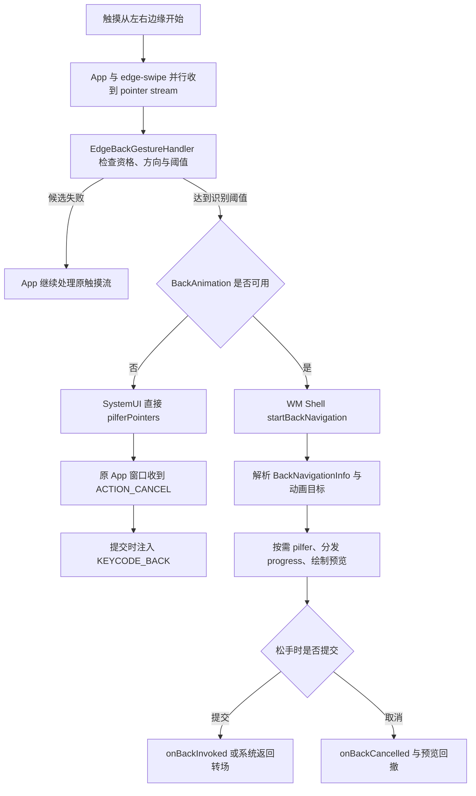
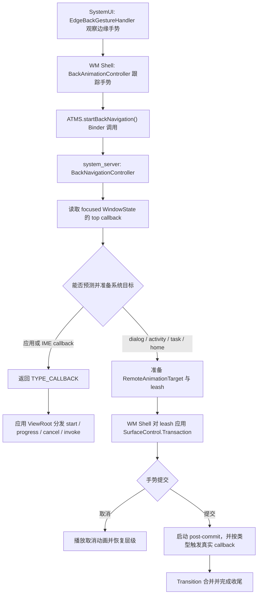
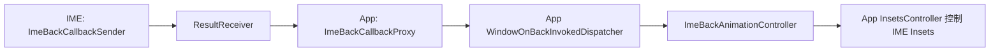

# 系统手势导航与 Predictive Back

系统手势先经过边缘区域和导航策略识别，再转成窗口或应用回调。Predictive Back 把返回提交拆成开始、进度、取消和完成，使系统动画能与应用状态变化同步。

## 系统手势识别与窗口路由

### 为什么要了解手势导航

在 Perfetto 里看到应用的触摸事件流以 `ACTION_CANCEL` 结束，或者从某个时刻开始不再有后续 `MOVE`，原因未必在应用。左右边缘返回手势开始时，SystemUI（系统界面进程）的手势监视通道（gesture monitor）与应用可以同时收到同一条指针事件流（pointer stream）；系统确认这是返回手势后，再通过 `pilferPointers()` 抢占后续指针，把事件交给手势处理方，并取消原窗口的触摸目标。下文把这个动作简称为“指针抢占”。

Android 10（API 29）引入全手势导航：从左右边缘向内滑动表示返回，底部上滑和横向滑动分别负责回到主屏（Home）、进入最近任务或快速切换。系统不会在 `ACTION_DOWN` 到达前无条件挡住应用；边缘返回采用“并行观察、达到条件后接管”的方式。这个时序是分析手势冲突和输入延迟的基础。

Android 13（API 33）开始提供预测性返回（Predictive Back）API。Android 15 将返回主屏（back-to-home）、跨任务（cross-task）和跨 Activity（cross-activity）三类系统动画移出开发者选项；Android 16 又把它们设为 `targetSdkVersion >= 36` 应用的默认行为。返回处理由此增加预提交阶段：系统在手指移动时解析返回目标、生成进度并准备预览，松手后才提交或取消。

以下分析以 `android-17.0.0_r1` 为源码基线，依次说明 SystemUI 如何观察并接管边缘触摸、应用如何声明有限的系统手势排除区域、预测性返回如何分发进度与提交事件，以及 Perfetto 能确认哪些证据、哪些现场信息仍需由其他工具补充。

### Android 10+ 手势导航的系统实现

#### Android 17 的组件分工

Android 17 的入口仍是 SystemUI 中的 `EdgeBackGestureHandler`，但职责已经拆开：

- `EdgeBackGestureHandler` 维护导航模式、主屏排除区域、边缘宽度、方向与阈值状态，并把事件送往反馈插件和 WM Shell。WM Shell 是窗口管理组件中承载系统级任务动画和窗口转场的部分。
- `DisplayBackGestureHandlerImpl` 为每块显示屏持有输入监视器、`InputEventReceiver`、排除区域监听器和一个 `BackPanelController`。
- `InputMonitorCompat("edge-swipe", displayId)` 调用 `InputManagerGlobal.monitorGestureInput()`，取得手势监视器使用的 `InputChannel`。
- `BackPanelController` 和 `BackPanel.kt` 负责边缘箭头和面板动画；它们使用不可触摸的 `TYPE_NAVIGATION_BAR_PANEL` 受信任叠加层（trusted overlay），不靠这个窗口接收触摸。
- `BackAnimationController` 位于 WM Shell，负责 `startBackNavigation()`、目标解析、指针抢占、进度回调以及提交后的系统动画。

`updateIsEnabledInner()` 会注册主屏的 `ISystemGestureExclusionListener`，然后遍历当前显示屏创建 `DisplayBackGestureHandlerImpl`。Android 17 仍把边缘返回识别限定在主显示屏：`isWithinTouchRegion()` 对 `ev.getDisplayId() != mMainDisplayId` 返回 `false`，源码旁保留了 `TODO(b/382130680)`，因此不能把外接显示屏上的监视器生命周期当作返回手势可用性的证据。旧版的 `InputMonitorResource`、`resetEdgeBackPlugin()` 和 `NavigationBarEdgePanel` 不属于 Android 17 的主路径。

#### 从并行观察到指针抢占

`InputMonitorCompat` 建立监视通道，`DisplayBackGestureHandlerImpl` 再用指定的 `Looper` 和 `Choreographer` 创建 `InputEventReceiver`。它们只提供事件入口；是否允许返回、何时接管，由上层状态机决定。

Android 17 的触摸判定按以下顺序进行：

1. `ACTION_DOWN` 到来时，检查导航模式、SystemUI 状态、底部手势区、画中画（PiP）和桌面模式排除区、应用排除区、左右边缘宽度及设备类型。
2. 资格成立后，事件才会送入 `BackPanelController`；如果启用了提前返回分发（ahead-of-time back dispatch），还会送入 WM Shell 的 `BackAnimation.onBackMotion()`。这里的“提前”是指在松手提交前就开始解析返回目标并产生手势进度。
3. 阈值之前，以下任一情况都会取消候选返回手势：纵向位移先超过 `mTouchSlop`、停留超时或出现第二根触点。
4. 横向位移大于纵向位移并超过 `mTouchSlop` 后，`mThresholdCrossed` 变为 `true`。
5. 旧式分支此时由 `EdgeBackGestureHandler` 直接调用 `pilferPointers()`；提前分发分支调用 `BackAnimation.onThresholdCrossed()`，由 `BackAnimationController` 根据描述返回目标和动画能力的 `BackNavigationInfo`、系统动画及应用进度生成方式决定何时抢占指针。

`pilferPointers()` 最终进入 `InputDispatcher`（输入分发器）。原目标窗口会收到由分发器合成的 `ACTION_CANCEL`，手势监视器则继续接收后续事件。因而“监视器收到事件副本”并不表示“应用始终能收到完整手势”。

#### 旧式与提前分发两条提交路径

下面这张图保留了性能分析需要的分叉点：



左侧旧式（legacy）分支在 Android 17 源码中仍是明确的回退路径，不能简单视为“只存在于 Android 10–12”。当 `mBackAnimation == null` 时，越过阈值后由 SystemUI 抢占指针，`BackPanelController` 判断提交后，`triggerBack()` 注入 `KEYCODE_BACK` 的按下和抬起事件。

右侧提前分发分支中，`ACTION_DOWN` 和 `MOVE` 经 `dispatchToBackAnimation()` 切到 Shell 执行器。`BackAnimationController` 调用 `IActivityTaskManager.startBackNavigation()` 获取 `BackNavigationInfo`，再决定使用系统动画控制器还是应用回调。`setTriggerBack(true)` 只是记录“松手后提交”的状态；收到 `ACTION_UP` 后，Shell 才执行 `onBackInvoked()` 或启动提交后动画。取消路径则执行 `onBackCancelled()`。如果没有取得 `BackNavigationInfo`，源码仍保留注入返回键的兜底。

预测性返回也可能抢占指针。Android 17 把接管时机交给 `BackAnimationController.tryPilferPointers()`：使用系统动画控制器、应用无法生成进度、焦点变化或导航信息为空等条件，都可能触发抢占。排查性能跟踪时，不能只凭 `ACTION_CANCEL` 区分旧式返回与预测性返回，还要结合 Shell 返回动画和回调轨道。

### 手势冲突处理：系统手势优先区域与应用的 WindowInsets

系统手势和应用手势的冲突主要集中在左右返回边缘，以及底部主屏和快速切换区域。`View.setSystemGestureExclusionRects()` 用于有限地声明应用需要优先处理的区域，但不能覆盖强制系统手势区域（mandatory system gesture）。

#### 系统手势排除区域

当应用在边缘放置抽屉、滑块或画布手势时，可以通过 `View.setSystemGestureExclusionRects()` 上报局部矩形。坐标以该 View 布局后的局部坐标为准，View 移动或尺寸变化后需要重新计算。

下面的示例只排除抽屉把手实际占用的左侧区域：

```kotlin
override fun onLayout(changed: Boolean, l: Int, t: Int, r: Int, b: Int) {
    super.onLayout(changed, l, t, r, b)
    val exclusionRect = Rect(0, drawerHandleTop, drawerHandleWidth, drawerHandleBottom)
    setSystemGestureExclusionRects(listOf(exclusionRect))
}
```

`ViewRootImpl` 的 `ViewRootRectTracker` 收集各 `View` 的矩形，转换到窗口坐标后通过 `WindowSession.reportSystemGestureExclusionChanged()` 上报。WindowManagerService（WMS，窗口管理服务）的 `DisplayContent.calculateSystemGestureExclusion()` 按窗口 Z 序、可触摸区域和显示坐标汇总，再通过 `ISystemGestureExclusionListener` 把限制后的 `Region` 通知 SystemUI。上报成功只说明 WMS 收到了请求，生效范围还要经过可触摸区域相交和配额计算。

#### 系统手势区域限制

`mSystemGestureExclusionLimit` 限制左右边缘各自可排除的**纵向总高度**，不限制矩形的横向宽度。Android 17 的 `WindowManagerConstants` 保证该值至少为 200 dp；设备可以通过 `system_gesture_exclusion_limit_dp` 配置更大的值。`addToGlobalAndConsumeLimit()` 对边缘相交区域逐个消耗高度预算，超出部分会被裁掉。

WMS 同时保留受限区域（restricted `Region`）与原始未受限区域（unrestricted `Region`）。SystemUI 用受限区域决定系统是否让开；触点只命中未受限区域时，表示应用申请过排除，但该片段没有获得配额，系统仍可识别返回，并把它记为被拒绝的排除请求（rejected exclusion）。遇到“同一条边有些位置有效、有些位置仍触发返回”时，应检查纵向预算、窗口遮挡与最终获批区域。

部分系统窗口和特定的粘性沉浸模式（sticky immersive，即系统栏短暂出现后会自动再次隐藏）场景可以绕过普通限制，这是平台权限和窗口策略，不代表第三方应用可以无限排除屏幕边缘。

#### WindowInsets 与手势区域

Android 把常规系统手势区域和强制系统手势区域分成两层：

- `WindowInsets.Type.systemGestures()` 描述系统手势具有优先级的区域，通常包含左右返回边缘和底部手势区。应用可以在非强制部分申请有限排除。
- `WindowInsets.Type.mandatorySystemGestures()` 是其中不能由 `setSystemGestureExclusionRects()` 覆盖的子集。旧方法 `getMandatorySystemGestureInsets()` 自 API 30 起由 `getInsets(Type.mandatorySystemGestures())` 取代。

底部主屏和快速切换手势不能像侧边返回一样申请退出。游戏确有全屏交互需求时，可以在交互期间进入沉浸模式（immersive mode）；用户仍能通过系统规定的边缘操作重新显示系统栏。普通页面更适合把滑动控件避开 `systemGestures()`，排除区域只留给无法移动的关键交互。

### 从返回手势到预测性返回动画

#### 传统返回手势的问题

早期返回手势在松手前主要显示边缘箭头，用户看不到返回目标。系统通常到提交点才触发返回，应用也容易把返回处理集中在 `onBackPressed()` 或 `KEYCODE_BACK`。

预测性返回增加了预提交阶段。WM Shell 在手势中调用 `startBackNavigation()` 获得目标类型与回调，根据进度驱动当前窗口、目标窗口或应用自定义动画。应用必须把“跟随手势的视觉更新”和“提交后改变导航状态”分开。

#### 预测性返回的回调模型

回调接口分为平台 API 和 AndroidX 兼容层：

| 层级 | 接口 | 引入版本 | 可直接确认的方法 | 作用 |
| --- | --- | --- | --- | --- |
| 平台提交回调 | `OnBackInvokedCallback` | API 33 | `onBackInvoked()` | 返回提交后收到通知，没有进度方法。 |
| 平台进度回调 | `OnBackAnimationCallback` | API 34 | `onBackStarted()`、`onBackProgressed()`、`onBackCancelled()`、`onBackInvoked()` | 可接收开始、进度、取消和提交事件。 |
| AndroidX 兼容层 | `OnBackPressedCallback` | `androidx.activity:activity` 1.0.0；进度方法在 1.8.0 增加 | `handleOnBackPressed()`；`handleOnBackStarted()`、`handleOnBackProgressed()`、`handleOnBackCancelled()` | 提供向下兼容入口。只有框架 API 34+ 才会由系统驱动后三个进度相关方法。 |

平台回调通过 `OnBackInvokedDispatcher` 注册，AndroidX 回调通过 `OnBackPressedDispatcher` 管理。`OnBackInvokedCallback` 只有提交通知；需要开始、进度和取消事件时，应使用 `OnBackAnimationCallback`，或交给 AndroidX、Navigation、Compose 的对应 API。

`android:enableOnBackInvokedCallback` 的语义还受目标 SDK 版本影响。Android 15 及更早版本用它选择是否加入提前分发模型；Android 16 起，运行在 Android 16+ 且目标版本为 36+ 的应用默认启用，仍可暂时设为 `false` 退出。该属性不等同于 AndroidX `OnBackPressedCallback.enabled`，也不能替代回调生命周期管理。

#### 版本演进的时间线

| Android 版本 | API | 系统动画状态 | 清单与 Activity 条件 | `targetSdkVersion` 与兼容边界 | 回调与预览范围 |
| --- | --- | --- | --- | --- | --- |
| Android 13 | 33 | 通过开发者选项测试预测性返回动画。 | 应用或 Activity 通过 `android:enableOnBackInvokedCallback` 显式加入。 | `OnBackInvokedCallback` 从 API 33 可用。 | 返回主屏是主要测试入口；提交回调没有进度信息。 |
| Android 14 | 34 | 系统动画测试仍依赖开发者选项。 | 延续显式加入模型。 | `OnBackAnimationCallback` 从 API 34 可用；AndroidX 1.8.0 可转发进度。 | 应用能收到开始、进度和取消事件。 |
| Android 15 | 35 | 开发者选项移除；已加入的应用或 Activity 可以显示返回主屏、跨任务和跨 Activity 动画。 | 仍需迁移到受支持的返回 API；根 Activity 的消费型回调会阻止返回主屏预览。 | 目标 SDK 版本不是唯一条件。 | 系统预览范围扩展到三类系统转场。 |
| Android 16 | 36 | 在 Android 16+ 设备上，目标版本为 36+ 的应用默认启用三类系统动画。 | 可暂时用 `android:enableOnBackInvokedCallback="false"` 退出。 | 目标版本为 36+ 时，旧 `onBackPressed()` 不再调用，`KEYCODE_BACK` 不再分发给应用；三键导航也可接入预测性返回。 | 新增 `PRIORITY_SYSTEM_NAVIGATION_OBSERVER`；API 36 只允许注册一个观察者回调。 |
| Android 17 | 37 | 延续目标版本为 36+ 时的默认模型与三类系统动画。 | 退出开关仍应只作迁移缓冲，业务返回使用 AndroidX 或平台返回 API。 | `PRIORITY_SYSTEM_NAVIGATION_OBSERVER` 已是没有 `@FlaggedApi` 标记的公共常量。 | 观察者回调数量不再受 API 36 的单实例限制，多个回调的调用顺序未定义。 |

API 37 的观察者优先级值为 `-2`。虽然普通注册参数声明了非负范围，`WindowOnBackInvokedDispatcher.Checker` 对这个常量有专门放行。观察者只在系统将执行默认导航时收到通知，不消费返回事件，适合记录日志和统计；业务不能依赖多个观察者的调用顺序。

#### 预测性返回对性能的影响

1. 进度回调每帧都可能执行。优先更新 `translationX`、`alpha`、缩放比例或已准备好的动画状态，避免在 `onBackProgressed()` 中做 I/O、Binder 同步调用、复杂布局或创建大量对象。
2. 跨 Activity、跨任务和返回主屏会同时涉及当前层、目标层和 Shell 动画。掉帧时要检查当前应用、目标 Activity 或 Launcher、WM Shell、SurfaceFlinger，不能只看当前 Activity 的 RenderThread。
3. 只在提交时改变导航状态。若在进度阶段就执行 `popBackStack()` 或 `finish()`，取消手势时很难恢复一致状态。
4. 观察者回调适合记录轻量日志。它不消费返回事件，但仍运行在应用回调环境中，耗时工作应异步化。

### 边缘滑动检测的性能敏感点

#### 先找对 SystemUI 线程

`DisplayBackGestureHandlerImpl` 和 `EdgeBackGestureHandler` 使用带 `@BackPanelUiThread` 的 `UiThreadContext`。Android 17 的 `SysUIConcurrencyModule` 会根据 `Flags.edgeBackGestureHandlerThread()` 把它映射到独立的 `BackPanelUiThread`（采用 `THREAD_PRIORITY_DISPLAY` 对应的显示相关线程优先级）或 SystemUI 主线程。因此，不能笼统写成“所有判定都在 SystemUI 主线程”。

性能跟踪中应先根据线程名和 `InputConsumer processing on...` 等接收器轨迹区段确认事件落在哪条线程，再检查该线程在 `ACTION_DOWN` 到阈值越过之间是否被长任务、锁等待或 Binder 调用占用。`EdgeBackGestureHandler` 没有为每个事件提供稳定的同名区段，必要时应在可控构建中增加自定义跟踪点。阈值前还有排除区、SystemUI 状态标志、PiP、桌面模式角区、手势阻塞 Activity 和可选的机器学习（ML）分类等判断；这些路径都不适合加入同步 I/O。

#### 长按超时的影响

Android 17 的 `mLongPressTimeout` 是 `min(gestures.back_timeout, ViewConfiguration long-press timeout)`。`gestures.back_timeout` 的 AOSP 默认值为 250 ms，不能沿用“通常 400–500 ms”的旧口径。只有在阈值尚未越过时，某个 `ACTION_MOVE` 的 `eventTime - downTime` 超过该值，候选返回才会取消。设备厂商可以通过系统属性改变上限，现场应以 `dumpsys` 与设备配置为准。

#### 多指触控的取消

`ACTION_POINTER_DOWN` 只在 `mThresholdCrossed == false` 且输入不是三指触控板返回时取消候选手势。阈值已经越过后，这个分支不再执行。复现“第二根手指取消返回”时，必须记录第二指落下与阈值越过的先后顺序。

#### 方向、阈值与 ML 分类

Android 17 用 `scaledTouchSlop * back_gesture_slop_multiplier` 作为方向识别阈值，`back_gesture_slop_multiplier` 的 AOSP 默认值为 `0.75f`。阈值前若 `dy > dx` 且 `dy > mTouchSlop`，手势按纵向移动取消；若 `dx > dy` 且 `dx > mTouchSlop`，才进入返回阶段。

边缘命中还可以启用 `BackGestureTfClassifierProvider`。模型只在配置和 DeviceConfig 共同允许时加载，推理特征包括屏宽、距边缘距离、左右侧、前台包词表索引和纵向坐标（y）。分析边缘“同一点偶发不响应”时，应同时记录灵敏度、内边距、排除区、前台包与 ML 开关，不能只比较手指位移。

#### 动画渲染的开销

Android 17 的边缘反馈由 `BackPanelController` 和 `BackPanel.kt` 绘制，窗口类型是 `TYPE_NAVIGATION_BAR_PANEL`。它与 WM Shell 的目标预览属于两层动画：前者是手指旁的返回提示，后者是当前任务与返回目标的窗口转场。只看到边缘箭头流畅，不能证明预测性返回的目标预览也流畅。

### 在 Perfetto 中的表现

Perfetto 能回答事件何时被读入、发给哪些窗口、由哪条线程处理，以及哪些帧错过了截止时间。它不能仅凭一类通用 atrace 轨迹证明手势排除矩形最终覆盖的几何范围；这部分还要结合 `dumpsys window` 或 Winscope 状态。

#### 最小抓取配置

在量产版 `user` 构建上，可用官方快速入门文档支持的 atrace 类别抓取线程调度、输入、窗口和图形基线：

```bash
adb shell perfetto -o /data/misc/perfetto-traces/back-gesture.perfetto-trace -t 15s \
  sched freq idle am wm gfx view binder_driver input
adb pull /data/misc/perfetto-traces/back-gesture.perfetto-trace
```

这套简写适合确认线程是否繁忙和动画是否掉帧，但不会自动给出完整的指针分发明细。

在 `userdebug` 或 `eng` 设备上，需要逐事件确认应用与 `edge-swipe` 监视器的分发关系时，可使用 Android 17 的结构化输入数据源，并同时开启 FrameTimeline：

```protobuf
buffers {
  size_kb: 32768
  fill_policy: RING_BUFFER
}
duration_ms: 15000

data_sources {
  config {
    name: "linux.ftrace"
    ftrace_config {
      ftrace_events: "sched/sched_switch"
      ftrace_events: "sched/sched_waking"
      atrace_categories: "input"
      atrace_categories: "wm"
      atrace_categories: "gfx"
      atrace_categories: "view"
      atrace_apps: "com.android.systemui"
      atrace_apps: "your.package.name"
    }
  }
}
data_sources {
  config {
    name: "android.surfaceflinger.frametimeline"
  }
}
data_sources {
  config {
    name: "android.input.inputevent"
    android_input_event_config {
      mode: TRACE_MODE_TRACE_ALL
    }
  }
}
```

把配置保存为 `back-gesture.pbtxt` 后，通过 `adb shell perfetto --txt -c - -o ... < back-gesture.pbtxt` 录制。`TRACE_MODE_TRACE_ALL` 会绕过调试构建上的隐私裁剪，记录完整坐标和按键内容，只能用于本地受控复现，不能用于现场或用户数据采集。需要外场规则时，应改用 `TRACE_MODE_USE_RULES` 并配置脱敏级别。

Perfetto 的查询引擎 Trace Processor 在 `android.input` 模块中提供 `android_motion_events` 和 `android_input_event_dispatch` 视图，可以用同一个 `event_id` 关联 MotionEvent 与窗口分发目标。`InputMonitorCompat` 自身还会写入 `InputMonitorCompat-edge-swipe-dispN created/receiver created/disposed` 瞬时事件；这些是监视器生命周期证据，不代表每次手势都一定出现同名的持续区段。

#### 1. 旧式返回手势：检查取消事件和按键注入链

1. 用结构化输入事件的 `event_id` 确认初始触摸同时分发到前台窗口和手势监视器。
2. 在阈值附近寻找原窗口的 `ACTION_CANCEL`，并检查 SystemUI 对应线程是否正在处理该手势。
3. 提交后查找注入的 `KEYCODE_BACK` 及其后续窗口分发。
4. 若原窗口收到完整指针事件流且没有 `ACTION_CANCEL`，再检查这次是否未命中边缘、排除请求是否被拒绝，或是否没有达到方向阈值。

#### 2. 预测性返回：检查进度回调和目标层预览

1. 先找 `ACTION_DOWN`、`MOVE` 到 Shell `startBackNavigation()` 的时序，再确认阈值越过。
2. 通过 FrameTimeline 和 SurfaceFlinger 轨迹区分当前 Activity、目标 Activity 或 Launcher。不同返回类型不保证出现相同数量的 Surface。
3. 应用自定义进度回调没有系统统一的轨迹区段名。应给 `onBackStarted()`、`onBackProgressed()`、`onBackCancelled()` 加应用自己的 `Trace.beginSection()`，再与 Shell 和帧时间线对齐。
4. `ACTION_CANCEL` 不能单独证明走了旧式路径，因为 Shell 也可能抢占指针。
5. 提交后通常走 `onBackInvoked()` 和系统转场；只有导航信息为空等兜底条件才可能再次看到注入的返回键。

#### 3. 排除区冲突：Perfetto 只负责时序，命中边界还要回到 WindowInsets 和 dumpsys

排除区问题要把三类证据放在同一次复现中：

- 应用记录的矩形与 `WindowInsets.Type.systemGestures()`、`mandatorySystemGestures()`；
- 应用日志中的请求矩形、`dumpsys window` 的 `mSystemGestureExclusion` 最终显示区域，以及 SystemUI 转储中的受限与未受限区域；
- Perfetto 中该指针事件流是否被抢占，以及 SystemUI 判定线程是否及时运行。

只看应用传给 `setSystemGestureExclusionRects()` 的列表，无法证明 WMS 批准了同样大小的区域；只看 Perfetto，也无法还原所有矩形的布局坐标。两组证据需要互相校验。

### 与其他章节的关系

- **3.1 Input 事件分发全流程**：这里的手势监视器、监视窗口（spy window）、指针抢占和取消事件，都建立在 InputDispatcher 的窗口目标模型上。
- **3.2 触摸响应的性能分析**：结构化输入事件可把 `InputReader` 读取、`InputDispatcher` 分发、窗口投递与应用消费时刻放在同一条链上。
- **2.3 VSync 机制**、**2.3 Choreographer 与渲染流水线**：边缘反馈和预测性预览都受帧节拍约束，FrameTimeline 用来确认帧是否错过截止时间。
- **1.1 线程模型**：Android 17 的边缘判定线程可能是 `BackPanelUiThread`，也可能回退到 SystemUI 主线程；WM Shell 和应用回调还有各自的执行上下文。


## Predictive Back 生命周期与动画同步

普通手势识别给出最终动作，预测式返回还要连续传递进度并允许取消。应用导航栈和系统窗口动画必须遵守同一提交边界。

预测性返回（Predictive Back）把返回操作分成“手势预览”和“提交导航”两个阶段。手指移动时，系统或应用只更新可撤销的视觉状态；手势提交后，返回回调才执行 `finish()`、弹出返回栈（pop back stack）、隐藏输入法（IME）等动作。

这个模型让系统可以提前知道返回目的地，但也引入了三套容易混淆的路径：

- 应用回调处理页面内部返回；
- WM Shell 在系统目标可预测且产品提供对应动画执行器时，对关闭对话框（dialog）、跨 Activity（cross-activity）、跨任务（cross-task）和返回主屏（back-to-home）执行系统动画；
- 条件不足时回退到应用回调，极端情况下再回退到 `KEYCODE_BACK`。

源码基线为 Android 17、API 37、`android-17.0.0_r1`。SystemUI、WM Shell、`system_server`、应用和 SurfaceFlinger 各自承担不同职责。应用侧接入方法见 22.11，边缘手势识别见本节前文。

### 1. 先建立正确的阶段模型

#### 1.1 预提交与提交后

`OnBackAnimationCallback` 的四个回调对应两类工作：

| 回调 | 所属阶段 | 合适的工作 |
|---|---|---|
| `onBackStarted()` | 预提交 | 保存起始状态，准备轻量动画对象 |
| `onBackProgressed()` | 预提交 | 根据手势进度更新可撤销的属性 |
| `onBackCancelled()` | 取消 | 把视觉状态恢复到起点 |
| `onBackInvoked()` | 已提交 | 执行导航、关闭容器或提交业务状态 |

在 `onBackProgressed()` 中结束 Activity、弹出 Fragment 或写数据库，会破坏取消语义。系统动画同样遵守这一边界：手势阶段只变换 SurfaceControl 动画控制柄（leash），提交后才调用真实回调，并把预览接入正式的窗口转场（Transition）。leash 让动画执行者变换窗口图层，但不会把窗口 Surface 本身的所有权交出去。

#### 1.2 返回目的地与动画执行者

`BackNavigationInfo` 是 `system_server` 返回给 WM Shell 的返回目标与动画能力描述。Android 17 定义以下主要类型：

| 类型 | 含义 | 常见动画执行者 |
|---|---|---|
| `TYPE_CALLBACK` | 应用或输入法回调接管 | 应用进程的回调 |
| `TYPE_DIALOG_CLOSE` | 关闭当前 Activity 上方的窗口 | 取决于产品是否注册动画执行器（runner） |
| `TYPE_CROSS_ACTIVITY` | 返回同一 Task 中的前一个 Activity | WM Shell |
| `TYPE_CROSS_TASK` | 返回前一个 Task | WM Shell |
| `TYPE_RETURN_TO_HOME` | 返回主屏 | Launcher 或产品注册的动画执行器 |
| `TYPE_IN_TRANSITION` | 当前已有窗口转场，暂不能准备 | 等转场空闲后重试 |
| `TYPE_TASK_ROOT_INTERCEPTION` | 根任务（Root Task）拦截返回 | 按系统覆盖规则处理 |

“谁处理进度”由这个类型和 `isPrepareRemoteAnimation()` 共同决定。应用回调获胜时，系统不会同时运行跨 Activity 系统动画；系统转场获胜时，逐帧 Surface 变换主要发生在 WM Shell。

### 2. Android 17 的端到端架构

下面的流程图标出 SystemUI、WM Shell、`system_server` 和应用之间的决策与动画边界。下文把 WindowManagerService 简称为 WMS，把 ActivityTaskManagerService 简称为 ATMS，把 InputMethodManagerService 简称为 IMMS。



图中的 `RemoteAnimationTarget` 是交给 Shell 的窗口图层描述，包含几何信息和用于变换图层的 leash。其中两个类负责核心协调职责：

- `BackNavigationController` 位于 `system_server`，负责确定焦点窗口、最高优先级回调、返回目标和可动画性，并准备窗口容器（WindowContainer）与 Transition 侧资源；
- `BackAnimationController` 位于 WM Shell，负责手势状态、指针抢占、远程动画就绪状态、进度分发以及提交后的收尾。

Android 17 的 WMS 中没有 `TaskAnimationCoordinator`。这个类不能用于解释跨 Activity、跨任务或任务快照路径。

### 3. 输入事件怎样到达返回动画

#### 3.1 分流不发生在 InputDispatcher 的业务判断中

`EdgeBackGestureHandler` 通过系统输入监视通道观察边缘指针事件流，判断手势是否满足起点、方向、排除区域和阈值条件。InputDispatcher 提供事件路由与输入监视能力，但它不负责决定“这是旧式返回还是预测性返回进度”。

当 SystemUI 已连接 WM Shell 的 `BackAnimation`：

1. `ACTION_DOWN`、`ACTION_MOVE`、`ACTION_UP` 或 `ACTION_CANCEL` 被转给 `BackAnimationController.onBackMotion()`；
2. Shell 在第一次 `ACTION_MOVE` 时启动返回导航，让按下指针导致的焦点变化有机会先完成；
3. 手势越过阈值后，Shell 按配置调用 `pilferPointers()`，从原接收者接管后续指针；
4. 松手时根据 `triggerBack` 进入提交或取消。

`EdgeBackGestureHandler.mBackAnimation` 是否为空反映 SystemUI 与 WM Shell 的功能连接状态，不等同于当前应用是否在清单中显式加入。应用是否启用新返回模型，主要体现在窗口有没有注册可供 WMS 使用的回调。

#### 3.2 仍然存在 KEYCODE_BACK 回退

Android 17 的提前返回分发（ahead-of-time）路径也保留异常回退。例如，`startBackNavigation()` 因找不到有效焦点窗口、当前状态无法建立 `BackNavigationInfo`，或系统正在处理不兼容状态而返回 `null`，Shell 可在手势提交后异步注入 `KEYCODE_BACK`。

这是兜底分支。对目标 SDK 36 及以上且未显式退出新模型的应用，常规路径通过回调分发；官方行为边界明确指出 `Activity.onBackPressed()` 与返回 `KEYCODE_BACK` 不再作为正常分发入口。

### 4. 窗口回调如何进入 WMS

#### 4.1 每个窗口只向 WMS 暴露最高优先级回调

`WindowOnBackInvokedDispatcher` 在应用进程维护回调集合。最高优先级回调改变时，它把 `OnBackInvokedCallbackInfo` 经 `IWindowSession.setOnBackInvokedCallbackInfo()` 写入对应 `WindowState`。这个对象包含：

- 回调的 Binder 接口；
- 优先级；
- 是否实现 `OnBackAnimationCallback`；
- 是否请求系统覆盖行为。

WMS 无需遍历应用的全部回调，只读取当前窗口已经选出的最高优先级回调。

#### 4.2 优先级与同级顺序

Android 17 的关键优先级是：

| 常量 | 值 | 用途 |
|---|---:|---|
| `PRIORITY_OVERLAY` | `1_000_000` | 菜单、抽屉等应先关闭的覆盖层 |
| `PRIORITY_DEFAULT` | `0` | 普通应用回调 |
| `PRIORITY_SYSTEM` | `-1` | 框架内部默认导航回调 |
| `PRIORITY_SYSTEM_NAVIGATION_OBSERVER` | `-2` | 只观察系统导航，不消费 |

高优先级先执行；同一优先级按注册顺序逆序选择。应用不能注册普通负优先级回调，`PRIORITY_SYSTEM_NAVIGATION_OBSERVER` 是允许的特殊观察者。API 36 对观察者数量有限制，API 37 起可注册多个；它们不会改变系统返回结果。

`Activity` 在新模型启用时会以 `PRIORITY_SYSTEM` 注册默认回调。应用注册 `PRIORITY_DEFAULT` 或 `PRIORITY_OVERLAY` 回调后，它会成为最高优先级回调，`BackNavigationController` 将本次导航归类为 `TYPE_CALLBACK`。

#### 4.3 Android 17 在应用进程生成进度

Android 17 还提供一条减少逐帧跨进程调用的优化路径。满足以下条件时，`BackNavigationInfo.isAppProgressGenerationAllowed()` 可为 `true`：

- 当前回调实现了动画回调接口；
- 窗口允许应用在本进程生成进度；
- 手势可触摸区域与窗口区域匹配；
- 没有需要转交手势的嵌入窗口。

此时应用 `ViewRootImpl` 根据本地 `MotionEvent` 更新 `BackTouchTracker` 与 `BackProgressAnimator`，Shell 跳过对应的 Binder 进度分发。条件不满足时，Shell 仍通过 `IOnBackInvokedCallback.onBackProgressed()` 发送进度。

因此，看到应用回调每帧运行，不能直接推断每帧都经过 SystemUI → `system_server` → 应用的完整进程间通信（IPC）。

### 5. system_server 如何预测返回目标

`BackNavigationController.startBackNavigation()` 在 WMS 全局锁下完成一轮快照式判断：

1. 找到目标显示屏的焦点窗口；必要时退到焦点任务的窗口；
2. 要求窗口已有有效绘制 Surface；
3. 检查当前是否处于不允许插入预测返回的窗口转场；
4. 读取窗口的 `OnBackInvokedCallbackInfo`；
5. 若应用回调获胜，直接返回 `TYPE_CALLBACK`；
6. 若框架系统回调获胜，再计算对话框、前一 Activity、前一 Task 或主屏；
7. 确认 Shell 声明支持该类型后，准备远程动画。

#### 5.1 系统宁可回退，也不盲目展示错误目标

以下情况会让系统放弃某类预览，改走回调：

- 前一个 Activity 没有进程或窗口；
- Activity 尚未创建，无法安全作为跨 Activity 目标；
- 参与者包含不适合该路径的透明 Activity；
- 锁屏（keyguard）、应用锁定、任务锁定或浮动任务条件不满足；
- 当前 Activity 使用场景转场（scene transition）；
- 多窗口模式下前后 Task 不在兼容的父层级。

这也解释了一个重要性能边界：跨 Activity 和跨任务预测动画通常要求目标已经有进程和窗口。系统不会为了预览强行冷启动一个已死亡的目标进程。此时用户看到普通回调或窗口转场，属于安全回退，不应先归因于“任务快照丢失”。

#### 5.2 预览阶段不会提前完成返回生命周期

对于可动画目标，WMS 核心可以创建 `TRANSIT_PREPARE_BACK_NAVIGATION`，收集打开与关闭两侧的 WindowContainer，并把前一 Activity 设置为后置启动（launch-behind，即先在当前页面后方准备目标窗口），或准备启动占位图层（starting surface）。手势取消时这些临时状态需要恢复；手势提交后才由真实回调和正式窗口转场完成导航。

不要假设 `onPause()` 一定发生在首个进度回调前，也不要把输入焦点切换固定在 `onPause()` 与目标 `onResume()` 之间。实际顺序受返回类型、目标可见状态、窗口转场合并和窗口绘制情况影响。应用只能依赖公开生命周期契约。

### 6. WM Shell 如何执行系统动画

#### 6.1 动画注册表与 `RemoteAnimationTarget`

`ShellBackAnimationRegistry` 按 `BackNavigationInfo` 类型保存动画执行器。AOSP Android 17 的默认依赖注入（Dagger）模块装配跨 Activity、跨任务和定制跨 Activity 动画执行器；返回主屏动画可由 Launcher 在运行时注册，关闭对话框的槽位默认为 `null`。`BackNavigationInfo` 有某个类型，只说明 WMS 核心能表达该目的地；`BackAnimationAdapter.isAnimatable(type)` 还要确认当前产品已经提供动画执行器。

WMS 核心准备完成后，会把描述打开和关闭窗口图层的 `RemoteAnimationTarget` 及其 leash 交给 Shell。手势阶段的典型每帧工作是：

- 把触摸位移映射为手势进度；
- 计算打开和关闭图层的边界、缩放、位移、裁剪、圆角半径与透明度；
- 在同一个 `SurfaceControl.Transaction` 中写入目标 leash；
- 用当前 `Choreographer` 的 VSync ID 标记事务；
- 提交给 SurfaceFlinger 合成。

这一阶段无需让目标 Activity 每帧重新测量和布局。目标页面自身若仍在绘制，其缓冲区更新与 Shell 对 leash 的图层变换属于两条不同工作流。

#### 6.2 提交后的顺序

手势松开后有三种主要结果：

- 取消：当前动画执行器收到 `onBackCancelled()`，播放回弹并恢复目标；
- 回调路径：Shell 直接调用应用回调的取消或提交方法；
- 系统动画路径：Shell 启动提交后动画；跨 Activity、跨任务和返回主屏会在这一阶段开始时触发真实回调，让关闭转场与动画衔接，其他类型可在动画结束时再触发。

`BackAnimationController` 会在触发真实回调前同步通知 WMS 核心当前动画结果，避免关闭转场再播放一套重复动画。动画执行器完成或看门狗超时后，Shell 释放动画目标、结束本次导航，并由 `BackTransitionHandler` 完成后续转场协调。看门狗（watchdog）是防止动画执行器一直不回调的超时保护。

源码中的 2 秒 `MAX_ANIMATION_DURATION` 是等待远程动画完成的看门狗阈值。它处理动画执行器未回调或动画迟到等异常，不能当作产品动画时长或性能目标。

### 7. 任务快照在预测返回中的准确角色

Android 17 可以在以下组合条件下为打开侧目标创建无窗口启动占位图层（windowless starting surface）：

- TaskOrganizer 支持无窗口启动占位图层；
- `config_predictShowStartingSurface` 开启；
- 当前策略没有直接采用 `launch-behind`；
- 存在与目标屏幕方向、夜间模式和组件兼容的 Task 或 Activity 快照。

任务快照用于在打开侧窗口尚未绘制时提供临时内容。Android 17 没有“实时窗口图层掉帧后动态切换快照”的通用降级，也不通过 `TaskAnimationCoordinator` 每帧选择预览层。系统会在动画开始前决定目标与预览策略。

任务快照的尺寸、格式、是否包含输入法 Surface、是否采用降采样以及缓存寿命都受实现和设备配置影响。仅用屏幕分辨率乘四估算全部快照内存，会忽略实际缓冲区、缓存策略和安全窗口限制。需要内存结论时，应在目标设备读取图形内存和 TaskSnapshot 现场数据。

### 8. 应用回调路径的性能

应用回调获胜时，`WindowOnBackInvokedDispatcher.OnBackInvokedCallbackWrapper` 会把 Binder 回调投递到创建 `ViewRootImpl` 的 Handler，通常也就是应用主线程。`BackProgressAnimator` 对进度做平滑处理后，再调用应用的 `onBackProgressed()`。

应用侧每帧应限制在可预测的属性更新：

- 预先保存起止位置；
- 更新位移、缩放、透明度或已创建动画的进度比例；
- 避免同步 I/O、Bitmap 解码、导航提交和大对象分配；
- 不在每帧反复修改复杂 `LayoutParams`；
- 取消后完整恢复界面状态。

以下代码只用于标记应用回调占用的 CPU 时间：

```kotlin
override fun onBackProgressed(backEvent: BackEvent) {
    Trace.beginSection("AppBackProgress")
    try {
        content.translationX = maxTranslation * backEvent.progress
    } finally {
        Trace.endSection()
    }
}
```

如果 `AppBackProgress` 很短而画面仍不连续，还要检查应用 RenderThread、WM Shell、SurfaceFlinger 和显示刷新率；主线程轨迹区段只覆盖其中一段。

AndroidX `OnBackPressedDispatcher`、Navigation、Fragment 与 Compose `PredictiveBackHandler` 会把平台事件桥接到库回调。具体分发与对象分配取决于 AndroidX 版本，应记录 Activity、Navigation、Compose 的依赖版本，不能归因于 `frameworks/base` 的 Android 17 实现。

### 9. Predictive Back 与 IME

Android 17 的输入法返回路径跨越输入法和应用两个进程。下面的流程图用于标出回调转发与 Insets 动画控制之间的边界：



输入法进程通过 `ImeBackCallbackSender` 把回调注册转发给当前应用。应用侧 `ImeBackCallbackProxy` 收到默认系统回调后，会把它映射到 `PRIORITY_DEFAULT`；若 ViewRoot 已提供 `ImeBackAnimationController`，分发器就用该控制器处理预测动画。

默认情况下，输入法回调的优先级高于 Activity 的框架系统回调，所以一次返回先隐藏输入法。这个行为仍有明确例外：

- 输入法可通过返回处置策略（back disposition）选择跳过默认回调；
- 应用更高优先级的覆盖层回调可以先处理；
- 多窗口与输入法全屏模式会禁用预测性输入法动画；
- 使用 `adjustResize`、没有应用 Insets 动画回调且页面也未采用 edge-to-edge 时，Android 17 会回退到普通隐藏动画；
- `onKeyPreIme()` 的兼容分支仍可能消费事件并取消 IME 动画。

`ImeBackAnimationController` 在预提交阶段只移动输入法高度的一小部分作为预探效果（peek），提交后再完成隐藏；取消则回到已显示状态。它直接控制 `WindowInsetsAnimationController`，不会让 IMMS 与页面的跨 Activity 动画并行运行。

输入法隐藏提交后，控制器会暂时清除输入法回调，使下一次返回可以交给后续回调，即使隐藏动画还在收尾。这是常见“两次返回”的状态基础，但应用不能把“两次”写成所有输入法、窗口模式和回调组合下的硬性规则。

### 10. 如何建立性能结论

#### 10.1 先判定卡在哪个阶段

| 现象 | 优先证据 | 可能范围 |
|---|---|---|
| 手势开始后预览迟迟不出现 | `ACTION_BACK_SYSTEM_ANIMATION`、Shell 就绪日志 | WMS 目标计算、远程动画目标、目标窗口 |
| 手指移动时持续掉帧 | FrameTimeline、Shell 与应用主线程、RenderThread、SurfaceFlinger | 进度回调或 Surface 事务 |
| 松手后停顿 | 提交后动画执行器、Transition、真实回调 | 应用导航、动画执行器、转场合并 |
| 取消后界面没恢复 | 应用取消轨迹或 Shell 动画执行器 | 回调状态机错误 |
| 偶发退回旧动画 | `BackNavigationInfo` 类型、目标进程与窗口 | 预测条件不足 |
| 键盘先闪再隐藏 | `ImeBackAnimationController`、Insets 控制对象 | 输入法控制对象是否就绪、回退模式 |

#### 10.2 不使用固定的分段毫秒预算

60 Hz 一帧约 16.7 ms，120 Hz 一帧约 8.3 ms，但 SystemUI、Shell、应用、RenderThread 和 SurfaceFlinger 的工作会流水执行，并不共享一张可以简单相加的“2 + 4 + 4 ms”表。评估时应把每一帧 FrameTimeline 的预期与实际时间、CPU 可运行态等待时间和 Surface 事务对齐。

这条源码路径没有实现“持续掉帧就自动缩短 AppTransition”或“实时窗口图层跟不上就改用任务快照”的通用策略。跳帧、动态刷新率和 HWC 或 GPU 合成都可能出现，但要根据 SurfaceFlinger 与调度证据判断，不能由卡顿现象反推某个固定降级算法。

### 11. Perfetto 与系统状态观测

#### 11.1 平台已有的指标

Android 17 在 WM Shell 中提供两类内建观测：

- `LatencyTracker.ACTION_BACK_SYSTEM_ANIMATION`：从 Shell 发起 `startBackNavigation()` 到收到有效远程动画目标；
- InteractionJankMonitor 的关键用户旅程（CUJ）指标：覆盖返回主屏、跨任务和跨 Activity 预测性返回，对相应 leash 的动画帧统计卡顿。

WMS 的协议缓冲转储（proto dump）与窗口跟踪中还包含 `BackNavigationController` 的 `ANIMATION_IN_PROGRESS`、`LAST_BACK_TYPE`。WM Shell 转储会输出 `BackAnimationController` 的手势、提交后动画、指针抢占，以及当前和排队中的跟踪器状态。

#### 11.2 Perfetto 需要覆盖的线程

录制系统跟踪（System Trace）时至少保留：

- SystemUI 与 WM Shell 主线程；
- `system_server` 中 WindowManager 与 ActivityTaskManager 相关线程和 Binder；
- 应用主线程与 RenderThread；
- SurfaceFlinger、GPU、硬件合成器（HWC）及 FrameTimeline；
- `input`、`sched`、`freq`、`view`、`wm`、`gfx` 等相关数据源。

分析顺序建议如下：

1. 以边缘手势开始为时间原点；
2. 确认本次 `BackNavigationInfo` 类型；
3. 检查远程动画目标到达时间；
4. 区分进度在 Shell 还是应用生成；
5. 对齐每帧事务、应用缓冲区与 SurfaceFlinger 呈现时间；
6. 松手后继续观察，直至真实回调和窗口转场完成。

FrameTimeline 的帧异常类型只描述帧结果。判断开销来自布局、回调、Binder、GPU 还是合成，需要展开同一时间范围的线程轨迹区段。

#### 11.3 建议的覆盖组合

至少覆盖以下状态，并分别记录 P50、P90、P95 分位数：

- 应用回调、系统跨 Activity、跨任务和返回主屏；
- 目标 Activity 已有窗口、条件不足回退；
- 手势提交、中途取消、快速连续两次返回；
- 输入法已显示或隐藏，`adjustResize` 或内容延伸到系统栏边缘（edge-to-edge）；
- 60 Hz 与高刷新率；
- 分屏、自由窗口（freeform）和折叠状态变化；
- AndroidX 回调启用与禁用；
- 目标 SDK 35 与 36+ 的兼容边界。

### 12. 源码索引

- [`EdgeBackGestureHandler.java`](https://android.googlesource.com/platform/frameworks/base/+/refs/tags/android-17.0.0_r1/packages/SystemUI/src/com/android/systemui/navigationbar/gestural/EdgeBackGestureHandler.java)
- [`DisplayBackGestureHandler.kt`](https://android.googlesource.com/platform/frameworks/base/+/refs/tags/android-17.0.0_r1/packages/SystemUI/src/com/android/systemui/navigationbar/gestural/DisplayBackGestureHandler.kt)
- [`BackAnimationController.java`](https://android.googlesource.com/platform/frameworks/base/+/refs/tags/android-17.0.0_r1/libs/WindowManager/Shell/src/com/android/wm/shell/back/BackAnimationController.java)
- [`ShellBackAnimationRegistry.java`](https://android.googlesource.com/platform/frameworks/base/+/refs/tags/android-17.0.0_r1/libs/WindowManager/Shell/src/com/android/wm/shell/back/ShellBackAnimationRegistry.java)
- [`BackAnimationRunner.java`](https://android.googlesource.com/platform/frameworks/base/+/refs/tags/android-17.0.0_r1/libs/WindowManager/Shell/src/com/android/wm/shell/back/BackAnimationRunner.java)
- [`ShellBackAnimationModule.java`](https://android.googlesource.com/platform/frameworks/base/+/refs/tags/android-17.0.0_r1/libs/WindowManager/Shell/src/com/android/wm/shell/dagger/back/ShellBackAnimationModule.java)
- [`CrossActivityBackAnimation.kt`](https://android.googlesource.com/platform/frameworks/base/+/refs/tags/android-17.0.0_r1/libs/WindowManager/Shell/src/com/android/wm/shell/back/CrossActivityBackAnimation.kt)
- [`CrossTaskBackAnimation.java`](https://android.googlesource.com/platform/frameworks/base/+/refs/tags/android-17.0.0_r1/libs/WindowManager/Shell/src/com/android/wm/shell/back/CrossTaskBackAnimation.java)
- [`BackNavigationController.java`](https://android.googlesource.com/platform/frameworks/base/+/refs/tags/android-17.0.0_r1/services/core/java/com/android/server/wm/BackNavigationController.java)
- [`BackNavigationInfo.java`](https://android.googlesource.com/platform/frameworks/base/+/refs/tags/android-17.0.0_r1/core/java/android/window/BackNavigationInfo.java)
- [`OnBackInvokedDispatcher.java`](https://android.googlesource.com/platform/frameworks/base/+/refs/tags/android-17.0.0_r1/core/java/android/window/OnBackInvokedDispatcher.java)
- [`WindowOnBackInvokedDispatcher.java`](https://android.googlesource.com/platform/frameworks/base/+/refs/tags/android-17.0.0_r1/core/java/android/window/WindowOnBackInvokedDispatcher.java)
- [`Activity.java`](https://android.googlesource.com/platform/frameworks/base/+/refs/tags/android-17.0.0_r1/core/java/android/app/Activity.java)
- [`ViewRootImpl.java`](https://android.googlesource.com/platform/frameworks/base/+/refs/tags/android-17.0.0_r1/core/java/android/view/ViewRootImpl.java)
- [`ImeBackAnimationController.java`](https://android.googlesource.com/platform/frameworks/base/+/refs/tags/android-17.0.0_r1/core/java/android/view/ImeBackAnimationController.java)
- [`ImeBackCallbackSender.java`](https://android.googlesource.com/platform/frameworks/base/+/refs/tags/android-17.0.0_r1/core/java/android/window/ImeBackCallbackSender.java)
- [`ImeBackCallbackProxy.java`](https://android.googlesource.com/platform/frameworks/base/+/refs/tags/android-17.0.0_r1/core/java/android/window/ImeBackCallbackProxy.java)
- [Add support for the predictive back gesture](https://developer.android.com/guide/navigation/custom-back/predictive-back-gesture)
- [Android 16 behavior changes for target SDK 36+](https://developer.android.com/about/versions/16/behavior-changes-16)


## 版本与实现边界

- Android 13、API 33 引入 `OnBackInvokedCallback` 和提前返回分发模型；
- Android 14、API 34 向应用开放 `OnBackAnimationCallback` 的进度能力；
- Android 15、API 35 移除预测性返回动画的开发者开关，已显式加入的应用会显示返回主屏、跨任务和跨 Activity 系统动画；
- Android 16、API 36 对目标 SDK 36+ 应用默认启用新模型，仍可通过 `android:enableOnBackInvokedCallback="false"` 临时退出；启用时不再走 `onBackPressed()` 和返回 `KEYCODE_BACK` 的常规分发；
- Android 17、API 37 延续该默认行为，并允许同一分发器注册多个 `PRIORITY_SYSTEM_NAVIGATION_OBSERVER`。

不能用 Android 17 后续小版本或 AndroidX 新版本的行为解释 `android-17.0.0_r1`。设备厂商对 SystemUI 手势、Launcher 动画执行器、动画资源和窗口策略的修改需要在对应构建上复核。


## 常见误区

### 所有返回手势都会注入 `KEYCODE_BACK` 吗

不会。`EdgeBackGestureHandler.triggerBack()` 只在 `mBackAnimation == null` 时直接注入按键。提前分发分支先用 `setTriggerBack(true)` 标记提交，再在 `ACTION_UP` 后执行回调或转场；Shell 仅在没有有效 `BackNavigationInfo` 等兜底条件下注入返回键。

### 设置手势排除矩形后，整块区域都会生效吗

不保证。WMS 还会与窗口可触摸区域相交，并按左右侧各自的纵向高度预算裁剪。应检查最终获批区域，不能只看应用的请求列表。

### `systemGestures()` 能代表所有可排除区域吗

不能。`mandatorySystemGestures()` 是系统必须保留的子集，`setSystemGestureExclusionRects()` 无法覆盖。底部主屏和快速切换冲突与左右返回边缘的有限排除要分开处理。

### Android 13 到 Android 17 的开关行为相同吗

不同。API 33 提供提交回调，API 34 增加进度回调，Android 15 移除系统动画的开发者开关，Android 16 对目标版本为 36+ 的应用默认启用并改变旧返回事件分发，API 37 再放开观察者回调数量。调试时必须同时记录系统版本、目标 SDK 版本、清单属性和回调注册情况。

### 手势监视器收到事件后，应用还能收到完整指针事件流吗

阈值前通常可以并行接收；发生 `pilferPointers()` 后，原目标收到 `ACTION_CANCEL`，后续事件流由抢占方处理。旧式与提前分发分支都可能抢占指针，时机由各自状态机决定。


## 参考资料

- AOSP 源码路径：
  - `frameworks/base/packages/SystemUI/src/com/android/systemui/navigationbar/gestural/EdgeBackGestureHandler.java` — 资格判定、阈值、旧式提交与 Shell 入口
  - `frameworks/base/packages/SystemUI/src/com/android/systemui/navigationbar/gestural/DisplayBackGestureHandler.kt` — Android 17 每块显示屏的监视器、接收器、排除区监听和面板
  - `frameworks/base/packages/SystemUI/src/com/android/systemui/navigationbar/gestural/BackPanelController.kt` — 当前默认的边缘返回反馈插件
  - `frameworks/base/packages/SystemUI/src/com/android/systemui/navigationbar/gestural/BackPanel.kt` — 边缘面板的绘制与动画实现
  - `frameworks/base/packages/SystemUI/shared/src/com/android/systemui/shared/system/InputMonitorCompat.java` — `monitorGestureInput()` 的 SystemUI 包装层
  - `frameworks/base/packages/SystemUI/src/com/android/systemui/util/concurrency/SysUIConcurrencyModule.kt` — `BackPanelUiThread` 与主线程的选择
  - `frameworks/base/libs/WindowManager/Shell/src/com/android/wm/shell/back/BackAnimationController.java` — 提前返回分发、目标解析、进度、指针抢占与提交动画
  - `frameworks/native/services/inputflinger/dispatcher/InputDispatcher.cpp` — `pilferPointersLocked()` 与 `CANCEL_POINTER_EVENTS` 合成
  - `frameworks/base/core/java/android/view/ViewRootImpl.java` — View 排除矩形收集与 WMS 上报
  - `frameworks/base/services/core/java/com/android/server/wm/DisplayContent.java` — 最终排除区域与每侧高度预算
  - `frameworks/base/core/java/android/window/OnBackInvokedCallback.java` — API 33 的提交回调
  - `frameworks/base/core/java/android/window/OnBackAnimationCallback.java` — API 34 的进度回调
  - `frameworks/base/core/java/android/window/OnBackInvokedDispatcher.java` — 观察者优先级与回调注册入口
  - `frameworks/base/core/java/android/window/WindowOnBackInvokedDispatcher.java` — 回调排序、观察者与应用进度分发
  - `frameworks/native/services/inputflinger/include/InputTracingPerfettoBackend.h` — 结构化输入 Perfetto 数据源
- 官方文档：
  - [Ensure compatibility with gesture navigation | Android Developers](https://developer.android.com/develop/ui/views/touch-and-input/gestures/gesturenav)
  - [Add support for the predictive back gesture | Android Developers](https://developer.android.com/guide/navigation/custom-back/predictive-back-gesture)
  - [Android 16 behavior changes for target 36+ | Android Developers](https://developer.android.com/about/versions/16/behavior-changes-16)
  - [OnBackInvokedCallback | Android Developers](https://developer.android.com/reference/android/window/OnBackInvokedCallback)
  - [OnBackAnimationCallback | Android Developers](https://developer.android.com/reference/android/window/OnBackAnimationCallback)
  - [OnBackInvokedDispatcher | Android Developers](https://developer.android.com/reference/android/window/OnBackInvokedDispatcher)
  - [WindowInsets | Android Developers](https://developer.android.com/reference/android/view/WindowInsets)
  - [OnBackPressedCallback | Android Developers](https://developer.android.com/reference/androidx/activity/OnBackPressedCallback)
  - [Android tracing quickstart | Perfetto](https://perfetto.dev/docs/quickstart/android-tracing)
  - [FrameTimeline data source | Perfetto](https://perfetto.dev/docs/data-sources/frametimeline)
- 外部参考：
  - TechMerger《深入理解 Android 系统 Back Gesture 的实现》
  - 郭霖《Android 15 新特性：预测性返回手势》
