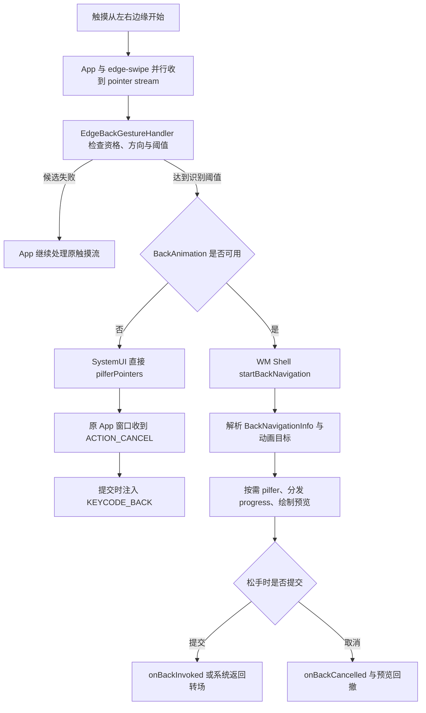

# 3.3 手势导航与系统交互

## 为什么要了解手势导航

在 Perfetto 里看到应用的触摸事件流以 `ACTION_CANCEL` 结束，或者从某个时刻开始不再有后续 `MOVE`，原因未必在应用。左右边缘返回手势开始时，SystemUI（系统界面进程）的手势监视通道（gesture monitor）与应用可以同时收到同一条指针事件流（pointer stream）；系统确认这是返回手势后，再通过 `pilferPointers()` 抢占后续指针，把事件交给手势处理方，并取消原窗口的触摸目标。下文把这个动作简称为“指针抢占”。

Android 10（API 29）引入全手势导航：从左右边缘向内滑动表示返回，底部上滑和横向滑动分别负责回到主屏（Home）、进入最近任务或快速切换。系统不会在 `ACTION_DOWN` 到达前无条件挡住应用；边缘返回采用“并行观察、达到条件后接管”的方式。这个时序是分析手势冲突和输入延迟的基础。

Android 13（API 33）开始提供预测性返回（Predictive Back）API。Android 15 将返回主屏（back-to-home）、跨任务（cross-task）和跨 Activity（cross-activity）三类系统动画移出开发者选项；Android 16 又把它们设为 `targetSdkVersion >= 36` 应用的默认行为。返回处理由此增加预提交阶段：系统在手指移动时解析返回目标、生成进度并准备预览，松手后才提交或取消。

以下分析以 `android-17.0.0_r1` 为源码基线，依次说明 SystemUI 如何观察并接管边缘触摸、应用如何声明有限的系统手势排除区域、预测性返回如何分发进度与提交事件，以及 Perfetto 能确认哪些证据、哪些现场信息仍需由其他工具补充。

## Android 10+ 手势导航的系统实现

### Android 17 的组件分工

Android 17 的入口仍是 SystemUI 中的 `EdgeBackGestureHandler`，但职责已经拆开：

- `EdgeBackGestureHandler` 维护导航模式、主屏排除区域、边缘宽度、方向与阈值状态，并把事件送往反馈插件和 WM Shell。WM Shell 是窗口管理组件中承载系统级任务动画和窗口转场的部分。
- `DisplayBackGestureHandlerImpl` 为每块显示屏持有输入监视器、`InputEventReceiver`、排除区域监听器和一个 `BackPanelController`。
- `InputMonitorCompat("edge-swipe", displayId)` 调用 `InputManagerGlobal.monitorGestureInput()`，取得手势监视器使用的 `InputChannel`。
- `BackPanelController` 和 `BackPanel.kt` 负责边缘箭头和面板动画；它们使用不可触摸的 `TYPE_NAVIGATION_BAR_PANEL` 受信任叠加层（trusted overlay），不靠这个窗口接收触摸。
- `BackAnimationController` 位于 WM Shell，负责 `startBackNavigation()`、目标解析、指针抢占、进度回调以及提交后的系统动画。

`updateIsEnabledInner()` 会注册主屏的 `ISystemGestureExclusionListener`，然后遍历当前显示屏创建 `DisplayBackGestureHandlerImpl`。Android 17 仍把边缘返回识别限定在主显示屏：`isWithinTouchRegion()` 对 `ev.getDisplayId() != mMainDisplayId` 返回 `false`，源码旁保留了 `TODO(b/382130680)`，因此不能把外接显示屏上的监视器生命周期当作返回手势可用性的证据。旧版的 `InputMonitorResource`、`resetEdgeBackPlugin()` 和 `NavigationBarEdgePanel` 不属于 Android 17 的主路径。

### 从并行观察到指针抢占

`InputMonitorCompat` 建立监视通道，`DisplayBackGestureHandlerImpl` 再用指定的 `Looper` 和 `Choreographer` 创建 `InputEventReceiver`。它们只提供事件入口；是否允许返回、何时接管，由上层状态机决定。

Android 17 的触摸判定按以下顺序进行：

1. `ACTION_DOWN` 到来时，检查导航模式、SystemUI 状态、底部手势区、画中画（PiP）和桌面模式排除区、应用排除区、左右边缘宽度及设备类型。
2. 资格成立后，事件才会送入 `BackPanelController`；如果启用了提前返回分发（ahead-of-time back dispatch），还会送入 WM Shell 的 `BackAnimation.onBackMotion()`。这里的“提前”是指在松手提交前就开始解析返回目标并产生手势进度。
3. 阈值之前，纵向位移先超过 `mTouchSlop`、停留超时或出现第二根触点，都会取消候选返回手势。
4. 横向位移大于纵向位移并超过 `mTouchSlop` 后，`mThresholdCrossed` 变为 `true`。
5. 旧式分支此时由 `EdgeBackGestureHandler` 直接调用 `pilferPointers()`；提前分发分支调用 `BackAnimation.onThresholdCrossed()`，由 `BackAnimationController` 根据描述返回目标和动画能力的 `BackNavigationInfo`、系统动画及应用进度生成方式决定何时抢占指针。

`pilferPointers()` 最终进入 `InputDispatcher`（输入分发器）。原目标窗口会收到由分发器合成的 `ACTION_CANCEL`，手势监视器则继续接收后续事件。因而“监视器收到事件副本”并不表示“应用始终能收到完整手势”。

### 旧式与提前分发两条提交路径

下面这张图保留了性能分析需要的分叉点：



左侧旧式（legacy）分支在 Android 17 源码中仍是明确的回退路径，不能简单视为“只存在于 Android 10–12”。当 `mBackAnimation == null` 时，越过阈值后由 SystemUI 抢占指针，`BackPanelController` 判断提交后，`triggerBack()` 注入 `KEYCODE_BACK` 的按下和抬起事件。

右侧提前分发分支中，`ACTION_DOWN` 和 `MOVE` 经 `dispatchToBackAnimation()` 切到 Shell 执行器。`BackAnimationController` 调用 `IActivityTaskManager.startBackNavigation()` 获取 `BackNavigationInfo`，再决定使用系统动画控制器还是应用回调。`setTriggerBack(true)` 只是记录“松手后提交”的状态；收到 `ACTION_UP` 后，Shell 才执行 `onBackInvoked()` 或启动提交后动画。取消路径则执行 `onBackCancelled()`。如果没有取得 `BackNavigationInfo`，源码仍保留注入返回键的兜底。

预测性返回也可能抢占指针。Android 17 把接管时机交给 `BackAnimationController.tryPilferPointers()`：使用系统动画控制器、应用无法生成进度、焦点变化或导航信息为空等条件，都可能触发抢占。排查性能跟踪时，不能只凭 `ACTION_CANCEL` 区分旧式返回与预测性返回，还要结合 Shell 返回动画和回调轨道。

## 手势冲突处理：系统手势优先区域与应用的 WindowInsets

系统手势和应用手势的冲突主要集中在左右返回边缘，以及底部主屏和快速切换区域。`View.setSystemGestureExclusionRects()` 用于有限地声明应用需要优先处理的区域，但不能覆盖强制系统手势区域（mandatory system gesture）。

### 系统手势排除区域

当应用在边缘放置抽屉、滑块或画布手势时，可以通过 `View.setSystemGestureExclusionRects()` 上报局部矩形。坐标以该 View 布局后的局部坐标为准，View 移动或尺寸变化后需要重新计算。

下面的示例只排除抽屉把手实际占用的左侧区域：

```kotlin
override fun onLayout(changed: Boolean, l: Int, t: Int, r: Int, b: Int) {
    super.onLayout(changed, l, t, r, b)
    val exclusionRect = Rect(0, drawerHandleTop, drawerHandleWidth, drawerHandleBottom)
    setSystemGestureExclusionRects(listOf(exclusionRect))
}
```

`ViewRootImpl` 的 `ViewRootRectTracker` 收集各 `View` 的矩形，转换到窗口坐标后通过 `WindowSession.reportSystemGestureExclusionChanged()` 上报。WindowManagerService（WMS，窗口管理服务）的 `DisplayContent.calculateSystemGestureExclusion()` 按窗口 Z 序、可触摸区域和显示坐标汇总，再通过 `ISystemGestureExclusionListener` 把限制后的 `Region` 通知 SystemUI。上报成功只说明 WMS 收到了请求，生效范围还要经过可触摸区域相交和配额计算。

### 系统手势区域限制

`mSystemGestureExclusionLimit` 限制左右边缘各自可排除的**纵向总高度**，不限制矩形的横向宽度。Android 17 的 `WindowManagerConstants` 保证该值至少为 200 dp；设备可以通过 `system_gesture_exclusion_limit_dp` 配置更大的值。`addToGlobalAndConsumeLimit()` 对边缘相交区域逐个消耗高度预算，超出部分会被裁掉。

WMS 同时保留受限区域（restricted `Region`）与原始未受限区域（unrestricted `Region`）。SystemUI 用受限区域决定系统是否让开；触点只命中未受限区域时，表示应用申请过排除，但该片段没有获得配额，系统仍可识别返回，并把它记为被拒绝的排除请求（rejected exclusion）。遇到“同一条边有些位置有效、有些位置仍触发返回”时，应检查纵向预算、窗口遮挡与最终获批区域。

部分系统窗口和特定的粘性沉浸模式（sticky immersive，即系统栏短暂出现后会自动再次隐藏）场景可以绕过普通限制，这是平台权限和窗口策略，不代表第三方应用可以无限排除屏幕边缘。

### WindowInsets 与手势区域

Android 把常规系统手势区域和强制系统手势区域分成两层：

- `WindowInsets.Type.systemGestures()` 描述系统手势具有优先级的区域，通常包含左右返回边缘和底部手势区。应用可以在非强制部分申请有限排除。
- `WindowInsets.Type.mandatorySystemGestures()` 是其中不能由 `setSystemGestureExclusionRects()` 覆盖的子集。旧方法 `getMandatorySystemGestureInsets()` 自 API 30 起由 `getInsets(Type.mandatorySystemGestures())` 取代。

底部主屏和快速切换手势不能像侧边返回一样申请退出。游戏确有全屏交互需求时，可以在交互期间进入沉浸模式（immersive mode）；用户仍能通过系统规定的边缘操作重新显示系统栏。普通页面更适合把滑动控件避开 `systemGestures()`，排除区域只留给无法移动的关键交互。

## 从返回手势到预测性返回动画

### 传统返回手势的问题

早期返回手势在松手前主要显示边缘箭头，用户看不到返回目标。系统通常到提交点才触发返回，应用也容易把返回处理集中在 `onBackPressed()` 或 `KEYCODE_BACK`。

预测性返回增加了预提交阶段。WM Shell 在手势中调用 `startBackNavigation()` 获得目标类型与回调，根据进度驱动当前窗口、目标窗口或应用自定义动画。应用必须把“跟随手势的视觉更新”和“提交后改变导航状态”分开。

### 预测性返回的回调模型

回调接口分为平台 API 和 AndroidX 兼容层：

| 层级 | 接口 | 引入版本 | 可直接确认的方法 | 作用 |
| --- | --- | --- | --- | --- |
| 平台提交回调 | `OnBackInvokedCallback` | API 33 | `onBackInvoked()` | 返回提交后收到通知，没有进度方法。 |
| 平台进度回调 | `OnBackAnimationCallback` | API 34 | `onBackStarted()`、`onBackProgressed()`、`onBackCancelled()`、`onBackInvoked()` | 可接收开始、进度、取消和提交事件。 |
| AndroidX 兼容层 | `OnBackPressedCallback` | `androidx.activity:activity` 1.0.0；进度方法在 1.8.0 增加 | `handleOnBackPressed()`；`handleOnBackStarted()`、`handleOnBackProgressed()`、`handleOnBackCancelled()` | 提供向下兼容入口。只有框架 API 34+ 才会由系统驱动后三个进度相关方法。 |

平台回调通过 `OnBackInvokedDispatcher` 注册，AndroidX 回调通过 `OnBackPressedDispatcher` 管理。`OnBackInvokedCallback` 只有提交通知；需要开始、进度和取消事件时，应使用 `OnBackAnimationCallback`，或交给 AndroidX、Navigation、Compose 的对应 API。

`android:enableOnBackInvokedCallback` 的语义还受目标 SDK 版本影响。Android 15 及更早版本用它选择是否加入提前分发模型；Android 16 起，运行在 Android 16+ 且目标版本为 36+ 的应用默认启用，仍可暂时设为 `false` 退出。该属性不等同于 AndroidX `OnBackPressedCallback.enabled`，也不能替代回调生命周期管理。

### 版本演进的时间线

| Android 版本 | API | 系统动画状态 | 清单与 Activity 条件 | `targetSdkVersion` 与兼容边界 | 回调与预览范围 |
| --- | --- | --- | --- | --- | --- |
| Android 13 | 33 | 通过开发者选项测试预测性返回动画。 | 应用或 Activity 通过 `android:enableOnBackInvokedCallback` 显式加入。 | `OnBackInvokedCallback` 从 API 33 可用。 | 返回主屏是主要测试入口；提交回调没有进度信息。 |
| Android 14 | 34 | 系统动画测试仍依赖开发者选项。 | 延续显式加入模型。 | `OnBackAnimationCallback` 从 API 34 可用；AndroidX 1.8.0 可转发进度。 | 应用能收到开始、进度和取消事件。 |
| Android 15 | 35 | 开发者选项移除；已加入的应用或 Activity 可以显示返回主屏、跨任务和跨 Activity 动画。 | 仍需迁移到受支持的返回 API；根 Activity 的消费型回调会阻止返回主屏预览。 | 目标 SDK 版本不是唯一条件。 | 系统预览范围扩展到三类系统转场。 |
| Android 16 | 36 | 在 Android 16+ 设备上，目标版本为 36+ 的应用默认启用三类系统动画。 | 可暂时用 `android:enableOnBackInvokedCallback="false"` 退出。 | 目标版本为 36+ 时，旧 `onBackPressed()` 不再调用，`KEYCODE_BACK` 不再分发给应用；三键导航也可接入预测性返回。 | 新增 `PRIORITY_SYSTEM_NAVIGATION_OBSERVER`；API 36 只允许注册一个观察者回调。 |
| Android 17 | 37 | 延续目标版本为 36+ 时的默认模型与三类系统动画。 | 退出开关仍应只作迁移缓冲，业务返回使用 AndroidX 或平台返回 API。 | `PRIORITY_SYSTEM_NAVIGATION_OBSERVER` 已是没有 `@FlaggedApi` 标记的公共常量。 | 观察者回调数量不再受 API 36 的单实例限制，多个回调的调用顺序未定义。 |

API 37 的观察者优先级值为 `-2`。虽然普通注册参数声明了非负范围，`WindowOnBackInvokedDispatcher.Checker` 对这个常量有专门放行。观察者只在系统将执行默认导航时收到通知，不消费返回事件，适合记录日志和统计；业务不能依赖多个观察者的调用顺序。

### 预测性返回对性能的影响

1. 进度回调每帧都可能执行。优先更新 `translationX`、`alpha`、缩放比例或已准备好的动画状态，避免在 `onBackProgressed()` 中做 I/O、Binder 同步调用、复杂布局或创建大量对象。
2. 跨 Activity、跨任务和返回主屏会同时涉及当前层、目标层和 Shell 动画。掉帧时要检查当前应用、目标 Activity 或 Launcher、WM Shell、SurfaceFlinger，不能只看当前 Activity 的 RenderThread。
3. 只在提交时改变导航状态。若在进度阶段就执行 `popBackStack()` 或 `finish()`，取消手势时很难恢复一致状态。
4. 观察者回调适合记录轻量日志。它不消费返回事件，但仍运行在应用回调环境中，耗时工作应异步化。

## 边缘滑动检测的性能敏感点

### 先找对 SystemUI 线程

`DisplayBackGestureHandlerImpl` 和 `EdgeBackGestureHandler` 使用带 `@BackPanelUiThread` 的 `UiThreadContext`。Android 17 的 `SysUIConcurrencyModule` 会根据 `Flags.edgeBackGestureHandlerThread()` 把它映射到独立的 `BackPanelUiThread`（采用 `THREAD_PRIORITY_DISPLAY` 对应的显示相关线程优先级）或 SystemUI 主线程。因此，不能笼统写成“所有判定都在 SystemUI 主线程”。

性能跟踪中应先根据线程名和 `InputConsumer processing on...` 等接收器轨迹区段确认事件落在哪条线程，再检查该线程在 `ACTION_DOWN` 到阈值越过之间是否被长任务、锁等待或 Binder 调用占用。`EdgeBackGestureHandler` 没有为每个事件提供稳定的同名区段，必要时应在可控构建中增加自定义跟踪点。阈值前还有排除区、SystemUI 状态标志、PiP、桌面模式角区、手势阻塞 Activity 和可选的机器学习（ML）分类等判断；这些路径都不适合加入同步 I/O。

### 长按超时的影响

Android 17 的 `mLongPressTimeout` 是 `min(gestures.back_timeout, ViewConfiguration long-press timeout)`。`gestures.back_timeout` 的 AOSP 默认值为 250 ms，不能沿用“通常 400–500 ms”的旧口径。只有在阈值尚未越过时，某个 `ACTION_MOVE` 的 `eventTime - downTime` 超过该值，候选返回才会取消。设备厂商可以通过系统属性改变上限，现场应以 `dumpsys` 与设备配置为准。

### 多指触控的取消

`ACTION_POINTER_DOWN` 只在 `mThresholdCrossed == false` 且输入不是三指触控板返回时取消候选手势。阈值已经越过后，这个分支不再执行。复现“第二根手指取消返回”时，必须记录第二指落下与阈值越过的先后顺序。

### 方向、阈值与 ML 分类

Android 17 用 `scaledTouchSlop * back_gesture_slop_multiplier` 作为方向识别阈值，`back_gesture_slop_multiplier` 的 AOSP 默认值为 `0.75f`。阈值前若 `dy > dx` 且 `dy > mTouchSlop`，手势按纵向移动取消；若 `dx > dy` 且 `dx > mTouchSlop`，才进入返回阶段。

边缘命中还可以启用 `BackGestureTfClassifierProvider`。模型只在配置和 DeviceConfig 共同允许时加载，推理特征包括屏宽、距边缘距离、左右侧、前台包词表索引和纵向坐标（y）。分析边缘“同一点偶发不响应”时，应同时记录灵敏度、内边距、排除区、前台包与 ML 开关，不能只比较手指位移。

### 动画渲染的开销

Android 17 的边缘反馈由 `BackPanelController` 和 `BackPanel.kt` 绘制，窗口类型是 `TYPE_NAVIGATION_BAR_PANEL`。它与 WM Shell 的目标预览属于两层动画：前者是手指旁的返回提示，后者是当前任务与返回目标的窗口转场。只看到边缘箭头流畅，不能证明预测性返回的目标预览也流畅。

## 在 Perfetto 中的表现

Perfetto 能回答事件何时被读入、发给哪些窗口、由哪条线程处理，以及哪些帧错过了截止时间。它不能仅凭一类通用 atrace 轨迹证明手势排除矩形最终覆盖的几何范围；这部分还要结合 `dumpsys window` 或 Winscope 状态。

### 最小抓取配置

在量产版 `user` 构建上，可用官方快速入门文档支持的 atrace 类别抓取线程调度、输入、窗口和图形基线：

```bash
adb shell perfetto -o /data/misc/perfetto-traces/back-gesture.perfetto-trace -t 15s \
  sched freq idle am wm gfx view binder_driver input
adb pull /data/misc/perfetto-traces/back-gesture.perfetto-trace
```

这套简写适合确认线程是否繁忙和动画是否掉帧，但不会自动给出完整的指针分发明细。

在 `userdebug` 或 `eng` 设备上，需要逐事件确认应用与 `edge-swipe` 监视器的分发关系时，可使用 Android 17 的结构化输入数据源，并同时开启 FrameTimeline：

```protobuf
buffers {
  size_kb: 32768
  fill_policy: RING_BUFFER
}
duration_ms: 15000

data_sources {
  config {
    name: "linux.ftrace"
    ftrace_config {
      ftrace_events: "sched/sched_switch"
      ftrace_events: "sched/sched_waking"
      atrace_categories: "input"
      atrace_categories: "wm"
      atrace_categories: "gfx"
      atrace_categories: "view"
      atrace_apps: "com.android.systemui"
      atrace_apps: "your.package.name"
    }
  }
}
data_sources {
  config {
    name: "android.surfaceflinger.frametimeline"
  }
}
data_sources {
  config {
    name: "android.input.inputevent"
    android_input_event_config {
      mode: TRACE_MODE_TRACE_ALL
    }
  }
}
```

把配置保存为 `back-gesture.pbtxt` 后，通过 `adb shell perfetto --txt -c - -o ... < back-gesture.pbtxt` 录制。`TRACE_MODE_TRACE_ALL` 会绕过调试构建上的隐私裁剪，记录完整坐标和按键内容，只能用于本地受控复现，不能用于现场或用户数据采集。需要外场规则时，应改用 `TRACE_MODE_USE_RULES` 并配置脱敏级别。

Perfetto 的查询引擎 Trace Processor 在 `android.input` 模块中提供 `android_motion_events` 和 `android_input_event_dispatch` 视图，可以用同一个 `event_id` 关联 MotionEvent 与窗口分发目标。`InputMonitorCompat` 自身还会写入 `InputMonitorCompat-edge-swipe-dispN created/receiver created/disposed` 瞬时事件；这些是监视器生命周期证据，不代表每次手势都一定出现同名的持续区段。

### 1. 旧式返回手势：检查取消事件和按键注入链

1. 用结构化输入事件的 `event_id` 确认初始触摸同时分发到前台窗口和手势监视器。
2. 在阈值附近寻找原窗口的 `ACTION_CANCEL`，并检查 SystemUI 对应线程是否正在处理该手势。
3. 提交后查找注入的 `KEYCODE_BACK` 及其后续窗口分发。
4. 若原窗口收到完整指针事件流且没有 `ACTION_CANCEL`，再检查这次是否未命中边缘、排除请求是否被拒绝，或是否没有达到方向阈值。

### 2. 预测性返回：检查进度回调和目标层预览

1. 先找 `ACTION_DOWN`、`MOVE` 到 Shell `startBackNavigation()` 的时序，再确认阈值越过。
2. 通过 FrameTimeline 和 SurfaceFlinger 轨迹区分当前 Activity、目标 Activity 或 Launcher。不同返回类型不保证出现相同数量的 Surface。
3. 应用自定义进度回调没有系统统一的轨迹区段名。应给 `onBackStarted()`、`onBackProgressed()`、`onBackCancelled()` 加应用自己的 `Trace.beginSection()`，再与 Shell 和帧时间线对齐。
4. `ACTION_CANCEL` 不能单独证明走了旧式路径，因为 Shell 也可能抢占指针。
5. 提交后通常走 `onBackInvoked()` 和系统转场；只有导航信息为空等兜底条件才可能再次看到注入的返回键。

### 3. 排除区冲突：Perfetto 只负责时序，命中边界还要回到 WindowInsets 和 dumpsys

排除区问题要把三类证据放在同一次复现中：

- 应用记录的矩形与 `WindowInsets.Type.systemGestures()`、`mandatorySystemGestures()`；
- 应用日志中的请求矩形、`dumpsys window` 的 `mSystemGestureExclusion` 最终显示区域，以及 SystemUI 转储中的受限与未受限区域；
- Perfetto 中该指针事件流是否被抢占，以及 SystemUI 判定线程是否及时运行。

只看应用传给 `setSystemGestureExclusionRects()` 的列表，无法证明 WMS 批准了同样大小的区域；只看 Perfetto，也无法还原所有矩形的布局坐标。两组证据需要互相校验。

## 常见问题与误区

### 所有返回手势都会注入 `KEYCODE_BACK` 吗

不会。`EdgeBackGestureHandler.triggerBack()` 只在 `mBackAnimation == null` 时直接注入按键。提前分发分支先用 `setTriggerBack(true)` 标记提交，再在 `ACTION_UP` 后执行回调或转场；Shell 仅在没有有效 `BackNavigationInfo` 等兜底条件下注入返回键。

### 设置手势排除矩形后，整块区域都会生效吗

不保证。WMS 还会与窗口可触摸区域相交，并按左右侧各自的纵向高度预算裁剪。应检查最终获批区域，不能只看应用的请求列表。

### `systemGestures()` 能代表所有可排除区域吗

不能。`mandatorySystemGestures()` 是系统必须保留的子集，`setSystemGestureExclusionRects()` 无法覆盖。底部主屏和快速切换冲突与左右返回边缘的有限排除要分开处理。

### Android 13 到 Android 17 的开关行为相同吗

不同。API 33 提供提交回调，API 34 增加进度回调，Android 15 移除系统动画的开发者开关，Android 16 对目标版本为 36+ 的应用默认启用并改变旧返回事件分发，API 37 再放开观察者回调数量。调试时必须同时记录系统版本、目标 SDK 版本、清单属性和回调注册情况。

### 手势监视器收到事件后，应用还能收到完整指针事件流吗

阈值前通常可以并行接收；发生 `pilferPointers()` 后，原目标收到 `ACTION_CANCEL`，后续事件流由抢占方处理。旧式与提前分发分支都可能抢占指针，时机由各自状态机决定。

## 与其他章节的关系

- **3.1 Input 事件分发全流程**：这里的手势监视器、监视窗口（spy window）、指针抢占和取消事件，都建立在 InputDispatcher 的窗口目标模型上。
- **3.2 触摸响应的性能分析**：结构化输入事件可把 `InputReader` 读取、`InputDispatcher` 分发、窗口投递与应用消费时刻放在同一条链上。
- **2.3 VSync 机制**、**2.4 Choreographer 与渲染流水线**：边缘反馈和预测性预览都受帧节拍约束，FrameTimeline 用来确认帧是否错过截止时间。
- **1.5 线程模型**：Android 17 的边缘判定线程可能是 `BackPanelUiThread`，也可能回退到 SystemUI 主线程；WM Shell 和应用回调还有各自的执行上下文。

## 参考资料

- AOSP 源码路径：
  - `frameworks/base/packages/SystemUI/src/com/android/systemui/navigationbar/gestural/EdgeBackGestureHandler.java` — 资格判定、阈值、旧式提交与 Shell 入口
  - `frameworks/base/packages/SystemUI/src/com/android/systemui/navigationbar/gestural/DisplayBackGestureHandler.kt` — Android 17 每块显示屏的监视器、接收器、排除区监听和面板
  - `frameworks/base/packages/SystemUI/src/com/android/systemui/navigationbar/gestural/BackPanelController.kt` — 当前默认的边缘返回反馈插件
  - `frameworks/base/packages/SystemUI/src/com/android/systemui/navigationbar/gestural/BackPanel.kt` — 边缘面板的绘制与动画实现
  - `frameworks/base/packages/SystemUI/shared/src/com/android/systemui/shared/system/InputMonitorCompat.java` — `monitorGestureInput()` 的 SystemUI 包装层
  - `frameworks/base/packages/SystemUI/src/com/android/systemui/util/concurrency/SysUIConcurrencyModule.kt` — `BackPanelUiThread` 与主线程的选择
  - `frameworks/base/libs/WindowManager/Shell/src/com/android/wm/shell/back/BackAnimationController.java` — 提前返回分发、目标解析、进度、指针抢占与提交动画
  - `frameworks/native/services/inputflinger/dispatcher/InputDispatcher.cpp` — `pilferPointersLocked()` 与 `CANCEL_POINTER_EVENTS` 合成
  - `frameworks/base/core/java/android/view/ViewRootImpl.java` — View 排除矩形收集与 WMS 上报
  - `frameworks/base/services/core/java/com/android/server/wm/DisplayContent.java` — 最终排除区域与每侧高度预算
  - `frameworks/base/core/java/android/window/OnBackInvokedCallback.java` — API 33 的提交回调
  - `frameworks/base/core/java/android/window/OnBackAnimationCallback.java` — API 34 的进度回调
  - `frameworks/base/core/java/android/window/OnBackInvokedDispatcher.java` — 观察者优先级与回调注册入口
  - `frameworks/base/core/java/android/window/WindowOnBackInvokedDispatcher.java` — 回调排序、观察者与应用进度分发
  - `frameworks/native/services/inputflinger/include/InputTracingPerfettoBackend.h` — 结构化输入 Perfetto 数据源
- 官方文档：
  - [Ensure compatibility with gesture navigation | Android Developers](https://developer.android.com/develop/ui/views/touch-and-input/gestures/gesturenav)
  - [Add support for the predictive back gesture | Android Developers](https://developer.android.com/guide/navigation/custom-back/predictive-back-gesture)
  - [Android 16 behavior changes for target 36+ | Android Developers](https://developer.android.com/about/versions/16/behavior-changes-16)
  - [OnBackInvokedCallback | Android Developers](https://developer.android.com/reference/android/window/OnBackInvokedCallback)
  - [OnBackAnimationCallback | Android Developers](https://developer.android.com/reference/android/window/OnBackAnimationCallback)
  - [OnBackInvokedDispatcher | Android Developers](https://developer.android.com/reference/android/window/OnBackInvokedDispatcher)
  - [WindowInsets | Android Developers](https://developer.android.com/reference/android/view/WindowInsets)
  - [OnBackPressedCallback | Android Developers](https://developer.android.com/reference/androidx/activity/OnBackPressedCallback)
  - [Android tracing quickstart | Perfetto](https://perfetto.dev/docs/quickstart/android-tracing)
  - [FrameTimeline data source | Perfetto](https://perfetto.dev/docs/data-sources/frametimeline)
- 外部参考：
  - TechMerger《深入理解 Android 系统 Back Gesture 的实现》
  - 郭霖《Android 15 新特性：预测性返回手势》
