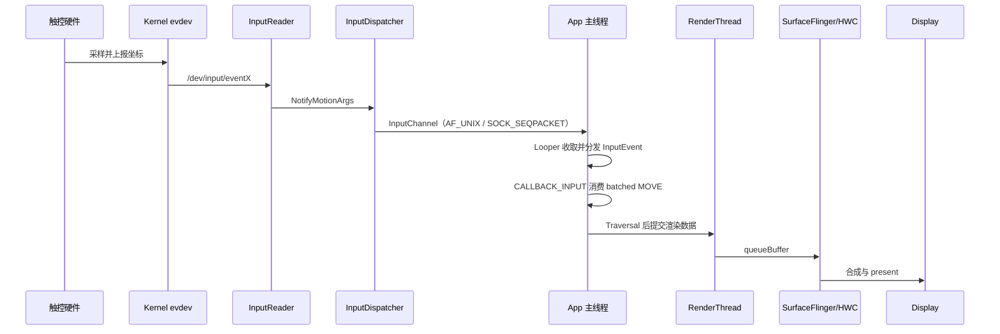
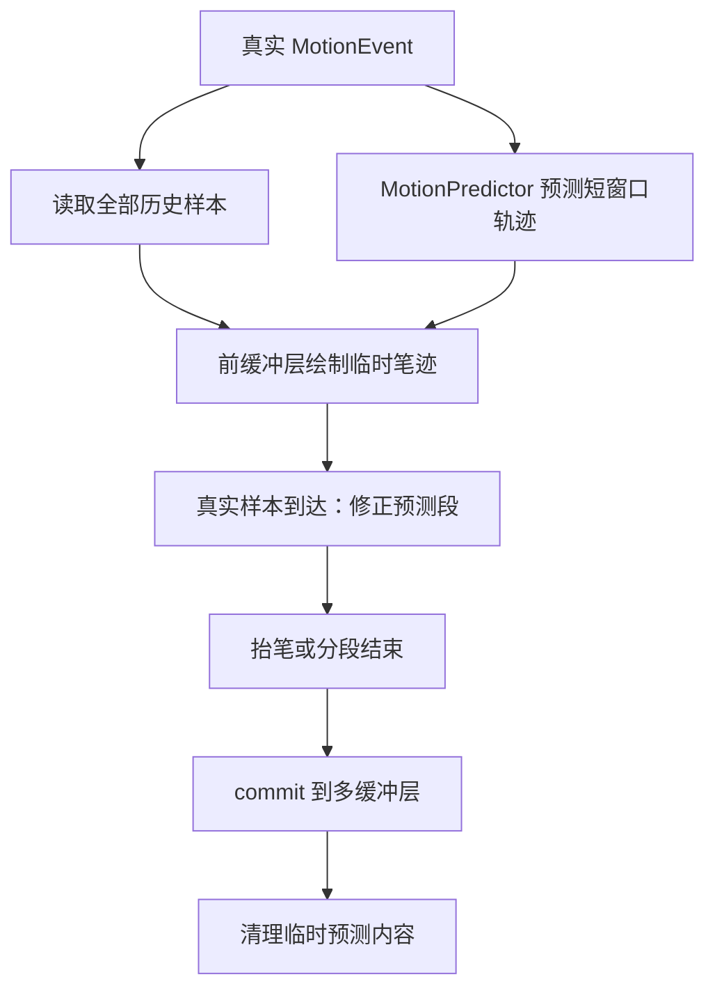

# 3.4 输入延迟与预测输入技术

## 为什么单独讲输入延迟

§3.1 拆解了输入事件从硬件到 View 树的分发路径，§3.2 介绍了触摸响应的常见瓶颈。这里把一次输入从“手指位置变化”到“像素显示变化”的时间拆成可度量阶段，再讨论系统提供的降延迟手段。

输入延迟的测量口径容易混淆。InputDispatcher 的 `total_latency_dur` 只表示事件分发到 ACK 的耗时；FrameTimeline 表示一帧是否按时 present；手写笔应用关心的是笔尖和墨迹之间的距离。三者都称为输入延迟，却对应不同的时间区间。

分析跟手性时应先统一口径，再选择优化方法。除专门说明的版本沿革外，平台实现以 AOSP `android-17.0.0_r1` 为源码锚点。

## 输入延迟的分层模型

一次触摸到显示，大致经过七段：



这条路径可以按责任主体拆成四类延迟：

| 阶段 | 主要对象 | 常见观察点 | 典型问题 |
| --- | --- | --- | --- |
| 采样延迟 | 触控 IC、驱动、evdev | `getevent`、InputReader 时间戳 | 采样率低、驱动上报抖动、坐标滤波过重 |
| 系统分发延迟 | EventHub、InputReader、InputDispatcher、InputChannel | `iq`、`oq:<channel>`、`wq:<channel>`、`dispatch_latency_dur`、`ack_latency_dur` | system_server 调度不及时、目标窗口连接拥塞、ACK 回写慢 |
| App 处理延迟 | `ViewRootImpl`、View 树、业务代码、Choreographer | `deliverInputEvent`、`CALLBACK_INPUT`、主线程状态 | 主线程 I/O、Binder 同步调用、复杂手势分发、过深 View 层级 |
| 显示延迟 | RenderThread、GPU、SurfaceFlinger、HWC、Panel | Frame Timeline、`queueBuffer`、present fence | GPU 忙、BufferQueue 积压、SF 合成超时、刷新率切换 |

这张表用于把问题分段。`wq` 堆积时，不能直接归因于渲染；FrameTimeline 标红也不能反推 InputDispatcher 一定慢。每个指标只覆盖相应区间。

### 一帧预算里的输入位置

在 App 侧，事件到达和 batched MOVE 的消费要分开观察。普通未批处理事件由 `WindowInputEventReceiver#onInputEvent()` 接收，随后进入 `ViewRootImpl` 的输入阶段链；积累中的 MOVE 批次通常由 `ViewRootImpl` 注册 Choreographer 的输入 VSync callback，在目标帧时间到来时调用 `consumeBatchedInputEvents(frameTimeNanos)`。因此，不能把每个输入事件都描述成“等待 `CALLBACK_INPUT` 后才分发”。

`android-17.0.0_r1` 中的帧回调顺序仍是：

1. `CALLBACK_INPUT`
2. `CALLBACK_ANIMATION`
3. `CALLBACK_INSETS_ANIMATION`
4. `CALLBACK_TRAVERSAL`
5. `CALLBACK_COMMIT`

这个顺序让 batched 输入先于动画和 traversal 消费。输入处理占用过多时间时，后面的动画和 traversal 预算会被压缩；主线程若已被长任务占住，输入即使到达 App 进程，也要等 Looper 获得执行机会。

Android 17 创建 `InputChannel` 时使用 `socketpair(AF_UNIX, SOCK_SEQPACKET, ...)`。它保留消息边界，不能笼统理解为字节流 socket。上图省略了窗口选择、事件拆分、ACK 等分支，只表达延迟阶段。

## VSync、batching 与重采样

输入和显示的频率通常不一样。触控采样可以是 120Hz、240Hz、480Hz，显示刷新可能是 60Hz、90Hz、120Hz；App 的渲染帧率又可能低于屏幕刷新率。Android 用 batching 和重采样把这些节奏接到一起。

### Batching 解决吞吐问题

高采样率触摸屏在一个 VSync 周期内可能产生多个 MOVE 样本。系统把这些样本合并到同一个 `MotionEvent`，当前坐标通过 `getX()` / `getY()` 读取，历史采样通过 `getHistoricalX()` / `getHistoricalY()` 读取。

这段代码用于保留笔迹类应用的历史轨迹，而不是只画最新点：

```kotlin
fun appendSamples(event: MotionEvent, out: MutableList<PointF>) {
    for (i in 0 until event.historySize) {
        out += PointF(event.getHistoricalX(0, i), event.getHistoricalY(0, i))
    }
    out += PointF(event.getX(0), event.getY(0))
}
```

代码只处理第一个 pointer，多指场景要按 `pointerCount` 展开。批处理没有丢掉中间点，App 是否使用这些点取决于自身的输入处理逻辑。

### 重采样解决时序贴合问题

Batching 处理“点太多”的问题，重采样处理“点和帧时间不齐”的问题。App 进程里的 `InputConsumer` 会根据目标 frame time，在最近的真实采样点之间插值，或者在没有未来点时做短窗口外推。这样当前帧拿到的坐标更接近这帧要显示的时刻。

在 `android-17.0.0_r1` 的 ViewRoot 路径中，`android_view_InputEventReceiver.cpp` 直接持有 `frameworks/native/libs/input/InputConsumer.cpp` 实现的 `InputConsumer`。消费 batch 时，它把目标采样时刻设为 `frameTime - 5ms`：

- 两侧都有真实样本时做插值；
- 缺少未来样本时才做受限外推；
- 相邻样本小于 2ms 时不外推；
- 用于外推的历史间隔上限是 20ms；
- 向前外推最多 8ms，并且不能超过最近采样间隔的 50%。

这里的 5ms 是让坐标贴近目标帧的采样偏移，不是额外附加到端到端链路上的固定 5ms 延迟。Native 层还并存 `InputConsumerNoResampling`、`Resampler.cpp` 和 `LegacyResampler` 等组件，但它们不属于这个 tag 下 ViewRoot JNI 直接构造的消费路径。

API 35 起，可以先通过 `MotionEvent#getPointerCoords()` 或 `getHistoricalPointerCoords()` 取出 `PointerCoords`，再调用 `PointerCoords.isResampled()` 判断该坐标是否由系统重采样得到。更早版本没有对应的公开判断 API。

`requestUnbufferedDispatch()` 会让匹配输入源的 pending batch 立即以 `frameTimeNanos = -1` 消费，不再等下一次输入 VSync callback。代价是 batch 可积累的样本更少，而且没有目标 frame time 可供上述重采样使用。手写、签名、白板可以在笔迹进行期间评估这种取舍；普通列表滚动通常先保留默认策略。

## MotionPredictor：用预测缩短感知距离

预测输入不会让系统更早收到真实事件；它在真实事件到达前估算下一小段轨迹，提前把视觉反馈画出来。它主要服务手写笔、绘图、签名这类连续轨迹场景。

### 三层能力边界

| 能力 | 入口 | 版本边界 | 适用场景 |
| --- | --- | --- | --- |
| Framework API | `android.view.MotionPredictor` | API 34+；仍需设备配置启用并支持对应设备和 source | 系统提供预测能力时，App 直接调用 framework API |
| AndroidX 封装 | `androidx.input:input-motionprediction` 的 `MotionEventPredictor` | Android U/API 34 起优先使用受支持的系统 API；低版本或不受支持的笔划使用兼容预测器 | 需要覆盖多个 Android 版本的手写/绘图应用 |
| Native predictor | AOSP `libinput` 的 `MotionPredictor` / `TfLiteMotionPredictor` | `android-17.0.0_r1` 中由 framework API 经 JNI 调用 | 系统内部能力，普通 App 不直接链接 |

### Android 17 源码边界

`MotionPredictor(Context)` 会读取设备资源 `config_enableMotionPrediction` 和 `config_motionPredictionOffsetNanos`。AOSP 基础配置分别是 `false` 和 `0`，因此 API 存在不等于所有设备都默认启用；调用前必须用 `isPredictionAvailable(deviceId, source)` 判断。

在 `android-17.0.0_r1` 中，framework 对象经 `android_view_MotionPredictor.cpp` 调到 Native predictor。当前实现还有以下限制：

- 一个 predictor 实例在一段活动手势中只接受一个 input device；
- `isPredictionAvailable()` 只接受 stylus source，记录时还会检查单 pointer 和 `ToolType::STYLUS`；
- `record()` 使用 `DOWN`、`MOVE` 样本，收到 `UP` 或 `CANCEL` 后清空手势状态，其他 action 不参与建模；
- 已被系统重采样的坐标不会再次输入预测模型；
- TFLite 模型优先从 `/vendor/etc/motion_predictor_model.tflite` 加载，缺失时回退到 `/system/etc/motion_predictor_model.tflite`；相邻的配置 XML 决定模型窗口和预测参数；
- 模型输入包含位移极坐标、pressure、tilt、orientation，输出包含预测位移和 pressure。

这些边界意味着预测能力由平台版本、设备 overlay、输入设备和当前笔划共同决定。TCN 架构、NPU 加速、固定 30ms 窗口或非 stylus 全量支持，都不能从该源码锚点推出。

### Framework API 的使用方式

Framework API 需要在整段 stylus event stream 中复用同一个实例。下面的封装负责记录 real event 并返回 nullable predicted event：

```kotlin
@RequiresApi(34)
class StylusPrediction(context: Context) {
    private val predictor = MotionPredictor(context)

    fun recordAndPredict(
        event: MotionEvent,
        targetTimeNanos: Long
    ): MotionEvent? {
        if (!predictor.isPredictionAvailable(event.deviceId, event.source)) {
            return null
        }
        predictor.record(event) // DOWN/MOVE/UP/CANCEL 都按原顺序送入
        return predictor.predict(targetTimeNanos)
    }
}
```

调用者画完预测事件后要回收它，并且要读取全部历史预测样本：

```kotlin
val predicted = stylusPrediction.recordAndPredict(event, targetTimeNanos)
try {
    predicted?.let(::drawPredictionIncludingHistory)
} finally {
    predicted?.recycle()
}
```

`predict()` 可能因为设备不支持、样本不足或置信度不够而返回 `null`，也可能早于请求时间停止预测。生产实现还要按 input device 管理实例，并在真实样本到达后修正预测笔迹。预测点应在渲染层标记来源，避免被写入不可回滚的真实笔迹。

### 预测的代价

预测会换来三类成本：

- **轨迹修正成本**：真实样本到达后，预测点可能偏离，需要擦除或覆盖。
- **形变风险**：快速转向、停笔、手掌误触会让短窗口预测变差。
- **工程复杂度**：渲染层要区分真实笔迹和预测笔迹，抬笔后要把内容提交到稳定缓冲。

因此，MotionPredictor 适合“误差可被下一帧修正”的场景。按钮点击、普通列表滑动、页面跳转不该依赖它解决响应问题。

## 前缓冲与低延迟图形

传统多缓冲路径要等 App 渲染、buffer swap、SurfaceFlinger 合成和显示刷新。对整屏 UI 来说，这套路径安全、稳定；对手写笔迹来说，它会让墨迹落后于笔尖。

前缓冲渲染会把短生命周期的增量内容放进专用的低延迟前缓冲层，减少等待下一次完整多缓冲提交的时间。它不是修改 View 当前正在显示的普通 color buffer。Jetpack graphics 库提供了几层入口：

- `GLFrontBufferedRenderer`：适合 OpenGL 自定义渲染，通常用于笔迹增量层和多缓冲持久层组合。
- `CanvasFrontBufferedRenderer`：同时管理低延迟 front-buffered layer 和用于完整场景的 multi-buffered layer；`commit()` 会重新绘制并提交完整场景。
- `LowLatencyCanvasView`：在 View 层级上方管理临时的单缓冲 overlay；`renderFrontBufferedLayer()` 后可见，`commit()` 后隐藏 overlay，并把同一内容交回普通 View 绘制路径。

### 适合与不适合

| 场景 | 是否适合前缓冲 | 原因 |
| --- | --- | --- |
| 手写笔迹、签名、白板局部线段 | 适合 | 增量区域小，短暂撕裂不容易被感知，低延迟收益明显 |
| 整屏列表滚动 | 不适合 | 更新范围大，容易出现撕裂和层次错位 |
| 普通按钮点击反馈 | 通常不适合 | UI 状态变化要和 View 层级、无障碍、动画系统保持一致 |
| 游戏准星、画笔轨迹 | 视实现而定 | 如果渲染引擎能管理局部增量层，可以尝试 |

前缓冲的工程原则是“双层提交”：移动过程中在前缓冲层画临时增量，抬笔或分段结束后，调用 `commit()` 让完整场景走多缓冲层。前缓冲层允许以撕裂风险换取更早的可见反馈，多缓冲层负责稳定、完整的最终内容。

## Perfetto 输入延迟量化

`android.input` 标准库把输入事件拆成几类延迟字段。它适合回答“慢在哪一段”，不能替代 UI 上的上下文分析。

| 字段 | 含义 | 诊断方向 |
| --- | --- | --- |
| `dispatch_latency_dur` | InputDispatcher 开始分发到 App 收到事件 | system_server 调度、InputChannel、目标进程唤醒 |
| `handling_latency_dur` | 接收端收到事件到发出 finish/ACK | 接收线程处理、View 分发以及这段区间内的排队或同步调用；不能一概等同于业务代码耗时 |
| `ack_latency_dur` | App 发出 ACK 到系统收到 ACK | ACK 回写、线程调度、system_server 负载 |
| `total_latency_dur` | dispatch 到 ACK 的总时长 | 输入分发往返总耗时 |
| `end_to_end_latency_dur` | InputReader 读到事件到关联帧 present | 输入到显示的端到端耗时，依赖 trace 中的帧关联信息 |

这段查询用于找出最慢的输入事件，并拆出各段耗时：

```sql
INCLUDE PERFETTO MODULE android.input;

SELECT
  dispatch_ts / 1e6 AS timestamp_ms,
  process_name,
  tid,
  thread_name,
  event_type,
  event_action,
  normalized_event_channel,
  dispatch_latency_dur / 1e6 AS dispatch_ms,
  handling_latency_dur / 1e6 AS handling_ms,
  ack_latency_dur / 1e6 AS ack_ms,
  total_latency_dur / 1e6 AS total_ms,
  end_to_end_latency_dur / 1e6 AS end_to_end_ms,
  input_event_id,
  is_speculative_frame
FROM android_input_events
WHERE total_latency_dur IS NOT NULL
ORDER BY total_latency_dur DESC
LIMIT 100;
```

结果按下面的顺序判断：

- `dispatch_ms` 高：先看 InputDispatcher 线程、目标进程主线程是否 Runnable 等 CPU、socket 通道是否拥塞。
- `handling_ms` 高：根据 `tid`、`thread_name` 确认接收线程，再展开 `deliverInputEvent` 和同一时间窗的业务 slice。
- `ack_ms` 高：App 处理结束后到系统收到 ACK 中间还有调度或回写延迟，不要把它算成 View 分发耗时。
- `end_to_end_ms` 高：把 FrameTimeline、RenderThread 和 SurfaceFlinger 一起纳入判断。

`android_input_events` 主要关联输入 input atrace slice（如 `sendMessage`、`receiveMessage`、`deliverInputEvent`）与 FrameTimeline。`android.input.inputevent` 是只在 debuggable build 上可用的结构化数据源，用于填充 `android_motion_events`、`android_key_events`、`android_input_event_dispatch` 等表，但并非查询 `android_input_events` 的前置条件。

`end_to_end_latency_dur` 需要成功关联输入与 present 帧；关联不到时会是 `NULL`。对于未 batch 的事件，标准库可能用下一帧作推测关联，此时 `is_speculative_frame = 1`。空值表示证据不足，推测值也要与界面行为和 FrameTimeline 一起核对。

## 调度、提频与硬件采样策略

输入处理跨帧时，瓶颈可能来自 App 代码，也可能来自线程迟迟没有获得 CPU。Perfetto 里要把 CPU frequency、thread state、调度迁移与同一时间窗的业务 slice 放在一起看。

### Input Boost 的观察方法

常见设备会在触摸到来后短时间提高 CPU 或 GPU 频率，或把 UI 相关线程迁移到更合适的核心。策略名称因平台而异。某个 SoC 的具体持续时间或目标频率不能写成 Android 通用行为。

排查顺序：

1. 在 Perfetto 中定位第一批 `MotionEvent` 或 `deliverInputEvent`。
2. 看同一时间窗的 CPU frequency track，触摸后频率和活跃核心是否发生变化。
3. 检查 App 主线程是否及时从 Runnable 变为 Running。
4. 检查 RenderThread 和 SurfaceFlinger 是否也获得足够的 CPU 时间。

如果输入到来后主线程长时间处于 Runnable 状态，而 CPU 仍在低频，问题更可能出在调度/提频策略，而非 View 分发本身。

### 触控采样率的边界

高采样率缩短的是“下一次采到手指位置”的等待。120Hz 采样的周期约 8.3ms，240Hz 约 4.16ms，480Hz 约 2.08ms。它不会自动缩短 App 主线程、GPU 和 SurfaceFlinger 的耗时。

对普通滚动来说，采样率高于显示帧率后，收益会被 batching 和渲染节奏限制。对手写笔来说，高采样率仍有价值，因为更多真实点能让轨迹重建和预测更稳。要判断设备营销规格是否转成体验收益，还是看 trace：采样点是否稳定到达、App 是否消费历史点、显示帧是否及时 present。

### Android 17 DeliQueue 与输入延迟口径

Android 17 的 DeliQueue 属于 MessageQueue / Looper 队列结构变化，详见 §1.26。它可以降低高并发入队时的 MessageQueue 锁竞争，但不改变 InputDispatcher 的 dispatch/ACK 语义，也不属于 MotionPredictor 或重采样路径。分析输入延迟时，应把它归到 App 主线程消息队列竞争这一段。

### 动态报点率如何验证

部分设备会按触摸状态、显示模式或功耗策略改变报点率，这属于触控固件、内核驱动和厂商策略的组合结果，不是 Android 17 平台统一保证。验证时应比较原始 evdev 或 InputReader 事件的时间戳间隔，并同时记录显示刷新率与触摸场景；规格表上的峰值报点率不能证明一次真实交互始终以该频率上报。

## 面向手写笔应用的组合方案

手写笔低延迟通常需要几层能力组合：



可以按以下方式组合：

- **默认保留 batching 和重采样**：先利用系统默认的时序贴合能力。
- **需要极低延迟时再用 unbuffered dispatch**：只在笔迹进行中开启，结束后恢复普通路径。
- **预测点单独成层**：真实点到达后可修正，不污染持久笔迹。
- **前缓冲只画局部增量**：整屏变化仍走普通渲染路径。
- **用 Perfetto 验证结果**：优化前后对比 `handling_latency_dur`、FrameTimeline、笔迹 layer 的 present 时间。

如果只接入 MotionPredictor，不处理预测点修正，快速转弯时会出现笔迹回弹。如果只接入前缓冲，不控制绘制区域，撕裂会比延迟更容易被用户感知。

## 常见误区

### 误区一：`total_latency_dur` 等于触摸到显示

不等于。`total_latency_dur` 是 dispatch 到 ACK 的往返耗时，主要覆盖 InputDispatcher 与 App 处理。触摸到显示还要加上采样、InputReader、渲染、合成和显示 present。检查端到端延迟时，应优先查看 `end_to_end_latency_dur`，并确认 trace 已采到帧关联。

### 误区二：高采样率一定降低总延迟

高采样率只降低采样等待，并增加可用于轨迹重建的点。App 主线程、GPU、SurfaceFlinger 任何一段跨帧，总延迟都会被放大。普通列表滑动应先检查主线程和渲染路径；手写笔还要检查采样、历史点、预测和前缓冲。

### 误区三：预测输入适合所有交互

预测输入适合连续轨迹，不适合离散点击。点击按钮的反馈应该靠减少主线程阻塞、提前准备状态和缩短渲染路径，而不是预测“用户可能点哪里”。

### 误区四：前缓冲是通用低延迟方案

前缓冲适合局部、短生命周期的视觉增量。整屏 UI、复杂层级、列表滚动走前缓冲，会带来撕裂、遮挡顺序和状态同步问题。

## 与其他章节的关系

- §3.1 解释输入事件如何到达 App，这里引用分发路径，不重复展开 InputDispatcher 策略。
- §3.2 解释触摸响应分析，这里补充预测、前缓冲和端到端量化。
- §2.3 和 §2.4 解释 VSync 与 Choreographer，这里关注输入事件如何被帧节奏消费。
- §2.5 解释 MainThread / RenderThread 协作，这里把渲染延迟作为输入到显示的一段。
- §13.8 提供更完整的 Perfetto SQL 模板，这里保留输入延迟分析必需的最小查询。

## 参考资料

- Android 官方 Input 文档：`source.android.com/docs/core/interaction/input`
- Android API：`developer.android.com/reference/android/view/MotionPredictor`
- AndroidX MotionEventPredictor：`developer.android.com/reference/androidx/input/motionprediction/MotionEventPredictor`
- MotionEvent 重采样标记：`developer.android.com/reference/android/view/MotionEvent.PointerCoords#isResampled()`
- Android stylus advanced features：`developer.android.com/develop/ui/views/touch-and-input/stylus-input/advanced-stylus-features`
- AndroidX CanvasFrontBufferedRenderer：`developer.android.com/reference/androidx/graphics/lowlatency/CanvasFrontBufferedRenderer`
- AndroidX LowLatencyCanvasView：`developer.android.com/reference/androidx/graphics/lowlatency/LowLatencyCanvasView`
- Perfetto `android.input` 标准库：`perfetto.dev/docs/analysis/stdlib-docs#androidinput`
- AOSP 源码路径：
  - `frameworks/native/services/inputflinger/reader/InputReader.cpp`
  - `frameworks/native/services/inputflinger/dispatcher/InputDispatcher.cpp`
  - `frameworks/native/libs/input/InputTransport.cpp`
  - `frameworks/native/libs/input/InputConsumer.cpp`
  - `frameworks/native/libs/input/Resampler.cpp`
  - `frameworks/native/libs/input/MotionPredictor.cpp`
  - `frameworks/native/libs/input/TfLiteMotionPredictor.cpp`
  - `frameworks/base/core/jni/android_view_InputEventReceiver.cpp`
  - `frameworks/base/core/jni/android_view_MotionPredictor.cpp`
  - `frameworks/base/core/java/android/view/MotionPredictor.java`
  - `frameworks/base/core/java/android/view/Choreographer.java`
  - `frameworks/base/core/java/android/view/ViewRootImpl.java`
