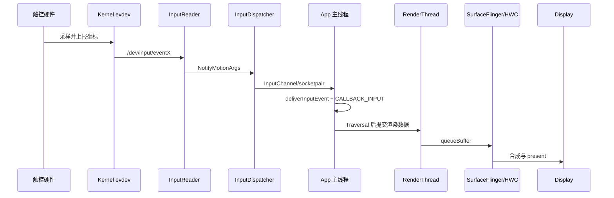
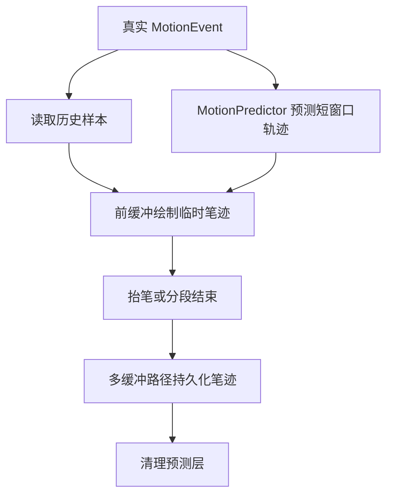

# 3.4 输入延迟与预测输入技术

<!-- outline-start -->
## 要点

### 🔹 输入延迟的分层模型
从触控采样、InputReader、InputDispatcher、App 主线程、Choreographer、RenderThread、SurfaceFlinger 到显示输出，建立同一套延迟口径。

### 🔹 VSync、batching 与重采样
解释输入事件为什么经常贴着 `CALLBACK_INPUT` 消费，以及 batching、unbuffered dispatch、resampling 对跟手性的影响。

### 🔹 MotionPredictor 与轨迹预测
区分 framework `android.view.MotionPredictor`、AndroidX `input-motionprediction` 和系统 Native predictor 的版本边界。

### 🔹 前缓冲与低延迟图形
说明 `GLFrontBufferedRenderer`、`CanvasFrontBufferedRenderer`、`LowLatencyCanvasView` 适合的局部绘制场景和撕裂风险。

### 🔹 Perfetto 输入延迟量化
用 `android.input` 标准库表拆出 dispatch、handling、ack、total、end-to-end 五类延迟。

### 🔹 调度、提频与硬件采样策略
把 Input Boost、CPU 调度、触控采样率、ARR 等因素放进同一条分析路径，避免只盯 App 代码。

## 扩展

### 🔸 Android 16/17 延迟反馈方向
ADPF 输入反馈、HWC actual present 时间线、动态报点率等内容，当前按待验证方向记录。

### 🔸 面向手写笔应用的工程取舍
预测、前缓冲、unbuffered dispatch 和最终多缓冲提交如何组合。

<!-- outline-end -->

## 为什么单独讲输入延迟

§3.1 已经拆过 Input 事件从硬件到 View 树的分发路径，§3.2 也讲过触摸响应的常见瓶颈。本节换一个角度：把一次输入从“手指位置变化”到“像素显示变化”的时间拆成可度量的阶段，再讨论系统提供的降延迟手段。

这件事的难点不在概念，而在口径。InputDispatcher 的 `total_latency_dur` 只能说明事件派发到 ACK 的耗时；Frame Timeline 说明一帧是否按时 present；手写笔应用关心的则是笔尖和墨迹之间的距离。三者都叫输入延迟，但测到的不是同一段时间。

分析跟手性时，先统一口径，后面才谈得上优化。

## 输入延迟的分层模型

一次触摸到显示，大致经过七段：



[已验证: 官方文档, source.android.com/docs/core/interaction/input] [交叉引用: §3.1 Input 事件分发全流程]

这条路径可以按责任主体拆成四类延迟：

| 阶段 | 主要对象 | 常见观察点 | 典型问题 |
| --- | --- | --- | --- |
| 采样延迟 | 触控 IC、驱动、evdev | `getevent`、InputReader 时间戳 | 采样率低、驱动上报抖动、坐标滤波过重 |
| 系统分发延迟 | EventHub、InputReader、InputDispatcher、InputChannel | `iq/oq/wq`、`dispatch_latency_dur`、`ack_latency_dur` | system_server 调度不及时、目标窗口连接拥塞、ACK 回写慢 |
| App 处理延迟 | `ViewRootImpl`、View 树、业务代码、Choreographer | `deliverInputEvent`、`CALLBACK_INPUT`、主线程状态 | 主线程 I/O、Binder 同步调用、复杂手势分发、过深 View 层级 |
| 显示延迟 | RenderThread、GPU、SurfaceFlinger、HWC、Panel | Frame Timeline、`queueBuffer`、present fence | GPU 忙、BufferQueue 积压、SF 合成超时、刷新率切换 |

这张表用于把问题分段。`wq` 堆积时，不要直接说“渲染慢”；Frame Timeline 红了，也不能反推 InputDispatcher 一定慢。每个指标只覆盖自己那段。

### 一帧预算里的输入位置

在 App 侧，输入事件并不是随到随画。普通 MOVE 事件经常先被 batching 到队列里，等下一次 `Choreographer#doFrame` 的输入阶段统一消费。android-16.0.0_r1 中的回调顺序仍是：

1. `CALLBACK_INPUT`
2. `CALLBACK_ANIMATION`
3. `CALLBACK_INSETS_ANIMATION`
4. `CALLBACK_TRAVERSAL`
5. `CALLBACK_COMMIT`

[已验证: AOSP android-16.0.0_r1, frameworks/base/core/java/android/view/Choreographer.java] [交叉引用: §2.4 Choreographer 与渲染流水线]

这个顺序给了输入最高的帧内优先级，但也带来一个固定约束：如果输入处理本身吃掉太多时间，后面的动画和 traversal 会被压缩。反过来，如果主线程在 VSync 前已经被长任务占住，输入事件即使已经到达 App，也要等主线程空出来。

## VSync、batching 与重采样

输入和显示的频率通常不一样。触控采样可以是 120Hz、240Hz、480Hz，显示刷新可能是 60Hz、90Hz、120Hz；App 的渲染帧率又可能低于屏幕刷新率。Android 用 batching 和重采样把这些节奏接到一起。

### Batching 解决吞吐问题

高采样率触摸屏在一个 VSync 周期内可能产生多个 MOVE 样本。系统把这些样本合并到同一个 `MotionEvent`，当前坐标通过 `getX()` / `getY()` 读取，历史采样通过 `getHistoricalX()` / `getHistoricalY()` 读取。

这段代码用于保留笔迹类应用的历史轨迹，而不是只画最新点：

```kotlin
fun appendSamples(event: MotionEvent, out: MutableList<PointF>) {
    for (i in 0 until event.historySize) {
        out += PointF(event.getHistoricalX(0, i), event.getHistoricalY(0, i))
    }
    out += PointF(event.getX(0), event.getY(0))
}
```

代码只处理第一个 pointer，真实多指场景要按 `pointerCount` 展开。它表达的判断是：batching 没有丢掉中间点，App 是否使用这些点，取决于自己的输入处理逻辑。

[已验证: 官方文档, developer.android.com/reference/android/view/MotionEvent] [交叉引用: §3.2 触摸响应的性能分析]

### 重采样解决时序贴合问题

Batching 处理“点太多”的问题，重采样处理“点和帧时间不齐”的问题。App 进程里的 `InputConsumer` 会根据目标 frame time，在最近的真实采样点之间插值，或者在没有未来点时做短窗口外推。这样当前帧拿到的坐标更接近这帧要显示的时刻。

当前公开材料可确认的边界：

- Android Native 层存在 `frameworks/native/libs/input/Resampler.cpp` 与 `InputConsumer.cpp` 路径。
- API 35+ 可通过 `MotionEvent.PointerCoords.isResampled()` 识别重采样坐标。
- 低版本没有稳定公开 API 判断某个坐标是否来自重采样。

[已验证: AOSP android-16.0.0_r1, frameworks/native/libs/input/InputConsumer.cpp + frameworks/native/libs/input/Resampler.cpp] [已验证: 官方文档, developer.android.com/reference/android/view/MotionEvent]

这也是 `requestUnbufferedDispatch()` 要谨慎使用的原因。它能让 MOVE 更早送到 App，但会减少系统 batching 和重采样带来的平滑处理。手写、签名、白板这类场景值得尝试；普通列表滑动通常先保留默认策略。

## MotionPredictor：用预测缩短感知距离

预测输入不会让系统更早收到真实事件；它在真实事件到达前估算下一小段轨迹，提前把视觉反馈画出来。它主要服务手写笔、绘图、签名这类连续轨迹场景。

### 三层能力边界

| 能力 | 入口 | 版本边界 | 适用场景 |
| --- | --- | --- | --- |
| Framework API | `android.view.MotionPredictor` | API 34+ | 系统提供预测能力时，App 直接调用 framework API |
| AndroidX 封装 | `androidx.input:input-motionprediction` | release notes 显示新版本会在系统 API 可用时优先使用系统 API | 需要兼容不同 Android 版本的手写/绘图应用 |
| Native predictor | AOSP input 侧模型实现 | android-16.0.0_r1 可见 TFLite 模型加载路径 | 系统内部能力，App 只通过公开 API 间接使用 |

[已验证: 官方文档, developer.android.com/reference/android/view/MotionPredictor] [已验证: 官方文档, developer.android.com/jetpack/androidx/releases/input] [已验证: AOSP android-16.0.0_r1, frameworks/native/libs/input]

android-16.0.0_r1 可见的 Native 实现里，`TfLiteMotionPredictorModel` 会从 system 或 vendor 目录加载模型，公开材料能确认它面向 stylus source 的可用性检查。TCN 架构、NPU 加速、固定 30ms 预测窗口、非 stylus 全量支持这些说法，当前不写成已验证结论。

### Framework API 的使用方式

Framework API 的示意代码如下，调用顺序是：先记录真实事件，再按目标时间预测。真实项目还要处理多 pointer、取消、抬笔和预测失败返回。

```kotlin
@RequiresApi(34)
fun onStylusEvent(context: Context, event: MotionEvent, targetTimeNanos: Long) {
    val predictor = MotionPredictor(context)
    if (!predictor.isPredictionAvailable(event.deviceId, event.source)) {
        drawRealEvent(event)
        return
    }

    predictor.record(event)
    val predicted = predictor.predict(targetTimeNanos)
    drawPredictedEvent(predicted)
}
```

这段代码不能直接代表完整的手写引擎。生产实现通常会复用 predictor 实例，按 pointer stream 管理生命周期，并在真实样本到达后修正预测笔迹。预测点要在渲染层做来源标记，避免把预测结果当成不可回滚的真实输入。

[已验证: 官方文档, developer.android.com/reference/android/view/MotionPredictor]

### 预测的代价

预测会换来三类成本：

- **轨迹修正成本**：真实样本到达后，预测点可能偏离，需要擦除或覆盖。
- **形变风险**：快速转向、停笔、手掌误触会让短窗口预测变差。
- **工程复杂度**：渲染层要区分真实笔迹和预测笔迹，抬笔后要把内容提交到稳定缓冲。

因此，MotionPredictor 适合“误差可被下一帧修正”的场景。按钮点击、普通列表滑动、页面跳转不该依赖它解决响应问题。

## 前缓冲与低延迟图形

传统多缓冲路径要等 App 渲染、buffer swap、SurfaceFlinger 合成和显示刷新。对整屏 UI 来说，这套路径安全、稳定；对手写笔迹来说，它会让墨迹落后于笔尖。

前缓冲渲染的思路是把小范围增量直接画到当前显示使用的缓冲上，绕过部分 buffer 交换等待。Jetpack graphics 库提供了几层入口：

- `GLFrontBufferedRenderer`：适合 OpenGL 自定义渲染，通常用于笔迹增量层和多缓冲持久层组合。
- `CanvasFrontBufferedRenderer`：适合使用 Canvas 绘制的低延迟局部内容。
- `LowLatencyCanvasView`：更高层封装，内部管理 SurfaceView 和低延迟绘制路径。

[已验证: 官方文档, developer.android.com/jetpack/androidx/releases/graphics] [已验证: 官方文档, developer.android.com/develop/ui/views/touch-and-input/stylus-input/advanced-stylus-features]

### 适合与不适合

| 场景 | 是否适合前缓冲 | 原因 |
| --- | --- | --- |
| 手写笔迹、签名、白板局部线段 | 适合 | 增量区域小，短暂撕裂不容易被感知，低延迟收益明显 |
| 整屏列表滚动 | 不适合 | 更新范围大，容易出现撕裂和层次错位 |
| 普通按钮点击反馈 | 通常不适合 | UI 状态变化要和 View 层级、无障碍、动画系统保持一致 |
| 游戏准星、画笔轨迹 | 视实现而定 | 如果渲染引擎能管理局部增量层，可以尝试 |

前缓冲的工程原则是“双层提交”：移动过程中用前缓冲画临时增量，抬笔或一段轨迹结束后，再用普通多缓冲路径把内容持久化。这样既能降低笔迹跟手延迟，又能避免长期停留在可能撕裂的前缓冲状态。

## Perfetto 输入延迟量化

`android.input` 标准库把输入事件拆成几类延迟字段。它适合回答“慢在哪一段”，而不是替代 UI 上的上下文分析。

| 字段 | 含义 | 诊断方向 |
| --- | --- | --- |
| `dispatch_latency_dur` | InputDispatcher 开始分发到 App 收到事件 | system_server 调度、InputChannel、目标进程唤醒 |
| `handling_latency_dur` | App 收到事件到发出 ACK | App 主线程输入处理、View 分发、同步调用 |
| `ack_latency_dur` | App 发出 ACK 到系统收到 ACK | ACK 回写、线程调度、system_server 负载 |
| `total_latency_dur` | dispatch 到 ACK 的总时长 | 输入分发往返总耗时 |
| `end_to_end_latency_dur` | InputReader 读到事件到关联帧 present | 输入到显示的端到端耗时，依赖 trace 中帧关联信息 |

[已验证: Perfetto stdlib docs, android.input] [交叉引用: §13.8 Perfetto 输入延迟 SQL 深度分析]

这段查询用于找出最慢的输入事件，并拆出各段耗时：

```sql
INCLUDE PERFETTO MODULE android.input;

SELECT
  CAST(dispatch_ts / 1000000.0) AS timestamp_ms,
  process_name,
  thread_name,
  CAST(dispatch_latency_dur / 1000000.0) AS dispatch_ms,
  CAST(handling_latency_dur / 1000000.0) AS handling_ms,
  CAST(ack_latency_dur / 1000000.0) AS ack_ms,
  CAST(total_latency_dur / 1000000.0) AS total_ms,
  CAST(end_to_end_latency_dur / 1000000.0) AS end_to_end_ms,
  input_event_id
FROM android_input_events
WHERE total_latency_dur IS NOT NULL
ORDER BY total_latency_dur DESC
LIMIT 100;
```

结果按下面的顺序判断：

- `dispatch_ms` 高：先看 InputDispatcher 线程、目标进程主线程是否 Runnable 等 CPU、socket 通道是否拥塞。
- `handling_ms` 高：回到 App 主线程，展开 `deliverInputEvent`、`InputResponse` 和同一时间窗的业务 slice。
- `ack_ms` 高：App 处理结束后到系统收到 ACK 中间还有调度或回写延迟，不要把它算成 View 分发耗时。
- `end_to_end_ms` 高：把 Frame Timeline、RenderThread 和 SurfaceFlinger 一起纳入判断。

如果 trace 没有打开 `android.input.inputevent` 或 FrameTimeline，部分字段会为空。空字段不是“没有延迟”，只是这份 trace 没有采到足够数据。

## 调度、提频与硬件采样策略

输入延迟经常被误判成 App 代码问题。App 主线程处理同一段逻辑，在 2.8GHz 大核上可能 1ms 内结束，在低频小核上可能跨过一帧。Perfetto 里要同步看 CPU frequency、thread state 和调度迁移。

### Input Boost 的观察方法

常见设备会在触摸到来后短时间提高 CPU 或 GPU 频率，或者把 UI 相关线程迁移到更合适的核心。策略名称因平台而异，常见叫法包括 Input Boost、Touch Boost。不要把某个 SoC 的具体持续时间或目标频率写成 Android 通用行为。

排查顺序：

1. 在 Perfetto 中定位第一批 `MotionEvent` 或 `deliverInputEvent`。
2. 看同一时间窗的 CPU frequency track，大核频率是否在几毫秒内拉升。
3. 看 App 主线程是否从 Runnable 及时变成 Running。
4. 看 RenderThread 和 SurfaceFlinger 是否也拿到了足够 CPU 时间。

如果输入到来后主线程长时间处于 Runnable 状态，而 CPU 仍在低频，问题更可能出在调度/提频策略，而不是 View 分发本身。

[来源: intake/research-feeds/2026-04-05-15-input-pipeline-latency-breakdown.md] [交叉引用: §5.1 Linux 调度器与线程优先级]

### 触控采样率的边界

高采样率缩短的是“下一次采到手指位置”的等待。120Hz 采样的周期约 8.3ms，240Hz 约 4.16ms，480Hz 约 2.08ms。它不会自动缩短 App 主线程、GPU 和 SurfaceFlinger 的耗时。

对普通滚动来说，采样率高于显示帧率后，收益会被 batching 和渲染节奏限制。对手写笔来说，高采样率仍有价值，因为更多真实点能让轨迹重建和预测更稳。要判断设备营销规格是否转成体验收益，还是看 trace：采样点是否稳定到达、App 是否消费历史点、显示帧是否及时 present。

## Android 16/17 的待验证方向

本节内容来源于外部 review 和近期素材，目前只作为后续研究方向的记录，尚未公开核验的内容不写成确定事实。

- `[待验证] ADPF 输入反馈回路`：外部 review 提到 Android 16 可能把输入线程处理时长纳入性能提示回路，接近截止线时触发更积极的线程迁移或提频。当前缺少可公开引用的 AOSP 调用链，后续应查 `PerformanceHintManager`、inputflinger 与 power HAL 交互。
- `[待验证] HWC actual present 时间线`：外部 review 提到 HWC 4.0 标准化 actual present time，用于软件级量化指尖到像素延迟。当前正文只保留方向，后续应对照 HWC HAL 文档、FrameTimeline 与 present fence 字段。
- `[待验证] 动态高频报点率`：个别 SoC 宣称交互瞬间可提高触控报点率。该能力依赖触控固件、内核驱动和厂商策略，不能写成 Android 通用行为。验证方式是抓原始 evdev / InputReader 事件间隔，而不是引用规格表。

这些方向适合录入后续 Task 14 或 Task 9 深挖，不影响本节已验证主线。

## 面向手写笔应用的组合方案

手写笔低延迟通常需要几层能力组合：



推荐的工程取舍：

- **默认保留 batching 和重采样**：先利用系统默认的时序贴合能力。
- **需要极低延迟时再用 unbuffered dispatch**：只在笔迹进行中开启，结束后恢复普通路径。
- **预测点单独成层**：真实点到达后可修正，不污染持久笔迹。
- **前缓冲只画局部增量**：整屏变化仍走普通渲染路径。
- **用 Perfetto 验证结果**：优化前后对比 `handling_latency_dur`、Frame Timeline、笔迹 layer 的 present 时间。

如果只接入 MotionPredictor，不处理预测点修正，快速转弯时会出现笔迹回弹。如果只接入前缓冲，不控制绘制区域，撕裂会比延迟更容易被用户感知。

## 常见误区

### 误区一：`total_latency_dur` 等于触摸到显示

不等于。`total_latency_dur` 是 dispatch 到 ACK 的往返耗时，主要覆盖 InputDispatcher 与 App 处理。触摸到显示还要加上采样、InputReader、渲染、合成和显示 present。要看端到端，优先找 `end_to_end_latency_dur`，并确认 trace 已采到帧关联。

### 误区二：高采样率一定降低总延迟

高采样率只降低采样等待，并增加可用于轨迹重建的点。App 主线程、GPU、SurfaceFlinger 任何一段跨帧，总延迟都会被放大。普通列表滑动先看主线程和渲染路径，手写笔再重点看采样、历史点、预测和前缓冲。

### 误区三：预测输入适合所有交互

预测输入适合连续轨迹，不适合离散点击。点击按钮的反馈应该靠减少主线程阻塞、提前准备状态和缩短渲染路径，而不是预测“用户可能点哪里”。

### 误区四：前缓冲是通用低延迟方案

前缓冲适合局部、短生命周期的视觉增量。整屏 UI、复杂层级、列表滚动走前缓冲，会带来撕裂、遮挡顺序和状态同步问题。

## 与其他章节的关系

- §3.1 解释输入事件如何到达 App，这里引用分发路径，不重复展开 InputDispatcher 策略。
- §3.2 解释触摸响应分析，这里补充预测、前缓冲和端到端量化。
- §2.3 和 §2.4 解释 VSync 与 Choreographer，这里关注输入事件如何被帧节奏消费。
- §2.5 解释 MainThread / RenderThread 协作，这里把渲染延迟作为输入到显示的一段。
- §13.8 提供更完整的 Perfetto SQL 模板，这里保留输入延迟分析必需的最小查询。

## 参考资料

- Android 官方 Input 文档：`source.android.com/docs/core/interaction/input`
- Android API：`android.view.MotionPredictor`
- AndroidX Input release notes：`developer.android.com/jetpack/androidx/releases/input`
- Android stylus advanced features：`developer.android.com/develop/ui/views/touch-and-input/stylus-input/advanced-stylus-features`
- AndroidX Graphics release notes：`developer.android.com/jetpack/androidx/releases/graphics`
- Perfetto `android.input` 标准库：`perfetto.dev/docs/analysis/sql-tables/android-input`
- AOSP 源码路径：
  - `frameworks/native/services/inputflinger/reader/InputReader.cpp`
  - `frameworks/native/services/inputflinger/dispatcher/InputDispatcher.cpp`
  - `frameworks/native/libs/input/InputConsumer.cpp`
  - `frameworks/native/libs/input/Resampler.cpp`
  - `frameworks/base/core/java/android/view/Choreographer.java`
  - `frameworks/base/core/java/android/view/ViewRootImpl.java`
- 本地研究素材：
  - `intake/research-feeds/2026-04-05-15-input-pipeline-latency-breakdown.md`
  - `intake/research-feeds/2026-04-05-15-motionprediction-low-latency-graphics.md`
  - `intake/research-feeds/2026-04-05-15-perfetto-input-latency-sql.md`
