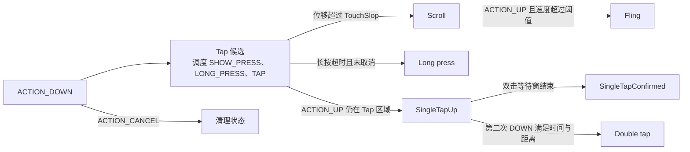

---

title: 手势识别算法与性能优化
chapter: '3.5'
section: '3.5'
status: finalized
task2b_state: fixed
task6_state: reviewed
task9_state: reviewed
pipeline_stage: ready-to-publish
applicable_versions: "Android 10 (API 29) - Android 17 (API 37)"
version_notes: "DEFAULT_STRATEGY_BY_AXIS 仅 Android 14+ (API 34+) 可用"
confidence: medium
last_verified: "2026-07-05"
last_verified_against: "AOSP android-17.0.0_r1 View/GestureDetector/VelocityTracker paths"
sources:
- type: aosp
  path: frameworks/base/core/java/android/view/VelocityTracker.java
- type: aosp
  path: frameworks/native/libs/input/VelocityTracker.cpp
- type: aosp
  path: frameworks/base/core/java/android/view/GestureDetector.java
- type: aosp
  path: frameworks/base/core/java/android/view/ViewConfiguration.java
- type: aosp
  path: frameworks/base/core/java/android/view/ViewGroup.java
- type: aosp
  path: frameworks/base/core/res/res/values/config.xml
- type: androidx
  path: frameworks/support/core/core/src/main/java/androidx/core/widget/NestedScrollView.java
tags:
- android
- performance
- input
- gesture
- velocitytracker
- gesturedetector
- nestedscroll
related_chapters:
- '3.1'
- '3.2'
- '3.3'
- '2.4'

---

# 3.5 手势识别算法与性能优化

## 为什么要了解手势识别算法

“滑动不跟手”和“松手后没有惯性滚动”不一定伴随掉帧。触摸序列可能已经按时到达主线程，但在手势判定阶段被错误解释：

- 位移尚未超过 TouchSlop，控件继续把它当作点击候选；
- 父容器过早拦截，子控件收到 `ACTION_CANCEL`；
- 速度样本或 pointer id 使用错误，Fling 速度偏小；
- `ACTION_MOVE` 回调中有分配、日志或业务计算，主线程没有及时处理下一批输入。

排查时要分开确认“事件何时到达”“谁拿到事件”“事件被识别成什么”“识别后如何驱动滚动”。平台源码锚点是 Android 17 / API 37 / `android-17.0.0_r1`；涉及触控驱动边界时，内核锚点是 `android17-6.18-2026-06_r6`。

## VelocityTracker：从采样点得到速度

`VelocityTracker` 收集 `MotionEvent` 的时间、坐标和 pointer id，按需计算各指针在指定轴上的速度。`GestureDetector`、`RecyclerView` 以及许多自定义拖拽控件都依赖它判断 Fling。

### 生命周期与多指语义

典型用法是从 `ACTION_DOWN` 开始收集，在需要速度时计算，并在手势结束后回收：

```java
private VelocityTracker velocityTracker;

@Override
public boolean onTouchEvent(MotionEvent event) {
    switch (event.getActionMasked()) {
        case MotionEvent.ACTION_DOWN:
            velocityTracker = VelocityTracker.obtain();
            velocityTracker.addMovement(event);
            return true;

        case MotionEvent.ACTION_MOVE:
            velocityTracker.addMovement(event);
            updateDrag(event);
            return true;

        case MotionEvent.ACTION_UP:
            velocityTracker.addMovement(event);
            velocityTracker.computeCurrentVelocity(
                    1000,
                    ViewConfiguration.get(getContext()).getScaledMaximumFlingVelocity());
            int pointerId = event.getPointerId(event.getActionIndex());
            float velocityX = velocityTracker.getXVelocity(pointerId);
            float velocityY = velocityTracker.getYVelocity(pointerId);
            finishGesture(velocityX, velocityY);
            velocityTracker.recycle();
            velocityTracker = null;
            return true;

        case MotionEvent.ACTION_CANCEL:
            velocityTracker.recycle();
            velocityTracker = null;
            return true;
    }
    return false;
}
```

这段代码有三个约束：

1. `addMovement()` 负责加入样本，`computeCurrentVelocity()` 才生成供 getter 读取的速度；加入一个 `ACTION_MOVE` 不等于每次都要重新计算速度。
2. `getXVelocity(id)`、`getYVelocity(id)` 的参数是 pointer id，不是 `MotionEvent` 中随指针增减而变化的 index。
3. 一个 `VelocityTracker` 可以同时记录多个 pointer id。源码中的对象池容量为 2，只表示最多缓存两个默认策略实例，不能据此推导“多指需要多个 tracker”。

Android 17 的 Java wrapper 将默认策略实例放进 `Pools.SynchronizedPool<VelocityTracker>(2)`。只有使用默认策略创建的实例会在 `recycle()` 时清空并回到池中；显式策略实例不会进入这个池。业务代码应成对调用 `obtain()` 和 `recycle()`，但不必围绕“池是否命中”设计手势算法。

### Java、JNI 与 native 策略

拟合计算位于 `frameworks/native/libs/input/VelocityTracker.cpp`。Android 17 的默认轴级策略如下：

```cpp
static const std::map<int32_t, VelocityTracker::Strategy>
        DEFAULT_STRATEGY_BY_AXIS = {
            {AMOTION_EVENT_AXIS_X, VelocityTracker::Strategy::LSQ2},
            {AMOTION_EVENT_AXIS_Y, VelocityTracker::Strategy::LSQ2},
            {AMOTION_EVENT_AXIS_SCROLL, VelocityTracker::Strategy::IMPULSE},
        };
```

触摸屏的 X/Y 是位置轴，默认使用二阶最小二乘拟合 `LSQ2`；`AXIS_SCROLL` 是差分轴，默认使用 `IMPULSE`。`configureStrategy()` 还明确禁止差分轴采用调用方覆盖的策略。Java 层虽然保留 `obtain(int)`、`obtain(String)` 等隐藏入口，但它们用于系统调试、测试和算法比较，普通 SDK 应用使用公开的 `obtain()`。

native 收样逻辑还包含几项影响诊断的细节：

- `ACTION_DOWN` 会先清空旧状态，再加入 X/Y 样本；
- `ACTION_MOVE` 会遍历历史批次和当前批次，并为每个 pointer id 加入 X/Y；
- 标记为 resampled 的样本会跳过，避免预测出来的坐标反过来污染速度拟合；
- `ACTION_UP` 和普通 `ACTION_POINTER_UP` 不重复加入抬手位置，以保留末次有效移动的速度；
- 同一指针超过 40 ms 没有新移动样本时，下一次采样会按“指针已经停下”处理并重建策略状态；
- `getComputedVelocity()` 最终按 `units / 1000` 缩放，并限制在 `[-maxVelocity, maxVelocity]`。

Android 14（API 34）起，公开 API 增加了 `isAxisSupported()` 与 `getAxisVelocity()`，`AXIS_SCROLL` 也进入公开可跟踪范围。版本迭代可以概括为：

| 平台版本 | 默认策略模型 |
|---|---|
| Android 10–11 | 全局默认策略为 `lsq2` |
| Android 12–13 | `Strategy::DEFAULT` 仍映射到全局 LSQ2 |
| Android 14–17 | 轴级策略表：X/Y 使用 LSQ2，SCROLL 使用 IMPULSE |

这张表用于解释版本差异，当前行为仍以 `android-17.0.0_r1` 为准。排查前应先确认输入源和轴，鼠标滚轮或旋钮的 `AXIS_SCROLL` 不能直接套用触摸屏 X/Y 的结论。

### 怎样测量 VelocityTracker 的开销

AOSP 没有为 `addMovement()` 或 `computeCurrentVelocity()` 承诺固定耗时，也不能从对象池推导“整条路径零分配”。处理器、编译状态、样本数、策略和调试代码都会改变结果。

Perfetto 通常只会显示包含它的上层主线程调用。若要判断自定义识别器是否算得过勤，可以在受控构建中围绕待测代码加 `Trace.beginSection()` / `Trace.endSection()`，并同时采集：

- 主线程调度与 `android.view` trace；
- `FrameTimeline` 和应用帧；
- ART allocation profiling 与运行时/GC 轨道，用于确认 Java/Kotlin 分配路径和停顿；若怀疑 JNI 一侧，再单独采 native allocation profile；
- 输入事件或自定义埋点中的 `eventTime`、处理开始时间。

`computeCurrentVelocity()` 的源码注释明确称其相对昂贵，应在需要读取速度时调用。只在 `ACTION_UP` 计算适合简单 Fling；如果产品需要在拖动过程中根据速度切换状态，也可以在 `ACTION_MOVE` 计算，但应限定触发条件并用轨迹确认它是否构成热点。

## GestureDetector：由事件序列驱动的状态机

`GestureDetector` 在内部持有 `VelocityTracker`、Handler 消息和一组状态位。单个事件只会推进状态；识别器会持续判断当前触摸序列还符合哪些候选条件。



这张图是阅读源码的索引，不代表每个回调互斥。例如双击监听器启用后，第一次抬手仍可能先触发 `onSingleTapUp()`，之后才得到 `onDoubleTap()` 或 `onSingleTapConfirmed()`。

### DOWN、MOVE、UP 分别做什么

Android 17 的 `GestureDetector.onTouchEvent()` 在进入 `switch` 前就把事件加入内部 `VelocityTracker`。各阶段的关键行为是：

- `ACTION_DOWN`：保存 down 事件和焦点坐标，进入 tap region，安排 show-press、long-press 和双击确认相关消息，并调用 `onDown()`。
- `ACTION_MOVE`：以多指焦点的位移与 TouchSlop 比较。越界后取消 tap/long-press 候选并调用 `onScroll()`；后续移动只要焦点变化至少 1 像素即可继续产生 scroll 回调。
- `ACTION_POINTER_UP`：计算各指针的速度。如果离开的指针与剩余指针速度向量点积为负，会清空 tracker，避免相反方向的多指运动生成错误 Fling。
- `ACTION_UP`：按双击、长按、单击候选、Fling 的优先顺序收尾；Fling 分支会计算速度并与最小速度阈值比较。
- `ACTION_CANCEL`：取消消息、回收事件与 tracker，并清理所有状态位。

`onDown()` 的返回值很重要。控件应从 `DOWN` 起接受整个触摸序列；等到 `MOVE` 才开始返回 `true`，常会导致后续事件没有按预期交给识别器。

### 双击：立即抬手与延迟确认

启用 `OnDoubleTapListener` 后，需要区分三组回调：

- `onSingleTapUp()`：第一次点击在 tap region 内抬手时立即调用，适合即时视觉反馈；
- `onSingleTapConfirmed()`：等待双击时间窗后仍没有合格的第二次点击，才确认单击；
- `onDoubleTap()` / `onDoubleTapEvent()`：第二次 `DOWN` 被识别为双击后调用，后者还会收到这次点击的后续事件。

`isConsideredDoubleTap()` 同时检查：

1. 第一次点击是否一直处于较大的 double-tap touch region；
2. 第二次 `DOWN` 与第一次 `UP` 的间隔是否落在 `doubleTapMinTime` 到 `doubleTapTimeout` 之间；
3. 两次 `DOWN` 的距离平方是否小于 `doubleTapSlopSquare`。

Android 17 的 framework fallback 是最短 40 ms、最长 300 ms，但运行时可从资源取得配置值。业务逻辑不要自行复制这些数字，应交给 `GestureDetector` 或从对应配置 API 获取。

### 长按：默认 400 ms，运行时可调整

Android 17 的 `ViewConfiguration.DEFAULT_LONG_PRESS_TIMEOUT` 是 400 ms。`GestureDetector` 按：

```java
mHandler.sendMessageAtTime(
        longPressMessage,
        mCurrentDownEvent.getDownTime() + getLongPressTimeoutMillis());
```

来调度长按。`ViewConfiguration.getLongPressTimeout()` 会读取 `Settings.Secure.LONG_PRESS_TIMEOUT`，启用新的按 context API 时则由实例取得设置值。因此“所有 Android 设备固定 400 ms”同样不准确，400 ms 只是当前平台默认值。

移动越过 TouchSlop、进入 scroll、收到额外 pointer down 或 `ACTION_CANCEL` 都可能取消长按。Android 17 还会处理 `MotionEvent.CLASSIFICATION_AMBIGUOUS_GESTURE`：在仍有长按候选时按配置倍率放大 slop，并延后长按；`CLASSIFICATION_DEEP_PRESS` 则可立即触发长按。这些分类来自输入路径，应用不应根据压力值再造一套互相冲突的规则。

长按等待本身不会占用主线程。性能问题通常出现在 `onLongPress()` 回调，例如同步解码资源、访问磁盘或构建复杂弹窗。给回调添加应用 trace，可以直接观察其执行时间。

## View 手势冲突：先确认事件流属于谁

### DOWN 命中目标，后续事件沿目标链分发

`ViewGroup.dispatchTouchEvent()` 在 `ACTION_DOWN` 时清理上一个手势的状态并为本次触摸寻找子 View。命中的子 View 会保存为 `TouchTarget`。后续 `MOVE`、`UP` 通常沿已建立的目标链分发，不会每次从头对整棵 View 树做命中测试。

父 `ViewGroup` 仍有机会在后续事件调用 `onInterceptTouchEvent()`。一旦从“不拦截”变为“拦截”，原子目标会收到 `ACTION_CANCEL`，之后的事件交给父容器。诊断冲突时，应把同一序列的 `DOWN → MOVE → CANCEL/UP` 连起来看，只看某一个 `MOVE` 很容易误判。

### 横向父容器与纵向子容器

Android 没有通用的“谁先超过 TouchSlop 谁获胜”规则，胜负取决于父容器的 `onInterceptTouchEvent()`、子控件是否消费以及嵌套滑动协议。对于横向父容器，可以从 `DOWN` 保存初始坐标，等位移超过阈值且水平方向占优后再拦截：

```java
private float initialX;
private float initialY;
private boolean draggingHorizontally;
private final int touchSlop =
        ViewConfiguration.get(getContext()).getScaledTouchSlop();

@Override
public boolean onInterceptTouchEvent(MotionEvent event) {
    switch (event.getActionMasked()) {
        case MotionEvent.ACTION_DOWN:
            initialX = event.getX();
            initialY = event.getY();
            draggingHorizontally = false;
            return false;

        case MotionEvent.ACTION_MOVE:
            float dx = Math.abs(event.getX() - initialX);
            float dy = Math.abs(event.getY() - initialY);
            if (dx > touchSlop && dx > dy) {
                draggingHorizontally = true;
                return true;
            }
            return false;

        case MotionEvent.ACTION_UP:
        case MotionEvent.ACTION_CANCEL:
            draggingHorizontally = false;
            return false;
    }
    return draggingHorizontally;
}
```

这是仲裁骨架，不是可直接替换所有容器的控件实现。多指切换、RTL、角度滞回、子控件能否继续沿该方向滚动，都要按产品语义补充。父容器决定拦截后，必须能处理随后到来的事件；子控件也必须正确清理 `ACTION_CANCEL`。

### requestDisallowInterceptTouchEvent 的边界

子 View 可以调用：

```java
parent.requestDisallowInterceptTouchEvent(true);
```

Android 17 的 `ViewGroup` 会设置 `FLAG_DISALLOW_INTERCEPT` 并把请求逐级传给祖先。在该标志有效时，祖先跳过 `onInterceptTouchEvent()`；新的 `ACTION_DOWN`、手势结束或取消会在 `resetTouchState()` 中清除标志。

它有三个边界：

- 这是对祖先 View 拦截的请求，不会绕过系统导航手势、窗口级输入策略或应用外的输入消费者；
- 它不会缩短已有的事件分发路径，也不会自动解决横纵方向判断；
- 不要在每个 `MOVE` 无条件重复调用。状态没有变化时 `ViewGroup` 会提前返回，但更清楚的做法是在手势所有权变化时调用一次，并在需要交还父容器时传 `false`。

### Nested Scrolling：按消费距离协作

嵌套滑动让子容器与祖先按滚动距离协作，典型顺序是：

1. 手势开始时，子 View 通过 `startNestedScroll(axes, type)` 寻找愿意参与的父级；
2. 子 View 消费前调用 `dispatchNestedPreScroll()`，父级先取走一部分距离；
3. 子 View 消费剩余距离；
4. 子 View 用 `dispatchNestedScroll()` 报告已消费和未消费距离，父级还可以处理余量；
5. 手势或惯性滚动结束时调用 `stopNestedScroll(type)`。

```java
int[] parentConsumed = new int[2];
if (dispatchNestedPreScroll(dx, dy, parentConsumed, null, type)) {
    dx -= parentConsumed[0];
    dy -= parentConsumed[1];
}

int consumedY = scrollSelfBy(dy);
int unconsumedY = dy - consumedY;
dispatchNestedScroll(
        0, consumedY,
        0, unconsumedY,
        null, type);
```

示例只说明距离如何分配；生产代码通常复用数组，还要处理 window offset、轴、touch/non-touch 类型和对应的 Parent 接口。嵌套回调并不天然昂贵。只有 Trace 显示某个 parent 回调或反复布局、绘制占用主线程时，才应把它列为性能问题。

## TouchSlop 与 Fling 阈值

### TouchSlop 是配置值，不应作为业务常量

Android 17 的 `ViewConfiguration` 保留 `TOUCH_SLOP = 8`，但注释明确说明它只为没有合适 context 的旧代码兜底。正常应用通过：

```java
int touchSlop =
        ViewConfiguration.get(context).getScaledTouchSlop();
```

取得像素值。构造 `ViewConfiguration` 时，framework 从 `config_viewConfigurationTouchSlop` 资源读取像素尺寸；设备可用资源 overlay 校准它。

| 层次 | Android 17 中的含义 |
|---|---|
| `TOUCH_SLOP = 8` | 已弃用静态 API 使用的 dp fallback |
| `config_viewConfigurationTouchSlop` | framework 默认资源，可被设备 overlay 覆盖 |
| `getScaledTouchSlop()` | 按当前 context 和配置得到的像素值 |

TouchSlop 过大，会让拖动启动显得迟钝；过小，会把手指抖动误识别为拖动。调整自定义控件时还要区分“从 `DOWN` 的总位移”和“相邻两个 `MOVE` 的增量”：判定是否开始拖动通常使用前者，否则许多小增量永远无法越过阈值。

### 最小速度决定是否 Fling，最大速度用于限幅

Android 17 仍保留 50 dp/s 和 8000 dp/s 两个 fallback 常量。带 context 的运行时阈值来自 `config_viewMinFlingVelocity` 与 `config_viewMaxFlingVelocity`，`getScaledMinimumFlingVelocity()` / `getScaledMaximumFlingVelocity()` 返回像素每秒。

调用时要让单位一致：

```java
ViewConfiguration configuration = ViewConfiguration.get(context);
velocityTracker.computeCurrentVelocity(
        1000,
        configuration.getScaledMaximumFlingVelocity());

float velocityY = velocityTracker.getYVelocity(pointerId);
if (Math.abs(velocityY)
        >= configuration.getScaledMinimumFlingVelocity()) {
    startFling(velocityY);
}
```

Android 14（API 34）增加了带 `inputDeviceId`、`axis`、`source` 的最小/最大 Fling 速度 API。输入设备或轴组合无效时，最小值返回 `Integer.MAX_VALUE`，最大值返回 `Integer.MIN_VALUE`，表示该组合不支持 Fling。跟踪旋钮的 `AXIS_SCROLL` 时，还需把轴值转换成像素每秒，再与对应阈值比较。触摸屏 X/Y 代码不要机械复用到滚轮和旋钮。

## 自定义识别器的性能与正确性陷阱

### 1. 在 ACTION_MOVE 中制造短命对象

下面的写法每个 `MOVE` 都创建 `PointF`：

```java
case MotionEvent.ACTION_MOVE:
    PointF delta = new PointF(
            event.getX() - lastX,
            event.getY() - lastY);
    updateDrag(delta);
    break;
```

高频路径可以直接使用局部 `float`，或复用确有必要的容器：

```java
case MotionEvent.ACTION_MOVE:
    float dx = event.getX() - lastX;
    float dy = event.getY() - lastY;
    updateDrag(dx, dy);
    lastX = event.getX();
    lastY = event.getY();
    break;
```

不要只凭代码形态断言它一定触发 GC。应根据分配分析或运行时 trace 确认对象数量和停顿，再决定是否修改。

### 2. 把所有识别工作塞进每个 MOVE

常见热点包括同步日志、复杂几何计算、遍历业务列表、频繁 `computeCurrentVelocity()`，以及在回调里触发布局。处理策略是先减少无效工作：

- 未超过 TouchSlop 前，只维护识别所需的少量状态；
- 手势方向确定后，避免每帧重新执行同一套昂贵判定；
- 速度只在决策需要时计算；
- 可合并的视觉状态交给下一帧更新，不在输入回调里反复请求布局；
- 慢操作移出主线程，但触摸状态本身仍要按顺序在 UI 线程更新。

设备可能把多个采样点批量放进一个 `MotionEvent` 的 history。需要高保真轨迹时应读取历史样本；只读当前坐标会丢掉中间点，但也不应为了“补点”自行插值后再送进 `VelocityTracker`。

### 3. 误解 View 层级的成本

层级和节点数量会影响 `ACTION_DOWN` 的命中测试，也会增加父子分发、拦截和回调的机会；后续事件通常复用 `TouchTarget`。因此，不能用固定层数判断输入一定慢，也不能假设每个 `MOVE` 都重新遍历整棵树。

优化前应在 Trace 中找到具体的慢函数：

- `onInterceptTouchEvent()` 或 `onTouchEvent()` 中的业务代码；
- 手势回调触发的 `requestLayout()`、同步 inflate 或数据绑定；
- 嵌套滑动 parent 的预消费和余量处理；
- `ACTION_CANCEL` 后双方重复启动、停止动画。

减少无意义的容器仍有价值，但这属于 UI 结构优化，不能作为手势卡顿的通用处方。

## 厂商触控增强：先定位发生在哪一层

边缘抑制、手掌识别、湿手处理、游戏触控参数等能力可能位于触控 IC 固件、内核驱动、InputReader 配置、系统服务或应用内。AOSP 没有规定统一的边缘宽度、游戏 TouchSlop 或报点频率，不能把某个设备的测量结果写成 Android 平台行为。

可以按以下证据缩小范围：

1. 同一设备上，所有应用都出现相同的原始坐标缺口，优先检查固件、驱动和设备配置；
2. `getevent` 已出现样本，但 framework/app 没收到，检查 InputReader、窗口路由和输入消费者；
3. App 收到连续 `MotionEvent`，只有某个控件改变了轨迹或阈值，检查控件识别器；
4. 只在系统导航边缘发生冲突，结合第 3.3、3.4 节检查系统手势与监控通道。

内核锚点 `android17-6.18-2026-06_r6` 只能说明通用输入子系统的版本边界。没有具体设备的驱动、固件和 overlay 源码时，不对厂商算法细节下结论。

## Compose：命中链、三阶段传播与消费

Compose 在 Android 上仍从 `MotionEvent` 接收平台输入，但手势 API 使用 `PointerEvent` / `PointerInputChange`，并通过 `Modifier.pointerInput()` 中的挂起函数组织识别过程：

```kotlin
Modifier.pointerInput(Unit) {
    detectDragGestures { change, dragAmount ->
        change.consume()
        updateOffset(dragAmount)
    }
}
```

优先使用 `clickable`、`scrollable`、`draggable`、`transformable` 等高层组件或 modifier。它们同时处理语义、焦点、可访问性、视觉反馈和事件消费。只有交互无法由现有 detector 表达时，再下沉到 `awaitEachGesture`、`awaitFirstDown`、`awaitTouchSlopOrCancellation` 等原始 API。

Compose 对新 pointer 的第一个事件做命中测试，形成可接收 pointer input 的节点链；同一 pointer 的后续事件沿这条链传播。每个事件经过三个 pass：

| Pass | 方向 | 常见用途 |
|---|---|---|
| `Initial` | 父到子 | 父级预先观察或拦截式处理 |
| `Main` | 子到父 | 默认阶段，子节点通常先消费 |
| `Final` | 父到子 | 根据前面阶段的消费结果收尾 |

`consume()` 会标记 change 已消费，但不会停止事件继续传播；其他 handler 必须检查 `isConsumed` 并决定是否退出。这个语义不同于 View 中父容器拦截后给子 View 发 `ACTION_CANCEL`，迁移手势代码时不要逐行翻译。

平台事件会适配成 Compose 内部结构，但这项转换不一定是性能瓶颈。Compose 手势卡顿仍应结合指针处理器的执行时间、状态写入引起的重组、布局/绘制，以及帧时间线判断。

## 排查清单

遇到滑动、双击或 Fling 异常时，按以下顺序收集证据：

1. 记录完整的 action、pointer id/index、`downTime`、`eventTime`、坐标、source 和 axis；
2. 确认序列最终是 `UP` 还是 `CANCEL`，以及哪个父容器改变了拦截决定；
3. 打印运行时 `scaledTouchSlop`、最小/最大 Fling 速度，不用源码 fallback 替代设备值；
4. 核对 `VelocityTracker` 是否从 `DOWN` 开始收样、是否在 getter 前 compute、是否按 pointer id 取值；
5. 用 trace 标出自定义回调，确认耗时来自识别、业务处理还是识别后的布局与绘制；
6. 跨设备差异要同时保存设备 overlay、输入设备信息和复现轨迹，再讨论厂商调校。

## 源码与文档

- AOSP `android-17.0.0_r1`：[VelocityTracker.java](https://cs.android.com/android/platform/superproject/+/android-17.0.0_r1:frameworks/base/core/java/android/view/VelocityTracker.java)
- AOSP `android-17.0.0_r1`：[VelocityTracker.cpp](https://cs.android.com/android/platform/superproject/+/android-17.0.0_r1:frameworks/native/libs/input/VelocityTracker.cpp)
- AOSP `android-17.0.0_r1`：[GestureDetector.java](https://cs.android.com/android/platform/superproject/+/android-17.0.0_r1:frameworks/base/core/java/android/view/GestureDetector.java)
- AOSP `android-17.0.0_r1`：[ViewConfiguration.java](https://cs.android.com/android/platform/superproject/+/android-17.0.0_r1:frameworks/base/core/java/android/view/ViewConfiguration.java)
- AOSP `android-17.0.0_r1`：[ViewGroup.java](https://cs.android.com/android/platform/superproject/+/android-17.0.0_r1:frameworks/base/core/java/android/view/ViewGroup.java)
- Android common kernel `android17-6.18-2026-06_r6`：[tag tree](https://android.googlesource.com/kernel/common/+/refs/tags/android17-6.18-2026-06_r6/)
- Android Developers：[ViewConfiguration API reference](https://developer.android.com/reference/android/view/ViewConfiguration)
- Android Developers：[Understand gestures in Compose](https://developer.android.com/develop/ui/compose/touch-input/pointer-input/understand-gestures)
- Perfetto：[Profiling memory usage and allocations](https://perfetto.dev/docs/quickstart/heap-profiling)
