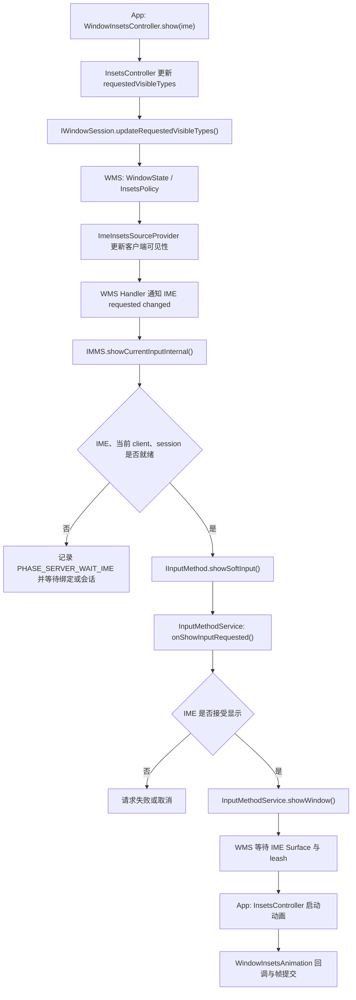

# InputMethodManager 与软键盘性能

软键盘的显示会跨越应用、`system_server` 和输入法（IME）三个进程，还要等待输入法窗口具备可参与动画的 Surface 图层。`showSoftInput()` 的调用耗时几乎不包含用户等待的区间；只看应用主线程，也可能漏掉输入法冷启动、会话创建和窗口控制权延迟。

源码基线为 Android 17、API 37、`android-17.0.0_r1`。分析时要分开以下四个边界：

1. 显示请求从应用到达 IME 的路径；
2. `startInput`、IME 绑定和窗口显示的独立状态；
3. 应用布局与 `WindowInsetsAnimation` 影响帧时间的位置；
4. ImeTracker、`dumpsys input_method` 和 Perfetto 各自能定位哪些等待阶段。

这里的“冷”“热”描述状态，不预设固定时延。IME 实现、设备性能、进程驻留、词库初始化和当前系统负载都会改变结果，性能结论应来自同一设备、同一构建和同一输入法上的分位数数据。

## 1. 先分清三件事

### 1.1 输入连接、显示请求与屏幕可见是三个事件

一个可编辑 View 同时获得 View 焦点和窗口焦点后，`InputMethodManager` 才能把它登记为当前服务目标（served view），也就是当前允许与输入法建立连接的 View，并为它建立或重启输入连接。输入法侧的生命周期回调与这个过程对应：

- `onStartInput(EditorInfo, restarting)`：新的编辑器开始输入，或现有输入连接被重启；
- `onStartInputView(EditorInfo, restarting)`：当前输入视图将显示，并准备接收该编辑器的输入；
- `onFinishInputView(finishingInput)`：当前输入视图结束；
- `onFinishInput()`：当前输入会话结束。

`showSoftInput()` 只表达“希望显示当前 IME”。如果输入连接已经存在，显示一个暂时隐藏的 IME 可以直接进入 `onShowInputRequested()` 和 `showWindow()`，不必再次调用 `onStartInput()`。排查重复初始化时，应确认初始化代码位于哪个生命周期回调。

### 1.2 API 返回值只说明请求有没有被接纳

Android 17 的 `InputMethodManager.showSoftInput(view, flags)` 要求：

- `view` 是当前服务目标；
- `view` 自身有焦点；
- 它所在的窗口也有焦点；
- 当前没有需要保留控制权的用户驱动 IME 动画，预测返回正在隐藏 IME 的特殊情况除外。

返回 `true` 表示请求已进入后续处理，不表示输入法已经显示。带 `ResultReceiver` 的重载在 API 36 已弃用，因为回调同样不能可靠代表屏幕上的最终状态。`hideSoftInputFromWindow()` 对目标版本为 API 36 及以上的应用还有兼容行为：即使最终状态没有改变也会返回 `true`。显示和隐藏都应通过 `WindowInsets.Type.ime()` 的可见性确认；WindowInsets 表示系统窗口占用的区域及其可见状态。

Android 16 起，`SHOW_IMPLICIT`、`SHOW_FORCED`、`HIDE_IMPLICIT_ONLY` 和 `HIDE_NOT_ALWAYS` 不再影响平台处理。Android 17 应传 `0`，或直接使用 `WindowInsetsController.show()`、`hide()`。

### 1.3 “动画开始”仍早于“用户看到完整键盘”

应用收到 `WindowInsetsAnimation.Callback.onStart()`，说明客户端已经取得 Insets 动画控制并进入动画阶段。它不等于 IME 第一帧已经提交，也不等于显示屏已经扫描出像素。时间终点应按测量目标选择：

| 目标 | 建议终点 | 能回答的问题 |
|---|---|---|
| API 行为正确 | `WindowInsets.isVisible(Type.ime())` | 最终 Insets 状态是否可见 |
| 请求停在哪一层 | ImeTracker 的最终阶段（phase） | 客户端、服务端、IME 或窗口控制阶段是否等待 |
| 应用过渡是否流畅 | 应用 FrameTimeline 与主线程轨迹区段 | 应用是否错过帧截止时间 |
| IME 自身是否流畅 | IME 进程 FrameTimeline 与 RenderThread | 输入法窗口是否掉帧 |
| 用户端到端感知 | 屏幕录制或高速摄像 | 从操作到可见像素的总时间 |

## 2. Android 17 的显示主链路

Android 17 中，应用侧显隐请求以 Insets 为主线。`showSoftInput()` 在完成当前服务目标检查后，也会转交当前 `ViewRootImpl` 的 `InsetsController`。下文把 WindowManagerService 简称为 WMS，把 InputMethodManagerService 简称为 IMMS。下面的流程图用于标出请求进入 WMS、等待输入法以及取得动画控制权的分界点。



这条路径有三个容易漏看的边界。图中的 leash 是 WMS 下发的 SurfaceControl 动画控制柄；应用借助它变换输入法图层，但不会直接取得输入法窗口的 Surface。

第一，`InsetsController` 通过 `IWindowSession.updateRequestedVisibleTypes()` 把请求可见的 Insets 类型交给 WMS。WMS 更新目标窗口的状态后，`ImeInsetsSourceProvider` 再把输入法可见性请求的变化通知 IMMS。将现代路径概括为“应用直接通过 Binder 调用 IMMS”会漏掉 WMS 的状态机。

第二，IMMS 的 `showCurrentInputLocked()` 只有在以下对象同时存在时才调用 IME：

- `InputMethodBindingController.getCurIme()` 非空；
- 当前客户端非空；
- 当前客户端的 `mCurSession` 非空。

条件不足时，ImeTracker 进入 `PHASE_SERVER_WAIT_IME`，请求令牌（token）会被保留，待绑定或会话就绪后继续。条件齐备时才进入 `PHASE_SERVER_HAS_IME`，再由 `performShowIme()` 调用 `IInputMethodInvoker.showSoftInput()`。

第三，输入法接受显示并执行 `showWindow()` 后，应用也不一定立刻开始动画。WMS 的 `ImeInsetsSourceProvider` 需要等输入法 Surface 已绘制、Insets 几何信息可用，并且能把带 leash 的控制权交给目标窗口。没有控制对象，或控制对象中没有 leash 时，客户端 `InsetsSourceConsumer` 会继续把输入法 Insets 源当作不可见处理。

Android 17 已没有独立的 `ImeInsetsSourceConsumer.java`。IME 特殊分支位于通用的 `InsetsSourceConsumer` 和 `InsetsController` 中；旧类名只适合描述早期版本，不能用来解释 `android-17.0.0_r1` 的当前实现。

## 3. 冷启动、绑定和会话等待

### 3.1 用状态划分冷热路径

“冷启动 300 ms”这类脱离环境的数字缺少可比性。应先记录请求时的状态：

| 状态 | Android 17 证据 | 后续工作 |
|---|---|---|
| 显示热路径 | `mCurIme`、当前客户端、`mCurSession` 均存在 | IMMS 可直接向输入法发送显示请求 |
| 服务已连接、会话未就绪 | `mCurIme` 存在，`mCurSession` 为空 | 等待会话创建和客户端绑定 |
| 正在绑定 | `mMainConnection` 存在，`mCurIme` 为空 | 等待 `onServiceConnected()`、输入法初始化和会话创建 |
| 未绑定 | `mCurToken`、`mMainConnection` 为空 | 绑定服务，必要时启动输入法进程 |
| 绑定疑似卡住 | 绑定已发出但长时间没有 `mCurIme` | Android 17 在 3 秒阈值后重连主连接 |

`TIME_TO_RECONNECT_MS = 3000` 是框架判断“绑定长期没有连上”的恢复阈值，不能当作正常冷启动预算。性能报表中应把触发重连的样本单独列为异常。

### 3.2 可见绑定会提高 IME 的进程重要性

`InputMethodBindingController` 使用多组服务绑定连接：

- 主连接（main connection）负责维持输入法接口；具体绑定标志受 `lowerImeOomImportance` 开关影响；
- 可见连接（visible connection）在输入法要显示时增加，包含 `BIND_TREAT_LIKE_ACTIVITY`、`BIND_FOREGROUND_SERVICE`、`BIND_INCLUDE_CAPABILITIES` 和 `BIND_SHOWING_UI`；
- Android 17 还为特定多用户和工作资料场景准备后台连接（background connection）。

这套设计说明“已绑定”和“正在显示”具有不同的进程重要性。它不能推出统一的冷、热耗时，也不能证明某个输入法一定常驻。进程是否仍在、资源是否已加载、会话是否可复用，都需要根据现场数据判断。

### 3.3 启动抑制配置不代表隔离进程

AOSP `android-17.0.0_r1` 的下面这项资源用于控制“非文本编辑器获得焦点时是否抑制输入法启动”，默认值为 `false`：

```xml
<bool name="config_preventImeStartupUnlessTextEditor">false</bool>
```

这个资源允许设备厂商通过资源覆盖（OEM overlay）改为 `true`。启用后，IMMS 可在当前焦点没有落在文本编辑器时避免启动输入法，并为配置中的输入法或应用保留例外。它控制“何时启动输入法”，与输入法是否运行在隔离进程（isolated process）没有直接关系。

`AutofillSuggestionsController` 在输入法尚未连接时可暂存行内建议（inline suggestions）请求，并在主连接的 `onServiceConnected()` 后继续处理。源码能证明请求被延后，不能单凭这一点声称它减少了多少次冷启动或节省了多少毫秒。

## 4. 应用侧如何可靠显示和确认 IME

Activity 刚创建时，View 焦点和窗口焦点可能尚未同时成立。以下 AndroidX 写法会把显示请求交给窗口的 Insets 控制器：

```kotlin
editText.requestFocus()
WindowCompat.getInsetsController(window, editText)
    .show(WindowInsetsCompat.Type.ime())
```

这段代码负责提出显示请求。业务若依赖最终状态，还要监听 Insets：

```kotlin
ViewCompat.setOnApplyWindowInsetsListener(root) { _, insets ->
    val imeVisible = insets.isVisible(WindowInsetsCompat.Type.ime())
    val imeBottom = insets.getInsets(WindowInsetsCompat.Type.ime()).bottom

    renderImeState(visible = imeVisible, bottomInset = imeBottom)
    insets
}
```

监听器可能在布局和动画期间多次收到回调。`renderImeState()` 应先比较新旧值，避免相同状态重复触发数据刷新、导航或布局参数写入。

如果必须使用 `InputMethodManager`，等窗口获得焦点后再提交请求：

```kotlin
override fun onWindowFocusChanged(hasWindowFocus: Boolean) {
    super.onWindowFocusChanged(hasWindowFocus)
    if (!hasWindowFocus) return

    editText.requestFocus()
    editText.post {
        getSystemService(InputMethodManager::class.java)
            .showSoftInput(editText, 0)
    }
}
```

`post` 的作用是把调用排到 View 所在线程，并让当前服务目标状态有机会完成更新。它仍需满足当前窗口和 View 的焦点条件。

## 5. Insets 动画与帧时间

### 5.1 回调在哪个帧阶段执行

`ViewRootInsetsControllerHost.postInsetsAnimationCallback()` 把任务提交到 `Choreographer.CALLBACK_INSETS_ANIMATION`。注册 `WindowInsetsAnimation.Callback` 后，应用可收到：

- `onPrepare()`：布局切到结束状态前保存起始几何信息；
- `onStart()`：Insets 已应用，可记录结束几何信息；
- `onProgress()`：动画每帧更新；
- `onEnd()`：动画结束，清理临时变换。

Android 17 的 `InsetsController` 为同步 IME 动画定义了 285 ms，为无应用动画回调的 IME 动画定义了 200 ms。这些值只描述 `android-17.0.0_r1` 的实现，不能当作应用延迟目标；设备定制、交互式控制、动画取消和后续版本都可能采用不同路径。

### 5.2 `onProgress()` 中适合做什么

判断 Insets 动画是否引起卡顿时，可检查以下事项：

- 每帧只读取已准备好的值并写入轻量属性，例如 `translation`；
- 不在回调中加载数据、解析资源、访问磁盘或同步等待锁；
- 避免每帧创建临时集合、修改复杂 `LayoutParams` 或触发整棵层级重新测量；
- 需要跟随键盘滚动时，先在 `onPrepare()`、`onStart()` 保存起止位置，再在 `onProgress()` 应用差值；
- 用自定义轨迹区段包住回调，确认耗时位于应用代码还是系统调度。

用于标记应用回调成本的最小示例如下：

```kotlin
override fun onProgress(
    insets: WindowInsets,
    runningAnimations: MutableList<WindowInsetsAnimation>
): WindowInsets {
    Trace.beginSection("AppImeInsetsProgress")
    return try {
        applyPreparedTranslation(insets)
        insets
    } finally {
        Trace.endSection()
    }
}
```

Perfetto 中这段轨迹区段的耗时只代表应用回调。若它很短但仍掉帧，还要继续检查同一帧的界面遍历（traversal）、RenderThread、输入法进程和 SurfaceFlinger。

### 5.3 `adjustResize`、`adjustPan` 与 `adjustNothing`

| 模式 | 平台行为 | 性能检查重点 |
|---|---|---|
| `adjustResize` | 缩小窗口可用区域，使内容在输入法上方重新布局 | 测量与布局范围、滚动容器和每帧布局成本 |
| `adjustPan` | 平移窗口以尽量保持输入目标可见 | 平移后的交互与可见区域是否符合产品要求 |
| `adjustNothing` | 平台不为输入法调整窗口内容 | 应用是否正确处理 Insets、滚动焦点并处理动画 |

模式名称不能直接换算成耗时。一个浅层 View 布局使用 `adjustResize` 可能很稳定，一个手动处理 Insets 的复杂页面也可能每帧反复布局。应先满足可访问性和焦点可见性，再用 FrameTimeline 与界面遍历轨迹区段验证。

Android 15 起，目标 SDK 35 及以上的应用默认使用内容延伸到系统栏边缘（edge-to-edge）的布局；在 Android 17 上也应按这一边界处理系统栏和输入法 Insets。Edge-to-edge 不会取消输入法 Insets，应用仍需避免内容被键盘遮挡。为兼容旧系统和 AndroidX 的 Insets 分发，Views 页面通常仍会配置 `adjustResize`。

Compose 的 `WindowInsets.ime`、`imePadding()` 和 Insets 消费语义属于 AndroidX Compose UI。它们的重组与测量行为取决于应用使用的 AndroidX 版本，不能用 `frameworks/base` 的 Android 17 标签证明。排查时记录 Compose BOM 与库版本，并缩小读取动态 Insets 的可组合函数（composable）范围。

## 6. 自定义 IME 的性能边界

自定义输入法要把“服务可用”“输入会话可用”和“首帧可见”分别优化。

### 6.1 服务与输入会话

- `InputMethodService.onCreate()` 只初始化服务级必需对象，词库、网络、皮肤和非当前语言资源按需加载；
- `onStartInput()` 可能因编辑器切换频繁执行，不要在这里同步打开大文件或等待模型初始化；
- 通过 `restarting` 和 `EditorInfo` 判断能否复用输入引擎状态；
- 输入连接建立前所需的最小资源优先，其余工作放到后台线程，并设计可取消任务，避免焦点已切走仍在占用 CPU。

### 6.2 输入视图与候选栏

- 首次创建输入视图时先提供可绘制的最小 UI，再补齐非关键资源；
- 候选结果高频变化时合并过时任务，只提交最新序列；
- 列表差异（Diff）计算可以离开主线程，View 变更仍回到主线程；
- 控制候选项中的图片解码、字体加载和对象分配；
- 分别跟踪输入法主线程、RenderThread 和 Binder 线程，避免把应用侧空闲误判成系统等待。

系统的可见连接会在显示期间提高输入法的绑定重要性，但不会替输入法缩短初始化路径。首帧优化仍取决于输入法自身的服务和渲染实现。

## 7. 用 ImeTracker 定位请求停点

Android 17 的 ImeTracker 为同一次显示或隐藏请求分配令牌，并跨客户端、`system_server` 和输入法记录阶段。令牌用来关联同一请求在多个进程中的记录，阶段则表示请求当前走到哪一步。常用显示阶段包括：

| 阶段 | 说明 |
|---|---|
| `PHASE_CLIENT_VIEW_SERVED` | 请求 View 已通过当前服务目标检查 |
| `PHASE_CLIENT_INSETS_CONTROLLER_DISPATCH` | 请求已交给客户端 `InsetsController` |
| `PHASE_CLIENT_REPORT_REQUESTED_VISIBLE_TYPES` | 客户端准备上报请求可见的 Insets 类型 |
| `PHASE_SERVER_UPDATE_REQUESTED_VISIBLE_TYPES` | WMS 已接收窗口请求 |
| `PHASE_SERVER_UPDATE_CLIENT_VISIBILITY` | 输入法 Insets 源的客户端可见性更新 |
| `PHASE_SERVER_WAIT_IME` | 输入法接口、客户端或会话尚未齐备 |
| `PHASE_SERVER_HAS_IME` | IMMS 可以向输入法发请求 |
| `PHASE_IME_SHOW_SOFT_INPUT` | 输入法封装层正在处理显示请求 |
| `PHASE_IME_ON_SHOW_SOFT_INPUT_TRUE` | `onShowInputRequested()` 接受显示 |
| `PHASE_IME_SHOW_WINDOW` | 输入法进入 `showWindow()` |
| `PHASE_SERVER_GET_CONTROL_WITH_LEASH` | WMS 可下发带 leash 的控制对象 |
| `PHASE_CLIENT_ON_CONTROLS_CHANGED` | 应用客户端收到 Insets 控制对象 |
| `PHASE_CLIENT_ANIMATION_RUNNING` | 客户端动画运行中 |
| `PHASE_CLIENT_ANIMATION_FINISHED_SHOW` | 显示动画完成 |

ImeTracker 历史记录会给出请求类型、状态、持续时间、最终阶段和请求窗口。可按以下位置判断：

- 停在 `CLIENT_VIEW_SERVED` 之前：检查 View 焦点、窗口焦点、当前服务目标和调用时机；
- 长时间停在 `SERVER_WAIT_IME`：检查进程启动、服务绑定、会话创建和输入法崩溃；
- 已到 `IME_SHOW_WINDOW`，迟迟拿不到控制对象：检查输入法 Surface、窗口布局和 WMS 的 leash 条件；
- 已到 `CLIENT_ANIMATION_RUNNING`：把注意力移到应用、IME 和 SurfaceFlinger 的帧调度；
- 状态为 `FAIL`、`CANCEL` 或 `TIMEOUT`：先读最终阶段和原因（reason），不要只看“键盘没出来”的表象。

## 8. `dumpsys input_method` 应该看哪些字段

先保存问题发生后的完整状态：

```bash
adb shell dumpsys input_method > input_method.txt
```

Android 17 的输出包括：

- `mStartInputHistory`：最近的输入启动记录；
- `mSoftInputShowHideHistory`：显隐原因、请求窗口、输入法目标等历史；
- `mImeTrackerService#History`：显示和隐藏请求及最终阶段；
- `mBindingController`：`mSelectedImeId`、`mCurImeId`、主连接、可见连接、`mCurIme`、显示屏与窗口可见性；
- `mCurClient`、`mImeBindingState`、`mEnabledSession`；
- `mVisibilityStateComputer` 中的 `mInputShown` 和最终输入法目标；
- 当前输入客户端与当前输入法的异步转储。

`mMainConnection` 非空只代表绑定已创建或正在绑定，`mCurIme` 非空才说明 `onServiceConnected()` 已提供可调用接口。`mEnabledSession` 或客户端的当前会话用于判断输入会话是否就绪。

`mCurRootView` 属于应用进程中的 `InputMethodManager`，可能出现在 IMMS 触发的客户端异步转储中；IMMS 在 `system_server` 内维护的核心状态不包含这个字段。阅读转储时要保留缩进和进程来源，否则容易把客户端焦点状态归到服务端。

## 9. IME 状态跟踪与 Perfetto

### 9.1 捕获 IME 状态转移

Android 17 支持以下命令：

```bash
adb shell cmd input_method tracing start
# 复现一次问题
adb shell cmd input_method tracing stop
```

命令会通知 IMMS、当前客户端和输入法更新状态跟踪开关。它适合查看输入相关状态转移；CPU 调度、帧截止时间和 Surface 合成仍要由 Perfetto 补充。

### 9.2 Perfetto 中的进程与轨迹区段

录制时至少覆盖应用、`system_server`、输入法、RenderThread 和 SurfaceFlinger，并启用与调度、Binder、View、WindowManager、图形和 FrameTimeline 相关的数据源。Android 17 源码中可直接搜索的轨迹区段包括：

- `IMMS.showCurrentInputInternal`
- `IMMS.hideCurrentInputInternal`
- `InputMethodBindingController.bindIme`
- `IMMS.onServiceConnected`
- `IC.showRequestFromApi`
- `IC.showRequestFromApiToImeReady`

FrameTimeline 的帧异常类型（jank type）用于描述错过截止时间（missed deadline）、高延迟（high latency）、缓冲区持续排队（buffer stuffing）等结果，不包含 `LAYOUT` 或 `MEASURE`。要判断布局是否拖慢一帧，应展开应用主线程的界面遍历、测量和布局轨迹区段，再与该帧的截止时间对齐。

输入法和应用通常是两个独立 Surface。一次过渡中可能出现四种不同结论：

1. 应用帧稳定，输入法窗口掉帧；
2. 输入法帧稳定，应用因 Insets 回调掉帧；
3. 两边提交都及时，SurfaceFlinger 或 GPU 未按时合成；
4. 动画前已经在绑定、会话或 leash 阶段等待。

只有把 ImeTracker 的阶段和 FrameTimeline 的帧结果放在同一时间轴上，才能区分“显示得晚”和“动画不流畅”。

## 10. 可复现的测量方法

一次有效的 IME 性能实验应记录以下条件：

- Android 构建与 `ro.build.fingerprint`；
- 设备型号、刷新率和电源、温控状态；
- 输入法包名、版本、子类型（subtype）和主题；
- 应用版本、目标 SDK、View 或 Compose 及对应 AndroidX 版本；
- 第一次显示、进程驻留、服务已连接、会话已就绪等起始状态；
- 是否外接硬件键盘，是否启用无障碍服务；
- 至少记录 P50、P90、P95 分位数和异常样本，而非单次结果。

一次显示请求拆成以下区间：

| 区间 | 起点 | 终点 |
|---|---|---|
| 请求接纳 | API 调用 | 当前服务目标检查或 Insets 分发 |
| 服务端路由 | 上报请求的可见类型 | `SERVER_HAS_IME` 或 `SERVER_WAIT_IME` |
| 输入法准备 | `SERVER_HAS_IME` | `IME_SHOW_WINDOW` |
| 窗口就绪 | `IME_SHOW_WINDOW` | `SERVER_GET_CONTROL_WITH_LEASH` |
| 动画 | `CLIENT_ON_CONTROLS_CHANGED` | `CLIENT_ANIMATION_FINISHED_SHOW` |
| 用户感知 | 用户操作 | 屏幕上目标像素出现或动画完成 |

冷热样本要分组。若把首次进程启动与已建立会话的样本混在一起，平均值既不能代表常用路径，也无法指导优化。

## 11. 版本边界

- Android 11、API 30 引入可公开使用的 `WindowInsetsAnimation` 协同能力，是后续输入法动画分析的历史起点；
- Android 12—14 延续 Insets 控制模型，具体修复应按对应源码标签查证；
- Android 15、API 35 对目标 SDK 35 及以上应用强制 edge-to-edge，输入法 Insets 处理成为页面布局的必要部分；
- Android 16、API 36 起，传统显示和隐藏标志不再生效，带 `ResultReceiver` 的 `showSoftInput()` 重载被弃用；
- Android 17、API 37 的 `android-17.0.0_r1` 使用通用 `InsetsSourceConsumer`，并通过请求可见的 Insets 类型、`ImeInsetsSourceProvider`、IMMS 和 ImeTracker 串起显示路径。

不能用 API 37 后续小版本或 AndroidX 新版本才提供的动画行为解释 `android-17.0.0_r1`。遇到平台季度版本、厂商修改或 Compose 行为时，应切换到对应源码与依赖版本复核。

## 12. 源码索引

- [`InputMethodManager.java`](https://android.googlesource.com/platform/frameworks/base/+/refs/tags/android-17.0.0_r1/core/java/android/view/inputmethod/InputMethodManager.java)
- [`InsetsController.java`](https://android.googlesource.com/platform/frameworks/base/+/refs/tags/android-17.0.0_r1/core/java/android/view/InsetsController.java)
- [`InsetsSourceConsumer.java`](https://android.googlesource.com/platform/frameworks/base/+/refs/tags/android-17.0.0_r1/core/java/android/view/InsetsSourceConsumer.java)
- [`InputMethodService.java`](https://android.googlesource.com/platform/frameworks/base/+/refs/tags/android-17.0.0_r1/core/java/android/inputmethodservice/InputMethodService.java)
- [`InputMethodManagerService.java`](https://android.googlesource.com/platform/frameworks/base/+/refs/tags/android-17.0.0_r1/services/core/java/com/android/server/inputmethod/InputMethodManagerService.java)
- [`InputMethodBindingController.java`](https://android.googlesource.com/platform/frameworks/base/+/refs/tags/android-17.0.0_r1/services/core/java/com/android/server/inputmethod/InputMethodBindingController.java)
- [`ImeVisibilityStateComputer.java`](https://android.googlesource.com/platform/frameworks/base/+/refs/tags/android-17.0.0_r1/services/core/java/com/android/server/inputmethod/ImeVisibilityStateComputer.java)
- [`ImeInsetsSourceProvider.java`](https://android.googlesource.com/platform/frameworks/base/+/refs/tags/android-17.0.0_r1/services/core/java/com/android/server/wm/ImeInsetsSourceProvider.java)
- [`ImeTracker.java`](https://android.googlesource.com/platform/frameworks/base/+/refs/tags/android-17.0.0_r1/core/java/android/view/inputmethod/ImeTracker.java)
- [`ImeTrackerService.java`](https://android.googlesource.com/platform/frameworks/base/+/refs/tags/android-17.0.0_r1/services/core/java/com/android/server/inputmethod/ImeTrackerService.java)
- [Handle input method visibility](https://developer.android.com/develop/ui/views/touch-and-input/keyboard-input/visibility)
- [Control and animate the software keyboard](https://developer.android.com/develop/ui/views/layout/sw-keyboard)
