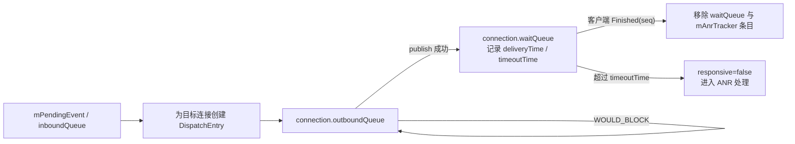

---

title: "InputDispatcher 反压与无响应窗口降级"
chapter: "3.7"
section: "3.7"
status: "finalized"
drafted_date: "2026-05-16"
applicable_versions: "Android 13 (API 33) - Android 17 (API 37)"
confidence: medium
sources:
  - type: aosp
    path: "frameworks/native/services/inputflinger/dispatcher/InputDispatcher.cpp"
  - type: aosp
    path: "frameworks/native/services/inputflinger/docs/anr.md"
  - type: official
    path: "https://developer.android.com/topic/performance/vitals/anr"
  - type: official
    path: "https://developer.android.com/tools/dumpsys"
  - type: obsidian
    path: "DeepResearch/2026-05-10-inputdispatcher-backpressure.md"
  - type: obsidian
    path: "intake/daily-info/2026-05-16.md"
tags: [input, inputdispatcher, anr, latency, backpressure]
related_chapters: ["3.1", "3.2", "3.5", "9.2", "9.3"]
created_by: "task2a-knowledge-gap"
created_date: "2026-05-16"
gap_source: "研究素材/源码结构"
task6_result: "pass-light-edit"
last_task6_audit: "2026-06-12"
last_task6_at: "2026-07-09T20:17:02+08:00"
task2b_result: fixed
last_task2b_at: "2026-06-12"
last_task2b_lite_at: "2026-06-12"
reviewed_date: "2026-06-19"
reviewed_by: "openclaw-task6"
last_task9_audit: "2026-07-09"
last_task9_audit_log: "logs/deep-review/2026-07-09-13-audit.md"
deepseek_cn_review_state: done
last_deepseek_cn_review_at: 2026-07-09
task6_reviewed_date: "2026-06-19"
auto_promoted: true
last_task2b_verifier_at: "2026-07-05T03:26:57+0800"
last_verified: "2026-07-09"
last_verified_against: "AOSP android-17.0.0_r1（主线复核, 2026-07-09）; AOSP android-16.0.0_r1（历史差异参照）"
task9_result: "auto-fixed"
task9_state: "reviewed"
task2b_state: "fixed"
task6_state: "reviewed"
pipeline_stage: "ready-to-publish"
task9_reviewed_by: "openclaw-task9"
task9_reviewed_date: "2026-07-09"
last_task9_at: "2026-07-09T16:30:36+08:00"
last_task9_autofix_at: "2026-07-09"
last_task9_review_log: "logs/deep-review/2026-07-09-16-deep-review.md"
updated_by: "openclaw-task9"
updated_date: "2026-07-09"
p0: 1
p1: 0
p2: 0
task9_review_notes: "2026-05-16 task9 deep-review: pass-tech-review。P0 0 / P1 0 / P2 0；满足 Task6 pass 且 queue 无 pending，自动晋升 finalized。 | 2026-05-24 Task9 闲时抽检：needs-rework。P0 0 / P1 1 / P2 0；applicable_versions 覆盖 Android 10-17，但正文按 Android 16 的 mAnrTracker/processAnrsLocked/shouldPruneInboundQueueLocked/canReceiveForegroundTouches 讲主线，未交代 Android 10-12 的实现差异和 Android 17 未验证边界。 | 2026-05-25 Task9 deep-review: pass-tech-review。P0 0 / P1 0 / P2 0；版本边界已收窄到 Android 13-16，Task6 pass 且 queue 无 pending，自动晋升 finalized。 | 2026-06-12 Task9 deep-review: pass-tech-review。P0 0 / P1 0 / P2 0；源码锚点复核 android-16.0.0_r1，版本边界保持 Android 13-16；Task6 未通过，未自动晋升。 | 2026-06-18 Task9 闲时抽检 auto-fix：P0 0 / P1 1 / P2 0；AOSP android-17.0.0_r1 已发布，修正“Android 17 tag 未发布”的过期版本边界，并标注 no focused window ANR 状态在 Android 17 改为 mNoFocusedWindowAnrState，回到 Task6 复审。 | 2026-06-19 Task9 deep-review: pass-tech-review。P0 0 / P1 0 / P2 0；源码与版本边界复核通过，Task6 已通过且 queue 无 pending，自动晋升 finalized / ready-to-publish；详见 logs/deep-review/2026-06-19-01-deep-review.md。 | 2026-06-22 16 Task9 deep-review: pass-tech-review。P0 0 / P1 0 / P2 0 / P3 0；复核 AOSP android-16.0.0_r1/17.0.0_r1 InputDispatcher.cpp；Android 17 no focused window ANR 状态差异已在版本边界中标注，正文未越过 API 37。 | 2026-07-09 13 Task9 闲时抽检 auto-fix：P0 0 / P1 1 / P2 0；Android 17 基准抽检发现正文仍以 android-16.0.0_r1 为主线，已重锚到 android-17.0.0_r1，并将 no focused window ANR 主线字段改为 mNoFocusedWindowAnrState；回 Task6 复审。 | 2026-07-09 16 Task9 deep-review AUTO-FIX：P0 1 / P1 0 / P2 0；修正 `canReceiveForegroundTouches()` 与 `connection->responsive` 的职责归因；回 Task6 复审。"
verifier_checked: 2026-07-09
---

# 3.7 InputDispatcher 反压与无响应窗口降级

> **版本边界说明**：主线以 AOSP `android-17.0.0_r1` 为准。相关机制分批进入主线：`mAnrTracker` 和 `shouldPruneInboundQueueLocked()` 始于 Android 11，`processConnectionResponsiveLocked()` 始于 Android 12，`canReceiveForegroundTouches()` 始于 Android 13。Android 17 的无焦点窗口 ANR 活跃状态为 `mNoFocusedWindowAnrState`，保存应用、事件 ID、`timeoutDuration`、`timeoutEndTime` 和 ANR 预警标记。Android 16 及更早版本使用 `mAwaitedFocusedApplication` / `mNoFocusedWindowTimeoutTime` 等字段；Android 10 的实现还位于 `services/inputflinger/InputDispatcher.cpp`，ANR 等待走 `mInputTargetWaitCause` / `mInputTargetWaitTimeoutTime` / `onANRLocked()`。排查旧版本时要使用对应标签，不能把 Android 17 的字段名套回旧源码。涉及 CPU 调度或 channel fd 等内核侧证据时，内核锚点为 `android17-6.18-2026-06_r6`。

## 为什么单独看 InputDispatcher 反压

第 3.1 节给出 Input 事件从硬件到应用的完整路径，第 3.2 节讨论触摸响应延迟。这里聚焦 InputDispatcher 内部：事件已经进入 InputDispatcher，目标窗口却没有及时消费时，系统怎样限制积压、判定输入 ANR，并避免无响应窗口拖住新的输入目标。

这类问题在轨迹中容易误判。`waitQueue` 变长只说明事件已经发布到目标连接、尚未收到客户端的 `Finished` 回执；它不能证明应用业务代码已经读到事件，也不能直接等同于主线程 `MessageQueue` 变长。分析时要把 InputDispatcher 队列、App 主线程栈、Binder 事务、CPU 调度和窗口焦点变化放到同一个时间窗口。详见 9.3 节。

## 输入通道的天然反压点

InputDispatcher 到应用的事件数据面使用 `InputChannel`。窗口连接建立时，服务端和客户端各持有一端通道；事件分发阶段，`InputDispatcher::publishMotionEvent()` / `publishKeyEvent()` 经 `InputPublisher` 写入目标连接。事件载荷经通道文件描述符传输，不走 Binder；Binder 主要参与窗口和通道的建立、传递与策略回调。详见 1.17 节与 3.1 节。

AOSP android-17.0.0_r1 的 `InputDispatcher::startDispatchCycleLocked()` 在写入失败时会检查返回码。返回 `WOULD_BLOCK` 时，代码分两种情况处理：

- `waitQueue` 为空却写不进去，源码把它视为异常：channel 理应没有未完成事件却仍不可写。系统调用 `abortBrokenDispatchCycleLocked()`，清空分发队列，把连接标为 `BROKEN`，并异步通知策略层。
- `waitQueue` 非空时，说明已有事件发布成功但仍未收到完成回执，channel 此刻也不可写。InputDispatcher 保留 `outboundQueue` 的队首事件并退出本轮发送，等待客户端推进消费与回执。

这就是输入管道的反压点。它由 channel 的实际写入结果触发，不需要根据主线程状态猜测“App 是否繁忙”。针对该连接的新分发项会积在 `outboundQueue`；如果前面的 pending event 还在等待焦点或策略条件，系统级 `inboundQueue` 也可能增长。两者需要分开观察，不能把某个连接不可写等同于所有输入都停止。

## waitQueue、inboundQueue 与 ANR 计时边界

InputDispatcher 内部有三类队列需要区分：

| 队列 | 含义 | 典型观察结论 |
|------|------|--------------|
| `inboundQueue` | 已进入 InputDispatcher、等待路由和分发的事件 | Dispatcher 忙、策略等待、焦点窗口未就绪，或前序事件阻塞了分发 |
| `outboundQueue` | 已确定目标连接、等待发布到该连接的分发项 | 目标 channel 不可写，或该连接还有尚未发布的事件 |
| `waitQueue` | 已发布到客户端 channel、等待 `Finished` 的分发项 | 完成回路滞后；仍需结合客户端线程状态判断卡在读取前还是处理过程中 |

`startDispatchCycleLocked()` 在尝试 publish 前，以当前时间填写 `deliveryTime`，并根据目标连接的 dispatching timeout 计算 `timeoutTime`。只有 publish 成功，条目才会从 `outboundQueue` 移进 `waitQueue`，响应中的连接也才会把该超时点加入 `mAnrTracker`。客户端回传 `Finished(seq)` 后，`doDispatchCycleFinishedCommand()` 按 `seq` 删除 `waitQueue` 与 tracker 中的对应条目。

因此，连接型 Input ANR 不从事件进入 `inboundQueue` 的时刻计时，也不按 App 主线程消息数量计时。Android Developers 将常见的 input dispatching timeout 概括为 5 秒；Android 17 源码仍按 window/application 的 dispatching timeout 为每个 `DispatchEntry` 固化超时点，所以诊断时应读取实际窗口配置，不能把 5 秒当作所有目标都不可调整的常量。

## 两类 Input ANR 与 Android 17 pre-ANR

InputDispatcher 维护两条不同的 ANR 路径：

1. **分发项已发布但迟迟没有完成**：超时依据来自 `waitQueue` / `mAnrTracker`。
2. **focused application 存在，但需要焦点的事件找不到 focused window**：事件留在 `mPendingEvent`，计时依据来自 `mNoFocusedWindowAnrState`。触摸可以按坐标命中窗口；单凭一次普通触摸不会触发这类 no-focused-window ANR。

Android 17 在功能开关 `mAnrWarningCallbackInputDispatcherEnabled` 开启时，会为第二条路径运行 `processNoFocusedWindowPreAnrLocked()`。剩余时间进入预警窗口后，InputDispatcher 调用策略层的 `notifyPreNoFocusedWindowAnr()`，并用 `notifiedPreAnr` 防止重复通知。pre-ANR 只提供提前诊断信号，不会自行设置 `responsive=false`、显示 ANR 对话框或改变事件路由；完整超时仍由 `processAnrsLocked()` 处理。

## 目标窗口无响应后的连接隔离

`processAnrsLocked()` 读取 `mAnrTracker` 最早到期的 token。超时后，它先把连接的 `responsive` 置为 `false`，再移除 tracker 中该连接的所有唤醒点。`onAnrLocked(connection)` 若发现 `waitQueue` 已经清空就停止上报；否则用队首条目的 delivery wait 生成 reason，通过 `processConnectionUnresponsiveLocked()` 通知策略层，并由 `cancelEventsForAnrLocked()` 为该连接合成取消事件。

隔离不会停止整个输入系统。Android 17 的 `addFocusInputMonitoringTargetsLocked()` 会跳过无响应的 focus input monitor；触摸目标解析中的 `canWindowReceiveMotion()` 也会拒绝向 `responsive=false` 的连接发送新的触摸。`canReceiveForegroundTouches()` 只决定目标能否带 `FOREGROUND` 标记，不负责响应性判断。源码注释还指出，focused events 仍可能继续积压，因此“连接无响应”也不等于该 token 的所有队列立刻清空。

连接恢复也有明确回路。客户端之后返回 `Finished`，对应 `waitQueue` 条目被移除；如果连接此前无响应，`isConnectionResponsive()` 会检查剩余条目是否都未过期。通过检查后，`processConnectionResponsiveLocked()` 通知策略层窗口恢复。这个判断只反映 InputDispatcher 的完成队列已经恢复健康，不代表业务功能也已恢复。

## 跨应用切换时的队列裁剪策略

输入反压影响体验明显的场景之一，是用户不再等待当前 App，转而点击另一个 App 或系统区域。InputDispatcher 对这种情况有专门的裁剪逻辑。

在 no-focused-window 等待期间，如果出现新的 pointer `ACTION_DOWN`，`shouldPruneInboundQueueLocked()` 会命中测试其位置。目标窗口属于另一个 application token，或该位置存在可响应的 spy window 时，InputDispatcher 把这个新事件记录为 `mNextUnblockedEvent`。在队列推进到它之前，key 等 focus-dispatched 事件会按 `DropReason::BLOCKED` 丢弃；pointer-class motion 仍走自己的按坐标分发路径。

这项裁剪不适用于普通的“某连接 `waitQueue` 超时”，也不会清空整个 `inboundQueue`。它专门解除 no-focused-window 路径对新目标的阻塞，触发条件和被丢弃的事件类型都受源码约束。

这也解释了为什么一个应用启动阶段迟迟没有焦点窗口时，用户触摸另一个应用或可响应的 spy window，新的目标仍有机会继续处理输入。

## Perfetto / dumpsys input 的观察入口

观察 InputDispatcher 反压，优先看两个入口。

`adb shell dumpsys input` 能直接看到 Input Dispatcher State。官方 dumpsys 文档展示了 `PendingEvent`、`InboundQueue`、connection、`OutboundQueue` 与 `WaitQueue` 等结构，但示例来自较旧实现，字段名会随版本变化。Android 17 当前源码在每个 connection 上输出 `status`、`isFocusMonitor` 和 `responsive`。现场排查时，至少记录三项：

- `FocusedWindow` / focused application：确认事件应该发给谁，是否处在 no-focused-window 等待。
- 目标 connection 的 `OutboundQueue` / `WaitQueue` 长度和 age：确认事件卡在写入前，还是写入后等 ACK。
- `Input Dispatcher State at time of last ANR`：确认 ANR reason 与当时的队列快照。

Perfetto 侧看 ATRACE counter。AOSP android-17.0.0_r1 里 `traceInboundQueueLengthLocked()` 写 `iq`，`traceOutboundQueueLength()` 写 `oq:<channel>`，`traceWaitQueueLength()` 写 `wq:<channel>`。这些是 counter，不是 slice。`wq` 持续上升说明 ACK 回路被压住；`oq` 上升更接近 channel 写入受限或 waitQueue 未释放；`iq` 上升可能是 dispatcher 前端积压、焦点等待或策略等待。

判读时不要把 `wq` 当成 `MotionEvent` 批处理的直接证据。batching 和重采样要结合客户端 `InputConsumer` / `ViewRootImpl` 时序观察；InputDispatcher 的 `wq` 只说明已发布的分发项没有完成回执。详见 3.2 节。

## 与应用主线程卡顿、Binder 阻塞的归因边界

InputDispatcher 的 `waitQueue` 是症状入口。一个分发项停在其中，只能说明目标进程没有按时返回 `Finished`。常见根因有三类：

1. App 主线程正在执行长任务，没有进入 `NativeInputEventReceiver` 的消费回路。
2. App 主线程被 Binder、锁、I/O、GC 或同步等待卡住，导致已收到的事件无法完成处理。
3. system_server 或目标进程调度异常，InputDispatcher 写入、App 读取、回执返回中的某段被 CPU 饥饿、锁竞争或内核等待拖慢。

建议按以下顺序定位：先用 `dumpsys input` 或 Perfetto counter 确认 `wq/oq/iq` 的卡点；再看同一时间窗口目标 App 主线程的 call stack 和 sched 状态；如果主线程在 Binder 等待，沿 Binder transaction 查对端线程；如果主线程看起来空闲但 `wq` 不退，检查 App 进程是否得到调度、channel 是否 `BROKEN`、窗口是否已移除，以及该条目使用了哪个 window/application dispatching timeout。

主线程长任务是常见原因，却不能覆盖所有输入 ANR；主线程卡顿也未必已经触发 InputDispatcher 超时。InputDispatcher 负责检测与隔离，根因仍要在应用、`system_server`、Binder 对端或内核调度中用同一时间窗的证据确认。

## 扩展场景

这里补充两个常见延伸话题：游戏高频触控和厂商定制行为。相关设备策略不属于统一的 AOSP 行为，需要额外证据。

### 游戏/高频触控场景下的反压放大

硬件宣称的报点率不能直接换算成 InputDispatcher 的队列增长。只有额外样本实际穿过驱动和 InputReader，到达 dispatcher，并且发布速度持续超过客户端完成速度时，`waitQueue` / `outboundQueue` 压力才会增大。客户端 batching 又可能把多个样本放进一个 `MotionEvent` 的 history，因此需要同时核对 `iq/oq/wq`、App 收到的 event/history 数量和 frame timeline，不能只看规格表上的 Hz。

游戏场景还有一个分析边界：公开 Android API 没有提供“提高某个应用的 InputDispatcher 优先级”这样的能力。`View.requestUnbufferedDispatch()` 影响应用侧 MotionEvent batching，不会提升触控 IC 报点率，也不会绕过 InputDispatcher 的 `waitQueue` / ANR 机制。Android 17 的 `View` 源码还明确警告，这个 API 不适合大多数应用，滥用可能增加延迟、造成滚动抖动，并失去系统重采样能力。应在目标设备上测量后再启用。厂商系统可能有游戏模式或触控调度定制；没有公开源码或实机轨迹时，只能标为 OEM 差异。

### 厂商输入调度策略与可验证边界

厂商定制最容易混进不可验证结论。可由 AOSP 确认的边界是：InputDispatcher 使用 `responsive` 隔离无响应连接，用 `mAnrTracker` 管理超时，用 `iq/oq/wq` counter 暴露队列长度，用 `dumpsys input` 暴露连接状态。超出这些边界的说法，需要实机证据支撑。

可接受的证据包括：同一机型开关游戏模式前后的 Perfetto trace、`dumpsys input` 快照、线程优先级/调度策略记录、vendor kernel 或 framework patch。只有产品宣传、论坛描述或单次主观手感，不足以写成章节结论。

## 小结

InputDispatcher 反压由 channel 可写性、`outboundQueue`、`waitQueue`、`mAnrTracker`、`responsive` 标记和 no-focused-window 队列裁剪共同构成。排查时先确认一个边界：`waitQueue` 表示“已发布、未完成”，它是连接型 Input ANR 的计时基础，也是继续追 App 主线程、Binder、CPU 调度和窗口状态的入口。

## References

> `docs/anr.md` 对 queue 和两类 ANR 的解释仍有参考价值，但其“policy 扩展 timeout”一节保留了旧字段 `inputPublisherBlocked`。Android 17 的当前实现使用 `Connection::responsive` 与 `processConnectionResponsiveLocked()`，相关现行行为以同 tag 的 `InputDispatcher.cpp/.h` 为准。

- AOSP `android-17.0.0_r1`：[InputDispatcher.cpp](https://cs.android.com/android/platform/superproject/+/android-17.0.0_r1:frameworks/native/services/inputflinger/dispatcher/InputDispatcher.cpp)
- AOSP `android-17.0.0_r1`：[InputDispatcher.h](https://cs.android.com/android/platform/superproject/+/android-17.0.0_r1:frameworks/native/services/inputflinger/dispatcher/InputDispatcher.h)
- AOSP `android-17.0.0_r1`：[View.java](https://cs.android.com/android/platform/superproject/+/android-17.0.0_r1:frameworks/base/core/java/android/view/View.java)
- AOSP `android-17.0.0_r1`：[ANR detection in InputDispatcher](https://cs.android.com/android/platform/superproject/+/android-17.0.0_r1:frameworks/native/services/inputflinger/docs/anr.md)
- Android common kernel `android17-6.18-2026-06_r6`：[tag tree](https://android.googlesource.com/kernel/common/+/refs/tags/android17-6.18-2026-06_r6/)
- Android Developers: [ANRs](https://developer.android.com/topic/performance/vitals/anr)
- Android Developers: [dumpsys](https://developer.android.com/tools/dumpsys)
