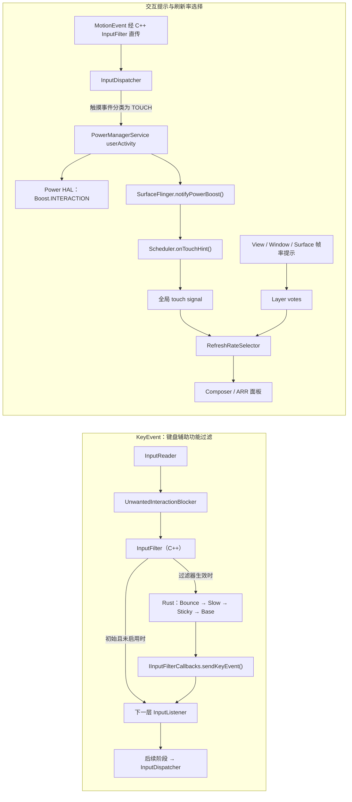

# 3.8 InputFlinger Rust 组件与自适应刷新率协同

## 为什么要把这两个话题放在一起

InputFlinger 的 Rust 组件和自适应刷新率（Adaptive Refresh Rate，ARR）会同时影响“输入后的体验”，但两条代码路径彼此独立：

- Rust 组件位于 InputFlinger 的 `InputFilter` 节点，Android 17 当前实现只过滤 `KeyEvent`，用于 Bounce Keys、Slow Keys 和 Sticky Keys 等辅助功能。
- 触摸产生的 `MotionEvent` 从 C++ `InputFilter` 直接传给下一层。后续的 user activity、`Boost.INTERACTION`、SurfaceFlinger Scheduler 和 Layer 帧率投票共同影响刷新率选择。

先按事件类型分流，可以避免把按键辅助功能的规定延迟误判为 InputDispatcher 堵塞，也能避免在触摸卡顿问题里错误追查 Rust filter。



图里的两条路径会在用户感知上相遇：一次按键可能被 Slow Keys 延后，一次触摸可能促使显示系统选择更高的候选刷新率。代码层面没有“Rust filter 把触摸事件送入 ARR”的调用关系。

## Rust 进入 InputFlinger 的位置

AOSP `android-17.0.0_r1` 的 `InputManager.cpp` 用一段注释给出了 Native listener 管线：

```text
InputReader
  → UnwantedInteractionBlocker
  → InputFilter
  → PointerChoreographer
  → InputProcessor
  → InputDeviceMetricsCollector
  → InteractionReporter
  → InputDispatcher
```

这段顺序用于确认 `InputFilter` 的位置。部分设备未创建 `InteractionReporter`，`InputDeviceMetricsCollector` 也受编译期开关控制，因此诊断时应以目标设备的 dump 和构建配置为准。

`InputManager` 构造时始终创建 `mInputFlingerRust` 和 C++ `InputFilter` wrapper，并把 wrapper 固定插入 listener 管线。事件类型在 wrapper 内分流：

- `notifyKey()` 先查询 Rust 侧 `isEnabled()`；返回 `true` 时转换为 local AIDL `KeyEvent` 并交给 Rust，返回 `false` 时直接通知下一层 listener。
- `notifyMotion()`、`notifySwitch()`、`notifySensor()`、`notifyVibratorState()`、`notifyDeviceReset()` 和 `notifyPointerCaptureChanged()` 都从 C++ 直接传给下一层。
- `notifyInputDevicesChanged()` 始终缓存设备信息并继续向后传递；只有 `isEnabled()` 返回 `true` 时，设备列表才同时交给 Rust filter。

InputReader、PointerChoreographer、InputProcessor 和 InputDispatcher 仍由 C++ 实现。Android 17 的 Rust 代码负责 `InputFilter` 节点内的一组键盘辅助功能过滤器，并未重写整个 InputFlinger。

### 一个容易忽略的启停细节

Rust `InputFilterState` 初始为 `BaseFilter + enabled=false`。只要 Sticky、Slow、Bounce 中任一过滤器被安装，`notifyConfigurationChanged()` 就把 `enabled` 设为 `true`。

Android 17 当前源码在重建“全部关闭”的配置时没有显式执行 `state.enabled = false`。因此需要区分两个场景：

1. 进程启动后从未启用过这些过滤器：`isEnabled()` 为 `false`，按键从 C++ wrapper 直接传给下一层。
2. 至少启用过一次，随后全部关闭：filter chain 会重建为只含 `BaseFilter`，过滤语义等价于透传；`enabled` 仍可能保持 `true`，按键会多走一次 local AIDL / Rust `BaseFilter` / callback。

第二种行为来自 `android-17.0.0_r1` 的当前实现，不应当被应用或测试依赖。对功能诊断而言，“全部关闭后没有 Bounce、Slow、Sticky 语义”才是稳定结论。

## C++ 与 Rust 之间没有跨进程 Binder 往返

Rust 入口位于 `services/inputflinger/rust/lib.rs`。启动阶段，C++ 通过 cxxbridge 调用 `create_inputflinger_rust()`；Rust 创建 `IInputFlingerRust` 实现，再通过 bootstrap callback 把强引用交回 C++。后续接口包括：

- `IInputFlingerRust.createInputFilter()`：创建 Rust `InputFilter`。
- `IInputFilter.notifyKey()`：把按键交给 Rust filter chain。
- `IInputFilterCallbacks.sendKeyEvent()`：把过滤后的按键送回 C++ listener。
- `IInputFilterCallbacks.createInputFilterThread()`：为 Slow Keys 创建等待线程。

`IInputFlingerRust.aidl` 和 `IInputFilter.aidl` 都明确标注为 local AIDL interface，处理发生在调用线程。这里借用了 AIDL 生成的类型和接口模型，但没有向另一个进程发起 Binder transaction。普通按键过滤仍位于 InputFlinger listener 调用链内。

Rust 处理完成后的返回路径如下：

```text
Rust BaseFilter::notify_key()
  → IInputFilterCallbacks.sendKeyEvent()
  → C++ InputFilterCallbacks::sendKeyEvent()
  → mNextListener.notifyKey()
  → 后续 InputListener stage
```

这段路径解释了 `BaseFilter` 的职责：它不再修改事件，只负责经回调返回 C++。

## Bounce、Slow、Sticky 的执行顺序

配置变化时，Rust 从 `BaseFilter` 开始依次包上 Sticky、Slow、Bounce。最终最外层先接收事件，因此三个过滤器同时开启时的执行顺序是：

```text
BounceKeysFilter
  → SlowKeysFilter
  → StickyKeysFilter
  → BaseFilter
  → C++ callback
```

对应配置项是 `bounceKeysThresholdNs`、`slowKeysThresholdNs` 和 `stickyKeysEnabled`。三种过滤器的设备条件和事件语义并不相同：

| Filter | 处理对象 | 处理方式 | 延迟影响 |
| --- | --- | --- | --- |
| 防抖键（Bounce Keys） | 支持设备且 `source` 位包含 `Source::KEYBOARD` 的 `KeyEvent` | 记录每台设备末次 UP。若同一 `keyCode` 的下一次 DOWN 落在阈值内，丢弃该 DOWN 及其配对 UP | 不设置定时等待；表现为快速重复按键被抑制 |
| Slow Keys | 支持设备且 `source` 位包含 `Source::KEYBOARD` 的 `KeyEvent` | 首次 DOWN 进入 pending；按住超过阈值才发出。阈值前收到 UP 时，pending DOWN 和这次 UP 都不再向后传递 | 接受的 DOWN 会被有意延后一个配置阈值 |
| Sticky Keys | 受支持的非虚拟字母键盘；源码未额外检查 `Source::KEYBOARD` | 捕获 Alt、Shift、Ctrl、Meta 的 DOWN/UP，UP 时更新 off → latched → locked → off 状态；普通键与锁定类修饰键继续传递，并改写 `metaState` | 没有阈值等待；影响修饰键状态与传递内容 |

Bounce 和 Slow 的受支持设备集合是：

- 非虚拟设备；
- `keyboardType != None`；
- 外接设备，或内部 `Alphabetic` 键盘。

外接的非字母键盘也可能生效，例如来源为 `KEYBOARD | DPAD` 的电视遥控器。内部非字母键盘、虚拟键盘不在集合内。事件还必须带有 `Source::KEYBOARD` 位。

Sticky 的设备集合更窄，只接收非虚拟 `Alphabetic` 键盘，但没有 Bounce / Slow 的 source 位检查。Alt、Shift、Ctrl、Meta 这类瞬时修饰键的 DOWN 和配对 UP 都被捕获；状态在 UP 时切换。Caps Lock、Num Lock、Scroll Lock、普通字符键等继续向后传递，事件的 `metaState` 会合并 Sticky 保存的修饰状态。普通非修饰键的 UP 会清除未锁定的 latch，保留 locked 状态。

### Slow Keys 为什么会出现“按下后没反应”

Slow Keys 收到第一个 DOWN 后会复制事件，并执行三项修改：

1. `downTime += slowKeysThresholdNs`；
2. `eventTime = downTime`；
3. 加上 `POLICY_FLAG_DISABLE_KEY_REPEAT`。

复制后的事件进入 pending 队列。Rust 通过 `InputFilterThread.request_timeout_at_time()` 请求超时回调；C++ 创建名为 `InputFilter` 的 `InputThread`，用 `Looper.sleepUntil()` 和 `wake()` 等待。阈值到达后，DOWN 才进入后续 filter，并记录为 ongoing；后续 UP 会沿用被接受 DOWN 的 `downTime`。

如果 UP 先到，pending DOWN 会被移除，整次短按不会进入 InputDispatcher。这个现象符合 slow keys 的辅助功能定义。其典型特征是 delay 接近配置 threshold，或短按稳定消失；InputDispatcher 堵塞通常还会伴随 dispatch queue、target window 或 App main thread 的异常。

## 触摸事件怎么影响 ARR

触摸事件经过 C++ `InputFilter.notifyMotion()` 直传，到了 InputDispatcher 才进入 user activity 逻辑。`getUserActivityEventType()` 的分类是：

- Key：`USER_ACTIVITY_EVENT_BUTTON`；
- 满足 `MotionEvent::isTouchEvent(source, action)` 的 Motion：`USER_ACTIVITY_EVENT_TOUCH`；
- 其他 Motion：`USER_ACTIVITY_EVENT_OTHER`。

InputDispatcher 不会为每个输入样本都调用 PowerManager。Android 17 默认对每种 user activity 类型设置 100 ms 的最小 poke 间隔；取消事件、禁止 user activity 的目标窗口等情况也会跳过。

PowerManagerService 的 `userActivityNoUpdateLocked()` 在事件时间推进时调用 `setPowerBoostInternal(Boost.INTERACTION, 0)`。这个调用没有按 TOUCH、BUTTON 和 OTHER 再做区分，因此交互加速并非触摸专属信号。Native `setPowerBoost()` 同时执行两件事：

1. 调用 Power HAL 的 `setBoost(Boost.INTERACTION, durationMs)`；
2. 通过 `SurfaceComposerClient::notifyPowerBoost()` 通知 SurfaceFlinger。

SurfaceFlinger 收到 `Boost.INTERACTION` 后调用 `Scheduler.onTouchHint()`。方法名沿用了 touch hint，但它上游承载的是 interaction boost。Scheduler 只有在 `mTouchTimer` 已创建时才重置 timer 和 pacesetter display 的 kernel idle timer；`mTouchTimer` 仅在配置的 timer 时长大于 0 时创建。因此，“发生触摸”不能直接推导出“设备必定切到最高刷新率”。

## RefreshRateSelector 接收两类交互信号

Android 17 的 `RefreshRateSelector` 同时处理两类相关但独立的输入：

### 1. Scheduler 的全局 touch signal

`Scheduler` 的 touch timer 处于 Active 状态时，`makeGlobalSignals()` 产生 `signals.touch=true`。选择器分两段处理：

- 没有任何 `Explicit*` Layer vote 时，早期 touch boost 直接把候选刷新率按降序排列。
- 已有显式投票时，选择器先完成 Layer 评分，再考虑 late touch boost。`ExplicitDefault` 会阻止全局 late touch boost；`ExplicitExact` 和 category vote 也有额外条件。

touch signal 只是排名输入。显示策略范围、Layer vote、候选 mode、设备能力等因素仍然参与决策。

### 2. UI Toolkit 的 `HighHint` category vote

UI Toolkit 可用 `HighHint` category vote 表达应用侧 touch boost。选择器按 UID 检查 Layer：同一 UID 存在 `HighHint` 且不存在 `ExplicitDefault` 时，`isAppTouchBoost` 才可能成立；任一时刻最多把一个应用视为 app touch boost 来源。

`HighHint` 本身不按普通 category vote 计分，它在后面的 touch boost 分支参与决策。游戏若使用 `setFrameRate()` 配合 Default compatibility 给出 `ExplicitDefault`，选择器会保留其明确请求，避免交互提示把帧率强行拉高。

## RefreshRatePolicy 的职责

`RefreshRatePolicy.java` 属于 WindowManager。它读取 `WindowManager.LayoutParams` 中的 preferred display mode、preferred refresh rate、min/max refresh rate，并结合高刷 denylist、包级范围、焦点状态和刷新率切换类型，为 `WindowState` 生成 frame-rate vote 与优先级。

它与 InputFlinger Rust filter 没有上下游关系，也不负责接收 `Boost.INTERACTION`。WindowManager 提交的窗口偏好最终会成为 SurfaceFlinger 看到的 Layer 信息之一。

`DisplayPolicy.onUserActivityEventTouch()` 也不直接选择刷新率。Android 17 的实现只在设备未唤醒时处理默认显示的触摸用户活动：存在 AOD、屏下指纹浮层等休眠界面时，暂时把相关进程标记为 animating，以提高响应性。代码中没有调用 `RefreshRatePolicy`。

排查时可按职责拆成三层：

1. **View / Window / Surface 与 WindowManager**：产生帧率类别、具体帧率、窗口 mode 和范围等偏好。
2. **InputDispatcher / Power / Scheduler**：把符合条件的交互转换为 interaction boost 和全局 touch signal。
3. **SurfaceFlinger / Composer / 面板**：合并 Layer votes 与全局信号，选择候选刷新率，并由硬件完成显示节奏调整。

## 应用如何使用 ARR

Android 官方文档给出的应用可用边界是 Android 15 QPR1 及以上，并且设备实现了所需 HAL。版本满足条件不代表面板支持 ARR，API 36 及以上应先调用 `Display.hasArrSupport()` 查询。

常用入口如下：

- `View.setRequestedFrameRate()`：API 35，可提交具体帧率或 frame-rate category；对 `ViewGroup` 调用时不会自动传给子 View。
- `View.setFrameContentVelocity()`：API 35，面向自定义可滚动组件。平滑滚动或 fling 期间要按每个绘制帧更新，单位为 pixels/second；值在 View 重绘后清零。
- `Window.setFrameRateBoostOnTouchEnabled()`：API 35，控制该 Window 是否允许 touch boost。关闭它可能损害触摸响应，应只在有证据的问题场景中使用。
- `Window.setFrameRatePowerSavingsBalanced()`：API 35，控制该 Window 是否采用兼顾功耗的帧率策略。
- `Display.hasArrSupport()`：API 36，查询显示设备是否支持 ARR。
- `Display.getSuggestedFrameRate(int)`：API 36，按 `Normal` / `High` 类别取得显示设备建议的帧率。
- `Display.getSupportedRefreshRates()`：Android 16 起返回显示设备支持的 render rates；Android 15 及更早版本的语义只覆盖默认 modes 的刷新率。

官方文档列出的滚动组件支持包括 `ScrollView`、`ListView`、`GridView`，以及 AndroidX RecyclerView 1.4.0、AndroidX Core 1.15.0 对应的滚动优化。自定义组件只有在 smooth scroll / fling 的每个绘制帧持续提交 velocity，系统才能根据速度逐步降低建议帧率。

应用提交的是偏好或提示，系统仍会综合其他可见 Layer、窗口过渡、策略范围和硬件能力。`getSuggestedFrameRate()` 的返回值也不保证当前帧一定采用该帧率。

## ARR 的硬件与内核边界

AOSP ARR 文档把 ARR 定义为：显示 VSync 频率与刷新率解耦，面板在同一个 display mode 内按内容节奏选择离散的 VSync 步进。Android 15 引入了相应平台和 HWC HAL 支持。设备要启用 ARR，需要：

- 实现 `android.hardware.graphics.composer3` version 3 相关 API；
- 为支持 ARR 的 `DisplayConfiguration` 提供 `vrrConfig`；
- 正确提供 `vsyncPeriod` 与 `minFrameIntervalNs`；
- 完成设备相关的系统、内核和面板驱动支持。

`vrrConfig=null` 表示该配置按非 ARR 的 MRR 等模式处理。ARR 配置中，`vsyncPeriod` 表示 TE 信号周期，`minFrameIntervalNs` 限制最大刷新率；可用刷新节奏由这些参数的离散组合决定。

以下边界采用 `android-17.0.0_r1` 平台源码和 `android17-6.18-2026-06_r6` 通用内核。AOSP 文档要求 OEM 提供内核支持，但没有规定所有设备共用一条驱动控制路径。分析具体设备时还要结合该设备的 Composer HAL、显示驱动、面板参数和厂商分支，不能仅凭通用内核 tag 推断 ARR 一定可用。

## 用 Perfetto 和 dump 区分问题

### 实体键盘按下后迟迟没有事件

先用 `dumpsys input` 查看 `InputFilter`。Rust 状态转储会列出启用的过滤器、阈值、待处理及处理中的 DOWN、threshold、pending ID。若 Slow Keys 生效，延迟应接近阈值；短按在阈值前抬起时没有后续 `KeyEvent`。

如果 filter 未启用或延迟与阈值不吻合，再查看 InputDispatcher 目标、wait queue、应用 `deliverInputEvent` 和主线程调度。3.1 与 3.7 节覆盖了这部分。

### 触摸后刷新率没有提高

建议同时观察：

- Power trace 中的 `userActivity` slice；
- SurfaceFlinger 的 `TouchState` counter；
- `RefreshRateSelector` 的 `Touch Boost` / `Touch Boost [late]` instant trace；
- Layer frame-rate vote、当前 mode / render rate 与 FrameTimeline；
- `dumpsys SurfaceFlinger` 中 Scheduler 的 `touchTimer` 配置。

Android 17 的 `SurfaceFlinger::notifyPowerBoost()` 没有单独记录“已收到 interaction boost”的 trace slice，因此不能只凭缺少同名轨道判定通知丢失。`TouchState` 还依赖 touch timer 已创建。

### 刷新率下降看起来像掉帧

ARR 允许显示刷新节奏随内容帧率降低。判断 jank 要看 FrameTimeline deadline、应用是否按期提交和 SurfaceFlinger 是否按期 present；单看相邻 VSYNC 间隔变长不足以证明发生掉帧。2.18 与 2.19 节继续讨论帧率选择和显示时序。

## 外接设备与多显示边界

外接键盘按键可能进入 Bounce / Slow / Sticky，鼠标、触控板和触摸屏的 `MotionEvent` 仍从 C++ 包装器直传。某个设备是否经过 Rust filter，不会直接决定刷新率。

多显示场景还要区分事件目标 display、display group、WindowManager 对各显示的窗口策略，以及 SurfaceFlinger 的 pacesetter display。Android 17 当前 `onTouchHint()` 重置的是 pacesetter selector 的 kernel idle timer。跟随显示能否采用同一刷新节奏，还受显示组、候选 mode 和硬件约束；“任一显示收到输入，所有显示都升到同一刷新率”并不是源码保证。

## 版本边界

| 版本 | 已确认的能力 | 使用时的边界 |
| --- | --- | --- |
| Android 15 / API 35 | AOSP 引入 ARR 平台能力；`android-15.0.0_r1` 已包含 Rust InputFilter 及 Bounce / Slow / Sticky；View / Window 提供 API 35 帧率与 touch boost 接口 | Android 官方应用文档把 ARR 可用起点限定为 Android 15 QPR1 及支持对应 HAL 的设备 |
| Android 16 / API 36 | 新增 `Display.hasArrSupport()`、`Display.getSuggestedFrameRate(int)`；`getSupportedRefreshRates()` 返回 render rates；RecyclerView 1.4 支持 settling 阶段的 ARR | 能力查询和建议值都不代表当前帧一定切到某个刷新率 |
| Android 17 / API 37 | `android-17.0.0_r1` 包含当前分析的 InputFlinger Rust、InputDispatcher user activity、Power boost、Scheduler 和 RefreshRateSelector 实现 | 这些实现细节以该 tag 为准；厂商 HAL、内核与面板实现仍需按设备验证 |

## 小结

Android 17 的 InputFlinger Rust 组件只负责键盘辅助功能过滤。Bounce 抑制快速重复按键，Slow 延后并筛除短按，Sticky 捕获瞬时修饰键并改写状态；MotionEvent 不进入这组 Rust filters。

交互对刷新率的影响从 InputDispatcher user activity 开始，经 PowerManager 的 `Boost.INTERACTION` 同时通知 Power HAL 和 SurfaceFlinger。Scheduler 的全局 touch signal、UI Toolkit 的 `HighHint`、Window / Surface 显式帧率请求以及硬件能力，最终都由 RefreshRateSelector 与显示栈共同处理。

排障时先确认事件类型，再确认过滤器、user activity、touch signal、Layer vote 和面板能力分别走到了哪一步。这样才能区分辅助功能规定行为、输入分发阻塞、应用渲染超时和 ARR 的正常节奏调整。

## 参考源码与文档

### Android 17 平台源码

- [InputManager.cpp：InputListener 管线与 Rust bootstrap](https://android.googlesource.com/platform/frameworks/native/+/refs/tags/android-17.0.0_r1/services/inputflinger/InputManager.cpp)
- [InputFilter.cpp：Key / Motion 分流与 enable 查询](https://android.googlesource.com/platform/frameworks/native/+/refs/tags/android-17.0.0_r1/services/inputflinger/InputFilter.cpp)
- [Rust input_filter.rs：filter chain 与状态](https://android.googlesource.com/platform/frameworks/native/+/refs/tags/android-17.0.0_r1/services/inputflinger/rust/input_filter.rs)
- [Bounce Keys](https://android.googlesource.com/platform/frameworks/native/+/refs/tags/android-17.0.0_r1/services/inputflinger/rust/bounce_keys_filter.rs)、[Slow Keys](https://android.googlesource.com/platform/frameworks/native/+/refs/tags/android-17.0.0_r1/services/inputflinger/rust/slow_keys_filter.rs)、[Sticky Keys](https://android.googlesource.com/platform/frameworks/native/+/refs/tags/android-17.0.0_r1/services/inputflinger/rust/sticky_keys_filter.rs)
- [IInputFilter.aidl：local AIDL 调用约束](https://android.googlesource.com/platform/frameworks/native/+/refs/tags/android-17.0.0_r1/services/inputflinger/aidl/com/android/server/inputflinger/IInputFilter.aidl)
- [InputFilterCallbacks.cpp：过滤事件回传与 InputFilterThread](https://android.googlesource.com/platform/frameworks/native/+/refs/tags/android-17.0.0_r1/services/inputflinger/InputFilterCallbacks.cpp)
- [InputDispatcher.cpp：user activity 分类与节流](https://android.googlesource.com/platform/frameworks/native/+/refs/tags/android-17.0.0_r1/services/inputflinger/dispatcher/InputDispatcher.cpp)
- [PowerManagerService.java：userActivity 与 interaction boost](https://android.googlesource.com/platform/frameworks/base/+/refs/tags/android-17.0.0_r1/services/core/java/com/android/server/power/PowerManagerService.java)
- [PowerManagerService.cpp：Power HAL 与 SurfaceFlinger 通知](https://android.googlesource.com/platform/frameworks/base/+/refs/tags/android-17.0.0_r1/services/core/jni/com_android_server_power_PowerManagerService.cpp)
- [SurfaceFlinger.cpp：Boost.INTERACTION 入口](https://android.googlesource.com/platform/frameworks/native/+/refs/tags/android-17.0.0_r1/services/surfaceflinger/SurfaceFlinger.cpp)
- [Scheduler.cpp：touch timer、onTouchHint 与 trace](https://android.googlesource.com/platform/frameworks/native/+/refs/tags/android-17.0.0_r1/services/surfaceflinger/Scheduler/Scheduler.cpp)
- [RefreshRateSelector.cpp：全局 touch 与 HighHint 规则](https://android.googlesource.com/platform/frameworks/native/+/refs/tags/android-17.0.0_r1/services/surfaceflinger/Scheduler/RefreshRateSelector.cpp)
- [RefreshRatePolicy.java：WindowManager 窗口帧率投票](https://android.googlesource.com/platform/frameworks/base/+/refs/tags/android-17.0.0_r1/services/core/java/com/android/server/wm/RefreshRatePolicy.java)
- [DisplayPolicy.java：dozing 场景的触摸 user activity](https://android.googlesource.com/platform/frameworks/base/+/refs/tags/android-17.0.0_r1/services/core/java/com/android/server/wm/DisplayPolicy.java)
- [Android 17 通用内核锚点](https://android.googlesource.com/kernel/common/+/refs/tags/android17-6.18-2026-06_r6/)

### 官方说明

- [Android Developers：Optimize frame rate with adaptive refresh rate](https://developer.android.com/develop/ui/views/animations/adaptive-refresh-rate)
- [Android 16 features：Adaptive refresh rate](https://developer.android.com/about/versions/16/features#adaptive-refresh-rate)
- [AOSP：Adaptive refresh rate](https://source.android.com/docs/core/graphics/arr)
- [Display API reference](https://developer.android.com/reference/android/view/Display)
- [View API reference](https://developer.android.com/reference/android/view/View)
- [Window API reference](https://developer.android.com/reference/android/view/Window)
