---

title: "端到端输入延迟预算与感知阈值"
chapter: "3.9"
section: "3.9"
status: "finalized"
drafted_date: "2026-05-16"
applicable_versions: "Android 10 (API 29) - Android 17 (API 37)"
last_verified: "2026-07-01"
last_verified_against: "AOSP android-17.0.0_r1 + Perfetto docs 2026-05"
confidence: medium
sources:
- type: research
  path: DeepResearch/2026-05-11-hci-perception-input-latency-analysis.md
tags: [input-latency, hci, touch, jank, perception]
related_chapters: ["3.2", "3.4", "7.9", "13.8", "15.3"]
created_by: "task2a-knowledge-gap"
created_date: "2026-05-16"
gap_source: "研究素材/官方文档"
task6_state: "reviewed"
task6_result: pass-light-edit
last_task6_at: "2026-07-01T09:07:00+08:00"
task6_review_notes: "2026-07-01 Task6 revisiting re-review (idle-audit auto-fix 后): pass-light-edit。L1/L2 无新增问题；Task9 idle-audit source version anchoring（android-16→17）后写作复审通过。自动晋升 finalized。"
reviewed_date: "2026-07-01"
reviewed_by: "openclaw-task6"
task9_state: "reviewed"
pipeline_stage: "ready-to-publish"
task9_result: "auto-fixed"
task9_reviewed_date: "2026-07-01"
task9_reviewed_by: "openclaw-task9"
task2b_state: "fixed"
last_task9_at: "2026-05-17T15:29:34+08:00"
last_task9_review_log: "logs/deep-review/2026-05-17-15-deep-review.md"
task9_review_notes: "2026-05-17 15 Task9 re-review: pass-tech-review。Perfetto android.input stdlib schema 已修正；AOSP Resampler/GameMode/RefreshRatePolicy 边界复核通过。预算表与 HCI 阈值 P2 既有 suggestions 保留。自动晋升 finalized。"
last_task9_autofix_at: "2026-07-01"
last_task9_audit: "2026-07-01"
last_task9_audit_log: "logs/deep-review/2026-07-01-05-audit.md"
last_task9_audit_result: "auto-fixed-source-version-audit"
last_task9_audit_notes: "idle audit: updated AOSP verification anchors from android-15/16 to android-17.0.0_r1 after Gitiles verification; no queue item."
p0: 0
p1: 0
p2: 2
deepseek_cn_review_state: done
last_deepseek_cn_review_at: 2026-07-01
last_task6_audit: "2026-07-01"
---

# 3.9 端到端输入延迟预算与感知阈值

用户感知到的是手指或触控笔动作与屏幕反馈之间的距离。InputDispatcher 很快，只能说明事件交付没有明显拖延；应用可能尚未处理事件，GPU 可能仍在工作，SurfaceFlinger 也可能还没有呈现对应画面。

测量前必须统一起点和终点。缺少起止点的“输入延迟 30 ms”既无法判断好坏，也无法与另一份报告比较。

## 先统一四种延迟口径

工程中常见的四种口径覆盖范围不同：

| 口径 | 起点 | 终点 | 能回答的问题 | 主要限制 |
| --- | --- | --- | --- | --- |
| 触摸/触控笔到光子（touch-to-photon / stylus-to-photon） | 传感器检测到物理动作，或高速相机看到手指开始运动 | 面板目标像素发光 | 用户看到反馈前总共等了多久 | 需要外部仪器；Android 轨迹看不到触控 IC 内部延迟和面板像素响应 |
| 事件到呈现（event-to-present） | Linux 输入事件的 `eventTime` | 对应帧的呈现时间 | 从内核输入时间戳到系统呈现用了多久 | `eventTime` 不一定等于物理接触时刻；帧关联可能不确定 |
| 读取到呈现（read-to-present） | EventHub / InputReader 的 `read_time` | 关联帧的呈现时间 | Android 软件从读取事件到呈现的路径是否变慢 | 不包含触控硬件到 evdev 的完整时间，也不等于像素发光时刻 |
| dispatch-to-ACK | InputDispatcher 发送事件 | InputDispatcher 收到应用的 FINISHED ACK | 窗口接收和完成输入处理是否及时 | 不包含 InputReader 前段，也不包含对应画面何时显示 |

产品指标名称应写明起止点，例如 `touch-to-photon P95`、`input-read-to-present P90`、`dispatch-to-ack P95`。只写 `input latency` 会把不同问题混在一起。

## Android 17 的端到端路径

```mermaid
flowchart LR
    PHY["手指 / 触控笔动作"] --> IC["触控 IC 与固件"]
    IC --> KD["Linux input driver"]
    KD --> EV["evdev input_event"]
    EV --> EH["EventHub：when + readTime"]
    EH --> IR["InputReader"]
    IR --> ID["InputDispatcher"]
    ID -->|InputChannel socket| APP["应用接收与处理"]
    APP -->|FINISHED ACK| ID
    APP --> CH["Choreographer / UI / RenderThread"]
    CH --> BQ["BufferQueue"]
    BQ --> SF["SurfaceFlinger / HWC"]
    SF --> PANEL["扫描输出与面板发光"]
```



AOSP 官方输入文档描述了前半段：驱动把设备信号转换成 Linux input event，EventHub 打开 `/dev/input/event*` 对应的 evdev 节点，InputReader 解码并生成 Android 输入事件，InputDispatcher 再把事件发给目标窗口。

Android 17 的 `EventHub.cpp` 为每个 `RawEvent` 保存两个时间：

- `when` 来自 evdev `input_event` 的时间戳；
- `readTime` 是 EventHub 读到该事件时的 `CLOCK_MONOTONIC` 时间。

通用内核 `android17-6.18-2026-06_r6` 中，驱动可以用 `input_set_timestamp()` 提供更准确的 `CLOCK_MONOTONIC` 事件时间；驱动未提供时，输入核心在事件进入子系统时用 `ktime_get()` 生成时间戳。evdev 再把该时间写入客户端队列。

`eventTime` 的精度取决于驱动何时采集和设置时间戳。它通常比 EventHub 的 `readTime` 更接近事件发生时刻，但仍可能晚于触控 IC 检测到物理动作的时刻。只有外部高速相机、光电传感器或专用延迟仪能覆盖从物理动作到像素发光的完整区间。

InputDispatcher 到应用采用 InputChannel 套接字传输，并要求应用返回 FINISHED ACK。该确认表示输入消费流程完成，不表示对应像素已经显示。用户看到反馈还要经过 `Choreographer`、应用 UI / RenderThread、BufferQueue、SurfaceFlinger、HWC、显示扫描和像素响应。

## 用时间戳差值建立预算

跨设备的固定阶段预算缺少可靠依据。触控控制器、固件、驱动、刷新率、显示扫描方式、应用架构和厂商策略都会改变结果。更稳妥的做法是先在目标设备上测出每个边界的分布，再为场景分配 P50、P90、P95 或 P99 预算。

| 阶段 | 可计算的差值或观察点 | 超预算时优先检查 |
| --- | --- | --- |
| 硬件与内核前段 | 外部物理动作 → evdev `eventTime` | 触控采样率、固件批处理、总线、IRQ / 驱动线程、时间戳位置 |
| evdev 等待读取 | `readTime - eventTime` | EventHub 调度延迟、事件风暴、驱动积压、系统负载 |
| InputReader 到分发 | `dispatch_ts - read_time`，配合输入线程切片 | InputReader 映射与过滤、InputDispatcher 排队、线程调度 |
| 套接字交付 | `receive_ts - dispatch_ts` | InputChannel、目标进程调度、应用主线程是否获得运行机会 |
| 应用处理与确认 | `finish_ts - receive_ts` | `ViewRootImpl` 输入阶段、手势处理、同步 I/O、锁、重布局 |
| 确认返回 | `finish_ack_ts - finish_ts` | 套接字回程与 InputDispatcher 调度 |
| 输入到呈现 | `present_time - read_time`，同时查看帧关联 | `doFrame` 等待、UI / RenderThread、GPU、BufferQueue、SurfaceFlinger、HWC |
| 呈现到像素发光 | 外部呈现/扫描输出信号 → 目标像素发光 | 扫描方向、面板响应、显示处理与厂商硬件 |

这些区间并非总能简单相加。CPU 与 GPU 可能并行，多个输入样本可能合并进同一帧，FrameTimeline 的呈现时间也早于面板某个像素完成响应。预算表用于确定责任边界，不能用若干估计值拼出一个看似精确的总数。

## HCI 研究为什么不能变成一套通用阈值

触摸延迟的可感知程度与任务关系很大。连续拖动时，手指和目标同时可见，空间偏差持续存在；点击只在落下后显示一次反馈，感知线索不同。

| 研究 | 实验条件 | 结果 | 能支持的工程结论 |
| --- | --- | --- | --- |
| Ng 等，UIST 2012，*Designing for Low-Latency Direct-Touch Input* | 10 名参与者；连续拖动；1 ms 为 reference；probe 为 1–65 ms | 各参与者 JND 为 2.38–11.36 ms，均值 6.04 ms | 连续直接操控可感知很小的延迟差异；该数值只适用于论文装置、拖动任务和 1 ms reference |
| Jota 等，CHI 2013，*How Fast Is Fast Enough?* | 首个实验 45 名参与者；拖动条件为 1、10、25、50 ms | 延迟增加会降低拖动表现，目标越小或越远时影响更明显 | 25 ms 不能作为“人类感觉不到”的通用下限 |
| 同一篇 CHI 2013 论文的 land-on 实验 | 比较触点落下后的离散反馈与 1 ms reference | JND 为 20–100 ms，均值 64 ms | 同一个人机系统中，点击初始反馈与连续拖动的阈值也可能差一个数量级 |
| Henze 等，MobileHCI 2016，*Software-Reduced Touchscreen Latency* | Nexus 7 上测得约 100 ms 基线；用预测补偿 33.3 / 66.7 ms | 预测可降低轨迹落后，但更长预测会增加位置误差和抖动 | 减少感知延迟不能忽略预测误差；预测距离越远并不总是越好 |

早期论文中“商业触摸设备约 50–200 ms”的数字来自十多年前的硬件测量，适合说明研究背景，不能拿来评价 Android 17 设备。

建立产品阈值时，应先固定交互原语和测量定义：

1. 点击看首个可见反馈，报告触摸到光子或事件到呈现的延迟。
2. 拖动、书写看连续轨迹与手指 / 笔尖的空间差，同时报告延迟、步幅波动和预测误差。
3. 游戏还要区分输入到本地判定、输入到渲染帧、网络确认和最终显示。
4. 同一脚本覆盖目标机型、刷新率、温控状态和电源模式，至少比较 P50、P90、P95。
5. ANR 属于秒级响应保护，不能代替交互延迟 SLO。

## 刷新率只改变显示节拍的一部分

刷新周期为 `1000 / refreshRate` 毫秒：

| 刷新率 | 一个刷新周期 |
| --- | ---: |
| 60 Hz | 16.67 ms |
| 90 Hz | 11.11 ms |
| 120 Hz | 8.33 ms |
| 144 Hz | 6.94 ms |

更高刷新率增加了应用和显示系统呈现新画面的机会，并缩短错过一个显示节拍的时间成本。它不会缩短业务同步任务、GPU shader、BufferQueue 积压或面板处理本身。高刷设备持续错过截止时间时，拖动仍会滞后。

Android 15 及后续版本的 ARR 还会让渲染帧率随内容和交互策略变化。分析轨迹时要读取当时的刷新率和渲染帧率，不能用启动时的峰值刷新率换算整段时间。2.18、2.19 和 3.8 节继续讨论刷新率选择。

## 重采样和预测改变的是坐标时间

Android 17 的 `InputConsumer.cpp` 使用以下边界处理触摸重采样：

- `RESAMPLE_LATENCY = 5ms`；
- `RESAMPLE_MIN_DELTA = 2ms`；
- `RESAMPLE_MAX_DELTA = 20ms`；
- `RESAMPLE_MAX_PREDICTION = 8ms`，并且外推不超过最近样本间隔的一半。

批量消费事件时，目标采样时间是 `frameTime - 5ms`。存在未来样本时做插值，只有历史样本时才在限制内外推。这里的 5 ms 是重采样目标相对帧时间的偏移，用来限制误预测；不能解读为“系统固定增加 5 ms”，也不能写成“端到端减少 5 ms”。

Motion Prediction Jetpack 库提供更上层的未来 `MotionEvent` 估计。官方文档要求在真实事件到达后用真实数据替换预测数据。预测可以填补笔尖与轨迹之间的视觉空隙，也会引入误差；效果评估要同时记录滞后、抖动、过冲和回滚痕迹。3.4 节详述这两类机制。

## Perfetto `android.input` 的精确语义

Android 17 对应的 Perfetto `android.input` 标准库包含两组不同来源的数据。

### `android_input_events`：套接字往返与帧关联

这张表由输入 ATrace 切片和 FrameTimeline 构建，核心字段定义如下：

- `dispatch_latency_dur = receive.ts - dispatch.ts`；
- `handling_latency_dur = finish.ts - receive.ts`；
- `ack_latency_dur = finish_ack.ts - finish.ts`；
- `total_latency_dur = finish_ack.ts - dispatch.ts`；
- `end_to_end_latency_dur = frame.present_time - frame.read_time`。

`total_latency_dur` 只覆盖分发到 FINISHED 确认。`end_to_end_latency_dur` 从 InputReader 的读取时间开始，不含触控硬件前段，也不含面板像素响应延迟。

标准库先尝试把 `deliverInputEvent` 与同线程的 `Choreographer#doFrame` 按时间区间关联；找不到时，会选择后续最近的一帧并把 `is_speculative_frame` 标成 `true`。相关字段应按以下方式解读：

- `end_to_end_latency_dur IS NULL` 表示没有关联帧；
- `is_speculative_frame=true` 表示该帧是推测关联，适合分析分布，不宜作为单个事件的确定因果证据；
- 事件合并、批处理、没有引发重绘的手势都可能让关联结果与业务语义不同。

以下查询把分发到确认与读取到呈现分开，并保留关联可信度：

```sql
INCLUDE PERFETTO MODULE android.input;

SELECT
  process_name,
  event_action,
  total_latency_dur / 1e6 AS dispatch_to_ack_ms,
  end_to_end_latency_dur / 1e6 AS read_to_present_ms,
  is_speculative_frame
FROM android_input_events
WHERE end_to_end_latency_dur IS NOT NULL
ORDER BY read_to_present_ms DESC
LIMIT 50;
```

结果中的高 `dispatch_to_ack_ms` 指向事件交付或应用处理，高 `read_to_present_ms` 还可能来自帧等待、渲染、合成与队列。还要回到对应线程和 FrameTimeline，不能只按最大值归因。

### `android_motion_events`、`android_key_events` 与 `android_input_event_dispatch`

这三张视图来自 `android.input.inputevent` data source：

- `android_motion_events` / `android_key_events` 提供 `event_id`、`source`、`action`、`device_id`、`display_id` 等事件属性；
- `android_input_event_dispatch` 只提供 `event_id`、`arg_set_id`、`vsync_id` 和目标 `window_id`。

`android_input_event_dispatch` 本身没有分发开始、结束或确认耗时。需要按 `event_id` 与运动事件/按键视图关联；套接字往返耗时仍看 `android_input_events`。采集轨迹时要同时开启所需的输入 ATrace 和 FrameTimeline 数据，否则表或字段可能为空。

## FrameTimeline：帧很稳也可能延迟很高

Perfetto 把浅绿色 FrameTimeline 切片定义为高延迟状态：帧率平稳，但帧晚于预期呈现，输入延迟随之增加。

`Buffer Stuffing` 是典型例子。应用在前一帧呈现前持续提交新缓冲区，队列中积压了待呈现内容。应用每帧的工作甚至可能按时完成，但画面仍至少晚一个 VSync；队列占满后，应用还可能阻塞在出队操作。

因此要同时读取：

- 应用帧的 `on_time_finish`；
- `present_type` 是否为 `Late Present`；
- `jank_type` 是否包含 `Buffer Stuffing`；
- 对应的 SurfaceFlinger DisplayFrame；
- `actual_frame_timeline_slice` 的呈现时间。

主线程和 RenderThread 都按截止时间完成，只能排除一部分应用慢帧；这不能证明输入反馈已经及时显示。

## 游戏模式和厂商低延迟模式怎样验证

Android 17 的 `GameManagerService` 可确认的 AOSP 能力包括：

- 游戏模式状态与每个模式的配置；
- FPS override、分辨率缩放和 ANGLE 配置；
- 前台游戏对应的 Power HAL `Mode.GAME`；
- 游戏加载阶段的 `Mode.GAME_LOADING`。

AOSP 没有公开的通用“提高 InputDispatcher 输入优先级”游戏 API。厂商模式仍可能修改触控固件、CPU/GPU 调度、刷新率、HAL 或框架私有代码，具体效果需要按设备测量。

验证模式差异时，使用同一设备、同一温度区间、同一刷新率和同一自动化操作脚本：

1. 分别抓普通模式和待测模式的 Perfetto。
2. 对比 `readTime - eventTime`、dispatch / ACK、应用处理、FrameTimeline present 与 SurfaceFlinger。
3. 报告 P50、P90、P95 和样本量，不用单次最小值代表整场体验。
4. 只有输入侧时间差稳定下降时，才把收益归因到输入路径；只缩短呈现等待时，应归因到渲染或显示策略。

没有公开源码的厂商机制应记录为设备特定假设，并附上轨迹证据和测试条件。

## 手写场景还要看前缓冲与预测误差

Android 官方手写笔文档把延迟拆为硬件与操作系统输入处理、应用处理、系统合成和硬件渲染。Jetpack 低延迟图形库从 Android 10 / API 29 起可用，它用前缓冲渲染减少多缓冲区交换带来的等待。

前缓冲适合笔迹这类小区域、持续更新的内容。应用写入显示系统正在读取的缓冲区，存在画面撕裂风险；全屏复杂界面不应直接套用同一方案。

| 场景 | 首要测量 | 同时观察 |
| --- | --- | --- |
| 普通点击 | touch-to-photon 或 read-to-first-present P90/P95 | 主线程首次反馈、目标 View 是否 invalidate |
| 列表拖动 | 输入到呈现的延迟分布 | 每帧位移、刷新率、重采样、Buffer Stuffing |
| 手写 / 绘图 | stylus-to-photon 与笔尖—墨迹距离 | 预测误差、front-buffer tearing、笔迹合并 |
| 游戏 | input-to-local-frame P95 | 判定线程、GPU、Game Mode、温控后的长尾 |

## 常见误判

### InputDispatcher 很快，用户就会立刻看到反馈

分发到确认的延迟正常，只说明窗口及时消费了输入。应用可能没有重绘，或新缓冲区仍在等待呈现。

### `eventTime` 就是手指接触屏幕的时刻

`eventTime` 是 Linux 输入路径提供的时间戳。触控 IC 扫描、固件处理、总线传输和驱动设置时间戳之前的耗时可能不在其中。

### 高刷新率一定带来低输入延迟

高刷新率缩短显示机会的间隔。CPU、GPU、BufferQueue 或 HWC 的长尾仍会跨过多个节拍。

### 平均值足够描述跟手性

连续交互对偶发长尾很敏感。平均值会掩盖 P95 / P99 的停顿，还可能被不同刷新率和温控阶段混合污染。

### ANR 超时可以当成交互指标

ANR 用来保护系统免受秒级无响应影响。触摸、拖动和书写的体验问题发生在更短时间尺度，应使用按场景定义的输入到呈现指标。

## 版本与源码边界

- Android 平台实现按 `android-17.0.0_r1` 复核。
- 内核输入核心/evdev 按 `android17-6.18-2026-06_r6` 复核；触控驱动和固件仍取决于设备厂商。
- Jetpack 低延迟图形库的官方可用起点是 Android 10 / API 29。
- HCI 论文中的装置与历史设备数据用于解释任务差异，不代表 Android 17 设备的基准值。

## 参考源码与文档

### Android 17 与 Perfetto

- [AOSP 输入架构](https://source.android.com/docs/core/interaction/input)
- [EventHub.cpp：evdev 读取、eventTime 与 readTime](https://android.googlesource.com/platform/frameworks/native/+/refs/tags/android-17.0.0_r1/services/inputflinger/reader/EventHub.cpp)
- [InputConsumer.cpp：重采样目标与边界](https://android.googlesource.com/platform/frameworks/native/+/refs/tags/android-17.0.0_r1/libs/input/InputConsumer.cpp)
- [Resampler.cpp：插值与外推实现](https://android.googlesource.com/platform/frameworks/native/+/refs/tags/android-17.0.0_r1/libs/input/Resampler.cpp)
- [GameManagerService.java：游戏模式与干预项](https://android.googlesource.com/platform/frameworks/base/+/refs/tags/android-17.0.0_r1/services/core/java/com/android/server/app/GameManagerService.java)
- [Android 17 通用内核输入核心](https://android.googlesource.com/kernel/common/+/refs/tags/android17-6.18-2026-06_r6/drivers/input/input.c)
- [Android 17 通用内核 evdev](https://android.googlesource.com/kernel/common/+/refs/tags/android17-6.18-2026-06_r6/drivers/input/evdev.c)
- [Perfetto android.input SQL：Android 17 tag](https://android.googlesource.com/platform/external/perfetto/+/refs/tags/android-17.0.0_r1/src/trace_processor/perfetto_sql/stdlib/android/input.sql)
- [PerfettoSQL `android.input` 标准库文档](https://perfetto.dev/docs/analysis/stdlib-docs#android-input)
- [Perfetto FrameTimeline](https://perfetto.dev/docs/data-sources/frametimeline)
- [Android Developers：高级手写笔与低延迟图形](https://developer.android.com/develop/ui/views/touch-and-input/stylus-input/advanced-stylus-features)

### HCI 原始研究

- [Ng 等：Designing for Low-Latency Direct-Touch Input，UIST 2012](https://dl.acm.org/doi/10.1145/2380116.2380124)
- [Jota 等：How Fast Is Fast Enough?，CHI 2013](https://www.tactuallabs.com/papers/howFastIsFastEnoughCHI13.pdf)
- [Henze 等：Software-Reduced Touchscreen Latency，MobileHCI 2016](https://nhenze.net/uploads/Software-Reduced-Touchscreen-Latency.pdf)
