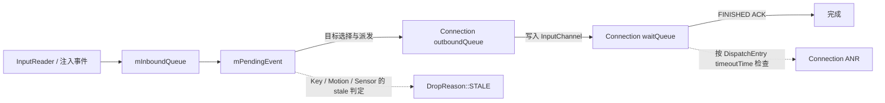

# 3.10 InputDispatcher 陈旧事件判定与丢弃

InputDispatcher 用陈旧事件（stale event）机制阻止过老的按键或新手势起始事件继续进入目标窗口。它判断的是事件年龄，默认条件为：

```text
currentTime - eventTime >= 10 秒 × HwTimeoutMultiplier()
```

这个条件既不表示“应用已经 ANR”，也不表示“某个窗口一定没有回复确认”。事件可能在 InputDispatcher 内部等待，也可能带着过老的时间戳刚进入队列。排查陈旧事件日志时，应先确认事件在哪个阶段变老，不能直接归因于应用主线程。

## 陈旧事件位于哪一段队列

Android 17 的输入分发包含三类性质不同的等待：



- `mInboundQueue` 保存尚未成为当前处理对象的入站事件。
- `mPendingEvent` 是分发器当前尝试处理的事件；焦点、窗口状态或策略要求稍后重试时，它可以跨多轮 `dispatchOnceInnerLocked()` 保留。
- `outboundQueue` 保存准备写入某条连接的事件。
- 事件成功写入 InputChannel 后进入该连接的 `waitQueue`，等待消费者返回 FINISHED 确认。

陈旧判定发生在 `mPendingEvent` 的按键、运动或传感器事件分支。已经发送并进入 `waitQueue` 的事件由 `AnrTracker` 管理，不会再被陈旧分支重新判定。这一区分直接决定排查方向：

- `InboundQueue` 或 `PendingEvent` 的年龄不断增长，才与陈旧判定直接相关；
- `WaitQueue` 增长说明事件已经发出但尚未完成，优先检查目标线程与连接 ANR；
- 单个窗口不回确认可能间接改变后续分发，但这不属于陈旧事件的定义，也不是唯一原因。

## Android 17 的判定由策略层给出

`InputDispatcher::isStaleEvent()` 不保存独立计时器，只把当前时间和 `EventEntry::eventTime` 交给策略层：

```cpp
bool InputDispatcher::isStaleEvent(nsecs_t currentTime, const EventEntry& entry) {
    return mPolicy.isStaleEvent(currentTime, entry.eventTime);
}
```

`InputDispatcherPolicyInterface` 的默认实现才给出具体阈值：

```cpp
virtual bool isStaleEvent(nsecs_t currentTime, nsecs_t eventTime) {
    static const std::chrono::duration STALE_EVENT_TIMEOUT =
            std::chrono::seconds(10) * android::base::HwTimeoutMultiplier();
    return std::chrono::nanoseconds(currentTime - eventTime) >= STALE_EVENT_TIMEOUT;
}
```

Android 17 的生产源码中没有另一份 `isStaleEvent()` override；测试用 `FakeInputDispatcherPolicy` 可以替换阈值。厂商分支仍可修改策略或常量，因此实机分析要同时记录构建版本。

`HwTimeoutMultiplier()` 读取只读属性 `ro.hw_timeout_multiplier`，缺省值为 1。它最初用于让速度远慢于真机的模拟环境按比例放宽平台超时。它同时被多处系统超时使用，不能把“10 秒”写成所有构建的固定实测值。设备上的有效基础值可这样确认：

```shell
adb shell getprop ro.hw_timeout_multiplier
```

属性为空时，libbase 的缺省返回值仍是 1。不要在产品代码里复制这条公式作为交互体验阈值；3.9 节讨论的毫秒级输入到呈现指标与这里的保护阈值用途不同。

## `eventTime` 决定事件年龄

按键和运动事件分支的 `currentTime` 来自 `CLOCK_MONOTONIC`。物理输入的 `eventTime` 沿 EventHub、InputReader 传入，源头通常是 Linux evdev 事件时间戳；注入事件则可能携带调用方给出的时间。以下情况都可能产生陈旧事件：

1. 分发器的入站队列长期积压；
2. 输入分发冻结一段时间，恢复后开始处理已变老的事件；
3. 待处理按键在策略拦截或目标选择阶段多次返回“稍后重试”；
4. 窗口处于暂停状态、焦点窗口尚未就绪，事件长期保持待处理状态；
5. 注入工具传入了明显早于当前时间的 `eventTime`；
6. 上游驱动或注入端使用了错误的时钟基准。

如果输入分发已禁用，`DISABLED` 的优先级高于 `STALE`，对应事件会按禁用原因处理。分发冻结时，本轮入口直接返回，不处理新事件和超时；解除冻结后，事件才可能因年龄超过阈值命中陈旧判定。

SensorEntry 是时钟基准上的例外。Android 17 注释明确指出传感器时间戳使用 `SYSTEM_TIME_BOOTTIME`，因此陈旧比较改用当前 BOOTTIME。这里的 SensorEntry 是 InputFlinger 传给输入策略层的输入设备传感器事件，不应与应用通过 SensorManager 接收的全部传感器数据混为一谈。

## Key、Motion 和 Sensor 的结果不同

| 事件类型 | 陈旧检查 | Android 17 的结果 |
| --- | --- | --- |
| Key | 只要尚未被 `POLICY` / `DISABLED` 处理，就比较事件年龄 | 标为 `DropReason::STALE`；不会写入目标窗口的 InputChannel；注入结果为失败，并上报 dropped key |
| Pointer Motion | 比较事件年龄后，再检查同一 display、同一 device 是否仍有 touching 或 hovering pointer | 没有进行中状态才标为 stale；存在进行中手势时继续处理该 stroke |
| Non-pointer Motion | 同样经过 Motion 分支 | 沿用 TouchState 的同设备检查；无进行中 touch / hover 时可标为 stale |
| SensorEntry | 用 BOOTTIME 比较事件年龄 | 会标记陈旧并打印丢弃日志，但 `dispatchSensorLocked()` 仍向策略层投递传感器回调 |
| Focus / TouchModeChanged / DeviceReset | 没有陈旧分支 | 主循环明确令这三类不按该丢弃原因处理 |
| PointerCaptureChanged / Drag | 没有陈旧检查 | 按各自分发逻辑处理 |

按键还有一层细节：`dispatchKeyLocked()` 的分发前策略拦截发生在丢弃清理之前，因此陈旧按键仍可能触发系统策略的按键拦截流程；目标应用窗口不会收到原始陈旧按键。

SensorEntry 更容易被错误概括。Android 17 的 `dispatchSensorLocked()` 参数中虽然有 `dropReason`，函数体没有据此跳过回调，仍会向命令队列投递 `notifySensorAccuracy()` / `notifySensorEvent()`。主循环随后仍会执行 `dropInboundEventLocked()` 并打印陈旧事件日志；传感器分支没有取消动作。除非后续源码改变，不能把这条日志解释成传感器策略回调一定被抑制。

## 为什么进行中的触摸允许继续

对按键，过期事件可以单独清理。指针运动事件是一段状态序列：

```text
DOWN → MOVE... → UP
              ↘ CANCEL
```

如果只因某个 MOVE 已超过阈值就中断序列，应用与 InputDispatcher 可能对“哪些指针仍然按下”产生不同认识。Android 17 因此检查：

```text
mTouchStates.hasTouchingOrHoveringPointers(displayId, deviceId)
```

同一显示器、同一设备仍有触摸或悬停状态时，分发器不把该运动事件标为 `STALE`，源码注释说明这是为了完成当前事件流。这个豁免带来以下结果：

- 已开始的拖动即使事件很老，也可能继续收到 MOVE / UP；
- stale `HOVER_EXIT` 在仍有对应 hover 状态时也可能继续派发；
- 不能用陈旧事件日志条数推算一段手势丢了多少 `MotionEvent`；
- 多设备输入要按 `deviceId` 分开分析，不能用另一支触控笔或鼠标的状态代替当前设备。

陈旧事件机制主要阻止已经失去时效的新动作启动，同时尽量维持既有输入状态的一致性。

## 丢弃之后为什么还可能收到取消事件

`dropInboundEventLocked()` 对 `DropReason::STALE` 打印：

```text
Dropped event because it is stale.
```

随后它按事件类型清理各连接已记录的输入状态：

- 按键使用 `CANCEL_NON_POINTER_EVENTS`；
- 指针类运动事件使用 `CANCEL_POINTER_EVENTS`；
- 其他运动事件使用 `CANCEL_NON_POINTER_EVENTS`；
- SensorEntry 不生成取消；
- PointerCaptureChanged 和 Drag 也没有取消分支。

这些取消选项会交给 `synthesizeCancellationEventsForAllConnectionsLocked()`。只有某条连接存在匹配的已分发状态时，才需要合成和发送取消事件。因此，原陈旧事件没有送给窗口，应用随后仍可能收到取消事件；取消事件用于清理此前状态，并非补发原事件。

业务层看到一次 `ACTION_CANCEL` 时，不能直接认定是手势识别器主动取消。窗口移除、焦点变化、ANR、InputChannel 断开以及陈旧事件清理都可能生成取消，必须结合取消原因、InputDispatcher 日志和时间线判断。

## DropReason 的优先级

Android 17 的枚举为：

```text
NOT_DROPPED
POLICY
DISABLED
BLOCKED
STALE
NO_POINTER_CAPTURE
```

主循环先判断 `POLICY` 与 `DISABLED`，只有仍为 `NOT_DROPPED` 时才检查陈旧状态。按键和非指针运动事件随后还可能因 `mNextUnblockedEvent` 标成 `BLOCKED`，但已经命中 `STALE` 时不会被 `BLOCKED` 覆盖。

`BLOCKED` 来自另一套恢复策略：等待焦点窗口的应用迟迟没有窗口，而用户用新的指针按下事件触摸另一应用，或有可响应的监视窗口接手时，InputDispatcher 记录 `mNextUnblockedEvent`，清理它前面的部分事件。Pointer Motion `BLOCKED` 丢弃；按键和按焦点分发的非指针运动事件才会命中。

旧版分析中常见的 `APP_SWITCH` 丢弃原因不在 Android 17 的枚举里。分析历史日志时应使用对应版本源码，不能把旧分支名称移植到 Android 17。

## stale、ACK 超时和两类 ANR

| 机制 | 计时或状态对象 | 判断依据 | 典型动作 |
| --- | --- | --- | --- |
| stale event | 当前 `mPendingEvent` | `currentTime - eventTime` 达到 policy 阈值 | Key / eligible Motion 标记 `STALE`，清理输入状态 |
| connection ANR | connection `waitQueue` 中的 `DispatchEntry` | `timeoutTime` 到期且 FINISHED ACK 未完成 | connection 标为 unresponsive，通知 policy，并对该连接取消输入 |
| no-focused-window ANR | `mNoFocusedWindowAnrState` | 有 focused application 和待派发的 focused event，但没有 focused window，等待应用 dispatch timeout | 通知 no-focused-window ANR；超时后的事件失败 |
| blocked pruning | inbound queue 与 `mNextUnblockedEvent` | 等待旧应用窗口时出现指向另一应用的新 pointer down，或 responsive spy window | 清理新交互之前的部分 Key / 非 pointer Motion |

connection ANR 的 deadline 记录在 `AnrTracker` 中；tracker 保存 `(timeoutTime, connectionToken)`，每轮取最早 deadline。App 及时 reply 后，对应 entry 从 `waitQueue` 删除，tracker 也删除该 deadline。

所以四种现场组合都合理：

- 有陈旧事件、没有 ANR：例如注入事件的时间戳已经过老；
- 有 ANR、没有陈旧事件：事件已经发到 `waitQueue`，但应用迟迟不返回确认；
- 先发生 ANR，后出现陈旧事件：连接问题或窗口状态又让后续待处理事件继续老化；
- 解除冻结后连续出现陈旧事件：一批入站事件在冻结期间共同变老。

ANR 超时与陈旧阈值都可能乘 `HwTimeoutMultiplier()`，但它们的起点、对象和系统动作不同，不能只比较秒数判断先后。

## 用 `dumpsys input` 判断事件卡在哪里

Android 17 的分发器状态转储会直接输出：

- `DispatchEnabled`、`DispatchFrozen`、`FocusedDisplayId`；
- `FocusedApplications` 及 `dispatchingTimeout`；
- focus、pointer capture、touch state、window 与 connection 信息；
- 每条连接的 `OutboundQueue`、`WaitQueue` 和 `responsive`；
- `PendingEvent`、`InboundQueue` 及每个事件相对当前时间的 `age`；
- 最近 10 个非 SensorEntry 的 `RecentQueue`；
- 最近一次 ANR 时保存的分发器状态。

先保存完整快照，避免终端滚动截断关键信息：

```shell
adb shell dumpsys input > input-dispatcher.txt
```

读取快照时可按以下顺序：

1. `DispatchFrozen=true`：查明谁冻结了分发，以及持续多久。
2. `PendingEvent age` 很大：检查焦点窗口、暂停状态、策略拦截和目标选择为何持续待处理。
3. `InboundQueue` 很长且队首年龄持续增加：检查输入洪峰、分发器线程调度和待处理事件的阻塞点。
4. 某连接的 `OutboundQueue` 增长：检查 InputChannel 写入是否受阻。
5. 某 connection 的 `WaitQueue` 增长：事件已写出，检查应用输入线程、主线程和 FINISHED ACK。
6. `responsive=false` 或存在 last ANR state：把 stale 时间点与 ANR reason、window token 和进程堆栈对齐。

`RecentQueue` 同时保存已经分发和已经丢弃的事件，只显示描述与年龄，不保存丢弃原因。SensorEntry 为避免刷满队列，不进入 RecentQueue。因此，事后只有一份 `dumpsys input` 时，不能仅靠 RecentQueue 证明某个事件已被判为陈旧。

## logcat 与 Perfetto 怎样配合

陈旧事件的 INFO 日志只有固定文案，没有事件 ID、窗口名或事件描述，而且每个 `STALE` 都会打印。它只提供时间锚点，不能构成完整证据：

```shell
adb logcat -v threadtime -s InputDispatcher ActivityTaskManager WindowManager
```

实验室的 debuggable / userdebug 构建可按需要开启更细日志：

```shell
adb shell setprop log.tag.InputDispatcherInboundEvent DEBUG
adb shell setprop log.tag.InputDispatcherDroppedEventsVerbose DEBUG
```

第二个开关主要补充部分被抑制的事件丢弃细节；它不会把固定的陈旧事件日志自动扩展成完整因果链。部分日志开关在不可调试构建上要等系统服务重启才生效，不适合在线上设备临时启用。

启用输入 ATrace 后，Android 17 还会记录三类队列计数器：

| Counter | 含义 |
| --- | --- |
| `iq` | 全局 `mInboundQueue` 长度 |
| `oq:<channelName>` | 某连接的 `outboundQueue` 长度 |
| `wq:<channelName>` | 某连接的 `waitQueue` 长度 |

在 Perfetto 中，把这些计数器与 `InputDispatcher` 线程调度、目标进程主线程、Binder、WindowManager、FrameTimeline 放在同一时间轴。`iq` 上升而 `wq` 平稳，问题更靠近分发器的待处理阶段或目标选择；`wq` 上升则说明事件已经发给连接。3.9 节的 `android.input` SQL 可以补充分发到确认与读取到呈现的延迟，但陈旧事件未送达目标窗口时，不会有完整的应用接收和帧关联记录。

## 一套可复现的排查顺序

1. 记录 `ro.build.fingerprint`、平台版本和 `ro.hw_timeout_multiplier`。
2. 保留陈旧事件日志前后至少数十秒，检查是否同时出现分发冻结、焦点切换、窗口无响应或 ANR。
3. 立即抓 `dumpsys input`；重点保存 PendingEvent、InboundQueue、Connections 和 last ANR state。
4. 可复现时抓 Perfetto，观察 `iq`、`oq:*`、`wq:*` 的先后变化。
5. 如果 `wq` 堆积，检查目标线程何时收到和完成输入；如果只有 `iq` / PendingEvent 老化，转查策略、焦点、窗口状态和分发器调度。
6. 对注入或自动化场景打印注入前的 `eventTime` 与 `SystemClock.uptimeMillis()`，先排除旧时间戳和时钟基准错误。
7. 最终再检查业务点击防抖、手势处理和渲染；它们只有在事件已经到达应用后才可能解释当前样本。

线上监控若只能采到固定的陈旧事件文案，应把它记为“InputDispatcher 处理了过老事件”，并关联同机型、同版本、同页面的 ANR、焦点异常和线程长任务。单条日志不足以证明业务回调丢失，也不足以证明 InputDispatcher 自身有缺陷。

## 版本与源码边界

- 平台实现按 Android 17 / API 37 的 `android-17.0.0_r1` 复核。
- 陈旧阈值属于 frameworks/native 与 libbase；Linux 事件时间戳路径按 `android17-6.18-2026-06_r6` 理解。
- Android 17 默认策略使用 `10s × HwTimeoutMultiplier()`；厂商修改策略、常量或 `ro.hw_timeout_multiplier` 后，应以设备源码和属性为准。
- Android 17 的 `DropReason` 不含旧实现的 `APP_SWITCH`。
- Android 17 的 SensorEntry 陈旧分支仍投递策略回调，这是当前标签的源码行为，不应外推到后续版本。

## 参考源码与文档

- [AOSP 输入架构](https://source.android.com/docs/core/interaction/input)
- [Android 17 InputDispatcher.cpp：stale 判定、queue、drop 与 ANR](https://android.googlesource.com/platform/frameworks/native/+/refs/tags/android-17.0.0_r1/services/inputflinger/dispatcher/InputDispatcher.cpp)
- [Android 17 InputDispatcher.h：DropReason 与分发器状态](https://android.googlesource.com/platform/frameworks/native/+/refs/tags/android-17.0.0_r1/services/inputflinger/dispatcher/InputDispatcher.h)
- [Android 17 InputDispatcherPolicyInterface.h：默认陈旧判定策略](https://android.googlesource.com/platform/frameworks/native/+/refs/tags/android-17.0.0_r1/services/inputflinger/dispatcher/include/InputDispatcherPolicyInterface.h)
- [Android 17 AnrTracker.h](https://android.googlesource.com/platform/frameworks/native/+/refs/tags/android-17.0.0_r1/services/inputflinger/dispatcher/AnrTracker.h)
- [Android 17 AnrTracker.cpp](https://android.googlesource.com/platform/frameworks/native/+/refs/tags/android-17.0.0_r1/services/inputflinger/dispatcher/AnrTracker.cpp)
- [Android 17 DebugConfig.h：InputDispatcher 调试日志开关](https://android.googlesource.com/platform/frameworks/native/+/refs/tags/android-17.0.0_r1/services/inputflinger/dispatcher/DebugConfig.h)
- [Android 17 libbase properties.h：HwTimeoutMultiplier](https://android.googlesource.com/platform/system/libbase/+/refs/tags/android-17.0.0_r1/include/android-base/properties.h)
- [Android 17 通用内核输入核心](https://android.googlesource.com/kernel/common/+/refs/tags/android17-6.18-2026-06_r6/drivers/input/input.c)
- [Android 17 通用内核 evdev](https://android.googlesource.com/kernel/common/+/refs/tags/android17-6.18-2026-06_r6/drivers/input/evdev.c)
- [Perfetto `android.input` 标准库](https://perfetto.dev/docs/analysis/stdlib-docs#android-input)
