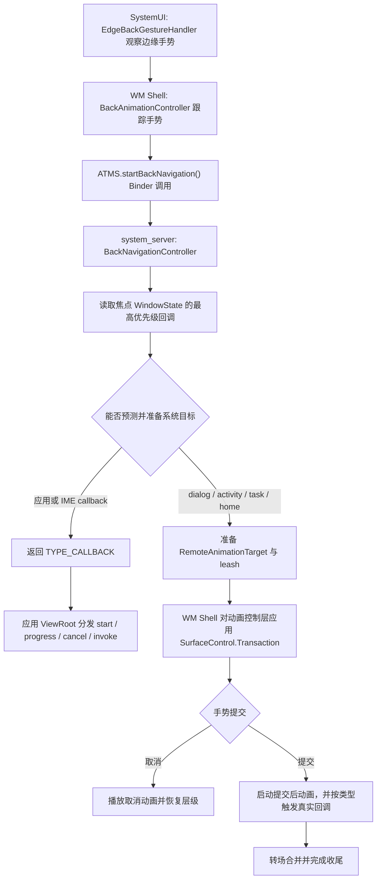
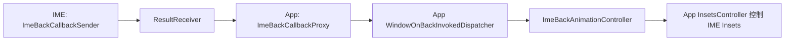

# 预测性返回系统架构与动画管线性能

预测性返回（Predictive Back）把返回操作分成“手势预览”和“提交导航”两个阶段。手指移动时，系统或应用只更新可撤销的视觉状态；手势提交后，返回回调才执行 `finish()`、pop back stack、隐藏 IME 等动作。

这个模型让系统可以提前知道返回目的地，但也引入了三套容易混淆的路径：

- 应用回调处理页面内部返回；
- WM Shell 对对话框、跨 Activity、跨任务和返回主屏执行系统动画；
- 条件不足时回退到回调，极端情况下再回退到 `KEYCODE_BACK`。

源码锚点为 Android 17 / API 37 / `android-17.0.0_r1`。SystemUI、WM Shell、`system_server`、应用和 SurfaceFlinger 各自承担不同职责。应用侧接入方法见 22.13，边缘手势识别见 3.3。

## 1. 先建立正确的阶段模型

### 1.1 预提交与提交后

`OnBackAnimationCallback` 的四个回调对应两类工作：

| 回调 | 所属阶段 | 合适的工作 |
|---|---|---|
| `onBackStarted()` | 预提交 | 保存起始状态，准备轻量动画对象 |
| `onBackProgressed()` | 预提交 | 根据进度更新可撤销的属性 |
| `onBackCancelled()` | 取消 | 把视觉状态恢复到起点 |
| `onBackInvoked()` | 已提交 | 执行导航、关闭容器或提交业务状态 |

在 `onBackProgressed()` 中结束 Activity、pop Fragment 或写数据库，会破坏取消语义。系统动画同样遵守这一边界：手势阶段只变换动画控制层（leash）；提交后才调用真实回调，并把预览接入正式转场。

### 1.2 返回目的地与动画执行者

`BackNavigationInfo` 是 system_server 返回给 WM Shell 的决策结果。Android 17 定义以下主要类型：

| 类型 | 含义 | 常见动画执行者 |
|---|---|---|
| `TYPE_CALLBACK` | 应用或 IME 回调接管 | 应用进程的回调 |
| `TYPE_DIALOG_CLOSE` | 关闭当前 Activity 上方的窗口 | 取决于产品是否注册动画执行器 |
| `TYPE_CROSS_ACTIVITY` | 返回同一 Task 中的前一个 Activity | WM Shell |
| `TYPE_CROSS_TASK` | 返回前一个 Task | WM Shell |
| `TYPE_RETURN_TO_HOME` | 返回主屏 | Launcher 或产品注册的动画执行器 |
| `TYPE_IN_TRANSITION` | 当前已有转场，暂不能准备 | 等转场空闲后重试 |
| `TYPE_TASK_ROOT_INTERCEPTION` | 根任务拦截返回 | 按系统覆盖行为处理 |

“谁处理进度”由这个类型和 `isPrepareRemoteAnimation()` 共同决定。应用回调获胜时，系统不会同时运行跨 Activity 系统动画；系统转场获胜时，逐帧 Surface 变换主要发生在 WM Shell。

## 2. Android 17 的端到端架构



其中两个类负责核心协调职责：

- `BackNavigationController` 位于 system_server，负责确定 focused window、top callback、返回目标和可动画性，并准备 WindowContainer/Transition 侧资源；
- `BackAnimationController` 位于 WM Shell，负责手势状态、pointer pilfer、remote animation readiness、progress 分发以及提交后的收尾。

Android 17 的 WMS 中没有 `TaskAnimationCoordinator`。这个类不能用于解释跨 Activity、跨任务或快照路径。

## 3. 输入事件怎样到达返回动画

### 3.1 分流不发生在 InputDispatcher 的业务判断中

`EdgeBackGestureHandler` 通过系统输入监视通道观察边缘指针事件流，判断手势是否满足起点、方向、排除区域和阈值条件。InputDispatcher 提供事件路由与输入监视能力，但它不负责决定“这是旧式返回还是预测进度”。

当 SystemUI 已连接 WM Shell 的 `BackAnimation`：

1. `ACTION_DOWN`、`MOVE`、`UP/CANCEL` 被转给 `BackAnimationController.onBackMotion()`；
2. Shell 在第一次 `MOVE` 时启动返回导航，使指针按下导致的焦点变化有机会先完成；
3. 手势越过阈值后，Shell 按配置调用 `pilferPointers()`，从原接收者接管后续指针事件；
4. 松手时根据 `triggerBack` 进入提交或取消。

`EdgeBackGestureHandler.mBackAnimation` 是否为空反映 SystemUI 与 WM Shell 的功能连接状态，不等同于当前应用是否在清单中选择启用。应用是否启用新返回模型，主要体现在窗口有没有注册可供 WMS 使用的回调。

### 3.2 仍然存在 KEYCODE_BACK 回退

Android 17 的预先决策路径也保留异常回退。例如 `startBackNavigation()` 因找不到有效焦点窗口、当前状态无法建立 `BackNavigationInfo`，或系统正在处理不兼容状态而返回 `null`，Shell 可在手势提交后异步注入 `KEYCODE_BACK`。

这是兜底分支。对目标 SDK 36 及以上且未显式退出新模型的应用，常规路径通过回调分发；官方行为边界明确指出 `Activity.onBackPressed()` 与返回 `KEYCODE_BACK` 不再作为正常分发入口。

## 4. 窗口回调如何进入 WMS

### 4.1 每个窗口只向 WMS 暴露最高优先级回调

`WindowOnBackInvokedDispatcher` 在应用进程维护回调集合。最高优先级回调改变时，它把 `OnBackInvokedCallbackInfo` 经 `IWindowSession.setOnBackInvokedCallbackInfo()` 写入对应 `WindowState`。这个对象包含：

- 回调的 Binder；
- priority；
- 是否实现 `OnBackAnimationCallback`；
- 是否请求系统覆盖行为。

WMS 无需遍历应用的全部回调，只读取当前窗口已经选出的最高优先级回调。

### 4.2 优先级与同级顺序

Android 17 的关键优先级是：

| 常量 | 值 | 用途 |
|---|---:|---|
| `PRIORITY_OVERLAY` | `1_000_000` | 菜单、抽屉等应先关闭的覆盖层 |
| `PRIORITY_DEFAULT` | `0` | 普通应用回调 |
| `PRIORITY_SYSTEM` | `-1` | 框架内部默认导航回调 |
| `PRIORITY_SYSTEM_NAVIGATION_OBSERVER` | `-2` | 只观察系统导航，不消费 |

高优先级先执行；同一优先级按注册顺序逆序选择。应用不能注册普通负优先级回调，`PRIORITY_SYSTEM_NAVIGATION_OBSERVER` 是允许的特殊观察者。API 36 对观察者数量有限制，API 37 起可注册多个；它们不会改变系统返回结果。

`Activity` 在新模型启用时会以 `PRIORITY_SYSTEM` 注册默认回调。应用注册默认或覆盖层回调后，它会成为最高优先级回调，`BackNavigationController` 将本次导航归类为 `TYPE_CALLBACK`。

### 4.3 Android 17 的本地进度生成

Android 17 还提供一条减少逐帧跨进程调用的优化路径。满足以下条件时，`BackNavigationInfo.isAppProgressGenerationAllowed()` 可为 `true`：

- 当前回调是动画回调；
- 窗口允许应用生成进度；
- 手势可触摸区域与窗口区域匹配；
- 没有需要转交手势的嵌入窗口。

此时应用 `ViewRootImpl` 根据本地 `MotionEvent` 更新 `BackTouchTracker` 与 `BackProgressAnimator`，Shell 跳过对应的 Binder 进度分发。条件不满足时，Shell 仍通过 `IOnBackInvokedCallback.onBackProgressed()` 发送进度。

因此，看到应用回调每帧运行，不能直接推断每帧都经过 SystemUI → `system_server` → 应用的完整 IPC。

## 5. system_server 如何预测返回目标

`BackNavigationController.startBackNavigation()` 在 WMS 全局锁下完成一轮快照式判断：

1. 找到目标显示器的焦点窗口；必要时退到焦点任务的窗口；
2. 要求窗口已有有效绘制 Surface；
3. 检查当前是否处于不允许插入预测返回的转场；
4. 读取窗口的 `OnBackInvokedCallbackInfo`；
5. 若应用回调获胜，直接返回 `TYPE_CALLBACK`；
6. 若框架系统回调获胜，再计算对话框、前一 Activity、前一任务或主屏；
7. 确认 Shell 声明支持该类型后，准备远程动画。

### 5.1 系统宁可回退，也不盲目展示错误目标

以下情况会让系统放弃某类预览，改走回调：

- 前一个 Activity 没有进程或窗口；
- Activity 尚未创建，无法安全作为跨 Activity 目标；
- 参与者包含不适合该路径的透明 Activity；
- keyguard、app lock、lock task 或 floating task 条件不满足；
- 当前 Activity 使用场景转场；
- 多窗口中前后任务不在兼容的父层级。

跨 Activity/跨任务预测动画通常要求目标已经有进程和窗口。系统不会为了预览强行冷启动一个已死亡的目标进程。此时用户看到普通回调或转场，属于安全回退，不应先归因于“快照丢失”。

### 5.2 预览阶段不会提前完成返回生命周期

对于可动画目标，系统服务端可以创建 `TRANSIT_PREPARE_BACK_NAVIGATION`，收集打开/关闭的 WindowContainer，并把前一 Activity 设置为 `launch-behind` 状态或准备启动画面。手势取消时需要恢复这些临时状态；手势提交后才由真实回调和正式转场完成导航。

不要假设 `onPause()` 一定发生在首个进度回调之前，也不要把输入焦点切换固定在 `onPause()` 与目标 `onResume()` 之间。实际顺序受返回类型、目标可见状态、转场合并和窗口绘制情况影响。应用只能依赖公开生命周期契约。

## 6. WM Shell 如何执行系统动画

### 6.1 动画注册表与 RemoteAnimationTarget

`ShellBackAnimationRegistry` 按 `BackNavigationInfo` 类型保存 runner。AOSP Android 17 的默认 Dagger module 装配 cross-activity、cross-task 和定制 cross-activity runner；return-to-home 可由 Launcher 运行时注册，dialog-close 槽位默认是 `null`。`BackNavigationInfo` 有某个 type，只说明 core 能表达该目的地；`BackAnimationAdapter.isAnimatable(type)` 还要确认当前产品已经提供 runner。

系统服务端准备完成后，把打开/关闭的 `RemoteAnimationTarget` 及其动画控制层交给 Shell。手势阶段的典型逐帧工作包括：

- 把触摸位移映射为进度；
- 计算 opening/closing bounds、scale、translation、crop、corner radius、alpha；
- 在同一个 `SurfaceControl.Transaction` 中写入目标动画控制层；
- 用当前 `Choreographer` VSync ID 标记事务；
- 提交给 SurfaceFlinger 合成。

这一阶段无需让目标 Activity 每帧重新测量和布局。目标页面自身若仍在绘制，其缓冲区更新与 Shell 的动画控制层变换属于两条不同工作流。

### 6.2 提交后的顺序

手势松开后有三种主要结果：

- 取消：当前动画执行器收到 `onBackCancelled()`，播放回弹并恢复目标；
- 回调路径：Shell 直接调用应用回调的取消或提交方法；
- 系统动画路径：Shell 启动提交后动画；跨 Activity、跨任务和返回主屏会在这一阶段开始时触发真实回调，让关闭转场与动画衔接，其他类型可在动画结束时再触发。

`BackAnimationController` 会在触发真实回调前同步通知系统服务端当前动画结果，避免关闭转场再播放一套重复动画。动画执行器完成或看门狗到期后，Shell 释放目标、结束导航，并由 `BackTransitionHandler` 完成后续转场协调。

源码中的 2 秒 `MAX_ANIMATION_DURATION` 是等待远程动画完成的看门狗。它处理动画执行器未回调或动画迟到等异常，不能当作产品动画时长或性能目标。

## 7. 快照在预测返回中的准确角色

Android 17 可以在以下组合条件下为打开目标创建无窗口启动画面：

- TaskOrganizer 支持无窗口启动画面；
- `config_predictShowStartingSurface` 开启；
- 当前策略没有直接采用 `launch-behind`；
- 存在与目标方向、夜间模式和组件兼容的任务/Activity 快照。

快照用于在打开窗口尚未绘制时提供临时内容。Android 17 没有“实时图层掉帧后动态切换快照”的通用降级，也不通过 `TaskAnimationCoordinator` 每帧选择预览层。系统会在动画开始前确定目标与预览策略。

快照的尺寸、格式、是否包含 IME Surface、是否采用降采样以及缓存寿命都受实现和设备配置影响。仅用屏幕分辨率乘四估算全部快照内存，会忽略实际缓冲区、缓存策略和安全窗口限制。需要内存结论时，应在目标设备读取图形内存和 TaskSnapshot 现场数据。

## 8. 应用回调路径的性能

应用回调获胜时，`WindowOnBackInvokedDispatcher.OnBackInvokedCallbackWrapper` 把 Binder 回调投递到创建 `ViewRootImpl` 的 Handler，通常是应用主线程。`BackProgressAnimator` 对进度做平滑处理后，再调用应用的 `onBackProgressed()`。

应用侧每帧应限制在可预测的属性更新：

- 预先保存起止位置；
- 更新 translation、scale、alpha 或已创建动画的 fraction；
- 避免同步 I/O、Bitmap 解码、导航提交和大对象分配；
- 不在每帧反复修改复杂 `LayoutParams`；
- 取消后完整恢复界面状态。

以下代码只用于标记应用回调的 CPU 时间：

```kotlin
override fun onBackProgressed(backEvent: BackEvent) {
    Trace.beginSection("AppBackProgress")
    try {
        content.translationX = maxTranslation * backEvent.progress
    } finally {
        Trace.endSection()
    }
}
```

如果 `AppBackProgress` 很短而画面仍不连续，还要检查应用 RenderThread、WM Shell、SurfaceFlinger 和显示刷新率；主线程切片只覆盖其中一段。

AndroidX `OnBackPressedDispatcher`、Navigation、Fragment 与 Compose `PredictiveBackHandler` 会把平台事件桥接到库回调。具体分发与对象分配取决于 AndroidX 版本，应记录 Activity/Navigation/Compose 依赖版本，不能归因于 `frameworks/base` 的 Android 17 实现。

## 9. Predictive Back 与 IME

Android 17 的 IME 返回路径跨越 IME 和应用两个进程：



IME 进程通过 `ImeBackCallbackSender` 把回调注册转发给当前应用。应用侧 `ImeBackCallbackProxy` 收到默认系统回调后，会把它映射到 `PRIORITY_DEFAULT`；若 ViewRoot 已提供 `ImeBackAnimationController`，分发器便由该控制器处理预测动画。

默认情况下，IME 回调的优先级高于 Activity 的框架系统回调，因此一次返回先隐藏 IME。这个行为仍有明确例外：

- IME 可通过返回处置策略选择跳过默认回调；
- 应用更高优先级的覆盖层回调可以先处理；
- multi-window 与 IME fullscreen mode 禁用预测 IME 动画；
- 使用 `adjustResize`、没有应用 Insets 动画回调且页面也未启用边到边显示时，Android 17 会回退到普通隐藏动画；
- `onKeyPreIme()` 的兼容分支仍可能消费事件并取消 IME 动画。

`ImeBackAnimationController` 在预提交阶段只移动 IME 高度的一小部分作为预览，提交后再完成隐藏；取消则回到显示状态。它直接控制 `WindowInsetsAnimationController`，没有让 IMMS 与页面的跨 Activity 动画并行运行。

IME 隐藏提交后，controller 会暂时清除 IME callbacks，使下一次返回可以交给后续 callback，即使隐藏动画还在收尾。这是常见“两次返回”的状态基础，但应用不能把“两次”写成所有 IME、window mode 和 callback 组合下的硬性规则。

## 10. 如何建立性能结论

### 10.1 先判定卡在哪个阶段

| 现象 | 优先证据 | 可能范围 |
|---|---|---|
| 手势开始后预览迟迟不出现 | `ACTION_BACK_SYSTEM_ANIMATION`、Shell readiness 日志 | WMS 目标计算、remote target、目标窗口 |
| 手指移动时持续掉帧 | FrameTimeline、Shell/App 主线程、RenderThread、SF | progress 回调或 Surface transaction |
| 松手后停顿 | post-commit runner、Transition、真实 callback | 应用导航、动画 runner、Transition 合并 |
| 取消后 UI 没恢复 | app cancel trace 或 Shell runner | callback 状态机错误 |
| 偶发退回旧动画 | `BackNavigationInfo` type、目标进程/窗口 | 预测条件不足 |
| 键盘先闪再隐藏 | `ImeBackAnimationController`、Insets control | IME control readiness、回退模式 |

### 10.2 不使用固定的分段毫秒预算

60 Hz 一帧约 16.7 ms，120 Hz 一帧约 8.3 ms，但 SystemUI、Shell、应用、RenderThread 和 SurfaceFlinger 的工作会流水执行，并不共享一张可以简单相加的“2 + 4 + 4 ms”表。评估时应把每一帧的预期/实际 FrameTimeline、CPU 可运行时间和 Surface 事务对齐。

这条源码路径没有实现“持续掉帧就自动缩短 AppTransition”或“实时图层跟不上就改用快照”的通用策略。省略帧、动态刷新率和 HWC/GPU 合成都可能出现，但要根据 SurfaceFlinger 与调度证据判断，不能由卡顿现象反推某个固定降级算法。

## 11. Perfetto 与系统状态观测

### 11.1 平台已有的指标

Android 17 在 WM Shell 中提供两类内建观测：

- `LatencyTracker.ACTION_BACK_SYSTEM_ANIMATION`：从 Shell 发起 `startBackNavigation()` 到收到有效远程动画目标；
- InteractionJankMonitor CUJ：包括预测返回主屏、跨任务、跨 Activity，对相应动画控制层的帧做卡顿统计。

WMS 的 Proto 状态转储/窗口轨迹还包含 `BackNavigationController` 的 `ANIMATION_IN_PROGRESS` 与 `LAST_BACK_TYPE`。WM Shell 状态转储会输出 `BackAnimationController` 的手势、post-commit、指针截取以及当前/排队跟踪器状态。

### 11.2 Perfetto 需要覆盖的线程

录制系统轨迹时至少保留：

- SystemUI / WM Shell 主线程；
- `system_server` 中 WindowManager/ActivityTaskManager 相关线程和 Binder；
- 应用主线程与 RenderThread；
- SurfaceFlinger、GPU/HWC 及 FrameTimeline；
- input、sched、freq、view、wm、gfx 等相关数据源。

分析顺序建议如下：

1. 以边缘手势开始为时间原点；
2. 确认本次 `BackNavigationInfo` 类型；
3. 检查远程动画目标到达时间；
4. 区分进度在 Shell 还是应用生成；
5. 对齐每帧事务、应用缓冲区与 SurfaceFlinger 呈现时间；
6. 松手后继续观察，直至真实回调和转场完成。

FrameTimeline 的卡顿类型只描述帧结果。判断开销来自布局、callback、Binder、GPU 还是合成，需要展开同一时间范围的线程切片。

### 11.3 建议的覆盖组合

至少覆盖以下状态，并分别记录 P50/P90/P95：

- app callback / 系统 cross-activity / cross-task / return-to-home；
- 目标 Activity 已有窗口 / 条件不足回退；
- 手势提交 / 中途取消 / 快速连续两次返回；
- IME shown / hidden，`adjustResize` / edge-to-edge；
- 60 Hz / 高刷新率；
- 分屏、freeform、折叠状态变化；
- AndroidX callback enabled / disabled；
- 目标 SDK 35 与 36+ 的兼容边界。

## 12. 版本边界

- Android 13 / API 33 引入 `OnBackInvokedCallback` 和预先决策返回模型；
- Android 14 / API 34 向应用开放 `OnBackAnimationCallback` 的进度能力；
- Android 15 / API 35 移除预测性返回动画的开发者开关，已选择启用的应用显示系统返回主屏、跨任务和跨 Activity 动画；
- Android 16 / API 36 对目标 SDK 36+ 应用默认启用新模型，仍可通过 `android:enableOnBackInvokedCallback="false"` 临时退出；启用时不再走 `onBackPressed()` 和返回 `KEYCODE_BACK` 的常规分发；
- Android 17 / API 37 延续该默认行为，并允许同一分发器注册多个 `PRIORITY_SYSTEM_NAVIGATION_OBSERVER`。

不能用 Android 17 后续小版本或 AndroidX 新版本的行为解释 `android-17.0.0_r1`。OEM 对 SystemUI 手势、Launcher runner、动画资源和窗口策略的修改需要在对应构建上复核。

## 13. 源码索引

- [`EdgeBackGestureHandler.java`](https://android.googlesource.com/platform/frameworks/base/+/refs/tags/android-17.0.0_r1/packages/SystemUI/src/com/android/systemui/navigationbar/gestural/EdgeBackGestureHandler.java)
- [`BackAnimationController.java`](https://android.googlesource.com/platform/frameworks/base/+/refs/tags/android-17.0.0_r1/libs/WindowManager/Shell/src/com/android/wm/shell/back/BackAnimationController.java)
- [`ShellBackAnimationRegistry.java`](https://android.googlesource.com/platform/frameworks/base/+/refs/tags/android-17.0.0_r1/libs/WindowManager/Shell/src/com/android/wm/shell/back/ShellBackAnimationRegistry.java)
- [`CrossActivityBackAnimation.kt`](https://android.googlesource.com/platform/frameworks/base/+/refs/tags/android-17.0.0_r1/libs/WindowManager/Shell/src/com/android/wm/shell/back/CrossActivityBackAnimation.kt)
- [`CrossTaskBackAnimation.java`](https://android.googlesource.com/platform/frameworks/base/+/refs/tags/android-17.0.0_r1/libs/WindowManager/Shell/src/com/android/wm/shell/back/CrossTaskBackAnimation.java)
- [`BackNavigationController.java`](https://android.googlesource.com/platform/frameworks/base/+/refs/tags/android-17.0.0_r1/services/core/java/com/android/server/wm/BackNavigationController.java)
- [`BackNavigationInfo.java`](https://android.googlesource.com/platform/frameworks/base/+/refs/tags/android-17.0.0_r1/core/java/android/window/BackNavigationInfo.java)
- [`WindowOnBackInvokedDispatcher.java`](https://android.googlesource.com/platform/frameworks/base/+/refs/tags/android-17.0.0_r1/core/java/android/window/WindowOnBackInvokedDispatcher.java)
- [`ImeBackAnimationController.java`](https://android.googlesource.com/platform/frameworks/base/+/refs/tags/android-17.0.0_r1/core/java/android/view/ImeBackAnimationController.java)
- [`ImeBackCallbackSender.java`](https://android.googlesource.com/platform/frameworks/base/+/refs/tags/android-17.0.0_r1/core/java/android/window/ImeBackCallbackSender.java)
- [`ImeBackCallbackProxy.java`](https://android.googlesource.com/platform/frameworks/base/+/refs/tags/android-17.0.0_r1/core/java/android/window/ImeBackCallbackProxy.java)
- [Add support for the predictive back gesture](https://developer.android.com/guide/navigation/custom-back/predictive-back-gesture)
- [Android 16 behavior changes for target SDK 36+](https://developer.android.com/about/versions/16/behavior-changes-16)
