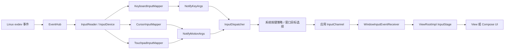
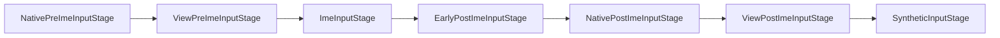
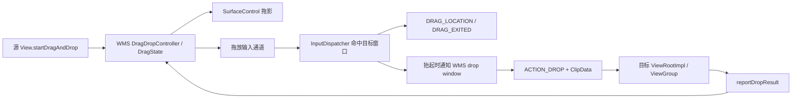

# 3.13 键盘、鼠标与指针输入性能 — 桌面模式交互管线

手机上的输入优化常以触摸为中心。到了大屏、多窗口和桌面窗口场景，键盘、鼠标、触控板会把另外几类问题放大：

- 键盘按键先经过系统策略和 IME，目标由窗口焦点决定；
- 鼠标移动需要维护屏幕光标，窗口目标来自坐标命中；
- 触控板先识别移动、滚动、捏合和多指手势，应用平时收到的未必是原始触点；
- 悬停没有按下状态，却持续触发窗口命中、View 命中、指针图标解析和应用回调；
- 跨窗口拖放同时涉及 InputDispatcher、WindowManager、SurfaceControl 和应用主线程。

这些事件最终仍通过输入通道进入应用。性能问题的共同终点也相同：应用没有及时完成事件，`InputDispatcher` 的连接等待队列持续增长，用户先看到光标、焦点或快捷键响应落后，随后才可能出现输入分发超时。

平台源码锚点为 Android 17 / API 37 / `android-17.0.0_r1`。历史版本只用于解释兼容边界。

## 1. 先建立一张完整的路径图



图中的三个映射器共享 `EventHub → InputReader → InputDispatcher` 主干，但设备语义不能互换：

| 输入 | 原始内核事件 | Android 17 的主要转换者 | 常见应用事件 |
| --- | --- | --- | --- |
| 物理键盘 | `EV_KEY` | `KeyboardInputMapper` | `KeyEvent` |
| 鼠标 | `EV_REL`、按键、滚轮 | `CursorInputMapper` | `MotionEvent`，通常为 `SOURCE_MOUSE` |
| 触控板 | `EV_ABS` 多点槽位、按键 | `TouchpadInputMapper` + gestures library | 普通模式通常表现为鼠标或已分类手势 |
| 触摸屏 | `EV_ABS` 多点槽位 | `MultiTouchInputMapper` | `SOURCE_TOUCHSCREEN` 的 `MotionEvent` |

一个物理设备可以支持多个输入源。例如，Android 17 的 `TouchpadInputMapper::getSources()` 返回 `SOURCE_MOUSE | SOURCE_TOUCHPAD`。这表示设备具备这些能力，不代表每个事件的 `MotionEvent.getSource()` 都包含两个值。普通未捕获的触控板移动由 `UncapturedGestureConverter` 生成，事件输入源是 `SOURCE_MOUSE`。

### 输入源描述分发语义，不能代替硬件能力判断

应用应同时看 `InputDevice` 能力、事件输入源、action、轴和工具类型，不能只用设备名称猜测输入类型。

- `SOURCE_MOUSE` 属于 `SOURCE_CLASS_POINTER`，坐标对应显示空间中的指针位置；
- `SOURCE_MOUSE_RELATIVE` 属于 `SOURCE_CLASS_TRACKBALL`，用于指针捕获下的相对移动；
- `SOURCE_TOUCHPAD` 属于 `SOURCE_CLASS_POSITION`，API 37 的绝对捕获模式用它报告触控板原始触点；
- `SOURCE_GAMEPAD` 描述按钮能力，摇杆轴通常来自 `JoystickInputMapper`，没有独立的 `GamepadInputMapper`。

这一区分会直接影响 `ViewRootImpl` 选择 `dispatchPointerEvent()`、`dispatchCapturedPointerEvent()` 或 `dispatchGenericMotionEvent()`。

## 2. InputReader 如何把设备转换成 Android 事件

### 2.1 映射器由设备类别决定

`InputDevice::createMappers()` 根据 `EventHub` 识别出的设备类别创建映射器。Android 17 中的相关分支为：

- `KEYBOARD`、`DPAD`、`GAMEPAD` 组合出键盘输入源，再创建 `KeyboardInputMapper`；
- `CURSOR` 创建 `CursorInputMapper`；
- 同时具有 `TOUCHPAD` 与 `TOUCH_MT` 时创建 `TouchpadInputMapper`；
- 其余 `TOUCH_MT` 设备才进入 `MultiTouchInputMapper`；
- `JOYSTICK` 创建 `JoystickInputMapper`。

因此，同样来自 `EV_ABS` 的多点数据，触控板与触摸屏也可能在映射器创建阶段分开。

### 2.2 键盘：scan code、key code 与字符是三层概念

`KeyboardInputMapper` 收到 `EV_KEY` 后，以扫描码和可选 HID 用法查表。Android 17 的 `EventHub::mapKey()` 会先检查按键字符映射，再检查按键布局，之后应用用户按键重映射和 KCM 中的按键行为。输出包含：

- `scanCode`：接近 Linux 输入设备报告的物理按键编号；
- `keyCode`：Android 的 `KEYCODE_*` 语义键码；
- `metaState`：Shift、Ctrl、Alt、Meta 等组合状态；
- policy flags：是否唤醒、是否为虚拟键等策略信息。

字符生成还要结合布局、修饰键、死键和输入法。业务代码不应把 `scanCode` 当成稳定快捷键，也不应假设同一个 `keyCode` 在所有键盘布局上产生同一个字符。

### 2.3 鼠标：相对位移先更新系统光标

普通鼠标由 `CursorInputMapper` 处理 `REL_X`、`REL_Y`、滚轮和按钮。未捕获时：

1. 相对位移经过指针速度控制；
2. `PointerController` 更新显示中的光标位置；
3. 映射器生成带屏幕光标坐标的 `SOURCE_MOUSE` 事件；
4. 未按按钮时通常是 `ACTION_HOVER_MOVE`，按下期间是 `ACTION_MOVE`；
5. 滚轮生成 `ACTION_SCROLL`，数值位于 `AXIS_VSCROLL` 和 `AXIS_HSCROLL`；
6. 按钮状态还会产生 `ACTION_BUTTON_PRESS`、`ACTION_BUTTON_RELEASE`，主按钮状态变化伴随 `ACTION_DOWN`、`ACTION_UP`。

应用看到的指针坐标已经经过显示映射和速度曲线。鼠标 DPI、USB/Bluetooth 报告间隔、用户指针速度、显示刷新率都会改变观测结果，不宜写成固定的事件频率或固定精度。

### 2.4 触控板：普通模式先解释手势

Android 17 的触控板路径比“相对坐标转光标”多一层：

```text
多点槽位
  → HardwareStateConverter
  → gestures library
  → UncapturedGestureConverter / 捕获模式转换器
  → NotifyMotionArgs
```

普通模式下，单指移动会更新光标并报告 `SOURCE_MOUSE` 的悬停/移动事件；双指滚动可转成滚动事件；捏合和多指滑动带有相应分类，部分系统手势还会被系统消费。掌压过滤、tap-to-click、自然滚动、右键区域和加速曲线都在进入应用前参与解释。

所以，应用收到一条触控板事件时，不能反推“硬件只报告了一个相对坐标”。底层可能有多个绝对触点，平台已经把它们解释成鼠标或手势语义。

## 3. Android 17 的指针捕获边界

指针捕获适用于第一人称视角、远程桌面、三维编辑器等需要持续相对移动的场景。普通表单、列表和桌面窗口不应主动捕获指针。

捕获有三个重要前提：

- 所属 View 层级必须具有窗口焦点；
- 获取和失去捕获会触发设备重新配置，输入源和运动范围可能改变；
- 窗口失去焦点时捕获会被释放；焦点显示器改变时，`InputDispatcher` 也会强制关闭现有捕获。

### 3.1 鼠标捕获

鼠标被捕获后，`CursorInputMapper` 切换到 `SOURCE_MOUSE_RELATIVE`，关闭指针加速与缩放，应用通过捕获指针回调读取相对移动。此时系统光标隐藏且位置不再移动。

### 3.2 API 37 的两种触控板捕获模式

Android 17 为触控板明确了两种模式：

| 模式 | 事件输入源 | 平台处理 | 适合场景 |
| --- | --- | --- | --- |
| `POINTER_CAPTURE_MODE_RELATIVE` | `SOURCE_MOUSE_RELATIVE` | 继续识别移动、按钮和滚动，再按相对量报告 | 游戏视角、远程桌面 |
| `POINTER_CAPTURE_MODE_ABSOLUTE` | `SOURCE_TOUCHPAD` | 跳过手势库，报告触控板坐标空间中的多点数据 | 自定义触控板手势、原始触点分析 |

Android 17 中，无参数 `requestPointerCapture()` 默认使用相对模式；需要原始多点触控板数据时应显式请求绝对模式。绝对模式还会提供 `AXIS_RELATIVE_X/Y`，但 `getX(index)`、`getY(index)` 的坐标空间属于触控板表面，不能直接当屏幕坐标使用。

以下代码用于在 `compileSdk 37` 的项目中明确表达捕获意图：

```kotlin
fun View.captureForCameraControl() {
    if (hasWindowFocus()) {
        requestPointerCapture(View.POINTER_CAPTURE_MODE_RELATIVE)
    }
}

override fun onCapturedPointerEvent(event: MotionEvent): Boolean {
    if (!event.isFromSource(InputDevice.SOURCE_MOUSE_RELATIVE)) return false
    cameraController.rotateBy(event.x, event.y)
    return true
}
```

`event.x/y` 在相对模式中表示本次移动量。回调执行期间只更新输入状态；渲染工作交给帧循环，避免每个硬件采样都触发一套重计算。

## 4. 键盘从系统策略到应用的路径

### 4.1 系统策略早于应用窗口

`KeyboardInputMapper` 创建 `NotifyKeyArgs` 后，`InputDispatcher::notifyKey()` 会先调用策略层的 `interceptKeyBeforeQueueing()`。Android 17 的 `InputManagerService` 还会让 `KeyGestureController` 检查组合键。进入目标选择前，策略层还可通过 `interceptKeyBeforeDispatching()` 延迟或消费按键。

电源、音量、系统导航和系统快捷键可能在这里结束，应用没有“所有物理按键都能收到”的保证。

未被系统消费的按键按以下规则选择目标：

1. 事件带有效显示器 ID 时使用该显示器；
2. display id 无效时使用 `mFocusedDisplayId`；
3. 在目标显示器上查找焦点窗口；
4. 若焦点应用已存在但窗口尚未获得焦点，进入无焦点窗口等待与超时逻辑；
5. 对按键事件，分发器还会等待先前未完成的输入，因为前一条点击可能打开新窗口并改变焦点。

第 5 点解释了一个常见现象：主线程积压的鼠标事件会拖慢悬停，也可能让紧随其后的键盘输入等待。这段等待用于保持焦点顺序，不能归因于键盘硬件。

### 4.2 按键重复在 InputDispatcher

Android 17 的重复链路有清晰分工：

- `EventHub` 打开设备时尝试用 `EVIOCSREP` 关闭内核重复；
- `KeyboardInputMapper` 忽略 Linux `EV_KEY value == 2`；
- `InputDispatcher` 保存最近的可重复按下事件，并在入站队列为空时合成重复；
- 第一条重复事件的 `repeatCount` 为 1，并带 `FLAG_LONG_PRESS`；
- 后续重复按 `keyRepeatDelay` 继续产生；
- key-up、设备 reset、dispatch disabled 等状态会清理重复状态。

`InputDispatcherConfiguration` 的默认值是首次等待 500 ms、后续间隔 50 ms。系统可以重新配置这两个值，应用应读取 `repeatCount` 和事件时间，不要把默认值写成业务定时器的协议。

长按操作应保持幂等，并明确区分初次按下与重复：

```kotlin
override fun onKeyDown(keyCode: Int, event: KeyEvent): Boolean {
    if (keyCode != KeyEvent.KEYCODE_DPAD_RIGHT) {
        return super.onKeyDown(keyCode, event)
    }

    if (event.repeatCount == 0) {
        selection.beginKeyboardMove()
    }
    selection.moveRightOneStep()
    return true
}
```

这段代码允许系统重复驱动连续移动，同时把一次性初始化限定在首次按下。若每次重复都启动动画、I/O 或对象图重建，50 ms 的默认间隔很快会压住主线程。

### 4.3 IME 位于 View 的 IME 前阶段与 IME 后阶段之间

应用窗口中的按键事件会依次经过：



关键点有三项：

- `dispatchKeyEventPreIme()` 发生在 IME 之前；
- `ImeInputStage` 可以异步处理，IME 返回未处理后才进入 post-IME；
- `ViewPostImeInputStage` 先调用 `dispatchKeyEvent()`，再检查修饰键快捷方式、回退策略和自动焦点导航。

把 IME 描述成 View 未消费后的 Binder 兜底会颠倒执行顺序。硬件键盘事件可以先交给 IME；软键盘输入又常通过 `InputConnection.commitText()`、`setComposingText()` 等编辑协议送入文本控件，不保证对应一串 `KeyEvent`。

应用快捷键应按语义消费并返回 `true`，只在 `ACTION_DOWN && repeatCount == 0` 执行一次性命令。系统快捷键、IME 组合和辅助功能仍有更高优先级。

## 5. 鼠标、hover、滚轮与窗口命中

### 5.1 指针目标来自位置

键盘沿焦点路由，鼠标与触摸等指针事件通常按显示器坐标命中输入窗口。`InputDispatcher` 维护每个显示器的窗口信息和触摸/悬停状态：

- 悬停进入新窗口时生成 `HOVER_ENTER`；
- 离开旧窗口时生成 `HOVER_EXIT`；
- `ACTION_SCROLL` 不改变当前悬停窗口；
- 按下后的手势通常保持既有触摸目标，直到抬起或取消；
- 普通悬停不自动等价于窗口焦点变化。

窗口焦点由 WindowManager 的焦点规则决定。鼠标点击可能促成焦点切换，多指触控板系统手势还可带 `NO_FOCUS_CHANGE` 标志。应用不应在每条悬停事件中自行调用 `requestFocus()`。

### 5.2 View 树会做第二次目标选择

事件进入窗口后，`ViewRootImpl` 对 `SOURCE_CLASS_POINTER` 调用根 View 的 `dispatchPointerEvent()`。鼠标悬停和滚动会进入通用运动事件分发，`ViewGroup` 再根据坐标寻找子 View，并维护 View 级悬停进入/离开状态。

窗口命中和 View 命中是两层工作：

```text
InputDispatcher：显示坐标 → input window
ViewGroup：窗口局部坐标 → child View
```

深层 View 树、频繁变化的变换属性、每次悬停都触发布局，都会提高后半段成本。框架不会因为悬停事件到达就无条件让所有 View 重绘；重绘通常来自组件状态变化或应用自己的 `invalidate()`、`requestLayout()`。

### 5.3 滚动使用轴值，不能只看 x/y

鼠标滚轮和相对捕获触控板的滚动以 `ACTION_SCROLL` 报告，读取：

- `AXIS_VSCROLL`；
- `AXIS_HSCROLL`；
- 必要时结合 `ViewConfiguration` 的水平、垂直滚动系数转成界面距离。

不同设备可能报告离散刻度或高分辨率连续量。业务逻辑宜累计浮点增量，在帧边界统一更新画面，避免先取整导致小量滚动丢失。

## 6. batching、主线程背压与 ANR

### 6.1 批处理保留采样历史

应用侧 `BatchedInputEventReceiver` 会尽量在 vsync input callback 消费可批处理的 motion。native `InputConsumer` 只把兼容的样本放进同一批次：device、source、action、display、pointer 数量和 pointer properties 必须匹配。

合批后，一个 `MotionEvent` 除当前样本外还包含历史记录。它减少 Java 回调数量，但没有按固定比例删除硬件采样。需要轨迹细节的组件应遍历历史样本：

```kotlin
fun consumeMotion(event: MotionEvent, sink: (Long, Float, Float) -> Unit) {
    for (index in 0 until event.historySize) {
        sink(
            event.getHistoricalEventTime(index),
            event.getHistoricalX(index),
            event.getHistoricalY(index),
        )
    }
    sink(event.eventTime, event.x, event.y)
}
```

这段代码按时间顺序消费历史记录和当前样本。若界面只需要最新光标位置，可以只保存末尾状态；绘图、手写或速度估算才需要完整历史。

`ViewRootImpl` 还会对尚未处理的 `ACTION_DRAG_LOCATION` Handler 消息保留最新一条。这个优化只针对拖放位置消息，不能推广成“所有悬停或移动事件都只保留最终一条”。

### 6.2 输入超时要看连接等待队列

事件写入应用输入通道后，`InputDispatcher` 将对应 `DispatchEntry` 放入该连接的 `waitQueue`。应用通过 `finishInputEvent()` 回报处理完成后，条目才会移除。

Android 17 的默认兜底分发超时时间是 5 秒，并会乘硬件超时倍率；具体窗口可以提供自己的超时时间。ANR 判断围绕“连接中是否有超过超时时间的未完成条目”，没有“键盘固定 5 秒、悬停永不 ANR”这种按类型划分。

连续悬停、滚轮或按键重复的风险在于放大积压：

1. 一条事件在主线程执行了昂贵工作；
2. 后续事件继续进入出站/等待队列或输入通道；
3. 输入管道填满后，发布端返回 `WOULD_BLOCK`，分发器等待应用追上；
4. 最旧条目超时后，连接被标为无响应；
5. 后续键盘还可能因“等待先前输入完成”而暂缓目标选择。

重复事件本身不会重置最旧条目的超时。

### 6.3 应用回调中的安全边界

输入回调适合做：

- 更新少量输入状态；
- 执行有上限的命中或快捷键判断；
- 把渲染所需状态提交给下一帧；
- 对需要异步处理的数据做最小复制。

输入回调应避开：

- 同步文件、数据库或网络访问；
- 对整棵 UI 树调用 `requestLayout()`；
- 为每条悬停事件创建大量临时对象；
- 在锁内调用不可控的业务回调；
- 保存框架传入的 `MotionEvent` 供回调结束后继续使用。确需保存时使用 `MotionEvent.obtain()`，完成后 `recycle()`。

## 7. 多窗口、多显示与焦点

Android 17 的输入焦点需要分成两个概念：

- `FocusResolver` 记录各显示器的焦点窗口令牌；
- `mFocusedDisplayId` 为没有指定显示器的焦点型事件提供目标显示器。

键盘事件带显示器 ID 时可以投向该显示器的焦点窗口；未指定时落到焦点显示器。鼠标事件通常已绑定显示器并按坐标命中窗口。

焦点显示器改变时，`InputDispatcher` 会：

- 取消旧焦点显示器上尚未释放、且未指定显示器的非指针事件；
- 通知策略层焦点显示器已改变；
- 强制关闭现有指针捕获；
- 向旧、新焦点窗口发送焦点变化。

桌面模式的测试不能只覆盖“单显示器中两个 Activity”。至少要加入：

- 内屏与外屏之间移动鼠标；
- 外屏窗口持有键盘焦点；
- 点击后立即输入；
- 弹窗创建或销毁期间连续输入；
- 指针捕获期间拔掉设备、切换窗口或切换显示器；
- IME 显示时使用硬件快捷键和 Tab 导航。

## 8. 跨窗口拖放的控制面与数据面

跨应用拖放会脱离普通 `MotionEvent` 的窗口分发路径。Android 17 中的职责大致如下：



### 8.1 移动阶段

WMS 创建 `DragState`，将拖影 Surface 放到显示器覆盖层，并把正在拖动的指针转交给拖放输入通道。`InputDispatcher` 根据指针位置寻找目标窗口：

- 目标改变时向旧窗口发送拖放离开事件；
- 对当前目标发送拖放位置事件；
- `ViewRootImpl` 把坐标转换到应用窗口空间；
- `ViewGroup` 在窗口内部维护具体 View 的拖放进入/离开和位置状态。

拖影由 SurfaceControl 更新，不需要目标应用每次重绘拖影。目标应用仍可能因为高亮、自动滚动或预览而产生布局和绘制开销。

### 8.2 放置阶段

指针抬起后，`InputDispatcher` 把目标窗口及局部、原始坐标通知 WMS。`DragState` 再向合法目标发送 `ACTION_DROP`；普通应用目标到这个阶段才取得用于放置的 `ClipData` 和必要的 URI permission token。能够拦截全局拖放的特权窗口有单独的数据传递规则。目标窗口报告是否消费，WMS 再结束拖放并广播 `ACTION_DRAG_ENDED`。

WMS 对放置结果另有 5 秒等待。这个计时属于拖放状态机，与输入通道的连接超时是两个观察点。

### 8.3 大数据不要直接塞进 ClipData

跨进程拖放适合传 URI、MIME 描述和少量文本。图片、视频或大文档应由 `content://` URI 指向内容提供者，目标通过 `requestDragAndDropPermissions()` 获得临时访问权，再按需读取。

把性能问题概括为“Binder 只有 1 MB”会漏掉权限、序列化、provider I/O 和目标解码等成本。设计时可遵循以下规则：

- `ClipDescription` 尽早、准确地表达 MIME；
- `ACTION_DRAG_STARTED` 只做轻量可接收判断；
- `ACTION_DRAG_LOCATION` 只更新必要的悬停状态；
- `ACTION_DROP` 校验 URI、MIME 和来源，再把耗时读取移出主线程；
- 使用完 URI 权限后及时释放。

## 9. View 与 Compose 的优化边界

平台源码能验证事件到应用窗口的路径。Jetpack Compose 属于 AndroidX，版本节奏独立于 `android-17.0.0_r1`，分析其指针节点、协程或修饰符行为时应同时固定 Compose 版本。

### View 系统

- 快捷键优先在靠近窗口或页面入口的位置处理，避免多个子 View 重复匹配；
- 悬停仅在“进入、离开、命中对象改变”时更新视觉状态；
- 滚动保留浮点累计量，在帧回调中统一提交；
- 自定义 View 的 `onResolvePointerIcon()` 避免创建重复资源；
- 方向键焦点顺序不稳定时，显式设置 `nextFocus*` 或验证 `FocusFinder` 结果。

### Compose

- 使用 `onPreviewKeyEvent`、`onKeyEvent` 或明确的快捷键层级表达消费顺序；
- `pointerInput` 的键改变会重启其处理协程，避免把每次重组都变化的对象作为键；
- 高频指针处理器只更新轻量状态，重计算放到可控的状态或帧边界；
- 修饰符顺序会影响命中、消费和语义，性能测试时保留可复现的修饰符链；
- 遇到指针性能问题时同时记录 Compose 版本、编译器版本和平台版本，避免把 AndroidX 行为误归因于框架。

View 与 Compose 最终共享同一个应用主线程和输入通道。更换界面工具包不会消除主线程阻塞、错误焦点或跨窗口命中问题。

## 10. 诊断：先定位慢在哪一段

### 10.1 原始设备层

先用 `getevent` 判断延迟是否已经出现在内核设备层：

```bash
adb shell getevent -lt
```

用它确认设备节点、`EV_KEY`、`EV_REL`、`EV_ABS` 和 `SYN_REPORT` 的到达顺序。量产设备上可能受权限限制。这里看到间隔异常，优先检查硬件、蓝牙链路、USB 集线器和内核驱动。

### 10.2 InputReader 与 InputDispatcher

再用输入服务状态转储检查平台识别、目标选择和连接队列：

```bash
adb shell dumpsys input
```

重点看：

- 设备 classes、sources、mapper 与 motion ranges；
- 焦点显示器、各显示器的焦点窗口；
- 指针捕获模式；
- touch/hover/drag state；
- 连接的出站队列、等待队列与响应状态；
- 按键重复超时时间和间隔。

再配合：

```bash
adb shell dumpsys window
```

核对 WindowManager 看到的焦点应用、焦点窗口、显示器和拖放状态。两个状态转储中的焦点不一致时，先检查窗口生命周期和 Surface/输入窗口更新，不要急于修改 View 的按键监听器。

### 10.3 Perfetto / System Trace

采集时至少包含输入、WindowManager、View、调度和 FrameTimeline。按同一事件 ID 或相邻时间线观察：

1. EventHub/InputReader 收到时间；
2. InputDispatcher inbound、target 与 dispatch；
3. 应用 `deliverInputEvent`；
4. 对应主线程回调；
5. 帧开始、提交与显示。

常见判读：

| 现象 | 优先检查 |
| --- | --- |
| `getevent` 已晚 | 设备、传输、驱动 |
| InputReader 到 dispatcher 间隔大 | mapper、手势识别、input 线程调度 |
| 分发器等待目标 | 焦点、窗口创建、前序事件未完成 |
| 等待队列增长 | 应用未及时 `finishInputEvent`，通常是主线程阻塞 |
| 回调快，下一帧仍晚 | Choreographer、布局/绘制、RenderThread 或 SurfaceFlinger |
| 只有触控板异常 | gestures 配置、capture mode、source 分支 |
| 只有跨应用 drop 异常 | URI 权限、provider I/O、drop 结果超时 |

### 10.4 应用内轻量测量

以下代码只用于抽样记录“事件时间到回调开始”的应用可见延迟：

```kotlin
private fun inputAgeMs(event: InputEvent): Long {
    return SystemClock.uptimeMillis() - event.eventTime
}
```

`eventTime` 与 `uptimeMillis()` 使用同一时间基准。这个值包含回调前的等待，却不能单独区分驱动、InputReader、分发器和主线程队列；分段结论仍需 Perfetto。

## 11. 审查清单

### 语义正确性

- 是否用 `event.isFromSource()` 判断事件，而非设备名称？
- 是否区分 `SOURCE_MOUSE`、`SOURCE_MOUSE_RELATIVE` 与 `SOURCE_TOUCHPAD`？
- 是否读取 scroll axis、button state、repeat count 和 meta state？
- 是否把软键盘文本输入误当成硬件 `KeyEvent`？
- 是否只在拥有窗口焦点时请求指针捕获？
- API 37 上是否明确选择触控板相对或绝对捕获？

### 主线程成本

- 悬停/移动回调是否包含 I/O、全树布局或大对象分配？
- 是否按需要读取 `MotionEvent` history？
- 滚动和视角更新是否可以在一帧内合并？
- 按键重复是否反复启动一次性任务？
- `ACTION_DRAG_LOCATION` 是否只更新目标状态？
- `ACTION_DROP` 的内容提供者读取和解码是否移出主线程？

### 桌面场景覆盖

- USB 与 Bluetooth 键盘、鼠标；
- 传统滚轮与高分辨率滚轮；
- 单指、双指、多指触控板手势；
- 单窗口、多窗口、弹窗、外接显示器；
- 捕获中切焦点、切显示器、拔设备；
- 不同键盘布局、修饰键、长按重复；
- View 与当前项目固定版本的 Compose；
- URI 拖放、拒绝放置、目标进程退出。

## 12. 版本与源码边界

平台结论核对到以下边界：

- Android platform：`android-17.0.0_r1`
- API：37
- 核心原生路径：`frameworks/native/services/inputflinger`
- 核心 Java 路径：`frameworks/base/core/java/android/view`
- 窗口拖放路径：`frameworks/base/services/core/java/com/android/server/wm`

Android 17 的触控板指针捕获模式需要单独区分：默认相对模式继续识别移动与滚动，显式绝对模式才把原始多点触控板数据作为 `SOURCE_TOUCHPAD` 交给应用。设备厂商仍可调整输入配置、手势属性、超时倍率和窗口策略，所有固定数值都应在目标设备上用状态转储与轨迹复核。

## 参考资料

- [AOSP `InputDevice.cpp`](https://cs.android.com/android/platform/superproject/+/android-17.0.0_r1:frameworks/native/services/inputflinger/reader/InputDevice.cpp)
- [AOSP `KeyboardInputMapper.cpp`](https://cs.android.com/android/platform/superproject/+/android-17.0.0_r1:frameworks/native/services/inputflinger/reader/mapper/KeyboardInputMapper.cpp)
- [AOSP `CursorInputMapper.cpp`](https://cs.android.com/android/platform/superproject/+/android-17.0.0_r1:frameworks/native/services/inputflinger/reader/mapper/CursorInputMapper.cpp)
- [AOSP `TouchpadInputMapper.cpp`](https://cs.android.com/android/platform/superproject/+/android-17.0.0_r1:frameworks/native/services/inputflinger/reader/mapper/TouchpadInputMapper.cpp)
- [AOSP `InputDispatcher.cpp`](https://cs.android.com/android/platform/superproject/+/android-17.0.0_r1:frameworks/native/services/inputflinger/dispatcher/InputDispatcher.cpp)
- [AOSP `ViewRootImpl.java`](https://cs.android.com/android/platform/superproject/+/android-17.0.0_r1:frameworks/base/core/java/android/view/ViewRootImpl.java)
- [AOSP `View.java`](https://cs.android.com/android/platform/superproject/+/android-17.0.0_r1:frameworks/base/core/java/android/view/View.java)
- [AOSP `DragDropController.java`](https://cs.android.com/android/platform/superproject/+/android-17.0.0_r1:frameworks/base/services/core/java/com/android/server/wm/DragDropController.java)
- [AOSP `DragState.java`](https://cs.android.com/android/platform/superproject/+/android-17.0.0_r1:frameworks/base/services/core/java/com/android/server/wm/DragState.java)
- [Android Developers：Android 17 行为变更](https://developer.android.com/about/versions/17/behavior-changes-all)
- [Android Developers：跟踪触摸和指针移动](https://developer.android.com/develop/ui/views/touch-and-input/gestures/movement)
- [Android Developers：处理键盘操作](https://developer.android.com/develop/ui/views/touch-and-input/keyboard-input/commands)
- [Android Developers：键盘焦点导航](https://developer.android.com/develop/ui/views/touch-and-input/keyboard-input/navigation)
- [Android Developers：拖放](https://developer.android.com/develop/ui/views/touch-and-input/drag-drop)
- [Android Developers：Compose pointer input](https://developer.android.com/develop/ui/compose/touch-input/pointer-input)
