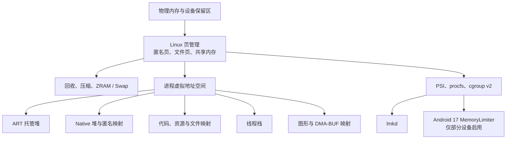

# 4.1 Android 内存模型全景

## 先建立一张可用于排障的地图

Android 应用遇到的“内存问题”至少有四类：

- Java 或 Kotlin 代码分配对象时，ART 无法满足请求并抛出 `OutOfMemoryError`；
- Native 分配器、图形驱动或其他系统调用返回分配失败；
- 系统处于内存压力中，`lmkd` 按进程重要性和内存占用选择目标；
- Android 17 的部分设备启用了 MemoryLimiter，单个应用的匿名内存与 Swap 越过厂商配置的上限。

这几类问题的触发条件、证据和处理方向各不相同。只看一个 PSS 数字，很难判断是哪一类。排查时应沿着“系统是否有压力、进程用了什么、哪一类对象或映射在增长、进程怎样退出”逐层缩小范围。

AOSP `android-17.0.0_r1`（Android 17 / API 37）为 platform anchor，kernel semantics 以 `android17-6.18-2026-06_r6` 为锚点。vendor 可调整 ZRAM、cgroup、graphics driver 和 process limit，因此节点与数值仍以 target device 为准。

排查过程涉及以下层次：



图中的箭头表示管理或记账关系。ART 堆、Native 堆和图形内存最终都依赖内核提供的页、映射或设备缓冲区；同一物理页还可能被多个进程和设备共享。

## 从物理内存到进程地址空间

### 物理内存并不等于应用可用内存

设备标称 RAM、Linux 的 `/proc/meminfo` 中 `MemTotal`、应用可以持续占用的内存是三个不同口径。

- 固件、内核映像、页表、内核对象和硬件保留区会消耗一部分物理内存。
- 文件页缓存会占用 RAM，但其中的干净页通常可以回收。
- 匿名页可以留在 RAM，也可以在配置允许时进入 ZRAM 或其他 Swap 后端。
- 图形、相机和编解码缓冲区可能通过 DMA-BUF 在进程与硬件之间共享；具体记账取决于内核、驱动和 memtrack 实现。
- Android 会保留运行系统服务和前台体验所需的余量，应用无法把 `MemTotal` 当作自己的预算。

因此，`MemFree` 很小并不自动表示系统异常。Linux 会利用空闲页做缓存。判断系统余量时，`MemAvailable` 比 `MemFree` 更有参考价值；判断压力是否已经影响任务运行，还要看 memory PSI、回收活动和进程退出记录。

### 虚拟地址空间只是地址，不等于已占用的 RAM

64 位应用拥有很大的虚拟地址空间。`mmap`、加载 `.so`、预留线程栈或为堆保留地址范围，都会增加虚拟大小；只有被访问并驻留的页才进入 RSS。页还可能是共享的、可回收的或已经换出。

一个 Android 进程常见的映射来源如下：

| 区域 | 常见来源 | 观察时要注意 |
|---|---|---|
| ART 托管堆 | Java/Kotlin 对象、对象数组、部分运行时结构 | 堆容量、已分配对象、活对象和 PSS 口径不同 |
| Native 堆 | `malloc`/`new`、JNI、C/C++ 库 | Java HPROF 看不到 Native 分配 |
| 匿名映射 | `mmap(MAP_ANONYMOUS)`、运行时空间、JIT 等 | 不一定归入 `Native Heap` |
| 代码与资源映射 | APK、`.dex`、`.vdex`、`.oat`、`.art`、`.so`、字体 | 干净文件页可回收，共享页会按 PSS 分摊 |
| 线程栈 | 主线程栈、pthread/ART 创建的线程栈 | 预留地址范围和已经触碰的页差距可能很大 |
| 共享内存 | `memfd`、历史 ashmem、Binder 共享区域等 | 同一物理页可以出现在多个进程 |
| 图形与设备内存 | gralloc、DMA-BUF、EGL/GL/Vulkan、驱动对象 | 进程映射、memtrack 与设备侧占用可能采用不同口径 |

`ActivityManager.getMemoryClass()` 返回的是平台根据 `dalvik.vm.heapgrowthlimit`（没有该属性时回退到 `dalvik.vm.heapsize`）给出的托管堆近似容量，单位为 MiB。它不是进程总内存上限，也不覆盖 Native、代码映射、线程栈和图形内存。`largeHeap` 对应的容量也由设备配置决定，不能写成固定值。

线程栈也不能统一记成“每线程 1 MiB 已用内存”。AOSP Android 17 的 ART `Thread::FixStackSize()` 会根据请求值、运行时默认值、保护区和运行环境修正栈映射；主线程还继承进程启动时创建的栈。栈映射的 VSS 与已触碰页形成的 RSS 应分别观察。

## VSS、RSS、PSS、USS 各回答什么问题

### 四个指标的定义

| 指标 | 含义 | 适合回答的问题 | 主要限制 |
|---|---|---|---|
| VSS / VmSize | 进程虚拟地址空间中所有映射的总大小 | 地址空间是否异常、是否存在超大预留或映射 | 大量页可能从未驻留，不能当作物理占用 |
| RSS | 当前驻留在 RAM 的页总量 | 进程此刻触碰了多少驻留页 | 共享页会在每个映射进程中重复计算 |
| PSS | 每个驻留共享页按映射者数量分摊后求和 | 多进程之间较公平的内存归因 | 共享者变化会让 PSS 波动，采集需要遍历页映射 |
| USS | 通常以 `Private_Clean + Private_Dirty` 估算私有驻留页 | 进程私有驻留规模 | 不等于杀进程后立即增加的可用内存 |

对同一时刻、同一进程和相近工具口径，通常可以使用下面的关系做直觉检查：

`VSS ≥ RSS ≥ PSS ≥ USS`

这条关系不适合替代字段定义。工具是否计入 SwapPss、设备内存、HugeTLB 或 memtrack 数据，会改变最终展示口径。

### 为什么 PSS 会在代码不变时波动

假设三个进程映射了同一个 12 MiB 的驻留共享区域，每个进程先分到约 4 MiB PSS。如果其中两个进程退出，剩余进程会分到约 12 MiB。它的对象和映射没有增长，PSS 仍然可能上升。

所以判断泄漏时，应在可重复的业务阶段采样，并同时观察：

- RSS、PSS、Private Dirty、SwapPss 的趋势；
- Java 对象、Native 分配或 DMA-BUF 等具体组成；
- 共享进程是否启动或退出；
- GC、页面回收和前后台切换的时间点。

“PSS 连续上升”是继续调查的信号，还不是泄漏结论。

### USS 也不是“杀进程能释放多少”

私有干净页可直接丢弃，私有脏页需要回收或释放；共享页在进程退出后会重新分摊；文件描述符关联的内核对象、图形缓冲区和服务端引用也有各自生命周期。USS 适合描述私有驻留规模，无法精确预测进程退出后的 `MemAvailable` 增量。

## 用 procfs 看原始证据

### `/proc/meminfo`：系统级快照

先采集系统总量、可用量、匿名页、文件缓存与 Swap。下面的命令只筛选常用字段，单位由节点输出决定，通常为 kB。

```bash
adb shell 'cat /proc/meminfo | grep -E "^(MemTotal|MemFree|MemAvailable|Buffers|Cached|SReclaimable|Shmem|AnonPages|SwapTotal|SwapFree|SwapCached):"'
```

这些字段要联合阅读。`Cached` 较大通常说明 RAM 被文件页利用；`SwapFree` 下降说明逻辑 Swap 空间在消耗；`SwapCached` 表示已经换入、同时仍在 Swap 中保留副本的页，不能拿来代替 ZRAM 设备占用。

### `/proc/<pid>/status`：低成本进程概览

下面的命令用于快速检查目标进程的地址空间、RSS 分项、Swap 与线程数。

```bash
adb shell 'pid=$(pidof com.example.app); grep -E "^(VmSize|VmRSS|RssAnon|RssFile|RssShmem|VmSwap|VmStk|Threads):" /proc/$pid/status'
```

`VmRSS` 对应驻留集合概览，通常可拆到 `RssAnon`、`RssFile` 和 `RssShmem`。Linux 内核文档提醒，`status` 中部分 RSS 统计通过异步记账获得，精确度低于 `smaps` 汇总。`VmStk` 描述主栈映射大小，不表示主线程已经使用的栈字节数。

Android 的 SELinux、procfs 挂载选项和 ptrace 权限会限制跨进程读取。开发机上可以根据构建类型和应用属性使用 `run-as`、应用自身采集或具备权限的系统工具；量产设备上不要假定 `adb shell` 能读取任意 PID 的 `smaps`。

### `/proc/<pid>/smaps` 与 `smaps_rollup`：逐映射核算

`smaps` 为每个 VMA 提供 `Size`、`Rss`、`Pss`、私有/共享的干净页与脏页、Swap 等字段。`smaps_rollup` 在内核支持时给出进程汇总，输出更短，但仍需要内核遍历相关映射和页。

下面的命令用于查看进程汇总：

```bash
adb shell 'pid=$(pidof com.example.app); cat /proc/$pid/smaps_rollup'
```

下面的命令用于定位 PSS 较大的具体映射：

```bash
adb shell 'pid=$(pidof com.example.app); cat /proc/$pid/smaps' > app.smaps
```

第二条命令把输出保存到主机当前目录，适合离线解析。频繁轮询 `smaps` 会增加 CPU 开销并扰动观测，应根据问题选择采样间隔。

### 4 KiB 与 16 KiB 页大小

Android 15 起，AOSP 支持使用 16 KiB 页大小的设备。Android 17 排查内存时，不应默认页大小是 4 KiB。下面的命令可直接读取运行设备的页大小：

```bash
adb shell getconf PAGE_SIZE
```

`smaps` 还会列出 `KernelPageSize` 和 `MMUPageSize`。兼容映射和设备实现会影响具体输出，因此分析脚本应读取字段，避免把 4096 写死。

16 KiB 页会改变页表规模、缺页行为、对齐要求和小映射的内部碎片。官方文档只给出“平均内存可能略有增加”这类边界描述，没有通用的固定增幅。应用比较前后数据时，应保持 ABI、构建选项、MTE、业务负载和设备配置一致。

## `dumpsys meminfo` 应该怎样读

### 先确认命令和采样条件

下面的命令采集指定包名对应进程的内存快照：

```bash
adb shell dumpsys meminfo com.example.app
```

包可能拥有多个进程。输出前先确认 PID、进程名、前后台状态和业务阶段；需要比较时，使用同一操作脚本、相近的等待时间和相同构建配置。

### App Summary 是分类视图

AOSP Android 17 的 `Debug.MemoryInfo` 将 App Summary 组织为以下字段：

- `Java Heap`：`dalvikPrivateDirty` 加 `.art` 映射的私有页；
- `Native Heap`：Native Heap 的 Private Dirty；
- `Code`：`.so`、`.jar`、`.apk`、`.ttf`、`.dex`、`.oat` 等映射的私有页；
- `Stack`：栈类别的 Private Dirty；
- `Graphics`：`Gfx dev`、`EGL mtrack` 与 `GL mtrack` 汇总；
- `Private Other`：总私有页扣除前面几项；
- `System`：总 PSS 扣除总私有页后的余量，包含共享页的比例归因；内核提供 SwapPss 时也会受到比例化 Swap 的影响；
- `TOTAL PSS` 与 `TOTAL SWAP`：该次采样的 PSS 和 Swap 汇总。

这组分类由 `Debug.MemoryInfo` 的计算方式定义，不能逐项理解为独立的物理内存池。例如 `Java Heap` 是私有页口径，`TOTAL PSS` 还包含共享页的比例归因。

### 详细表格用于解释“增长来自哪里”

详细表格中的 `Dalvik Heap`、`Native Heap`、`.so mmap`、`.dex mmap`、`.art mmap`、`Stack`、`Ashmem`、`Memfd`、`EGL mtrack` 等行，来自内核映射分类和 memtrack 数据。

分析两次快照时，建议按以下顺序：

1. 确认 PID 和场景一致，记录采样时间与应用状态。
2. 比较 `TOTAL PSS`、RSS、SwapPss/Swap 的总体变化。
3. 找到变化最大的分类行。
4. 按分类切换工具：Java HPROF、Native heap profiler、`smaps`、DMA-BUF/图形工具或 Perfetto。
5. 在应用回到稳定状态后重复多轮，验证增长是否可复现。

`Objects` 区域里的 View、Activity、Binder、Parcel 等计数适合发现异常线索。一次计数偏高无法证明泄漏；需要结合对象保留路径、生命周期和重复场景判断。

### 图形内存需要跨进程、跨驱动核对

Android 17 的 `getSummaryGraphics()` 只汇总 `Gfx dev`、`EGL mtrack` 和 `GL mtrack`。memtrack 数据是否完整取决于设备实现。Vulkan、gralloc、DMA-BUF 和 SurfaceFlinger 持有的缓冲区还可能在其他节点或进程中记账。

排查图形增长时可以组合使用：

- `dumpsys meminfo`：查看进程视角的映射和 mtrack 分类；
- `dumpsys SurfaceFlinger`：查看合成层与缓冲区相关状态；
- `/proc/<pid>/smaps`：定位设备映射与共享映射；
- `/proc/<pid>/dmabuf_rss`：仅部分 Android 内核提供，且可能需要额外权限；
- Perfetto 与厂商 GPU 工具：观察分配、提交、回收和进程状态的时间关系。

`dumpsys gfxinfo` 主要提供 UI 渲染性能、帧与部分对象统计，不是完整的图形内存核算工具。

### Ashmem、memfd 与 DMA-BUF 的职责要分开

较新 Android 版本逐步使用 memfd 负责通用共享内存场景；DMA-BUF 面向设备之间以及设备与进程之间的缓冲区共享，常见于图形、相机和媒体。两者解决的问题不同，不能用“DMA-BUF 取代 ashmem”概括版本变化。

## 堆转储与采样边界

### Java HPROF 回答对象保留问题

需要分析 Java/Kotlin 对象、类实例数和引用链时，可以对允许调试的目标进程采集受管堆。下面的命令把 HPROF 写入设备临时目录，并在转储前请求 GC：

```bash
adb shell am dumpheap -g com.example.app /data/local/tmp/app.hprof
adb pull /data/local/tmp/app.hprof
```

AOSP Android 17 的 `ActivityManagerShellCommand.runDumpHeap()` 把 `-g` 解析为 `runGc=true`，再交给 AMS 与应用进程执行。转储会暂停进程、遍历堆并额外消耗内存，低余量现场可能被它明显扰动。应先保留退出原因、日志、PSS/RSS 和时间线，再评估是否适合抓 HPROF。

同一命令的 `-n` 选择 Native heap dump，`-m` 请求 malloc 信息；它们的输出不是 Java HPROF，不能直接按 Java 对象图读取。Native 分配应使用 Perfetto `android.heapprofd`、malloc 调试或厂商工具，选择取决于构建与权限。

### Perfetto Java heap profiler 的适用范围

Perfetto 的 `android.java_hprof` 可把 ART 堆图写入 Trace，并支持按进程名或 PID 选择目标。连续快照会产生显著开销和较大 Trace，通常先采单次快照，再根据复现窗口决定是否启用 `continuous_dump_config`。

Android 14 及以后还可以使用 `android.java_hprof.oom` 捕获 OOME 触发的堆信息；Android 17 的 Perfetto 服务源码仍注册了该数据源。是否能够采集目标应用，受应用可分析属性、系统配置和权限限制。

## 系统内存压力、cgroup 与进程退出

### `MemAvailable` 与 PSI 描述不同维度

`MemAvailable` 估算在不发生 Swap 的前提下，可供新应用使用的内存。PSI 记录任务因为等待内存资源而停顿的时间比例。下面的命令用于查看设备当前的内存压力停顿：

```bash
adb shell cat /proc/pressure/memory
```

`some` 表示至少有任务受影响，`full` 表示所有非空闲任务都因该资源同时停顿。短时尖峰和持续高压的含义不同，应把 PSI 与 `vmstat`、ZRAM、页面回收、业务卡顿和 `lmkd` 事件放在同一时间线上。

### cgroup v2 的几个内存控制文件

Linux 6.18 的 cgroup v2 内存控制器给每个层级提供一组明确语义：

| 文件 | 内核语义 |
|---|---|
| `memory.low` | 尽力保护边界；低于有效边界的内存受到较少回收 |
| `memory.high` | 节流边界；越界任务进入直接回收并可能被节流，本身不调用 OOM killer |
| `memory.max` | 硬上限；回收无法满足时可能触发该 cgroup 内的 OOM |
| `memory.current` | 当前内存用量 |
| `memory.stat` | 匿名页、文件页、shmem、回收等分类统计 |
| `memory.events` | `low`、`high`、`max`、`oom`、`oom_kill` 等事件计数 |
| `memory.swap.current` | 当前 Swap 使用量 |
| `memory.swap.max` | Swap 硬上限；达到后不再允许该 cgroup 继续换出匿名页 |
| `memory.pressure` | 该 cgroup 的 memory PSI |

Android 通过 `libprocessgroup` 与 task profile 管理进程所在的 cgroup。设备可以采用不同控制器和层级配置；定位时应读取该构建的 `cgroups.json`、`task_profiles.json` 以及运行设备的 cgroup 文件系统，避免凭版本号推断固定路径。

### Android 17 MemoryLimiter：只在部分设备生效

Android 17 引入面向单应用的 MemoryLimiter 行为变化。它由 `system_server` 中的 Java 服务和 JNI 原生组件组成，使用每进程 cgroup v2 监控应用进程。厂商配置文件位于 `/vendor/etc/memory-limiter-config.xml`；文件可选，没有适用配置时该功能关闭。因此，“Android 17 应用都有固定内存上限”这个结论不成立。

Android 17 r1 源码中的关键流程如下：

1. Java 层按进程状态选择 visible、not-visible、cached 或 unrestricted 限制。
2. JNI 层把限制写入每进程 cgroup 的 `memory.high` 和 `memory.swap.max`。
3. JNI 从 `memory.stat` 读取 `anon` 与 `shmem`，从 `memory.swap.current` 读取 Swap。
4. 联合判断使用 `anon + shmem + swapCurrent` 与 `memHigh + swapMax` 比较。
5. 联合上限越界后，服务解除该进程的限制；配置允许时触发 `ProfilingTrigger.TRIGGER_TYPE_ANOMALY`，并安排 30 秒后的进程终止。

应用侧可通过 `ApplicationExitInfo` 区分该类退出：reason 为 `REASON_OTHER`，description 包含 `MemoryLimiter:AnonSwap`。测试设备可以使用以下命令确认功能状态和临时配置：

```bash
adb shell am memory-limiter status
adb shell am memory-limiter ignore 10087
adb shell am memory-limiter ignore none
adb shell am memory-limiter manual 12345 10
adb shell am memory-limiter manual 12345 none
```

`ignore` 接受 UID、`none` 或 `all`；`manual` 接受 PID 与百分比、`max` 或 `none`。手动限制随进程重启或状态变化而失效，适合测试，不应作为应用运行时能力依赖。

MemoryLimiter 与 `lmkd` 的决策依据也不同。MemoryLimiter 约束单个受监控进程的匿名页与 Swap；`lmkd` 在系统压力下结合进程重要性等信息选择终止目标。复盘进程消失时，应先读取 `ApplicationExitInfo`、系统日志和 PSI，再确定是哪条路径。

## ZRAM 与 Swap：容量、压缩数据和 RAM 成本

Android 常把 ZRAM 块设备配置为 Swap。匿名页换出后，数据通常以压缩形式保存在 RAM；内核还支持为 ZRAM 配置 backing device，把空闲或难压缩页面写回存储。是否启用、采用什么压缩算法以及容量多大，均由设备配置决定。

下面的命令用于确认 Swap 与 ZRAM 设备：

```bash
adb shell cat /proc/swaps
adb shell cat /sys/block/zram0/mm_stat
```

Linux 6.18 的 `mm_stat` 依次提供这些核心字段：

- `orig_data_size`：ZRAM 中数据的未压缩大小；
- `compr_data_size`：压缩数据大小；
- `mem_used_total`：ZRAM 分配器消耗的 RAM，包含碎片和元数据；
- `mem_limit`、`mem_used_max`：内存限制与历史峰值；
- `same_pages`、`pages_compacted`：相同页优化与压实结果；
- `huge_pages`、`huge_pages_since`：难压缩页统计。

评估压缩效果时，可以用 `orig_data_size / compr_data_size` 描述数据压缩比；评估 ZRAM 对物理 RAM 的成本时，应看 `mem_used_total`。`compr_data_size` 小于 `mem_used_total` 很常见，因为后者包含分配器碎片和元数据。

ZRAM 使用较高只说明更多匿名页已进入压缩 Swap。系统是否陷入内存抖动，还要观察 PSI、换入换出、回收扫描、CPU 压缩开销和前台延迟。单次 `SwapTotal - SwapFree` 无法给出这些结论。

## 用 Perfetto 把“数值”变成“时间线”

### 进程与系统统计来自不同数据源

Android 17 锚点下，Perfetto 的相关数据源职责如下：

- `linux.process_stats`：轮询 `/proc/<pid>/status` 等文件，记录 RSS 分项、Swap、`oom_score_adj` 等进程计数；
- `linux.sys_stats`：轮询 `/proc/meminfo`、`/proc/vmstat` 与 `/proc/pressure/*`；
- `android.java_hprof`：抓取 ART 托管堆图；
- `android.java_hprof.oom`：等待 OOME 触发的托管堆采集；
- `android.heapprofd`：采样 Native 堆分配调用栈；
- `linux.ftrace`：记录调度、回收、OOM/LMK 等所选内核与 Android 事件。

`linux.process_stats` 默认不会提供 PSS。配置 `scan_smaps_rollup: true` 后可以采样 `smaps_rollup`，但 Android 系统守护进程场景通常需要 root，并受 ptrace 与 procfs 权限限制。做 PSS 趋势时，应先确认 Trace 配置和设备权限，不能把任意“进程内存”轨道都称为 PSS。

下面给出一个低频观察系统与进程内存趋势的最小配置。它适合先定位增长窗口，随后再按分类启用堆分析器。

```textproto
buffers {
  size_kb: 32768
  fill_policy: RING_BUFFER
}
duration_ms: 30000

data_sources {
  config {
    name: "linux.process_stats"
    process_stats_config {
      scan_all_processes_on_start: true
      proc_stats_poll_ms: 1000
    }
  }
}

data_sources {
  config {
    name: "linux.sys_stats"
    sys_stats_config {
      meminfo_period_ms: 1000
      vmstat_period_ms: 1000
      psi_period_ms: 1000
    }
  }
}
```

`proc_stats_poll_ms` 在 Perfetto proto 中要求大于 100 ms，sys stats 的各轮询周期要求大于 10 ms；高频采样会增加开销。示例使用 1 秒周期，适合观察秒级趋势，无法解释一次几毫秒的分配尖峰。

### 一条可复用的排查顺序

面对“内存不断上涨”或“进程突然消失”，可以按下面的顺序取证：

1. 记录构建、页大小、MTE 模式、设备总内存、ZRAM 配置和复现步骤。
2. 用 `ApplicationExitInfo`、日志与 tombstone 区分 ART OOME、Native 崩溃、`lmkd`、MemoryLimiter 或主动退出。
3. 用 `/proc/meminfo`、PSI 和 Perfetto 判断系统是否有持续压力。
4. 用 `dumpsys meminfo` 与 `smaps` 找出 Java、Native、Code、Stack、Graphics、共享页或 Swap 中的主要变化。
5. 根据分类选择 Java HPROF、heapprofd、图形/DMA-BUF 工具或线程与映射分析。
6. 回到稳定业务状态，重复多轮并比较保留量，验证修复前后的差异。

这套顺序能避免在系统杀进程问题上只抓 Java HPROF，也能避免把共享页重新分摊造成的 PSS 上升误判为对象泄漏。

## MTE 与内存数据的比较条件

Arm Memory Tagging Extension（MTE）通过分配标签和指针标签检测 use-after-free、buffer overflow 等错误。Android 应用可按设备能力与配置使用同步或异步模式。MTE 会引入标签存储、分配器与检查成本，但成本取决于硬件、模式、分配模式和工作负载，AOSP 文档没有给出适用于所有设备的固定 RAM 百分比。

比较两个版本的内存数据时，应记录：

- MTE 是否启用以及使用哪种模式；
- 系统页大小是 4 KiB 还是 16 KiB；
- ABI、编译选项、调试工具与符号化配置；
- 业务数据量、页面层级、图片规格和前后台状态。

这些配置变化会影响内存分类与采样开销。没有控制变量的 PSS 对比很难支持因果判断。

## 常见判断的校正

### “Java 堆没满，所以不会 OOM”

进程还包括 Native、线程栈、代码映射、图形与共享内存。ART 自身也可能因连续空间、堆增长策略或分配请求无法满足而抛出 OOME。应先看异常栈与退出原因，再看相应内存域。

### “RSS 就是应用独占的 RAM”

RSS 会在每个进程重复计算共享驻留页。比较多个进程的归因时使用 PSS；调查单进程此刻触碰的驻留页时，RSS仍然有用。

### “PSS 上升一定是泄漏”

共享者变化、预热、JIT、图片缓存、页面回收与 Swap 都可能改变 PSS。泄漏需要稳定场景下的持续保留量和引用证据。

### “代码和资源不会影响运行时内存”

APK、DEX/OAT/VDEX、`.so`、字体和资源会形成文件映射，代码执行与重定位还会产生私有页。精简依赖、R8 优化和按需加载可以同时影响安装体积、启动 I/O 与运行时内存。

### “ZRAM 越高，系统越危险”

ZRAM 是匿名页回收策略的一部分。风险来自持续换入换出、回收停顿、压缩 CPU 成本和前台延迟，应结合 PSI 与时间线判断。

### “16 KiB 页或 MTE 会固定增加某个百分比”

两者的开销都受设备、构建和负载影响。引用固定比例前必须有同设备、同场景、同配置的测量数据。

## 小结

Android 内存分析的核心是区分三件事：

- 地址空间、驻留页、共享归因和私有页采用不同口径；
- Java、Native、代码、线程栈、图形与内核资源需要不同工具；
- 分配失败、系统压力杀进程与 Android 17 MemoryLimiter 是不同退出路径。

先用退出原因和系统压力确定问题类型，再用 `dumpsys meminfo`、procfs 与 Perfetto 找到增长分类，最终进入 Java 对象、Native 调用栈或图形缓冲区。这样得到的证据可以回到源码、配置和可重复实验中验证。

## 源码与文档锚点

- [AOSP Android 17 `Debug.MemoryInfo`](https://android.googlesource.com/platform/frameworks/base/+/refs/tags/android-17.0.0_r1/core/java/android/os/Debug.java)
- [AOSP Android 17 `ActivityManagerShellCommand`](https://android.googlesource.com/platform/frameworks/base/+/refs/tags/android-17.0.0_r1/services/core/java/com/android/server/am/ActivityManagerShellCommand.java)
- [AOSP Android 17 `MemoryLimiter.java`](https://android.googlesource.com/platform/frameworks/base/+/refs/tags/android-17.0.0_r1/services/core/java/com/android/server/am/MemoryLimiter.java)
- [AOSP Android 17 `MemoryLimiter.cpp`](https://android.googlesource.com/platform/frameworks/base/+/refs/tags/android-17.0.0_r1/services/core/jni/com_android_server_am_MemoryLimiter.cpp)
- [Android 17：所有应用的行为变更](https://developer.android.com/about/versions/17/behavior-changes-all)
- [Android Memory Limiter](https://source.android.com/docs/core/perf/memory-limiter)
- [Android 应用内存管理](https://developer.android.com/topic/performance/memory)
- [Android 图形内存管理](https://developer.android.com/topic/performance/graphics/manage-memory)
- [支持 16 KiB 页大小](https://developer.android.com/guide/practices/page-sizes)
- [Arm MTE 开发指南](https://developer.android.com/ndk/guides/arm-mte)
- [Linux 6.18 cgroup v2 文档](https://android.googlesource.com/kernel/common/+/refs/tags/android17-6.18-2026-06_r6/Documentation/admin-guide/cgroup-v2.rst)
- [Linux 6.18 ZRAM 文档](https://android.googlesource.com/kernel/common/+/refs/tags/android17-6.18-2026-06_r6/Documentation/admin-guide/blockdev/zram.rst)
- [Perfetto `ProcessStatsConfig`](https://android.googlesource.com/platform/external/perfetto/+/refs/tags/android-17.0.0_r1/protos/perfetto/config/process_stats/process_stats_config.proto)
- [Perfetto `SysStatsConfig`](https://android.googlesource.com/platform/external/perfetto/+/refs/tags/android-17.0.0_r1/protos/perfetto/config/sys_stats/sys_stats_config.proto)
- [Perfetto `JavaHprofConfig`](https://android.googlesource.com/platform/external/perfetto/+/refs/tags/android-17.0.0_r1/protos/perfetto/config/profiling/java_hprof_config.proto)
