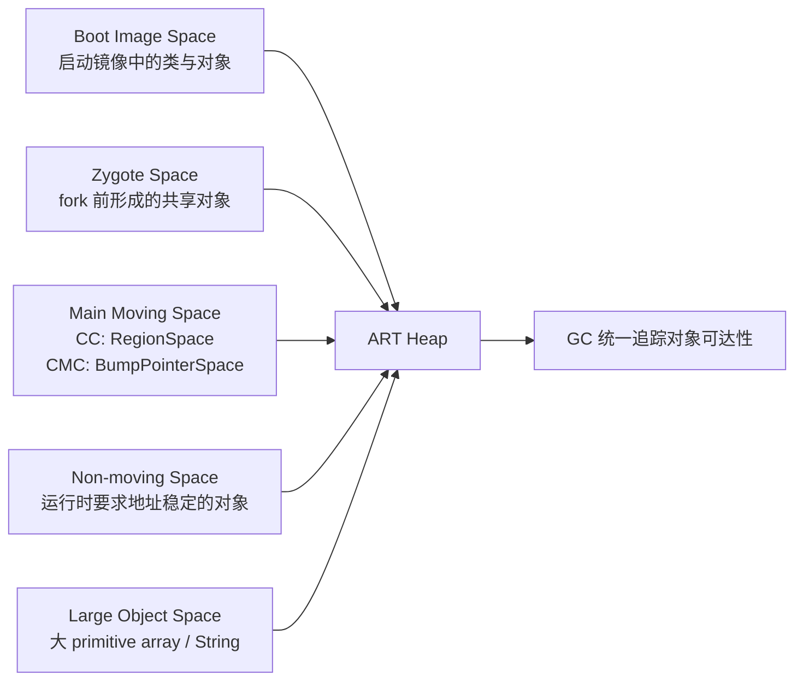
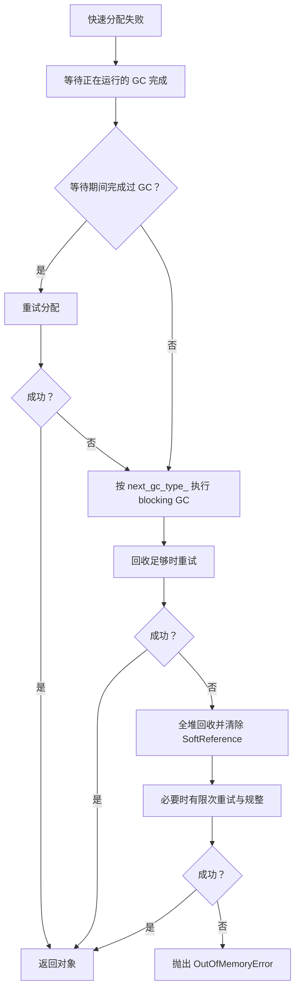

# ART Heap、GC 与后台维护调度

平台源码以 Android 17 / API 37 / `android-17.0.0_r1` 为锚点，旧版本只用于解释演进。设备厂商可以调整垃圾回收（Garbage Collection，GC）类型、堆参数和运行时开关，因此具体设备仍以该设备的跟踪数据、日志与属性为准。

Android Runtime（ART）的内存问题很少只表现为一个数字。一次掉帧可能来自 GC 暂停，也可能是应用线程等待正在运行的 GC；Java 堆仍有空闲时，分配仍可能因连续空间不足而失败；原生内存分配持续增长，也会通过 ART 的登记机制触发 Java GC。

读懂这些现象，需要同时回答四个问题：

1. 对象分配到了哪个堆空间（space）？
2. 当前进程运行的是哪种垃圾收集器（collector）？
3. 这次 GC 的类型和原因分别是什么？
4. 应用线程在 GC 期间被暂停、抢占，还是在等待分配？

ART Heap 的性能由对象分配、存活集、GC 算法和后台维护共同决定。分代 GC 缩小常规回收范围，HeapTask 和 trim 调整维护时机，但都受前后台状态、Freezer 与内存压力约束。

## 对象分配、Heap 与 GC 基线

### ART 堆空间关系

ART 的 `Heap` 管理多个用途不同的堆空间。下图表示这些空间与 ART 堆的归属关系，不代表它们在每台设备上的固定虚拟地址顺序。



这五类空间的差别集中在三个维度：对象从哪里来、GC 能否回收、GC 能否移动。

| 空间 | 主要内容 | 可回收 | 可移动 | Android 17 主要实现 |
|---|---|---:|---:|---|
| 启动镜像空间（Boot Image Space） | 启动镜像中的预加载类、对象和运行时元数据 | 否 | 否 | `ImageSpace` |
| Zygote 空间 | Zygote 在创建应用进程前保留下来的对象 | 应用进程中否 | 否 | `ZygoteSpace` |
| 主移动空间（Main Moving Space） | 应用的大多数普通对象 | 是 | 是 | CC 使用 `RegionSpace`；CMC 使用 `BumpPointerSpace` |
| 非移动空间（Non-moving Space） | ART 明确要求地址稳定的托管对象 | 是 | 否 | 独立的 `DlMallocSpace` |
| 大对象空间（Large Object Space） | 达到阈值的基本类型数组或 `String` | 是 | 否 | `FreeListSpace` 或 `LargeObjectMapSpace` |

#### 启动镜像空间：映射预生成对象

构建系统会为启动类路径（boot class path）生成 ART 镜像。进程启动时，`ImageSpace` 将镜像映射进地址空间，进程可以直接使用其中已经布局好的类、对象和元数据。映射页可以在进程之间共享，这也是 Zygote 启动模型能降低重复内存与启动工作的基础之一。

启动镜像空间属于 GC 的免疫空间（immune space）：其中的对象不由应用进程回收，也不会在应用 GC 中移动。不过，GC 仍要处理这里指向应用堆对象的引用。ART 使用卡表（card table）按内存片区记录可能变化的引用，并用修改联合表（mod-union table）汇总跨空间引用，避免每次都扫描整个镜像。

源码入口：

- `runtime/gc/space/image_space.cc`
- `runtime/gc/collector/immune_spaces.cc`
- `runtime/gc/accounting/mod_union_table.cc`

#### Zygote 空间：进程复制边界上的只读主体

`Heap::PreZygoteFork()` 会先完成必要的 GC 和堆裁剪（trim），再建立 Zygote 通过 `fork()` 复制应用进程后使用的堆结构。启用 Zygote 规整时，`ZygoteCompactingCollector` 把存活对象压缩到当前非移动映射中。随后，`MallocSpace::CreateZygoteSpace()` 在页对齐边界切分这块映射：

- 前半段成为 Zygote 空间；
- 剩余尾部成为新的非移动空间；
- 应用的普通可移动对象继续使用独立的主移动空间。

因此，“把分配空间复制到非移动空间尾部”不足以描述 Android 17 的实现。这里同时涉及规整、空间切分、类表（class table）与字符串驻留表（intern table）快照，以及 mod-union table 的建立。

应用进程不会回收或移动 Zygote 空间中的对象。未修改的页面可继续与 Zygote 共享；应用写入页面会触发写时复制（Copy-on-Write，COW），增加该进程的私有脏页（Private Dirty）。Zygote 对象若在 `fork()` 后指向应用新对象，ART 仍需通过 mod-union table 和卡表记录这些引用。

源码入口：

- `runtime/gc/heap.cc`：`Heap::PreZygoteFork()`
- `runtime/gc/space/malloc_space.cc`：`MallocSpace::CreateZygoteSpace()`
- `runtime/gc/collector/zygote_compacting_collector.cc`

#### 主移动空间：普通对象的主要去处

Android 17 中，主移动空间的实现随收集器改变：

- 并发复制收集器（Concurrent Copying，CC）使用 `RegionSpace`，每个 region 固定为 256 KiB；
- 并发标记规整收集器（Concurrent Mark-Compact，CMC）使用连续的 `BumpPointerSpace`。

这两条路径在运行时初始化时确定。`Heap` 还会同步选择对应的分配器（allocator）：CC 常用 `RegionTLAB`，CMC 使用指针递增（bump pointer）/TLAB 路径。不能只根据 Android 版本号推断某台设备正在使用哪条路径，厂商构建与运行时属性同样参与选择。

#### 大对象空间：12 KiB 只是第一个条件

Android 17 的默认大对象阈值是 12 KiB：

```cpp
static constexpr size_t kMinLargeObjectThreshold = 12 * KB;
static constexpr size_t kDefaultLargeObjectThreshold = kMinLargeObjectThreshold;
```

这个常量用于说明默认边界。运行时参数可以把阈值调高，但不能低于 12 KiB。

`Heap::ShouldAllocLargeObject()` 还检查对象类型。对象只有同时满足以下条件，才优先进入大对象空间（Large Object Space，LOS）：

- `byte_count >= large_object_threshold_`；
- 类型是基本类型数组或 `String`。

普通对象数组、业务实体或图片的 Java 包装对象，不会仅因对象“大”就自动进入 LOS。图片像素也可能位于原生内存或 GPU 内存；看到 Bitmap 时应先确认像素存储位置。

LOS 有两种实现：

- `FreeListSpace` 预留一段地址范围并按空闲页复用；
- `LargeObjectMapSpace` 为对象建立独立映射，释放时解除映射。

默认选择由 `USE_ART_LOW_4G_ALLOCATOR` 构建宏决定。LOS 是非连续、不可移动的空间，回收时标记和清除对象，不参与主移动空间的搬迁。频繁创建大型 `byte[]`，或把大量 `char` 数据转成 `String`，会增加 LOS 分配、清扫和页面映射压力。

源码入口：

- `runtime/gc/heap.h`：`kMinLargeObjectThreshold`
- `runtime/gc/heap-inl.h`：`Heap::ShouldAllocLargeObject()`
- `runtime/gc/space/large_object_space.cc`

#### 非移动空间：ART 内部的地址稳定区

Android 17 在需要独立非移动空间时创建 `DlMallocSpace`，并把 `can_move_objects` 设为 `false`。源码注释列出的主要内容包括 `Class`、`ArtMethod`、`ArtField` 和其他被明确要求不可移动的对象。

Java 的 `DirectByteBuffer` 不能作为这里的通用例子。它的 Java 包装对象仍可移动，底层直接内存位于托管堆之外。现代 Bitmap 的像素存储也不能据此归入非移动空间。

`Heap::kDefaultNonMovingSpaceCapacity` 是 64 MiB，`-XX:NonMovingSpaceCapacity` 可以调整它。Zygote 创建阶段会切分最初的映射，因此 64 MiB 是 ART 默认配置值，不应解释成每个应用专供 DirectByteBuffer 使用的固定额度。

应用代码通常不会主动选择这个分配器。ART 在类链接、反射构造的特定路径和其他运行时内部场景中调用 `AllocNonMovableObject()`。

源码入口：

- `runtime/gc/heap.cc`：非移动空间创建逻辑
- `runtime/gc/heap.h`：`kDefaultNonMovingSpaceCapacity`
- `runtime/mirror/class-alloc-inl.h`：`AllocNonMovableObject()`
- `runtime/class_linker.cc`

#### 低 4 GiB 地址范围：约束托管堆布局，不约束整个进程

ART 的 `HeapReference` 使用 32 位压缩引用，即以较短的数值表示对象地址。为此，主要托管对象地址、卡表覆盖范围和相关映射需要满足低 4 GiB 布局要求。`heap.cc` 中多处映射会请求 `low_4gb=true`，或者选择低地址作为首选地址（preferred address）。

这项约束不表示 64 位应用只能使用 4 GiB 虚拟地址空间。原生堆、线程栈、共享库、即时编译（JIT）代码缓存、图形缓冲区和文件映射可以位于其他地址范围。分析 `/proc/<pid>/maps` 时，应把“托管对象引用宽度”与“进程总虚拟地址空间”分开。

### 对象分配：快路径为什么快，慢路径为什么会卡

#### 小对象的快路径

启用线程局部分配缓冲区（Thread-Local Allocation Buffer，TLAB）后，线程会在自己的缓冲区内按递增指针（bump pointer）分配。只要剩余空间足够，主要工作近似为：

```text
result = tlab_pos
tlab_pos += aligned_object_size
```

这段伪代码只说明地址推进方式。对象清零、类指针写入、构造发布屏障、分配统计和插桩（instrumentation）仍由 ART 的分配入口处理。

Android 17 源码中的相关常量是：

- `Heap::kDefaultTLABSize = 32 KiB`；
- `Heap::kPartialTlabSize = 16 KiB`；
- `RegionSpace::kRegionSize = 256 KiB`。

这三个值属于不同层次。一个 region 可以承载 TLAB；默认 TLAB 大小不等于 region 大小。TLAB 用完后，`RegionSpace::AllocNewTlab()` 会持有 `region_lock_`，先尝试复用足够大的部分 TLAB，再寻找或建立合适的 region。把这里统称为“获取堆全局锁并 `mmap` 新 region”会掩盖真实分支。

CMC 的 `BumpPointerSpace` 也支持 TLAB。因此，TLAB 不是 CC 专属概念，具体分配器要结合收集器与 `Heap::GetCurrentAllocator()` 判断。

##### 部分 TLAB、默认 TLAB 与 region 不是同一个尺寸

TLAB 补充（refill）不是单一路径：

- 当前 TLAB 尾部仍有空间时，ART 可以先扩展可用范围；
- `BumpPointerSpace` 通常以 32 KiB 默认 TLAB 为参考申请连续区间；
- `RegionSpace` 会按对象大小和可用 region 计算部分 TLAB，16 KiB 是默认参考值，单个 region 则是 256 KiB；
- 补充 TLAB 需要进入共享空间的锁保护，但成功后的普通对象分配仍回到线程本地递增指针快路径。

因此，看到 16 KiB、32 KiB 和 256 KiB 时，应先确认它描述的是部分 TLAB、默认 TLAB，还是 RegionSpace 区域。它们也不随设备基础页大小机械保持倍数关系。

##### RosAlloc 的线程本地内存块

标记清除（Mark-Sweep）/并发标记清除（CMS）系列收集器在 Android 17 中仍可使用 RosAlloc。RosAlloc 按尺寸档位（size bracket）把小对象放入内存块（run），并优先使用线程本地 run；共享 run 的分配与回收才需要进入对应尺寸档位的锁。超过小对象档位的请求按页粒度处理。

因此，两种常见描述都不准确：TLAB 并非所有收集器的唯一快路径，RosAlloc 也不是每次小对象分配都获取一个堆全局锁。诊断要先确认当前收集器与分配器，再解释锁竞争或 TLAB 补充成本。

##### 插桩会改变被观察的快路径

分配记录、Java 虚拟机工具接口（JVMTI）插桩或精细采样，可能让分配经过额外钩子、统计与调用栈采集。优化实验应保持相同的分析器配置；不能把开启逐次分配记录后的耗时直接外推到未插桩的发布构建。

#### LOS 分配失败后还会尝试普通空间

`Heap::AllocObjectWithAllocator()` 先调用 `ShouldAllocLargeObject()`。如果 LOS 分配失败，ART 会清除本轮 LOS 内存不足（OOM）异常，再尝试普通分配器。因此，不能只凭对象大小和最终一条 OOM 日志断定失败发生在 LOS；还要看分配器类型、剩余空间和碎片日志。

#### 分配慢路径

普通分配返回空指针后，`Heap::AllocateInternalWithGc()` 接管。Android 17 的主要路径如下：



几个细节会直接影响跟踪数据的解读：

- 若其他线程已经在做 GC，分配线程会进入 `WaitForGcToComplete()`；等待本身可能形成明显卡顿。
- ART 先尝试 `next_gc_type_`。这个类型由上一次 GC 后的存活量、吞吐估计和堆目标计算决定，不固定为年轻代或全堆回收。
- 最后的回收会使用 `gc_plan_.back()`，收集整个堆并清除软引用。源码还会根据回收收益限制反复 GC，防止长期频繁回收（GC thrashing）。
- 对 RosAlloc/DlMalloc 路径，满足配置和时间间隔时还可能尝试同构空间规整（homogeneous space compaction），即把对象迁移到布局相同的空间以减少碎片。
- OOM 日志若显示总空闲字节大于请求大小，ART 会补充最大连续块等碎片信息。

“分配失败 → 后台 GC → 全堆 GC → OOM”只是粗略图示。源码还包含等待、并发竞争、分配器变化、回收收益和碎片规整等分支。

### GC 的三种分类不要混用

一次 GC 至少有三种分类。

#### 收集器：使用哪套算法

Android 17 仍保留多种收集器类型，包括 CC、CMC、CMS、标记清除（Mark Sweep）、半空间复制（Semi-space）等。常见应用进程重点关注：

- `kCollectorTypeCC`：并发复制（Concurrent Copying）；
- `kCollectorTypeCMC`：并发标记规整（Concurrent Mark-Compact）；
- `kCollectorTypeCMS`：并发标记清除（Concurrent Mark-Sweep），主要用于兼容或定制配置。

#### GC 类型：收集多大范围

`GcType` 定义了 `Sticky`、`Partial`、`Full`。在启用分代的 CC/CMC 中，`Sticky` 会选择年轻代收集器；非 Sticky 路径会选择覆盖更大范围的收集器。

“年轻代 GC”（Young GC）描述分代收集器的工作范围；`Full` 是一种 `GcType`。日志与跟踪数据中还会出现收集器名称，不能只按字符串中的 `GC` 猜测范围。

#### GC 原因：为什么触发

Android 17 的常见 `GcCause` 包括：

| 原因值 | 含义 |
|---|---|
| `Alloc` | 分配失败，分配线程需要等待或参与回收 |
| `Background` | 为后续分配提前异步回收 |
| `Explicit` | `System.gc()` / `Runtime.gc()` 等显式请求 |
| `NativeAlloc` | ART 登记的、可由 Java GC 间接释放的原生内存超过触发水位 |
| `CollectorTransition` | 收集器或前后台策略切换 |
| `HeapTrim` | 堆裁剪；它不是普通对象回收 |

`GarbageCollector::Run()` 生成的跟踪名称由 GC 原因、收集器名称和 `GC` 组成。例如，Android 17 CMC 的收集器名称是 `concurrent mark compact`，完整名称还会带 `Alloc`、`Background` 或 `Explicit`。

### GC 演进：历史版本与 Android 17 当前选择

#### Dalvik 与 ART 早期

Dalvik 主要使用非移动的标记清除与 `dlmalloc`。ART 5.0 之后引入 CMS 和 RosAlloc，把部分标记工作移到并发阶段，并用按槽位/内存块（slot/run）组织的分配器减少多线程分配竞争。CMS 长期不搬移普通对象，碎片需要在后台转换或分配失败时通过额外规整处理。

历史设备性能差异很大，不宜引用“暂停固定为几十毫秒”或“分配快若干倍”一类跨设备数字。判断旧设备应使用同机型、同系统、同负载的数据。

#### Android 8：CC 成为默认 GC 方案

AOSP 的 ART GC 文档说明，Android 8 起默认方案是并发复制。CC 使用 `RegionSpace` 和 RegionTLAB，并通过读屏障（read barrier）在对象读取时修正引用，使应用线程能够与对象搬迁并发运行。

CC 并不把整个 Java 堆机械地分成两个等大的物理堆。Android 17 的 `RegionSpace` 为 CC 预留最多两倍容量的虚拟地址范围，以支持显式 GC 时搬迁所有 region；具体物理页消耗取决于已提交页面和回收过程。用“GC 时 RSS 必然接近两倍 Java 堆”判断内存峰值会产生误差。

CC 按 region 决定是否搬迁。Android 17 中：

- region 大小是 256 KiB；
- 新分配 region 或被强制选择的 region 会进入疏散（evacuation），即把存活对象搬到其他区域；
- 非大型 region 的存活率低于 75% 时可被搬迁；
- 高存活 region 可以成为 `UnevacFromSpace`，避免为了少量空洞搬走大量存活对象；
- 大型 region 不做疏散。

这些规则解释了 CC 如何兼顾碎片整理与复制成本。75% 是 region 选择阈值，不能换算成 GC 暂停时间或应用内存告警线。

Android 10 起，默认 CC 支持分代收集。年轻代 CC 优先处理新分配对象；ART 会比较最近一次年轻代 GC 与更大范围 GC 的估算吞吐，决定下一次继续收集年轻代还是扩大收集范围。

#### CMC：用缺页故障协调并发规整

Android 17 的 `ShouldUseUserfaultfd()` 有两类入口。命令行显式指定 CMC 时会直接选择 CMC，这主要供测试和定制配置使用，后续仍可能进入停止所有应用线程（Stop-The-World，STW）的后备路径。未显式指定收集器的目标 Android 设备，需要同时满足系统属性允许 UFFD GC，并且 `KernelSupportsUffd()` 返回成功。UFFD 是用户空间缺页处理接口 `userfaultfd` 的简称。

默认设备路径中的内核探测还包括：

- `MREMAP_DONTUNMAP` 可用。源码按内核版本判断，也会直接探测，以兼容移植到旧分支的 GKI 补丁（backport）；
- `userfaultfd` 系统调用可用；
- UFFD API 提供让缺页线程收到总线错误信号的 `SIGBUS` 特性。次要缺页特性属于另一种模式的能力，不能把它写成 CMC 启用的唯一条件。

默认条件不满足时，采用读屏障的构建会走 CC。`gUseUserfaultfd` 与 `gUseReadBarrier` 在当前实现中互为相反值，应用运行期间不会在 CC 和 CMC 之间动态切换。

CMC 的规整过程会预留一段权限为 `PROT_NONE` 的来源空间（from-space）虚拟地址，并分配逐页状态表、首对象表和少量规整缓冲区。准备阶段使用 `mremap(..., MREMAP_DONTUNMAP, ...)` 等机制建立旧视图与目标视图，随后由 GC 线程或触发缺页的应用执行线程（mutator）按页处理、更新引用并映射页面。

“原地规整且没有额外内存”会遗漏这些结构；“像 CC 一样保留完整的第二份物理堆”也不准确。CMC 需要额外虚拟地址和 GC 元数据，旧页可通过重新映射形成来源空间视图，规整完成后再用 `madvise` 释放。分析收益应同时查看驻留集大小（RSS）、按共享页比例分摊的 PSS、虚拟映射、GC CPU 时间和应用慢路径。

#### Android 16 QPR2：分代 CMC 对外发布

Android 16 QPR2 的官方发布说明确认 ART 引入分代 CMC（Generational CMC），目标是优先回收新对象，降低 CPU 使用并改善电池效率。Android 17 的源码可以进一步看到它的内部边界。

`Runtime::Init()` 只有在下列条件都满足时才把 `use_generational_gc` 传入 `Heap`：

- 收集器支持当前分代路径：Baker 读屏障或 UFFD；
- `-Xgc` 选项允许分代 GC；
- `ShouldUseGenerationalGC()` 返回 `true`。

CMC 还受 `use_generational_cmc()` 功能开关（feature flag）控制，设备配置属性也能关闭分代。发布版本支持该能力，不表示每个厂商进程都采用完全相同的配置。

Android 17 的分代 CMC 在 `BumpPointerSpace` 中维护三个逻辑区间。下面的区间表示对象年龄边界，不代表三个独立映射：

```text
[ moving_space_begin, old_gen_end )   old
[ old_gen_end, mid_gen_end )          mid
[ mid_gen_end, moving_space_end )     young
```

`YoungMarkCompact` 是一层轻量包装：它把主收集器的 `young_gen_` 设为 `true`，复用 `MarkCompact::RunPhases()`。年轻代收集会处理 young（年轻代）和 mid（中间代），并通过卡表等结构找到老年代到年轻代的引用。

`mark_compact.h` 明确说明，对象要经历两次 GC 才晋升到老年代。一次收集结束时：

- 原 mid 晋升到 old（老年代）；
- 本轮存活的 young 成为新的 mid；
- 后续分配继续进入新的 young 区域。

这套三段边界是分代年龄模型，不是三块独立 `mmap` 的堆。

### GC 为什么会开始

#### 接近并发启动阈值

`concurrent_start_bytes_` 表示 ART 希望启动并发 GC 的近似字节位置，目标是让回收在分配触及上限前完成。它会随目标内存规模 `target_footprint_`、前后台状态、上次 GC 时的分配速度和收集器估计耗时调整。

分配热点后出现 `Background ... GC`，通常是阈值触发的异步回收，并不代表前一个对象分配已经失败。

#### 分配失败

快速分配失败进入慢路径后，应用线程可能等待已有 GC，也可能自己发起阻塞式 GC。对应的 GC 原因是 `Alloc`。此时用户可感知延迟来自两部分：

- GC 的暂停阶段；
- 分配线程等待整轮 GC 完成的时间。

第二项可能远大于单次暂停。只看 GC 内部的暂停时长直方图（pause histogram），可能解释不了主线程上更长的空档。

#### 原生内存分配压力

`RegisterNativeAllocation()` 用于登记那些可随 Java 对象生命周期间接释放的原生内存。这套记账独立于普通 Java 堆对象分配；ART 会将 Java 堆与登记的原生内存压力加权比较，超过水位后以 `NativeAlloc` 原因请求 GC。

并非所有原生内存都能自动、精确地出现在这套计数中。GPU 缓冲区、驱动映射、共享内存和第三方库分配仍要结合 `dumpsys meminfo`、`heapprofd`、DMA-BUF 统计等工具。

#### 显式请求

`System.gc()` 最终发出显式 GC 请求，GC 原因为 `Explicit`。`Heap::CollectGarbage()` 保证在调用返回前，调用之后开始的一次 GC 已经完成；具体范围由 ART 当前收集器与 GC 方案决定。运行时还支持 `-XX:+DisableExplicitGC`。

因此，`System.gc()` 不应描述为一条固定的“强制全堆 GC”指令。它仍可能让调用线程等待昂贵工作，也无法修复持续引用、过高峰值或错误生命周期。应用业务代码通常没有足够信息替 ART 决定回收时机。

### 引用处理、终结器与资源释放

GC 标记阶段会处理软引用（Soft）、弱引用（Weak）、终结引用（Finalizer）和虚引用（Phantom）等引用类型。软引用在普通回收中可以保留；分配走到 OOM 前的最终全堆回收时，ART 会要求清除软引用，再判断是否抛出异常。

终结器（Finalizer）的执行是异步的。对象变成不可达后，仍要经过发现、入队和守护线程执行，资源释放时间没有及时性保证。Java 对象终结机制（finalization）已被弃用；文件、游标、图形对象和原生句柄应使用显式 `close()`、Kotlin `use`、Java try-with-resources，或清晰的生命周期协议。

`ReferenceQueue`（引用队列）适合接收引用状态变化通知，但它也需要消费方持续读取队列。队列无人消费、清理动作阻塞或原生资源未登记，都可能让“Java 对象已不可达”与“系统资源已释放”之间出现较长间隔。

FinalizerDaemon、ReferenceQueue 与超时诊断在 [4.6 ART FinalizerDaemon、Cleaner 与 ReferenceQueue](06-finalizer-referencequeue.md) 中展开。

### JIT、运行配置文件与 ART 内存

Java 堆 GC 不回收 JIT 生成的机器码。JIT 代码缓存有独立的代码/数据映射和回收策略。

Android 17 中：

- 发布构建的默认初始容量是 `max(64 KiB, 2 × page_size)`；
- 调试构建使用更小的压力测试起点，但仍至少为两页；
- 默认最大容量是 64 MiB，可由运行时参数修改；
- 容量不足且尚未到上限时，缓存会增长后重试；
- JIT GC 会标记线程栈上仍在执行的编译代码，并移除未标记、已经失效但尚待回收的代码（zombie code）；
- 到达最大容量且仍无法满足代码/数据分配时，本次缓存分配失败。不能概括成“满了就按最近最少使用顺序淘汰旧方法”。

配置文件引导编译（profile-guided compilation）会把运行期热点信息交给后续编译决策。基准配置文件（Baseline Profile）让关键路径更早获得预先编译（AOT）或 JIT 优化，减少冷启动早期的解释执行与即时编译工作。它的主要收益在执行和启动，不能直接当成 Java 堆优化手段。

详细实践参见 [21.4 Baseline、Startup 与 Cloud Profile 编译优化](../../part5-app/ch21-startup/04-baseline-startup-cloud-profile.md)。

### 16 KiB 页大小对 ART 的直接影响

Android 17 的 ART 大量使用运行时 `gPageSize`：

- `BumpPointerSpace` 的映射和容量边界按 `gPageSize` 对齐；
- CMC 的页面状态、缺页处理、规整缓冲区与重新映射长度按 `gPageSize` 计算；
- JIT 代码缓存初始容量至少容纳两个系统页；
- 位图、卡表/空间边界和 `madvise` 范围也需要正确对齐。

LOS 默认阈值仍是固定 12 KiB，没有随 16 KiB 基础页改成 16 KiB 或 48 KiB。看到旧资料中的 `3 * kPageSize` 时，应回到当前源码标签的 `heap.h` 核对。

页变大还会影响提交粒度、内部碎片、TLB 覆盖和缺页成本，但方向与幅度依赖对象分布和设备。整机启动、功耗或相机数据不能只归因于 ART 的某一个分配器。系统级分析参见 [4.5 16 KB Page Size 与 Android 性能](05-16kb-page-size.md)。

### 在 Perfetto 中观察 ART GC

#### 先找真实时间片名称

Perfetto 用时间片（slice）表示具有开始和结束时间的一段工作。Android 17 的 GC 主时间片来自下面这行源码：

```cpp
ScopedTrace trace(StringPrintf("%s %s GC", PrettyCause(gc_cause), GetName()));
```

等待 GC 的时间片名称来自：

```text
GC: Wait For Completion <cause>
```

这两类事件回答不同问题。前者表示收集器在运行，后者表示当前线程正在等待另一次 GC 完成。

先用下面的查询查看目标进程里带 `GC` 的全部时间片，确认设备上的名称与线程：

```sql
SELECT
  process.name AS process_name,
  thread.name AS thread_name,
  slice.name AS slice_name,
  ROUND(slice.ts / 1e6, 3) AS ts_ms,
  ROUND(slice.dur / 1e6, 3) AS dur_ms
FROM slice
JOIN thread_track
  ON slice.track_id = thread_track.id
JOIN thread USING (utid)
JOIN process USING (upid)
WHERE process.name = 'com.example.app'
  AND slice.name GLOB '*GC*'
  AND slice.dur > 0
ORDER BY slice.ts;
```

这条查询只覆盖线程轨道（thread track）。若设备把额外 ART 指标放在计数器轨道（counter track）或异步轨道（async track），需要先从 Perfetto 界面确认轨道类型，再查询对应数据表。

#### 分开统计 GC 运行与应用等待

确认名称后，可以按时间片名称统计次数、总时长和尾部延迟：

```sql
SELECT
  slice.name AS slice_name,
  COUNT(*) AS occurrences,
  ROUND(SUM(slice.dur) / 1e6, 3) AS total_ms,
  ROUND(AVG(slice.dur) / 1e6, 3) AS avg_ms,
  ROUND(MAX(slice.dur) / 1e6, 3) AS max_ms
FROM slice
JOIN thread_track
  ON slice.track_id = thread_track.id
JOIN thread USING (utid)
JOIN process USING (upid)
WHERE process.name = 'com.example.app'
  AND (
    slice.name GLOB '* GC'
    OR slice.name GLOB 'GC: Wait For Completion*'
  )
  AND slice.dur > 0
GROUP BY slice.name
ORDER BY total_ms DESC;
```

平均值容易隐藏少量长尾。如果当前 Perfetto 版本支持 `PERCENTILE` 聚合，可以再计算 P50、P95、P99，即分别有 50%、95%、99% 的样本不超过该值；否则应导出明细后计算分位数。

#### 不要用 `AllocObject` 猜分配停顿

对象分配的插桩跟踪、Java 堆分析样本和分配等待不是同一事件。Android 17 的可靠等待标记是 `GC: Wait For Completion Alloc`。还可以查找 `Alloc ... GC`，判断分配线程是否发起了阻塞式 GC。

下面的查询专门找分配相关等待：

```sql
SELECT
  thread.name AS thread_name,
  slice.name AS slice_name,
  ROUND(slice.ts / 1e6, 3) AS ts_ms,
  ROUND(slice.dur / 1e6, 3) AS wait_ms
FROM slice
JOIN thread_track
  ON slice.track_id = thread_track.id
JOIN thread USING (utid)
JOIN process USING (upid)
WHERE process.name = 'com.example.app'
  AND slice.name = 'GC: Wait For Completion Alloc'
ORDER BY slice.dur DESC;
```

如果主线程出现长等待，再把相同时间窗与以下信号对齐：

- `Alloc ... GC` 或 `Background ... GC` 的完整持续时间；
- GC 暂停与暂停所有线程（`suspend all`）阶段；
- 主线程的可运行、正在运行和睡眠状态（Runnable/Running/Sleeping）；
- CPU 竞争、频率和温控限频（thermal throttling）；
- Java 堆、原生堆与 RSS/PSS 曲线；
- 大数组分配和生命周期事件。

#### 设备基线优先于固定阈值

“年轻代 GC 每几秒一次”“暂停超过 5 ms 就异常”“GC 吞吐必须高于 98%”都缺少设备和负载条件。120 Hz 帧预算约为 8.33 ms，但一段 2 ms 的 GC 暂停是否造成掉帧，取决于它落在帧的哪个位置，以及同一帧还有多少主线程、`RenderThread` 与 GPU 工作。

建议对同一设备、系统版本和场景记录：

- GC 次数与触发原因分布；
- 每种收集器时间片的 P50/P95/P99；
- `GC: Wait For Completion Alloc` 的次数与长尾；
- GC 期间的进程 CPU 时间；
- 每秒分配字节、对象数与回收字节；
- GC 前后的存活对象集合（live set）；
- 与帧时间线（FrameTimeline）中丢帧记录的时间重合情况。

回归判断用同一场景的前后差异，跨设备数据只用于辅助解释。

#### SIGQUIT 提供累计 GC 统计

对可调试环境，可以向进程发送请求输出诊断信息的 `SIGQUIT` 信号：

```bash
adb shell kill -s QUIT <pid>
```

应用无响应（ANR）跟踪中的 `Dumping cumulative Gc timings` 会给出收集器各阶段、暂停时长直方图、吞吐和累计时间。它适合回答“长期是哪一阶段开销最高”；Perfetto 更适合回答“这一帧为何被影响”。两者结合比只看一次 GC 时间片更稳妥。

### 排查顺序

遇到 GC 或 ART OOM 时，按下面的顺序收集证据：

1. 记录设备型号、构建指纹（build fingerprint）、API 级别、页大小和进程是否为 64 位。
2. 从启动日志或 SIGQUIT GC 转储确认收集器与分代状态。
3. 保留完整 OOM 文本，确认分配器、请求大小、堆增长上限与碎片提示。
4. 用 Perfetto 区分 GC 运行、暂停、`Wait For Completion` 和 CPU 抢占。
5. 用 Java 堆分析找对象类型和持有链，用 `heapprofd` 或系统统计检查原生内存与图形内存。
6. 对比优化前后的分配率、存活对象集合、GC CPU 时间、等待长尾和丢帧，不只比较 GC 次数。

定位分配热点时，Android Studio 分配记录适合开发期观察对象类型与调用点；Android 12 及以上版本的 Perfetto ART 分配分析可以按 `com.android.art` 堆采样调用栈。两者都会扰动分配路径，应先用开销较低的 GC 时间片、等待事件和堆计数缩小时间窗，再开启定向分析。

## 分代回收、Region 与暂停来源

建立分配和回收主路径后，分代策略需要结合晋升、Remembered Set、Region 碎片和并发阶段判断收益。

ART 源码以 Android 17 / API 37 的 `android-17.0.0_r1` 为准，内核能力以 `android17-6.18-2026-06_r6` 为准。§4.2 介绍 ART 堆、分配器与收集器的整体关系。

GC 与慢帧重叠，只能说明两件事同时发生。要判断 GC 是否参与造成慢帧，还要分别检查应用线程暂停时间、GC 线程实际运行时间、GC 线程等待 CPU 的时间，以及主线程和渲染线程（RenderThread）当时的调度情况。

### 1. GC 为什么会干扰一帧

应用线程分配对象，GC 负责找出不可达对象并回收空间。现代 ART 收集器把大量工作放在并发阶段，但部分阶段仍需暂停会读写 Java 堆的应用线程；GC 文献和源码把这类线程称为 mutator，意为“修改对象图的线程”。

一次 GC 可能从三个方向影响界面：

1. **暂停应用线程**：暂停若落在主线程的帧工作内，会直接占用这帧的时间。
2. **争用 CPU**：并发标记、扫描、压缩会运行 GC 线程。GC 线程已经处于可运行（Runnable）状态却迟迟得不到 CPU，说明系统当时存在调度压力。
3. **拖慢分配路径**：堆空间紧张时，分配线程可能等待 GC 完成。这类阻塞式 GC（blocking GC）会直接卡住请求分配的线程，比后台并发回收更值得优先检查。

60 Hz 的名义帧间隔约为 16.67 ms，120 Hz 约为 8.33 ms。这个数字只是显示节奏，不能直接当作应用可独占的执行预算。输入、主线程、RenderThread、GPU、SurfaceFlinger 与调度延迟都会占用其中一部分。因而同样一次暂停，在设备负载、刷新率和它落入帧内的位置不同的情况下，结果也会不同。

官方 GC 调试文档给过一次年轻代并发复制平均暂停 1.83 ms 的示例。它来自一份特定设备和进程的统计输出，只能帮助理解字段，不能当作 Android 设备的统一指标。应用应以自己的发布构建、目标设备和真实交互性能轨迹为准。

### 2. 从 CC 到 Android 17 的分代 CMC

#### 2.1 分代解决什么问题

很多临时对象存活时间很短。若每次回收都扫描整个堆，长期存活对象会被反复处理。分代收集让常见回收优先处理较新的对象，并借助写屏障记录老对象中可能指向新对象的区域，从而减少单轮扫描范围。

这里不采用“90% 对象很快死亡”或“young 一定占堆的 10%～20%”一类固定数字。对象寿命分布、堆布局和收集边界都依赖工作负载与 ART 实现。判断收益时应看回收吞吐、回收量、GC CPU 时间和业务帧表现。

#### 2.2 版本边界

ART 的演进可按下面三步理解：

- **Android 8.0**：并发复制（Concurrent Copying，CC）成为默认收集器。它使用读屏障，在应用读取引用时处理对象搬迁状态；同时使用按区域分配的线程本地缓冲区（RegionTLAB），主要工作可并发执行。
- **Android 10 及以后**：CC 支持分代模式，年轻代回收（young collection）可以推迟成本更高的全堆回收（full-heap collection）。
- **Android 17**：并发标记压缩（Concurrent Mark-Compact，CMC）增加分代 GC，可以频繁执行成本较低的年轻代回收。Android 17 官方发布说明提到，它降低了 GC 对应用线程的干扰和最大 RSS。

ART 属于可通过 Google Play 系统更新下发的 Mainline 模块。系统版本相同的两台设备，ART 模块版本、厂商配置和内核能力仍可能不同。因此，仅知道设备运行 Android 17，不能证明某个进程正在使用分代 CMC；还要结合设备构建和运行时观测判断。

### 3. Android 17 如何选出收集器

`Heap` 初始化时会按运行时配置创建可用收集器。Android 17 源码中有两条分代路径：

- 使用 CC 且启用分代时，同时创建全堆 CC 与年轻代 CC。
- 使用 CMC 且启用分代时，同时创建 `MarkCompact` 与 `YoungMarkCompact`。

是否使用 CMC 与 `userfaultfd`（UFFD）能力有关。UFFD 是内核把特定内存缺页事件交给用户空间处理的接口；CMC 可借它在并发压缩期间按需填充页面。`mark_compact.cc` 中的 `ShouldUseUserfaultfd()` 会综合命令行选项、系统属性、内核 API 和所需的 UFFD 特性。`runtime.cc` 对分代 GC 还有一层组合条件：

```cpp
use_generational_gc =
    (kUseBakerReadBarrier || gUseUserfaultfd) &&
    xgc_option.generational_gc &&
    ShouldUseGenerationalGC();
```

这段代码的用途是展示分代开关并非单一布尔量。读屏障或 UFFD 路径、`-Xgc` 配置和运行时开关都要满足相应条件。

在 Android 17 的 `ShouldUseGenerationalGC()` 中，UFFD 路径还会检查 `use_generational_cmc` 标志；随后读取 `persist.device_config.runtime_native_boot.use_generational_gc`，其默认值为 true。这个默认值只覆盖其中一个开关，其他前置条件和产品配置仍需成立。

`android17-6.18-2026-06_r6` 的 arm64 通用内核镜像默认配置（GKI defconfig）含 `CONFIG_USERFAULTFD=y`。这只说明内核具备编译期支持。ART 启动时仍会探测 `userfaultfd`、`UFFD_FEATURE_SIGBUS`、`MREMAP_DONTUNMAP` 等能力，并接受产品属性和运行时标志的约束。

进程从 Zygote 派生后，会在初始化阶段记录类似 `Using generational <collector> GC.` 的日志。它适合在可调试环境中确认收集器选择结果；量产设备是否输出、日志级别和读取权限由构建配置决定。

### 4. 分代 CMC 的 young、mid、old

#### 4.1 三代模型

Android 17 的 `mark_compact.h` 明确描述了三代：

```cpp
// In generational-mode, we maintain 3 generations: young, mid, and old.
// Mid generation is collected during young collections. This means objects
// need to survive two GCs before they get promoted to old-gen.
```

这段注释给出两条代际规则：

- 年轻代回收会同时处理 young 和 mid。
- 新对象需要连续存活两轮 GC，才会晋升到 old。

边界由 `mid_gen_end_` 和 `old_gen_end_` 等状态维护。一轮年轻代回收结束后，原 mid 中存活的对象进入 old，原 young 中存活的对象成为下一轮的 mid。增加 mid 这一层，可以减少短期对象过早进入 old 后产生的后续扫描成本。

可以把连续两轮回收理解为：

```text
分配后：        old | mid | young
第 1 轮存活：   old | 原 young 的存活对象 | 新分配对象
第 2 轮存活：   old + 原 mid 的存活对象 | 原 young 的存活对象 | 新分配对象
```

这里的 young、mid、old 是 CMC 的代际边界。卡表（Card Table）中的 dirty、aged、aged2 则表示某段地址的写入和老化状态，两组概念不能互换。

#### 4.2 YoungMarkCompact 复用主收集器

`YoungMarkCompact` 没有复制一整套标记压缩实现。它是 `MarkCompact` 的包装器：

```cpp
void YoungMarkCompact::RunPhases() {
  DCHECK(!main_collector_->young_gen_);
  main_collector_->young_gen_ = true;
  main_collector_->RunPhases();
  main_collector_->young_gen_ = false;
}
```

调用时先进入年轻代模式，再执行主收集器的阶段，结束后恢复标记。因此，年轻代和全堆 CMC 共用主要数据结构与阶段实现，`young_gen_` 决定扫描和标记时采用哪组范围与分支。

#### 4.3 写屏障标记的是持有者

老对象可能在年轻代回收前写入一个指向新对象的字段。若回收器只从 young 区域内部找引用，就可能漏掉这个仍可达的新对象。ART 会在引用字段写入时执行写屏障（Write Barrier），记录可能需要重新扫描的地址范围：

```cpp
template <WriteBarrier::NullCheck kNullCheck>
inline void WriteBarrier::ForFieldWrite(
    ObjPtr<mirror::Object> dst,
    MemberOffset offset,
    ObjPtr<mirror::Object> new_value) {
  if (kNullCheck == kWithNullCheck && new_value == nullptr) {
    return;
  }
  DCHECK(new_value != nullptr);
  GetCardTable()->MarkCard(dst.Ptr());
}
```

`MarkCard()` 接收的是 `dst`，也就是持有字段的对象。它标记持有者所在的卡表项（card），而不是 `new_value` 指向的对象。数组写入和批量字段写入也有对应屏障。

#### 4.4 卡表缩小老年代扫描范围

Android 17 的 `CardTable` 以 `kCardShift = 10` 划分堆，因此一个卡表项覆盖 1024 字节地址范围。卡表中的每个字节对应这样一段堆地址，可取 clean、dirty、aged、aged2 等状态值。

脏卡（dirty card）只表示这段堆地址最近发生过引用写入，是一个保守候选；其中未必存在从老年代指向年轻代的引用。GC 仍需扫描卡表项覆盖的对象并检查字段。

年轻代 CMC 的 `ScanOldGenObjects()` 会扫描可移动的 old 区域，以及非移动空间（non-moving space）中达到指定卡表年龄的区域。这样可以找到老对象指向年轻对象的引用，同时避免每轮都遍历完整老年代。

### 5. Young 之后何时执行 Full

ART 不按固定次数轮换年轻代与全堆回收。`heap.cc` 在一次非 sticky 回收后把下一次设为 sticky；完成 sticky 回收后，则比较本次回收吞吐和历史非 sticky 回收的平均吞吐，再结合目标阈值决定下一次继续 sticky，还是改用非 sticky 回收。这里的 sticky 表示只处理近期分配或特定范围，非 sticky 则覆盖更大范围。

在这里：

- sticky 对分代收集器对应年轻代回收；
- non-sticky 对应覆盖更大范围的回收；
- 回收吞吐关注单位时间释放的字节等运行数据。

若年轻代回收仍能快速释放足够空间，继续处理年轻代通常成本更低。随着新生代存活率上升或可回收量下降，全堆回收可能获得更好的回收效率。这个决策会随堆状态变化，所以“每 N 次 young 执行一次 full”以及固定 GC 周期都不适合作为诊断依据。

应用启动阶段还有特殊处理。从 Zygote 派生进程后，ART 会先采用全堆回收，并在启动期临时调整堆阈值，不能把稳态策略直接套到冷启动过程。

### 6. 暂停时间、总时长和调度时间

分析一轮 GC 时，至少分开看四类时间：

| 指标 | 回答的问题 |
| --- | --- |
| mutator pause | 会读写对象图的应用线程被暂停了多久 |
| GC wall duration | 从 GC 开始到结束经过的墙钟时间 |
| GC running duration | GC 线程实际得到 CPU 并执行了多久 |
| GC runnable duration | GC 线程已可运行、但等待 CPU 调度了多久 |

墙钟时间很长，不代表应用线程全程暂停。实际运行时间高，说明 GC 消耗了较多 CPU；可运行等待时间高，说明 GC 线程本身也受调度竞争影响。若同一时段主线程或 RenderThread 也频繁处于 Runnable，应进一步查看 CPU 核、优先级、频率和其他进程负载。

暂停也不能只看平均值。少量长尾，以及等待应用线程全部停下的时间（time to suspend），常常比稳定的小暂停更容易伤害交互。对滚动、动画和输入响应，应同时看 P95/P99 或最大值，并回到发生长尾的性能轨迹片段。

### 7. 大对象空间的精确边界

Android 17 的默认大对象阈值是 12 KiB，但它不适用于所有 Java 对象。`Heap::ShouldAllocLargeObject()` 的核心条件是：

```cpp
byte_count >= large_object_threshold_ &&
    (c->IsPrimitiveArray() || c->IsStringClass())
```

达到阈值的基本类型数组（primitive array）或 `String` 会先尝试在大对象空间（Large Object Space，LOS）分配；若 LOS 分配失败，分配器仍可改用普通空间。普通业务对象即使整体很大，也不能仅凭“超过 12 KiB”断言它进入 LOS。

LOS 对排查的意义主要在于识别大块 `byte[]`、`char[]`、`int[]`、解码缓冲区和大字符串。频繁创建这些对象会增加大对象分配、扫描和回收成本。是否产生阻塞式 GC 取决于当时的堆空间与分配结果，不能把每次 LOS 分配都描述为同步 GC。

Android 8.0 起，`Bitmap` 像素数据放在原生堆。Android 14～17 中，大图带来的内存压力仍很重要，但像素内存不能按 Java LOS 对象计算。应分别观察 Java 包装对象、原生分配、图形缓冲区和 GPU 资源。

### 8. Region 碎片与压缩整理的准确边界

ART 堆碎片、原生内存分配器碎片与 Linux 物理页碎片属于不同地址层级。ART 的压缩整理（compaction）移动受管理对象，以整理对象空间；Linux `mm/compaction.c` 迁移物理页，以形成连续的伙伴系统空闲块。两者可能出现在同一时间窗口，但不能使用同一套“碎片率”衡量。

#### CC 的三种对象疏散结果

并发复制以 RegionSpace 为主要的可移动对象空间。Region 是这块空间的分区单位；对象疏散（evacuation）指把存活对象复制到其他区域，以便整体回收原区域。Android 17 会结合回收范围、Region 年龄、分配状态和存活率，为每个 Region 选择不同结果：

- `ForceEvac`：本轮必须搬迁；
- `LivePercentNewlyAllocated`：新分配或低存活率的 Region 可按存活比例决定是否搬迁；
- `UnevacFromSpace`：暂时保留高存活率的 Region，避免为了少量空洞复制大量对象。

`RegionSpace::ShouldBeEvacuated()` 的条件还要逐项阅读：包含大型存活对象的 Region 不搬迁；强制全部疏散模式会直接搬迁；新分配 Region 会被搬迁；其他普通 Region 只有在按对齐后已分配字节计算的存活率严格低于 75% 时才搬迁。75% 只是这条实现路径的局部选择阈值，不是整个 Java 堆的碎片告警线。RegionSpace 中跨越多个 Region 的大型 Region 也不等于 LOS；前者仍属于可移动空间布局，后者是独立的非移动大对象空间。

#### CMC 与 UFFD 处理页级搬迁

CMC 会先标记存活对象、计算压缩整理后的目标地址并修正引用，再用 `userfaultfd`/`SIGBUS` 相关能力，在应用重新访问尚未处理的页面时协调填充。其运行条件还受 `MREMAP_DONTUNMAP`、UFFD 特性、系统属性和 ART 标志约束；条件不满足时可能选择 CC，或退回需要暂停所有应用线程的 STW（Stop-The-World）路径。

分代 CMC 的 `YoungMarkCompact` 复用主 `MarkCompact`，用 young/mid/old 边界缩小常见回收范围。年轻代回收并非只查看新区域：从老年代指向年轻代的引用仍要借助卡表和记忆信息（remembered information）找到；存活对象要经过 young、mid 两轮才晋升 old。

#### 诊断时先确认收集器

同样的“GC 后 RSS 没下降”，可能来自存活集过大、未疏散 Region、LOS、分配器保留页面，或 Java 堆之外的原生和图形内存增长。诊断时应先确认收集器与分代状态，再区分年轻代或全堆回收及其触发原因，最后对齐暂停、对象存活、Region/LOS 与 RSS/PSS。仅凭一次全堆 GC 或单个堆利用率数字，无法判断“碎片严重”。

### 9. 用 Perfetto 判断 GC 是否参与慢帧

#### 9.1 先保证性能轨迹包含所需数据

抓取交互性能轨迹时，至少需要应用调度、ART/GC 事件和 Frame Timeline。不同 Android 构建与采集配置能看到的轨道不同。若 SQL 表为空，应先检查数据源和目标进程是否被采集，不能直接判断应用没有发生 GC。

推荐按这个顺序阅读：

1. 找到 `actual_frame_timeline_slice` 中标记为卡顿（jank）的帧。
2. 查看主线程和 RenderThread 在这一帧内处于 Running、Runnable、Sleeping 还是被阻塞。
3. 查看同进程 GC 事件是否与帧重叠，以及 GC 是短而密还是单次长尾。
4. 对重叠事件比较墙钟时间、实际运行时间、可运行等待时间，以及可中断或不可中断睡眠时间。
5. 再决定是否采集分配剖析或堆转储。

#### 9.2 汇总 GC 类型与时长

下面的查询用于汇总各类 GC 的次数、估算回收量和墙钟时间：

```sql
INCLUDE PERFETTO MODULE android.garbage_collection;

SELECT
  process_name,
  gc_type,
  COUNT(*) AS gc_count,
  ROUND(AVG(gc_dur) / 1e6, 2) AS avg_gc_ms,
  ROUND(MAX(gc_dur) / 1e6, 2) AS max_gc_ms,
  ROUND(SUM(reclaimed_mb), 2) AS reclaimed_mb
FROM android_garbage_collection_events
WHERE process_name = 'com.example.app'
GROUP BY process_name, gc_type
ORDER BY gc_count DESC;
```

`gc_dur` 是事件的墙钟时间。`reclaimed_mb` 由 Perfetto 堆计数器在区间内的变化推导，适合在同一份性能轨迹中比较趋势，不能当作所有堆空间释放量的精确账本。

#### 9.3 查 GC 与卡顿帧的时间交集

下面的查询按进程和时间区间找交集：

```sql
INCLUDE PERFETTO MODULE android.garbage_collection;

SELECT
  gc.process_name,
  gc.gc_type,
  gc.gc_ts,
  ROUND(gc.gc_dur / 1e6, 2) AS gc_ms,
  ft.ts AS frame_ts,
  ROUND(ft.dur / 1e6, 2) AS frame_ms,
  ft.jank_type
FROM android_garbage_collection_events gc
JOIN actual_frame_timeline_slice ft
  ON gc.upid = ft.upid
 AND gc.gc_ts < ft.ts + ft.dur
 AND gc.gc_ts + gc.gc_dur > ft.ts
WHERE gc.process_name = 'com.example.app'
  AND COALESCE(LOWER(ft.jank_type), 'none') != 'none'
ORDER BY gc.gc_ts;
```

查询结果只能证明两者在时间上重叠。还需检查应用线程暂停、GC 线程调度，以及同一帧中的其他阻塞，才能继续判断因果关系。

#### 9.4 区分 GC 执行和等待 CPU

下面的查询把实际运行时间与可运行等待时间分开：

```sql
INCLUDE PERFETTO MODULE android.garbage_collection;

SELECT
  thread_name,
  gc_type,
  COUNT(*) AS gc_count,
  ROUND(AVG(gc_running_dur) / 1e6, 2) AS avg_running_ms,
  ROUND(AVG(gc_runnable_dur) / 1e6, 2) AS avg_runnable_ms,
  ROUND(MAX(gc_runnable_dur) / 1e6, 2) AS max_runnable_ms
FROM android_garbage_collection_events
WHERE process_name = 'com.example.app'
GROUP BY thread_name, gc_type
ORDER BY avg_running_ms DESC;
```

实际运行时间高时，继续查分配速率、存活对象和全堆回收；可运行等待时间高时，同时查系统负载和 CPU 调度。二者也可能一起升高。

#### 9.5 CMC 缺页计数器只覆盖 GC 线程

Android 17 的 `MarkCompact::TraceFaults()` 记录 `Majflt-GC` 与 `Minflt-GC` 两个 ATrace 计数器。前者表示 GC 线程的主缺页，可能涉及文件回读或 ZRAM 解压；后者表示 GC 线程的次缺页，例如写时复制（COW）或匿名页分配。源码明确说明这两个计数器不覆盖由 `userfaultfd` 处理的缺页，因此它们只能证明 GC 线程自身发生了缺页。若 `Majflt-GC` 上升，还要对齐交换空间、ZRAM、文件回读和系统内存压力，不能直接归因为某个 CMC 目标页。

### 10. 用 GC 计时、分配剖析和堆转储补充证据

#### 10.1 `SIGQUIT` 的累计 GC 统计

在允许调试的设备上，可以向目标进程发送 `SIGQUIT`：

```bash
adb shell kill -s QUIT <PID>
```

ART 会把线程栈、锁和累计 GC 计时写入 ANR 诊断轨迹；搜索 `Dumping cumulative Gc timings`，可找到各收集器阶段、暂停直方图、等待线程暂停的时间、吞吐和阻塞式 GC 统计。量产设备通常限制读取 `/data/anr`，可通过可调试构建或错误报告（bugreport）获取允许访问的记录。

发送 `SIGQUIT` 会触发一次诊断转储。压力测试脚本应控制执行次数，并避免在真实用户会话中随意触发。

#### 10.2 ART 分配剖析定位分配来源

Perfetto 的 `heap_profile` 工具在 Android 12 及以后可以选择已注册的堆。下面命令使用 ART 堆的名称 `com.android.art`：

```bash
tools/heap_profile -p <PID> --heaps com.android.art
```

它以采样方式记录 ART 分配及调用栈，适合定位滚动、解析或动画期间的分配热点。采样间隔会影响精度与开销，采集过程也会扰动被测进程，因此要使用相同场景做前后对照。

#### 10.3 Java 堆转储定位保留关系

Perfetto ART 堆转储需要 Android 11 及以后。它记录完整的 Java 对象引用图和保留关系，不记录分配调用栈，也不包含普通 HPROF 中的对象内容。

Android 13 及以后，某些通过 `NativeAllocationRegistry` 关联的原生内存大小会以额外节点显示；SQL 中对应 `native_size`，且不计入对象的 `self_size`。这个数字只覆盖已注册且能关联的原生分配，不能代表进程的全部原生堆，也不能和 Java `self_size` 简单相加。

选择工具时可用一个简单问题区分：

- “谁在高频创建对象？”——采集 ART 分配剖析。
- “谁把这批对象一直留着？”——采集 Java 堆转储。

### 11. 应用侧如何降低 GC 干扰

#### 11.1 从已证实的热点开始

先录制可重复场景，确认分配调用栈、GC 类型和慢帧关系，再改代码。只看到堆曲线呈锯齿状还不够，因为正常运行的受管理堆本来就会分配和回收。

优先级通常是：

1. 每帧、每次列表绑定、每个音视频数据包等高频路径。
2. 大块基本类型数组、字符串与序列化缓冲区。
3. 造成全堆或阻塞式 GC 的存活对象和短时峰值。
4. 普通低频业务对象。

#### 11.2 移出每帧分配

自定义绘制中，确定可安全复用的绘图对象可以放到字段中：

```kotlin
class MeterView(context: Context) : View(context) {
    private val barPaint = Paint(Paint.ANTI_ALIAS_FLAG)
    private val barBounds = RectF()

    override fun onDraw(canvas: Canvas) {
        barBounds.set(0f, 0f, width * progress, height.toFloat())
        canvas.drawRect(barBounds, barPaint)
    }
}
```

这段代码复用 `Paint` 和 `RectF`，但复用对象仍需遵守线程与重入边界。若对象会跨线程使用，或一次调用尚未结束就可能再次进入，共享可变实例会带来数据竞争。

循环中的字符串拼接、装箱、临时集合也值得检查。优化目标是减少分配剖析中已经出现的热点，不需要把所有小对象都改成手写缓存。

#### 11.3 谨慎使用对象池

Android 系统中的 `Message`、`MotionEvent` 等类型有明确的高频使用模式和生命周期约束。普通应用对象未必适合照搬对象池。

对象池会延长对象存活时间，增加状态清理、容量管理和线程安全成本，还可能让更多对象进入 old。只有在分配剖析证明创建成本或分配量显著，并且对象可完整重置、生命周期清楚时，才值得引入有上限的池。

对于短小的受管理对象，ART 的线程本地分配缓冲区（TLAB）通常能快速完成分配。先消除无意义的分配或调整算法，往往比维护通用对象池更可靠。

#### 11.4 复用大缓冲区要限制生命周期

网络、图片、音视频和序列化代码常反复创建大 `byte[]`。可以按业务并发上限复用缓冲区，或分批处理数据，避免短时间堆积多个峰值。

缓存过大会抬高常驻内存，并可能触发 Android 17 的应用内存限制或系统回收。缓冲池应有容量上限，页面离开或任务结束后释放长期引用；低内存回调可作为收缩信号，不能代替容量设计。

#### 11.5 Compose 以重组证据为准

Compose 重组不等于每次都会创建 lambda 或状态对象。编译器可以记忆部分值，稳定性推断、参数变化和 API 使用方式也会影响重组范围。

排查 Compose 场景时，先用系统性能轨迹、Compose 工具或基准测试确认哪些可组合函数频繁重组，再处理：

- 把状态读取推迟到更接近使用位置，缩小受影响范围。
- 让输入类型满足可验证的稳定性约束。
- 对昂贵且可安全复用的计算使用 `remember`，并确保键（key）能表达失效条件。
- 绘制阶段仅复用分配剖析证明频繁分配的对象。

`remember` 会延长对象生命周期。将大型集合或上下文相关对象无条件记忆，可能以更高保留量换取更少分配，需要同时查看分配剖析和堆转储。

#### 11.6 显式资源关闭与 GC 分工

文件、游标、压缩器、图像解码器和原生资源句柄应通过 `close()`、`use {}` 或明确的生命周期释放。GC 负责判断受管理对象的可达性，无法保证外部资源会在某个期限内释放。

避免依赖终结机制（finalization）。带终结器（finalizer）的对象需要额外处理，回收会延后。`Cleaner` 可以作为无法显式关闭时的兜底清理手段，但不应替代 `AutoCloseable` 和结构化资源管理。

不要把 `System.gc()` 当作常规优化。若显式 GC 未被运行时禁止，`Heap::CollectGarbage()` 会以显式触发原因请求 `gc_plan_.back()` 对应的回收计划，通常涉及较大范围；该调用也可能被配置忽略。业务代码无法借它稳定控制暂停时机。

### 12. 一次 GC 卡顿排查示例

假设列表快速滚动时出现间歇性慢帧，可以按以下顺序缩小范围：

1. 用 Macrobenchmark 或固定手势重复滚动，保留发布构建、设备温度和刷新率。
2. 录制包含 Frame Timeline、调度事件和 ART/GC 的 Perfetto 性能轨迹。
3. 用时间交集查询找出 GC 与卡顿帧重叠的样本。
4. 对样本查看主线程暂停、GC 的实际运行与可运行等待时间，以及是否有阻塞式 GC。
5. 若 GC 短而密，采集 ART 分配剖析，定位每次绑定或绘制中的分配栈。
6. 若全堆 GC 后仍释放很少，或堆持续增长，采集堆转储检查保留关系。
7. 只修改已定位的热点，再用相同脚本复测 GC 次数、CPU 时间、长尾帧和 RSS。

若修改后分配量下降，而长尾帧没有改善，原来的 GC 重叠可能只是伴随现象。此时应回到 Binder、锁、I/O、CPU 调度或 GPU 等方向继续排查。

### 13. 常见问题

#### Young GC 没有扫描整个 old，如何保证不漏对象？

引用写入会通过写屏障标记持有者所在的卡表项。年轻代回收扫描 young/mid，并检查 old 与非移动空间中符合条件的卡表项，从中找到指向年轻对象的引用。

#### 脏卡是否等于存在跨代引用？

不等于。dirty 状态表示对应地址范围发生过非空引用写入。它只是保守候选，GC 还要扫描对象字段确认引用关系。

#### 一次 GC 与卡顿帧重叠，能否直接判定 GC 导致掉帧？

不能。还要看应用线程暂停、GC 实际运行与可运行等待时间、主线程状态和同一帧的其他阻塞。时间重叠只是后续调查的入口。

#### Android 17 应用需要主动开启分代 CMC 吗？

普通应用没有稳定的公开 API 用来选择 ART 收集器。选择结果由 ART、设备配置和内核能力决定。应用可以控制自身的分配与保留行为，并用性能轨迹验证目标设备上的表现。

#### 为什么优化后 GC 次数可能增加？

分代策略可以用更多次、成本较低的年轻代回收替代全堆回收。次数单独增加不代表退化，应同时比较 GC 的总 CPU 时间、暂停长尾、阻塞式 GC、回收吞吐、RSS 和用户场景耗时。


## HeapTask 与后台维护调度

GC 算法决定一次回收做什么，HeapTask 决定维护工作何时执行。启动、后台和冻结状态会改变任务能否及时运行。

`HeapTask` 是 ART 进程内的延时任务抽象。它把“何时执行”和“执行什么”分开：`TaskProcessor` 按目标时间维护任务队列，Java 层的 `HeapTaskDaemon` 串行执行到期任务。GC 请求、堆裁剪、启动期清理、低开销方法追踪停止等工作都可以使用这套机制。任务到期只表示获得执行机会，是否执行 GC 或清理，还取决于各任务自己的检查条件。

它有两个边界：

- 它是 ART 运行时的内部设施，应用没有受支持的 API 可以启动、停止或改写队列。
- `target_footprint_` 是 ART 用来决定堆增长和 GC 时机的目标值，不是进程的硬内存上限，也不是 `lmkd` 的评分输入。

源码以 `android-17.0.0_r1` 为当前锚点。由于缺少逐版本源码标签证据，不能根据标题中的“新增子类”反推历史起点。Android 17 的生产源码中可以找到 **10 个** `HeapTask` 派生类，其中 6 个定义在 `heap.cc`。

### 从 Java 守护线程进入原生调度器

`libcore` 的 `Daemons` 创建四个守护线程：`HeapTaskDaemon`、`ReferenceQueueDaemon`、`FinalizerDaemon` 和 `FinalizerWatchdogDaemon`。其中 `HeapTaskDaemon` 的主循环可简化为：

```java
private static class HeapTaskDaemon extends Daemon {
    public synchronized void interrupt(Thread thread) {
        VMRuntime.getRuntime().stopHeapTaskProcessor();
    }

    @Override public void runInternal() {
        synchronized (this) {
            if (isRunning()) {
                VMRuntime.getRuntime().startHeapTaskProcessor();
            }
        }
        VMRuntime.getRuntime().runHeapTasks();
    }
}
```

这段代码说明了三个运行时事实：

1. Java 线程名固定为 `HeapTaskDaemon`，抓取线程调度数据时可以直接定位。
2. `startHeapTaskProcessor()` 注册当前运行线程并把处理器设为运行态。
3. `runHeapTasks()` 进入原生层主循环；停止守护线程时，`interrupt()` 调用的是 `stopHeapTaskProcessor()`。

这些 `VMRuntime` 方法都带有 `@hide`，不属于公开 SDK；`notifyStartupCompleted()` 和 `updateProcessState()` 也只是面向系统模块库的 `@SystemApi(client = MODULE_LIBRARIES)`。普通应用不应通过反射或 JNI 把它们当作性能开关。

原生层调用路径如下：

```text
java.lang.Daemons$HeapTaskDaemon
  -> dalvik.system.VMRuntime
  -> dalvik_system_VMRuntime.cc
  -> gc::TaskProcessor::RunAllTasks()
  -> HeapTask::Run()
  -> SelfDeletingTask::Finalize()
```

`HeapTask` 继承 `SelfDeletingTask`。任务从队列取出并执行 `Run()` 后，`RunAllTasks()` 紧接着调用 `Finalize()`；默认实现会释放任务对象。因此，任务一旦把所有权交给处理器，提交方就不能再次释放它。

### 队列怎样保证时间顺序

`TaskProcessor` 的核心容器是：

```cpp
std::multiset<HeapTask*, CompareByTargetRunTime> tasks_;
```

比较器只读取 `HeapTask::target_run_time_`，单位为纳秒。`GetTask()` 每次检查 `tasks_.begin()`，也就是目标时间最早的任务：

- 队列为空且处理器仍在运行时，线程在条件变量上睡眠，直到队列状态变化。
- 最早任务已经到期时，将它移出队列并返回。
- 最早任务尚未到期时，通过 `TimedWait()` 等待剩余时间。
- 新任务加入后会触发 `Signal()`，使等待线程重新检查队首。

`AddTask()` 会切换线程状态、获取互斥锁、插入 `multiset`，然后发送条件变量信号。它不会等待任务执行完毕，但提交过程仍需要加锁，不能描述成“无锁、无阻塞投递”。

#### 修改执行时间为何要先移除再插入

`multiset` 不会在元素的排序字段原地改变后自动重排。`UpdateTargetRunTime()` 因而必须：

1. 在相同目标时间的范围内按指针找到任务；
2. 从集合移除任务；
3. 修改 `target_run_time_`；
4. 重新插入；
5. 如果它成为新队首，唤醒等待线程。

Android 17 中的 `CollectorTransitionTask` 和 `TimeBasedGcThresholdCheckTask` 会利用这种改期机制。理解这一点有助于排查“为什么更新了延时，任务仍按旧顺序运行”一类自定义 ART 问题。

#### Stop 的含义是排空，而非丢弃

`TaskProcessor::Stop()` 把 `is_running_` 设为 `false`、清空 `running_thread_`，再广播条件变量。此后 `GetTask()` 遇到非空队列会忽略目标时间，立即返回任务。队列清空后才返回 `nullptr`，`RunAllTasks()` 随之退出。

因此：

- 停止处理器不会取消队列中的任务；
- 原定未来执行的任务可能在停止阶段提前运行；
- 析构时若仍有未处理任务，处理器会记录警告并调用它们的 `Finalize()`。

这个语义与 Java 源码中的注释一致：运行到停止，且没有待处理任务。

### Android 17 中到底有多少种 HeapTask

统计数量必须先约定范围。只看 `art/runtime/gc/heap.cc` 有 6 种；搜索 Android 17 ART 运行时的生产 C++ 源码，共有 10 种。测试文件里的 `RecursiveTask`、`TestOrderTask` 不计入生产类型。

| 定义位置 | 派生类 | 用途 | 队列行为 |
|---|---|---|---|
| `gc/heap.cc` | `ConcurrentGCTask` | 发起并发 GC | 立即任务；用 GC 序号合并重复请求 |
| `gc/heap.cc` | `CollectorTransitionTask` | 执行待处理的收集器状态切换或后台压缩 | 同类任务只保留一个，可更新时间 |
| `gc/heap.cc` | `HeapTrimTask` | 裁剪 ART 空间、JNI 引用表和内存分配区（arena） | 同类任务只保留一个，重复请求直接忽略 |
| `gc/heap.cc` | `TimeBasedGcThresholdCheckTask` | 检查时间与存活堆大小相关的 GC 阈值 | 可改期，也可自行安排下一次检查 |
| `gc/heap.cc` | `ReduceTargetFootprintTask` | 进程派生后分阶段降低目标堆大小 | 到期时按 GC 序号决定是否仍需执行 |
| `gc/heap.cc` | `TriggerPostForkCCGcTask` | 启动后长时间没有 GC 时补发后台 GC | GC 序号已变化则成为空操作 |
| `gc/reference_processor.cc` | `ClearedReferenceTask` | 把已清理引用加入 Java `ReferenceQueue` | 该源码标签下默认不进入 `TaskProcessor` |
| `startup_completed_task.*` | `StartupCompletedTask` | 结束启动期、清理启动缓存和线程池 | 显式通知可立即提交，另有 5 秒兜底任务 |
| `trace_profile.cc` | `TraceStopTask` | 到期停止低开销方法追踪 | 按追踪结束时间执行 |
| `jit/jit.cc` | `MapBootImageMethodsTask` | 在即时编译器（JIT）通知后重映射启动镜像（boot image）方法 | 首次延时 10 秒，条件未满足则再延时 10 秒 |

只统计 `heap.cc` 会得到 6 种，统计整个 ART 运行时则会得到 10 种。分析代码时，应先说明统计目录，以及是否包含“继承了 `HeapTask`、但当前配置不经过队列”的类型。

#### `ClearedReferenceTask` 是一个重要例外

Android 17 源码把：

```cpp
static constexpr bool kAsyncReferenceQueueAdd = false;
```

设为 `false`。`ReferenceProcessor::CollectClearedReferences()` 仍会创建 `ClearedReferenceTask`，但会把它作为 `SelfDeletingTask*` 返回给 GC 调用方，由调用方在合适的 GC 阶段执行；只有常量为 `true` 时才调用 `TaskProcessor::AddTask()`。

所以，继承关系只能证明它具备任务接口，不能证明当前构建会把它交给 `HeapTaskDaemon` 异步执行。

### GC、切换和裁剪任务怎样避免重复工作

#### ConcurrentGCTask：用 GC 序号合并请求

`RequestConcurrentGC()` 围绕 `max_gc_requested_` 做原子比较交换。GC 序号是随已完成回收单调递增的编号，用来判断某个请求是否已经被其他回收满足。只有成功把“已请求的最大 GC 序号”推进到下一号的线程会创建任务。任务运行时再比较当前 GC 序号：

- 若目标序号尚未完成，执行请求的 GC；
- 若别的线程已经完成相应 GC，不再重复执行；
- 调试用的连续 GC 模式会等待 1 ms 后申请下一项任务，避免 GC 线程持续占用执行机会。

这里的去重依据是单调递增的 GC 序号，不能简化成“队列按任务类型去重”。

#### CollectorTransitionTask：保留一个对象并允许改期

`pending_collector_transition_` 保存当前待处理任务的指针。新请求到来时：

- 已有任务：更新目标时间，不再分配新对象；
- 没有任务：创建并保存指针，再加入队列；
- 任务运行结束：清空待处理任务指针。

这种策略适合“只关心末次状态与末次执行时间”的工作。

#### HeapTrimTask：重复请求不改变原计划

`RequestTrim()` 发现 `pending_heap_trim_` 非空时直接返回，既不创建新任务，也不更新时间。裁剪可能扫描空间并持有空间锁，因此 ART 不会让相邻 GC 持续堆积裁剪请求。

`Heap::Trim()` 的范围比“调用一次 malloc 内存裁剪”更广：

- 在不关心暂停时间的进程状态下收缩监视器（monitor）结构；
- 裁剪全局和各线程的 JNI 间接引用表；
- 裁剪受管堆空间；
- 裁剪 JIT、验证器等使用的内存分配区映射。

大对象空间会自行裁剪；Zygote 空间在派生应用进程前已经裁剪，之后不再变化。

#### TimeBasedGcThresholdCheckTask：按进度重新估算时间

该任务检查由“GC 后新增的堆量”和“距上次 GC 的时间”共同形成的进度，也可由功能开关切换到时间积分算法。达到阈值时，它会在 `PureTimeGcTrigger` 性能轨迹区间内申请后台 GC；尚未达到时，则按当前分配速度估算下一次检查时间。

为了避免每次分配都改期，源码还会：

- 活跃分配时按当前增长速率提前估算检查点；
- 在离旧检查点不足 10 ms 时不反复重排；
- 没有新增分配、处理器未运行或无法提交任务时，清除待处理状态，等待以后由分配行为再次触发。

这是一套“检查—估算—再检查”机制，不是固定周期定时器。

### 进程派生后为何先放宽堆目标，再逐步降低

应用进程刚由 Zygote 派生（fork）出来时，类加载、资源初始化和首帧准备会产生集中分配。Android 17 的 `Heap::PostForkChildAction()` 会先降低启动期 GC 干扰，再逐步恢复常态。

#### 第一步：作废过早请求并放宽目标

函数开头先递增 `gcs_completed_`，使从 Zygote 继承或过早排入队列的 GC 请求因序号过期而失效。随后：

- 把下一次 GC 类型设为覆盖范围更大的非 sticky 类型（sticky 是源码中的回收范围分类）；
- 把理想堆占用目标（footprint）暂时提高到 `growth_limit_`；
- 按该目标设置并发 GC 启动阈值；
- 若启用了 time-based GC，清空相应阈值和积分状态。

`target_footprint_` 控制 ART 何时认为堆需要收集或增长，`growth_limit_` 才约束堆能够增长到的上界。把前者暂时提高到后者，是为了减少启动阶段因目标过紧而触发 GC 的机会。

它不会扩大清单中 `largeHeap` 对应的堆等级，也不会修改 `lmkd` 的 `oom_score_adj`、PSI 或内存控制组（memcg）状态。

#### 第二步：按堆配置安排 0、1 或 2 次目标降低

源码常量 `kPostForkMaxHeapDurationMS` 为 2000 ms。调度分支如下：

| 条件 | 第一次降低 | 第二次降低 |
|---|---:|---:|
| `initial_heap_size_ >= growth_limit_` | 无 | 无 |
| `initial_heap_size_ < growth_limit_`，且等于第一次目标 | 派生后 2 秒 | 无 |
| `initial_heap_size_ < max(growth_limit_/4, initial_heap_size_)` | 派生后 2 秒 | 派生后 10 秒 |

第一次目标是 `max(growth_limit_ / 4, initial_heap_size_)`，第二次目标是 `initial_heap_size_`。`ReduceTargetFootprintTask` 只有在“自安排任务以来尚未发生 GC，且当前没有收集器运行”时才尝试降低目标，并重新计算并发 GC 启动点。若期间已经发生 GC，收集完成逻辑已经更新目标，这个任务无需再做相同工作。

降低 `target_footprint_` 本身不会马上执行 GC。只有后续分配跨过调整后的阈值时，才更可能触发收集。

#### 第三步：为空闲进程安排一次兜底 GC

末尾一个 `TriggerPostForkCCGcTask` 会在基础时间上再等待：

```text
4 * 2000 ms + UID 确定的 [0, 19999] ms 偏移
```

偏移使用 UID 作为伪随机数种子，因此同一 UID 的结果稳定，不同 UID 的时间通常会分散。结合前面的可选目标降低任务，兜底任务相对进程派生时刻的目标时间为：

| 已安排的目标降低次数 | 兜底 GC 目标时间 |
|---:|---:|
| 0 次 | 8～27.999 秒 |
| 1 次 | 10～29.999 秒 |
| 2 次 | 18～37.999 秒 |

任务运行时还会比较 GC 序号。若启动期间已经发生 GC，它不会再申请一轮；只有长期未做 GC 的进程才会收到后台 GC 请求。因此，不能把这段代码概括为“派生后固定 10 秒强制 GC”或“每个进程固定创建三个有效任务”。

### 启动完成、追踪与 JIT 任务

#### StartupCompletedTask 有显式通知和超时兜底

非 Zygote 应用进程完成派生后的设置时，会安排一个 5 秒后的 `StartupCompletedTask`，防止上层没有调用 `VMRuntime.notifyStartupCompleted()`。显式通知发生时，原生方法还会提交一个目标时间为当前时刻的任务。

`StartupCompletedTask::Run()` 会先调用 `Runtime::NotifyStartupCompleted()`。若这是首次成功完成通知，它会：

- 在 Java 不可调试、当前编译过滤器未启用预先编译（AOT），且 APK 没有应用镜像空间等条件同时满足时，尝试写入临时运行时应用镜像；
- 释放启动期 DEX 缓存和应用镜像元数据；
- 释放启动期使用的线性分配区（startup linear alloc）。

无论该通知是否已经由另一项任务完成，末尾都会尝试删除启动期使用的线程池。队列可能同时存在“立即任务”和“5 秒兜底任务”，幂等判断会让重复执行不产生额外副作用，从而避免核心清理运行两次。

#### TraceStopTask 负责到期结束低开销方法追踪

`TraceProfiler::Start()` 为长耗时的方法追踪计算结束时间，并提交 `TraceStopTask`。任务到期后调用 `TraceProfiler::TraceTimeElapsed()`。若同类追踪延长，源码可能加入新的停止任务；停止逻辑会根据当前追踪状态和结束时间决定是否应结束，不能仅凭队列中存在多个任务判断发生了重复停止。

#### MapBootImageMethodsTask 会轮询 JIT 条件

JIT 在进程派生后的阶段，若满足配置条件，会安排一个 10 秒后的任务。若任务发现 Zygote 方法映射的编译通知尚未到达，就再安排一个延后 10 秒的同类任务；条件满足后，它会暂停 Java 线程并调用 `MapBootImageMethods()`。

它展示了 `HeapTask` 的另一个用途：队列不只服务 GC，还可承载需要在 ART 专用守护线程上延后检查的运行时工作。

### 进程被冻结时会发生什么

`TaskProcessor` 没有专门识别缓存应用冻结器（Cached App Freezer）的代码。进程被冻结时，`HeapTaskDaemon` 无法获得 CPU，但墙钟时间会继续前进，所以任务目标时间可能已经过去。进程解冻后：

1. `GetTask()` 看到最早任务已经到期；
2. 取出并执行；
3. 继续检查下一项；
4. 多个逾期任务由同一个 `HeapTaskDaemon` 串行处理。

是否会执行 GC 仍取决于每个任务自身的守卫条件，例如 GC 序号、待处理任务指针和当前收集器状态。看到解冻后连续的 ART 工作时，应逐项核对任务条件，不能直接归因于“冻结期间积累了多轮 GC”。冻结期间任务没有获得 CPU 执行，积累的是已经到期的队列项。

### 如何在 Perfetto 中验证

`TaskProcessor::RunAllTasks()` 没有给每个 `HeapTask` 自动包一层通用性能轨迹，因此不能假定 Perfetto 必然出现与 C++ 类名相同的持续区间（slice）。可以依次核对这些可靠信号：

1. 在线程列表定位 `HeapTaskDaemon`，确认任务执行所在的线程。
2. GC 收集器用 `"<cause> <collector> GC"` 生成持续区间，具体名字取决于 GC 触发原因和收集器。
3. 基于时间的检查可见 `TimeBasedGcThresholdCheck`，达到阈值时还能看到 `PureTimeGcTrigger`。
4. `Heap::TrimSpaces()` 和 `Heap::TrimIndirectReferenceTables()` 使用函数名生成性能轨迹；监视器收缩显示为 `Deflating monitors`。
5. 启动清理可见 `Releasing dex caches and app image spaces metadata`、`Delete startup linear alloc` 和 `Delete thread pool`。
6. 低开销方法追踪有 `LowOverheadTraceLongRunning::Start`、相应停止信号及其生成的追踪数据。

设备是否开放某个 ATrace 类别、Perfetto 配置是否采集 ART 事件，会随构建类型和配置变化。排查时先确认数据源已启用，再用线程名、持续区间和 logcat 的 GC 记录互相校验。

#### 一个可复现的排查顺序

面对“启动后十几秒突然出现 GC 或短暂停顿”，建议按下面的顺序判断：

1. 记录进程派生或启动、首帧、进入后台和冻结或解冻的时间。
2. 在 `HeapTaskDaemon` 时间线上定位到期工作。
3. 检查相邻 GC 持续区间的触发原因和收集器，确认是否属于 `Background` 请求。
4. 检查此前是否已经有 GC；若有，`TriggerPostForkCCGcTask` 按源码应成为空操作。
5. 对照设备堆配置，判断进程派生后安排了 0、1 还是 2 次堆占用目标降低。
6. 若只有内存裁剪或启动缓存清理，不把它误报成 GC。
7. 再回到分配速率、存活对象、线程暂停和 RSS/PSS 变化判断性能影响。

这种方法从可见证据回推具体任务，比看到 `HeapTaskDaemon` 忙碌就推断“ART 在强制回收”更可靠。

### 应用侧能做什么，不能做什么

应用可做的是减少触发任务后的代价：

- 用分配采样、堆转储和 GC 持续区间找到启动期集中分配与高存活对象；
- 推迟非首屏必需的对象构造，控制并发初始化造成的瞬时峰值；
- 区分 Java 堆、原生堆、图形内存、文件页和交换页，避免只用 PSS 判断 ART 堆；
- 结合 `onTrimMemory()` 管理应用缓存，但不要把回调与 `HeapTrimTask` 视为一一对应；
- 在可复现设备上比较首帧、GC 触发原因、暂停时间和释放字节，验证优化是否有效。

应用不应修改 ART 虚函数表（vtable）、私有字段或 `TaskProcessor` 队列来“抑制 GC”。这类做法依赖内部二进制接口（ABI）和对象布局，还会一并阻断堆裁剪、启动缓存释放、基于时间的检查、追踪停止及 JIT 映射任务。错误的任务所有权或待处理指针还可能造成释放后使用（use-after-free）、重复释放，或运行时停止阶段异常。

若系统产品确需调整策略，应在固定 AOSP 源码标签的平台代码中修改，并运行 ART 测试、启动测试、GC 压力测试和冻结或解冻测试，同时保留功能开关或设备配置入口。普通应用的优化目标应放在分配模式和对象生命周期上。

### 源码索引

| 主题 | Android 17 / `android-17.0.0_r1` 源码 |
|---|---|
| `HeapTask`、队列和比较器 | `art/runtime/gc/task_processor.h` |
| 加入、等待、改期、停止和排空 | `art/runtime/gc/task_processor.cc` |
| 6 个堆任务及进程派生后时序 | `art/runtime/gc/heap.cc` |
| Java 守护线程 | `libcore/libart/src/main/java/java/lang/Daemons.java` |
| 隐藏的 VMRuntime 接口 | `libcore/libart/src/main/java/dalvik/system/VMRuntime.java` |
| JNI 注册与启动完成通知 | `art/runtime/native/dalvik_system_VMRuntime.cc` |
| 5 秒启动兜底任务 | `art/runtime/native/dalvik_system_ZygoteHooks.cc` |
| 启动缓存与线程池清理 | `art/runtime/startup_completed_task.cc` |
| 已清理引用任务 | `art/runtime/gc/reference_processor.cc` |
| 追踪停止任务 | `art/runtime/trace_profile.cc` |
| 启动镜像方法映射任务 | `art/runtime/jit/jit.cc` |
| GC 持续区间命名 | `art/runtime/gc/collector/garbage_collector.cc` |


## 内存压力回调与 Heap Trim

系统内存压力到达应用后，onTrimMemory 只提供状态信号；ART 是否收缩 Heap、应用释放哪些缓存仍由各自策略决定。

### 先看范围与结论

- Android 17 常规向应用发送的内存整理级别（level）只剩 `UI_HIDDEN(20)` 与 `BACKGROUND(40)`。这里的 trim 是请求应用缩减可重建资源，不代表系统已经完成垃圾回收或归还物理页。
- `UI_HIDDEN` 由 `system_server` 的 `AppProfiler` 发送；`BACKGROUND` 由 `CachedAppOptimizer` 在安排缓存进程冻结前发送。
- 低内存终止守护进程 lmkd、MemoryLimiter 与内核页面回收都不直接调用应用的 `onTrimMemory()`。
- `IApplicationThread` 是单向异步（oneway）Binder 接口，发送方不等待应用处理完成；应用回调最终在主线程执行。
- “公平内存”不是 AOSP 功能名。工程目标应是：单个应用主动缩减可重建资源，同时不把启动、卡顿和后台重建成本转移给用户。

### 1. Android 14～17 的回调级别边界

Android 17 的 `ComponentCallbacks2.java` 仍定义七个级别。源码注释说明，应用从 API 34 起不再收到以下五个级别：

- `TRIM_MEMORY_RUNNING_MODERATE`（5）
- `TRIM_MEMORY_RUNNING_LOW`（10）
- `TRIM_MEMORY_RUNNING_CRITICAL`（15）
- `TRIM_MEMORY_MODERATE`（60）
- `TRIM_MEMORY_COMPLETE`（80）

这些常量在 Android 17 源码中带有 `@Deprecated`，但常量和 `onTrimMemory(int)` 方法仍然存在。AOSP 的常规发送路径集中在：

- `TRIM_MEMORY_UI_HIDDEN`（20）：进程此前显示过 UI，随后进入后台；
- `TRIM_MEMORY_BACKGROUND`（40）：缓存进程进入可以冻结或终止的范围。

级别数值允许未来插入中间状态，应用应按 `>=` 比较。旧系统、厂商代码或命令行测试仍可能传入其他数值，兼容分支可以保留，但 Android 17 的资源管理不能依赖旧级别一定会到达。

### 2. `UI_HIDDEN` 的真实发送路径

`UI_HIDDEN` 并非由 `ActivityThread.handleStopActivity()` 在应用进程内同步发出。Android 17 的发送者位于 `system_server`，调用路径如下：

```text
AppProfiler.updateLowMemStateLSP()
  → 遍历 LRU 进程
  → 检查 proc state 与 pendingUiClean
  → IApplicationThread.scheduleTrimMemory(TRIM_MEMORY_UI_HIDDEN)
```

这里的 LRU 是 ActivityManager 按近期活跃程度维护的进程顺序。`AppProfiler` 只对已经进入后台、并带有“UI 等待清理”标记 `pendingUiClean` 的进程发送一次提示，随后清除该标记。这解释了两个现象：

1. 某个 Activity 执行 `onStop()`，不表示同一调用栈会立即收到整理回调；
2. 在多 Activity、画中画、前台 Service 等复杂状态下，回调时机取决于 ActivityManager 的进程状态（proc state）与 `pendingUiClean`，不能只用单个 Activity 的生命周期推导。

应用可以把级别 20 当作“可见界面资源可以缩减”的信号。适合释放的对象包括全尺寸预览、只服务于当前页面的预加载结果、不可见动画资源和可以快速重建的界面缓存。正在播放的音频、下载任务或用户可感知的后台工作，不能仅因界面隐藏就中止。

### 3. `BACKGROUND` 与进程冻结器的关系

`CachedAppOptimizer.freezeAppAsyncInternalLSP()` 确认目标进程已经处于缓存进程的优先级档位（cached adj）后，会执行：

```text
IApplicationThread.scheduleTrimMemory(TRIM_MEMORY_BACKGROUND)
mFreezeHandler.sendMessageDelayed(SET_FROZEN_PROCESS_MSG, delayMillis)
```

代码先发送整理回调，再安排冻结消息，但二者之间没有完成确认。目标应用接收 Binder 事务、主线程执行 `Runnable` 任务，以及系统冻结处理器（freeze handler）处理消息，分属不同的调度上下文。因此，只能得出以下结论：

- 系统会尽量在冻结前给应用一次缩减缓存的机会；
- 发送方不会等待 `onTrimMemory()` 返回；
- 主线程拥塞时，回调可能很晚才运行；
- 进程被冻结后，尚未执行的任务只能等到解冻后继续；
- 应用拿不到稳定的“剩余处理时间”。

lmkd 不在这条路径中。它根据全局压力停顿信息（PSI）、内存水位（watermark）、交换空间、反复换入换出（thrashing）和进程优先级分值 `oom_score_adj` 选择目标并终止进程，不会先调用 `scheduleTrimMemory()`。因此，应用也可能在没有收到新整理回调的情况下被终止。

### 4. Binder 到主线程的分发

`IApplicationThread.aidl` 把整个接口声明为 `oneway`。`system_server` 调用 `scheduleTrimMemory(level)` 时不等待应用处理完成；`oneway` 只表示单向异步调用，不代表 Binder 事务队列容量无限，也不保证消息能在进程冻结前执行。

应用进程收到事务后，`ActivityThread.ApplicationThread.scheduleTrimMemory()` 会构造一个用后归还对象池的 `Runnable`，优先投递到主线程 Choreographer 的 `CALLBACK_COMMIT` 阶段；这是单帧提交接近结束时的回调阶段：

```java
public void scheduleTrimMemory(int level) {
    final Runnable r = PooledLambda.obtainRunnable(
            ActivityThread::handleTrimMemory, ActivityThread.this, level)
            .recycleOnUse();
    Choreographer choreographer = Choreographer.getMainThreadInstance();
    if (choreographer != null) {
        choreographer.postCallback(Choreographer.CALLBACK_COMMIT, r, null);
    } else {
        mH.post(r);
    }
}
```

这段代码降低了清理工作打断当前帧绘制关键阶段的概率。它没有把工作移到后台线程；回调中的同步 I/O、锁等待、大量对象遍历和压缩操作仍会阻塞主线程。

### 5. `handleTrimMemory()` 的准确行为

Android 17 的处理顺序是：

1. 创建名为 `trimMemory: <level>` 的跟踪时间片（trace slice）。
2. 若功能开关 `skip_bg_mem_trim_on_fg_app` 已启用、当前进程仍是重要前台进程，并且级别至少为 40，则直接返回。
3. 收集当前进程中的组件回调。
4. 调用每个组件的 `onTrimMemory(level)`。
5. 正常路径最终调用 `WindowManagerGlobal.trimMemory(level)`。

第 2 步的提前返回也会跳过 `WindowManagerGlobal.trimMemory()`，但 `finally` 仍会结束跟踪。因此，仅看到 `trimMemory: 40` 时间片，不足以证明应用组件确实收到了回调。

`collectComponentCallbacks(true)` 的源码顺序是：

1. `Application`
2. 尚未结束的 `Activity`
3. `Service`
4. 本地 `ContentProvider`

Activity 会按 `mActivities` 的逆序收集，具体页面之间不应依赖稳定次序。`ContextWrapper` 不会在这里被单独收集为回调对象。

`WindowManagerGlobal.trimMemory()` 会直接调用 `ThreadedRenderer.trimMemory(level)`，用于缩减应用进程图形栈的缓存。它不表示系统会直接清理 SurfaceFlinger 中 BufferQueue（图形缓冲区队列）的空闲缓冲区。

### 6. 应用回调怎样写

以下实现先判断数值较大的级别，并把清理成本控制在较低范围：

```kotlin
override fun onTrimMemory(level: Int) {
    super.onTrimMemory(level)

    when {
        level >= ComponentCallbacks2.TRIM_MEMORY_BACKGROUND -> {
            decodedPageCache.clear()
            imageCache.trimToFraction(0.25f)
        }
        level >= ComponentCallbacks2.TRIM_MEMORY_UI_HIDDEN -> {
            screenPreloader.cancel()
            fullResolutionPreviewCache.clear()
        }
    }
}
```

这个示例只释放当前进程拥有且可以重建的资源。项目实现还要遵守以下规则：

- 用户编辑、数据库事务和任务进度应按业务时机持久化，不等待整理回调；
- 不主动调用 `System.gc()`；
- 不在回调中同步写盘或等待网络；
- 不直接回收（recycle）仍可能被 View、渲染器或其他线程使用的 Bitmap；
- 缓存在常态运行时就要有容量上限；
- 清理后记录条目数和估算字节，方便验证收益。

`onTrimMemory()` 只是通知应用断开不再需要的引用并缩减业务缓存。它不会直接触发 ART 垃圾回收（GC）、堆规整（heap compaction）、内核直接回收（direct reclaim）或后台回收线程 `kswapd`。ART 会根据分配压力、堆目标大小（heap footprint）与进程状态独立安排 GC；GC 完成后，还可以另行安排 `HeapTrimTask` 归还堆页面。

#### ART Heap Trim（堆页归还）是另一条异步链

`ActivityThread.handleTrimMemory()` 没有调用 `VMRuntime.requestConcurrentGC()`、`requestHeapTrim()` 或 `trimHeap()`。应用在回调中断开强引用后，对象只是变为可以回收；GC 何时发生，仍由 ART 的分配压力、堆目标大小、垃圾收集器（collector）和进程状态决定。

ART 的堆页归还通常在 GC 完成后发起，调用链如下：

```text
Heap::CollectGarbageInternal()
  → Heap::RequestTrim()
  → HeapTrimTask（Android 17 默认等待 5 秒）
  → Heap::Trim()
  → TrimIndirectReferenceTables()
  → TrimSpaces()
  → ArenaPool::TrimMaps()
```

`RequestTrim()` 会合并重复请求；`Heap::Trim()` 负责把分配器中可以归还的页面、JNI 引用表和部分运行时内存区（runtime arena）交还给内核，或标记为内核可回收。它不等同于“完整 GC（Major GC）加堆规整”，也不会按整理回调级别选择新生代或老年代（young/old generation）。

进程前后台变化还会沿 `ActivityThread.updateProcessState()` → `VMRuntime.updateProcessState()` 影响 ART 垃圾收集器切换与堆目标大小。它可能与 `onTrimMemory(20/40)` 在相近时间发生，但二者不是同一次调用。另一个严重低内存入口 `handleLowMemory()` 会处理 `onLowMemory()` 并请求 GC，其行为也不能套用到 `handleTrimMemory()`。

### 7. lmkd、进程冻结器与 MemoryLimiter 要分开看

| 子系统 | 主要输入 | 主要动作 | 向应用发送整理回调 |
| --- | --- | --- | --- |
| `AppProfiler` | 进程状态、`pendingUiClean` | 发送 `UI_HIDDEN` | 是 |
| `CachedAppOptimizer` | 缓存/冻结状态 | 发送 `BACKGROUND`、安排冻结 | 是 |
| lmkd | 全局 PSI、内存水位、交换空间、反复换入换出、进程优先级 | 选择并终止进程 | 否 |
| MemoryLimiter | 进程状态、cgroup 用量与事件、配置值 | 写入限制、检查越界、诊断并终止进程 | 否 |
| 内核页面回收 | 内存水位、内存分配与 cgroup 压力 | 回收、换出和节流 | 否 |

MemoryLimiter 的 Android 17 执行代码配置 `memory.high` 与 `memory.swap.max`，没有配置 `memory.swap.high`。阈值来自平台配置，不存在适用于所有设备和进程的固定 2 GB/4 GB 配额。

首次 `memory.high` 事件、红区检查和后续进程终止属于 MemoryLimiter 自己的状态机。它没有为目标应用派发专用的 `onTrimMemory()`；30 秒的性能剖析与终止延迟也不是应用可以依赖的自救窗口。源码与监控方法见 [4.3 lmkd、Cached App Freezer 与内存压力治理](03-lmkd-freezer-memory-pressure.md)。

“公平运行内存”可以作为产品目标，不能写成 Android 17 的公共 API。评估公平性时，应同时考察目标应用的内存释放量与恢复成本、其他应用的留存情况、系统终止进程的记录和交互响应，不能只看当前进程的 PSS。

### 8. 多进程与后台组件

每个 Android 进程拥有独立的 `ActivityThread` 和组件集合：

- 主进程收到级别 20，不会自动转发到 `:remote` 进程；
- 远程 Service 进程没有界面时，通常也没有 `pendingUiClean`，不能假设它会收到级别 20；
- Service 进程只有满足缓存和冻结条件后，才可能沿进程冻结器路径收到级别 40；
- 隔离进程（isolated process）也不能依赖宿主进程替它清理资源。

多进程应用应为每个进程建立自己的内存预算。公共数据如果通过文件映射、共享内存或 DMA-BUF 共享缓冲区使用，还要分别观察每个进程的 PSS（按比例分摊共享页后的占用）、RSS（驻留物理内存）和资源所有权。“多个 cgroup 一定重复计费”这一判断，需要结合具体内存控制器与映射类型验证，不能一概而论。

### 9. 手动验证

#### 9.1 注入回调

Android 17 的 `adb shell` 提供以下命令，可向目标进程注入整理回调：

```bash
adb shell am send-trim-memory com.example.app HIDDEN
adb shell am send-trim-memory com.example.app BACKGROUND
```

目标进程必须处于允许发送相应后台级别的状态；`ActivityManagerService.setProcessMemoryTrimLevel()` 会拒绝向重要前台进程注入级别 20 及以上的回调。

命令行还接受旧版级别和原始整数。这只能验证应用的兼容分支，不能证明常规系统路径仍会发送旧级别。

#### 9.2 性能跟踪

可以用下面的 Perfetto SQL 查询应用进程中的整理回调时间片：

```sql
SELECT ts, dur, name, track_id
FROM slice
WHERE name GLOB 'trimMemory: *'
ORDER BY ts;
```

系统跟踪只能说明 `handleTrimMemory()` 何时开始和结束。为了确认组件代码确实执行，应用还应记录：

- 回调级别与进程名；
- 缓存清理前后的条目数和字节数；
- 自定义跟踪时间片；
- 清理耗时；
- 回到前台后的重建耗时。

不应统一规定“超过 16 ms 就失败”或“每小时 3 次就告警”。不同资源的清理成本和设备帧率不同，阈值应由目标场景数据决定；主线程回调仍应尽可能短。

#### 9.3 系统侧状态

`dumpsys activity processes` 可显示进程记录中的 `trimMemoryLevel`、进程状态与优先级分值 `adj`。应用可以通过 `ActivityManager.getMyMemoryState()` 读取 `lastTrimLevel`。

PSS/RSS 测量应在相同设备状态下重复多轮，并按 Java 堆、原生内存、图形内存、文件映射与交换空间分类。一次 PSS 下降不表示整理回调已经把物理页交还系统，也不能证明 MemoryLimiter 或 lmkd 曾经触发。

### 10. 常见错误

| 错误说法 | Android 17 源码结论 |
| --- | --- |
| `Activity#onStop()` 同步调用级别 20 | `AppProfiler` 根据进程状态与 `pendingUiClean` 经 Binder 发送 |
| lmkd 在终止进程前发送级别 40 | 级别 40 来自 `CachedAppOptimizer` 的进程冻结器路径 |
| 单向 Binder 不占缓冲区且保证到达 | 发送方只是不等待完成；队列、调度与进程冻结仍会影响执行时机 |
| 回调组件顺序是 Application→Provider→Activity→Service | 源码顺序是 Application→Activity→Service→Provider |
| 整理回调会触发完整 GC 与堆规整 | `handleTrimMemory()` 没有调用 VMRuntime 或 GC |
| MemoryLimiter 使用 `memory.swap.high` | 执行代码使用 `memory.swap.max` |
| 游戏或播放器有统一的 2 GB/4 GB 配额 | 阈值由平台配置与进程状态决定 |
| 缺少跟踪时间片表示消息丢失 | 也可能是系统未发送、进程状态不符、采集配置不足或时间窗口不匹配 |

### 11. 复核清单

- [ ] 只把级别 20/40 当作 Android 17 的常规应用通知；
- [ ] 把 `AppProfiler`、进程冻结器、lmkd 与 MemoryLimiter 分开解释；
- [ ] 不依赖回调保存关键状态或预告进程死亡；
- [ ] 回调只做主线程可承受的可重建资源清理；
- [ ] 多进程分别设置预算与回调；
- [ ] 用应用自己的日志和跟踪确认回调执行，不能只看 framework 跟踪；
- [ ] 同时验证释放收益与回前台重建成本。

### 12. Android 17 源码索引

- `frameworks/base/core/java/android/content/ComponentCallbacks2.java`
- `frameworks/base/core/java/android/app/IApplicationThread.aidl`
- `frameworks/base/core/java/android/app/ActivityThread.java`
- `frameworks/base/core/java/android/view/WindowManagerGlobal.java`
- `frameworks/base/services/core/java/com/android/server/am/AppProfiler.java`
- `frameworks/base/services/core/java/com/android/server/am/CachedAppOptimizer.java`
- `frameworks/base/services/core/java/com/android/server/am/ActivityManagerService.java`
- `frameworks/base/services/core/java/com/android/server/am/ProcessProfileRecord.java`
- `frameworks/base/services/core/java/com/android/server/am/MemoryLimiter.java`
- `frameworks/base/services/core/jni/com_android_server_am_MemoryLimiter.cpp`

平台源码以 `android-17.0.0_r1` 为锚点。涉及 cgroup 语义时，以 Linux 内核 `android17-6.18-2026-06_r6` 中的 `Documentation/admin-guide/cgroup-v2.rst` 与 `mm/memcontrol.c` 为准。


## 版本与实现边界

| 版本 | 分代 GC 变化 |
| --- | --- |
| Android 8.0 | CC 成为默认收集器，提供并发压缩和 RegionTLAB |
| Android 10 | CC 默认支持分代模式，以年轻代回收推迟全堆回收 |
| Android 12+ | ART Mainline 更新可把部分运行时改进下发到旧系统设备 |
| Android 17 / API 37 | CMC 支持分代 GC；AOSP tag 中可见 young/mid/old、`YoungMarkCompact` 与相关运行时条件 |

Android 17 的分代 CMC 降低了处理短命对象的平均成本，但它不会消除高分配、过度保留、CPU 争抢或显式资源管理问题；这些问题仍需用目标设备上的性能轨迹和堆数据逐项确认。


## 常见误区

### “有 GC 时间片，掉帧就由 GC 引起”

并发 GC 的大部分工作可与应用线程同时运行。掉帧可能来自暂停、等待 GC、CPU 抢占、内存带宽竞争，也可能只是与 GC 时间重合。先看主线程状态和 FrameTimeline，再定位 GC 阶段。

### “Java 堆还有空闲，不会 OOM”

OOM 还可能来自：

- 请求超过堆增长上限（growth limit）；
- 可用总量足够但连续块不足；
- LOS 或非移动分配器的布局限制；
- GC 后可回收比例过低，ART 为避免反复回收而放弃；
- 单次对象过大；
- 原生内存、地址空间或系统资源先达到限制。

ART 的 OOM 文本会给出请求字节数、空闲字节数（free bytes）、距 OOM 尚余字节数（until OOM）、目标内存规模（target footprint）和堆增长上限，并在可用时附加碎片信息。诊断应保留完整异常文本。

### “对象池一定减少 GC”

对象池降低分配次数，也会延长对象生命周期、扩大存活对象集合，并可能把临时峰值变成长驻内存。短小对象的 TLAB 分配成本很低；池化是否合算要看构造成本、复用频率、池上限和 GC 数据。优先池化创建成本较高的外部资源；普通数据传输对象（DTO）则应先测量再决定。

### “DirectByteBuffer 会占满非移动空间”

DirectByteBuffer 的原生后备内存位于 Java 堆外，Java 包装对象可以移动。它可能通过负责在对象不可达后执行清理动作的 Cleaner，或其他引用处理路径延迟释放原生内存，但这与非移动空间的 64 MiB 默认容量是两件事。

### “堆越大，性能越好”

更大的堆增长上限可以推迟部分 GC，也会容纳更大的存活对象集合，增加扫描、内存带宽和系统 PSS 压力。`ActivityManager.getMemoryClass()` 返回设备对普通应用的近似堆等级；厂商、进程类型和 `largeHeap` 会改变结果，没有通用的 128–512 MiB 固定范围。


## 小结

- 先用分配空间、收集器、GC 类型和触发原因解释堆行为，再判断应用线程是被暂停、等待 GC，还是只与并发 GC 时间重合。
- 分代回收降低短命对象的平均处理成本，但晋升、Remembered Set、Region 碎片和全堆回收仍可能形成长尾；结论必须与分配率、存活集和线程调度证据对齐。
- `HeapTaskDaemon` 是 Java 执行线程，`TaskProcessor` 是原生层的时间队列和调度循环。后台任务会处理 GC、堆裁剪和启动期维护，但普通应用没有受支持的队列控制接口。
- `onTrimMemory()` 是 Framework 发给应用的异步状态信号，ART Heap Trim 是运行时内部维护；它们与内核回收、lmkd 和 MemoryLimiter 都不是同一条动作链。
- `target_footprint_` 是 ART 的 GC/增长目标，不是硬堆上限，也不参与 lmkd 评分。排查 OOM 时要保留完整异常文本，并把 Java 堆放回进程与系统内存全景中判断。

相邻主题分别见 [4.1 Android 与 Linux 内存管理全景](01-android-linux-memory-overview.md)、[4.3 lmkd、Cached App Freezer 与内存压力治理](03-lmkd-freezer-memory-pressure.md)、[4.5 16 KB Page Size 与 Android 性能](05-16kb-page-size.md) 与 [4.6 ART FinalizerDaemon、Cleaner 与 ReferenceQueue](06-finalizer-referencequeue.md)。


## 参考资料

### Android 17 源码

以下链接都固定到 `android-17.0.0_r1`：

- [Heap 与分配慢路径](https://android.googlesource.com/platform/art/+/refs/tags/android-17.0.0_r1/runtime/gc/heap.cc)
- [Heap 常量与 space 成员](https://android.googlesource.com/platform/art/+/refs/tags/android-17.0.0_r1/runtime/gc/heap.h)
- [内联分配与 LOS 判断](https://android.googlesource.com/platform/art/+/refs/tags/android-17.0.0_r1/runtime/gc/heap-inl.h)
- [CC collector](https://android.googlesource.com/platform/art/+/refs/tags/android-17.0.0_r1/runtime/gc/collector/concurrent_copying.cc)
- [CMC collector](https://android.googlesource.com/platform/art/+/refs/tags/android-17.0.0_r1/runtime/gc/collector/mark_compact.cc)
- [CMC 三代边界定义](https://android.googlesource.com/platform/art/+/refs/tags/android-17.0.0_r1/runtime/gc/collector/mark_compact.h)
- [RegionSpace](https://android.googlesource.com/platform/art/+/refs/tags/android-17.0.0_r1/runtime/gc/space/region_space.cc)
- [Large Object Space](https://android.googlesource.com/platform/art/+/refs/tags/android-17.0.0_r1/runtime/gc/space/large_object_space.cc)
- [GC cause](https://android.googlesource.com/platform/art/+/refs/tags/android-17.0.0_r1/runtime/gc/gc_cause.h)
- [JIT code cache](https://android.googlesource.com/platform/art/+/refs/tags/android-17.0.0_r1/runtime/jit/jit_code_cache.cc)

#### 官方文档

- [Android 17 is Here：Generational garbage collection](https://developer.android.com/blog/posts/android-17-is-here)
- [AOSP：Debug ART garbage collection](https://source.android.com/docs/core/runtime/gc-debug)
- [AOSP：Android 8.0 ART improvements](https://source.android.com/docs/core/runtime/improvements)
- [AOSP android-17.0.0_r1：mark_compact.h](https://android.googlesource.com/platform/art/+/refs/tags/android-17.0.0_r1/runtime/gc/collector/mark_compact.h)
- [AOSP android-17.0.0_r1：mark_compact.cc](https://android.googlesource.com/platform/art/+/refs/tags/android-17.0.0_r1/runtime/gc/collector/mark_compact.cc)
- [AOSP android-17.0.0_r1：write_barrier-inl.h](https://android.googlesource.com/platform/art/+/refs/tags/android-17.0.0_r1/runtime/write_barrier-inl.h)
- [AOSP android-17.0.0_r1：card_table.h](https://android.googlesource.com/platform/art/+/refs/tags/android-17.0.0_r1/runtime/gc/accounting/card_table.h)
- [Android 17 GKI 6.18：arm64 gki_defconfig](https://android.googlesource.com/kernel/common/+/refs/tags/android17-6.18-2026-06_r6/arch/arm64/configs/gki_defconfig)
- [Perfetto stdlib：android.garbage_collection](https://perfetto.dev/docs/analysis/stdlib-docs)
- [Perfetto heap_profile 命令行](https://perfetto.dev/docs/reference/heap_profile-cli)
- [Perfetto ART Heap Dumps](https://perfetto.dev/docs/data-sources/java-heap-profiler)
