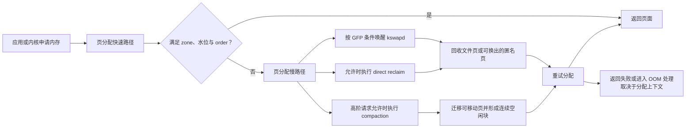
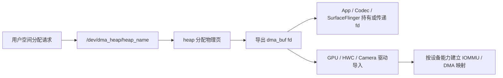

# 4.2 Linux 内核内存管理

## 这一层为什么会让应用卡住

应用线程执行 `malloc()`、访问文件映射、创建线程栈或申请图形缓冲区时，最终都要经过内核。大多数请求走快速路径，耗时很短；空闲页不足、目标内存区域（zone）不满足水位、需要高阶连续页或页面已经换出时，请求会进入慢路径。

慢路径可能包含缺页处理、页面回收、交换空间（Swap）I/O、页面迁移和内存规整。有些工作在后台内核线程执行，有些则直接占用发起分配的应用线程。后一种情况出现在关键帧或启动关键路径中时，就会形成用户可感知的延迟。

以下分析以 Android 开源项目（AOSP）`android-17.0.0_r1` 和 Android 通用内核 `android17-6.18-2026-06_r6` 为锚点。厂商内核可以修改配置和页面回收策略，排查时仍需读取运行设备的配置、节点与跟踪数据。

物理页从分配到回收的主路径如下：



分配上下文决定慢路径：GFP 分配标志、表示连续页数量级的 order、可用 zone、内存控制组（memcg），以及是否允许阻塞和 I/O，都会影响分支选择。只凭 `MemFree` 无法推断一次分配会走到哪里。

## 虚拟地址怎样变成物理访问

### 页表层级由架构配置决定

CPU 发出虚拟地址，内存管理单元（Memory Management Unit，MMU）按页表项完成地址翻译和权限检查。Linux 用 PGD、P4D、PUD、PMD、PTE 这些层级名称描述从顶层页目录到末级页表项的通用结构；某些层级会在具体架构配置中折叠。

因此，ARM64 设备不能统一写成固定四级页表。页大小、`VA_BITS` 和架构能力共同决定有效层级。例如内核文档给出的 4 KiB 配置可以采用三级或四级翻译表；Android 的 16 KiB 配置又有自己的层级与块大小。分析页表成本时，应读取运行内核配置，避免照搬某一种服务器配置。

页表项除了物理页帧号，还携带可读、可写、可执行、用户态权限，以及已访问（accessed/young）、已修改（dirty）等状态。内核的页面回收与 MGLRU 老化会使用其中一部分访问状态。

### TLB 缓存地址翻译结果

逐次访问都遍历多级页表会带来很高成本。CPU 使用地址转换后备缓冲区（Translation Lookaside Buffer，TLB）缓存近期的虚拟页到物理页翻译；TLB 未命中后，硬件或软件会逐级遍历页表（page-table walk）。

更大的页面让同样数量的 TLB 条目覆盖更多地址空间，也减少表示同等内存所需的页表项。收益会受访问局部性、TLB 结构、CPU 缓存、页表层级和工作负载影响，不能换算成固定的时钟周期或固定性能比例。

### 缺页异常是按需建立映射的入口

当当前页表项无法直接完成访问时，CPU 进入缺页异常（page fault）处理。合法地址上的缺页可能是正常机制的一部分：

- 首次写匿名映射：内核分配并清零物理页，再建立可写映射；
- 首次读取文件映射：页面已在页缓存（page cache）时可直接建立映射，缺失时需要读取文件；
- 写时复制（Copy-on-Write，COW）：Zygote 通过 `fork()` 创建子进程后，共享只读页会在子进程写入时复制；
- 换入（swap-in）：匿名页已换出时，需要从 ZRAM 压缩交换设备或其他交换后端恢复；
- 权限或无效地址：无法修复时向进程发送 `SIGSEGV`、`SIGBUS` 等信号。

Linux 统计中的次要缺页（minor fault）通常不需要等待存储 I/O，例如零页、COW 或命中页缓存；主要缺页（major fault）表示处理被标记为 `VM_FAULT_MAJOR`，常见于需要等待文件或交换数据的情况。两者都可能发生在正常执行中，数量要结合延迟和场景解释。

### Android 17 上怎样观察缺页

ARM64 内核 6.18 的 `arch/arm64/mm/fault.c` 在合法缺页路径调用 `perf_sw_event(PERF_COUNT_SW_PAGE_FAULTS, ...)`。Perfetto 的 `linux.perf` 数据源也定义了 `SW_PAGE_FAULTS`、`SW_PAGE_FAULTS_MIN` 和 `SW_PAGE_FAULTS_MAJ` 软件事件。

进程累计值还可以从 `/proc/<pid>/stat` 的 `minflt`、`majflt` 及其子进程字段读取。下面的命令先定位 PID，再输出原始 stat；生产脚本应使用可靠解析器，因为进程名字段可能含空格和括号。

```bash
adb shell 'pid=$(pidof com.example.app); cat /proc/$pid/stat'
```

不要把 `exceptions/page_fault_user`、`exceptions/page_fault_kernel` 当成所有 ARM64 Android 内核都提供的事件。Android 17 r6 的通用内存跟踪更适合使用 Linux 内核函数跟踪机制 ftrace 中的 `filemap/mm_filemap_fault`、`vmscan/*`、`kmem/*` 事件，以及 perf 缺页计数；事件是否启用仍要检查内核跟踪文件系统 tracefs。

## 物理页分配：PCP、伙伴系统与 SLUB

### 从节点、内存区域到每 CPU 页集合

内核先把物理内存组织为节点（node），再在节点内按寻址与迁移约束划分 zone。Android 手机通常采用统一内存访问（Uniform Memory Access，UMA）视角，但具体片上系统（SoC）仍可能有多个内存域或厂商扩展。分配请求的 GFP 标志决定可以访问的最高 zone、是否允许回收和 I/O 等条件。

对常见低阶页面，分配器先尝试每 CPU 页集合（Per-CPU Pageset，PCP），以减少每次分配都获取 zone 全局锁的成本。PCP 无法满足时，再进入 zone 的伙伴系统空闲区。Linux 6.18 的 `physical_memory.rst` 明确描述了“PCP 快速路径 → 伙伴系统”的两步策略。

### 伙伴系统按 order 管理连续物理页

伙伴系统（Buddy）的 order 以二次幂表示连续页数量：

`order-n = 2^n × PAGE_SIZE`

同一 order 在 4 KiB 和 16 KiB 内核上的字节数如下：

| order | 连续页数 | 4 KiB 基础页 | 16 KiB 基础页 |
|---:|---:|---:|---:|
| 0 | 1 | 4 KiB | 16 KiB |
| 1 | 2 | 8 KiB | 32 KiB |
| 2 | 4 | 16 KiB | 64 KiB |
| 4 | 16 | 64 KiB | 256 KiB |
| 9 | 512 | 2 MiB | 8 MiB |
| 10 | 1024 | 4 MiB | 16 MiB |

在 `android17-6.18-2026-06_r6` 中，未设置 `CONFIG_ARCH_FORCE_MAX_ORDER` 时，`MAX_PAGE_ORDER` 是 10，`free_area` 覆盖 order 0 到 10。厂商可以覆盖最大 order，因此工具应读取当前内核构建，不能把表中最末行当作所有设备的上限。

分配较小 order 时，如果对应空闲链表（free list）为空，伙伴系统可以拆分更大的内存块；释放时，地址与 order 匹配的空闲伙伴可以逐级合并。迁移类型会把页面块（pageblock）分为不可移动（`Unmovable`）、可移动（`Movable`）、可回收（`Reclaimable`）、`CMA`（连续内存分配器）对应类型等类别，降低不同生命周期页面长期混杂造成的外部碎片。

这里还要区分两种浪费：

- 内部碎片：获得的块大于请求，例如高阶页或对齐造成的未用空间；
- 外部碎片：空闲页总数足够，却分散到无法满足目标 order。

### SLUB 服务小型内核对象

伙伴系统的最小单位是页。`task_struct`、`dentry`、`inode` 和常见 `kmalloc` 对象通常小于一页，内核使用 SLUB 小对象分配器从 folio 中切分对象，并用 slab 缓存复用相同布局。folio 是内核将一个或多个页面作为整体管理的结构。

Linux 6.18 的内核配置文件 `mm/Kconfig` 将 `CONFIG_SLUB` 定义为默认启用；旧的 SLAB、SLOB 属于历史背景，不应描述为 Android 17 中并列运行的三种实现。Android 17 arm64 通用内核映像（Generic Kernel Image，GKI）还启用了空闲链表随机化与安全加固，并默认关闭 slab 缓存合并。

`kmalloc()` 对常见小分配使用 kmalloc slab 缓存；较大请求可能直接需要高阶页。返回区域在内核虚拟地址上连续，通常也满足其接口承诺的物理连续性。`vmalloc()` 则把离散物理页映射成连续的内核虚拟区，适合不要求物理连续的大区域，代价包括页表管理和 TLB 压力。

### 三个原始诊断入口

下面的命令分别观察各 order 的空闲块、迁移类型与 slab 缓存。量产设备可能限制其中部分节点。

```bash
adb shell cat /proc/buddyinfo
adb shell cat /proc/pagetypeinfo
adb shell cat /proc/slabinfo
```

`buddyinfo` 的每一列是对应 order 的空闲块数量。换算字节时要乘以 `2^order × PAGE_SIZE`。低 order 有很多空闲块，不能证明高阶请求一定成功；高 order 长期接近零也需要结合目标分配 order、CMA 和内存规整结果判断。

`slabinfo` 适合定位内核对象缓存增长。`/proc/meminfo` 中的 `Slab`、`SReclaimable` 和 `SUnreclaim` 提供系统汇总，但不会直接指出哪个缓存或驱动持有对象。

## 页面回收：文件页、匿名页与工作集

### 两类页的回收成本不同

文件页有文件作为后备存储。干净文件页可以从页缓存删除，后续访问时再读文件；脏页需要写回或由相应文件系统处理。

匿名页包含堆、栈和匿名映射的数据。它没有可重新读取的普通文件，内核只有在存在可用交换空间或内存分层目标时，才能在保留内容的前提下回收其物理页。Android 常用 ZRAM 作为交换空间，厂商也可以配置 ZRAM 回写；没有可用交换空间时，匿名页回收余地更小。

回收的目标是腾出可分配页，同时尽量保留近期工作集。代价可能来自：

- 扫描大量页却回收很少；
- 文件页被回收后再次访问（refault），触发存储读取；
- 匿名页在 RAM 与 ZRAM 之间频繁换入换出；
- 压缩与解压消耗 CPU；
- 脏页写回占用 I/O；
- 应用线程自己进入直接回收。

### zone 水位与 kswapd

每个 zone 维护 min、low、high 等水位。Linux 6.18 的物理内存文档给出的主语义是：

- 空闲页低于 low 时，分配路径会唤醒该 node 的 `kswapd`；
- `kswapd` 在后台回收，zone 回到 high 以上时通常视为平衡；
- 空闲页低于 min 时，允许阻塞的分配可能进入直接回收或直接规整；
- 水位提升（watermark boost）、order、zone、保留页和 GFP 标志会改变单次判断。

所以“低于 min 一定进入直接回收”仍然过于绝对。原子分配、禁止 I/O 的请求、memcg 限制、高阶请求和保留页访问都有不同路径。

### 直接回收在发起分配的任务上下文中执行

Android 17 r6 的 `__alloc_pages_slowpath()` 先按条件唤醒 kswapd；高阶请求可能先尝试直接规整（direct compaction）；允许 `__GFP_DIRECT_RECLAIM` 时，再调用 `__alloc_pages_direct_reclaim()`，随后重试分配和内存规整。

直接回收会延长发起请求的线程。线程可能在 CPU 上执行扫描，也可能等待写回、锁或其他资源；单看调度状态中的 `D`（不可中断睡眠）不能证明发生了直接回收。可靠证据来自调用栈、压力停顿信息（PSI）中的内存停顿，以及下面这些 ftrace 内核跟踪事件：

- `vmscan/mm_vmscan_direct_reclaim_begin`
- `vmscan/mm_vmscan_direct_reclaim_end`
- `vmscan/mm_vmscan_kswapd_wake`
- `vmscan/mm_vmscan_kswapd_sleep`
- `vmscan/mm_vmscan_lru_shrink_inactive`
- `vmscan/mm_vmscan_lru_shrink_active`

`/proc/vmstat` 中的 `pgscan_*`、`pgsteal_*`、`allocstall_*`、`pswpin`、`pswpout` 还能补充累计证据。字段会随内核版本变化，分析器应按字段名读取。

### MGLRU 在 Android 17 内核锚点中的状态

多代最近最少使用算法（Multi-Gen Least Recently Used，MGLRU）用多代模型记录页面访问的新旧程度。老化阶段依据页表访问位等信息推进代际（generation），驱逐阶段从较老代际选择页面；匿名页与文件页还会根据页面被回收后再次访问的反馈调整保护与回收选择。

`android17-6.18-2026-06_r6` 的 arm64 GKI 默认配置（defconfig）设置了：

- `CONFIG_LRU_GEN=y`
- `CONFIG_LRU_GEN_ENABLED=y`

这表示该 GKI 配置编译并默认启用 MGLRU。设备仍可能使用不同内核、不同配置或运行时开关。下面的命令读取稳定的运行时位掩码：

```bash
adb shell cat /sys/kernel/mm/lru_gen/enabled
```

主开关对应位（bit）`0x0001`。其他位控制批量清理叶子或非叶子页表的访问位，硬件不支持的组件即使写入也不会生效。

代际直方图不在 `/sys/kernel/mm/lru_gen/lru_gen`。内核文档将实验接口放在调试文件系统（debugfs）：

- `/sys/kernel/debug/lru_gen`
- `/sys/kernel/debug/lru_gen_full`

后者还依赖 `CONFIG_LRU_GEN_STATS`。debugfs 通常不向量产应用开放。

普通 LRU 与 MGLRU 都会在 LRU 列表容器 `lruvec` 的 `lru_lock` 下完成部分列表操作，并把开销较高的 `shrink_folio_list()` 放到锁外。Android 17 r6 的 `shrink_inactive_list()` 和 `evict_folios()` 都能看到这种结构。因此，不能用“普通 LRU 全程持锁、MGLRU 将持锁复杂度从 O(n) 变成 O(1)”概括两者差异。MGLRU 的价值应从代际老化、页表扫描、页面再次访问反馈与具体设备指标评价。

## 内存规整与物理碎片

### 内存规整解决连续块问题

内存规整（memory compaction）会从一端扫描可迁移页，从另一端寻找空闲页，把内容迁移后形成更大的连续空闲范围。它不等同于压缩数据；ZRAM 才涉及数据压缩。

高阶页分配在伙伴系统快速路径失败时，可能进入：

- 直接规整：由当前分配任务同步执行；
- `kcompactd`：每个节点的后台规整线程；
- 主动规整（proactive compaction）：由 `vm.compaction_proactiveness` 等机制触发，具体配置取决于设备。

Android 17 r6 的 `try_to_compact_pages()` 是直接规整入口；`kcompactd_do_work()` 处理后台请求。页面迁移本身需要 CPU、锁和内存带宽，失败或反复扫描也会产生延迟。

### 怎样证明延迟来自内存规整

下面这些内核跟踪点（tracepoint）比“线程处于 D 状态”更直接：

- `compaction/mm_compaction_begin`
- `compaction/mm_compaction_end`
- `compaction/mm_compaction_migratepages`
- `compaction/mm_compaction_try_to_compact_pages`
- `compaction/mm_compaction_kcompactd_wake`
- `kmem/mm_page_alloc_extfrag`

还可以读取 `/proc/vmstat` 的 `compact_*`、`compact_stall`、`compact_fail`、`compact_success` 和迁移相关字段。一次失败可能来自目标 zone、水位、不可移动页、CMA 约束或目标 order；总空闲页只是其中一个条件。

### CMA 为特定连续分配保留迁移能力

连续内存分配器（Contiguous Memory Allocator，CMA）在启动时建立区域。区域空闲时可以容纳可移动页；需要连续内存时，内核尝试迁走这些页，为 CMA 请求形成连续范围。

启用 CMA 的设备通常在 `/proc/meminfo` 提供 `CmaTotal` 和 `CmaFree`。`CmaFree` 小不必然表示泄漏，因为区域中可能暂存可移动页；一次 CMA 分配能否成功，还取决于这些页是否可迁移、目标大小与规整成本。

相机、编解码器和显示路径是否使用 CMA，由直接内存访问（DMA）能力、输入输出内存管理单元（IOMMU）、内存堆类型与驱动实现决定。不能把所有图形缓冲区都归为物理连续的 CMA 内存。

## ION、DMA-BUF Heaps 与共享缓冲区

### 先区分分配器与共享框架

DMA-BUF 是跨设备、跨驱动和跨进程共享缓冲区的框架。一个驱动导出 `struct dma_buf`，其他驱动作为导入方（importer），通过附件关系（attachment）获取适合设备访问的离散页列表（scatter-gather）映射。用户空间通常只持有一个不暴露内部实现的文件描述符（fd）。

DMA-BUF Heaps 提供从指定内存堆分配 dma-buf 的用户空间接口（UAPI）。下图展示分配、导出与设备导入之间的关系：



传递 fd 时，各方共享的是同一个 dma-buf 对象，避免复制整块像素数据。各进程是否建立 CPU `mmap`、设备怎样映射以及哪一方仍持有引用，需要分别核对。

### ION 到 DMA-BUF Heaps 的版本边界

旧的 ION 共享缓冲区分配器和 DMA-BUF Heaps 都可以作为 dma-buf 导出方（exporter）。历史 ION 通过 `/dev/ion`、内存堆掩码（heap mask）和私有标志选择分配器；DMA-BUF Heaps 为不同内存堆暴露独立字符设备 `/dev/dma_heap/<heap_name>`，便于稳定 UAPI、测试和 SELinux 强制访问控制。

Android 12 的 GKI 2.0 以 DMA-BUF Heaps 替换 ION；AOSP 迁移页属于 5.4/GKI 2.0 过渡期文档，页面标注为 deprecated，因此 Android 17 分析还要以当前内核文档和设备节点为准。`android12-5.10` 通用内核已关闭 `CONFIG_ION`。升级设备仍可能通过 `libdmabufheap` 的兼容映射访问旧 ION 内存堆，因此历史代码和旧内核仍能看到 `/dev/ion`。

Android 17 新设备应从 DMA-BUF Heaps 视角分析，同时确认厂商提供的内存堆：

- `system` heap：内核文档定义为虚拟连续、可缓存缓冲区；
- `default_cma_region`：CMA 内存堆，提供物理连续、可缓存缓冲区；
- 安全、非缓存或设备优化内存堆：名称、权限和语义由平台实现决定。

有 IOMMU 的设备通常能让硬件访问离散页面；缺少相应能力或受到特定硬件约束时，才需要 CMA 等物理连续来源。

### DMA-BUF 统计不能简单归给一个进程

同一缓冲区可以被应用、SurfaceFlinger、GPU 和硬件合成器（HWC）同时引用。把它的完整大小计入每个持有者会重复计算；只看应用的 `smaps` 也会漏掉未映射到该进程、但仍由 fd 或驱动持有的缓冲区。

Linux 6.18 在启用 `CONFIG_DMABUF_SYSFS_STATS` 时提供：

- `/sys/kernel/dmabuf/buffers/<inode>/size`
- `/sys/kernel/dmabuf/buffers/<inode>/exporter_name`

`/proc/<pid>/fdinfo/<fd>` 可以把进程 fd 与 dma-buf 的索引节点（inode）、大小等导出信息关联；debugfs 的 `/sys/kernel/debug/dma_buf/bufinfo` 适合调试构建。生产系统更适合使用设备与内核属性文件系统（sysfs）和进程信息文件系统（procfs），权限仍由设备策略决定。

Perfetto `linux.process_stats` 的 `record_process_dmabuf_rss` 可读取 `/proc/<pid>/dmabuf_rss`，配置协议明确注明该节点只存在于部分 Android 内核。它统计进程通过 fd 或虚拟内存区域（VMA）引用的 dma-buf 总大小，仍是“引用规模”，不能直接解释为该进程独占的物理内存，也不能与常规的驻留集大小（RSS）直接等同。

## 16 KiB 基础页对上述机制的影响

Android 15 起，AOSP 支持 16 KiB 基础页，Android 17 应用和原生库应同时覆盖 4 KiB 与 16 KiB 设备。先用运行时 API 或下面的命令读取页大小：

```bash
adb shell getconf PAGE_SIZE
```

页从 4 KiB 增至 16 KiB 后：

- 同等地址范围需要更少 PTE，TLB 覆盖范围增大；
- 顺序访问同等字节数时，理论上需要的基础页缺页次数减少，业务中的变化幅度取决于访问模式与映射方式；
- Buddy 的同一 order 对应四倍字节数；
- 页表、`mmap`、`mprotect`、文件偏移量与 ELF `PT_LOAD` 对齐需要适配；
- 小映射、尾页和部分 slab 布局可能产生更多内部碎片；
- 单次回收或迁移的基本粒度增大。

Android 官方初始测试报告了应用启动、功耗、相机启动和系统启动等平均收益，也明确说明 16 KiB 设备平均会使用略多内存，设备和应用结果会变化。不要从官方平均值推导某个应用的预期收益；应在目标构建上测量缺页、页表、RSS、启动 I/O 和帧时间。

使用原生代码的应用还要保证 ELF LOAD 段和打包对齐，避免把 4096 写死。只使用 Java/Kotlin 的应用通常已经兼容，但仍需在 16 KiB 环境执行功能与性能测试。完整迁移要求见 4.6 节。

### THP 的尺寸也不能写死为 2 MiB

透明大页（Transparent Huge Pages，THP）以 PMD 等较高页表层级的大页映射减少 TLB 压力。常见 4 KiB 基础页配置下，PMD 层级的 THP 是 2 MiB；其他基础页大小与页表几何会产生不同尺寸。Android 17 r6 arm64 GKI 编译了 THP，并把默认策略配置为 `madvise`，应用范围仍由运行时 sysfs、内存类型和调用方建议决定。

THP 需要规整、迁移和更大粒度的内存管理，适合连续访问的大区域；小而稀疏的工作集可能付出额外内存成本。判断是否有收益应同时观察 TLB、缺页、内存规整与 RSS。

## KASAN、MTE 与版本测量

内核地址消毒器（Kernel Address Sanitizer，KASAN）检测内核内存越界和释放后继续使用（use-after-free）。软件影子内存模式与硬件标签模式的成本差异很大；调试选项、采样模式和运行硬件都会改变结果。

Arm 内存标签扩展（Memory Tagging Extension，MTE）可以支持用户空间分配器检查，也可以支撑硬件标签模式（HW_TAGS）的 KASAN。Android 17 r6 arm64 GKI 配置包含 KASAN/HW_TAGS 能力，运行设备是否启用、采用什么模式仍由启动参数、硬件和构建决定。

因此，这里不使用跨设备的固定开销比例。比较内存与性能基线时，应记录：

- 内核配置与启动参数；
- 用户空间 MTE 的同步、异步或关闭状态；
- KASAN 类型与采样配置；
- 基础页大小、应用二进制接口（ABI）和同一业务负载。

## ART 与内核回收的 Android 17 边界

Android Runtime（ART）会通过内存建议接口 `madvise()`，把不再需要的页面退还或标为可丢弃。Android 17 r1 的 ART 源码调用了 `MADV_DONTNEED`、`MADV_FREE`、`MADV_WILLNEED` 等建议，覆盖 RegionSpace、LargeObjectSpace、线程栈和映射预取等场景。

同一源码标签下，`platform/art` 的运行时与垃圾回收（GC）目录没有直接调用 `MADV_COLD`。Linux 6.18 内核支持 `MADV_COLD`，其 `mm/madvise.c` 会对范围内合适的 folio 执行 `folio_deactivate()`，让它们在压力下更容易被回收。内核具备接口，并不表示 Android 17 ART 已采用这条 GC 协作路径。

Silk 等研究工作讨论了对象热度与内核页热度之间的偏差。这类方案可以作为研究方向；如果没有进入 `android-17.0.0_r1` 的 ART 调用链，就不能写成 Android 17 系统行为。

### 尚未合入的 `ANON_VMA_LAZY` 提案

`anon_vma` 为匿名映射建立反向映射（reverse mapping，rmap）关系，使内核能从 folio 反查映射它的 VMA，并服务页面迁移、回收、同页合并（KSM）、非统一内存访问（Non-Uniform Memory Access，NUMA）架构的页面平衡，以及 `fork()` 后的 COW。普通匿名 VMA 已把实际物理页分配延迟到首次缺页；`ANON_VMA_LAZY` 讨论的是进一步延迟建立 `anon_vma` 结构及其区间树（interval tree）关系，并非让 `mmap()` 第一次具备惰性分配。

在 Android 通用内核 `android17-6.18-2026-06_r6` 中，没有 `CONFIG_ANON_VMA_LAZY`、同名源码符号或 Kconfig 入口。公开讨论中的提案曾报告减少 `anon_vma` slab 与部分 `fork()` 开销，但上游评审指出了 VMA 生命周期、区间树完整性、锁覆盖和映射类型覆盖不足等问题。因此，它只能作为未合入的设计探索，不能写成 Android 17 已启用的内存优化。

检查厂商内核是否有私有实现时，应同时核对：

- 内核配置、源码符号和补丁提交，不能只看 Android API 级别；
- `/proc/slabinfo` 中 `anon_vma`、`anon_vma_chain` 的数量与对象大小；
- 同一负载下 `fork()`、VMA 数、次要缺页、rmap 相关 CPU 时间和页面迁移结果；
- KSM、NUMA 页面平衡、页面迁移、COW 与进程退出等正确性压力测试。

仅看到 `anon_vma` slab 下降，不能证明完整提案存在；厂商也可能通过 VMA 合并、分配器调整或其他补丁得到相似结果。

## 一套面向性能问题的取证顺序

### 第一步：确认问题属于哪条慢路径

先在 Perfetto 中对齐卡顿、启动或分配失败时间：

- 应用线程是否出现 `vmscan/mm_vmscan_direct_reclaim_*`；
- `kswapd` 是否运行，`mm_vmscan_kswapd_wake/sleep` 是否覆盖问题窗口；
- 是否出现 `compaction/mm_compaction_*`；
- `filemap/mm_filemap_fault`、perf 主要缺页与块 I/O 是否相关；
- 内存 PSI 是否显示持续停顿（stall）。

### 第二步：读取累计计数和物理布局

下面的命令一次采集常用系统证据：

```bash
adb shell cat /proc/pressure/memory
adb shell cat /proc/vmstat
adb shell cat /proc/buddyinfo
adb shell cat /proc/meminfo
```

将问题前后的快照做差，比单次绝对值更有意义。重点寻找扫描/回收比例、分配停顿、交换空间换入/换出、内存规整成败、CMA 与高阶空闲块变化。

### 第三步：按资源类型进入专用工具

- 文件页回收后再次访问：检查文件映射、I/O、预读和缓存生命周期；
- 匿名页换入换出：检查 ZRAM、工作集、GC 后保留量与 PSI；
- slab 增长：按 `/proc/slabinfo` 或 slab 跟踪点定位缓存；
- 高阶/CMA 失败：检查目标 order、迁移类型、外部碎片（extfrag）与内存规整；
- DMA-BUF 增长：按 inode、导出方、fd 持有者和 Surface/驱动生命周期分析。

## 常见结论的校正

### “内存总量够，高阶分配就会成功”

高阶分配需要目标 zone 中的连续页。即使总空闲量充足，外部碎片、不可移动页、CMA 与水位限制仍可能让请求进入内存规整或失败。

### “看到 kswapd 占 CPU，就说明它拖慢了前台”

kswapd 活跃说明内核在后台回收，也可能来自水位提升或主动策略。要证明它影响前台，需要同时看到 CPU 竞争、I/O、前台访问刚被回收的文件页、PSI 或关键线程延迟。

### “线程进入 D 状态就代表直接回收”

D 状态表示不可中断睡眠，来源很多。直接回收还可能在 CPU 上执行。应使用 vmscan 跟踪点、内核调用栈和 PSI 归因。

### “lmkd 只在内核回收失败后运行”

现代 Android 的用户空间低内存终止守护进程（lmkd）监控 PSI 等压力信号，可以在内核 OOM 之前选择进程。它与 kswapd 工作在同一内存压力环境中，但两者没有严格的先后顺序。详细决策见 4.4 节。

### “每个 DMA-BUF 都是物理连续内存”

内存堆决定分配方式。system heap 提供虚拟连续缓冲区，CMA heap 提供物理连续缓冲区；设备还可以定义其他内存堆。IOMMU 与驱动能力决定硬件如何访问。

### “应用持有 100 MiB DMA-BUF，就独占 100 MiB RAM”

持有 fd 或 VMA 表示进程引用该缓冲区。共享者、导出方、驻留状态和设备映射仍需核对，跨进程求和会重复。

## 小结

Linux 内存性能问题可以分成四个问题来问：

1. 虚拟访问为什么触发缺页，它是次要缺页、主要缺页、COW、文件页回收后再次访问，还是交换空间换入？
2. 物理页分配需要什么 zone 和 order，PCP/伙伴系统能否满足？
3. 页面回收或内存规整是否进入应用线程，造成了多长停顿？
4. 图形缓冲区由哪个内存堆导出，哪些进程和设备仍持有引用？

Android 17 的版本边界也应明确：arm64 GKI 配置默认启用 MGLRU；DMA-BUF Heaps 是新设备的主要分配接口；16 KiB 基础页已经是需要兼容的设备形态；ART r1 没有直接使用 `MADV_COLD` 的 GC 路径。把这些边界与运行设备证据对齐，才能从“内存看起来很高”推进到可验证的原因。

## 源码与文档锚点

- [Android 17 kernel `mm/page_alloc.c`](https://android.googlesource.com/kernel/common/+/refs/tags/android17-6.18-2026-06_r6/mm/page_alloc.c)
- [Android 17 kernel `mm/vmscan.c`](https://android.googlesource.com/kernel/common/+/refs/tags/android17-6.18-2026-06_r6/mm/vmscan.c)
- [Android 17 kernel `mm/compaction.c`](https://android.googlesource.com/kernel/common/+/refs/tags/android17-6.18-2026-06_r6/mm/compaction.c)
- [Android 17 kernel `mm/madvise.c`](https://android.googlesource.com/kernel/common/+/refs/tags/android17-6.18-2026-06_r6/mm/madvise.c)
- [Android 17 kernel arm64 GKI defconfig](https://android.googlesource.com/kernel/common/+/refs/tags/android17-6.18-2026-06_r6/arch/arm64/configs/gki_defconfig)
- [Linux 6.18 physical memory](https://android.googlesource.com/kernel/common/+/refs/tags/android17-6.18-2026-06_r6/Documentation/mm/physical_memory.rst)
- [Linux 6.18 Multi-Gen LRU](https://android.googlesource.com/kernel/common/+/refs/tags/android17-6.18-2026-06_r6/Documentation/admin-guide/mm/multigen_lru.rst)
- [Linux 6.18 DMA-BUF](https://android.googlesource.com/kernel/common/+/refs/tags/android17-6.18-2026-06_r6/Documentation/driver-api/dma-buf.rst)
- [Linux 6.18 DMA-BUF Heaps](https://android.googlesource.com/kernel/common/+/refs/tags/android17-6.18-2026-06_r6/Documentation/userspace-api/dma-buf-heaps.rst)
- [AOSP：ION 迁移到 DMA-BUF Heaps（5.4/GKI 2.0 过渡期文档，页面标注 deprecated）](https://source.android.com/docs/core/architecture/kernel/dma-buf-heaps)
- [Android：支持 16 KiB page size](https://developer.android.com/guide/practices/page-sizes)
- [Perfetto `ProcessStatsConfig`](https://android.googlesource.com/platform/external/perfetto/+/refs/tags/android-17.0.0_r1/protos/perfetto/config/process_stats/process_stats_config.proto)
- [Perfetto `PerfEventConfig`](https://android.googlesource.com/platform/external/perfetto/+/refs/tags/android-17.0.0_r1/protos/perfetto/config/profiling/perf_event_config.proto)
- [AOSP Android 17 ART `mem_map.cc`](https://android.googlesource.com/platform/art/+/refs/tags/android-17.0.0_r1/libartbase/base/mem_map.cc)
