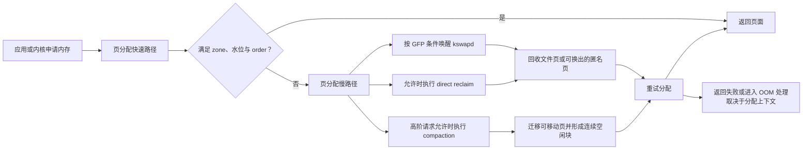
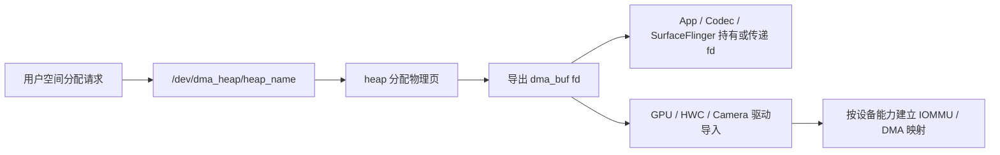

# Linux 内核内存管理

## 这一层为什么会让应用卡住

应用线程执行 `malloc()`、访问文件映射、创建线程栈或申请图形缓冲区时，最终都要经过内核。大多数请求走快速路径，耗时很短；空闲页不足、目标 zone 不满足水位、需要高阶连续页或页面已经换出时，请求会进入慢路径。

慢路径可能包含缺页处理、页面回收、Swap I/O、页迁移和内存规整。它们有的在后台内核线程执行，有的直接占用发起分配的应用线程。后者进入关键帧或启动关键路径时，就会形成用户可感知的延迟。

以下分析以 AOSP `android-17.0.0_r1` 和 Android Common Kernel `android17-6.18-2026-06_r6` 为锚点。vendor kernel 可以修改配置和 reclaim policy，排查时仍需读取运行设备的配置、节点与 trace。

物理页从分配到回收的主路径如下：



分配上下文决定慢路径：GFP flags、order、可用 zone、memcg、是否允许阻塞和是否允许 I/O 都会影响分支选择。只凭 `MemFree` 无法推断一次分配会走到哪里。

## 虚拟地址怎样变成物理访问

### 页表层级由架构配置决定

CPU 发出虚拟地址，MMU 按页表项完成地址翻译和权限检查。Linux 用 PGD、P4D、PUD、PMD、PTE 这些通用层级描述页表；某些层级在具体架构配置中会折叠。

因此，ARM64 设备不能统一写成固定四级页表。页大小、`VA_BITS` 和架构能力共同决定有效层级。例如内核文档给出的 4 KiB 配置可以采用三级或四级翻译表；Android 的 16 KiB 配置又有自己的层级与块大小。分析页表成本时，应读取运行内核配置，避免照搬某一种服务器配置。

页表项除了物理页帧号，还携带可读、可写、可执行、用户态权限、accessed/young、dirty 等状态。内核的回收与 MGLRU 老化会使用其中一部分访问状态。

### TLB 缓存地址翻译结果

逐次访问都遍历多级页表会带来很高成本。CPU 使用 TLB 缓存近期的虚拟页到物理页翻译；TLB miss 后，硬件或软件执行 page-table walk。

更大页大小让同样数量的 TLB 条目覆盖更多地址空间，也减少表示同等内存所需的页表项。收益会受访问局部性、TLB 结构、cache、页表层级和工作负载影响，不能换算成固定的时钟周期或固定性能比例。

### Page Fault 是按需建立映射的入口

当当前页表项无法直接完成访问时，CPU 进入缺页处理。合法地址上的 fault 可能是正常机制的一部分：

- 首次写匿名映射：内核分配并清零物理页，再建立可写映射；
- 首次读取文件映射：页面已在 page cache 时可直接建立映射，缺失时需要读取文件；
- 写时复制：Zygote fork 后的共享只读页在子进程写入时复制；
- Swap-in：匿名页已换出时，需要从 ZRAM 或其他 Swap 后端恢复；
- 权限或无效地址：无法修复时向进程发送 `SIGSEGV`、`SIGBUS` 等信号。

Linux 统计中的 minor fault 通常不需要等待存储 I/O，例如零页、COW 或命中 page cache；major fault 表示处理被标记为 `VM_FAULT_MAJOR`，常见于需要等待文件或 Swap 数据的情况。两者都可能发生在正常执行中，数量要结合延迟和场景解释。

### Android 17 上怎样观察 fault

ARM64 kernel 6.18 的 `arch/arm64/mm/fault.c` 在合法缺页路径调用 `perf_sw_event(PERF_COUNT_SW_PAGE_FAULTS, ...)`。Perfetto `linux.perf` 数据源也定义了 `SW_PAGE_FAULTS`、`SW_PAGE_FAULTS_MIN` 和 `SW_PAGE_FAULTS_MAJ` 软件事件。

进程累计值还可以从 `/proc/<pid>/stat` 的 `minflt`、`majflt` 及其子进程字段读取。下面的命令先定位 PID，再输出原始 stat；生产脚本应使用可靠解析器，因为进程名字段可能含空格和括号。

```bash
adb shell 'pid=$(pidof com.example.app); cat /proc/$pid/stat'
```

不要把 `exceptions/page_fault_user`、`exceptions/page_fault_kernel` 当成所有 ARM64 Android 内核都提供的 ftrace 事件。Android 17 r6 的通用内存 Trace 更适合使用 `filemap/mm_filemap_fault`、`vmscan/*`、`kmem/*` 与 perf fault 计数；事件是否启用仍要检查 tracefs。

## 物理页分配：PCP、Buddy 与 SLUB

### 从 node、zone 到 Per-CPU Pageset

内核把物理内存组织为 node，并在 node 内按寻址与迁移约束划分 zone。Android 手机通常是 UMA 视角，但具体 SoC 仍可能有多个内存域或厂商扩展。分配请求的 GFP flags 决定可以访问的最高 zone、是否允许回收、是否允许 I/O 等条件。

对常见低阶页面，分配器先尝试 Per-CPU Pageset（PCP），减少每次分配都获取 zone 全局锁的成本。PCP 不满足时，再进入 zone 的 Buddy free area。Linux 6.18 `physical_memory.rst` 明确描述了“PCP 快速路径 → Buddy”的两步策略。

### Buddy 按 order 管理连续物理页

Buddy 的 order 以二次幂表示连续页数量：

`order-n = 2^n × PAGE_SIZE`

同一 order 在 4 KiB 和 16 KiB 内核上的字节数如下：

| order | 连续页数 | 4 KiB base page | 16 KiB base page |
|---:|---:|---:|---:|
| 0 | 1 | 4 KiB | 16 KiB |
| 1 | 2 | 8 KiB | 32 KiB |
| 2 | 4 | 16 KiB | 64 KiB |
| 4 | 16 | 64 KiB | 256 KiB |
| 9 | 512 | 2 MiB | 8 MiB |
| 10 | 1024 | 4 MiB | 16 MiB |

在 `android17-6.18-2026-06_r6` 中，未设置 `CONFIG_ARCH_FORCE_MAX_ORDER` 时，`MAX_PAGE_ORDER` 是 10，`free_area` 覆盖 order 0 到 10。厂商可以覆盖最大 order，所以工具应读取当前内核构建，不要把表中最末行当作所有设备的上限。

分配较小 order 时，如果对应 free list 为空，Buddy 可以拆分更大块；释放时，地址与 order 匹配的空闲伙伴可以逐级合并。迁移类型会把 pageblock 分为 `Unmovable`、`Movable`、`Reclaimable`、`CMA` 等类别，降低不同生命周期页面长期混杂造成的外部碎片。

这里还要区分两种浪费：

- 内部碎片：获得的块大于请求，例如高阶页或对齐造成的未用空间；
- 外部碎片：空闲页总数足够，却分散到无法满足目标 order。

### SLUB 服务小型内核对象

Buddy 的最小单位是页。`task_struct`、`dentry`、`inode` 和常见 `kmalloc` 对象通常小于一页，内核使用 SLUB 从一组 folio 中切分对象，并用 slab cache 复用相同布局。

Linux 6.18 的 `mm/Kconfig` 将 `CONFIG_SLUB` 定义为默认启用；旧的 SLAB、SLOB 属于历史背景，不应描述为 Android 17 中并列运行的三种实现。Android 17 arm64 GKI 还启用了 freelist randomization 和 hardening，并关闭默认 slab cache 合并。

`kmalloc()` 对常见小分配使用 kmalloc slab cache；较大请求可能直接需要高阶页。返回区域在内核虚拟地址上连续，通常也满足其接口承诺的物理连续性。`vmalloc()` 则把离散物理页映射成连续内核虚拟区，适合不要求物理连续的大区域，代价包括页表管理和 TLB 压力。

### 三个原始诊断入口

下面的命令分别观察各 order 空闲块、迁移类型与 slab cache。量产设备可能限制其中部分节点。

```bash
adb shell cat /proc/buddyinfo
adb shell cat /proc/pagetypeinfo
adb shell cat /proc/slabinfo
```

`buddyinfo` 每一列是对应 order 的空闲块数量。换算字节时要乘以 `2^order × PAGE_SIZE`。低 order 有很多空闲块，不能证明高阶请求一定成功；高 order 长期接近零也需要结合目标分配 order、CMA 和 compaction 结果判断。

`slabinfo` 适合定位内核对象缓存增长。`/proc/meminfo` 中的 `Slab`、`SReclaimable` 和 `SUnreclaim` 提供系统汇总，但不会直接指出哪个 cache 或驱动持有对象。

## 页面回收：文件页、匿名页与工作集

### 两类页的回收成本不同

文件页有文件作为后备存储。干净文件页可以从 page cache 删除，后续访问再读文件；脏页需要写回或由相应文件系统处理。

匿名页包含堆、栈和匿名映射的数据。它没有可重新读取的普通文件，内核只有在存在可用 Swap 或内存分层目标时才能在保留内容的前提下回收其物理页。Android 常用 ZRAM 作为 Swap，也可以由厂商配置 ZRAM writeback；没有可用 Swap 时，匿名页回收空间更受限制。

回收的目标是腾出可分配页，同时尽量保留近期工作集。代价可能来自：

- 扫描大量页却回收很少；
- 文件页 refault 触发存储读取；
- 匿名页在 RAM 与 ZRAM 之间频繁换入换出；
- 压缩与解压消耗 CPU；
- 脏页写回占用 I/O；
- 应用线程自己进入 direct reclaim。

### zone 水位与 kswapd

每个 zone 维护 min、low、high 等水位。Linux 6.18 的物理内存文档给出的主语义是：

- 空闲页低于 low 时，分配路径会唤醒该 node 的 `kswapd`；
- `kswapd` 在后台回收，zone 回到 high 以上时通常视为平衡；
- 空闲页低于 min 时，允许阻塞的分配可能进入 direct reclaim 或 direct compaction；
- watermark boost、order、zone、保留页和 GFP flags 会改变单次判断。

所以“低于 min 一定 direct reclaim”仍然过于绝对。原子分配、禁止 I/O 的请求、memcg 限制、高阶请求和保留页访问都有不同路径。

### direct reclaim 在发起分配的任务上下文执行

Android 17 r6 的 `__alloc_pages_slowpath()` 先按条件唤醒 kswapd；高阶请求可能先尝试 direct compaction；允许 `__GFP_DIRECT_RECLAIM` 时，再调用 `__alloc_pages_direct_reclaim()`，随后重试分配和 compaction。

direct reclaim 会延长发起请求的线程。线程可能在 CPU 上执行扫描，也可能等待写回、锁或其他资源；单看调度状态中的 `D` 不能证明 direct reclaim。可靠证据来自调用栈、PSI memory stall，以及下面这些 ftrace 事件：

- `vmscan/mm_vmscan_direct_reclaim_begin`
- `vmscan/mm_vmscan_direct_reclaim_end`
- `vmscan/mm_vmscan_kswapd_wake`
- `vmscan/mm_vmscan_kswapd_sleep`
- `vmscan/mm_vmscan_lru_shrink_inactive`
- `vmscan/mm_vmscan_lru_shrink_active`

`/proc/vmstat` 中的 `pgscan_*`、`pgsteal_*`、`allocstall_*`、`pswpin`、`pswpout` 还能补充累计证据。字段会随内核版本变化，分析器应按 key 读取。

### MGLRU 在 Android 17 内核锚点中的状态

Multi-Gen LRU 用多代模型记录访问新旧程度，老化阶段依据页表 accessed bit 等信息推进 generation，驱逐阶段从较老 generation 选择页面。匿名页与文件页还会按 refault 信号调整保护与回收选择。

`android17-6.18-2026-06_r6` 的 arm64 GKI defconfig 设置了：

- `CONFIG_LRU_GEN=y`
- `CONFIG_LRU_GEN_ENABLED=y`

这表示该 GKI 配置编译并默认启用 MGLRU。设备仍可能使用不同内核、不同 config 或运行时开关。下面的命令读取稳定的运行时位掩码：

```bash
adb shell cat /sys/kernel/mm/lru_gen/enabled
```

主开关对应 bit `0x0001`。其他 bit 控制批量清理叶子或非叶子页表 accessed bit，硬件不支持的组件即使写入也不会生效。

代际直方图不在 `/sys/kernel/mm/lru_gen/lru_gen`。内核文档将实验接口放在 debugfs：

- `/sys/kernel/debug/lru_gen`
- `/sys/kernel/debug/lru_gen_full`

后者还依赖 `CONFIG_LRU_GEN_STATS`。debugfs 通常不面向量产应用开放。

普通 LRU 与 MGLRU 都会在 `lruvec->lru_lock` 下完成部分列表操作，并把昂贵的 `shrink_folio_list()` 放到锁外。Android 17 r6 的 `shrink_inactive_list()` 和 `evict_folios()` 都能看到这种结构。因此，不能用“普通 LRU 全程持锁、MGLRU 将持锁复杂度从 O(n) 变成 O(1)”概括两者差异。MGLRU 的价值应从代际老化、页表扫描、refault 反馈与具体设备指标评价。

## 内存规整与物理碎片

### compaction 解决连续块问题

Memory compaction 会从一端扫描可迁移页，从另一端寻找空闲页，把内容迁移后形成更大的连续空闲范围。它不等同于压缩数据；ZRAM 才涉及数据压缩。

高阶页分配在 Buddy 快速路径失败时，可能进入：

- direct compaction：由当前分配任务同步执行；
- kcompactd：每个 node 的后台规整线程；
- proactive compaction：由 `vm.compaction_proactiveness` 等机制触发，具体配置取决于设备。

Android 17 r6 的 `try_to_compact_pages()` 是 direct compaction 入口；`kcompactd_do_work()` 处理后台请求。页面迁移本身需要 CPU、锁和内存带宽，失败或反复扫描也会产生延迟。

### 怎样证明延迟来自 compaction

下面这些 tracepoint 比“线程处于 D 状态”更直接：

- `compaction/mm_compaction_begin`
- `compaction/mm_compaction_end`
- `compaction/mm_compaction_migratepages`
- `compaction/mm_compaction_try_to_compact_pages`
- `compaction/mm_compaction_kcompactd_wake`
- `kmem/mm_page_alloc_extfrag`

还可以读取 `/proc/vmstat` 的 `compact_*`、`compact_stall`、`compact_fail`、`compact_success` 和迁移相关字段。一次失败可能来自目标 zone、水位、不可移动页、CMA 约束或目标 order；总空闲页只是其中一个条件。

### CMA 为特定连续分配保留迁移能力

Contiguous Memory Allocator（CMA）在启动时建立区域。区域空闲时可以容纳可移动页；需要连续内存时，内核尝试迁走这些页，为 CMA 请求形成连续范围。

启用 CMA 的设备通常在 `/proc/meminfo` 提供 `CmaTotal` 和 `CmaFree`。`CmaFree` 小不必然表示泄漏，因为区域中可能暂存可移动页；一次 CMA 分配能否成功，还取决于这些页是否可迁移、目标大小与规整成本。

相机、编解码器和显示路径是否使用 CMA，由 DMA 能力、IOMMU、heap 类型与驱动实现决定。不能把所有图形缓冲区都归为物理连续 CMA 内存。

## ION、DMA-BUF Heaps 与共享缓冲区

### 先区分分配器与共享框架

DMA-BUF 是跨设备、跨驱动和跨进程共享缓冲区的框架。一个驱动导出 `struct dma_buf`，其他驱动作为 importer 通过 attachment 获取适合设备访问的 scatter-gather 映射。用户空间通常持有一个 opaque fd。

DMA-BUF Heaps 提供从指定 heap 分配 dma-buf 的 UAPI。两者关系如下：



fd 传递共享的是同一个 dma-buf 对象，避免复制整块像素数据。各进程是否建立 CPU `mmap`、设备怎样映射以及哪一方仍持有引用，需要分别核对。

### ION 到 DMA-BUF Heaps 的版本边界

ION 和 DMA-BUF Heaps 都可以作为 dma-buf exporter。历史 ION 通过 `/dev/ion` 加 heap mask 与私有 flags 选择分配器；DMA-BUF Heaps 为不同 heap 暴露独立字符设备 `/dev/dma_heap/<heap_name>`，便于稳定 UAPI、测试和 SELinux 权限控制。

Android 12 的 GKI 2.0 以 DMA-BUF Heaps 替换 ION；`android12-5.10` common kernel 已关闭 `CONFIG_ION`。升级设备仍可能通过 `libdmabufheap` 的兼容映射访问旧 ION heap，所以历史代码和旧内核仍能看到 `/dev/ion`。

Android 17 新设备应从 DMA-BUF Heaps 视角分析，同时确认厂商 heap：

- `system` heap：内核文档定义为虚拟连续、可缓存缓冲区；
- `default_cma_region`：CMA heap，提供物理连续、可缓存缓冲区；
- secure、uncached 或设备优化 heap：名称、权限和语义由平台实现决定。

有 IOMMU 的设备常能让硬件访问 scatter-gather 页面；缺少相应能力或特定硬件约束时，才需要 CMA 等物理连续来源。

### DMA-BUF 统计不能简单归给一个进程

同一缓冲区可以被 App、SurfaceFlinger、GPU 和 HWC 同时引用。把它的完整 size 计到每个持有者会重复计算；只看 App 的 `smaps` 也会漏掉未映射到该进程、但仍由 fd 或驱动持有的缓冲区。

Linux 6.18 在启用 `CONFIG_DMABUF_SYSFS_STATS` 时提供：

- `/sys/kernel/dmabuf/buffers/<inode>/size`
- `/sys/kernel/dmabuf/buffers/<inode>/exporter_name`

`/proc/<pid>/fdinfo/<fd>` 可以把进程 fd 与 dma-buf inode、size 等导出信息关联；debugfs 的 `/sys/kernel/debug/dma_buf/bufinfo` 适合调试构建。生产系统更适合 sysfs/procfs，权限仍由设备策略决定。

Perfetto `linux.process_stats` 的 `record_process_dmabuf_rss` 可读取 `/proc/<pid>/dmabuf_rss`，proto 明确注明该节点只存在于部分 Android 内核。它统计进程通过 fd 或 VMA 引用的 dma-buf 总大小，仍是“引用规模”，不能直接解释为该进程独占 RAM。

## 16 KiB base page 对上述机制的影响

Android 15 起 AOSP 支持 16 KiB base page，Android 17 应用和原生库应同时覆盖 4 KiB 与 16 KiB 设备。先用运行时 API 或下面的命令读取页大小：

```bash
adb shell getconf PAGE_SIZE
```

页从 4 KiB 增至 16 KiB 后：

- 同等地址范围需要更少 PTE，TLB 覆盖范围增大；
- 顺序触碰同等字节数时，理论上需要的 base-page fault 数减少，业务中的变化幅度取决于访问模式与映射方式；
- Buddy 的同一 order 对应四倍字节数；
- 页表、mmap、`mprotect`、文件 offset 与 ELF `PT_LOAD` 对齐需要适配；
- 小映射、尾页和部分 slab 布局可能产生更多内部碎片；
- 单次回收或迁移的基本粒度增大。

Android 官方初始测试报告了应用启动、功耗、相机启动和系统启动等平均收益，也明确说明 16 KiB 设备平均会使用略多内存，设备和应用结果会变化。不要从官方平均值推导某个应用的预期收益；应在目标构建上测量 fault、页表、RSS、启动 I/O 和帧时间。

使用 Native 代码的应用还要保证 ELF LOAD 段和打包对齐，避免把 4096 写死。只使用 Java/Kotlin 的应用通常已经兼容，但仍需在 16 KiB 环境执行功能与性能测试。完整迁移要求见 4.7 节。

### THP 的尺寸也不能写死为 2 MiB

Transparent Huge Pages 以 PMD 等大页映射减少 TLB 压力。常见 4 KiB base page 配置下，PMD THP 是 2 MiB；其他 base page 与页表几何会产生不同大小。Android 17 r6 arm64 GKI 编译了 THP，并把默认策略配置为 `madvise`，应用范围仍由运行时 sysfs、内存类型和调用方建议决定。

THP 需要规整、迁移和更大粒度的内存管理，适合连续访问的大区域；小而稀疏的工作集可能付出额外内存成本。判断是否有收益应同时观察 TLB、fault、compaction 与 RSS。

## KASAN、MTE 与版本测量

KASAN 检测内核内存越界和 use-after-free。软件 shadow 模式与硬件 tag 模式的成本差异很大；调试选项、采样模式和运行硬件都会改变结果。

Arm MTE 可以支持用户空间 allocator 检查，也可以支撑 HW_TAGS KASAN。Android 17 r6 arm64 GKI 配置包含 KASAN/HW_TAGS 能力，运行设备是否启用、采用什么模式仍由启动参数、硬件和构建决定。

因此，这里不使用跨设备的固定开销比例。比较内存与性能基线时，应记录：

- kernel config 与启动参数；
- userspace MTE 的 sync、async 或关闭状态；
- KASAN 类型与采样配置；
- base page size、ABI 和同一业务负载。

## ART 与内核回收的 Android 17 边界

ART 会通过 `madvise()` 把不再需要的页退还或标为可丢弃。Android 17 r1 的 ART 源码调用了 `MADV_DONTNEED`、`MADV_FREE`、`MADV_WILLNEED` 等建议，覆盖 RegionSpace、LargeObjectSpace、线程栈和映射预取等场景。

同一 tag 的 `platform/art` runtime 与 GC 目录没有直接调用 `MADV_COLD`。Linux 6.18 内核支持 `MADV_COLD`，其 `mm/madvise.c` 会对范围内合适 folio 执行 `folio_deactivate()`，让它们在压力下更容易被回收。内核具备接口不代表 Android 17 ART 已采用该 GC 协作路径。

Silk 等研究工作讨论了对象热度与内核页热度之间的偏差，这类方案可以作为研究方向；没有进入 `android-17.0.0_r1` 的 ART 调用链时，不能写成 Android 17 系统行为。

ANON_VMA_LAZY 同理。`android17-6.18-2026-06_r6` 中没有该接口或配置，相关社区 patch 与厂商测试应放在独立专题，并清楚标注 patch 版本、测试设备和未合入状态。

## 一套面向性能问题的取证顺序

### 第一步：确认问题属于哪条慢路径

先在 Perfetto 中对齐卡顿、启动或分配失败时间：

- 应用线程是否出现 `vmscan/mm_vmscan_direct_reclaim_*`；
- `kswapd` 是否运行，`mm_vmscan_kswapd_wake/sleep` 是否覆盖问题窗口；
- 是否出现 `compaction/mm_compaction_*`；
- `filemap/mm_filemap_fault`、perf major fault 与块 I/O 是否相关；
- memory PSI 是否显示持续 stall。

### 第二步：读取累计计数和物理布局

下面的命令一次采集常用系统证据：

```bash
adb shell cat /proc/pressure/memory
adb shell cat /proc/vmstat
adb shell cat /proc/buddyinfo
adb shell cat /proc/meminfo
```

将问题前后的快照做差，比单次绝对值更有意义。重点寻找 scan/steal 比例、allocation stall、Swap in/out、compaction 成败、CMA 与高阶空闲块变化。

### 第三步：按资源类型进入专用工具

- 文件 refault：检查文件映射、I/O、预读和缓存生命周期；
- 匿名页换入换出：检查 ZRAM、工作集、GC 后保留量与 PSI；
- slab 增长：按 `/proc/slabinfo` 或 slab tracepoint 定位 cache；
- 高阶/CMA 失败：检查目标 order、迁移类型、extfrag 与 compaction；
- DMA-BUF 增长：按 inode、exporter、fd 持有者和 Surface/驱动生命周期分析。

## 常见结论的校正

### “内存总量够，高阶分配就会成功”

高阶分配需要目标 zone 中的连续页。总空闲量充足时，外部碎片、不可移动页、CMA 与水位限制仍可能让请求进入 compaction 或失败。

### “看到 kswapd 占 CPU，就说明它拖慢了前台”

kswapd 活跃说明内核在后台回收，也可能来自 watermark boost 或主动策略。要证明影响，需要同时看到 CPU 竞争、I/O、前台 refault、PSI 或关键线程延迟。

### “线程进入 D 状态就是 direct reclaim”

D 状态表示不可中断睡眠，来源很多。direct reclaim 还可能在 CPU 上执行。应使用 vmscan tracepoint、内核调用栈和 PSI 归因。

### “lmkd 只在内核回收失败后运行”

现代 Android 的 userspace `lmkd` 监控 PSI 等压力信号，可以在内核 OOM 之前选择进程。它与 kswapd 协作于同一压力环境，但不是严格的顺序兜底。详细决策见 4.4 节。

### “每个 DMA-BUF 都是物理连续内存”

heap 决定分配方式。system heap 提供虚拟连续 buffer，CMA heap 提供物理连续 buffer；设备还可以定义其他 heap。IOMMU 与驱动能力决定硬件如何访问。

### “App 持有 100 MiB DMA-BUF，就独占 100 MiB RAM”

持有 fd 或 VMA 表示进程引用该 buffer。共享者、exporter、驻留状态和设备映射仍需核对，跨进程求和会重复。

## 小结

Linux 内存性能问题可以分成四个问题来问：

1. 虚拟访问为什么触发 fault，它是 minor、major、COW、文件 refault 还是 Swap-in？
2. 物理页分配需要什么 zone 和 order，PCP/Buddy 能否满足？
3. 回收或 compaction 是否进入应用线程，造成多长 stall？
4. 图形缓冲区由哪个 heap 导出，哪些进程和设备仍持有引用？

Android 17 的关键边界也应明确：arm64 GKI 配置默认启用 MGLRU；DMA-BUF Heaps 是新设备的主要分配接口；16 KiB base page 已是需要兼容的设备形态；ART r1 没有直接使用 `MADV_COLD` 的 GC 路径。把这些边界与运行设备证据对齐，才能从“内存看起来很高”推进到可验证的原因。

## 源码与文档锚点

- [Android 17 kernel `mm/page_alloc.c`](https://android.googlesource.com/kernel/common/+/refs/tags/android17-6.18-2026-06_r6/mm/page_alloc.c)
- [Android 17 kernel `mm/vmscan.c`](https://android.googlesource.com/kernel/common/+/refs/tags/android17-6.18-2026-06_r6/mm/vmscan.c)
- [Android 17 kernel `mm/compaction.c`](https://android.googlesource.com/kernel/common/+/refs/tags/android17-6.18-2026-06_r6/mm/compaction.c)
- [Android 17 kernel `mm/madvise.c`](https://android.googlesource.com/kernel/common/+/refs/tags/android17-6.18-2026-06_r6/mm/madvise.c)
- [Android 17 kernel arm64 GKI defconfig](https://android.googlesource.com/kernel/common/+/refs/tags/android17-6.18-2026-06_r6/arch/arm64/configs/gki_defconfig)
- [Linux 6.18 physical memory](https://android.googlesource.com/kernel/common/+/refs/tags/android17-6.18-2026-06_r6/Documentation/mm/physical_memory.rst)
- [Linux 6.18 Multi-Gen LRU](https://android.googlesource.com/kernel/common/+/refs/tags/android17-6.18-2026-06_r6/Documentation/admin-guide/mm/multigen_lru.rst)
- [Linux 6.18 DMA-BUF](https://android.googlesource.com/kernel/common/+/refs/tags/android17-6.18-2026-06_r6/Documentation/driver-api/dma-buf.rst)
- [Linux 6.18 DMA-BUF Heaps](https://android.googlesource.com/kernel/common/+/refs/tags/android17-6.18-2026-06_r6/Documentation/userspace-api/dma-buf-heaps.rst)
- [AOSP：ION 迁移到 DMA-BUF Heaps](https://source.android.com/docs/core/architecture/kernel/dma-buf-heaps)
- [Android：支持 16 KiB page size](https://developer.android.com/guide/practices/page-sizes)
- [Perfetto `ProcessStatsConfig`](https://android.googlesource.com/platform/external/perfetto/+/refs/tags/android-17.0.0_r1/protos/perfetto/config/process_stats/process_stats_config.proto)
- [Perfetto `PerfEventConfig`](https://android.googlesource.com/platform/external/perfetto/+/refs/tags/android-17.0.0_r1/protos/perfetto/config/profiling/perf_event_config.proto)
- [AOSP Android 17 ART `mem_map.cc`](https://android.googlesource.com/platform/art/+/refs/tags/android-17.0.0_r1/libartbase/base/mem_map.cc)
