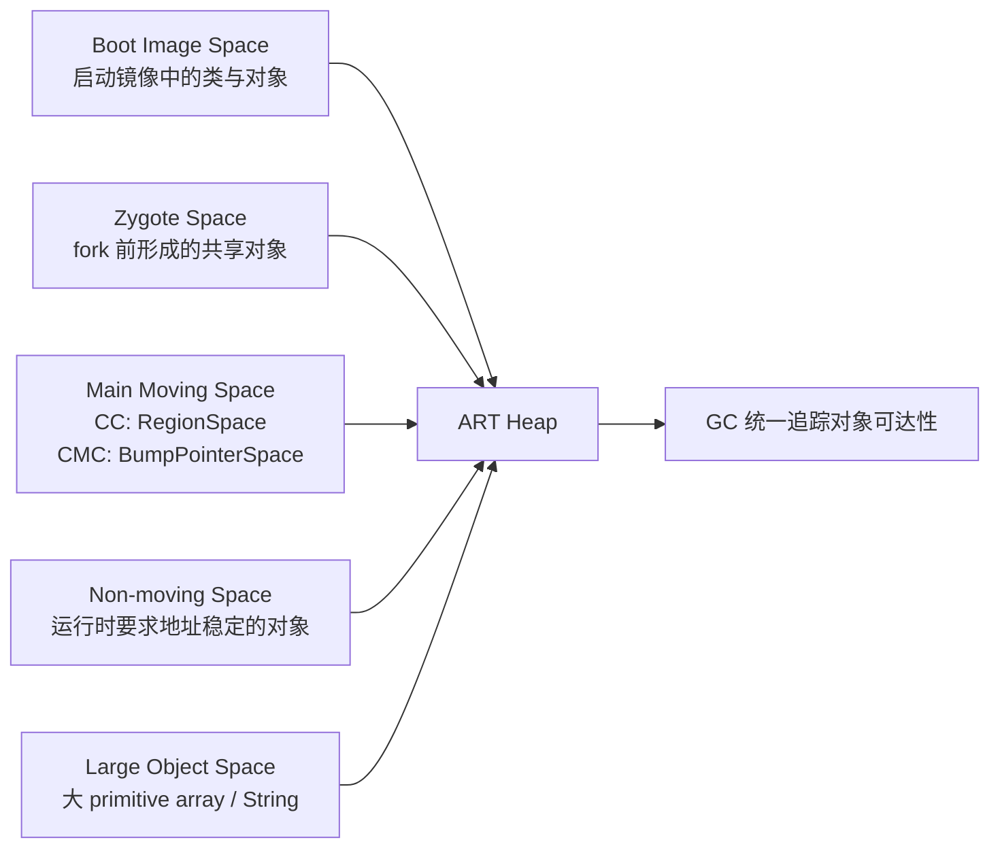
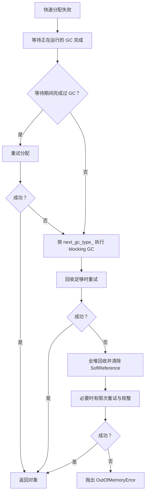

# 4.3 ART 虚拟机内存管理

平台源码以 Android 17 / API 37 / `android-17.0.0_r1` 为锚点，旧版本只用于解释演进。设备厂商可以调整垃圾回收（Garbage Collection，GC）类型、堆参数和运行时开关，因此具体设备仍以该设备的跟踪数据、日志与属性为准。

Android Runtime（ART）的内存问题很少只表现为一个数字。一次掉帧可能来自 GC 暂停，也可能是应用线程等待正在运行的 GC；Java 堆仍有空闲时，分配仍可能因连续空间不足而失败；原生内存分配持续增长，也会通过 ART 的登记机制触发 Java GC。

读懂这些现象，需要同时回答四个问题：

1. 对象分配到了哪个堆空间（space）？
2. 当前进程运行的是哪种垃圾收集器（collector）？
3. 这次 GC 的类型和原因分别是什么？
4. 应用线程在 GC 期间被暂停、抢占，还是在等待分配？

## ART 堆空间关系

ART 的 `Heap` 管理多个用途不同的堆空间。下图表示这些空间与 ART 堆的归属关系，不代表它们在每台设备上的固定虚拟地址顺序。



这五类空间的差别集中在三个维度：对象从哪里来、GC 能否回收、GC 能否移动。

| 空间 | 主要内容 | 可回收 | 可移动 | Android 17 主要实现 |
|---|---|---:|---:|---|
| 启动镜像空间（Boot Image Space） | 启动镜像中的预加载类、对象和运行时元数据 | 否 | 否 | `ImageSpace` |
| Zygote 空间 | Zygote 在创建应用进程前保留下来的对象 | 应用进程中否 | 否 | `ZygoteSpace` |
| 主移动空间（Main Moving Space） | 应用的大多数普通对象 | 是 | 是 | CC 使用 `RegionSpace`；CMC 使用 `BumpPointerSpace` |
| 非移动空间（Non-moving Space） | ART 明确要求地址稳定的托管对象 | 是 | 否 | 独立的 `DlMallocSpace` |
| 大对象空间（Large Object Space） | 达到阈值的基本类型数组或 `String` | 是 | 否 | `FreeListSpace` 或 `LargeObjectMapSpace` |

### 启动镜像空间：映射预生成对象

构建系统会为启动类路径（boot class path）生成 ART 镜像。进程启动时，`ImageSpace` 将镜像映射进地址空间，进程可以直接使用其中已经布局好的类、对象和元数据。映射页可以在进程之间共享，这也是 Zygote 启动模型能降低重复内存与启动工作的基础之一。

启动镜像空间属于 GC 的免疫空间（immune space）：其中的对象不由应用进程回收，也不会在应用 GC 中移动。不过，GC 仍要处理这里指向应用堆对象的引用。ART 使用卡表（card table）按内存片区记录可能变化的引用，并用修改联合表（mod-union table）汇总跨空间引用，避免每次都扫描整个镜像。

源码入口：

- `runtime/gc/space/image_space.cc`
- `runtime/gc/collector/immune_spaces.cc`
- `runtime/gc/accounting/mod_union_table.cc`

### Zygote 空间：进程复制边界上的只读主体

`Heap::PreZygoteFork()` 会先完成必要的 GC 和堆裁剪（trim），再建立 Zygote 通过 `fork()` 复制应用进程后使用的堆结构。启用 Zygote 规整时，`ZygoteCompactingCollector` 把存活对象压缩到当前非移动映射中。随后，`MallocSpace::CreateZygoteSpace()` 在页对齐边界切分这块映射：

- 前半段成为 Zygote 空间；
- 剩余尾部成为新的非移动空间；
- 应用的普通可移动对象继续使用独立的主移动空间。

因此，“把分配空间复制到非移动空间尾部”不足以描述 Android 17 的实现。这里同时涉及规整、空间切分、类表（class table）与字符串驻留表（intern table）快照，以及 mod-union table 的建立。

应用进程不会回收或移动 Zygote 空间中的对象。未修改的页面可继续与 Zygote 共享；应用写入页面会触发写时复制（Copy-on-Write，COW），增加该进程的私有脏页（Private Dirty）。Zygote 对象若在 `fork()` 后指向应用新对象，ART 仍需通过 mod-union table 和卡表记录这些引用。

源码入口：

- `runtime/gc/heap.cc`：`Heap::PreZygoteFork()`
- `runtime/gc/space/malloc_space.cc`：`MallocSpace::CreateZygoteSpace()`
- `runtime/gc/collector/zygote_compacting_collector.cc`

### 主移动空间：普通对象的主要去处

Android 17 中，主移动空间的实现随收集器改变：

- 并发复制收集器（Concurrent Copying，CC）使用 `RegionSpace`，每个 region 固定为 256 KiB；
- 并发标记规整收集器（Concurrent Mark-Compact，CMC）使用连续的 `BumpPointerSpace`。

这两条路径在运行时初始化时确定。`Heap` 还会同步选择对应的分配器（allocator）：CC 常用 `RegionTLAB`，CMC 使用指针递增（bump pointer）/TLAB 路径。不能只根据 Android 版本号推断某台设备正在使用哪条路径，厂商构建与运行时属性同样参与选择。

### 大对象空间：12 KiB 只是第一个条件

Android 17 的默认大对象阈值是 12 KiB：

```cpp
static constexpr size_t kMinLargeObjectThreshold = 12 * KB;
static constexpr size_t kDefaultLargeObjectThreshold = kMinLargeObjectThreshold;
```

这个常量用于说明默认边界。运行时参数可以把阈值调高，但不能低于 12 KiB。

`Heap::ShouldAllocLargeObject()` 还检查对象类型。对象只有同时满足以下条件，才优先进入大对象空间（Large Object Space，LOS）：

- `byte_count >= large_object_threshold_`；
- 类型是基本类型数组或 `String`。

普通对象数组、业务实体或图片的 Java 包装对象，不会仅因对象“大”就自动进入 LOS。图片像素也可能位于原生内存或 GPU 内存；看到 Bitmap 时应先确认像素存储位置。

LOS 有两种实现：

- `FreeListSpace` 预留一段地址范围并按空闲页复用；
- `LargeObjectMapSpace` 为对象建立独立映射，释放时解除映射。

默认选择由 `USE_ART_LOW_4G_ALLOCATOR` 构建宏决定。LOS 是非连续、不可移动的空间，回收时标记和清除对象，不参与主移动空间的搬迁。频繁创建大型 `byte[]`，或把大量 `char` 数据转成 `String`，会增加 LOS 分配、清扫和页面映射压力。

源码入口：

- `runtime/gc/heap.h`：`kMinLargeObjectThreshold`
- `runtime/gc/heap-inl.h`：`Heap::ShouldAllocLargeObject()`
- `runtime/gc/space/large_object_space.cc`

### 非移动空间：ART 内部的地址稳定区

Android 17 在需要独立非移动空间时创建 `DlMallocSpace`，并把 `can_move_objects` 设为 `false`。源码注释列出的主要内容包括 `Class`、`ArtMethod`、`ArtField` 和其他被明确要求不可移动的对象。

Java 的 `DirectByteBuffer` 不能作为这里的通用例子。它的 Java 包装对象仍可移动，底层直接内存位于托管堆之外。现代 Bitmap 的像素存储也不能据此归入非移动空间。

`Heap::kDefaultNonMovingSpaceCapacity` 是 64 MiB，`-XX:NonMovingSpaceCapacity` 可以调整它。Zygote 创建阶段会切分最初的映射，因此 64 MiB 是 ART 默认配置值，不应解释成每个应用专供 DirectByteBuffer 使用的固定额度。

应用代码通常不会主动选择这个分配器。ART 在类链接、反射构造的特定路径和其他运行时内部场景中调用 `AllocNonMovableObject()`。

源码入口：

- `runtime/gc/heap.cc`：非移动空间创建逻辑
- `runtime/gc/heap.h`：`kDefaultNonMovingSpaceCapacity`
- `runtime/mirror/class-alloc-inl.h`：`AllocNonMovableObject()`
- `runtime/class_linker.cc`

### 低 4 GiB 地址范围：约束托管堆布局，不约束整个进程

ART 的 `HeapReference` 使用 32 位压缩引用，即以较短的数值表示对象地址。为此，主要托管对象地址、卡表覆盖范围和相关映射需要满足低 4 GiB 布局要求。`heap.cc` 中多处映射会请求 `low_4gb=true`，或者选择低地址作为首选地址（preferred address）。

这项约束不表示 64 位应用只能使用 4 GiB 虚拟地址空间。原生堆、线程栈、共享库、即时编译（JIT）代码缓存、图形缓冲区和文件映射可以位于其他地址范围。分析 `/proc/<pid>/maps` 时，应把“托管对象引用宽度”与“进程总虚拟地址空间”分开。

## 对象分配：快路径为什么快，慢路径为什么会卡

### 小对象的快路径

启用线程局部分配缓冲区（Thread-Local Allocation Buffer，TLAB）后，线程会在自己的缓冲区内按递增指针（bump pointer）分配。只要剩余空间足够，主要工作近似为：

```text
result = tlab_pos
tlab_pos += aligned_object_size
```

这段伪代码只说明地址推进方式。对象清零、类指针写入、构造发布屏障、分配统计和插桩（instrumentation）仍由 ART 的分配入口处理。

Android 17 源码中的相关常量是：

- `Heap::kDefaultTLABSize = 32 KiB`；
- `Heap::kPartialTlabSize = 16 KiB`；
- `RegionSpace::kRegionSize = 256 KiB`。

这三个值属于不同层次。一个 region 可以承载 TLAB；默认 TLAB 大小不等于 region 大小。TLAB 用完后，`RegionSpace::AllocNewTlab()` 会持有 `region_lock_`，先尝试复用足够大的部分 TLAB，再寻找或建立合适的 region。把这里统称为“获取堆全局锁并 `mmap` 新 region”会掩盖真实分支。

CMC 的 `BumpPointerSpace` 也支持 TLAB。因此，TLAB 不是 CC 专属概念，具体分配器要结合收集器与 `Heap::GetCurrentAllocator()` 判断。

#### 部分 TLAB、默认 TLAB 与 region 不是同一个尺寸

TLAB 补充（refill）不是单一路径：

- 当前 TLAB 尾部仍有空间时，ART 可以先扩展可用范围；
- `BumpPointerSpace` 通常以 32 KiB 默认 TLAB 为参考申请连续区间；
- `RegionSpace` 会按对象大小和可用 region 计算部分 TLAB，16 KiB 是默认参考值，单个 region 则是 256 KiB；
- 补充 TLAB 需要进入共享空间的锁保护，但成功后的普通对象分配仍回到线程本地递增指针快路径。

因此，看到 16 KiB、32 KiB 和 256 KiB 时，应先确认它描述的是部分 TLAB、默认 TLAB，还是 RegionSpace 区域。它们也不随设备基础页大小机械保持倍数关系。

#### RosAlloc 的线程本地内存块

标记清除（Mark-Sweep）/并发标记清除（CMS）系列收集器在 Android 17 中仍可使用 RosAlloc。RosAlloc 按尺寸档位（size bracket）把小对象放入内存块（run），并优先使用线程本地 run；共享 run 的分配与回收才需要进入对应尺寸档位的锁。超过小对象档位的请求按页粒度处理。

因此，两种常见描述都不准确：TLAB 并非所有收集器的唯一快路径，RosAlloc 也不是每次小对象分配都获取一个堆全局锁。诊断要先确认当前收集器与分配器，再解释锁竞争或 TLAB 补充成本。

#### 插桩会改变被观察的快路径

分配记录、Java 虚拟机工具接口（JVMTI）插桩或精细采样，可能让分配经过额外钩子、统计与调用栈采集。优化实验应保持相同的分析器配置；不能把开启逐次分配记录后的耗时直接外推到未插桩的发布构建。

### LOS 分配失败后还会尝试普通空间

`Heap::AllocObjectWithAllocator()` 先调用 `ShouldAllocLargeObject()`。如果 LOS 分配失败，ART 会清除本轮 LOS 内存不足（OOM）异常，再尝试普通分配器。因此，不能只凭对象大小和最终一条 OOM 日志断定失败发生在 LOS；还要看分配器类型、剩余空间和碎片日志。

### 分配慢路径

普通分配返回空指针后，`Heap::AllocateInternalWithGc()` 接管。Android 17 的主要路径如下：



几个细节会直接影响跟踪数据的解读：

- 若其他线程已经在做 GC，分配线程会进入 `WaitForGcToComplete()`；等待本身可能形成明显卡顿。
- ART 先尝试 `next_gc_type_`。这个类型由上一次 GC 后的存活量、吞吐估计和堆目标计算决定，不固定为年轻代或全堆回收。
- 最后的回收会使用 `gc_plan_.back()`，收集整个堆并清除软引用。源码还会根据回收收益限制反复 GC，防止长期频繁回收（GC thrashing）。
- 对 RosAlloc/DlMalloc 路径，满足配置和时间间隔时还可能尝试同构空间规整（homogeneous space compaction），即把对象迁移到布局相同的空间以减少碎片。
- OOM 日志若显示总空闲字节大于请求大小，ART 会补充最大连续块等碎片信息。

“分配失败 → 后台 GC → 全堆 GC → OOM”只是粗略图示。源码还包含等待、并发竞争、分配器变化、回收收益和碎片规整等分支。

## GC 的三种分类不要混用

一次 GC 至少有三种分类。

### 收集器：使用哪套算法

Android 17 仍保留多种收集器类型，包括 CC、CMC、CMS、标记清除（Mark Sweep）、半空间复制（Semi-space）等。常见应用进程重点关注：

- `kCollectorTypeCC`：并发复制（Concurrent Copying）；
- `kCollectorTypeCMC`：并发标记规整（Concurrent Mark-Compact）；
- `kCollectorTypeCMS`：并发标记清除（Concurrent Mark-Sweep），主要用于兼容或定制配置。

### GC 类型：收集多大范围

`GcType` 定义了 `Sticky`、`Partial`、`Full`。在启用分代的 CC/CMC 中，`Sticky` 会选择年轻代收集器；非 Sticky 路径会选择覆盖更大范围的收集器。

“年轻代 GC”（Young GC）描述分代收集器的工作范围；`Full` 是一种 `GcType`。日志与跟踪数据中还会出现收集器名称，不能只按字符串中的 `GC` 猜测范围。

### GC 原因：为什么触发

Android 17 的常见 `GcCause` 包括：

| 原因值 | 含义 |
|---|---|
| `Alloc` | 分配失败，分配线程需要等待或参与回收 |
| `Background` | 为后续分配提前异步回收 |
| `Explicit` | `System.gc()` / `Runtime.gc()` 等显式请求 |
| `NativeAlloc` | ART 登记的、可由 Java GC 间接释放的原生内存超过触发水位 |
| `CollectorTransition` | 收集器或前后台策略切换 |
| `HeapTrim` | 堆裁剪；它不是普通对象回收 |

`GarbageCollector::Run()` 生成的跟踪名称由 GC 原因、收集器名称和 `GC` 组成。例如，Android 17 CMC 的收集器名称是 `concurrent mark compact`，完整名称还会带 `Alloc`、`Background` 或 `Explicit`。

## GC 演进：历史版本与 Android 17 当前选择

### Dalvik 与 ART 早期

Dalvik 主要使用非移动的标记清除与 `dlmalloc`。ART 5.0 之后引入 CMS 和 RosAlloc，把部分标记工作移到并发阶段，并用按槽位/内存块（slot/run）组织的分配器减少多线程分配竞争。CMS 长期不搬移普通对象，碎片需要在后台转换或分配失败时通过额外规整处理。

历史设备性能差异很大，不宜引用“暂停固定为几十毫秒”或“分配快若干倍”一类跨设备数字。判断旧设备应使用同机型、同系统、同负载的数据。

### Android 8：CC 成为默认 GC 方案

AOSP 的 ART GC 文档说明，Android 8 起默认方案是并发复制。CC 使用 `RegionSpace` 和 RegionTLAB，并通过读屏障（read barrier）在对象读取时修正引用，使应用线程能够与对象搬迁并发运行。

CC 并不把整个 Java 堆机械地分成两个等大的物理堆。Android 17 的 `RegionSpace` 为 CC 预留最多两倍容量的虚拟地址范围，以支持显式 GC 时搬迁所有 region；具体物理页消耗取决于已提交页面和回收过程。用“GC 时 RSS 必然接近两倍 Java 堆”判断内存峰值会产生误差。

CC 按 region 决定是否搬迁。Android 17 中：

- region 大小是 256 KiB；
- 新分配 region 或被强制选择的 region 会进入疏散（evacuation），即把存活对象搬到其他区域；
- 非大型 region 的存活率低于 75% 时可被搬迁；
- 高存活 region 可以成为 `UnevacFromSpace`，避免为了少量空洞搬走大量存活对象；
- 大型 region 不做疏散。

这些规则解释了 CC 如何兼顾碎片整理与复制成本。75% 是 region 选择阈值，不能换算成 GC 暂停时间或应用内存告警线。

Android 10 起，默认 CC 支持分代收集。年轻代 CC 优先处理新分配对象；ART 会比较最近一次年轻代 GC 与更大范围 GC 的估算吞吐，决定下一次继续收集年轻代还是扩大收集范围。

### CMC：用缺页故障协调并发规整

Android 17 的 `ShouldUseUserfaultfd()` 有两类入口。命令行显式指定 CMC 时会直接选择 CMC，这主要供测试和定制配置使用，后续仍可能进入停止所有应用线程（Stop-The-World，STW）的后备路径。未显式指定收集器的目标 Android 设备，需要同时满足系统属性允许 UFFD GC，并且 `KernelSupportsUffd()` 返回成功。UFFD 是用户空间缺页处理接口 `userfaultfd` 的简称。

默认设备路径中的内核探测还包括：

- `MREMAP_DONTUNMAP` 可用。源码按内核版本判断，也会直接探测，以兼容移植到旧分支的 GKI 补丁（backport）；
- `userfaultfd` 系统调用可用；
- UFFD API 提供让缺页线程收到总线错误信号的 `SIGBUS` 特性。次要缺页特性属于另一种模式的能力，不能把它写成 CMC 启用的唯一条件。

默认条件不满足时，采用读屏障的构建会走 CC。`gUseUserfaultfd` 与 `gUseReadBarrier` 在当前实现中互为相反值，应用运行期间不会在 CC 和 CMC 之间动态切换。

CMC 的规整过程会预留一段权限为 `PROT_NONE` 的来源空间（from-space）虚拟地址，并分配逐页状态表、首对象表和少量规整缓冲区。准备阶段使用 `mremap(..., MREMAP_DONTUNMAP, ...)` 等机制建立旧视图与目标视图，随后由 GC 线程或触发缺页的应用执行线程（mutator）按页处理、更新引用并映射页面。

“原地规整且没有额外内存”会遗漏这些结构；“像 CC 一样保留完整的第二份物理堆”也不准确。CMC 需要额外虚拟地址和 GC 元数据，旧页可通过重新映射形成来源空间视图，规整完成后再用 `madvise` 释放。分析收益应同时查看驻留集大小（RSS）、按共享页比例分摊的 PSS、虚拟映射、GC CPU 时间和应用慢路径。

### Android 16 QPR2：分代 CMC 对外发布

Android 16 QPR2 的官方发布说明确认 ART 引入分代 CMC（Generational CMC），目标是优先回收新对象，降低 CPU 使用并改善电池效率。Android 17 的源码可以进一步看到它的内部边界。

`Runtime::Init()` 只有在下列条件都满足时才把 `use_generational_gc` 传入 `Heap`：

- 收集器支持当前分代路径：Baker 读屏障或 UFFD；
- `-Xgc` 选项允许分代 GC；
- `ShouldUseGenerationalGC()` 返回 `true`。

CMC 还受 `use_generational_cmc()` 功能开关（feature flag）控制，设备配置属性也能关闭分代。发布版本支持该能力，不表示每个厂商进程都采用完全相同的配置。

Android 17 的分代 CMC 在 `BumpPointerSpace` 中维护三个逻辑区间。下面的区间表示对象年龄边界，不代表三个独立映射：

```text
[ moving_space_begin, old_gen_end )   old
[ old_gen_end, mid_gen_end )          mid
[ mid_gen_end, moving_space_end )     young
```

`YoungMarkCompact` 是一层轻量包装：它把主收集器的 `young_gen_` 设为 `true`，复用 `MarkCompact::RunPhases()`。年轻代收集会处理 young（年轻代）和 mid（中间代），并通过卡表等结构找到老年代到年轻代的引用。

`mark_compact.h` 明确说明，对象要经历两次 GC 才晋升到老年代。一次收集结束时：

- 原 mid 晋升到 old（老年代）；
- 本轮存活的 young 成为新的 mid；
- 后续分配继续进入新的 young 区域。

这套三段边界是分代年龄模型，不是三块独立 `mmap` 的堆。

## GC 为什么会开始

### 接近并发启动阈值

`concurrent_start_bytes_` 表示 ART 希望启动并发 GC 的近似字节位置，目标是让回收在分配触及上限前完成。它会随目标内存规模 `target_footprint_`、前后台状态、上次 GC 时的分配速度和收集器估计耗时调整。

分配热点后出现 `Background ... GC`，通常是阈值触发的异步回收，并不代表前一个对象分配已经失败。

### 分配失败

快速分配失败进入慢路径后，应用线程可能等待已有 GC，也可能自己发起阻塞式 GC。对应的 GC 原因是 `Alloc`。此时用户可感知延迟来自两部分：

- GC 的暂停阶段；
- 分配线程等待整轮 GC 完成的时间。

第二项可能远大于单次暂停。只看 GC 内部的暂停时长直方图（pause histogram），可能解释不了主线程上更长的空档。

### 原生内存分配压力

`RegisterNativeAllocation()` 用于登记那些可随 Java 对象生命周期间接释放的原生内存。这套记账独立于普通 Java 堆对象分配；ART 会将 Java 堆与登记的原生内存压力加权比较，超过水位后以 `NativeAlloc` 原因请求 GC。

并非所有原生内存都能自动、精确地出现在这套计数中。GPU 缓冲区、驱动映射、共享内存和第三方库分配仍要结合 `dumpsys meminfo`、`heapprofd`、DMA-BUF 统计等工具。

### 显式请求

`System.gc()` 最终发出显式 GC 请求，GC 原因为 `Explicit`。`Heap::CollectGarbage()` 保证在调用返回前，调用之后开始的一次 GC 已经完成；具体范围由 ART 当前收集器与 GC 方案决定。运行时还支持 `-XX:+DisableExplicitGC`。

因此，`System.gc()` 不应描述为一条固定的“强制全堆 GC”指令。它仍可能让调用线程等待昂贵工作，也无法修复持续引用、过高峰值或错误生命周期。应用业务代码通常没有足够信息替 ART 决定回收时机。

## 引用处理、终结器与资源释放

GC 标记阶段会处理软引用（Soft）、弱引用（Weak）、终结引用（Finalizer）和虚引用（Phantom）等引用类型。软引用在普通回收中可以保留；分配走到 OOM 前的最终全堆回收时，ART 会要求清除软引用，再判断是否抛出异常。

终结器（Finalizer）的执行是异步的。对象变成不可达后，仍要经过发现、入队和守护线程执行，资源释放时间没有及时性保证。Java 对象终结机制（finalization）已被弃用；文件、游标、图形对象和原生句柄应使用显式 `close()`、Kotlin `use`、Java try-with-resources，或清晰的生命周期协议。

`ReferenceQueue`（引用队列）适合接收引用状态变化通知，但它也需要消费方持续读取队列。队列无人消费、清理动作阻塞或原生资源未登记，都可能让“Java 对象已不可达”与“系统资源已释放”之间出现较长间隔。

FinalizerDaemon、ReferenceQueue 与超时诊断在 [4.8 ART FinalizerDaemon、Cleaner 与 ReferenceQueue](08-finalizer-referencequeue.md) 中展开。

## JIT、运行配置文件与 ART 内存

Java 堆 GC 不回收 JIT 生成的机器码。JIT 代码缓存有独立的代码/数据映射和回收策略。

Android 17 中：

- 发布构建的默认初始容量是 `max(64 KiB, 2 × page_size)`；
- 调试构建使用更小的压力测试起点，但仍至少为两页；
- 默认最大容量是 64 MiB，可由运行时参数修改；
- 容量不足且尚未到上限时，缓存会增长后重试；
- JIT GC 会标记线程栈上仍在执行的编译代码，并移除未标记、已经失效但尚待回收的代码（zombie code）；
- 到达最大容量且仍无法满足代码/数据分配时，本次缓存分配失败。不能概括成“满了就按最近最少使用顺序淘汰旧方法”。

配置文件引导编译（profile-guided compilation）会把运行期热点信息交给后续编译决策。基准配置文件（Baseline Profile）让关键路径更早获得预先编译（AOT）或 JIT 优化，减少冷启动早期的解释执行与即时编译工作。它的主要收益在执行和启动，不能直接当成 Java 堆优化手段。

详细实践参见 [8.7 Baseline Profiles](../../part2-performance/ch08-responsiveness/07-baseline-profiles.md)。

## 16 KiB 页大小对 ART 的直接影响

Android 17 的 ART 大量使用运行时 `gPageSize`：

- `BumpPointerSpace` 的映射和容量边界按 `gPageSize` 对齐；
- CMC 的页面状态、缺页处理、规整缓冲区与重新映射长度按 `gPageSize` 计算；
- JIT 代码缓存初始容量至少容纳两个系统页；
- 位图、卡表/空间边界和 `madvise` 范围也需要正确对齐。

LOS 默认阈值仍是固定 12 KiB，没有随 16 KiB 基础页改成 16 KiB 或 48 KiB。看到旧资料中的 `3 * kPageSize` 时，应回到当前源码标签的 `heap.h` 核对。

页变大还会影响提交粒度、内部碎片、TLB 覆盖和缺页成本，但方向与幅度依赖对象分布和设备。整机启动、功耗或相机数据不能只归因于 ART 的某一个分配器。系统级分析参见 [4.6 16 KB Page Size 与 Android 性能](06-16kb-page-size.md)。

## 在 Perfetto 中观察 ART GC

### 先找真实时间片名称

Perfetto 用时间片（slice）表示具有开始和结束时间的一段工作。Android 17 的 GC 主时间片来自下面这行源码：

```cpp
ScopedTrace trace(StringPrintf("%s %s GC", PrettyCause(gc_cause), GetName()));
```

等待 GC 的时间片名称来自：

```text
GC: Wait For Completion <cause>
```

这两类事件回答不同问题。前者表示收集器在运行，后者表示当前线程正在等待另一次 GC 完成。

先用下面的查询查看目标进程里带 `GC` 的全部时间片，确认设备上的名称与线程：

```sql
SELECT
  process.name AS process_name,
  thread.name AS thread_name,
  slice.name AS slice_name,
  ROUND(slice.ts / 1e6, 3) AS ts_ms,
  ROUND(slice.dur / 1e6, 3) AS dur_ms
FROM slice
JOIN thread_track
  ON slice.track_id = thread_track.id
JOIN thread USING (utid)
JOIN process USING (upid)
WHERE process.name = 'com.example.app'
  AND slice.name GLOB '*GC*'
  AND slice.dur > 0
ORDER BY slice.ts;
```

这条查询只覆盖线程轨道（thread track）。若设备把额外 ART 指标放在计数器轨道（counter track）或异步轨道（async track），需要先从 Perfetto 界面确认轨道类型，再查询对应数据表。

### 分开统计 GC 运行与应用等待

确认名称后，可以按时间片名称统计次数、总时长和尾部延迟：

```sql
SELECT
  slice.name AS slice_name,
  COUNT(*) AS occurrences,
  ROUND(SUM(slice.dur) / 1e6, 3) AS total_ms,
  ROUND(AVG(slice.dur) / 1e6, 3) AS avg_ms,
  ROUND(MAX(slice.dur) / 1e6, 3) AS max_ms
FROM slice
JOIN thread_track
  ON slice.track_id = thread_track.id
JOIN thread USING (utid)
JOIN process USING (upid)
WHERE process.name = 'com.example.app'
  AND (
    slice.name GLOB '* GC'
    OR slice.name GLOB 'GC: Wait For Completion*'
  )
  AND slice.dur > 0
GROUP BY slice.name
ORDER BY total_ms DESC;
```

平均值容易隐藏少量长尾。如果当前 Perfetto 版本支持 `PERCENTILE` 聚合，可以再计算 P50、P95、P99，即分别有 50%、95%、99% 的样本不超过该值；否则应导出明细后计算分位数。

### 不要用 `AllocObject` 猜分配停顿

对象分配的插桩跟踪、Java 堆分析样本和分配等待不是同一事件。Android 17 的可靠等待标记是 `GC: Wait For Completion Alloc`。还可以查找 `Alloc ... GC`，判断分配线程是否发起了阻塞式 GC。

下面的查询专门找分配相关等待：

```sql
SELECT
  thread.name AS thread_name,
  slice.name AS slice_name,
  ROUND(slice.ts / 1e6, 3) AS ts_ms,
  ROUND(slice.dur / 1e6, 3) AS wait_ms
FROM slice
JOIN thread_track
  ON slice.track_id = thread_track.id
JOIN thread USING (utid)
JOIN process USING (upid)
WHERE process.name = 'com.example.app'
  AND slice.name = 'GC: Wait For Completion Alloc'
ORDER BY slice.dur DESC;
```

如果主线程出现长等待，再把相同时间窗与以下信号对齐：

- `Alloc ... GC` 或 `Background ... GC` 的完整持续时间；
- GC 暂停与暂停所有线程（`suspend all`）阶段；
- 主线程的可运行、正在运行和睡眠状态（Runnable/Running/Sleeping）；
- CPU 竞争、频率和温控限频（thermal throttling）；
- Java 堆、原生堆与 RSS/PSS 曲线；
- 大数组分配和生命周期事件。

### 设备基线优先于固定阈值

“年轻代 GC 每几秒一次”“暂停超过 5 ms 就异常”“GC 吞吐必须高于 98%”都缺少设备和负载条件。120 Hz 帧预算约为 8.33 ms，但一段 2 ms 的 GC 暂停是否造成掉帧，取决于它落在帧的哪个位置，以及同一帧还有多少主线程、`RenderThread` 与 GPU 工作。

建议对同一设备、系统版本和场景记录：

- GC 次数与触发原因分布；
- 每种收集器时间片的 P50/P95/P99；
- `GC: Wait For Completion Alloc` 的次数与长尾；
- GC 期间的进程 CPU 时间；
- 每秒分配字节、对象数与回收字节；
- GC 前后的存活对象集合（live set）；
- 与帧时间线（FrameTimeline）中丢帧记录的时间重合情况。

回归判断用同一场景的前后差异，跨设备数据只用于辅助解释。

### SIGQUIT 提供累计 GC 统计

对可调试环境，可以向进程发送请求输出诊断信息的 `SIGQUIT` 信号：

```bash
adb shell kill -s QUIT <pid>
```

应用无响应（ANR）跟踪中的 `Dumping cumulative Gc timings` 会给出收集器各阶段、暂停时长直方图、吞吐和累计时间。它适合回答“长期是哪一阶段开销最高”；Perfetto 更适合回答“这一帧为何被影响”。两者结合比只看一次 GC 时间片更稳妥。

## 常见误判

### “有 GC 时间片，掉帧就由 GC 引起”

并发 GC 的大部分工作可与应用线程同时运行。掉帧可能来自暂停、等待 GC、CPU 抢占、内存带宽竞争，也可能只是与 GC 时间重合。先看主线程状态和 FrameTimeline，再定位 GC 阶段。

### “Java 堆还有空闲，不会 OOM”

OOM 还可能来自：

- 请求超过堆增长上限（growth limit）；
- 可用总量足够但连续块不足；
- LOS 或非移动分配器的布局限制；
- GC 后可回收比例过低，ART 为避免反复回收而放弃；
- 单次对象过大；
- 原生内存、地址空间或系统资源先达到限制。

ART 的 OOM 文本会给出请求字节数、空闲字节数（free bytes）、距 OOM 尚余字节数（until OOM）、目标内存规模（target footprint）和堆增长上限，并在可用时附加碎片信息。诊断应保留完整异常文本。

### “对象池一定减少 GC”

对象池降低分配次数，也会延长对象生命周期、扩大存活对象集合，并可能把临时峰值变成长驻内存。短小对象的 TLAB 分配成本很低；池化是否合算要看构造成本、复用频率、池上限和 GC 数据。优先池化创建成本较高的外部资源；普通数据传输对象（DTO）则应先测量再决定。

### “DirectByteBuffer 会占满非移动空间”

DirectByteBuffer 的原生后备内存位于 Java 堆外，Java 包装对象可以移动。它可能通过负责在对象不可达后执行清理动作的 Cleaner，或其他引用处理路径延迟释放原生内存，但这与非移动空间的 64 MiB 默认容量是两件事。

### “堆越大，性能越好”

更大的堆增长上限可以推迟部分 GC，也会容纳更大的存活对象集合，增加扫描、内存带宽和系统 PSS 压力。`ActivityManager.getMemoryClass()` 返回设备对普通应用的近似堆等级；厂商、进程类型和 `largeHeap` 会改变结果，没有通用的 128–512 MiB 固定范围。

## 排查顺序

遇到 GC 或 ART OOM 时，按下面的顺序收集证据：

1. 记录设备型号、构建指纹（build fingerprint）、API 级别、页大小和进程是否为 64 位。
2. 从启动日志或 SIGQUIT GC 转储确认收集器与分代状态。
3. 保留完整 OOM 文本，确认分配器、请求大小、堆增长上限与碎片提示。
4. 用 Perfetto 区分 GC 运行、暂停、`Wait For Completion` 和 CPU 抢占。
5. 用 Java 堆分析找对象类型和持有链，用 `heapprofd` 或系统统计检查原生内存与图形内存。
6. 对比优化前后的分配率、存活对象集合、GC CPU 时间、等待长尾和丢帧，不只比较 GC 次数。

定位分配热点时，Android Studio 分配记录适合开发期观察对象类型与调用点；Android 12 及以上版本的 Perfetto ART 分配分析可以按 `com.android.art` 堆采样调用栈。两者都会扰动分配路径，应先用开销较低的 GC 时间片、等待事件和堆计数缩小时间窗，再开启定向分析。

## 与其他章节的关系

- [4.1 Android 内存模型全景](01-memory-overview.md)：把 ART 堆放回 RSS/PSS、原生内存、图形和内核统计中。
- [4.2 Linux 内核内存管理](02-linux-memory.md)：解释 ART 的 `mmap`、缺页、回收和页大小如何由内核承载。
- [4.4 系统内存压力与 lmkd](04-lmk.md)：lmkd 依据系统压力与进程重要性终止进程，和 Java OOM 是两套机制。
- [4.6 16 KB Page Size 与 Android 性能](06-16kb-page-size.md)：解释页大小对映射、对齐和 ART 内存的影响。
- [4.7 ART 分代 GC、Region 碎片与暂停分析](07-art-generational-gc.md)：继续分析年轻代/全堆选择、Region 碎片与移动回收。
- [4.8 ART FinalizerDaemon、Cleaner 与 ReferenceQueue](08-finalizer-referencequeue.md)：展开引用队列、守护线程和资源释放。
- [4.9 ART HeapTask 调度、启动维护与冻结边界](09-art-heaptask-scheduling-pipeline.md)：展开 GC、收集器切换与堆裁剪的异步调度。

## 参考资料

### Android 17 源码

以下链接都固定到 `android-17.0.0_r1`：

- [Heap 与分配慢路径](https://android.googlesource.com/platform/art/+/refs/tags/android-17.0.0_r1/runtime/gc/heap.cc)
- [Heap 常量与 space 成员](https://android.googlesource.com/platform/art/+/refs/tags/android-17.0.0_r1/runtime/gc/heap.h)
- [内联分配与 LOS 判断](https://android.googlesource.com/platform/art/+/refs/tags/android-17.0.0_r1/runtime/gc/heap-inl.h)
- [CC collector](https://android.googlesource.com/platform/art/+/refs/tags/android-17.0.0_r1/runtime/gc/collector/concurrent_copying.cc)
- [CMC collector](https://android.googlesource.com/platform/art/+/refs/tags/android-17.0.0_r1/runtime/gc/collector/mark_compact.cc)
- [CMC 三代边界定义](https://android.googlesource.com/platform/art/+/refs/tags/android-17.0.0_r1/runtime/gc/collector/mark_compact.h)
- [RegionSpace](https://android.googlesource.com/platform/art/+/refs/tags/android-17.0.0_r1/runtime/gc/space/region_space.cc)
- [Large Object Space](https://android.googlesource.com/platform/art/+/refs/tags/android-17.0.0_r1/runtime/gc/space/large_object_space.cc)
- [GC cause](https://android.googlesource.com/platform/art/+/refs/tags/android-17.0.0_r1/runtime/gc/gc_cause.h)
- [JIT code cache](https://android.googlesource.com/platform/art/+/refs/tags/android-17.0.0_r1/runtime/jit/jit_code_cache.cc)

### 官方文档

- [Debug ART garbage collection](https://source.android.com/docs/core/runtime/gc-debug)
- [Android 16 QPR2 is Released](https://android-developers.googleblog.com/2025/12/android-16-qpr2-is-released.html)
- [Baseline Profiles overview](https://developer.android.com/topic/performance/baselineprofiles/overview)
- [Support 16 KB page sizes](https://developer.android.com/guide/practices/page-sizes)
