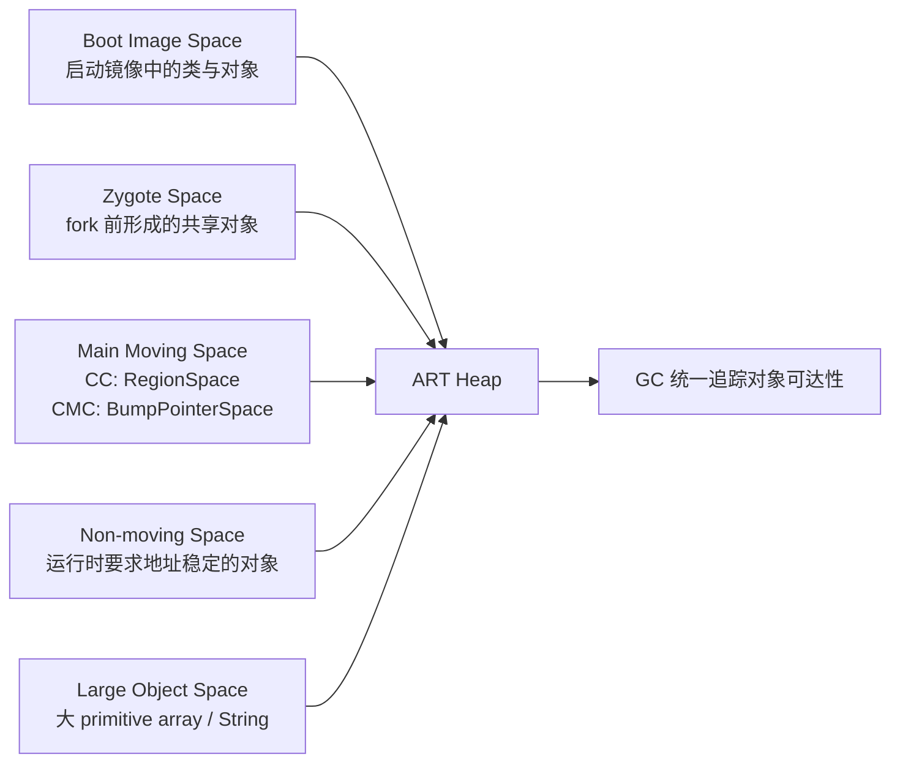
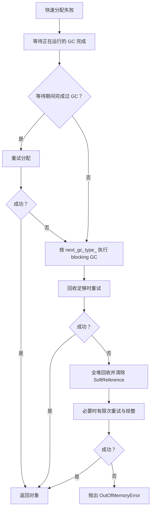

# ART 虚拟机内存管理

平台源码以 Android 17 / API 37 / `android-17.0.0_r1` 为锚点，旧版本只用于解释演进。设备厂商可以调整 GC 类型、堆参数和运行时开关，因此具体设备仍以该设备的轨迹、日志与属性为准。

ART 内存问题很少只表现为一个数字。一次掉帧可能来自 GC 暂停，也可能是应用线程等待正在运行的 GC；Java 堆仍有空闲时，分配仍可能因连续空间不足而失败；Native 分配持续增长，也会通过 ART 的登记机制触发 Java GC。

读懂这些现象，需要同时回答四个问题：

1. 对象分配到了哪个 space？
2. 当前进程运行的是哪种 collector？
3. 这次 GC 的类型和原因分别是什么？
4. 应用线程在 GC 期间被暂停、抢占，还是在等待分配？

## ART 堆空间关系

ART 的 `Heap` 管理多个用途不同的 space。图中的关系不代表它们在每台设备上的固定虚拟地址顺序。



这五类 space 的差别集中在三个维度：对象从哪里来、GC 能否回收、GC 能否移动。

| Space | 主要内容 | 可回收 | 可移动 | Android 17 关键实现 |
|---|---|---:|---:|---|
| Boot Image Space | 启动镜像中的预加载类、对象和运行时元数据 | 否 | 否 | `ImageSpace` |
| Zygote Space | Zygote 在 fork 应用前保留下来的对象 | 应用进程中否 | 否 | `ZygoteSpace` |
| Main Moving Space | 应用的大多数普通对象 | 是 | 是 | CC 使用 `RegionSpace`；CMC 使用 `BumpPointerSpace` |
| Non-moving Space | ART 明确要求地址稳定的托管对象 | 是 | 否 | 独立的 `DlMallocSpace` |
| Large Object Space | 达到阈值的 primitive array 或 `String` | 是 | 否 | `FreeListSpace` 或 `LargeObjectMapSpace` |

### Boot Image Space：映射启动镜像

构建系统会为 boot class path 生成 ART image。进程启动时，`ImageSpace` 将镜像映射进地址空间，进程可以直接使用其中已经布局好的类、对象和元数据。映射页可以在进程之间共享，这也是 Zygote 启动模型能降低重复内存与启动工作的基础之一。

Image Space 属于 GC 的免疫空间（immune space）：其中的对象不由应用进程回收，也不会在应用 GC 中移动。不过，GC 仍要处理这里指向应用堆对象的引用。ART 使用卡表、mod-union table 等结构记录这类跨空间引用，避免每次都扫描整个镜像。

源码入口：

- `runtime/gc/space/image_space.cc`
- `runtime/gc/collector/immune_spaces.cc`
- `runtime/gc/accounting/mod_union_table.cc`

### Zygote Space：fork 边界上的只读主体

`Heap::PreZygoteFork()` 会先完成必要的 GC 和 trim，再建立 fork 后使用的堆结构。启用 Zygote compact 时，`ZygoteCompactingCollector` 把存活对象压缩到当前 non-moving 映射中。随后，`MallocSpace::CreateZygoteSpace()` 在页对齐边界切分这块映射：

- 前半段成为 Zygote Space；
- 剩余尾部成为新的 Non-moving Space；
- 应用的普通可移动对象继续使用独立的 main moving space。

因此，“把 Allocation Space 复制到 Non-moving Space 尾部”不足以描述 Android 17 的实现。这里同时涉及压缩、space 切分、class table 与 intern table 快照、mod-union table 建立。

应用进程不会回收或移动 Zygote Space 中的对象。未修改的页可继续与 Zygote 共享；应用写入页会触发 Copy-on-Write，增加该进程的 Private Dirty。Zygote 对象若在 fork 后指向应用新对象，ART 仍需通过 mod-union/card 记录这些引用。

源码入口：

- `runtime/gc/heap.cc`：`Heap::PreZygoteFork()`
- `runtime/gc/space/malloc_space.cc`：`MallocSpace::CreateZygoteSpace()`
- `runtime/gc/collector/zygote_compacting_collector.cc`

### Main Moving Space：普通对象的主要去处

Android 17 中，main moving space 的实现随 collector 改变：

- CC 使用 `RegionSpace`，每个 region 固定为 256 KiB；
- CMC 使用连续的 `BumpPointerSpace`。

这两条路径在运行时初始化时确定。`Heap` 还会同步选择对应的 allocator：CC 常用 `RegionTLAB`，CMC 使用 Bump Pointer/TLAB 路径。不能根据 Android 版本号单独推断某台设备正在使用哪条路径，厂商构建与运行时属性同样参与选择。

### Large Object Space：12 KiB 只是第一个条件

Android 17 的默认大对象阈值是 12 KiB：

```cpp
static constexpr size_t kMinLargeObjectThreshold = 12 * KB;
static constexpr size_t kDefaultLargeObjectThreshold = kMinLargeObjectThreshold;
```

这个常量用于说明默认边界。运行时参数可以把阈值调高，但不能低于 12 KiB。

`Heap::ShouldAllocLargeObject()` 还检查对象类型。对象只有同时满足以下条件，才优先进入 Large Object Space：

- `byte_count >= large_object_threshold_`；
- 类型是 primitive array 或 `String`。

普通对象数组、业务实体或图片的 Java 包装对象，不会仅因对象“大”就自动进入 LOS。图片像素也可能位于 Native/GPU 内存；看到 Bitmap 时应先确认像素存储位置。

LOS 有两种实现：

- `FreeListSpace` 预留一段地址范围并按空闲页复用；
- `LargeObjectMapSpace` 为对象建立独立映射，释放时解除映射。

默认选择由 `USE_ART_LOW_4G_ALLOCATOR` 构建宏决定。LOS 是 discontinuous、non-moving space，回收时标记和清除对象，不参与 main moving space 的搬迁。频繁创建大 `byte[]`、`char` 数据转成的大 `String`，会增加 LOS 分配、清扫和页映射压力。

源码入口：

- `runtime/gc/heap.h`：`kMinLargeObjectThreshold`
- `runtime/gc/heap-inl.h`：`Heap::ShouldAllocLargeObject()`
- `runtime/gc/space/large_object_space.cc`

### Non-moving Space：ART 内部的地址稳定区

Android 17 在需要独立 non-moving space 时创建 `DlMallocSpace`，并把 `can_move_objects` 设为 `false`。源码注释列出的主要内容包括 `Class`、`ArtMethod`、`ArtField` 和其他被明确要求不可移动的对象。

Java 的 `DirectByteBuffer` 不能作为这里的通用例子。它的 Java 包装对象仍可移动，底层直接内存位于托管堆之外。现代 Bitmap 的像素存储也不能据此归入 Non-moving Space。

`Heap::kDefaultNonMovingSpaceCapacity` 是 64 MiB，`-XX:NonMovingSpaceCapacity` 可以调整它。Zygote 创建阶段会切分最初的映射，所以 64 MiB 是 ART 默认配置值，不应解释成每个应用专供 DirectByteBuffer 使用的固定额度。

应用代码通常不会主动选择这个 allocator。ART 在类链接、反射构造的特定路径和其他运行时内部场景中调用 `AllocNonMovableObject()`。

源码入口：

- `runtime/gc/heap.cc`：non-moving space 创建逻辑
- `runtime/gc/heap.h`：`kDefaultNonMovingSpaceCapacity`
- `runtime/mirror/class-alloc-inl.h`：`AllocNonMovableObject()`
- `runtime/class_linker.cc`

### low 4 GiB：约束托管堆布局，不约束整个进程

ART 的 `HeapReference` 使用 32 位压缩引用。为此，主要托管对象地址、card table 覆盖范围和相关映射需要满足 low-4-GiB 布局要求。`heap.cc` 中多处映射会请求 `low_4gb=true`，或者选择低地址作为 preferred address。

这项约束不表示 64 位应用只能使用 4 GiB 虚拟地址空间。Native heap、线程栈、共享库、JIT code cache、图形缓冲区和文件映射可以位于其他地址范围。分析 `/proc/<pid>/maps` 时，应把“托管对象引用宽度”与“进程总虚拟地址空间”分开。

## 对象分配：快路径为什么快，慢路径为什么会卡

### 小对象的快路径

启用 TLAB 后，线程在自己的 Thread-Local Allocation Buffer 内按 bump pointer 分配。只要剩余空间足够，关键工作近似为：

```text
result = tlab_pos
tlab_pos += aligned_object_size
```

这段伪代码只说明地址推进方式。对象清零、类指针写入、构造发布屏障、分配统计和 instrumentation 仍由 ART 的分配入口处理。

Android 17 源码中的相关常量是：

- `Heap::kDefaultTLABSize = 32 KiB`；
- `Heap::kPartialTlabSize = 16 KiB`；
- `RegionSpace::kRegionSize = 256 KiB`。

这三个值属于不同层次。一个 region 可以承载 TLAB；默认 TLAB 大小不等于 region 大小。TLAB 用完后，`RegionSpace::AllocNewTlab()` 会持有 `region_lock_`，先尝试复用足够大的 partial TLAB，再寻找或建立合适的 region。把这里统称为“获取 heap 全局锁并 mmap 新 region”会掩盖真实分支。

CMC 的 `BumpPointerSpace` 也支持 TLAB。TLAB 因而不是 CC 专属概念，具体 allocator 要结合 collector 与 `Heap::GetCurrentAllocator()` 判断。

### LOS 分配失败后还有一次普通 space 尝试

`Heap::AllocObjectWithAllocator()` 先调用 `ShouldAllocLargeObject()`。如果 LOS 分配失败，ART 会清除本轮 LOS OOM 异常，再尝试普通 allocator。因此，一条最终的 OOM 日志不能只凭对象大小断定失败发生在 LOS；还要看 allocator type、剩余空间和碎片日志。

### 分配慢路径

普通分配返回空指针后，`Heap::AllocateInternalWithGc()` 接管。Android 17 的主要路径如下：



几个细节会直接影响 trace 解读：

- 若其他线程已经在做 GC，分配线程会进入 `WaitForGcToComplete()`；等待本身可能形成明显卡顿。
- ART 先尝试 `next_gc_type_`。这个类型由上一次 GC 后的存活量、吞吐估计和堆目标计算决定，不固定为 Young 或 Full。
- 最终的回收会使用 `gc_plan_.back()`，收集整个堆并清除软引用。源码还用回收收益限制反复 GC，防止长期 GC thrashing。
- 对 RosAlloc/DlMalloc 路径，满足配置和时间间隔时还可能尝试同构空间规整（homogeneous space compaction）。
- OOM 日志若显示总空闲字节大于请求大小，ART 会补充最大连续块等碎片信息。

“分配失败 → 后台 GC → Full GC → OOM”只是粗略图示。源码还包含等待、并发竞争、allocator 变化、回收收益和碎片规整等分支。

## GC 的三个名称不要混用

一次 GC 至少有三种分类。

### Collector：使用哪套算法

Android 17 仍保留多种 collector 类型，包括 CC、CMC、CMS、Mark Sweep、Semi-space 等。常见应用进程重点关注：

- `kCollectorTypeCC`：Concurrent Copying；
- `kCollectorTypeCMC`：Concurrent Mark-Compact；
- `kCollectorTypeCMS`：Concurrent Mark-Sweep，主要用于兼容或定制配置。

### GC type：收集多大范围

`GcType` 定义了 `Sticky`、`Partial`、`Full`。在启用分代的 CC/CMC 中，`Sticky` 会选择 young collector；非 Sticky 路径选择覆盖更大范围的 collector。

“Young GC”描述分代 collector 的工作范围；“Full”是 `GcType`。日志与轨迹中还会出现收集器名称，不能只按字符串中的 `GC` 猜测范围。

### GC cause：为什么触发

Android 17 的常见 `GcCause` 包括：

| cause | 含义 |
|---|---|
| `Alloc` | 分配失败，分配线程需要等待或参与回收 |
| `Background` | 为后续分配提前异步回收 |
| `Explicit` | `System.gc()` / `Runtime.gc()` 等显式请求 |
| `NativeAlloc` | ART 登记的可由 Java GC 间接释放的 Native 内存超过触发水位 |
| `CollectorTransition` | collector/前后台策略切换 |
| `HeapTrim` | 堆 trim；它不是普通对象回收 |

`GarbageCollector::Run()` 生成的 trace 名称由 cause、collector 名称和 `GC` 组成。例如 Android 17 CMC 的 collector 名称是 `concurrent mark compact`，完整名称还会带 `Alloc`、`Background` 或 `Explicit`。

## GC 演进：历史版本与 Android 17 当前选择

### Dalvik 与 ART 早期

Dalvik 主要使用非移动的 Mark-Sweep 与 `dlmalloc`。ART 5.0 之后引入 CMS 和 RosAlloc，把部分标记工作移到并发阶段，并用按 slot/run 组织的分配器减少多线程分配竞争。CMS 长期不搬移普通对象，碎片需要在后台转换或分配失败时通过额外规整处理。

历史设备性能差异很大，不宜引用“暂停固定为几十毫秒”或“分配快若干倍”一类跨设备数字。判断旧设备应使用同机型、同系统、同负载的数据。

### Android 8：CC 成为默认 GC plan

AOSP 的 ART GC 文档说明，Android 8 起默认 plan 是 Concurrent Copying。CC 使用 `RegionSpace` 和 RegionTLAB，并通过 read barrier 支持应用线程与对象搬迁并发运行。

CC 并不把整个 Java 堆机械地分成两个等大的物理堆。Android 17 的 `RegionSpace` 为 CC 预留最多两倍 capacity 的虚拟地址范围，以支持显式 GC 时搬迁所有 region；具体物理页消耗取决于已提交页和回收过程。用“GC 时 RSS 必然接近两倍 Java 堆”判断内存峰值会产生误差。

CC 按 region 决定是否搬迁。Android 17 中：

- region 大小是 256 KiB；
- 新分配 region 或被强制选择的 region 会进入 evacuation；
- 非 large region 的存活率低于 75% 时可被搬迁；
- 高存活 region 可以成为 `UnevacFromSpace`，避免为了少量空洞搬走大量存活对象；
- large region 不做 evacuation。

这些规则解释了 CC 如何兼顾碎片整理与复制成本。75% 是 region 选择阈值，不能换算成 GC pause 或应用内存告警线。

Android 10 起，默认 CC 支持分代收集。Young CC 优先处理新分配对象；ART 会比较最近一次 young GC 与更大范围 GC 的估算吞吐，决定下一次继续 young 还是扩大收集范围。

### CMC：用页故障协调并发压缩

Android 17 的 `ShouldUseUserfaultfd()` 有两类入口。命令行显式指定 CMC 时会直接选择 CMC，这主要供测试和定制配置使用，后续仍可能进入 STW fallback。未显式指定 collector 的目标 Android 设备，需要同时满足系统属性允许 UFFD GC、`KernelSupportsUffd()` 返回成功。

默认设备路径中的内核探测还包括：

- `MREMAP_DONTUNMAP` 可用。源码按内核版本判断，也会直接探测，以兼容 GKI backport；
- `userfaultfd` 系统调用可用；
- UFFD API 提供 SIGBUS feature。minor-fault feature 是另一种模式的能力，不能把它写成 CMC 启用的唯一条件。

默认条件不满足时，read-barrier 构建会走 CC。`gUseUserfaultfd` 与 `gUseReadBarrier` 在当前实现中互为相反值，应用运行期间不会在 CC 和 CMC 之间热切换。

CMC 的压缩过程会预留一段 `PROT_NONE` 的 from-space 虚拟地址，并分配按页状态表、首对象表和少量 compaction buffer。准备阶段使用 `mremap(..., MREMAP_DONTUNMAP, ...)` 等机制建立旧视图与目标视图，随后由 GC 线程或触发 fault 的 mutator 按页处理、更新引用和映射页面。

“原地压缩且没有额外内存”会遗漏这些结构；“像 CC 一样保留完整的第二份物理堆”也不准确。CMC 需要额外虚拟地址和 GC 元数据，旧页可通过 remap 形成 from-space 视图，压缩完成后再 `madvise` 释放。分析收益应同时看 RSS/PSS、虚拟映射、GC CPU 和应用慢路径。

### Android 16 QPR2：Generational CMC 对外发布

Android 16 QPR2 的官方发布说明确认 ART 引入 Generational CMC，目标是优先回收新对象，降低 CPU 使用并改善电池效率。Android 17 的源码可以进一步看到它的内部边界。

`Runtime::Init()` 只有在下列条件都满足时才把 `use_generational_gc` 传入 `Heap`：

- collector 支持当前分代路径：Baker read barrier 或 UFFD；
- `-Xgc` 选项允许 generational GC；
- `ShouldUseGenerationalGC()` 返回 `true`。

CMC 还受 `use_generational_cmc()` feature flag 控制，设备配置属性也能关闭分代。发布版本支持该能力，不表示每个厂商进程都采用完全相同的配置。

Android 17 的 Generational CMC 在 `BumpPointerSpace` 中维护三个逻辑区间：

```text
[ moving_space_begin, old_gen_end )   old
[ old_gen_end, mid_gen_end )          mid
[ mid_gen_end, moving_space_end )     young
```

`YoungMarkCompact` 是一层轻量包装：它把主 collector 的 `young_gen_` 设为 `true`，复用 `MarkCompact::RunPhases()`。Young collection 会处理 young 和 mid，并通过 card table 等结构找到 old-to-young 引用。

`mark_compact.h` 明确说明，对象要经历两次 GC 才晋升到 old。一次收集结束时：

- 原 mid 晋升到 old；
- 本轮存活的 young 成为新的 mid；
- 后续分配继续进入新的 young 区域。

这套三段边界是分代年龄模型，不是三块独立 `mmap` 的堆。

## GC 为什么会开始

### 接近并发启动阈值

`concurrent_start_bytes_` 表示 ART 希望启动并发 GC 的近似字节位置，目标是让回收在分配触及上限前完成。它会随 `target_footprint_`、前后台状态、上次 GC 时的分配速度和 collector 估计耗时调整。

分配热点后出现 `Background ... GC`，通常是阈值触发的异步回收，并不代表前一个对象分配已经失败。

### 分配失败

快速分配失败进入慢路径后，应用线程可能等待已有 GC，也可能自己发起 blocking GC。对应 cause 是 `Alloc`。此时用户可感知延迟来自两部分：

- GC 的暂停阶段；
- 分配线程等待整轮 GC 完成的时间。

第二项可能远大于单次 pause。只看 GC 内部 pause histogram，可能解释不了主线程上更长的空洞。

### Native 分配压力

`RegisterNativeAllocation()` 用于登记那些可由 Java 对象生命周期间接释放的非 `malloc` Native 内存。ART 将 Java heap 与登记的 Native 压力加权比较，超过水位后以 `NativeAlloc` cause 请求 GC。

并非所有 Native 内存都自动、精确地出现在这套计数中。GPU buffer、驱动映射、共享内存和第三方库分配仍要结合 `dumpsys meminfo`、heapprofd、DMA-BUF 统计等工具。

### 显式请求

`System.gc()` 最终发出显式 GC 请求，cause 为 `Explicit`。`Heap::CollectGarbage()` 保证在调用返回前，调用之后开始的一次 GC 已经完成；具体范围由 ART 当前 collector 与 GC plan 决定。运行时还支持 `-XX:+DisableExplicitGC`。

因此，`System.gc()` 不应描述为一条固定的“强制 Full GC”指令。它仍可能让调用线程等待昂贵工作，也无法修复持续引用、过高峰值或错误生命周期。应用业务代码通常没有足够信息替 ART 决定回收时机。

## 引用处理、Finalizer 与资源释放

GC 标记阶段会处理 Soft、Weak、Finalizer、Phantom 等引用。软引用在普通回收中可被保留；分配走到 OOM 前的最终全堆回收时，ART 会要求清除软引用，再判断是否抛出异常。

Finalizer 的执行是异步的。对象变成不可达后，仍要经过发现、入队和 daemon 执行，资源释放时间没有及时性保证。Java finalization 已被弃用，文件、游标、图形对象和 Native handle 应使用显式 `close()`、`use`/try-with-resources 或清晰的生命周期协议。

`ReferenceQueue` 适合接收引用状态变化通知，但它也需要消费方持续取队列。未消费队列、清理动作阻塞或 Native 资源未登记，都可能让“Java 对象已不可达”与“系统资源已释放”之间出现较长间隔。

FinalizerDaemon、ReferenceQueue 与超时诊断在 [4.9 ART FinalizerDaemon 与 ReferenceQueue 性能边界](09-finalizer-referencequeue.md) 中展开。

## JIT、Profile 与 ART 内存

Java heap GC 不回收 JIT 生成的机器码。JIT code cache 有独立的 code/data 映射和回收策略。

Android 17 中：

- release 构建的默认初始容量是 `max(64 KiB, 2 × page_size)`；
- debug 构建使用更小的压力测试起点，但仍至少为两页；
- 默认最大容量是 64 MiB，可由运行时参数修改；
- 容量不足且尚未到上限时，cache 会增长后重试；
- JIT GC 会标记线程栈上仍在执行的编译代码，并移除未标记的 zombie code；
- 到达最大容量且仍无法满足 code/data 分配时，本次缓存分配失败。不能概括成“满了就按最近最少使用顺序淘汰旧方法”。

Profile-guided compilation 会把运行期热点信息交给后续编译决策。Baseline Profile 让关键路径更早获得 AOT/JIT 优化，减少冷启动早期的解释与即时编译工作。它的主要收益在执行和启动，不能直接当成 Java heap 优化手段。

详细实践参见 [8.7 Baseline Profiles](../../part2-performance/ch08-responsiveness/07-baseline-profiles.md)。

## 16 KiB page size 对 ART 的直接影响

Android 17 的 ART 大量使用运行时 `gPageSize`：

- `BumpPointerSpace` 的映射和容量边界按 `gPageSize` 对齐；
- CMC 的页状态、fault 处理、compaction buffer 与 remap 长度按 `gPageSize` 计算；
- JIT code cache 初始容量至少容纳两个系统页；
- bitmap、card/space 边界和 `madvise` 范围也需要正确对齐。

LOS 默认阈值仍是固定 12 KiB，没有随 16 KiB 基础页改成 16 KiB 或 48 KiB。看到旧资料中的 `3 * kPageSize` 时，应回到当前 tag 的 `heap.h` 核对。

页变大还会影响提交粒度、内部碎片、TLB 覆盖和缺页成本，但方向与幅度依赖对象分布和设备。整机启动、功耗或相机数据不能归因到 ART 某一个 allocator。系统级分析参见 [4.7 16KB Page Size 与 Android 性能](07-16kb-page-size.md)。

## 在 Perfetto 中观察 ART GC

### 先找真实 slice 名称

Android 17 的 GC 主 slice 来自：

```cpp
ScopedTrace trace(StringPrintf("%s %s GC", PrettyCause(gc_cause), GetName()));
```

等待 GC 的 slice 来自：

```text
GC: Wait For Completion <cause>
```

这两类事件回答不同问题。前者表示 collector 在运行，后者表示当前线程正在等另一次 GC 完成。

先用下面的查询查看目标进程里带 `GC` 的全部 slice，确认设备上的名称与线程：

```sql
SELECT
  process.name AS process_name,
  thread.name AS thread_name,
  slice.name AS slice_name,
  ROUND(slice.ts / 1e6, 3) AS ts_ms,
  ROUND(slice.dur / 1e6, 3) AS dur_ms
FROM slice
JOIN thread_track
  ON slice.track_id = thread_track.id
JOIN thread USING (utid)
JOIN process USING (upid)
WHERE process.name = 'com.example.app'
  AND slice.name GLOB '*GC*'
  AND slice.dur > 0
ORDER BY slice.ts;
```

这条查询只覆盖 thread track。若设备把额外 ART 指标放在 counter 或 async track，需要从 UI 中确认 track 类型后再查对应表。

### 分开统计 GC 运行与应用等待

确认名称后，可以按 slice 名称统计次数、总时长和尾延迟：

```sql
SELECT
  slice.name AS slice_name,
  COUNT(*) AS occurrences,
  ROUND(SUM(slice.dur) / 1e6, 3) AS total_ms,
  ROUND(AVG(slice.dur) / 1e6, 3) AS avg_ms,
  ROUND(MAX(slice.dur) / 1e6, 3) AS max_ms
FROM slice
JOIN thread_track
  ON slice.track_id = thread_track.id
JOIN thread USING (utid)
JOIN process USING (upid)
WHERE process.name = 'com.example.app'
  AND (
    slice.name GLOB '* GC'
    OR slice.name GLOB 'GC: Wait For Completion*'
  )
  AND slice.dur > 0
GROUP BY slice.name
ORDER BY total_ms DESC;
```

平均值容易隐藏少量长尾。Perfetto 版本支持 `PERCENTILE` 聚合时，可再计算 P50/P95/P99；否则导出明细后计算分位数。

### 不要用 `AllocObject` 猜 Allocation Stall

对象分配的 instrumentation trace、Java heap profile 样本和分配等待不是同一事件。Android 17 的可靠等待标记是 `GC: Wait For Completion Alloc`。还可以查找 `Alloc ... GC`，判断分配线程是否发起了 blocking GC。

下面的查询专门找分配相关等待：

```sql
SELECT
  thread.name AS thread_name,
  slice.name AS slice_name,
  ROUND(slice.ts / 1e6, 3) AS ts_ms,
  ROUND(slice.dur / 1e6, 3) AS wait_ms
FROM slice
JOIN thread_track
  ON slice.track_id = thread_track.id
JOIN thread USING (utid)
JOIN process USING (upid)
WHERE process.name = 'com.example.app'
  AND slice.name = 'GC: Wait For Completion Alloc'
ORDER BY slice.dur DESC;
```

如果主线程出现长等待，再把相同时间窗与以下信号对齐：

- `Alloc ... GC` 或 `Background ... GC` 的完整持续时间；
- GC pause 与 `suspend all` 阶段；
- 主线程 Runnable/Running/Sleeping 状态；
- CPU contention、频率和 thermal；
- Java heap、Native heap 与 RSS/PSS 曲线；
- 大数组分配和生命周期事件。

### 设备基线优先于固定阈值

“Young GC 每几秒一次”“pause 超过 5 ms 就异常”“GC 吞吐必须高于 98%”都缺少设备和负载条件。120 Hz 帧预算约为 8.33 ms，但一段 2 ms 的 GC pause 是否掉帧，取决于它落在帧的哪个位置，以及同帧还有多少主线程、RenderThread 与 GPU 工作。

建议对同一设备、系统版本和场景记录：

- GC 次数与 cause 分布；
- 每种 collector slice 的 P50/P95/P99；
- `GC: Wait For Completion Alloc` 的次数与长尾；
- GC 期间进程 CPU time；
- 每秒分配字节、对象数与回收字节；
- GC 前后的 live set；
- 与 FrameTimeline missed frame 的时间重合。

回归判断用同一场景的前后差异，跨设备数据只用于辅助解释。

### SIGQUIT 提供累计 GC 统计

对可调试环境，可向进程发送 `SIGQUIT`：

```bash
adb shell kill -s QUIT <pid>
```

ANR trace 中的 `Dumping cumulative Gc timings` 会给出 collector 各阶段、pause histogram、吞吐和累计时间。它适合回答“长期是哪一阶段最贵”；Perfetto 更适合回答“这一帧为何被影响”。两者结合比只看一次 GC slice 更稳妥。

## 常见误判

### “有 GC slice，掉帧就由 GC 引起”

并发 GC 的大部分工作可与应用线程同时运行。掉帧可能来自暂停、等待 GC、CPU 抢占、内存带宽竞争，也可能与 GC 时间重合但没有因果关系。先看主线程状态和 FrameTimeline，再定位 GC 阶段。

### “Java heap 还有空闲，不会 OOM”

OOM 还可能来自：

- 请求超过 growth limit；
- 可用总量足够但连续块不足；
- LOS 或 non-moving allocator 的布局限制；
- GC 后可回收比例过低，ART 为避免反复回收而放弃；
- 单次对象过大；
- Native 内存、地址空间或系统资源先达到限制。

ART 的 OOM 文本会给出请求字节数、free bytes、until OOM、target footprint、growth limit，并在可用时附加碎片信息。诊断应保留完整异常文本。

### “对象池一定减少 GC”

对象池降低分配次数，也会延长对象生命周期、扩大 live set，并可能把临时峰值变成长驻内存。短小对象的 TLAB 分配成本很低；池化是否合算要看构造成本、复用频率、池上限和 GC 数据。优先池化昂贵外部资源，普通 DTO 则先测量。

### “DirectByteBuffer 会占满 Non-moving Space”

DirectByteBuffer 的 Native backing memory 位于 Java heap 外，Java wrapper 可以移动。它可能通过 Cleaner/引用处理延迟释放 Native 内存，但这与 Non-moving Space 的 64 MiB 默认 capacity 是两件事。

### “堆越大，性能越好”

更大的 growth limit 可以推迟部分 GC，也会容纳更大的 live set，增加扫描、内存带宽和系统 PSS 压力。`ActivityManager.getMemoryClass()` 返回设备对普通应用的近似堆等级；厂商、进程类型和 `largeHeap` 会改变结果，没有通用的 128–512 MiB 固定范围。

## 排查顺序

遇到 GC 或 ART OOM 时，按下面的顺序收集证据：

1. 记录设备型号、build fingerprint、API level、页大小和进程是否 64 位。
2. 从启动日志或 SIGQUIT GC dump 确认 collector 与 generational 状态。
3. 保留完整 OOM 文本，确认 allocator、请求大小、growth limit 与碎片提示。
4. 用 Perfetto 区分 GC 运行、pause、`Wait For Completion` 和 CPU 抢占。
5. 用 Java heap profile 找对象类型和持有链，用 heapprofd/系统统计检查 Native 与图形内存。
6. 对比优化前后的分配率、live set、GC CPU、等待长尾和 missed frame，不只比较 GC 次数。

## 与其他章节的关系

- [4.1 Android 内存模型全景](01-memory-overview.md)：把 ART heap 放回 RSS/PSS、Native、图形和内核统计中。
- [4.2 Linux 内核内存管理](02-linux-memory.md)：解释 ART 的 `mmap`、缺页、回收和页大小如何由内核承载。
- [4.4 Low Memory Killer](04-lmk.md)：lmkd 依据系统压力与进程重要性杀进程，和 Java OOM 是两套机制。
- [4.8 ART 分代垃圾回收与 GC 暂停优化](08-art-generational-gc.md)：继续分析 young/full 选择与分代回收。
- [4.9 ART FinalizerDaemon 与 ReferenceQueue 性能边界](09-finalizer-referencequeue.md)：展开引用队列、daemon 和资源释放。
- [4.14 ART GC Region 碎片化与 Compaction 策略](14-art-gc-region-fragmentation-compaction.md)：深入 CC region 与 CMC 压缩。
- [4.16 ART TLAB 与对象分配性能](16-art-tlab-object-allocation-performance.md)：展开 allocator fast path 与 TLAB 复用。

## 参考资料

### Android 17 源码

以下链接都固定到 `android-17.0.0_r1`：

- [Heap 与分配慢路径](https://android.googlesource.com/platform/art/+/refs/tags/android-17.0.0_r1/runtime/gc/heap.cc)
- [Heap 常量与 space 成员](https://android.googlesource.com/platform/art/+/refs/tags/android-17.0.0_r1/runtime/gc/heap.h)
- [内联分配与 LOS 判断](https://android.googlesource.com/platform/art/+/refs/tags/android-17.0.0_r1/runtime/gc/heap-inl.h)
- [CC collector](https://android.googlesource.com/platform/art/+/refs/tags/android-17.0.0_r1/runtime/gc/collector/concurrent_copying.cc)
- [CMC collector](https://android.googlesource.com/platform/art/+/refs/tags/android-17.0.0_r1/runtime/gc/collector/mark_compact.cc)
- [CMC 三代边界定义](https://android.googlesource.com/platform/art/+/refs/tags/android-17.0.0_r1/runtime/gc/collector/mark_compact.h)
- [RegionSpace](https://android.googlesource.com/platform/art/+/refs/tags/android-17.0.0_r1/runtime/gc/space/region_space.cc)
- [Large Object Space](https://android.googlesource.com/platform/art/+/refs/tags/android-17.0.0_r1/runtime/gc/space/large_object_space.cc)
- [GC cause](https://android.googlesource.com/platform/art/+/refs/tags/android-17.0.0_r1/runtime/gc/gc_cause.h)
- [JIT code cache](https://android.googlesource.com/platform/art/+/refs/tags/android-17.0.0_r1/runtime/jit/jit_code_cache.cc)

### 官方文档

- [Debug ART garbage collection](https://source.android.com/docs/core/runtime/gc-debug)
- [Android 16 QPR2 is Released](https://android-developers.googleblog.com/2025/12/android-16-qpr2-is-released.html)
- [Baseline Profiles overview](https://developer.android.com/topic/performance/baselineprofiles/overview)
- [Support 16 KB page sizes](https://developer.android.com/guide/practices/page-sizes)
