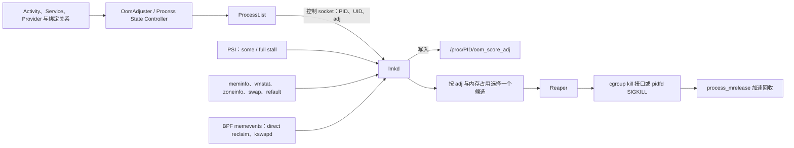
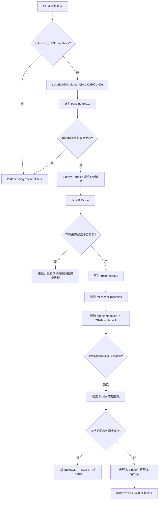

# lmkd、Cached App Freezer 与内存压力治理

系统内存压力会触发回收、压缩、冻结、memcg 限制和进程终止。lmkd 负责选择牺牲进程，Freezer 降低缓存进程活动，MemoryLimiter 与产品预取则改变局部压力和工作集。

## 压力信号、回收与 lmkd 决策

### 先把低内存终止机制放回 Android 内存体系

Android 会尽量保留离开前台的应用进程。用户再次打开应用时，系统可以复用进程、Java 堆、已加载的类和部分页面缓存，省去一次从 Zygote 通过 `fork()` 复制进程开始的启动。代价是物理内存、压缩交换空间和文件页缓存会逐渐承压。

Linux 内核自带内存不足进程终止机制（OOM Killer），但它通常在内存分配已经难以继续时介入。Android 还需要一层更早、也更了解应用重要性的策略：系统根据 Activity、Service、ContentProvider、绑定关系和近期交互计算进程优先级；低内存终止守护进程（low memory killer daemon，lmkd）结合这个优先级和内核压力数据，先处理对用户影响较小的进程。这套策略常简称低内存终止（LMK）机制。

Android 17 的 LMK 主路径包含三类输入、两段决策和一条回收链。下图用于区分进程重要性计算、压力判断、候选选择和终止后的内存回收：



图中有两个容易混淆的边界：

- `OomAdjuster` 负责回答“这个进程对用户有多重要”，`lmkd` 负责回答“当前压力是否需要终止进程，以及在什么优先级范围内选谁”。
- `lmkd` 会写 `/proc/<pid>/oom_score_adj`，同时在自己的进程表中登记候选。活动管理服务（ActivityManagerService，AMS）与 `lmkd` 之间存在专用控制套接字，不能把这条通信简化成“双方只通过 `/proc` 共享信息”。

平台源码以 `android-17.0.0_r1` 为锚点，内核语义以 `android17-6.18-2026-06_r6` 为锚点。

### 从内核 LMK 到用户空间 lmkd

#### 早期方案：内核中的 LowMemoryKiller

早期 Android 使用 `drivers/staging/android/lowmemorykiller.c`。Android Framework 计算若干组最低空闲页阈值 `minfree` 与优先级调整值 `adj`，再写入内核模块参数。内核回收路径发现可用页和文件缓存低于某一档阈值后，遍历进程并选择优先级较低的目标。

这套方案的局限来自它所在的位置：

- 内核收缩器（shrinker）回调不适合承载遍历进程、评估目标和终止进程这类重操作；
- 固定的空闲页阈值很难识别文件页缓存反复回收又读回的抖动（page cache thrashing），也容易把正常文件缓存当成紧迫内存；
- 策略位于内核，设备调校和版本更新成本较高；
- Android 进程语义先被压缩成一个数字，内核侧缺少更多决策信号。

上游 Linux 从 4.12 移除了该驱动。Android 随后把监控和选择逻辑迁到用户空间。

#### 现代方案：用户空间 lmkd

Android 8.1 的源码已经包含用户空间 `lmkd` 及 AMS 控制协议。Android 9 起，在未检测到内核 LMK 驱动时启用用户空间路径；Android 10 引入压力停顿信息（Pressure Stall Information，PSI）监控模式；Android 11 的新策略进一步把内存区域水位、交换空间和工作集页面反复回收后再次访问造成的抖动纳入判断。Android 17 延续这条架构。

迁到用户空间以后，`lmkd` 可以：

- 读取 `/proc/meminfo`、`/proc/vmstat`、`/proc/zoneinfo` 和 PSI；
- 接收 AMS 计算出的最新 `oom_score_adj`；
- 根据交换空间、文件页反复读入和回收的状态过滤压力信号；
- 通过属性、资源覆盖和厂商钩子（vendor hook）做设备级调校；
- 输出 logcat 日志、statsd 统计、控制套接字事件和 Perfetto 事件。

“用户空间”不表示它脱离内核。内核仍提供 PSI、pidfd（用于稳定引用进程的文件描述符）、控制组（cgroup）、`process_mrelease()`（加速释放已退出进程内存）和内存统计；策略代码位于 `lmkd`。

### `oom_score_adj`：候选优先级，不是生命周期枚举

#### 取值方向

Linux 的 `oom_score_adj` 范围是 `-1000` 到 `1000`：

- 数值越大，进程越容易成为终止候选；
- 数值越小，保护程度越高；
- `-1000` 对 Linux OOM 选择有特殊保护含义；
- Android Framework 的 `UNKNOWN_ADJ=1001` 是内部未决值，超出可写入内核的范围，不会作为有效 adj 发送。

Android 17 把核心常量集中在 `services/core/java/com/android/server/am/psc/Constants.java`。下表列出源码中的主要边界。

| 常量或区间 | Android 17 数值 | 常见语义 |
|---|---:|---|
| `NATIVE_ADJ` | -1000 | AMS 未管理、未由 AMS 分配 adj 的原生进程所用的特殊分类 |
| `SYSTEM_ADJ` | -900 | `system_server` |
| `PERSISTENT_PROC_ADJ` | -800 | 常驻系统进程 |
| `PERSISTENT_SERVICE_ADJ` | -700 | 被 system 或常驻进程以重要方式绑定的服务 |
| `FOREGROUND_APP_ADJ` | 0 | 顶层/前台关键进程 |
| `PERCEPTIBLE_RECENT_FOREGROUND_APP_ADJ` | 50 | 近期从顶层状态转到前台服务（FGS）的宽限层 |
| `VISIBLE_APP_ADJ` | 100 | 可见进程；特性开关启用时可分层到 199 |
| `PERCEPTIBLE_APP_ADJ` | 200 | 用户可感知组件，例如符合条件的音频播放 |
| `PERCEPTIBLE_MEDIUM_APP_ADJ` | 225 | system 绑定且要求较高保护的服务 |
| `PERCEPTIBLE_LOW_APP_ADJ` | 250 | 低一级的可感知绑定 |
| `BACKUP_APP_ADJ` | 300 | 正在备份 |
| `HEAVY_WEIGHT_APP_ADJ` | 400 | 重量级应用 |
| `SERVICE_ADJ` | 500 | 一般服务进程 |
| `HOME_APP_ADJ` | 600 | 桌面/Home 进程 |
| `PREVIOUS_APP_ADJ` | 700 | 前一个应用；特性开关启用时可分层到 799 |
| `SERVICE_B_ADJ` | 800 | B 级服务进程 |
| `CACHED_APP_MIN_ADJ`～`CACHED_APP_MAX_ADJ` | 900～999 | 缓存进程 |
| `CACHED_APP_LMK_FIRST_ADJ` | 950 | LMK minfree 档优先允许处理的缓存进程边界 |

这张表不能直接当作“每种组件永远对应一个固定值”。`OomAdjuster` 或新版 Oom Adjuster 会按整个依赖图计算 adj：

- 前台客户端绑定后台服务时，服务端可以得到更高保护；
- 前台进程正在使用某个 ContentProvider 时，提供器所在进程也可能获得更高保护；
- 前台服务的类型、近期顶层状态宽限、可见 Activity 层次和系统绑定都会影响结果；
- 缓存进程和前一个应用在特性开关启用后可以使用更细的阶梯值。

因此，排查时要读取目标时刻的 adj，不能只凭“它有一个 Service”推断。

`NATIVE_ADJ` 也不代表所有原生守护进程都天然不会被终止。该常量在 Framework 中描述 AMS 未管理的原生进程；某个守护进程的实际保护还取决于 init 服务配置、它的 `/proc/<pid>/oom_score_adj`，以及它是否登记到 `lmkd`。

### AMS 如何把优先级交给 lmkd

#### 控制协议

Android 17 的命令号在 Framework `ProcessList.java` 与 `system/memory/lmkd/include/lmkd.h` 中保持一致：

| 命令 | 值 | 作用 |
|---|---:|---|
| `LMK_TARGET` | 0 | 下发最多 6 组 `minfree/oom_adj` |
| `LMK_PROCPRIO` | 1 | 登记一个进程并设置 adj |
| `LMK_PROCREMOVE` | 2 | 移除一个进程记录 |
| `LMK_PROCPURGE` | 3 | 清理该客户端登记的进程 |
| `LMK_GETKILLCNT` | 4 | 查询终止次数 |
| `LMK_SUBSCRIBE` | 5 | 订阅异步终止或统计事件 |
| `LMK_PROCKILL` | 6 | `lmkd` 发给订阅者的终止通知 |
| `LMK_UPDATE_PROPS` | 7 | 重新读取属性并重建监控 |
| `LMK_KILL_OCCURRED` | 8 | Framework 中的统计事件名；原生层头文件名为 `LMK_STAT_KILL_OCCURRED` |
| `LMK_START_MONITORING` | 9 | 启动延迟初始化的 PSI 监控 |
| `LMK_BOOT_COMPLETED` | 10 | 通知 `lmkd` 完成启动后初始化 |
| `LMK_PROCS_PRIO` | 11 | 批量登记 adj |

单进程 `LMK_PROCPRIO` 包含 6 个 32 位整数：命令、PID、UID、adj、进程类型（process type）、`for_lmkd_only`。默认进程类型是 `PROC_TYPE_APP`。当 `for_lmkd_only=false` 时，`lmkd::apply_proc_prio()` 先把 adj 写到 `/proc/<pid>/oom_score_adj`，再把进程放进对应 adj 链表。

批量命令每个包最多放 3 个进程，每个记录有 PID、UID、adj、process type 和 `for_lmkd_only` 五个字段。Android 17 的 `ProcessList.batchSetOomAdj()` 固定把末尾一个字段写成 0，因此批量路径不支持只更新 `lmkd` 内部值。

每包三条来自控制包最多包含 16 个 `int`：一个命令字加三组、每组五个字段。批量路径减少套接字写入和守护进程收包次数，但它不是一次不可分割的原子事务。`lmkd` 会逐条校验 PID、UID、adj 和字段范围；某条记录失败不代表其他记录自动回滚。`for_lmkd_only` 只决定是否同时写 `/proc/<pid>/oom_score_adj`，不是“只在压力时生效”的延迟更新开关。

连接建立后，`ProcessList.onLmkdConnect()` 会：

1. 发送 `LMK_PROCPURGE`，清掉旧连接留下的登记；
2. 在 OOM 档位已计算时重发 `LMK_TARGET`；
3. 订阅终止与统计两类异步事件。

这条控制链也解释了一个常见误判：手工写 `/proc/<pid>/oom_score_adj` 只改变内核值，未必同步 `lmkd` 自己的候选链表；AMS 下一轮调整还可能覆盖手工值。

#### Android 17 的 6 档 `LMK_TARGET`

`ProcessList` 仍保留 6 档 minfree。Android 17 的 adj 数组是：

| 档位 | adj | 低内存设备基线（KB） | 高内存设备基线（KB） |
|---|---:|---:|---:|
| 前台 | 0 | 12,288 | 73,728 |
| 可见 | 100 | 18,432 | 92,160 |
| 用户可感知 | 200 | 24,576 | 110,592 |
| 低一级用户可感知 | 250 | 36,864 | 129,024 |
| 缓存进程起点 | 900 | 43,008 | 147,456 |
| LMK 优先缓存进程边界 | 950 | 49,152 | 184,320 |

最终值还会受 RAM、显示面积、64 位缓存进程档乘数以及资源覆盖项影响。Framework 把 KB 转成页数再发送，因此不能在 16 KB 页设备上把一页写死为 4 KB。

这些数组在 Android 17 仍有两类用途：

- `ro.lmk.use_minfree_levels=true` 时，`lmkd` 使用传统的空闲页和文件缓存阈值；
- Framework 的 `getMemLevel()` 等逻辑仍会读取计算后的内存档位。

看到 `LMK_TARGET` 仍在源码中，不能据此判断默认 PSI 新策略也只看固定的 minfree 阈值。

### Android 17 的 PSI 新策略

#### `some` 与 `full` 的精确定义

内核通过 `/proc/pressure/memory` 导出 PSI（Pressure Stall Information，压力停顿信息）：

- `some` 表示至少有一部分任务因该资源而停顿；
- `full` 表示所有非空闲任务同时停顿，此时 CPU 无法继续做有效工作。

这里的对象是调度器管理的任务（task），不是笼统的“设备上所有进程”。`full` 也不统计内核用于填补空转时间的空闲任务（idle task）。

PSI 触发器使用“某个时间窗口内累计停顿多久”的形式。例如 `some 70000 1000000` 表示在 1 秒窗口内，部分任务累计停顿 70 ms 后唤醒监听者。触发器只负责发出检查信号，不代表 `lmkd` 一定会终止进程。

#### Android 17 最终注册的阈值

`lmkd.cpp` 静态初始化的三档表是 `some 70 ms / some 100 ms / full 70 ms`。默认的新策略启动时会覆盖这组初值：

- LOW 档设为 0，不注册；
- MEDIUM 使用 `ro.lmk.psi_partial_stall_ms`，普通设备默认 70 ms，低内存（low-RAM）设备默认 200 ms；
- CRITICAL 使用 `ro.lmk.psi_complete_stall_ms`，默认 700 ms；
- 默认窗口是 1000 ms。

所以，阅读源码时要追到 `init_psi_monitors()`。只摘录静态数组会得到错误的运行时阈值。

`use_new_strategy` 的默认值是：

```text
low_ram_device || !use_minfree_levels
```

上面的表达式说明默认选择条件：低内存设备，或未启用传统 `minfree` 模式的设备，会采用新策略。若强制使用旧策略，Android 17 还要求使用第一版内存控制组接口（memcg v1）；`mp_event_common()` 已标记 `[[deprecated("memcg v1 is not supported after Dec. 2026")]]`。这条注解只是源码中的支持期限提示，不能据此推断某个 Android 产品版本的兼容期限。

`LowMemDetector` 和 “LMKD v2” 都不是 `android-17.0.0_r1` 中的正式类名或版本对象。前者至多泛指低内存检测，后者常见于旧资料，用来区分用户空间 `lmkd` 与早期的内核模块。分析当前源码时，应以 `use_new_strategy`、PSI 触发器、内存事件（memevents）和具体函数为准。

Android 17 的 `libpsi` 为 `lmkd` 打开全局 `/proc/pressure/memory`，并不会遍历每个应用的 `memory.pressure`。`ro.config.per_app_memcg`、Reaper 使用 `cgroup.kill`、cgroup v2 支持控制组级 PSI，是三件彼此独立的事；不能据此推断 `lmkd` 会按“哪个应用控制组的 PSI 最高”选择终止目标。

#### PSI 唤醒之后还要检查什么

新策略收到 PSI 或轮询事件后，还会读取并比较：

- `/proc/vmstat` 中工作集重新缺页（workingset refault）、直接回收（direct reclaim）和内核交换守护线程 `kswapd` 的统计；
- `/proc/meminfo` 中的空闲页、文件页、交换空间（swap）、匿名页等数据；
- 根据 `/proc/zoneinfo` 计算的内存区域水位（zone watermark）；
- 剩余交换空间与交换空间使用率；
- 文件页 refault 相对于页缓存（page cache）大小的增长比例，也就是下文所说的缓存抖动（thrashing）；
- 上一个终止动作是否结束，以及动作完成后水位是否恢复。

Android 17 还会在系统启动完成后尝试注册 BPF 内存事件。BPF 在这里指由内核执行并向用户空间上报事件的小程序机制：

- 直接回收开始和结束；
- `kswapd` 唤醒和休眠；
- 可选的设备厂商 LMK 终止事件；
- 可选的内存区域信息更新事件。

若内存事件监听器不可用，`lmkd` 会改用两次 `vmstat` 读数之差来识别直接回收和 `kswapd` 活动。BPF 事件能提供更及时的状态变化，但事件本身同样不会直接终止进程。

#### 决策原因与候选门槛

Android 17 新策略的主要终止原因包括：

- 严重（CRITICAL）PSI 下设备长时间无响应；
- 剩余交换空间较少，同时出现页缓存抖动；
- 内存水位和剩余交换空间同时偏低；
- 内存水位偏低且交换空间使用率过高；
- 低水位伴随缓存抖动；
- 直接回收期间出现缓存抖动，或直接回收持续过久；
- 缓存抖动后文件缓存仍然偏低；
- 终止进程后仍低于最小水位；
- 普通低水位；
- 设备厂商内存事件提供的原因。

普通低水位分支使用 `ro.lmk.lowmem_min_oom_score`。Android 17 默认是 `PREVIOUS_APP_ADJ + 1`，即 701，并且源码把它限制为不低于 `PERCEPTIBLE_APP_ADJ + 1`，即 201。

“701 等于从缓存进程开始终止”并不准确。启用上一应用优先级阶梯（previous ladder）时，701～799 可能包含上一个应用的进程；800 是 B 类服务；900 以上才是缓存进程。关闭该阶梯时，701～799 可能没有对应进程，但门槛仍是 701。发生严重停顿时，门槛可以降到 0，连前台层的进程也会进入候选范围。

`__mp_event_psi()` 按固定顺序检查设备厂商事件、终止后仍处于低水位、严重 PSI、交换空间不足、缓存抖动、直接回收与普通低水位。前面的分支命中后会确定本轮原因，后续条件不会覆盖它。诊断日志中的原因既说明触发了哪类条件，也反映源码的判断顺序。

缓存抖动比例来自 `workingset_refault_file` 相对于窗口起点活跃、非活跃文件页总量的增长率，表示文件页工作集被回收后又反复读回。它不是匿名页换入率、ZRAM 压缩率，也不是 PSI `full`。成功终止进程后，部分原因会按 `thrashing_limit_decay` 降低下一轮动态阈值；没有合适目标时，历史 refault 计数会经过衰减并保留到下一个窗口。

还要区分三个名称相近的配置：`thrashing_limit_critical` 可取消对用户可感知进程的额外保护；`stall_limit_critical` 比较内存 PSI 的 `full avg10`；`direct_reclaim_threshold_ms` 只在内存事件能够提供直接回收起止时间时判断回收是否卡住。三者并不是一个所谓的“严重缓存抖动”条件。

#### 候选选择

`find_and_kill_process()` 从 `oom_score_adj=1000` 开始，逐档向门槛递减：

1. 先检查数值更大的 adj 档，也就是保护程度较低的进程；
2. 默认从该档链表尾部取候选；
3. `ro.lmk.kill_heaviest_task=true` 时，在该 adj 档选择占用内存最多的目标；
4. 当门槛已经降到 `PERCEPTIBLE_APP_ADJ` 或更低时，源码会强制选择该档中占用内存最多的进程，尽量减少被终止的高价值进程数量；
5. 一次函数调用成功处理一个目标后返回。

“一次调用只选一个”不等于一个压力周期只会终止一个进程。PSI 事件后，`lmkd` 会进入间隔为 10 ms 或 100 ms 的轮询；等待目标退出时暂停轮询，收到 pidfd 退出通知或等待超时后再恢复。pidfd 是内核提供的进程文件描述符，可避免只凭 PID 观察进程时遇到编号复用问题。若水位仍未恢复，下一轮可以继续选择目标。

### 终止进程后：Reaper 怎样让内存尽快可用

Reaper 是 `lmkd` 中负责异步终止进程并催促内核回收内存的执行器。`kill_one_process()` 在发出终止信号前会做几项防护和记账：

- 再读 `/proc/<pid>/status`，检查进程是否仍存在；
- 校验线程组 ID（TGID），降低 PID 被复用后终止错误进程的风险；
- 读取常驻内存集（RSS）、匿名页 RSS 和交换空间占用；
- 读取可用的 DMA-BUF PSS/RSS，用于估算图形等共享缓冲区的占用；
- 调用设备厂商提供的释放内存钩子；若其他组件已经释放足够内存，便跳过本次终止；
- 建立 pidfd 或基于 PID 的退出等待。

随后，`reaper.kill(..., false)` 尝试把任务交给异步 Reaper：

1. 优先写控制组（cgroup）的终止接口；较旧的兼容路径会遍历 `cgroup.procs`；
2. 没有合适的控制组时，改用 `pidfd_send_signal(SIGKILL)` 发送不可捕获的强制终止信号；
3. Reaper 线程调用 `process_mrelease(pidfd, 0)`，在进程退出清理完全结束前，促使内核提前回收其匿名页和页表。

Reaper 线程会进入前台 CPU 集合（`cpuset`）并提高自身优先级；它还会为目标进程组设置专用的回收任务配置（reap task profile）。这些行为来自 AOSP 的 `reaper.cpp`，不依赖某个芯片厂商的私有补丁。

终止信号发出后，内存不会立刻全部回到可用池。目标包含大量匿名页、交换页或 DMA-BUF 时，更应观察这段回收延迟。

#### Android 17 的可观测输出

当前 `lmkd.cpp` 每次成功提交终止动作都会执行：

```cpp
ATRACE_INSTANT_FOR_TRACK(LOG_TAG, desc);
```

这行代码用于说明事件类型。`LOG_TAG` 是 `lowmemorykiller`，`desc` 依次编码 PID、终止原因、目标 adj、最低候选 adj 和最大缓存抖动比例。它是瞬时事件（instant event），只有一个时间点；并非带开始、结束时间的持续区间（duration slice）。源码中也没有旧文章常提到的 `LMKD_TRACE_KILLS` 编译开关。

同一条路径还会：

- 写入 logcat，包含进程名、PID、UID、adj、RSS、匿名页 RSS、交换空间、DMA-BUF 与原因；
- 写入 statsd 的 LMK 终止统计事件（atom）；
- 向已订阅的 Framework 客户端发送终止与统计消息。

`ProcessList` 收到 `LMK_PROCKILL` 后，把记录交给 `AppExitInfoTracker`，应用退出历史会标记为 `ApplicationExitInfo.REASON_LOW_MEMORY`。

#### 主事件处理超时时的看门狗

`lmkd` 为事件处理函数设置了 2 秒看门狗（watchdog）。超时后，独立线程会从 `oom_score_adj=1000` 向 0 搜索有效候选，通过 Reaper 同步终止一个进程并记录 `killinfo`。这条紧急路径不会重新执行完整的 PSI、水位和原因判断；日志中的 `lmkd watchdog timed out!` 应与常规内存压力终止事件分开统计。

### LMK、Linux OOM、进程内 OOM 与 MemoryLimiter

这四类故障都可能表现为“进程消失”或“内存不足”，证据来源不同：

| 机制 | 触发范围 | Android 17 的主要证据 |
|---|---|---|
| 用户空间 `lmkd` | 系统整体压力，按 adj 选择终止目标 | `lowmemorykiller` 日志、Perfetto `mem.lmk`、`REASON_LOW_MEMORY` |
| Linux OOM Killer | 内核无法满足内存分配，由内核选择目标 | 内核日志；Framework 的 `OomConnection` 记录 `REASON_LOW_MEMORY` + `SUBREASON_OOM_KILL` |
| Java/原生进程内 OOM | 单进程堆或地址空间分配失败 | `OutOfMemoryError`、异常终止记录（abort/tombstone）、崩溃退出原因 |
| Android 17 MemoryLimiter | 单应用进程超过设备配置的配额 | `REASON_OTHER`，description 含 `MemoryLimiter:AnonSwap` |

看到 `REASON_LOW_MEMORY` 后，还要结合子原因（subreason）、`lmkd` 日志和性能轨迹（trace），区分系统 LMK 与内核 OOM。Java `OutOfMemoryError` 也不能直接归因于 `lmkd`。

### LMK 如何变成用户可感知卡顿

LMK 的目标是缩短内存压力持续时间。用户体验问题通常出现在终止进程之后：

1. 系统持续处于低水位或缓存抖动状态；
2. `lmkd` 反复处理缓存进程、B 类服务或上一个应用进程；
3. 用户返回已被终止的应用；
4. 系统重新派生（fork）进程、绑定 `Application`、创建组件并恢复界面状态；
5. 新进程重新加载代码、资源、数据库页和网络数据，又推高内存与 IO 压力。

第 3 步没有发生时，终止进程不会自动产生一次冷启动。只有用户或系统再次需要该进程，才会付出重建成本。界面状态可以恢复，也不代表它仍由原进程承载。

排查时建议同时看四组指标：

- 单位时间内的 LMK 次数，以及目标进程的 adj 分布；
- 目标进程的 RSS、匿名页 RSS、交换空间和 DMA-BUF；
- 终止前的 PSI、内存水位、交换空间与 refault；
- 目标进程再次启动后的启动耗时、主线程、缺页和 I/O。

如果大量目标都在 900～999，系统大体还在以缓存命中率换取可用内存；若频繁降到 800、700 甚至 200 以下，后台工作、最近任务和用户可感知组件已经受到影响。

### 用 Perfetto、logcat 与退出历史定位

#### Perfetto

以下配置同时采集用户空间 LMK、adj 变化和系统内存计数。只有分析仍使用旧内核 LMK 的设备时，才需要添加对应事件。

```protobuf
buffers {
  size_kb: 65536
  fill_policy: RING_BUFFER
}

data_sources {
  config {
    name: "linux.ftrace"
    ftrace_config {
      atrace_apps: "lmkd"
      ftrace_events: "oom/oom_score_adj_update"
      # 历史 in-kernel LMK 设备再启用：
      # ftrace_events: "lowmemorykiller/lowmemory_kill"
    }
  }
}

data_sources {
  config {
    name: "linux.sys_stats"
    sys_stats_config {
      meminfo_period_ms: 100
      vmstat_period_ms: 100
    }
  }
}

duration_ms: 30000
```

`atrace_apps: "lmkd"` 让用户空间 LMK 事件进入性能轨迹，`oom_score_adj_update` 用来还原目标进程当时的保护级别，`linux.sys_stats` 用来对齐内存水位和回收变化。量产设备允许采集的 ftrace 事件与频率可能受构建配置限制。

Android 17 对应的 Perfetto SQL 标准库会解析当前的瞬时事件、旧版持续区间和更早的计数器三种 LMK 记录。下面的 SQL 使用统一后的 `android_lmk_events` 表列出被终止的进程：

```sql
INCLUDE PERFETTO MODULE android.memory.lmk;

SELECT
  ts,
  process_name,
  pid,
  oom_score_adj,
  kill_reason
FROM android_lmk_events
ORDER BY ts;
```

查询结果给出事件时刻、被终止的进程、adj 和终止原因。Trace Processor 内部也会生成兼容旧查询的 `mem.lmk` 瞬时事件；新分析脚本宜优先使用标准库表，以便直接取得 Android 17 事件携带的原因和 adj。取得结果后，还应回到同一时间窗口检查内存计数、回收活动，以及稍后是否出现该包的新进程。

#### 设备侧命令

下面的命令用于快速交叉验证，不依赖单一日志来源：

```bash
adb shell cat /proc/<pid>/oom_score_adj
adb shell dumpsys meminfo
adb shell dumpsys activity exit-info <package-name>
adb shell getprop | grep -E 'ro\\.lmk|sys\\.lmk'
adb logcat -b all -s lowmemorykiller ActivityManager MemoryLimiter
```

`/proc/<pid>/oom_score_adj` 只能观察存活进程的当前值；退出历史和 logcat 用于查找已经退出的目标；Perfetto 用于还原事件先后。三类证据的时间必须对齐。

#### 判断因果的四步

1. 先确认进程退出时间与退出类型；
2. 再看终止前是否存在 PSI、低水位、交换空间不足或缓存抖动；
3. 核对目标进程当时的 adj 和内存构成；
4. 最终确认用户返回后是否产生新进程与启动代价。

仅看到 `lmkd` 出现在性能轨迹中，无法证明它导致了卡顿。一次 `dumpsys meminfo` 快照也无法解释数十秒前发生的进程终止。

### `onTrimMemory()` 与缓存应用冻结器的边界

#### 应用仍应处理的两档回调

从 API 34 起，应用不再收到 `TRIM_MEMORY_RUNNING_MODERATE(5)`、`RUNNING_LOW(10)`、`RUNNING_CRITICAL(15)`、`MODERATE(60)` 和 `COMPLETE(80)`。这些常量随后被标记为弃用。现代应用应集中处理：

- `TRIM_MEMORY_UI_HIDDEN(20)`：UI 离开可见区域，适合释放只服务于可见界面的资源；
- `TRIM_MEMORY_BACKGROUND(40)`：进程进入可终止的后台范围，适合释放可快速重建的缓存。

下面的例子展示如何按区间处理两档回调。清理函数应快速并保持幂等，也就是重复调用不会产生额外副作用；还要避免在主线程执行大规模磁盘写入。

```kotlin
class App : Application() {
    override fun onTrimMemory(level: Int) {
        super.onTrimMemory(level)

        when {
            level >= ComponentCallbacks2.TRIM_MEMORY_BACKGROUND -> {
                imageCache.trimToBackground()
                decodedAssetCache.clearRebuildableEntries()
            }
            level >= ComponentCallbacks2.TRIM_MEMORY_UI_HIDDEN -> {
                uiOnlyCache.clear()
            }
        }
    }
}
```

使用 `>=` 可以兼容未来插入的中间值。具体缓存库还要遵循线程约束；回调中释放仍在绘制或播放的对象可能引入崩溃和抖动。

Android 17 的 `ActivityThread.scheduleTrimMemory()` 把回调投递到主线程的 `Choreographer.CALLBACK_COMMIT` 阶段，也就是一帧绘制提交之后，以降低画面卡顿风险；无法取得 `Choreographer` 时，改由主线程 `Handler` 投递。特性开关 `skipBgMemTrimOnFgApp` 启用后，重要前台进程会跳过 `BACKGROUND` 或更高等级的内存整理回调。

#### Freezer 与 `lmkd` 是两条独立路径

缓存应用冻结器（cached app freezer）由 `OomAdjuster`/`CachedAppOptimizer` 根据缓存状态安排。`CachedAppOptimizer.freezeAppAsyncInternalLSP()` 在目标 adj 至少为 900 时，先通过 Binder 请求 `TRIM_MEMORY_BACKGROUND`，再向负责冻结的 `Handler` 投递消息。

Binder 请求先发出，并不表示应用已经完成清理。回调在应用主线程异步执行，冻结也由另一条 `Handler` 路径安排，因此应用不能把这次通知当作保证清理完成的“截止期限”。

冻结后的进程仍然存在，也不会释放全部进程内存。回到前台时，系统会解冻（thaw）原进程；常见代价包括内存页重新进入活跃状态、缓存重建和待处理任务恢复。这与 LMK 后由 Zygote 创建新进程的冷启动不同。Freezer 本身也不会产生 `ApplicationExitInfo` 进程退出记录。

`lmkd` 不会通过 AMS 发出“请冻结这个终止目标”的命令。把路径画成 `lmkd → CachedAppOptimizer → freeze`，会混淆两个彼此独立的子系统。

### Android 17 MemoryLimiter：单进程配额

Android 17 增加了 MemoryLimiter，用于限制单个应用进程的异常内存占用。它与 `lmkd` 的系统级压力策略并行工作，而且只在部分设备上启用。

#### 启用与配置

默认实例同时满足以下条件才启用：

- Framework 特性开关 `memoryLimiterEnable()` 已打开；
- 服务运行在系统 UID（system UID）下；
- `/vendor/etc/memory-limiter-config.xml` 存在；
- XML 中有一组 `minimumRequiredMemTotal` 不高于当前 `/proc/meminfo` 的 `MemTotal`。

这些条件决定是否创建已启用的控制器。原生层是否主动监控由 `memoryLimiterTrigger()` 控制，是否配置交换空间上限由 `memoryLimiterSwap()` 控制；`memory_limiter_disable_limits` 和 `memory_limiter_disable_kill` 还可以在运行时分别停用配额限制与进程终止。

源码会在符合设备总内存条件的配置中，选择 `minimumRequiredMemTotal` 最大的一组。可见与不可见进程的内存、交换空间数值来自设备厂商 XML。`4 GB / 2 GB` 等 `sDefaultConfig` 只供测试；注释明确要求生产使用前另行评估，不能将其视为 Android 17 的通用默认值。

#### 进程状态映射

MemoryLimiter 按 `ActivityManager` 的进程状态（proc state）应用配置：

- 持久进程与持久 UI 进程：取消限制；
- 顶层、绑定顶层、重要前台、顶层休眠：使用可见进程配置；
- 前台服务（FGS）、绑定前台服务、重要后台、临时后台、备份、服务、广播接收器、桌面、上一 Activity、重量级进程：使用不可见进程配置；
- 缓存进程：本次不改 `memory.high`，交换空间上限设为禁用；
- 未知与不存在的进程：忽略。

因此，前台服务仍属于不可见进程配额组。若把 MemoryLimiter 概括成“只限制普通后台 Service”，就会漏掉前台服务、广播接收器、备份和桌面等状态。

#### cgroup 文件与超限处理

原生实现使用进程所属 cgroup v2 中的以下文件：

- `memory.high`；
- `memory.swap.max`；
- `memory.events`；
- `memory.stat` 与 `memory.swap.current`。

Java 层的部分注释和展示字符串仍写作 `memory.swap.high`，但 Android 17 原生源码中的 `CgroupFile::kSwapMax` 明确解析到 `memory.swap.max`。描述实际运行行为时，应以最终写入的路径为准。

原生层写入 `memory.high` 和交换空间上限，并监听 `memory.events` 中的 `high` 计数。`memory.high` 触发后，监控线程开始轮询，比较 `anon + shmem + swap` 与两项配置之和；三项分别表示匿名页、共享内存和交换空间占用。组合指标超过配置后，Java 回调会先取消该进程的限制。若相关性能剖析（profiling）特性已开启且能解析包名，系统会发送 `TRIGGER_TYPE_ANOMALY`，随后等待 30 秒，再请求 AMS 以 `"MemoryLimiter:AnonSwap"` 为原因终止进程。

这 30 秒用于给已配置的性能剖析流程留出时间，但不保证每次都能生成堆转储（heap dump）。Android 17 官方文档给出的应用侧识别方式是：

- `ApplicationExitInfo.getReason()` 为 `REASON_OTHER`；
- `getDescription()` 包含 `"MemoryLimiter:AnonSwap"`。

设备支持时，可用以下命令检查和测试配额：

```bash
adb shell am memory-limiter status
adb shell am memory-limiter ignore <uid>
adb shell am memory-limiter ignore none
adb shell am memory-limiter manual <pid> 30
adb shell am memory-limiter manual <pid> none
```

这些命令在未启用 MemoryLimiter 的设备上不会生效。`manual` 后的数字单位是 MB；`max` 表示移除限制，`none` 表示恢复系统默认配置。

### 设备厂商调校应怎样表述

AOSP 公开了多种设备调校入口，例如：

- `ro.config.low_ram`；
- `ro.lmk.psi_partial_stall_ms` 与 `ro.lmk.psi_complete_stall_ms`；
- `ro.lmk.thrashing_limit`、衰减、交换空间和文件缓存参数；
- `ro.lmk.lowmem_min_oom_score` 与 `ro.lmk.kill_heaviest_task`；
- 传统模式的 `ro.lmk.use_minfree_levels`；
- 设备厂商的释放内存钩子与 LMK 内存事件；
- Framework 资源覆盖配置和 MemoryLimiter 设备厂商 XML。

具体厂商可以加入白名单、按场景调整水位，或定义私有终止原因。没有对应系统镜像、版本和源码或性能轨迹证据时，不应断言“某品牌总会为相机启动预留固定容量”或“固定终止到 adj 200”。这些数值会随内存档位、相机处理管线和产品配置变化。

### Android 15～17 的版本边界

#### Android 15：16 KB 页大小

16 KB 页大小会改变页表、内部碎片和进程内存构成，也会改变 KB 与页数之间的换算。它不会直接改变 `lmkd` 的优先级原则。`ProcessList` 发送 `LMK_TARGET` 时，会按运行时的 `PAGE_SIZE` 把 KB 换算成页；分析脚本也应读取设备的实际页大小。

#### Android 16：用户空间 `lmkd` 与 Reaper

Android 16 已经具备 PSI 与缓存抖动决策、pidfd、Reaper 和 `process_mrelease()` 主路径。`sys.lmk.minfree_levels`、`sys.lmk.reportkills` 等属性出现得更早，不能算作 Android 16 独有特性。

#### Android 17 源码边界

Android 17 源码中值得单独记住的边界包括：

- OOM adj 常量集中到 Process State Controller 的 `psc/Constants.java`；
- `ProcessList` 的 6 档目标使用 0、100、200、250、900、950；
- `LMK_PROCS_PRIO` 支持每包最多 3 个进程的批量 adj 更新；
- 默认 PSI 新策略覆盖静态三档阈值，LOW 监控关闭；
- 系统启动完成后尝试接入 BPF 内存事件；
- Reaper 输出不受 `LMKD_TRACE_KILLS` 条件限制的 ATrace 瞬时事件；
- MemoryLimiter 作为部分设备启用的单进程配额机制加入 Framework。

### 源码与官方资料

#### Android 17 / API 37

- [`ProcessList.java`](https://android.googlesource.com/platform/frameworks/base/+/android-17.0.0_r1/services/core/java/com/android/server/am/ProcessList.java)
- [`psc/Constants.java`](https://android.googlesource.com/platform/frameworks/base/+/android-17.0.0_r1/services/core/java/com/android/server/am/psc/Constants.java)
- [`MemoryLimiter.java`](https://android.googlesource.com/platform/frameworks/base/+/android-17.0.0_r1/services/core/java/com/android/server/am/MemoryLimiter.java)
- [`com_android_server_am_MemoryLimiter.cpp`](https://android.googlesource.com/platform/frameworks/base/+/android-17.0.0_r1/services/core/jni/com_android_server_am_MemoryLimiter.cpp)
- [`CachedAppOptimizer.java`](https://android.googlesource.com/platform/frameworks/base/+/android-17.0.0_r1/services/core/java/com/android/server/am/CachedAppOptimizer.java)
- [`ActivityThread.java`](https://android.googlesource.com/platform/frameworks/base/+/android-17.0.0_r1/core/java/android/app/ActivityThread.java)
- [`lmkd.cpp`](https://android.googlesource.com/platform/system/memory/lmkd/+/android-17.0.0_r1/lmkd.cpp)
- [`include/lmkd.h`](https://android.googlesource.com/platform/system/memory/lmkd/+/android-17.0.0_r1/include/lmkd.h)
- [`reaper.cpp`](https://android.googlesource.com/platform/system/memory/lmkd/+/android-17.0.0_r1/reaper.cpp)

#### Kernel `android17-6.18-2026-06_r6`

- [PSI documentation](https://android.googlesource.com/kernel/common/+/refs/tags/android17-6.18-2026-06_r6/Documentation/accounting/psi.rst)
- [cgroup v2 memory controller](https://android.googlesource.com/kernel/common/+/refs/tags/android17-6.18-2026-06_r6/Documentation/admin-guide/cgroup-v2.rst)

#### 官方说明与工具

- [AOSP Low memory killer daemon](https://source.android.com/docs/core/perf/lmkd)
- [Android 17 behavior changes: App memory limits](https://developer.android.com/about/versions/17/behavior-changes-all#app-memory-limits)
- [Manage your app's memory](https://developer.android.com/topic/performance/memory)
- [Perfetto memory counters and LMK events](https://perfetto.dev/docs/data-sources/memory-counters)

### lmkd 诊断的四条证据线

理解 Android 17 LMK，可以抓住四条线：

1. AMS/Process State Controller 把组件状态和依赖关系计算成动态 `oom_score_adj`；
2. `ProcessList` 经控制套接字把进程信息交给 `lmkd`，`lmkd` 更新 `/proc` 并维护候选表；
3. PSI 负责唤醒监听者，内存水位、交换空间、缓存抖动和回收状态共同决定是否终止进程，以及候选门槛降到哪里；
4. Reaper 负责终止目标并加速页回收，Framework、statsd、logcat 与 Perfetto 记录结果。

性能分析也应沿这四条路径收集证据。只看空闲内存、只看目标进程的生命周期标签，或把冻结器、MemoryLimiter 和 `lmkd` 混为一个机制，都会得到不完整的结论。

## 缓存进程冻结与外部页回收

lmkd 决定何时终止进程，Freezer 尝试先降低缓存进程的 CPU 和后台活动。冻结期间的 GC、Binder 和文件页仍需单独分析。

### 先分清四种机制

缓存应用冻结器（Cached App Freezer）面向已经进入缓存状态、暂时不需要执行代码的进程。它通过控制组冻结器（cgroup freezer）暂停这些进程的线程调度，以减少后台 CPU 时间和电量消耗。进程仍然存在，地址空间、Java 堆、原生堆、文件描述符和运行时状态也都保留。

这和 GC、页回收、LMKD 的职责不同：

| 机制 | 执行者 | 主要动作 | 能否释放应用占用的内存 |
| --- | --- | --- | --- |
| 缓存应用冻结器 | `system_server`、Binder 驱动、控制组冻结器 | 暂停或恢复进程线程 | 冻结动作本身不能 |
| ART GC | 应用进程内的 ART | 回收不可达 Java 对象，必要时整理受管理堆 | 可以，范围主要是受管理堆 |
| 页面回收 / ZRAM | 内核或系统内存服务 | 回收文件页、换出匿名页、对进程执行内存优化 | 可以减少驻留物理页 |
| LMKD | `lmkd` 与内核压力信号 | 终止低优先级进程 | 可以释放整个进程的资源 |

官方文档也明确说明：冻结进程的所有线程都会暂停，因而无法执行 GC，也无法处理内存整理回调。Android 17 源码还允许系统在冻结成功后，从进程外部执行应用页面回收和 ZRAM 写回。这些动作会改变 RSS 或匿名页所在位置，但不表示 ART 在冻结区间内执行了 GC。

因此，看到以下现象时不要只凭时间相邻建立因果关系：

- 退到后台后出现 GC：可能是应用进入后台后的运行时请求，也可能由 ART 原有的堆水位触发。
- `dumpsys meminfo` 中 RSS 下降：可能来自应用页面回收、内核页回收或 ZRAM 写回。
- 回到前台后表现得像重启：先确认进程是否仍在，再检查冻结、LMK、崩溃和系统回收记录。
- CPU 时间在后台突然停止增长：这是冻结器最直接的观测特征。

平台基线是 Android 17 / API 37 / `android-17.0.0_r1`，内核基线是 `android17-6.18-2026-06_r6`。

### Android 17 如何判断进程能否冻结

#### OOM adj 仍是输入，但不再由 `getFreezePolicy()` 直接比较

Android 17 将 ActivityManager 的进程状态计算代码移到了 `com.android.server.am.psc` 包。相关常量也位于：

```text
frameworks/base/services/core/java/com/android/server/am/psc/Constants.java
```

这条路径用于定位 Android 17 的进程优先级常量。几个关键值如下：

| 常量 | Android 17 的值 | 含义 |
| --- | ---: | --- |
| `HOME_APP_ADJ` | `600` | 桌面进程的典型 adj |
| `CACHED_APP_MIN_ADJ` | `900` | 缓存进程区间起点 |
| `CACHED_APP_LMK_FIRST_ADJ` | `950` | 缓存进程中优先交给 LMK 处理的区段起点 |
| `CACHED_APP_MAX_ADJ` | `999` | 缓存进程区间末端 |

`ActivityManagerConstants.DEFAULT_FREEZER_CUTOFF_ADJ` 默认采用 `CACHED_APP_MIN_ADJ`。启用实验性的激进冻结开关 `prototypeAggressiveFreezing` 时，默认值可以降到 `HOME_APP_ADJ`。运行时还可以通过 DeviceConfig 的 `freezer_cutoff_adj` 调整，并传给进程状态控制器。

Android 17 的关键变化在 `psc/OomAdjuster.java`：

1. `getCpuTimeReasons()` 根据进程负责的工作赋予显式 `PROCESS_CAPABILITY_CPU_TIME`。电源白名单、前台或顶部 Activity、正在执行的 Service、前台服务、广播接收、Instrumentation 等都可能成为需要 CPU 时间的理由。
2. `getImplicitCpuCapability(app, adj)` 检查 `adj < mFreezerCutoffAdj`，以及进程的 `maxAdj` 是否低于阈值。命中时赋予 `PROCESS_CAPABILITY_IMPLICIT_CPU_TIME`。
3. `getFreezePolicy()` 检查显式或隐式 CPU 时间能力（capability）。只要进程仍需要 CPU 时间，就返回不可冻结；两项都没有时才返回可冻结。
4. `updateAppFreezeStateLSP()` 把结果交给 ActivityManagerService 的 `onProcessFreezabilityChanged()` 回调。回调根据策略安排延迟冻结，或取消待处理冻结并解冻进程。

下面的伪代码只表达判断关系，省略了锁、性能轨迹和状态同步：

```java
capabilities |= getCpuTimeReasons(app, ...);
capabilities |= getImplicitCpuCapability(app, adj);

boolean canFreeze =
        (capabilities & (PROCESS_CAPABILITY_CPU_TIME
                | PROCESS_CAPABILITY_IMPLICIT_CPU_TIME)) == 0;
```

阅读源码时要把这段伪代码映射回 `psc/OomAdjuster.java`，不要把它复制成产品代码。它说明 adj 阈值在 Android 17 中会先转换为隐式 CPU 时间能力，再由 `getFreezePolicy()` 使用；“`getFreezePolicy()` 直接比较 `curAdj`”已经不符合这个版本的实现。

这也解释了为什么 `oom_score_adj >= 900` 不能单独证明进程会被冻结。进程可能因当前组件、绑定关系或系统策略仍持有 CPU 时间能力。反过来，冻结也不表示 LMKD 即将终止它：冻结器与 LMKD 共用一部分进程重要性输入，但执行动作和触发条件彼此独立。

#### 文件锁与绑定豁免是附加约束

官方文档把若干豁免称为实现细节。例如，冻结进程若持有文件锁并阻塞不可冻结进程，系统会解除其冻结；带有 `BIND_WAIVE_PRIORITY` 的绑定关系也可能影响冻结处理。Android 17 的 `CachedAppOptimizer` 使用 `ProcLocksReader` 检查这类阻塞关系。

这些规则不能简化成应用侧稳定契约。应用仍应按“进入缓存状态后随时可能失去 CPU 时间”设计，不要通过文件锁、持续绑定或高频 IPC 规避冻结器。

### 从候选到冻结

Android 14 及以上的公开行为是：进程进入缓存状态约 10 秒后，系统可以将其冻结；生命周期事件到来时立即解冻。Android 17 源码用 `mFreezerDebounceTimeout` 控制防抖延迟，设备配置可能调整具体数值。因此，“10 秒”适合作为 AOSP 行为说明，排查某台设备时仍要读取其配置和性能轨迹。

下面的状态图用于定位关键分支：



图中 `scheduleTrimMemory()` 是一次跨 Binder 的异步请求。正常的防抖窗口通常给应用主线程留出了处理机会，但源码没有保证主线程严重阻塞时一定能在冻结前完成回调。因此，工程文档不能把时序写成“先完整执行内存整理，再冻结”。

#### 冻结动作的准确顺序

`CachedAppOptimizer.freezeAppAsyncInternalLSP()` 在进程处于缓存 adj 区间时调用：

```java
thread.scheduleTrimMemory(ComponentCallbacks2.TRIM_MEMORY_BACKGROUND);
```

随后它把进程设为待处理冻结状态，并给 `FreezeHandler` 投递延迟消息。延迟到期后，`freezeProcess()` 主要执行以下步骤：

1. 再次确认进程仍处于待处理状态，没有覆盖冻结策略，PID 有效，而且尚未冻结。
2. 调用 `freezeBinder(pid, true, 0)` 冻结 Binder 接口。
3. 处理尚未完成的事务或 Binder 冻结失败。Android 17 包含重试和退避处理，不能概括成“遇到任意失败立即终止进程”。
4. 调用 `setProcessFrozen(pid, uid, true)` 将进程放入冻结控制组。
5. 更新进程优化状态，并把 PID 记入 `mFrozenProcesses`。
6. 再查询 Binder 冻结信息；若发现冻结期间出现待处理的同步事务，进入 Binder 失败处理。
7. 冻结成功后调用 `onProcessFrozen()`，按配置安排进程外部的内存优化。

Binder 先冻结，cgroup 随后冻结。这个顺序让 system_server 能在停止线程调度前处理 Binder 状态，并避免同步调用方无限等待。

#### 解冻动作与失败分支

生命周期事件、组件变活、进程优先级提高或显式系统操作都可能触发解冻。`unfreezeAppInternalLSP()` 的关键顺序如下：

1. 取消尚未执行的 freeze 消息。
2. 查询 Binder freeze info。
3. 若冻结期间收到同步 Binder 事务，以 `ApplicationExitInfo.REASON_FREEZER` 及对应子原因终止服务端进程。
4. 查询失败也会进入保护性终止分支，避免留下无法确认 IPC 状态的进程。
5. 正常情况下先解冻 Binder，再解冻进程控制组。
6. 清除冻结标志并从 `mFrozenProcesses` 移除 PID。
7. 如果该进程的页面已写回 ZRAM，且解冻原因是 Activity 激活，可以请求预取这些页面。

最后一步是 Android 17 内存优化的重要补充：前台恢复前的 ZRAM 页面预取由 `system_server` 与 MMD 协作执行，和应用进程里的 ART GC 没有调用关系。

### Freezer 与 GC 的边界

#### 冻结前：可能有内存整理，也可能有后台 GC

进程进入后台或缓存状态后，Framework 可以通过两类入口推动内存整理：

- `CachedAppOptimizer` 尝试发送 `TRIM_MEMORY_BACKGROUND`。
- `AppProfiler` 把进程加入后台 GC 队列，随后调用应用线程的 `processInBackground()`。`ActivityThread` 在主线程空闲时处理 `GC_WHEN_IDLE`，最终可以经 `BinderInternal.forceGc(reason)` 请求运行时 GC。

两者都发生在应用仍能获得 CPU 时间的阶段。请求已经发出不等于处理已经完成；主线程繁忙、进程状态再次变化或防抖配置都会改变最终时序。

官方文档使用“系统可能在缓存后不久请求一次 GC”的表述，是为了保留这些条件。排障时应检查 GC 持续区间的起止时间，不能仅凭“进程刚退后台”就认定这次 GC 属于冻结流程。

#### 冻结中：ART 的 GC 线程无法运行

进入冻结控制组后，应用进程中修改对象图的线程（mutator）、主线程、Binder 线程和 ART GC 守护线程都无法获得 CPU 时间。此时：

- 应用不能分配新对象；
- ART 不能推进并发 GC；
- 应用不能执行 `onTrimMemory()`；
- 应用自己的定时器、线程池和协程都不能继续运行。

“冻结区间内发生 GC”通常来自观测口径问题。常见情况包括：GC 持续区间在冻结前已经开始、性能轨迹时间戳对齐不准、进程解冻后补做工作，或者观察到的是 `system_server` 对该进程执行的外部内存优化。

#### 解冻后：积压工作会改变 GC 时机

解冻后，已经到期的定时任务、排队的回调和新的前台分配可能集中出现。ART 会按当时的堆状态继续执行或重新请求 GC，所以 GC 持续区间紧跟 `Unfreeze` 并不罕见。

固定频率调度尤其危险。若应用假定后台每隔固定时间都能运行，冻结期间错过的多个周期可能在恢复时密集执行。官方冻结器文档建议不要依赖缓存进程的周期性执行；需要可靠后台工作的场景应使用合适的系统调度 API。

### ART 仍按堆状态决定 GC

Android 17 的 ART 基线是 `art/runtime/gc/heap.cc`。冻结器没有向 `Heap` 传入“当前已冻结”的开关，也没有改写 GC 水位公式。ART 仍围绕以下状态工作：

- `target_footprint_`：当前希望控制的堆占用目标；
- `concurrent_start_bytes_`：并发 GC 的启动水位；
- `GrowForUtilization()`：依据本轮 GC 后的存活量与目标利用率更新水位；
- `RequestConcurrentGC()`：请求并发收集；
- `CollectGarbageInternal(..., kGcCauseForAlloc, ...)`：分配压力或分配失败相关的收集；
- `UpdateProcessState()`：前台可感知性变化后调整收集器和后台行为。

`UpdateProcessState()` 值得单独说明。进程进入后台时，ART 可以切换收集器；对 CMC/CC 等收集器，满足分配量和内存状态条件时，`DoPendingCollectorTransition()` 可能执行全堆 GC 或受管理堆压缩整理。这属于进程状态对运行时策略的影响，仍然发生在应用能够运行的时段。

三项边界分别是：

1. 进入后台会影响 ART 的策略选择。
2. Framework 可能在冻结前请求运行时 GC。
3. cgroup 冻结动作不会在应用进程内执行 GC。

### 冻结后的应用页面回收也不是 ART GC

Android 17 的 `CachedAppOptimizer.onProcessFrozen()` 可以在进程冻结后触发 FULL 级应用页面回收。这里的 FULL 表示 `CachedAppOptimizer` 的进程内存优化级别，不等于 ART 全堆 GC，也不等于 Linux 伙伴系统为高阶页执行的物理页规整。

应按执行层次区分三个同名概念：

| 名称 | 所在层 | 处理对象 |
| --- | --- | --- |
| ART 压缩式 GC | 应用进程内的 ART | 受管理堆中的 Java 对象 |
| CachedAppOptimizer 应用页面回收 | `system_server` 对目标进程执行 | 目标进程的匿名页等映射 |
| Linux 物理页规整 | 内核页分配与内存管理 | 物理页块，目标是形成连续空闲页 |

Android 17 还将内存管理守护进程 MMD 引入这类流程。按设备配置，冻结后可以安排按进程 ZRAM 写回，把匿名页从 ZRAM 写入后备存储设备；进程因 Activity 激活而解冻时，可以预取先前写回的页面。由此可以得到两个诊断结论：

- 冻结进程的 RSS、交换空间或 ZRAM 指标仍可能变化，因为执行者位于进程外部；
- 恢复耗时可能受页面重新读入影响，需要把解冻、主缺页、ZRAM I/O 和 Activity 启动放到同一时间轴。

这些功能受开关、设备存储和产品配置约束。AOSP 存在实现不代表每台 Android 17 设备都启用了相同策略。

#### 应用页面回收的档位与执行后端

`CachedAppOptimizer.CompactProfile` 描述要处理的映射范围：`SOME` 偏向文件页，`ANON` 偏向匿名页，`FULL` 同时覆盖两者。这里的 profile 是回收档位，不是持久进程配置，也不等于 ART 的年轻代或全堆 GC。

Android 17 有两类执行后端：

- 逐虚拟内存区域（VMA）后端读取目标进程的内存映射，使用 `process_madvise()` 分批提交；文件页常用 `MADV_COLD`，匿名页常用 `MADV_PAGEOUT`。一次进程级请求可能拆成多次系统调用。
- `use_memcg_for_compaction` 开启且任务配置可用时，通过 `CompactFull`、`CompactAnon` 或 `CompactFile` 把目标内存控制组的 `memory.current` 写入 `memory.reclaim`，并用交换倾向参数 `swappiness` 偏向匿名页或文件页；不支持时改用逐 VMA 后端。

`memory.reclaim` 是主动回收接口，内核实际回收量可以少于或多于请求量，少于请求量时可返回 `EAGAIN`。该开关只改变执行后端，不会把触发条件改成按进程 PSI，也不会跳过 OOM adj、冻结完成、RSS 和时间节流条件。

Android 17 的 `ENABLE_SHARED_AND_CODE_COMPACT` 在该源码标签下为 `false`。档位解析可能把 `FULL` 收窄为 `ANON`，把 `SOME` 变成 `NONE`；剩余交换空间较少时，`FULL` 还可能先降级。因此，应以解析后的档位和实际结果解释，不能只看最初的请求名。

#### 监控端如何解释冻结区间

冻结器的 ATrace 事件是瞬时事件，`dur` 不能当作冻结时长。应按同一 PID 配对 `Freeze` 与下一条 `Unfreeze`，并在可访问时用目标控制组的 `cgroup.events:frozen` 确认内核已完成冻结。`/proc/<pid>/status` 中的 `D` 表示不可中断睡眠，不是冻结器专用状态。

进程内监控在线程被冻结后无法继续写日志或采样。解冻后的首个回调会观察到很大的墙钟时间间隔；帧率与看门狗应把这段空洞标为后台冻结，并重置时间基线，不能填成 0 FPS 或一帧持续数分钟。RSS/PSS 在冻结期间仍可能因外部页面回收、ZRAM 写回或共享页分摊变化而改变。

`am_compact`、`am_freeze`、`am_unfreeze` EventLog，以及 `AM_COMPACT` 记录的前后 RSS、解析后动作、耗时与 ZRAM 差值，适合与 Perfetto、控制组状态和应用恢复时间交叉验证。一次 `FULL` 请求不能证明原生层最终执行了 `MADV_PAGEOUT` 或内存控制组回收。

### Binder Freezer 决定 IPC 如何失败

线程被冻结以后，普通 Binder 行为可能让调用方无限等待。Binder 冻结机制为同步和异步事务规定了不同处理：

| IPC 类型 | 目标处于冻结状态时的行为 | 应用侧风险 |
| --- | --- | --- |
| 同步事务 | 系统终止已冻结的服务端，避免调用方无限阻塞 | 调用方收到远端死亡通知或 `RemoteException`；服务端记录冻结器退出原因 |
| `oneway` 异步事务 | 事务暂存在目标进程的异步缓冲区，解冻后处理 | 缓冲区溢出可能导致服务端退出；旧事件恢复后可能已经失效 |
| 持续回调 | 由协议设计决定丢弃、合并或排队 | 解冻后事件突发、重复刷新和主线程拥塞 |

#### API 36 起可以监听远端冻结状态

`IBinder.addFrozenStateChangeCallback()` 从 API 36 开始提供。调用方可以监听远端 Binder 所在进程的冻结或解冻状态，但使用时要注意三个边界：

- 只适用于远端 Binder；本地 Binder 与监听者处于同一进程。
- 状态变化可能合并，回调适合获取最新状态，不适合统计每一次切换。
- Binder 驱动不支持相关能力时，注册可能抛出 `UnsupportedOperationException`。

API 36 还提供了 `RemoteCallbackList.Builder` 的冻结接收方策略：

- `FROZEN_CALLEE_POLICY_DROP`：目标冻结时丢弃回调。
- `FROZEN_CALLEE_POLICY_ENQUEUE_MOST_RECENT`：只保留最新回调。
- `FROZEN_CALLEE_POLICY_ENQUEUE_ALL`：保留全部回调。

大多数“状态刷新”适合只保留最新值；必须逐条处理的事件才考虑全部排队，并且需要评估冻结时间和队列上限。Binder 协议层的详细分析见 §1.10。

#### 其他冻结期行为

Android 14 及以上的公开规则同样适用于 Android 17：

- 通过 Context 动态注册的广播会在进程处于缓存状态时排队；
- 清单中声明的广播接收器可以使进程解冻并接收广播；
- 应用的所有进程都被冻结后，活动 TCP 套接字会被终止；
- 可见 Activity 退后台时可以收到 `TRIM_MEMORY_UI_HIDDEN`；
- 某些非 UI 生命周期变化可以收到 `TRIM_MEMORY_BACKGROUND`；
- 冻结期间无法继续响应其他内存整理事件。

这些规则要求应用把缓存进程视为随时可能暂停、也随时可能被终止。内存中的单例、尚未持久化的状态和长连接都不能充当可靠的持久化机制。

### 16 KB 页不会改变冻结资格

16 KB 页大小从 Android 15 起进入设备兼容范围。它影响 ELF 段对齐、原生库兼容、页表开销、TLB 覆盖、缺页和 RSS/PSS 的计量粒度。页更大时，同样的映射和碎片模式可能呈现不同的驻留内存数值。

Android 17 相关源码的边界如下：

- `psc/OomAdjuster.java` 的 CPU 时间能力与冻结资格判断没有页大小分支；
- `CachedAppOptimizer.java` 的 Binder/控制组冻结状态机没有页大小分支；
- ART `heap.cc` 会按运行时页大小处理对齐和内存范围，但没有让冻结器改写 GC 触发条件；
- Linux 控制组冻结器的语义是停止任务调度，与基础页大小无关。

因此，16 KB 页设备上的 RSS、ZRAM 写入量、缺页数可能与 4 KB 页设备不同，不能由这些数值变化推导出冻结策略改变。比较设备时，应同时记录页大小：

```bash
adb shell getconf PAGE_SIZE
adb shell getprop ro.product.cpu.abilist
```

第一条命令确认运行时基础页大小，第二条命令用于补充 ABI 环境。它们只提供分析上下文，不能判断某个进程是否被冻结。

### 线上诊断：先确定状态，再解释内存

#### 第一步：确认进程是否仍然存在

先取得 PID，并检查历史退出原因。`ActivityManager.getHistoricalProcessExitReasons()` 返回的 `ApplicationExitInfo` 可以区分多类退出：

- `REASON_FREEZER` 从 API 33 提供，表示冻结器相关终止，例如已冻结的服务端收到同步 Binder 事务；
- `REASON_LOW_MEMORY` 表示低内存终止；
- 部分设备不支持精确报告低内存终止，此时可能显示为 `REASON_SIGNALED` 与 `SIGKILL`。应用可以先检查 `ActivityManager.isLowMemoryKillReportSupported()`。

这一步能避免把进程死亡后的重建耗时归给解冻。`REASON_FREEZER` 也不表示系统因内存压力主动终止进程，它更常指向冻结期间的不安全 IPC。

#### 第二步：检查冻结器状态和配置

下面的命令用于开发机复现和状态确认：

```bash
adb shell dumpsys activity | grep -A 20 "Apps frozen:"
adb shell am freeze <PACKAGE_OR_PROCESS>
adb shell am unfreeze <PACKAGE_OR_PROCESS>
adb logcat | grep -iE "freez|cachedappoptimizer"
```

`am freeze` 与 `am unfreeze` 适合受控实验。不同构建类型和版本的 shell 子命令可能有权限或参数差异，自动化脚本应先检查命令返回值。

#### 第三步：在 Perfetto 中对齐事件

官方文档说明冻结器事件可出现在 `system_server` 的 `Freezer` 轨道中。关注：

- `updateAppFreezeStateLSP`：重新评估进程是否可冻结；
- `Freeze` / `Unfreeze`：实际状态切换；
- Activity 启动：用户恢复界面的时间；
- ART GC：GC 是否发生在冻结前或解冻后；
- LMKD、PSI、ZRAM 与缺页：是否同时发生内存压力或页面换入。

以下 SQL 用于从性能轨迹中筛出 `system_server` 的冻结事件：

```sql
INCLUDE PERFETTO MODULE slices.with_context;

SELECT
  ts,
  dur,
  process_name,
  track_name,
  name
FROM process_slice
WHERE process_name = 'system_server'
  AND track_name = 'Freezer'
  AND (
    name LIKE 'Freeze %'
    OR name LIKE 'Unfreeze %'
    OR name LIKE 'updateAppFreezeStateLSP%'
  )
ORDER BY ts;
```

查询结果只证明 `system_server` 记录了冻结器事件。还要按 PID 和时间窗口关联线程调度、进程退出、GC 与页面 I/O，才能说明用户看到的停顿来自哪里。

#### 第四步：按证据分类

| 观测组合 | 更可能的解释 | 下一步 |
| --- | --- | --- |
| `Freeze` 后 CPU 活动消失，PID 未变 | 正常冻结 | 检查解冻入口和恢复耗时 |
| 冻结后出现 `REASON_FREEZER` | 冻结期间发生不安全同步 IPC 或 Binder 异常 | 查 Binder 调用方、死亡通知与协议设计 |
| 进程退出且记录 low-memory 原因 | LMKD/低内存终止 | 查 PSI、lmkd、adj 与设备内存压力 |
| 冻结期间 RSS 或交换空间变化，应用无 CPU | 外部应用页面回收、内核页回收或 ZRAM 写回 | 查 MMD、ZRAM 与内核事件 |
| `Unfreeze` 后立即 GC 和大量分配 | 恢复后的积压工作或前台分配 | 查回调、定时任务、Activity 初始化 |
| PID 变化并重新创建 Application | 进程重建 | 按退出原因分析，不能只查冻结器 |

### 版本演进到 Android 17

| Android 版本 | 冻结器与内存管理变化 |
| --- | --- |
| Android 11 / API 30 | 引入缓存应用冻结器，设备是否启用与产品配置有关 |
| Android 13 / API 33 | 缓存进程可能获得很少或没有执行时间；`REASON_FREEZER` 成为公开退出原因 |
| Android 14 / API 34 | 进入缓存状态约 10 秒后冻结、生命周期事件解冻、广播排队等行为更加稳定 |
| Android 15 / API 35 | 16 KB 页大小进入设备侧兼容范围；它不改变冻结器的调度语义 |
| Android 16 / API 36 | `IBinder.addFrozenStateChangeCallback()` 与冻结接收方回调策略成为公开 API |
| Android 17 / API 37 | 冻结资格在 `psc/OomAdjuster` 中通过 CPU 时间能力表达；`CachedAppOptimizer` 的冻结后优化与 MMD/ZRAM 协作需要纳入诊断 |

版本表只描述公开行为和已核对的 AOSP 实现。设备厂商可以调整开关、防抖时间、阈值和内存优化功能；没有该设备的配置、性能轨迹或源码时，不应把某个系统镜像的表现写成 Android 17 的统一行为。

### 工程实践

#### 应用开发

- 不要假定缓存进程能持续执行线程、定时器或协程。
- 需要可靠执行的后台工作使用系统认可的组件，并遵守相应限制。
- 跨进程同步调用要处理远端死亡，不能假定已绑定的服务始终可运行。
- 高频回调采用丢弃或只保留最新值策略，避免解冻后集中分发。
- 关键状态及时持久化；进程可能从冻结状态直接转为被终止。
- 对 API 36+ 的冻结状态回调做版本检查，并处理驱动不支持的异常。

#### 系统与性能排查

- 记录 PID、UID、进程状态、adj、CPU 时间能力、待处理和冻结状态。
- 同时观察 Freezer 轨道、Binder 失败、ART GC、PSI、LMKD、ZRAM 与缺页。
- 区分 ART 压缩式 GC、应用页面回收和内核物理页规整。
- 对比设备时记录 Android 源码标签、内核源码标签、页大小和冻结器/MMD 配置。
- 结论中写明事件顺序和证据来源，避免用“回前台慢”反推单一原因。

### 冻结与内存回收的判断边界

Android 17 的缓存应用冻结器可以概括为一条清晰的状态转换：

1. OOM 调整阶段根据进程当前职责和 adj 计算显式、隐式 CPU 时间能力。
2. 没有 CPU 时间需求的进程进入延迟冻结候选。
3. `CachedAppOptimizer` 尝试发送后台内存整理回调，随后先冻结 Binder，再冻结控制组。
4. 冻结区间内应用所有线程停止，ART 无法执行 GC。
5. `system_server`、MMD 和内核仍可从进程外部执行应用页面回收、内核页回收或 ZRAM 操作。
6. 激活时先检查 Binder 状态，再恢复 Binder 和进程调度；不安全的同步事务可能以 `REASON_FREEZER` 结束进程。

把冻结器、ART GC、外部内存优化和 LMKD 分开观察，才能解释“退后台后内存下降”“回前台触发 GC”“像冷启动”这些表面相似的现象。

## MemoryLimiter 与 memcg 超限

全局压力之外，memcg 可以把限制施加到局部进程组。MemoryLimiter 的超限、回收和事件统计不能直接等同于整机低内存。

> 源码以 AOSP `android-17.0.0_r1` 与内核 `android17-6.18-2026-06_r6` 为基准。内容沿源码调用链展开：启用条件、memcg 写入、从事件监听到轮询的切换、联合超限后的延迟终止流程，以及现场监控口径。

### 先确认实现边界

MemoryLimiter 是 `system_server` 内按进程配置和监控内存控制组（memory cgroup，简称 memcg）的机制。cgroup v2 是 Linux 第二版控制组接口，可以按进程或进程组统计并限制资源。MemoryLimiter 根据进程状态选择一组内存参数，再通过 JNI（Java Native Interface，Java 原生接口）写入该进程的 cgroup v2 文件；当进程持续处于高内存区间时，它还可以采集诊断信息，并请求 ActivityManagerService（AMS）终止进程。

这套实现有四个边界：

1. Android 17 的 JNI 写入 `memory.high` 和 `memory.swap.max`。Java 层仍使用 `swapHigh`、`LIMIT_TYPE_SWAP`，部分注释甚至写着 `memory.swap.high`；这些名称不能替代 JNI 中的实际文件路径。
2. `memory.high` 是会施加回收压力并产生节流效果的软边界；`memory.swap.max` 是交换空间用量的硬上限。两者的内核语义不同。
3. 原生层只监听 `memory.events` 中的 `high` 计数变化，并未监听 `memory.swap.events`。联合超限由轮询得到的 `anon + shmem + swap.current` 计算，不依赖第二个交换空间事件。
4. 联合超限后的 30 秒留给可选的系统性能剖析（profiling）。MemoryLimiter 不会向目标应用发送 `onTrimMemory()`，因此这段时间不是供应用主动释放内存的“自救窗口”。

### 从 ProcessRecord 到 memcg

#### Java 层负责策略，原生层负责文件与事件

这里的进程状态（proc state）是 ActivityManager 对进程重要程度的分类。Android 17 的主要职责分布如下：

| 位置 | 职责 |
|---|---|
| `ProcessRecord` | 在 PID、UID 和进程状态变化时通知对应的 `MemoryLimiter.Limiter` |
| `MemoryLimiter.Limiter` | 记录单个进程的 PID、UID、包名和最近一组限制 |
| `ControllerEnabled` | 读取设备厂商（vendor）配置，建立进程状态映射，在后台 `Handler` 上依次向原生层发送命令，并处理超限回调、statsd 统计上报和进程终止 |
| JNI `Monitor` | 找到进程 cgroup，写入限制文件，监听 `memory.events`，维护红区进程并定时轮询 |
| cgroup v2 内存控制器 | 执行 `memory.high` 的回收/节流，以及 `memory.swap.max` 的交换空间硬限制 |

`ProcessRecord` 在构造时创建一个 `Limiter`。设置 PID、绑定 `UidRecord` 以及更新进程状态时，它分别调用 `setPid()`、`setUidRecord()` 和 `onProcStateUpdated()`，把生命周期变化传给 `Limiter`。Java 层只在选出的 `Limits` 与上一组不同时发送 `MESSAGE_CONFIG`，所以在使用同一档配置的状态之间切换不会重复下发。

`Handler` 保证命令在 `BackgroundThread` 上按队列顺序执行，但源码没有合并队列中连续的配置消息。“相同配置不重复发送”只发生在入队前，不能理解为 `Handler` 会自动删除旧消息、只保留最后一条。

#### 启用条件与配置选择

默认实例要进入 `ControllerEnabled`，需要同时满足：

- `Flags.memoryLimiterEnable()` 为真；
- 当前进程使用 `system` UID；
- `/vendor/etc/memory-limiter-config.xml` 存在；
- 配置中至少有一组 `minimumRequiredMemTotal` 不大于设备 `/proc/meminfo` 中的物理内存总量 `MemTotal`。

文件不存在，或没有适合当前内存容量的配置时，默认控制器保持禁用。XML 版本错误、字段缺失或解析失败会转换为 `IllegalArgumentException`；源码并不会把所有配置错误都静默降级。

配置格式由 `services/core/xsd/memory-limiter-config/memory-limiter-config.xsd` 定义。下面的示例只展示 XML 结构，具体数值应由设备厂商结合整机内存、ZRAM 和实际负载验证后填写：

```xml
<MemoryLimiterConfig>
  <version>1</version>
  <configList>
    <limitSet>
      <minimumRequiredMemTotal>10240</minimumRequiredMemTotal>
      <memVisible>6144</memVisible>
      <memNotVisible>3072</memNotVisible>
      <swapVisible>3072</swapVisible>
      <swapNotVisible>3072</swapNotVisible>
    </limitSet>
  </configList>
</MemoryLimiterConfig>
```

所有容量字段都以 MiB 为单位。`getConfiguration()` 会在满足条件的 `limitSet` 中选择 `minimumRequiredMemTotal` 最大的一组，再换算成字节。源码里的 4 GiB/2 GiB/2 GiB/2 GiB `sDefaultConfig` 明确用于测试，不能视为 Android 17 设备的统一默认值。

此外还有三类独立开关：

- `Flags.memoryLimiterTrigger()` 决定原生监控线程是否工作；
- `Flags.memoryLimiterSwap()` 决定是否配置交换空间限制；
- `memory_limiter_disable_limits` 与 `memory_limiter_disable_kill` 可在运行时分别关闭后续限制下发和进程终止。

运行时关闭限制后，`getStateLimit()` 返回 `max/max`，但这组值要等进程下一次状态变化才会下发。开关发生变化时，系统不会立即遍历并改写所有受控进程。

启用控制器时还会初始化豁免列表：`initializeExemptList()` 读取 framework 资源 `config_defaultOnDeviceSandboxedInferenceService`，解析出默认的设备端沙箱推理服务包名，再加入 `mExemptList`。

因此，排查“处于同一进程状态，为什么某些进程没有收到限制”时，除了功能开关、vendor XML 和 UID 忽略状态，还要核对目标包是否属于默认豁免项。仅凭进程状态映射表，无法断定系统一定会写入 cgroup。

### 从进程状态到内存限制的映射

`initializeMemoryLimits()` 将进程状态归入五类：

| 类别 | `memory.high` 参数 | `memory.swap.max` 参数 | 进程状态 |
|---|---:|---:|---|
| 忽略（ignored） | 不写 | 不写 | `UNKNOWN`、`NONEXISTENT` |
| 无限制（unlimited） | `max` | `max` | `PERSISTENT`、`PERSISTENT_UI` |
| 可见（visible） | `memVisible` | `swapVisible` | `TOP`、`BOUND_TOP`、`IMPORTANT_FOREGROUND`、`TOP_SLEEPING` |
| 不可见（not-visible） | `memNotVisible` | `swapNotVisible` | `FOREGROUND_SERVICE`、`BOUND_FOREGROUND_SERVICE`、`IMPORTANT_BACKGROUND`、`TRANSIENT_BACKGROUND`、`BACKUP`、`SERVICE`、`RECEIVER`、`HEAVY_WEIGHT`、`HOME`、`LAST_ACTIVITY` |
| 缓存（cached） | 不改当前值 | `max` | `CACHED_ACTIVITY`、`CACHED_ACTIVITY_CLIENT`、`CACHED_RECENT`、`CACHED_EMPTY` |

这里有两个特殊值：

- `LIMIT_IS_DISABLED = -1`：原生层写入字符串 `max`，明确取消该项限制；
- `LIMIT_IS_IGNORED = -2`：原生层跳过本次写入，保留 cgroup 文件中的当前值。

因此，不能把缓存进程简单描述为“完全不受 MemoryLimiter 限制”。进程从受控状态转为缓存状态时，交换空间上限会被取消，而 `memory.high` 使用“忽略”语义，之前写入的值可能继续保留在 cgroup 文件中。这个细节会影响现场排查：只看当前进程状态，无法断定 `memory.high` 一定是 `max`。

### 两个 cgroup 文件，两种内核语义

#### `memory.high`

内核文档 `Documentation/admin-guide/cgroup-v2.rst` 将 `memory.high` 定义为内存使用节流边界。超过它以后，cgroup 内任务会承受较强的回收压力，并可能被限制执行速度；越界本身不会触发该 memcg 的内存耗尽终止机制（OOM killer），而且在极端情况下允许暂时超过边界。

Android 17 的 JNI 使用普通的 `android::base::WriteStringToFile()` 写入该节点，没有以非阻塞标志 `O_NONBLOCK` 打开。因此，下调 `memory.high` 时触发的回收可能同步发生在 MemoryLimiter 的后台 `Handler`/JNI 调用路径上。它不会阻塞持有 AMS 锁的调用者，但仍会占用 MemoryLimiter 后台处理线程。

#### `memory.swap.max`

`memory.swap.max` 是该 cgroup 的交换空间使用硬上限。达到上限后，该 cgroup 的匿名页不能继续换出。它不具备 `memory.high` 那样的软边界语义，也不能写成 `memory.swap.high`。

JNI 中的关键映射是：

```cpp
case CgroupFile::kMemoryHigh:
    return (mCgroupRoot / "memory.high").string();
case CgroupFile::kSwapMax:
    return (mCgroupRoot / "memory.swap.max").string();
```

Java 字段 `swapHigh` 只是遗留名称。排查设备行为时，应以 JNI 返回的路径和设备上的 cgroup 文件为准。

### 事件监听如何切换到红区轮询

进程触发 `memory.high`、但尚未确认联合超限的阶段，称为红区（red zone）。进入红区后，监控方式会从事件监听切换为定时轮询。

#### 第一步：只监听 `memory.events`

原生层先找到受控进程的 `MemEvents` cgroup 属性所对应的目录，再调用：

```cpp
inotify_add_watch(memory.events, IN_MODIFY)
```

这行调用为 `memory.events` 建立文件修改监听。开始监听时，代码会记录其中的 `high` 计数作为基准值（baseline）。收到文件修改通知后，监控器会再次读取计数；只有 `high` 与基准值不同才算目标事件，其余修改计入 `false-events`。

源码虽然保留 `kSwapMax`、`LIMIT_TYPE_SWAP` 等枚举，但 `getEventCount(kSwapMax)` 返回 0，监听描述符也只可能映射为 `kMemoryHigh`。所以，Android 17 并未同时监听内存和交换空间两个事件文件。

#### 第二步：首次 `memory.high` 事件进入红区

确认 `high` 计数变化后，原生层依次完成这些动作：

1. 保存事件发生前的进程快照；
2. 移除对该进程 `memory.events` 文件的监听；
3. 将 `mMemWatcher.mTriggered` 置为真；
4. 重新下发限制；
5. 回调 Java，事件类型为 `LIMIT_TYPE_MEMORY`；
6. 标记当前存在红区进程，把轮询周期切换为 30 秒。

重新下发时，已触发的 `memory.high` 会增加 100 MiB 裕量（margin）：

```text
写入 memory.high = 配置的 memHigh + 100 MiB
联合阈值          = 配置的 memHigh + 配置的 swapMax
```

这 100 MiB 裕量为进程继续执行和回收匿名内存留出空间。它不会改变 Java 层保存的原始 `memHigh`，也不会增加联合阈值。

#### 第三步：轮询联合指标

原生监控线程只有一个 `epoll_wait()` 事件循环。在生产环境中：

- 没有红区进程时，5 分钟超时用于清理已经退出的 PID；
- 存在红区进程时，超时缩短为 30 秒，并在一轮中检查所有红区进程；
- 测试模式使用 1 秒周期。

因此，多个进程不会各自创建一个 30 秒定时器。

每次红区轮询都会读取以下数值：

```text
anonSwapMetric = memory.stat:anon
               + memory.stat:shmem
               + memory.swap.current
anonSwapLimit  = configured memHigh + configured swapMax
```

`testAnonSwap()` 返回四个枚举值：

| 返回值 | 判定 | 后续动作 |
|---|---|---|
| `kCold` | 联合指标低于 `memHigh - 10 MiB` | 重新监听 `memory.events`，退出红区 |
| `kOkay` | 尚未超过联合阈值，也没有低到恢复监听的边界 | 继续 30 秒轮询 |
| `kHot` | 联合指标大于 `anonSwapLimit` | 置位联合超限并回调 Java |
| `kTriggered` | 联合超限已经置位 | 内部终态标记；该进程已不再满足 `isRed()` |

这些枚举是单次轮询的判定结果，不要求按 `kCold → kOkay → kHot → kTriggered` 的顺序逐级迁移。一个进程可以在第一次红区轮询时直接得到 `kHot`。

10 MiB 是上下阈值之间的滞回量，也就是为状态切换预留的缓冲区间，用于减少临界点附近的反复切换。

### 联合超限之后发生什么

原生层发现 `kHot` 后，以事件类型 `LIMIT_TYPE_ANON_SWAP` 回调 Java 层。`ControllerEnabled` 随后按以下顺序处理：

1. 记录日志，并在令牌桶允许时向 statsd 写入结构化事件 `MEMORY_LIMITER_OVER_LIMIT_EVENT`；
2. 把 `memory.high` 和 `memory.swap.max` 都配置为 `max`；
3. 在两个性能剖析功能开关（feature flag）均打开且能取得包名时，通知 `ProfilingServiceHelper`；
4. 向后台 `Handler` 投递延迟 30 秒的 `MESSAGE_KILL`；
5. 到期后，如果 `memory_limiter_disable_kill` 没有打开，通过 `IActivityManager.killPids()` 请求终止目标 PID。

这里需要区分两个同为 30 秒的值：

- `RED_POLL_PERIOD_MS = 30s`：检查红区联合指标的周期；
- `KILL_DELAY_MS = 30s`：联合超限回调后等待系统性能剖析的时间。

源码注释明确说明，延迟终止是为了等待性能剖析器（profiler）完成，并留有将来改为“剖析完成后终止进程”的 TODO。代码没有调用目标应用的 `scheduleTrimMemory()`，也没有发送供应用确认恢复的回调。即使应用在这 30 秒内主动释放内存，队列中的 `MESSAGE_KILL` 也不会因内存下降而自动取消。

单独发生 `memory.high` 事件时，只会触发日志、statsd 上报和红区监控，不会直接安排进程终止。当前原生实现也不会产生独立的 `LIMIT_TYPE_SWAP` 回调。

### statsd 令牌桶的准确含义

statsd 是 Android 的结构化统计收集服务，单条结构化记录称为 atom。MemoryLimiter 用令牌桶限制这类记录的上报频率：`ControllerEnabled` 的桶容量为 4，每过一个小时补充 1 个令牌，最多恢复到 4；每写入一条 atom 消耗 1 个令牌。

这不等于“每小时允许 4 条”。令牌桶耗尽后的持续速率是每小时 1 条；容量 4 只表示空闲一段时间后，最多可以连续上报 4 条。源码注释把整体效果描述为每天最多 28 条；讨论精确的滑动时间窗口时，还要考虑首次调用、整点取整和观察窗口边界。

限流只影响 statsd atom，不会阻止日志记录、解除限制、性能剖析或进程终止流程。

### 与 lmkd、CachedAppOptimizer 的关系

MemoryLimiter、lmkd 和 CachedAppOptimizer 使用不同信号：

| 机制 | 主要输入 | 主要动作 |
|---|---|---|
| MemoryLimiter | 单进程状态、memcg `memory.high` 事件、匿名内存与交换空间联合指标 | 配置进程 cgroup、记录超限、执行可选的性能剖析，并在联合超限后终止指定进程 |
| lmkd | 系统 PSI、可用内存、交换空间状态、进程优先级等 | 在系统压力下选择要终止的进程 |
| CachedAppOptimizer | 缓存状态、压缩/冻结策略及相关触发条件 | 压缩或冻结缓存进程 |

这三套机制可能作用于同一个进程生命周期，但源码中没有统一的状态机保证它们按固定顺序执行。尤其要避免两种过度简化：

- 缓存状态下的 `memory.high` 使用“忽略”语义，可能保留旧值；
- MemoryLimiter 延迟 30 秒终止进程，不代表 lmkd 也会等待。

做性能归因时，应同时查看进程状态变化、cgroup 文件、MemoryLimiter 日志、lmkd 日志和进程退出记录。一次 PSS（按比例分摊共享页后的内存占用）下降，不足以判断是哪套机制生效。

### 现场检查清单

#### 1. 先确认功能有没有启用

检查 vendor 配置文件是否存在、当前 `MemTotal` 是否能匹配一组 `limitSet`，并从 `dumpsys activity` 的 `Memory limiter` 段确认控制器状态。设备上没有配置文件时，不能仅凭 Android 版本推断该功能已经启用。

#### 2. 再确认目标进程所在 cgroup

JNI 通过 `CgroupGetAttributePathForProcess("MemEvents", uid, pid, ...)` 解析路径。设备的 cgroup 布局可能随任务配置文件（task profile）变化，不要在脚本中写死目录。

找到目录后重点读取：

```text
memory.high
memory.events
memory.stat
memory.swap.current
memory.swap.max
```

连续采样时，应同时记录 `memory.events:high`、`memory.stat` 中的 `anon`/`shmem` 和 `memory.swap.current`。这些数据合在一起，才能还原从 `high` 事件到联合超限的过程。

#### 3. 解释结果时保留三个时间点

- 进程状态改变并下发限制的时间；
- `memory.events:high` 增长并进入红区的时间；
- 联合指标越界并排队等待终止进程的时间。

三者分开记录，可以区分“下调 `memory.high` 时同步回收”“超过 high 后的持续节流”和“联合超限后的终止”。

### Android 17 版本边界

以下结论只适用于 `android-17.0.0_r1`。文件版权年份、功能开关名称或某个开发分支中的提交时间，都不足以单独证明该机制最早在哪个公开 Android 版本交付。若要分析 Android 15、16 到 17 的演进，需要分别对照相应的发布标签（release tag）、Java/JNI 源码、功能开关与设备配置。

Android 17 中还有若干命名与实现不一致之处，例如 Java 的 `swapHigh`、`memory.swap.high` 注释与原生层实际使用的 `memory.swap.max`。阅读后续版本时，应重新核对文件映射、监听类型与功能开关，不能只比较类名是否存在。

### Android 17 源码补记

在 `android-17.0.0_r1` 的 Java/JNI/XSD 源码中，`MemoryLimiter.java` 为 1291 行，`com_android_server_am_MemoryLimiter.cpp` 为 1276 行，`memory-limiter-config.xsd` 为 54 行。绑定 UID 的 `ProcessRecord` 入口是 `setUidRecord()`，不要把它和 `Limiter` 内部保存 UID 的动作混写成 `setUid()`。默认的设备端沙箱推理服务包名还会进入 `mExemptList`，所以进程状态映射表并不意味着所有同状态进程都会被配置限制。

其他边界包括：JNI 实际写入 `memory.swap.max`；原生层只监听 `memory.events`；缓存状态对 `memory.high` 使用“忽略”语义；联合超限后的 30 秒延迟服务于系统性能剖析，不是等待应用收到回调后主动释放内存。

### 源码索引

- `frameworks/base/services/core/java/com/android/server/am/MemoryLimiter.java`
  - `getDefaultController()`：启用条件
  - `initializeExemptList()`：默认沙箱推理服务豁免
  - `initializeMemoryLimits()`：进程状态映射
  - `shouldLogAtom()`：statsd 令牌桶
  - `onLimitExceeded()`：解除限制、性能剖析与延迟终止
- `frameworks/base/services/core/jni/com_android_server_am_MemoryLimiter.cpp`
  - `Process::setLimit()`：`memory.high` 与 `memory.swap.max` 写入
  - `Process::watch()` / `Monitor::handle_modify()`：监听 `memory.events`
  - `Process::testAnonSwap()` / `Monitor::handle_timeout()`：红区联合指标
- `frameworks/base/services/core/java/com/android/server/am/ProcessRecord.java`
  - `setPid()`、`setUidRecord()`、`onProcStateUpdated()`：生命周期挂接点
- `frameworks/base/services/core/xsd/memory-limiter-config/memory-limiter-config.xsd`
  - vendor XML 的字段与单位
- Linux `Documentation/admin-guide/cgroup-v2.rst`
  - `memory.high` 与 `memory.swap.max` 的内核语义

可直接核对的公开标签入口：

- [MemoryLimiter.java @ android-17.0.0_r1](https://android.googlesource.com/platform/frameworks/base/+/android-17.0.0_r1/services/core/java/com/android/server/am/MemoryLimiter.java)
- [MemoryLimiter JNI @ android-17.0.0_r1](https://android.googlesource.com/platform/frameworks/base/+/android-17.0.0_r1/services/core/jni/com_android_server_am_MemoryLimiter.cpp)
- [ProcessRecord.java @ android-17.0.0_r1](https://android.googlesource.com/platform/frameworks/base/+/android-17.0.0_r1/services/core/java/com/android/server/am/ProcessRecord.java)
- [memory-limiter-config.xsd @ android-17.0.0_r1](https://android.googlesource.com/platform/frameworks/base/+/android-17.0.0_r1/services/core/xsd/memory-limiter-config/memory-limiter-config.xsd)
- [cgroup v2 文档 @ android17-6.18-2026-06_r6](https://android.googlesource.com/kernel/common/+/android17-6.18-2026-06_r6/Documentation/admin-guide/cgroup-v2.rst)

## 预取收益、工作集与回收代价

预取用更多当前内存换取后续启动命中，收益取决于工作集稳定性。它同时可能提高回收和 lmkd 压力，需要做整机对照。

### 先确认源码边界

`android-17.0.0_r1` 中没有 `AppFlowManager`、`AppFlowState`、`AppFlowMemoryAllocator`、`MemoryLimiterCompat` 或 `lmkd_appflow_compat.xml`。AOSP 的 lmkd 也没有 AppFlow 会话、冷启动内存预分配协议、两阶段提交或状态回滚接口。

本文中的 **AppFlow** 指厂商或产品侧可能存在的冷启动优化模块。此类外部模块接入 Android 17 时必须遵守 AOSP 边界；下文的设计建议也不代表 AOSP 已有同名类或平台 API。

### 1. 进程重要性的数据流

Android 17 中，与冷启动进程保护直接相关的是 Android framework 层维护的进程状态，以及内存紧张时的终止优先级分值 `oom_score_adj`：

```text
Activity / Service / Provider 等状态变化
  → OomAdjuster 计算 proc state、adj 与 capability
  → ProcessList 把 adj 更新发送给 lmkd
  → lmkd 按 oom_score_adj 保存候选
  → 全局内存压力到来后，lmkd 决定是否 kill 以及选择谁
```

应用进入启动和前台状态时，framework 已经会根据真实依赖关系提高其重要性。lmkd 只使用计算结果，不参与 Activity 启动事务，也不会替 AppFlow 提高 Linux 调度优先级或预留内存。

这条边界带来三个约束：

1. AppFlow 不能直接伪造 `/proc/<pid>/oom_score_adj`。绕过 OomAdjuster 会让 framework、lmkd、内核 OOM 机制和 `dumpsys` 看到不一致的进程重要性。
2. AppFlow 不能把“即将启动”长期伪装成前台状态。错误保护会把内存压力转移给其他进程，增加后台重启与系统抖动。
3. 启动结束、失败、超时和用户取消时，AppFlow 都要自行停止任务并释放资源；lmkd 没有 AppFlow 会话，也不会替它回滚状态。

### 2. lmkd 控制协议能做什么

framework 与 lmkd 通过本地 `SOCK_SEQPACKET` 控制套接字通信。这类 Unix 套接字会保留每个消息包的边界。与进程优先级直接相关的命令包括：

- `LMK_PROCPRIO`：更新一个进程的 PID、UID、`oom_score_adj`、进程类型等字段；
- `LMK_PROCS_PRIO`：为共享同一 `adj` 的多个进程批量更新；
- `LMK_PROCREMOVE`：移除进程记录。

Android 17 中，`LMK_PROCS_PRIO` 的命令编号是 11。每个数据包最多包含 3 条记录，因为控制包上限为 16 个 `int`：1 个命令字，加上 3 组各含 5 个字段的记录。

批量命令可以减少套接字写入和守护进程收包次数，但它没有以下语义：

- 不通过异步 I/O 接口 io_uring 发送；
- 不支持一次 32 个进程；
- 不构成事务或两阶段提交；
- 不携带冷启动会话、预分配大小或回滚令牌；
- 不允许 AppFlow 要求 lmkd 暂停终止进程。

因此，产品侧模块无需新增“AppFlow → lmkd”私有协议。让 OomAdjuster 根据真实进程状态计算 `adj`，再沿现有控制接口更新，兼容性风险更低。

### 3. PSI 是系统压力信号，不保存 AppFlow 状态

PSI（Pressure Stall Information，压力停顿信息）统计任务因 CPU、内存或 I/O 资源不足而停顿的时间。Android 17 的 lmkd 通过 `libpsi` 打开全局 `/proc/pressure/memory` 并注册触发器。默认的新策略（new strategy）使用以下阈值：

| 档位 | PSI 类型 | 普通设备默认值 | 低内存设备默认值 |
| --- | --- | ---: | ---: |
| 中等（medium） | `some` | 70 ms / 1 s | 200 ms / 1 s |
| 严重（critical） | `full` | 700 ms / 1 s | 700 ms / 1 s |

PSI 触发器 fd 的生命周期由打开它的进程管理；关闭 fd 后，内核会删除相应触发器。`memory.pressure` 是统计与事件接口，不是持久化文件。所谓 `/dev/memcg/memory.pressure` 检查点、`/data/app-staging/` AppFlow 会话和 PSI 原子状态，都没有 AOSP 依据。

PSI 事件只负责唤醒 lmkd。`__mp_event_psi()` 随后还会读取或计算：

- 内存区域（zone）的 `min/low/high` 水位；
- 空闲交换空间，以及考虑 ZRAM 后的可换出内存估算；
- 文件页缓存重新缺页（refault）；
- 直接回收（direct reclaim）与后台回收线程 `kswapd` 的状态；
- 候选进程的 `adj` 和内存占用量。

AppFlow 可以把全局 PSI 作为实验观测指标或取消预取的输入，但不能把它解释为目标应用自身的压力。触发系统压力的进程与最终被终止的进程可能不同。

### 4. 一个外部冷启动模块应怎样设计

#### 4.1 权限边界

AppFlow 如果运行在普通应用进程中，只能管理自己的缓存、线程、I/O 和资源加载。它无权批量读取系统进程状态、修改其他进程的 `adj` 或配置 lmkd。

厂商如果把模块放进 `system_server`，也应复用现有进程状态控制器，避免再建立一套相互冲突的 `adj` 数据源。推荐输入包括：

- 明确的启动请求与目标 UID/包名；
- ActivityTaskManagerService（ATMS）或 AMS 已确认的进程/Activity 状态；
- 可取消的预取任务；
- 产品内明确规定的内存预算；
- 启动完成、失败、超时、转后台等终止条件。

不建议把历史使用频率直接换算成永久的 `adj` 保护。历史预测可以决定“是否预取”，进程重要性仍由当前可见性、绑定关系和执行状态决定。

#### 4.2 资源预算

预加载会增加文件页缓存、匿名页 RSS、原生缓冲区或 GPU 资源占用。启动速度与系统保留后台进程的能力之间，需要有明确的预算约束。

一个可审计的预算至少包含：

- 每次启动允许新增的匿名页、原生内存和文件页字节数；
- 同时预取的应用数量；
- 低内存（low-RAM）设备与普通设备各自的上限；
- PSI、内存水位、交换空间或前台切换发生时的取消条件；
- 超时后释放资源的责任方；
- 回到基线所需的最长时间。

预算不能用“内存碎片率从 25% 降到 12%”这类没有定义的指标表示。Java/ART 堆、原生内存分配器、文件页缓存、DMA-BUF 与物理页外部碎片的定义和测量方法各不相同。

#### 4.3 建议的产品状态机

下面是产品设计示例，不对应 AOSP 类：

```text
IDLE
  └─ 收到可确认的冷启动请求 → PREPARING

PREPARING
  ├─ 预算允许 → PREFETCHING
  ├─ 压力升高 / 用户取消 / 超时 → ABORTED
  └─ 目标已变成热启动 → IDLE

PREFETCHING
  ├─ framework 确认目标进入启动状态 → LAUNCHING
  └─ 压力升高 / 目标变化 / 失败 → ABORTED

LAUNCHING
  ├─ 首帧与启动完成条件满足 → IDLE
  └─ 失败 / 超时 / 转后台 → ABORTED

ABORTED
  └─ 取消任务并释放模块持有的资源 → IDLE
```

这个状态机只约束 AppFlow 自己的工作。它不会阻塞 lmkd，也不承诺启动进程在此期间一定不会被终止。

### 5. 与反复换页（thrashing）的关系

lmkd 的 thrashing 指标反映文件页被回收后又很快访问、反复调回内存的程度。它根据 `workingset_refault_file` 相对于文件页缓存基线的增长计算：

```text
thrashing =
    refault 增量 × 100
    ÷ (窗口起点 active_file + inactive_file + 1)
```

`thrashing_limit` 默认每个 1 秒窗口重置。在某些终止原因下，lmkd 成功终止进程后，会按 `thrashing_limit_decay` 降低动态阈值，使持续的反复换页更容易再次触发进程终止。

这套衰减用于帮助系统从文件页缓存反复换页中恢复，不是冷启动保护窗口。AppFlow 不能依赖它保护正在启动的进程，也不应为了启动测试而修改全局阈值，再把结果归因于预取算法。

预取大量文件页可能增加其他工作集的重新缺页。评估时要同时查看目标应用的启动速度、全局 thrashing 和进程终止次数，避免用其他应用的缓存淘汰换取局部收益。

### 6. 与进程冻结器的边界

缓存应用冻结器（Cached App Freezer）会在进程进入缓存状态后安排冻结。`CachedAppOptimizer.freezeAppAsyncInternalLSP()` 在符合条件时，先向目标进程发送 `TRIM_MEMORY_BACKGROUND`，再投递延迟冻结消息。

发送方不会等待这个回调处理完成。AppFlow 不应把缓存或已冻结进程当作可以继续异步预取的执行容器：

- 冻结后线程不能运行；
- Binder 同步事务可能触发临时解冻或进入异常路径；
- 进程持有的文件页和匿名内存仍会占用系统资源；
- lmkd 仍然可以终止该进程。

目标进入缓存状态时，产品侧预取任务应当取消，或转移到拥有明确生命周期的系统组件，同时释放仅服务于本次启动预测的资源。

### 7. 与 MemoryLimiter 的边界

Android 17 的 `MemoryLimiter` 位于 `system_server`，为符合条件的进程设置 cgroup `memory.high` 与 `memory.swap.max`。它有自己的进程状态映射、检查周期、性能剖析和进程终止流程。

MemoryLimiter 没有 `getQuota(packageName)` 这样的 AppFlow 公开接口，也不会向 lmkd 发送所谓“配额转换”。AppFlow 应遵守两点：

1. 不把预取内存从进程计量中隐藏；cgroup 统计到的使用量必须保持完整。
2. 不假设超限前一定会收到 `onTrimMemory()`。MemoryLimiter 路径不会为目标应用派发专用的内存整理回调。

如果厂商需要让系统启动优化与 MemoryLimiter 共存，应在同一套进程状态和配置体系中评审阈值，明确哪一方拥有配置写权限，并覆盖各种开关组合。不要在应用层再建立一套配额仲裁机制。

### 8. 故障与降级

#### 8.1 PSI 初始化失败

用户空间 lmkd 启动时，如果 `init_psi_monitors()` 失败，初始化会返回错误；之后由 Android init 进程管理 lmkd 的生命周期。源码中没有动态切换到“只看内存水位的 AppFlow 模式”的路径。

旧版内核内 LMK 兼容路径，只会在启动时检测到可写的 lowmemorykiller 模块参数后启用。厂商如果保留旧模块，需要把它作为一套独立配置验证。

#### 8.2 AppFlow 自身失败

产品侧模块的失败处理应保持简单：

- 取消尚未开始的预取；
- 关闭 fd、解除映射或释放缓存引用；
- 不修改任务配置文件（task profile），或及时撤销模块自己的修改；
- 不阻塞 Activity 启动；
- 记录原因和资源回收量；
- 回退到标准的 Android 启动路径。

AppFlow 不需要与 lmkd 执行分布式回滚。lmkd 会继续根据最新的 `adj` 和系统压力独立运行。

### 9. 怎样证明方案有效

如果只有 38%、73%、52% 这样的收益数字，而没有同时说明设备、构建版本、样本量、测试命令和原始数据，就不能作为结论。兼容性测试至少要包含以下分组。

#### 9.1 实验控制

- 同一台设备、同一构建版本、同一温度与充电状态；
- AppFlow 启用/关闭两组随机交替；
- 冷启动、温启动、热启动分开统计；
- 每组包含足够重复次数，并报告中位数与 P90/P95；
- 固定后台应用集合、RAM/ZRAM 配置与网络数据。

#### 9.2 指标

| 目标 | 指标 |
| --- | --- |
| 启动 | 首次/完整显示时间（time to initial/full display）、首帧、主线程可运行/阻塞状态（runnable/blocked） |
| 目标进程内存 | Java/原生堆、匿名 RSS、文件页 RSS、交换空间、PSS |
| 系统压力 | PSI `some`/`full`、内存水位、直接回收、`kswapd` |
| 留存代价 | lmkd 终止次数、被终止进程的 `adj`、后台重启、温启动命中率 |
| 体验副作用 | 卡顿帧（jank）、输入延迟、I/O 等待、温升与能耗 |

#### 9.3 证据关联

Perfetto 中先定位启动区间，再对齐：

- framework 的进程状态/`adj` 变化；
- lmkd 的 `lmk,<pid>,<reason>,<oom_adj>,<min_adj>,<thrashing>` 瞬时事件（instant event）；
- `killinfo` 事件日志；
- PSI、内存回收、线程调度、I/O 与目标进程内存采样。

只看到目标应用启动变快还不够。如果同一时间窗口内有更多缓存应用被终止、PSI 上升，或后续温启动命中率下降，说明方案只是把成本转移到了系统其他部分。

### 10. 源码索引

#### Android 17 / API 37：`android-17.0.0_r1`

- `frameworks/base/services/core/java/com/android/server/am/ProcessList.java`
- `frameworks/base/services/core/java/com/android/server/am/psc/OomAdjuster.java`
- `frameworks/base/services/core/java/com/android/server/am/CachedAppOptimizer.java`
- `frameworks/base/services/core/java/com/android/server/am/MemoryLimiter.java`
- `system/memory/lmkd/include/lmkd.h`
- `system/memory/lmkd/lmkd.cpp`
- `system/memory/lmkd/reaper.cpp`
- `system/memory/lmkd/libpsi/psi.cpp`

#### Linux 内核：`android17-6.18-2026-06_r6`

- `Documentation/accounting/psi.rst`
- `kernel/sched/psi.c`
- `mm/vmscan.c`
- `mm/workingset.c`

## 预取方案的诊断与验证清单

- [ ] 是否明确 AppFlow 是产品/厂商模块，未伪装成 AOSP 类？
- [ ] 是否由 OomAdjuster 作为进程状态与 `adj` 的唯一权威来源？
- [ ] 是否没有新增 AppFlow↔lmkd 私有事务协议？
- [ ] 是否给预取设置字节预算、并发上限、取消与超时条件？
- [ ] 是否在进程进入缓存/冻结状态、压力升高和启动失败时释放资源？
- [ ] 是否与 MemoryLimiter 使用一致的进程状态和配置边界？
- [ ] 是否同时评估启动收益、系统级进程终止、PSI 和后台留存代价？

全文中的进程内存口径见 [4.1 Android 与 Linux 内存管理全景](01-android-linux-memory-overview.md)，应用缓存释放与 `onTrimMemory()` 实践见 [4.4 App 内存优化与诊断](04-app-memory-optimization.md)，ZRAM 换入与重启延迟见 [4.8 ZRAM 压缩交换与应用重启延迟](08-zram-compressed-swap-relaunch.md)。

## 小结

系统内存压力不是一条固定流水线：内核回收与交换负责恢复可用页，AMS 计算进程重要性，lmkd 结合 PSI、水位、交换空间与缓存抖动选择牺牲进程；Cached App Freezer 只暂停缓存进程执行，并不直接释放其业务对象。

MemoryLimiter 通过 memcg 对部分设备上的单进程施加局部限制，不能与整机低内存或 lmkd 终止混为一谈。产品预取会主动扩大工作集，只有同时验证启动收益、PSI、回收、后台留存和进程终止代价，才能证明它没有把性能成本转移给系统其他部分。

## 参考资料

- Android Cached Apps Freezer：<https://source.android.com/docs/core/perf/cached-apps-freezer>
- Android Binder Freezer：<https://source.android.com/docs/core/architecture/ipc/binder-freezer>
- Android MMD：<https://source.android.com/docs/core/perf/mmd>
- `IBinder` API：<https://developer.android.com/reference/android/os/IBinder>
- `ApplicationExitInfo` API：<https://developer.android.com/reference/android/app/ApplicationExitInfo>
- AOSP `android-17.0.0_r1`：
  - `frameworks/base/services/core/java/com/android/server/am/psc/Constants.java`
  - `frameworks/base/services/core/java/com/android/server/am/psc/OomAdjuster.java`
  - `frameworks/base/services/core/java/com/android/server/am/ActivityManagerConstants.java`
  - `frameworks/base/services/core/java/com/android/server/am/ActivityManagerService.java`
  - `frameworks/base/services/core/java/com/android/server/am/CachedAppOptimizer.java`
  - `frameworks/base/core/java/android/app/ActivityThread.java`
  - `frameworks/base/services/core/java/com/android/server/am/AppProfiler.java`
- ART `android-17.0.0_r1`：`art/runtime/gc/heap.cc`
- Android common kernel `android17-6.18-2026-06_r6`：cgroup freezer 与内存回收相关实现
