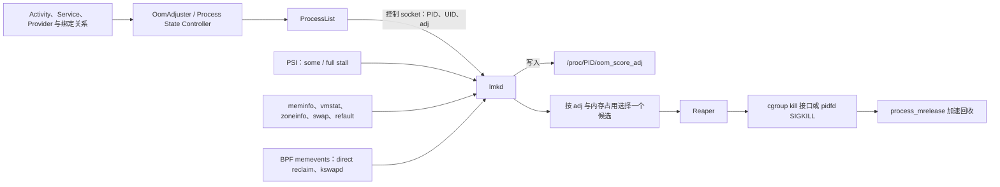

# 4.4 系统内存压力与 lmkd

## 先把低内存终止机制放回 Android 内存体系

Android 会尽量保留离开前台的应用进程。用户再次打开应用时，系统可以复用进程、Java 堆、已加载的类和部分页面缓存，省去一次从 Zygote 通过 `fork()` 复制进程开始的启动。代价是物理内存、压缩交换空间和文件页缓存会逐渐承压。

Linux 内核自带内存不足进程终止机制（OOM Killer），但它通常在内存分配已经难以继续时介入。Android 还需要一层更早、也更了解应用重要性的策略：系统根据 Activity、Service、ContentProvider、绑定关系和近期交互计算进程优先级；低内存终止守护进程（low memory killer daemon，lmkd）结合这个优先级和内核压力数据，先处理对用户影响较小的进程。这套策略常简称低内存终止（LMK）机制。

Android 17 的 LMK 主路径包含三类输入、两段决策和一条回收链。下图用于区分进程重要性计算、压力判断、候选选择和终止后的内存回收：



图中有两个容易混淆的边界：

- `OomAdjuster` 负责回答“这个进程对用户有多重要”，`lmkd` 负责回答“当前压力是否需要终止进程，以及在什么优先级范围内选谁”。
- `lmkd` 会写 `/proc/<pid>/oom_score_adj`，同时在自己的进程表中登记候选。活动管理服务（ActivityManagerService，AMS）与 `lmkd` 之间存在专用控制套接字，不能把这条通信简化成“双方只通过 `/proc` 共享信息”。

平台源码以 `android-17.0.0_r1` 为锚点，内核语义以 `android17-6.18-2026-06_r6` 为锚点。

## 从内核 LMK 到用户空间 lmkd

### 早期方案：内核中的 LowMemoryKiller

早期 Android 使用 `drivers/staging/android/lowmemorykiller.c`。Android Framework 计算若干组最低空闲页阈值 `minfree` 与优先级调整值 `adj`，再写入内核模块参数。内核回收路径发现可用页和文件缓存低于某一档阈值后，遍历进程并选择优先级较低的目标。

这套方案的局限来自它所在的位置：

- 内核收缩器（shrinker）回调不适合承载遍历进程、评估目标和终止进程这类重操作；
- 固定的空闲页阈值很难识别文件页缓存反复回收又读回的抖动（page cache thrashing），也容易把正常文件缓存当成紧迫内存；
- 策略位于内核，设备调校和版本更新成本较高；
- Android 进程语义先被压缩成一个数字，内核侧缺少更多决策信号。

上游 Linux 从 4.12 移除了该驱动。Android 随后把监控和选择逻辑迁到用户空间。

### 现代方案：用户空间 lmkd

Android 8.1 的源码已经包含用户空间 `lmkd` 及 AMS 控制协议。Android 9 起，在未检测到内核 LMK 驱动时启用用户空间路径；Android 10 引入压力停顿信息（Pressure Stall Information，PSI）监控模式；Android 11 的新策略进一步把内存区域水位、交换空间和工作集页面反复回收后再次访问造成的抖动纳入判断。Android 17 延续这条架构。

迁到用户空间以后，`lmkd` 可以：

- 读取 `/proc/meminfo`、`/proc/vmstat`、`/proc/zoneinfo` 和 PSI；
- 接收 AMS 计算出的最新 `oom_score_adj`；
- 根据交换空间、文件页反复读入和回收的状态过滤压力信号；
- 通过属性、资源覆盖和厂商钩子（vendor hook）做设备级调校；
- 输出 logcat 日志、statsd 统计、控制套接字事件和 Perfetto 事件。

“用户空间”不表示它脱离内核。PSI、用于稳定引用进程的文件描述符 pidfd、控制组（cgroup）、加速释放已退出进程内存的 `process_mrelease()`，以及内存统计仍由内核提供；策略代码位于 `lmkd`。

## `oom_score_adj`：候选优先级，不是生命周期枚举

### 取值方向

Linux 的 `oom_score_adj` 范围是 `-1000` 到 `1000`：

- 数值越大，进程越容易成为终止候选；
- 数值越小，保护程度越高；
- `-1000` 对 Linux OOM 选择有特殊保护含义；
- Android Framework 的 `UNKNOWN_ADJ=1001` 是内部未决值，超出可写入内核的范围，不会作为有效 adj 发送。

Android 17 把核心常量集中在 `services/core/java/com/android/server/am/psc/Constants.java`。下表列出源码中的主要边界。

| 常量或区间 | Android 17 数值 | 常见语义 |
|---|---:|---|
| `NATIVE_ADJ` | -1000 | AMS 未管理、未由 AMS 分配 adj 的原生进程所用的特殊分类 |
| `SYSTEM_ADJ` | -900 | `system_server` |
| `PERSISTENT_PROC_ADJ` | -800 | 常驻系统进程 |
| `PERSISTENT_SERVICE_ADJ` | -700 | 被 system 或常驻进程以重要方式绑定的服务 |
| `FOREGROUND_APP_ADJ` | 0 | 顶层/前台关键进程 |
| `PERCEPTIBLE_RECENT_FOREGROUND_APP_ADJ` | 50 | 近期从顶层状态转到前台服务（FGS）的宽限层 |
| `VISIBLE_APP_ADJ` | 100 | 可见进程；特性开关启用时可分层到 199 |
| `PERCEPTIBLE_APP_ADJ` | 200 | 用户可感知组件，例如符合条件的音频播放 |
| `PERCEPTIBLE_MEDIUM_APP_ADJ` | 225 | system 绑定且要求较高保护的服务 |
| `PERCEPTIBLE_LOW_APP_ADJ` | 250 | 低一级的可感知绑定 |
| `BACKUP_APP_ADJ` | 300 | 正在备份 |
| `HEAVY_WEIGHT_APP_ADJ` | 400 | 重量级应用 |
| `SERVICE_ADJ` | 500 | 一般服务进程 |
| `HOME_APP_ADJ` | 600 | 桌面/Home 进程 |
| `PREVIOUS_APP_ADJ` | 700 | 前一个应用；特性开关启用时可分层到 799 |
| `SERVICE_B_ADJ` | 800 | B 级服务进程 |
| `CACHED_APP_MIN_ADJ`～`CACHED_APP_MAX_ADJ` | 900～999 | 缓存进程 |
| `CACHED_APP_LMK_FIRST_ADJ` | 950 | LMK minfree 档优先允许处理的缓存进程边界 |

这张表不能直接当作“每种组件永远对应一个固定值”。`OomAdjuster` 或新版 Oom Adjuster 会按整个依赖图计算 adj：

- 前台客户端绑定后台服务时，服务端可以得到更高保护；
- 前台进程正在使用某个 ContentProvider 时，提供器所在进程也可能获得更高保护；
- 前台服务的类型、近期顶层状态宽限、可见 Activity 层次和系统绑定都会影响结果；
- 缓存进程和前一个应用在特性开关启用后可以使用更细的阶梯值。

因此，排查时要读取目标时刻的 adj，不能只凭“它有一个 Service”推断。

`NATIVE_ADJ` 也不代表所有原生守护进程都天然不会被终止。该常量在 Framework 中描述 AMS 未管理的原生进程；某个守护进程的实际保护还取决于 init 服务配置、它的 `/proc/<pid>/oom_score_adj`，以及它是否登记到 `lmkd`。

## AMS 如何把优先级交给 lmkd

### 控制协议

Android 17 的命令号在 Framework `ProcessList.java` 与 `system/memory/lmkd/include/lmkd.h` 中保持一致：

| 命令 | 值 | 作用 |
|---|---:|---|
| `LMK_TARGET` | 0 | 下发最多 6 组 `minfree/oom_adj` |
| `LMK_PROCPRIO` | 1 | 登记一个进程并设置 adj |
| `LMK_PROCREMOVE` | 2 | 移除一个进程记录 |
| `LMK_PROCPURGE` | 3 | 清理该客户端登记的进程 |
| `LMK_GETKILLCNT` | 4 | 查询终止次数 |
| `LMK_SUBSCRIBE` | 5 | 订阅异步终止或统计事件 |
| `LMK_PROCKILL` | 6 | `lmkd` 发给订阅者的终止通知 |
| `LMK_UPDATE_PROPS` | 7 | 重新读取属性并重建监控 |
| `LMK_KILL_OCCURRED` | 8 | Framework 中的统计事件名；原生层头文件名为 `LMK_STAT_KILL_OCCURRED` |
| `LMK_START_MONITORING` | 9 | 启动延迟初始化的 PSI 监控 |
| `LMK_BOOT_COMPLETED` | 10 | 通知 `lmkd` 完成启动后初始化 |
| `LMK_PROCS_PRIO` | 11 | 批量登记 adj |

单进程 `LMK_PROCPRIO` 包含 6 个 32 位整数：命令、PID、UID、adj、进程类型（process type）、`for_lmkd_only`。默认进程类型是 `PROC_TYPE_APP`。当 `for_lmkd_only=false` 时，`lmkd::apply_proc_prio()` 先把 adj 写到 `/proc/<pid>/oom_score_adj`，再把进程放进对应 adj 链表。

批量命令每个包最多放 3 个进程，每个记录有 PID、UID、adj、process type 和 `for_lmkd_only` 五个字段。Android 17 的 `ProcessList.batchSetOomAdj()` 固定把末尾一个字段写成 0，因此批量路径不支持只更新 `lmkd` 内部值。

每包三条来自控制包最多包含 16 个 `int`：一个命令字加三组、每组五个字段。批量路径减少套接字写入和守护进程收包次数，但它不是一次不可分割的原子事务。`lmkd` 会逐条校验 PID、UID、adj 和字段范围；某条记录失败不代表其他记录自动回滚。`for_lmkd_only` 只决定是否同时写 `/proc/<pid>/oom_score_adj`，不是“只在压力时生效”的延迟更新开关。

连接建立后，`ProcessList.onLmkdConnect()` 会：

1. 发送 `LMK_PROCPURGE`，清掉旧连接留下的登记；
2. 在 OOM 档位已计算时重发 `LMK_TARGET`；
3. 订阅终止与统计两类异步事件。

这条控制链也解释了一个常见误判：手工写 `/proc/<pid>/oom_score_adj` 只改变内核值，未必同步 `lmkd` 自己的候选链表；AMS 下一轮调整还可能覆盖手工值。

### Android 17 的 6 档 `LMK_TARGET`

`ProcessList` 仍保留 6 档 minfree。Android 17 的 adj 数组是：

| 档位 | adj | 低内存设备基线（KB） | 高内存设备基线（KB） |
|---|---:|---:|---:|
| 前台 | 0 | 12,288 | 73,728 |
| 可见 | 100 | 18,432 | 92,160 |
| 用户可感知 | 200 | 24,576 | 110,592 |
| 低一级用户可感知 | 250 | 36,864 | 129,024 |
| 缓存进程起点 | 900 | 43,008 | 147,456 |
| LMK 优先缓存进程边界 | 950 | 49,152 | 184,320 |

最终值还会受 RAM、显示面积、64 位缓存进程档乘数以及资源覆盖项影响。Framework 把 KB 转成页数再发送，因此不能在 16 KB 页设备上把一页写死为 4 KB。

这些数组在 Android 17 仍有两类用途：

- `ro.lmk.use_minfree_levels=true` 时，`lmkd` 使用传统的空闲页和文件缓存阈值；
- Framework 的 `getMemLevel()` 等逻辑仍会读取计算后的内存档位。

看到 `LMK_TARGET` 仍在源码中，不能据此判断默认 PSI 新策略也只看固定的 minfree 阈值。

## Android 17 的 PSI 新策略

### `some` 与 `full` 的精确定义

内核通过 `/proc/pressure/memory` 导出 PSI（Pressure Stall Information，压力停顿信息）：

- `some` 表示至少有一部分任务因该资源而停顿；
- `full` 表示所有非空闲任务同时停顿，此时 CPU 无法继续做有效工作。

这里的对象是调度器管理的任务（task），不是笼统的“设备上所有进程”。`full` 也不统计内核用于填补空转时间的空闲任务（idle task）。

PSI 触发器使用“某个时间窗口内累计停顿多久”的形式。例如 `some 70000 1000000` 表示在 1 秒窗口内，部分任务累计停顿 70 ms 后唤醒监听者。触发器只负责发出检查信号，不代表 `lmkd` 一定会终止进程。

### Android 17 最终注册的阈值

`lmkd.cpp` 静态初始化的三档表是 `some 70 ms / some 100 ms / full 70 ms`。默认的新策略启动时会覆盖这组初值：

- LOW 档设为 0，不注册；
- MEDIUM 使用 `ro.lmk.psi_partial_stall_ms`，普通设备默认 70 ms，低内存（low-RAM）设备默认 200 ms；
- CRITICAL 使用 `ro.lmk.psi_complete_stall_ms`，默认 700 ms；
- 默认窗口是 1000 ms。

所以，阅读源码时要追到 `init_psi_monitors()`。只摘录静态数组会得到错误的运行时阈值。

`use_new_strategy` 的默认值是：

```text
low_ram_device || !use_minfree_levels
```

上面的表达式说明默认选择条件：低内存设备，或未启用传统 `minfree` 模式的设备，会采用新策略。若强制使用旧策略，Android 17 还要求使用第一版内存控制组接口（memcg v1）；`mp_event_common()` 已标记 `[[deprecated("memcg v1 is not supported after Dec. 2026")]]`。这条注解只是源码中的支持期限提示，不能据此推断某个 Android 产品版本的兼容期限。

`LowMemDetector` 和 “LMKD v2” 都不是 `android-17.0.0_r1` 中的正式类名或版本对象。前者至多泛指低内存检测，后者常见于旧资料，用来区分用户空间 `lmkd` 与早期的内核模块。分析当前源码时，应以 `use_new_strategy`、PSI 触发器、内存事件（memevents）和具体函数为准。

Android 17 的 `libpsi` 为 `lmkd` 打开全局 `/proc/pressure/memory`，并不会遍历每个应用的 `memory.pressure`。`ro.config.per_app_memcg`、Reaper 使用 `cgroup.kill`、cgroup v2 支持控制组级 PSI，是三件彼此独立的事；不能据此推断 `lmkd` 会按“哪个应用控制组的 PSI 最高”选择终止目标。

### PSI 唤醒之后还要检查什么

新策略收到 PSI 或轮询事件后，还会读取并比较：

- `/proc/vmstat` 中工作集重新缺页（workingset refault）、直接回收（direct reclaim）和内核交换守护线程 `kswapd` 的统计；
- `/proc/meminfo` 中的空闲页、文件页、交换空间（swap）、匿名页等数据；
- 根据 `/proc/zoneinfo` 计算的内存区域水位（zone watermark）；
- 剩余交换空间与交换空间使用率；
- 文件页 refault 相对于页缓存（page cache）大小的增长比例，也就是下文所说的缓存抖动（thrashing）；
- 上一个终止动作是否结束，以及动作完成后水位是否恢复。

Android 17 还会在系统启动完成后尝试注册 BPF 内存事件。BPF 在这里指由内核执行并向用户空间上报事件的小程序机制：

- 直接回收开始和结束；
- `kswapd` 唤醒和休眠；
- 可选的设备厂商 LMK 终止事件；
- 可选的内存区域信息更新事件。

若内存事件监听器不可用，`lmkd` 会改用两次 `vmstat` 读数之差来识别直接回收和 `kswapd` 活动。BPF 事件能提供更及时的状态变化，但事件本身同样不会直接终止进程。

### 决策原因与候选门槛

Android 17 新策略的主要终止原因包括：

- 严重（CRITICAL）PSI 下设备长时间无响应；
- 剩余交换空间较少，同时出现页缓存抖动；
- 内存水位和剩余交换空间同时偏低；
- 内存水位偏低且交换空间使用率过高；
- 低水位伴随缓存抖动；
- 直接回收期间出现缓存抖动，或直接回收持续过久；
- 缓存抖动后文件缓存仍然偏低；
- 终止进程后仍低于最小水位；
- 普通低水位；
- 设备厂商内存事件提供的原因。

普通低水位分支使用 `ro.lmk.lowmem_min_oom_score`。Android 17 默认是 `PREVIOUS_APP_ADJ + 1`，即 701，并且源码把它限制为不低于 `PERCEPTIBLE_APP_ADJ + 1`，即 201。

“701 等于从缓存进程开始终止”并不准确。启用上一应用优先级阶梯（previous ladder）时，701～799 可能包含上一个应用的进程；800 是 B 类服务；900 以上才是缓存进程。关闭该阶梯时，701～799 可能没有对应进程，但门槛仍是 701。发生严重停顿时，门槛可以降到 0，连前台层的进程也会进入候选范围。

`__mp_event_psi()` 按固定顺序检查设备厂商事件、终止后仍处于低水位、严重 PSI、交换空间不足、缓存抖动、直接回收与普通低水位。前面的分支命中后会确定本轮原因，后续条件不会覆盖它。诊断日志中的原因既说明触发了哪类条件，也反映源码的判断顺序。

缓存抖动比例来自 `workingset_refault_file` 相对于窗口起点活跃、非活跃文件页总量的增长率，表示文件页工作集被回收后又反复读回。它不是匿名页换入率、ZRAM 压缩率，也不是 PSI `full`。成功终止进程后，部分原因会按 `thrashing_limit_decay` 降低下一轮动态阈值；没有合适目标时，历史 refault 计数会经过衰减并保留到下一个窗口。

还要区分三个名称相近的配置：`thrashing_limit_critical` 可取消对用户可感知进程的额外保护；`stall_limit_critical` 比较内存 PSI 的 `full avg10`；`direct_reclaim_threshold_ms` 只在内存事件能够提供直接回收起止时间时判断回收是否卡住。三者并不是一个所谓的“严重缓存抖动”条件。

### 候选选择

`find_and_kill_process()` 从 `oom_score_adj=1000` 开始，逐档向门槛递减：

1. 先检查数值更大的 adj 档，也就是保护程度较低的进程；
2. 默认从该档链表尾部取候选；
3. `ro.lmk.kill_heaviest_task=true` 时，在该 adj 档选择占用内存最多的目标；
4. 当门槛已经降到 `PERCEPTIBLE_APP_ADJ` 或更低时，源码会强制选择该档中占用内存最多的进程，尽量减少被终止的高价值进程数量；
5. 一次函数调用成功处理一个目标后返回。

“一次调用只选一个”不等于一个压力周期只会终止一个进程。PSI 事件后，`lmkd` 会进入间隔为 10 ms 或 100 ms 的轮询；等待目标退出时暂停轮询，收到 pidfd 退出通知或等待超时后再恢复。pidfd 是内核提供的进程文件描述符，可避免只凭 PID 观察进程时遇到编号复用问题。若水位仍未恢复，下一轮可以继续选择目标。

## 终止进程后：Reaper 怎样让内存尽快可用

Reaper 是 `lmkd` 中负责异步终止进程并催促内核回收内存的执行器。`kill_one_process()` 在发出终止信号前会做几项防护和记账：

- 再读 `/proc/<pid>/status`，检查进程是否仍存在；
- 校验线程组 ID（TGID），降低 PID 被复用后终止错误进程的风险；
- 读取常驻内存集（RSS）、匿名页 RSS 和交换空间占用；
- 读取可用的 DMA-BUF PSS/RSS，用于估算图形等共享缓冲区的占用；
- 调用设备厂商提供的释放内存钩子；若其他组件已经释放足够内存，便跳过本次终止；
- 建立 pidfd 或基于 PID 的退出等待。

随后，`reaper.kill(..., false)` 尝试把任务交给异步 Reaper：

1. 优先写控制组（cgroup）的终止接口；较旧的兼容路径会遍历 `cgroup.procs`；
2. 没有合适的控制组时，改用 `pidfd_send_signal(SIGKILL)` 发送不可捕获的强制终止信号；
3. Reaper 线程调用 `process_mrelease(pidfd, 0)`，在进程退出清理完全结束前，促使内核提前回收其匿名页和页表。

Reaper 线程会进入前台 CPU 集合（`cpuset`）并提高自身优先级；它还会为目标进程组设置专用的回收任务配置（reap task profile）。这些行为来自 AOSP 的 `reaper.cpp`，不依赖某个芯片厂商的私有补丁。

终止信号发出后，内存不会立刻全部回到可用池。目标包含大量匿名页、交换页或 DMA-BUF 时，更应观察这段回收延迟。

### Android 17 的可观测输出

当前 `lmkd.cpp` 每次成功提交终止动作都会执行：

```cpp
ATRACE_INSTANT_FOR_TRACK(LOG_TAG, desc);
```

这行代码用于说明事件类型。`LOG_TAG` 是 `lowmemorykiller`，`desc` 依次编码 PID、终止原因、目标 adj、最低候选 adj 和最大缓存抖动比例。它是瞬时事件（instant event），只有一个时间点；并非带开始、结束时间的持续区间（duration slice）。源码中也没有旧文章常提到的 `LMKD_TRACE_KILLS` 编译开关。

同一条路径还会：

- 写入 logcat，包含进程名、PID、UID、adj、RSS、匿名页 RSS、交换空间、DMA-BUF 与原因；
- 写入 statsd 的 LMK 终止统计事件（atom）；
- 向已订阅的 Framework 客户端发送终止与统计消息。

`ProcessList` 收到 `LMK_PROCKILL` 后，把记录交给 `AppExitInfoTracker`，应用退出历史会标记为 `ApplicationExitInfo.REASON_LOW_MEMORY`。

### 主事件处理超时时的看门狗

`lmkd` 为事件处理函数设置了 2 秒看门狗（watchdog）。超时后，独立线程会从 `oom_score_adj=1000` 向 0 搜索有效候选，通过 Reaper 同步终止一个进程并记录 `killinfo`。这条紧急路径不会重新执行完整的 PSI、水位和原因判断；日志中的 `lmkd watchdog timed out!` 应与常规内存压力终止事件分开统计。

## LMK、Linux OOM、进程内 OOM 与 MemoryLimiter

这四类故障都可能表现为“进程消失”或“内存不足”，证据来源不同：

| 机制 | 触发范围 | Android 17 的主要证据 |
|---|---|---|
| 用户空间 `lmkd` | 系统整体压力，按 adj 选择终止目标 | `lowmemorykiller` 日志、Perfetto `mem.lmk`、`REASON_LOW_MEMORY` |
| Linux OOM Killer | 内核无法满足内存分配，由内核选择目标 | 内核日志；Framework 的 `OomConnection` 记录 `REASON_LOW_MEMORY` + `SUBREASON_OOM_KILL` |
| Java/原生进程内 OOM | 单进程堆或地址空间分配失败 | `OutOfMemoryError`、异常终止记录（abort/tombstone）、崩溃退出原因 |
| Android 17 MemoryLimiter | 单应用进程超过设备配置的配额 | `REASON_OTHER`，description 含 `MemoryLimiter:AnonSwap` |

看到 `REASON_LOW_MEMORY` 后，还要结合子原因（subreason）、`lmkd` 日志和性能轨迹（trace），区分系统 LMK 与内核 OOM。Java `OutOfMemoryError` 也不能直接归因于 `lmkd`。

## LMK 如何变成用户可感知卡顿

LMK 的目标是缩短内存压力持续时间。用户体验问题通常出现在终止进程之后：

1. 系统持续处于低水位或缓存抖动状态；
2. `lmkd` 反复处理缓存进程、B 类服务或上一个应用进程；
3. 用户返回已被终止的应用；
4. 系统重新派生（fork）进程、绑定 `Application`、创建组件并恢复界面状态；
5. 新进程重新加载代码、资源、数据库页和网络数据，又推高内存与 IO 压力。

第 3 步没有发生时，终止进程不会自动产生一次冷启动。只有用户或系统再次需要该进程，才会付出重建成本。界面状态可以恢复，也不代表它仍由原进程承载。

排查时建议同时看四组指标：

- 单位时间内的 LMK 次数，以及目标进程的 adj 分布；
- 目标进程的 RSS、匿名页 RSS、交换空间和 DMA-BUF；
- 终止前的 PSI、内存水位、交换空间与 refault；
- 目标进程再次启动后的启动耗时、主线程、缺页和 I/O。

如果大量目标都在 900～999，系统大体还在以缓存命中率换取可用内存；若频繁降到 800、700 甚至 200 以下，后台工作、最近任务和用户可感知组件已经受到影响。

## 用 Perfetto、logcat 与退出历史定位

### Perfetto

以下配置同时采集用户空间 LMK、adj 变化和系统内存计数。只有分析仍使用旧内核 LMK 的设备时，才需要添加对应事件。

```protobuf
buffers {
  size_kb: 65536
  fill_policy: RING_BUFFER
}

data_sources {
  config {
    name: "linux.ftrace"
    ftrace_config {
      atrace_apps: "lmkd"
      ftrace_events: "oom/oom_score_adj_update"
      # 历史 in-kernel LMK 设备再启用：
      # ftrace_events: "lowmemorykiller/lowmemory_kill"
    }
  }
}

data_sources {
  config {
    name: "linux.sys_stats"
    sys_stats_config {
      meminfo_period_ms: 100
      vmstat_period_ms: 100
    }
  }
}

duration_ms: 30000
```

`atrace_apps: "lmkd"` 让用户空间 LMK 事件进入性能轨迹，`oom_score_adj_update` 用来还原目标进程当时的保护级别，`linux.sys_stats` 用来对齐内存水位和回收变化。量产设备允许采集的 ftrace 事件与频率可能受构建配置限制。

Android 17 对应的 Perfetto SQL 标准库会解析当前的瞬时事件、旧版持续区间和更早的计数器三种 LMK 记录。下面的 SQL 使用统一后的 `android_lmk_events` 表列出被终止的进程：

```sql
INCLUDE PERFETTO MODULE android.memory.lmk;

SELECT
  ts,
  process_name,
  pid,
  oom_score_adj,
  kill_reason
FROM android_lmk_events
ORDER BY ts;
```

查询结果给出事件时刻、被终止的进程、adj 和终止原因。Trace Processor 内部也会生成兼容旧查询的 `mem.lmk` 瞬时事件；新分析脚本宜优先使用标准库表，以便直接取得 Android 17 事件携带的原因和 adj。取得结果后，还应回到同一时间窗口检查内存计数、回收活动，以及稍后是否出现该包的新进程。

### 设备侧命令

下面的命令用于快速交叉验证，不依赖单一日志来源：

```bash
adb shell cat /proc/<pid>/oom_score_adj
adb shell dumpsys meminfo
adb shell dumpsys activity exit-info <package-name>
adb shell getprop | grep -E 'ro\\.lmk|sys\\.lmk'
adb logcat -b all -s lowmemorykiller ActivityManager MemoryLimiter
```

`/proc/<pid>/oom_score_adj` 只能观察存活进程的当前值；退出历史和 logcat 用于查找已经退出的目标；Perfetto 用于还原事件先后。三类证据的时间必须对齐。

### 判断因果的四步

1. 先确认进程退出时间与退出类型；
2. 再看终止前是否存在 PSI、低水位、交换空间不足或缓存抖动；
3. 核对目标进程当时的 adj 和内存构成；
4. 最终确认用户返回后是否产生新进程与启动代价。

仅看到 `lmkd` 出现在性能轨迹中，无法证明它导致了卡顿。一次 `dumpsys meminfo` 快照也无法解释数十秒前发生的进程终止。

## `onTrimMemory()` 与缓存应用冻结器的边界

### 应用仍应处理的两档回调

从 API 34 起，应用不再收到 `TRIM_MEMORY_RUNNING_MODERATE(5)`、`RUNNING_LOW(10)`、`RUNNING_CRITICAL(15)`、`MODERATE(60)` 和 `COMPLETE(80)`。这些常量随后被标记为弃用。现代应用应集中处理：

- `TRIM_MEMORY_UI_HIDDEN(20)`：UI 离开可见区域，适合释放只服务于可见界面的资源；
- `TRIM_MEMORY_BACKGROUND(40)`：进程进入可终止的后台范围，适合释放可快速重建的缓存。

下面的例子展示如何按区间处理两档回调。清理函数应快速并保持幂等，也就是重复调用不会产生额外副作用；还要避免在主线程执行大规模磁盘写入。

```kotlin
class App : Application() {
    override fun onTrimMemory(level: Int) {
        super.onTrimMemory(level)

        when {
            level >= ComponentCallbacks2.TRIM_MEMORY_BACKGROUND -> {
                imageCache.trimToBackground()
                decodedAssetCache.clearRebuildableEntries()
            }
            level >= ComponentCallbacks2.TRIM_MEMORY_UI_HIDDEN -> {
                uiOnlyCache.clear()
            }
        }
    }
}
```

使用 `>=` 可以兼容未来插入的中间值。具体缓存库还要遵循线程约束；回调中释放仍在绘制或播放的对象可能引入崩溃和抖动。

Android 17 的 `ActivityThread.scheduleTrimMemory()` 把回调投递到主线程的 `Choreographer.CALLBACK_COMMIT` 阶段，也就是一帧绘制提交之后，以降低画面卡顿风险；无法取得 `Choreographer` 时，改由主线程 `Handler` 投递。特性开关 `skipBgMemTrimOnFgApp` 启用后，重要前台进程会跳过 `BACKGROUND` 或更高等级的内存整理回调。

### Freezer 与 `lmkd` 是两条独立路径

缓存应用冻结器（cached app freezer）由 `OomAdjuster`/`CachedAppOptimizer` 根据缓存状态安排。`CachedAppOptimizer.freezeAppAsyncInternalLSP()` 在目标 adj 至少为 900 时，先通过 Binder 请求 `TRIM_MEMORY_BACKGROUND`，再向负责冻结的 `Handler` 投递消息。

Binder 请求先发出，并不表示应用已经完成清理。回调在应用主线程异步执行，冻结也由另一条 `Handler` 路径安排，因此应用不能把这次通知当作保证清理完成的“截止期限”。

冻结后的进程仍然存在，也不会释放全部进程内存。回到前台时，系统会解冻（thaw）原进程；常见代价包括内存页重新进入活跃状态、缓存重建和待处理任务恢复。这与 LMK 后由 Zygote 创建新进程的冷启动不同。Freezer 本身也不会产生 `ApplicationExitInfo` 进程退出记录。

`lmkd` 不会通过 AMS 发出“请冻结这个终止目标”的命令。把路径画成 `lmkd → CachedAppOptimizer → freeze`，会混淆两个彼此独立的子系统。

## Android 17 MemoryLimiter：单进程配额

Android 17 增加了 MemoryLimiter，用于限制单个应用进程的异常内存占用。它与 `lmkd` 的系统级压力策略并行工作，而且只在部分设备上启用。

### 启用与配置

默认实例同时满足以下条件才启用：

- Framework 特性开关 `memoryLimiterEnable()` 已打开；
- 服务运行在系统 UID（system UID）下；
- `/vendor/etc/memory-limiter-config.xml` 存在；
- XML 中有一组 `minimumRequiredMemTotal` 不高于当前 `/proc/meminfo` 的 `MemTotal`。

这些条件决定是否创建已启用的控制器。原生层是否主动监控由 `memoryLimiterTrigger()` 控制，是否配置交换空间上限由 `memoryLimiterSwap()` 控制；`memory_limiter_disable_limits` 和 `memory_limiter_disable_kill` 还可以在运行时分别停用配额限制与进程终止。

源码会在符合设备总内存条件的配置中，选择 `minimumRequiredMemTotal` 最大的一组。可见与不可见进程的内存、交换空间数值来自设备厂商 XML。`4 GB / 2 GB` 等 `sDefaultConfig` 只供测试；注释明确要求生产使用前另行评估，不能将其视为 Android 17 的通用默认值。

### 进程状态映射

MemoryLimiter 按 `ActivityManager` 的进程状态（proc state）应用配置：

- 持久进程与持久 UI 进程：取消限制；
- 顶层、绑定顶层、重要前台、顶层休眠：使用可见进程配置；
- 前台服务（FGS）、绑定前台服务、重要后台、临时后台、备份、服务、广播接收器、桌面、上一 Activity、重量级进程：使用不可见进程配置；
- 缓存进程：本次不改 `memory.high`，交换空间上限设为禁用；
- 未知与不存在的进程：忽略。

因此，前台服务仍属于不可见进程配额组。若把 MemoryLimiter 概括成“只限制普通后台 Service”，就会漏掉前台服务、广播接收器、备份和桌面等状态。

### cgroup 文件与超限处理

原生实现使用进程所属 cgroup v2 中的以下文件：

- `memory.high`；
- `memory.swap.max`；
- `memory.events`；
- `memory.stat` 与 `memory.swap.current`。

Java 层的部分注释和展示字符串仍写作 `memory.swap.high`，但 Android 17 原生源码中的 `CgroupFile::kSwapMax` 明确解析到 `memory.swap.max`。描述实际运行行为时，应以最终写入的路径为准。

原生层写入 `memory.high` 和交换空间上限，并监听 `memory.events` 中的 `high` 计数。`memory.high` 触发后，监控线程开始轮询，比较 `anon + shmem + swap` 与两项配置之和；三项分别表示匿名页、共享内存和交换空间占用。组合指标超过配置后，Java 回调会先取消该进程的限制。若相关性能剖析（profiling）特性已开启且能解析包名，系统会发送 `TRIGGER_TYPE_ANOMALY`，随后等待 30 秒，再请求 AMS 以 `"MemoryLimiter:AnonSwap"` 为原因终止进程。

这 30 秒用于给已配置的性能剖析流程留出时间，但不保证每次都能生成堆转储（heap dump）。Android 17 官方文档给出的应用侧识别方式是：

- `ApplicationExitInfo.getReason()` 为 `REASON_OTHER`；
- `getDescription()` 包含 `"MemoryLimiter:AnonSwap"`。

设备支持时，可用以下命令检查和测试配额：

```bash
adb shell am memory-limiter status
adb shell am memory-limiter ignore <uid>
adb shell am memory-limiter ignore none
adb shell am memory-limiter manual <pid> 30
adb shell am memory-limiter manual <pid> none
```

这些命令在未启用 MemoryLimiter 的设备上不会生效。`manual` 后的数字单位是 MB；`max` 表示移除限制，`none` 表示恢复系统默认配置。

## 设备厂商调校应怎样表述

AOSP 公开了多种设备调校入口，例如：

- `ro.config.low_ram`；
- `ro.lmk.psi_partial_stall_ms` 与 `ro.lmk.psi_complete_stall_ms`；
- `ro.lmk.thrashing_limit`、衰减、交换空间和文件缓存参数；
- `ro.lmk.lowmem_min_oom_score` 与 `ro.lmk.kill_heaviest_task`；
- 传统模式的 `ro.lmk.use_minfree_levels`；
- 设备厂商的释放内存钩子与 LMK 内存事件；
- Framework 资源覆盖配置和 MemoryLimiter 设备厂商 XML。

具体厂商可以加入白名单、按场景调整的水位或私有终止原因。没有对应系统镜像、版本和源码或性能轨迹证据时，不应断言“某品牌总会为相机启动预留固定容量”或“固定终止到 adj 200”。这些数值会随内存档位、相机处理管线和产品配置变化。

## Android 15～17 的版本边界

### Android 15：16 KB 页大小

16 KB 页大小会改变页表、内部碎片和进程内存构成，也会改变 KB 与页数之间的换算。它不会直接改变 `lmkd` 的优先级原则。`ProcessList` 发送 `LMK_TARGET` 时，会按运行时的 `PAGE_SIZE` 把 KB 换算成页；分析脚本也应读取设备的实际页大小。

### Android 16：用户空间 `lmkd` 与 Reaper

Android 16 已经具备 PSI 与缓存抖动决策、pidfd、Reaper 和 `process_mrelease()` 主路径。`sys.lmk.minfree_levels`、`sys.lmk.reportkills` 等属性出现得更早，不能算作 Android 16 独有特性。

### Android 17 源码边界

Android 17 源码中值得单独记住的边界包括：

- OOM adj 常量集中到 Process State Controller 的 `psc/Constants.java`；
- `ProcessList` 的 6 档目标使用 0、100、200、250、900、950；
- `LMK_PROCS_PRIO` 支持每包最多 3 个进程的批量 adj 更新；
- 默认 PSI 新策略覆盖静态三档阈值，LOW 监控关闭；
- 系统启动完成后尝试接入 BPF 内存事件；
- Reaper 输出不受 `LMKD_TRACE_KILLS` 条件限制的 ATrace 瞬时事件；
- MemoryLimiter 作为部分设备启用的单进程配额机制加入 Framework。

## 小结

理解 Android 17 LMK，可以抓住四条线：

1. AMS/Process State Controller 把组件状态和依赖关系计算成动态 `oom_score_adj`；
2. `ProcessList` 经控制套接字把进程信息交给 `lmkd`，`lmkd` 更新 `/proc` 并维护候选表；
3. PSI 负责唤醒监听者，内存水位、交换空间、缓存抖动和回收状态共同决定是否终止进程，以及候选门槛降到哪里；
4. Reaper 负责终止目标并加速页回收，Framework、statsd、logcat 与 Perfetto 记录结果。

性能分析也应沿这四条路径收集证据。只看空闲内存、只看目标进程的生命周期标签，或把冻结器、MemoryLimiter 和 `lmkd` 混为一个机制，都会得到不完整的结论。

## 源码与官方资料

### Android 17 / API 37

- [`ProcessList.java`](https://android.googlesource.com/platform/frameworks/base/+/android-17.0.0_r1/services/core/java/com/android/server/am/ProcessList.java)
- [`psc/Constants.java`](https://android.googlesource.com/platform/frameworks/base/+/android-17.0.0_r1/services/core/java/com/android/server/am/psc/Constants.java)
- [`MemoryLimiter.java`](https://android.googlesource.com/platform/frameworks/base/+/android-17.0.0_r1/services/core/java/com/android/server/am/MemoryLimiter.java)
- [`com_android_server_am_MemoryLimiter.cpp`](https://android.googlesource.com/platform/frameworks/base/+/android-17.0.0_r1/services/core/jni/com_android_server_am_MemoryLimiter.cpp)
- [`CachedAppOptimizer.java`](https://android.googlesource.com/platform/frameworks/base/+/android-17.0.0_r1/services/core/java/com/android/server/am/CachedAppOptimizer.java)
- [`ActivityThread.java`](https://android.googlesource.com/platform/frameworks/base/+/android-17.0.0_r1/core/java/android/app/ActivityThread.java)
- [`lmkd.cpp`](https://android.googlesource.com/platform/system/memory/lmkd/+/android-17.0.0_r1/lmkd.cpp)
- [`include/lmkd.h`](https://android.googlesource.com/platform/system/memory/lmkd/+/android-17.0.0_r1/include/lmkd.h)
- [`reaper.cpp`](https://android.googlesource.com/platform/system/memory/lmkd/+/android-17.0.0_r1/reaper.cpp)

### Kernel `android17-6.18-2026-06_r6`

- [PSI documentation](https://android.googlesource.com/kernel/common/+/refs/tags/android17-6.18-2026-06_r6/Documentation/accounting/psi.rst)
- [cgroup v2 memory controller](https://android.googlesource.com/kernel/common/+/refs/tags/android17-6.18-2026-06_r6/Documentation/admin-guide/cgroup-v2.rst)

### 官方说明与工具

- [AOSP Low memory killer daemon](https://source.android.com/docs/core/perf/lmkd)
- [Android 17 behavior changes: App memory limits](https://developer.android.com/about/versions/17/behavior-changes-all#app-memory-limits)
- [Manage your app's memory](https://developer.android.com/topic/performance/memory)
- [Perfetto memory counters and LMK events](https://perfetto.dev/docs/data-sources/memory-counters)
