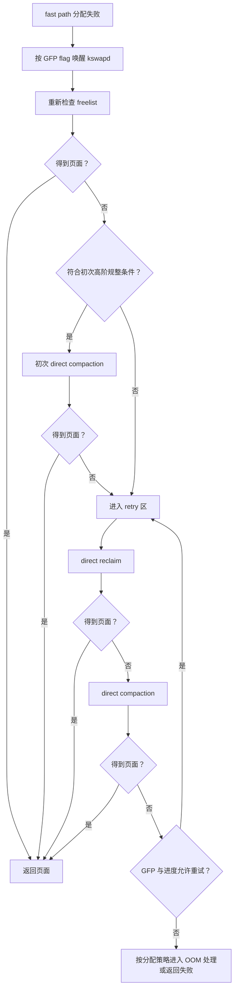

# 内存规整与直接回收性能边界

一次应用卡顿可能同时伴随内核回收线程 `kswapd` 活跃、内存 PSI 上升、ZRAM 写入和 `lmkd` 终止进程。它们在时间上相邻，不代表由同一段代码执行，也不代表处理的是同一个问题。

版本边界固定在 Android 17 和对应官方文档：

- Android Common Kernel `android17-6.18-2026-06_r6`，提交 `bcbd6575c301ef871ea15e7ac0fc83909e17ef56`；
- AOSP `android-17.0.0_r1` 的 `lmkd`、`libpsi`、`CachedAppOptimizer.java` 和 JNI 实现；
- Android Source 的 `lmkd`、`mmd` 文档，以及 Android Developers 的应用内存文档。

Linux 物理页规整、页面回收、ZRAM 压缩、Android 缓存应用回收（cached app compaction）是四种不同操作。诊断时要先确认事件属于哪一层，再讨论性能影响。

## 1. 四个容易混淆的机制

| 机制 | 解决的问题 | 核心动作 | 典型执行者 |
|---|---|---|---|
| Linux 物理页规整 | 空闲页总量可能够，但缺少指定阶数（order）的连续物理页 | 迁移可移动页，形成更大的伙伴系统空闲块 | 分配线程或 `kcompactd` |
| 页面回收 | 可分配页数量不足 | 丢弃文件页、回写脏页、换出匿名页 | 分配线程、`kswapd` 等 |
| ZRAM 压缩 | 匿名页换出后需要保存内容 | 压缩页面并存入位于 RAM 的块设备 | 交换空间/ZRAM 路径 |
| Android 缓存应用回收 | 降低缓存进程的驻留内存 | 对目标进程执行 `MADV_COLD`、`MADV_PAGEOUT` 或内存控制组回收 | `CachedAppOptimizer` |

### 1.1 Linux 物理页规整不会释放业务对象

物理页规整把已占用且可迁移的页搬到别处，再让分散的空闲页按伙伴系统规则合并为连续块。迁移前后，进程看到的虚拟地址与数据内容保持不变。规整会消耗 CPU、内存带宽并更新页表等映射状态，但它的主要目标不是减少进程常驻内存集（RSS）。

### 1.2 页面回收关注“有多少页可用”

页面回收优先处理能够丢弃或写回的页。干净文件页可以丢弃，后续访问时再从文件读取；匿名脏页没有文件作为后备存储，不能直接丢弃，启用交换空间（swap）时可以换出到 ZRAM 或其他后端。

回收得到多个 order-0 页后，高阶分配仍可能失败，因为这些页的物理位置未必连续。分配器随后可能再尝试物理页规整。

### 1.3 ZRAM 保存换出的匿名内容

ZRAM 把换出页压缩后保存在 RAM 中。它通过较少的压缩数据占用替代原始页占用，代价是压缩、解压 CPU 时间和内存带宽。

ZRAM 不会把伙伴系统里的离散空闲页自动排列成高阶块。它为匿名页换出提供存放位置；释放出的基础页能否形成连续块，还取决于物理位置、迁移类型和后续规整。

### 1.4 Android 的“应用规整”是进程页面回收

Android 17 的 `CachedAppOptimizer` 也使用 compaction 这个名称。其 JNI 实现在 `com_android_server_am_CachedAppOptimizer.cpp` 中：

- 私有文件映射使用 `MADV_COLD`；
- 匿名私有映射使用 `MADV_PAGEOUT`；
- 部分配置可以通过控制组（cgroup）的 `memory.reclaim` 执行进程级回收。

这套机制针对缓存进程的 RSS，与 `mm/compaction.c` 中的伙伴系统物理页规整同名而含义不同。在 Perfetto 中看到 `Compaction` 轨道时，要先确认它来自 Framework 的 ATrace，还是 `compaction/mm_compaction_*` 内核跟踪点（tracepoint）。

## 2. order 描述连续物理页数量

伙伴系统分配器（buddy allocator）用 order 表示连续基础页数量的指数：

```text
连续页数 = 2^order
连续字节数 = 2^order × PAGE_SIZE
```

order-0 是一个基础页，order-1 是两个相邻基础页。高阶分配还要同时满足以下约束：

- 页数达到要求；
- 物理地址连续；
- 内存区域（zone）、非统一内存访问策略（NUMA policy）、CPU 集合和内存水位允许；
- 页面迁移类型（migratetype）与分配标志能够满足；
- 页面没有被无法迁移的使用方式长期占住。

大块 `malloc()` 或 Java 大对象申请的是连续虚拟地址，不等于直接申请同样大小的连续物理页。应用可能在发生缺页时逐个获得 order-0 页。高阶物理页需求更多见于内核对象、透明大页（THP）或大型 folio、连续内存分配器（CMA）以及特定驱动路径。图形和多媒体缓冲区是否要求物理连续，还取决于 IOMMU 是否支持地址重映射、使用的 DMA 堆和驱动实现。

举例说明 order 与页大小的数学关系：

| 目标 | 4 KiB 基础页 | 16 KiB 基础页 |
|---|---:|---:|
| order-3 覆盖字节数 | 32 KiB | 128 KiB |
| 2 MiB 连续区域所需 order | order-9 | order-7 |

这个表只换算页数，不表示设备一定使用 2 MiB THP，也不表示某次 2 MiB 虚拟内存申请会进入对应 order 的伙伴系统分配。

## 3. 规整如何形成连续空闲区

规整从两个方向扫描内存区域：

- 迁移扫描器寻找可以搬走的已占用页；
- 空闲页扫描器寻找可作为迁移目标的空闲页。

页迁移成功后，低地址或目标区域中的占用页被移走，分散空闲页便有机会按伙伴系统规则合并。长期固定（pinned）、无法迁移的页，不可移动内核分配和受约束的页块都会降低成功率。

### 3.1 迁移类型降低长期碎片

页块会按用途区分 `MIGRATE_MOVABLE`、`MIGRATE_RECLAIMABLE`、`MIGRATE_UNMOVABLE`、`MIGRATE_CMA` 等迁移类型。这样分组可以减少可移动页与不可移动页交错，降低长期外部碎片。

紧急情况下，分配器仍可能退而使用其他迁移类型的空闲块。随着设备运行时间增长、这种回退增多，一个页块（pageblock）中可能混入迁移能力不同的页面，后续高阶规整就更难成功。

### 3.2 CMA 也可能需要迁移，但入口不同

CMA 为连续内存分配保留适合迁移的区域。CMA 分配或 `alloc_contig_range()` 可以触发页面隔离和迁移；它不等同于普通伙伴系统高阶分配中的直接规整分支。

分析相机、显示或编解码问题时，应同时确认：

- 使用的是哪种 DMA heap 或分配器；
- IOMMU 是否允许把分散物理页组织成设备可访问的散布-聚集（scatter-gather）列表；
- 内核日志是否来自 CMA；
- `/proc/meminfo` 是否提供 `CmaTotal`、`CmaFree`；
- 性能轨迹中运行的是目标线程、`kcompactd`，还是驱动自己的回收线程。

## 4. Android 17 分配慢路径的真实顺序

现象层面常把慢路径概括成“先回收，再规整”。Android 17 的 `__alloc_pages_slowpath()` 还有一个关键分支：部分高阶分配会在直接回收（direct reclaim）之前，先尝试直接规整（direct compaction）。两者都在当前请求分配的线程中同步执行。

### 4.1 第一次规整发生在什么条件下

进入慢路径后，内核先按分配标志唤醒 `kswapd`，更新标志并再次检查空闲链表（freelist）。仍失败时，满足下列条件的请求会先规整：

- 调用方允许直接回收；
- GFP 分配标志允许规整；
- 请求属于内核认定成本较高的阶数（costly order），或者是非 `MIGRATE_MOVABLE` 的高阶分配；
- 请求不处于允许绕过内存水位的特殊上下文。

这次初始尝试使用 `INIT_COMPACT_PRIORITY`。某些带 `__GFP_NORETRY` 的高成本分配在规整被跳过或延后后会直接失败，以避免继续进行代价很高、成功率又不确定的回收。

### 4.2 常规重试先回收，再规整

如果初始尝试没有返回页面，慢路径进入重试区：

1. 再查空闲链表；
2. 检查调用方是否允许直接回收；
3. 执行 `__alloc_pages_direct_reclaim()`；
4. 回收后再次分配；
5. 仍失败则执行 `__alloc_pages_direct_compact()`；
6. 根据 GFP 重试策略、回收进度、规整结果和优先级，决定重试、进入内核 OOM 处理或返回失败。

下面的图只保留和性能诊断相关的控制流：



`lmkd` 没有出现在图中，因为它是独立的用户空间守护进程。内核慢路径可以进入内核 OOM Killer；`lmkd` 则根据另一组压力证据异步选择要终止的 Android 进程。

### 4.3 order-0 不走直接规整

Android 17 的入口先检查：

```c
// kernel/common, android17-6.18-2026-06_r6
static struct page *
__alloc_pages_direct_compact(gfp_t gfp_mask, unsigned int order, ...)
{
    if (!order)
        return NULL;

    psi_memstall_enter(&pflags);
    delayacct_compact_start();
    *compact_result = try_to_compact_pages(...);
    psi_memstall_leave(&pflags);
    delayacct_compact_end();
    ...
}
```

所以 order-0 缺页可以触发直接回收，却不会通过这个入口执行直接规整。应用主线程因普通缺页卡住时，直接回收通常更值得先检查；只有看到 order、GFP 和规整性能轨迹证据后，才应归因到物理页规整。

### 4.4 直接回收和直接规整都计入 PSI

`__alloc_pages_direct_reclaim()` 与 `__alloc_pages_direct_compact()` 都调用 `psi_memstall_enter()` / `psi_memstall_leave()`。这表示分配线程在两类同步处理中的停顿时间，都会计入内存压力停顿信息（memory PSI）。

PSI 只能说明任务因内存资源短缺而停顿：

- `some` 表示至少有部分非空闲任务因该资源停顿；
- `full` 表示所有非空闲任务同时停顿。

PSI 本身不区分页面回收、物理页规整、交换空间 I/O 或其他内存压力原因。还要结合内核跟踪点、线程调用栈和 `vmstat` 继续分类。

## 5. 外部碎片指数的适用范围

`/sys/kernel/debug/extfrag/extfrag_index` 按内存节点（node）、内存区域和 order 展示外部碎片指数（external fragmentation index）。内核文档给出的读法是：

- `-1`：只要满足 watermark，分配可以成功；
- 趋近 `0`：失败更偏向可用内存不足；
- 趋近 `1000`：失败更偏向外部碎片。

在 `android17-6.18-2026-06_r6` 的 `compaction_suitable()` 中，内存水位检查先决定该区域是否具备迁移所需的空闲页。只有 `order > PAGE_ALLOC_COSTLY_ORDER` 时，代码才进一步使用外部碎片指数和 `vm.extfrag_threshold`，跳过预期收益偏低的规整：

```c
if (suitable) {
    compact_result = COMPACT_CONTINUE;
    if (order > PAGE_ALLOC_COSTLY_ORDER) {
        int fragindex = fragmentation_index(zone, order);

        if (fragindex >= 0 &&
            fragindex <= sysctl_extfrag_threshold) {
            suitable = false;
            compact_result = COMPACT_NOT_SUITABLE_ZONE;
        }
    }
}
```

当前内核源码标签的 sysctl 文档写明 `extfrag_threshold` 默认值为 500；设备的实际值仍应现场读取。该阈值参与高成本阶数的规整适用性判断，即使超过阈值也不保证规整成功。

读取 `extfrag_index` 需要 `CONFIG_DEBUG_FS`、`CONFIG_COMPACTION` 和相应权限，量产设备通常无法直接访问。缺少该指标时，可以用伙伴系统空闲块分布、迁移类型、规整结果和分配 order 建立间接证据，不能仅凭 `MemAvailable` 宣布存在物理碎片。

## 6. `kswapd`、`kcompactd` 与分配线程

| 路径 | 执行上下文 | 主要工作 | 对应用的影响 |
|---|---|---|---|
| `kswapd` | 每个内存节点的内核线程 | 后台扫描和回收，尝试恢复内存水位 | 消耗 CPU、内存带宽，可能带来交换或 I/O |
| 直接回收 | 当前分配线程 | 同步调用 `try_to_free_pages()` | 增加当前请求的墙钟时间 |
| `kcompactd` | 每个内存节点的内核线程 | 响应高阶请求或主动规整 | 后台消耗资源，降低部分后续高阶分配失败概率 |
| 直接规整 | 当前高阶分配线程 | 同步扫描、隔离、迁移页面 | 增加当前请求的墙钟时间 |

### 6.1 `kcompactd` 不只在失败后工作

Android 17 内核仍支持 `vm.compaction_proactiveness`。该值范围为 0 到 100，当前通用内核源码默认 20。主动规整使用相对于 `COMPACTION_HPAGE_ORDER` 的外部碎片分数，并按各内存区域占节点的页数加权。阈值由参数换算：

```text
low  = 100 - compaction_proactiveness
high = min(low + min(10, low / 2), 100)
```

默认值 20 对应 `low=80`、`high=90`。节点分数高于 high 时，`kcompactd` 可以启动主动规整；工作持续到各内存区域的分数接近 low，或遇到锁竞争、没有进展等需要退避的条件。`kswapd` 正在运行时，主动规整会跳过，避免两类后台内存工作同时争用资源。

参数行为还包括：

- 0 关闭主动规整；
- 写入非零值会立即触发一次主动规整；
- 更高值会降低触发门槛，提高后台规整积极程度；
- 极端值可能产生过量后台规整和延迟尖峰。

设备厂商可以改变配置和运行值。分析设备时应读取实际 sysctl，不能把通用内核默认值当成所有 Android 17 产品的固定参数。

### 6.2 三个参数服务不同决策

| 参数 | 取值与默认值 | 作用范围 | 不能推导的结论 |
|---|---|---|---|
| `vm.compaction_proactiveness` | 0—100，通用内核默认 20 | 控制主动规整；0 不会关闭直接规整或分配请求驱动的 `kcompactd` | 不能按总内存容量直接套固定值 |
| `vm.extfrag_threshold` | 0—1000，默认 500 | 帮助高成本阶数分配判断更适合规整还是回收 | 与主动规整的 0—100 分数不是同一个量 |
| `vm.compact_unevictable_allowed` | 普通内核默认 1，实时抢占（PREEMPT_RT）内核默认 0 | 决定规整是否检查不可回收 LRU 上的页 | 允许迁移不表示锁定在内存中的页访问不会停顿 |

向 `vm.compact_memory` 写 1 会手工规整所有内存节点。它适合受控实验，不是日常清理内存的接口。`/sys/devices/system/node/node*/compact` 还依赖 NUMA、sysfs、权限和产品配置，量产设备未必提供。

### 6.3 线程状态不能替代调用栈

执行直接回收或直接规整的线程可能：

- 在 CPU 上运行内核代码；
- 因调度暂时处于可运行（Runnable）状态；
- 等待 I/O、锁或其他不可中断条件而处于 `D` 状态；
- 在可中断等待中显示为休眠（Sleeping）。

因此，`D` 状态不是直接回收的必要条件，运行（Running）状态也不代表线程正在执行耗时的业务 Java 代码。需要把调度状态与内核栈、ftrace 事件和 PSI 时间窗口对齐。

## 7. Android 17：PSI、lmkd 与 mmd 的责任边界

### 7.1 `lmkd` 消费压力信号并选择进程

Android 10 起，PSI 成为 `lmkd` 的默认压力监控方式。Android 17 的 `init_psi_monitors()` 在新策略下把 LOW 级阈值设为 0，MEDIUM 级使用 `PSI_SOME` 的部分停顿阈值，CRITICAL 级使用 `PSI_FULL` 的完全停顿阈值；AOSP 默认窗口是 1000 ms，非 low-ram 设备的部分停顿默认值是 70 ms，完全停顿默认值是 700 ms，产品属性仍可覆盖。[已验证: AOSP android-17.0.0_r1 system/memory/lmkd/lmkd.cpp; 来源: 技术文章/source/juejin-android/2026-08-26-76772546-AndroidPSI详解libpsi源码解析116行架起lmkd与内核的桥.md]

收到事件后，Android 17 的决策代码还会读取或计算：

- 内存区域水位；
- 剩余交换空间与交换空间使用率；
- 文件页缓存的工作集重新缺页（workingset refault）与缓存抖动（thrashing）；
- 直接回收与 `kswapd` 回收状态；
- PSI memory `some/full` 统计；
- 候选进程的 `oom_score_adj` 和 RSS；
- 设备属性与厂商事件。

Android 17 源码可以通过内存事件监听器识别直接回收和 `kswapd` 活动；该能力不可用时，再根据 `/proc/vmstat` 中 `pgscan_direct`、`pgscan_kswapd` 等计数的变化判断。

终止原因包括 `DIRECT_RECL_AND_THRASHING`、`DIRECT_RECL_STUCK`、`LOW_MEM_AND_SWAP`、`LOW_MEM_AND_THRASHING` 等条件。代码没有把 `/proc/vmstat` 的 `compact_fail`（内核枚举 `COMPACTFAIL`）作为直接终止进程的触发器。

这给出清晰边界：

- 规整失败可能增加分配延迟或让高阶请求失败；
- 同一压力期也可能让 PSI、内存水位、交换空间和缓存抖动条件恶化；
- `lmkd` 根据这些压力状态和进程优先级决定是否终止进程；
- 规整失败与某次 LMK 之间需要时间和指标证据，不能用相邻发生代替因果证明。

`oom_score_adj` 决定哪些进程更适合作为候选，但终止原因、最低候选分值、严重停顿和设备厂商策略都会改变选择范围。不能概括成“永远只终止 RSS 最大的缓存应用”。

### 7.2 `libpsi` 只封装 PSI 触发协议

Android 17 的 `libpsi` 不决定何时杀进程，也不解释内存压力原因。`init_psi_monitor()` 以 `O_WRONLY | O_CLOEXEC` 打开 `/proc/pressure/memory`、`/proc/pressure/io` 或 `/proc/pressure/cpu`，写入 `"some|full threshold_us window_us"` 后返回同一个 fd；`register_psi_monitor()` 把这个 fd 以 `EPOLLPRI` 加入 `lmkd` 的 epoll，`destroy_psi_monitor()` 关闭 fd 并让内核销毁对应 trigger。[已验证: AOSP android-17.0.0_r1 system/memory/lmkd/libpsi/psi.cpp; system/memory/lmkd/libpsi/include/psi/psi.h; 来源: 技术文章/source/juejin-android/2026-08-26-76772546-AndroidPSI详解libpsi源码解析116行架起lmkd与内核的桥.md]

因此，PSI 在 `lmkd` 中有两条通道：trigger fd 只负责“何时唤醒”，统计读取由 `lmkd.cpp` 的 `reread_file()` 缓存另一个只读 fd 后解析 `some/full avg10/avg60/avg300/total`。`psi_parse_mem()` 解析 memory 的 `some` 与 `full` 两行，`psi_parse_cpu()` 只按 `some` 解析 CPU 压力；把 `/proc/pressure/memory` 的读数和 trigger 唤醒混成同一个 fd，会误判采集链路。[已验证: AOSP android-17.0.0_r1 system/memory/lmkd/lmkd.cpp; system/memory/lmkd/libpsi/psi.cpp; 来源: 技术文章/source/juejin-android/2026-08-26-76772546-AndroidPSI详解libpsi源码解析116行架起lmkd与内核的桥.md]

排查“PSI 明明升高但 `lmkd` 没动作”时，要同时检查三件事：内核是否支持 PSI trigger、写入的 stall 类型与阈值是否满足、事件监听是否等待 `EPOLLPRI` 而不是普通可读事件。即使 `avg10` 抬高，也只能说明统计窗口内发生过压力停顿；是否触发 `lmkd` 决策，还取决于上述 trigger 条件、窗口限速、轮询补盲和后续决策树。[已验证: AOSP android-17.0.0_r1 system/memory/lmkd/lmkd.cpp; system/memory/lmkd/libpsi/psi.cpp; 来源: 技术文章/source/juejin-android/2026-08-26-76772546-AndroidPSI详解libpsi源码解析116行架起lmkd与内核的桥.md]

### 7.3 Android 17 的 `mmd` 管理 ZRAM 维护

Android 17 新增内存管理守护进程（memory management daemon，`mmd`）。官方架构文档把它定位为 ZRAM 配置与持续维护服务，可执行：

- ZRAM 重新压缩；
- ZRAM 写回；
- 按进程写回 ZRAM 页面；
- 按进程预取页面。

这些动作处理已经进入交换空间/ZRAM 的页面及其后续存放方式。它们不执行伙伴系统物理页规整，也不替代 `lmkd` 的进程选择。

Android 17 的按进程写回还会与 `CachedAppOptimizer` 协作：缓存进程先经过 Framework 所称的应用规整，等待一段时间后，再由 `system_server` 通过进程文件描述符 pidfd 请求 `mmd` 写回该进程的 ZRAM 页面。这里的应用规整仍指 `madvise` 或内存控制组页面回收。

### 7.4 三层关系

| 层 | 主要问题 | Android 17 组件 |
|---|---|---|
| 物理页分配 | 数量、连续性、内存水位 | 伙伴系统、页面回收、`mm/compaction.c` |
| 系统压力响应 | 何时终止哪个进程 | PSI + 用户空间 `lmkd` |
| 交换空间后处理 | 如何维护 ZRAM 中的冷页 | `mmd` |

它们共享同一台设备的 CPU、物理内存、交换空间和 I/O，所以可能互相影响，但实现职责仍然分开。

## 8. Perfetto：先确认事件，再解释影响

### 8.1 推荐的内核事件

下面的 TraceConfig 片段用于观察 Android 17 内核中已经定义的事件。量产设备是否开放这些事件，取决于内核配置、tracefs 权限和 Perfetto 事件白名单。

```protobuf
data_sources {
  config {
    name: "linux.ftrace"
    ftrace_config {
      ftrace_events: "sched/sched_switch"
      ftrace_events: "vmscan/mm_vmscan_kswapd_wake"
      ftrace_events: "vmscan/mm_vmscan_kswapd_sleep"
      ftrace_events: "vmscan/mm_vmscan_direct_reclaim_begin"
      ftrace_events: "vmscan/mm_vmscan_direct_reclaim_end"
      ftrace_events: "compaction/mm_compaction_try_to_compact_pages"
      ftrace_events: "compaction/mm_compaction_begin"
      ftrace_events: "compaction/mm_compaction_end"
      ftrace_events: "compaction/mm_compaction_migratepages"
      ftrace_events: "compaction/mm_compaction_kcompactd_wake"
      ftrace_events: "compaction/mm_compaction_kcompactd_sleep"
    }
  }
}
```

各事件回答的问题不同：

| 事件 | 关键字段或配对 | 用途 |
|---|---|---|
| `mm_vmscan_direct_reclaim_begin/end` | 当前线程、GFP、order、回收页数 | 量化分配线程中的同步回收 |
| `mm_compaction_try_to_compact_pages` | order、GFP、优先级 | 确认直接规整请求 |
| `mm_compaction_begin/end` | 内存区域页框号、同步/异步模式、结果状态 | 量化一次规整及其结果 |
| `mm_compaction_migratepages` | 成功迁移数、失败数 | 观察页面迁移效果 |
| `mm_compaction_kcompactd_wake/sleep` | 内存节点、order | 识别后台规整窗口 |
| `sched_switch` | 切出与切入线程的状态 | 还原线程运行、等待与唤醒 |

`mm_compaction_begin/end` 也可能由后台规整产生。要结合事件所在 CPU、当前线程和 `kcompactd` 事件判断执行上下文。

### 8.2 一次可信的卡顿归因

要把主线程卡顿归因给直接回收，至少应满足：

1. 卡顿起止与该线程的 `mm_vmscan_direct_reclaim_begin/end` 重叠；
2. 事件字段与调用栈指向同一次分配；
3. PSI 或 vmstat 在相同窗口给出压力证据；
4. 排除 Binder 对端、锁竞争和磁盘 I/O 等更直接原因。

若归因给直接规整，还应补充：

- `mm_compaction_try_to_compact_pages` 的 order 与 GFP 标志；
- 开始和结束事件之间的持续时间与结果状态；
- 迁移成功/失败数量；
- 分配最终成功、重试还是失败；
- 该请求是否来自应用线程，或来自内核/驱动的其他线程。

“`kcompactd0` 同时处于运行状态”只说明后台规整活跃，不能证明目标线程正在等待它。

### 8.3 Framework 应用规整的性能轨迹

`CachedAppOptimizer` 使用 `ATRACE_COMPACTION_TRACK = "Compaction"`，其 JNI 还能产生 `CollectVmas`、`Madvise ...` 等持续区间。看到这些区间时，分析目标应是：

- 哪个缓存进程被 `madvise` 建议回收或冷却页面；
- 匿名页、文件页 RSS 与交换空间占用怎样变化；
- 是否影响 ZRAM、CPU 和后续启动；
- 是否随后触发 Android 17 的按进程 ZRAM 写回。

不能把 Framework 的 `Compaction` 持续区间直接统计到内核的 `compact_stall` 中。

## 9. bugreport 与 adb：用增量，不用单点

### 9.1 `/proc/vmstat`

Android 17 内核暴露的相关累计计数包括：

- `pgscan_direct`、`pgsteal_direct`；
- `pgscan_kswapd`、`pgsteal_kswapd`；
- `compact_stall`、`compact_success`、`compact_fail`；
- `compact_migrate_scanned`、`compact_free_scanned`；
- `compact_daemon_wake`；
- `compact_daemon_migrate_scanned`、`compact_daemon_free_scanned`；
- `pswpin`、`pswpout`。

可以先在受控设备上检查字段是否存在：

```bash
adb shell 'grep -E "^(pgscan_direct|pgsteal_direct|pgscan_kswapd|compact_|pswpin|pswpout)" /proc/vmstat'
```

这些值从开机开始累计，只有比较问题窗口前后的差值才有意义。`compact_success` 增长也不能说明没有延迟，它只表示直接规整后取得了目标页面。

### 9.2 伙伴系统与迁移类型

```bash
adb shell cat /proc/buddyinfo
adb shell cat /proc/pagetypeinfo
adb shell cat /proc/zoneinfo
```

- `buddyinfo` 按内存区域和 order 给出空闲块数量；
- `pagetypeinfo` 进一步按迁移类型展示空闲块和页块分布；
- `zoneinfo` 提供内存水位、受管理页和空闲页等背景。

Android 17 内核将 `/proc/pagetypeinfo` 权限设为 `0400`，而且源码明确提示采集开销较高，不适合高频轮询。量产设备上的 SELinux 还可能限制访问。

某个高 order 的空闲块数量为 0，是连续块不足的信号，但仍需结合目标内存区域、order、迁移类型和水位判断。一个内存区域缺块，不代表另一个区域也无法满足请求。

### 9.3 PSI、ZRAM 与 CMA

```bash
adb shell cat /proc/pressure/memory
adb shell cat /proc/swaps
adb shell cat /sys/block/zram0/mm_stat
adb shell cat /proc/meminfo
```

判读要点：

- PSI `avg10/60/300` 适合看趋势，`total` 的区间增量适合补充短时停顿证据；
- `/proc/pressure/memory` 的读数是统计视角，`lmkd` 的 PSI 唤醒是 `libpsi` 写入 trigger 条件后等待 `EPOLLPRI` 的事件视角；没有 `lmkd` 日志或 trace 时，不能只凭一次 `avg10` 抬高还原每次唤醒。[已验证: AOSP android-17.0.0_r1 system/memory/lmkd/libpsi/psi.cpp; system/memory/lmkd/lmkd.cpp; 来源: 技术文章/source/juejin-android/2026-08-26-76772546-AndroidPSI详解libpsi源码解析116行架起lmkd与内核的桥.md]
- `/proc/swaps` 给出交换设备和使用量；
- ZRAM `mm_stat` 字段含义应按设备内核文档解释；
- `SwapTotal/SwapFree`、`CmaTotal/CmaFree` 是否存在取决于配置；
- ZRAM 占用上涨只说明匿名页进入压缩交换空间，不能单独证明目标线程执行了直接回收。

debugfs 可用时再读取：

```bash
adb shell cat /sys/kernel/debug/extfrag/extfrag_index
```

该命令通常需要 root 权限、userdebug 或 eng 构建。采集失败只说明权限或配置不满足，不能换算成碎片程度。

### 9.4 调参必须是可回滚的单变量实验

一次可复核的实验至少包含以下步骤：

1. 用业务指标定义目标，例如相机首帧 P99、游戏最大帧耗时或连续运行后的高阶分配长尾。
2. 固定设备、构建、温度、前后台应用集合和工作负载，采集默认配置下的延迟、`vmstat` 增量、伙伴系统与外部碎片快照以及性能轨迹。
3. 找到目标 order、内存区域、迁移类型和分配者，再决定是否调整规整参数。
4. 每轮只改一个参数，记录原值并在测试后明确恢复。写入非零 `compaction_proactiveness` 本身会立即唤醒 `kcompactd`，因此写入瞬间不能当作稳态样本。
5. 同时比较前台 P95/P99、`kcompactd` CPU 时间、扫描量、直接规整、分配失败、PSI、LMK/OOM 和功耗。
6. 恢复默认值后复测，排除温度、缓存与执行顺序造成的假收益。

`drop_caches` 不执行物理页规整，还会制造额外缓存未命中和 I/O。除非实验目标就是冷缓存，否则不要用它重置规整测试。

## 10. 应用侧如何降低触发概率

应用无法设置设备的内存水位、`compaction_proactiveness`、ZRAM 算法或 `lmkd` 策略。应用可以控制的是自身的分配峰值、驻留页和释放时机。

### 10.1 优先治理峰值

- 避免首屏同时解码多张大图、构建大列表和初始化原生模块；
- 限制预加载并发，并确保取消路径会释放中间缓冲区；
- 图片、相机、编解码、WebView 和机器学习运行时要分别记录 Java、原生、图形内存和 DMA-BUF；
- 为缓存设容量和淘汰规则，不用“有空闲内存”作为无限增长条件；
- 把可推迟的大分配移出输入响应和 `doFrame` 时间窗。

ART 大对象、原生分配与内核高阶页之间没有一一对应关系。优化前要证明哪类分配触发了内存压力，避免为了一个驱动或 CMA 问题重写 Java 对象模型。

### 10.2 正确使用 `onTrimMemory()`

Android 官方文档的当前口径要求重点处理：

- `TRIM_MEMORY_UI_HIDDEN`：UI 不再可见，可以释放只服务于界面的 Bitmap、播放缓冲区和动画资源；
- `TRIM_MEMORY_BACKGROUND`：进程进入后台并可能成为终止候选，应释放可重建的后台资源。

Android 14 起不再投递其他旧版 `onTrimMemory` 级别，相关常量在 Android 15 正式弃用。不要为 Android 17 设计依赖 `TRIM_MEMORY_RUNNING_LOW` 等旧回调的核心策略。

释放缓存可以降低未来压力和 LMK 风险，但回调不是内核直接回收的同步通知，也不能保证在每次压力出现前到达。

### 10.3 无效或高风险做法

- 在应用中写 `/proc/sys/vm/compact_memory`；
- 用 `System.gc()` 代替物理页回收或规整；
- 把 `largeHeap` 当作所有内存问题的修复；
- 只看 Java 堆，忽略原生内存、图形内存、DMA-BUF 和交换空间；
- 根据一台旗舰机的绝对阈值给所有设备分类；
- 在没有前后增量的情况下解读 `/proc/vmstat` 累计值。

## 11. 16 KB 页大小如何改变分析

16 KiB 基础页会改变 order 对应的字节数，也会改变页表、TLB、内部碎片和一次缺页覆盖的数据量。对同一字节数，高阶 order 可能下降；单页内部浪费和一次回收或迁移的数据量也可能增加。

这两组效应方向不同，不能预设“16 KiB 一定更少碎片”或“一定更容易规整”。验证时至少要保持工作负载可比，并记录：

- 页大小和内核源码标签；
- 目标分配的 order、GFP、内存区域；
- `buddyinfo` 中各 order 的区间变化；
- 直接回收与直接规整的次数和耗时；
- 迁移成功率和 `compact_fail` 增量；
- RSS、ZRAM、缺页、LMK 与用户可感知延迟。

16 KiB 设备上的原生 `mmap()` 和 ELF 对齐兼容属于另一个问题，应结合 4.5 阅读。

### 11.1 mTHP 要按实际字节大小分析

多尺寸透明大页（multi-size THP，mTHP）允许匿名内存使用大于基础页、又小于传统 PMD 尺寸 THP 的 2 的幂倍页面。它仍由页表项（PTE）映射，可以减少部分缺页和 TLB 压力，也会引入更高阶的物理页需求。

Android 17 通用内核的 arm64 GKI 配置（`arch/arm64/configs/gki_defconfig`）启用了 `CONFIG_TRANSPARENT_HUGEPAGE=y` 与 `CONFIG_TRANSPARENT_HUGEPAGE_MADVISE=y`，不代表具体产品启用了所有 mTHP 尺寸。设备会按实际字节数暴露 `hugepages-*kB` 目录；4 KiB 基础页上的 order-2 是 16 KiB，16 KiB 基础页上则是 64 KiB。报告应同时记录基础页、实际大页尺寸、分配与回退计数和规整事件，不能只写 order。

## 12. 低内存设备与厂商差异

低内存设备的匿名页、文件缓存和交换空间余量更容易同时吃紧。可能出现下面的事件序列：

1. 前台或系统组件产生分配峰值；
2. `kswapd` 扫描，匿名页进入 ZRAM；
3. 工作集页面被回收后又重新读入的次数上升，出现缓存抖动；
4. 分配线程进入直接回收，必要时尝试物理页规整；
5. PSI 达到监控阈值；
6. `lmkd` 按内存水位、交换空间、缓存抖动、`oom_score_adj` 等条件终止进程；
7. 用户随后重新打开被终止的后台应用，发生冷启动和页面换入。

这是一种可能序列，设备也可能在任意一步恢复。每一步都应由对应证据确认。

跨设备对比至少记录：

- Android 版本、内核版本/GKI 源码标签、基础页大小；
- 物理内存容量与 `ro.config.low_ram`；
- ZRAM 大小、算法、写回配置和 `/proc/swaps`；
- `ro.lmk.*` 与相关 DeviceConfig；
- 内存水位、伙伴系统空闲块、迁移类型和 PSI；
- `CONFIG_COMPACTION`、tracepoint 可用性；
- 芯片的 IOMMU、DMA 堆和 CMA 配置。

设备厂商对通用内核和 `lmkd` 的钩子、属性、阈值修改会改变结果。报告中应区分 AOSP 默认值、产品运行值和现场测量值。

## 13. 实战判读模板

假设某设备相机首帧偶发 200 ms 延迟，同时 memory PSI 抬高。

先按时间顺序回答：

1. 延迟发生在哪个线程？它处于 Running、Runnable、Sleeping 还是 `D`？
2. 该线程是否出现 `mm_vmscan_direct_reclaim_begin/end`？
3. 是否出现 `mm_compaction_try_to_compact_pages`？order 和 GFP 标志是什么？
4. `mm_compaction_end.status` 表示成功、跳过、延后还是失败？
5. 同窗口是否有 CMA、DMA heap、gralloc 或 IOMMU 日志？
6. `pgscan_direct`、`compact_stall/fail/success` 的区间增量是多少？
7. `buddyinfo` 中目标内存区域和 order 是否缺少空闲块？
8. `lmkd` 若终止进程，终止原因、候选 `oom_score_adj` 和释放的 RSS 是多少？
9. 相机请求前是否存在可消除的 Bitmap 或原生缓冲区峰值？

可能出现三种不同结论：

| 证据 | 结论方向 | 修复位置 |
|---|---|---|
| 目标线程直接回收明显，未出现物理页规整 | 可用页数量压力，或交换空间/页缓存代价 | 降低峰值、减少驻留页、检查 I/O |
| 目标高阶分配反复规整失败，CMA/驱动证据一致 | 连续页供应或不可迁移页问题 | 驱动、DMA 堆、CMA 与系统配置 |
| 只有 Framework 的 `Compaction` 持续区间 | CachedAppOptimizer 正在回收缓存进程页面 | 分析冻结/回收策略与前台资源竞争 |

## 14. 复核清单

- [ ] 已区分 Linux 物理页规整和 Android 缓存应用页面回收。
- [ ] 已确认分配 order、GFP、内存区域和执行线程。
- [ ] 已按 Android 17 慢路径顺序解释初次规整、页面回收和再次规整。
- [ ] 没有用线程 `D` 状态单独证明直接回收。
- [ ] PSI 只用于确认内存停顿，没有越界解释成队列或碎片指标。
- [ ] `lmkd` 终止原因与 `oom_score_adj` 来自同一事件。
- [ ] `/proc/vmstat` 使用区间增量。
- [ ] `buddyinfo` 与 `pagetypeinfo` 按目标内存区域、order 和迁移类型解读。
- [ ] 已记录 Android 17 `mmd` 与 ZRAM 后处理是否启用。
- [ ] 应用修复聚焦峰值和生命周期，没有尝试修改系统 sysctl。

## 15. 小结

Android 17 的物理页分配慢路径会在特定高阶条件下先尝试直接规整，常规重试再执行直接回收和直接规整。两类同步操作都计入内存 PSI，都会增加当前分配线程的墙钟时间。

规整解决物理页连续性，回收解决可用页数量，ZRAM 保存换出的匿名页，CachedAppOptimizer 回收缓存进程页面，`lmkd` 选择压力下要终止的进程，`mmd` 维护 ZRAM 冷页。区分这些职责后，Perfetto、`vmstat`、`buddyinfo` 和 `lmkd` 日志才能组成可验证的结论。

## 参考源码与文档

- Android Common Kernel `android17-6.18-2026-06_r6`
  - `mm/page_alloc.c`
  - `mm/compaction.c`
  - `mm/vmscan.c`
  - `mm/vmstat.c`
  - `include/trace/events/compaction.h`
  - `include/trace/events/vmscan.h`
  - `arch/arm64/configs/gki_defconfig`
  - `Documentation/admin-guide/sysctl/vm.rst`
  - `Documentation/accounting/psi.rst`
- AOSP `android-17.0.0_r1`
  - `platform/system/memory/lmkd/lmkd.cpp`
  - `platform/system/memory/lmkd/libpsi/psi.cpp`
  - `platform/system/memory/lmkd/libpsi/include/psi/psi.h`
  - `platform/frameworks/base/services/core/java/com/android/server/am/CachedAppOptimizer.java`
  - `platform/frameworks/base/services/core/jni/com_android_server_am_CachedAppOptimizer.cpp`
- Android Source：Low memory killer daemon
  - <https://source.android.com/docs/core/perf/lmkd>
- Android Source：Memory management daemon
  - <https://source.android.com/docs/core/perf/mmd>
- Android Developers：Manage your app's memory
  - <https://developer.android.com/topic/performance/memory>
- 技术文章：Android-PSI 详解：libpsi 源码解析——116 行代码架起 lmkd 与内核之间的桥
  - `技术文章/source/juejin-android/2026-08-26-76772546-AndroidPSI详解libpsi源码解析116行架起lmkd与内核的桥.md`
