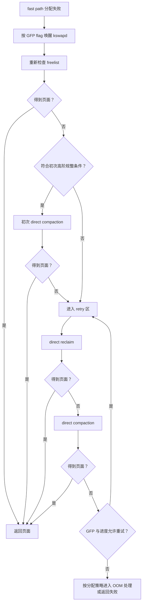

# 4.10 内存规整与直接回收性能边界

一次应用卡顿可能同时伴随 `kswapd` 活跃、memory PSI 上升、ZRAM 写入和 `lmkd` 杀进程。时间上相邻，不代表它们由同一段代码执行，也不代表处理的是同一个问题。

分析以 Android 17 的两组源码为准：

- Android Common Kernel `android17-6.18-2026-06_r6`，提交 `bcbd6575c301ef871ea15e7ac0fc83909e17ef56`；
- AOSP `android-17.0.0_r1` 的 `lmkd`、`CachedAppOptimizer` 和 JNI 实现。

Linux 物理页规整、页面回收、ZRAM 压缩、Android cached app compaction 是四种不同操作。诊断时先确认事件属于哪一层，再讨论性能影响。

## 1. 四个容易混淆的机制

| 机制 | 解决的问题 | 核心动作 | 典型执行者 |
|---|---|---|---|
| Linux memory compaction | 空闲页总量可能够，但缺少指定 order 的连续物理页 | 迁移可移动页，形成更大的 buddy 空闲块 | 分配线程或 `kcompactd` |
| Page reclaim | 可分配页数量不足 | 回收文件页、回写脏页、把匿名页换出 | 分配线程、`kswapd` 等 |
| ZRAM compression | 匿名页换出后需要保存内容 | 压缩页面并存入 RAM 中的块设备 | swap/ZRAM 路径 |
| Android cached app compaction | 降低缓存进程的驻留内存 | 对目标进程执行 `MADV_COLD`、`MADV_PAGEOUT` 或 memcg reclaim | `CachedAppOptimizer` |

### 1.1 Linux compaction 不会释放业务对象

物理页规整把已占用的可移动页搬到别处，再把分散的空闲页合成连续块。迁移前后，进程看到的虚拟地址与数据语义保持不变。规整会消耗 CPU、内存带宽并更新映射相关状态，但它不以减少进程 RSS 为主要目标。

### 1.2 reclaim 关注“有多少页可用”

回收优先处理能够丢弃或写回的页。干净文件页可以丢弃，后续访问再从文件读取；匿名脏页不能直接丢弃，启用 swap 时可以换出到 ZRAM 或其他 swap 后端。

回收得到多个 order-0 页后，高阶分配仍可能失败，因为这些页的物理位置未必连续。分配器随后可能再尝试规整。

### 1.3 ZRAM 保存换出的匿名内容

ZRAM 把换出页压缩后保存在 RAM 中。它通过较少的压缩数据占用替代原始页占用，代价是压缩、解压 CPU 时间和内存带宽。

ZRAM 不会把 buddy 系统里的离散空闲页自动排列成高阶块。它为回收提供匿名页去向，释放出的 base page 能否形成连续块还取决于物理位置、迁移类型和后续规整。

### 1.4 Android 的 “app compaction” 是进程回收

Android 17 的 `CachedAppOptimizer` 也使用 compaction 这个名称。其 JNI 实现在 `com_android_server_am_CachedAppOptimizer.cpp` 中：

- 私有文件映射使用 `MADV_COLD`；
- 匿名私有映射使用 `MADV_PAGEOUT`；
- 部分配置可以通过 cgroup `memory.reclaim` 执行进程级回收。

这套机制针对缓存进程 RSS，与 `mm/compaction.c` 的 buddy 物理页规整同名而语义不同。Perfetto 中看到 `Compaction` 轨道时，要先看它来自 framework atrace，还是 `compaction/mm_compaction_*` 内核 tracepoint。

## 2. order 描述连续物理页数量

Buddy allocator 用 order 表示连续 base page 的数量：

```text
连续页数 = 2^order
连续字节数 = 2^order × PAGE_SIZE
```

order-0 是一个 base page，order-1 是两个相邻 base page。高阶分配的约束同时包括：

- 页数达到要求；
- 物理地址连续；
- zone、NUMA policy、cpuset 和 watermark 允许；
- migratetype 与分配 flag 能够满足；
- 页面没有被无法迁移的使用方式长期占住。

大块 `malloc()` 或 Java 大对象申请的是连续虚拟地址，不等于直接申请同样大小的连续物理页。应用可能通过缺页逐个获得 order-0 页。高阶物理页需求更多见于内核对象、THP/large folio、CMA 或特定驱动路径；具体图形和多媒体 buffer 是否要求物理连续，还取决于 IOMMU、DMA heap 和驱动实现。

举例说明 order 与 page size 的数学关系：

| 目标 | 4KB base page | 16KB base page |
|---|---:|---:|
| order-3 覆盖字节数 | 32KB | 128KB |
| 2MB 连续区域所需 order | order-9 | order-7 |

这个表只换算页数，不表示设备一定用 2MB THP，也不表示某次 2MB 虚拟内存申请会进入对应 order 的 buddy 分配。

## 3. 规整如何形成连续空闲区

规整从两个方向扫描 zone：

- migrate scanner 寻找可以搬走的已占用页；
- free scanner 寻找迁移目标空闲页。

页迁移成功后，低地址或目标区域中的占用页被移走，分散空闲页有机会按 buddy 规则合并。长时间 pinned 的页、不可移动内核分配和受约束的页块会降低成功率。

### 3.1 migratetype 降低长期碎片

页块会按用途区分 `MIGRATE_MOVABLE`、`MIGRATE_RECLAIMABLE`、`MIGRATE_UNMOVABLE`、`MIGRATE_CMA` 等类型。分组的目的，是减少可移动页与不可移动页交错。

紧急情况下，分配器仍可能从其他类型的空闲块 fallback。设备运行时间增长、fallback 增多后，一个 pageblock 中可能混入不同迁移能力的页面，后续高阶规整就更难成功。

### 3.2 CMA 也可能需要迁移，但入口不同

CMA 为连续内存分配保留适合迁移的区域。CMA 分配或 `alloc_contig_range()` 可以触发页面隔离和迁移；它不等同于普通 buddy 高阶分配的每一条 direct compaction 分支。

分析相机、显示或编解码问题时，应同时确认：

- 使用的是哪种 DMA heap 或分配器；
- IOMMU 是否允许 scatter-gather；
- 内核日志是否来自 CMA；
- `/proc/meminfo` 是否提供 `CmaTotal`、`CmaFree`；
- trace 中运行的是目标线程、`kcompactd`，还是驱动自己的回收线程。

## 4. Android 17 分配慢路径的真实顺序

现象层面常把慢路径概括成“先回收，再规整”。Android 17 的 `__alloc_pages_slowpath()` 比这个描述多一个关键分支：部分高阶分配会在 direct reclaim 之前先尝试 direct compaction。

### 4.1 第一次规整发生在什么条件下

进入 slowpath 后，内核先按 flag 唤醒 `kswapd`，更新分配 flag 并再次检查 freelist。仍失败时，满足下列条件的请求会先规整：

- 调用方允许 direct reclaim；
- GFP flag 允许 compaction；
- 请求属于 costly order，或者是非 `MIGRATE_MOVABLE` 的高阶分配；
- 请求不处于允许绕过 watermark 的特殊上下文。

这次初始尝试使用 `INIT_COMPACT_PRIORITY`。某些带 `__GFP_NORETRY` 的 costly allocation 在规整被跳过或延后后会直接失败，避免代价很高且成功率不确定的回收。

### 4.2 常规重试先 reclaim，再 compact

如果初始尝试没有返回页面，slowpath 进入 retry 区：

1. 再查 freelist；
2. 检查调用方是否允许 direct reclaim；
3. 执行 `__alloc_pages_direct_reclaim()`；
4. 回收后再次分配；
5. 仍失败则执行 `__alloc_pages_direct_compact()`；
6. 根据 GFP retry policy、回收进度、规整结果和优先级决定重试、进入内核 OOM 处理或返回失败。

下面的图只保留和性能诊断相关的控制流：



`lmkd` 没有出现在图里，因为它是独立的用户空间 daemon。内核 slowpath 可以进入内核 OOM killer；`lmkd` 则根据另一组压力证据异步选择 Android 进程。

### 4.3 order-0 不走 direct compaction

Android 17 的入口先检查：

```c
// kernel/common, android17-6.18-2026-06_r6
static struct page *
__alloc_pages_direct_compact(gfp_t gfp_mask, unsigned int order, ...)
{
    if (!order)
        return NULL;

    psi_memstall_enter(&pflags);
    delayacct_compact_start();
    *compact_result = try_to_compact_pages(...);
    psi_memstall_leave(&pflags);
    delayacct_compact_end();
    ...
}
```

所以 order-0 缺页可以触发 direct reclaim，却不会通过这个入口执行 direct compaction。应用主线程因普通 page fault 卡住时，direct reclaim 往往比 direct compaction 更先成为候选；只有看到 order、GFP 和 compaction trace 证据后，才应归因到规整。

### 4.4 direct reclaim 和 direct compaction 都计入 PSI

`__alloc_pages_direct_reclaim()` 与 `__alloc_pages_direct_compact()` 都调用 `psi_memstall_enter()` / `psi_memstall_leave()`。这说明分配线程在两类同步处理中的时间都能贡献 memory PSI stall。

PSI 只能说明任务因内存资源短缺而停顿：

- `some` 表示至少有部分非空闲任务因该资源停顿；
- `full` 表示所有非空闲任务同时停顿。

PSI 本身不区分回收、规整、swap I/O 或其他内存压力原因。要靠 tracepoint、线程调用栈和 vmstat 继续分类。

## 5. fragmentation index 的适用范围

`/sys/kernel/debug/extfrag/extfrag_index` 按 node、zone、order 展示 external fragmentation index。内核文档给出的读法是：

- `-1`：只要满足 watermark，分配可以成功；
- 趋近 `0`：失败更偏向可用内存不足；
- 趋近 `1000`：失败更偏向外部碎片。

在 `android17-6.18-2026-06_r6` 的 `compaction_suitable()` 中，watermark 检查先决定该 zone 是否具备迁移所需的空闲页。只有 `order > PAGE_ALLOC_COSTLY_ORDER` 时，代码才进一步用 fragmentation index 和 `vm.extfrag_threshold` 避免收益偏低的规整：

```c
if (suitable) {
    compact_result = COMPACT_CONTINUE;
    if (order > PAGE_ALLOC_COSTLY_ORDER) {
        int fragindex = fragmentation_index(zone, order);

        if (fragindex >= 0 &&
            fragindex <= sysctl_extfrag_threshold) {
            suitable = false;
            compact_result = COMPACT_NOT_SUITABLE_ZONE;
        }
    }
}
```

当前 kernel tag 的 sysctl 文档写明 `extfrag_threshold` 默认值为 500；设备的实际值仍应现场读取。该阈值参与 costly-order 规整适用性判断，即使超过也不保证规整成功。

读取 `extfrag_index` 需要 `CONFIG_DEBUG_FS`、`CONFIG_COMPACTION` 和相应权限，量产设备通常无法直接访问。缺少该指标时，可以用 buddy 分布、迁移类型、规整结果和分配 order 建立间接证据，不能仅凭 `MemAvailable` 宣布存在物理碎片。

## 6. `kswapd`、`kcompactd` 与分配线程

| 路径 | 执行上下文 | 主要工作 | 对 App 的影响 |
|---|---|---|---|
| `kswapd` | 每个内存 node 的内核线程 | 后台扫描和回收，尝试恢复 watermark | 消耗 CPU、内存带宽，可能带来 swap 或 I/O |
| direct reclaim | 当前分配线程 | 同步调用 `try_to_free_pages()` | 增加当前请求的墙上时间 |
| `kcompactd` | 每个内存 node 的内核线程 | 响应高阶请求或主动规整 | 后台消耗资源，降低部分后续高阶失败概率 |
| direct compaction | 当前高阶分配线程 | 同步扫描、隔离、迁移页面 | 增加当前请求的墙上时间 |

### 6.1 `kcompactd` 不只在失败后工作

Android 17 kernel 仍支持 `vm.compaction_proactiveness`。该值范围为 0 到 100，当前 common kernel 源码默认 20。主动规整使用相对 `COMPACTION_HPAGE_ORDER` 的外部碎片分数，并按 zone 占 node 的页数加权。阈值由参数换算：

```text
low  = 100 - compaction_proactiveness
high = min(low + min(10, low / 2), 100)
```

默认值 20 对应 `low=80`、`high=90`。node 分数高于 high 时，`kcompactd` 可以启动主动规整；工作持续到各 zone 分数接近 low，或遇到锁竞争、没有进展等退避条件。`kswapd` 正在运行时，主动规整会跳过，避免两类后台内存工作同时争用资源。

参数行为还包括：

- 0 关闭 proactive compaction；
- 写入非零值会立即触发一次主动规整；
- 更高值会降低触发门槛，提高后台规整积极程度；
- 极端值可能产生过量后台规整和延迟尖峰。

厂商可以改变配置和运行值。分析设备时读取实际 sysctl，不要把 common kernel 默认值当成所有 Android 17 产品的固定参数。

### 6.2 三个参数服务不同决策

| 参数 | 取值与默认值 | 作用范围 | 不能推导的结论 |
|---|---|---|---|
| `vm.compaction_proactiveness` | 0—100，common kernel 默认 20 | 控制主动规整；0 不会关闭 direct compaction 或分配驱动的 `kcompactd` | 不能按 RAM 容量直接套固定值 |
| `vm.extfrag_threshold` | 0—1000，默认 500 | 帮助 costly-order 分配判断更适合规整还是回收 | 与主动规整的 0—100 分数不是同一个量 |
| `vm.compact_unevictable_allowed` | 普通内核默认 1，PREEMPT_RT 默认 0 | 决定规整是否检查 unevictable LRU 上的页 | 允许迁移不表示 mlocked 页访问没有停顿 |

向 `vm.compact_memory` 写 1 会手工规整所有 node。它适合受控实验，不是日常清理内存的接口。`/sys/devices/system/node/node*/compact` 还依赖 NUMA、sysfs、权限和产品配置，量产设备未必提供。

### 6.3 线程状态不能替代调用栈

执行 direct reclaim 或 direct compaction 的线程可能：

- 在 CPU 上运行内核代码；
- 因调度暂时处于 Runnable；
- 等待 I/O、锁或其他不可中断条件而处于 `D` 状态；
- 在可中断等待中显示 Sleeping。

因此 `D` 状态不是 direct reclaim 的必要条件，Running 也不代表业务 Java 代码在耗时。需要把调度状态与内核栈、ftrace 事件和 PSI 时间窗对齐。

## 7. Android 17：PSI、lmkd 与 mmd 的责任边界

### 7.1 `lmkd` 消费压力信号并选择进程

Android 10 起，PSI 成为 `lmkd` 的默认压力监控方式。Android 17 的 `lmkd.cpp` 在新策略下关闭 LOW 级 PSI monitor，用属性配置 MEDIUM 的 `PSI_SOME` 阈值和 CRITICAL 的 `PSI_FULL` 阈值。

收到事件后，Android 17 的决策代码还会读取或计算：

- zone watermark；
- free swap 与 swap utilization；
- file-backed page cache 的 workingset refault/thrashing；
- direct reclaim、`kswapd` reclaim 状态；
- PSI memory `some/full` 统计；
- 候选进程的 `oom_score_adj` 和 RSS；
- 设备属性与厂商事件。

A17 源码可以通过 memevent listener 识别 direct reclaim/kswapd；能力不可用时，再用 `/proc/vmstat` 的 `pgscan_direct`、`pgscan_kswapd` 等变化判断。

kill reason 包含 `DIRECT_RECL_AND_THRASHING`、`DIRECT_RECL_STUCK`、`LOW_MEM_AND_SWAP`、`LOW_MEM_AND_THRASHING` 等条件。代码没有把 `COMPACTFAIL` 作为直接杀进程触发器。

这给出清晰边界：

- 规整失败可能增加分配延迟或让高阶请求失败；
- 同一压力期也可能让 PSI、watermark、swap、thrashing 条件恶化；
- `lmkd` 根据这些压力状态和进程优先级决定是否杀进程；
- 规整失败与某次 LMK 之间需要时间和指标证据，不能用相邻发生代替因果证明。

`oom_score_adj` 决定哪些进程更适合作为候选，但 kill reason、最低可杀分值、关键 stall 和厂商策略都会改变选择范围。不能概括成“永远只杀 RSS 最大的 cached app”。

### 7.2 Android 17 的 `mmd` 管理 ZRAM 维护

Android 17 新增 memory management daemon `mmd`。官方架构文档把它定位为 ZRAM 配置与持续维护服务，可执行：

- ZRAM recompression；
- ZRAM writeback；
- per-process ZRAM writeback；
- per-process prefetch。

这些动作处理已经进入 swap/ZRAM 的页面及其后续存放方式。它们不执行 buddy 物理页规整，也不替代 `lmkd` 的进程选择。

Android 17 的 per-process writeback 还与 `CachedAppOptimizer` 协作：缓存进程先经过 framework 所称的 app compaction，延迟后再由 system_server 通过 pidfd 请求 `mmd` 写回该进程的 ZRAM 页面。这里的 app compaction 仍是 `madvise`/memcg reclaim 语义。

### 7.3 三层关系

| 层 | 主要问题 | Android 17 组件 |
|---|---|---|
| 物理页分配 | 数量、连续性、watermark | buddy、reclaim、`mm/compaction.c` |
| 系统压力响应 | 何时杀哪个进程 | PSI + userspace `lmkd` |
| swap 后处理 | 如何维护 ZRAM 中的冷页 | `mmd` |

它们共享同一台设备的 CPU、RAM、swap 和 I/O，所以可能互相影响；实现职责仍然分开。

## 8. Perfetto：先确认事件，再解释影响

### 8.1 推荐的内核事件

下面的 TraceConfig 片段用于观察 Android 17 kernel 中已定义的事件。量产设备是否开放这些事件，取决于内核配置、tracefs 权限和 Perfetto 事件白名单。

```protobuf
data_sources {
  config {
    name: "linux.ftrace"
    ftrace_config {
      ftrace_events: "sched/sched_switch"
      ftrace_events: "vmscan/mm_vmscan_kswapd_wake"
      ftrace_events: "vmscan/mm_vmscan_kswapd_sleep"
      ftrace_events: "vmscan/mm_vmscan_direct_reclaim_begin"
      ftrace_events: "vmscan/mm_vmscan_direct_reclaim_end"
      ftrace_events: "compaction/mm_compaction_try_to_compact_pages"
      ftrace_events: "compaction/mm_compaction_begin"
      ftrace_events: "compaction/mm_compaction_end"
      ftrace_events: "compaction/mm_compaction_migratepages"
      ftrace_events: "compaction/mm_compaction_kcompactd_wake"
      ftrace_events: "compaction/mm_compaction_kcompactd_sleep"
    }
  }
}
```

各事件回答的问题不同：

| 事件 | 关键字段或配对 | 用途 |
|---|---|---|
| `mm_vmscan_direct_reclaim_begin/end` | 当前线程、GFP、order、回收页数 | 量化分配线程同步回收 |
| `mm_compaction_try_to_compact_pages` | order、GFP、priority | 确认 direct compaction 请求 |
| `mm_compaction_begin/end` | zone PFN、sync/async、status | 量化一次规整及结果 |
| `mm_compaction_migratepages` | migrated、failed | 观察页面迁移效果 |
| `mm_compaction_kcompactd_wake/sleep` | node、order | 识别后台规整窗口 |
| `sched_switch` | prev/next state | 还原线程运行、等待与唤醒 |

`mm_compaction_begin/end` 也可以由后台规整产生。要按事件所在 CPU、当前线程和 kcompactd 事件判断执行上下文。

### 8.2 一次可信的卡顿归因

把主线程卡顿归因给 direct reclaim，至少应满足：

1. 卡顿起止与该线程的 `mm_vmscan_direct_reclaim_begin/end` 重叠；
2. 事件字段与调用栈指向同一次分配；
3. PSI 或 vmstat 在相同窗口给出压力证据；
4. 排除 Binder 对端、锁竞争和磁盘 I/O 等更直接原因。

归因给 direct compaction，还应补充：

- `mm_compaction_try_to_compact_pages` 的 order 与 GFP；
- begin/end 的持续时间和 status；
- 迁移成功/失败数量；
- 分配最终成功、重试还是失败；
- 该请求是否来自应用线程，或来自内核/驱动的其他线程。

“`kcompactd0` 同时 Running”只说明后台规整活跃，不能证明目标线程在等待它。

### 8.3 framework app compaction 的 trace

`CachedAppOptimizer` 使用 `ATRACE_COMPACTION_TRACK = "Compaction"`，其 JNI 还能产生 `CollectVmas`、`Madvise ...` 等 slice。看到这些 slice 时，分析目标应是：

- 哪个缓存进程被 `madvise`；
- anon/file RSS 与 swap 怎样变化；
- 是否影响 ZRAM、CPU 和后续启动；
- 是否随后触发 Android 17 的 per-process writeback。

不要把 framework `Compaction` slice 直接统计到内核 `compact_stall`。

## 9. bugreport 与 adb：用增量，不用单点

### 9.1 `/proc/vmstat`

Android 17 kernel 暴露的相关累计计数包括：

- `pgscan_direct`、`pgsteal_direct`；
- `pgscan_kswapd`、`pgsteal_kswapd`；
- `compact_stall`、`compact_success`、`compact_fail`；
- `compact_migrate_scanned`、`compact_free_scanned`；
- `compact_daemon_wake`；
- `compact_daemon_migrate_scanned`、`compact_daemon_free_scanned`；
- `pswpin`、`pswpout`。

可以先在受控设备上检查字段是否存在：

```bash
adb shell 'grep -E "^(pgscan_direct|pgsteal_direct|pgscan_kswapd|compact_|pswpin|pswpout)" /proc/vmstat'
```

这些值从开机累计。事故前后做差值才有意义；`compact_success` 增长也不能说明没有延迟，它只说明 direct compaction 后拿到了目标页面。

### 9.2 buddy 与 migratetype

```bash
adb shell cat /proc/buddyinfo
adb shell cat /proc/pagetypeinfo
adb shell cat /proc/zoneinfo
```

- `buddyinfo` 按 zone 和 order 给出空闲块数量；
- `pagetypeinfo` 进一步按 migratetype 展示空闲块和 pageblock 分布；
- `zoneinfo` 提供 watermark、managed/free pages 等背景。

Android 17 kernel 将 `/proc/pagetypeinfo` 权限设为 `0400`，而且源码明确提示采集开销较高，不适合高频轮询。量产设备上的 SELinux 还可能限制访问。

高 order 为 0 是连续块不足的信号，但仍需结合目标 zone、order、migratetype 和 watermark。某个 zone 缺块，不代表另一 zone 也无法满足请求。

### 9.3 PSI、ZRAM 与 CMA

```bash
adb shell cat /proc/pressure/memory
adb shell cat /proc/swaps
adb shell cat /sys/block/zram0/mm_stat
adb shell cat /proc/meminfo
```

判读要点：

- PSI `avg10/60/300` 适合看趋势，`total` 的区间增量适合补短时 stall；
- `/proc/swaps` 给出 swap 设备和使用量；
- ZRAM `mm_stat` 字段含义应按设备内核文档解释；
- `SwapTotal/SwapFree`、`CmaTotal/CmaFree` 是否存在取决于配置；
- ZRAM 量上涨只说明匿名页进入压缩 swap，不能单独证明 direct reclaim 来自目标线程。

debugfs 可用时再读取：

```bash
adb shell cat /sys/kernel/debug/extfrag/extfrag_index
```

该命令通常需要 root/userdebug/eng 环境。采集失败属于权限或配置结果，不能换算成碎片程度。

### 9.4 调参必须是可回滚的单变量实验

一次可复核的实验至少包含以下步骤：

1. 用业务指标定义目标，例如相机首帧 P99、游戏最大帧耗时或连续运行后的高阶分配长尾。
2. 固定设备、构建、温度、前后台应用集合和工作负载，采集默认配置下的延迟、vmstat 增量、buddy/extfrag 快照与 Trace。
3. 找到目标 order、zone、migratetype 和分配者，再决定是否调整规整参数。
4. 每轮只改一个参数，记录原值并在测试后明确恢复；写入非零 `compaction_proactiveness` 本身会立即唤醒 `kcompactd`，写入瞬间不能当作稳态样本。
5. 同时比较前台 P95/P99、`kcompactd` CPU 时间、扫描量、direct compaction、分配失败、PSI、LMKD/OOM 和功耗。
6. 恢复默认值后复测，排除温度、缓存与执行顺序造成的假收益。

`drop_caches` 不执行物理规整，还会制造额外 cache miss 和 I/O。除非实验目标就是冷缓存，否则不要用它重置规整测试。

## 10. App 侧如何降低触发概率

应用无法设置设备的 watermark、`compaction_proactiveness`、ZRAM 算法或 `lmkd` 策略。能够控制的是自身的分配峰值、驻留页和释放时机。

### 10.1 优先治理峰值

- 避免首屏同时解码多张大图、构建大列表和初始化 native 模块；
- 限制预加载并发，给取消路径释放中间 buffer；
- 图片、相机、编解码、WebView 和 ML runtime 要分别记录 Java、native、Graphics/DMA-BUF；
- 为缓存设容量和淘汰规则，不用“有空闲内存”作为无限增长条件；
- 把可推迟的大分配移出输入响应和 `doFrame` 时间窗。

ART 大对象、native allocation 与内核高阶页之间没有一一对应关系。优化前要证明哪类分配触发了 pressure，避免为了一个驱动/CMA 问题重写 Java 对象模型。

### 10.2 正确使用 `onTrimMemory()`

Android 官方文档的当前口径要求重点处理：

- `TRIM_MEMORY_UI_HIDDEN`：UI 不再可见，可以释放只服务于界面的 bitmap、播放 buffer 和动画资源；
- `TRIM_MEMORY_BACKGROUND`：进程进入后台并可能成为终止候选，应释放可重建的后台资源。

Android 14 起不再投递其他 legacy `onTrimMemory` 级别，相关常量在 Android 15 正式弃用。不要为 Android 17 设计依赖 `TRIM_MEMORY_RUNNING_LOW` 等旧回调的核心策略。

释放缓存可以降低未来压力和 LMK 风险，但回调不是内核 direct reclaim 的同步通知，也不能保证在每次压力前到达。

### 10.3 无效或高风险做法

- 在 App 中写 `/proc/sys/vm/compact_memory`；
- 用 `System.gc()` 代替物理页回收或规整；
- 把 `largeHeap` 当作所有内存问题的修复；
- 只看 Java heap，忽略 native、Graphics、DMA-BUF 和 swap；
- 根据一台旗舰机的绝对阈值给所有设备分类；
- 在没有前后增量的情况下解读 `/proc/vmstat` 累计值。

## 11. 16KB Page Size 如何改变分析

16KB base page 改变 order 对应的字节数，也改变页表、TLB、内部碎片和一次 fault 覆盖的数据量。对同一字节数，高阶 order 可能下降；单页内部浪费和一次回收/迁移的数据量也会增加。

这两组效应方向不同，不能预设“16KB 一定更少碎片”或“一定更容易规整”。验证时至少保持 workload 可比，并记录：

- page size 和内核 tag；
- 目标分配的 order、GFP、zone；
- `buddyinfo` 各 order 的区间变化；
- direct reclaim/compaction 次数与耗时；
- 迁移成功率和 `compact_fail` 增量；
- RSS、ZRAM、page fault、LMK 与用户可感知延迟。

16 KB 设备上的 native mmap/ELF 对齐兼容属于另一个问题，应结合 4.6 阅读。

### 11.1 mTHP 要按实际字节大小分析

multi-size THP（mTHP）允许匿名内存使用大于 base page、又小于传统 PMD-sized THP 的 2 的幂倍页面。它仍由 PTE 映射，可以减少部分 page fault 和 TLB 压力，也会引入更高阶的物理页需求。

Android 17 common kernel 的 arm64 GKI 启用了 `CONFIG_TRANSPARENT_HUGEPAGE=y` 与 `CONFIG_TRANSPARENT_HUGEPAGE_MADVISE=y`，不代表产品启用了所有 mTHP size。设备会按实际字节数暴露 `hugepages-*kB` 目录；4KB base page 上的 order-2 是 16KB，16KB base page 上则是 64KB。报告应同时记录 base page、实际 huge page size、分配/fallback 计数和规整事件，不要只写 order。

## 12. 低内存设备与厂商差异

低内存设备的匿名页、file cache 和 swap 余量更容易同时吃紧。可能出现下面的事件序列：

1. 前台或系统组件产生分配峰值；
2. `kswapd` 扫描，匿名页进入 ZRAM；
3. workingset refault 上升，出现 thrashing；
4. 分配线程进入 direct reclaim，必要时尝试 compaction；
5. PSI 达到 monitor 阈值；
6. `lmkd` 按 watermark、swap、thrashing、`oom_score_adj` 等条件杀进程；
7. 用户随后重启被杀的后台应用，发生冷启动和 page-in。

这是一种可能序列，设备也可能在任意一步恢复。每一步都应由对应证据确认。

跨设备对比至少记录：

- Android 版本、kernel release/GKI tag、base page size；
- RAM 容量与 `ro.config.low_ram`；
- ZRAM 大小、算法、writeback 配置和 `/proc/swaps`；
- `ro.lmk.*` 与相关 DeviceConfig；
- watermark、buddy、migratetype 和 PSI；
- `CONFIG_COMPACTION`、tracepoint 可用性；
- SoC 的 IOMMU、DMA heap 和 CMA 配置。

厂商对 common kernel 和 `lmkd` 的 hook、属性、阈值修改会改变结果。报告中应区分 AOSP 默认、产品运行值和现场测量值。

## 13. 实战判读模板

假设某设备相机首帧偶发 200 ms 延迟，同时 memory PSI 抬高。

先按时间顺序回答：

1. 延迟发生在哪个线程？它处于 Running、Runnable、Sleeping 还是 `D`？
2. 该线程是否出现 `mm_vmscan_direct_reclaim_begin/end`？
3. 是否出现 `mm_compaction_try_to_compact_pages`？order 和 GFP 是什么？
4. `mm_compaction_end.status` 是成功、跳过、延后还是失败？
5. 同窗口是否有 CMA、DMA heap、gralloc 或 IOMMU 日志？
6. `pgscan_direct`、`compact_stall/fail/success` 的区间增量是多少？
7. `buddyinfo` 中目标 zone/order 是否缺少空闲块？
8. `lmkd` 若发生 kill，kill reason、候选 `oom_score_adj` 和释放 RSS 是什么？
9. 相机请求前是否存在可消除的 bitmap/native buffer 峰值？

可能出现三种不同结论：

| 证据 | 结论方向 | 修复位置 |
|---|---|---|
| 目标线程 direct reclaim 明显，未出现 compaction | 数量压力或 swap/page-cache 代价 | 降低峰值、减少驻留页、检查 I/O |
| 目标高阶分配反复 compaction fail，CMA/驱动证据一致 | 连续页供应或不可迁移页问题 | 驱动、DMA heap、CMA 与系统配置 |
| 只有 framework `Compaction` slice | CachedAppOptimizer 在回收缓存进程 | 分析冻结/回收策略与前台资源竞争 |

## 14. 复核清单

- [ ] 已区分 Linux 物理页规整和 Android cached app compaction。
- [ ] 已确认分配 order、GFP、zone 和执行线程。
- [ ] 已按 Android 17 slowpath 顺序解释初次 compaction、reclaim 和再次 compaction。
- [ ] 没有用线程 `D` 状态单独证明 direct reclaim。
- [ ] PSI 只用于确认内存 stall，没有越界解释成队列或碎片指标。
- [ ] `lmkd` kill reason 与 `oom_score_adj` 来自同一事件。
- [ ] `/proc/vmstat` 使用区间增量。
- [ ] `buddyinfo` 与 `pagetypeinfo` 按目标 zone/order/migratetype 解读。
- [ ] 已记录 Android 17 `mmd` 与 ZRAM 后处理是否启用。
- [ ] 应用修复聚焦峰值和生命周期，没有尝试修改系统 sysctl。

## 15. 小结

Android 17 的物理页分配慢路径会在特定高阶条件下先尝试 direct compaction，常规重试再执行 direct reclaim 和 direct compaction。两类同步操作都计入 memory PSI，都会增加当前分配线程的墙上时间。

规整解决连续性，回收解决可用页数量，ZRAM保存换出匿名页，CachedAppOptimizer 回收缓存进程，`lmkd` 选择压力下的牺牲进程，`mmd` 维护 ZRAM 冷页。把这些职责拆开后，Perfetto、vmstat、buddyinfo 和 lmkd 日志才能组成可验证的结论。

## 参考源码与文档

- Android Common Kernel `android17-6.18-2026-06_r6`
  - `mm/page_alloc.c`
  - `mm/compaction.c`
  - `mm/vmscan.c`
  - `mm/vmstat.c`
  - `include/trace/events/compaction.h`
  - `include/trace/events/vmscan.h`
  - `Documentation/admin-guide/sysctl/vm.rst`
  - `Documentation/accounting/psi.rst`
- AOSP `android-17.0.0_r1`
  - `platform/system/memory/lmkd/lmkd.cpp`
  - `platform/frameworks/base/services/core/java/com/android/server/am/CachedAppOptimizer.java`
  - `platform/frameworks/base/services/core/jni/com_android_server_am_CachedAppOptimizer.cpp`
- Android Source：Low memory killer daemon
  - <https://source.android.com/docs/core/perf/lmkd>
- Android Source：Memory management daemon
  - <https://source.android.com/docs/core/perf/mmd>
- Android Developers：Manage your app's memory
  - <https://developer.android.com/topic/performance/memory>
