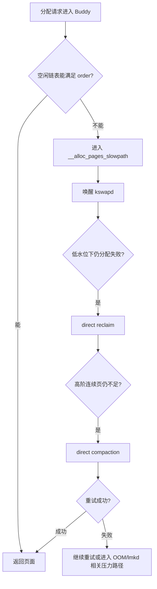

# 4.10 内存规整与直接回收性能边界

<!-- outline-start -->
## 要点

### 🔹 问题边界：规整、回收、压缩不是同一件事
说明 memory compaction、page reclaim、ZRAM compression 的职责差异，避免把“内存压缩”混成一个概念。

### 🔹 高阶页分配为什么会触发规整
解释连续物理页需求、迁移类型、fragmentation index 与 direct compaction 的触发条件。

### 🔹 kswapd、direct reclaim 与 direct compaction 的耗时路径
区分后台回收和分配现场同步等待，说明为什么 App 线程可能在内核态停住。

### 🔹 Android 侧内存压力传导：PSI、lmkd 与进程优先级
把内核压力信号、lmkd 决策和 `oom_score_adj` 串起来，说明规整失败与杀进程之间的关系边界。

### 🔹 Perfetto / bugreport 中如何识别规整和回收
列出可观察线索：`kswapd`、`kcompactd`、direct reclaim、page fault、PSI stall、线程 Running/Sleeping 状态。

### 🔹 App 侧能做什么，不能做什么
说明对象分配、Bitmap/Native 内存、内存峰值、后台缓存释放能降低压力，但不能直接控制内核规整策略。

## 扩展

### 🔸 与 16KB Page Size 的关系
大页大小改变会影响高阶页和碎片化压力，但具体收益必须基于设备内核配置和 workload 验证。

### 🔸 与低内存设备和后台保活的关系
低内存设备上回收、swap、规整和 lmkd 决策更容易互相放大，适合作为 10.4 的实战案例入口。

### 🔸 厂商内核调参差异
不同设备的 watermark、compaction、ZRAM、lmkd 参数差异可能改变观测结果，需要在 17.2/17.1 中交叉引用。

<!-- outline-end -->

## 这一节补哪块缺口

4.2 已经讲过 Linux 内核内存管理的全景：页表、LRU、kswapd、direct reclaim、MGLRU、CMA、DMA-BUF。10.4 从性能症状出发，讲低内存怎样拖慢系统。本节只补中间那段容易被混在一起的路径：系统总空闲内存还没耗尽，但连续物理页不够、回收跟不上分配、规整在分配现场同步执行时，App 线程会怎样被拖住。

这类问题在 trace 里经常被误判成“CPU 忙”或“App 主线程写了慢代码”。如果同一时间窗里能看到 `kswapd`、`kcompactd`、`mm_vmscan_*`、`mm_compaction_*`、PSI memory stall 或线程 `D` 状态，排查方向就要从应用函数耗时转向内核内存压力。

[来源: Cubox/不懂 内存规整，别说你会 Linux 内存调优-2026-05-13.md]
[交叉引用: 4.2 Linux 内核内存管理, 10.4 低内存对系统性能的影响, 13.6 线程 CPU 状态分析]

## 规整、回收、ZRAM 压缩的边界

内存规整、页面回收、ZRAM 压缩都发生在内存压力附近，但它们解决的问题不同。排查时先把这三件事分开，后面的 trace 才能读准。

| 机制 | 解决的问题 | 主要动作 | 常见触发点 | 性能代价 |
| --- | --- | --- | --- | --- |
| Memory Compaction | 空闲页分散，缺少连续物理页 | 迁移可移动页，把空闲页集中成更大的连续块 | 高阶页分配失败、CMA/THP/驱动分配压力、手动 `compact_memory` | CPU 迁移、页表更新、可能阻塞分配线程 |
| Page Reclaim | 可用页数量不足 | 回收文件页，或把匿名页换出到 swap / ZRAM | watermark 下降、kswapd 唤醒、direct reclaim | LRU 扫描、I/O 回写、ZRAM 压缩、缺页换入 |
| ZRAM Compression | 匿名页不能直接丢弃，需要压缩保存 | 把匿名页压缩写入内存中的块设备 | 匿名页回收、swap 压力升高 | CPU 压缩/解压，内存带宽占用 |

规整不释放已有数据占用的内存，它通过迁移页面改变物理布局。回收会减少当前驻留页数量，但回收出来的页未必马上形成高阶连续块。ZRAM 压缩属于匿名页回收的保存方式，目标是腾出物理页；它不是把物理内存碎片“压紧”。

这就是很多低内存 trace 难读的地方：一个分配请求可能先唤醒 kswapd，再做 direct reclaim，再做 direct compaction。用户看到的是一次卡顿，内核路径里可能同时包含数量不足和连续性不足两个问题。

[已验证: AOSP android-mainline, mm/page_alloc.c `__alloc_pages_direct_compact()`；AOSP android-mainline, mm/compaction.c `compact_zone_order()`]

## 高阶页分配为什么会触发规整

Linux Buddy 分配器以 page 为基本单位，用 order 表示连续页数量。order-0 是 1 个 base page，order-1 是 2 个连续 base page，order-n 是 `2^n` 个连续 base page。高阶页分配的难点不在总量，而在物理地址连续。

Android 上还会碰到几类连续性需求：

- THP 或大页相关分配需要更大的连续物理区间；在 4KB base page 下，2MB THP 对应 order-9。
- CMA 预留区服务于部分设备 DMA 场景，相机、显示、多媒体驱动可能通过 CMA 或 DMA-BUF 相关路径拿内存。
- 早期或厂商定制图形/多媒体路径仍可能受物理连续性、IOMMU 能力、heap 类型和驱动策略影响；不能把所有 GPU buffer 都写成“必须物理连续”。
- 内核自身某些 `GFP_KERNEL` 高阶分配在碎片化严重时会进入慢速路径。

规整依赖页迁移。内核会扫描一个 zone，把可移动页迁到合适位置，让空闲页集中起来。迁移类型决定哪些页适合搬：`MIGRATE_MOVABLE` 更适合规整，`MIGRATE_UNMOVABLE` 和部分 `MIGRATE_RECLAIMABLE` 页会让规整效果变差。系统长时间运行后，如果可移动页和不可移动页交错分布，高阶页分配就更容易触发 direct compaction。

AOSP android-mainline 的分配路径里，高阶分配失败后会尝试 compaction，order-0 不走这条直接规整路径。下面这段代码用于确认 direct compaction 不是普通小对象分配的常规路径，重点看 `if (!order)` 和 `try_to_compact_pages()`。

```c
// AOSP android-mainline, kernel/common/mm/page_alloc.c
static struct page *
__alloc_pages_direct_compact(gfp_t gfp_mask, unsigned int order,
        unsigned int alloc_flags, const struct alloc_context *ac,
        enum compact_priority prio, enum compact_result *compact_result)
{
    if (!order)
        return NULL;

    psi_memstall_enter(&pflags);
    delayacct_compact_start();
    *compact_result = try_to_compact_pages(gfp_mask, order, alloc_flags, ac,
                                           prio, &page);
    delayacct_compact_end();
    psi_memstall_leave(&pflags);
}
```

这段代码给出两个排查点：order-0 小页分配不会直接进入这条函数；direct compaction 会进入 PSI memory stall 统计。trace 里如果出现 memory PSI 抬高，同时目标线程在分配路径停住，要把规整和回收都放进候选原因。

[已验证: AOSP android-mainline, mm/page_alloc.c:4163-4185]

## fragmentation index 怎么用

碎片化不是“空闲内存少”的同义词。内核用 fragmentation index 判断高阶分配失败更接近内存不足还是外部碎片。debugfs 中的 `/sys/kernel/debug/extfrag/extfrag_index` 会按 node、zone、order 输出这个指标。用户版本设备经常拿不到 debugfs，因此它更适合作为 userdebug / eng 设备上的实验指标。

常见读法如下：

- `-1`：当前 order 的分配预计可以成功，不需要回收或规整。
- 靠近 `0`：失败更像是可用内存不足，回收比规整更有意义。
- 靠近 `1000`：失败更像外部碎片，规整更可能改善连续性。

内核在判断某个 zone 是否适合 compaction 时，会结合 `fragmentation_index(zone, order)` 和 `vm.extfrag_threshold`。下面这段代码用于确认该指标参与自动规整决策，重点看 `fragindex <= sysctl_extfrag_threshold` 时会跳过不合适的 zone。

```c
// AOSP android-mainline, kernel/common/mm/compaction.c
if (suitable) {
    compact_result = COMPACT_CONTINUE;
    if (order > PAGE_ALLOC_COSTLY_ORDER) {
        int fragindex = fragmentation_index(zone, order);

        if (fragindex >= 0 && fragindex <= sysctl_extfrag_threshold) {
            suitable = false;
            compact_result = COMPACT_NOT_SUITABLE_ZONE;
        }
    }
}
```

排查高阶分配失败时，`MemFree`、`MemAvailable`、`CmaFree` 只能说明数量和区域状态；`buddyinfo`、`pagetypeinfo`、`extfrag_index` 才能补上连续性信息。没有这些证据时，只能把“碎片化”标成候选原因，不能直接下定论。

[已验证: AOSP android-mainline, mm/compaction.c `fragmentation_index()` 调用路径]
[自动发现: `/sys/kernel/debug/extfrag/extfrag_index` 可作为 userdebug 设备上的高阶页碎片观察点]

## kswapd、direct reclaim 与 direct compaction 的耗时路径

内核内存压力有两种表现：后台线程在忙，或者分配线程被迫自己干活。前者会消耗 CPU 和 I/O，后者会直接增加请求线程的墙上时间。

| 路径 | 谁在执行 | 触发条件 | App 侧影响 | Perfetto 线索 |
| --- | --- | --- | --- | --- |
| `kswapd` | 内核后台线程 | zone 空闲页低于 LOW watermark | 抢 CPU、触发回收 I/O、增加后续 page fault | `kswapd0` Running，`mm_vmscan_kswapd_wake/sleep` |
| Direct reclaim | 发起分配的线程 | 后台回收来不及，分配进入慢速路径 | 当前线程同步等待，主线程可能掉帧或 ANR | `mm_vmscan_direct_reclaim_begin/end`，线程 `D` 状态 |
| `kcompactd` | 内核后台线程 | zone 需要提前整理连续页 | 后台消耗 CPU，降低后续 direct compaction 概率 | `kcompactd0` Running，`mm_compaction_kcompactd_wake/sleep` |
| Direct compaction | 发起高阶分配的线程 | 高阶页分配失败，需要现场整理 | 当前线程等待页迁移和页表更新 | `mm_compaction_begin/end`，调用栈含 `__alloc_pages_direct_compact` |

`kswapd` 和 `kcompactd` 更像后台维护；direct reclaim 和 direct compaction 会出现在用户请求的分配现场。性能分析时要区分“后台线程占用了资源”和“App 线程被同步拖住”。两者会同时出现，但优化方向不一样。

下面这张图把慢速分配路径压缩成排查视角。它不覆盖所有 GFP flag 和 retry 分支，只描述最容易影响 App 响应的主干。



在 UI 卡顿 trace 中，如果主线程的 Java/Kotlin 栈看起来没做重活，但墙上时间被拉长，需要点开线程状态。`Running` 说明线程在 CPU 上执行；`D` 状态说明线程在等不可中断的内核路径；`Sleeping` 还要结合 waker、锁和 I/O。线程状态的基础读法详见 13.6。

[已验证: AOSP android-mainline, include/trace/events/vmscan.h; include/trace/events/compaction.h]

## Android 侧压力传导：PSI、lmkd 与 `oom_score_adj`

规整失败不会直接等于杀进程。Android 的杀进程决策由 `lmkd` 在用户空间执行，输入包括 PSI、swap 状态、thrashing、file cache、zone watermark、进程 RSS 和 `oom_score_adj` 等信息。内核层面的回收和规整把压力反映成 stall；`lmkd` 再按设备策略选择是否杀进程。

Android 10 之后，官方文档把 PSI monitors 描述为 lmkd 默认的内存压力检测方式。AOSP `lmkd.cpp` 中默认阈值表也能看到 LOW / MEDIUM 使用 `PSI_SOME`，CRITICAL 使用 `PSI_FULL`。在新策略下，LOW 压力等级可能被关闭，MEDIUM / CRITICAL 使用属性覆盖后的阈值。

`oom_score_adj` 提供 Android 进程重要性的数字化输入。AMS 会按前台、可见、perceptible、service、previous、cached 等状态写入 `/proc/<pid>/oom_score_adj`。`lmkd` 选择候选进程时通常从分值更高的 cached 进程开始；AOSP 中 `DEF_LOWMEM_MIN_SCORE` 默认为 `PREVIOUS_APP_ADJ + 1`，用于避免在常规压力下过早碰 previous app。

这条边界对排障很有用：

- 看到 direct compaction 失败，只能说明高阶连续页供应差，不能推出“马上会杀进程”。
- 看到 PSI memory stall 升高，说明任务因内存资源等待；是否杀进程还要看 lmkd 策略和进程优先级。
- 看到 `ProcessKilled` 或 lowmemorykiller 日志，要读 kill reason、`oom_score_adj`、释放内存和前后 PSI，不能只按时间相邻归因给某一次规整。
- 前台卡顿和后台进程被杀可能来自同一段压力窗口，但它们分别对应“当前线程等待”和“系统释放内存”的两个动作。

[已验证: 官方文档, source.android.com/docs/core/perf/lmkd]
[已验证: AOSP main, platform/system/memory/lmkd/lmkd.cpp `psi_thresholds`, `init_psi_monitors()`, `DEF_LOWMEM_MIN_SCORE`]
[交叉引用: 4.4 Low Memory Killer]

## Perfetto 与 bugreport 中怎么识别

内存规整和直接回收不一定有漂亮的 App slice。很多时候只能靠 ftrace、线程状态和系统统计拼起来。

### Perfetto 观察点

抓 trace 时要覆盖调度、内存回收、规整和系统统计。下面这段配置只展示相关事件名，实际抓取还要合并项目已有的 CPU、frame、binder、atrace 配置。

```protobuf
# TraceConfig 片段：观察回收和规整事件
buffers { size_kb: 32768 fill_policy: RING_BUFFER }
data_sources {
  config {
    name: "linux.ftrace"
    ftrace_config {
      ftrace_events: "sched/sched_switch"
      ftrace_events: "vmscan/mm_vmscan_kswapd_wake"
      ftrace_events: "vmscan/mm_vmscan_kswapd_sleep"
      ftrace_events: "vmscan/mm_vmscan_direct_reclaim_begin"
      ftrace_events: "vmscan/mm_vmscan_direct_reclaim_end"
      ftrace_events: "compaction/mm_compaction_begin"
      ftrace_events: "compaction/mm_compaction_end"
      ftrace_events: "compaction/mm_compaction_kcompactd_wake"
      ftrace_events: "compaction/mm_compaction_kcompactd_sleep"
    }
  }
}
```

这些事件能把压力窗口切出来：`kswapd` 的 wake/sleep 表示后台回收；direct reclaim begin/end 表示某个分配线程同步回收；compaction begin/end 表示规整耗时区间；sched_switch 负责把线程状态补齐。

一次有效判断通常要同时满足多条线索：

- 目标线程在卡顿时间窗内进入 `D` 状态，或调用栈落在 `__alloc_pages_slowpath`、`__alloc_pages_direct_reclaim`、`__alloc_pages_direct_compact` 附近。
- `kswapd0` 或 `kcompactd0` 与卡顿窗口重叠运行，且 CPU 时间明显抬高。
- `mm_vmscan_direct_reclaim_begin/end` 或 `mm_compaction_begin/end` 的持续时间覆盖了用户感知卡顿区间。
- `/proc/pressure/memory` 或 Perfetto sys_stats 中 memory PSI 有抬高，`full` 持续大于 0 时说明压力已很重。
- 同一窗口出现 page fault、ZRAM I/O、文件回写或 lmkd kill 事件，说明回收和释放动作已经影响更多进程。

### bugreport / adb 观察点

bugreport 适合补状态快照，不能替代 trace 时序。常用文件如下：

- `/proc/meminfo`：看 `MemAvailable`、`SwapTotal/SwapFree`、`Zram`、`CmaTotal/CmaFree`、`Unevictable` 等数量指标。
- `/proc/buddyinfo`：看不同 order 的空闲块分布；高 order 长期为 0 时，要怀疑连续页供应差。
- `/proc/pagetypeinfo`：看 pageblock 迁移类型分布，确认可移动页、不可移动页是否混在一起。
- `/proc/zoneinfo`：看 zone watermark、managed/free pages、reclaim 状态。
- `/proc/pressure/memory`：看 memory some/full 的 10s、60s、300s 平均值。
- `/sys/kernel/debug/extfrag/extfrag_index`：userdebug / eng 设备上用于确认指定 order 的碎片化倾向。

状态快照要和时间点绑定。事故发生 30 秒后再拿到的 `buddyinfo`，只能说明当时的碎片状态，不能证明卡顿窗口内一定发生了 direct compaction。

[已验证: AOSP android-mainline, include/trace/events/vmscan.h; include/trace/events/compaction.h]

## App 侧能做什么，不能做什么

App 不能控制内核规整策略，也不能依赖手动写 `/proc/sys/vm/compact_memory` 解决线上问题。应用侧能做的是降低压力触发概率，减少高峰期的内存需求和不可回收页面数量。

可执行动作：

- 降低内存峰值：启动、页面切换、图片首屏、列表预加载这些阶段避免同时保留多份大对象。
- 控制 Bitmap 和 native 内存生命周期：大图、硬件缓冲、解码中间态、JNI 分配要有明确释放点，避免 Java heap 看起来正常但 RSS 继续涨。
- 响应 `onTrimMemory()`：收到系统低内存回调时释放可重建缓存、图片内存和后台预加载结果。Android 官方文档把该回调定义为应用主动降低内存占用的时机。
- 减少后台保活的常驻缓存：低内存设备上，后台缓存越重，lmkd 越容易进入“杀进程—冷启动—再分配”的循环。
- 把高峰分配移出帧关键路径：图片解码、批量对象构建、native buffer 申请不要压到 `doFrame`、输入响应或首屏关键阶段。
- 做设备分层：低内存、旧内核、16KB page、厂商 ZRAM 策略不同的设备要分开看 P95/P99，而不是只看全量均值。

不能做的动作：

- 不能在 App 内改变 watermark、compaction proactiveness、ZRAM 算法或 lmkd 阈值。
- 不能用一次 GC 代替系统回收；ART GC 只管理运行时堆，无法整理内核物理页碎片。
- 不能把 `largeHeap` 当作通用解法；它提高单进程上限，也会放大系统压力和后台进程淘汰概率。
- 不能只看 Java heap 判断内存健康；native heap、graphics、DMA-BUF、page cache、ZRAM 都可能参与压力。

应用优化的目标不是“避免所有回收”，而是让回收和规整不要在用户可感知路径上发生。低内存场景下，能提前释放的缓存越多，内核在分配现场同步处理的概率越低。

[已验证: 官方文档, developer.android.com/topic/performance/memory-management]
[交叉引用: 4.5 App 内存优化, 10.4 低内存对系统性能的影响, 23.7 内存监控与线上治理]

## 扩展：与 16KB Page Size 的关系

16KB page 改变了 base page 的大小，order 的字节含义也随之变化。相同 order 下，16KB page 覆盖的连续字节数是 4KB page 的 4 倍；相同字节目标下，所需 order 可能下降。这个变化会影响页表、TLB、内部碎片、文件映射、native 兼容性和高阶页压力的综合结果。

不能直接写成“16KB page 一定减少碎片”或“一定增加碎片”。更稳的判断方式是按设备验证：

- 同一 workload 下比较 `/proc/buddyinfo` 的高 order 分布。
- 比较 `mm_compaction_*`、`mm_vmscan_*` 事件频率和持续时间。
- 比较 native RSS、page cache、ZRAM 压缩量、lmkd kill 次数。
- 结合 4.7 的 16KB Page Size 兼容性口径，单独检查 native 库和 mmap 对齐问题。

[待验证: Android 17 设备上 16KB page 对 compaction 事件频率的公开量化数据]
[交叉引用: 4.7 16KB Page Size 与 Android 性能]

## 扩展：低内存设备和后台保活

低内存设备上，回收、ZRAM、规整、lmkd 更容易互相放大。后台进程多、缓存重、swap 余量低时，kswapd 会更频繁扫描；匿名页回收会把 CPU 花在 ZRAM 压缩上；高阶分配又可能遇到碎片化，触发 direct compaction；lmkd 再按 `oom_score_adj` 清理 cached 进程。用户侧看到的是前台卡顿和后台 App 冷启动同时增多。

这类问题适合作为 10.4 的案例入口。排查顺序可以固定为三步：用 Perfetto 定位压力窗口，用 bugreport 补状态快照，用线上指标确认是不是低内存设备集中发生。如果只在 4GB / Android Go / 旧内核机型上集中出现，优先做应用峰值和缓存策略分层，不要把旗舰机 trace 的结论直接套过去。

[交叉引用: 10.4 低内存对系统性能的影响, 25.2 后台功耗治理]

## 扩展：厂商内核调参差异

厂商会调整 watermark、ZRAM 算法、swap 大小、MGLRU、CMA、lmkd 参数和 trace 能力。相同 App 在两台内存容量相同的设备上，可能因为内核版本、SoC IOMMU、DMA heap、ZRAM 压缩算法、`ro.lmk.*` 属性不同，呈现完全不同的压力曲线。

做跨设备对比时，至少记录这些信息：

- Android 版本、内核版本、GKI 分支、page size。
- `/proc/meminfo`、`/proc/buddyinfo`、`/proc/pagetypeinfo`、`/proc/pressure/memory`。
- `getprop | grep -E 'ro.lmk|persist.device_config.lmkd|ro.config.low_ram'`。
- ZRAM 大小、压缩算法、swap 使用率。
- Perfetto 是否能采到 `mm_vmscan_*` 和 `mm_compaction_*`。

这些信息不直接给出结论，但能防止把厂商策略差异误判成 App 代码差异。系统级差异的展开放到 17.1 和 17.2 更合适，本节只保留排查入口。

[交叉引用: 17.1 OEM 性能优化的通用思路, 17.2 SoC 平台差异]

## 小结

内存规整解决连续物理页问题，页面回收解决可用页数量问题，ZRAM 压缩是匿名页回收的一种保存方式。Android 性能分析里，三者经常在同一个压力窗口里交错出现。

判断这类问题不要只看 `MemAvailable`。要把 order、迁移类型、watermark、PSI、lmkd、线程状态和 ftrace 事件放在一起读。App 侧能做的，是降低内存峰值、及时释放缓存、减少关键路径分配；内核是否规整、何时杀进程，仍由设备内核和 lmkd 策略决定。
