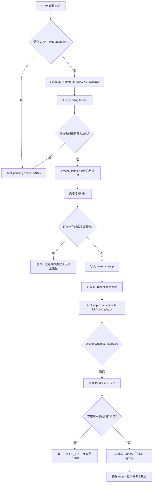

---


title: "Cached App Freezer、外部页回收与 GC 边界"
chapter: "4.11"
section: "4.11"
status: ready-for-review
applicable_versions: "Android 11 (API 30) - Android 17 (API 37); 16KB Page Size 从 Android 15 起覆盖设备侧兼容"
last_verified: "2026-08-03"
last_verified_against: "AOSP android-17.0.0_r1 frameworks/base services/core/java/com/android/server/am/psc/Constants.java, psc/OomAdjuster.java, ActivityManagerConstants.java, ActivityManagerService.java, CachedAppOptimizer.java, AppProfiler.java; frameworks/base/core/java/android/app/ActivityThread.java; ART art/runtime/gc/heap.cc; Android official docs 2026-08"
confidence: medium-high
pipeline_stage: ready-for-review
tags: [cached-app-freezer, gc, lmkd, oom-adj, binder-freezer, memory]
related_chapters: ["1.18", "4.2", "4.3", "4.4", "4.7", "5.8", "20.5", "26.8"]
sources:
  - type: official
    path: "https://source.android.com/docs/core/perf/cached-apps-freezer"
  - type: official
    path: "https://source.android.com/docs/core/architecture/ipc/binder-freezer"
  - type: official
    path: "https://developer.android.com/guide/components/activities/process-lifecycle"
  - type: official
    path: "https://developer.android.com/topic/performance/memory-management"
  - type: official
    path: "https://developer.android.com/guide/practices/page-sizes"
  - type: official
    path: "https://developer.android.com/reference/android/os/IBinder"
  - type: official
    path: "https://developer.android.com/reference/android/app/ApplicationExitInfo"
  - type: aosp
    path: "frameworks/base/services/core/java/com/android/server/am/psc/Constants.java"
  - type: aosp
    path: "frameworks/base/services/core/java/com/android/server/am/ActivityManagerConstants.java"
  - type: aosp
    path: "frameworks/base/services/core/java/com/android/server/am/psc/OomAdjuster.java"
  - type: aosp
    path: "frameworks/base/services/core/java/com/android/server/am/CachedAppOptimizer.java"
  - type: aosp
    path: "frameworks/base/services/core/jni/com_android_server_am_CachedAppOptimizer.cpp"
  - type: aosp
    path: "system/core/libprocessgroup/profiles/task_profiles.json"
  - type: aosp
    path: "art/runtime/gc/heap.cc"
  - type: research
    path: "DeepResearch/2026-05-19-android-cached-app-freezer-gc-trigger.md"
task6_state: ready-for-review
task9_state: ready-for-review
task2b_state: fixed
last_rework_at: "2026-08-03T21:35:04+08:00"
last_rework_run_id: "20260803-213504-rework-1a73105a"
last_consolidated_at: "2026-08-11"
consolidated_from:
  - "src/part1-fundamentals/ch04-memory/04.20-android17-memory-compaction-freezer-performance-impact.md"
---

# 4.11 Cached App Freezer、外部页回收与 GC 边界

## 先分清四种机制

缓存应用冻结器（Cached App Freezer）面向已经进入缓存状态、暂时不需要执行代码的进程。它通过控制组冻结器（cgroup freezer）暂停这些进程的线程调度，以减少后台 CPU 时间和电量消耗。进程仍然存在，地址空间、Java 堆、原生堆、文件描述符和运行时状态也都保留。

这和 GC、页回收、LMKD 的职责不同：

| 机制 | 执行者 | 主要动作 | 能否释放应用占用的内存 |
| --- | --- | --- | --- |
| 缓存应用冻结器 | `system_server`、Binder 驱动、控制组冻结器 | 暂停或恢复进程线程 | 冻结动作本身不能 |
| ART GC | 应用进程内的 ART | 回收不可达 Java 对象，必要时整理受管理堆 | 可以，范围主要是受管理堆 |
| 页面回收 / ZRAM | 内核或系统内存服务 | 回收文件页、换出匿名页、对进程执行内存优化 | 可以减少驻留物理页 |
| LMKD | `lmkd` 与内核压力信号 | 终止低优先级进程 | 可以释放整个进程的资源 |

官方文档也明确说明：冻结进程的所有线程都会暂停，因而无法执行 GC，也无法处理内存整理回调。Android 17 源码还允许系统在冻结成功后，从进程外部执行应用页面回收和 ZRAM 写回。这些动作会改变 RSS 或匿名页所在位置，但不表示 ART 在冻结区间内执行了 GC。

因此，看到以下现象时不要只凭时间相邻建立因果关系：

- 退到后台后出现 GC：可能是应用进入后台后的运行时请求，也可能由 ART 原有的堆水位触发。
- `dumpsys meminfo` 中 RSS 下降：可能来自应用页面回收、内核页回收或 ZRAM 写回。
- 回到前台后表现得像重启：先确认进程是否仍在，再检查冻结、LMK、崩溃和系统回收记录。
- CPU 时间在后台突然停止增长：这是冻结器最直接的观测特征。

平台基线是 Android 17 / API 37 / `android-17.0.0_r1`，内核基线是 `android17-6.18-2026-06_r6`。

## Android 17 如何判断进程能否冻结

### OOM adj 仍是输入，但不再由 `getFreezePolicy()` 直接比较

Android 17 将 ActivityManager 的进程状态计算代码移到了 `com.android.server.am.psc` 包。相关常量也位于：

```text
frameworks/base/services/core/java/com/android/server/am/psc/Constants.java
```

这条路径用于定位 Android 17 的进程优先级常量。几个关键值如下：

| 常量 | Android 17 的值 | 含义 |
| --- | ---: | --- |
| `HOME_APP_ADJ` | `600` | 桌面进程的典型 adj |
| `CACHED_APP_MIN_ADJ` | `900` | 缓存进程区间起点 |
| `CACHED_APP_LMK_FIRST_ADJ` | `950` | 缓存进程中优先交给 LMK 处理的区段起点 |
| `CACHED_APP_MAX_ADJ` | `999` | 缓存进程区间末端 |

`ActivityManagerConstants.DEFAULT_FREEZER_CUTOFF_ADJ` 默认采用 `CACHED_APP_MIN_ADJ`。启用实验性的激进冻结开关 `prototypeAggressiveFreezing` 时，默认值可以降到 `HOME_APP_ADJ`。运行时还可以通过 DeviceConfig 的 `freezer_cutoff_adj` 调整，并传给进程状态控制器。

Android 17 的关键变化在 `psc/OomAdjuster.java`：

1. `getCpuTimeReasons()` 根据进程负责的工作赋予显式 `PROCESS_CAPABILITY_CPU_TIME`。电源白名单、前台或顶部 Activity、正在执行的 Service、前台服务、广播接收、Instrumentation 等都可能成为需要 CPU 时间的理由。
2. `getImplicitCpuCapability(app, adj)` 检查 `adj < mFreezerCutoffAdj`，以及进程的 `maxAdj` 是否低于阈值。命中时赋予 `PROCESS_CAPABILITY_IMPLICIT_CPU_TIME`。
3. `getFreezePolicy()` 检查显式或隐式 CPU 时间能力（capability）。只要进程仍需要 CPU 时间，就返回不可冻结；两项都没有时才返回可冻结。
4. `updateAppFreezeStateLSP()` 把结果交给 ActivityManagerService 的 `onProcessFreezabilityChanged()` 回调。回调根据策略安排延迟冻结，或取消待处理冻结并解冻进程。

下面的伪代码只表达判断关系，省略了锁、性能轨迹和状态同步：

```java
capabilities |= getCpuTimeReasons(app, ...);
capabilities |= getImplicitCpuCapability(app, adj);

boolean canFreeze =
        (capabilities & (PROCESS_CAPABILITY_CPU_TIME
                | PROCESS_CAPABILITY_IMPLICIT_CPU_TIME)) == 0;
```

阅读源码时要把这段伪代码映射回 `psc/OomAdjuster.java`，不要把它复制成产品代码。它说明 adj 阈值在 Android 17 中会先转换为隐式 CPU 时间能力，再由 `getFreezePolicy()` 使用；“`getFreezePolicy()` 直接比较 `curAdj`”已经不符合这个版本的实现。

这也解释了为什么 `oom_score_adj >= 900` 不能单独证明进程会被冻结。进程可能因当前组件、绑定关系或系统策略仍持有 CPU 时间能力。反过来，冻结也不表示 LMKD 即将终止它：冻结器与 LMKD 共用一部分进程重要性输入，但执行动作和触发条件彼此独立。

### 文件锁与绑定豁免是附加约束

官方文档把若干豁免称为实现细节。例如，冻结进程若持有文件锁并阻塞不可冻结进程，系统会解除其冻结；带有 `BIND_WAIVE_PRIORITY` 的绑定关系也可能影响冻结处理。Android 17 的 `CachedAppOptimizer` 使用 `ProcLocksReader` 检查这类阻塞关系。

这些规则不能简化成应用侧稳定契约。应用仍应按“进入缓存状态后随时可能失去 CPU 时间”设计，不要通过文件锁、持续绑定或高频 IPC 规避冻结器。

## 从候选到冻结

Android 14 及以上的公开行为是：进程进入缓存状态约 10 秒后，系统可以将其冻结；生命周期事件到来时立即解冻。Android 17 源码用 `mFreezerDebounceTimeout` 控制防抖延迟，设备配置可能调整具体数值。因此，“10 秒”适合作为 AOSP 行为说明，排查某台设备时仍要读取其配置和性能轨迹。

下面的状态图用于定位关键分支：



图中 `scheduleTrimMemory()` 是一次跨 Binder 的异步请求。正常的防抖窗口通常给应用主线程留出了处理机会，但源码没有保证主线程严重阻塞时一定能在冻结前完成回调。因此，工程文档不能把时序写成“先完整执行内存整理，再冻结”。

### 冻结动作的准确顺序

`CachedAppOptimizer.freezeAppAsyncInternalLSP()` 在进程处于缓存 adj 区间时调用：

```java
thread.scheduleTrimMemory(ComponentCallbacks2.TRIM_MEMORY_BACKGROUND);
```

随后它把进程设为待处理冻结状态，并给 `FreezeHandler` 投递延迟消息。延迟到期后，`freezeProcess()` 主要执行以下步骤：

1. 再次确认进程仍处于待处理状态，没有覆盖冻结策略，PID 有效，而且尚未冻结。
2. 调用 `freezeBinder(pid, true, 0)` 冻结 Binder 接口。
3. 处理尚未完成的事务或 Binder 冻结失败。Android 17 包含重试和退避处理，不能概括成“遇到任意失败立即终止进程”。
4. 调用 `setProcessFrozen(pid, uid, true)` 将进程放入冻结控制组。
5. 更新进程优化状态，并把 PID 记入 `mFrozenProcesses`。
6. 再查询 Binder 冻结信息；若发现冻结期间出现待处理的同步事务，进入 Binder 失败处理。
7. 冻结成功后调用 `onProcessFrozen()`，按配置安排进程外部的内存优化。

Binder 先冻结，cgroup 随后冻结。这个顺序让 system_server 能在停止线程调度前处理 Binder 状态，并避免同步调用方无限等待。

### 解冻动作与失败分支

生命周期事件、组件变活、进程优先级提高或显式系统操作都可能触发解冻。`unfreezeAppInternalLSP()` 的关键顺序如下：

1. 取消尚未执行的 freeze 消息。
2. 查询 Binder freeze info。
3. 若冻结期间收到同步 Binder 事务，以 `ApplicationExitInfo.REASON_FREEZER` 及对应子原因终止服务端进程。
4. 查询失败也会进入保护性终止分支，避免留下无法确认 IPC 状态的进程。
5. 正常情况下先解冻 Binder，再解冻进程控制组。
6. 清除冻结标志并从 `mFrozenProcesses` 移除 PID。
7. 如果该进程的页面已写回 ZRAM，且解冻原因是 Activity 激活，可以请求预取这些页面。

最后一步是 Android 17 内存优化的重要补充：前台恢复前的 ZRAM 页面预取由 `system_server` 与 MMD 协作执行，和应用进程里的 ART GC 没有调用关系。

## Freezer 与 GC 的边界

### 冻结前：可能有内存整理，也可能有后台 GC

进程进入后台或缓存状态后，Framework 可以通过两类入口推动内存整理：

- `CachedAppOptimizer` 尝试发送 `TRIM_MEMORY_BACKGROUND`。
- `AppProfiler` 把进程加入后台 GC 队列，随后调用应用线程的 `processInBackground()`。`ActivityThread` 在主线程空闲时处理 `GC_WHEN_IDLE`，最终可以经 `BinderInternal.forceGc(reason)` 请求运行时 GC。

两者都发生在应用仍能获得 CPU 时间的阶段。请求已经发出不等于处理已经完成；主线程繁忙、进程状态再次变化或防抖配置都会改变最终时序。

官方文档使用“系统可能在缓存后不久请求一次 GC”的表述，是为了保留这些条件。排障时应检查 GC 持续区间的起止时间，不能仅凭“进程刚退后台”就认定这次 GC 属于冻结流程。

### 冻结中：ART 的 GC 线程无法运行

进入冻结控制组后，应用进程中修改对象图的线程（mutator）、主线程、Binder 线程和 ART GC 守护线程都无法获得 CPU 时间。此时：

- 应用不能分配新对象；
- ART 不能推进并发 GC；
- 应用不能执行 `onTrimMemory()`；
- 应用自己的定时器、线程池和协程都不能继续运行。

“冻结区间内发生 GC”通常来自观测口径问题。常见情况包括：GC 持续区间在冻结前已经开始、性能轨迹时间戳对齐不准、进程解冻后补做工作，或者观察到的是 `system_server` 对该进程执行的外部内存优化。

### 解冻后：积压工作会改变 GC 时机

解冻后，已经到期的定时任务、排队的回调和新的前台分配可能集中出现。ART 会按当时的堆状态继续执行或重新请求 GC，所以 GC 持续区间紧跟 `Unfreeze` 并不罕见。

固定频率调度尤其危险。若应用假定后台每隔固定时间都能运行，冻结期间错过的多个周期可能在恢复时密集执行。官方冻结器文档建议不要依赖缓存进程的周期性执行；需要可靠后台工作的场景应使用合适的系统调度 API。

## ART 仍按堆状态决定 GC

Android 17 的 ART 基线是 `art/runtime/gc/heap.cc`。冻结器没有向 `Heap` 传入“当前已冻结”的开关，也没有改写 GC 水位公式。ART 仍围绕以下状态工作：

- `target_footprint_`：当前希望控制的堆占用目标；
- `concurrent_start_bytes_`：并发 GC 的启动水位；
- `GrowForUtilization()`：依据本轮 GC 后的存活量与目标利用率更新水位；
- `RequestConcurrentGC()`：请求并发收集；
- `CollectGarbageInternal(..., kGcCauseForAlloc, ...)`：分配压力或分配失败相关的收集；
- `UpdateProcessState()`：前台可感知性变化后调整收集器和后台行为。

`UpdateProcessState()` 值得单独说明。进程进入后台时，ART 可以切换收集器；对 CMC/CC 等收集器，满足分配量和内存状态条件时，`DoPendingCollectorTransition()` 可能执行全堆 GC 或受管理堆压缩整理。这属于进程状态对运行时策略的影响，仍然发生在应用能够运行的时段。

三项边界分别是：

1. 进入后台会影响 ART 的策略选择。
2. Framework 可能在冻结前请求运行时 GC。
3. cgroup 冻结动作不会在应用进程内执行 GC。

## 冻结后的应用页面回收也不是 ART GC

Android 17 的 `CachedAppOptimizer.onProcessFrozen()` 可以在进程冻结后触发 FULL 级应用页面回收。这里的 FULL 表示 `CachedAppOptimizer` 的进程内存优化级别，不等于 ART 全堆 GC，也不等于 Linux 伙伴系统为高阶页执行的物理页规整。

应按执行层次区分三个同名概念：

| 名称 | 所在层 | 处理对象 |
| --- | --- | --- |
| ART 压缩式 GC | 应用进程内的 ART | 受管理堆中的 Java 对象 |
| CachedAppOptimizer 应用页面回收 | `system_server` 对目标进程执行 | 目标进程的匿名页等映射 |
| Linux 物理页规整 | 内核页分配与内存管理 | 物理页块，目标是形成连续空闲页 |

Android 17 还将内存管理守护进程 MMD 引入这类流程。按设备配置，冻结后可以安排按进程 ZRAM 写回，把匿名页从 ZRAM 写入后备存储设备；进程因 Activity 激活而解冻时，可以预取先前写回的页面。由此可以得到两个诊断结论：

- 冻结进程的 RSS、交换空间或 ZRAM 指标仍可能变化，因为执行者位于进程外部；
- 恢复耗时可能受页面重新读入影响，需要把解冻、主缺页、ZRAM I/O 和 Activity 启动放到同一时间轴。

这些功能受开关、设备存储和产品配置约束。AOSP 存在实现不代表每台 Android 17 设备都启用了相同策略。

### 应用页面回收的档位与执行后端

`CachedAppOptimizer.CompactProfile` 描述要处理的映射范围：`SOME` 偏向文件页，`ANON` 偏向匿名页，`FULL` 同时覆盖两者。这里的 profile 是回收档位，不是持久进程配置，也不等于 ART 的年轻代或全堆 GC。

Android 17 有两类执行后端：

- 逐虚拟内存区域（VMA）后端读取目标进程的内存映射，使用 `process_madvise()` 分批提交；文件页常用 `MADV_COLD`，匿名页常用 `MADV_PAGEOUT`。一次进程级请求可能拆成多次系统调用。
- `use_memcg_for_compaction` 开启且任务配置可用时，通过 `CompactFull`、`CompactAnon` 或 `CompactFile` 把目标内存控制组的 `memory.current` 写入 `memory.reclaim`，并用交换倾向参数 `swappiness` 偏向匿名页或文件页；不支持时改用逐 VMA 后端。

`memory.reclaim` 是主动回收接口，内核实际回收量可以少于或多于请求量，少于请求量时可返回 `EAGAIN`。该开关只改变执行后端，不会把触发条件改成按进程 PSI，也不会跳过 OOM adj、冻结完成、RSS 和时间节流条件。

Android 17 的 `ENABLE_SHARED_AND_CODE_COMPACT` 在该源码标签下为 `false`。档位解析可能把 `FULL` 收窄为 `ANON`，把 `SOME` 变成 `NONE`；剩余交换空间较少时，`FULL` 还可能先降级。因此，应以解析后的档位和实际结果解释，不能只看最初的请求名。

### 监控端如何解释冻结区间

冻结器的 ATrace 事件是瞬时事件，`dur` 不能当作冻结时长。应按同一 PID 配对 `Freeze` 与下一条 `Unfreeze`，并在可访问时用目标控制组的 `cgroup.events:frozen` 确认内核已完成冻结。`/proc/<pid>/status` 中的 `D` 表示不可中断睡眠，不是冻结器专用状态。

进程内监控在线程被冻结后无法继续写日志或采样。解冻后的首个回调会观察到很大的墙钟时间间隔；帧率与看门狗应把这段空洞标为后台冻结，并重置时间基线，不能填成 0 FPS 或一帧持续数分钟。RSS/PSS 在冻结期间仍可能因外部页面回收、ZRAM 写回或共享页分摊变化而改变。

`am_compact`、`am_freeze`、`am_unfreeze` EventLog，以及 `AM_COMPACT` 记录的前后 RSS、解析后动作、耗时与 ZRAM 差值，适合与 Perfetto、控制组状态和应用恢复时间交叉验证。一次 `FULL` 请求不能证明原生层最终执行了 `MADV_PAGEOUT` 或内存控制组回收。

## Binder Freezer 决定 IPC 如何失败

线程被冻结以后，普通 Binder 行为可能让调用方无限等待。Binder 冻结机制为同步和异步事务规定了不同处理：

| IPC 类型 | 目标处于冻结状态时的行为 | 应用侧风险 |
| --- | --- | --- |
| 同步事务 | 系统终止已冻结的服务端，避免调用方无限阻塞 | 调用方收到远端死亡通知或 `RemoteException`；服务端记录冻结器退出原因 |
| `oneway` 异步事务 | 事务暂存在目标进程的异步缓冲区，解冻后处理 | 缓冲区溢出可能导致服务端退出；旧事件恢复后可能已经失效 |
| 持续回调 | 由协议设计决定丢弃、合并或排队 | 解冻后事件突发、重复刷新和主线程拥塞 |

### API 36 起可以监听远端冻结状态

`IBinder.addFrozenStateChangeCallback()` 从 API 36 开始提供。调用方可以监听远端 Binder 所在进程的冻结或解冻状态，但使用时要注意三个边界：

- 只适用于远端 Binder；本地 Binder 与监听者处于同一进程。
- 状态变化可能合并，回调适合获取最新状态，不适合统计每一次切换。
- Binder 驱动不支持相关能力时，注册可能抛出 `UnsupportedOperationException`。

API 36 还提供了 `RemoteCallbackList.Builder` 的冻结接收方策略：

- `FROZEN_CALLEE_POLICY_DROP`：目标冻结时丢弃回调。
- `FROZEN_CALLEE_POLICY_ENQUEUE_MOST_RECENT`：只保留最新回调。
- `FROZEN_CALLEE_POLICY_ENQUEUE_ALL`：保留全部回调。

大多数“状态刷新”适合只保留最新值；必须逐条处理的事件才考虑全部排队，并且需要评估冻结时间和队列上限。Binder 协议层的详细分析见 §1.18。

### 其他冻结期行为

Android 14 及以上的公开规则同样适用于 Android 17：

- 通过 Context 动态注册的广播会在进程处于缓存状态时排队；
- 清单中声明的广播接收器可以使进程解冻并接收广播；
- 应用的所有进程都被冻结后，活动 TCP 套接字会被终止；
- 可见 Activity 退后台时可以收到 `TRIM_MEMORY_UI_HIDDEN`；
- 某些非 UI 生命周期变化可以收到 `TRIM_MEMORY_BACKGROUND`；
- 冻结期间无法继续响应其他内存整理事件。

这些规则要求应用把缓存进程视为随时可能暂停、也随时可能被终止。内存中的单例、尚未持久化的状态和长连接都不能充当可靠的持久化机制。

## 16 KB 页不会改变冻结资格

16 KB 页大小从 Android 15 起进入设备兼容范围。它影响 ELF 段对齐、原生库兼容、页表开销、TLB 覆盖、缺页和 RSS/PSS 的计量粒度。页更大时，同样的映射和碎片模式可能呈现不同的驻留内存数值。

Android 17 相关源码的边界如下：

- `psc/OomAdjuster.java` 的 CPU 时间能力与冻结资格判断没有页大小分支；
- `CachedAppOptimizer.java` 的 Binder/控制组冻结状态机没有页大小分支；
- ART `heap.cc` 会按运行时页大小处理对齐和内存范围，但没有让冻结器改写 GC 触发条件；
- Linux 控制组冻结器的语义是停止任务调度，与基础页大小无关。

因此，16 KB 页设备上的 RSS、ZRAM 写入量、缺页数可能与 4 KB 页设备不同，不能由这些数值变化推导出冻结策略改变。比较设备时，应同时记录页大小：

```bash
adb shell getconf PAGE_SIZE
adb shell getprop ro.product.cpu.abilist
```

第一条命令确认运行时基础页大小，第二条命令用于补充 ABI 环境。它们只提供分析上下文，不能判断某个进程是否被冻结。

## 线上诊断：先确定状态，再解释内存

### 第一步：确认进程是否仍然存在

先取得 PID，并检查历史退出原因。`ActivityManager.getHistoricalProcessExitReasons()` 返回的 `ApplicationExitInfo` 可以区分多类退出：

- `REASON_FREEZER` 从 API 33 提供，表示冻结器相关终止，例如已冻结的服务端收到同步 Binder 事务；
- `REASON_LOW_MEMORY` 表示低内存终止；
- 部分设备不支持精确报告低内存终止，此时可能显示为 `REASON_SIGNALED` 与 `SIGKILL`。应用可以先检查 `ActivityManager.isLowMemoryKillReportSupported()`。

这一步能避免把进程死亡后的重建耗时归给解冻。`REASON_FREEZER` 也不表示系统因内存压力主动终止进程，它更常指向冻结期间的不安全 IPC。

### 第二步：检查冻结器状态和配置

下面的命令用于开发机复现和状态确认：

```bash
adb shell dumpsys activity | grep -A 20 "Apps frozen:"
adb shell am freeze <PACKAGE_OR_PROCESS>
adb shell am unfreeze <PACKAGE_OR_PROCESS>
adb logcat | grep -iE "freez|cachedappoptimizer"
```

`am freeze` 与 `am unfreeze` 适合受控实验。不同构建类型和版本的 shell 子命令可能有权限或参数差异，自动化脚本应先检查命令返回值。

### 第三步：在 Perfetto 中对齐事件

官方文档说明冻结器事件可出现在 `system_server` 的 `Freezer` 轨道中。关注：

- `updateAppFreezeStateLSP`：重新评估进程是否可冻结；
- `Freeze` / `Unfreeze`：实际状态切换；
- Activity 启动：用户恢复界面的时间；
- ART GC：GC 是否发生在冻结前或解冻后；
- LMKD、PSI、ZRAM 与缺页：是否同时发生内存压力或页面换入。

以下 SQL 用于从性能轨迹中筛出 `system_server` 的冻结事件：

```sql
INCLUDE PERFETTO MODULE slices.with_context;

SELECT
  ts,
  dur,
  process_name,
  track_name,
  name
FROM process_slice
WHERE process_name = 'system_server'
  AND track_name = 'Freezer'
  AND (
    name LIKE 'Freeze %'
    OR name LIKE 'Unfreeze %'
    OR name LIKE 'updateAppFreezeStateLSP%'
  )
ORDER BY ts;
```

查询结果只证明 `system_server` 记录了冻结器事件。还要按 PID 和时间窗口关联线程调度、进程退出、GC 与页面 I/O，才能说明用户看到的停顿来自哪里。

### 第四步：按证据分类

| 观测组合 | 更可能的解释 | 下一步 |
| --- | --- | --- |
| `Freeze` 后 CPU 活动消失，PID 未变 | 正常冻结 | 检查解冻入口和恢复耗时 |
| 冻结后出现 `REASON_FREEZER` | 冻结期间发生不安全同步 IPC 或 Binder 异常 | 查 Binder 调用方、死亡通知与协议设计 |
| 进程退出且记录 low-memory 原因 | LMKD/低内存终止 | 查 PSI、lmkd、adj 与设备内存压力 |
| 冻结期间 RSS 或交换空间变化，应用无 CPU | 外部应用页面回收、内核页回收或 ZRAM 写回 | 查 MMD、ZRAM 与内核事件 |
| `Unfreeze` 后立即 GC 和大量分配 | 恢复后的积压工作或前台分配 | 查回调、定时任务、Activity 初始化 |
| PID 变化并重新创建 Application | 进程重建 | 按退出原因分析，不能只查冻结器 |

## 版本演进到 Android 17

| Android 版本 | 冻结器与内存管理变化 |
| --- | --- |
| Android 11 / API 30 | 引入缓存应用冻结器，设备是否启用与产品配置有关 |
| Android 13 / API 33 | 缓存进程可能获得很少或没有执行时间；`REASON_FREEZER` 成为公开退出原因 |
| Android 14 / API 34 | 进入缓存状态约 10 秒后冻结、生命周期事件解冻、广播排队等行为更加稳定 |
| Android 15 / API 35 | 16 KB 页大小进入设备侧兼容范围；它不改变冻结器的调度语义 |
| Android 16 / API 36 | `IBinder.addFrozenStateChangeCallback()` 与冻结接收方回调策略成为公开 API |
| Android 17 / API 37 | 冻结资格在 `psc/OomAdjuster` 中通过 CPU 时间能力表达；`CachedAppOptimizer` 的冻结后优化与 MMD/ZRAM 协作需要纳入诊断 |

版本表只描述公开行为和已核对的 AOSP 实现。设备厂商可以调整开关、防抖时间、阈值和内存优化功能；没有该设备的配置、性能轨迹或源码时，不应把某个系统镜像的表现写成 Android 17 的统一行为。

## 工程实践

### 应用开发

- 不要假定缓存进程能持续执行线程、定时器或协程。
- 需要可靠执行的后台工作使用系统认可的组件，并遵守相应限制。
- 跨进程同步调用要处理远端死亡，不能假定已绑定的服务始终可运行。
- 高频回调采用丢弃或只保留最新值策略，避免解冻后集中分发。
- 关键状态及时持久化；进程可能从冻结状态直接转为被终止。
- 对 API 36+ 的冻结状态回调做版本检查，并处理驱动不支持的异常。

### 系统与性能排查

- 记录 PID、UID、进程状态、adj、CPU 时间能力、待处理和冻结状态。
- 同时观察 Freezer 轨道、Binder 失败、ART GC、PSI、LMKD、ZRAM 与缺页。
- 区分 ART 压缩式 GC、应用页面回收和内核物理页规整。
- 对比设备时记录 Android 源码标签、内核源码标签、页大小和冻结器/MMD 配置。
- 结论中写明事件顺序和证据来源，避免用“回前台慢”反推单一原因。

## 小结

Android 17 的缓存应用冻结器可以概括为一条清晰的状态转换：

1. OOM 调整阶段根据进程当前职责和 adj 计算显式、隐式 CPU 时间能力。
2. 没有 CPU 时间需求的进程进入延迟冻结候选。
3. `CachedAppOptimizer` 尝试发送后台内存整理回调，随后先冻结 Binder，再冻结控制组。
4. 冻结区间内应用所有线程停止，ART 无法执行 GC。
5. `system_server`、MMD 和内核仍可从进程外部执行应用页面回收、内核页回收或 ZRAM 操作。
6. 激活时先检查 Binder 状态，再恢复 Binder 和进程调度；不安全的同步事务可能以 `REASON_FREEZER` 结束进程。

把冻结器、ART GC、外部内存优化和 LMKD 分开观察，才能解释“退后台后内存下降”“回前台触发 GC”“像冷启动”这些表面相似的现象。

## 参考资料

- Android Cached Apps Freezer：<https://source.android.com/docs/core/perf/cached-apps-freezer>
- Android Binder Freezer：<https://source.android.com/docs/core/architecture/ipc/binder-freezer>
- Android MMD：<https://source.android.com/docs/core/perf/mmd>
- `IBinder` API：<https://developer.android.com/reference/android/os/IBinder>
- `ApplicationExitInfo` API：<https://developer.android.com/reference/android/app/ApplicationExitInfo>
- AOSP `android-17.0.0_r1`：
  - `frameworks/base/services/core/java/com/android/server/am/psc/Constants.java`
  - `frameworks/base/services/core/java/com/android/server/am/psc/OomAdjuster.java`
  - `frameworks/base/services/core/java/com/android/server/am/ActivityManagerConstants.java`
  - `frameworks/base/services/core/java/com/android/server/am/ActivityManagerService.java`
  - `frameworks/base/services/core/java/com/android/server/am/CachedAppOptimizer.java`
  - `frameworks/base/core/java/android/app/ActivityThread.java`
  - `frameworks/base/services/core/java/com/android/server/am/AppProfiler.java`
- ART `android-17.0.0_r1`：`art/runtime/gc/heap.cc`
- Android common kernel `android17-6.18-2026-06_r6`：cgroup freezer 与内存回收相关实现
