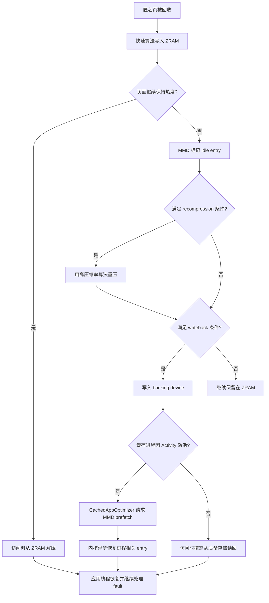

# 4.12 ZRAM 压缩交换与应用重启延迟

## 先判断进程还在不在

讨论 ZRAM 对应用恢复耗时的影响，应先确认原进程是否仍然存在，再看 `VmSwap`。两种场景的执行成本完全不同：

| 场景 | pid | 主要成本 | ZRAM 与本次恢复的关系 |
| --- | --- | --- | --- |
| 进程存活，部分匿名页在 ZRAM | 不变 | swap fault、解压、可能的 backing-device 读取，以及恢复后的业务工作 | 直接相关 |
| 进程已被 LMKD 或其他机制杀死 | 改变 | 创建进程、初始化 runtime、加载代码和资源、重建组件 | 旧进程的 ZRAM 页面已随 swap slot 清理，不构成本次新进程的直接恢复路径 |

Android 的冷启动、温启动和热启动是 Activity 启动分类；论文和系统优化语境中的 relaunch 更宽，可能包含从后台任务恢复、Activity 重建或进程重建。这里用“换入恢复”表示 pid 不变且需要重新触碰 swapped page，用“冷启动”表示原进程已经死亡。

这个区分很重要。用户感觉“像冷启动”只描述了体验，不能证明进程发生过重建。应先记录 pid、`ApplicationExitInfo` 与 Activity 启动类型，再分析 swap。

平台基线是 Android 17 / API 37 / `android-17.0.0_r1`，内核基线是 `android17-6.18-2026-06_r6`。

## ZRAM 位于匿名页回收与进程淘汰之间

### 文件页与匿名页的后备来源不同

干净 file-backed page 已经有文件作为后备来源。内存不足时，内核可以丢弃这些物理页；再次访问时从 APK、DEX、so 或其他文件重新读取。修改过的文件页需要先写回，或者按映射语义处理。

anonymous page 没有可直接重读的原始文件。Java Heap、Native Heap 和匿名 `mmap` 中的大量数据都属于这一类。要在保留进程状态的同时释放原始物理页，内核可以把页面写入 swap。Android 通常把 ZRAM 块设备作为 swap：

1. 回收器选中可换出的匿名页。
2. swap 层为页面分配 swap entry。
3. ZRAM 驱动按基础页大小接收内容并尝试压缩。
4. 压缩对象存入 zsmalloc pool；压缩效果很差的页面按 incompressible/huge 处理。
5. 进程页表保存 swap entry，原物理页可以释放。
6. 进程再次访问该虚拟地址时发生 swap fault，页面从 ZRAM 解压并恢复。

这个过程以 CPU 时间换取容量。压缩率越高，同一段 RAM 可以保存更多匿名数据；算法越复杂，压缩与解压占用的 CPU 通常越多。ZRAM 仍然消耗 RAM，还包括 allocator 碎片、元数据和压缩上下文，因此 `SwapTotal - SwapFree` 不能直接当作节省的物理内存。

### ZRAM、writeback 与磁盘 swap 的成本等级不同

Android 17 可以给 ZRAM 配置 backing device。冷的 ZRAM entry 被 writeback 后，压缩数据或页面内容离开 RAM，进入 `/data` 上的后备存储。之后恢复的成本取决于页面当前所在位置：

| 页面位置 | 恢复时的主要工作 | 常见瓶颈 |
| --- | --- | --- |
| ZRAM RAM 内 | 读取压缩对象并解压 | CPU、内存带宽、锁竞争 |
| backing device | 发起块 I/O，再把内容恢复到 ZRAM 或进程页面 | 存储延迟、队列竞争、解压 |
| swap cache | 可能复用已在内存中的页面 | 页表更新与普通 fault 处理 |

所以 `VmSwap` 相同的两个进程，恢复耗时也可能不同。还要知道对应页面有没有被 writeback、触碰顺序是否集中在首帧之前，以及设备当时的 CPU 与存储负载。

## Android 17 的管理者是 MMD

Android 17 引入 memory management daemon（`mmd`），负责 ZRAM 配置、recompression、writeback 与按进程维护。`system_server` 决定何时发起任务，MMD 通过 `IMmd` 接口接收请求并执行内核操作。这种分工把 Java 系统服务的调度决策和原生守护进程的内存操作分开。

Android 17 的主要数据流如下：



图中的 recompression、writeback 和 per-process prefetch 都依赖内核能力、系统属性、后备存储与产品配置。Android 17 提供了实现，设备未必全部启用。

### 启动配置

开机完成后，`mmd_setup` 可以按属性配置 ZRAM，随后启动 `mmd` 处理持续维护。常用配置项包括：

- `mmd.zram.enabled`：是否由 MMD 配置 ZRAM，默认关闭；
- `mmd.zram.num_devices`：ZRAM 设备数量，默认一个；
- `mmd.zram.size`：设备容量，默认可按 RAM 比例设置；
- `mmd.zram.comp_algorithm`：首轮压缩算法；
- `mmd.zram.recompression.enabled`：是否启用重压；
- `mmd.zram.recompression.algorithm`：次级算法，官方文档默认值为 `zstd`；
- `mmd.zram.writeback.enabled`：是否配置并使用后备存储。

启用 `mmd.zram.enabled` 后，`swapon_all` 中的 ZRAM setup 变为空操作，旧 overlay `config_zramWriteback` 和 `ro.zram.*` writeback 属性也会被忽略。因此，Android 17 排障不能只检查历史 `ZramWriteback` 属性；要先确认设备使用 MMD 还是旧方案。

### 全局维护

`com.android.server.memory.ZramMaintenance` 通过 JobScheduler 周期性发起维护。AOSP 默认要求设备 idle 且电量不低，减少维护工作与前台交互争用。任务触发后：

1. `system_server` 异步调用 `mmd.doZramMaintenanceAsync()`。
2. MMD 把任务放入低优先级工作队列。
3. MMD 先处理 recompression，再处理 writeback。
4. 高优先级的按进程 prefetch 可以先于低优先级维护执行。

维护不应理解为持续扫描。官方默认首次和周期调度均为一小时，recompression 与 writeback 还有各自的 backoff、idle age、容量门槛和每日写入预算。产品可以调整这些值。

### 按进程 writeback 与 prefetch

Android 17 的 `CachedAppOptimizer` 把 freezer 与 MMD 接到一起：

1. cached 进程冻结成功后，可以先执行 full app compaction。
2. compaction 完成后，延迟投递 `ZRAM_WRITEBACK_MSG`。消息处理阶段要求进程承载 Activity、swap RSS 低于配置阈值，并且 GPU、DMA-BUF 内存没有超过各自阈值。
3. `system_server` 用 pidfd 标识目标进程，调用 `mmd.asyncWritebackProcessZramMemory()`。
4. MMD 通过 Android ZRAM ioctl 扫描该进程页表，选出指向目标 ZRAM 的 swap entry。
5. 回调成功后，ActivityManager 标记 `isZramWrittenBack`。下一轮 OOM 调整会用 `min(adj, zramWritebackAdj)` 计算只发送给 LMKD 的 adj；AOSP 默认 `zramWritebackAdj` 为 `249`，因此该进程在 written-back 状态下得到更强的 LMKD 保护。解冻时此标记会被清除。
6. 进程因 Activity 激活而解冻时，`CachedAppOptimizer.prefetchZram()` 调用 `mmd.asyncPrefetchProcessZramMemory()`。

pidfd 避免了只用整数 pid 带来的复用问题。写回和预取都是异步请求，目标进程可能在执行前退出，后备设备也可能空间不足；这些都属于预期失败分支。

## Kernel 6.18 的 ZRAM 实现

### 驱动拆分与压缩后端

在 `android17-6.18-2026-06_r6` 中，ZRAM 已位于 `drivers/block/zram/`，核心文件按职责拆分：

```text
drivers/block/zram/
├── zram_drv.c
├── zram_drv.h
├── zram_ioctl.c
├── zcomp.c
├── backend_lzo.c
├── backend_lzorle.c
├── backend_lz4.c
├── backend_lz4hc.c
├── backend_zstd.c
├── backend_deflate.c
└── backend_842.c
```

这份目录用于源码定位。`zcomp.c` 通过 `backends[]` 注册编译时启用的实现，每个后端提供统一的 `zcomp_ops`。Kconfig 默认 compressor 是 `lzo-rle`；设备可以在构建和初始化阶段选择其他算法。`ZRAM_BACKEND_FORCE_LZO` 在其他后端均关闭时提供 LZO 兼容兜底。

### 一个 entry 对应一个基础页

`zcomp_compress()` 的输入长度是 `PAGE_SIZE`，ZRAM 设备的 slot 数也由 `disksize >> PAGE_SHIFT` 计算。压缩结果达到或超过 `zs_huge_class_size()` 时，`write_incompressible_page()` 将其标记为 `ZRAM_HUGE`，按未压缩页面保存；若配置 writeback，后续维护可以把这类 entry 写到后备设备。

这解释了 `mm_stat` 中几个字段的关系：

- `orig_data_size`：ZRAM 中内容未压缩时的总大小；
- `compr_data_size`：压缩 payload 的大小；
- `mem_used_total`：zsmalloc、碎片和元数据共同占用的内存；
- `same_pages`：内容完全相同、无需分配普通压缩对象的页面；
- `huge_pages`：压缩收益不足的页面；
- `pages_compacted`：ZRAM 内部 allocator compact 释放的页面数。

评估压缩效率应看 `orig_data_size / mem_used_total` 和 `compr_data_size / mem_used_total`，不能只看 `compr_data_size`。

### 最多四个 compressor slot

启用 `CONFIG_ZRAM_MULTI_COMP` 时，Android 17 内核定义：

```c
#define ZRAM_PRIMARY_COMP   0U
#define ZRAM_SECONDARY_COMP 1U
#define ZRAM_MAX_COMPS      4U
```

这段定义说明单个 ZRAM 设备最多登记四个 compressor priority。每个 entry 用两个 priority bit 记录当前算法。`recompress_store()` 根据 `type` 参数筛选 idle、huge 或 huge+idle entry，并跳过以下情况：

- 已经 writeback；
- 内容为 same-filled page；
- 已被标记 incompressible；
- 已使用同级或更高优先级算法；
- 已在 per-process prefetch cache 中。

`recompress_slot()` 依次尝试更高优先级算法。新结果只有进入更小的 zsmalloc size class，并满足 threshold 条件时才替换旧对象。重压失败不会破坏旧对象；所有高优先级算法都无法带来收益时，可以标记 `ZRAM_INCOMPRESSIBLE`。

这一实现比“冷页统一改用 zstd”更精确。MMD 的默认次级算法可以是 zstd，驱动本身支持多个后端和优先级，最终可用组合取决于内核配置与设备属性。

### post-processing 串行化

recompression、writeback 与 prefetch 都属于 post-processing。驱动使用 `pp_in_progress` 阻止它们并发执行，避免同一 slot 的 backing block、压缩对象和页表扫描相互竞争。per-process prefetch 的注释还明确写到：prefetch 应优先于同一进程的 writeback，但当前实现通过 `pp_in_progress` 禁止并行。

slot 选择使用 `ZRAM_PP_SLOT` 作为保护标记。按进程 writeback 扫描页表时，即使 PTE 快照在解锁后变旧，后续写回前仍会检查该标记；slot 被访问、释放或覆盖时会清掉标记，从而阻止使用过期候选。

### per-process ioctl

`include/uapi/linux/zram_ioctl.h` 在 Android 17 内核定义了：

- `ZRAM_ANDROID_IOC_PROCESS_RANGE_WRITEBACK`；
- `ZRAM_ANDROID_IOC_PROCESS_PREFETCH`；
- 兼容旧调用的 `ZRAM_ANDROID_IOC_PROCESS_WRITEBACK`；
- `ZRAM_ANDROID_IOC_GET_VERSION`。

`zram_ioctl.c` 要求调用方具备 `CAP_SYS_NICE`，再通过 pidfd 获取目标 task 和 `mm_struct`。页表 walker 只选取属于当前 ZRAM 设备的 swap PTE。range writeback 支持 `start_addr`、扫描字节数和 `next_addr`，便于分段处理较大的地址空间。

prefetch 的内核执行分为三段：

1. `zram_prefetch_slots()` 选中已 writeback 的 slot，释放 slot lock 后发起 `REQ_OP_READ` bio。
2. `zram_prefetch_read_endio()` 在 I/O 完成时把后续工作投递到 `system_highpri_wq`，因为恢复到 zsmalloc pool 的操作可能睡眠。
3. `zram_deferred_prefetch()` 调用 `zram_populate_table()`；后者重新取得 slot lock，再次确认 `ZRAM_WB`，防止 I/O 期间 slot 已被释放或替换。

这个时序允许后备存储 I/O 期间释放 slot lock，同时用完成后的二次检查处理并发变化。

## 恢复耗时为什么容易出现长尾

### 页面触碰顺序比总量更重要

应用恢复时不会一次读回全部 swapped page。CPU 执行到某条指令并访问尚未驻留的虚拟页后，内核才处理 fault。以下页面若集中在首帧前被触碰，延迟更明显：

- Activity 与 View 层级的状态对象；
- 首屏 Bitmap、字体、Skia 或 GPU 资源相关的匿名数据；
- Java/Native allocator 的热点元数据；
- 数据库连接、序列化缓存和业务索引；
- Binder 恢复后立刻消费的大批 callback 数据。

同样是 100 MiB `SwapPss`，首帧前访问 5 MiB 热页和访问 40 MiB 热页的体验完全不同。`SwapPss` 适合描述当前归属，不足以预测恢复成本。

### ZRAM 命中和 backing-device 命中的成本不同

页面仍在 ZRAM 时，fault 主要付出调度、查找、分配目标页和解压成本。页面已经 writeback 时，还要等待后备设备 I/O。MMD 的 per-process prefetch 尝试在 Activity 主线程初始化期间异步读回相关 entry，减少后续同步 fault 等待；它不能保证全部页面在应用访问前就绪。

分析时可以把恢复窗口分为：

```text
Activity 解冻
  -> MMD 收到 prefetch 请求
  -> 内核扫描目标进程 swap PTE
  -> backing bio 与 high-priority deferred work
  -> 应用线程恢复执行
  -> 按页面触碰顺序继续发生 swap fault
  -> 首帧 / 完整显示
```

这段时序用于安排 trace 标记。prefetch 与应用初始化会重叠，不能把两者的耗时简单相加。

### CPU 与 I/O 竞争会放大延迟

ZRAM 解压消耗 CPU。低端设备或持续热负载下，解压可能和主线程、RenderThread、编译线程争用核心。writeback/prefetch 又会访问 `/data` 后备设备，可能与 APK、DEX、数据库和图片读取共享队列。单次 fault 很短时，数百次分散 fault 仍可能形成明显长尾。

## kswapd、direct reclaim 与 LMKD

### kswapd

空闲页低于水位后，`kswapd` 在后台扫描可回收页面，尝试把 zone 拉回目标水位。它不在应用主线程栈上，但会消耗 CPU、内存带宽，并竞争 LRU、memcg、swap 与文件系统资源。

### direct reclaim

分配线程无法及时获得页面时，可以在分配路径进入 direct reclaim。此时发起分配的线程会直接执行扫描、回写或 swap-out，并经历相应等待。若主线程或 RenderThread 命中 direct reclaim，用户更容易感知卡顿。

direct reclaim 和物理内存 compaction 也应分开。高阶页分配失败可能触发 compaction；它围绕物理页连续性工作，不等于 ZRAM recompression。

### LMKD

Android 17 的 `lmkd` 默认使用 PSI 事件感知任务因内存争用而停顿，再结合 watermark、swap、file-cache refault、thrashing 和进程 adj 选择牺牲进程。ZRAM 给系统争取时间和容量，LMKD 负责在压力不可接受时结束低优先级进程。

`lmkd.cpp` 的 `get_free_swap()` 还有一个 Android 特有修正：

```cpp
return std::min(
        free_swap,
        easy_available * swap_compression_ratio / swap_compression_ratio_div);
```

这段简化代码用于说明计算意图。ZRAM 的可用 swap 受可用内存与压缩率约束，不能把设备声明的空闲 swap 当成独立磁盘容量。Android 17 的 LMKD 还会组合以下参数：

- `ro.lmk.swap_free_low_percentage`；
- `ro.lmk.swap_compression_ratio`；
- `ro.lmk.swap_util_max`；
- `ro.lmk.thrashing_limit` 与 critical/decay 参数；
- `ro.lmk.psi_partial_stall_ms`；
- `ro.lmk.psi_complete_stall_ms`；
- `ro.lmk.direct_reclaim_threshold_ms`。

这些值影响设备何时认为 swap 过低、何时因 thrashing 或 direct reclaim 选择杀进程。排查具体设备要读取实际属性，不能只引用 AOSP 默认值。

## 16KB Page Size 的准确影响

Android 17 同时支持 4KB 与 16KB 基础页设备。ZRAM 驱动按 `PAGE_SIZE` 压缩一个 entry，因此 16KB 设备有几个可直接从源码推出的差异：

- 单个 ZRAM slot 对应 16KB 未压缩内容；
- 一次 swap fault 的基础恢复粒度变大；
- `huge_class_size`、zsmalloc size class 与压缩结果都在新的页大小下计算；
- 同样的虚拟地址范围需要的 PTE 和 slot 数减少；
- 页面内部只使用一小部分数据时，换入的额外字节可能增加。

这不表示恢复延迟固定变成 4KB 设备的四倍。页数减少、TLB 覆盖增加、算法吞吐、压缩率、触碰局部性和存储队列都会影响结果。对比设备时至少记录：

```bash
adb shell getconf PAGE_SIZE
adb shell cat /sys/block/zram0/disksize
adb shell cat /sys/block/zram0/comp_algorithm
adb shell cat /sys/block/zram0/mm_stat
```

第一条确认基础页大小，后三条确认 ZRAM 容量、算法和当前内存效率。不同页大小下，按 slot 数直接对比会误导，应优先换算成字节。

## MGLRU 影响“选谁回收”，不负责解压

MGLRU 用 generation 表达页面访问年龄，改进回收器的冷热页选择。它可能影响哪些匿名页先进入 swap、哪些 file-backed page 先被丢弃，从而间接改变应用恢复时需要触碰的 swapped working set。

MGLRU 不执行 ZRAM 解压，也不决定 LMKD 最终杀哪个进程。设备是否启用 MGLRU 取决于内核配置和运行时设置，Android API level 无法单独证明启用状态。诊断文档应记录 kernel tag、`CONFIG_LRU_GEN` 和运行时状态，避免只写“Android 17 默认使用某种 LRU”。

## Ariadne：研究结果与 AOSP 边界

Ariadne 是 HPCA 2025 论文提出的研究系统，针对普通 ZRAM 不区分数据热度、固定压缩粒度和按需解压带来的恢复成本，提出三项设计：

1. hotness-aware organization：按恢复访问历史识别热、温、冷匿名数据；
2. size-adaptive compression：热数据使用更小压缩块获得更快解压，冷数据用更大块换取压缩率；
3. proactive decompression：根据访问局部性预测下一批页面并提前解压。

论文在 Pixel 7 上报告，相比其基线 ZRAM，平均应用 relaunch latency 降低 50%，压缩/解压 CPU 使用降低 15%。这些数字只适用于论文的设备、Android 14 软件栈、应用集合和实验配置，不能直接外推到 Android 17 产品。

Android 17 的 per-process writeback/prefetch 与 Ariadne 的“提前准备热数据”方向相近，机制并不相同：

| 对比项 | Android 17 MMD + ZRAM | Ariadne |
| --- | --- | --- |
| AOSP 状态 | 已有公开文档与源码 | 研究原型 |
| 目标选择 | 进程、idle age、entry 类型与配置阈值 | 数据热度与恢复访问历史 |
| 压缩粒度 | 基础页 entry，支持多个 compressor priority | 按热度使用自适应 chunk size |
| 提前恢复 | Activity 解冻时按进程 prefetch 已 writeback entry | 预测下一批将访问的数据并主动解压 |

截至 Android 17 基线，没有证据表明 Ariadne 以论文中的完整设计合入 AOSP。可以用它解释研究方向，不应把其性能数字写成系统承诺。

## 观测：把交换、压力和启动放到同一时间窗

### 设备快照

下面的命令分别收集系统压力、swap 总量、目标进程归属和 ZRAM 设备效率：

```bash
adb shell cat /proc/pressure/memory
adb shell cat /proc/meminfo
adb shell cat /proc/vmstat
adb shell cat /proc/<PID>/status
adb shell cat /proc/<PID>/smaps_rollup
adb shell cat /sys/block/zram0/mm_stat
adb shell cat /sys/block/zram0/bd_stat
adb shell getprop | grep -E 'mmd\\.zram|mm\\.zram|ro\\.lmk'
adb shell dumpsys -l | grep mmd
```

这些命令的采样时刻要记录下来。一次快照只能描述当前值；为了判断恢复成本，需要在后台稳定期、点击恢复前、首帧后分别采样或使用 trace。

重点字段包括：

| 入口 | 字段 | 用途 |
| --- | --- | --- |
| `/proc/<pid>/status` | `VmRSS`、`VmSwap` | 进程驻留与 swap 总量 |
| `smaps_rollup` / meminfo | `Pss`、`SwapPss`、Private Dirty | 归属和匿名 dirty 上下文 |
| `/proc/vmstat` | `pswpin`、`pswpout`、`pgmajfault`、`pgscan_*`、`workingset_refault*` | 交换、fault、扫描与 refault 的累计变化 |
| `/proc/pressure/memory` | `some`、`full` | 任务因内存压力停顿的时间 |
| ZRAM `mm_stat` | 原始量、压缩量、总占用、huge page | 压缩效率与 allocator 开销 |
| ZRAM `bd_stat` | backing count/read/write | writeback 与后备读取 |

`pgmajfault` 不能单独代表 ZRAM 换入。swap cache 命中、纯内存 ZRAM 与 backing-device I/O 的 fault 记账可能不同；应同时看 `pswpin`、ZRAM 统计、线程调度和 I/O。

### Perfetto

Perfetto 采集应覆盖以下类别：

- `linux.process_stats`：目标进程的内存计数；
- `linux.sys_stats`：meminfo 与 vmstat；
- `sched/sched_switch`：主线程、RenderThread、kswapd 和 MMD 的调度；
- 设备可用的 reclaim、compaction、block I/O 与 page-fault tracepoint；
- Activity launch、FrameTimeline 与自定义恢复标记；
- LMKD 和 freezer 相关事件。

ftrace 事件在内核版本和产品配置间会变化。采集前先列出设备实际可用事件，再生成配置：

```bash
adb shell cat /sys/kernel/tracing/available_events \
  | grep -E 'vmscan|compaction|swap|block|mm_event|rss_stat'
```

命令输出决定该设备能采哪些事件。不要把 userdebug 设备存在的 `mm_event/mm_event_record` 当作所有 Android 17 设备都具备的 tracepoint。

时间轴分析建议使用以下顺序：

1. 找到用户点击、Activity 解冻、首帧和完整显示时间。
2. 确认 pid 是否改变，是否存在 freezer unfreeze。
3. 比较恢复窗口内 `pswpin`、major fault、ZRAM backing read 与块 I/O 增量。
4. 检查主线程 runnable/blocked 状态，以及是否和 kswapd、MMD 或解压工作争用 CPU。
5. 再关联 LMKD、PSI 和 file-cache refault，判断系统是否处于持续 thrashing。

### 退出原因

`ActivityManager.getHistoricalProcessExitReasons()` 可以读取 `ApplicationExitInfo`：

- `REASON_LOW_MEMORY`：系统因低内存终止进程；
- `REASON_FREEZER`：冻结期间的 Binder 等异常导致退出；
- `REASON_SIGNALED` 与 `SIGKILL`：某些设备无法精确报告 low-memory kill 时可能出现。

应用可以用 `ActivityManager.isLowMemoryKillReportSupported()` 判断设备能否可靠报告 low-memory kill。历史 `getPss()` / `getRss()` 是进程退出附近的快照，不等于峰值，也不能证明哪些页面曾在 ZRAM。

## App 能做什么

应用不能直接选择 ZRAM compressor、触发 MMD writeback，也不应依赖修改系统属性。应用侧更有效的工作集中在缩小后台匿名 working set 和首屏恢复 working set：

- 分开统计 Java Heap、Native Heap、Graphics、匿名 `mmap` 与 file-backed 映射。
- 收到 `TRIM_MEMORY_UI_HIDDEN` 后释放可重建的 UI 缓存。
- 把首帧必需状态控制在较小范围，延后图片预热、大列表恢复和非必要索引加载。
- 固定大小并发队列，避免解冻后集中处理冻结期间积压的任务。
- 关键状态及时持久化，因为进程可能从 frozen 直接进入 LMKD 终止。
- 多进程拆分前评估总 PSS、匿名页、Binder 成本和各进程重建成本。
- 线上同时记录 pid、启动类型、后台时长、设备 RAM 档位、页大小和最近退出原因。

`onTrimMemory()` 也需要版本边界。cached 进程可能被冻结，无法保证每次内存压力都收到并及时处理回调。应用的内存预算应在常态运行中成立，不能把 trim callback 当作最终兜底。

## 系统调优检查表

- 确认当前使用 MMD 还是旧 `ZramWriteback` 配置。
- 检查 ZRAM 大小、primary/secondary 算法、recompression 和 backing device。
- 读取 `mm_stat`，区分 payload 压缩率与 zsmalloc 实际占用。
- 读取 `bd_stat` 和 MMD 日志，确认 writeback/prefetch 是否发生及失败原因。
- 对 per-process writeback 检查 pidfd、目标进程状态、等待时间和阈值。
- 将 PSI、watermark、thrashing、swap 利用率与 LMKD kill reason 对齐。
- 在 4KB/16KB 设备间按字节归一化统计，不按 slot 数直接比较。
- 把存储磨损预算、空闲空间和前台延迟一起评估，避免只追求更高 writeback 量。

## 小结

Android 17 的 ZRAM 已从单一压缩 swap 设备扩展为一套由 MMD、`system_server` 和 Kernel 6.18 协作的分层机制：

1. 内核回收器把匿名页写入 ZRAM，用快速压缩换取 RAM 容量。
2. MMD 在合适的空闲窗口重压冷 entry，或把它们写入后备存储。
3. `CachedAppOptimizer` 可以针对 cached/frozen 进程安排 writeback，并在 Activity 激活时请求 prefetch。
4. 进程存活时，恢复成本来自解压、后备 I/O、页面触碰顺序和资源争用。
5. 进程已经被 LMKD 杀死时，应按冷启动分析，旧进程的 swap-in 已不再是直接成本。

诊断时先确认 pid 和退出原因，再对齐 swap、ZRAM、MMD、PSI、LMKD 与首帧时间。这样才能判断问题来自应用 working set、内核回收、ZRAM 后处理，还是进程已经被系统淘汰。

## 参考资料

- Android MMD：<https://source.android.com/docs/core/perf/mmd>
- Android LMKD：<https://source.android.com/docs/core/perf/lmkd>
- Linux ZRAM 文档：<https://docs.kernel.org/admin-guide/blockdev/zram.html>
- Perfetto 内存分析：<https://perfetto.dev/docs/case-studies/memory>
- Perfetto 内存计数器：<https://perfetto.dev/docs/data-sources/memory-counters>
- `ApplicationExitInfo`：<https://developer.android.com/reference/android/app/ApplicationExitInfo>
- Ariadne / HPCA 2025 extended version：<https://arxiv.org/abs/2502.12826>
- AOSP `android-17.0.0_r1`：
  - `frameworks/base/services/core/java/com/android/server/memory/ZramMaintenance.java`
  - `frameworks/base/services/core/java/com/android/server/am/CachedAppOptimizer.java`
  - `system/memory/lmkd/lmkd.cpp`
- Android common kernel `android17-6.18-2026-06_r6`：
  - `drivers/block/zram/zram_drv.c`
  - `drivers/block/zram/zram_drv.h`
  - `drivers/block/zram/zram_ioctl.c`
  - `drivers/block/zram/zcomp.c`
  - `include/uapi/linux/zram_ioctl.h`
