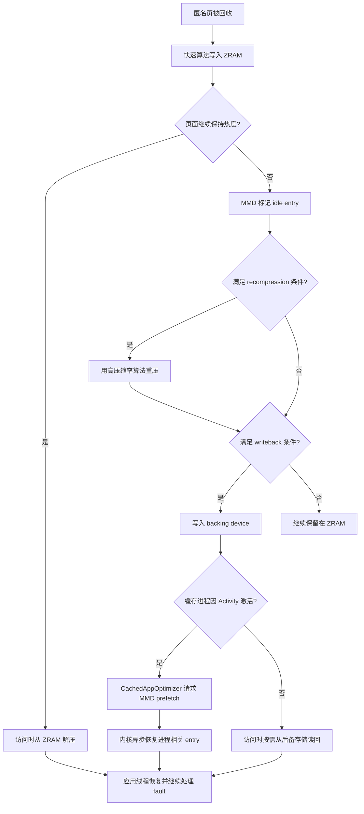

# 4.12 ZRAM 压缩交换与应用重启延迟

## 先判断进程还在不在

讨论 ZRAM 对应用恢复耗时的影响，应先确认原进程是否仍然存在，再看 `VmSwap`。两种场景的执行成本完全不同：

| 场景 | PID | 主要成本 | ZRAM 与本次恢复的关系 |
| --- | --- | --- | --- |
| 进程存活，部分匿名页在 ZRAM | 不变 | 换入缺页（swap fault）、解压、可能的后备设备读取，以及恢复后的业务工作 | 直接相关 |
| 进程已被 LMKD 或其他机制终止 | 改变 | 创建进程、初始化运行时、加载代码和资源、重建组件 | 旧进程的 ZRAM 页面已随交换槽位清理，不构成本次新进程的直接恢复路径 |

Android 的冷启动、温启动和热启动是 Activity 启动分类；论文和系统优化语境中的“重新拉起”（relaunch）范围更宽，可能包含从后台任务恢复、Activity 重建或进程重建。本文用“换入恢复”表示 PID 不变、但需要重新访问已换出页面；用“冷启动”表示原进程已经终止。

用户感觉“像冷启动”只描述了体验，不能证明进程发生过重建。应先记录 PID 与 Activity 启动类型；在 Android 11（API 30）及以上再结合 `ApplicationExitInfo`，低版本需要依赖日志、`dumpsys activity` 或自有启动埋点。

平台基线是 Android 17 / API 37 / `android-17.0.0_r1`，内核基线是 `android17-6.18-2026-06_r6`。

## ZRAM 位于匿名页回收与进程淘汰之间

### 文件页与匿名页的后备来源不同

干净的文件页（file-backed page）已经有文件作为后备来源。内存不足时，内核可以丢弃这些物理页；再次访问时，再从 APK、DEX、`.so` 或其他文件读取。修改过的文件页则需要先写回，或按具体映射语义处理。

匿名页（anonymous page）没有可直接重读的原始文件。Java 堆、原生堆和匿名 `mmap()` 中的大量数据都属于这一类。要在保留进程状态的同时释放原始物理页，内核可以把页面写入交换空间。Android 通常把 ZRAM 块设备用作交换设备：

1. 回收器选中可换出的匿名页。
2. 交换层为页面分配交换条目（swap entry），用于记录页面被换出后的存放位置。
3. ZRAM 驱动按基础页大小接收内容并尝试压缩。
4. 压缩对象存入 zsmalloc 内存池；压缩效果很差的页面按不可压缩或大对象页面处理。
5. 进程页表保存交换条目，原物理页可以释放。
6. 进程再次访问该虚拟地址时发生换入缺页，页面从 ZRAM 解压并恢复。

这个过程以 CPU 时间换取容量。压缩率越高，同一段物理内存可以保存更多匿名数据；算法越复杂，压缩与解压占用的 CPU 通常越多。ZRAM 本身仍然消耗内存，其中还包括分配器碎片、元数据和压缩上下文，因此不能把 `SwapTotal - SwapFree` 直接当作节省的物理内存。

### ZRAM、写回与磁盘交换的成本等级不同

Android 17 可以为 ZRAM 配置后备设备（backing device）。冷的 ZRAM 条目被写回后，压缩数据或页面内容离开内存，进入 `/data` 上的后备存储。之后的恢复成本取决于页面当前所在位置：

| 页面位置 | 恢复时的主要工作 | 常见瓶颈 |
| --- | --- | --- |
| ZRAM 内存中 | 读取压缩对象并解压 | CPU、内存带宽、锁竞争 |
| 后备设备 | 发起块 I/O，再把内容恢复到 ZRAM 或进程页面 | 存储延迟、队列竞争、解压 |
| 交换缓存 | 可能复用已在内存中的页面 | 页表更新与普通缺页处理 |

所以，`VmSwap` 相同的两个进程，恢复耗时也可能不同。还要知道对应页面是否已经写回、访问是否集中在首帧之前，以及设备当时的 CPU 与存储负载。

## Android 17 的管理者是 MMD

Android 17 引入内存管理守护进程（memory management daemon，`mmd`），负责 ZRAM 配置、重新压缩、写回与按进程维护。`system_server` 决定何时发起任务，MMD 通过 `IMmd` 接口接收请求并执行内核操作。这种分工把 Java 系统服务的调度决策与原生守护进程的内存操作分开。

Android 17 的主要数据流如下：



图中的重新压缩、写回和按进程预取都依赖内核能力、系统属性、后备存储与产品配置。Android 17 提供了相应实现，但具体设备未必全部启用。

### 启动配置

开机完成后，`mmd_setup` 可以按属性配置 ZRAM，随后启动 `mmd` 处理持续维护。常用配置项包括：

- `mmd.zram.enabled`：是否由 MMD 配置 ZRAM，默认关闭；
- `mmd.zram.num_devices`：ZRAM 设备数量，默认一个；
- `mmd.zram.size`：设备容量，默认可按物理内存比例设置；
- `mmd.zram.comp_algorithm`：首轮压缩算法；
- `mmd.zram.recompression.enabled`：是否启用重压；
- `mmd.zram.recompression.algorithm`：次级算法，官方文档默认值为 `zstd`；
- `mmd.zram.writeback.enabled`：是否配置并使用后备存储。

启用 `mmd.zram.enabled` 后，`swapon_all` 中的 ZRAM 设置变为空操作，旧资源覆盖项 `config_zramWriteback` 和 `ro.zram.*` 写回属性也会被忽略。因此，Android 17 排障不能只检查历史 `ZramWriteback` 属性；要先确认设备使用 MMD 还是旧方案。

### 全局维护

`com.android.server.memory.ZramMaintenance` 通过 JobScheduler 周期性发起维护。AOSP 默认要求设备处于空闲状态且电量不低，以减少维护工作与前台交互争用。任务触发后：

1. `system_server` 异步调用 `mmd.doZramMaintenanceAsync()`。
2. MMD 把任务放入低优先级工作队列。
3. MMD 先处理重新压缩，再处理写回。
4. 高优先级的按进程预取可以先于低优先级维护执行。

维护不是持续扫描。官方默认的首次调度和后续周期均为一小时；重新压缩与写回还有各自的退避时间、空闲时长、容量门槛和每日写入预算。产品可以调整这些值。

### 按进程写回与预取

Android 17 的 `CachedAppOptimizer` 把进程冻结器（freezer）与 MMD 接到一起：

1. 缓存进程冻结成功后，可以先执行 `FULL` 级应用页面回收；`FULL` 是系统为该流程定义的完整回收档位名称。
2. 页面回收完成后，延迟投递 `ZRAM_WRITEBACK_MSG`。消息处理阶段要求进程承载 Activity、交换空间占用量低于配置阈值，并且 GPU 内存和 DMA-BUF 共享缓冲区内存没有超过各自阈值。
3. `system_server` 用 pidfd 标识目标进程，调用 `mmd.asyncWritebackProcessZramMemory()`。
4. MMD 通过 Android ZRAM 的 ioctl 控制接口扫描该进程页表，选出指向目标 ZRAM 的交换条目。
5. 回调成功后，ActivityManager 标记 `isZramWrittenBack`。下一轮 OOM 调整会用 `min(adj, zramWritebackAdj)` 计算只发送给 LMKD 的进程优先级分值（`adj`）；AOSP 默认 `zramWritebackAdj` 为 `249`，因此该进程在已写回状态下得到更强的 LMKD 保护。解冻时此标记会被清除。
6. 进程因 Activity 激活而解冻时，`CachedAppOptimizer.prefetchZram()` 调用 `mmd.asyncPrefetchProcessZramMemory()`。

pidfd 是内核提供的进程文件描述符，可以避免只用整数 PID 时遇到编号复用问题。写回和预取都是异步请求，目标进程可能在执行前退出，后备设备也可能空间不足；这些都属于预期失败分支。

## Linux 6.18 的 ZRAM 实现

### 驱动拆分与压缩后端

在 `android17-6.18-2026-06_r6` 中，ZRAM 已位于 `drivers/block/zram/`，核心文件按职责拆分：

```text
drivers/block/zram/
├── zram_drv.c
├── zram_drv.h
├── zram_ioctl.c
├── zcomp.c
├── backend_lzo.c
├── backend_lzorle.c
├── backend_lz4.c
├── backend_lz4hc.c
├── backend_zstd.c
├── backend_deflate.c
└── backend_842.c
```

这份目录用于源码定位。`zcomp.c` 通过 `backends[]` 注册编译时启用的实现，每个后端提供统一的 `zcomp_ops`。Kconfig 默认压缩器是 `lzo-rle`；设备可以在构建和初始化阶段选择其他算法。`ZRAM_BACKEND_FORCE_LZO` 在其他后端均关闭时提供 LZO 兼容兜底。

### 一个条目对应一个基础页

`zcomp_compress()` 的输入长度是 `PAGE_SIZE`，ZRAM 设备的槽位数也由 `disksize >> PAGE_SHIFT` 计算。压缩结果达到或超过 `zs_huge_class_size()` 时，`write_incompressible_page()` 将其标记为 `ZRAM_HUGE`，按未压缩页面保存；若配置写回，后续维护可以把这类条目写到后备设备。

这解释了 `mm_stat` 中几个字段的关系：

- `orig_data_size`：ZRAM 中内容未压缩时的总大小；
- `compr_data_size`：压缩数据载荷的大小；
- `mem_used_total`：zsmalloc、碎片和元数据共同占用的内存；
- `same_pages`：内容完全相同、无需分配普通压缩对象的页面；
- `huge_pages`：压缩收益不足的页面；
- `pages_compacted`：ZRAM 内部分配器经过压缩整理后释放的页面数。

评估压缩效率应看 `orig_data_size / mem_used_total` 和 `compr_data_size / mem_used_total`，不能只看 `compr_data_size`。

### 最多四个压缩器槽位

启用 `CONFIG_ZRAM_MULTI_COMP` 时，Android 17 内核定义：

```c
#define ZRAM_PRIMARY_COMP   0U
#define ZRAM_SECONDARY_COMP 1U
#define ZRAM_MAX_COMPS      4U
```

这段定义说明单个 ZRAM 设备最多登记四个压缩器优先级。每个条目用两个优先级位记录当前算法。`recompress_store()` 根据 `type` 参数筛选空闲、大页面或同时满足两者的条目，并跳过以下情况：

- 已经写回；
- 内容为全同值页面；
- 已被标记 incompressible；
- 已使用同级或更高优先级算法；
- 已在按进程预取缓存中。

`recompress_slot()` 依次尝试更高优先级的算法。只有新结果进入更小的 zsmalloc 尺寸类别，并满足阈值条件时，才会替换旧对象。重新压缩失败不会破坏旧对象；所有高优先级算法都无法带来收益时，可以标记 `ZRAM_INCOMPRESSIBLE`。

因此，不能把实现概括为“冷页统一改用 zstd”。MMD 的默认次级算法可以是 zstd，驱动本身支持多个后端和优先级，最终可用组合取决于内核配置与设备属性。

### 后处理串行化

重新压缩、写回与预取都属于后处理。驱动使用 `pp_in_progress` 阻止它们并发执行，避免同一槽位的后备存储块、压缩对象和页表扫描相互竞争。按进程预取的注释还明确写到：预取应优先于同一进程的写回，但当前实现通过 `pp_in_progress` 禁止两者并行。

槽位选择使用 `ZRAM_PP_SLOT` 作为保护标记。按进程写回扫描页表时，即使页表项（PTE）快照在解锁后变旧，后续写回前仍会检查该标记；槽位被访问、释放或覆盖时会清掉标记，从而阻止使用过期候选。

### 按进程 ioctl 接口

`include/uapi/linux/zram_ioctl.h` 在 Android 17 内核定义了：

- `ZRAM_ANDROID_IOC_PROCESS_RANGE_WRITEBACK`；
- `ZRAM_ANDROID_IOC_PROCESS_PREFETCH`；
- 兼容旧调用的 `ZRAM_ANDROID_IOC_PROCESS_WRITEBACK`；
- `ZRAM_ANDROID_IOC_GET_VERSION`。

`zram_ioctl.c` 要求调用方具备 `CAP_SYS_NICE` 权限，再通过 pidfd 获取目标任务和描述进程地址空间的 `mm_struct`。页表遍历器只选取属于当前 ZRAM 设备的交换页表项。范围写回支持 `start_addr`、扫描字节数和 `next_addr`，便于分段处理较大的地址空间。

预取的内核执行分为三段：

1. `zram_prefetch_slots()` 选中已经写回的槽位，释放槽位锁后发起 `REQ_OP_READ` 块 I/O 请求（bio）。
2. `zram_prefetch_read_endio()` 在 I/O 完成时把后续工作投递到高优先级系统工作队列 `system_highpri_wq`，因为恢复到 zsmalloc 内存池的操作可能进入睡眠等待。
3. `zram_deferred_prefetch()` 调用 `zram_populate_table()`；后者重新取得槽位锁，再次确认 `ZRAM_WB`，防止 I/O 期间槽位已经被释放或替换。

这个时序允许驱动在等待后备存储 I/O 时释放槽位锁，再通过 I/O 完成后的二次检查处理并发变化。

## 恢复耗时为什么容易出现长尾

### 页面触碰顺序比总量更重要

应用恢复时不会一次读回全部已换出页面。只有 CPU 执行到某条指令并访问尚未驻留的虚拟页后，内核才会处理缺页。以下页面若集中在首帧前被访问，延迟会更明显：

- Activity 与 View 层级的状态对象；
- 首屏 Bitmap、字体、Skia 或 GPU 资源相关的匿名数据；
- Java/原生内存分配器的热点元数据；
- 数据库连接、序列化缓存和业务索引；
- Binder 恢复后立刻消费的大批回调数据。

同样是 100 MiB `SwapPss`，首帧前访问 5 MiB 热页与访问 40 MiB 热页的体验完全不同。`SwapPss` 适合描述当前归属，但不足以预测恢复成本。

### ZRAM 命中和后备设备命中的成本不同

页面仍在 ZRAM 时，缺页处理主要付出线程调度、查找、分配目标页和解压成本。页面已经写回时，还要等待后备设备 I/O。MMD 的按进程预取会尝试在 Activity 主线程初始化期间异步读回相关条目，以减少后续同步缺页等待；它不能保证全部页面都在应用访问前就绪。

分析时可以把恢复窗口分为：

```text
Activity 解冻
  -> MMD 收到 prefetch 请求
  -> 内核扫描目标进程 swap PTE
  -> backing bio 与 high-priority deferred work
  -> 应用线程恢复执行
  -> 按页面触碰顺序继续发生 swap fault
  -> 首帧 / 完整显示
```

这段时序用于安排性能轨迹标记。预取与应用初始化会重叠，不能把两者的耗时简单相加。

### CPU 与 I/O 竞争会放大延迟

ZRAM 解压消耗 CPU。低端设备或持续高负载下，解压可能与主线程、渲染线程（RenderThread）、编译线程争用核心。写回和预取又会访问 `/data` 后备设备，可能与 APK、DEX、数据库和图片读取共享队列。即使单次缺页很短，数百次分散缺页仍可能形成明显长尾。

## `kswapd`、直接回收与 LMKD

### kswapd

空闲页低于水位线后，`kswapd` 会在后台扫描可回收页面，尝试让内存区域（zone）恢复到目标水位。它不在应用主线程的调用栈上，但会消耗 CPU 和内存带宽，并与应用竞争最近最少使用链表（LRU）、内存控制组（memcg）、交换空间及文件系统资源。

### 直接回收

分配线程无法及时获得页面时，可能在分配路径进入直接回收（direct reclaim）。此时，发起分配的线程会亲自执行页面扫描、回写或换出（swap-out），并等待这些操作完成。若主线程或 RenderThread 进入直接回收，用户更容易感知卡顿。

直接回收还要和物理内存规整（compaction）区分开。高阶页分配失败可能触发内存规整，它解决的是物理页连续性问题，与 ZRAM 重新压缩（recompression）不是一回事。

### LMKD

Android 17 的 `lmkd` 默认通过 PSI（Pressure Stall Information，压力停顿信息）事件感知任务因内存争用而停顿，再结合内存水位、交换空间、文件缓存重新缺页（refault）、反复换入换出（thrashing）和进程优先级 `adj` 选择终止目标。ZRAM 为系统争取时间和容量，LMKD 则在内存压力不可接受时终止低优先级进程。

`lmkd.cpp` 的 `get_free_swap()` 还有一个 Android 特有修正：

```cpp
return std::min(
        free_swap,
        easy_available * swap_compression_ratio / swap_compression_ratio_div);
```

这段简化代码说明了计算意图：ZRAM 的可用交换空间受可用内存与压缩率约束，不能把设备声明的空闲交换空间当成独立的磁盘容量。Android 17 的 LMKD 还会组合以下参数：

- `ro.lmk.swap_free_low_percentage`；
- `ro.lmk.swap_compression_ratio`；
- `ro.lmk.swap_util_max`；
- `ro.lmk.thrashing_limit` 与 `critical`/`decay`（临界值/衰减）参数；
- `ro.lmk.psi_partial_stall_ms`；
- `ro.lmk.psi_complete_stall_ms`；
- `ro.lmk.direct_reclaim_threshold_ms`。

这些值影响设备何时认为交换空间过低，以及何时因反复换入换出或直接回收而终止进程。排查具体设备时要读取实际属性，不能只引用 AOSP 默认值。

## 16 KB 页大小的准确影响

Android 17 同时支持 4 KB 与 16 KB 基础页设备。ZRAM 驱动每次按 `PAGE_SIZE` 压缩一个条目，因此 16 KB 设备有几个可直接从源码推出的差异：

- 单个 ZRAM 交换槽位对应 16 KB 未压缩内容；
- 一次换入缺页的基础恢复粒度变大；
- `huge_class_size`、zsmalloc 大小类别（size class）与压缩结果都按新的页大小计算；
- 同样的虚拟地址范围需要的页表项和交换槽位更少；
- 页面内部只使用一小部分数据时，换入的额外字节可能增加。

这不表示恢复延迟会固定变成 4 KB 设备的四倍。页数减少、TLB（页表项高速缓存）覆盖范围增加、算法吞吐、压缩率、访问局部性和存储队列都会影响结果。对比设备时至少记录：

```bash
adb shell getconf PAGE_SIZE
adb shell cat /sys/block/zram0/disksize
adb shell cat /sys/block/zram0/comp_algorithm
adb shell cat /sys/block/zram0/mm_stat
```

第一条命令确认基础页大小，后三条确认 ZRAM 容量、算法和当前内存效率。比较不同页大小的设备时，直接比较交换槽位数量容易得出错误结论，应优先换算成字节。

## MGLRU 影响“回收哪些页面”，不负责解压

多代最近最少使用算法（Multi-Gen LRU，MGLRU）用“代”（generation）表示页面距上次访问的时间，以改进回收器对冷热页的选择。它可能影响哪些匿名页先进入交换空间、哪些文件页先被丢弃，进而改变应用恢复时需要重新访问的已换出工作集。

MGLRU 不执行 ZRAM 解压，也不决定 LMKD 最终终止哪个进程。设备是否启用 MGLRU 取决于内核配置和运行时设置，Android API 级别本身无法证明其启用状态。诊断文档应记录内核源码标签（kernel tag）、`CONFIG_LRU_GEN` 和运行时状态，避免只写“Android 17 默认使用某种 LRU”。

## Ariadne：研究结果与 AOSP 边界

Ariadne 是 HPCA 2025 论文提出的研究系统。针对普通 ZRAM 不区分数据热度、压缩粒度固定，以及按需解压带来的恢复成本，它提出了三项设计：

1. **按热度组织数据（hotness-aware organization）**：根据恢复时的访问历史，把匿名数据分为热、温、冷三类；
2. **自适应压缩粒度（size-adaptive compression）**：热数据使用较小的压缩块，以缩短解压时间；冷数据使用较大的压缩块，以提高压缩率；
3. **主动解压（proactive decompression）**：根据访问局部性预测下一批页面，并提前解压。

论文报告称，在 Pixel 7 上，相比其实验基线 ZRAM，应用重新恢复的平均延迟降低了 50%，压缩和解压的 CPU 使用量降低了 15%。这些数字只适用于论文采用的设备、Android 14 软件栈、应用集合和实验配置，不能直接外推到 Android 17 产品。

Android 17 的按进程写回和预取与 Ariadne 的“提前准备热数据”方向相近，但实现机制不同：

| 对比项 | Android 17 MMD + ZRAM | Ariadne |
| --- | --- | --- |
| AOSP 状态 | 已有公开文档与源码 | 研究原型 |
| 目标选择 | 进程、空闲时长、条目类型与配置阈值 | 数据热度与恢复访问历史 |
| 压缩粒度 | 以基础页为一个条目，支持多个压缩器优先级 | 按热度使用自适应块大小（chunk size） |
| 提前恢复 | Activity 解冻时，按进程预取已写回的条目 | 预测下一批将访问的数据并主动解压 |

截至 Android 17 基线，没有证据表明 Ariadne 的完整论文设计已经合入 AOSP。它适合用来说明相关研究方向，但论文中的性能数字不能视为 Android 系统承诺。

## 观测：把交换、压力和启动放到同一时间窗

### 设备快照

下面的命令分别收集系统压力、交换空间总量、目标进程内存归属和 ZRAM 设备效率：

```bash
adb shell cat /proc/pressure/memory
adb shell cat /proc/meminfo
adb shell cat /proc/vmstat
adb shell cat /proc/<PID>/status
adb shell cat /proc/<PID>/smaps_rollup
adb shell cat /sys/block/zram0/mm_stat
adb shell cat /sys/block/zram0/bd_stat
adb shell getprop | grep -E 'mmd\\.zram|mm\\.zram|ro\\.lmk'
adb shell dumpsys -l | grep mmd
```

要同时记录这些命令的采样时刻。单次快照只能描述当时的状态；若要判断恢复成本，需要在后台稳定期、点击恢复前和首帧后分别采样，或采集一段完整跟踪（trace）。

重点字段包括：

| 入口 | 字段 | 用途 |
| --- | --- | --- |
| `/proc/<pid>/status` | `VmRSS`、`VmSwap` | 进程驻留内存与交换空间用量 |
| `smaps_rollup` / meminfo | `Pss`、`SwapPss`、`Private Dirty` | 内存归属、交换占比与私有脏页情况 |
| `/proc/vmstat` | `pswpin`、`pswpout`、`pgmajfault`、`pgscan_*`、`workingset_refault*` | 换入换出、缺页、扫描与重新缺页的累计变化 |
| `/proc/pressure/memory` | `some`、`full` | 任务因内存压力停顿的时间 |
| ZRAM `mm_stat` | 原始量、压缩量、总占用、超大页 | 压缩效率与内存分配器开销 |
| ZRAM `bd_stat` | 后备块数量、读取量、写入量 | 写回量与后备设备读取量 |

`pgmajfault` 不能单独代表 ZRAM 换入。交换缓存命中、纯内存 ZRAM 和后备设备 I/O 的缺页记账方式可能不同；应同时查看 `pswpin`、ZRAM 统计、线程调度和 I/O。

### Perfetto

Perfetto 跟踪应覆盖以下类别：

- `linux.process_stats`：目标进程的内存计数；
- `linux.sys_stats`：`meminfo` 与 `vmstat` 系统统计；
- `sched/sched_switch`：主线程、RenderThread、`kswapd` 和 MMD 的调度；
- 设备可用的页面回收、内存规整、块设备 I/O 与缺页跟踪点（tracepoint）；
- Activity 启动、FrameTimeline 帧时间线与自定义恢复标记；
- LMKD 和进程冻结器相关事件。

ftrace 事件会随内核版本和产品配置变化。采集前先列出设备实际可用的事件，再生成跟踪配置：

```bash
adb shell cat /sys/kernel/tracing/available_events \
  | grep -E 'vmscan|compaction|swap|block|mm_event|rss_stat'
```

命令输出决定该设备能够采集哪些事件。不要因为面向调试的 userdebug 版本提供 `mm_event/mm_event_record`，就假定所有 Android 17 设备都有这些跟踪点。

时间轴分析建议使用以下顺序：

1. 找到用户点击、Activity 解冻、首帧和完整显示的时间点。
2. 确认 PID 是否改变，以及是否发生冻结器解冻（freezer unfreeze）。
3. 比较恢复窗口内 `pswpin`、主缺页（major fault）、ZRAM 后备设备读取量与块设备 I/O 增量。
4. 检查主线程处于可运行（runnable）还是阻塞（blocked）状态，以及它是否与 `kswapd`、MMD 或解压任务争用 CPU。
5. 再关联 LMKD、PSI 和文件缓存重新缺页，判断系统是否在持续反复换入换出。

### 退出原因

Android 11（API 30）及以上，`ActivityManager.getHistoricalProcessExitReasons()` 可以读取 `ApplicationExitInfo`。Android 13（API 33）及以上可以把冻结器导致的退出单独上报为 `REASON_FREEZER`；Android 11 和 Android 12 不提供这个 reason 常量。常见字段包括：

- `REASON_LOW_MEMORY`：系统因低内存终止进程；
- `REASON_FREEZER`（API 33+）：冻结期间的 Binder 等异常导致退出；
- `REASON_SIGNALED` 与 `SIGKILL`：某些设备无法准确报告低内存终止原因时，可能只记录这两个值。

Android 11 及以上，应用可以用 `ActivityManager.isLowMemoryKillReportSupported()` 判断设备能否可靠报告低内存终止原因。历史 `getPss()` / `getRss()` 是进程退出前后的快照，不等于峰值，也不能证明哪些页面曾存放在 ZRAM 中。

## 应用能做什么

应用不能直接选择 ZRAM 压缩器、触发 MMD 写回，也不应依赖修改系统属性。应用侧更有效的做法，是缩小后台匿名页工作集和首屏恢复工作集；这里的工作集是进程近期实际需要访问的那部分内存：

- 分开统计 Java 堆、Native 堆、图形内存、匿名 `mmap` 和文件映射。
- 收到 `TRIM_MEMORY_UI_HIDDEN` 后释放可重建的 UI 缓存。
- 把首帧必需状态控制在较小范围，延后图片预热、大列表恢复和非必要索引加载。
- 固定大小并发队列，避免解冻后集中处理冻结期间积压的任务。
- 及时持久化关键状态，因为冻结的进程可能在没有恢复执行的情况下直接被 LMKD 终止。
- 多进程拆分前评估总 PSS、匿名页、Binder 成本和各进程重建成本。
- 线上同时记录 PID、启动类型、后台时长、设备内存档位、页大小和最近退出原因。

使用 `onTrimMemory()` 时也要考虑版本差异。缓存进程可能被冻结，无法保证每次出现内存压力时都能收到并及时处理这个回调。应用的内存预算应在常态运行中成立，不能把内存整理回调当作最后一道保障。

## 系统调优检查表

- 确认当前使用 MMD 还是旧版 `ZramWriteback` 配置。
- 检查 ZRAM 大小、主/次压缩算法、重新压缩和后备设备。
- 读取 `mm_stat`，区分数据本身的压缩率与 zsmalloc 的实际内存占用。
- 读取 `bd_stat` 和 MMD 日志，确认是否发生写回或预取，并检查失败原因。
- 对按进程写回检查 pidfd、目标进程状态、等待时间和阈值。
- 将 PSI、内存水位、反复换入换出、交换空间利用率与 LMKD 终止原因对齐。
- 比较 4 KB 和 16 KB 设备时按字节归一化统计，不直接比较交换槽位数量。
- 同时评估存储磨损预算、空闲空间和前台延迟，避免只追求更大的写回量。

## 小结

Android 17 的 ZRAM 已经从单一的压缩交换设备，扩展为由 MMD、`system_server` 和 Linux 6.18 内核共同工作的分层机制：

1. 内核回收器把匿名页写入 ZRAM，用快速压缩换取更多可用内存。
2. MMD 在合适的空闲窗口重新压缩冷条目，或把它们写入后备存储。
3. `CachedAppOptimizer` 可以为缓存或冻结进程安排写回，并在 Activity 激活时请求预取。
4. 进程存活时，恢复成本来自解压、后备 I/O、页面触碰顺序和资源争用。
5. 进程已经被 LMKD 终止时，应按冷启动分析；旧进程的页面换入已不再构成本次启动的直接成本。

诊断时先确认 PID 和退出原因，再对齐页面换入换出、ZRAM、MMD、PSI、LMKD 与首帧时间。这样才能判断问题来自应用工作集、内核回收、ZRAM 后处理，还是进程已经被系统终止。

## 参考资料

- Android MMD：<https://source.android.com/docs/core/perf/mmd>
- Android LMKD：<https://source.android.com/docs/core/perf/lmkd>
- Linux ZRAM 文档：<https://docs.kernel.org/admin-guide/blockdev/zram.html>
- Perfetto 内存分析：<https://perfetto.dev/docs/case-studies/memory>
- Perfetto 内存计数器：<https://perfetto.dev/docs/data-sources/memory-counters>
- `ApplicationExitInfo`：<https://developer.android.com/reference/android/app/ApplicationExitInfo>
- Ariadne / HPCA 2025 extended version：<https://arxiv.org/abs/2502.12826>
- AOSP `android-17.0.0_r1`：
  - `frameworks/base/services/core/java/com/android/server/memory/ZramMaintenance.java`
  - `frameworks/base/services/core/java/com/android/server/am/CachedAppOptimizer.java`
  - `system/memory/lmkd/lmkd.cpp`
- Android common kernel `android17-6.18-2026-06_r6`：
  - `drivers/block/zram/zram_drv.c`
  - `drivers/block/zram/zram_drv.h`
  - `drivers/block/zram/zram_ioctl.c`
  - `drivers/block/zram/zcomp.c`
  - `include/uapi/linux/zram_ioctl.h`
