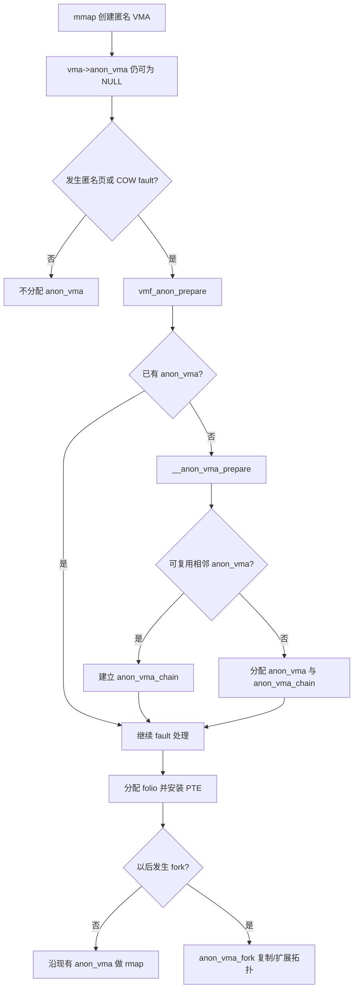

# 4.13 ANON_VMA_LAZY 提案与 Android 内存性能

## 先给结论：Android 17 没有这项功能

`ANON_VMA_LAZY` 是 Honor 工程师在 2026-05-27 提交到 Linux 内核邮件列表的一组 15 个补丁。它提出进一步延迟 `anon_vma` 的创建，以减少 `anon_vma` 和 `anon_vma_chain` slab 开销。

这组补丁没有进入 Android 17 的 common kernel 基线。对 `android17-6.18-2026-06_r6` 的源码核对结果如下：

- 没有 `CONFIG_ANON_VMA_LAZY`；
- 没有 `ARCH_SUPPORTS_ANON_VMA_LAZY`；
- 没有 `anon_vma_tree_t`、`anon_vma_lazy_enable` 或 proposal 中的 VMA 引用机制；
- `mm/rmap.c` 仍使用 `struct anon_vma`、`struct anon_vma_chain` 和 interval tree；
- `include/linux/rmap.h` 中的 `vma->anon_vma` 仍指向常规 `struct anon_vma`；
- `rmap_walk_anon()` 仍通过 `rmap_walk_anon_lock()` 取得并锁定相关 anon_vma；`try_to_unmap()` 等调用会提供 `folio_lock_anon_vma_read()`，随后沿 anon_vma interval tree 查找映射。

邮件线程中的主要维护者还对该实现给出了明确反对意见，集中在 VMA 生命周期、RCU 与锁、migration、VMA split/merge/remap、large folio、MAP_PRIVATE COW 和缺少测试等问题。到本章基线日期，不能把这组补丁描述为上游 Linux、Android 17 GKI 或任一 OEM 的通用能力。

| 问题 | Android 17 / Kernel 6.18 结论 |
| --- | --- |
| AOSP 是否使用 `ANON_VMA_LAZY` | 否 |
| GKI 是否提供 `CONFIG_ANON_VMA_LAZY` | 否 |
| App 是否能检测或启用 | 否 |
| 提案数据是否可作为 Android 17 收益 | 只能作为提交者的原型测量 |
| OEM 是否可能私有回移 | 有可能，必须用该设备内核源码或符号验证 |

本章的平台基线是 Android 17 / API 37 / `android-17.0.0_r1`；内核基线是 `android17-6.18-2026-06_r6`。后文先解释现行实现，再评审提案。

## `anon_vma` 解决什么问题

### 正向映射与反向映射

页表解决“给定虚拟地址，找到物理页”的正向映射。内存回收、页面迁移、KSM、NUMA balancing 等内核操作经常需要反过来回答：

> 给定一个匿名 folio，哪些进程、哪些 VMA、哪些虚拟地址仍在映射它？

这就是 reverse mapping（rmap）要解决的问题。匿名页没有普通文件的 `address_space` 可以作为稳定索引，Linux 通过 `anon_vma` 拓扑维护匿名页与 VMA 的关系。

Android 17 内核中的两个主要对象是：

```c
struct anon_vma {
    struct anon_vma *root;
    struct rw_semaphore rwsem;
    atomic_t refcount;
    unsigned long num_children;
    unsigned long num_active_vmas;
    struct anon_vma *parent;
    struct rb_root_cached rb_root;
};

struct anon_vma_chain {
    struct vm_area_struct *vma;
    struct anon_vma *anon_vma;
    struct list_head same_vma;
    struct rb_node rb;
    unsigned long rb_subtree_last;
};
```

这段摘录只保留了理解关系所需的字段。`anon_vma_chain` 同时挂入 VMA 的 `same_vma` 列表和 `anon_vma->rb_root` interval tree，于是内核既能从 VMA 找到相关 anon_vma，也能从 anon_vma 找到覆盖某个地址区间的 VMA。

### 为什么 folio 不能简单指向 VMA

VMA 会被拆分、合并、移动和销毁。一个匿名 folio 还可能：

- 因 `fork()` 同时映射到父子地址空间；
- 横跨后来被拆开的 VMA；
- 来自 `MAP_PRIVATE` 文件映射的 COW；
- 参与 THP/large folio 的拆分、迁移或回收；
- 在 rmap walk 期间遇到并发 VMA 变更。

因此，folio 需要指向生命周期更稳定的 anon_vma 拓扑。`anon_vma->rwsem`、引用计数和 RCU 延迟释放共同约束并发访问。优化这套结构时，节省 slab 只是目标之一，首要约束是 rmap 在所有并发状态下仍能找到完整且正确的映射集合。

## Android 17 已经延迟到首次 fault

旧文把现行实现描述成“`mmap()` 创建 VMA 时立即分配 `anon_vma`”，这个说法不准确。常见匿名映射路径已经具有一层延迟：

1. `mmap(MAP_ANONYMOUS)` 创建 VMA，此时 `vma->anon_vma` 可以保持 `NULL`。
2. 首次匿名页 fault、COW fault 等路径调用 `vmf_anon_prepare()`。
3. `__vmf_anon_prepare()` 发现 `vma->anon_vma` 为空后调用 `__anon_vma_prepare()`。
4. `__anon_vma_prepare()` 尝试复用相邻可合并 VMA 的 anon_vma；无法复用时才分配 `anon_vma`。
5. 它还为当前 VMA 分配 `anon_vma_chain`，并把 VMA 插入 interval tree。
6. 随后 fault 路径分配匿名 folio、安装 PTE，并通过 anon rmap API 记录映射。

Android 17 的主要时序可以画成：



图中“延迟”以首次需要插入匿名页为边界。ANON_VMA_LAZY 提案试图把部分 VMA 的边界继续后移，让已经 fault 过匿名页、但尚未发生共享的 VMA 也不创建常规 anon_vma。

### fault 路径的源码锚点

Android 17 的 `mm/memory.c` 中，`__vmf_anon_prepare()` 明确要求匿名 fault handler 在插入匿名页前调用它。VMA-lock fault 若需要查看相邻 VMA，还要重试并取得 `mmap_lock`，因为 `__anon_vma_prepare()` 可能复用相邻映射。

常见调用位置包括：

- write-protect/COW 处理；
- `do_anonymous_page()` 的匿名页分配；
- `do_cow_fault()`。

下面的简化代码用于展示准备时机：

```c
if (!vma->anon_vma) {
    if (__anon_vma_prepare(vma))
        return VM_FAULT_OOM;
}

folio = alloc_anon_folio(vmf);
/* 安装 PTE，并登记匿名 rmap */
```

代码顺序说明，现行内核已经避免为从未 fault 的空 VMA 分配 anon_vma。提案测得的节省来自“已发生匿名/COW fault、但仍可用单地址空间方式表达”的进一步延迟。

## `fork()` 与 anon_vma 拓扑

`fork()` 复制父进程的 VMA。Android 17 的 `anon_vma_fork(vma, pvma)` 先检查：

```c
if (!pvma->anon_vma)
    return 0;
```

这段判断的用途是跳过父 VMA 尚无 anon_vma 的情况。若父 VMA 已经 fault 并建立拓扑，内核会：

1. 用 `anon_vma_clone()` 把父 VMA 关联的 anon_vma chains 附加到子 VMA；
2. 尝试复用合适的 anon_vma，限制层级持续增长；
3. 必要时给子 VMA 建立自己的 anon_vma；
4. 让之后的 COW 匿名页归入正确拓扑。

Zygote fork 是 Android 的重要 fork 场景，但不能由此推出“所有 Zygote VMA 都会分配 anon_vma”。只读 file-backed 映射、从未触发匿名/COW fault 的 VMA 和已经产生匿名页的 VMA 状态不同。评估时要看实际 slab 对象、VMA 类型与 fault 情况。

## ANON_VMA_LAZY 提案做了什么

### 提案目标

提案认为，很多已建立匿名页的 VMA 长期只属于单个地址空间，不需要完整的 anon_vma chain 与 interval tree。它希望在 VMA 仍然单独拥有这些匿名页时，直接依靠 VMA 信息完成 rmap；等到 `fork()` 或其他共享语义出现时，再升级为常规 anon_vma。

这个方向要同时解决两个问题：

- folio 如何记录“当前映射由哪个 lazy VMA 表示”；
- VMA split、merge、remap、teardown 与 rmap 并发时，lazy 表示如何保持有效。

### 改动范围远超一个 Kconfig

该系列共 15 个 patch，修改 28 个文件，统计为 1279 行新增、206 行删除。涉及：

- `anon_rmap` 抽象；
- tagged `anon_vma_tree_t`；
- `CONFIG_ANON_VMA_LAZY` 与架构开关；
- VMA 引用与 lazy root；
- folio mapping 编码；
- fork、split、merge、mremap；
- THP、migration、KSM、GUP、DAMON、memory failure；
- arm64 与 x86_64。

因此，下面这些名称属于 2026-05-27 的 proposal，不属于 Android 17 源码：

```text
CONFIG_ANON_VMA_LAZY
ARCH_SUPPORTS_ANON_VMA_LAZY
anon_vma_tree_t
anon_vma_lazy_enable
vma_upgrade_anon_vma_lazy()
```

这份清单用于阅读 patch 或检查 OEM 分支。应用工程师在 Android 17 GKI 符号里找不到它们是正常结果。

### 提交者报告的测量

cover letter 给出了 preliminary active slab 数据，但没有在同一段中交代设备 RAM、内核配置、测试次数、方差和工作负载细节。

启动后：

| slab 对象 | 修改前 active KB | 修改后 active KB | 提交者报告的变化 |
| --- | ---: | ---: | ---: |
| `vm_area_struct` | 117035 | 118176 | +1.0% |
| `anon_vma_chain` | 18865.8 | 8112.06 | -57.0% |
| `anon_vma` | 20426.4 | 613.75 | -97.0% |

启动 24 个应用后：

| slab 对象 | 修改前 active KB | 修改后 active KB | 提交者报告的变化 |
| --- | ---: | ---: | ---: |
| `vm_area_struct` | 196873 | 197345 | +0.2% |
| `anon_vma_chain` | 31477.1 | 15576.8 | -50.5% |
| `anon_vma` | 33280 | 2648.12 | -92.0% |

按表中 active KB 做简单相减，启动 24 个应用后的三个对象合计约减少 46 MiB。这个结果可以说明元数据开销值得研究，但不能推导出以下结论：

- 所有 Android 设备都能节省约 45 MiB；
- 4GB 设备的收益比例一定更高；
- `MemAvailable` 会等量增加；
- LMKD 会固定推迟一个阈值级别；
- App 启动或 Zygote fork 会获得确定幅度的提升。

提交者只写到简单 fork microbenchmark 有轻微改善，没有提供足以形成产品结论的时延分布。

## 为什么上游评审拒绝这份实现

Linux MM 的难点集中在并发正确性。邮件线程提出的反对理由可归为五类。

### VMA 生命周期不稳定

proposal 让 folio 的 lazy mapping 间接依赖某个 VMA，并为此引入 VMA 引用或 root VMA。维护者指出，VMA 会被 split、merge、remap，也可能从 maple tree 脱离后以 detached/zombie 状态暂存。把它同时当作地址范围和长期映射身份，会改变既有生命周期约束。

### interval tree 不能随意省略

一次 VMA split 后，一个 large folio 可能跨越多个叶子 VMA。rmap 需要找出覆盖目标 folio 地址区间的全部 VMA。直接在 `mm_mt` 中按地址寻找单个 VMA，无法自然替代 anon_vma interval tree 的区间遍历，还会遇到并发 remap。

### 锁覆盖范围不足

proposal 讨论了 `mmap_lock`、VMA lock 和 PTE lock，但 rmap、migration 与 anon_vma lock 的持有周期并不相同。评审指出，某个路径持有 PTE lock 不能排除不获取同一把锁的并发 rmap walker；从 lazy 表示升级为常规 anon_vma 时，还存在 lock ordering 与观察到中间状态的问题。

### 覆盖的映射类型不完整

匿名 rmap 不只服务 `MAP_ANONYMOUS`。`MAP_PRIVATE` file-backed VMA 发生 COW 后也产生匿名页。评审明确指出 proposal 对该场景及相关 VMA 变化的处理存在缺口。

### 测试与可维护性不足

该系列对 rmap 核心路径改动超过千行，却没有提供相应的 correctness tests。维护者还在推进替换 anon_vma 的其他架构研究，因此不接受继续扩展当前 anon_vma 表示的方向。最终评价是实现和方向都不可合入。

这不否定“减少匿名 rmap 元数据”这个问题本身。它说明收益数字不能替代并发证明、故障注入、压力测试和长期维护成本评估。

## 对 Android 的影响只能按假设评估

### 潜在收益

如果后续出现经过上游接受的相似设计，Android 可能从这些场景受益：

- 多进程常驻导致 anon_vma slab 累积；
- Zygote fork 后，应用进程包含大量只在单地址空间使用的匿名 VMA；
- 频繁 VMA split/merge 带来较多 anon_vma_chain；
- 低内存设备中，non-reclaimable slab 占比偏高。

收益更接近“内核元数据减少”，不会直接减少 App 的 Java Heap、Native Heap 或 `VmRSS`。它可能改善系统可用内存和某些 fork 路径，但幅度必须通过目标设备测量。

### 不能预先声明兼容的子系统

旧文把 ART、ZRAM、16KB Page Size 和 MGLRU 都写成“兼容”，证据不足：

- ART 通过 `mmap`、`mprotect`、fork 后 COW、userfault 等行为使用内核虚拟内存语义。即使没有直接访问 `anon_vma`，仍需做启动、GC、JIT、zygote fork 与进程退出测试。
- ZRAM swap-out 会调用 unmap/rmap 路径寻找匿名页映射，`anon_vma` 正是其中的关键结构。两者有直接交互。
- MGLRU 的 aging 与 reclaim 会调用 folio referenced、rmap 和 page-table walk，必须验证 lazy 表示下的并发行为。
- 16KB 基础页会改变 folio、PTE 与 VMA 边界组合，不能由“anon_vma 是 VMA 级结构”推导兼容。
- THP/large folio、migration、KSM、GUP、DAMON 和 memory failure 都在该 patchset 的修改清单中，说明它们需要专门适配。

这些测试尚未成为 Android 17 的问题，因为基线内核没有合入该设计。OEM 若私有回移，就要负责对应验证。

## 如何确认设备有没有私有实现

用户态无法通过 Android SDK 查询 `ANON_VMA_LAZY`。系统开发者可以分层检查。

### 内核配置与符号

下面的命令用于 userdebug/eng 设备；量产 user build 可能限制访问：

```bash
adb shell 'zcat /proc/config.gz | grep -E "ANON_VMA_LAZY|ARCH_SUPPORTS_ANON_VMA_LAZY"'
adb shell 'grep -E "anon_vma_lazy|anon_vma_tree" /proc/kallsyms'
adb shell 'cat /proc/sys/vm/anon_vma_lazy 2>/dev/null'
```

Android 17 GKI 基线预期无匹配项。OEM 可能改名或移除 kallsyms 可见性，因此“没有输出”只能说明公开入口未发现，最终仍以对应 kernel source 和 build config 为准。

### slab 观测

现行内核会建立 `anon_vma` 和 `anon_vma_chain` slab cache。root 权限下可以读取：

```bash
adb shell su 0 sh -c \
  'grep -E "^(anon_vma|anon_vma_chain) " /proc/slabinfo'
adb shell su 0 slabtop -o | grep -E 'anon_vma|anon_vma_chain'
```

第一条给出 active object、object 数、object size 与 slab 参数；第二条便于观察动态变化。部分 Android 构建没有 `slabtop`，也可能关闭 `/proc/slabinfo` 访问。

不要用 `MemAvailable` 的单次变化代替 slab 对比。`MemAvailable` 是估算值，受 page cache、reclaimable slab、watermark 等多项因素影响。更合适的实验同时记录：

- `/proc/slabinfo` 中两个目标 cache；
- `/proc/meminfo` 的 `Slab`、`SReclaimable`、`SUnreclaim`；
- VMA 总数与目标进程分布；
- fork/启动延迟；
- LMKD、PSI 与回收活动。

### 设计一组可复现实验

如果 OEM 提供实验内核，至少需要 A/B 两个 build，除目标功能外保持配置一致：

1. 完成开机并静置到同一时间点。
2. 采集 slabinfo、meminfo、进程数与 VMA 数。
3. 按固定顺序启动同一批应用，并保持相同页面停留时间。
4. 再次采集 active objects 与实际 slab pages。
5. 重复多轮，报告中位数、P90/P95 与波动。
6. 运行 fork、VMA split/merge/remap、THP、migration、KSM、swap、memory pressure 和进程退出压力测试。
7. 检查 KASAN/KCSAN/lockdep、VM_BUG_ON、内存泄漏和数据损坏。

性能指标至少包括：

| 类别 | 指标 |
| --- | --- |
| 内存 | anon_vma/chain active objects、slab bytes、`SUnreclaim`、`MemAvailable` |
| fork | Zygote fork duration、page-table copy、子进程首个 fault |
| 启动 | TTID/TTFD、进程创建到 bindApplication、首帧 |
| 回收 | kswapd CPU、direct reclaim、PSI、swap-in/out |
| 稳定性 | crash、kernel warning、lockdep、migration/THP/KSM 压测 |

单看 slab 节省会漏掉 fork 升级成本、rmap scan 变慢或 rare race。内核内存优化必须同时证明节省、性能和正确性。

## 与相邻章节的关系

- §4.2 讲 Linux 页面回收；`try_to_unmap()` 等路径依赖 rmap 找映射。
- §4.7 讲 16KB Page Size；页大小会改变 folio 与页表粒度，但不会让 Android 17 自动获得 `ANON_VMA_LAZY`。
- §4.10 讲 Linux physical compaction 和 Android app compaction；页面 migration 同样依赖可靠 rmap。
- §4.12 讲 ZRAM；匿名页进入 swap 前要解除 PTE 映射，不能绕开 anon_vma。

## 小结

理解这一议题需要把现行机制和研究提案分开：

1. Android 17 的 `mmap()` 创建匿名 VMA 时，`vma->anon_vma` 可以保持空。
2. 首次匿名/COW fault 在插入匿名 folio 前调用 `__anon_vma_prepare()`，建立或复用 anon_vma 拓扑。
3. fork、reclaim、migration、KSM 和其他 rmap 用户依赖这套拓扑在并发 VMA 变化下保持正确。
4. 2026 年的 ANON_VMA_LAZY patchset 希望把部分分配继续推迟，并报告了明显 slab 节省。
5. 该实现因架构、并发正确性和测试问题被上游拒绝，也没有进入 `android17-6.18-2026-06_r6`。

因此，Android 17 文档可以把它作为“减少匿名 rmap 元数据”的研究案例，不能当作平台已提供的优化。评估 OEM 私有实现时，先核对源码和配置，再用完整的并发压力测试验证。

## 参考资料

- ANON_VMA_LAZY cover letter（2026-05-27）：<https://lwn.net/Articles/1074859/>
- Linux MM 邮件线程的实现评审：<https://lkml.iu.edu/2606.0/06081.html>
- Android common kernel `android17-6.18-2026-06_r6`：
  - `mm/rmap.c`
  - `mm/memory.c`
  - `include/linux/rmap.h`
  - `include/linux/mm_types.h`
