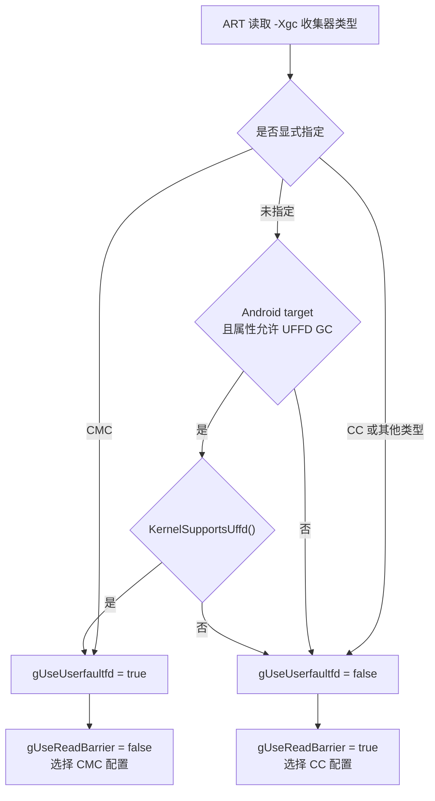

# 4.14 ART GC Region 碎片化与 Compaction 策略

§4.3 介绍了 ART 堆和收集器，§4.8 讨论了分代回收。本节进一步回答一个容易混淆的问题：Android 17 中的 Concurrent Copying（CC）和 Concurrent Mark Compact（CMC）分别怎样处理移动空间，`UnevacFromSpace` 又解决了什么问题。

本节以 AOSP `android-17.0.0_r1` 为平台源码基准，以 `android17-6.18-2026-06_r6` 为内核基准。厂商可以通过构建选项、启动参数和系统属性改变收集器配置，因此“源码包含 CMC”不等于任意 Android 17 设备都在运行 CMC。

## 先区分三类问题

“GC 碎片”常被当作一个笼统概念，排查时至少要拆成三类：

| 问题 | 典型空间 | 关注点 |
| --- | --- | --- |
| region 内有死亡对象留下的空洞 | CC 的 `RegionSpace` | region 能否整体搬空并重新使用 |
| 搬迁期间需要目标空间和复制带宽 | CC 的 from-space / to-space | 低收益搬迁是否推高 GC 峰值与耗时 |
| 非移动空间或虚拟地址空间不连续 | `LargeObjectSpace`、non-moving space、native 映射 | 总空闲量足够时，某次分配仍可能失败 |

CMC 的 compaction 主要压紧 ART moving space。它不会自动整理 LOS、native heap、图形缓冲区或模型权重映射。应用进程的 RSS 很高时，先确认内存归属，再讨论 ART GC 策略。

## Android 17 怎样选择 CC 或 CMC

Android 17 的动态读屏障配置中，`ShouldUseUserfaultfd()` 先决定是否使用 UFFD，随后得到：

```cpp
const bool gUseUserfaultfd = ShouldUseUserfaultfd();
const bool gUseReadBarrier = !gUseUserfaultfd;
```

这两行的含义是：当前动态配置选择 UFFD 时走 CMC；未选择 UFFD 时保留读屏障并走 CC。判断过程的优先级如下。



显式请求 CMC 的分支不会先调用 `KernelSupportsUffd()`。它属于运行时配置入口，调用方需要保证环境满足要求。常规 Android target 在没有显式指定收集器时，必须同时满足系统属性和内核能力检查。

### 系统属性门控

`SysPropSaysUffdGc()` 读取启动时缓存的 DeviceConfig 属性和只读构建属性：

- `persist.device_config.runtime_native_boot.enable_uffd_gc_2`
- `persist.device_config.runtime_native_boot.force_disable_uffd_gc`
- `ro.dalvik.vm.enable_uffd_gc`

代码还保留了面向旧平台版本的兼容条件。Android 17 上分析某台设备时，应读取设备的实际属性，不能用平台版本代替属性值。

### 内核能力门控

常规并发 CMC 的 `KernelSupportsUffd()` 依次检查：

1. 运行环境具有 `MREMAP_DONTUNMAP`；
2. `userfaultfd(O_CLOEXEC | UFFD_USER_MODE_ONLY)` 可以打开；
3. `UFFDIO_API` 返回的 feature 包含 `UFFD_FEATURE_SIGBUS`。

Android 17 的代码把 SIGBUS 视为启用该 GC 所需的最低 UFFD feature。低于 5.16 的 Android 内核还会探测 `UFFDIO_ZEROPAGE_MODE_MMAP_TRYLOCK`，探测结果用于选择具体处理方式，并非上述函数最终返回 `true` 的独立必要条件。

`gKernelHasFaultRetry = IsKernelVersionAtLeast(5, 7)` 只改变并发压缩的终止处理效率。它不负责决定 CMC 能否启用。`ro.dalvik.vm.force_cmc_stw_compaction` 则是特殊的强制 STW 配置：开启时，`KernelSupportsUffd()` 直接返回 `true`，语义与常规并发 CMC 不同。

内核 `android17-6.18-2026-06_r6` 的 UAPI 定义包含 `UFFD_FEATURE_SIGBUS`、`UFFD_USER_MODE_ONLY`、`UFFDIO_MOVE` 和 `MREMAP_DONTUNMAP`。最终能否启用仍要看运行内核、权限限制、ART 属性以及 `UFFDIO_API` 的运行时返回值。

### 分代回收还有额外门槛

`runtime.cc` 中的分代开关并非只看一个属性。Android 17 需要同时考虑：

- 构建形态为 Baker read barrier，或者当前已选择 UFFD；
- `-Xgc` 选项允许 generational GC；
- `persist.device_config.runtime_native_boot.use_generational_gc` 为 `true`，默认值是 `true`；
- UFFD/CMC 路径还要求 ART flag `use_generational_cmc()` 为 `true`。

因此，同一个 `use_generational_gc` 属性会影响 CC 与 CMC；`use_generational_cmc` 只给 CMC 增加一道限制。

## CC：RegionSpace 与搬迁决策

CC 把 moving space 实现为 `RegionSpace`。Android 17 中 `kRegionSize` 固定为 256KB。普通对象在一个 region 内按 bump-pointer 分配；大于一个 region 的分配可以占用一个 large head region 和若干 large tail region。

每轮 CC 开始搬迁前，非空 region 从 `ToSpace` 转换成两类之一：

- `FromSpace`：其中的存活对象需要复制到新的 to-space；
- `UnevacFromSpace`：本轮保留在原地址，不做整体搬迁。

GC 完成后，被搬空的 from-space region 可以整体回收。Unevac region 中死亡对象留下的洞不会因为这次选择而被压紧。

### 75% 不是所有 region 的通用规则

`Region::ShouldBeEvacuated()` 的判断顺序很重要。下面的等价伪代码保留了 Android 17 源码中的关键分支：

```cpp
if (IsLarge()) {
  return false;
}
if (evac_mode == kEvacModeForceAll) {
  return true;
}
if (is_newly_allocated_) {
  return true;
}
if (evac_mode == kEvacModeLivePercentNewlyAllocated &&
    live_bytes_ is valid) {
  size_t allocated = RoundUp(BytesAllocated(), kRegionSize);
  return live_bytes_ * 100 < 75 * allocated;
}
return false;
```

这段判断带来四个边界：

1. live large region 不参与搬迁；对象死亡后，相关 large regions 才能整体回收。
2. `kEvacModeForceAll` 会搬迁所有非 large region。
3. newly-allocated 的非 large region 总是搬迁，因为源码按“新分配区更可能含有短命对象”的分代假设处理。
4. 只有 `kEvacModeLivePercentNewlyAllocated`、非 newly-allocated、live bytes 有效时，才比较 75%。

比较式使用严格的小于号。恰好 75% 不搬迁。分母是 `RoundUp(BytesAllocated(), 256KB)`，不能把它改写成任意口径的“存活对象数占比”。

### 三种 EvacMode 对应什么收集

`ConcurrentCopying::FlipCallback` 根据本轮 GC 选择 evacuation mode：

| 条件 | `EvacMode` | 普通 region 的主要行为 |
| --- | --- | --- |
| generational CC 的 young/sticky GC | `kEvacModeNewlyAllocated` | 只搬迁 newly-allocated region |
| 常规 full CC | `kEvacModeLivePercentNewlyAllocated` | 搬迁 newly-allocated region，并按 live bytes 判断旧 region |
| `force_evacuate_all_` | `kEvacModeForceAll` | 搬迁所有非 large region |

所以，“低于 75% 搬、高于 75% 留”只描述了表格第二行中的一部分 region，不能用于解释 sticky GC 或 force-all GC。

### UnevacFromSpace 的收益与代价

对于存活率很高的 region，复制大量对象只能回收少量空间。把它标成 `UnevacFromSpace` 可以减少：

- 本轮对象复制量；
- 对应的目标 region 需求；
- 搬迁期间的内存写入和缓存压力。

代价是 region 内部的死亡对象空洞继续保留，普通 bump-pointer 分配也不能把这些离散空洞当作完整新 region 使用。后续 full GC 若发现存活率已低于阈值，才可能搬空该 region。

因此，UnevacFromSpace 是“复制成本与可回收空间”之间的取舍，不是消除碎片的压缩算法。高存活率 region 长期保留时，复制峰值可能下降，但内部浪费仍可能存在。

### RegionSpace 的 large region 不等于 LOS

这里还有一组相似术语：

- `RegionState::kRegionStateLarge` 表示一次 RegionSpace 分配跨越一个或多个 256KB region；
- `LargeObjectSpace` 是 Heap 中独立的非移动空间。

前者由 RegionSpace 管理，`ShouldBeEvacuated()` 对其返回 `false`；后者走 `kAllocatorTypeLOS`。分析日志或源码时，先看空间类型，不能只凭“large object”字样判断。

### Debug 构建会主动减少 region 复用

`region_space.h` 把 `kCyclicRegionAllocation` 定义为 `kIsDebugBuild`。开启后，RegionSpace 循环选择 region，减少对近期 region 的复用，用来更早暴露部分 GC 错误。

源码注释也明确指出，这种策略可能制造 region 级碎片，因此只在 debug 构建启用。对比 userdebug/debug 与 release 设备时，要把这项分配策略差异纳入分析；debug 设备上的 region 分布不能直接代表量产构建。

## CMC：压紧 BumpPointerSpace

选择 CMC 后，ART 的 moving space 是 `BumpPointerSpace`，不再使用 CC 的 RegionSpace 搬迁模型。CMC 先计算存活对象压缩后的地址，再按页完成对象内容和引用更新，使 moving space 的存活对象更紧密地排列。

### 一轮 MarkCompact 的阶段

Android 17 的 `MarkCompact::RunPhases()` 依次执行：

1. `InitializePhase()` 准备本轮状态；
2. 持有共享 mutator lock 运行 `MarkingPhase()`；
3. 执行 `MarkingPause()`；
4. 进入 `ReclaimPhase()`，再由 `PrepareForCompaction()` 判断是否需要压缩；
5. 需要压缩时，通过 `FlipThreadRoots()` 调用 `CompactionPause()`，完成线程根翻转和暂停期准备；
6. UFFD 有效时执行 `CompactionPhase()`；
7. `FinishPhase()` 收尾并更新分代边界。

`MarkingPause` 和 `CompactionPause` 都说明 CMC 并非“全程没有 STW”。它把大量标记、准备和页处理工作放到并发阶段，但暂停时间仍需在目标设备上测量。

### UFFD/SIGBUS 怎样参与页处理

CMC 的压缩元数据记录压缩前后的页和对象位置。并发压缩期间，GC 线程可以处理并映射目标页；mutator 若访问尚未完成的页，SIGBUS handler 会参与该页的处理。源码中的复制、zero-page、move ioctl 和状态字都以运行时 `gPageSize` 为单位。

这套机制减少了把整个 moving space 一次性停住再复制的需要，但会引入页错误处理、页表更新、TLB 刷新和调度成本。某个设备是否受益，要结合 GC 暂停、总耗时、fault 计数和应用卡顿同时判断。

## Generational CMC：YoungMarkCompact 与三代边界

`Heap::CreateGarbageCollectors()` 在允许 CMC 时先创建一个 `MarkCompact`。若 `use_generational_gc_` 为真，再创建 `YoungMarkCompact`：

```cpp
mark_compact_ = new collector::MarkCompact(this);
if (use_generational_gc_) {
  young_mark_compact_ =
      new collector::YoungMarkCompact(this, mark_compact_);
}
```

这段代码用于说明对象关系。`YoungMarkCompact` 是选择 sticky GC 时使用的轻量入口，不持有另一套标记和压缩数据结构。

它的 `RunPhases()` 只临时设置主收集器的 `young_gen_`，然后委托给同一个 `MarkCompact::RunPhases()`。其他需要独立实现收集算法的虚函数在该包装器中是 `UNIMPLEMENTED(FATAL)`，不应把它描述成第二套 MC 算法。

### young、mid、old 如何轮转

Android 17 的 `mark_compact.h` 明确写有三代：

- young：新分配对象所在范围；
- mid：young collection 时也参与回收；
- old：young collection 时按 dense 区域处理，不参与本轮压缩。

关键地址标记满足下面的顺序：

```text
[moving_space_begin_,
 black_dense_end_ / old_gen_end_,
 mid_gen_end_,
 post_compact_end_,
 moving_space_end_)
```

`mid_gen_end_` 在压缩前表示旧的 mid 末端，在压缩过程中改为压缩后的 mid 末端。`FinishPhase()` 再把旧 mid 晋升为 old，把本轮存活的 young 变成下一轮 mid。于是，一个 young 对象需要连续存活两轮相关收集，才会进入 old。

Full CMC 可以把 `black_dense_end_` 设为 moving-space 起点以处理整个 moving space，也可以保留一个被认为足够密集的前缀。Generational 模式把 old 区按同类 dense 前缀处理。这里的 dense 前缀优化与 CC 的 `UnevacFromSpace` 都会跳过低收益搬迁，但二者的数据结构、判断单位和压缩实现不同。

## LargeObjectSpace：非移动边界

`LargeObjectSpace::CanMoveObjects()` 固定返回 `false`，所以 CC 和 CMC 都不会压缩 LOS。Android 17 的默认及最小 large-object threshold 是 12KB，但达到阈值还不够，`Heap::ShouldAllocLargeObject()` 还要求对象是 primitive array 或 `String`：

```cpp
return byte_count >= large_object_threshold_ &&
       (c->IsPrimitiveArray() || c->IsStringClass());
```

普通对象即使较大，也不能只凭大小断言它会进入 LOS。阈值还可以由运行时配置调整。

LOS 有 `map` 和 `freelist` 两种实现，也可以被配置为 disabled。`map` 实现按大对象维护独立映射；`freelist` 实现在预留范围内管理空闲块。两者都属于 non-moving space，碎片行为不同。

### LOS 分配失败时会发生什么

Android 17 有两个容易被忽略的处理：

1. 初次 LOS 分配失败时，`heap-inl.h` 会清除这次异常并用普通 allocator 重试。源码注释指出，显著的虚拟地址空间碎片可能导致 LOS 先失败。
2. 最终抛出 OOME 时，`Heap::ThrowOutOfMemoryError()` 对 `kAllocatorTypeLOS` 明确跳过 `LogFragmentationAllocFailure()`；`LargeObjectSpace` 的该虚函数实现也是 `UNIMPLEMENTED(FATAL)`。

因此，不能声称 ART 会在 LOS OOM 时通过这个接口打印“最大连续可分配块”。这类详情只对 RegionSpace、BumpPointerSpace、RosAlloc 等相应空间的实现成立。

## 16KB 页大小改变了什么

Android 17 的 `RegionSpace::kRegionSize` 仍是 256KB：

- 4KB 页下，一个 region 对应 64 页；
- 16KB 页下，一个 region 对应 16 页。

RegionSpace 的 75% 公式按字节计算，没有因 16KB 页而改阈值。CMC 则广泛使用运行时 `gPageSize` 划分页处理单元，压缩缓冲区、UFFD 注册范围和页状态都会随页大小变化。

这只能推出“每个 region 的页数”和“CMC 页处理粒度”发生变化，不能仅凭页数减少断言碎片率一定升高或 GC 一定更快。对象尺寸分布、dirty 页比例、内存带宽、TLB 行为和内核实现都会影响结果。

## 诊断：先确认收集器，再解释现象

### 第一步：读取配置

下面的命令用于采集与 UFFD/分代配置直接相关的属性：

```bash
adb shell getprop ro.dalvik.vm.enable_uffd_gc
adb shell getprop persist.device_config.runtime_native_boot.enable_uffd_gc_2
adb shell getprop persist.device_config.runtime_native_boot.force_disable_uffd_gc
adb shell getprop persist.device_config.runtime_native_boot.use_generational_gc
adb shell getprop ro.dalvik.vm.force_cmc_stw_compaction
```

属性只反映一部分条件。还要结合进程启动参数、ART 启动日志和内核能力，确认最后选择的是 CC、CMC、young 还是 full 收集。

### 第二步：用 trace 区分暂停、并发工作和页错误

Perfetto 中先搜索设备实际出现的 ART GC slice，再查看 `ConcurrentCopying`、`concurrent mark compact`、young GC、线程暂停以及 `HeapTaskDaemon` 附近的事件。slice 名称会随构建和数据源配置变化，不要把文档中的示例名字当成固定 ABI。

`MarkCompact::TraceFaults()` 会记录 GC 线程的两个 atrace counter：

- `Majflt-GC`：GC 线程遇到的 major faults，包括从磁盘取页以及 ZRAM 解压；
- `Minflt-GC`：GC 线程遇到的 minor faults，例如 COW 和匿名页分配。

源码同时注明，这两个 counter 只统计 GC 线程的资源使用，不统计 userfault。看到 `Majflt-GC` 上升可以继续核对 ZRAM、文件回读和内存压力，不能直接认定是 CMC 访问了某个被压缩的特定页。

### 第三步：把 ART heap 与其他内存分开

配合 `dumpsys meminfo`、heap dump、Perfetto heap profiling、`/proc/<pid>/smaps_rollup` 和相关映射明细，至少区分：

- ART moving space；
- LOS 和其他 non-moving space；
- native heap；
- `mmap` 文件、模型权重与共享内存；
- Bitmap、GPU 和媒体缓冲区。

只有 moving space 的现象才能直接用 CC/CMC 的搬迁策略解释。native 权重占用不会因为一次 ART compaction 自动下降。

## 应用侧应该怎样应对

应用不能把某个 Java 对象直接指定为 `UnevacFromSpace`，也不应依赖 75% 阈值设计对象布局。更可靠的做法是：

- 用 allocation profiling 找出高频、短命的大分配，先减少无意义的对象创建；
- 对 `byte[]`、primitive array 和大 `String`，确认它们是否进入 LOS，并评估复用是否会造成过量常驻；
- 避免在主线程把大块解析、复制和对象图构造集中到一个帧预算内；
- 同时观察 GC 频率、暂停、总回收量、RSS 和业务延迟，不用单一 GC 耗时推导结论；
- 在同一设备、同一构建和同一负载下比较，防止把厂商属性或内核差异误认为 Android 版本差异。

端侧模型通常把大权重放在 native buffer 或文件映射中，Java/Kotlin 层持有句柄、张量包装器和调度对象。模型文件很大，不代表某个 RegionSpace region 的 live ratio 必然超过 75%。若推理期间频繁创建临时数组、字符串或包装对象，应分别检查 moving space、LOS 和 native 分配，不能把所有延迟都归因于 GC compaction。

## 版本阅读原则

Android 17 同时保留 CC、CMC、generational CC 和 generational CMC 代码，但设备采用哪一条路径由构建与运行时条件共同决定。阅读 Android 10—16 的材料时，应回到对应 tag 核对以下内容：

- 当时的默认收集器和 read barrier 构建配置；
- `EvacMode` 与 live-percent 判断是否相同；
- UFFD feature、系统属性名和内核要求；
- `YoungMarkCompact` 与三代边界是否已经存在。

不能根据 Android 17 目录中存在某个类，反推它在旧版本的首次引入时间或默认启用状态。本节的行为结论以 `android-17.0.0_r1` 为准，历史版本只用于演进对比。

## 小结

- CC 使用 256KB RegionSpace；75% 只作用于特定 full-GC 模式下、live bytes 有效的旧普通 region。
- `UnevacFromSpace` 减少低收益复制和目标空间需求，同时保留 region 内部空洞。
- CMC 压紧 BumpPointerSpace，并通过 UFFD/SIGBUS 支持页级并发处理；它仍有标记和压缩暂停。
- `YoungMarkCompact` 是主 `MarkCompact` 的分代入口，young 存活对象先进入 mid，再在下一轮晋升 old。
- LOS 不移动；只有达到阈值的 primitive array 或 `String` 才满足默认 LOS 判定，LOS OOM 也不会通过 `LogFragmentationAllocFailure()` 输出最大连续块。
- 16KB 页改变 CMC 页处理粒度和每个 region 的页数，不改变 256KB region 大小或 75% 字节阈值。

## 源码索引

- AOSP ART `android-17.0.0_r1`
  - `runtime/gc/space/region_space.h`
  - `runtime/gc/space/region_space.cc`
  - `runtime/gc/collector/concurrent_copying.cc`
  - `runtime/gc/collector/mark_compact.h`
  - `runtime/gc/collector/mark_compact.cc`
  - `runtime/gc/heap.cc`
  - `runtime/gc/heap-inl.h`
  - `runtime/gc/space/large_object_space.h`
  - `runtime/gc/space/large_object_space.cc`
- Android common kernel `android17-6.18-2026-06_r6`
  - `include/uapi/linux/userfaultfd.h`
  - `include/uapi/linux/mman.h`
