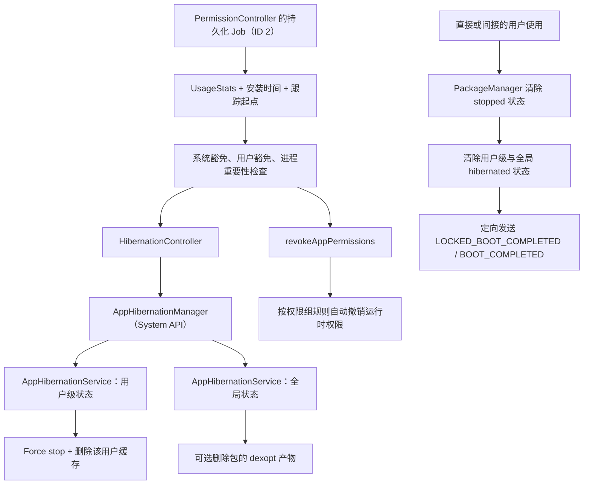

# 后台执行、任务调度与 App Hibernation

后台工作先受进程状态、待机桶和省电策略约束，再由 JobScheduler 或 WorkManager 选择执行窗口。长期未使用的应用进入 Hibernation 后，还会经历权限、缓存和恢复成本。

## 进程状态、待机桶与后台限制

### 为什么要了解后台执行限制

Perfetto 中若显示灭屏后某个进程仍持续占用 CPU，或 Battery Historian 中反复出现后台闹钟（`alarm`）、调度任务（`job`）和网络（`network`）活动，需要判断是应用工作没有停止，还是系统规则已经限制了执行机会。

Android 的后台限制持续演进。Android 6.0 引入休眠模式（Doze）和应用待机（App Standby），Android 8.0 开始限制后台服务（Service），Android 9 把 App Standby 细分为多个待机桶（App Standby Buckets），Android 12 加入 Restricted 桶并限制从后台启动前台服务（Foreground Service，FGS）。Android 14 和 15 又为 FGS 类型、权限和超时规定了更明确的运行时规则。JobScheduler 在 API 34 公开单个等待原因（pending reason），用于说明任务为何尚未执行；API 36 增加多原因与历史视图，API 37 再增加按原因统计的累计等待时长。

了解这套机制有两个直接用途：后台任务未按预期执行时，可以区分系统延后与应用缺陷；确有后台需求时，可以按任务含义选择 API，避免用前台服务、精确闹钟或轮询制造持续负载。

5.1 说明 CPU 调度、EAS 与大小核，5.2 说明 DVFS、Thermal 和 Android 功耗管理框架；本节关注 Android framework（系统框架）何时允许应用在后台继续使用这些资源。

### Android 后台限制如何逐步细化

#### Android 6.0 之前：还没有 Doze 这类设备空闲总控

在 Android 6.0（Marshmallow）之前，平台还没有 Doze 这类统一的设备空闲状态机。进程优先级、Service 生命周期、Alarm 批处理和厂商省电策略已经存在，但应用更容易借助唤醒锁（WakeLock）、Service、Alarm 和轮询在灭屏后继续运行。这不等于当时“后台完全没有限制”，只是 framework 尚未通过 Doze 和 App Standby 系统性地推迟设备空闲期工作。

#### Android 6.0-7.1：Doze、App Standby 与 Light Doze

Android 6.0 同时引入了 **Doze** 和 **App Standby**。Doze 根据设备整体状态工作：设备满足灭屏、静止、未充电等条件后，大量后台活动会被推迟到系统定期开放的维护窗口（maintenance window）。App Standby 根据单个应用的使用情况工作，长时间未被用户打开或交互的应用会受到更严格的后台限制。

Android 7.0（API 24）又加入 **Light Doze**（浅层休眠）。设备灭屏后便可能进入这一较温和的空闲（idle）流程，不必等到“长时间静止”才开始限制活动。它的限制程度低于 Deep Doze（深层休眠），但已经会推迟一部分后台工作。

#### Android 8.0：后台 Service 被系统限制

Android 8.0（API 26，Oreo）明显改变了后台执行模型。这组限制默认作用于目标 API 为 26 及以上，即 `targetSdkVersion >= 26` 的应用。应用转入后台后，已有后台 Service 通常还有数分钟宽限期；宽限期结束后会被停止，从后台创建 Service 也会受限。通知携带的 `PendingIntent`（可由系统稍后代应用执行的操作凭据）、Firebase Cloud Messaging（FCM）的高优先级消息等入口，还可能让应用暂时进入允许名单（temporary allowlist）。因此，调用 `startService()` 是否失败，要结合进程状态、目标 SDK 版本与豁免条件判断。

需要延续用户可感知的工作时，可以先调用 `startForegroundService()`，再在系统规定的时限内调用 `startForeground()` 显示通知。可延迟的工作更适合 JobScheduler 或 WorkManager。同一轮变更还限制了目标 API 为 26 及以上的应用在 manifest（应用清单文件）中注册多数隐式广播；显式广播、只面向本应用的广播、签名权限广播、豁免广播与运行时注册仍有各自的适用条件。

#### Android 9-10：Buckets 与 BAL

Android 9（API 28）把 App Standby 进一步细化为 **App Standby Buckets**，由“常用/不常用”的粗略区分，变成 Active、Working Set、Frequent、Rare 四个主要等级。Android 12 以后又加入 Restricted 桶。

Android 10（API 29）开始限制 **后台启动 Activity（Background Activity Launch，BAL）**。从后台启动 Activity 需要满足用户可见性或系统豁免等条件，锁屏后直接弹出页面的许多路径会被系统阻止。

#### Android 12-17：Restricted bucket、FGS 类型和调试接口

Android 12（API 31）进一步加严后台限制：

- 加入 **Restricted bucket**，对高耗电或长时间不使用的应用施加更严格的 job、alarm 和 network 配额
- 后台启动前台服务时，如果不满足豁免条件，会抛 `ForegroundServiceStartNotAllowedException`
- 精确闹钟（exact alarm）进入特殊应用权限（special app access）体系，`targetSdkVersion >= 31` 的应用需要先确认是否获准使用

Android 13（API 33）继续调整 Restricted bucket 与后台资源策略。分桶条件和阈值属于系统实现，厂商也能采用自己的非 Active 分桶标准，应用不能把某个天数当作稳定规则。Doze 允许名单（allowlist）等豁免还会改变待机桶限制是否生效。

Android 14（API 34）要求 FGS **显式声明类型**，系统会严格校验类型、专属权限和运行时前提。Android 15（API 35）又加入 `mediaProcessing` 类型，并为 `dataSync` / `mediaProcessing` 设置 6 小时预算和 `Service.onTimeout(...)` 超时回调。

Android 16（API 36）加入 `getPendingJobReasons()` 与 `getPendingJobReasonsHistory()`，并把 Active bucket、由前台顶层应用启动的任务（top-started job）和与 FGS 并行执行的 Job 纳入运行时配额。Android 17（API 37）增加 `getPendingJobReasonStats()`，用于按原因汇总累计等待时长；后台音频也新增生命周期与“使用期间”资格（While-In-Use，WIU）约束。

### Doze 与 App Standby 机制的内部工作

Doze 和 App Standby 经常一起出现，但作用对象不同。Doze 看设备整体状态，App Standby 看单个应用的活跃度。排查后台任务时，需要同时核对这两个维度。

#### Deep Doze：把后台工作压缩到维护窗口

Deep Doze 在设备灭屏、静止、未充电一段时间后触发。进入这一状态后，系统会推迟大多数后台活动，只在维护窗口内集中提供一小段执行时间。

Doze 期间，常见限制包括：

- 常规网络访问暂停，通常到维护窗口才会恢复
- 普通 `AlarmManager` 闹钟会推迟到维护窗口
- `JobScheduler`、`SyncAdapter` 等延迟型后台任务会被后移
- Wi-Fi 扫描等周期性动作会被减少或延后

`setAndAllowWhileIdle()` / `setExactAndAllowWhileIdle()` 仍能在 Doze 中触发，但这类空闲期间闹钟（while-idle alarm）也有单独的频率上限，不能作为不受限制的后台入口。

#### Light Doze：先限流，再进入更深 idle

Android 7.0 引入 Light Doze。设备灭屏后就可能先进入这一层。它比 Deep Doze 温和，但已经会推迟一部分 job、同步（sync）和网络活动。很多“刚锁屏就不再立即回调”的现象发生在 Light Doze 阶段，不必等到 Deep Doze。

#### App Standby Buckets：桶常量在 UsageStatsManager，分桶逻辑在 AppStandbyController

App Standby Bucket 的常量定义在 `UsageStatsManager`，桶位管理由 `AppStandbyController` 负责；Doze / device idle 则由 `DeviceIdleController` 负责。在 `android-17.0.0_r1` 中，后两个服务都位于 JobScheduler APEX。APEX 是 Android 用来独立更新部分系统组件的模块格式。

```java
// frameworks/base/core/java/android/app/usage/UsageStatsManager.java
public static final int STANDBY_BUCKET_ACTIVE = 10;
public static final int STANDBY_BUCKET_WORKING_SET = 20;
public static final int STANDBY_BUCKET_FREQUENT = 30;
public static final int STANDBY_BUCKET_RARE = 40;
public static final int STANDBY_BUCKET_RESTRICTED = 45;
public static final int STANDBY_BUCKET_NEVER = 50; // @hide
```

这些常量对应待机等级。应用开发者通常会接触五个公开桶：Active、Working Set、Frequent、Rare、Restricted。`NEVER` 是内部桶，表示安装后一次也未启动的应用。

当前官方 `power-details` 页面给出的资源上限如下。表中数值是应用状态（App state）与设备状态（device state）没有进一步改变限制时的基线：

| Bucket | Regular jobs | Expedited jobs | Alarms | Network |
|------|------|------|------|------|
| Active | 60 分钟滚动窗口内最多 20 分钟 | 24 小时滚动窗口内最多 30 分钟 | 无额外执行上限 | 不限 |
| Working Set | 4 小时滚动窗口内最多 10 分钟 | 24 小时滚动窗口内最多 15 分钟 | 每小时最多 10 次 | 不限 |
| Frequent | 12 小时滚动窗口内最多 10 分钟 | 24 小时滚动窗口内最多 10 分钟 | 每小时最多 2 次 | 不限 |
| Rare | 24 小时滚动窗口内最多 10 分钟 | 24 小时滚动窗口内最多 10 分钟 | 每小时最多 1 次 | 禁用 |
| Restricted | 每天 1 次，最多 10 分钟 | 24 小时滚动窗口内最多 5 分钟 | 每天 1 次，只能是 exact 或 inexact alarm 之一 | 禁用 |

这些上限适用于设备由电池供电、应用没有额外豁免的基线情况。官方 App Standby 文档说明，Standby bucket 的限制只在电池供电（on battery）时生效；`power-details` 页面也列出了充电（charging）、亮屏（screen on）、灭屏且 Doze 生效（screen off + doze active）三种设备状态的差异。充电时基本不按桶限制，灭屏且 Doze 生效时，常规 alarm、job 和 network 还会叠加维护窗口约束。

开发者侧最常用的查询入口仍是 `UsageStatsManager.getAppStandbyBucket()`。测试时可以用 Android 调试桥（ADB）命令 `adb shell am get-standby-bucket <package>` 读取当前桶位，用 `adb shell am set-standby-bucket <package> <bucket>` 强制切换桶位。

#### Bucket 是资源控制器的共同输入，不是单独的执行器

`AppStandbyController` 维护 bucket 及其变更原因（reason），预测组件、用户交互和系统规则都可能更新它。随后，JobScheduler 的 `QuotaController`、AlarmManager、`NetworkPolicyManagerService`，以及与省电模式（Battery Saver）相关的 `AppStateTrackerImpl`，分别使用这份应用状态。它们并没有合并成一个“自适应电池（Adaptive Battery）调度器”：同一 bucket 对 job、alarm、network 的影响不同，还会叠加充电状态、Doze、用户设置的后台限制与豁免。

预测得到的 bucket 也有时效性。在 Android 17 的 Android 开源项目（Android Open Source Project，AOSP）中，预测超过约 12 小时没有刷新便会失效，随后由系统规则重新评估。该超时不表示“12 小时后应用必定进入 Rare”。排查状态变化时，应记录 bucket、reason、预测时间、设备状态，以及各相关系统服务的 `dumpsys` 输出，不能只看设置页中的 Adaptive Battery 开关。

#### 观测方法：先看 `dumpsys`，再看 Battery Historian / Perfetto

`dumpsys` 是读取 Android 系统服务当前状态的诊断命令。排查后台任务时，不能假设每份 trace（性能跟踪记录）中都存在 `device_idle` 轨道；能否直接看到 Doze 状态切换，取决于 trace config（采集配置）、系统版本和厂商裁剪。

观测顺序如下：

- `adb shell dumpsys deviceidle`，确认当前是否进入 light / deep doze，以及 allowlist 状态
- `adb shell dumpsys usagestats appstandby` 或 `adb shell am get-standby-bucket <package>`，确认 bucket
- `adb shell dumpsys jobscheduler <package>`，确认 job 的 pending reason、quota 和实际约束
- 系统诊断报告（bugreport）/ Battery Historian，观察灭屏后 alarm、job、network、wakelock 的时间分布
- Perfetto：在 trace config 已包含 framework、power、batterystats 相关数据源时，再查看灭屏（screen-off）期间的 CPU 活动、唤醒（wakeup）、alarm/job 时间片（slice）和网络活动

Perfetto 更适合回答“后台工作是否拖慢前台、是否在灭屏后持续占用 CPU”；`dumpsys` 和 Battery Historian 更适合回答“系统为何没有立即执行任务”。

Battery Historian 已不再积极维护，适合读取已有 bugreport 中系统事件之间的时间关联；新的性能采集和可重复实验应优先使用 Perfetto、Android Studio Power Profiler 与明确的 `dumpsys` 快照。

使用 `bugreport` 与 `dumpsys` 也能取得等价证据，不必等 trace 中恰好出现 `device_idle` 轨道。

第一组证据用于观察 Doze 状态切换。设备灭屏、静止、未充电后，`dumpsys deviceidle` 显示的状态会从 `active` 进入 `idle` / `idle maintenance`。在对应的 Battery Historian 时间线上，`screen` 熄灭后，`cpu_running` 会从连续活跃变为稀疏脉冲，`job`、`alarm`、`network` 条带集中出现在短暂窗口内；这与官方 Doze 文档描述的 maintenance window 行为一致。15.5《Battery Historian 与功耗分析工具》已经分别说明 `cpu_running`、`wake_lock`、`job`、`alarm` 这些行的含义，可以直接对照阅读。

第二组证据用于观察后台任务被延后。把目标包切到 `Rare` 或 `Restricted` 桶后，先用 `dumpsys jobscheduler <package>` 查看 pending reason、配额（quota）和约束，再看 Battery Historian 的 `job` 行，或 Perfetto 中短时间密集出现的 CPU / network 活动（burst）。正常情况下，任务不会消失，执行时间会被移到配额允许或 Doze 维护窗口到来之后。11.2《App 功耗优化与案例》中的 AlarmManager 滥用案例显示每 60 秒出现一次 `alarm` 唤醒条带，JobScheduler 生命周期错误案例则显示持续 30 分钟的 `WakeLock` 条带。两组样本的问题类型不同，但都能作为可复核的对照，用于区分系统主动延后与任务异常持续运行。

如果 trace config 已启用 power、batterystats 和调度数据源，Perfetto 中可能会出现更少的可运行时间片（runnable slice，即线程已具备运行条件但仍在等待 CPU 的区间），并在维护窗口附近出现短促的 network / alarm burst。CPU 频率是否下降取决于同期系统负载，不能单独用来证明 Doze 已生效。缺少这些数据源时，不应根据空白轨道推断结论，应回到 `dumpsys` 与 bugreport。

### 前台服务：用户可感知工作的运行契约

当应用需要在后台持续执行用户可感知的工作时，前台服务（Foreground Service，FGS）仍是直接选择。系统要求这类工作始终对用户可见，并且会严格校验启动 FGS 的用途和条件。

FGS 能否运行取决于五项检查：调用时应用是否具备从后台启动的资格，manifest 是否声明服务类型，类型专属权限是否齐全，camera / microphone / location 等仅限使用期间的权限（while-in-use permission）在调用时是否有效，以及服务是否在时限内调用 `startForeground()` 并持续满足通知与超时规则。异常出现在哪一项，决定排查 `ForegroundServiceStartNotAllowedException`、`SecurityException`、类型错误，还是前台升级超时（promotion timeout，即启动 Service 后未及时调用 `startForeground()`）。FGS 只改变服务生命周期和用户可见性，并不保证更高的 CPU 优先级或固定频率。

#### 前台服务类型体系

目标 API 为 34 及以上的应用必须声明合适的 FGS 类型。manifest 未声明类型，或已声明类型但缺少专属权限或运行时前提时，`startForeground()` 可能失败。

| 类型 | API 34+ 专属权限 | 强校验版本 | 典型场景 |
|------|------|------|------|
| `camera` | `FOREGROUND_SERVICE_CAMERA` | Android 14 | 用户发起的相机操作、视频通话 |
| `connectedDevice` | `FOREGROUND_SERVICE_CONNECTED_DEVICE` | Android 14 | BLE、USB、外设连接 |
| `dataSync` | `FOREGROUND_SERVICE_DATA_SYNC` | Android 14 | 云同步、备份、上传下载 |
| `health` | `FOREGROUND_SERVICE_HEALTH` | Android 14 | 运动 / 健康数据采集 |
| `location` | `FOREGROUND_SERVICE_LOCATION` | Android 14 | 导航、持续定位 |
| `mediaPlayback` | `FOREGROUND_SERVICE_MEDIA_PLAYBACK` | Android 14 | 音视频播放 |
| `mediaProjection` | `FOREGROUND_SERVICE_MEDIA_PROJECTION` | Android 14 | 投屏、录屏 |
| `microphone` | `FOREGROUND_SERVICE_MICROPHONE` | Android 14 | 录音、语音通话 |
| `phoneCall` | `FOREGROUND_SERVICE_PHONE_CALL` | Android 14 | VoIP / 通话保持 |
| `remoteMessaging` | `FOREGROUND_SERVICE_REMOTE_MESSAGING` | Android 14 | 设备间消息连续性 |
| `shortService` | 无专属权限（仍需 `FOREGROUND_SERVICE`） | Android 14 | 约 3 分钟内必须完成的关键短任务 |
| `specialUse` | `FOREGROUND_SERVICE_SPECIAL_USE` | Android 14 | 无法归类到标准类型的特殊场景 |
| `systemExempted` | `FOREGROUND_SERVICE_SYSTEM_EXEMPTED` | Android 14 | 设备拥有者、紧急角色等系统级集成 |
| `mediaProcessing` | `FOREGROUND_SERVICE_MEDIA_PROCESSING` | Android 15 | 转码、导出、媒体加工 |

`camera`、`microphone`、`location` 等类型还会叠加 while-in-use 权限限制。即使应用满足“允许从后台启动 FGS”的豁免条件，只要相应的运行时权限仅在应用处于前台时有效，仍无法从后台启动这类 FGS。

下面以 `dataSync` 服务为例，展示 manifest 中至少需要声明的权限与服务类型：

```xml
<uses-permission android:name="android.permission.FOREGROUND_SERVICE" />
<uses-permission android:name="android.permission.FOREGROUND_SERVICE_DATA_SYNC" />

<service
    android:name=".SyncService"
    android:exported="false"
    android:foregroundServiceType="dataSync" />
```

这段声明只完成类型与权限登记。应用仍需满足 FGS 启动来源、通知、目标版本和相应类型的运行时条件。

#### 超时机制：`shortService` 看单次时长，`dataSync` / `mediaProcessing` 看 24 小时预算

`shortService` 的规则来自 Android 14 的 FGS types 文档。它没有类型专属权限，但只能运行大约 3 分钟，计时从 `startForeground()` 开始。Android 14 文档明确要求实现 `Service.onTimeout()`：超时后，系统会留给应用几秒钟调用 `stopSelf()` / `stopForeground()`；如果服务仍未退出，应用会触发带 `FOREGROUND_SERVICE_TYPE_SHORT_SERVICE` 的“应用无响应”（Application Not Responding，ANR）错误。官方同时说明，这个回调在 Android 13 及以下不存在，因此兼容旧版本时，应用仍需主动控制停止时机。

对于目标 API 为 35 及以上的应用，Android 15 为 `dataSync` 和 `mediaProcessing` 增加了累计时长预算。两种类型分别按 24 小时窗口统计，同一类型的所有 FGS 共用 6 小时额度；用户把应用带回前台后，计时器重置。预算用完后，再启动同类型 FGS 会直接失败；Android 15 行为变更页给出的报错示例是 `Time limit already exhausted for foreground service type dataSync`。

这一组超时回调以 Android Developers 的 `Service` API 参考文档和 Android 15 行为变更页为准。当前参考文档同时列出 `onTimeout(int startId)` 和 `onTimeout(int startId, int fgsType)` 两个重载：前者对应 `shortService`，后者对应 Android 15 新增的类型化超时。`dataSync` / `mediaProcessing` 收到 `Service.onTimeout(int, int)` 后，如果数秒内仍未调用 `stopSelf()`，Android 系统日志工具 Logcat 会记录 `RemoteServiceException`；`shortService` 超时后仍不退出则会触发 ANR。

#### Android 17 的后台音频硬化

API 37 对后台音频操作施加了更严格的约束。在 Android 17 上运行的所有应用，只要从后台开始播放、请求音频焦点（audio focus，即协调多个应用音频输出优先级的机制）或调节音量，都需要有可见 Activity，或正在运行一个类型不是 `shortService` 的 FGS；如果 `targetSdkVersion` 为 37，该 FGS 还要具备 WIU 资格。由 `BOOT_COMPLETED`（设备启动完成广播）等后台触发器启动的 `mediaPlayback` FGS，如果没有由用户操作形成的 WIU 资格，调用 `AudioManager.requestAudioFocus()` 会返回 `AUDIOFOCUS_REQUEST_FAILED`，播放和音量 API 也可能在不抛异常的情况下失败。

有一项例外需要单独判断：`targetSdkVersion` 为 37 的应用如果已获得 exact alarm 权限，并且操作的是闹钟用途音频流 `USAGE_ALARM`，官方文档明确豁免 WIU 要求。普通媒体、播客和直播的后台播放，仍应在用户发起播放时启动 `mediaPlayback` FGS，并在播放结束或永久失去音频焦点时停止 FGS。

### WorkManager vs JobScheduler vs AlarmManager：选型指南

这三个 API 都能用于后台任务，但用途差异很大。如果所选 API 与任务需求不匹配，常见结果就是任务延迟或受限。

#### WorkManager：默认选择

WorkManager 适合“可以延迟，但希望最终执行”的任务。它会根据系统版本选择实际调度实现，在 API 23 及以上通常使用 JobScheduler，因此 Doze、App Standby bucket 和 quota 仍会生效。

它的优势在于：

- 用 `Constraints` 表达网络、充电、空闲等条件
- 将任务信息持久化到数据库，进程被终止后仍能恢复
- 支持链式依赖和周期任务
- 默认进行批处理，减少零散唤醒

如果任务需要尽快开始，又不适合启动长期 FGS，可以考虑 WorkManager 2.7+ 的 `setExpedited()`。官方文档将加急工作（expedited work）定义为重要、用户在意、可在几分钟内完成且希望立即开始的短任务。它仍受 quota 控制，但与普通 work 相比，较少因 Doze 或 Battery Saver 而长时间延后。

长时运行 Worker（long-running worker）也不能无限执行。即使 WorkManager 为它启动 FGS，任务仍由 JobScheduler 调度；Android 16 起，这类工作可能耗尽应用的 Job 运行时配额（runtime quota）。对于用户主动发起的大数据上传或下载，应评估用户发起的数据传输任务（user-initiated data transfer job）。

#### JobScheduler：系统原生调度层

JobScheduler 是 Android 系统原生的调度 API。与 WorkManager 相比，开发者需要自行处理更多细节，但也能直接使用 WorkManager 尚未完整封装的能力，例如 `setPrefetch()`、`setUserInitiated(true)`，以及不同版本逐步加入的 pending reason 调试接口。

API 版本边界如下：

- API 34：`getPendingJobReason(int jobId)` 返回当前一个主因。存在多个原因时，它不会全部返回。
- API 36：`getPendingJobReasons(int jobId)` 返回当前可能原因的 `int[]`；`getPendingJobReasonsHistory(int jobId)` 返回有限的 `List<PendingJobReasonsInfo>` 历史视图。
- API 37：`getPendingJobReasonStats(int jobId)` 返回 `Map<Integer, Duration>`，按原因汇总任务生命周期内的累计等待时长。

历史记录（history）适合观察约束变化顺序，统计数据（stats）适合判断哪类约束的累计影响最大。多个约束可以同时存在，因此 stats 中各项时长之和可能大于总等待时长；这些统计在设备重启后不会保留，任务完成或取消时也会清除。

这些 API 可以在 `android-17.0.0_r1` 的 `frameworks/base/apex/jobscheduler/framework/java/android/app/job/JobScheduler.java` 复核。

在性能排查中，`getPendingJobReasonsHistory()` 可以呈现任务最近一段时间未执行的原因变化；`getPendingJobReasonStats()` 则适合判断哪类约束反复阻止 Job 执行。

#### AlarmManager：只留给需要精确时刻的事情

AlarmManager 适合需要在精确时间点触发的任务，但这类调用难以参与系统的省电批处理。频繁调用 `setExact()` / `setExactAndAllowWhileIdle()`，会减少系统合并唤醒窗口的机会。

从 Android 12（`targetSdkVersion >= 31`）开始，如果要通过 `PendingIntent` 使用 exact alarm，应用必须先声明并处理 exact alarm special access。`targetSdkVersion >= 33` 时，可以根据场景选择 `SCHEDULE_EXACT_ALARM` 或 `USE_EXACT_ALARM`。代码需要先调用 `AlarmManager.canScheduleExactAlarms()` 检查授权；未获授权时继续调用 exact API 会抛出 `SecurityException`，系统不会自动改为非精确闹钟。

API 37 新增接收 `OnAlarmListener` 与 `Executor` 的 `setExactAndAllowWhileIdle()` 重载。它适合调用进程能够持续存活的短期回调；组件结束或进程不再包含活动组件时，系统可以取消通过监听器注册的闹钟（listener alarm）。如果闹钟需要跨进程生命周期交付，仍应使用 `PendingIntent`。这个重载也不会取消 allow-while-idle 的频率限制。

处理方式通常有三种：

- 引导用户去 `ACTION_REQUEST_SCHEDULE_EXACT_ALARM` 对应的设置页授权
- 改用非精确闹钟（inexact alarm）
- 如果任务本来就不要求秒级，直接改成 WorkManager / JobScheduler

#### 例外与豁免：为什么“已经受限”的任务有时还是能跑

多套后台规则会同时生效，系统也为下列场景保留了明确的例外：

- **加急工作 / 加急任务（expedited work / expedited jobs）**：短、急、用户在意的任务可以请求更快执行，但仍受 quota 控制
- **用户发起的数据传输任务（User-initiated data transfer job，UIDT）**：Android 为“用户明确点击上传或下载”这类数据传输提供专用入口，通过 JobScheduler 的 `setUserInitiated(true)` 声明，并要求显示进度通知
- **临时允许名单（temporary allowlist）**：Android 8.0 文档说明，高优先级 FCM、SMS / MMS 广播、通知 `PendingIntent`、VPN 启动等场景会让应用临时进入 allowlist 数分钟；在此期间，应用可以启动 Service 并继续执行后台逻辑
- **Android 12 及以上的后台启动 FGS 豁免**：高优先级 FCM、用户可见交互、exact alarm 等场景仍可能允许启动 FGS；如果 FCM 最终被系统降级，`startForegroundService()` 依旧会因 `ForegroundServiceStartNotAllowedException` 而失败

因此，看到“受限状态下任务仍然执行”，应先核对它是否满足上述例外条件。

#### 选型决策

可以按这条路径判断：

1. 必须在精确时刻触发，并且是用户明确期待的提醒或闹钟，选择 AlarmManager
2. 任务很短、由用户刚刚触发且需要马上开始，优先评估 expedited WorkManager
3. 任务是用户主动发起的长时间上传或下载，优先评估 UIDT job
4. 任务可以延迟，但希望条件满足后最终执行，默认选 WorkManager
5. 需要 JobScheduler 的系统级能力或更细的调试接口时，直接使用 JobScheduler
6. 任务需要持续运行，并且必须让用户清楚知道其内容时，使用 FGS

以上规则作用于任务调度。系统还会单独管理缓存进程：应用进入 cached（缓存）状态后，`CachedAppOptimizer` 决定何时暂停进程执行。缓存进程冻结与 Doze、Standby bucket 是并行生效的不同机制。

### CachedAppOptimizer 与 Binder：独立的缓存进程冻结机制

Doze、待机桶和 Job 配额决定后台工作何时获得执行机会；缓存应用冻结器（cached apps freezer）决定已处于 cached 状态的进程能否继续占用 CPU。两类机制可能同时影响同一应用，但触发条件和判断证据不同。

Android 11 起支持 cached apps freezer。Android 14 及以上的官方行为是：在支持并启用该功能的设备上，应用进程进入 cached 状态 10 秒后被冻结；收到 Intent、启动 `JobService`、恢复 Activity 等生命周期事件时，系统立即解冻。设备可以通过配置关闭 freezer，文件锁或特定绑定关系也可能使 cached 进程暂不冻结。因此，仅凭“进入 cached 状态已满 10 秒”仍不能证明进程处于 frozen（已冻结）状态。

冻结后，该进程的所有线程都会暂停，不能执行 CPU 工作、垃圾回收（Garbage Collection，GC）或内存裁剪（memory trim）回调。Android 14 还配套处理了以下情况：

- 进入 cached 状态后，系统可能先请求运行时（runtime）执行一次 GC，为后续冻结做准备；
- 冻结后可能触发额外的内存压缩整理（compaction），例如将已修改的文件页（脏页）写回后备存储（backing storage），或将匿名页换出到压缩交换区 ZRAM；
- 运行时注册的广播（context-registered broadcast）可以排队到进程解冻后再交付；清单接收器（manifest receiver）收到广播时，系统会将进程提升出 cached 状态；
- 如果某个应用的所有进程都被冻结，系统会终止该应用仍保持的 TCP socket（网络连接端点），避免保活包（keepalive）继续唤醒蜂窝通信模块（modem）。

这些动作都受设备支持情况或运行时条件影响。一次 freeze 不能证明 GC、compaction、ZRAM 写入必然发生，也不能根据 4 KB / 16 KB 页大小推算固定的内存回收收益。

#### framework 的两阶段冻结

Android 17 的 `CachedAppOptimizer` 先冻结 Binder 接口，再把进程移入 frozen cgroup。Binder 是 Android 的进程间通信（Inter-Process Communication，IPC）机制；cgroup 是内核按组管理进程资源和状态的机制。下面的伪代码展示了调用顺序：

```text
Freezer.freezeBinder(pid, true, timeout = 0)
    ↓ 检查是否有未排空或新到达的事务
Freezer.setProcessFrozen(pid, uid, true)
    ↓ BINDER_GET_FROZEN_INFO 再检查竞态
记录 frozen 状态，并执行冻结后的可选处理
```

这段流程先阻止新的同步 Binder 事务，再暂停全部线程，从而降低调用方等待已无法处理事务的进程而发生死锁的风险。两步并非不可分割的原子操作，因此 framework 在 cgroup freeze 之后还会读取 Binder freezer 状态；如果冻结间隙内出现新的待处理事务（pending transaction），系统会取消本次冻结或执行失败处理。

Android 17 的相关源码入口是：

- `frameworks/base/services/core/java/com/android/server/am/CachedAppOptimizer.java`
- `frameworks/base/services/core/java/com/android/server/am/Freezer.java`
- `system/core/libprocessgroup/profiles/cgroups.json`
- `kernel/common/include/uapi/linux/android/binder.h`
- `kernel/common/drivers/android/binder.c`

#### Binder 返回值的准确含义

在 `android17-6.18-2026-06_r6` 中，冻结相关的用户态内核接口（Userspace API，UAPI）包含 `BINDER_FREEZE`、`BINDER_GET_FROZEN_INFO`，以及三个容易混淆的驱动返回项（driver return）：

| 返回项 | 接收方看到的含义 |
|---|---|
| `BR_FROZEN_REPLY` | 调用方发出的同步事务因目标进程处于 frozen 状态而被拒绝 |
| `BR_TRANSACTION_PENDING_FROZEN` | 调用方发出的异步事务已排队，等待目标解冻 |
| `BR_FROZEN_BINDER` | 已注册冻结通知的一方收到远端 Binder 宿主 frozen / unfrozen 状态变化 |

`BR_FROZEN_REPLY` 不是 `BINDER_FREEZE` ioctl（用户态向内核驱动发出的控制调用）的“冻结成功确认”。同步事务到达 frozen 目标时，驱动会向调用方返回失败；异步事务可以保留在目标队列中。`CachedAppOptimizer` 通过 `BINDER_GET_FROZEN_INFO` 发现进程在 frozen 期间收到同步事务后，可能根据 framework 策略终止该 cached 进程。作出终止决定的是 framework，不能描述成“Binder 驱动直接终止目标进程”。

`binder_frozen_status_info.sync_recv` 的位 0（bit 0）表示进程被冻结后收到同步事务，位 1（bit 1）表示冻结步骤中出现新的待处理同步事务；`async_recv` 记录冻结后是否收到异步事务。排查时要结合 framework 的 freeze / unfreeze 日志和调用方错误，不能根据单个位值推断完整时序。

#### API 36 的冻结通知与回调队列策略

API 36 公开 `IBinder.addFrozenStateChangeCallback(Executor, FrozenStateChangeCallback)`。它只观察远端 Binder 宿主进程的 frozen / unfrozen 状态，不控制进程冻结。内核不支持冻结通知时会抛出 `UnsupportedOperationException`；如果监听者自身也被冻结，或事件到达过快，系统还可能合并状态通知，因此不能用回调次数统计实际冻结次数。

下面的示例在远端 Binder 宿主被冻结时暂停非必要事务，解冻后再恢复：

```java
binder.addFrozenStateChangeCallback(executor, (who, state) -> {
    if (state == IBinder.FrozenStateChangeCallback.STATE_FROZEN) {
        pauseNonEssentialCallbacks(who);
    } else {
        resumeCallbacks(who);
    }
});
```

这段代码只处理状态变化；注册方还必须配合 `removeFrozenStateChangeCallback()` 管理回调生命周期。远端为本地 Binder 时不会出现独立的冻结状态，因为宿主和监听者位于同一进程。

API 36 的 `RemoteCallbackList.Builder` 进一步提供被调用端冻结策略（frozen callee policy）：

- `FROZEN_CALLEE_POLICY_DROP`：冻结期间不保留回调；
- `FROZEN_CALLEE_POLICY_ENQUEUE_MOST_RECENT`：只保留最新状态，解冻后交付；
- `FROZEN_CALLEE_POLICY_ENQUEUE_ALL`：保留事件序列，并受最大队列长度约束；
- `FROZEN_CALLEE_POLICY_UNSET`：保持 API 35 及以前的立即调用行为，仅用于兼容，不建议新代码采用。

状态同步通常选择 `ENQUEUE_MOST_RECENT`，可以重新生成的提示事件可以选择 `DROP`。只有业务必须保留完整事件历史时才选择 `ENQUEUE_ALL`，并设置队列长度上限，以免 frozen 进程解冻后一次收到大量已过期的回调。

### 后台执行对前台性能的影响

性能分析常会聚焦前台应用的渲染和响应，容易遗漏后台行为带来的间接影响。不合理的后台工作经常与前台卡顿、发热和续航缩短同时出现。

#### CPU 争抢

最直接的影响是 CPU 资源争用。当前台应用正在执行布局（layout）或绘制（draw）操作时，后台进程的网络请求、数据同步、图片解码等工作会同时竞争 CPU 时间。在大小核架构（5.1 节）下，如果后台任务长期占用前台关键线程所需的 CPU，还可能增加 RenderThread（渲染线程）的可运行等待时间（runnable delay）。

Perfetto 中后台线程与 RenderThread 同时活跃，只能说明两者并发运行。若要证明 CPU 争用或抢占关系，还要对齐掉帧区间，检查 RenderThread 在唤醒（wakeup）、可运行（runnable）和运行中（Running）状态之间的切换，以及同一 CPU 上 `sched_switch` 事件记录的上一运行线程。后台线程恰好出现在同一 CPU 核上，不足以确定因果关系。

#### 内存压力

后台进程占用内存会增加系统整体内存压力。压力升高后，内核可能让申请内存的线程直接回收页面（direct reclaim），让后台内核线程 `kswapd` 回收页面，或进行交换区读写（swap I/O）。低内存终止守护进程 `lmkd` 也可能根据压力停顿信息（Pressure Stall Information，PSI）和进程优先级选择要终止的进程。分析前台卡顿时，应对齐 `mm_vmscan`（内存回收事件）、PSI、I/O、`lmkd` 事件与应用的内存分配 / GC 时间片；不能只因后台进程的比例集大小（Proportional Set Size，PSS）较大，就认定它造成了某次 GC 停顿。

#### 热节流

持续的后台计算、媒体处理与无线传输会增加整机功耗，进而减少前台工作负载可用的热余量（thermal headroom，即达到热限制前仍可使用的温度与功耗空间）。达到设备热策略阈值后，热管理模块（thermal）、电源硬件抽象层（Power HAL）或频率上限可能共同限制 CPU / GPU 性能。

排查时应同时观察后台负载开始时间、热状态（thermal status）/ 温区、CPU / GPU 频率上限、冷却设备状态和帧耗时。频率下降也可能源于低利用率或省电策略；即使温度上升与掉帧同时发生，仍需通过只改变一个条件的对照实验确认因果关系。

### 与其他机制的关系

**与 CPU 调度（5.1）的关系**：Standby bucket 主要控制 job、alarm、network 等后台资源额度，不会直接为线程设置固定的 CPU 优先级。它主要产生间接影响：后台任务被延后后，可运行线程减少，前台的 CPU 争用压力也会下降。线程进入 runnable 状态后，CPU 如何分配还取决于进程状态、控制组（cgroup）、利用率限制机制（uclamp）、线程策略和具体子系统规则。

**与 EAS（5.1）的关系**：零散的后台任务会产生更多唤醒和短暂 runnable 区间，可能增加 CPU 核选择、线程迁移和频率响应成本。是否发生迁移仍取决于 CPU 亲和性（affinity）、允许线程运行的 CPU 集合（cpuset）、利用率与设备能耗模型（Energy Model）。

**与 DVFS（5.2）的关系**：后台工作提高调度利用率后，CPUFreq 调频策略（governor）可能请求更高频率。Doze 和 bucket 限制会减少不必要的 runnable 负载，使系统更容易合并唤醒并延长空闲（idle）时间。

**与 Thermal（5.2）的关系**：后台同步、转码、上传等持续工作容易逐步升高片上系统（System on Chip，SoC）的温度。温度超过阈值后，Thermal 降频会影响整机性能和前台体验，不会只限制后台线程。

**与 Android 功耗管理（5.2）的关系**：5.2 节侧重 WakeLock、`PowerManagerService`、device idle 等系统机制；本节侧重 framework 规则和 API 选择，说明哪些条件会延后或拒绝应用层后台任务。

**与响应速度（8.4）的关系**：BAL 限制从 Android 10 开始加严，后续版本仍在增加约束。后台能否启动 Activity，取决于用户可见性、通知、`PendingIntent`、`IntentSender` 路径和系统豁免条件，不能直接套用旧版本经验。

### 版本与实现边界

| 版本 | 核心变化 | 性能分析影响 |
|------|----------|-------------|
| Android 6.0 (API 23) | 引入 Doze 和 App Standby | 灭屏后后台任务开始系统级延后 |
| Android 7.0 (API 24) | 引入 Light Doze | 刚灭屏就可能开始限流 |
| Android 8.0 (API 26) | 对目标 API 为 26 及以上的应用限制后台 Service 与 manifest 隐式广播 | 需要结合宽限期、临时允许名单与广播种类判断 |
| Android 9.0 (API 28) | 引入 App Standby Buckets | Job、alarm、network 开始按桶分级限制 |
| Android 10 (API 29) | 增加 BAL 限制 | 后台弹 Activity 的路径明显变少 |
| Android 12 (API 31) | Restricted bucket、后台启动 FGS 限制、exact alarm special access | 后台任务调度和 FGS 启动都要先通过相应条件检查 |
| Android 13 (API 33) | Restricted bucket 与后台资源规则继续调整 | 分桶阈值不是应用可依赖的公开契约 |
| Android 14 (API 34) | FGS 类型强制声明，新增 `remoteMessaging`、`shortService`、`systemExempted` 等类型；cached app 进入 cached 约 10 秒后冻结，并引入冻结前 GC 请求 + 冻结后 compaction | FGS 类型、权限和运行时前提都要写完整 |
| Android 15 (API 35) | `mediaProcessing` 类型加入，`dataSync` / `mediaProcessing` 引入 6 小时预算 | 长时间同步和媒体加工要处理超时回调 |
| Android 16 (API 36) | 多原因 / history API、Job runtime quota 扩大适用范围；Binder 增加 frozen callback | 可定位多重 Job 约束，并按远端 frozen 状态处理回调 |
| Android 17 (API 37) | `getPendingJobReasonStats()`；后台音频要求可见 Activity 或非 short FGS，target 37 后台 FGS 还需 WIU 或满足 alarm 豁免 | Job 原因可聚合分析，后台音频要核对完整生命周期条件 |

### 常见误区

#### 误区 1："WorkManager 保证任务在指定时间执行"

WorkManager 不保证精确时间。它定义约束条件，系统在条件满足后的合适时机执行。只有闹钟、日历提醒等用户明确要求准确时刻的功能，才应在处理 exact alarm 权限后使用 AlarmManager；普通定时同步应接受非精确触发或改用 WorkManager / JobScheduler。

#### 误区 2："前台服务不会被系统杀掉"

前台服务进程的优先级较高，但系统仍可终止它。内存极度紧张时，系统可能终止前台服务进程。另外，从 Android 15 开始，`dataSync` 和 `mediaProcessing` 类型有 6 小时的超时限制。

#### 误区 3："我的 JobScheduler 不执行一定是系统 bug"

常见原因包括 bucket、quota、任务约束和设备状态。先用 `adb shell am get-standby-bucket <package>` 查看桶位，再用 `adb shell dumpsys jobscheduler <package>` 查看具体约束。API 34 可通过 `getPendingJobReason()` 查询单个原因，API 36 可查询多原因和 history，API 37 可查询累计 stats。

#### 误区 4："Doze 只在晚上才生效"

Doze 的触发条件是灭屏 + 静止 + 未充电，与时间无关。白天如果手机放在桌上灭屏不动，一样会进入 Doze。

#### 误区 5："后台限制只影响后台 App"

后台规则直接控制后台任务的执行机会，但后台工作造成的 CPU 争用、内存压力和热节流也会拖慢前台应用。减少无效后台工作同样有助于改善前台性能。

## 任务约束、批处理与执行窗口

平台允许后台执行后，任务调度器还要综合网络、充电、空闲和配额。WorkManager 的可靠语义最终落到这些系统调度能力。

### 为什么后台任务需要系统调度

后台同步、日志上传、缓存整理和资源预取都有一个共同特点：它们通常可以延后执行。若每个应用都用精确闹钟唤醒设备，再自行持有唤醒锁（WakeLock）阻止 CPU 休眠，系统就很难把多个应用的工作安排到同一个活跃窗口。单次任务也许只运行几十毫秒，大量零散唤醒仍会缩短 CPU 在深度空闲状态中的停留时间。

JobScheduler 让应用声明“做什么、需要哪些条件、最晚可以延后多久”，再由系统结合设备状态和所有应用的请求选择执行时机。WorkManager 在此基础上增加任务持久化、依赖关系、重试和版本兼容处理。两者都适合可延期的后台工作，但都不保证精确定时，也不允许任务无限运行。

需要回答三个问题：

1. 一个调度任务（job）从 `schedule()` 到 `JobService` 会经过哪些组件；
2. 任务迟迟不运行时，怎样区分约束、配额、设备状态和应用自身问题；
3. WorkManager、加急任务（Expedited Job）、用户发起的数据传输任务（User-Initiated Data Transfer，UIDT）、前台服务（Foreground Service）和精确闹钟分别适合什么场景。

设备休眠（Doze）的系统功耗背景见 5.2 节；应用待机（App Standby）与后台执行限制的策略入口已在前文说明。本文引用的平台源码以 `android-17.0.0_r1` 为基准。

### JobScheduler 的调度模型

#### 声明执行条件，而非预订一个时刻

AlarmManager 面向时间点或时间窗口；JobScheduler 面向带条件的工作。下面的代码声明“联网且电量不低后再同步”，没有承诺在某个固定时刻开始：

```kotlin
val job = JobInfo.Builder(
    SYNC_JOB_ID,
    ComponentName(context, SyncJobService::class.java)
)
    .setRequiredNetworkType(JobInfo.NETWORK_TYPE_ANY)
    .setRequiresBatteryNotLow(true)
    .build()

val result = context.getSystemService(JobScheduler::class.java).schedule(job)
```

这段代码只负责构建并提交任务。生产代码还要检查 `schedule()` 的返回值：`RESULT_SUCCESS` 只表示系统接受了任务，不表示任务已经启动；参数无效、达到调度限制或 Expedited Job 没有可用配额时，都可能返回 `RESULT_FAILURE`，也可能在构建阶段抛出异常。

AlarmManager 仍适用于闹钟、日历提醒等面向用户的精确时间事件。其精确闹钟访问权限、Doze 行为和不同重载的生命周期边界见前文。普通同步和维护任务应优先交给 JobScheduler 或 WorkManager，为系统保留合并任务和唤醒的空间。

#### Android 17 源码中的核心组件

Android 17 的 JobScheduler 实现位于 `frameworks/base/apex/jobscheduler/`。应用侧 API 与系统服务分别存放在以下目录：

- `framework/java/android/app/job/`：`JobInfo`、`JobScheduler`、`JobService` 等公开 API；
- `service/java/com/android/server/job/`：`JobSchedulerService`、`JobStore`、`JobConcurrencyManager`、`JobServiceContext`；
- `service/java/com/android/server/job/controllers/`：网络、电量、空闲、存储、时间、配额等状态控制器。

下面的调用路径展示普通 job 从应用提交到 `JobService.onStartJob()` 回调的过程。其中 `system_server` 是承载 Android 核心系统服务的进程：

```text
App: JobScheduler.schedule(JobInfo)
  -> system_server: JobSchedulerService.scheduleAsPackage(...)
  -> startTrackingJobLocked(...)
  -> 各 StateController 跟踪并更新约束状态
  -> maybeQueueReadyJobsForExecutionLocked(...)
     或 queueReadyJobsForExecutionLocked(...)
  -> mPendingJobQueue
  -> maybeRunPendingJobsLocked()
  -> JobConcurrencyManager.assignJobsToContextsLocked()
  -> JobServiceContext.executeRunnableJob(...)
  -> bind JobService
  -> JobService.onStartJob(JobParameters)
```

这条路径说明，job 出现在 `dumpsys jobscheduler` 中，只能证明 `JobSchedulerService` 正在跟踪它。任务还要经过状态控制器（Controller）的约束判断、配额检查与并发选择，之后才会进入某个 `JobServiceContext` 并绑定应用服务。

几个核心组件各自负责的范围如下：

| 组件 | Android 17 中的职责 |
|---|---|
| `JobSchedulerService` | 接收、校验、跟踪和排队 job，协调状态变化与执行 |
| `StateController` 子类 | 维护一类约束或策略状态，并通知服务重新评估相关 job |
| `JobStore` | 保存已登记 job；持久化 job 写入 `/data/system/job/jobs.xml` |
| `JobConcurrencyManager` | 根据并发容量、工作类型（work type）和优先级给 job 分配执行上下文 |
| `JobServiceContext` | 绑定应用的 `JobService`，管理回调、超时、停止原因和 WakeLock |

Android 17 的 Controller 包括 `ConnectivityController`、`BatteryController`、`IdleController`、`StorageController`、`TimeController`、`ContentObserverController`、`QuotaController`、`BackgroundJobsController`、`DeviceIdleJobsController`、`PrefetchController`、`FlexibilityController` 等。它们并非依次执行的一组过滤器。每个 `JobStatus` 都保存当前约束是否满足；状态发生变化后，服务会重新选择可运行任务。

#### JobStore、重启与持久化边界

调用 `setPersisted(true)` 的 job 会由 `JobStore` 写入 `/data/system/job/jobs.xml`，设备重启后可以恢复。使用该能力需要 `RECEIVE_BOOT_COMPLETED` 权限。未持久化的 job 不会在系统重启后自动恢复。

持久化只覆盖 JobScheduler 的登记信息。应用仍需自行保证业务数据的事务完整性和幂等性；幂等性是指同一操作重复执行时，不会产生重复记录或其他额外副作用。卸载应用、清除数据或取消 job 都会改变这份状态。`JobInfo` 中的临时对象也受限制，例如持久化 job 不能依赖无法写入持久存储的 `ClipData`。

AlarmManager 的 alarm 默认不会跨重启保留，应用通常在收到设备启动完成广播 `BOOT_COMPLETED` 后重新登记。两种 API 的差异在于调度记录能否由系统恢复，与某个应用组件在重启后是否存在无关。

#### JobService 生命周期与系统 WakeLock

`JobService.onStartJob()` 和 `onStopJob()` 都在应用主线程回调，因此不能直接在回调中执行耗时工作。下面的示例把同步任务交给 I/O 协程，并处理正常完成与系统停止两种情况：

```kotlin
class SyncJobService : JobService() {
    private val scope = CoroutineScope(SupervisorJob() + Dispatchers.IO)
    private var running: Job? = null
    @Volatile private var stoppedBySystem = false

    override fun onStartJob(params: JobParameters): Boolean {
        stoppedBySystem = false
        running = scope.launch {
            val needsRetry = try {
                syncOnce()
                false
            } catch (_: CancellationException) {
                return@launch
            } catch (_: Exception) {
                true
            }
            if (!stoppedBySystem) {
                jobFinished(params, needsRetry)
            }
        }
        return true
    }

    override fun onStopJob(params: JobParameters): Boolean {
        stoppedBySystem = true
        running?.cancel()
        return true
    }

    override fun onDestroy() {
        scope.cancel()
        super.onDestroy()
    }
}
```

`onStartJob()` 返回 `true` 表示工作在该回调结束后仍会继续，完成时必须调用 `jobFinished()`。收到 `onStopJob()` 后，应用应尽快停止当前工作，并且不再为这次执行调用 `jobFinished()`；`onStopJob()` 的返回值表示系统是否应按退避策略再次调度。示例用 `stoppedBySystem` 区分正常完成与系统停止，实际业务代码还应记录停止原因，并处理两个回调可能交错发生的并发竞态。

Android 17 的 `JobServiceContext.executeRunnableJob()` 会创建并持有 `PARTIAL_WAKE_LOCK`，在清理执行上下文时释放。这类部分唤醒锁允许屏幕关闭后 CPU 继续运行。因此，JobService 通常无须为同一段执行再次自行持锁。遗漏 `jobFinished()` 会让系统持续把任务视为运行中，直到任务完成、被停止或因超时而清理，造成不必要的运行时间和功耗；但这不会让 WakeLock 永久保留。

#### 约束、时间窗口与 deadline

常用 `JobInfo.Builder` 条件如下：

| 条件 | API | 诊断时要注意的边界 |
|---|---|---|
| 网络 | `setRequiredNetworkType()` / `setRequiredNetwork()` | “有网络”不表示服务端一定可达；计费、漫游和网络能力也可能不符合要求 |
| 充电 | `setRequiresCharging()` | 仅在工作只适合充电时设置 |
| 设备空闲 | `setRequiresDeviceIdle()` | 这是显式 job 条件，不能直接等同于 Doze 的全部状态 |
| 电量不低 | `setRequiresBatteryNotLow()` | 阈值由系统决定 |
| 存储不低 | `setRequiresStorageNotLow()` | 适合会明显增加存储占用的工作 |
| 最早时间 | `setMinimumLatency()` | 表示最早可以开始，不是定时器 |
| 截止窗口 | `setOverrideDeadline()` | 到期后可放宽功能约束，仍可能受 Doze、配额、系统健康等限制 |
| 内容变化 | `addTriggerContentUri()` | 适合等待 ContentProvider 变化稳定后再处理，即对连续变化进行去抖（debounce） |
| 周期 | `setPeriodic()` | 周期运行有最小间隔，也会被批处理和跳过 |

`setOverrideDeadline()` 只适用于非周期 job。Android 5.0 曾以到期执行为目标；从 Android 6.0 起，公开文档已不再保证任务会在截止时间（deadline）执行。到达 deadline 后，网络、充电等显式条件可以被视为满足，但 Doze、后台限制、配额和系统负载仍可能推迟任务。需要精确用户提醒时，应使用 AlarmManager 的相应能力。

条件越多，可执行窗口通常越少。把“充电、非计费网络、设备空闲、电量不低”全部加上，看似节能，也可能使一项业务数据数天无法上传。设置每个约束前都应回答一个问题：缺少它时，工作会失败，还是仅仅成本稍高？如果只是成本较高，更适合由业务进行降级或分批处理，不必一律阻止调度。

#### 优先级、Standby Bucket 与配额

JobScheduler 不会按照 `schedule()` 的调用顺序逐个运行任务。候选任务同时受约束、优先级、应用状态、待机桶（Standby Bucket）、配额、系统负载和并发容量影响。

`JobInfo.Builder.setPriority()` 在 API 33 公开。优先级用于比较调用应用自己的 job；Android 14 起，文档进一步将排序范围限定为同一个 job 命名空间（namespace，用于隔离同一应用内不同任务组的标识范围）。它不是跨应用争抢 CPU 的全局优先级。重试 job 的有效优先级还可能逐步降低，因此把所有任务都设为 `PRIORITY_HIGH`，也不会获得稳定的低延迟。

App Standby Buckets 的版本边界需要分开看：

- Android 9（API 28）引入 `ACTIVE`、`WORKING_SET`、`FREQUENT`、`RARE` 四档；
- `STANDBY_BUCKET_RESTRICTED` 常量在 API 30 加入，Android 11 默认并未启用该档；
- 档位越靠后，后台 job、alarm 和网络活动通常受到更严格限制；
- Bucket 是系统策略的输入，应用无法把它当作可可靠控制的开关。用户活跃使用可能改善状态，但应用不应假定某次交互一定能获得固定额度。

`QuotaController` 根据一组随版本演进的策略和执行历史管理配额，不能用固定的“每天 N 分钟”公式概括。设备厂商、系统版本、应用状态和 bucket 都会影响结果。Android 16 又扩大了运行时配额的适用范围：应用在前台时启动、随后进入后台的 job，以及与 Foreground Service 并行的 job，都不能再假定始终不计入后台 job 运行额度。

这里的 quota 记录 job 执行会话经过的实际时长（elapsed time），不读取线程真正占用 CPU 的时间（CPU time）。`JobService` 内部阻塞于网络、等待 Binder 或主动休眠（sleep），仍可能占用执行窗口；反过来，多线程并行也不会把各线程的 CPU 时间简单相加为一项公开“CPU 配额”。如果资料使用“CPU 时间配额”一词，必须先核对它指系统执行时长、厂商私有策略，还是应用自己的 CPU 预算。

一次 job 能否开始，可以按五项检查定位：调度请求已被接受；显式与隐式约束已满足；配额与待机策略（quota / standby policy）允许执行；任务获得并发槽位并通过优先级选择；`JobServiceContext` 成功绑定并执行服务。任务开始后，还可能因超时、约束失效、热状态（thermal）、Doze 或其他系统停止原因而结束。`schedule()` 成功、`isReady()` 为真和 `onStartJob()` 已回调，是三个不同状态。

排查任务积压时，应同时查看显式约束和配额。如果网络、电量均已满足，而 `PENDING_JOB_REASON_QUOTA` 长时间存在，继续放宽网络条件不会解决问题。此时应减少触发频率、合并请求、缩短执行时间，或重新判断该任务是否属于用户发起的传输。

#### Expedited Job

Android 12（API 31）加入 `setExpedited(true)`。Expedited Job 适合重要、短小且需要尽快开始的工作，默认优先级为 `PRIORITY_MAX`，并使用限制更严格、会随时间恢复的专用配额。

Android 17 的 `JobInfo` 校验规则很明确：

- 只能设置网络、存储不低和持久化相关条件；
- 不能设置最小延迟、deadline、周期或 Content URI 触发；
- 不能同时标记为用户发起（user-initiated）；
- 优先级只能是 high 或 max。

直接使用 JobScheduler 时，如果调用时没有 Expedited 配额，`schedule()` 会立即返回 `RESULT_FAILURE`，job 不会进入系统队列。已经处于等待状态（pending）的 Expedited Job 后来缺少配额时，可以按普通 job 运行。应用应记录 `schedule()` 结果，并通过 `JobParameters.isExpeditedJob()` 判断本次执行是否仍具备 expedited 属性。

下面的代码通过 `setExpedited(OutOfQuotaPolicy)` 声明配额不足时的处理策略：

```kotlin
val request = OneTimeWorkRequestBuilder<SyncWorker>()
    .setExpedited(OutOfQuotaPolicy.RUN_AS_NON_EXPEDITED_WORK_REQUEST)
    .build()
```

在这段代码中，`RUN_AS_NON_EXPEDITED_WORK_REQUEST` 会在配额不足时将任务改为普通 work；另一选项 `DROP_WORK_REQUEST` 会取消该 work。选择前者时，业务必须接受延后；选择后者时，业务必须接受任务被丢弃。Expedited 仍可能因约束或系统负载而推迟，不能用于精确定时。

#### User-Initiated Data Transfer

Android 14（API 34）加入 `setUserInitiated(true)`，简称 UIDT。它适用于由用户明确发起、需要显示进度的网络传输，例如上传一段刚选中的长视频。

在 Android 14 的公开约束下，UIDT job 需要：

- 声明 `RUN_USER_INITIATED_JOBS`；
- 在应用处于前台，或处于允许启动 Activity 的状态时调度；
- 指定网络约束；
- 运行期间通过 `JobService.setNotification()` 提供通知；
- 不设置延迟、deadline、周期、device-idle 或 Content URI 触发。

UIDT 不使用普通 job 配额，在约束满足且系统状态允许时会尽快开始。用户从系统提供的入口停止任务后，应用不能在没有提示的情况下重新提交同一项传输。自动同步、遥测上传等缺少明确用户动作的任务不属于 UIDT。

### WorkManager 的架构与性能边界

#### “可靠执行”具体涵盖什么

WorkManager 适合可延期、异步，而且需要在应用进程或设备重启后继续安排的工作。它将 `WorkSpec`、依赖关系、输入输出、重试次数和状态写入 Room 数据库；初始化时恢复未完成记录，再交给可用的调度器（Scheduler）。Room 是 AndroidX 提供的 SQLite 数据库访问层。

这项可靠性有清楚的边界：

- 应用进程被系统常规回收后，系统调度和数据库记录仍可让工作继续；
- 设备重启后，WorkManager 会重建符合条件的底层调度；
- 应用被强行停止（force-stop）后，系统会取消该包的 alarm 和 job；WorkManager 要等应用再次启动并完成初始化，才会检测并重新安排任务；
- 卸载应用或清除数据会删除 WorkManager 数据库；
- 约束长期不满足、配额不足或设备策略持续限制时，执行可以长时间推迟。

因此，这里的“可靠”是指调度状态可以恢复，不表示任务会立即执行、在精确时刻执行或无条件完成。业务数据仍需支持幂等处理、断点续传和服务端去重。

#### 当前稳定版中的调度器

Android 17 对应的内容以 WorkManager 2.11.2 为库版本基准，2.11 系列的 `minSdk` 是 23。其主要角色如下：

| 角色 | 职责 |
|---|---|
| `WorkDatabase` | 保存 `WorkSpec`、依赖、标签（tag）、进度与调度状态 |
| `Processor` | 启动并跟踪当前进程内的 Worker |
| `SystemJobScheduler` | 通过 JobScheduler 保留跨进程生命周期的调度记录 |
| `GreedyScheduler` | 进程存活时，立即尝试执行已经满足条件的 work |
| `SystemAlarmScheduler` | 旧版 WorkManager 在 API 14—22 的兼容路径 |

`SystemJobScheduler` 和 `GreedyScheduler` 可以同时存在：前者向系统登记任务，后者在进程已存活且条件满足时减少等待。它们不是启动时只能选择其一的互斥分支。

在 Android 8.0—17 范围内，WorkManager 2.11 使用 `SystemJobScheduler`；`SystemAlarmScheduler` 只用于解释旧版库和 API 22 及以下设备的历史 trace。WorkManager 2.11 已不支持这些低版本设备。系统中的 JobScheduler 记录由 WorkManager 管理，WorkManager 还会自行持久化依赖与重试状态；应用不应依赖其内部 job ID，也不应自行修改相应的系统 job。

WorkManager 2.10 起为系统 job 增加了更易读的跟踪标签（trace tag），因此较新版本的 `dumpsys jobscheduler` 输出更容易关联到具体 Worker。

#### One-time、Periodic 与任务链

`OneTimeWorkRequest` 适合一次性可靠工作。需要防止应用每次启动都重复入队时，可以用 `enqueueUniqueWork()` 表达业务唯一性，并明确选择替换、保留或追加策略。

`PeriodicWorkRequest` 的最小重复间隔（repeat interval）是 15 分钟。弹性间隔（flex interval）表示每个周期内允许执行的窗口。例如，周期为 30 分钟、flex 为 15 分钟时，候选窗口位于该周期的后 15 分钟。约束、系统优化和配额仍会推迟执行，某个周期也可能被跳过；系统不会补执行每一个错过的时间点。

周期工作（Periodic Work）的性能风险主要来自业务频率：

- 周期接近下限且每次只上传少量数据，容易产生零散的数据库操作、网络请求和设备唤醒；
- 条件反复变化会触发多轮约束评估；
- Worker 自己没有幂等保护时，重试和进程重启可能放大服务端请求。

应优先在业务层累计一批数据，并设置足够宽的网络和时间窗口。不要为了“每 15 分钟检查一次有没有事情”创建没有实际工作的 Worker；可以由事件驱动的任务，应在数据变化时入队。

任务链会持久化节点之间的依赖关系。一个节点完成后，WorkManager 更新数据库，解除后继节点的依赖，再将符合条件的 `WorkSpec` 交给 Scheduler。短链的管理成本通常可以接受；如果十几个节点各自只执行几行内存计算，数据库状态迁移、跨调度阶段和数据序列化的成本可能超过计算本身。需要独立重试、独立约束或独立观测的步骤适合分开；只在同一进程内连续转换数据的步骤，更适合放在一个 Worker 或普通协程中。

#### Long-running Worker 与 Android 16 配额

WorkManager 的长时运行 Worker（long-running worker）会借助 Foreground Service 和通知运行。它提供较长的执行窗口，但任务仍由 WorkManager 的 JobScheduler 路径承载。

Android 16 起，long-running worker 会消耗应用的 JobScheduler 运行时配额。若应用频繁执行长任务，配额耗尽会影响其他普通 work。官方建议按场景重新选型：

- 用户发起的大文件网络传输：优先考虑 UIDT；
- 用户持续可见、类型符合且需要长时间运行的非纯传输工作：评估直接 Foreground Service；
- 可分片、可延期的维护任务：拆成可恢复的普通 WorkRequest。

将 Worker 提升到前台不会获得无限运行额度。Foreground Service 本身还受启动限制、服务类型（service type）、权限和分类型时长规则约束，详见前文的前台服务小节。

### 后台任务选型

选择 API 时，先判断工作是否必须跨进程生命周期保留，再判断它是否由用户刚刚明确发起，以及允许延后的时间和预计持续时长。

| 场景 | 推荐入口 | 需要接受的限制 |
|---|---|---|
| 页面存活期间的短异步计算 | 协程（coroutine）/ 线程执行器（executor） | 进程退出即可取消；不要借持久调度器延长生命周期 |
| 可延期、需重试、需跨重启 | WorkManager one-time | 受约束、bucket、配额和系统负载影响 |
| 周期维护或汇总 | WorkManager periodic | 最短 15 分钟；不精确，周期可能跳过 |
| 用户刚触发的重要短任务 | Expedited Work / Expedited Job | 专用配额有限；仍可能延迟；要定义配额不足策略 |
| 用户发起的大文件上传或下载 | UIDT Job | Android 14+；网络传输限定；需权限、前台调度条件和通知 |
| 用户持续可见的长工作 | Foreground Service | 受后台启动、service type、权限和时长规则限制 |
| 闹钟、日历提醒等精确用户事件 | AlarmManager exact alarm | 需满足精确闹钟访问和版本政策；不用于普通轮询 |

一个常用判断顺序是：

1. 离开当前页面或进程后，任务是否仍有业务价值？如果没有，使用进程内并发工具。
2. 任务能否延后，并由系统选择执行时机？如果可以，使用普通 WorkManager。
3. 是否由用户刚刚明确发起，而且工作很短？评估 expedited。
4. 是否为用户发起的长网络传输？评估 UIDT。
5. 是否需要用户持续感知的长时间执行？检查 Foreground Service 的合规条件。
6. 是否要求在用户可感知的精确时刻执行？再评估 exact alarm。

### Android 17 的调试接口

#### pending reason 的 API 34、36、37 边界

JobScheduler 分阶段增加了查询“任务为何仍在等待”的公开接口。这里的等待原因称为 pending reason：

| API | 版本 | 返回内容 |
|---|---:|---|
| `getPendingJobReason(jobId)` | API 34 | 一个当前主原因；新代码优先使用复数接口 |
| `getPendingJobReasons(jobId)` | API 36 | 当前所有已知挂起原因 |
| `getPendingJobReasonsHistory(jobId)` | API 36 | 有限的原因变化历史和时间戳 |
| `getPendingJobReasonStats(jobId)` | API 37 | 每个原因的累计 `Duration` |

下面的示例在 API 37 及以上读取各 pending reason 的累计时长，并取出配额等待时间：

```kotlin
if (Build.VERSION.SDK_INT >= 37) {
    val stats: Map<Int, Duration> =
        jobScheduler.getPendingJobReasonStats(jobId)
    val quotaWait = stats[
        JobScheduler.PENDING_JOB_REASON_QUOTA
    ] ?: Duration.ZERO
}
```

这段代码返回的各项时长不能直接相加为“总等待时间”。多个原因可以在同一时间段重叠，因此各项之和可能大于 job 从开始等待到查询时经过的墙钟时间（wall-clock time）。统计不会跨设备重启保留；job 成功完成或被取消后也会清除。查询无效的 pending job 还可能抛出异常，调试代码需要检查系统版本和任务状态。

`PENDING_JOB_REASON_DEVICE_STATE` 在 API 34 已存在，用来概括 Doze、省电模式、内存压力、热状态等系统条件。API 37 新增累计统计接口，但没有将该原因细分为一组固定的 thermal 或 battery-saver 子原因。

#### ProfilingTrigger 的相关边界

Android 17 为 `ProfilingTrigger`（达到指定事件时启动性能采集的配置）增加了冷启动、内存不足（Out of Memory，OOM）和 CPU 使用过量终止（excessive CPU kill）等触发类型：

- `TRIGGER_TYPE_COLD_START`：可触发调用栈采样（call stack sample）与系统跟踪（system trace）；
- `TRIGGER_TYPE_OOM`：可触发 Java 堆转储（heap dump）；
- `TRIGGER_TYPE_KILL_EXCESSIVE_CPU_USAGE`：在异常 CPU 使用导致进程终止后提供调用栈采样。

冷启动触发器可用于判断 WorkManager 初始化或积压任务是否占用了应用启动的关键路径。excessive CPU kill 与 JobScheduler quota 是两套不同机制：前者用于诊断进程因异常 CPU 消耗而被终止的事件，后者决定 job 的调度与运行额度。没有公开依据时，不应给出固定的 CPU 阈值或检查周期，也不应将进程终止归因于 quota。

### 从系统到应用的观测面

#### `dumpsys jobscheduler`

`dumpsys jobscheduler` 用于读取系统侧保存的 JobScheduler 状态。下面的命令只查看指定包名，以缩小输出范围：

```bash
adb shell dumpsys jobscheduler com.example.app
```

命令中的 `com.example.app` 需要替换为目标应用包名。不同 Android 版本和厂商的输出格式会变化，排查时重点查找：

- job ID、namespace、Service 与来源用户标识符（User Identifier，UID）；
- 要求的约束与已满足的约束（required / satisfied constraints）；
- standby bucket、quota 与系统偏好值 / 优先级（bias / priority）信息；
- pending、active、ready 状态；
- 最近一次停止原因、失败次数和退避信息；
- WorkManager 的 `SystemJobService`，以及较新版本附带的 Worker trace tag。

如果只搜索业务 `JobService`，可能遗漏 WorkManager。API 23 及以上的 WorkManager 系统侧 Service 通常是 `androidx.work.impl.background.systemjob.SystemJobService`。

WorkManager 2.4.0 及以上还提供诊断广播。下面的命令会让调试版本（debug build）把最近完成、正在运行和已经调度的 work 输出到 Android 日志工具 Logcat：

```bash
adb shell am broadcast \
  -a "androidx.work.diagnostics.REQUEST_DIAGNOSTICS" \
  -p "com.example.app"
```

这份输出适合核对通用唯一标识符（Universally Unique Identifier，UUID）、Worker 类名、状态、唯一工作名称（unique name）和 tag。它反映 WorkManager 数据库中的状态，仍需与 `dumpsys jobscheduler` 的系统状态相互核对。

#### Background Task Inspector

Android Studio 中的工具名是 **Background Task Inspector**（后台任务检查器），入口位于 App Inspection。它要求 API 26 及以上设备；检查 WorkManager 还要求 WorkManager 2.5.0 及以上。该工具可以查看 Worker 状态、约束、输出和任务链，也可以取消选中的 work，或将其标记为失败、重新执行，适合开发阶段复现问题。

它观察的是 WorkManager 数据和应用进程，不能替代系统侧的 `dumpsys jobscheduler`。Inspector 显示 `ENQUEUED` 时，还要继续查看系统 job 是否受到配额、Doze 或系统状态限制。

#### Perfetto：事件与状态分开看

Android 17 的 Perfetto SQL 标准库提供两种观察 JobScheduler 的方式，分别对应调度事件和状态区间。

`android.job_scheduler` 模块从 `system_server` 的 `ss` ATrace 类别解析调度事件。ATrace 是 Android 将 framework 事件写入系统 trace 的机制，这个模块适合回答“何时登记、何时执行”。下面的 SQL 查询目标包的调度事件：

```sql
INCLUDE PERFETTO MODULE android.job_scheduler;

SELECT
  ts,
  dur,
  package_name,
  job_id,
  job_service_name
FROM android_job_scheduler_events
WHERE package_name = 'com.example.app'
ORDER BY ts;
```

查询结果按时间列出 job 的开始时间、持续时长、包名、job ID 和 Service 名称。

`android.job_scheduler_states` 模块从 `ScheduledJobStateChanged` statsd atom 生成状态区间。statsd atom 是 Android 统计服务记录的一类结构化系统事件；这里的事件包含约束、优先级、standby bucket、UIDT、启动延迟和停止原因等字段。trace 采集到该 atom 时，它更适合解释等待原因：

```sql
INCLUDE PERFETTO MODULE android.job_scheduler_states;

SELECT
  ts,
  dur,
  package_name,
  job_id,
  standby_bucket,
  has_charging_constraint,
  has_connectivity_constraint,
  is_requested_expedited_job,
  is_running_as_expedited_job
FROM android_job_scheduler_states
WHERE package_name = 'com.example.app'
ORDER BY ts;
```

这段查询列出目标包各 job 的状态持续区间和部分约束字段。两张表来自不同数据源；trace 没有启用相应 ATrace 类别或 statsd atom 时，查询为空不表示系统没有运行 job。分析功耗时还应采集 CPU 调度、频率、网络和 `power` 相关数据，将 job 区间与 WakeLock、CPU 活动和短时间密集出现的网络请求相互对齐。

#### Android Vitals 的 excessive partial wake locks

Android Vitals 当前将“24 小时内累计持有至少 2 小时的非豁免 partial WakeLock”视为一次不良会话（bad session）。统计包括应用在后台或运行 Foreground Service 时持有的相关锁；音频、位置和 JobScheduler UIDT 等场景可按规则豁免。

当 28 天窗口内超过 5% 的应用会话（session）出现该问题时，应用在 Google Play 中的可见性可能受影响，详情页也可能显示耗电警告。这个指标衡量 WakeLock 持有时长，不直接统计 job 次数。定位时，应结合 Play Console 中受影响的用户范围、Perfetto、`batterystats` 和任务日志。

系统在 `JobServiceContext` 中代为持有的锁，也说明任务时长需要受到控制。使用 JobScheduler 不会自动使业务代码节能；大循环、重复网络请求和遗漏结束信号仍会延长执行区间。

### 一套可复现的排查顺序

遇到“WorkManager 一直处于 `ENQUEUED`”或“`JobService` 没有回调”时，可以按下面的顺序缩小问题范围：

1. **确认应用是否成功提交。** 记录 `schedule()` 结果或 WorkManager UUID，检查是否被 unique-work 策略替换、保留或取消。
2. **确认底层登记。** 用 `dumpsys jobscheduler <package>` 找业务 JobService 或 WorkManager `SystemJobService`。
3. **检查显式约束。** 对照 required 和 satisfied，特别关注网络能力、充电、存储和时间窗口。
4. **检查隐式策略。** 查看 standby bucket、quota、Doze、省电、热状态和后台限制；API 36 及以上同时读取 pending reasons。
5. **确认是否曾启动又被停止。** 查看 stop reason、重试次数、退避和 Worker 日志；`onStopJob()` 后仍继续运行属于应用缺陷。
6. **采集时序证据。** 用 Perfetto 对齐调度（schedule）、状态（state）、WakeLock、CPU 和网络活动；必要时再用系统诊断报告（bugreport）/ `batterystats` 查看长时间汇总。
7. **重新检查 API 选择。** 如果任务要求与 API 用途冲突，例如使用 periodic work 做整点提醒，调整约束也无法解决设计问题。

建议为每次业务任务生成稳定的关联 ID，并在同一组诊断记录中写入 WorkRequest UUID、job ID、服务端请求 ID 和完成状态。这样可以通过一个标识追踪跨组件的同一任务。日志还应区分“尚未开始、开始后失败、系统停止、业务取消、服务端已成功”。

### Android 8.0 到 Android 17 的演进

#### TARE 是 Android 13—14 的历史分支

TARE（The Android Resource Economy，Android 资源经济系统）曾尝试通过应用资源信用（Android Resource Credits，ARC）账户，以及动作账单（action bill）、价格（price）和奖励（reward），协调 JobScheduler 与 AlarmManager 的后台资源。它出现在 Android 13—14 的 AOSP 源码中；Android 14 的 `EconomyManager` 仍标记为隐藏 API `@hide` / 测试 API `@TestApi`，默认模式为关闭，因此第三方应用从未获得可以依赖的公开配额规则。

历史实现也不是“按每个 UID 的毫安时（mAh）直接扣除 ARC”。`Analyst` 读取整机灭屏后经过的时间（screen-off realtime）、灭屏放电量（screen-off discharge）与电量变化，作为调节全局消耗上限（consumption limit）的校准信号；具体应用的账目来自调度动作（action）和策略（policy）。BatteryStats 的耗电归因与 TARE 的应用账本衡量对象不同，不能互相替代。

AOSP 提交 [`4a98dd235a708115db41e722776eff3ef9ed09fe`](https://android.googlesource.com/platform/frameworks/base/+/4a98dd235a708115db41e722776eff3ef9ed09fe) 于 2024 年 3 月删除了 `EconomyManager`、`InternalResourceService`、`TareController`、`CONSTRAINT_TARE_WEALTH`、`resource_economy` 服务和相关 dump 路径，并恢复 `QuotaController` 的持续生效。Android 15—17 均不包含 TARE；在这些版本中，`PENDING_JOB_REASON_QUOTA` 表示 JobScheduler 的时间或次数配额，不能解释为 ARC 余额不足，也不应再用 `dumpsys tare` 排查问题。原始设备制造商（Original Equipment Manufacturer，OEM）若保留同名私有实现，需要针对相应系统构建单独取证。

| 平台 | 相关变化 |
|---|---|
| Android 8.0 / API 26 | 后台 Service 限制生效；持久后台工作更依赖 JobScheduler 等受控入口 |
| Android 9 / API 28 | 引入四档 App Standby Buckets，job quota 与应用活跃程度结合 |
| Android 11 / API 30 | 增加 `STANDBY_BUCKET_RESTRICTED` 常量；该档在 Android 11 默认未启用 |
| Android 12 / API 31 | 公开 Expedited Job；限制从后台启动 Foreground Service |
| Android 13 / API 33 | 公开 `JobInfo.Builder.setPriority()`；AOSP 引入隐藏的 TARE 实验实现 |
| Android 14 / API 34 | 加入 UIDT、单个 pending reason 查询；priority 文档明确 namespace 范围；TARE 仍为隐藏、默认关闭的内部路径 |
| Android 15 / API 35 | AOSP 已删除 TARE，JobScheduler 继续使用 quota、后台资格、Doze、显式约束与设备状态 |
| Android 16 / API 36 | 增加当前全部 pending reasons 与有限历史；运行时 quota 覆盖范围扩大 |
| Android 17 / API 37 | 增加 `getPendingJobReasonStats()`；ProfilingTrigger 增加冷启动、OOM、excessive CPU kill 触发类型 |

WorkManager 也在独立演进。当前稳定版 18.8.2 已将 `minSdk` 提升到 23，因此阅读旧资料时要同时确认平台版本和 WorkManager 版本。Android 8—17 设备上使用当前稳定版，不会走 API 14—22 的 `SystemAlarmScheduler` 兼容路径。

### 常见误区

#### “WorkManager 会立刻执行”

WorkManager 保存并安排可靠工作。开始时间仍取决于约束、配额、设备状态和 Scheduler。要求用户立即看到进度时，应比较 expedited、UIDT 和 Foreground Service 的条件。

#### “PeriodicWorkRequest 每个周期都准时运行”

15 分钟是最小 repeat interval，未提供精确周期承诺。flex、约束、Doze 和配额都可改变开始时间，某个周期也可能没有一次运行。

#### “Expedited 可以绕过所有限制”

Expedited 使用专用配额，允许的约束种类也更少。直接 JobScheduler 调度可能在配额不足时失败；WorkManager 需要明确降级或丢弃策略。

#### “Foreground Worker 不消耗 JobScheduler 配额”

Android 16 起，WorkManager long-running worker 仍会占用 JobScheduler 运行时配额。把普通 Worker 提升为前台不能修复频率过高或单次工作过重的问题。

#### “force-stop 后 WorkManager 会自行唤醒应用”

force-stop 会取消该包的系统 job 和 alarm，并阻止后台入口恢复。用户再次启动应用、WorkManager 完成初始化后，未完成数据库记录才有机会重新调度。

#### “给 job 加满约束最省电”

过多约束会缩小执行窗口并制造积压。任务在用户打开应用后集中恢复，可能带来明显 CPU 和网络峰值。只保留成功所需的硬条件，其余策略通过批量、限速和业务降级处理。

## Hibernation 状态与恢复成本

普通后台限制控制任务何时运行，Hibernation 面向长期未使用应用并改变权限、缓存和包状态。恢复时需要重新测量启动与数据准备。

App Hibernation（应用休眠）面向“安装后长期没有被使用”的应用。它会把包置于类似用户手动 Force stop（强行停止）的状态，回收缓存和可选的 dexopt（DEX 代码优化）产物，并配合 unused-app policy（未使用应用策略）重置一部分运行时权限。对应用团队而言，主要后果有三个：原有后台入口不能继续工作；权限不会在退出休眠时自动恢复；首次再次启动时，可能同时承担冷进程启动、缓存重建和代码重新优化的成本。

源码锚点为 Android 17 / `android-17.0.0_r1`。`AppHibernationService` 在 `system_server` 中保存休眠状态并执行系统动作；判定“多久未使用、哪些包应豁免”的策略则位于可独立更新的 PermissionController 模块。如果把所有逻辑都归到 `system_server`，就会误判检查周期、使用事件和权限撤销链路。

### 三种相邻机制的边界

| 机制 | 主要目标 | 典型动作 | 用户再次打开时 |
|---|---|---|---|
| App Standby Bucket（待机分桶） | 按使用活跃度控制后台资源配额 | 调整 Job、Alarm 和网络等执行机会 | 新的使用事件通常会把应用移到限制更少的桶位 |
| App Hibernation | 处理长期未使用应用 | Force stop、清缓存、可选删除 dexopt 产物，并配合权限自动重置 | 解除 stopped/hibernated 状态，但不自动恢复权限和旧任务 |
| App Archiving（应用归档） | 回收安装包占用 | 移除 APK 与缓存，保留用户数据和可恢复入口 | 安装器先取回 APK，再启动应用 |

操作系统级的 `PackageInstaller.requestArchive()` / `requestUnarchive()` 到 Android 15 / API 35 才加入。Google Play 更早提供的自动归档属于应用商店能力，不能用来推断 AOSP 平台 API 的引入版本。

Hibernation 与 Standby Bucket 可以同时存在，但 AOSP 没有规定应用“必须先进入 RARE 桶才能休眠”。PermissionController 会根据 usage stats（应用使用统计）、安装时间、共享 UID、跨 profile 使用情况和豁免规则，独立筛选候选包。

### Android 17 的职责分层

下面的图用于区分“策略决策”“状态与动作”“再次使用后的恢复”三个阶段：



图中的两条执行支线需要分别排查。缓存已删除但权限没有变化，或权限被自动撤销而包没有进入 `system_server` 维护的 hibernated 状态，都可能是合法结果，具体取决于 target SDK（应用声明的目标 API 级别）、设备配置和权限组过滤条件。

#### PermissionController 决定谁该休眠

Android 17 的策略实现位于：

- `packages/modules/Permission/PermissionController/.../hibernation/HibernationPolicy.kt`
- `packages/modules/Permission/PermissionController/.../hibernation/v31/HibernationController.kt`
- `packages/modules/Permission/PermissionController/.../permission/service/AutoRevokePermissions.kt`

默认策略参数为：

| 参数 | Android 17 AOSP 默认值 | DeviceConfig namespace / key |
|---|---:|---|
| 未使用阈值 | 90 天 | `permissions/auto_revoke_unused_threshold_millis2` |
| 检查周期 | 15 天 | `permissions/auto_revoke_check_frequency_millis` |
| Hibernation 总开关 | 开启 | `app_hibernation/app_hibernation_enabled` |

周期任务属于 PermissionController，AOSP 包名为 `com.android.permissioncontroller`，Job ID 为 `2`；Google 系统镜像和官方测试文档使用的包名可能是 `com.google.android.permissioncontroller`。它是 persisted periodic Job（重启后仍保留的周期任务）；刚创建新调度时会跳过第一次过早执行。`AppHibernationService` 并不会每 24 小时扫描一次。

这些值可以被 DeviceConfig 或产品配置修改。90 天只能作为 AOSP 默认值，不能当作所有 OEM、所有时刻都固定不变的规则。

Android 17 默认还把 `app_hibernation/app_hibernation_targets_pre_s_apps` 设为关闭。`HibernationController` 会跳过 `targetSdkVersion < 31` 应用的用户级 Force stop 和 cache 回收，但同一批 unused apps 仍可能进入运行时权限自动重置流程。旧 target 应用是否会被重置权限，还取决于 app-op（系统记录应用操作授权状态的机制）、设备形态和其他豁免条件。因此，仅凭“设备运行 Android 12+”无法判断全部动作都已发生。

#### “未使用”不等于只看 Activity

在 Android 12 及以上版本中，PermissionController 的 `UsageStats.lastTimePackageUsed()` 会取以下两个时间中的较新值：

- `lastTimeVisible`
- `lastTimeAnyComponentUsed`

筛选候选应用时，还会把计时起点推迟到应用首次安装时间和本机开始跟踪 unused apps 的时间。共享 UID 中只要有一个包最近被使用，同 UID 的其他包也会受到保护；具备跨 profile 能力的包还会参考其他用户或资料空间中的使用时间。

官方文档与 Android 17 实现给出的关键边界是：

- Activity 进入 resumed（前台交互）状态算使用；
- 用户操作 widget（桌面小组件）算使用；
- 用户操作通知算使用，单纯划掉通知不算；
- 被其他应用或系统绑定的 Service、ContentProvider，以及收到外部包的显式广播，可能通过 component-used（组件被外部使用）事件记为使用；
- JobScheduler Job、隐式广播和仅仅设置 Alarm 不会因此刷新休眠使用时间。

`AppHibernationService` 自身也监听 `USER_INTERACTION`、`ACTIVITY_RESUMED` 和 `APP_COMPONENT_USED`，命中后清除用户级与全局休眠状态。因此，Android 17 并没有把 Activity 以外的所有事件排除。

#### 候选包还要经过豁免与运行状态检查

PermissionController 会排除多类包，其中包括：

- Launcher 中没有可启动入口的包；
- work profile（工作资料）中的应用；
- system UID、设备策略管理、运营商特权等系统角色；
- 某些通话、安装器、系统健康类应用；
- 通过 `OP_SYSTEM_EXEMPT_FROM_HIBERNATION` 获得系统豁免的包；
- 用户在设置中关闭 unused-app restrictions 的包。

筛选发生时，如果应用进程的重要性不低于 `IMPORTANCE_CANT_SAVE_STATE`，本轮也会跳过它。Foreground Service（前台服务）的运行本身不会刷新 usage timestamp（最近使用时间），但活跃且重要的进程可以让应用暂时避开本轮休眠。服务结束后，原有的最近使用时间不会随之更新，因此应用仍可能在后续扫描中再次成为候选。

Android 17 设置界面中的用户开关通常叫“Pause app activity if unused”。普通应用不应调用隐藏的 `AppHibernationManager`；该类是 `@SystemApi`，并要求 `MANAGE_APP_HIBERNATION` 特权。应用侧应通过 AndroidX Core 的 unused-app restrictions API 查询功能状态，并且只在确有必要维持后台能力时，引导用户进入系统设置。

### 状态模型：用户级与全局级是两层

#### 用户级 hibernation

`setHibernatingForUser(packageName, userId, true)` 会先在锁内更新 `UserLevelState.hibernated`，再把以下工作交给后台 executor（任务执行器）：

1. 查询删除前的 cache bytes（缓存字节数）；
2. 记录休眠 restriction（限制状态，受 feature flag 功能开关控制）；
3. 调用 `IActivityManager.forceStopPackage()`；
4. 调用 `deleteApplicationCacheFilesAsUser()`；
5. 把估算的 cache bytes 写入内存统计。

用户级动作按 user 隔离。同一个包在个人用户中休眠，不代表其工作资料副本也休眠。

#### 全局 hibernation

只有当一个包在所有用户范围内都超过 unused threshold（未使用时长阈值）时，`HibernationController` 才会设置全局休眠。若资源配置 `config_hibernationDeletesOatArtifactsEnabled` 开启，`hibernatePackageGlobally()` 会调用 `deleteOatArtifactsOfPackage()`，最终由 ART service 删除 dexopt/OAT artifacts（优化后的应用代码产物）。Android 17 AOSP 的资源默认值为 `true`，OEM 可以覆盖。

全局动作会影响该包共享的编译产物，因此恢复后的启动差异可能比只清除用户缓存更明显。这里仍不能预设固定延迟：影响取决于 DEX 布局、Baseline Profile、系统是否重新 dexopt、设备 I/O、代码路径，以及启动阶段是否触发 JIT（即时编译）。

#### 状态持久化位置

Android 17 使用 protobuf（Protocol Buffers）列表文件持久化状态，并非每个应用对应一个 XML：

| 层级 | 路径 | 主要持久字段 |
|---|---|---|
| 全局 | `/data/system/hibernation/states` | package name、hibernated、saved bytes |
| 用户级 | `/data/system_ce/<userId>/hibernation/states` | package name、hibernated |

对应的 Android 17 源码文件是 `UserLevelState.java`、`GlobalLevelState.java`、`UserLevelHibernationProto.java` 和 `GlobalLevelHibernationProto.java`；`HibernationStateDiskStore.java` 负责读写这些列表文件。源码没有单一的 `HibernationState.java` 汇总类，检索或引用时应按用户级、全局级和 proto 读写文件分别定位。

`HibernationStateDiskStore` 通过 `AtomicFile` 写入，以降低写入中断造成文件损坏的风险，并延迟一分钟合并连续更新。`UserLevelState` / `GlobalLevelState` 的内存对象还有 saved bytes、last-unhibernated 等字段，但不能把 `dumpsys` 展示的内存字段等同于全部持久字段。

### 进入休眠后发生什么

#### Force stop 与后台入口

按照官方定义，休眠应用不能从后台运行 Job 或 Alarm，也不能接收 push notification（推送通知），包括高优先级 FCM（Firebase Cloud Messaging）消息。用户再次与应用交互前，后台入口无法自行唤醒该进程。

Android 15 起，package stopped state（包的已停止状态）的规则进一步明确：

- 只有直接或间接用户操作才能解除 stopped；
- 进入 stopped 时取消应用已经创建的 PendingIntent；
- 依赖这些 PendingIntent 的 widget 会被暂时禁用；
- 用户再次启动应用后，系统重新启用 widget。

这些属于 stopped package 的平台行为，Hibernation 因调用 `forceStopPackage()` 继承它们。

#### 权限自动重置是独立步骤

PermissionController 会对同一批 unused apps 调用 `revokeAppPermissions()`。该方法不会无条件撤销“所有 dangerous permissions（危险权限）”，而是按权限组筛选：

- 只处理当前已授予、标记为 user-sensitive（涉及用户敏感数据），且没有被 fixed 标志（禁止自动更改的固定标志）保护的平台运行时权限组；
- 默认授予、角色授予、`revokeWhenRequested` 等类别会被排除；
- split permission（权限在新版本中拆分）关系可能使整组保留；
- Android 17 源码明确把 `ACTIVITY_RECOGNITION` 和 `POST_NOTIFICATIONS` 放在 auto-revoke exempt 列表。

被自动撤销的权限会带有 `FLAG_PERMISSION_AUTO_REVOKED`。应用退出休眠时，这些权限不会自动重新授予；用户仍要在具体功能入口重新授权。

#### 存储回收边界

| 数据 | 休眠后的预期 |
|---|---|
| cache files | 删除 |
| dexopt/OAT artifacts | 全局休眠且产品开关开启时删除 |
| `filesDir`、数据库、SharedPreferences | 保留 |
| 用户凭据与 Keystore key（密钥库中的密钥） | Hibernation 本身不删除 |
| APK | 保留 |
| 已归档应用的 APK | 由 Archiving 移除，属于另一机制 |

凡是业务正确性依赖的数据都不应只保存在 cache。缓存目录为空也不构成“刚从休眠恢复”的证据，因为用户清理、系统存储回收和应用自身淘汰都能产生相同现象。

### 用户再次打开应用时的恢复

直接启动 Activity、通过 sharesheet（系统分享面板）使用组件，或操作 widget 等用户动作，可以解除 package stopped 状态。Android 17 的 `PackageManagerService.setPackageStoppedState(..., false)` 会异步查询 `AppHibernationManagerInternal`；如果该用户仍处于 hibernated 状态，服务会同时清除用户级和全局状态。

用户级 unhibernate 会向目标包定向发送：

- `ACTION_LOCKED_BOOT_COMPLETED`
- `ACTION_BOOT_COMPLETED`

要接收这两个广播，应用仍须声明 `RECEIVE_BOOT_COMPLETED`。它们给应用一次重新注册 Job、Alarm 等工作的机会。系统不会恢复休眠前已经存在的 Job、Alarm、notification 或 runtime permission。

恢复路径可归纳为：

1. 用户动作使 package 离开 stopped；
2. PackageManager 与 usage event listener 触发 unhibernate；
3. 应用进程开始冷启动；
4. 系统投递定向 boot-completed 广播；
5. 应用按幂等规则重建后台计划，即重复执行也不会创建多份任务；
6. 用户进入相关功能时再检查和申请权限。

这里没有“先恢复权限，再刷新 PackageManager 状态”的阶段。权限自动重置是持久授权状态，必须由用户重新决定。

### 冷启动性能：只讨论可证明的增量

Hibernation 后没有原进程可以复用，所以再次打开至少会经历冷进程启动。与普通冷启动相比，可能增加的工作包括：

- 应用自己的图片、网络响应、模板或预计算缓存重新生成；
- Web 内容与其他 SDK 依赖的可删除缓存重新获取；
- 全局休眠删除 dexopt artifacts 后的校验、解释执行、JIT 或后续 dexopt 成本；
- 权限缺失引发的功能分支、UI 更新和远端数据重新加载；
- boot-completed 重建逻辑与前台启动竞争 CPU、I/O 或锁。

不能给出通用的“慢 20%–60%”或固定毫秒表。AOSP 只定义系统动作，没有规定应用工作集、网络条件和 dexopt 状态。若恢复路径在主线程同步重建所有缓存，性能问题来自应用实现；若 OAT 已删除，平台因素也要单独标注。

#### 建议的对照实验

至少分成三组，避免把不同成本混在一起：

| 实验组 | 操作 | 回答的问题 |
|---|---|---|
| 普通冷启动 | 保留缓存与 dexopt 状态，只停止进程 | 应用固有冷启动成本 |
| 用户级休眠恢复 | `set-state --user ... true` 后由用户入口恢复 | Force stop、用户 cache 删除与重建成本 |
| 用户级 + 全局休眠恢复 | 再设置 `--global ... true` | 额外 dexopt artifact 删除成本 |

每组都应记录：

- AndroidX Macrobenchmark 测得的 TTID（首帧显示时间）/ TTFD（完全显示时间）分布，而非单次值；
- Perfetto 中的主线程、Binder、I/O、page fault（缺页）、DEX/JIT 和首帧；
- hibernation 前后的 cache bytes 与 hibernation saved bytes；
- `ApplicationStartInfo.wasForceStopped()`（API 35+）；
- 权限集合、后台任务重建时刻和网络缓存命中率；
- build、设备、温度、编译模式、Baseline Profile 与迭代次数。

`wasForceStopped()` 只能证明此次启动前包处于 force-stopped 状态，无法单独区分用户手动 Force stop、Hibernation，或其他让包进入 stopped 状态的路径。

### 观测与复现实验

#### 直接读写 hibernation 状态

下面的命令用于查询或设置用户级、全局级状态。`AppHibernationShellCommand` 在 Android 17 只实现 `get-state` 和 `set-state`，没有 `list`、`set-hibernating` 或 `get-hibernating` 子命令：

```bash
adb shell cmd app_hibernation get-state --user 0 PACKAGE_NAME
adb shell cmd app_hibernation get-state --global PACKAGE_NAME

adb shell cmd app_hibernation set-state --user 0 PACKAGE_NAME true
adb shell cmd app_hibernation set-state --global PACKAGE_NAME true
```

第一组命令返回布尔值；第二组命令直接改变 `system_server` 中的状态，并异步执行相应动作。为了减少前一轮状态对结果的干扰，应在专用测试设备和测试账号上执行，并在每轮开始前确认两个层级的初始状态。

#### 运行完整的 PermissionController 策略

下面的命令用于暂时缩短 unused threshold，并强制运行 Android 17 的策略 Job：

```bash
read_dc() { adb shell device_config get "$1" "$2" | tr -d '\r'; }
restore_dc() {
  namespace="$1"; key="$2"; value="$3"
  if [ "$value" = "null" ]; then
    adb shell device_config delete "$namespace" "$key"
  else
    adb shell device_config put "$namespace" "$key" "$value"
  fi
}

old_hibernation_enabled="$(read_dc app_hibernation app_hibernation_enabled)"
old_threshold="$(read_dc permissions auto_revoke_unused_threshold_millis2)"
old_check_frequency="$(read_dc permissions auto_revoke_check_frequency_millis)"

cleanup() {
  restore_dc app_hibernation app_hibernation_enabled "$old_hibernation_enabled"
  restore_dc permissions auto_revoke_unused_threshold_millis2 "$old_threshold"
  restore_dc permissions auto_revoke_check_frequency_millis "$old_check_frequency"
}
trap cleanup EXIT

adb shell device_config put app_hibernation app_hibernation_enabled true
adb shell device_config put permissions auto_revoke_unused_threshold_millis2 1000
adb shell am wait-for-broadcast-idle
adb shell cmd jobscheduler run -u 0 -f com.android.permissioncontroller 2

adb shell cmd app_hibernation get-state --user 0 PACKAGE_NAME

trap - EXIT
cleanup
```

这条路径会同时经过 usage、豁免、进程重要性、target SDK 和权限自动重置等策略，因此更接近用户设备上的自动休眠。Google 系统镜像若使用 `com.google.android.permissioncontroller`，需要替换命令中的包名。片段用 `delete` 处理原值为 `null` 的 DeviceConfig key，并在异常退出时恢复 hibernation 开关、unused threshold 和 check frequency（检查周期），避免把测试配置遗留在设备上。

#### dumpsys 与 trace

下面的命令用于查看内存状态，以及 Perfetto 中可见的 `system_server` slice（带起止时间的事件区间）：

```bash
adb shell dumpsys app_hibernation

adb shell perfetto -o /data/misc/perfetto-traces/hibernation.pftrace \
  -t 15s sched freq idle am wm ss
```

`dumpsys app_hibernation` 展示用户级与全局级 state，字段来自 `UserLevelState.toString()` / `GlobalLevelState.toString()`，主要包括 package、hibernated、saved bytes 和 last-unhibernated。输出中没有 `unusedSinceMs`、`lastChecked` 或 `reason` 这些固定字段。

`AppHibernationService` 在 Android 17 中使用的 trace slice 名称为 `hibernatePackage`、`unhibernatePackage` 和 `hibernatePackageGlobally`，其中没有拼入 package name。Perfetto 适合确认动作与启动时序；具体包名、策略筛选原因和权限变化，仍需结合 PermissionController 日志、dumpsys 与测试记录。

### 应用侧适配

#### 把后台计划设计成可重建状态

应用启动流程和 `BOOT_COMPLETED` receiver（广播接收器）都可以调用同一个幂等入口：

- 读取持久业务状态；
- 查询应存在的 unique work（WorkManager 唯一工作）/ Job / Alarm；
- 缺失时补建，存在时不重复；
- 给网络同步设置幂等 key，防止重复请求产生重复副作用；
- 把最终成功进度写入数据库，不依赖进程内标记。

WorkManager 可以简化重启后的持久工作恢复，但仍应验证具体版本在退出 hibernation 后的行为。官方文档明确建议使用 WorkManager，或在 `BOOT_COMPLETED` 中重建原有调度。

#### 权限只在功能入口处理

启动阶段可以刷新由权限计算出的界面状态，但不宜立刻弹出所有权限对话框。更稳妥的顺序是：

1. 允许不依赖敏感权限的首页先显示；
2. 用户进入地图、相机、录音等功能时检查当前授权；
3. 解释该功能为何需要权限；
4. 发起系统权限请求；
5. 拒绝后保留可继续使用的降级路径。

文案可以说明“权限可能因长期未使用被系统重置”，但不要断言本次缺权一定由 Hibernation 导致。用户手动撤销、策略管理和系统升级都可能改变授权。

#### 查询 unused-app restrictions 功能状态

下面的 Kotlin 示例用于查询“该应用是否受 unused-app restrictions 管理”，不能用来判断应用当前是否已经 hibernated：

```kotlin
val future = PackageManagerCompat.getUnusedAppRestrictionsStatus(context)
future.addListener(
    {
        when (future.get()) {
            UnusedAppRestrictionsConstants.DISABLED -> {
                // 用户或系统已为本应用关闭 unused-app restrictions。
            }
            UnusedAppRestrictionsConstants.API_31,
            UnusedAppRestrictionsConstants.API_30,
            UnusedAppRestrictionsConstants.API_30_BACKPORT -> {
                // 当前设备支持并启用了相应 restrictions。
            }
        }
    },
    ContextCompat.getMainExecutor(context),
)
```

若后台核心能力确需豁免，可先向用户解释影响，再用 `IntentCompat.createManageUnusedAppRestrictionsIntent()` 打开系统设置。不要把设置跳转放在无上下文的首次启动弹窗中。

#### 不要用间接特征做硬归因

以下信号都只能作为辅助：

| 信号 | 歧义 |
|---|---|
| cache 为空 | 首装、用户清理、系统回收和应用淘汰都可能发生 |
| dangerous permission 缺失 | 从未授予、手动撤销、企业策略或 auto revoke |
| `wasForceStopped() == true` | 手动 Force stop 与 Hibernation 都会命中 |
| 冷启动变慢 | cache、dexopt、I/O、网络、温度和版本更新都可能影响 |
| 收到 `BOOT_COMPLETED` | 设备启动与退出 Hibernation 都可能投递 |

监控系统可以组合这些字段建立“疑似 hibernation recovery”标签，同时保留原始证据。平台没有提供明确事件时，不应把推断当成确定结论上报。

### 排障清单

| 现象 | 优先证据 |
|---|---|
| 长期未打开后收不到推送 | hibernation user state、package stopped、FCM token 之外的进程/后台限制 |
| 权限突然变成 denied | permission flags 中的 auto-revoked、unused-app 设置、企业策略、用户操作 |
| 打开后后台任务没有恢复 | `BOOT_COMPLETED` 声明与接收、幂等重建逻辑、WorkManager 数据库 |
| 恢复首启明显变慢 | cache miss、全局 hibernation、dexopt/JIT、网络、Baseline Profile |
| `set-state true` 后测试结果不一致 | 用户级/全局级是否都设置、异步动作是否完成、进程是否仍重要 |
| 自动策略没有休眠测试包 | threshold、usage stats、target SDK、Launcher 入口、豁免、进程 importance |
| dumpsys 没有预期字段 | 以 Android 17 state model 的实际输出为准，不套用其他服务字段 |

### 版本与实现边界

| 版本 | 相关变化 |
|---|---|
| Android 12 / API 31 | 引入平台 App Hibernation；用户级 Force stop/cache 回收与全局存储优化 |
| Android 13 / API 33 | 设置入口文案通常调整为“Pause app activity if unused”；Safety Center（安全中心）可呈现 unused apps |
| Android 15 / API 35 | stopped package 只因用户动作解除；Force stop 取消 PendingIntent、暂时禁用 widget；新增 `ApplicationStartInfo.wasForceStopped()`；加入操作系统级 App Archiving API |
| Android 17 / API 37 | 策略仍由 PermissionController 驱动，system_server 维护用户级/全局级状态 |

“Android 15 不再把通知交互算使用”“Android 17 只接受 `MOVE_TO_FOREGROUND`”均没有对应源码，并与 Android 17 的 `USER_INTERACTION`、`ACTIVITY_RESUMED`、`APP_COMPONENT_USED` 监听和官方文档冲突。

## 小结

- 进程状态、Standby Bucket、Doze、后台限制、前台服务与缓存进程冻结分别约束不同资源；它们共同影响后台执行，却不是一条固定状态机。
- WorkManager、JobScheduler 和 AlarmManager 的核心是声明约束、持久化与执行机会，不是预订精确时刻。延迟要从 pending reason、配额、约束、进程状态和系统时间线逐层解释。
- App Hibernation 与 Standby Bucket、应用归档相邻但不相同。休眠可能带来 Force stop、缓存/dexopt 回收和权限自动重置，恢复逻辑必须幂等并允许后台计划重建。

## 参考资料

### AOSP 源码路径
- `frameworks/base/apex/jobscheduler/service/java/com/android/server/DeviceIdleController.java` — Doze / device idle 状态机
- `frameworks/base/core/java/android/app/usage/UsageStatsManager.java` — App Standby bucket 常量定义
- `frameworks/base/apex/jobscheduler/service/java/com/android/server/usage/AppStandbyController.java` — App Standby bucket 管理逻辑
- `frameworks/base/apex/jobscheduler/service/java/com/android/server/job/JobSchedulerService.java` — JobScheduler 服务端实现
- `frameworks/base/apex/jobscheduler/service/java/com/android/server/job/controllers/QuotaController.java` — Job quota 与 bucket 约束控制
- `frameworks/base/apex/jobscheduler/framework/java/android/app/job/JobScheduler.java` — JobScheduler public API
- `frameworks/base/apex/jobscheduler/framework/java/android/app/AlarmManager.java` — AlarmManager public API
- `frameworks/base/services/core/java/com/android/server/am/CachedAppOptimizer.java` — cached 进程 freeze 调度入口
- `frameworks/base/services/core/java/com/android/server/am/Freezer.java` — cgroup / Binder freezer 抽象
- `frameworks/base/core/java/android/os/IBinder.java` — `FrozenStateChangeCallback` 定义
- `frameworks/base/core/java/android/os/RemoteCallbackList.java` — frozen callee policy
- `frameworks/base/core/java/android/app/Service.java` — Service 生命周期；FGS timeout 签名以 `Service` API reference 为准
- `kernel/common` `android17-6.18-2026-06_r6`：`include/uapi/linux/android/binder.h`、`drivers/android/binder.c`

#### 官方文档
- [Optimize for Doze and App Standby](https://developer.android.com/training/monitoring-device-state/doze-standby)
- [App Standby Buckets](https://developer.android.com/topic/performance/appstandby)
- [Power management resource limits](https://developer.android.com/topic/performance/power/power-details#app-stdby-bucket)
- [Background Execution Limits (Android 8.0)](https://developer.android.com/about/versions/oreo/background)
- [Foreground service types are required (Android 14)](https://developer.android.com/about/versions/14/changes/fgs-types-required)
- [Android 15 behavior changes: foreground services](https://developer.android.com/about/versions/15/behavior-changes-15#fgs-hardening)
- [Android 15 foreground service types](https://developer.android.com/about/versions/15/changes/foreground-service-types)
- [Foreground service timeouts](https://developer.android.com/develop/background-work/services/fgs/timeout)
- [Android 16 JobScheduler quota changes](https://developer.android.com/about/versions/16/behavior-changes-all)
- [Define work requests with WorkManager](https://developer.android.com/develop/background-work/background-tasks/persistent/getting-started/define-work)
- [Data transfer background task options](https://developer.android.com/develop/background-work/background-tasks/data-transfer-options)
- [Schedule alarms](https://developer.android.com/develop/background-work/services/alarms/schedule)
- [Restrictions on starting a foreground service from the background](https://developer.android.com/develop/background-work/services/fgs/restrictions-bg-start)
- [Service API reference](https://developer.android.com/reference/android/app/Service)
- [JobScheduler API reference](https://developer.android.com/reference/android/app/job/JobScheduler)
- [Android 17 Features](https://developer.android.com/about/versions/17/features)
- [Android 17 Background audio hardening](https://developer.android.com/about/versions/17/changes/bg-audio)
- [Cached apps freezer](https://source.android.com/docs/core/perf/cached-apps-freezer)

#### 深入阅读
- [Battery Historian 使用指南](https://developer.android.com/topic/performance/power/battery-historian)
- [Perfetto Power Analysis](https://perfetto.dev/docs/quickstart/android-power)
- [Perfetto trace 配置与数据源说明](https://perfetto.dev/docs/concepts/config)

#### Android 17 AOSP

- `frameworks/base/apex/jobscheduler/framework/java/android/app/job/JobInfo.java`
- `frameworks/base/apex/jobscheduler/framework/java/android/app/job/JobScheduler.java`
- `frameworks/base/apex/jobscheduler/service/java/com/android/server/job/JobSchedulerService.java`
- `frameworks/base/apex/jobscheduler/service/java/com/android/server/job/JobConcurrencyManager.java`
- `frameworks/base/apex/jobscheduler/service/java/com/android/server/job/JobServiceContext.java`
- `frameworks/base/apex/jobscheduler/service/java/com/android/server/job/JobStore.java`
- `frameworks/base/apex/jobscheduler/service/java/com/android/server/job/controllers/`
- `external/perfetto/src/trace_processor/perfetto_sql/stdlib/android/job_scheduler.sql`
- `external/perfetto/src/trace_processor/perfetto_sql/stdlib/android/job_scheduler_states.sql`

#### AndroidX 源码

- [`ForceStopRunnable`](https://android.googlesource.com/platform/frameworks/support/+/refs/heads/androidx-main/work/work-runtime/src/main/java/androidx/work/impl/utils/ForceStopRunnable.java)
- [`WorkManagerImpl`](https://android.googlesource.com/platform/frameworks/support/+/refs/heads/androidx-main/work/work-runtime/src/main/java/androidx/work/impl/WorkManagerImpl.kt)
- [`Schedulers`](https://android.googlesource.com/platform/frameworks/support/+/refs/heads/androidx-main/work/work-runtime/src/main/java/androidx/work/impl/Schedulers.java)
- [`SystemJobScheduler`](https://android.googlesource.com/platform/frameworks/support/+/refs/heads/androidx-main/work/work-runtime/src/main/java/androidx/work/impl/background/systemjob/SystemJobScheduler.java)
- [`GreedyScheduler`](https://android.googlesource.com/platform/frameworks/support/+/refs/heads/androidx-main/work/work-runtime/src/main/java/androidx/work/impl/background/greedy/GreedyScheduler.java)


- [JobInfo.Builder API reference](https://developer.android.com/reference/android/app/job/JobInfo.Builder)
- [WorkManager overview](https://developer.android.com/develop/background-work/background-tasks/persistent)
- [Define work requests](https://developer.android.com/develop/background-work/background-tasks/persistent/getting-started/define-work)
- [Long-running workers](https://developer.android.com/develop/background-work/background-tasks/persistent/how-to/long-running)
- [WorkManager release notes](https://developer.android.com/jetpack/androidx/releases/work)
- [Debug WorkManager](https://developer.android.com/develop/background-work/background-tasks/testing/persistent/debug)
- [Background Task Inspector](https://developer.android.com/studio/inspect/task)
- [Android 16 behavior changes](https://developer.android.com/about/versions/16/behavior-changes-all)
- [Android 17 features and APIs](https://developer.android.com/about/versions/17/features)
- [Android Vitals: excessive partial wake locks](https://developer.android.com/topic/performance/vitals/excessive-wakelock)
- [Exact alarms](https://developer.android.com/develop/background-work/services/alarms)

#### Perfetto

- [PerfettoSQL standard library](https://perfetto.dev/docs/analysis/stdlib-docs)

- [App hibernation](https://developer.android.com/topic/performance/app-hibernation)：影响、使用定义、豁免、退出行为和官方测试命令。
- [Android 15 package stopped state changes](https://developer.android.com/about/versions/15/behavior-changes-all#stopped-state)：PendingIntent、widget、用户解除 stopped 与 `wasForceStopped()`。
- [Android 15 app archiving](https://developer.android.com/about/versions/15/features#app-archiving)：平台级 archive/unarchive 的 API 与恢复模型。
- [AppHibernationService.java（android-17.0.0_r1）](https://cs.android.com/android/platform/superproject/+/android-17.0.0_r1:frameworks/base/services/core/java/com/android/server/apphibernation/AppHibernationService.java)：用户级/全局级状态、Force stop、缓存、dexopt 和恢复广播。
- [AppHibernationManager.java（android-17.0.0_r1）](https://cs.android.com/android/platform/superproject/+/android-17.0.0_r1:frameworks/base/core/java/android/apphibernation/AppHibernationManager.java)：System API 与 `MANAGE_APP_HIBERNATION` 权限边界。
- [UserLevelState.java / GlobalLevelState.java / HibernationStateDiskStore.java（android-17.0.0_r1）](https://cs.android.com/android/platform/superproject/+/android-17.0.0_r1:frameworks/base/services/core/java/com/android/server/apphibernation/UserLevelState.java)：状态对象、protobuf 字段和 AtomicFile 写入。
- [HibernationPolicy.kt（android-17.0.0_r1）](https://cs.android.com/android/platform/superproject/+/android-17.0.0_r1:packages/modules/Permission/PermissionController/src/com/android/permissioncontroller/hibernation/HibernationPolicy.kt)：默认阈值、检查周期、usage 计算和豁免。
- [HibernationController.kt（android-17.0.0_r1）](https://cs.android.com/android/platform/superproject/+/android-17.0.0_r1:packages/modules/Permission/PermissionController/src/com/android/permissioncontroller/hibernation/v31/HibernationController.kt)：用户级与全局级状态设置条件。
- [AutoRevokePermissions.kt（android-17.0.0_r1）](https://cs.android.com/android/platform/superproject/+/android-17.0.0_r1:packages/modules/Permission/PermissionController/src/com/android/permissioncontroller/permission/service/AutoRevokePermissions.kt)：权限组筛选与 auto-revoked flags。
- [PackageManagerService.java（android-17.0.0_r1）](https://cs.android.com/android/platform/superproject/+/android-17.0.0_r1:frameworks/base/services/core/java/com/android/server/pm/PackageManagerService.java)：清除 stopped 时触发 unhibernate。
- [AppHibernationShellCommand.java（android-17.0.0_r1）](https://cs.android.com/android/platform/superproject/+/android-17.0.0_r1:frameworks/base/services/core/java/com/android/server/apphibernation/AppHibernationShellCommand.java)：`get-state` / `set-state` 的准确语法。
