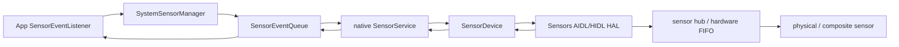

# SensorService 与传感器批处理功耗模型

SensorService 的功耗问题常被简化为“采样频率越低越省电”，但这只覆盖传感器本体的一部分成本。一次传感器请求还会使用传感器中枢（sensor hub，用低功耗处理器代替主处理器收集和处理传感器数据）及其先进先出缓冲区（First In, First Out，FIFO），还可能唤醒应用处理器（Application Processor，AP），并让 `system_server`（承载 Android 核心系统服务的进程）、原生 SensorService 和应用回调线程参与数据交付。

本文按照 Android 17 / API 37 / `android-17.0.0_r1` 核对源码，分析采样周期、批量延迟、唤醒（wake-up）属性、多客户端请求聚合和 AP 挂起（suspend）之间的关系。版本沿革只保留理解当前行为所需的节点：Android 4.4 引入标准化的批处理（batching），API 26 增加 Sensor Direct Channel，Android 12 对部分运动 / 姿态传感器增加高采样率限制；Android 17 继续保留这些机制，并增加由功能开关（flag）控制的冻结进程（frozen-PID）处理路径。

## 传感器耗电来自三个位置

| 成本 | 发生位置 | 主要影响因素 | 常见误判 |
|---|---|---|---|
| 采样与计算 | 微机电系统（MEMS）、模数转换器（ADC）、sensor hub、融合算法 | 采样频率、传感器类型、融合复杂度 | 只看应用回调次数 |
| 缓冲与搬运 | hub 的静态随机存取内存（SRAM）、硬件 FIFO、HAL 快速消息队列（FMQ）、SensorService 队列 | FIFO 深度、事件大小、共享方式 | 认为 batching 会减少采样 |
| AP 唤醒与处理 | 片上系统（SoC）从低功耗状态恢复（resume）、SensorService、应用线程 | wake-up 属性、批量窗口、回调工作量 | 认为低频一定等于少唤醒 |

对于连续型传感器（continuous sensor），采样频率可用下面的公式粗略换算：

```text
frequency_hz ≈ 1_000_000 / samplingPeriodUs
```

公式中的 `samplingPeriodUs` 以微秒为单位，因此只有**增大**它才会降低请求频率。例如，20,000 µs 约为 50 Hz，200,000 µs 约为 5 Hz。硬件通常只支持若干离散的输出数据率（Output Data Rate，ODR），硬件抽象层（Hardware Abstraction Layer，HAL）会将请求映射到可用档位；`SensorManager` 也将采样周期定义为提示值（hint），应用不能假定回调严格等间隔到达。

`Sensor.getPower()` 返回厂商写入传感器元数据（sensor metadata）的估算电流，适合粗略比较传感器类型，但不是针对当前频率和设备状态的实时功耗测量值。

## 从应用请求到硬件 FIFO

下面的流程展示普通监听器（listener）路径中，请求如何从应用经过 framework、SensorService 和 HAL 到达硬件 FIFO，事件又如何沿反方向返回：



这条路径中，Android 17 的 `SystemSensorManager.registerListenerImpl()` 为 listener 创建或复用 `SensorEventQueue`，`BaseEventQueue.addSensor()` 再调用原生层启用接口。SensorService 在启用前根据 sensor 的 `minDelay` / `maxDelay` 限制采样周期，然后将 `samplingPeriodNs` 和 `maxBatchReportLatencyNs` 传给 sensor 接口的 `batch()`，最后调用 `activate()`。

在 HAL 一侧，Android 17 同时保留使用 Android 接口定义语言（AIDL）的现代 Sensors HAL，以及兼容 HAL 接口定义语言（HIDL）2.0 / 2.1 的封装层（wrapper）。`SensorDevice::connectHalService()` 先尝试 AIDL，再尝试 HIDL。AIDL `ISensors` 的关键接口包括：

- `batch(handle, samplingPeriodNs, maxReportLatencyNs)`：配置采样与最大上报延迟；
- `activate(handle, enabled)`：启停 sensor；
- `flush(handle)`：立即交付当前 FIFO 中的事件，并产生表示操作完成的 flush-complete 元数据；
- Event FMQ：HAL 向 framework 传递事件；
- Wake Lock FMQ：framework 确认 wake-up 事件已经处理。

这里的 `batch()` 只负责提交配置。真正的省电效果来自 hub / FIFO 在 AP 之外暂存事件，从而合并交付和唤醒。没有硬件 FIFO 或低功耗 hub 时，即使 `batch()` 返回成功，也可能无法减少 AP 唤醒。

## 先区分上报模式（reporting mode）

reporting mode 表示传感器以何种规则产生事件。`samplingPeriodUs` 在不同模式下含义不同：

| reporting mode | `samplingPeriodUs` 的含义 | 典型 sensor |
|---|---|---|
| continuous（连续） | 期望的连续采样周期 | 加速度计（accelerometer）、陀螺仪（gyroscope） |
| on-change（变化时上报） | 事件最快产生间隔；值不变时可以长时间没有事件 | 光线传感器（light）、计步器（step counter） |
| one-shot（单次触发） | 被忽略；触发一次后自动停用 | 显著运动检测（significant motion） |
| special trigger（特殊触发） | 按具体 sensor 定义 | 步伐检测器（step detector）等 |

应用应通过 `Sensor.getReportingMode()` 判断模式，不能对所有 sensor 都使用 `1 / period` 计算事件频率。one-shot sensor 应使用 `requestTriggerSensor()`，不应注册到普通 `registerListener()`。

`maxReportLatencyUs` 控制事件允许暂存在 FIFO 中的最长时间。正数表示允许批量交付，0 表示尽快上报。它不会降低采样频率，也不保证事件一定等到整个窗口结束；FIFO 已满、其他 sensor 到期、应用主动调用 `flush()`，或 AP 因其他原因醒来，都可能使事件提前交付。

## `samplingPeriodUs` 与 `maxReportLatencyUs`

应用可以通过四参数重载同时指定采样周期和最大批量延迟。下面的代码请求约 50 Hz 采样，并允许最多延迟约 5 秒交付：

```kotlin
val registered = sensorManager.registerListener(
    listener,
    sensor,
    20_000,     // 约 50 Hz 的采样周期
    5_000_000,  // 最多延迟约 5 秒交付
)
```

这段请求会继续以约 50 Hz 产生事件，只是允许每批事件最多等待 5 秒；它不会将 sensor 改为 0.2 Hz。应用回调可能一次收到多个时间戳（timestamp）早于回调时刻的事件。

下面的公式可用 FIFO 能容纳的事件数估算理论批量时长上限：

```text
fifo_duration_seconds ≈ fifo_event_count / frequency_hz
```

公式用 FIFO 事件数除以采样频率。估算前需要选择正确的 FIFO 数值：

- `Sensor.getFifoReservedEventCount()` 是多个 sensor 并发使用 FIFO 时，为该 sensor 保证的事件数；
- `Sensor.getFifoMaxEventCount()` 是该 sensor 在理想条件下最多可用的事件数；
- `getFifoMaxEventCount() == 0` 表示该 sensor 不支持硬件 batching。

共享 FIFO 会被其他 sensor 占用，实际容量可能介于保留值（reserved）与最大值（max）之间。如果 50 Hz sensor 只有 100 个可用槽位，即使请求延迟 5 秒，FIFO 也可能在约 2 秒后填满并提前上报。

## SensorService 如何合并多个客户端

同一个传感器句柄（sensor handle，即系统识别传感器实例的整数标识）可能被多个应用和系统组件同时请求。Android 17 的 `SensorDevice` 为每个连接保存一组 `BatchParams`，再由 `Info::selectBatchParams()` 选择硬件能够同时满足的聚合参数。

聚合规则可按下面的顺序理解：

1. 忽略当前被标记为禁用（disabled）的连接；
2. 采样周期取所有有效连接中的最小值，满足最快请求；
3. 每个连接的有效批量周期至少不能短于它自己的采样周期；
4. 聚合批量周期取这些有效值中的最小值；
5. 如果聚合批量周期不大于聚合采样周期，`SensorDevice` 会将其设为 0，明确要求实时流式交付（streaming）。

因此，一个请求 200 Hz 且 `maxReportLatencyUs=0` 的客户端，会使同一 handle 的硬件采用高频实时交付配置。另一个请求 10 Hz、10 秒 batching 的应用，无法用自己的参数覆盖前一个更严格的请求。

`SensorDevice::updateBatchParamsLocked()` 只在选中参数发生变化，而且仍有有效客户端时调用 HAL `batch()`。客户端注销、用户标识符（User Identifier，UID）进入空闲状态（idle）、服务受到限制（restricted），以及 Android 17 条件性启用的 frozen-PID 路径，都可能使某个连接退出聚合，随后系统会重新计算硬件参数。

Android 调试桥（ADB）命令 `adb shell dumpsys sensorservice` 会输出各连接的请求值和最终选中值（selected）：

```text
active-count = ...
sampling_period(ms) = {...}, selected = ... ms
batching_period(ms) = {...}, selected = ... ms
```

输出中的 `selected` 是聚合后实际传给硬件的值。回调比预期密集时，先检查 selected batching period。如果 selected 已经为 0，应检查请求聚合和其他客户端；如果 selected 较大但事件仍提前到达，再检查 FIFO 容量、共享 FIFO、flush 和 AP resume。

## AP 醒着时的 batching

AP 处于运行（on）或空闲但未挂起（idle）状态时，HAL 可以将事件留在 FIFO，直到发生以下任一条件：

- 某个事件达到 `maxReportLatency`；
- FIFO 即将满；
- framework 调用 `flush()`；
- HAL 或共享 FIFO 中的其他 sensor 需要上报。

一旦某批事件必须上报，FIFO 中其他 sensor 的事件也可能同时交付，即使它们各自的最大延迟尚未到期。因此，应用观察到的批次间隔通常小于或等于请求值，不能将 `maxReportLatencyUs` 当作固定定时器周期。

事件 timestamp 必须对应物理事件发生时间，延迟上报不能改写它。应用可以用与 `elapsedRealtimeNanos()` 相同时间基准记录回调到达时间，再减去 `SensorEvent.timestamp`，估算事件在 FIFO、framework 和回调队列中的总等待时间。不能用可能受校时影响的墙钟时间（wall clock）减去 sensor timestamp。

## Suspend 中的 wake-up 与 non-wake-up 行为

### Non-wake-up sensor

非唤醒型传感器（non-wake-up sensor）不会阻止 AP 进入 suspend，也不能为了上报事件主动唤醒 AP。AP 挂起期间：

- 有 FIFO 时，事件继续写入 non-wake-up FIFO；
- FIFO 满后按环形缓冲处理，较老的 continuous 事件可能被覆盖；
- 没有 FIFO 时，suspend 期间产生的事件会丢失；
- `maxReportLatency` 不会为了 non-wake-up sensor 把 AP 唤醒；
- AP 因其他原因醒来后，FIFO 中仍保留的事件才会交付。

on-change sensor 有一项特殊保证：HAL 要在共享 FIFO 之外保存最新事件，避免最新状态被其他 continuous sensor 覆盖。Step counter 等累计值尤其依赖这项语义。

如果业务要求灭屏期间每个 non-wake-up 事件都不丢失，应用只能让 AP 保持唤醒，或改用满足需求的 wake-up sensor。持有部分唤醒锁（partial wake lock）会阻止 CPU 完全休眠，显著改变功耗模型；通常应先确认业务是否只需要最新状态或累计结果。

### Wake-up sensor

唤醒型传感器（wake-up sensor）允许 AP suspend，但必须在下列时机唤醒 AP：

- 事件达到最大上报延迟；
- wake-up FIFO 即将满；
- one-shot wake-up 事件触发。

正数 `maxReportLatencyUs` 可以让多个 wake-up 事件共用一次 AP resume。如果使用不支持 batching 参数的 listener 重载，或将最大延迟设为 0，事件会更接近实时交付，唤醒成本也更高。

设备从 suspend 恢复时，平台会尽量交付 FIFO 中的全部内容，包括尚未达到各自延迟的批次，从而减少 AP 刚回到 suspend 后又被另一批事件唤醒的概率。

应用应使用 `Sensor.isWakeUpSensor()` 判断当前 sensor 实例。相同传感器类型（type）可以同时存在 wake-up 和 non-wake-up 两个独立实例，不能只根据 `TYPE_ACCELEROMETER`、`TYPE_STEP_COUNTER` 等类型名称推断。

## Wake lock 确认链

Wake-up 事件需要跨越 HAL、SensorService 和应用进程；在事件尚未被消费时，系统必须防止 AP 再次 suspend。Android 17 AIDL Sensors HAL 使用两级确认：

1. HAL 在将 wake-up 事件写入 Event FMQ 前，持有名称以 `SensorsHAL_WAKEUP` 开头的唤醒锁（wake lock）；
2. framework 读到事件后，通过 Wake Lock FMQ 告知 HAL 已处理的 wake-up 事件数；
3. SensorService 自身持有 `SensorService_wakelock`，直到相关应用连接确认事件。

这个机制解释了两类耗电：

- wake-up sensor 事件本身导致 AP resume；
- 应用回调长时间未读取、连接阻塞或事件缓存堆积，会延长 framework 侧 wake lock 持有时间。

`dumpsys sensorservice` 的 `WakeLock Status` 可用于确认采集诊断信息时 SensorService 是否仍持锁。它只代表命令执行当时的状态；若要判断持续时长，还需结合 Perfetto / Battery Historian 的时间线。

## `flush()` 的正确含义

`SensorManager.flush(listener)` 请求尽快交付当前批量数据，并通过 `SensorEventListener2.onFlushCompleted()` 通知完成。AIDL `ISensors.flush()` 会将 `FLUSH_COMPLETE` 元数据放入指定 sensor 的事件流。

`flush()` 不会：

- 改变采样周期；
- 注销 listener；
- 清空后停止 sensor；
- 保证今后按更短窗口上报；
- 为 one-shot sensor 提供普通 flush 语义。

Android 17 的 `SensorService::enable()` 还有一项避免事件混入新连接的逻辑：当 continuous sensor 已有其他连接时，新连接启用前会先请求 flush，并等待属于该连接的首个 flush-complete，然后才开始发送普通事件。这样可以避免将先前连接积累的旧事件误交给新连接。注册后立即看到 flush 相关活动，不表示应用主动调用过 `flush()`。

## Android 12 以来的 200 Hz 访问限制

高采样率限制并非 Android 17 新增。目标版本为 Android 12（API 31）及以上的应用访问部分运动 / 姿态传感器（motion / position sensor）时，普通 listener 默认最多约 200 Hz；Sensor Direct Channel 默认最高为 `RATE_NORMAL`，通常约 50 Hz。需要更高频率时，应在应用清单（manifest）中声明以下权限：

```xml
<uses-permission
    android:name="android.permission.HIGH_SAMPLING_RATE_SENSORS" />
```

这段声明允许应用请求超过默认限制的采样率，但系统仍可施加其他限制。Android 17 中受限（capped）的集合包含六种类型：

- 加速度计（accelerometer）；
- 未校准加速度计（uncalibrated accelerometer）；
- 陀螺仪（gyroscope）；
- 未校准陀螺仪（uncalibrated gyroscope）；
- 磁场传感器（magnetic field）；
- 未校准磁场传感器（uncalibrated magnetic field）。

`SensorService.h` 将普通 listener 的受限周期（capped period）设为 5 ms。`SensorService::getSensorList()` 会根据调用包的权限，返回经过限制的 `minDelay` 和直接上报速率等级（direct-report rate level）；`SensorEventConnection` 与 `SensorDirectConnection` 在启用时还会再次检查请求。

当用户关闭麦克风访问权限（microphone access）时，这六类 sensor 即使已经获得高采样权限，也会受到限制。原因是高频运动 / 姿态数据可能泄露音频相关信息。

公开 SDK 文档要求应用声明权限，并提示高频请求可能抛出 `SecurityException`。Android 17 源码还包含兼容模式（compatibility）、可调试构建（debuggable）和服务端不抛异常而直接限制采样率的分支。应用不应依赖某一种失败表现，而应声明权限、检查注册结果，并根据实际事件时间戳（event timestamp）验证最终采样率。

## Sensor Direct Channel 的适用边界

API 26 增加的 Sensor Direct Channel 允许 HAL 将高频事件写入共享内存，应用再从 `MemoryFile` 或符合要求的 `HardwareBuffer` 读取。它可以减少普通 `SensorEventQueue` 回调和线程调度开销，适合虚拟现实（VR）、增强现实（AR）、姿态跟踪和需要稳定高频数据流的原生（native）管线。

Direct Channel 的支持必须逐 sensor 查询：

- `Sensor.isDirectChannelTypeSupported()`；
- `Sensor.getHighestDirectReportRateLevel()`；
- 目标内存类型（memory type）和速率等级（rate level）；
- Android 12 及以上的高采样权限与麦克风隐私限制（microphone privacy cap）。

Direct Channel 不提供普遍的节能保证。高频 sensor、持续轮询共享内存和后续算法仍会消耗传感器器件、hub、内存和 CPU。比较普通 listener 与 Direct Channel 时，要固定传感器频率、消费算法和测试时长，再测量 CPU 时间、请求能量、温度和丢样率。

## Android 17 的 frozen-PID 条件路径

`android-17.0.0_r1` 的 SensorService / `SensorDevice` 包含由 `android::hardware::flags::suspend_sensor_event_delivery_on_frozen_pid()` 控制的路径。这里的 frozen-PID 表示进程已被系统冻结、线程暂停执行。flag 开启时：

1. SensorService 为客户端 listener 注册 Binder（Android 进程间通信机制）冻结状态回调（frozen-state callback）；
2. 进程标识符（Process Identifier，PID）进入 frozen 状态后，`onClientFrozenStateChange()` 调用 `SensorDevice::setFrozenStateForConnection()`；
3. 该连接被标记为 `DISABLED_REASON_PID_FROZEN`；
4. `Info::selectBatchParams()` 不再让它参与硬件参数聚合；
5. 如果它是最后一个有效客户端，底层 sensor 会停用；
6. `SensorEventConnection::hasSensorAccess()` 也会在 PID frozen 时拒绝向该连接投递事件。

解冻后，连接会重新参与参数聚合，必要时重新激活 sensor。源码没有向普通应用承诺回放冻结期间的全部事件，因此应用不能将进程冻结器（freezer）当作另一种 batching 机制。

这条路径受 Android 配置系统 aconfig / 硬件 flag 控制。`android-17.0.0_r1` 中存在调用点，不能证明所有 Android 17 产品都默认启用它。分析具体设备时，要结合 `dumpsys sensorservice` 中客户端冻结 / 禁用（client frozen / disabled）信息、产品 flag 和实际事件时间线。

## 批处理失效或收益变小的常见原因

| 现象 | 可能原因 | 验证入口 |
|---|---|---|
| 设置 10 秒，仍频繁回调 | 其他客户端的延迟（latency）为 0、共享 FIFO 提前交付 | `dumpsys sensorservice` selected 参数 |
| 批次约 2 秒到达 | FIFO 按当前频率约 2 秒填满 | FIFO count、event rate、批次大小 |
| 灭屏后 non-wake-up 事件缺失 | AP suspend，FIFO 被覆盖或不存在 | suspend 时间线、事件 timestamp 缺口 |
| wake-up sensor 频繁唤醒 AP | latency=0、FIFO 小、事件过密 | 唤醒源（wakeup source）、SensorService wake lock |
| 请求高于 200 Hz 但结果被限制 | 缺权限、target SDK、microphone privacy | manifest、异常、event timestamp |
| 只有某些设备不能有效 batching | 设备厂商（OEM）的 FIFO / hub / HAL 能力不同 | sensor metadata、HAL / 厂商测试套件（VTS）、实机 trace |
| 注销后 sensor 仍高频 | 其他客户端仍在，或 listener 泄漏 | active-count、连接列表、selected period |
| 应用 frozen 后没有事件 | Android 17 frozen-PID 路径或 UID idle | disabled 标记、PID / UID 状态 |
| Direct Channel CPU 仍很高 | 消费端忙轮询或算法本身较重 | CPU 性能记录（profile）、读取周期、算法 slice |

批次变短不一定表示实现错误。FIFO 已满或其他 sensor 到期时，提前交付符合平台规则。应先确认平台 API 约定，再判断厂商实现。

## 观测方法

### 1. 应用侧记录请求和事件

每次注册至少应记录：

- sensor 名称 / 类型 / handle；
- `isWakeUpSensor()` 与 reporting mode；
- 最小 / 最大延迟（min / max delay）；
- FIFO 保留 / 最大事件数（reserved / max event count）；
- 请求的 sampling period 与 max latency；
- 注册结果、flush 结果和注销时刻。

事件侧应记录 `SensorEvent.timestamp`、回调到达时的系统启动后经过时间（elapsed realtime）、批次内事件数和线程。不要为每个高频事件写磁盘日志；可以只保留环形内存统计或按时间窗口聚合，以免测量本身改变结果。

### 2. 检查 SensorService 的聚合结果

在测试开始和结束时分别执行下面的命令，读取 SensorService 当前状态：

```bash
adb shell dumpsys sensorservice
```

输出中重点关注活动连接（active connections）、`active-count`、每个连接后的 `(disabled)` 标记、`sampling_period(ms)` / `batching_period(ms)` 及 selected 值、`WakeLock Status`。部分连接只显示身份摘要，具体可见信息受系统构建（build）类型和权限影响。

### 3. 对齐 AP suspend 与事件交付

Perfetto 可按设备能力采集：

- `power/suspend_resume`；
- `power/cpu_idle` 与 `power/cpu_frequency`；
- `sched/sched_switch`、`sched/sched_wakeup`；
- wakeup source 或中断请求（Interrupt Request，IRQ）事件；
- 应用注册、回调和处理的时间区间（slice）。

公开的性能跟踪（trace）不一定提供独立的 sensor FIFO 轨道（track）。诊断时，应将 sensor timestamp、回调 slice 和 suspend / resume 放在同一时间线上；厂商 sensor hub trace 只能作为特定设备的补充证据。

### 4. 看电池统计

Battery Historian 或 `dumpsys batterystats` 可以观察 UID 的 sensor 使用、wake lock 和测试窗口内的电量活动。严谨测试应：

1. 记录系统 build、设备、电池和环境温度；
2. 重置统计或标记明确的开始时间；
3. 断开通用串行总线（USB）连接，避免充电改变 suspend 行为与电流；
4. 固定屏幕、网络和后台任务；
5. 重复测试不使用批处理（no-batching）与使用 batching 的配置；
6. 同时报告事件数、丢样率、AP 唤醒次数（wakeup）、CPU 时间和请求能量。

电池统计（Battery stats）中的 sensor active time 不是 sensor 芯片的精确能量；Battery Historian 也不能单独证明某次 wakeup 由哪个 FIFO 触发。需要与 trace 和 SensorService 状态交叉验证。

## 一个可复现的对照实验

以连续型加速度计（continuous accelerometer）为例，可以设计三组对照：

| 组别 | 采样周期（sampling period） | 最大延迟（max latency） | 目的 |
|---|---:|---:|---|
| A | 20 ms | 0 | 高频、尽快交付的对照基线 |
| B | 20 ms | 5 s | 保持采样量，观察减少 AP 唤醒的收益 |
| C | 200 ms | 5 s | 同时减少采样和交付成本 |

每组都要确认 `dumpsys sensorservice` 的 selected 参数没有被其他客户端改变。如果 A 与 B 的事件总数接近，而 B 的回调批次更大、AP wakeup 更少，可以将主要差异归因于 batching；如果 B 与 C 的事件总数也明显不同，C 还包含降低采样率带来的收益。

灭屏测试还要区分 wake-up 和 non-wake-up 实例。Non-wake-up 组出现事件缺口可能符合 suspend 规则，不能直接判断为 HAL 丢失数据包。

## 与应用治理章节的分工

本节从系统侧讨论采样请求的合并、借助 FIFO 减少 AP wakeup，以及 Android 17 的采样率和 frozen-PID 边界。25.4 节负责应用侧决策：选择 sensor、确定哪个组件管理其生命周期、页面不可见后注销、业务降级，以及定位功能与 sensor 的协同。

应用侧最重要的规则仍然是：

- 只在功能需要时注册；
- 请求业务可接受的最大 `samplingPeriodUs`；
- 请求业务可接受的最大 `maxReportLatencyUs`；
- 优先选择符合业务且功耗较低的 sensor，例如 step counter、significant motion；
- 退出使用场景时注销，不能依赖熄屏自动停用；
- 对 wake-up sensor、partial wake lock 和后台任务进行统一评估。

WakeLock、Doze 和后台限制决定 AP / 应用能否继续运行；SensorService batching 决定 sensor 事件如何生成、缓存和交付。三类机制需要放在同一时间线中分析。

## 发布前检查清单

- [ ] 平台源码结论已按 `android-17.0.0_r1` 复核；
- [ ] 增大 `samplingPeriodUs` 与降低频率的方向没有写反；
- [ ] sampling 与 batching 的功耗收益分开；
- [ ] reporting mode 已确认；
- [ ] wake-up / non-wake-up 以当前 Sensor 实例为准；
- [ ] FIFO reserved / max 与共享 FIFO 边界已记录；
- [ ] `dumpsys sensorservice` selected 参数与应用请求一致；
- [ ] 200 Hz 限制标注为 Android 12 起的规则；
- [ ] microphone privacy 对高采样率的影响已测试；
- [ ] Direct Channel 没有被写成通用节能开关；
- [ ] frozen-PID 行为标注为由 flag 控制，未承诺补发事件；
- [ ] AP suspend、wakeup、SensorService wake lock 与回调时间已对齐；
- [ ] 功耗测试断开 USB，并固定温度和后台条件；
- [ ] 结果同时包含事件完整性与能耗。

## Android 17 源码索引

以下路径均已按照 `android-17.0.0_r1` 复核：

- `frameworks/base/core/java/android/hardware/SensorManager.java`
  - 四参数 `registerListener()`
  - batching、wake-up / non-wake-up 的 SDK 说明
- `frameworks/base/core/java/android/hardware/SystemSensorManager.java`
  - `registerListenerImpl()`
  - `BaseEventQueue.addSensor()` / `enableSensor()`
  - 200 Hz 和 Direct Channel 速率限制（rate cap）
- `frameworks/base/core/java/android/hardware/Sensor.java`
  - reporting mode、wake-up、FIFO metadata
- `frameworks/native/services/sensorservice/SensorService.cpp`
  - `enable()`
  - wake lock 确认
  - high-sampling-rate cap
  - frozen-state callback
- `frameworks/native/services/sensorservice/SensorDevice.cpp`
  - `batch()` / `updateBatchParamsLocked()`
  - `Info::selectBatchParams()`
  - disabled/frozen client 处理
- `frameworks/native/services/sensorservice/SensorEventConnection.cpp`
  - 事件过滤（event filter）、应用确认（app ACK）、200 Hz cap、`hasSensorAccess()`
- `frameworks/native/services/sensorservice/SensorDirectConnection.cpp`
  - Direct Channel rate cap
- `hardware/interfaces/sensors/aidl/android/hardware/sensors/ISensors.aidl`
  - AIDL HAL、Event FMQ、Wake Lock FMQ
- `hardware/interfaces/sensors/aidl/android/hardware/sensors/SensorInfo.aidl`
  - FIFO、power、delay 和 wake-up metadata

## 参考资料

- Batching：<https://source.android.com/docs/core/interaction/sensors/batching>
- Suspend mode：<https://source.android.com/docs/core/interaction/sensors/suspend-mode>
- Sensor stack：<https://source.android.com/docs/core/interaction/sensors/sensor-stack>
- Sensors AIDL HAL：<https://source.android.com/docs/core/interaction/sensors/sensors-aidl-hal>
- SensorManager API：<https://developer.android.com/reference/android/hardware/SensorManager>
- Sensors overview / rate limiting：<https://developer.android.com/develop/sensors-and-location/sensors/sensors_overview>
