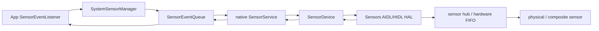

# 5.13 SensorService 与传感器批处理功耗模型

SensorService 的功耗问题常被简化为“采样频率越低越省电”。这只覆盖传感器本体的一部分成本。一次传感器请求还会占用 sensor hub/FIFO、唤醒应用处理器（Application Processor，AP），并让 system_server、native SensorService 和应用回调线程参与数据交付。

源码锚点为 Android 17 / API 37 / `android-17.0.0_r1`。分析范围包括采样周期、批量延迟、wake-up 属性、多客户端聚合和 AP suspend 的关系。版本沿革只保留理解当前行为所需的节点：Android 4.4 引入规范化 batching，API 26 增加 Sensor Direct Channel，Android 12 对部分运动/姿态传感器增加高采样率限制，Android 17 继续保留这些机制并增加受 flag 控制的 frozen-PID 处理路径。

## 传感器耗电来自三个位置

| 成本 | 发生位置 | 主要影响因素 | 常见误判 |
|---|---|---|---|
| 采样与计算 | MEMS、ADC、sensor hub、融合算法 | 采样频率、传感器类型、融合复杂度 | 只看应用回调次数 |
| 缓冲与搬运 | hub SRAM、硬件 FIFO、HAL FMQ、SensorService 队列 | FIFO 深度、事件大小、共享方式 | 认为 batching 会减少采样 |
| AP 唤醒与处理 | SoC resume、SensorService、应用线程 | wake-up 属性、批量窗口、回调工作量 | 认为低频一定等于少唤醒 |

对 continuous sensor，采样频率的一阶关系是：

```text
frequency_hz ≈ 1_000_000 / samplingPeriodUs
```

所以，**增大** `samplingPeriodUs` 才会降低请求频率。例如 20,000 µs 约为 50 Hz，200,000 µs 约为 5 Hz。硬件通常只支持离散 ODR（Output Data Rate），HAL 会把请求映射到可用档位；`SensorManager` 也把采样周期定义为 hint，应用不能假定回调严格等间隔。

`Sensor.getPower()` 返回厂商在 sensor metadata 中填写的估算电流，适合做粗略比较，不是针对当前频率和设备状态的实时功耗测量。

## 从应用请求到硬件 FIFO

普通 listener 路径可概括为：



Android 17 的 `SystemSensorManager.registerListenerImpl()` 为 listener 创建或复用 `SensorEventQueue`，`BaseEventQueue.addSensor()` 再调用 native enable。SensorService 在启用前按 sensor 的 `minDelay` / `maxDelay` 约束采样周期，然后把 `samplingPeriodNs` 和 `maxBatchReportLatencyNs` 传给 sensor 接口的 `batch()`，最终 `activate()`。

在 HAL 一侧，Android 17 同时保留现代 AIDL Sensors HAL 和兼容 HIDL 2.0/2.1 的 wrapper。`SensorDevice::connectHalService()` 先尝试 AIDL，再尝试 HIDL。AIDL `ISensors` 的关键接口包括：

- `batch(handle, samplingPeriodNs, maxReportLatencyNs)`：配置采样与最大上报延迟；
- `activate(handle, enabled)`：启停 sensor；
- `flush(handle)`：冲刷当前 FIFO，并产生 flush-complete metadata；
- Event FMQ：HAL 向 framework 传递事件；
- Wake Lock FMQ：framework 确认 wake-up 事件已经处理。

这里的 `batch()` 是配置入口，省电效果由 hub/FIFO 在 AP 之外缓存事件产生。没有硬件 FIFO 或低功耗 hub 时，即使 `batch()` 返回成功，也可能无法减少 AP 唤醒。

## 先区分 reporting mode

`samplingPeriodUs` 对不同 reporting mode 的含义不同：

| reporting mode | `samplingPeriodUs` 的含义 | 典型 sensor |
|---|---|---|
| continuous | 期望的连续采样周期 | accelerometer、gyroscope |
| on-change | 事件最快产生间隔；值不变时可更久没有事件 | light、step counter |
| one-shot | 被忽略；触发一次后自动停用 | significant motion |
| special trigger | 按具体 sensor 定义 | step detector 等 |

应用应通过 `Sensor.getReportingMode()` 判断，不能把所有 sensor 都套入 `1 / period`。one-shot sensor 使用 `requestTriggerSensor()`，不应交给普通 `registerListener()`。

`maxReportLatencyUs` 控制事件允许暂存在 FIFO 中的最长时间。正数允许批量交付，0 表示尽快上报。它不降低采样频率，也不保证事件一定等到整个窗口结束；FIFO 满、其他 sensor 到期、应用主动 `flush()` 或 AP 因其他原因醒来，都可能让事件提前交付。

## `samplingPeriodUs` 与 `maxReportLatencyUs`

应用侧可通过四参数重载同时表达两种需求：

```kotlin
val registered = sensorManager.registerListener(
    listener,
    sensor,
    20_000,     // 约 50 Hz 的采样周期
    5_000_000,  // 最多延迟约 5 秒交付
)
```

这段请求的含义是“继续按约 50 Hz 产生事件，允许每批最多等待 5 秒”。它没有把 sensor 改成 0.2 Hz。应用回调可能一次收到一串 timestamp 较早的事件。

可以用 FIFO 深度估算理论批量上限：

```text
fifo_duration_seconds ≈ fifo_event_count / frequency_hz
```

估算前要选择正确的 FIFO 数值：

- `Sensor.getFifoReservedEventCount()` 是多 sensor 并发时为该 sensor 保证的事件数；
- `Sensor.getFifoMaxEventCount()` 是该 sensor 在理想条件下最多可用的事件数；
- `getFifoMaxEventCount() == 0` 表示该 sensor 不支持硬件 batching。

共享 FIFO 会被其他 sensor 占用，实际容量可能介于 reserved 与 max 之间。若 50 Hz sensor 只有 100 个可用槽位，即使请求 5 秒，FIFO 约 2 秒就可能满并提前上报。

## SensorService 如何合并多个客户端

同一个 sensor handle 可能被多个应用和系统组件同时请求。Android 17 的 `SensorDevice` 为每个连接保存一组 `BatchParams`，再由 `Info::selectBatchParams()` 选择硬件能够同时满足的参数。

聚合规则可按下面的顺序理解：

1. 忽略当前被标记为 disabled 的连接；
2. 采样周期取所有有效连接中的最小值，满足最快请求；
3. 每个连接的有效批量周期至少不能短于它自己的采样周期；
4. 聚合批量周期取这些有效值中的最小值；
5. 若聚合批量周期不大于聚合采样周期，`SensorDevice` 把它归零，明确要求 streaming。

因此，一个 200 Hz、`maxReportLatencyUs=0` 的客户端，可以把同一 handle 的硬件配置拉到高频实时交付。另一个请求 10 Hz、10 秒 batching 的应用，无法靠自己的参数覆盖前者。

`SensorDevice::updateBatchParamsLocked()` 只在选中参数变化且仍有有效客户端时调用 HAL `batch()`。客户端注销、UID idle、服务 restricted，以及 Android 17 条件性 frozen-PID 路径，都可能让某个连接退出聚合，再重新计算硬件参数。

`adb shell dumpsys sensorservice` 会输出各连接值和 selected 值：

```text
active-count = ...
sampling_period(ms) = {...}, selected = ... ms
batching_period(ms) = {...}, selected = ... ms
```

看到回调比预期密时，先检查 selected batching period。若 selected 已经是 0，问题在聚合或客户端请求；若 selected 较大但事件仍提前到达，再检查 FIFO 容量、shared FIFO、flush 和 AP resume。

## AP 醒着时的 batching

AP 处于 on/idle 状态时，HAL 可以把事件留在 FIFO，直到发生以下任一条件：

- 某个事件达到 `maxReportLatency`；
- FIFO 即将满；
- framework 调用 `flush()`；
- HAL 或共享 FIFO 中其他 sensor 需要上报。

一旦某批事件必须上报，FIFO 中其他 sensor 的事件也可能一起交付，即使它们自己的最大延迟尚未到期。应用看到的批次间隔通常小于等于请求值，不能把 `maxReportLatencyUs` 当成定时器周期。

事件 timestamp 必须对应物理事件发生时间，延迟上报不能重写 timestamp。应用可用基于 `elapsedRealtimeNanos()` 的到达时间减去 `SensorEvent.timestamp`，估算事件在 FIFO、framework 和回调队列中的总等待；不要拿 wall clock 与 sensor timestamp 相减。

## Suspend 中的 wake-up 与 non-wake-up 行为

### Non-wake-up sensor

Non-wake-up sensor 不阻止 AP 进入 suspend，也不能为了上报事件主动唤醒 AP。AP 睡眠期间：

- 有 FIFO 时，事件继续写入 non-wake-up FIFO；
- FIFO 满后按环形缓冲处理，较老的 continuous 事件可能被覆盖；
- 没有 FIFO 时，suspend 期间产生的事件会丢失；
- `maxReportLatency` 不会为了 non-wake-up sensor 把 AP 唤醒；
- AP 因其他原因醒来后，FIFO 中仍保留的事件才会交付。

On-change sensor 有一条特殊保证：HAL 要在 shared FIFO 之外保存最新事件，避免最新状态被其他 continuous sensor 覆盖。Step counter 这类累计值尤其依赖这条语义。

如果业务要求灭屏期间每个 non-wake-up 事件都不丢，应用只能让 AP 保持唤醒或改用满足需求的 wake-up sensor。持有 partial wake lock 会显著改变功耗模型，通常应先确认业务是否只需要最新状态或累计结果。

### Wake-up sensor

Wake-up sensor 允许 AP suspend，但必须在下列时机唤醒 AP：

- 事件达到最大上报延迟；
- wake-up FIFO 即将满；
- one-shot wake-up 事件触发。

正数 `maxReportLatencyUs` 可以让多个 wake-up 事件共用一次 AP resume。若使用没有 batching 的 listener 重载或把最大延迟设为 0，事件会更接近实时交付，唤醒成本也更高。

设备从 suspend 恢复时，平台会尽量交付所有 FIFO 中的内容，包括尚未达到各自延迟的批次。这减少 AP 刚回到 suspend 又被另一批事件唤醒的概率。

应用应使用 `Sensor.isWakeUpSensor()` 判断当前 sensor 实例。相同 type 可以有 wake-up 和 non-wake-up 两个独立实例，不能只按 `TYPE_ACCELEROMETER`、`TYPE_STEP_COUNTER` 等名字推断。

## Wake lock 确认链

Wake-up 事件要跨越 HAL、SensorService 和应用进程，期间必须防止 AP 在事件尚未被消费时再次 suspend。Android 17 AIDL Sensors HAL 使用两段确认：

1. HAL 在把 wake-up 事件写入 Event FMQ 前持有以 `SensorsHAL_WAKEUP` 开头的 wake lock；
2. framework 读到事件后，通过 Wake Lock FMQ 告知 HAL 已处理的 wake-up 事件数；
3. SensorService 自己持有 `SensorService_wakelock`，直到相关应用连接确认事件。

这个机制解释了两类耗电：

- wake-up sensor 事件本身导致 AP resume；
- 应用回调迟迟不读、连接阻塞或事件缓存堆积，会延长 framework 侧 wake lock。

`dumpsys sensorservice` 的 `WakeLock Status` 可用于确认抓取时 SensorService 是否仍持锁。它只代表当前状态，仍需结合 Perfetto/Battery Historian 看持续时间。

## `flush()` 的正确含义

`SensorManager.flush(listener)` 请求把当前批量数据尽快交付，并在 `SensorEventListener2` 收到 `onFlushCompleted()`。AIDL `ISensors.flush()` 要把 `FLUSH_COMPLETE` metadata 放到指定 sensor 的事件流中。

`flush()` 不会：

- 改变采样周期；
- 注销 listener；
- 清空后停止 sensor；
- 保证今后按更短窗口上报；
- 为 one-shot sensor 提供普通 flush 语义。

Android 17 的 `SensorService::enable()` 还有一条防串流逻辑：当 continuous sensor 已有其他连接时，新连接启用前会先请求 flush，并等待属于该连接的首个 flush-complete，再开始发送普通事件。这样可避免把先前连接积累的旧事件误交给新连接。注册后立即看到 flush 相关活动不代表应用主动调用过 `flush()`。

## Android 12 以来的 200 Hz 访问限制

高采样率限制并非 Android 17 新增。目标 Android 12（API 31）及以上的应用访问部分 motion/position sensor 时，普通 listener 默认最多约 200 Hz；Sensor Direct Channel 默认最多 `RATE_NORMAL`，通常约 50 Hz。需要更高频率时，应在 manifest 声明：

```xml
<uses-permission
    android:name="android.permission.HIGH_SAMPLING_RATE_SENSORS" />
```

Android 17 的 capped 集合包含六种类型：

- accelerometer；
- uncalibrated accelerometer；
- gyroscope；
- uncalibrated gyroscope；
- magnetic field；
- uncalibrated magnetic field。

`SensorService.h` 把普通 listener 的 capped period 定为 5 ms。`SensorService::getSensorList()` 会按调用包的权限返回经过 cap 的 `minDelay` 和 direct-report rate level；`SensorEventConnection` 与 `SensorDirectConnection` 在启用时再次检查请求。

当用户关闭 microphone access 时，这六类 sensor 即使已经获得高采样权限，也会被限制。原因是高频运动/姿态数据可能泄露音频相关信息。

公开 SDK 文档要求应用声明权限，并提示高频请求可能抛出 `SecurityException`。Android 17 源码还包含 compatibility、debuggable 和服务端静默钳制分支。应用不应依赖某一种失败形式：声明权限、检查注册结果，并用实际 event timestamp 验证最终采样率。

## Sensor Direct Channel 的适用边界

API 26 增加的 Sensor Direct Channel 允许 HAL 把高频事件写入共享内存，应用从 `MemoryFile` 或符合要求的 `HardwareBuffer` 读取。它能减少普通 `SensorEventQueue` 回调和线程调度开销，适合 VR、AR、姿态跟踪和需要稳定高频数据流的 native 管线。

Direct Channel 的支持必须逐 sensor 查询：

- `Sensor.isDirectChannelTypeSupported()`；
- `Sensor.getHighestDirectReportRateLevel()`；
- 目标 memory type 和 rate level；
- Android 12+ 高采样权限与 microphone privacy cap。

Direct Channel 不提供通用节能保证。高频 sensor、持续轮询共享内存和后续算法仍会消耗器件、hub、内存和 CPU。比较普通 listener 与 direct channel 时，要固定传感器频率、消费算法和测试时长，再测 CPU time、请求能量、温度和丢样率。

## Android 17 的 frozen-PID 条件路径

`android-17.0.0_r1` 的 SensorService/`SensorDevice` 包含由
`android::hardware::flags::suspend_sensor_event_delivery_on_frozen_pid()` 控制的路径。flag 开启时：

1. SensorService 为客户端 listener 注册 Binder frozen-state callback；
2. PID 进入 frozen 后，`onClientFrozenStateChange()` 调用
   `SensorDevice::setFrozenStateForConnection()`；
3. 该连接被标记为 `DISABLED_REASON_PID_FROZEN`；
4. `Info::selectBatchParams()` 不再让它参与硬件参数聚合；
5. 若它是末尾一个有效客户端，底层 sensor 会停用；
6. `SensorEventConnection::hasSensorAccess()` 也会在 PID frozen 时拒绝向该连接投递事件。

解冻后连接重新参与聚合，必要时重新激活 sensor。源码没有为普通应用承诺回放冻结期间的全部事件，因此应用不能把 freezer 当成另一种 batching。

这条路径受 aconfig/hardware flag 控制，`android-17.0.0_r1` 的调用点不能证明所有 Android 17 产品都默认启用。分析具体设备时，要结合 `dumpsys sensorservice` 的 client frozen/disabled 信息、产品 flag 和实测事件时间线。

## 批处理失效或收益变小的常见原因

| 现象 | 可能原因 | 验证入口 |
|---|---|---|
| 设置 10 秒，仍频繁回调 | 其他客户端 latency=0、shared FIFO 提前冲刷 | `dumpsys sensorservice` selected 参数 |
| 批次约 2 秒到达 | FIFO 按当前频率约 2 秒填满 | FIFO count、event rate、批次大小 |
| 灭屏后 non-wake-up 事件缺失 | AP suspend，FIFO 覆盖或不存在 | suspend 时间线、事件 timestamp 缺口 |
| wake-up sensor 频繁拉起 AP | latency=0、FIFO 小、事件过密 | wakeup source、SensorService wake lock |
| 请求高于 200 Hz 但结果被限制 | 缺权限、target SDK、microphone privacy | manifest、异常、event timestamp |
| 只有某些设备不 batching | OEM FIFO/hub/HAL 能力不同 | sensor metadata、HAL/VTS、实机 trace |
| 注销后 sensor 仍高频 | 其他客户端仍在，或 listener 泄漏 | active-count、连接列表、selected period |
| App frozen 后没有事件 | Android 17 frozen-PID path 或 UID idle | disabled 标记、PID/UID 状态 |
| Direct Channel CPU 仍很高 | 消费端忙轮询或算法本身较重 | CPU profile、读取周期、算法 slice |

批次变短不一定是错误。只要 FIFO 满或其他 sensor 到期，提前交付就是合法行为。先确认平台契约，再判断厂商实现。

## 观测方法

### 1. 应用侧记录请求和事件

每次注册至少记录：

- sensor name/type/handle；
- `isWakeUpSensor()` 与 reporting mode；
- min/max delay；
- FIFO reserved/max event count；
- 请求的 sampling period 与 max latency；
- 注册结果、flush 结果和注销时刻。

事件侧记录 `SensorEvent.timestamp`、回调到达的 elapsed realtime、批次内事件数和线程。不要为每个高频事件写磁盘日志；可以只保留环形内存统计或按窗口聚合，避免测量改变结果。

### 2. 检查 SensorService 的聚合结果

测试开始和结束分别执行：

```bash
adb shell dumpsys sensorservice
```

重点关注 active connections、active-count、每个连接后的 `(disabled)` 标记、`sampling_period(ms)` / `batching_period(ms)` 及 selected 值、WakeLock Status。部分连接只显示身份摘要，具体可见信息受 build 类型与权限影响。

### 3. 对齐 AP suspend 与事件交付

Perfetto 可按设备能力采集：

- `power/suspend_resume`；
- `power/cpu_idle` 与 `power/cpu_frequency`；
- `sched/sched_switch`、`sched/sched_wakeup`；
- wakeup source 或 IRQ 事件；
- 应用注册、回调和处理 slice。

公开 trace 不一定提供独立 sensor FIFO track。诊断时用 sensor timestamp、callback slice 和 suspend/resume 关联，厂商 sensor hub trace 只能作为设备特定补充。

### 4. 看电池统计

Battery Historian 或 `dumpsys batterystats` 可观察 UID sensor 使用、wake lock 和测试窗口内的电量活动。严谨测试应：

1. 记录系统 build、设备、电池和环境温度；
2. 重置统计或标记明确的开始时间；
3. 断开 USB，避免充电改变 suspend 与电流；
4. 固定屏幕、网络和后台任务；
5. 重复测试 no-batching 与 batching 配置；
6. 同时报出事件数、丢样率、AP wakeup、CPU time 和请求能量。

Battery stats 的 sensor active time 不等于 sensor 芯片的精确能量，Battery Historian 也不能单独证明某次 wakeup 由哪个 FIFO 触发。需要与 trace 和 SensorService 状态交叉验证。

## 一个可复现的对照实验

以 continuous accelerometer 为例，可以设计三组：

| 组别 | sampling period | max latency | 目的 |
|---|---:|---:|---|
| A | 20 ms | 0 | 高频、尽快交付基线 |
| B | 20 ms | 5 s | 保持采样量，观察减少 AP 唤醒的收益 |
| C | 200 ms | 5 s | 同时减少采样和交付成本 |

每组都要确认 `dumpsys sensorservice` 的 selected 参数没有被其他客户端改变。若 A 与 B 的事件总数接近，而 B 的回调批次更大、AP wakeup 更少，差异可归因于 batching；若 B 与 C 的事件总数也明显不同，则 C 还包含降采样收益。

灭屏测试还要区分 wake-up 和 non-wake-up 实例。Non-wake-up 组出现事件缺口可能符合 suspend 语义，不能直接判为 HAL 丢包。

## 与应用治理章节的分工

系统侧关注采样请求的合并、借助 FIFO 减少 AP wakeup，以及 Android 17 的采样率和 frozen-PID 边界。25.5 节负责应用侧决策：选择 sensor、生命周期所有权、页面不可见后的注销、业务降级，以及定位与 sensor 的协同。

应用侧最重要的规则仍然是：

- 只在功能需要时注册；
- 请求业务可接受的最大 `samplingPeriodUs`；
- 请求业务可接受的最大 `maxReportLatencyUs`；
- 优先选择低功耗语义 sensor，例如 step counter、significant motion；
- 退出使用场景时注销，不能依赖熄屏自动停用；
- 对 wake-up sensor、partial wake lock 和后台任务统一评估。

WakeLock、Doze 和后台限制决定 AP/应用能否继续运行；SensorService batching 决定 sensor 事件怎样生成、缓存和交付。三者需要放在同一时间线中分析。

## 发布前检查清单

- [ ] 平台源码结论锚定 `android-17.0.0_r1`；
- [ ] 增大 `samplingPeriodUs` 与降低频率的方向没有写反；
- [ ] sampling 与 batching 的功耗收益分开；
- [ ] reporting mode 已确认；
- [ ] wake-up/non-wake-up 以当前 Sensor 实例为准；
- [ ] FIFO reserved/max 与 shared FIFO 边界已记录；
- [ ] `dumpsys sensorservice` selected 参数与应用请求一致；
- [ ] 200 Hz 限制标注为 Android 12 起的规则；
- [ ] microphone privacy 对高采样率的影响已测试；
- [ ] Direct Channel 没有被写成通用节能开关；
- [ ] frozen-PID 行为标注为 flag 控制，未承诺补发；
- [ ] AP suspend、wakeup、SensorService wake lock 与回调时间已对齐；
- [ ] 功耗测试断开 USB，并固定温度和后台条件；
- [ ] 结果同时包含事件完整性与能耗。

## Android 17 源码索引

以下路径按 `android-17.0.0_r1` 复核：

- `frameworks/base/core/java/android/hardware/SensorManager.java`
  - 四参数 `registerListener()`
  - batching、wake-up/non-wake-up 的 SDK 说明
- `frameworks/base/core/java/android/hardware/SystemSensorManager.java`
  - `registerListenerImpl()`
  - `BaseEventQueue.addSensor()` / `enableSensor()`
  - 200 Hz 和 Direct Channel rate cap
- `frameworks/base/core/java/android/hardware/Sensor.java`
  - reporting mode、wake-up、FIFO metadata
- `frameworks/native/services/sensorservice/SensorService.cpp`
  - `enable()`
  - wake lock 确认
  - high-sampling-rate cap
  - frozen-state callback
- `frameworks/native/services/sensorservice/SensorDevice.cpp`
  - `batch()` / `updateBatchParamsLocked()`
  - `Info::selectBatchParams()`
  - disabled/frozen client 处理
- `frameworks/native/services/sensorservice/SensorEventConnection.cpp`
  - event filter、app ACK、200 Hz cap、`hasSensorAccess()`
- `frameworks/native/services/sensorservice/SensorDirectConnection.cpp`
  - Direct Channel rate cap
- `hardware/interfaces/sensors/aidl/android/hardware/sensors/ISensors.aidl`
  - AIDL HAL、Event FMQ、Wake Lock FMQ
- `hardware/interfaces/sensors/aidl/android/hardware/sensors/SensorInfo.aidl`
  - FIFO、power、delay 和 wake-up metadata

## 参考资料

- Batching：<https://source.android.com/docs/core/interaction/sensors/batching>
- Suspend mode：<https://source.android.com/docs/core/interaction/sensors/suspend-mode>
- Sensor stack：<https://source.android.com/docs/core/interaction/sensors/sensor-stack>
- Sensors AIDL HAL：<https://source.android.com/docs/core/interaction/sensors/sensors-aidl-hal>
- SensorManager API：<https://developer.android.com/reference/android/hardware/SensorManager>
- Sensors overview / rate limiting：<https://developer.android.com/develop/sensors-and-location/sensors/sensors_overview>
