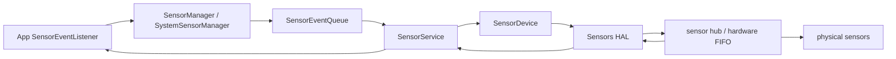

# 5.15 SensorService 与传感器批处理功耗模型

<!-- outline-start -->
## 要点

### 🔹 传感器耗电的三类成本
区分传感器本体采样、sensor hub / HAL 缓冲、应用处理器被唤醒后处理事件三类成本，避免把“采样频率低”直接等同于“省电”。

### 🔹 SensorService 在系统功耗路径里的位置
梳理 App `SensorManager`、framework sensors service、native `SensorService`、Sensor HAL 和硬件 FIFO 的分工，说明系统如何把多个客户端的采样需求合并给底层。

### 🔹 `samplingPeriodUs` 与 `maxReportLatencyUs`
解释采样周期和最大上报延迟的不同含义：前者控制数据产生频率，后者控制批量交付窗口；批处理收益来自减少 AP 唤醒次数，不来自减少传感器采样本身。

### 🔹 wake-up / non-wake-up sensor 与 sensor hub
说明 wake-up sensor、non-wake-up sensor、significant motion、step counter 等类型对 suspend、唤醒和事件交付的影响，并标出不同设备硬件能力差异。

### 🔹 批处理失效的常见原因
覆盖硬件 FIFO 不足、多个客户端请求高频低延迟、前后台生命周期未退订、监听器泄漏、厂商 HAL 限制等导致批处理窗口被打断的情况。

### 🔹 Perfetto、Battery Historian 与 `dumpsys sensorservice` 观察点
给出后续正文需要验证的证据入口：sensor event 频率、wake lock、AP wakeup、CPU freq、battery stats、`dumpsys sensorservice` active connections 与 batching 状态。

### 🔹 与 App 层传感器治理的边界
本节负责系统路径和功耗模型，25.5 节负责 App 侧 API 选择、生命周期退订和业务降级；正文只做交叉引用，不重复写实战策略。

## 扩展

### 🔸 Sensor Direct Channel 与高频传感器流
后续可补充 API 26+ direct channel 在高频传感器数据通路中的适用边界，以及它与普通事件回调的功耗差异。

### 🔸 OEM sensor hub 策略差异
后续可收集 Pixel、Qualcomm、MediaTek 设备上的 FIFO 深度、wake-up sensor 支持和厂商 HAL 日志差异。

### 🔸 与定位、蓝牙和后台任务的功耗归因协同
后续可把传感器批处理与 FLP、BLE scan、JobScheduler/WorkManager 放在同一条电量归因时间线上。

<!-- outline-end -->

## 传感器耗电的三类成本

SensorService 相关的耗电不能只看采样频率。一次传感器请求会穿过物理传感器、sensor hub 或 HAL 缓冲区、应用处理器（Application Processor，AP）和 App 回调线程。功耗来自三段不同成本：器件采样、低功耗侧缓存、AP 被唤醒后处理事件。

| 成本类型 | 发生位置 | 典型表现 | 优化判断 |
|---|---|---|---|
| 采样成本 | 加速度计、陀螺仪、磁力计、气压计等 MEMS 器件 | 频率越高，传感器和 hub 工作越久 | 降低 `samplingPeriodUs` 对应的采样频率，优先使用 on-change、one-shot、step counter 这类语义更窄的传感器 |
| 缓存成本 | sensor hub、HAL FIFO、共享内存队列 | 事件先进入低功耗缓冲区，不马上唤醒 AP | 依赖硬件 FIFO 深度、`fifoMaxEventCount` / `fifoReservedEventCount` 和 HAL 实现 |
| 交付成本 | AP、system_server / native sensorservice、App 进程回调线程 | suspend 退出、CPU 调度、Binder / socket 传输、Java/Kotlin 回调执行 | 增大 `maxReportLatencyUs`，让事件合并交付，减少 AP wakeup 次数 |

Android Source 对 batching 的定义是：事件先缓存在 sensor hub 或硬件 FIFO，再经由 Sensors HAL 上报。批处理使用低功耗内存，目标是减少高功耗 AP wakeup；只有传感器带硬件 FIFO，或 sensor hub 能缓存事件时，批处理才有空间。`SensorInfo.fifoMaxEventCount` 表示可批量缓存的上限，`fifoReservedEventCount` 表示多传感器同时工作时至少保留的事件数量。[已验证: 官方文档, source.android.com/docs/core/interaction/sensors/batching]

这解释了一个常见误判：把采样周期从 20 ms 改到 200 ms 会减少采样事件，但不一定减少唤醒次数；把最大上报延迟从 0 改到 5 s，才可能把多次事件交付合并成一次 AP 唤醒。两者影响不同电源域，不能混在一个“省电参数”里看。

## SensorService 在系统功耗路径里的位置

App 侧调用 `SensorManager.registerListener()` 后，参数先进入 `SystemSensorManager.registerListenerImpl()`，再通过 `SensorEventQueue.addSensor()` 传到 native 层。Native `SensorService::enable()` 取到 sensor handle、采样周期和最大批量延迟后，调用具体 sensor 接口的 `batch()`；底层 `SensorDevice::batch()` 把每个客户端的请求记录在 `batchParams` 中，再计算当前硬件需要执行的最小采样周期和最小批量窗口。[已验证: AOSP main, frameworks/base/core/java/android/hardware/SystemSensorManager.java; frameworks/native/services/sensorservice/SensorService.cpp; frameworks/native/services/sensorservice/SensorDevice.cpp]

这条路径里，SensorService 会聚合多个客户端，不做简单转发。`SensorDevice::updateBatchParamsLocked()` 会从同一个 handle 的所有客户端里选出一组“硬件能同时满足”的参数：采样周期取更紧的请求，批量延迟也取更紧的请求。只要有一个客户端要求低延迟或高频，底层 sensor 的整体配置就会被拉到更高成本的档位。[已验证: AOSP main, frameworks/native/services/sensorservice/SensorDevice.cpp]

`dumpsys sensorservice` 能看到这个聚合结果。`SensorDevice::dump()` 会输出每个活跃 sensor 的 active-count、各客户端 `sampling_period(ms)`、各客户端 `batching_period(ms)`，以及 selected 值。分析“为什么明明传了 10 秒批量延迟，回调仍然很密”时，先看 selected batching period 是否被其他客户端压到更小值。[已验证: AOSP main, frameworks/native/services/sensorservice/SensorDevice.cpp]

## `samplingPeriodUs` 与 `maxReportLatencyUs`

`samplingPeriodUs` 描述事件产生或期望交付的频率。`SensorManager` 注释把它称为一个 hint：事件可能比指定值更快或更慢到达，具体取决于传感器类型、HAL、其他客户端和系统状态。[已验证: AOSP main, frameworks/base/core/java/android/hardware/SensorManager.java]

`maxReportLatencyUs` 描述事件允许在硬件 FIFO 中暂存多久。`SensorManager.registerListener(listener, sensor, samplingPeriodUs, maxReportLatencyUs)` 的注释说明，事件最多可在硬件 FIFO 中保存 `maxReportLatencyUs` 微秒；一旦 FIFO 中某个事件需要上报，FIFO 里的事件会顺序交付，所以部分事件会早于最大延迟到达。`maxReportLatencyUs = 0` 时，行为等价于尽快交付；`sensor.maxFifoEventCount() = 0` 时，设备没有可用 FIFO，传入正数也不会产生批处理收益。[已验证: AOSP main, frameworks/base/core/java/android/hardware/SensorManager.java]

| 参数 | 控制对象 | 设为更大时的效果 | 失效条件 |
|---|---|---|---|
| `samplingPeriodUs` | 采样/事件产生节奏 | 事件数量下降，传感器与回调负载下降 | 其他客户端请求更快频率；HAL 只能按固定档位采样；on-change / one-shot 语义覆盖了周期参数 |
| `maxReportLatencyUs` | 批量交付窗口 | AP wakeup 次数可能下降，事件延迟增加 | FIFO 为 0；客户端要求低延迟；wake-up sensor 事件过密；HAL 不支持对应批量能力 |

应用层最容易踩的坑，是把“低频采样”和“批量交付”写成同一件事。低频采样减少事件总量；批量交付减少 AP 被叫醒的次数。一个计步场景可以低频且批量，一个游戏陀螺仪场景可能高频且低延迟。前者适合省电，后者适合交互响应。

## wake-up / non-wake-up sensor 与 sensor hub

Android Source 把 suspend 下的行为分成两类。non-wake-up sensor 不阻止 SoC 进入 suspend，也不会为了上报数据唤醒 SoC；SoC 睡眠期间事件继续产生并进入 FIFO，SoC 醒来后再交付。App 如果要求灭屏期间稳定收到 non-wake-up sensor 事件，要么持有 partial wake lock，要么接受 suspend 期间事件可能丢失，要么在不需要时注销监听。[已验证: 官方文档, source.android.com/docs/core/interaction/sensors/suspend-mode]

wake-up sensor 的约束更强。SoC 睡眠时，wake-up sensor 必须在最大上报延迟到达或 FIFO 将满前唤醒 SoC 并交付事件。`SensorManager` 注释也说明，每个 wake-up sensor 事件都可能让 AP wake-up，因此注册 wake-up sensor 有明显功耗影响；如果使用这类传感器，应结合 batching 参数减少唤醒频次。[已验证: 官方文档, source.android.com/docs/core/interaction/sensors/suspend-mode; AOSP main, frameworks/base/core/java/android/hardware/SensorManager.java]

Sensor hub 的价值在这一步体现出来。Android 传感器栈允许设备在低功耗微控制器上执行低层计算，例如 step counting、sensor fusion 和 batching；SoC 可以处于 suspend，事件暂存在 hub/FIFO 中。Android Source 还提到一种常见硬件组织：sensor hub 到 SoC 可以有两条中断线，一条用于 wake-up sensor，一条用于 non-wake-up sensor。这类设计决定了同一段 App 代码在不同机型上的唤醒形态会不一样。[已验证: 官方文档, source.android.com/docs/core/interaction/sensors/sensor-stack]

对性能分析来说，wake-up / non-wake-up 的差异比传感器名字更重要。加速度计、计步器、显著运动检测都可能存在不同 reporting mode 或 wake-up 版本；正文判断应以 `Sensor.isWakeUpSensor()`、`Sensor.getReportingMode()`、FIFO 能力和设备实测为准，不按传感器类型直接下结论。

## 批处理失效的常见原因

传入 `maxReportLatencyUs` 不等于系统一定批量交付。下面这些情况会把批处理窗口压小，或让交付回到接近实时模式。

- **硬件 FIFO 不足**：`sensor.maxFifoEventCount() = 0` 时，`SensorManager` 注释说明批量注册会退化成尽快交付；FIFO 深度太小也会让事件在窗口到达前被迫上报。
- **其他客户端请求更紧**：`SensorDevice` 会在同一 sensor handle 的多个客户端里选择更小的采样周期和批量延迟。地图、系统服务、健康 App、测试工具同时监听时，单个 App 看到的回调频率可能被全局配置影响。
- **wake-up sensor 事件密度太高**：wake-up sensor 需要在最大延迟到达或 FIFO 将满前唤醒 SoC；事件密度升高后，实际唤醒间隔会短于传入的最大延迟。
- **生命周期未退订**：`SensorManager` 注释要求 Activity 在 `onPause()` 注销 listener。未注销时，即使 non-wake-up sensor 事件可能在 suspend 中丢失，传感器仍会继续耗电。
- **HAL 能力和厂商策略差异**：Sensors HAL 2.0 要求 sensor 在激活前通过 `batch()` 配置采样周期和最大上报延迟，也允许 framework 调用 `flush()` 立即冲刷批量事件；具体 FIFO 深度、flush 行为、hub 算法和 vendor 限制仍由设备实现决定。[已验证: 官方文档, source.android.com/docs/core/interaction/sensors/sensors-hal2]

`SensorService::enable()` 中还有一个细节：多个连接共享 continuous sensor 时，服务会在合适条件下先 `flush()`，再 `activate()`，避免旧批量事件被新连接误收。这个行为解释了部分测试中“注册后马上收到一批历史事件”的现象，也说明 flush 只是交付控制，不代表采样停止。[已验证: AOSP main, frameworks/native/services/sensorservice/SensorService.cpp]

## Perfetto、Battery Historian 与 `dumpsys sensorservice` 观察点

传感器功耗排查要把“请求参数、系统聚合结果、AP 唤醒、电池统计”放在同一条时间线上看。单看 App 回调日志，只能知道事件到了；看不到它在 FIFO 里等了多久，也看不到是否导致 SoC 退出 suspend。

| 工具 | 观察对象 | 判断方式 |
|---|---|---|
| `adb shell dumpsys sensorservice` | 活跃 sensor、连接数、各客户端采样周期、批量周期、selected 参数 | 对比 App 传入值和 selected 值，确认是否被其他客户端压小；查看 active-count 判断是否存在监听器泄漏 |
| Battery Historian / `dumpsys batterystats` | UID 级 sensor 使用、wake lock、唤醒和电量归因 | 对齐测试窗口，确认 sensor 使用是否伴随长时间持锁或频繁唤醒；详见 14.11 节 |
| Perfetto | CPU idle、suspend/resume、CPU freq、wakeup、App 回调线程运行片段 | 看事件交付后是否拉起 App 线程、是否引发 CPU 频率抬升；传感器事件本身不一定有稳定公开轨道，需结合设备 trace 配置 |
| App 日志 / 埋点 | listener 注册、注销、回调批次大小、事件 timestamp | 用事件 timestamp 判断批量交付：同一回调窗口里出现多条历史 timestamp，说明事件曾在 FIFO 或队列中暂存 |

一个可复用的验证流程：重置 batterystats，断开 USB，运行固定时长场景；开始和结束分别抓 `dumpsys sensorservice`；同时抓 Perfetto 和 bugreport。比较 `sampling_period(ms)`、`batching_period(ms)` 的 selected 值、AP wakeup 次数、App 回调线程运行片段和 Battery Historian 的 sensor 归因。只有这些证据同向，才能把收益归因给传感器批处理。

## 与 App 层传感器治理的边界

5.15 负责解释系统如何合并采样请求、如何借助 FIFO 减少 AP wakeup，以及为什么同一段 App 代码在不同设备上表现不同。25.5 节负责 App 侧策略：选什么传感器、页面不可见时何时退订、业务能接受多少延迟、定位和传感器如何降级。这里不重复 25.5 的代码建议。

和 5.6、11.2 的关系也要分清。WakeLock、Doze、后台任务限制决定系统何时允许 App 继续运行；SensorService 批处理决定传感器事件如何在低功耗路径上暂存和交付。一个后台计步需求如果同时持有 partial wake lock、请求 wake-up sensor、又把 `maxReportLatencyUs` 设为 0，问题不在单个 API，而在电源策略和事件交付策略互相抵消。

## Sensor Direct Channel 与高频传感器流

[自动发现] Sensor Direct Channel 适合高频、低开销的传感器数据传输场景，它允许传感器事件写入共享内存通道，减少普通 listener 回调路径的开销。它不是通用省电开关：direct channel 更关注高频数据搬运效率，是否省电仍取决于采样频率、内存类型、消费者处理节奏和设备 HAL 支持。后续如果扩写，应单独核对 `SensorDirectChannel` API、`TYPE_HARDWARE_BUFFER` / `TYPE_MEMORY_FILE` 支持和目标设备的 HAL 能力。[待验证]

## OEM sensor hub 策略差异

[自动发现] 传感器批处理对 OEM 实现依赖很高。Pixel、Qualcomm、MediaTek 设备可能在 FIFO 深度、wake-up interrupt、step counter 算法、vendor debug 节点和 HAL 日志上存在差异。正文目前只给 AOSP 与官方文档层面的模型，具体厂商结论需要实机 `dumpsys sensorservice`、Perfetto、Battery Historian 和 vendor 日志支撑。[待补充]

## 与定位、蓝牙和后台任务的功耗归因协同

[自动发现] 传感器很少单独造成线上耗电。运动检测常和 FLP、BLE scan、JobScheduler / WorkManager 一起出现；用户看到的是一段后台活动造成的综合掉电。排查时应把传感器事件、定位更新、蓝牙扫描、后台任务和 wake lock 放在同一时间范围内对齐，避免把 FLP 或 BLE 引起的唤醒误归因给 SensorService。定位和传感器的 App 侧取舍详见 25.5 节，功耗工具详见 14.11 节。
