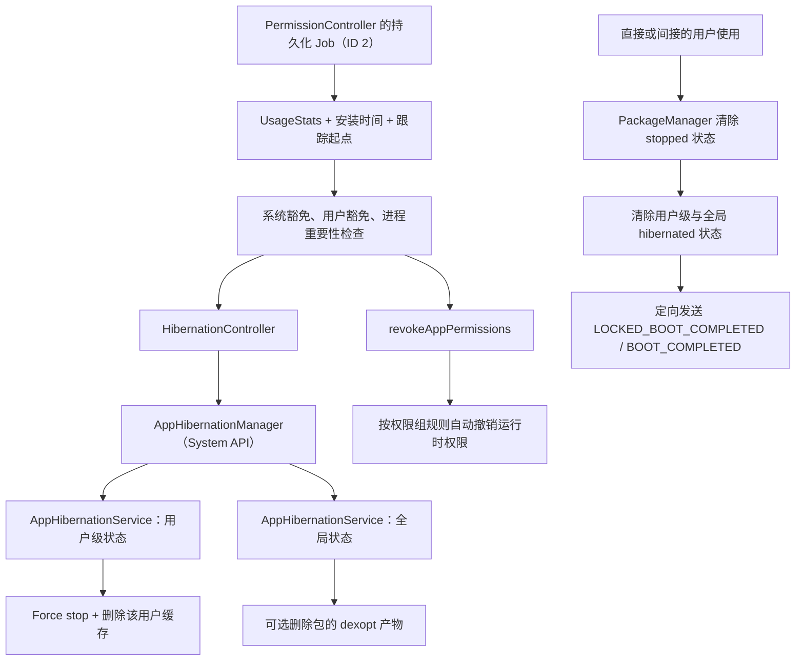

# 5.17 Android 17 App Hibernation 状态机与冷启动恢复性能

App Hibernation 面向“安装后长期没有被使用”的应用。它会把包置于类似手动 Force stop 的状态，回收缓存和可选的 dexopt 产物，并配合 unused-app policy 重置一部分运行时权限。对应用团队而言，最重要的后果有三个：原有后台入口不能继续工作、权限不会在退出休眠时自动恢复、首次再启动可能同时产生冷进程、缓存重建和代码重新优化的成本。

源码锚点为 Android 17 / `android-17.0.0_r1`。`AppHibernationService` 保存休眠状态并执行系统动作，判定“多久未使用、哪些包应豁免”的策略位于 PermissionController 模块。把所有逻辑都归到 system_server，会得到错误的检查周期、使用事件和权限撤销链路。

## 三种相邻机制的边界

| 机制 | 主要目标 | 典型动作 | 用户再次打开时 |
|---|---|---|---|
| App Standby Bucket | 控制后台资源配额 | 调整 Job、Alarm 和网络等机会 | 使用事件通常会改善桶位 |
| App Hibernation | 处理长期未使用应用 | Force stop、清缓存、可选删除 dexopt 产物，并配合权限自动重置 | 解除 stopped/hibernated 状态，但不自动恢复权限和旧任务 |
| App Archiving | 回收安装包占用 | 移除 APK 与缓存，保留用户数据和可恢复入口 | 安装器先取回 APK，再启动应用 |

Android 15 / API 35 才加入操作系统级 `PackageInstaller.requestArchive()` / `requestUnarchive()`。Google Play 更早提供的自动归档属于商店能力，不能用来推断 AOSP 的平台 API 版本。

Hibernation 与 Standby Bucket 可以同时存在，但 AOSP 没有规定“必须先进入 RARE 才能休眠”。PermissionController 根据 usage stats、安装时间、共享 UID、跨 profile 使用情况和豁免规则独立筛选候选包。

## Android 17 的职责分层

下面的图用于区分“策略决策”“状态与动作”“再次使用后的恢复”三个阶段：



图中的两条执行支线需要分别排查。缓存已删除但权限没有变化，或权限被自动撤销而包没有进入 system_server 的 hibernated 状态，都可能是合法结果，取决于 target SDK、设备配置和权限组过滤条件。

### PermissionController 决定谁该休眠

Android 17 的策略实现位于：

- `packages/modules/Permission/PermissionController/.../hibernation/HibernationPolicy.kt`
- `packages/modules/Permission/PermissionController/.../hibernation/v31/HibernationController.kt`
- `packages/modules/Permission/PermissionController/.../permission/service/AutoRevokePermissions.kt`

默认策略参数为：

| 参数 | Android 17 AOSP 默认值 | DeviceConfig namespace / key |
|---|---:|---|
| 未使用阈值 | 90 天 | `permissions/auto_revoke_unused_threshold_millis2` |
| 检查周期 | 15 天 | `permissions/auto_revoke_check_frequency_millis` |
| Hibernation 总开关 | 开启 | `app_hibernation/app_hibernation_enabled` |

周期任务属于 PermissionController，AOSP 包名为 `com.android.permissioncontroller`，Job ID 为 `2`；Google 系统镜像和官方测试文档使用的包名可能是 `com.google.android.permissioncontroller`。它是 persisted periodic Job；刚创建新调度时会跳过第一次过早执行。`AppHibernationService` 并不会每 24 小时扫描一次。

这些值可以被 DeviceConfig 或产品配置修改。90 天适合作为 AOSP 默认线，不能当作所有 OEM、所有时刻都固定不变的协议。

Android 17 默认还把 `app_hibernation/app_hibernation_targets_pre_s_apps` 设为关闭。`HibernationController` 会跳过 `targetSdkVersion < 31` 的用户级 Force stop/cache 回收，但同一批 unused apps 仍可能进入运行时权限自动重置流程。旧 target 应用是否被权限重置还取决于 app-op、设备形态和其他豁免条件，所以“设备运行 Android 12+”不足以推断全部动作都已发生。

### “未使用”不等于只看 Activity

PermissionController 的 `UsageStats.lastTimePackageUsed()` 在 Android 12 及以上取以下两者的较大值：

- `lastTimeVisible`
- `lastTimeAnyComponentUsed`

候选筛选还会把时间下限推进到应用首次安装时间和本机开始跟踪 unused apps 的时间。共享 UID 中任一包最近被使用，会保护同 UID 的其他包；具备跨 profile 能力的包还会参考其他用户的使用时间。

官方文档与 Android 17 实现给出的关键边界是：

- Activity resume 算使用；
- 用户操作 widget 算使用；
- 用户操作通知算使用，单纯划掉通知不算；
- 被其他应用或系统绑定的 Service、ContentProvider，以及收到外部包的显式广播，可能通过 component-used 记为使用；
- JobScheduler Job、隐式广播和仅仅设置 Alarm 不会因此刷新休眠使用时间。

`AppHibernationService` 自身也监听 `USER_INTERACTION`、`ACTIVITY_RESUMED` 和 `APP_COMPONENT_USED`，命中后清除用户级与全局休眠状态。因此，Android 17 并没有把 Activity 以外的所有事件排除。

### 候选包还要经过豁免与运行状态检查

PermissionController 会排除多类包，包括：

- Launcher 中没有可启动入口的包；
- work profile 中的应用；
- system UID、设备策略管理、运营商特权等系统角色；
- 某些通话、安装器、系统健康类应用；
- 通过 `OP_SYSTEM_EXEMPT_FROM_HIBERNATION` 获得系统豁免的包；
- 用户在设置中关闭 unused-app restrictions 的包。

筛选当下若应用进程的重要性不低于 `IMPORTANCE_CANT_SAVE_STATE`，本轮也会跳过它。Foreground Service 的运行本身不会刷新 usage timestamp，但活跃且重要的进程可以使该次扫描暂不休眠；服务结束后，旧的使用时间仍可能让它在后续扫描中迅速再次成为候选。

Android 17 设置界面中的用户开关通常叫“Pause app activity if unused”。普通应用不应调用隐藏的 `AppHibernationManager`；该类是 `@SystemApi`，并要求 `MANAGE_APP_HIBERNATION`。应用侧应通过 AndroidX Core 的 unused-app restrictions API 查询功能状态，并在确有后台核心场景时引导用户进入系统设置。

## 状态模型：用户级与全局级是两层

### 用户级 hibernation

`setHibernatingForUser(packageName, userId, true)` 先在锁内更新 `UserLevelState.hibernated`，再把以下工作交给后台 executor：

1. 查询删除前的 cache bytes；
2. 记录休眠 restriction（受 feature flag 控制）；
3. 调用 `IActivityManager.forceStopPackage()`；
4. 调用 `deleteApplicationCacheFilesAsUser()`；
5. 把估算的 cache bytes 写入内存统计。

用户级动作按 user 隔离。同一个包在个人用户中休眠，不代表其工作资料副本也休眠。

### 全局 hibernation

一个包在所有用户范围内都超过 unused threshold 时，`HibernationController` 才会设置全局休眠。若资源配置 `config_hibernationDeletesOatArtifactsEnabled` 开启，`hibernatePackageGlobally()` 会调用 `deleteOatArtifactsOfPackage()`，最终由 ART service 删除 dexopt artifacts。Android 17 AOSP 的资源默认值为 `true`，OEM 可以覆盖。

全局动作会影响该包共享的编译产物，因此恢复后的启动差异可能比只清用户缓存更明显。这里仍不能预设固定延迟：影响取决于 dex 布局、Baseline Profile、系统是否重新 dexopt、设备 I/O、代码路径和启动阶段是否触发 JIT。

### 状态持久化位置

Android 17 使用 protobuf 列表文件，不是一应用一个 XML：

| 层级 | 路径 | 主要持久字段 |
|---|---|---|
| 全局 | `/data/system/hibernation/states` | package name、hibernated、saved bytes |
| 用户级 | `/data/system_ce/<userId>/hibernation/states` | package name、hibernated |

`HibernationStateDiskStore` 以 `AtomicFile` 写入，并延迟一分钟合并连续更新。`UserLevelState` / `GlobalLevelState` 的内存对象还有 saved bytes、last-unhibernated 等字段，但不要把 `dumpsys` 中的内存展示字段等同于全部持久字段。

## 进入休眠后发生什么

### Force stop 与后台入口

官方语义是：休眠应用不能从后台运行 Job 或 Alarm，也不能接收 push notification，包括高优先级 FCM。用户再次与应用交互前，不应期待后台入口自行唤醒进程。

Android 15 起，package stopped state 的规则进一步明确：

- 只有直接或间接用户操作才能解除 stopped；
- 进入 stopped 时取消应用的 PendingIntent；
- 依赖这些 PendingIntent 的 widget 会被暂时禁用；
- 用户再次启动应用后，系统重新启用 widget。

这些属于 stopped package 的平台行为，Hibernation 因调用 `forceStopPackage()` 继承它们。

### 权限自动重置是独立步骤

PermissionController 对同一批 unused apps 调用 `revokeAppPermissions()`。它不会无条件撤销“所有 dangerous 权限”，而是按权限组筛选：

- 只处理当前已授予、user-sensitive、非 fixed 的平台运行时权限组；
- 默认授予、角色授予、`revokeWhenRequested` 等类别会被排除；
- split permission 关系可能使整组保留；
- Android 17 源码明确把 `ACTIVITY_RECOGNITION` 和 `POST_NOTIFICATIONS` 放在 auto-revoke exempt 列表。

撤销后的权限带有 `FLAG_PERMISSION_AUTO_REVOKED`。应用退出休眠时，这些权限不会自动重新授予；用户仍要在具体功能入口重新授权。

### 存储回收边界

| 数据 | 休眠后的预期 |
|---|---|
| cache files | 删除 |
| dexopt/OAT artifacts | 全局休眠且产品开关开启时删除 |
| `filesDir`、数据库、SharedPreferences | 保留 |
| 用户凭据与 Keystore key | Hibernation 本身不删除 |
| APK | 保留 |
| 已归档应用的 APK | 由 Archiving 移除，属于另一机制 |

凡是业务正确性依赖的数据都不应只保存在 cache。缓存目录为空也不构成“刚从休眠恢复”的证据，因为用户清理、系统存储回收和应用自身淘汰都能产生相同现象。

## 用户再次打开应用时的恢复

直接启动 Activity、通过 sharesheet 使用组件或操作 widget 等用户动作可以解除 package stopped 状态。Android 17 的 `PackageManagerService.setPackageStoppedState(..., false)` 会异步查询 `AppHibernationManagerInternal`；如果该用户仍处于 hibernated 状态，服务会同时清除用户级和全局状态。

用户级 unhibernate 会向目标包定向发送：

- `ACTION_LOCKED_BOOT_COMPLETED`
- `ACTION_BOOT_COMPLETED`

接收这两个广播仍要求应用声明 `RECEIVE_BOOT_COMPLETED`。它们给应用一次重新注册 Job、Alarm 等工作的机会。系统不会恢复休眠前已经存在的 Job、Alarm、notification 或 runtime permission。

恢复路径可归纳为：

1. 用户动作使 package 离开 stopped；
2. PackageManager 与 usage event listener 触发 unhibernate；
3. 应用进程开始冷启动；
4. 系统投递定向 boot-completed 广播；
5. 应用按幂等规则重建后台计划；
6. 用户进入相关功能时再检查和申请权限。

这里没有“先恢复权限，再刷新 PackageManager 状态”的阶段。权限自动重置是持久授权状态，必须由用户重新决定。

## 冷启动性能：只讨论可证明的增量

Hibernation 后一定没有原进程可复用，所以再次打开至少是冷进程启动。相对一次普通冷启动，可能增加的工作包括：

- 应用自己的图片、网络响应、模板或预计算缓存重新生成；
- Web 内容与其他 SDK 依赖的可删除缓存重新获取；
- 全局休眠删除 dexopt artifacts 后的校验、解释执行、JIT 或后续 dexopt 成本；
- 权限缺失引发的功能分支、UI 更新和远端数据重新加载；
- boot-completed 重建逻辑与前台启动竞争 CPU、I/O 或锁。

不能给出通用的“慢 20%–60%”或固定毫秒表。AOSP 只定义动作，没有定义应用工作集、网络条件和 dexopt 状态。若恢复路径在主线程同步重建所有缓存，性能问题来自应用实现；若 OAT 已删除，平台因素也要单独标注。

### 建议的对照实验

至少分成三组，避免把不同成本混在一起：

| 实验组 | 操作 | 回答的问题 |
|---|---|---|
| 普通冷启动 | 保留缓存与 dexopt 状态，只停止进程 | 应用固有冷启动成本 |
| 用户级休眠恢复 | `set-state --user ... true` 后由用户入口恢复 | Force stop、用户 cache 删除与重建成本 |
| 用户级 + 全局休眠恢复 | 再设置 `--global ... true` | 额外 dexopt artifact 删除成本 |

每组都应记录：

- Macrobenchmark 的 TTID / TTFD 分布，而非单次值；
- Perfetto 中主线程、Binder、I/O、page fault、dex/JIT 和首帧；
- hibernation 前后的 cache bytes 与 hibernation saved bytes；
- `ApplicationStartInfo.wasForceStopped()`（API 35+）；
- 权限集合、后台任务重建时刻和网络缓存命中率；
- build、设备、温度、编译模式、Baseline Profile 与迭代次数。

`wasForceStopped()` 只能证明此次启动之前包处于 force-stopped 状态，不能单独区分用户手动 Force stop、Hibernation 或其他使包 stopped 的路径。

## 观测与复现实验

### 直接读写 hibernation 状态

下面的命令用于查询或设置用户级、全局级状态。`AppHibernationShellCommand` 在 Android 17 只实现 `get-state` 和 `set-state`，没有 `list`、`set-hibernating` 或 `get-hibernating` 子命令：

```bash
adb shell cmd app_hibernation get-state --user 0 PACKAGE_NAME
adb shell cmd app_hibernation get-state --global PACKAGE_NAME

adb shell cmd app_hibernation set-state --user 0 PACKAGE_NAME true
adb shell cmd app_hibernation set-state --global PACKAGE_NAME true
```

第一组查询返回布尔值；第二组直接改变 system_server 的状态并异步执行对应动作。为减少实验污染，应在专用测试设备和测试账号上使用，并在每轮开始前确认两个层级的初始状态。

### 运行完整的 PermissionController 策略

下面的命令用于暂时缩短 unused threshold，并强制运行 Android 17 的策略 Job：

```bash
old_threshold="$(adb shell device_config get permissions auto_revoke_unused_threshold_millis2)"

adb shell device_config put app_hibernation app_hibernation_enabled true
adb shell device_config put permissions auto_revoke_unused_threshold_millis2 1000
adb shell am wait-for-broadcast-idle
adb shell cmd jobscheduler run -u 0 -f com.android.permissioncontroller 2

adb shell cmd app_hibernation get-state --user 0 PACKAGE_NAME
adb shell device_config put permissions auto_revoke_unused_threshold_millis2 "$old_threshold"
```

这条路径会同时经过 usage、豁免、进程重要性、target SDK、权限自动重置等策略，更接近用户设备上的自动休眠。Google 系统镜像若使用 `com.google.android.permissioncontroller`，需替换命令中的包名。测试脚本还应保存原来的 hibernation 开关和 check frequency，并在异常退出时恢复，避免把测试配置遗留在设备上。

### dumpsys 与 trace

下面的命令用于查看内存状态和 Perfetto 可见的 system_server slice：

```bash
adb shell dumpsys app_hibernation

adb shell perfetto -o /data/misc/perfetto-traces/hibernation.pftrace \
  -t 15s sched freq idle am wm ss
```

`dumpsys app_hibernation` 展示用户级与全局级 state，字段来自 `UserLevelState.toString()` / `GlobalLevelState.toString()`，主要包括 package、hibernated、saved bytes 和 last-unhibernated。它没有 `unusedSinceMs`、`lastChecked` 或 `reason` 这些固定字段。

`AppHibernationService` 的 Android 17 trace slice 名称为 `hibernatePackage`、`unhibernatePackage` 和 `hibernatePackageGlobally`，没有把 package name 拼进 slice。Perfetto 适合确认动作与启动时序；具体包名、策略筛选原因和权限变化仍需结合 PermissionController 日志、dumpsys 与测试记录。

## 应用侧适配

### 把后台计划设计成可重建状态

应用启动和 `BOOT_COMPLETED` receiver 都可以调用同一个幂等入口：

- 读取持久业务状态；
- 查询应存在的 unique work / Job / Alarm；
- 缺失时补建，存在时不重复；
- 给网络同步设置幂等 key；
- 把最终成功进度写入数据库，不依赖进程内标记。

WorkManager 可以简化重启后的持久工作恢复，但仍应验证 hibernation 退出后的实际版本行为。官方文档明确建议用 WorkManager，或在 `BOOT_COMPLETED` 中重建原调度。

### 权限只在功能入口处理

启动阶段可以刷新权限派生状态，不宜立刻弹出所有权限对话框。更稳妥的顺序是：

1. 允许不依赖敏感权限的首页先显示；
2. 用户进入地图、相机、录音等功能时检查当前授权；
3. 解释该功能为何需要权限；
4. 发起系统权限请求；
5. 拒绝后保留可继续使用的降级路径。

文案可以说明“权限可能因长期未使用被系统重置”，但不要断言本次缺权一定由 Hibernation 导致。用户手动撤销、策略管理和系统升级都可能改变授权。

### 查询 unused-app restrictions 功能状态

下面的 Kotlin 示例用于查询“该应用是否受 unused-app restrictions 管理”，它不用于判断应用当前是否已经 hibernated：

```kotlin
val future = PackageManagerCompat.getUnusedAppRestrictionsStatus(context)
future.addListener(
    {
        when (future.get()) {
            UnusedAppRestrictionsConstants.DISABLED -> {
                // 用户或系统已为本应用关闭 unused-app restrictions。
            }
            UnusedAppRestrictionsConstants.API_31,
            UnusedAppRestrictionsConstants.API_30,
            UnusedAppRestrictionsConstants.API_30_BACKPORT -> {
                // 当前设备支持并启用了相应 restrictions。
            }
        }
    },
    ContextCompat.getMainExecutor(context),
)
```

若后台核心能力确需豁免，可先向用户解释影响，再用 `IntentCompat.createManageUnusedAppRestrictionsIntent()` 打开系统设置。不要把设置跳转放在无上下文的首次启动弹窗中。

### 不要用间接特征做硬归因

以下信号都只能作为辅助：

| 信号 | 歧义 |
|---|---|
| cache 为空 | 首装、用户清理、系统回收和应用淘汰都可能发生 |
| dangerous permission 缺失 | 从未授予、手动撤销、企业策略或 auto revoke |
| `wasForceStopped() == true` | 手动 Force stop 与 Hibernation 都会命中 |
| 冷启动变慢 | cache、dexopt、I/O、网络、温度和版本更新都可能影响 |
| 收到 `BOOT_COMPLETED` | 设备启动与退出 Hibernation 都可能投递 |

监控系统可以组合这些字段建立“疑似 hibernation recovery”标签，同时保留原始证据。没有平台明确事件时，不应把推断当成确定结论上报。

## 版本边界

| 版本 | 相关变化 |
|---|---|
| Android 12 / API 31 | 引入平台 App Hibernation；用户级 Force stop/cache 回收与全局存储优化 |
| Android 13 / API 33 | 设置入口文案通常调整为“Pause app activity if unused”；Safety Center 可呈现 unused apps |
| Android 15 / API 35 | stopped package 只因用户动作解除；Force stop 取消 PendingIntent、暂时禁用 widget；新增 `ApplicationStartInfo.wasForceStopped()`；加入操作系统级 App Archiving API |
| Android 17 / API 37 | 策略仍由 PermissionController 驱动，system_server 维护用户级/全局级状态 |

“Android 15 不再把通知交互算使用”“Android 17 只接受 `MOVE_TO_FOREGROUND`”均没有对应源码，并与 Android 17 的 `USER_INTERACTION`、`ACTIVITY_RESUMED`、`APP_COMPONENT_USED` 监听和官方文档冲突。

## 排障清单

| 现象 | 优先证据 |
|---|---|
| 长期未打开后收不到推送 | hibernation user state、package stopped、FCM token 之外的进程/后台限制 |
| 权限突然变成 denied | permission flags 中的 auto-revoked、unused-app 设置、企业策略、用户操作 |
| 打开后后台任务没有恢复 | `BOOT_COMPLETED` 声明与接收、幂等重建逻辑、WorkManager 数据库 |
| 恢复首启明显变慢 | cache miss、全局 hibernation、dexopt/JIT、网络、Baseline Profile |
| `set-state true` 后测试结果不一致 | 用户级/全局级是否都设置、异步动作是否完成、进程是否仍重要 |
| 自动策略没有休眠测试包 | threshold、usage stats、target SDK、Launcher 入口、豁免、进程 importance |
| dumpsys 没有预期字段 | 以 Android 17 state model 的实际输出为准，不套用其他服务字段 |

## 参考资料

- [App hibernation](https://developer.android.com/topic/performance/app-hibernation)：影响、使用定义、豁免、退出行为和官方测试命令。
- [Android 15 package stopped state changes](https://developer.android.com/about/versions/15/behavior-changes-all#stopped-state)：PendingIntent、widget、用户解除 stopped 与 `wasForceStopped()`。
- [Android 15 app archiving](https://developer.android.com/about/versions/15/features#app-archiving)：平台级 archive/unarchive 的 API 与恢复模型。
- [AppHibernationService.java（android-17.0.0_r1）](https://cs.android.com/android/platform/superproject/+/android-17.0.0_r1:frameworks/base/services/core/java/com/android/server/apphibernation/AppHibernationService.java)：用户级/全局级状态、Force stop、缓存、dexopt 和恢复广播。
- [HibernationPolicy.kt（android-17.0.0_r1）](https://cs.android.com/android/platform/superproject/+/android-17.0.0_r1:packages/modules/Permission/PermissionController/src/com/android/permissioncontroller/hibernation/HibernationPolicy.kt)：默认阈值、检查周期、usage 计算和豁免。
- [HibernationController.kt（android-17.0.0_r1）](https://cs.android.com/android/platform/superproject/+/android-17.0.0_r1:packages/modules/Permission/PermissionController/src/com/android/permissioncontroller/hibernation/v31/HibernationController.kt)：用户级与全局级状态设置条件。
- [AutoRevokePermissions.kt（android-17.0.0_r1）](https://cs.android.com/android/platform/superproject/+/android-17.0.0_r1:packages/modules/Permission/PermissionController/src/com/android/permissioncontroller/permission/service/AutoRevokePermissions.kt)：权限组筛选与 auto-revoked flags。
- [PackageManagerService.java（android-17.0.0_r1）](https://cs.android.com/android/platform/superproject/+/android-17.0.0_r1:frameworks/base/services/core/java/com/android/server/pm/PackageManagerService.java)：清除 stopped 时触发 unhibernate。
- [AppHibernationShellCommand.java（android-17.0.0_r1）](https://cs.android.com/android/platform/superproject/+/android-17.0.0_r1:frameworks/base/services/core/java/com/android/server/apphibernation/AppHibernationShellCommand.java)：`get-state` / `set-state` 的准确语法。
