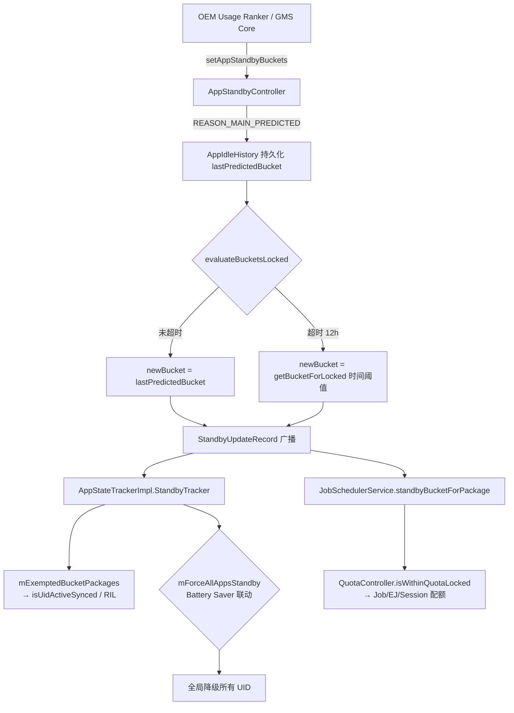

# 5.21 Adaptive Battery 与 App Standby Bucket 协同机制

5.8 节讲了开发者侧的桶是什么、怎么查、怎么适配。本节回答系统侧的问题：桶值从哪来、谁写入、何时过期、三方消费者怎么读取。

Adaptive Battery 在 AOSP 中不是一个独立服务。它是一套写入接口加衰减契约：ML 预测把"哪一类后台任务该被压"翻译成具体桶索引（`STANDBY_BUCKET_ACTIVE` 到 `STANDBY_BUCKET_RARE`），再由三套独立的资源调度器读取并执行限制。理解这套机制，才能解释为什么同一个 App 在不同 OEM 设备上走出截然不同的耗电曲线——AOSP 主线不包含完整 ML 模型，预测精度取决于 OEM 私有实现。

[已验证: AOSP android-17.0.0_r1, frameworks/base/apex/jobscheduler/service/java/com/android/server/usage/AppStandbyController.java]

## 桶值写入：REASON_MAIN_PREDICTED 与 12 小时保质期

`AppStandbyController.setAppStandbyBuckets()` 按 calling UID 分三类写入 reason（`AppStandbyController.java:1749-1790`）：

```java
// AppStandbyController.java:1749-1790
final int reason;
if ((UserHandle.isSameApp(callingUid, Process.SYSTEM_UID) && callingPid != Process.myPid())
        || shellCaller) {
    reason = REASON_MAIN_FORCED_BY_USER;
} else if (UserHandle.isCore(callingUid)) {
    reason = REASON_MAIN_FORCED_BY_SYSTEM;
} else {
    reason = REASON_MAIN_PREDICTED;
}
```

三类 reason 的行为差异：

| 调用方 | reason | 预测可覆盖？ |
|--------|--------|-------------|
| shell / root / Settings（`SYSTEM_UID` 非本进程） | `REASON_MAIN_FORCED_BY_USER` | 否 |
| Core 系统进程（`SYSTEM_UID` 同进程） | `REASON_MAIN_FORCED_BY_SYSTEM` | 否 |
| 其他调用方（`UsageStatsManagerInternal` 透传的 ML 预测） | `REASON_MAIN_PREDICTED` | 是，12h 超时后失效 |

predicted 桶值的"保质期"由 `DEFAULT_PREDICTION_TIMEOUT` 控制（`AppStandbyController.java:3231-3233`）：

```java
// AppStandbyController.java
private static final long DEFAULT_PREDICTION_TIMEOUT =
        COMPRESS_TIME ? 10 * ONE_MINUTE : 12 * ONE_HOUR;
```

生产构建中这个值是 **12 小时**。超过 12 小时没人刷新预测，桶值回退到 `getBucketForLocked()` 的纯时间阈值算法——这条路径完全不读 `lastPredictedBucket`，只看"距离上次使用过了多久"。Android 16 起，这个超时值可由 `DeviceConfig` 改写（`AppStandbyController.java:3231-3233`）。

[已验证: AOSP android-17.0.0_r1, AppStandbyController.java DEFAULT_PREDICTION_TIMEOUT]

持久化字段只有一个：`AppIdleHistory.AppUsageHistory.lastPredictedBucket`（`AppIdleHistory.java:181-185`）。`UsageStatsManagerInternal` 不是 ML 模型宿主，它只是内部 API 的实现方。真正的 ML 评分在 OEM 提供的 Usage Ranker 服务里（AOSP 主线 `frameworks/base/services/people/java/com/android/server/people/...` 走 Provider 接口）。

## 衰减契约：evaluateBucketsLocked 决策树

`AppStandbyController.evaluateBucketsLocked()` 在每次评估时决定用预测值还是回退到时间阈值（`AppStandbyController.java:1007-1080`）。决策逻辑分两条路径：

**路径 1：旧 reason 是 FORCED**

如果当前桶值被用户或系统强制设置（`REASON_MAIN_FORCED_BY_USER` / `REASON_MAIN_FORCED_BY_SYSTEM`），预测直接 return，不修改桶值。这解释了为什么 `adb shell am set-standby-bucket` 设置的桶位在 12 小时内不会被 Adaptive Battery 推翻。

强制锁的覆盖规则在 `AppStandbyController.java:1820-1826`：

```java
// AppStandbyController.java:1820-1826
if (predicted
        && ((app.bucketingReason & REASON_MAIN_MASK) == REASON_MAIN_FORCED_BY_USER
        || (app.bucketingReason & REASON_MAIN_MASK) == REASON_MAIN_FORCED_BY_SYSTEM)) {
    return;
}
```

**路径 2：旧 reason 是 DEFAULT / USAGE / TIMEOUT 或 prediction 已超时**

```
evaluateBucketsLocked() 决策：
  ├─ prediction 未超时 + lastPredictedBucket ∈ [ACTIVE, RARE]
  │     → newBucket = lastPredictedBucket
  │       reason = REASON_MAIN_PREDICTED | REASON_SUB_PREDICTED_RESTORED
  │
  └─ prediction 已超时 (predictionTimedOut = true)
        → newBucket = getBucketForLocked(...)
          reason = REASON_MAIN_TIMEOUT
```

`predictionTimedOut()` 判断逻辑（`AppStandbyController.java:1094-1126`）：

```java
// AppStandbyController.java
private boolean predictionTimedOut(AppIdleHistory.AppUsageHistory app, long elapsedRealtime) {
    return app.lastPredictedTime > 0
            && mAppIdleHistory.getElapsedTime(elapsedRealtime)
                - app.lastPredictedTime > mPredictionTimeoutMillis;
}
```

回退路径 `getBucketForLocked()` 是纯时间阈值算法（`AppStandbyController.java:1123-1131`）：

```java
// AppStandbyController.java
@GuardedBy("mAppIdleLock")
private int getBucketForLocked(String packageName, int userId, long elapsedRealtime) {
    int bucketIndex = mAppIdleHistory.getThresholdIndex(packageName, userId,
            elapsedRealtime, mAppStandbyScreenThresholds, mAppStandbyElapsedThresholds);
    return bucketIndex >= 0 ? THRESHOLD_BUCKETS[bucketIndex] : STANDBY_BUCKET_NEVER;
}
```

这个路径不看预测值，只看屏幕熄灭时长和灭屏后经过的时间。阈值由设备的 `xml/usage_stats.xml` 配置决定。

这套设计保证了 ML 预测只是"建议"：用户和系统的强制操作优先级永远高于算法，预测超时后系统回退到确定性逻辑。

[已验证: AOSP android-17.0.0_r1, AppStandbyController.java evaluateBucketsLocked]

## 三方消费者：桶值如何变成资源限制

桶值稳定后，三个独立的系统组件同时读取。每个消费者关注桶值的不同维度。

### 消费者 1：QuotaController（Job / EJ 配额）

入口链路：`JobSchedulerService.standbyBucketForPackage()` → `QuotaController.isWithinQuotaLocked()`。

`JobSchedulerService` 把 `UsageStatsManager` 的桶值映射为桶索引（`JobSchedulerService.java:5016-5058`）：

```java
// JobSchedulerService.java
public static int standbyBucketToBucketIndex(int bucket) {
    if (bucket == UsageStatsManager.STANDBY_BUCKET_NEVER) return NEVER_INDEX;
    else if (bucket > UsageStatsManager.STANDBY_BUCKET_RARE) return RESTRICTED_INDEX;
    else if (bucket > UsageStatsManager.STANDBY_BUCKET_FREQUENT) return RARE_INDEX;
    else if (bucket > UsageStatsManager.STANDBY_BUCKET_WORKING_SET) return FREQUENT_INDEX;
    else if (bucket > UsageStatsManager.STANDBY_BUCKET_ACTIVE) return WORKING_INDEX;
    else if (bucket > UsageStatsManager.STANDBY_BUCKET_EXEMPTED) return ACTIVE_INDEX;
    else return EXEMPTED_INDEX;
}
```

`QuotaController.isWithinQuotaLocked()` 按桶索引检查配额（`QuotaController.java:942-1017`）。判断顺序：

1. 顶层启动、用户主动发起、UID 在前台 → 无视桶配额，直接放行
2. `NEVER_INDEX` → 永久封禁
3. 充电中（RESTRICTED 桶除外）→ 配额免费
4. EJ 时长配额检查
5. 正在运行的 Job（非 RESTRICTED）→ 放行
6. Job 数量和 Session 数量检查

默认配额表（`QuotaController.java:3249-3290`）：

| 桶 | 窗口 | Job 配额 | Session 配额 | EJ 时长 |
|----|------|---------|-------------|---------|
| EXEMPTED | 40 min | 75 | 75 | 60 min |
| ACTIVE | 60 min | 75 | 75 | 30 min |
| WORKING_SET | 4 h | 60 | 10 | 15 min |
| FREQUENT | 12 h | 200 | 8 | 10 min |
| RARE | 24 h | 48 | 3 | 10 min |
| RESTRICTED | 24 h | 10 | 1 | 5 min |

App 从 FREQUENT 降到 RARE，Job 预算从 200/12h 缩到 48/24h，Session 从 8 缩到 3。Adaptive Battery 的预测直接对应这行表格的约束力度。

[已验证: AOSP android-17.0.0_r1, QuotaController.java:3249-3290]

### 消费者 2：AppStateTrackerImpl（EXEMPTED 集管理）

入口：`AppStateTrackerImpl.StandbyTracker.onAppIdleStateChanged()`（`AppStateTrackerImpl.java:771-792`）。

```java
// AppStateTrackerImpl.java:771-792
final class StandbyTracker extends AppIdleStateChangeListener {
    @Override
    public void onAppIdleStateChanged(String packageName, int userId, boolean idle,
            int bucket, int reason) {
        synchronized (mLock) {
            final boolean changed;
            if (bucket == UsageStatsManager.STANDBY_BUCKET_EXEMPTED) {
                changed = mExemptedBucketPackages.add(userId, packageName);
            } else {
                changed = mExemptedBucketPackages.remove(userId, packageName);
            }
            if (changed) {
                mHandler.notifyExemptedBucketChanged();
            }
        }
    }
}
```

EXEMPTED 是特殊桶。App 被推到 EXEMPTED 时，加入 `mExemptedBucketPackages` 内存集合。该集合在 `isUidActiveSynced()` 路径中被查询（`AppStateTrackerImpl.java:1811`），进而被 `QuotaController.isUidInForeground()` 用来判断"该 UID 是否被认为活跃"。EXEMPTED 包不仅配额大，还能绕过 `isUidInForeground` 的常规检查——这是 Adaptive Battery 间接影响 Job 配额的第二条通道。

`AppStateTracker` 还提供 `isActive()` 给 RIL 层（`AppStateTrackerImpl.java:1156-1191`），影响 modem 是否给该 App 拉起数据通道。这条路径读 `mExemptedBucketPackages` 的并集 `isInParole()`——EXEMPTED 集合里的 App 在系统看来"不是 idle"，可以持续建立 Radio 连接。Adaptive Battery 决定一个 App 是否降级时，同时影响 Radio 活跃度。

[已验证: AOSP android-17.0.0_r1, AppStateTrackerImpl.java]

### 消费者 3：PowerManagerService（节电模式联动）

`isPowerSaveMode()` 叠加桶值影响——低电量模式下非 ACTIVE 桶的 App 被进一步压缩。

`AppStateTrackerImpl.java:634-654` 暴露了 `mForceAllAppsStandby` 开关。这不是 Adaptive Battery 的桶值，而是一个全局强制开关。当 `mForceAllAppStandbyForSmallBattery` 打开（Android 16+）且设备没插电，或者 Battery Saver 启用时，调用 `toggleForceAllAppsStandbyLocked(true)`，所有 UID 被当作"被强制降级"处理。



## 桶值不可逆覆盖规则

predicted reason 不能覆盖 FORCED reason。`AppStandbyController` 在 `reportEvent` 路径中检查：如果当前桶值是被用户或系统强制的（FORCED_BY_USER / FORCED_BY_SYSTEM），ML 预测直接 return。

这意味着开发者通过 `adb shell am set-standby-bucket <package> <bucket>` 设置的桶位，在 12 小时内不会被 Adaptive Battery 推翻。只有当用户或系统再次设置新桶位、或者通过 `adb shell am set-standby-bucket` 重置时，强制锁才会解除。

## Android 9-17 版本演进

| 版本 | 关键变化 | 源码依据 |
|------|----------|----------|
| Android 9 (API 28) | 引入五桶模型（ACTIVE/WORKING_SET/FREQUENT/RARE/EXEMPTED）与 `REASON_MAIN_PREDICTED` 枚举 | `AppStandbyController.java` reason 常量引入 |
| Android 12 (API 31) | 新增 RESTRICTED 桶，缩小 EXEMPTED 条件范围 | `STANDBY_BUCKET_RESTRICTED` 与 `IDLE_BUCKET_CUTOFF` 重新定义 |
| Android 13 (API 33) | RESTRICTED 自动降级阈值从 45 天缩至 8 天 | `QuotaController.java:3249-3290` 配额压缩 |
| Android 14 (API 34) | 顶层 EJ reward 时间块从 30s 改为 5min | `QuotaController.java:3281` `DEFAULT_CURRENT_EJ_TOP_APP_TIME_CHUNK_SIZE_MS` |
| Android 15 (API 35) | 引入独立能效维度，Job 可能因能效被挂起 | 由 `PowerManager` 驱动，不在 `AppStandbyController` 内 |
| Android 16 (API 36) | prediction timeout 可由 DeviceConfig 改写；小电量设备强制 standby | `AppStandbyController.java:3231-3233`、`AppStateTrackerImpl.java:230-249` |
| Android 17 (API 37) | `AppStandbyController` / `AppIdleHistory` 整体迁移到 `apex/jobscheduler/service/`；调用方分类逻辑稳定 | android-17.0.0_r1 |

[已验证: AOSP android-17.0.0_r1 版本演进路径]

## 开发者诊断路径

判断 Adaptive Battery 是否在影响 App 后台行为：

| 命令 / API | 用途 |
|------------|------|
| `adb shell am get-standby-bucket <package>` | 查看当前桶值 |
| `adb shell dumpsys usagestats appstandby` | 查看桶值历史和 reason |
| `adb shell dumpsys usagestats` 输出中的 `adaptivebat=<provider_pkg>` | 确认 OEM 是否启用了 ML provider |
| `UsageStatsManager.getAppStandbyBucket()` | 运行时查询桶值 |
| `adb shell am set-standby-bucket <package> <bucket>` | 强制设置桶位（测试用），设置后 ML 不可覆盖 |

`dumpsys usagestats` 输出中的 reason 字段可以直接判断桶值来源：

- `REASON_MAIN_FORCED_BY_USER` → 用户/adb 强制设置
- `REASON_MAIN_PREDICTED` → ML 预测写入，12h 内有效
- `REASON_MAIN_TIMEOUT` → 预测超时后回退到时间阈值
- `REASON_MAIN_USAGE` → 用户交互事件触发（如 ACTIVITY_RESUMED）

## OEM 自定义 ML Provider

AOSP 主线不包含完整的 Usage Ranker ML 模型实现。Pixel 通过私有 provider 接口提供预测，其他 OEM 各自实现。`AppStandbyController.dump()` 中的 `adaptivebat=<provider_pkg>` 字段可用于确认设备是否启用了真实 ML provider。

不同 OEM 的预测精度和调用频率有显著差异。这解释了一个常见现象：同一个 App 在 Pixel 和某 OEM 设备上后台行为不同——两者桶值写入策略、ML 模型精度、评估频率都可能不一样。

[已验证: AOSP android-17.0.0_r1, AppStandbyController.java:3352 dump 方法]

## 与 Doze 模式的叠加关系

App Standby Bucket 和 Doze 是两套独立的管控通道：

- **Doze** 基于 `DeviceIdleController`，管的是设备级 idle / maintenance 状态。设备静止不动、屏幕熄灭时进入 Doze，所有后台活动被压制。
- **App Standby Bucket** 基于 `AppStandbyController`，管的是应用级后台配额。按单个 App 的使用频率分配资源。

两者叠加：Doze maintenance 期间仍按桶值限制 Job 执行频率。一个 RARE 桶的 App 在 Doze maintenance 窗口中仍然只能跑 48 Job/24h，不会被 Doze 放松。详见 5.8 后台执行限制与优化。

## QuotaController 配额计算细节

QuotaController 的配额计算不是简单的固定值查表，而是基于多个参数的动态计算：

- **滚动窗口大小**：默认按桶位确定（12h 或 24h），充电状态下可能豁免
- **顶层 App 启动后的 reward 时间块**：Android 14 起从 30s 改为 5min，App 从顶层退到后台后的一段时间内仍享受高配额
- **EJ 独立配额池**：Expedited Job 有独立的时长预算，与普通 Job 分开计算
- **rate limit**：默认 20 Job/min，与桶位限制叠加生效。即使 ACTIVE 桶的 App 也不能在一分钟内启动超过 20 个 Job

rate limit 的存在意味着高频调度 Job 的 App（如心跳保活）会先撞到 rate limit，而不是桶位配额。

[已验证: AOSP android-17.0.0_r1, QuotaController.java]

## 调用链总览

从 ML 预测到资源限制的完整路径：

```
OEM Usage Ranker / GMS Core
    │
    ↓ UsageStatsManagerInternal.setAppStandbyBuckets(...)
AppStandbyController.setAppStandbyBucket(...)
    │ reason = REASON_MAIN_PREDICTED
    │ 写入 AppIdleHistory.AppUsageHistory.lastPredictedBucket
    ↓
evaluateBucketsLocked() / 定时评估
    │ predictionTimedOut: now - lastPredictedTime > 12h?
    │   ├─ 未超时 → newBucket = lastPredictedBucket
    │   └─ 超时   → newBucket = getBucketForLocked() 时间阈值
    ↓
mAppIdleHistory.setAppStandbyBucket(...)
    ↓
StandbyUpdateRecord + AppIdleStateChangeListener 广播
    │
    ├─→ AppStateTrackerImpl.StandbyTracker.onAppIdleStateChanged()
    │       ↓ mExemptedBucketPackages.add/remove
    │       ↓ isUidActiveSynced() / isInParole()
    │       ↓ QuotaController.isUidInForeground() ← EXEMPTED 走旁路
    │       ↓ RIL Radio 拉活判断
    │
    └─→ JobSchedulerService.standbyBucketForPackage()
            ↓ QuotaController.isWithinQuotaLocked()
            ↓ { EJ 时长 / Job 数 / Session 数 / 充电豁免 / 顶层启动豁免 }
            ↓ Job 允许 / 延期
```

## 性能影响

- **Job 配额退避曲线**：FREQUENT (200 Job/12h) → RARE (48 Job/24h) → RESTRICTED (10 Job/24h)。Adaptive Battery 把 App 写进 RARE 桶后，后台 CPU 时间预算下降约 4-5 倍（按 `bgJobCountInWindow / window` 计算）。
- **唤醒节省**：RARE / RESTRICTED 桶的时间阈值（`mAppStandbyElapsedThresholds`）显著拉长——按默认配置，24h 才允许一次 RARE 桶 App 主动唤醒执行 Job。
- **ML 模型推理频率**：`lastPredictedTime` 在每次 `setAppStandbyBuckets` 写入时刷新，12h 内不重复触发桶值刷新。
- **EXEMPTED 副作用**：App 通过 ML 被推入 EXEMPTED 时，同时获得 RIL 数据通道豁免、QuotaController 前台旁路、JobSession 高配额三层资源。"被 Adaptive Battery 顶到 EXEMPTED" 等价于"被系统认为活跃"。

## 待验证与待深入

- ML 模型具体架构未在 AOSP 源码中确认，属于厂商私有实现 [待验证]
- `mAppStandbyScreenThresholds` / `mAppStandbyElapsedThresholds` 的具体数值依赖设备 `xml/usage_stats.xml` 配置 [待验证]
- QuotaController 的 rate limit 与桶位限制的叠加效应未在现有材料中量化建模 [待验证]
