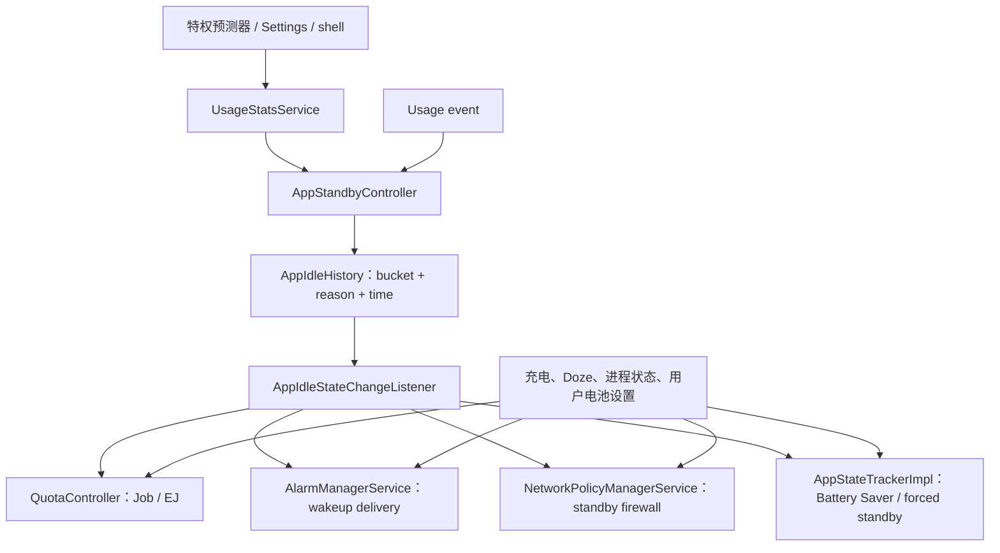

# 5.21 Adaptive Battery 与 App Standby Bucket 协同机制

§5.8 介绍了应用看到的桶位和后台限制。Android 17 / `android-17.0.0_r1` 源码进一步说明了桶位的写入方、预测失效条件、用户交互对优先级的影响，以及 JobScheduler、AlarmManager、网络策略和 Battery Saver 对同一份状态的消费方式。

先把两个概念分开：

- **App Standby Bucket** 是系统保存的应用级状态。数值越大，通常限制越强。
- **Adaptive Battery** 在 AOSP 中表现为启用开关和预测写入入口。AOSP 提供桶位存储、超时和消费规则，但没有提供所有设备共用的 ML 预测器。

官方文档允许厂商使用预装系统应用和机器学习预测 App 的下次使用时机；没有预测器时，系统按最近使用时间回退。应用不能假定 Pixel 与其他 OEM 会得到相同桶位，也不应尝试用通知或空任务维持高优先级。

## Android 17 的桶位与 idle 分界

`UsageStatsManager` 在 Android 17 中定义了以下值：

| 桶位 | 数值 | 主要含义 |
|---|---:|---|
| `EXEMPTED` | 5 | 系统豁免状态，属于 `@SystemApi` |
| `ACTIVE` | 10 | 当前使用、刚使用或近期很可能使用 |
| `WORKING_SET` | 20 | 经常使用 |
| `FREQUENT` | 30 | 有规律使用，但频率较低 |
| `RARE` | 40 | 很少使用 |
| `RESTRICTED` | 45 | 最高强度的常规限制 |
| `NEVER` | 50 | 安装后从未使用，属于 `@SystemApi` |

`AppIdleHistory.IDLE_BUCKET_CUTOFF` 在该标签中等于 `STANDBY_BUCKET_RARE`。因此，AOSP 内部问“这个 App 是否 idle”时，`RARE`、`RESTRICTED` 和 `NEVER` 会落在 idle 一侧；`FREQUENT` 仍在非 idle 一侧。这个分界会影响网络待机防火墙等消费者。

预测入口不接受 `EXEMPTED`：`setAppStandbyBuckets()` 要求输入位于 `ACTIVE..NEVER`，随后又禁止预测把应用改到 `NEVER` 或从 `NEVER` 改出。`EXEMPTED` 来自系统豁免和 `getAppMinBucket()` 等规则，ML 预测不能把 App 推入 `EXEMPTED`。

## Adaptive Battery 开关控制什么

下面的源码片段用于确认 Android 17 中 App Standby 是否启用的三个条件：

```java
boolean isAppIdleEnabled() {
    final boolean buildFlag = mContext.getResources().getBoolean(
            com.android.internal.R.bool.config_enableAutoPowerModes);
    final boolean runtimeFlag = Global.getInt(mContext.getContentResolver(),
            Global.APP_STANDBY_ENABLED, 1) == 1
            && Global.getInt(mContext.getContentResolver(),
            Global.ADAPTIVE_BATTERY_MANAGEMENT_ENABLED, 1) == 1;
    return buildFlag && runtimeFlag;
}
```

代码表明，资源开关、`APP_STANDBY_ENABLED` 与用户侧的 `ADAPTIVE_BATTERY_MANAGEMENT_ENABLED` 共同决定 `mAppIdleEnabled`。关闭后，`getAppStandbyBucket()` 的内部实现按 `EXEMPTED` 返回，并进入 parole 状态；它不只是停止外部预测。

充电也会让 `AppStandbyController.isInParole()` 返回 true，但不会为了充电重写每个 App 保存的桶值。各消费者在执行限制时放宽策略：普通 Job 配额通常免费，AlarmManager 暂停桶位限流，网络待机防火墙解除。`RESTRICTED` Job 和用户手动限制仍有额外规则，不能概括成“插电后所有限制消失”。

## 桶值写入：调用方决定 reason

`UsageStatsService` 先要求调用方持有 `CHANGE_APP_IDLE_STATE`，再把原始 UID/PID 传给 `AppStandbyController`。普通应用既没有该权限，也不能修改自己的桶位。

下面的源码片段用于说明 `setAppStandbyBuckets()` 怎样标记写入来源：

```java
final boolean shellCaller = callingUid == Process.ROOT_UID
        || callingUid == Process.SHELL_UID;
final int reason;
if ((UserHandle.isSameApp(callingUid, Process.SYSTEM_UID)
        && callingPid != Process.myPid()) || shellCaller) {
    reason = REASON_MAIN_FORCED_BY_USER;
} else if (UserHandle.isCore(callingUid)) {
    reason = REASON_MAIN_FORCED_BY_SYSTEM;
} else {
    reason = REASON_MAIN_PREDICTED;
}
```

这段分类有两个容易忽略的结果：

- shell、root，以及以 system UID 运行但不在当前进程内的 Settings 调用，记为 `FORCED_BY_USER`；
- 非 core UID 的特权调用方记为 `PREDICTED`。

源码只能证明“非 core 特权调用被视为预测”。具体预测器属于设备实现；AOSP 这里没有一个名为 Usage Ranker 的固定 ML 服务，也没有可由 `dumpsys usagestats` 稳定取得的 provider 包名。

### 预测写入还要经过保护规则

一个预测值不会直接覆盖所有状态。`setAppStandbyBucket()` 还会检查：

- 当前或新桶为 `NEVER` 时，预测不能改动；
- 当前 reason 为 `FORCED_BY_USER` 或 `FORCED_BY_SYSTEM` 时，预测不能覆盖；
- 当前为 `RESTRICTED` 时，能否升桶取决于进入该桶的 reason 和新预测值；
- 最近用户使用产生的临时升桶尚未到期时，先保留更高优先级；
- 自动进入 `RESTRICTED` 要满足最近用户使用后的延迟；
- 最终结果不能低于 `getAppMinBucket()` 给出的豁免下限。

所以，“预测结果等于最终桶值”只适用于没有命中这些保护条件的情况。

### 用户交互与强制状态

`evaluateBucketsLocked()` 对 `FORCED_BY_USER` 直接返回，源码注释明确说明：只有新的 usage event 才会把应用带出该强制状态。预测写入也拒绝覆盖 `FORCED_BY_SYSTEM`；该状态只能由新的系统强制操作或用户行为改变。

具体行为如下：

- `adb shell am set-standby-bucket` 产生的是强制用户状态；
- 12 小时预测超时不会解除这个强制状态；
- 启动 Activity 等用户行为可以产生 `REASON_MAIN_USAGE`，并改变桶位；
- 再执行一次 `set-standby-bucket ... active` 仍是强制设置，不是“恢复自动预测”命令。

测试脚本若没有记录 reason，很容易把人工固定的桶位当成 Adaptive Battery 输出。

## 预测的 12 小时超时

Android 17 的默认 `DEFAULT_PREDICTION_TIMEOUT` 是 12 小时，当前值还可由 `DeviceConfig.NAMESPACE_APP_STANDBY` 下的 `prediction_timeout` 改写。

每次有效预测写入都会更新：

- `lastPredictedTime`；
- 内存中的 `lastPredictedBucket`；
- 当前桶和 `bucketingReason`（保护规则允许时）。

“12 小时内不再刷新预测”不是系统限制。预测器可以更早再次写入，每次写入都会刷新预测时间。

`AppIdleHistory` 的磁盘 XML 保存 `lastPredictedTime`、`currentBucket` 和 `bucketingReason`，没有单独保存 `lastPredictedBucket`。`lastPredictedBucket` 是运行期字段。这个存储格式属于系统内部实现，设备侧工具不应依赖私有 XML 字段长期稳定。

### 超时后的时间回退

当 `predictionTimedOut()` 成立时，`evaluateBucketsLocked()` 会调用 `getBucketForLocked()`。结果仍可能受到临时升桶过期时间、自动 restricted 条件和最小桶位限制修正，所以它不是一次无条件覆盖。

下面的源码片段用于确认 Android 17 时间回退采用哪个时间量：

```java
long screenOnDelta = getScreenOnTime(elapsedRealtime)
        - appUsageHistory.lastUsedScreenTime;
long elapsedDelta = getElapsedTime(elapsedRealtime)
        - appUsageHistory.lastUsedElapsedTime;

for (int i = screenTimeThresholds.length - 1; i >= 0; i--) {
    if (elapsedDelta >= elapsedTimeThresholds[i]) {
        return i;
    }
}
return 0;
```

该标签虽然计算了 `screenOnDelta`，循环只比较 `elapsedDelta` 和 `elapsedTimeThresholds`，并未同时比较亮屏时长与 elapsed time。未来版本或 OEM 分支可能修改这段逻辑，排障报告应注明构建版本。

Android 17 默认 elapsed 阈值如下，设备可通过 DeviceConfig 调整：

| 回退结果 | 距上次使用的默认 elapsed time |
|---|---:|
| `ACTIVE` | 小于 12 小时 |
| `WORKING_SET` | 至少 12 小时 |
| `FREQUENT` | 至少 24 小时 |
| `RARE` | 至少 48 小时 |
| `RESTRICTED` | 至少 8 天 |
| `NEVER` | 没有可用使用历史 |

这些阈值负责非预测回退，不等于某个 Job 或 Alarm 的执行周期。

## 桶值怎样传给资源控制器

下面的图用于展示 Android 17 中可由源码追踪的主要通知与读取路径：



同一个桶位会被多个控制器读取，但它不是唯一条件。设备状态、进程重要性、临时 allowlist、用户电池设置、Doze 与各控制器自己的 DeviceConfig 会共同决定一次工作能否执行。

## 消费者一：QuotaController

`QuotaController.StandbyTracker` 接收桶位变化，先通过 `JobSchedulerService.standbyBucketToBucketIndex()` 转成内部索引，再更新该包已经跟踪的 Job。`isWithinQuotaLocked()` 依次考虑 user-initiated job、TOP 启动、UID 前台状态、充电、执行时长、Job 数和 timing session 数。

Android 17 默认值如下。它们来自 `QuotaController.QcConstants`，可被 DeviceConfig 和兼容性开关调整：

| 桶位 | 普通 Job 执行时长 / 窗口 | Job 数上限 | session 数上限 | EJ 时长 / 24h |
|---|---|---:|---:|---:|
| `EXEMPTED` | 20 min / 40 min | 75 | 75 | 60 min |
| `ACTIVE` | 20 min / 60 min | 75 | 75 | 30 min |
| `WORKING_SET` | 10 min / 4 h | 120 | 10 | 15 min |
| `FREQUENT` | 10 min / 12 h | 200 | 8 | 10 min |
| `RARE` | 10 min / 24 h | 48 | 3 | 10 min |
| `RESTRICTED` | 10 min / 24 h | 10 | 1 | 5 min |

`WORKING_SET` 的默认 Job 数为 120。另有每分钟 20 个 Job 和 20 个 session 的默认 rate limit。

这些数字是上限检查项，不是执行承诺：

- 一个 session 可以包含多个时间接近的 Job；
- 调度条件未满足时，有配额也不会运行；
- 普通执行时长、Job 数、session 数任一耗尽都可能使 Job 出配额；
- `RESTRICTED` 还要求额外约束，官方面向开发者的表述是每天一次、最长 10 分钟的批处理 session；
- WorkManager 在应用不可见时通常借助 JobScheduler，同样受这些限制。

也不要用 Job 数上限推算“后台 CPU 预算下降几倍”。Job 的运行时长和 CPU 利用率差异很大，计数、session 与执行时长是三个不同维度。

## 消费者二：AlarmManagerService

`AlarmManagerService.AppStandbyTracker` 收到桶位变化后重新计算相关 Alarm 的最早投递时间。内部历史记录的是 wakeup delivery 时间，达到桶位配额后，将下一次投递推迟到滚动窗口之外。

Android 17 默认内部值是：

| 桶位 | 默认 wakeup delivery 配额 |
|---|---:|
| `ACTIVE` / `EXEMPTED` | 720 / 小时，面向开发者可视为无实际频率限制 |
| `WORKING_SET` | 10 / 小时 |
| `FREQUENT` | 2 / 小时 |
| `RARE` | 1 / 小时 |
| `RESTRICTED` | 1 / 24 小时 |
| `NEVER` | 0 |

多个 Alarm 若在同一唤醒点合并投递，不应简单按 Alarm 对象数理解这个配额。精确 Alarm 也不能绕过 restricted 桶的每天一次限制；官方文档明确说明该次投递可以是 exact 或 inexact。

## 消费者三：NetworkPolicyManagerService

`AppIdleHistory.isIdle()` 以 `RARE` 为分界。`NetworkPolicyManagerService` 监听 idle 状态，在 standby firewall chain 中对后台 idle UID 设置 deny 规则，同时考虑：

- UID 是否处于可免除限制的前台进程状态；
- 是否位于临时电源 allowlist；
- 是否具有网络权限；
- shared UID 下是否还有非 idle 包；
- 当前是否处于 App Standby parole。

这与公开行为一致：`ACTIVE`、`WORKING_SET`、`FREQUENT` 默认不因桶位失去网络，`RARE` 与 `RESTRICTED` 在后台会受网络限制。前台可见进程、前台服务和其他设备状态还会改变最终规则。

Android 17 的可验证实现是 NetworkPolicy 的 standby firewall 规则，没有 AppStateTracker 到 RIL 的“Radio 拉活判断”路径。

## 消费者四：AppStateTrackerImpl 与 Battery Saver

`AppStateTrackerImpl.StandbyTracker` 只维护 `mExemptedBucketPackages`：

- 进入 `EXEMPTED` 时加入集合；
- 离开 `EXEMPTED` 时移除；
- Battery Saver 或 small-battery forced standby 判断中，集合内包可绕过相应限制。

它不会把 EXEMPTED 包写入 `mActiveUids`。`isUidActiveSynced()` 只查询 UID 活跃状态，和 `mExemptedBucketPackages` 无关。EXEMPTED 不会让 QuotaController 走前台旁路；QuotaController 本身有独立的 `EXEMPTED_INDEX` 配额。

`mForceAllAppsStandby` 是另一条状态：

- small-battery 功能开启且设备被识别为小电池设备时，未插电会启用；
- 其他情况下跟随 Battery Saver；
- EXEMPTED、前台状态和各类 power allowlist 会影响最终是否受限。

PowerManagerService 不直接把一个普通桶位改写成 Battery Saver 桶。桶位限制与全局节电状态在消费者处共同参与判断。

## 与 Doze 的关系

Doze 是设备级状态，App Standby Bucket 是应用级状态。Android 17 中两者由不同控制器维护，并在执行点同时生效：

- 普通 Job 既要满足 QuotaController，也可能要等待 Doze maintenance window；
- Alarm 同时有 app-standby、battery-saver 和 device-idle 等 policy time；
- 网络可能同时受到 standby firewall、Doze 和 Data Saver 规则影响。

因此，Doze maintenance window 不会“清空”桶位配额，桶位放宽也不会自动解除 Doze。排障时要同时记录设备 idle 状态、充电状态、进程状态和桶位。

## Android 9 到 Android 17 的关键变化

| 版本 | 已公开的变化 |
|---|---|
| Android 9 / API 28 | 引入 App Standby Buckets 和 Adaptive Battery；支持厂商用预测器分桶，没有预测器时按最近使用回退 |
| Android 11 / API 30 | 引入 `RESTRICTED` 桶定义，但默认未启用 |
| Android 12 / API 31 | `RESTRICTED` 默认启用 |
| Android 13 / API 33 | 自动进入 restricted 的无交互期限由 45 天缩短到 8 天；高优先级 FCM 数量不再由桶位决定 |
| Android 16 / API 36 | 调整 JobScheduler 运行时配额，ACTIVE、前台服务等状态也进入新的配额规则 |
| Android 17 / API 37 | 桶位控制器与 Job/Alarm 位于 JobScheduler APEX，网络规则仍由 NetworkPolicy 消费；没有新增公开桶位 |

版本表只描述平台公开行为。OEM 可以改变分桶标准和 DeviceConfig 参数，所以 Android 大版本相同不代表具体配额与预测结果相同。

## 开发者诊断

下面的命令用于区分“当前桶位”“人工强制状态”和“具体资源控制器”：

```bash
adb shell am get-standby-bucket PACKAGE_NAME
adb shell am set-standby-bucket PACKAGE_NAME rare

adb shell dumpsys usagestats
adb shell dumpsys jobscheduler
adb shell dumpsys alarm
adb shell dumpsys netpolicy

adb shell settings get global app_standby_enabled
adb shell settings get global adaptive_battery_management_enabled
```

第一条只能看到当前桶值；`dumpsys usagestats` 中的 bucket reason 和历史时间更适合判断来源。reason 常以十六进制或紧凑字符串输出，不要假定所有构建都会打印完整的 `REASON_MAIN_*` 名称。后面三个 dumpsys 分别用于核对 Job 配额、Alarm 延期和网络规则。

推荐按以下顺序记录证据：

1. 记录 build fingerprint、Android 版本、是否充电、Doze 和 Battery Saver 状态；
2. 记录目标包的桶值与 reason；
3. 在 `jobscheduler` 中确认 Job 的 effective bucket、约束和 QuotaController 统计；
4. 在 `alarm` 中确认 standby quota、请求时间与 policy 后的投递时间；
5. 网络问题同时检查进程状态、standby firewall、Data Saver 和临时 allowlist；
6. 结束人工 `set-standby-bucket` 测试后，通过一次真实用户交互让 usage event 接管，再确认 reason 已改变。

### 应用侧适配

- 用 `UsageStatsManager.getAppStandbyBucket()` 观察自己的当前桶位，但不要轮询；
- 后台工作应允许延迟、合并和重试，持久化幂等进度；
- WorkManager 无法绕过 JobScheduler 的后台配额；
- 不要用高优先级 FCM、空通知或频繁 Alarm 诱导升桶；
- 对必须由用户立即触发的数据传输，评估符合语义的 user-initiated job；
- 在 `RARE`、`RESTRICTED`、Doze、Battery Saver、充电和离线条件下分别做测试。

## 常见误判

| 误判 | Android 17 的源码结论 |
|---|---|
| 预测器能把 App 放进 EXEMPTED | 预测入口最低接受 ACTIVE；EXEMPTED 来自系统豁免 |
| 预测 12 小时内不能刷新 | 每次预测写入都会更新 `lastPredictedTime` |
| 12 小时后强制桶自动解除 | prediction timeout 不影响 `FORCED_BY_USER` / `FORCED_BY_SYSTEM` |
| 时间回退同时比较亮屏时间 | 该标签计算 `screenOnDelta`，分桶循环只比较 `elapsedDelta` |
| EXEMPTED 会让 UID 变成 active | `isUidActiveSynced()` 不读取 EXEMPTED 集合 |
| 桶位通过 RIL 控制网络 | 可验证路径是 NetworkPolicy standby firewall |
| RARE 每 24 小时只能执行一个 Job | RARE 默认是 10 分钟/24h，并另有 48 Job、3 session 上限 |
| Job 数可以直接换算 CPU 时间 | Job 数、session 数和执行时长分别计量 |
| 充电会重写 App 桶位 | 充电主要触发 parole 或配额放宽，保存桶位可保持不变 |

## 与其他章节的关联

- **§5.8 后台执行限制**：应用侧的桶位、Doze 和后台 API 选择。
- **§5.10 JobScheduler / WorkManager 性能**：Job 约束、配额与调试。
- **§5.17 FGS 类型与后台性能**：前台服务不再等同于 Job 无配额。
- **§11.2 AlarmManager**：Alarm 合并、精确闹钟与 idle 策略。
- **§25.2 / §25.4**：后台任务和电量诊断。

## 参考资料

- [App Standby Buckets](https://developer.android.com/topic/performance/appstandby)：桶位语义、厂商预测、restricted 历史与诊断命令。
- [Power management resource limits](https://developer.android.com/topic/performance/power/power-details)：Android 17 当前 Job、Alarm、网络、充电和 Doze 行为。
- [AppStandbyController.java（android-17.0.0_r1）](https://cs.android.com/android/platform/superproject/+/android-17.0.0_r1:frameworks/base/apex/jobscheduler/service/java/com/android/server/usage/AppStandbyController.java)：reason、预测超时、保护规则和时间回退。
- [AppIdleHistory.java（android-17.0.0_r1）](https://cs.android.com/android/platform/superproject/+/android-17.0.0_r1:frameworks/base/apex/jobscheduler/service/java/com/android/server/usage/AppIdleHistory.java)：桶位历史、idle 分界、持久化和 elapsed 阈值。
- [QuotaController.java（android-17.0.0_r1）](https://cs.android.com/android/platform/superproject/+/android-17.0.0_r1:frameworks/base/apex/jobscheduler/service/java/com/android/server/job/controllers/QuotaController.java)：普通 Job、EJ、计数和 session 配额。
- [AlarmManagerService.java（android-17.0.0_r1）](https://cs.android.com/android/platform/superproject/+/android-17.0.0_r1:frameworks/base/apex/jobscheduler/service/java/com/android/server/alarm/AlarmManagerService.java)：Alarm standby quota 与重新排序。
- [AppStateTrackerImpl.java（android-17.0.0_r1）](https://cs.android.com/android/platform/superproject/+/android-17.0.0_r1:frameworks/base/apex/jobscheduler/service/java/com/android/server/AppStateTrackerImpl.java)：EXEMPTED 集合、Battery Saver 和 forced standby。
- [NetworkPolicyManagerService.java（android-17.0.0_r1）](https://cs.android.com/android/platform/superproject/+/android-17.0.0_r1:frameworks/base/services/core/java/com/android/server/net/NetworkPolicyManagerService.java)：idle UID 与 standby firewall。
